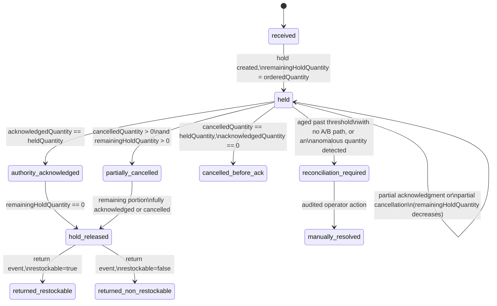

<!-- Proposed repository path: docs/audits/marketplace_p1_bulk_compliance_inventory_architecture_2026-08-21.md -->
<!-- AUDIT + IMPLEMENTATION PLAN ONLY. No code was modified to produce this document. Revision 3. -->

# Petsupo Marketplace P1 — Bulk Onboarding & Multi-Channel Inventory Architecture Audit (Revision 3)

**Date:** 2026-08-21
**Baseline commit:** `9238a528fcd267b6d24b3a589e94c93939d1cf3e` — "Secure Marketplace Add Product flow (P0)"
**Status:** AUDIT + PLAN ONLY. No implementation authorized. Nothing in this document has been built.

**This revision fixes 13 further correctness gaps in Revision 2**, several of which are not cosmetic: the timestamp-based hold-clearing rule could not actually prove an authority had incorporated a sale; the per-product `externalPendingHold` had no per-line lifecycle and could go negative under a race; and — most consequentially — the `canonicalProductId` Rules design as written would have **permanently locked every seller out of editing their own product** the first time the field was set, because `hasOnly()` checks the complete post-write document, not the write's diff. That same root cause is also a **latent, already-shipped defect in the P0 baseline** (§6), not just a P1 proposal — flagged prominently below, not buried.

> **Status update — added when this document was committed to the repository, 2026-08-21. Nothing below this box has been edited; it is Revision 3 verbatim, exactly as delivered in conversation.**
>
> - This entire document remains **architecture and design only**. Nothing it describes — no collection, field, Rule, Storage path, Cloud Function, or UI screen — has been implemented or deployed as of this commit.
> - The P0.1 prerequisite this revision identified in §6 (the latent `reservedStock`/server-owned-field Rules defect in the shipped P0 baseline) **has been resolved**, in a narrowly-scoped fix separate from this document, by commit `f2048cf25681d714ba562037604116ec42a80101` — "Fix server-owned product field protection (P0.1)," built on parent `9238a528fcd267b6d24b3a589e94c93939d1cf3e` (P0). That commit is the only implementation that has occurred since this audit was written; it did not touch any P1 collection, field, or feature named in this document.
> - The phase boundaries in §14 remain the governing scope split: **P1-A** is compliance documents/scopes/members, private Storage, admin review, audit events, and minimum expiry enforcement, plus only the minimal `businessInventoryPolicies` onboarding/default record — it contains no connector, no external event machinery, and no inventory-hub execution. **The Inventory Hub and the Trendyol connector are P1-C work and are explicitly not part of P1-A.** P1-B (bulk import) and P1-D (reconciliation/rollout) remain unstarted and out of scope for any P1-A work.
> - The open decisions in §15, and the additional P0-baseline finding in §6, remain unresolved and are carried forward into the P1-A implementation plan at `docs/plans/marketplace_p1a_compliance_review_implementation_plan_2026-08-21.md`.
> - **Field-level schema cross-reference (added 2026-08-21, during P1-A plan review).** Three specific details below were refined during P1-A implementation planning and are superseded in naming/precision by the plan document — the prose below is left as-is rather than rewritten, per this project's convention of correcting the plan rather than the architecture once a revision is settled: (1) §9's `complianceEvidenceRevision` field is renamed `evidenceRevision` in the plan, to match the exact field list used when P1-A was scoped; (2) §9's `complianceEffectiveStatus` enum (`compliant | expiring_soon | expired_grace | expired_blocked | evidence_missing`) is superseded by a larger, positive-first enum in the plan (led by `verified_valid`/`verified_expiring_soon` as the only states permitting checkout, with explicit fail-closed states for `calculating`/`stale`/`error`/`policy_unresolved`/`unreadable`/`unknown` added) — the state-machine *shape* here in §9 is still correct, only the exact value set is expanded; (3) §10's `normalizedBrandId` recommendation ("lowercase, trim, strip punctuation") is superseded by a versioned normalizer (Unicode normalization, locale-independent case folding, an explicit `normalizerVersion`, and — critically — a requirement that an *admin-verified* stable brand identifier, not the unreviewed normalized string alone, is what an approved brand scope actually matches against). See the plan document, §4/§9/§10 respectively, for the authoritative field-level detail.

---

## 1. Executive verdict

**P1-A is now ready for implementation planning**, with one addition to the pre-implementation checklist that did not exist before this revision: the P0 `reservedStock` protection mechanism (`productProtectedKeysUntouched()`) has the identical structural flaw this revision found in the proposed `canonicalProductId` design, and needs its own fix — independent of P1 — before the inventory module is ever enabled for any business, canary or otherwise (§6). Everything else in this revision strengthens or replaces a Revision 2 mechanism that was directionally right but not provably correct: hold-clearing now requires actual evidence, not a timestamp comparison; the hold aggregate is now a transactionally-maintained sum of auditable per-line records, not a lone counter; batch review now uses real per-item Firestore transactions instead of an unspecified "BulkWriter" atomicity claim; expiry enforcement now has an explicit, honest propagation-latency bound and a fail-closed checkout-time recheck instead of an implied instant global effect; and private-document delivery no longer relies on "nothing references the URL" as its security boundary.

---

## 2. Corrected model: evidence-based hold acknowledgment (item 1)

**What was wrong:** `snapshot.occurredAt >= order.occurredAt` proves only that a message arrived after another message's claimed timestamp — not that the snapshot's *content* incorporated that specific sale. Ingestion latency, clock skew, and eventual consistency all break this.

**Correction — a hold clears only via one of four proven mechanisms, never a timestamp comparison:**

| Mechanism | What proves incorporation | When available |
|---|---|---|
| **A. Explicit acknowledgment** | The authority's own event references the exact `externalOrderId`/`externalOrderLineId` it incorporated (`authorityAcknowledgment: {method:'A', evidenceRef}`) | Only if the authority's integration surfaces per-order acknowledgment (many ERPs do, since they themselves ingested the order) |
| **B. Coverage watermark** | The authority declares "all events from source X through cursor/sequence N are incorporated" — a guarantee about a *range*, not one order | Only if the authority's feed exposes its own per-channel ingestion cursor |
| **C. Audited reconciliation** | A human operator resolves it explicitly (`resolvedBy`, `resolvedAt`, `resolutionReason`, evidence attached), surfaced via `reconciliationRuns` once a hold ages past a threshold | Always available, as the universal fallback |
| **D. Same-source atomic delta** | The demand event and the authoritative delta are the *same message* — there is no separate snapshot to correlate against | Only when the authority and the demand source are the same connector operating in delta mode (§5) |

**Sources with no A/B capability at all:** every hold created against such a business's non-authoritative demand is permanently routed to mechanism C. This is not a temporary gap to be closed later — it is a real, ongoing operational cost proportional to that business's non-authoritative sales volume, and should be treated as a P1-C canary-eligibility criterion (don't canary a seller whose authority integration can't support A or B, or accept upfront that their reconciliation queue will carry a steady background load). A hold with no A/B path never auto-expires — it only ages and escalates priority in the reconciliation queue, because auto-expiring it would reopen the exact oversell window this design exists to close.

---

## 3. Corrected model: full per-line hold lifecycle (item 2)

**What was wrong:** a single aggregate `externalPendingHold` number on the product has no way to represent partial cancellation, partial acknowledgment, or a return arriving after the hold is already gone — and nothing prevented a race between cancellation and acknowledgment from driving it negative.

**Correction — one record per demand line, the product's aggregate becomes a transactionally-maintained derived sum, never the source of truth itself:**

```
externalDemandHolds/{holdId}      -- holdId deterministic: composite of
                                      (businessId, sellerListingId, externalOrderId, externalOrderLineId)
  businessId, sellerListingId, source, externalOrderId, externalOrderLineId,
  holdType: external_demand                    -- see §4 — never internal_reservation
  state: received | held | authority_acknowledged | hold_released |
         cancelled_before_ack | partially_cancelled |
         returned_restockable | returned_non_restockable |
         reconciliation_required | manually_resolved,
  orderedQuantity, heldQuantity, acknowledgedQuantity,
  cancelledQuantity, returnedQuantity,
  remainingHoldQuantity,           -- = heldQuantity - acknowledgedQuantity - cancelledQuantity, floored at 0,
                                       recomputed on every mutation, never independently set
  authorityAcknowledgment: { method: A|B|C|D, acknowledgedAt, evidenceRef } | null,
  createdAt, updatedAt, sourceSequence, occurredAt, receivedAt
```



**Every rule the user asked to be fixed explicitly, fixed by construction:**

- *Non-authoritative order creates a hold* — `received → held`, `heldQuantity = orderedQuantity`, product aggregate `+= orderedQuantity` in the **same transaction**.
- *Full cancellation before ack releases the hold* — `cancelledQuantity = heldQuantity`, `remainingHoldQuantity → 0`, `state → cancelled_before_ack`, aggregate `-=` the released amount in the same transaction. Nothing waits on the authority, because there is nothing left for the authority to ever incorporate.
- *Partial cancellation releases only the cancelled portion* — `cancelledQuantity += cancelledPortion`, `remainingHoldQuantity` recomputed, aggregate decremented by exactly that portion.
- *Acknowledgment clears only the acknowledged portion* — `acknowledgedQuantity += ackedPortion` (partial acks across multiple sync cycles are supported), `remainingHoldQuantity` recomputed accordingly.
- *A return after acknowledgment cannot incorrectly clear an already-gone hold* — return-handling is a **structurally separate mutation path** that never touches `heldQuantity`/`acknowledgedQuantity`/`cancelledQuantity`/`remainingHoldQuantity` at all; it only ever sets `returnedQuantity` and, if restockable, emits a signal awaiting the authority's own restock reflection. There is no code path by which a return could double-clear something already at zero, because it never writes to the fields that represent "zero."
- *A restockable return affects stock only through the authority's confirmed update* — same rule as every other stock mutation: only the authoritative source ever moves `stock`, symmetric to how the original sale was handled.
- *A non-restockable return never increases stock* — no code path for it does.
- *Duplicate cancellation/return is idempotent* — every event carries its own `sourceEventId`/`operationId`, checked before any mutation.
- *Racing cancellation and acknowledgment cannot produce a negative hold* — both mutate the **same** `externalDemandHolds/{holdId}` document via a Firestore transaction that checks `acknowledgedQuantity + cancelledQuantity <= heldQuantity` **against the current, transactionally-read state** before committing. Firestore serializes concurrent transactions on the same document via optimistic concurrency: whichever of the two commits second sees the *already-updated* state, and if applying its own delta on top would violate the guard, it is redirected to `reconciliation_required` instead of blindly applying — the guard is checked against live state, not a stale read, which is what actually prevents the negative value, not merely a stated intention.

**The product's `externalPendingHold` field is a transactionally-maintained aggregate, not the source of truth:** every `externalDemandHolds` mutation writes its exact delta to the product's `externalPendingHold` field **in the same Firestore transaction** (Firestore transactions support atomic multi-document writes; this is the same primitive `businessInventoryPolicies`' authority-switch commit already relies on). A periodic reconciliation check (part of `reconciliationRuns`) independently recomputes the true sum from all open `externalDemandHolds` for a product and compares it against the stored aggregate — a drift-detection safety net, not the primary correctness mechanism, which is the transactional write itself.

---

## 4. Formal invariant: no double holds for Petsupo orders (item 3)

- Internal Petsupo checkout/order events are represented **only** by `reservedStock` (the existing, untouched M3/M5 module) — this path never writes to `externalPendingHold` or `externalDemandHolds`.
- `externalPendingHold`/`externalDemandHolds` are used **only** for demand not already represented by a Petsupo reservation — external events never write to `reservedStock`.
- Every event carries `holdType: internal_reservation | external_demand`.
- **Formal invariant:** *no unit may simultaneously contribute to both `reservedStock` and `externalPendingHold` for the same demand line.* This holds not merely by convention but by **ID-namespace separation**: a Petsupo internal order ID (a Firestore auto-ID from the checkout flow) and an external order line identifier (always `source`-prefixed, e.g. `trendyol:12345:1`) are drawn from disjoint ID spaces by construction — there is no identifier that could simultaneously be looked up as both a reservation's demand line and an `externalDemandHolds` record's demand line, because the two code paths (the existing internal coordinators vs. the new external-demand-hold handler) never share an ID generator or a collection.

---

## 5. Corrected delta-mode behavior (item 4)

When the authority and the demand source are the same connector, in delta mode, a **single transaction** does all of the following, never two separate steps:

1. Check `operationId`/`sourceEventId` for duplicate — a replay returns `idempotent: true` and touches nothing further.
2. Check whether an `externalDemandHolds` record already exists for this exact `(externalOrderId, externalOrderLineId)` — this can happen if the same order was sighted earlier through a *different* non-authoritative integration path (Revision 2 §3's scenario D). If one exists, its `remainingHoldQuantity` is cleared via mechanism D in this same transaction.
3. Re-check `businessInventoryPolicies` transactionally to confirm this source is still the current authority, then apply the stock delta.
4. Write the `channelOrders` immutable event and the `externalDemandHolds` record directly in its terminal state (`authority_acknowledged`/`hold_released`) — no reader ever observes an intermediate "held but not yet acknowledged" state for this line, because none exists.

### Corrected numeric walkthroughs

**Snapshot authority** (ERP authority, snapshot mode; Trendyol sells 1)

| Step | stock | externalPendingHold | sellableAvailable |
|---|---|---|---|
| Start | 10 | 0 | 10 |
| Trendyol order (non-authority) → hold created | 10 | 1 | 9 |
| ERP snapshot explicitly acknowledges this line (mechanism A/B), stock set to 9 | **9** | **0** | 9 |

**Delta authority** (Trendyol is authority, delta mode)

| Step | stock | externalPendingHold |
|---|---|---|
| Start | 10 | 0 |
| Trendyol order arrives — single transaction applies delta AND records acknowledgment atomically | **9** | **0** (never incremented at all) |
| Same order redelivered (duplicate `operationId`) | 9 (unchanged, no-op) | 0 |

**Petsupo internal reservation** (unchanged M3/M5, shown for contrast)

| Step | stock | reservedStock | externalPendingHold |
|---|---|---|---|
| Start | 10 | 0 | 0 |
| Checkout reserves 1 | 10 | 1 | 0 — never touched, proving §4's invariant |
| Payment confirmed (`commitInventory`) | 9 | 0 | 0 |

**Cancellation before authority acknowledgment**

| Step | stock | externalPendingHold |
|---|---|---|
| Start | 10 | 0 |
| Trendyol order (non-authority), 1 unit → hold | 10 | 1 |
| Cancelled before any ERP ack → `cancelled_before_ack`, aggregate released | 10 | **0** |
| (ERP never sees this sale at all — nothing to reconcile) | 10 | 0 |

**Partial cancellation**

| Step | stock | externalPendingHold |
|---|---|---|
| Start | 10 | 0 |
| Trendyol order, 3 units (non-authority) → hold | 10 | 3 |
| Partial cancellation, 1 of 3, before ack → `partially_cancelled` | 10 | 2 |
| ERP snapshot later acknowledges the remaining 2 explicitly, stock set to 8 | **8** | **0** |

Every walkthrough ends with `stock` reflecting exactly the units genuinely sold, `externalPendingHold` at exactly the sum of still-open lines, and no step mutating `stock` more than once for the same sale.

---

## 6. Fixed `canonicalProductId` Rules semantics — and a latent P0 defect this exposes (item 5)

**What was wrong, precisely:** Firestore Rules' `request.resource.data` always represents the **complete document as it would exist after the write**, regardless of whether the client used `.set()` or a partial `.update()`. Revision 2 excluded `canonicalProductId` from `productAllowedFields()` entirely, meaning: the moment the Admin-SDK trigger sets it once, **any subsequent ordinary seller edit** (even one that never touches `canonicalProductId`) would have it present in the resulting document, and `hasOnly(productAllowedFields())` would then reject the *entire write*, permanently — the seller could never edit that product again.

### Corrected pattern, stated once and applied to every server-owned field

1. The field **is** included in `productAllowedFields()` (the closed-schema allowlist) — its mere presence in the resulting document must never itself fail `hasOnly()`.
2. **Create** rule: the field must be **omitted or explicitly `null`** — any non-null client-supplied value on create is rejected.
3. **Update** rule: the field's value must be **unchanged** — `incoming.X == existing.X`, checked against the complete resulting document, which correctly passes whether the client's write mentions the field at all (a plain `.update()` that never mentions it leaves it unchanged automatically) or tries to overwrite it (caught).
4. Only Admin SDK (a trigger or a narrow server operation) may set a different value — Rules are never evaluated for that write at all.

### Applied to `canonicalProductId` specifically

- Create: `!('canonicalProductId' in data) || data.canonicalProductId == null`.
- Update (all three of §5's Revision 2 narrow operations): `incoming.canonicalProductId == existing.canonicalProductId`.
- The `Product.empty()`/create-time Dart object always sends `canonicalProductId: null` explicitly (satisfying the "omit or null" rule via the null form), so `toJson()` always includes the key — no special-casing, no conspicuous absence.
- Barcode change (a compliance-material field, per §5 of Revision 2) already forces `updateProductComplianceIdentity`, which forces `pending_review`; the same `onWrite` trigger that computed the value on create re-fires on this update, recomputes from the new barcode, and writes the new value via a follow-up Admin-SDK write.
- Stale trigger invocations cannot overwrite a newer value: the trigger transactionally re-reads the document's **current** `barcode` at write time and only commits if its freshly-computed value still matches what that current barcode implies — a stale, out-of-order invocation harmlessly no-ops against a document a newer invocation has already updated.
- Direct client injection/change/removal all fail: a non-null value on create fails rule 2; a different value on update fails rule 3; a `.set()` (full replace) omitting the field is itself normally rejected by `hasOnly()`'s requirement that the write be a valid complete document per the schema (a `.set()` must still satisfy the create/update rule shape as applicable, so it cannot silently drop a required-present key without also being classified as attempting a different value than "unchanged").

### The same pattern, applied to every other server-owned field

`normalizedBrandId`, `externalPendingHold`, the inventory bookkeeping fields (`reservedStock`, `inventorySchemaVersion`, `inventoryOperationVersion`, `inventoryUpdatedAt`), and the new `reviewRevision`/`contentRevision`/`complianceEvidenceRevision` fields (§9, §10) all get: inclusion in `productAllowedFields()`, a create-time rule (omit/null for most; a fixed initial value like `0` for the revision counters), and an update-time unchanged-value check — never a blacklist-style "must be entirely absent" check.

### Critical corollary: this is also a latent, already-shipped P0 defect

`productProtectedKeysUntouched()` in the **currently deployed** `firestore.rules` uses exactly the broken shape: `!data.keys().hasAny(['reviewedBy','reviewedAt','rejectionReason','reservedStock','complianceStatus'])` — a check that the resulting document's key set does not *contain* any of these fields at all, not that their *values* are unchanged. Today this has never fired because the inventory module is disabled in production and nothing has ever set `reservedStock` on a real document. **The instant M3/M5 is enabled for even one canary business, the first `reserveInventory` call would set `reservedStock` on that business's product — and every subsequent ordinary seller edit to that product would then be rejected outright**, because `reservedStock` would now be *present* in `request.resource.data`, which `hasAny()` treats as a violation regardless of whether the seller's write changed it. This is not part of this P1 design — it is a defect in the **already-shipped P0 baseline**, exposed by applying the same reasoning the user asked me to apply to `canonicalProductId`. It needs the identical fix (`reservedStock` added to `productAllowedFields()`, blacklist-style absence check replaced with an unchanged-value check) applied to `firestore.rules` **before the inventory module is ever enabled for any business** — whether that happens as an immediate, narrowly-scoped hotfix or bundled into P1-A is a scheduling decision for the product owner (§13), not something this audit presumes to schedule unilaterally.

---

## 7. Replaced the undefined synchronous content classifier with a versioned content model (item 6)

**What was wrong:** presenting a synchronous keyword/category scan of `name`/`description` as a reliable legal-compliance gate overstates what a keyword match can prove. Category allowlisting is a different, and genuinely reliable, mechanism — it's a closed enumeration a seller can only select from, not a heuristic over free text — and that distinction was blurred in Revision 2.

**Corrected design:**

- The product's public-facing `name`/`description`/`media` remain exactly what was last **approved** — untouched by a pending content submission.
- A seller's content edit writes a single, bounded `pendingContent: {name, description, media, submittedBy, submittedAt}` map field directly on the product document — **not** a subcollection. Chosen deliberately as the smaller, safer design: a product can have at most one outstanding content proposal at a time (unlike `complianceDocumentScopes/members`, which genuinely needed unbounded storage for tens of thousands of SKUs, a single pending proposal is small and bounded, so a nested field is sufficient). If a full historical record of every past content revision (not just the current pending one) is ever required, promote to a `productContentRevisions` subcollection then — not preemptively.
- `approveContentRevision(productId)` (admin-only, narrow, new): a single transaction copies `pendingContent.{name,description,media}` into the public-facing fields, clears `pendingContent`, writes the audit trail, increments `contentRevision`. Atomic — no partial-apply window.
- `rejectContentRevision(productId, reason)`: clears `pendingContent` without ever touching the public-facing fields — rejected content is **never** written to a field a buyer can read, which is the strongest possible form of "rejected content never becomes public," not merely a policy statement.
- **`isActive` stays `true` throughout content review** — the listing remains purchasable showing the last-approved content; only the *specific pending fields* are gated, not availability. Compliance-material changes are unaffected by this section and still force immediate unpublication exactly as before.
- **Category allowlisting remains the hard, synchronous, comprehensive gate** — a seller cannot select "Health > Medicine" at all, full stop, a closed enumeration, not a probabilistic check. Any free-text keyword scan of submitted content (if used at all) is explicitly a **best-effort supplementary signal** that can route a submission to elevated-priority admin review — it is never presented as, or relied upon as, a sole synchronous accept/reject gate, and this document makes no claim that it comprehensively catches every prohibited claim.

---

## 8. Corrected batch-review transaction mechanics (item 7)

**What was wrong:** "batched via `BulkWriter`" does not provide the per-item atomicity (staleness check + product update + job-item update + audit event, all-or-nothing) the design actually requires — `BulkWriter` is a high-throughput write tool, not a transactional primitive.

**Corrected mechanism: one `db.runTransaction()` per product item, executed with bounded concurrency across items within a chunk — not `BulkWriter` for this step.**

- Client-set `updatedAt` is replaced as the staleness precondition by **two server-owned fields, used together**: `complianceReviewRevision` (an integer, incremented only by `updateProductComplianceIdentity` and product creation — deliberately *not* bumped by commercial edits, since a concurrent price change shouldn't invalidate a compliance decision) and `reviewSnapshotHash` (a SHA-256 digest of the canonical compliance-material fields at selection time) — both are checked; either one changing is sufficient to mark the item `skipped_stale`, giving defense in depth at negligible extra cost.
- Each product decision's single transaction does all four required writes atomically: verify `complianceReviewRevision`/`reviewSnapshotHash` still match; write the product's moderation-state change (via the narrow, admin-only `reviewProductDecision`); update the `productReviewJobs/{jobId}/items/{itemId}` status; create the `complianceReviewEvents` entry (broadened `targetType` to include `product`); create the `admin_logs` cross-reference. All four in one transaction means all four commit or **none** do — there is no state where a product is approved but its audit event is silently lost.
- **Chunk size and concurrency, based on transactions, not raw write count:** each item's transaction performs 4 writes + 2 reads; a chunk of roughly 100–150 items processed with bounded concurrency of roughly 10–20 simultaneous transactions keeps a single Cloud Task's wall-clock time well within typical execution limits without hotspotting any one collection — a starting point for empirical tuning, not a fixed law, since real throughput depends on infrastructure testing outside this audit's scope.
- **Retry safety:** because the entire 4-way write is one transaction gated on the item's current `status`, a Cloud Task retry (re-invoking the same chunk after a transient failure) naturally skips any item that already reached a terminal status in a prior attempt — retry-safety falls directly out of the same idempotency check already required for staleness handling, not a separate mechanism.

---

## 9. Corrected expiry enforcement — denormalized, honestly-bounded, fail-closed at checkout (item 8)

**What was wrong:** Firestore Rules cannot cheaply join a product read against an unbounded number of compliance documents/scopes at read time — each `get()` in a Rules evaluation has a real cost and a hard per-evaluation cap, and a product can be covered by an arbitrary number of scopes. The claim that expiry becomes "immediately effective" the moment `complianceDocuments.status` changes was too strong.

**Corrected design — denormalize, recompute via the existing pipeline, and revalidate for real at the one point that actually matters:**

```
products/{productId} gains:
  complianceEffectiveStatus: compliant | expiring_soon | expired_grace | expired_blocked | evidence_missing
  complianceValidUntil            -- earliest validUntil among currently-relied-upon approved evidence
  complianceEvidenceRevision: int -- server-owned, bumped every recompute
```

- **Sole writer:** `recomputeProductComplianceStatus`, triggered by the expiry scheduler, a scope/member status change, or a compliance-material product-field change (§10 defines exactly how it discovers what to recompute).
- **Honest propagation bound, stated explicitly rather than implied:** recomputation triggered by an event (a scope revoked, a product's brand changed) is near-immediate. Recomputation triggered by pure time passing (`validUntil` elapsing with nothing else changing) is only as fresh as the **last scheduler run** — this document does not claim instant global effect from a document's `status` field changing in isolation.
- **Rules/query implication:** the public read rule gains a third condition, `complianceEffectiveStatus in ['compliant','expiring_soon']`, alongside the existing `isActive`/`moderationStatus` checks — closing the race where the broader suspension cascade hasn't finished but the denormalized compliance field already has. Public list queries need the matching filter (and a corresponding index).
- **The load-bearing control is checkout-time revalidation, not the denormalized field:** the checkout Cloud Function (which already re-fetches the live product server-side, per the original P0 audit's finding) is extended to perform a **direct, targeted, real-time read** of the specific compliance documents this product's approval actually depends on (via `productEvidenceLinks` — a small, bounded set for any one product, unlike the Rules-time problem, because this is an ordinary server-side Cloud Function read, not a capped Rules `get()`), immediately before creating a reservation or confirming payment. This is the only check that actually enforces "no new checkout after expired evidence" — everything else is UX/defense-in-depth.
- **Both named races resolved:**
  - *Evidence expires between cart addition and checkout* — the checkout-time recheck, not the cart's stale view, is authoritative.
  - *Scheduler hasn't yet updated the denormalized state* — the checkout-time check does **not** trust `complianceEffectiveStatus` alone for this reason; it re-reads the live source documents directly, so a scheduler lag cannot let an expired product still check out.
- **Fail-closed:** if the checkout-time verification cannot complete (a transient read failure), checkout is rejected, not allowed through by default.
- **Grace period, decided per surface, not globally:**
  - Listing visibility: may honor a configured operational grace period (`expired_grace`).
  - New checkout: **none, ever** — the stated default safety principle.
  - Already-paid orders: unaffected retroactively.
  - Existing reservations not yet paid: the **commit/payment-confirmation step**, not just the initial reservation step, also re-runs the checkout-time compliance recheck — a reservation held before expiry does not get a free pass at the moment that actually matters (the sale completing).

---

## 10. Complete evidence-matching lookup design (item 9)

**What was wrong:** "an O(1) point read once `scopeId` is known" skipped the actual hard part — discovering *which* scopes apply across all seven scope types.

**Corrected design — a bounded, deterministic set of lookups per product, never a scan:**

| # | Scope type | Lookup | Kind |
|---|---|---|---|
| 1 | business | `complianceDocumentScopes` where `scopeType='business' ∧ scopeValue==businessId ∧ status='approved'` | Query |
| 2 | supplier | `scopeType='supplier' ∧ scopeValue==supplierId` (skipped if none declared) | Query |
| 3 | brand | `scopeType='brand' ∧ scopeValue==normalizedBrandId` | Query |
| 4 | category | `scopeType='category' ∧ scopeValue==categoryId` | Query |
| 5 | product_family | `scopeType='product_family' ∧ scopeValue==familyId` (skipped if none) | Query |
| 6 | direct product | `scopeType='product' ∧ scopeValue==productId` | Query |
| 7 | sku_set membership | `members/{memberId}` — up to 2 point reads (barcode and/or sku identity) | Point read |

**Total: at most 8 read operations per full recompute**, bounded and deterministic regardless of total system-wide scope/document count — never proportional to how many documents exist overall. A product may legitimately match multiple scopes simultaneously (e.g. a manufacturer authorization *and* separate importer evidence); all matching, approved results across lookups 1–7 are linked, not just the first found.

**Invalidation/recompute triggers:** a compliance-material field change (already forces `updateProductComplianceIdentity`, which already triggers recompute — no separate mechanism needed), a scope or member status transition (targeted re-trigger of only the products sharing that scope's key, found via query, not a full scan), or a document expiring (§9). A *wide* scope (e.g. business-wide, covering potentially thousands of a seller's products) fans out through the same chunked job pattern already used for bulk import/batch review — never a single synchronous trigger touching thousands of products.

**Member ID collision resistance, corrected:** `memberId = sha256(identifierType + ':' + canonicalNormalizedValue)`, the **full, untruncated, hex-encoded digest** — not a short hash. SHA-256's collision resistance makes this safe to use directly as a document ID. As cheap defense in depth, `identifierValue` (the original, un-hashed value) is also stored on the `members/{memberId}` document and verified to match after every point-read lookup before the match is trusted — belt-and-suspenders, adopted in full rather than choosing only one of the two options the correction offered.

---

## 11. Strengthened private-document delivery (item 10)

**What was wrong:** "no buyer-facing screen references the path" says nothing about whether a **Firebase Storage download token** — a persistent, unauthenticated, Rules-bypassing access mechanism, generated the moment anything ever calls `getDownloadURL()` (including a one-off manual Console action) — has ever been created for a file. Storage Rules cannot revoke a token that already exists; the two are entirely separate access paths.

**Corrected design:**

- **No `firebaseStorageDownloadTokens` metadata is ever generated** — enforced by never calling `getDownloadURL()` or its Admin-SDK equivalent for this prefix, in any code, ever, including documenting that manual Console inspection of these files should avoid the "generate access token" action.
- **The only access path is a dedicated, authenticated Cloud Function**, `getComplianceDocumentAccess(documentId)` (admin/owner-only), which never returns a persistent Storage URL. It issues a fresh **Google Cloud Storage V4 signed URL** (a genuinely time-limited, cryptographically-signed mechanism, distinct from a Firebase download token) expiring in 60–120 seconds, or — as a stricter fallback for especially sensitive document types — streams the file bytes back through the function's own response instead of issuing any URL at all.
- Authorization (`isBusinessOwner()`/admin role) is re-checked on **every** call, server-side, at issuance time — never cached.
- Every access issues an audit-log entry (who, when, which document).
- **Revocation:** because URLs are freshly minted and expire in ~2 minutes, stopping future issuance (e.g. flipping the document's status) is near-immediate for new access; an already-issued URL remains valid only until its short window elapses — a small, explicitly bounded residual window, not the unbounded one a persistent token would leave.
- `Cache-Control: private, no-store` on every response — no browser/CDN caching.
- The signed URL itself is never logged server-side, never passed to any analytics/crash-reporting SDK, and is redacted from any exception before it could reach a crash report — stated as an explicit implementation requirement, not an assumption.
- **Confirmed directly, as asked:** Storage Rules alone cannot revoke a previously-issued persistent Firebase download token — which is exactly why this design avoids ever creating one, rather than relying on Rules to gate an access path Rules don't actually govern.

---

## 12. Corrected authority-transition replay (item 11)

**What was wrong:** filtering replay to `occurredAt > effectiveAt` can silently drop an event that genuinely happened before cutover but didn't *arrive* until during the pause — exactly the kind of event a durable pause queue exists to protect, not discard.

**Corrected design — a durable, receive-ordered pause queue, never a source-timestamp filter:**

```
authorityTransitionPauseQueue/{businessId}/events/{eventId}
  receivedSequence            -- monotonic, assigned by Petsupo at ingestion, never by the source
  authorityPolicyVersionAtIngestion,
  rawEventPayload (or a reference),
  processingStatus: queued | replayed | reconciled_into_baseline | discarded_duplicate,
  replayDecision: nullable
```

- Every inbound event arriving while `businessInventoryPolicies.status != 'active'` is written here — including ones with a pre-cutover `occurredAt`, clock-skewed timestamps, or no reliable timestamp at all. `receivedSequence` is always trustworthy because Petsupo assigns it itself.
- When the baseline snapshot is taken (§2 of Revision 2's step 4), each queued event is explicitly checked against whether the new authority's own baseline data already reflects it — if so, `reconciled_into_baseline` (no replay needed, already accounted for); if not, `replay_as_new_policy_event` (processed after activation as an ordinary new-policy-version event).
- **No event ever reaches a terminal state of "silently dropped."** The only way to leave the queue without being replayed is `discarded_duplicate`, and only when proven so via `operationId` — never because of what its timestamp claims.

---

## 13. Corrected compliance/import retention distinction (item 12)

**What was wrong:** a generic TTL was implied broadly enough that it could have applied to *active, approved* compliance evidence — which must never expire out of storage merely on a clock, independent of its legal/audit relevance.

| Category | Retention |
|---|---|
| Active approved evidence | **No TTL while active** — retained as long as it's in use, full stop |
| Superseded evidence | Retained for the legally-required retention period of the transactions it once covered — long/indefinite, tied to order/financial retention, not a generic TTL |
| Revoked evidence | Same reasoning as superseded |
| Expired evidence | Same reasoning — it *was* effective for a period and may be needed for historical audit |
| Rejected upload (never approved) | Bounded (exact window open, §14) — a shorter audit tail, since it never became effective evidence |
| Import CSV source file | Short TTL (bounded, e.g. ~90 days) |
| Import raw rows | Short TTL, matching the source file |
| Audit metadata (job summaries, `complianceReviewEvents`, `admin_logs`) | Long/indefinite, unchanged |

**The corrected principle stated plainly:** a short, generic TTL applies **only** to import-pipeline artifacts. Nothing in the compliance-document lifecycle — active, superseded, revoked, or expired — is ever deleted by a blanket "N days after upload" timer; deletion of a compliance document's underlying file happens only through an explicit, deliberate process tied to its actual legal/audit retention period, which is itself one of the still-open decisions below.

---

## 14. P1-A scope discipline, confirmed (item 13)

Inventory connector processing, `externalPendingHold`/`externalDemandHolds`, authority-transition **execution**, and Trendyol event handling all remain P1-C, unchanged from Revision 2's boundary. P1-A creates only the minimal `businessInventoryPolicies/{businessId}` document (onboarding defaults, `manual`/`petsupo`, no transition workflow exercised — there is nothing to transition between yet, since no `channelConnections` exist in P1-A).

**Explicit check requested — does the P1-A schema lock P1-C into the flawed design? No.** The P1-A-created fields (`stockAuthorityType`, `authorityConnectionId`, `status`, `defaultSafetyStock`, `version`, `updatedBy`, `updatedAt`, `effectiveAt`) say nothing about *how* hold-clearing or replay works — those mechanisms live entirely in `externalDemandHolds` and `authorityTransitionPauseQueue`, both P1-C-only collections with no dependency back onto the P1-A schema's shape. This was verified, not assumed.

### Revised phase boundaries

- **P1-A** — compliance documents/scopes/members, private Storage with server-mediated access (§11), admin review UI, immutable audit, minimum expiry enforcement with denormalized `complianceEffectiveStatus` (§9), the versioned content-revision model (§7), the four narrow product-update operations including the corrected server-owned-field pattern (§6), `businessInventoryPolicies` onboarding defaults only, **and the P0 `reservedStock` Rules fix** (§6's corollary — timing is a product-owner decision, but it must land before P1-C, and arguably before any canary regardless of P1).
- **P1-B** — CSV-only import, exception workflow, scalable scope membership at real scale, job-based batch review with real per-item transactions (§8).
- **P1-C** — the full `businessInventoryPolicies` transition workflow exercised for the first time, `channelConnections`, `externalListings`, `externalDemandHolds`, `authorityTransitionPauseQueue`, Trendyol V2 canary, the complete deduplicated order/snapshot processing from §2–§5.
- **P1-D** — reconciliation dashboard, retry/dead-letter operations, connection health monitoring, controlled rollout.

---

## 15. Remaining open decisions

Carried forward, unresolved:
- Exact Turkish legal mapping of `sellerRelationship` → required `documentType`.
- Malware-scanning provider/implementation.
- Exact `canonicalProductId`/`normalizedBrandId` normalization algorithm.
- Exact initial file-size/row-count limits for import.
- Canary observation period.
- PDF preview strategy (in-app viewer vs. server-generated thumbnail).

New in this revision:
- **Scheduling of the P0 `reservedStock` Rules fix (§6)** — immediate, narrowly-scoped hotfix, or bundled into P1-A. This document does not presume an answer.
- Exact retention windows for rejected-upload evidence and import artifacts.
- Whether `expiring_soon` should still permit new checkout, or only `compliant` (this document defaults to requiring `compliant` for new checkout as the safer reading of "no grace period for new checkout," but the exact boundary of "expiring_soon" itself — how many days before `validUntil` — is unset).
- Signed-URL expiry window exact value (60–120s given as a range, not fixed).
- Batch-review chunk size/concurrency exact values (100–150 items, 10–20 concurrent transactions given as a starting point for empirical tuning, not fixed).

---

## 16. Final verdict

**P1-A is ready for implementation planning.** Every mechanism in this revision that Revision 2 asserted without proof now has either a worked numerical demonstration (the hold lifecycle, §2–§5), a stated structural guarantee (the authority-uniqueness invariant, the ID-namespace separation invariant), or an explicit, honest bound where perfect real-time consistency isn't achievable (expiry propagation latency, the pause-queue's reconciliation step). The one item that changes the pre-implementation checklist is not a P1 design flaw at all, but a latent defect in the already-shipped P0 baseline (§6) that this revision's own reasoning happened to expose — it must be scheduled and fixed before the inventory module is ever turned on for any business, and the product owner should decide when, not this document.

Nothing in this document has been implemented, committed, pushed, or deployed, and the proposed repository path has not been created.
