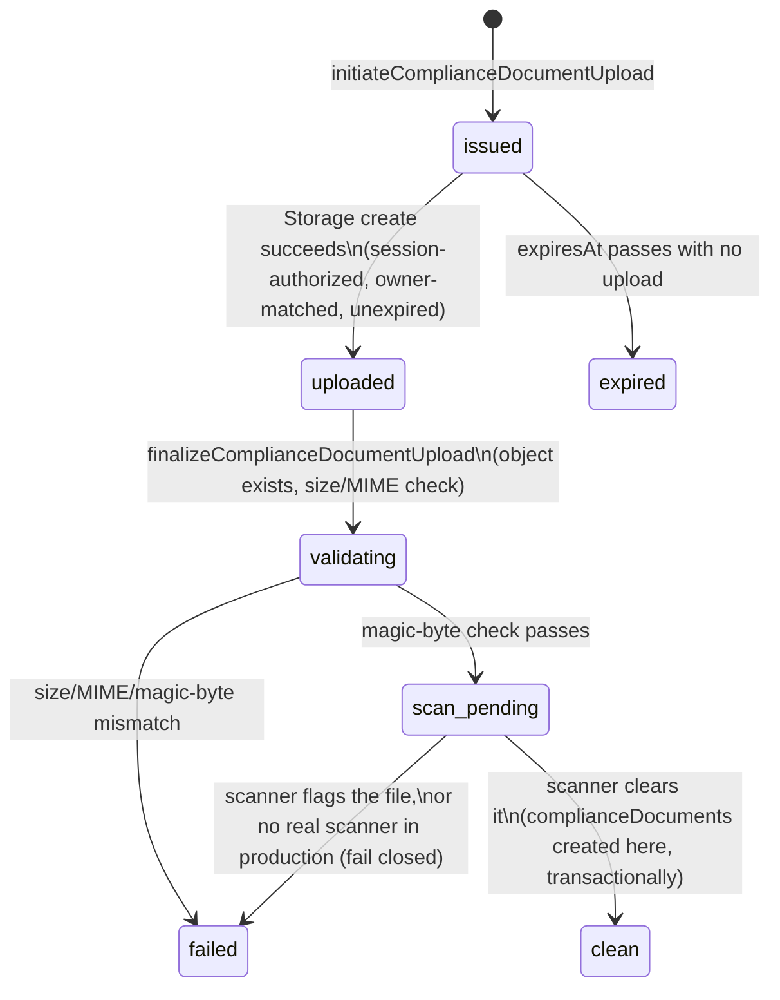
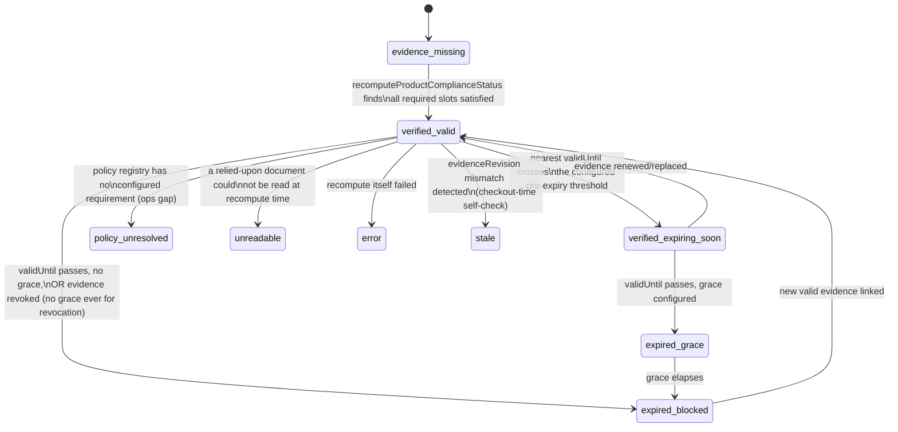

<!-- PLANNING DOCUMENT ONLY. No application code, Rules, indexes, Functions, or
     Flutter code were written to produce this plan. Nothing described here has
     been implemented or deployed. Revision 2 corrected 10 consistency defects
     found on review (see §0). Revision 3 (2026-08-25) replaces Slice 4's
     architecture with the corrected, adversarially-reviewed design (§0.1):
     server-mediated Marketplace eligibility, exact read/lookup ceilings, a
     fresh-per-request policy pointer, corrected approval enforcement, and
     sub-slices 4.1-4.9. Revision 4 (2026-08-25) completes Slice 4.1's own
     contract (§0.2): policy-version creation, empty-registry bootstrap,
     version-ID generation, an AND-of-OR requirement-group model, a single
     authoritative full-document validator reused at every trust boundary,
     and retraction of the version-content caching permission Revision 3 had
     granted, which was inconsistent with the bypass-write threat model
     Revision 4 itself establishes. Revision 5 (2026-08-25) adds Slice 4.2's
     missing dormant-compatibility contract (§0.3): a live-write audit found
     that today's Add Product create AND edit path never sends
     productInputRevision and performs a full-document overwrite with no
     merge, so a strict-presence Rule would break the current seller flow
     immediately, not just at some future edge case. Revision 5 defines the
     exact two-phase (Slice 4.2 dormant / Slice 4.9 strict) transitional
     contract this requires, without weakening the final invariant. Revision
     6 (2026-08-25) freezes Slice 4.3's complete matching/index/link
     contract (§0.4): a contract-resolution audit found the productEvidenceLinks
     schema disagreed with the already-shipped complianceConstants.js
     constant, the complianceDocumentScopes composite indexes the frozen
     matching algorithm requires were never declared, and the §13.1/§16
     sub-slice dependency columns disagreed with each other. Revision 6
     resolves all three, plus corrects §9's factually-incorrect claim of an
     explicit Rules-closure for compliancePolicyRegistryPointer and
     businessComplianceEpochs. Revision 7 (2026-08-25) freezes the
     product-level sellerRelationship architecture a second contract-
     resolution audit found missing (§0.5): §4/§5.5's "product's declared
     relationship" language assumed an input nothing produced —
     sellerRelationship existed only on complianceDocuments (seller-
     declared, document-level, immutable) with no product, business, or
     scope field ever resolving which relationship governs a given
     product's policy. Revision 7 adds a seller-declared product field,
     denormalizes relationship onto complianceDocumentScopes at scope-
     creation time, relationship-filters all seven Slice 4.3 candidate
     queries before their limit(3), adds source-document relationship/
     tenant/expiry verification at the already-budgeted matched-scope
     resolution step, integrates sellerRelationship into the
     productInputRevision matching-field set and the Slice 4.2 dormant
     transitional matrix, and freezes an explicit dormant-to-strict
     rollout sequence that never guesses or backfills an existing
     product's relationship. Slice 1-4.2 records remain historical and
     unchanged throughout; the Revision 6 productEvidenceLinks/index/
     dependency corrections are extended, not reopened. Revision 8
     (2026-08-25) resolves a genuine textual contradiction a final
     independent review found in §9 (§0.6): a table headed
     "sellerRelationship's own dormant create/update contract" stated an
     update-only adoption rule (existing absent -> baseline 0, so incoming
     productInputRevision must be 1) that, if its own heading were taken
     literally as covering create, directly contradicted the separate,
     unconditional productInputRevision create table (absent or exactly 0
     only, 1 always rejected). Revision 8 resolves this in favor of the
     create table's unconditional reading -- the reading the already-
     uncommitted firestore.rules/marketplaceProductRules.test.js Slice 4.2
     correction already implements and tests -- by splitting §9 into an
     explicitly separate create contract (§9.B, governing both fields
     independently, no delta ever computed) and an explicitly retitled,
     existing-document-only update contract (§9.C). No code or test change
     is required; this is documentation-only. Revision 9 (2026-08-25)
     resolves four defects a Slice 4.3 adversarial review found in the
     (uncommitted) matching engine (§0.7): MATCHED_SCOPE_CAP's global
     approvedAt/documentId truncation could starve a required evidence
     slot of its only candidate; truncation had no admin-visible audit
     trail despite the plan requiring one; a product's sellerRelationship
     could change while productInputRevision stayed absent under the
     already-committed dormant Rules, leaving an old decision falsely
     fresh; and decisionHash canonicalization was never frozen by the
     plan at all. Revision 9 replaces the global-cap language with a
     coverage-first/extras algorithm (§10), denormalizes documentType/
     validUntil onto complianceDocumentScopes (§4, a third prerequisite
     Slice 3 corrective sub-pass, §13.1), adds sellerRelationshipSnapshot
     to productComplianceDecisions (§4/§10.1), freezes the truncation
     complianceReviewEvents contract using only already-reserved,
     already-shipped enum values (§10), and freezes the decisionHash
     canonicalization contract (§4). The ≤8-operation/≤42-read bound is
     unchanged. Documentation-only; none of Slice 4.3's eight uncommitted
     files are touched by this revision — they are corrected in a
     separate, subsequent implementation task once this update lands.
     Revision 10 (2026-08-26) resolves two defects an independent
     adversarial audit found in the (uncommitted) Slice 4.4 implementation
     (§0.8): `evaluateLiveProductEligibility`/`resolveActivePolicy` are
     called entirely outside `reviewProductModeration`'s own approval
     transaction, so a product can be approved against an eligibility
     result already stale by commit time (reproduced directly against
     five independent freshness inputs); and the plan never resolved
     whether an already-approved idempotent replay must re-verify live
     eligibility, nor whether its response could be misread as a live-
     eligibility claim rather than stored moderation state. Revision 10
     freezes an additive, transaction-aware read contract for both shared
     readers, a per-attempt clock rule, the exact approval transaction
     sequence, and the exact already-approved replay response and
     semantics — documentation-only; none of Slice 4.4's three uncommitted
     files are touched by this revision. Revision 11 (2026-08-26) resolves
     two blockers an independent, read-only Slice 4.5 preflight found before
     any Slice 4.5 code was written (§0.9): the plan required cursor-based
     pagination for `getMarketplaceProductList`/`getMarketplaceProductDetail`
     without ever naming the field candidates are ordered/cursored on, and
     required "App Check"/"rate limits" without any mechanism, threshold, or
     enforcement decision — while the live codebase leaves App Check
     disabled everywhere and has no rate-limiting precedent compatible with
     an unauthenticated caller. Revision 11 freezes an exact document-path
     ordering and opaque-cursor contract, an exact bounded-scan/response
     contract, and explicitly defers App Check enforcement and rate
     limiting to separate, later-authorized activation prerequisites —
     documentation-only; Slice 4.5 remains unimplemented and its feature
     flag remains unactivatable until those prerequisites land. Revision 12
     (2026-08-26) resolves two further blockers a subsequent Slice 4.5
     implementation attempt correctly hard-stopped on before writing any
     code (§0.10): the plan described the public response only by a
     negative exclusion list ("the plan's existing product projection,
     unchanged") with no positive, enumerated field allowlist, and
     required an "indistinguishable" detail absence outcome without
     ever freezing what that one outcome actually is. Revision 12 freezes
     an exact positive public-product projection (one shared shape for
     both list items and the detail item, sourced from the live
     `lib/models/product.dart` schema and its actual customer-facing
     consumers), an exact detail request/absence/internal-error contract,
     and exact list per-candidate/whole-query error semantics —
     documentation-only; `marketplaceListing.js` still does not exist and
     is not created by this revision. -->

# Petsupo Marketplace P1-A — Compliance & Review Foundation: Implementation Plan (Revision 40)

**Date:** 2026-08-21 (Revision 2). **Revision 3:** 2026-08-25 — Slice 4 architecture corrected; see §0.1. **Revision 4:** 2026-08-25 — Slice 4.1 contract completed; see §0.2. **Revision 5:** 2026-08-25 — Slice 4.2 dormant-compatibility contract added; see §0.3. **Revision 6:** 2026-08-25 — Slice 4.3 matching/index/link contract frozen; see §0.4. **Revision 7:** 2026-08-25 — product-level sellerRelationship architecture frozen; see §0.5. **Revision 8:** 2026-08-25 — create/update contract heading contradiction resolved, documentation-only; see §0.6. **Revision 9:** 2026-08-25 — Slice 4.3 cap-selection/truncation-event/relationship-freshness/decisionHash contract resolution, documentation-only; see §0.7. **Revision 10:** 2026-08-26 — Slice 4.4 transactional-eligibility TOCTOU/replay-ambiguity contract resolution, documentation-only; see §0.8. **Revision 11:** 2026-08-26 — Slice 4.5 deterministic ordering/cursor contract frozen, App Check/rate-limit enforcement deferred to a separate activation prerequisite, documentation-only; see §0.9. **Revision 12:** 2026-08-26 — Slice 4.5 exact public-product projection and detail/list error contract frozen, documentation-only; see §0.10. **Revision 13:** 2026-08-27 — `requiredDocumentTypeGroups` Firestore-nested-array incompatibility resolved (wrapped-object schema), documentation-only; see §0.11. **Revision 14:** 2026-08-28 — Slice 4.7 `productEvidenceLinks` writer ownership reconciled (already Slice 4.3's completed work) and the remaining recompute-sweep contract frozen, documentation-only; see §0.12. **Revision 15:** 2026-08-28 — independent Slice 4.7 implementation review findings resolved: a fourth, test-only file-scope touchpoint authorized (`complianceMatching.test.js`'s stale O1 regression guard), and an inaccurate "isActive/moderationStatus re-read" explanatory sentence corrected; documentation-only; see §0.13. **Revision 16:** 2026-08-29 — a Slice 4.8 implementation preflight found a stale product-document compliance-schema premise (§4/§9/§11 described compliance state as denormalized onto the product document; the committed Slice 4.3 architecture stores it exclusively in `productComplianceDecisions/{productId}` and never writes those fields to any product document); the product/compliance schema is corrected everywhere it was stale, Slice 4.8's exact create/edit write semantics, file scope, and Dart/API model contracts are frozen, the dormant-safe/activation-gated split is clarified, and a new sequential §15 test range (403-461) is added; documentation-only; see §0.14. **Revision 17:** 2026-08-27 — Product Identity/SKU-reuse security gap identified, three mitigation options named, and a new Marketplace-activation NO-GO gate frozen pending mitigation selection, documentation-only; see §0.15. **Revision 18:** 2026-08-27 — Slice 4.8 Phase A localization/file-scope correction, nine ARB/generated localization files named exactly, documentation-only; see §0.16. **Revision 19:** 2026-08-28 — corrected Option-A product-identity mitigation selected and frozen (SKU immutability + server-authoritative `deleteMarketplaceProduct` deletion, Slice 4.10), documentation-only; see §0.17. **Revision 20:** 2026-08-28 — Firestore server-transaction concurrency-proof correction for Slice 4.10 item 506 (pessimistic-locking contract corrected in place); item 506 and item 510 were, at that time (2026-08-28), still open — both were subsequently implemented and committed the next day by `2a5c061`, see §0.18's later-status clarification and §0.21 — documentation-only; see §0.18. **Revision 21:** 2026-08-29 — Türkiye Marketplace legal-policy and licensing research/contract added (new §21), replacing the prior vague "external production blocker" framing with a sourced, mechanically testable category matrix, a frozen absolute live-animal-sale prohibition (a Petsupo business decision, independent of the underlying legal minimum), fail-closed classification/evidence rules, a legal-counsel handoff, and an independent legal-policy GO/NO-GO gate; a new sequential §15 test range (526-551) is added; documentation-only, no code/Rules/index/localization/Flutter/Functions file touched; see §0.19. **Revision 22:** 2026-08-29 — the committed Turkish legal-counsel handoff document (§21.9, `docs/legal/petsupo_marketplace_turkey_legal_counsel_handoff_2026-08-29_tr.md`, commit `88506bfd537dab4e4a34b27eeb604f06da5f1b17`) is confirmed sent externally to counsel; external status is recorded as COUNSEL RESPONSE PENDING; every §21.9 question remains open and §21.7's independent legal-policy activation gate remains NO-GO; documentation-only, no code/Rules/index/localization/Flutter/Functions file touched; see §0.20. **Revision 23:** 2026-08-29 — corrects the now-stale Revision 20 current-state claim about Slice 4.10 items 506/510 (both were implemented and committed by `2a5c061` the day after Revision 20 was authored, without Revision 20's own historical narrative being rewritten), freezes an exact mechanical boundary distinguishing local implementation/testing, step 21c's own review (which remains pending the 21a inventory), Rules deployment (21d), and production activation for the authoritative media-cap Rules prerequisite, retracts any unqualified "cannot regress live behavior" claim about that same prerequisite, and expands the future-counsel-response process rule with an explicit authenticity/provenance requirement; documentation-only, no code/Rules/index/localization/Flutter/Functions file touched; counsel status remains COUNSEL RESPONSE PENDING; see §0.21. **Revision 24:** 2026-08-29 — closes §17 step 21a's own outstanding specification gap by completing the media-compatibility readiness-inventory contract (entry-validation scope decided, aggregate/item-level output and privacy contract, read-failure/retry policy, future tool/test file scope, mandatory execution safety guards); a closing independent audit found and corrected in place two further gaps — an exact resume project-binding rule closing a mixed-project-resume ambiguity, and a corrected non-emulator confirmation policy retiring a spoofable demo/CI project-name heuristic in favor of requiring `--confirm-production` for every non-emulator project — with a new §15 test range, items 560-594 (35 items); the already-frozen five-category classification, pagination, checkpoint, durable-run-result, and snapshot-honesty contracts (§10.1, Revision 12) are not reopened; the inventory itself is not implemented or run by this revision; documentation-only, no code/Rules/index/localization/Flutter/Functions file touched; counsel status remains COUNSEL RESPONSE PENDING; see §0.22. **Revision 25:** 2026-08-29 — resolves the last two intentionally-deferred implementation prerequisites for the §17 step 21a media-compatibility readiness inventory: an exact local operational-store/checkpoint design (atomic per-page journal files as the authoritative committed record, an atomically-replaced checkpoint, a single-writer exclusive lock, and a regenerable, never-incrementally-appended NDJSON view) and an exact human-readable Markdown summary format containing only already-authorized aggregate fields; a full crash-consistency state-transition table proves no gap and no duplicate committed violation entry is possible after a restart from any crash boundary; a closing independent audit found and corrected in place five further gaps — per-artifact symlink/TOCTOU safety with an explicit macOS/Linux-only platform scope, ownership-token-verified lock release, an fsync-inclusive atomic-write protocol distinguishing process-crash from host-power-loss durability, a complete page-journal validation contract before any fast-path trust, and an explicit resume/checkpoint-read ordering statement; a second, post-correction closing independent verification found and corrected two further gaps — a stale "16-rule" cross-reference corrected to "18-rule," and a new "Full pairwise journal-chain continuity, exact" nine-rule subsection proving cursor continuity across the entire chain of already-committed journals, not only at the checkpoint's own edge — with a new §15 test range, items 595-666 (72 items); a third, post-correction closing independent verification then found and corrected two further gaps in that same journal-chain contract — an unimplementable "checkpoint-carried aggregate" comparison in the chain contract's own rule 5, corrected by narrowing rule 5 to exactly the two checkpoint fields that actually exist and adding an explicit checkpoint/journal/summary responsibility boundary (checkpoint holds operational state only; aggregate totals are always recomputed from the validated journal chain; item 663 rewritten to match), and a clarification of individual-journal rule 18's own phrasing to remove an apparent off-by-count ambiguity without changing its 18-rule count or numbering; a fourth, post-correction closing independent verification then found one further, high-severity gap — Revision 12's own literal four-key "Portable checkpoint" (`{v, lastPath, examinedCount, violationCount}`, independently re-tested by items 219/237, and explicitly inherited unchanged by Revision 24 for this exact tool) was never reconciled against Revision 25's own structurally different checkpoint schema — corrected by a new, narrow "Revision 25 checkpoint-schema supersession, exact" contract (superseding only the literal four-key physical shape, only for `functions/scripts/mediaCompatibilityReadinessInventory.js`, with an exact legacy-to-current semantic mapping and non-renumbering supersession annotations on items 219/237), with a new §15 test range, items 595-678 (84 items); Revision 24's five-category classification, project-binding, non-emulator confirmation policy, privacy rules, 500-document pagination, retry policy, and every dependency-chain status are unchanged and not reopened; the tool remains unimplemented and unexecuted; documentation-only, no code/Rules/index/localization/Flutter/Functions file touched; counsel status remains COUNSEL RESPONSE PENDING; see §0.23. **Revision 26:** 2026-08-30 — a Marketplace seller-activation gate source audit found no existing field's semantics already mean "Marketplace seller activation" (the closest candidates, business `status`/`published` and `verification.isVerified`, are general business-approval/identity-verification concepts already serving other purposes; reusing either would make every already-`status`-approved business immediately Marketplace-write-eligible the moment it self-selects `pet_shop` as an additional sector, reproducing the exact reachability risk that blocked step 21d); this revision freezes a new, fail-closed, server-authoritative `businesses/{businessId}.marketplaceSellerActivation` schema and Rules contract, a new mandatory prerequisite step 21c2 (inserted between existing steps 21c and 21d, without renumbering 21d-21p), admin-only grant/revoke operation contracts, client defense-in-depth requirements, a combined-Rules-deployment sequencing decision (media-cap and seller-activation predicates deploy together, one production `firestore:rules` push), and a new sequential §15 test range, items 679-730 (52 items); a closing independent audit found and corrected in place two BLOCKING gaps — a non-atomic grant/revoke operation contract, corrected to an explicit single-Firestore-transaction design with a frozen idempotency and concurrent-resolution contract; and §17 step 21e's own operative text never having been expanded to cover `marketplaceSellerActivation` writers despite §10.1 asserting it already did, corrected by editing step 21e's own text directly and freezing an implementation-before-audit ordering rule — plus several smaller precision gaps (an explicit named Rules helper replacing prose-only fail-closed language, inline schema annotations for UID provenance and re-grant-overwrite behavior, a confirmed no-new-file typed-model boundary, and the exact pending disposition string `SELLER-ACTIVATION GATE REQUIRED — STEP 21D RULES DEPLOYMENT BLOCKED`); this closing correction also freezes a new §21.12 accelerated "LOW-RISK PETSHOP ESSENTIALS PILOT" commercial scope, narrower than and subordinate to §21's existing category matrix, letting B2B recruitment begin immediately while seller activation and publication remain blocked until the compatible client release; with a further §15 test range, items 731-754 (24 items); a subsequent implementation attempt then correctly stopped before editing on finding §13.1 named no admin-facing UI file at all, and this is corrected by naming a new `lib/ui/admin/business_marketplace_activation_section.dart` (production) and `test/ui/admin/business_marketplace_activation_section_test.dart` (test), wired into the existing `business_admin_detail_page.dart` without modifying the unrelated, status-workflow-scoped `business_admin_actions.dart`, with an explicit "Admin UI boundary, exact" contract (§10.1) and a further §15 test range, items 755-769 (15 items); documentation-only, no code/Rules/index/localization/Flutter/Functions file touched; counsel status remains COUNSEL RESPONSE PENDING; see §0.24. **Revision 27:** 2026-08-31 — records, as a documentation-only production-status reconciliation, the separately-authorized and already-completed Step 21d (Firestore Rules containing both the media-cap and seller-activation predicates deployed on 2026-08-30 and independently verified byte-identical to the audited candidate, effective SHA-256 `202e33c05083dce22da7c5decc7d553f65a39a01f47133e4f6655df2600d17cb`, alongside the two admin-only `grantMarketplaceSellerActivation`/`revokeMarketplaceSellerActivation` operations deployed and confirmed ACTIVE in `europe-west3`, neither ever invoked), Step 21e (a complete Admin/Functions writer audit disposed `STEP 21E ADMIN/FUNCTIONS WRITER AUDIT — PASS, COMPLETE`, after finding and correcting exactly one blocking writer — `migrateAdoptionCentersToBusinesses`'s full non-merge destination write, corrected by commit `15411198347e2a9e00c16ddd18cac090da94b8c8` ("Prevent migration from mutating seller activation") to exclude the source field before spreading and to write the destination with merge semantics, verified by 14/14 focused migration tests and 32/32 activation-preservation tests, then deployed and re-audited clean), and Step 21f (a complete post-Rules readiness traversal, runId `run-9340151119433e8895`, disposed `STEP 21F POST-RULES INVENTORY — COMPLETE, ZERO VIOLATIONS` against a natural empty-set production snapshot); §17 steps 21d/21e/21f each gain an inline, clearly labeled status-update sentence recording this completion without altering their own original operative text; a new §15 test range, items 770-779 (10 items), verifies the plan's own documentation of this evidence rather than re-testing already-tested code; **also closes a separate, latent inconsistency in step 21a's own §17 text, which still literally stated the inventory tool "remains unimplemented" and "has not been executed against any environment" despite Revision 26's own §20 text already treating step 21a's `COMPLETE BY NATURAL EMPTY-SET EXHAUSTION` status as established — corrected by appending an inline status update to step 21a's own text recording that the tool is implemented, tested, committed, and pushed, and that both the initial pre-Rules production canary (runId `run-8a2a8499feb4b4fe27`) and the post-Rules Step 21f traversal (runId `run-9340151119433e8895`) independently completed by natural empty-set exhaustion, with a further single test item, 780, appended after 779**; documentation-only, no code/Rules/index/localization/Flutter/Functions file touched by this revision itself (the implementation/deployment/audit work it records was performed and separately committed/deployed by its own already-authorized tasks); both `PRODUCT_MODERATION_REVIEW_ENABLED` and `MARKETPLACE_LISTING_ENABLED` remain explicitly disabled; no seller is activated and no Marketplace product is published; §21's legal-policy gate, Phase B, and every other unmet activation prerequisite (21g-21p) remain exactly as blocked as before; counsel status remains COUNSEL RESPONSE PENDING; see §0.25. **Revision 28:** 2026-08-31 — freezes a new, narrow, admin-only, individually-scoped **Pilot Product Approval contract** (a new `products/{productId}.pilotProductApproval` state object, mirroring `marketplaceSellerActivation`'s own embedded, fail-closed pattern) that lets one specifically reviewed §21.12 low-risk product become customer-visible without enabling `PRODUCT_MODERATION_REVIEW_ENABLED`, `MARKETPLACE_LISTING_ENABLED`, or relying on the never-built §0.17 Phase 15 SKU-orphan readiness inventory; resolves the source-verified gap that no current code path ever sets a product's `isActive` to `true`, and closes §10.1's own previously-explicit "left unresolved... must be decided separately before any seller is ever activated" open item on seller-revocation product cascade; a new §17 step **21d2** is inserted between 21d and 21e (21e-21p not renumbered); §13.1 gains this contract's own not-yet-implemented file scope; a new sequential §15 test range, items 781-816 (36 items); **a closing independent review, performed before commit, found and corrected in place a genuine client-immutability/self-revocation contradiction (resolved by a new, narrow, seller-authorized `unpublishPilotProductForRevision` operation), an under-inclusive content-binding field set, an ambiguous `revokedBy` actor field, an imprecise concurrency-limit mechanism (corrected to a transactionally-maintained counter), and a deferred admin-UI file scope (now named exactly) — with a further §15 test range, items 817-831 (15 items)**; **a second, final closing review then found and corrected an unsatisfiable `moderationStatus` visibility condition (no path ever wrote it), a missing product-deletion counter/audit integration (`deleteMarketplaceProduct`, already deployed), and a missing account-deletion product-deactivation cascade (already deployed, orphaning active pilot products) — closed via a shared `deactivateAllPilotProducts` helper reused by both cascade call sites, plus a matching defensive extension to `mapAdoptionCenterToBusiness`, with a further §15 test range, items 832-856 (25 items)**; **a third closing review — limited to account/business-deletion race, moderation test-scope, and cross-operation serialization questions — then found and corrected in place a genuine, BLOCKING race left open by the second closing review's own fix (a live window between the account-deletion cascade's separate deactivation transaction and its own subsequent, non-atomic business-document delete, during which a concurrent `approvePilotProduct` could republish a product moments before its business is deleted), corrected by merging deactivation and deletion into one Firestore transaction (rejecting a new lifecycle-fence field as unnecessarily broad, since Firestore's own read-set conflict detection on the shared business document already provides the needed serialization once merged); a second, previously-unexamined deletion entry point — a business owner's own direct, Rules-permitted (`isCanonicalBusinessOwner`), client-side business-document delete, which bypasses the account-deletion flow, and therefore the merged-transaction fix, entirely — closed by a new safety-net `deactivatePilotProductsOnBusinessDeleted` trigger, the writer allowlist's sixth authorized writer; a missing business-existence fail-closed guard in `approvePilotProduct` (added, mirroring `grantMarketplaceSellerActivation`/`revokeMarketplaceSellerActivation`'s own already-deployed pattern); an already-existing `functions/test/productModeration.test.js` omitted from every prior draft's file scope (added, with pilot-isolation coverage named exactly); and a narrow business-ID-reuse admin-UI resurrection concern (closed by an admin-list query exclusion) — with a further §15 test range, items 857-880 (24 items)**; **a fourth, final closing review — limited to direct-client-delete immediate safety, the safety-net trigger's own asynchronous-delivery truthfulness, business-ID reuse, and backend-versus-UI enforcement authority — then found and corrected in place two further genuine gaps, without reopening any of the first, second, or third closing reviews' own twelve prior corrections: the third closing review's own trigger-based fix for direct client business deletion was truthfully disclosed as eventually-consistent but was still cited (item 876) as jointly providing the same immediate guarantee the merged account-deletion transaction alone provides — corrected by a new, narrow, Rules-level `pilotActiveProductCount == 0` precondition on the owner-initiated branch of the existing business-delete rule, giving the direct-delete path a genuine, synchronous, immediate guarantee, with the trigger retained honestly as eventual defense-in-depth only; and the third closing review's own business-ID-reuse mitigation (an admin-list `reasonCode` filter) was reclassified as presentation-only, replaced as the authoritative fix by a new, server-generated, immutable `businesses/{businessId}.marketplaceBusinessGenerationId`, bound to every new product at create time (Rules-enforced) and re-verified at approval time (`approvePilotProduct`'s own transaction) — this same review also corrected a factual error in the third closing review's own text, which had incorrectly claimed ordinary business creation uses random Firestore auto-generated IDs, when direct source reading found business documents are actually keyed by the owner's own Firebase Auth `uid`, making same-user business-ID reuse an ordinary flow, not a rare edge case — with a further §15 test range, items 881-907 (27 items)**; **a fifth, final closing review — limited to Firestore Rules paths available to authenticated admin users through the client SDK — then found and corrected in place a genuine BLOCKING gap the fourth closing review's own owner-branch-only delete precondition had left open: the `isAdmin()` branch of `match /businesses/{businessId}`'s `allow delete` rule remained completely unconditional, so an authenticated admin using the Firebase client SDK (not the Admin SDK, not any controlled backend deletion Function) could still delete a business with `pilotActiveProductCount > 0` freely — corrected by AND-ing `businessHasNoActivePilotProducts(businessId)` onto both authorization branches, not the owner branch alone; direct re-reading of `firestore.rules` also found `allow create`/`allow update` on the same match block bypass their own protected-key/diff checks entirely on the `isAdmin()` branch, including for the **already-deployed, pre-Revision-28** `marketplaceSellerActivation` field, not only this contract's own two new fields — corrected by two new, narrow, admin-inclusive guards (`omitsMarketplacePilotServerOwnedFields()` on create, `businessUpdatePreservesMarketplacePilotFields()` on update), deliberately leaving every other admin business-administration capability (`status`, `published`, `verification`, `trust`, `riskFlags`, `createdAt`) completely unconstrained; a further correction narrowed the "unconditionally... on every new business document" generation-ID stamping claim to the one known server-side `CREATE BUSINESS (PENDING)` path specifically, since neither client-SDK create path (owner self-registration, admin-via-client-SDK) can safely mint a server-authoritative value, relying instead on `grantMarketplaceSellerActivation`'s own already-frozen initialization-if-absent step as the universal safety net — with a further §15 test range, items 908-934 (27 items)**; **a sixth, final independent verification pass then found the writer-allowlist table itself had never gained a row for `marketplaceBusinessGenerationId`, despite the field being governed by prose throughout the fourth and fifth closing reviews — corrected by adding the row (its exactly two authorized writers, its complete forbidden-writer boundary) and two directly-dependent cross-references (the table's own following writer-audit sentence, §17 step 21d2's own writer-audit requirement), with one further test item, 935, appended**; documentation-only, no code/Rules/index/localization/Flutter/Functions file touched; both feature flags remain disabled; no seller activated, no product published; counsel status remains COUNSEL RESPONSE PENDING; see §0.26. **Revision 29:** 2026-08-31 — freezes the explicit, no-exception architecture decision that admin status may broaden Firebase client-SDK *authorization* (who may select and act on a product) but never waives Marketplace product-document *integrity*: **every** client-SDK actor, admin included, must satisfy **every** schema, lifecycle, size, identity, business-binding, generation-binding, seller-activation, approval-staleness, and publication-integrity requirement, with **no admin exception of any kind**; supersedes §10.1's own pre-existing "Admin bypass, stated accurately" text (which had permitted a narrow seller-activation-gate/media-cap admin carve-out) — that earlier posture is now closed, not reaffirmed, having been found to conflate the distinct Admin SDK/Functions trust boundary Step 21e's writer audit governs with an authenticated admin's own ordinary Firebase client-SDK writes, which Rules must and now do constrain identically to any other client-SDK actor; records that commits `60f7997` (Pilot Product Approval lifecycle), `affc328` (publication-mutation closure), and `dde655a` (SKU/business/createdAt/generation-binding integrity closure) are pushed but not deployed, and that the remaining no-exception integrity closure (unknown-field rejection, media shape/cap, `productInputRevision`, `sellerRelationship`, category safety, seller activation, and the approved-product bound-field content freeze — every one of these now a mandatory closure, none left open, undecided, or admin-exempt) is named, scoped to exactly two files (`firestore.rules`, `functions/test/marketplaceProductRules.test.js`), and not yet implemented; freezes the exact disposition `ACTOR-INDEPENDENT PRODUCT INTEGRITY REQUIRED — REVISION 28 DEPLOYMENT BLOCKED`, superseding step 21d2's own now-stale "not yet implemented" text with an accurate implemented-but-undeployed status; a new sequential §15 test range, items 936-983 (48 items); documentation-only, no Rules/Functions/Flutter/localization/index file touched; both feature flags remain disabled; no seller activated, no product published; counsel status remains COUNSEL RESPONSE PENDING; see §0.27. **Revision 30:** 2026-09-04 — freezes the Seller/Product relationship-evidence enforcement contract after a guided production rehearsal proved that `sellerRelationship` is captured as a self-declared dropdown only, that no seller evidence-upload or admin evidence-review UI exists, that `approvePilotProduct` consults no evidence, and that deployed Rules never evaluate `complianceEffectiveStatus` as a publication precondition, so a product can be approved and published with no documentary evidence at all; binds itself to the already-frozen `complianceConstants.js` vocabulary rather than inventing a parallel model, freezes the per-relationship evidence matrix (legal specifics marked COUNSEL REQUIRED and provisionally fail-closed), the identity/generation binding, the document lifecycle, the mandatory approval and publication gates in both Function and Rules, the seller and admin UI contracts, a no-grandfathering migration policy and a ten-slice fail-closed rollout; records ten known technical blockers with their resolution order, including a products `allow read` null-resource defect that blocks every first-time product creation and a `ALLOWED_PILOT_CATEGORIES` set five values wider than §21.12's pilot scope; corrects an earlier audit's incorrect "reverse callables not deployed" assertion; with a new §15 test range, items 984-1061 (78 items); documentation-only, no code/Rules/index/localization/Flutter/Functions file touched; counsel status remains COUNSEL RESPONSE PENDING; see §0.28. **Revision 31:** 2026-09-04 — records the owner's decisions on the three questions Revision 30 deliberately left unfrozen: pilot-class eligibility is an admin determination from truthful product data, genuine images, packaging/label imagery and ingredient/claim information, requiring no separate `category_compliance_evidence` document for the four low-risk classes, with no inference toward eligibility when an admin cannot confidently classify; the authoritative field is the server/admin-owned `pilotProductClass` with exactly the four values `sealed_dry_food`, `sealed_wet_food`, `non_medicinal_treats`, `non_biocidal_litter`, never seller-writable, with an optional, clearly-named, non-authoritative `sellerSuggestedPilotProductClass` hint whose UI is deferred and which may never be copied into the authoritative field, and with the existing display category remaining presentation metadata only; and Revision 30 §J's slice order is preserved unchanged, with final evidence/publication enforcement remaining slice 7. Freezes that classification and relationship proof are two independent controls where neither substitutes for the other, restates the categories that remain fail-closed outside the pilot, and records the read-only aggregate greenfield inventory that makes slice 8 a verified no-op unless production state changes before deployment; with a new §15 test range, items 1062-1076 (15 items); documentation-only, no code/Rules/index/localization/Flutter/Functions file touched; counsel status remains COUNSEL RESPONSE PENDING; see §0.29. **Revision 32:** 2026-09-04 — retires exactly three structural assertions in `product_save_plan_test.dart` that froze the superseded client-side product-creation architecture (the create-scoped portions of §15 items 418 and 461, with 461's dependency-regression companion 473), because Revision 31 §E's authorized first-product repair moves creation to the server-authoritative `submitMarketplaceProduct` callable whose collision check runs under the Admin SDK and is therefore not subject to Rules; only the client-transaction implementation requirement is retired, every underlying guarantee being preserved and re-enforced at the stronger server boundary, with item 418's `merge: true` requirement remaining fully in force for the still-client-side same-ID edit branch and items 416/417/420/511 and the remaining 119 contract tests untouched; replaces them with architecture-neutral server-authoritative assertions covering callable routing, absence of any client product write or non-existent-document probe, transactional duplicate-SKU detection, concurrent-submission uniqueness, server-owned initial publication state and `productInputRevision`, rejection of injected `pilotProductClass`/`pilotProductApproval`/evidence/approval/publication fields, server-side re-derivation of ownership and seller activation, and an unchanged products `allow read` rule; with a new §15 test range, items 1077-1092 (16 items); documentation-only, no Rules/index/Functions/Flutter/localization file touched by this revision itself; counsel status remains COUNSEL RESPONSE PENDING; see §0.30. **Revision 33:** 2026-09-04 — freezes the generation/SKU decision Revision 32 was blocked on, extending Revision 19's already-selected Option A rather than reopening it: the deterministic `${businessId}_${normalizedSku}` product document ID is retained unchanged, no `generationId` enters the ID, no SKU reservation collection or opaque identity is introduced, and SKU uniqueness is scoped to the current valid business generation; the server-authoritative deletion architecture frees the deterministic SKU by deleting the product document after cleanup, and the business-deletion path must cascade through that same primitive because setting `isActive: false` leaves the ID occupied; a new generation meeting an occupied ID fails closed with the distinct, auditable `previous_generation_cleanup_pending` rather than overwriting or reporting an ordinary duplicate, with absent/malformed/mismatched bindings all treated identically, while same-generation duplicates remain `duplicate_sku`; records, from direct source verification, that orders persist immutable per-line product snapshots with no stored DocumentReference and that the sole post-purchase live read already degrades to a documented default, so deletion breaks no historical or financial integrity; states explicitly that only the submission-side half is implemented and that the deletion/business-cascade half is the immediate next task and a deployment prerequisite; with a new §15 test range, items 1093-1104 (12 items); documentation-only, rewrites no earlier revision; counsel status remains COUNSEL RESPONSE PENDING; see §0.31. **Revision 34:** 2026-09-04 — direct client-SDK product creation closed (`allow create: if false`); `submitMarketplaceProduct` made the exclusive create authority in source with the Rules value contract, media provenance and existence-probing closure ported into it; `pilotProductClass` added to the closed schema while remaining Seller-immutable; four operational collections given explicit deny-all blocks; two resumer indexes source-defined (undeployed); `previous_generation_cleanup_pending` mapped and localized end-to-end; the dead `ProductService.addProduct` auto-ID create helper removed; and the 44 superseded §15 create-success tests migrated individually — not documentation-only; see §0.32. **Revision 35:** 2026-09-05 — admin pilot-product classification frozen and implemented (Slice 7A): `setPilotProductClassification` is the sole write authority for `pilotProductClass`, classification is a precondition of evaluation/approval/publication rather than an output, reclassification unpublishes through the existing revocation transition, and the class becomes a bound input of both `decisionHash` and the approval fingerprint, which grows from ten inputs to eleven; see §0.33. **Revision 36:** 2026-09-05 — server-authoritative Admin approval handshake repaired (post Slice 7A): the Admin page no longer computes an approval fingerprint, the new read-only Admin callable `getPilotProductApprovalReadiness` returns the server-computed eleven-input fingerprint as an optimistic-concurrency token, and `approvePilotProduct` revalidates it inside its own transaction; no Rules broadened; see §0.34. **Revision 37:** 2026-09-05 — approval authority parity: `approvePilotProduct` now re-evaluates the same canonical live-eligibility predicate that readiness and `reviewProductModeration` already used, inside its own transaction, closing ten states that readiness rejected but approval accepted and published; readiness is unchanged and was not weakened; see §0.35. **Revision 38:** 2026-09-05 — Slice 7B callable-only public product discovery frozen: customer-facing direct Firestore product reads are forbidden, public discovery runs through `getMarketplaceProductList`/`Detail`/`Batch` which evaluate live compliance eligibility at request time, and the public visibility predicate plus the 29-field public projection allowlist are frozen; see §0.36. **Revision 39:** 2026-09-05 — Slice 7B-C1: the canonical live product-visibility predicate extracted and shared by list/detail/batch, bounded batch hydration (`getMarketplaceProductBatch`) added, the server purchase-eligibility contract frozen, and a checkout ARCHITECTURE BLOCKER recorded — no purchase path can currently enforce that contract atomically; see §0.37. **Revision 40:** 2026-09-05 — order authorization and refund integrity repair: four callables that accepted an arbitrary `orderId` from any signed-in caller now prove canonical order ownership, the client-supplied `refundAmount` is ignored in favour of a server derivation from the immutable paid order line, and a transactional cumulative-return guard prevents over-return; see §0.38.
**Baseline:** branch `integration/mac-windows-2026-07-22`, HEAD `f2048cf25681d714ba562037604116ec42a80101` ("Fix server-owned product field protection (P0.1)"), parent `9238a528fcd267b6d24b3a589e94c93939d1cf3e` (P0). Working tree clean, upstream in sync, no deployment performed.
**Source architecture:** `docs/audits/marketplace_p1_bulk_compliance_inventory_architecture_2026-08-21.md` (Revision 3, with one field-level cross-reference addendum pointing back to this plan — see that document's status box).
**Status:** PLAN ONLY. Nothing in this document has been implemented, staged, committed, deployed, or pushed as a result of this plan.

---

## 0. Change log — what this revision corrects and why

| # | Defect in the prior plan | Fix |
|---|---|---|
| 1 | `complianceDocuments.storagePath` was marked required, but "set only by finalize" — an unresolved required-field-before-existence contradiction | New `complianceUploadSessions` collection owns the entire pre-existence upload/validate/scan lifecycle; `complianceDocuments` is only ever *created* once a session reaches `clean`, so `storagePath` is genuinely always present the instant the document exists |
| 2 | `complianceDocuments` carried `normalizedBrandId`/`supplierId`/`categoryId`/`familyId` as single-value fields, silently representing only one of a document's possibly-several scopes | Removed from `complianceDocuments` entirely; scope identity lives only in `complianceDocumentScopes` |
| 3 | No slice explicitly forbade deploying a Storage upload-create rule before the server lifecycle that tracks it existed | Slice boundaries corrected so the Storage create rule and the upload-session function are one deployed unit; no intermediate deployed state permits untracked owner uploads |
| 4 | The plan asserted "Slice 3 depends on Slice 2" in one table and "Slices 1 and 3 can begin immediately" in the verdict — directly contradictory | Slice numbering and the dependency graph rebuilt consistently (§17) |
| 5 | Approval/checkout eligibility was phrased as a negative check (`!= evidence_missing`), which fails open for any *new*, unenumerated status | Replaced with a positive allowlist (`in ['verified_valid','verified_expiring_soon']`) and every other status explicitly enumerated as fail-closed |
| 6 | Checkout's compliance check implicitly scanned `productEvidenceLinks`, an unbounded set | New bounded `productComplianceDecisions/{productId}` record, capped at 10 active evidence references, is what checkout actually reads |
| 7 | `validUntil: null` was treated as globally "never expires" | Now policy-dependent per `documentType`, via an extended `compliancePolicyRegistry`; unresolved policy fails closed (defaults to requiring `validUntil`) |
| 8 | Malware-scanning/legal-mapping "open decisions" were framed as blocking all related work, when they only block specific transitions | Reclassified: foundation code (scanner interface, fake/test scanner, quarantine workflow, policy engine, placeholder policy) is buildable now; only production activation of real scanning/policy is blocked |
| 9 | `normalizedBrandId` via "lowercase, trim, strip punctuation" could collapse distinct brands | Versioned normalizer (Unicode normalization, locale-independent case folding, explicit `normalizerVersion`) for *candidate* matching only; an approved brand scope requires a separate, admin-verified `verifiedBrandId` before it's used to link evidence |
| 10 | Signed-URL expiry was given as "60–120s" with a vaguer revocation claim | Corrected to "maximum 5 minutes, recommended," with an explicit, unambiguous statement that revocation cannot invalidate an already-issued URL — only bounds future issuance |

### 0.1 Revision 3 change log — Slice 4 architecture corrected (2026-08-25)

Slice 4 was never implemented (§16, §19-20 confirm only Slices 1-3 have shipped code). A pre-implementation audit, an architecture-decision memo, and two adversarial reviews found the original Slice 4 design (single "Slice 4" row, §4/§9/§10/§11 as drafted in Revision 2) contained load-bearing defects that would have shipped a fail-open Marketplace. This revision replaces that design; it does not touch any Slice 1-3 record, note, or deployment gate.

| # | Defect in the Revision 2 Slice 4 design | Fix |
|---|---|---|
| 11 | Direct client Firestore reads + Rules cross-document `get()` calls cannot give a zero-stale public-eligibility guarantee ("Rules are not filters" for list queries; per-call billing/limits) | Public Marketplace list/detail/reservation/add-to-cart/checkout move to a server-mediated eligibility architecture (new §10.1) with a shared, authoritative live evaluator |
| 12 | The "≤8 reads/product" bound was never achievable as literal billed document reads (queries bill ≥1 even empty; 7-8 lookup types each cost their own query+results; matched-scope resolution adds more) | Corrected to two frozen numbers: ≤8 bounded lookup *operations*, ≤42 billed document reads (worst case) — exact derivation in §10 |
| 13 | The `verifiedBrandId`/`normalizedBrandId` design had no stated cross-tenant constraint, allowing a seller to potentially claim another business's brand evidence by typing matching text | Every lookup (not only the business-type lookup) requires `businessId == product.businessId`; the normalizer algorithm is frozen exactly (§10) |
| 14 | No mechanism was specified to stop a raw admin-client Firestore write (or a forged "callable marker") from setting `moderationStatus: 'approved'` directly, since Admin SDK writes bypass Rules by definition and any Rules-checked marker is equally forgeable by the same client | Rules categorically deny every client-SDK transition into `approved` (create and update); only the `reviewProductModeration` Admin-SDK callable may perform it; it re-validates via the same live evaluator, fails closed on stale/missing input, and writes its audit event transactionally (§9, §11) |
| 15 | `productInputRevision`/`evidenceRevision` were not specified precisely enough to implement: no field-ownership category existed for "seller-writable but Rules-constrained," and the product create/edit path is a client-side Firestore transaction, which cannot write a fully server-owned field | `productInputRevision` is a new, explicit 6th product field (seller-writable, Rules-monotonic +0/+1 invariant); `evidenceRevision` stays server-owned and plan-compliant (`int`); staleness is two independent equality checks, never string concatenation or ordering (§4, §10.1) |
| 16 | `productEvidenceLinks` was implicitly treated as authoritative/live-maintained; it has no writer in the codebase as of this revision | Reclassified explicitly as a performance/reconciliation reverse index only — stale or missing links may only degrade performance, never admit an ineligible product (§4, §10.1) |
| 17 | The policy-registry "singleton active version" invariant was asserted as structurally guaranteed with no actual check | Retained pointer-based design; added a bounded anomaly check inside the activation transaction itself (§4, §10.1) |
| 18 | An initial correction proposed caching the active-policy pointer for up to 30 seconds as a performance optimization; this reintroduces a fail-open window, since the per-product freshness check is only as fresh as the pointer it's compared against | Corrected: the policy pointer is read fresh, once per request/transaction, on every path (listing, detail, add-to-cart, reservation, checkout, approval, recompute) — no TTL, no warm-instance caching. *(The remainder of this row's original fix — "the immutable version document's content... may be cached" — is superseded by Revision 4 correction 27, §0.2; the version document is now also read fresh at every authoritative resolution. This row is preserved as the historical record of what Revision 3 corrected; do not read the caching clause as current.)* |
| 19 | No deployment sequencing accounted for the fact that an exported Cloud Function is reachable the instant it is deployed, regardless of whether current UI calls it | Deployment order corrected to require every new callable to be either unexported, behind an explicit disabled feature flag, or deployed only at its activation step — never described as "safe because nothing calls it yet" (§17) |
| 20 | No mechanism ensured public listings reflect a policy activation immediately | Historical Revision 3 text; corrected by Revision 14 (§0.12): no synchronous, ops-triggered bulk pass is authorized or implemented — the existing bounded, hourly-scheduled sweep (Slice 4.7, §0.12) is the **sole** mechanism, discovering and correcting decisions made stale by an activation in the ordinary course of its own continuous cycling, at a pace governed by dataset size/cursor position/cadence/bounds, never promised as immediate (§10.1, §17) |

### 0.2 Revision 4 change log — Slice 4.1 contract completed (2026-08-25)

Slice 4.1's own uncommitted implementation (`compliancePolicyRegistryOperations.js` + tests, `functions/src/marketplace/compliance/complianceConstants.js`'s additive `RETIRED` status and pointer constants) surfaced, through a read-only contract audit, that Revision 3 committed Slice 4.1 to "registry CRUD" without ever specifying the "C." This revision completes that contract. It does not touch any Slice 1-3 record, note, or deployment gate, and does not touch the four Slice 4.1 code/test files directly — those are corrected separately, under their own authorization, against this now-complete contract.

| # | Defect in the Revision 3 Slice 4.1 contract | Fix |
|---|---|---|
| 21 | "Registry CRUD" named no actual creation operation, request shape, or writer for `compliancePolicyRegistry` version documents | Named exactly: `createCompliancePolicyVersion` (§4), create-only semantics, full input contract |
| 22 | No operation existed to bootstrap the registry from empty — `activatePolicyVersion` structurally requires a pre-existing pointer and cannot create one, by design | Named exactly: `bootstrapCompliancePolicyRegistry` (§4), a distinct transaction from ordinary activation, never weakening the ordinary anomaly check |
| 23 | Version-ID generation was unspecified | Server-generated via `crypto.randomUUID()`, matching `addComplianceScope`'s existing `scopeId` precedent; retries are explicitly **not** idempotent, matching that same precedent's own documented limitation |
| 24 | `sellerRelationship.<rel>.requiredDocumentTypes` (a flat array) can only express AND across its members — it cannot express "invoice AND (manufacturer OR wholesaler/supplier)," a requirement the plan's own `requiredEvidenceSlots` field already assumed was representable | Replaced with `requiredDocumentTypeGroups: DocumentType[][]` — outer array is AND, inner array is OR, outer length 1..5 to match the already-frozen `requiredEvidenceSlots` cap exactly, one group per slot |
| 25 | An empty `requiredDocumentTypes`/absent evidence gate was previously described as a legal "no gate" configuration | A present relationship must always have ≥1 non-empty requirement group; an empty top-level `sellerRelationship` is legal only for terminal `inactive` placeholders, never for `draft`/`active` |
| 26 | Deep content validation was only ever run at creation time, and creation can be bypassed by Admin SDK scripts, migrations, or future ops tooling | One authoritative `validateCompliancePolicyVersionDocument` re-runs on every trust boundary — creation, bootstrap, ordinary activation (both current and target), and every single `resolveActivePolicy` call — never relying on a past validation result |
| 27 | Revision 3 stated immutable version-document *content* may be cached across requests, reasoned solely from "the document can never change once written" — inconsistent with defect 26's own bypass-write threat model, since a cached copy taken before a bypass write would not reflect it | Retracted; the version document, like the pointer, is read fresh at every authoritative eligibility/approval/activation resolution; only within-one-request/transaction deduplication is permitted (§4, §10.1) |
| 28 | `effectiveFrom`'s enforcement semantics, comparison representation, and test-clock mechanism were unspecified | Frozen: future-dated drafts permitted at creation; bootstrap/activation/resolution all require `effectiveFrom.toMillis() <= nowMs` (equality permitted); no scheduled activation exists; `now` is injectable for deterministic tests (§4) |
| 29 | `inactive`'s and `retired`'s lifecycles were named but not fully closed against every other transition | Frozen exactly: `inactive` is created-only, terminal, never pointer-addressable, never becomes `draft`/`active`/`retired`; `retired` is only ever produced by ordinary activation retiring a version that was genuinely `active` (§4) |

### 0.3 Revision 5 change log — Slice 4.2 dormant-compatibility contract added (2026-08-25)

Before writing Slice 4.2's `firestore.rules` change, a read-only preflight audit traced every live product write path and found that §9/§16's "tolerant of the field's absence on legacy products" language, while directionally correct, named no exact mechanism — and that the actual live-write shape makes the gap more severe than a bare absence check would suggest. This revision defines the exact transitional contract. It does not touch `firestore.rules`, any test file, or any Flutter file — those are implemented separately, under their own authorization, against this now-complete contract. It does not touch any Slice 1-4.1 record, note, or deployment gate.

| # | Defect in the Revision 4 Slice 4.2 contract | Fix |
|---|---|---|
| 30 | No committed text stated the exact live shape of the current Add Product write — that it is a full-document `tx.set(ref, payload)` with no merge, via `Product.toJson()`, which never includes `productInputRevision` — so a naive strict-presence Rule would break not only creation but every subsequent edit to an already-backfilled product, since the next old-client write silently overwrites the whole document, including any Admin-SDK-added revision, with a payload that omits the key entirely | Documented verbatim in §9 (below), with exact file/line evidence; the transitional contract is designed around this fact, not around a bare "field may be missing" assumption |
| 31 | Slice 4.2 was described only as "live but inert," with no boundary between what it does and does not enforce — risking either an unenforceable no-op or an accidental strict rule that breaks production | Split into two named phases: **Phase A (Slice 4.2, dormant compatibility)** — absence tolerated only under an exact transitional matrix, monotonic adoption enforced once the field appears, deletion of an existing value always rejected; **Phase B (Slice 4.9, strict steady state)** — presence, exact typing, and +0/+1 semantics unconditionally required, absence rejected (§9) |
| 32 | No exact create/update matrix existed for the absent-field transitional window, risking an implementer inventing one silently | Frozen exactly: create allows absent or exact `0`, rejects everything else; update is defined by a 5-case matrix (existing/incoming absent-or-present) — most importantly, *existing present + incoming absent is always rejected*, closing the "old client silently deletes an adopted revision" gap (§9) |
| 33 | The deployment sequence did not state that server-owned compliance-field writes and any revision backfill must wait for the Flutter write path to stop performing destructive full-document overwrites | Explicit ordering added (§17): Flutter migration (writing the field, preserving server-owned fields) must land and be verified in staging *before* any backfill or recompute write — migrating data into a write path that immediately strips it back out is worse than not migrating at all |

### 0.4 Revision 6 change log — Slice 4.3 matching/index/link contract frozen (2026-08-25)

A read-only contract-resolution audit, performed before writing any Slice 4.3 code, traced the exact query shapes §10's frozen matching algorithm requires against the actual `complianceDocumentScopes` schema and the actual already-shipped `complianceConstants.js`, and found three defects that would have forced an implementer to invent unauthorized structure. This revision resolves all three, documentation-only. It does not touch `firestore.rules`, any test file, any index file, `complianceConstants.js`, or any Flutter file — those are implemented separately, under their own authorization, against this now-complete contract. It does not touch any Slice 1–4.2 record, note, or deployment gate.

| # | Defect found in the pre-Revision-6 Slice 4.3 contract | Fix |
|---|---|---|
| 34 | §4's `productEvidenceLinks` schema (`scopeType`, `matchReasonCode`) contradicted the already-committed `PRODUCT_EVIDENCE_LINK_ALLOWED_FIELDS` constant (`matchedVia`, `linkedBy`), shipped four days earlier at Slice 1 and never reconciled against the plan text written later, at Revision 3 correction 16 | §4 below is corrected to the single field `matchedVia` (aliased to the existing `COMPLIANCE_SCOPE_TYPE` enum), which is provably non-redundant with the plan's two proposed fields under the current 1:1 lookup-type↔scope-type mapping; `scopeType` and `matchReasonCode` are retired from this collection's schema; `linkedBy` is removed as having no defined provenance semantics under this collection's single-system-writer design and zero existing writer/reader/test dependency (verified: `git grep` for `productEvidenceLinks` across `functions/src/` returns only the schema comment itself; `complianceConstants.test.js` has zero assertions on this constant) |
| 35 | §10 froze an exact deterministic tie-break (`status=='approved' THEN approvedAt ASC THEN documentId ASC`) for the seven bounded `complianceDocumentScopes` lookups, but no composite index existed anywhere for this collection, and §14 never analyzed what index the algorithm needs — a Firestore query combining equality filters with an `orderBy()` on fields outside that equality set fails outright at runtime without one, so the ≤42-read bound was unachievable as stated, not merely undocumented | §10/§14 below freeze the exact seven-query mapping and the exact minimum two-index composite-index set, cross-checked against official Firestore index-behavior documentation |
| 36 | §13.1/§16 disagreed on Slice 4.3's own dependency column (`4.1` only vs. `Slice 4.1, 4.2`), and neither table authorized `complianceConstants.js` or `firestore.indexes.json` as files Slice 4.3 would need to modify, despite the algorithm structurally requiring changes to both | §13.1 below is corrected to `Slice 4.1, 4.2` (matching §16, which was already correct) and gains two new file rows for the eventual implementation |
| 37 | §9's Firestore posture table claimed `compliancePolicyRegistryPointer` and `businessComplianceEpochs` are each closed via an explicit `allow read, write: if false` Rules block; independently verified false — no match block for either collection name exists anywhere in `firestore.rules`, so both rely purely on Firestore's implicit deny-by-default | §9 below is corrected to state the actual, implicit-deny posture; this does not change either collection's real security properties (Admin-SDK-only access either way) and does not block Slice 4.3, which never performs a client-Rules-mediated read of either collection |

### 0.5 Revision 7 change log — product-level sellerRelationship architecture frozen (2026-08-25)

A second read-only contract-resolution audit, prompted by a Slice 4.3 implementation hard-stop, traced every live statement involving `sellerRelationship` and found that §4/§5.5's "product's declared relationship" language was never mechanically closed: `sellerRelationship` existed only as a seller-declared, document-level field on `complianceDocuments` (set once at `submitComplianceDocument`, immutable thereafter) — no product, business, or `complianceDocumentScopes` field ever resolved which relationship governs a given product's policy selection, and nothing prevented one business from legitimately holding evidence under several different relationships at once. This revision closes that gap, documentation-only. It does not touch `firestore.rules`, any test file, any index file, `complianceConstants.js`, `complianceDocumentOperations.js`, or any Flutter file — those are separately-authorized corrective implementation work (§13.1/§16 below), sequenced explicitly (§17) to land *before* Slice 4.3 resumes. It does not reopen or weaken any Revision 1–6 record.

| # | Defect found in the pre-Revision-7 Slice 4.3 contract | Fix |
|---|---|---|
| 38 | No field anywhere (product, business, or scope) resolved which of the 6 `SELLER_RELATIONSHIP` values governs a product's policy selection, despite §4/§5.5 assuming one exists ("this product's declared relationship") | §11 below adds `sellerRelationship` as a seventh, seller-declared product field: exactly one value per product, missing/invalid always `policy_unresolved`, never inferred from evidence, never inherited from the business, never defaulted |
| 39 | §4/§5.5's repeated "relationship/category" phrasing implied `compliancePolicyRegistry.sellerRelationship` might be keyed by category as well as relationship, when the registry's own nested schema (§4) has only ever been keyed by relationship | §4/§5.5 below are corrected to state explicitly: `sellerRelationship` selects exactly one policy branch; `category` is a separate, ordinary evidence-matching input (the `category` row of §10's seven-query table), never a second registry key |
| 40 | `complianceDocumentScopes` carried no relationship information, so no candidate query could distinguish "evidence for relationship X" from "evidence for relationship Y" on the same business, and the only alternative (resolving each candidate's source document post-query) risks a `limit(3)` false negative — three same-type scopes belonging to the wrong relationship could silently hide a valid fourth | §4 below denormalizes `sellerRelationship` onto `complianceDocumentScopes`, copied server-side from the immutable source `complianceDocuments.sellerRelationship` at scope-creation time, never client-suppliable, immutable for the scope's lifetime |
| 41 | All seven Slice 4.3 candidate queries (Revision 6, §10) filtered only by `businessId`/`scopeType`/`status`/`scopeValue` — none could relationship-filter, so a business's evidence for an unrelated relationship could occupy the bounded `LOOKUP_LIMIT=3` window | §10 below adds `sellerRelationship == product.sellerRelationship` as a common filter on all seven queries, applied *before* `limit(3)`, never as a post-query discard |
| 42 | The already-budgeted "matched-scope document resolution" step (§10, `MATCHED_SCOPE_CAP=10`) was never explicitly connected to reading each candidate's source `complianceDocuments` record, despite that record being the only possible source of `expiresAt`/`validUntil` (`complianceDocumentScopes` has no such field) | §10 below states explicitly that this already-budgeted step reads each selected scope's source `complianceDocuments/{documentId}`, and — at zero additional read cost — verifies tenant match, relationship triple-equality (product/scope/source-document), and expiry at the exact frozen boundary; any mismatch fails closed |
| 43 | `productInputRevision`'s matching-field set (`category`/`brand`/`barcode`/`sku`, Revision 5/§9) did not include `sellerRelationship`, so a seller could change a product's declared relationship without the monotonic-adoption/anti-regression protections Slice 4.2 already gives the other four matching fields | §9/§11 below add `sellerRelationship` as a fifth matching field, with the Slice 4.2 transitional A–E matrix extended explicitly for it |
| 44 | §14's two Revision 6 composite indexes did not include `sellerRelationship`, and could not, since the field did not exist on `complianceDocumentScopes` yet | §14 below replaces both Revision 6 indexes with Revision 7 forms, each gaining `sellerRelationship` as an additional equality field ahead of `scopeType` |
| 45 | Denormalizing `sellerRelationship` onto `complianceDocumentScopes` requires modifying `addComplianceScope` (Slice 3, already committed) and extending Slice 4.2's Rules/matching-field set (already committed) — neither is Slice 4.3's own file, and folding either correction invisibly into a future Slice 4.3 implementation pass would mean modifying already-committed, already-reviewed slices without their own dedicated review | §13.1/§16 below name two new, explicit, separately-reviewed-and-committed corrective sub-passes (a Slice 3 scope-schema/writer correction and a Slice 4.2 Rules correction) that must land *before* Slice 4.3 resumes — never bundled into it |
| 46 | Nothing stated what happens to a product that predates this field once Slice 4.9's strict Rules eventually require it, or who may supply the missing value for such a product | §17 below freezes an explicit rollout sequence: existing products lacking `sellerRelationship` remain `policy_unresolved` indefinitely; no default (e.g. `reseller`), no evidence-based inference, and no unverified admin backfill is ever permitted — only a seller/admin-supplied, authorized declaration through the normal product-edit flow (or a future, separately-authorized backfill operation, not proposed here) resolves it |

---

### 0.6 Revision 8 change log — create/update contract heading contradiction resolved (2026-08-25)

A final independent review of the (uncommitted) Slice 4.2 Revision 7 correction found a genuine textual contradiction in §9, not merely an inference gap. Two passages disagreed on the exact same hybrid case — a product `create` that simultaneously sets a valid `sellerRelationship` while `productInputRevision` is absent or `0`:

- The plain "Transitional create contract (Phase A)" table for `productInputRevision` states, unconditionally: absent allowed, exactly `0` allowed, `1` or any other nonzero rejected — with no column or condition referencing `sellerRelationship` at all.
- A second table, headed **"`sellerRelationship`'s own dormant create/update contract"** — a heading that explicitly claims to cover both operations — stated in its row B: "existing absent → baseline `0`, so incoming `productInputRevision` must be `1`." Taken at face value for `create` (where "existing" is, by definition, always absent), this row directly requires `productInputRevision == 1` on exactly the case the first table unconditionally rejects.
- §11's own summary sentence ("any write that changes `sellerRelationship` must increment `productInputRevision` by exactly `+1`") compounded the ambiguity by not distinguishing `create` from `update`.

| # | Contradiction | Resolution |
|---|---|---|
| 47 | §9's `sellerRelationship` table was headed "create/update contract" and its row B, read literally for `create`, contradicted the separate, unconditional `productInputRevision` create table for the hybrid case (relationship adopted, revision absent/0, on create) | §9 is restructured below into an explicitly separate **create contract (§9.B)**, governing both fields together but independently of each other with no delta ever computed, and an explicitly retitled **existing-document update contract (§9.C)**, which alone carries the delta/adoption rules. The ambiguous "create/update" heading is retired |
| 48 | §11's "any write that changes `sellerRelationship` must increment `productInputRevision` by exactly `+1`" did not distinguish `create` from `update`, reading as though it could govern create too | §11 below is corrected to state explicitly that this rule governs *existing-product updates only* (§9.C), cross-referencing the new heading |

**The resolution, stated once, precisely:** `productInputRevision` and `sellerRelationship` are both persisted **product state**, not request parameters computed by diffing against a synthetic prior value. Document *creation* initializes that state from nothing — it is never modeled as an update transitioning from an implicit "existing absent" document, and no delta is ever computed on create: Rules validate only the `incoming` value directly, never diffing it against an `existing` one that does not exist. Every delta-based rule (the `productInputRevision` +0/+1 invariant, "baseline `0` for a previously-absent field," "adoption requires `+1`") therefore applies **only when `resource.data` already exists** — i.e., only on `update`, never on `create`.

This revision resolves the contradiction in favor of the create table's unconditional reading — the reading the already-uncommitted `firestore.rules`/`functions/test/marketplaceProductRules.test.js` Slice 4.2 correction files already implement and test, and which requires **no code or test change** to match:

- On create, `sellerRelationship` and `productInputRevision` are validated **independently** of each other (§9.B below states this exhaustively, including an explicit four-combination table). Neither field's create-time legality depends on the other's presence or value. Adopting a relationship on create never requires `productInputRevision` to be present or equal to `1` — `productInputRevision`'s create legality remains exactly what the unconditional create table always said: absent, or exactly `0`.
- `sellerRelationship`'s adoption-requires-`+1` rule (the former row B) is, and was only ever intended as, an **update-only** rule — it governs the transition of an *existing* document's *existing* value, which by construction cannot apply to a document that does not yet exist. The table carrying this rule is retitled "existing-product update contract" (§9.C) to state this unambiguously.
- `isValidTransitionalProductInputRevisionCreate` (`firestore.rules`) is untouched by the Slice 4.2 Revision 7 correction and remains unconditional, exactly matching this resolution. The corresponding tests (`4.2r7-create-3a/3b/3c` × all six relationship values, `functions/test/marketplaceProductRules.test.js`) already assert `productInputRevision: 1` is *rejected* on create even when a valid relationship is supplied, and that `productInputRevision` absent or `0` is *allowed* on create regardless of `sellerRelationship`'s presence. **No code or test change is required by this revision.**
- Slice 4.9's strict steady-state end state (§9.D below, reconfirmed) is unchanged in substance: both fields required and exactly typed on create (`sellerRelationship` a valid enum value, `productInputRevision` exactly `0`), no dormant absence permitted once strict Rules deploy, deletion of either field on update always rejected, matching-field changes (including a `sellerRelationship` change) requiring exactly `+1`.

Revision 1–7 records remain historical and unchanged; this revision restructures §9's presentation (splitting create and update into explicitly separate, correctly-headed contracts) without reopening or weakening any prior substantive rule.

---

### 0.7 Revision 9 change log — Slice 4.3 cap-selection/truncation-event/relationship-freshness/decisionHash contract resolution (2026-08-25)

An adversarial, independent review of the (still-uncommitted) Slice 4.3 implementation — matching engine, recompute, evaluator, brand normalizer — found four confirmed defects, none of which were caught by the implementation's own 66-test suite because the tests exercised the same flawed design they were meant to check. Each is resolved below, documentation-only; none of Slice 4.3's eight uncommitted files are edited by this revision.

| # | Confirmed defect | Resolution |
|---|---|---|
| 49 | `MATCHED_SCOPE_CAP=10` selected candidates for source-document verification via a single **global** `(approvedAt ASC, documentId ASC)` sort across every scope type, applied **before** any candidate's `documentType` was known — reproduced directly: 10 candidates satisfying required group A, approved earlier, silently discarded the 11th candidate, the *sole* evidence for required group B, even though both groups had genuine, valid, unexpired evidence available within the cap | §4 denormalizes `documentType`/`validUntil` onto `complianceDocumentScopes` (immutable, server-copied, mirroring the Revision 7 `sellerRelationship` precedent exactly), and §10 replaces the global-cap language with an exact, deterministic **coverage-first/extras** algorithm: every required slot gets an independent, ordered attempt at the read budget before any slot's *redundant* evidence can consume it |
| 50 | §4's own text requires cap-exceeding truncation to be "recorded... as a `complianceReviewEvents` entry for admin visibility — it does not silently drop the excess" (already-frozen, Revision 3-era text); the Slice 4.3 implementation silently drops, no event ever written | §10 freezes the exact truncation condition, event schema, and transaction placement — reusing the `complianceReviewEvents` schema's own `targetType: 'product'` and `action: 'recomputed'` enum values, both reserved-but-unused since Slice 1, so **no new constant or schema field is required** |
| 51 | Under the already-committed Revision 8 dormant Rules, a product may legally transition `sellerRelationship: X → Y` while `productInputRevision` remains absent on both sides (`firestore.rules`' own row A, "an explicitly acknowledged, temporary dormant gap... no server compliance output may treat revision freshness as meaningful while any product can still be in this state") — the evaluator's sole freshness signal, `productInputRevisionSnapshot` equality, cannot detect this, since both sides normalize to `0` regardless of the relationship change | §4 adds `sellerRelationshipSnapshot` to `productComplianceDecisions`; §10.1 requires the evaluator to compare it against the live product's `sellerRelationship` on every call, independently of the revision-equality check, at zero extra read cost (the product document is already read by both writer and evaluator) |
| 52 | §4 states `decisionHash` is "a digest of the canonical serialization of the fields above" but never specifies the serialization itself — the implementation invented one, and it recursively sorts object keys only at the top level, a latent stability gap the plan never authorized either way | §4 freezes a complete canonicalization contract: exact included/excluded fields, recursive key-sorting at every nesting level, preserved (never re-sorted) array order, `.toMillis()` Timestamp encoding, explicit `undefined` prohibition, and a requirement for at least one independently hand-computed known-vector test |

**Scope of this revision, stated precisely:**

- **§4** — `complianceDocumentScopes` gains `documentType`/`validUntil` (immutable, server-denormalized); `productComplianceDecisions` gains `sellerRelationshipSnapshot`; `decisionHash`'s canonicalization contract is fully frozen.
- **§10** — the matched-scope selection algorithm is rewritten in full (coverage-first/extras, replacing the under-specified global-cap description); the **source-read identity** (`documentId`, ≤10 unique reads) and **evidence-reference identity** (`(documentId, scopeId)`, ≤10 unique refs) are frozen as two distinct, never-conflated caps; the truncation-event contract is frozen.
- **§10.1** — the live evaluator's freshness check gains the `sellerRelationshipSnapshot` comparison, independent of and in addition to the existing `productInputRevisionSnapshot` check.
- **§13.1/§16** — a **third** prerequisite Slice 3 corrective sub-pass is named (`complianceConstants.js`, `complianceDocumentOperations.js`, and their tests — the same two files already twice reopened for the `sellerRelationship`-onto-scopes and Rules corrections), required to land, reviewed and committed separately, before the Slice 4.3 corrective pass resumes — mirroring §13.1's own already-established "two prerequisite corrective sub-passes" pattern exactly, now three.
- **§15** — new required test coverage for every algorithm branch, the truncation event, the relationship-staleness regression, and decisionHash's recursive contract.
- **Unchanged:** the ≤8-operation/≤42-read bound (§10) — denormalizing already-fetched fields adds no reads, and the coverage-first algorithm spends the existing ≤10-source-read cap more intelligently rather than needing a larger one; confirmed by exact recalculation, §10. The maximum transaction write count grows by exactly one (the truncation event, written only when truncation occurs), from ≤21 to ≤22 — nowhere near Firestore's per-transaction write ceiling.
- **Not in scope:** no code or test file is edited; the eight Slice 4.3 files remain exactly as the adversarial review left them, uncommitted, until a separate implementation task applies this revision's corrections within their own already-authorized scope, after the third prerequisite Slice 3 sub-pass lands and is committed.

Revision 1–8 records remain historical and unchanged.

---

### 0.8 Revision 10 change log — Slice 4.4 transactional-eligibility TOCTOU/replay-ambiguity contract resolution (2026-08-26)

An independent, adversarial audit of the (still-uncommitted) Slice 4.4 implementation — `reviewProductModeration`, `productModeration.js` — found two confirmed defects, neither caught by the implementation's own 47-test suite because every test exercised a single consistent snapshot, never one that changes mid-call. Both are resolved below, documentation-only; none of Slice 4.4's three uncommitted files are edited by this revision. **A second, independent read-only audit, performed before this revision was ever committed, then found two further gaps in this correction's own first-drafted text — not new defects in the implementation, but refinements to correction 53's own contract: the preloaded product object's transactional provenance was not structurally verified (the evaluator could skip its own tenant check merely because a caller claimed to have already performed it), and the read-bound accounting presented a single "5 reads" figure without distinguishing it from the operation's full request cost (the pre-existing `requireAdmin` authorization read was never named).** Both are corrected directly within §10.1 below, under the same correction 53 (no new correction number is assigned, since both are refinements of that correction's own text, not newly discovered implementation defects).

| # | Confirmed defect | Resolution |
|---|---|---|
| 53 | §8's own text already required `reviewProductModeration` to call `evaluateLiveProductEligibility` "inside its own transaction before approving," but the implementation calls it, and the `resolveActivePolicy` it depends on, entirely **before** `db.runTransaction` opens — every read either function performs (`products/{productId}`, `compliancePolicyRegistryPointer/current`, `compliancePolicyRegistry/{activeVersionId}`, `businessComplianceEpochs/{businessId}`, `productComplianceDecisions/{productId}`) is a plain `ref.get()`, never `tx.get()`, so none of it participates in the approval transaction's own read set or retry semantics. Reproduced directly, against the real, unmodified function: an independent fixture that mutates one freshness input (policy-pointer repointing; epoch bump; the product's own `sellerRelationship`/`productInputRevision` changing; the decision record being deleted outright; the clock crossing `validUntil`) at the exact instant between the completed eligibility check and the transaction's own first read confirmed the approval **still commits** in all five cases — only a genuinely concurrent *moderation* transition (a second caller already flipping `moderationStatus`) is caught, because that one field alone is re-read fresh inside the transaction | §8/§10.1/§11 freeze an explicit **transactional approval invariant**: every eligibility/freshness read that authorizes a `pending_review → approved` transition must belong to the same transaction read set as the `moderationStatus` update and the audit-event create, via an additive, transaction-aware `tx` parameter on both `evaluateLiveProductEligibility` and `resolveActivePolicy`, and a provenance-verified `productSnapshot` parameter on `evaluateLiveProductEligibility` (§8, §10.1) — existing non-transactional callers (listing, detail, cart/reservation, checkout) are entirely unaffected. The approval transaction sequence is restructured with no non-transactional product pre-read of any kind (§10.1) — idempotency/error routing move entirely inside the transaction's own reads. §13.1/§16 name the exact corrective file scope, extending into these two already-committed Slice 4.1/4.3 shared readers as corrective dependencies of Slice 4.4's own completion, not new Slice 4.5 work |
| 54 | Neither this plan nor the Slice 4.4 implementation ever resolved whether an already-`approved` idempotent replay must re-verify live eligibility, nor whether its response's `status` field could be misread as a live-eligibility claim rather than a report of stored moderation state — the implementation's own test suite explicitly proved a replay succeeds even when the live decision would now independently fail every freshness check the evaluator enforces, with no plan text confirming or forbidding this | §10.1/§11 freeze the exact reading: `moderationStatus == 'approved'` is stored moderation state, never a live-eligibility claim; an already-approved invocation is a pure idempotent replay of that stored state, performs no new transition, calls no evaluator, writes nothing, creates no event, and its response is defined to mean stored moderation state only, explicitly never current marketplace eligibility — which remains, unconditionally, the independent responsibility of `evaluateLiveProductEligibility`'s own five live callers on every single invocation, regardless of `moderationStatus` |

**Scope of this revision, stated precisely:**

- **§8** — the `reviewProductModeration` and `evaluateLiveProductEligibility` operation-table rows are corrected to state the transactional requirement and the additive `tx` parameter explicitly, replacing the ambiguous-in-practice (if not in original wording) "inside its own transaction" phrasing with the exact mechanism that satisfies it.
- **§10.1** — gains the exact transaction-aware read contract for both shared readers, the per-attempt clock rule, and the exact already-approved replay semantics (never a live-eligibility claim).
- **§11** — the "Approval enforcement" paragraph and the enforcement-surfaces table row are corrected to match §8/§10.1 exactly, including the explicit statement that a previously-approved product whose compliance later becomes stale remains moderation-approved historically while correctly excluded from live marketplace eligibility by every other surface.
- **§13.1/§16** — a **Slice 4.4 correction (Revision 10)** sub-pass is named, extending into `complianceEligibilityEvaluator.js` and `compliancePolicyRegistryOperations.js` (both already-committed Slice 4.1/4.3 shared readers) as corrective dependencies of Slice 4.4's own completion — required to land, be reviewed, and be committed before `reviewProductModeration`'s feature flag may ever be enabled, mirroring the exact "named corrective sub-pass, landed separately" pattern §13.1 already established three times for Slice 3/4.2.
- **§15** — a 36-item Revision 10 test matrix is added: the original 20 items (every one of the five reproduced freshness races, the per-attempt clock rule, transaction-mode `tx.get()` usage by both shared readers, unchanged non-transactional behavior, retry/concurrency semantics, and the already-approved replay contract), plus 16 items added by this second-audit correction proving the `productSnapshot` provenance/tenant-validation contract and the exact read counts by outcome.
- **§17** — the deployment sequence is corrected so the transactional shared-reader correction lands, and is independently reviewed and committed, strictly before Slice 4.4's feature flag may ever be enabled in any environment — never merely "before real activation," matching the same discipline §17 already applies to every other Slice 4 rollout step.
- **Read bound** — §10's own ≤8-operation/≤42-read ceiling was never frozen for `reviewProductModeration` in the first place (it governs `recomputeProductComplianceStatus` only); this revision freezes, for the first time, the exact read composition for `reviewProductModeration` as three distinct figures, never conflated: one `requireAdmin` authorization read outside any transaction; five transactional reads per attempt for a real `pending_review → approved` transition; and exactly two total reads (the admin read plus a single transactional product read) for both an idempotent replay and an invalid-state rejection — see §10.1's own new accounting section (A-F).
- **Not in scope:** no code or test file is edited; the three Slice 4.4 files, and `complianceEligibilityEvaluator.js`/`compliancePolicyRegistryOperations.js`, remain exactly as the adversarial audit left them, uncommitted, until a separate implementation task applies this revision's corrections within the exact scope §13.1/§16 now name.

Revision 1–9 records remain historical and unchanged.

---

### 0.9 Revision 11 change log — Slice 4.5 ordering/cursor contract frozen; App Check/rate-limit enforcement deferred (2026-08-26)

An independent, read-only Slice 4.5 preflight — performed before any Slice 4.5 code, test, or index file was written — found the committed plan text load-bearing-ambiguous on two points, and hard-stopped rather than silently inventing either. Both are resolved below, documentation-only; `functions/src/marketplace/publicCatalog/marketplaceListing.js` does not exist yet and is not created by this revision.

| # | Confirmed blocker | Resolution |
|---|---|---|
| 55 | §10.1's "Candidate selection and bounding" paragraph requires "Cursor-based pagination only (`startAfter`, never offset)" but never names the field candidates are ordered or cursored on. Live-code check: the current Flutter marketplace browse (`lib/ui/petshop/all_products_page.dart:115-131`) is not a paginated query at all — it is an unbounded `collectionGroup('products').where('isActive', isEqualTo: true).where('moderationStatus', isEqualTo: 'approved').snapshots()` realtime stream, with no server-side `orderBy`, sorted/filtered client-side; there is no existing convention to infer an ordering field from | §10.1 gains a new, fully exact "Slice 4.5 public-catalog ordering and cursor contract" subsection (below): the candidate query orders strictly by ascending document path (`FieldPath.documentId()`), the request cursor is a frozen, exactly-validated opaque token carrying only the last-examined document's full nested path, and every bound (page size, per-fetch limit, total examined cap, continuation-cursor semantics) is stated as an exact number, never a range or an implicit default |
| 56 | §8/§10.1 state "App Check required" and "rate limits" as part of the endpoints' contract, and §16's own Slice 4.5 test row requires a "rate-limit rejection" test, but no mechanism, threshold, caller-identity model, or enforcement decision is defined anywhere in the plan. Live-code check: every existing `onCall` in `functions/index.js` sets `enforceAppCheck: false` (four sites, one annotated "make true later") — App Check has never been actually enforced anywhere in this codebase; the one existing rate-limit precedent (`functions/src/feedback/submitUserFeedback.js`, a per-authenticated-`uid`-per-day Firestore counter) is structurally incompatible with `getMarketplaceProductList`/`Detail`, which the plan itself requires to permit unauthenticated invocation (no `uid` to key a limit by) | §10.1 gains two new subsections, "Slice 4.5 dormant App Check posture" and "Slice 4.5 deferred rate-limit posture" (below): Slice 4.5's own implementation ships with `enforceAppCheck: false` (matching the codebase's existing, unbroken convention) and no rate-limiter of any kind, is gated entirely by its own disabled-by-default feature flag, and both App Check enforcement and a real rate-limit contract are named as separate, later-authorized activation prerequisites (§17) that must land and be independently reviewed before the flag may ever be enabled — never claimed as already implemented by Slice 4.5 itself |

**Scope of this revision, stated precisely:**

- **§8** — the `getMarketplaceProductList`/`getMarketplaceProductDetail` operation-table row is corrected to reference the exact ordering/cursor contract and the dormant App Check/deferred rate-limit posture, replacing the previously unqualified "App Check, rate limits" phrasing.
- **§10.1** — gains three new subsections in full: the exact ordering/cursor/bounding/response contract (correction 55); the exact dormant App Check posture (correction 56); the exact deferred rate-limit posture (correction 56).
- **§11** — the "Public listing/detail eligibility" row is corrected to state explicitly that the underlying candidate query's own `isActive`/`moderationStatus` equality filters, not a separate evaluator check, are what enforce the pre-existing (already-committed, already-live) moderation/active-product visibility gate, with `evaluateLiveProductEligibility` applied per surviving candidate on top of it.
- **§13.1/§16** — the exact Slice 4.5 file scope is named precisely (new source, new test, modified `functions/index.js`, dependency-only `complianceEligibilityEvaluator.js`, no index-file change — see the new §14 conclusion), and §16's Slice 4.5 row's required-test list is corrected to remove the previously-implied "live rate-limit rejection" implementation test in favor of dormant-posture/no-rate-limiter-present tests, per correction 56.
- **§14** — gains an explicit conclusion, reasoned from the actual current `firestore.indexes.json` content and this plan's own already-established implicit-`__name__`-tie-break convention (§14, Revision 6/7): no new composite index is required for Slice 4.5's candidate query.
- **§15** — the Slice 4.5 test matrix is replaced with an exact, fully-enumerated 50-item list spanning ordering/cursor behavior, visibility/security behavior, and dormancy/App-Check/rate-limit posture.
- **§17** — gains an explicit, separately-numbered activation-prerequisite sequence that must complete, in order, before Slice 4.5's feature flag may ever be enabled — inserted immediately around the existing "Deploy 4.5" step, mirroring the exact "named prerequisite gate" pattern §17 already established for Slice 4.4's own Revision 10 correction.
- **§20** — gains a Revision 11 confirmation paragraph stating precisely what a Slice 4.5 "GO" does and does not mean, mirroring the same precise-scoping pattern every prior revision's own §20 addition already established.
- **Not in scope:** no code, test, Rules, or index file is created or edited; `marketplaceListing.js` and `marketplaceListing.test.js` do not exist after this revision; no Slice 4.6+ work is named or started; no Flutter/UI file is touched.

Revision 1–10 records remain historical and unchanged.

---

### 0.10 Revision 12 change log — Slice 4.5 public-product projection and detail/list error contract frozen (2026-08-26)

A subsequent, independent Slice 4.5 implementation attempt — working strictly from the committed Revision 11 contract — found two further load-bearing gaps and correctly hard-stopped before writing any code, rather than inventing a public schema or an error contract. Both are resolved below, documentation-only; `functions/src/marketplace/publicCatalog/marketplaceListing.js` still does not exist and is not created by this revision.

| # | Confirmed blocker | Resolution |
|---|---|---|
| 57 | §10.1's response-envelope text described the list `items` array only as *"the plan's existing product projection, unchanged"* and named only a **negative exclusion list** (`evidenceRevision`, `productInputRevision`, `sellerRelationshipSnapshot`, `policyVersion`, `activeEvidenceRefs`; extended by §15 item 34's own exclusion list). No section of this plan ever named a positive, exhaustive, typed field allowlist for the public product response — "the plan's existing product projection" was a forward reference to something this document never actually defined; the base Product schema lives outside this compliance-focused plan (`lib/models/product.dart`, `firestore.rules`' own `productAllowedFields()`), and nothing in the plan stated whether the public projection was "every base field," "every field except compliance-internal ones," or a curated subset | §10.1 gains a new "Slice 4.5 public product projection contract" subsection (below): one shared, positive, exhaustively-enumerated field allowlist — sourced from `lib/models/product.dart`, `firestore.rules`' `productAllowedFields()`, and every actual customer-facing consumer of `Product` (`lib/ui/petshop/all_products_page.dart`, `lib/ui/product/product_detail_page.dart`, `lib/subscription/models/cart_item.dart`, `lib/ui/checkout/checkout_order_summary.dart`) — used identically by both `getMarketplaceProductList`'s `items[]` and `getMarketplaceProductDetail`'s `item`, with an exact type/nullability/malformed-data rule for every field |
| 58 | §15 test items 37/38 both referenced *"the plan-frozen not-found/absence outcome"* as if already defined, but no section of the plan specified the actual outcome — not the error code, not the response shape, not the message — for a nonexistent, cross-tenant, inactive, unapproved, or live-ineligible detail request, all of which the plan required to be indistinguishable from one another without ever stating what they must be indistinguishably equal *to* | §10.1 gains a new "Slice 4.5 detail request/absence/error contract" subsection (below), freezing the exact `HttpsError` code and message for every one of: request-validation failure, feature-disabled, all fourteen publicly-indistinguishable absence cases (collapsed to one exact outcome), and unexpected/infrastructure failure — reusing the repository's own existing `HttpsError("failed-precondition", "This feature is not yet enabled.")` feature-disabled convention verbatim (`functions/src/marketplace/compliance/productModeration.js`) rather than inventing a second one, and the same file's own existing `HttpsError("not-found", "Product not found")` precedent for the absence case |

**Directly-related list error semantics, resolved in the same pass and frozen alongside corrections 57/58 (not a separately-numbered correction, since it is required to make 57/58 implementable without guessing, per this revision's own scope):** §10.1 also gains a "Slice 4.5 list error and per-candidate filtering contract" subsection, freezing: a hidden/malformed/ineligible list candidate is silently omitted (no per-item error, no reason code, no placeholder item) while still counting as examined for bounds/cursor purposes; an unexpected per-candidate evaluator exception fails that one candidate closed (omitted, still examined, remaining candidates continue, no request-wide failure); and a whole-query/infrastructure failure throws a distinct, exact `HttpsError("internal", "Unable to load products")` with no partial result. List's own pre-existing pageSize/cursor `invalid-argument` rejections (Revision 11, §10.1) are additionally given the same exact, generic, non-echoing message text detail's request-validation error uses (`"Invalid request"`), closing the one remaining message-text gap needed to implement and test both endpoints' request validation identically.

**Scope of this revision, stated precisely:**

- **§10.1** — gains three new subsections in full: the exact positive public-product projection contract (correction 57); the exact detail request/absence/error contract (correction 58); the exact list error/per-candidate-filtering contract (directly-related closure, above). The existing response-envelope text is corrected to reference the new projection contract by name instead of "the plan's existing product projection, unchanged," and gains the detail envelope `{ "item": {...} }`.
- **§8** — the `getMarketplaceProductList`/`getMarketplaceProductDetail` operation-table row is corrected to reference corrections 57/58 alongside the existing Revision 11 references.
- **§11** — the "Public listing/detail eligibility" row gains one clause confirming the public projection itself carries no moderation/compliance-internal field, consistent with, not a change to, the two-gate architecture already frozen there.
- **§13.1** — gains one sentence confirming the projection/error contract lives entirely inside the already-named `marketplaceListing.js`/`functions/index.js` scope; no new file, no expanded scope.
- **§15** — gains a new, separately-numbered 40-item Revision 12 test subsection (items 51–90: projection completeness, detail errors, list errors), appended after the existing Revision 11 50-item matrix without renumbering or duplicating it.
- **§16** — the Slice 4.5 row's required-test reference is extended to name the new Revision 12 test items alongside the existing Revision 11 50.
- **§20** — gains a Revision 12 confirmation paragraph stating precisely what this revision's own "ready for implementation" now additionally covers, and what it still does not mean.
- **Not in scope:** no code, test, Rules, or index file is created or edited; `marketplaceListing.js` and `marketplaceListing.test.js` do not exist after this revision; Revision 11's ordering/cursor/pageSize/bounds/dormant-App-Check/rate-limit contract is unchanged; no Slice 4.6+ work is named or started; no Flutter/UI file is touched.

**Corrective note (still within Revision 12, not a Revision 13): an independent, adversarial commit-readiness audit of this still-uncommitted revision found three defects and this same revision's own text is corrected in place, below, to resolve them — not a new revision, since Revision 12 had not yet been committed when the audit ran.** (1) The `barcode`/`sku` exclusion rationale overstated its own evidence — it claimed "zero customer-facing consumer evidence" for both, but `barcode` has exactly one customer-facing consumer, `SellerOffersPage` (`lib/ui/petshop/seller_offers_page.dart`), which is currently unreachable dead code (no live navigation call site exists anywhere in `lib/`); the exclusion decision itself is unchanged, only the stated evidence is corrected, and the plan no longer claims `barcode` is "seller-only." (2) `currency` was placed in the unconditional Hide-product tier, contradicting `lib/models/product.dart`'s own unconditional `"TRY"` default for a genuinely absent/`null` value (`Product.fromJson`, `Product.empty`) — `currency` now has its own distinct, narrower conditional-default rule (item 2b, §10.1): absent/`null` → `"TRY"`, exactly `"TRY"`/`"USD"`/`"EUR"` → unchanged, anything else (including case variants and unsupported codes) → still hides the product, never silently relabeled `"TRY"`. (3) No included public string or URL had a frozen maximum length, leaving `getMarketplaceProductList`'s response size structurally unbounded beyond item/array counts — §10.1 gains an exact per-field length-bound table and exact overlength behavior for every tier. §15 gains a further, separately-numbered 50-item Revision 12 correction test subsection (items 91–140) covering all three fixes; items 51–90 are otherwise unchanged except where currency's tier/count wording required correction (items 66/67).

**Second corrective note (still within Revision 12, not a Revision 13): the same payload-bound calculation this section just described was itself found to contain two further defects and is corrected in place, below.** (a) The original calculation's "3 bytes per UTF-16 code unit" worst-case JSON-serialization estimate was wrong — JSON string escaping can encode a single code unit as the six-ASCII-character `\uXXXX` sequence, so the correct conservative multiplier is **6 bytes per UTF-16 code unit**, not 3 (and not 4). (b) Recalculated at 6 bytes/unit with the media cap still at 20, the result (≈15.6 MiB) is unacceptably large for a public, eventually-unauthenticated-callable response; recalculated at a reduced media cap of 5, the result (≈4.96 MiB) technically stays under a newly-adopted, stricter **5 MiB internal design budget** but by less than 1% — not a material margin. §10.1's media projection is therefore corrected to cap public media at exactly **3** entries per product (never 20, never 5) — arrived at only after showing, not silently choosing, that neither 20 nor 5 clears the 5 MiB budget with adequate margin; recalculated at cap 3, the result is ≈3.53 MiB, ≈29% below the 5 MiB budget. The 5 MiB figure is this plan's own stricter internal safety budget, not a claim about Cloud Run/Firebase Functions' actual platform response limit, which this section no longer cites or relies on. §15's payload-bound and media-cap test items (68, 139, 140) are corrected for the new cap, and a further 18-item test subsection (items 141–158) is added covering the corrected media-cap scanning behavior and the corrected JSON-serialization arithmetic. `pageSize` (≤20), the per-fetch/examined-candidate bounds (≤60/≤120), `description` (≤5,000), URL length (≤2,048), and `allowedCarrierCodes` (≤50) are all unchanged by this second correction — only the media cap and the serialization-multiplier arithmetic moved.

**Third corrective note (still within Revision 12, not a Revision 13): the shared cap-3-for-both-endpoints decision the second corrective note just described was itself found to break live functional parity, and is corrected in place, below.** An independent, adversarial commit-readiness audit read the live `add_product_page.dart` (no media-count cap anywhere), `product_detail_page.dart` (`_imageSlider`, a `PageView.builder` rendering *every* source `media` entry, no cap), and `all_products_page.dart` (`_CompactProductCard._openGallery`, which opens a gallery of *every* source `media` entry when a list card is tapped, not just its thumbnail) — and found that §16's own, already-frozen Slice 4.8 acceptance criterion, "functional parity vs. direct-query baseline," cannot be satisfied by a single cap of 3 for any product with more than 3 images, since the live baseline is unbounded on both the detail page and the list-triggered gallery. The single shared `PublicProduct` projection is therefore split into two named shapes — `PublicProductListItem` (`media` ≤1, a thumbnail/preview only) and `PublicProductDetail` (`media` ≤20, the authoritative gallery) — per this plan's own already-stated Phase 2 rule 6 for a proven-necessary superset relationship. A new source-product invariant (§10.1) caps a public-catalog-eligible product's *stored* `media` array at 20 entries, hiding (never truncating) any product that exceeds it, so detail's ≤20 cap is never silently incomplete for a conforming product. §16's Slice 4.8 row is extended to require write-side enforcement of this same 20-entry maximum (`add_product_page.dart`, with a localized rejection message) and a narrow read-side exception permitting the list-preview/detail-gallery-fetch pattern to ship ahead of Slice 4.8's general migration; §17 gains a pre-activation media readiness gate and an explicit prohibition on enabling the feature flag while the live write path remains unbounded (renumbered into the monotonic 21a-21p sequence by the subsequent authoritative-enforcement correction below, §0.10). Recalculated separately per endpoint at the same conservative 6-bytes/unit multiplier: list (`pageSize=20`, media ≤1) ≈2.11 MiB, ≈58% below the 5 MiB budget; detail (media ≤20, one item) ≈800.2 KiB, ≈84% below budget — both materially safer than the prior shared-cap-3 result (≈3.53 MiB, ≈29% margin), since list no longer carries any multi-entry media cost and detail was never actually payload-constrained in the first place. §15's media-cap test items (68, 139, 140, 143, 144, 146, 149-158) are corrected for the endpoint-specific caps, and a further 36-item test subsection (items 159-194) is added covering list-preview behavior, detail-gallery behavior, the shared source-media invariant, the Flutter/readiness plan requirements, and the endpoint-specific payload recalculation. The 29 response keys, every non-`media` field's rule, `pageSize`, the fetch/examined-candidate bounds, the error taxonomy, the envelopes, and Revision 11's dormant App Check/rate-limit/file-scope contract are all unchanged by this third correction — only `media`'s cardinality became endpoint-specific, and the deployment order/readiness requirements around it were added.

**Fourth corrective note (still within Revision 12, not a Revision 13): the third correction's own write-side-UI-plus-one-time-scan pattern was itself found insufficient, and is corrected in place, below.** An independent, adversarial commit-readiness audit read `firestore.rules` directly and found `media` listed in `productAllowedFields()` with **no accompanying `.size()`/type constraint anywhere in the file** — meaning the ≤20 invariant the third correction relied on had no authoritative, ongoing enforcement: an already-installed client that has not yet updated to the new UI cap, or any Admin SDK/Functions writer (which bypasses Rules by construction), could still write a 21st `media` entry at any time, silently invalidating the one-time readiness scan the moment such a write landed. This closes two related gaps. **First**, §10.1 gains an "Authoritative media-cap enforcement prerequisite": a separately-reviewed, separately-committed Rules change adding `request.resource.data.media is list && request.resource.data.media.size() <= 20` to the existing `isSafeNewProductSubmission()`/`isSafeProductResubmission()` predicates (both read directly from `firestore.rules`, confirmed as the sole gate behind product create/update), with full test coverage added to the already-existing `functions/test/marketplaceProductRules.test.js`; Admin SDK writers are separately, explicitly named as outside Rules' reach and must be independently audited, never assumed constrained by this Rules change. **Second**, §10.1 gains a "Complete readiness-traversal contract" — a `collectionGroup("products")` traversal ordered by ascending document path, paginated in fixed 500-document pages via `startAfter(DocumentReference)`, checkpointed with only a path/count-shaped operational record (no product content), continuing to true exhaustion, with an explicit statement that a sample, a fixed-page-count run, or an interrupted scan never proves zero violations — replacing the prior "bounded scan" wording, which never froze full-traversal/checkpoint semantics. §17's activation sequence is renumbered from the prior alphabetically-labeled 21a-21j (which an independent audit separately found operationally confusing, since a reader could execute alphabetically and place 21a before 21g) into one monotonic 21a-21p sequence reflecting actual execution order: pre-Rules inventory (21a) → Flutter write cap ships (21b) → Rules prerequisite implemented/committed (21c) → Rules deployed and confirmed active (21d) → Admin/Functions writer audit (21e) → post-Rules complete readiness traversal (21f) → remediation (21g) → fresh final traversal after remediation (21h) → dormant Flutter callable-read capability ships (21i) → App Check (21j/21k) → rate limiting (21l) → monitoring (21m) → staging flag enablement (21n) → production-specific fresh traversal (21o) → production flag enablement (21p). Explicit NO-GO prohibitions are added naming every one of these as an independent, mandatory prerequisite — UI-only enforcement is never, itself, sufficient to authorize activation. §15 gains a further, separately-numbered 42-item test subsection (items 195-236) covering the Rules prerequisite, the complete-traversal contract, old-client/Admin-SDK coverage, and the renumbered deployment sequence's own static consistency. The 29 response keys, the endpoint-specific media cardinality (list ≤1/detail ≤20) and its payload arithmetic, the source-media invariant's hide-not-truncate behavior, every non-`media` field's rule, the error taxonomy, the envelopes, and Revision 11's own frozen contract are all unchanged by this fourth correction — only the *enforcement mechanism* behind the already-frozen ≤20 invariant, and the deployment sequence's own numbering, were corrected.

**Fifth corrective note (still within Revision 12, not a Revision 13): the fourth correction's own four-key checkpoint was itself found insufficient to durably preserve the traversal's own result, and is corrected in place, below.** An independent, adversarial commit-readiness audit found the checkpoint's single `violationCount` integer cannot reconstruct, after a restart, either the exact per-category classification totals or the exact list of violating document paths — both of which the traversal's own "Authorized output" already promised, but neither of which the checkpoint alone could carry forward, since nothing in the prior text named a durable companion store for them. §10.1's "Complete readiness-traversal contract" is corrected to: name all five classification categories exactly, clarifying that four of them (missing/`null`/non-list/21+) are violations and only the fifth (a 0-20 list) is conforming — the prior text had this backwards, calling the first four "non-violation"; freeze a durable run-result state (an immutable `runId`, run status, all five classification totals, the deduplicated violating-path set, failure metadata, lifecycle timestamps) as a companion to, never a replacement for, the unchanged four-key portable checkpoint; freeze a deterministic per-page identity and twelve idempotency/atomicity/consistency invariants governing exactly when a checkpoint may advance relative to its page's own result, what a crash before or after a page commit does, and what "zero violations" is actually allowed to mean (never a bare `violationCount: 0` observed in isolation); and freeze `runId` scoping rules so a restart, a post-remediation verification, and a distinct environment's traversal can never be conflated with, or silently authorize activation on behalf of, one another. The prior "zero writes of any kind" claim is corrected to distinguish the traversal's continued zero-write posture toward scanned product/Storage data from the necessary operational writes its own durable state requires, landing only in a separately-authorized, access-controlled, retention-policed private store — never product-facing, never public. §17 steps 21f/21h/21o are corrected to reference the full zero-result proof and explicit `runId` scoping rather than a bare `violationCount == 0` shorthand. §15 gains a further, separately-numbered 34-item test subsection (items 237-270) covering the durable run-result state, per-page idempotency/atomicity, completion/zero-result derivation, `runId` scoping, and the corrected operational-write posture. The 29 response keys, the endpoint-specific media cardinality and its payload arithmetic, the Rules invariant itself, the monotonic 21a-21p deployment numbering, the error taxonomy, the envelopes, and Revision 11's own frozen contract are all unchanged by this fifth correction — only the readiness traversal's own internal result-durability contract was corrected; its physical storage mechanism remains, as before, deferred to the separately-authorized readiness-tooling task.

**Sixth corrective note (still within Revision 12, not a Revision 13): two further defects in the fifth correction's own durable-state contract are closed here.** An independent, adversarial commit-readiness audit found: (1) the run-level violating-path set was described as a field of "one durable logical record per traversal run," implicitly requiring the entire set to fit in one physical record/array/in-memory collection — unsafe for a run with many violations, and inconsistent with the contract's own already-chunked, page-bounded page-result design. (2) The run `status` (`running`/`completed`/`failed`) and the `completed` boolean were two independent fields with no frozen relationship, leaving combinations like `status: "failed"`/`completed: true` legal and undefined. Both are corrected: the run-result state is now explicitly split into (A) small, fixed-shape run metadata/scalar aggregates, safely co-located in one record, and (B) the violating-path set, reframed as a **logical aggregate** — the union of the run's already page-bounded page results, streamable/paginable in deterministic path order, never required to fit in one record, one array, or one in-memory collection, with the eventual implementation required to separately prove a worst-case single page result fits its chosen store's actual size limit. `status`/`completed` now have an exact, frozen equivalence (`completed == true` iff `status == "completed"`; `running`/`failed` both imply `completed == false`; no other combination is valid), exact allowed transitions, and an explicit fail-closed rule for any inconsistent combination — it can never produce a final report, prove zero violations, or authorize remediation/activation. §15 gains a further, separately-numbered 30-item test subsection (items 271-300) covering the logical path-aggregate's scalability/streaming/reconstruction behavior and the full `status`/`completed` truth table and transition set. The classification categories, the four-key portable checkpoint, the deterministic page identity, the twelve page-commit invariants, the Rules invariant, the monotonic 21a-21p deployment numbering, the 29-key projection, and every other part of this plan's frozen contract are unchanged by this sixth correction — only the run-result state's own internal shape (logical-aggregate framing for violating paths; the `status`/`completed` equivalence) was corrected.

Revision 1–11 records remain historical and unchanged.

---

### 0.11 Revision 13 change log — `requiredDocumentTypeGroups` Firestore-nested-array incompatibility resolved (documentation-only, 2026-08-27)

**The defect.** §4's own frozen schema (Revision 4, correction 21/26) types `sellerRelationship.<rel>.requiredDocumentTypeGroups` as `DocumentType[][]` — a literal, native array-of-arrays (e.g. `[["purchase_invoice"], ["manufacturer_evidence", "supplier_agreement"]]`) — and every writer, validator, matching-engine reader, and test fixture that has ever touched this field (`compliancePolicyRegistryOperations.js`'s `validateRequiredDocumentTypeGroups`, `complianceMatching.js`'s `isStructurallyValidBranch`/`evaluateRequiredSlots`, and all four fixture files that construct a policy branch) agrees on that exact shape. An independent, read-only Slice 4.6 freshness-integration audit, attempting for the first time to pass this exact shape through the **real** Admin Firestore SDK against a **real** local emulator (every existing test for this field uses only an in-memory `Map`-backed fake with no serialization boundary — `compliancePolicyRegistryOperations.test.js`'s own top-of-file doc comment states plainly it is "deliberately NOT emulator-backed"), found the write rejected outright: `3 INVALID_ARGUMENT: Nested arrays are not allowed`. Reproduced independently, fresh, for this revision, directly against a scratch script and a freshly-started local Firestore emulator (not part of this repository, discarded after use): a literal `requiredDocumentTypeGroups: [["invoice","certificate"],["license"]]` write fails with the identical error; a wrapped-object candidate shape, `requiredDocumentTypeGroups: [{documentTypes:["invoice","certificate"]},{documentTypes:["license"]}]`, writes successfully and round-trips its exact content; a deeper structural probe (an array nested inside a map nested inside the outer array, and several deliberately-malformed variants — an empty inner `documentTypes` array, an empty outer array, a map nested inside `documentTypes`) confirms Firestore itself imposes no *other* restriction on this shape beyond the single "no two array levels directly nested" rule — every one of those malformed variants writes successfully at the **Firestore** layer, meaning enforcing "empty groups," "non-string members," or "a map inside `documentTypes`" is, and always was, this plan's own **application-level validator's** job, never something the storage layer itself was ever going to catch. Because `compliancePolicyRegistryOperations.js`'s own registry-authoring operations (`createCompliancePolicyVersion`, `bootstrapCompliancePolicyRegistry`, `activatePolicyVersion`) have zero runtime surface today (§13.1/§16 — "unexported, no runtime surface," never wired into `functions/index.js`), and both `PRODUCT_MODERATION_REVIEW_ENABLED` and `MARKETPLACE_LISTING_ENABLED` remain disabled-by-default flags, this defect has never been reachable through any live admin operation and no real policy version has ever been written to Firestore under either shape — but it is a hard, complete blocker the moment anyone attempts to build the (not-yet-authorized) admin policy-authoring surface or run Slice 4.9's own real-policy bootstrap/activation step (§17), since **no activation-eligible policy version — one with at least one relationship key carrying at least one non-empty requirement group — can ever be persisted under the Revision 4 shape.** (An empty `sellerRelationship: {}` avoids the nested-array problem but is independently rejected by `requireActivationEligible`'s own "at least one relationship configured" rule, so there is no way to reach `active` status under the old shape at all, not merely a size or format edge case.)

**The correction.** §4's `requiredDocumentTypeGroups` field is corrected, in place, from `DocumentType[][]` to `RequiredDocumentTypeGroup[]`, where `RequiredDocumentTypeGroup` is the closed-shape object `{ "documentTypes": DocumentType[] }` — a single-key wrapper around exactly the same inner array the old schema already used, chosen because it is the smallest possible change that clears Firestore's one actual restriction (no two array levels directly nested) while changing nothing else: the outer array remains a plain, ordinary Firestore array (never itself nested inside anything), and every existing bound, order, dedup, and enum rule for the outer/inner structure is preserved byte-for-byte, renamed onto the new access path (`group.documentTypes` in place of `group`). **Semantics are completely unchanged: outer array = AND across required slots, `documentTypes` inside one group = OR alternatives for that one slot** — this correction fixes only how the AND-of-OR requirement is *encoded* for Firestore storage, never what it *means*, and never which relationships require which groups (§19's own Turkish-legal-content question remains the sole externally-unresolved item, untouched by this revision). §4 gains the exact corrected schema, an exact validation rule list (closed two-key-free single-key object per group, `documentTypes` array bounds/enum/dedup/order rules unchanged from the prior `DocumentType[][]` inner-array rules verbatim), and an explicit statement that the corrected implementation must accept **only** the wrapped shape — the native nested-array shape is never dual-accepted, silently migrated, or auto-converted; a caller supplying the old shape is rejected the same way any other malformed group is, via the existing validator error taxonomy, no new caller-visible vocabulary invented where an existing reason constant already fits.

**Writer/matching/evaluator compatibility, independently confirmed.** `compliancePolicyRegistryOperations.js`'s validator changes only its own group-shape check (`Array.isArray(group)` → `isPlainObject(group) && hasExactKeys(group,['documentTypes']) && Array.isArray(group.documentTypes)`, with every existing length/enum/dedup/order rule re-applied to `group.documentTypes` unchanged) — no other field, no other operation, no version-lifecycle transition, and no activation-eligibility rule changes. `complianceMatching.js`'s `evaluateRequiredSlots` changes only its own group-iteration access path (`[...group]` → `[...group.documentTypes]`) — this is the sole inner-group consumer in this file. `isStructurallyValidBranch` requires **no code change at all**: confirmed by direct source read, it checks only that `branch.requiredDocumentTypeGroups` is an array within the existing 1..5 outer-length bound (`Array.isArray(branch.requiredDocumentTypeGroups) && branch.requiredDocumentTypeGroups.length >= 1 && ... <= 5`) — it never iterates or accesses any individual group's own inner content, so the inner-shape correction has nothing in it to touch; an earlier draft of this revision incorrectly attributed a group-access-path change to this function too, which this text corrects. The coverage-first/extras algorithm (§10, Revision 9 correction 49), the outer-group-order iteration ("Pass 1 — coverage... in the policy's own declared `requiredDocumentTypeGroups` array order"), the per-slot OR-list satisfaction rule, `acceptedScopeTypes`/`manualAdminOverridePermitted` handling, and the unavailable-scope-type/`policy_unresolved` fallback are every one of them **unchanged**, since none of that logic ever inspected the group's own internal representation beyond `evaluateRequiredSlots`'s own single access point. `complianceEligibilityEvaluator.js` is **entirely unaffected** — it never reads `requiredDocumentTypeGroups` at all, only the already-derived, already-flat `productComplianceDecisions.requiredEvidenceSlots` (§4, an array of `{acceptedDocumentTypes: [...]}` objects `evaluateRequiredSlots` already produces as its own **output**, independently of whether its own input `group` was a raw array or a wrapped object) — so **`decisionHash`'s frozen ten-field canonicalization input set (§4, Revision 9 correction 52) is unchanged**, since `requiredDocumentTypeGroups` was never one of the ten hashed fields to begin with; only the derived `requiredEvidenceSlots` value is hashed, and that derived value's own shape (`{acceptedDocumentTypes: [...]}`) does not change under this correction. `reviewProductModeration` (Slice 4.4) and `getMarketplaceProductList`/`getMarketplaceProductDetail` (Slice 4.5) each consume only `evaluateLiveProductEligibility`'s output, which never touches this field either — both are unaffected by construction, not merely by inspection.

**Read/operation-bound conclusion, independently re-derived: unchanged.** The exact ≤8-operation/≤42-read table (§10) is a function of query counts and document counts — the number of policy-pointer/version point reads (2), the seven lookup queries, the sku_set member point-reads, the source-document verification reads, and the prior-decision read — none of which depends on the in-memory shape of one already-fetched document's own `requiredDocumentTypeGroups` field. Iterating `group.documentTypes` instead of `group` costs the same zero additional reads iterating `group` did. **No bound in §10's table changes; no new collection, subcollection, transaction, or composite index is introduced by this correction** — confirmed explicitly, not silently assumed, since a changed bound would have required a hard-stop rather than a documentation edit.

**Compatibility/migration posture, stated precisely — not overclaimed.** Because `compliancePolicyRegistryOperations.js`'s own creation/bootstrap/activation operations have zero runtime surface today (confirmed directly against `functions/index.js`: none of `createCompliancePolicyVersion`, `bootstrapCompliancePolicyRegistry`, `activatePolicyVersion` is wired to any `onCall`/`onRequest` export), and because real Firestore has always rejected the native nested-array shape outright, **no stored policy document under the old `DocumentType[][]` shape is expected to exist** — not because this revision has cloud access to confirm it (it does not, and makes no such claim), but because the only write paths capable of producing one have never been deployed as callable, and the shape itself was never writable through the real SDK to begin with. This is a structural argument from the committed code's own deployment posture, not a claim about live production data. **Nevertheless, a read-only inventory of `compliancePolicyRegistryPointer`, `compliancePolicyRegistry`, and any bootstrap/seed documents — checking specifically for legacy nested-array-like data, wrapped-group objects, or any other malformed alternative — is mandatory before the corrected implementation is deployed**, exactly as an ordinary defense-in-depth step, never skipped merely because the defect is believed structurally unreachable. If that inventory finds any incompatible stored policy, remediation is a separate, later-authorized task — this revision authorizes no automatic migration, deletion, activation, or mutation of any stored document, and implements no code itself. Feature flags and real policy activation remain **NO-GO** until, in addition to every activation prerequisite already frozen by Revisions 3–12 (§17): the corrected wrapped-shape implementation lands, is independently reviewed, and is committed; a real-emulator serialization regression test (§15, below) passes against the actual production validator/writer; the inventory above completes with no unresolved anomaly; and every one of §17's own already-frozen prerequisites (Rules media-cap, Admin-writer audit, readiness traversal, App Check, rate limiting, monitoring) remains independently satisfied. This revision performs none of those steps — it freezes the target contract only.

**Exact future corrective file scope, confirmed fresh against the actual current source (not copied from any prior list):**

- **Production correction:** `functions/src/marketplace/compliance/compliancePolicyRegistryOperations.js` (the group-shape branch of `validateRelationshipEntry`'s call to its own group-validation helper); `functions/src/marketplace/compliance/complianceMatching.js` — **`evaluateRequiredSlots` only**; `isStructurallyValidBranch`, in the same file, requires no change (it checks only the outer array's shape/length and never accesses any group's inner content — see the corrected attribution above).
- **Test-fixture correction:** `functions/test/compliancePolicyRegistryOperations.test.js`, `functions/test/complianceMatching.test.js`, `functions/test/productModeration.test.js` — every existing fixture in these three files that constructs a `requiredDocumentTypeGroups` value updates its own literal from `[[...]]` to `[{documentTypes:[...]}]`; no fixture's *content* (which document types, how many groups) changes, only its wire-shape.
- **Emulator serialization regression (new for this correction, §15 below):** extends `functions/test/compliancePolicyRegistryOperations.test.js` with the one test class this file has never had — a real, `FIRESTORE_EMULATOR_HOST`-gated test proving the wrapped shape actually serializes through the real Admin SDK, since every existing test in that file uses only the in-memory fake this defect's own root cause traces back to. No new test file is authorized or needed; this file already owns registry-shape coverage.
- **`functions/test/complianceDocumentOperations.test.js`** — **test-fixture correction, narrower than the three-file group above.** Confirmed by direct inspection (not assumed, and correcting an earlier drafted claim to the contrary): this file's H38/H39 freshness-integration fixture (`freshnessFixtureDocs`) currently constructs `requiredDocumentTypeGroups: [["purchase_invoice"]]` — the old, pre-Revision-13 bare-array shape, not the wrapped shape. Because `evaluateLiveProductEligibility` calls `resolveActivePolicy` (`compliancePolicyRegistryOperations.js`), which runs the full authoritative validator against the fake db's own policy document as part of its own fail-closed design, this fixture's positive case depends on that document passing validation — so once the corrected validator lands, this one literal must update to `[{documentTypes:["purchase_invoice"]}]`, exactly the same wire-shape-only change the three-file group above makes, with no change to its content. This is the only change this correction makes to this file: H38/H39's own actual subject — whether `evaluateLiveProductEligibility` correctly treats a live epoch bump as authoritative — is unaffected, since that function never reads `requiredDocumentTypeGroups` itself (confirmed above); no other fixture, no epoch-bump test, and no other part of this file's ~1100 lines is touched; no new test class is added here (unlike `compliancePolicyRegistryOperations.test.js` above).
- **Verified-only, no change:** `complianceConstants.js` (no `requiredDocumentTypeGroups`-shape constant exists there to correct), `complianceEligibilityEvaluator.js` (confirmed above never to read this field), `complianceProductRecompute.js` (`computeDecisionHash` confirmed above unaffected), `functions/index.js`, `firestore.rules`, `firestore.indexes.json` (none references this field; no Rules or index change is introduced or required).

**§15 test matrix.** A new, separately-numbered 40-item Revision 13 test subsection (items 301–340) is added, covering: the direct-nested-array/wrapped-shape emulator reproduction itself; the complete corrected validation rule set (missing/extra/wrong-type keys, non-array/empty/malformed `documentTypes`, duplicate/order/bounds preservation); a real-emulator activation-eligible policy write-through-read-back-through-validator-through-matching round trip; outer-AND/inner-OR semantics against the wrapped shape; unchanged required/satisfied-slot counts and coverage-first behavior; unchanged read/operation bounds; unchanged `decisionHash` field set; and the inventory/no-automatic-migration/dormant-flag/no-activation posture above. Existing Revision 3–12 test items (1–300) are not renumbered, not relabeled, and not duplicated.

**Not in scope, stated explicitly, matching this plan's own established documentation-only-revision convention:** no production or test source file, Rules file, index file, or Flutter file is created or edited by this revision; `compliancePolicyRegistryOperations.js` and `complianceMatching.js` are not modified; no policy version, draft or otherwise, is created, bootstrapped, or activated; no inventory is actually run; no feature flag is enabled; no Slice 4.7+ work is named or started. Only this Markdown file at `docs/plans/` is touched by Revision 13.

Revision 1–12 records remain historical and unchanged; every prior revision's own `DocumentType[][]`-shaped example or schema reference is retained verbatim as the historical record of what Revision 4 originally froze and Revision 13 has now superseded — none is silently rewritten.

---

### 0.12 Revision 14 change log — Slice 4.7 `productEvidenceLinks` ownership reconciled; recompute-sweep contract frozen (documentation-only, 2026-08-28)

**The contradiction, found by a fresh Slice 4.7 implementation preflight.** §16's own dependency-graph row (line 2437) attributes to Slice 4.7: *"`productEvidenceLinks` writer (in `complianceProductRecompute.js`) + `complianceProductRecomputeSweep.js`"*, depending on Slice 4.3. §13.1's own Slice 4.3 rows directly contradict this: `complianceMatching.js`'s row already includes *"`productEvidenceLinks` writer using the frozen `deriveEvidenceLinkId` formula (§4)"*, and `complianceProductRecompute.js`'s row already includes *"the prior-link cleanup/transaction-ordering contract (§10, Revision 6)"* — both listed as Slice 4.3's own completed scope. §13.1's own Slice 4.7 rows then list `complianceProductRecompute.js` a second time, "Modified... `productEvidenceLinks` maintenance (write/cleanup, §4)," duplicating rather than extending its own Slice 4.3 rows, with no stated delta between the two. Direct source inspection settles this: `functions/src/marketplace/compliance/complianceProductRecompute.js`'s own top-of-file comment states it is *"the single system writer of `productComplianceDecisions/{productId}` and `productEvidenceLinks`,"* headed "Slice 4.3," and its `recomputeProductComplianceStatus` function (read in full) already performs the complete delete-then-recreate link lifecycle inside its own transaction: prior-link deletion re-derived by ID from the prior decision's own `activeEvidenceRefs` (never a query against `productEvidenceLinks` itself), and new-link writes carrying exactly the six §4 fields (`businessId`/`productId`/`documentId`/`scopeId`/`matchedVia`/`linkedAt`), capped at `PRODUCT_COMPLIANCE_DECISION_MAX_ACTIVE_EVIDENCE_REFS` (10). `firestore.rules` already carries a complete `productEvidenceLinks` match block (admin/owner read; `allow create, update, delete: if false` — Admin-SDK-only by construction). `complianceMatching.test.js` already carries extensive assertions over this exact writer/cleanup behavior, as part of Slice 4.3's own already-committed test suite. **The writer is not merely already-specified — it is already fully implemented, committed, Rules-protected, and tested, and was misattributed to Slice 4.7 by §16's own dependency graph and part of §13.1's own file-plan table.** This revision corrects that misattribution everywhere it appears and separately freezes the one genuinely remaining piece of Slice 4.7: the recompute sweep.

**Corrected ownership table, frozen, superseding every prior "productEvidenceLinks writer... Slice 4.7" statement in this document:**

| Concern | Owning slice | Current status | Slice 4.7 action |
|---|---|---|---|
| Link writer (create new links on recompute) | **Slice 4.3** (`complianceProductRecompute.js`, `recomputeProductComplianceStatus`) | Already implemented, committed, tested | **Consume only — never re-implemented, never duplicated, never modified** |
| Link schema/path (`productEvidenceLinks/{linkId}`, the six-field allowlist, the `deriveEvidenceLinkId` formula) | **Slice 4.3** (§4, frozen Revision 6 correction 34) | Already frozen and implemented | No schema change of any kind |
| Prior-link cleanup on recompute (delete-then-recreate, re-derived by ID, no query) | **Slice 4.3** (`complianceProductRecompute.js`, same transaction as the decision write) | Already implemented, committed, tested | No duplicate write; Slice 4.7 never deletes a link outside its own sweep-driven recompute call, and never deletes one by any mechanism other than calling the real `recomputeProductComplianceStatus` |
| Rules posture for `productEvidenceLinks` | **Slice 1/4.3** (`firestore.rules`, already deployed-equivalent: admin/owner read, all client writes denied) | Already complete | No Rules change |
| Between-recompute staleness tolerance (a revoked/superseded/expired document leaves a stale link until the *next* recompute) | **Slice 4.3** (§4: "harmless... the live evaluator's freshness check already excludes the product regardless of link staleness") | Already the frozen, intended behavior — not a gap | Confirms the sweep is a **performance/timeliness** improvement, never a correctness requirement — see "Not in scope" below |
| Bounded, recurring recompute of products whose stored decision has gone stale relative to the live epoch/policy pointer, so the "listings-thin-out window" (§17, Revision 3 correction 20) stays small over time, at the hourly cadence below | **Slice 4.7** (new) | Not implemented — no file exists | **New implementation, frozen below** |
| The pre-Revision-14 "post-activation ops-triggered bulk pass" named in the historical §17 steps 12/27 text (superseded below, §0.12 correction) | **Retired, not implemented, not authorized** | The pre-Revision-14 text presumed a direct, synchronous, post-activation invocation of a sweep function from inside `compliancePolicyRegistryOperations.js` — but that file is, and remains, explicitly unmodified (Slice 4.7's own frozen file scope, below), and no other file in that scope is authorized to contain such a call. **No manual invocation, no implicit caller, and no unnamed ops script are introduced to satisfy the old language — the old language is corrected instead (below), not implemented.** | **Not in scope. See "No post-activation bulk pass" below.** |

**The retired "async repair trigger" — and the retired "post-activation bulk pass" alongside it.** §13.1's own one-sentence Slice 4.7 description (line 1725) named *"a bounded scheduled sweep **+ async repair trigger**."* No event source, trigger collection, or firing condition for a separate real-time "repair trigger" was ever specified anywhere in this document, and none is invented here. §4's own already-frozen text (quoted in the ownership table above) explicitly tolerates a stale link *"until that product's own next recompute"* as harmless — the live evaluator's freshness check, not link freshness, is what actually protects correctness (§10.1). **The "async repair trigger" is retired as unnecessary, superseded by this revision.**

**No post-activation bulk pass — corrected, superseding the pre-Revision-14 "ops-triggered bulk pass" language everywhere it appears in this document (§8, §13.1, §16, §17 steps 12/13/19/27, §19/§20-adjacent text; each is corrected in place below with a pointer back to this paragraph).** A second, independent audit of this revision's own first draft found that draft's own proposed "invoke the sweep directly and synchronously, immediately after policy activation" design had no authorized home: the only place such a call could originate — `bootstrapCompliancePolicyRegistry`/`activatePolicyVersion`, inside `compliancePolicyRegistryOperations.js` — is explicitly, and remains, unmodified by Slice 4.7 (this revision's own frozen file scope, below); no other file in that scope is a policy-activation caller. Rather than expand scope to invent an authorized caller (which this correction explicitly declines to do), **the design itself is corrected: Slice 4.7 has no manual invocation, no direct post-activation call, and no second entry point of any kind.** `runComplianceRecomputeSweep` has exactly one production trigger — the hourly schedule (below) — and is the **sole** mechanism, scheduled or otherwise, that discovers and recomputes stale eligible products, before and after any policy activation alike. Policy activation and sweep execution remain entirely separate operations, connected only by the fact that an activation can make previously-fresh decisions stale, which the next several scheduled cycles then discover and correct in the ordinary course of the sweep's own continuous cycling — never by a synchronous trigger fired from the activation transaction itself. The first scheduled cycle to run after an activation is an entirely ordinary cycle, identical in every respect to every other cycle — it is never called, treated as, or documented as a separately-invoked "bulk pass." **Propagation delay after an activation is therefore governed by dataset size, the sweep's own current cursor position at the moment of activation, the hourly cadence, the ≤2,000-per-invocation examination bound, and the ≤100-per-invocation recompute cap (below) — never promised as immediate or as completing within one cycle for a large catalog.** No migration or initial decision-population backfill is authorized by this revision to accelerate this — see "No existing-data inventory or backfill" below, unchanged.

**Frozen production file scope — exact, no "and related files" language. Extended to a fourth, test-only touchpoint by Revision 15 (§0.13) — see that section for the exact, narrow authorization; the three Revision 14 touchpoints below are otherwise unchanged:**

| File | Classification |
|---|---|
| `functions/src/marketplace/compliance/complianceProductRecomputeSweep.js` | **New production file** — the sweep's entire implementation (candidate query, pagination/checkpoint, per-candidate recompute dispatch, result envelope) |
| `functions/test/complianceProductRecomputeSweep.test.js` | **New test file** — matches §13.1's own already-named file; no additional new test file is authorized |
| `functions/index.js` | **Modified — thin wiring only**: one new `exports.complianceProductRecomputeSweep = onSchedule({...}, async () => {...})`, matching the existing `exports.complianceUploadOrphanCleanup` thin-wrapper convention (module-level config object, a single call into the exported core function, structured `logger.info` of the exact, redacted completion-log summary below — never a raw passthrough of the returned envelope, since that envelope's own `nextCursor` key must never reach a log line) |
| `functions/test/complianceMatching.test.js` | **Modified — Revision 15 (§0.13), test-only precision repair of the pre-existing "O1" regression guard, nothing else** — that guard's own bare substring check now false-fails against the legitimate, Revision-14-frozen `complianceProductRecomputeSweep` module name; the exact, narrow repair contract is frozen in §0.13, below. No production fixture, matching expectation, policy/evaluator semantics, evidence grouping, or any other existing test in this file may change |
| `functions/src/marketplace/compliance/complianceProductRecompute.js` | **Explicitly unchanged** — `recomputeProductComplianceStatus` is called by the sweep exactly as already exported today; no new parameter, no new export, no behavior change |
| `functions/src/marketplace/compliance/complianceDocumentOperations.js` | **Explicitly unchanged** — no reference to this module anywhere in Slice 4.7's scope |
| `functions/src/marketplace/compliance/complianceEligibilityEvaluator.js`, `complianceMatching.js`, `compliancePolicyRegistryOperations.js`, `productModeration.js`, `functions/src/marketplace/publicCatalog/marketplaceListing.js` | **Verified-only dependencies** — the sweep never imports or modifies any of these; it depends transitively on `complianceMatching.js`/`compliancePolicyRegistryOperations.js` only through the unchanged `recomputeProductComplianceStatus` call |
| `firestore.rules` | **Explicitly unchanged** — `productEvidenceLinks`'s existing block already covers every collection the sweep touches; the sweep runs Admin-SDK-only and writes nothing Rules must additionally gate; the new checkpoint collection (below) is server-only by the same existing deny-by-default convention this file already uses for every other system-only collection with no explicit `match` block |
| `firestore.indexes.json` | **Explicitly unchanged** — see the index conclusion below: the sweep's candidate query is served by the already-existing `products` collection-group composite index `[isActive ASC, moderationStatus ASC]` |
| Flutter/Dart | **Deferred, not in scope** — no Flutter file is touched; Slice 4.8 remains the sole owner of Flutter work |
| Migration/backfill/readiness tooling | **Not in scope** — this revision authorizes no migration, backfill, or remediation of any kind; see "Deployment, dormancy, activation, and rollback" below |

**The frozen sweep trigger/export contract.** One new production file, `functions/src/marketplace/compliance/complianceProductRecomputeSweep.js`, exports exactly two functions:
- `runComplianceRecomputeSweep({ db, now, maxPages, pageSize, maxRecomputes, logger })` — the pure, testable core: pages through candidates (contract below), dispatches real recomputes for stale ones, advances/persists the checkpoint, and returns the result envelope (below). Callable directly, with no Firestore-adjacent side effect beyond what it explicitly performs — this is the same function both invocation modes below call.
- No second export. The "async repair trigger" named in the pre-Revision-14 text is retired (above); there is exactly one production entry point into this module's own logic.

`functions/index.js` gains exactly one new export, wired exactly like `exports.complianceUploadOrphanCleanup` (`functions/index.js`, already committed) — same file, same region, same conventions, chosen because this module's own scheduled sibling in the identical compliance subsystem is the most directly applicable precedent named by this plan's own pre-Revision-14 text ("mirroring `complianceUploadOrphanCleanup`'s pattern"):

```js
exports.complianceProductRecomputeSweep = onSchedule(
  {
    schedule: "every 60 minutes",
    region: "europe-west3",
    timeZone: "Europe/Istanbul",
    retryCount: 2,
    memory: "256MiB",
    timeoutSeconds: 300,
  },
  async () => {
    const result = await runComplianceRecomputeSweep({ db: admin.firestore(), now: new Date(), logger });
    logger.info("compliance_recompute_sweep_completed", {
      examinedCount: result.examinedCount,
      recomputedCount: result.recomputedCount,
      freshCount: result.freshCount,
      failedCount: result.failedCount,
      exhausted: result.exhausted,
      pagesFetched: result.pagesFetched,
      bounded: result.bounded,
    }); // nextCursor is intentionally never logged — see "Frozen operational-logging contract" below.
    return result;
  }
);
```

Every configured value above is taken **verbatim** from `exports.complianceUploadOrphanCleanup`'s own already-deployed configuration (`functions/index.js`) — schedule, region, time zone, retry count, memory, and timeout are not invented; they are the smallest-change choice of reusing an already-reviewed, already-running configuration in the identical subsystem, rather than introducing a new untested combination. **Feature flag: none — by the same precedent.** `exports.complianceUploadOrphanCleanup` has no feature flag; `recomputeProductComplianceStatus` is itself already an unconditionally-safe, idempotent, non-activating internal operation (recomputing a decision changes only `productComplianceDecisions`/`productEvidenceLinks` bookkeeping — it can never itself flip `moderationStatus`, `isActive`, or any customer-visible state; only the already-separately-flagged `PRODUCT_MODERATION_REVIEW_ENABLED`/`MARKETPLACE_LISTING_ENABLED` gates ever expose a decision's effect to a real consumer). The kill-switch is therefore the scheduler trigger itself — disabling/deleting the Cloud Scheduler job — exactly the same rollback lever this plan already relies on for `complianceUploadOrphanCleanup` and consistent with §18's own "Rules/flag revert is the primary lever" framing applied at the infrastructure layer for a job with no app-level flag to revert. **Deployment posture: immediately operational once deployed, not dormant** — again matching `complianceUploadOrphanCleanup` precisely: a bounded, idempotent, non-activating maintenance job carries none of the activation risk a customer-facing endpoint does, so this plan's usual "deploy dormant behind a flag" posture (Slices 4.4/4.5) does not apply here and is not invented for it. **Manual invocation:** **none exists, none is exported, and none is authorized.** `runComplianceRecomputeSweep` is directly callable from a test via the same import path (an ordinary consequence of it being a plain exported function), but no `onCall`/HTTP wrapper, no ops-script caller, and no second production entry point of any kind is created or implied — matching `complianceUploadOrphanCleanup`'s own posture (scheduled only) exactly, and correcting this revision's own earlier, first-drafted "also invoked directly on policy activation" language, which is retired above ("No post-activation bulk pass"). **Overlap:** two concurrent invocations of the same underlying `db.runTransaction` (inside each dispatched `recomputeProductComplianceStatus` call) are safe by that function's own existing transactional-retry guarantees (unchanged, Slice 4.3); two concurrent *sweep* invocations reading/advancing the same checkpoint document race on a single document write, which Firestore's own optimistic concurrency serializes — the later committer's checkpoint write simply wins. **This is safe but not free of effect**: if the later-committing invocation had itself read an *older* checkpoint value than the one the earlier invocation already persisted, its own write regresses the checkpoint backward, and the next invocation re-examines the resulting overlap range a second time — bounded, wasted work (never more than one invocation's own ≤2,000-candidate/≤100-recompute ceiling), never a lost or permanently skipped candidate, and never a duplicated decision/link write beyond what idempotent recompute already tolerates. No exactly-once processing guarantee exists over the checkpoint. No explicit lease/lock is introduced — accepted specifically on the basis that the worst case is bounded redundant re-work, not data loss or corruption, and that `retryCount: 2` plus the 60-minute schedule interval (which exceeds the 300-second timeout by 12×) makes true overlap between two scheduled firings structurally rare in the first place.

**The frozen candidate query.** Exact chain:

```js
let query = db
  .collectionGroup("products")
  .where("isActive", "==", true)
  .where("moderationStatus", "==", PRODUCT_MODERATION_STATUS.APPROVED)
  .orderBy(admin.firestore.FieldPath.documentId(), "asc")
  .limit(pageSize);
if (cursor) {
  query = query.startAfter(cursor); // cursor is a DocumentReference, per below
}
```

- **Collection:** `collectionGroup("products")` — the same collection group four existing composite indexes already serve (`firestore.indexes.json`, confirmed by direct read), and the same collection group §10.1's own already-frozen readiness-traversal contract already traverses for an analogous bounded, path-ordered, exhaustion-provable scan. Chosen over iterating `businesses/{id}` first because it lets one query span every business without an outer per-business loop, matching the existing readiness-traversal's own precedent exactly.
- **Filters:** `isActive == true`, `moderationStatus == 'approved'` — a product not currently eligible to be listed has no "listings-thin-out" exposure this sweep exists to prevent (§17 correction 20's own stated purpose), so it is out of scope for prioritized recompute; it still receives a fresh recompute the moment it becomes eligible, via the transactional check already inside `reviewProductModeration` (Slice 4.4, unchanged). **Deleted, inactive, and not-yet-approved products do not participate.**
- **Ordering:** ascending document ID (`FieldPath.documentId()`) — the same deterministic, collection-group-safe tie-break this plan already uses throughout (§10, §10.1), never a business-scoped or content field, so the same product is never skipped or repeated across cursor boundaries regardless of concurrent writes.
- **Index:** the existing `products` collection-group composite index `[isActive ASC, moderationStatus ASC]` (`firestore.indexes.json`, confirmed present) already serves this exact query — Firestore's own automatic `__name__`-ascending tie-break applies with no explicit index entry needed for the ordering, matching the identical, already-established convention this plan cites for every other index in §14. **No new index is required.** This conclusion is structural, re-derived directly from the current `firestore.indexes.json` content, not deployment-verified — deployment verification is an ordinary step of any real deploy, not something this documentation-only revision can perform.
- **Staleness cannot be expressed as a Firestore filter** — it requires comparing `productComplianceDecisions/{productId}.evidenceRevision`/`.policyVersion` against the *live* `businessComplianceEpochs/{businessId}.epoch` and the *live* active policy pointer, both cross-document, both already read by `evaluateLiveProductEligibility`'s own equality-check logic (§10.1, unchanged). The sweep therefore does not filter for staleness in the query at all — it fetches every active+approved product in a page as a **candidate**, then, per candidate, performs the identical equality comparison `evaluateLiveProductEligibility` already makes (reusing that logic, never re-implementing it — see "Recompute execution semantics" below) to decide whether this specific candidate is actually stale before ever calling `recomputeProductComplianceStatus`.
- **Document identity:** each candidate's identity is its full path, `businesses/{businessId}/products/{productId}` — the same `DocumentReference` Firestore returns from the query itself, requiring no re-derivation.
- **Mandatory path-shape validation, before staleness inspection or recompute dispatch.** `collectionGroup("products")` matches **any** collection or subcollection in the entire database whose final path segment is literally `products` — not only `businesses/{businessId}/products/{productId}`. Direct repository inspection (a second independent audit of this revision's own first draft) confirmed this is not a hypothetical concern: `functions/index.js`'s own `getProductSnapshotOrThrow` reads a **top-level** `products/{productId}` document as a fallback path and separately queries `collectionGroup("products")` for an unrelated admin/search purpose — proving this exact codebase already treats a top-level `products` collection as a real, reachable shape, even though no writer to it was found. The candidate query above is **not changed** to guard against this (a second `.where()` cannot express "path has exactly four segments"); instead, every result is validated **before** any staleness check or recompute dispatch:
  1. Split `doc.ref.path` on `/` into segments.
  2. **Accept** only when there are exactly four non-empty segments, segment 0 is exactly `"businesses"`, and segment 2 is exactly `"products"` — `businessId` is segment 1, `productId` is segment 3, and neither is used for anything until this check passes.
  3. **Reject** everything else, explicitly including a top-level `products/{productId}` (two segments), any deeper/nested variant (more than four segments), and any malformed/empty identity — without exception and without a second query.
  4. A rejected candidate: counts toward `examinedCount` (it was read and inspected) — never toward `freshCount` and never dispatched for recompute; increments `failedCount`; produces exactly one fixed, content-free log entry, `{event: "compliance_recompute_sweep_candidate_failed", failureCode: "INVALID_PRODUCT_PATH"}` (see "Frozen operational-logging contract" below — no path, `businessId`, `productId`, or any other content is ever included, since a rejected candidate's own identity is by definition never derived); does not stop the invocation — the next candidate in the page is examined normally; advances the last-*examined* cursor exactly as an ordinary examined candidate would (the checkpoint contract above already treats "examined" and "recompute-attempted" as distinct, so this requires no new checkpoint rule); and causes zero product, decision, link, or Storage writes of any kind — the only write a rejected candidate can ever cause is the invocation's own ordinary, eventual checkpoint advancement, never an extra one.
- **Offset is forbidden**, matching this plan's own already-frozen readiness-traversal rationale (§10.1): a numeric offset re-scans and discards every prior page's documents server-side on every call, an unbounded and ever-growing cost as the checkpoint advances — `startAfter(DocumentReference)` is used exclusively.
- **True exhaustion** is proven the same way §10.1's own readiness-traversal already proves it, applied here: a page that returns **fewer** documents than `pageSize` proves no further document exists after the **last document actually returned in that page** — never proves anything about a document within that same page that the invocation did not reach (the exact "short fetch does not prove exhaustion of an unexamined suffix" lesson named by this revision's own task). Because the sweep, unlike the readiness tool, never claims a hard "zero violations" activation gate, exhaustion here only ever answers "has this cycle reached the end of the collection," which advances the checkpoint to `null` (wrap-around, below) — it authorizes nothing.

**The frozen pagination/checkpoint contract**, reusing §10.1's already-frozen readiness-traversal contract's own mechanics (content-free checkpoint, deterministic per-page identity, last-*examined*-not-last-*returned* cursor rule), adapted from that contract's one-shot/`runId`-scoped design to a **continuously-cycling** design, because unlike the readiness tool (which exists to prove a one-time "zero violations before activation" claim), the sweep is a recurring maintenance job with no activation gate to prove — adopting the heavier `runId`-scoped, durable-run-result machinery here would freeze coordination overhead the sweep's own purpose (§4: staleness is "harmless... until next recompute") does not require:

- **Checkpoint document:** `complianceRecomputeSweepCheckpoint/current` — a single, fixed-path, content-free singleton doc, matching this plan's own already-established singleton-pointer convention (`compliancePolicyRegistryPointer/current`, Slice 4.1). Exactly two fields: `lastExaminedPath` (string, a full product document path, or `null` meaning "start of collection") and `updatedAt` (server `Timestamp`). No product/evidence/business content is ever stored in it — content-free, matching §10.1's own privacy principle for its checkpoint state.
- **Page size:** default and only value **500** — taken verbatim from §10.1's own already-frozen readiness-traversal page size, the more directly applicable precedent for a `collectionGroup("products")`-ordered-by-path traversal than the unrelated `COMPLIANCE_CLEANUP_PAGE_SIZE = 200` constant (Slice 2, a different collection/shape). Not externally suppliable — this function takes no caller-provided `pageSize` in production; the parameter exists only so tests can exercise boundary behavior with a small deterministic page size.
- **Maximum pages per invocation:** **4** — bounding one invocation's worst case to 4 × 500 = 2,000 examined candidates, keeping read cost predictable inside the 300-second timeout (mirroring `complianceUploadOrphanCleanup`'s own timeout) with wide margin, chosen as the smallest value that still lets one invocation make visible progress across a page count large enough to matter for a multi-thousand-product marketplace, without being large enough to risk the timeout — re-derived, not copied from any existing constant, since no existing job in this repository pages 4× per invocation today.
- **Maximum recomputes actually dispatched per invocation:** **100** — a candidate found stale beyond the 100th triggers no recompute in this invocation. **The sweep may stop intentionally partway through an already-fetched page the moment this cap is reached** — it fetches no further page after the cap trips, but it also does not need to finish examining every candidate the current page already returned before stopping: any remaining, not-yet-examined candidates in that same fetched page are simply left unexamined this invocation, never counted as examined. The checkpoint is advanced only up to the last candidate **actually examined**, never to that page's own last **returned** document unless that same document is the one actually examined. The next invocation resumes correctly via `startAfter` on that last-examined reference, re-fetching and examining exactly the unexamined suffix left behind — no candidate is ever silently skipped or lost. This partial-page stop never by itself proves exhaustion: the result envelope reports `bounded: true` and `exhausted: false` for such an invocation (see "Frozen result envelope" below). This exists because a real recompute costs up to the already-frozen §10's own ≤42-read/≤8-operation bound, so 2,000 examined-but-possibly-all-stale candidates (e.g., immediately after a large policy activation) could otherwise cost up to 2,000 × 42 = 84,000 reads in one invocation — the 100-recompute cap bounds this to at most 100 × 42 = 4,200 recompute-attributable reads, plus at most 2,000 point reads for the candidates/decisions themselves examined but not recomputed (one `productComplianceDecisions` read each) — see "Frozen bounds, with arithmetic" below for the complete derivation.
- **Cursor payload/encoding:** the `lastExaminedPath` string itself (a Firestore document path, already bounded by Firestore's own path-length limits) — no additional envelope, version byte, or encoding layer, since this checkpoint is never client-exposed (server-only, Admin SDK, no callable surface) and therefore has none of §10.1's public-cursor tamper/validation concerns; `startAfter` is reconstructed via `db.doc(lastExaminedPath)`.
- **Last-examined, not last-returned:** the checkpoint is only ever advanced to the path of the last candidate this invocation actually finished processing (recompute-attempted or confirmed-fresh) — never to the last document merely *returned* by a page fetch if the 100-recompute cap or the 4-page cap stopped the invocation partway through that page, exactly closing the Slice 4.5 pagination lesson this revision's own task named explicitly.
- **Empty/all-filtered pages — corrected, Revision 15 (§0.13):** a page returning zero documents (because the query itself returned none) advances the checkpoint to the last document the *query itself* returned in that page (if any) and continues to the next page within the same invocation's own page-count budget. Candidate eligibility for this page is established entirely by the query snapshot's own `isActive == true`/`moderationStatus == 'approved'` filters (above) — the sweep issues no additional product read solely to re-check those two fields a second time; doing so would be a new per-candidate read this section's own frozen arithmetic (below) does not budget for. "Every returned document was somehow already gone by the time it was examined" describes a **product-deletion** TOCTOU, not an `isActive`/`moderationStatus` one: if a candidate is deleted between this query returning it and `recomputeProductComplianceStatus`'s own transactional read, that function's own transaction fails closed (`recompute_product_not_found`) and the sweep classifies it as `RECOMPUTE_FAILED` (below) — a page genuinely "all-filtered" down to zero *candidates* only ever happens at the query itself, never through a second, separate eligibility re-check this module does not perform.
- **Short fetch (fewer than `pageSize` returned):** proves exhaustion of the collection **after the last document in that short page**, once every document in that same page has actually been examined — if the 100-recompute or 4-page cap is hit *before* the short page's own last document is reached, the checkpoint stops at the last examined document, **not** at the short page's own final (unexamined) document, and the next invocation resumes correctly from there — the short page's own unexamined suffix is never silently skipped.
- **Exact-multiple-of-page-size terminal fetch:** a full page (`pageSize` documents returned) never by itself proves exhaustion — the very next invocation must fetch again from the resulting cursor; only a subsequent **short** fetch (or an explicit empty fetch) proves the collection's end has been reached.
- **Wrap-around:** once a page proves exhaustion (a short/empty fetch whose own documents, if any, have all been examined), the checkpoint is reset to `null` ("start of collection") rather than left pointing past the end — the next invocation begins a fresh cycle from the beginning, making this a genuinely continuous sweep rather than a one-shot traversal.
- **Deleted cursor target:** `startAfter(db.doc(lastExaminedPath))` does not require the referenced document to still exist — Firestore's own `startAfter` semantics key on the field values of the reference used for the cursor, and a plain `FieldPath.documentId()` ordering with no other fields needs only the path itself, which remains well-defined even if that exact document was deleted since the last invocation; the next page begins immediately after that path in collection-group document-ID order regardless.
- **Malformed checkpoint:** if `complianceRecomputeSweepCheckpoint/current` exists but `lastExaminedPath` is missing, not a string, or not a plausible `businesses/*/products/*` path shape, the invocation logs exactly the fixed, content-free entry `{event: "compliance_recompute_sweep_checkpoint_malformed"}` (see "Frozen operational-logging contract" below — the malformed value itself is never included) and treats it exactly as `null` (restart from the beginning of the collection) — fail-safe, never fail-closed-to-a-halt, since a spurious full-collection restart is bounded and harmless (matching §4's own staleness-is-harmless framing) while an unattended stuck sweep is not.
- **Persistence:** the checkpoint is persisted (written) at the end of every invocation that examined at least one candidate, via a plain `set()` (not `update()`, so a missing document self-heals) — not merely returned in the function's own result, since the entire point of the checkpoint is to survive across invocations.
- **Checkpoint-write failure, frozen:** this final `set()` is `await`-ed; if it itself rejects (a genuine infrastructure-level failure, distinct from any per-candidate recompute failure), the invocation throws — it never falls back to returning a result envelope, complete or partial, since silently swallowing this one write's failure would defeat the entire reason the checkpoint exists. Every per-product recompute this invocation already committed earlier remains committed regardless (Firestore transaction atomicity is per-transaction, entirely independent of this later, unrelated checkpoint write) — no compensating rollback of any kind is attempted or needed. The previously-persisted checkpoint (from the last invocation that wrote one successfully) remains authoritative and unchanged, since this failed write never applied. The Scheduler's own retry (`retryCount: 2`) or, failing that, the next hourly firing resumes from that same previously-persisted checkpoint, safely re-examining — and, where still stale, re-recomputing — whichever candidates this invocation already processed: redundant, but safe by the same idempotency argument already established throughout this section, and billed as ordinary, additional, wasted work, never a correctness defect. No extra operational-error Firestore document is written for this failure. The invocation logs exactly the fixed, content-free entry `{event: "compliance_recompute_sweep_infrastructure_failed", failureCode: "CHECKPOINT_WRITE_FAILED"}` (see "Frozen operational-logging contract" below) before throwing — never `nextCursor`, a raw document path, a raw exception message, or a raw error object. This is an invocation-level infrastructure failure, not a per-candidate outcome: it is never counted into `failedCount`, and no result envelope — successful or partial — is returned for this invocation.
- **No duplicate/loss across a drained cycle:** because the checkpoint always advances strictly forward by document-ID order and wraps only after a page has been fully examined and proven short/empty, every product in the collection group is examined exactly once per full cycle, in order, with neither a gap nor a repeat, aside from the ordinary, harmless possibility that a product created *during* a cycle, at a document-ID position already passed, is picked up only on the *next* cycle — acceptable, since a brand-new product has no compliance history to be stale yet.

**The frozen recompute-execution semantics.** The sweep calls the real, unmodified, already-committed `recomputeProductComplianceStatus` (`complianceProductRecompute.js`) for every candidate it determines is stale — it never reimplements or duplicates matching/evaluator/recompute logic. Per candidate:
1. **Validate the candidate's own path shape first** (frozen above, in "The frozen candidate query") — a rejected candidate stops here, with `businessId`/`productId` never derived or used, and never reaches steps 2+.
2. Read `productComplianceDecisions/{productId}` (one point read, outside any transaction — a plain, non-transactional pre-check, matching how `evaluateLiveProductEligibility`'s own non-transactional callers already operate) and the candidate's own `businessComplianceEpochs/{businessId}` (cached per business for the remainder of the current page/invocation, since every product sharing a business shares the same epoch — collapsing what would otherwise be one epoch read per product into one per distinct business encountered). **If either of these two pre-check reads itself throws** (a genuine infrastructure-level read failure, distinct from any later `recomputeProductComplianceStatus` failure), this one candidate is counted (`failedCount`), logged with the fixed, content-free `STALE_CHECK_FAILED` classification (see "Frozen operational-logging contract" below), and the loop continues to the next candidate exactly as any other per-candidate failure — it never stops or fails the whole invocation.
3. **Stale** (recompute dispatched) exactly when: no decision document exists yet for this product, **or** `decision.evidenceRevision !== liveEpoch`, **or** `decision.policyVersion !== currentActiveVersionId` (the current pointer, read once per invocation, non-transactionally, and reused for every candidate in that invocation — a policy activation mid-invocation is handled correctly regardless, since the *next* invocation re-reads the pointer fresh and any product recomputed against a now-superseded pointer is itself excluded by the live evaluator's own equality check the moment that happens, exactly the existing fail-closed behavior this plan already relies on elsewhere).
4. **Fresh** (skip, no recompute, no write of any kind) when the equality checks in step 3 both hold.
5. A dispatched recompute calls `recomputeProductComplianceStatus({db, businessId, productId, now})` exactly as already exported — its own existing transaction boundary, its own existing idempotency (a re-run against unchanged inputs reproduces the identical decision/link set, since matching's own tie-break is deterministic, §10), and its own existing ≤42-read/≤8-operation bound (§10) are all inherited unmodified.
6. **One candidate's recompute failure does not stop the invocation** — a thrown error from `recomputeProductComplianceStatus` for one product is caught, counted (`failedCount`, below), and classified with the single fixed, content-free code `RECOMPUTE_FAILED` (see "Frozen operational-logging contract" below) — **every** thrown error from that call, without exception, including the case where the candidate's own product existed when this invocation's candidate query ran but was deleted before `recomputeProductComplianceStatus`'s own transaction could read it (a benign TOCTOU, never treated as more alarming than any other stale-candidate outcome). **The caught error is never inspected for its `.message`, `.code`, `.details`, or stack to further subdivide this classification** — no distinct "missing product" code is derived from it, since doing so would require either matching an unexported, internal literal string this function's own source happens to use, or modifying `complianceProductRecompute.js` to export one, and this correction does neither. The caught error value itself is used only as an in-memory control-flow signal (to know a failure occurred at all) — it is never logged, serialized, returned, or persisted in any form. This candidate counts toward `examinedCount`, never toward `recomputedCount` or `freshCount`; the checkpoint may still advance past it, since it was examined. The loop continues to the next candidate regardless. **Failures are not retried within the same invocation** — a product that failed this cycle is naturally re-examined next cycle (or next invocation, if still within the current page), since the checkpoint only advances past it as "examined," not as "succeeded."
7. The same product may always be processed again safely — recompute is idempotent by construction (§10, unchanged), so no product-level lock, lease, or "already processed" marker is needed beyond the checkpoint's own forward-only cursor.
8. **Moderation status may never change directly as a result of the sweep** — `recomputeProductComplianceStatus` itself never writes `moderationStatus` (confirmed: it writes only `productComplianceDecisions`/`productEvidenceLinks`/an optional truncation event, §10) — and **the sweep itself never publishes, unpublishes, hides, approves, rejects, or otherwise directly changes product visibility.** **An indirect, legitimate public-visibility change may still occur later** — never caused by the sweep's own write, only as the correct consequence of a downstream, independent consumer (e.g. `getMarketplaceProductList`/`getMarketplaceProductDetail`) next re-evaluating a decision this sweep has just corrected via `evaluateLiveProductEligibility`'s own equality checks. This distinction — no direct write vs. an expected, correct, indirect downstream effect — governs every visibility-related statement elsewhere in this section (see "Deployment..." below).
9. **No Storage operation of any kind** is permitted or performed by the sweep, at any point — it never reads or writes a Storage object; this module has no `bucket` parameter and no Storage import.

**The frozen link-consumption/cleanup matrix.** Every condition below is handled entirely by the **existing, unmodified** `recomputeProductComplianceStatus` the moment the sweep dispatches a recompute for the affected product — the sweep itself performs no independent link read, write, or delete of any kind, anywhere, under any condition:

| Condition | Sweep's own action | Actual handling (already exists, Slice 4.3, unchanged) |
|---|---|---|
| Valid current link | None | Left untouched unless that product is recomputed, in which case it is re-derived identically (idempotent) |
| Duplicate link | Structurally impossible | `linkId` is a deterministic hash of `{productId, documentId, scopeId}`; `tx.set()` on recreate makes a "duplicate" undefined |
| Stale link (evidence changed since last recompute) | Triggers recompute dispatch (per the staleness check above) | `recomputeProductComplianceStatus`'s own delete-then-recreate, by ID, from the prior decision's `activeEvidenceRefs` |
| Link to a since-deleted product | None — the candidate query only returns existing products; a link belonging to a now-deleted product is never visited by this query at all | **Not handled by Slice 4.3 or this revision** — named explicitly as a genuinely open, narrow gap (below), not silently assumed away |
| Link to missing/revoked/superseded/expired/rejected evidence | Triggers recompute dispatch when the owning product is next examined as a candidate | `recomputeProductComplianceStatus`'s own matching engine naturally excludes non-`approved`/expired evidence from `activeEvidenceRefs`, so the next recompute's own delete-then-recreate drops the stale link as a byproduct |
| Wrong tenant/business on a link | Structurally impossible to introduce | `businessId` is denormalized server-side from the recomputing product's own request context, never caller-suppliable (§4) |
| Malformed link (fails the six-field allowlist) | Not detected or repaired by the sweep | Cannot occur through the existing writer, which always emits exactly the frozen field set; not a reachable state this revision needs to defend against |
| Recompute failure for the owning product | Per candidate-failure handling above — logged, counted, invocation continues | No link write of any kind occurs for a failed recompute — `recomputeProductComplianceStatus`'s own transaction either fully commits or fully rolls back (Firestore transaction atomicity), so a failure never leaves a partial link set |

**The two genuinely open gaps, named precisely and distinguished — corrected, Revision 17 (§0.15), which found this paragraph's original single-gap framing did not account for a materially different-severity case sharing the same root cause:**

**Gap A — `productEvidenceLinks` orphaning on product deletion (named by this revision, Revision 14).** A link belonging to a product that has since been **deleted outright** (not merely deactivated) has no owning product for any future sweep-triggered recompute to ever reach, and `recomputeProductComplianceStatus` itself is only ever invoked *for* a specific existing product — it cannot discover and clean up a link whose product no longer exists. **This remains out of scope for Slice 4.7, and remains genuinely low-severity**: `productEvidenceLinks` is a reconciliation/performance index only, never read by `evaluateLiveProductEligibility` (§10.1, unchanged) — an orphaned link is inert data with no eligibility, approval, or visibility consequence of any kind until and unless something recomputes at that same path, at which point the existing writer's own delete-then-recreate (§4/§10, unchanged) replaces it correctly. No product-deletion operation exists anywhere in this plan's own already-frozen operations table (§8) to trigger a cleanup from, and inventing one here remains exactly the kind of unauthorized scope expansion this correction exists to prevent.

**Gap B — `productComplianceDecisions` orphaning-and-reuse on product deletion, security-relevant — named explicitly by Revision 17 (§0.15), not by this revision.** The same absence of a deletion-side cleanup mechanism also leaves `productComplianceDecisions/{productId}` in place after a product is deleted (by direct deletion, `lib/services/product_service.dart#deleteProduct`, or by a SKU-changing edit's own delete-and-recreate transaction, `lib/ui/business/petshop/add_product_page.dart` — both pre-existing, both unmodified by Slice 4.3/4.7). **Unlike Gap A, this is not inert**: `productComplianceDecisions` is exactly the document `evaluateLiveProductEligibility` reads as its own authoritative input, so if a later product resolves to the same deterministic `productId` (SKU reuse, structurally possible because `targetProductId = '{businessId}_{normalizedSku}'` is derived from an editable field), that later, never-vetted product can re-adopt the orphaned decision and pass eligibility/moderation-approval checks that were never actually performed for it — the exact mechanism, lifecycle sequence, and freshness-field analysis are frozen in §0.15. **This gap is a production-activation blocker (§0.15/§17), not a Slice 4.7 scope item and not resolved by Slice 4.7's own sweep** — the sweep only recomputes decisions for products its own candidate query returns (existing, active, approved products, §0.12 above); it never visits, and therefore never corrects or invalidates, a decision whose owning product no longer exists.

**Both gaps share the same missing primitive** (no product-deletion operation exists anywhere in this plan to attach a cleanup step to) **and neither is implemented, scheduled, or remediated by any revision through Revision 17** — Gap A remains an accepted, low-severity, forward-pointed item; Gap B is a named, security-relevant blocker on production activation of compliance-backed moderation/listing, with three unimplemented future closure options recorded in §0.15. If product deletion is later authorized as its own first-class operation, that operation's own commit is the correct, single place to close both gaps together — Gap A by the existing link ID-rederivation technique `recomputeProductComplianceStatus` already uses, Gap B by whichever of §0.15's three options is separately selected and authorized.

**Frozen bounds, with exact arithmetic — corrected, no `~`, no double-counting (§10's own ≤8-operation/≤42-read bound per recompute is unchanged and re-derived here only as an input, never restated or contradicted):**
- **Per-candidate examine cost** (every candidate whose path validation, "the frozen candidate query" above, passes): 1 read (`productComplianceDecisions/{productId}`) + amortized ≤1 read (`businessComplianceEpochs/{businessId}`, cached per distinct business already encountered this invocation) + amortized ≤1 read (the active-policy pointer, cached once for the whole invocation, so this is 1 only for the very first candidate examined and 0 for every candidate after) ≈ **≤3 reads per examined candidate**, 0 writes. A rejected (path-invalid) candidate costs the same ≤3-or-fewer reads to examine and reject, and is included in this same bucket — rejection happens no later than this same read step.
- **Per-candidate additional recompute cost** (only for the subset found stale and actually dispatched — never re-adding the examine-cost read this same candidate already incurred above): the existing, unchanged §10 bound of **≤42 reads / ≤8 operations** for the `recomputeProductComplianceStatus` call itself, additional to, never inclusive of, that candidate's own examine-cost reads.
- **Maximum candidates examined per invocation:** 4 pages × 500 = **2,000**.
- **Maximum candidates actually recomputed per invocation:** **100** (the dispatch cap, unchanged).
- **Candidate/recompute reads:** 2,000 × ≤3 (examine) + 100 × ≤42 (additional recompute cost) = ≤6,000 + ≤4,200 = **≤10,200 reads**.
- **Fixed per-invocation overhead, honestly stated and added on top — corrected, previously omitted:** exactly **1 checkpoint read** (`complianceRecomputeSweepCheckpoint/current`, once, before the first page) — the active-policy-pointer read is *not* separate fixed overhead; it is already the amortized ≤1-read component of the ≤3-per-candidate examine figure above, so it is not counted a second time here.
- **Exact maximum invocation reads: 1 (checkpoint) + ≤10,200 (candidate/recompute) = ≤10,201 reads** — well inside a single Cloud Function invocation's own practical Firestore throughput at the 300-second timeout already configured.
- **Exact maximum invocation writes:** 100 recomputes × (1 decision `tx.set()` + up to 10 link `tx.delete()` + up to 10 link `tx.set()` + at most 1 truncation event) = 100 × 22 = **≤2,200 writes**, plus exactly **1 checkpoint write** (`set()`, once, at the end of the invocation, only if at least one candidate was examined this invocation) = **≤2,201 writes** — corrected from the prior draft's ≤2,200, which omitted the checkpoint write. Each per-recompute batch remains inside its own already-bounded, already-frozen per-product transaction (§10) — never one shared transaction across candidates, so Firestore's own 500-operation-per-transaction ceiling is never approached by any single transaction this sweep opens; the checkpoint's own `set()` is a separate, one-operation, non-transactional write, outside every recompute's own transaction.
- **This accounting is a single-attempt logical ceiling** — it counts each Firestore operation the algorithm above issues exactly once, under one normal (non-retried, non-overlapping) execution. Firestore's own internal transaction-callback retries (Type A, inside `recomputeProductComplianceStatus`, unchanged §10 territory) and Cloud Scheduler's own invocation-level retry (`retryCount: 2`, above) can each cause additional, *billed* reads/writes beyond this ceiling on a retried attempt — this ceiling is not a claim about total billed operations across every possible retry, only about one invocation's own logical, non-retried work. Two overlapping invocations (Type B/C, below) each independently respect this same per-invocation ceiling; overlap can multiply the marketplace's aggregate Firestore load for that hour, but never raises any single invocation's own logical ceiling above what is stated here. A failed checkpoint write (above) is, for this same billing-analysis purpose, still exactly one *attempted* write against this invocation's own ≤2,201 ceiling, even though it never commits — a failed attempt is never free, only uncommitted; the ≤8-query-operation metric (a read-side count, distinct from the ≤22-write-operation ceiling per recompute, §10, unchanged) is unaffected by any of this.
- **Worst-case business/product cardinality:** `activeEvidenceRefs`/link count per product is already capped at 10 (§4/§10, unchanged) regardless of how many candidates a single business contributes to one page — a business with thousands of products simply contributes proportionally more *candidates*, each individually bounded exactly as already frozen, never an unbounded per-product or per-business blowup.
- **§10's own frozen bounds are unaffected**: the sweep never changes what one recompute costs; it only decides, in bulk and on a schedule, *when* to call the existing bounded operation. No `requiredEvidenceSlots`/`activeEvidenceRefs` cardinality limit is touched, loosened, or exceeded by this revision.

**Frozen overlap, retry, and failure-type taxonomy**, using this plan's own established A/B/C classification (§0.11-adjacent convention, Revision 13):
- **Type A** (one transaction callback internally retried): occurs only inside each individual, already-existing `recomputeProductComplianceStatus` call — the sweep does not add, remove, or alter this behavior, and this revision does not claim to newly prove it; §10's own existing proof stands unchanged.
- **Type B** (competing invocations converging via idempotency): two overlapping sweep invocations racing to recompute the *same* stale product both call the same idempotent `recomputeProductComplianceStatus`; whichever transaction commits first wins, the second is a functionally redundant but safe re-recompute (deterministic matching means both would produce the identical decision content had they both succeeded) — this is the sweep's own genuine, provable concurrency story, not Type A.
- **Type C** (independent successful concurrent work): two overlapping invocations recomputing *different* products proceed independently with no interaction beyond the shared checkpoint document's own last-writer-wins race — **safe but not free of effect**, per "Overlap" above: a regressed checkpoint causes bounded, wasted re-examination of the overlap range on the next invocation, never a lost/skipped candidate and never duplicated decision/link content beyond what idempotent recompute already tolerates.
- **Scheduler retry:** enabled (`retryCount: 2`, mirroring `complianceUploadOrphanCleanup`) — a retried invocation resumes from whatever checkpoint the failed attempt last persisted (if any), never from a separately-tracked "attempt" identity, since the checkpoint itself is the only durable state this job maintains.
- **Partial success is retained**: if an invocation fails (throws) after successfully processing some candidates and persisting an updated checkpoint for them, that progress is not lost — only candidates from the point of failure onward are re-examined by the retry/next invocation.
- **Crash before a candidate's own recompute commits:** no effect — `recomputeProductComplianceStatus`'s own transaction never partially applies (Firestore transaction atomicity, unchanged, §10).
- **Crash before the checkpoint write:** the next invocation re-examines the same candidates already processed in the crashed attempt — safe, since recompute is idempotent and a fresh-candidate skip has no side effect to redo.
- **Crash after the checkpoint write but before the invocation's own return:** no effect — the checkpoint write is the last durable state change of consequence; the function's own return value is informational only (logged), never itself a source of truth another invocation depends on.
- **Bounds reached before full-collection exhaustion:** the invocation returns its result envelope with `exhausted: false` and the checkpoint left at the last examined position — never an error, since reaching the per-invocation cap is expected, ordinary behavior, not a failure.

**Frozen result envelope**, returned by both `runComplianceRecomputeSweep` (internal) and the scheduled export (which returns it to no caller, since `onSchedule` has none, and instead logs an exact, redacted derivative of it — see "Frozen operational-logging contract" below, never a raw passthrough):

```js
{
  examinedCount: number,      // candidates read and inspected this invocation, including path-invalid ones (below)
  recomputedCount: number,    // candidates for which recomputeProductComplianceStatus was called and succeeded
  freshCount: number,         // candidates found already fresh, skipped
  failedCount: number,        // candidates whose recompute call threw, OR whose own path failed validation; counted, never retried within this invocation
  nextCursor: string | null,  // the persisted lastExaminedPath — null exactly when this invocation proved exhaustion and wrapped
  exhausted: boolean,         // true exactly when this invocation reached the end of the collection and wrapped the checkpoint to null
  pagesFetched: number,       // 1..maxPages
  bounded: boolean,           // true when maxPages or maxRecomputes stopped the invocation before exhaustion
}
```
**Exactly these eight keys — no `cleanedLinkCount` or any other field.** An earlier draft of this revision included `cleanedLinkCount`, sourced, as stated at the time, "from each `recomputeProductComplianceStatus` result" — but that function's actual, unmodified return shape (`{decision, decisionHash, counters, truncationOccurred}`) has no such field, and computing it any other way would require either modifying the explicitly-unchanged `complianceProductRecompute.js` or having the sweep issue its own direct `productEvidenceLinks` reads — both explicitly prohibited elsewhere in this same section ("the sweep performs zero direct `productEvidenceLinks` reads/writes/deletes... link lifecycle remains an internal effect of the existing Slice 4.3 recompute writer"). Rather than expand scope to compute it, **the field is removed from the contract.** The sweep reports recompute *outcomes* (examined/recomputed/fresh/failed/exhausted/bounded/cursor position), never an inferred link-cleanup count.

**The result envelope contains no product, business, evidence, policy, seller, or user content of any kind, with exactly one necessary, already-named exception: `nextCursor`.** `nextCursor` is the sole permitted identity-bearing field in this internal, returned envelope — it is nothing more than the checkpoint's own already-frozen `lastExaminedPath` (above), a raw structural continuation path, and it therefore necessarily contains a real `businessId`/`productId` pair embedded in that path whenever it is non-null (the ordinary case — only a fully-exhausted, wrapped invocation returns `null`). This is not a new exception invented here: it is the same trade-off Slice 4.5's own, structurally identical `nextCursor` already makes openly elsewhere in this plan (§10.1), where it is accounted for directly in that endpoint's own payload-bound arithmetic and never itself claimed "content-free." `nextCursor` remains purely server-internal — never a public or client response, exactly matching the checkpoint's own already-frozen "never client-exposed" posture — and this one exception does not make the scheduled function, its checkpoint, or `nextCursor` itself a publicly or manually invocable surface of any kind (see "No post-activation bulk pass"/"Manual invocation" above, unaffected). No other envelope key — `examinedCount`, `recomputedCount`, `freshCount`, `failedCount`, `exhausted`, `pagesFetched`, `bounded` — may ever contain a `businessId`, `productId`, evidence ID, policy ID, document content, customer/seller/user data, or a raw error message; each is a count or boolean only, incapable of carrying any of this content by construction. No partial result is silently promoted to "success" — `bounded`/`exhausted` together always tell the truth about whether this invocation reached the end of the collection. **This one internal exception is strictly narrower than it may first appear: `nextCursor` is permitted only inside this returned envelope and the server-only checkpoint document — it is never permitted in any log line this job produces, under any condition. See "Frozen operational-logging contract" immediately below for the complete, closed set of shapes this job may log.**

**Frozen operational-logging contract — corrected (a third, independent privacy audit found the prior convention — a recompute failure logged with `businessId`/`productId`/a stable reason string — itself violated the newly-frozen requirement that no application-controlled log entry may ever carry identity or raw error content; that convention is retired here, not merely narrowed).** All routine and failure logging this job performs is aggregate and content-free. No log entry of any kind — routine or failure — may ever include: `businessId`; `productId`; an evidence/document/scope ID; a policy ID or `policyVersion` value; a Firestore document path of any kind; `nextCursor` or the checkpoint's own `lastExaminedPath`; customer/user/seller identity; product/evidence/document content; a raw exception message; a raw error object; a serialized stack trace (which could itself embed a path, ID, or query value); or any arbitrary free-form `reason` string. Every shape below is a fixed, closed object — never extended with dynamic text at the call site. Exactly four shapes exist, and no fifth is introduced:

- **Per-candidate failure**, exactly:
  ```js
  { event: "compliance_recompute_sweep_candidate_failed", failureCode: "INVALID_PRODUCT_PATH" | "STALE_CHECK_FAILED" | "RECOMPUTE_FAILED" }
  ```
  `INVALID_PRODUCT_PATH` — the candidate's own path failed the mandatory path-shape validation (above); `businessId`/`productId` are, by construction, never derived for this candidate, so there is nothing identity-bearing to omit. `STALE_CHECK_FAILED` — the sweep's own non-transactional pre-check reads (recompute-execution semantics step 2, above) themselves threw. `RECOMPUTE_FAILED` — `recomputeProductComplianceStatus` threw or rejected for **any** reason, with no further subdivision — this single code also covers the candidate's own product having been deleted after the candidate query ran and before or during that call, since distinguishing that specific case would require either matching an unexported internal literal embedded only in that function's own thrown `Error.message` (`complianceProductRecompute.js`'s own `REASON.PRODUCT_NOT_FOUND`, never exported) or modifying that explicitly-unchanged file to export one — neither of which this correction does. The caught error's `.message`, `.code`, `.details`, and any stack are never inspected for semantic classification, never logged, never serialized, and never persisted — the error value exists only as an in-memory control-flow signal that a failure occurred. No candidate index, page position, or any value correlatable with a path or cursor is ever included alongside `failureCode`.
- **Invocation completion**, logged once, at the end of every invocation that returns normally, exactly:
  ```js
  { event: "compliance_recompute_sweep_completed", examinedCount, recomputedCount, freshCount, failedCount, exhausted, pagesFetched, bounded }
  ```
  Seven of the frozen result envelope's own eight keys, verbatim — **`nextCursor` is intentionally, permanently omitted from this and every other log line.** The scheduled export's own `logger.info` call (above) logs exactly this shape, never a raw passthrough of the envelope `runComplianceRecomputeSweep` returns.
- **Invocation-level infrastructure failure**, logged once, only when the invocation throws and returns no envelope of any kind, exactly:
  ```js
  { event: "compliance_recompute_sweep_infrastructure_failed", failureCode: "CHECKPOINT_READ_FAILED" | "CANDIDATE_QUERY_FAILED" | "CHECKPOINT_WRITE_FAILED" }
  ```
  `CHECKPOINT_READ_FAILED` — the initial checkpoint read (before the first page) itself threw; `CANDIDATE_QUERY_FAILED` — the `products` collection-group candidate query itself threw; `CHECKPOINT_WRITE_FAILED` — the final checkpoint `set()` itself rejected (above). No partial result envelope is ever logged or returned alongside this shape — a thrown invocation, by definition, returns nothing.
- **Malformed checkpoint content** (distinct from a checkpoint *read* failure — the read itself succeeded, but the document's own `lastExaminedPath` field failed validation, above), logged once, exactly:
  ```js
  { event: "compliance_recompute_sweep_checkpoint_malformed" }
  ```
  A single, unambiguous, already-fully-described condition needing no further classification — fixed and content-free by construction, never carrying the malformed value itself.

**No operational-error Firestore document is ever written** for any of the four shapes above, under any condition — each is a platform log entry only (via the injected `logger`), never a new Firestore write, and therefore never counted against, or exempt from, this invocation's own frozen read/write ceilings (below). **Successful candidate identities are never logged** — a fresh or successfully-recomputed candidate produces no per-candidate log entry of any kind; only a failure (one of the four shapes above) or the one invocation-level completion summary is ever logged. **Outside this contract's reach:** the underlying Cloud Functions/Cloud Logging platform's own request/error diagnostics (e.g. an unhandled-exception stack trace the runtime may capture independently of this code) are not claimed to be suppressible by this contract, which governs only what the application code itself intentionally constructs and passes to `logger` — the application code itself must never intentionally pass a raw error object, a raw exception message, a stack trace, or any identifier to the logger.

**Index/Rules conclusion, stated once:** no new index — the existing `products` collection-group index `[isActive ASC, moderationStatus ASC]` already serves the sweep's exact query, confirmed by direct, fresh reading of `firestore.indexes.json` (not by trusting the pre-existing "sweep boundedness" language in §16). No Rules change — `productEvidenceLinks`'s existing Rules block already covers everything the sweep's own dependency (`recomputeProductComplianceStatus`) touches; the new `complianceRecomputeSweepCheckpoint` collection is server-only by the same implicit deny-by-default convention this file already relies on for every other collection with no explicit `match` block (confirmed: Admin SDK bypasses Rules entirely by Firebase's own design, and this collection has no client-facing purpose of any kind). Slice 4.9's own, separate Rules lock-down (read-gate/approval-transition-lock) remains untouched and unaffected — nothing in this revision pulls that work forward.

**Deployment, dormancy, activation, and rollback — monotonic sequence, frozen:**
1. Implement, review, and commit `complianceProductRecomputeSweep.js` and `functions/test/complianceProductRecomputeSweep.test.js` — a separate commit from this documentation revision, never bundled into it.
2. Run the full test matrix (§15 items below) against a fresh local Firestore emulator, exactly as every other Slice 4.x module's own real-emulator regression class already does.
3. Deploy the new export (`functions/index.js`'s thin wiring) to staging — **immediately operational on deploy, not dormant**, per the "no feature flag" posture already frozen above; no separate activation step exists to gate.
4. Verify in staging: one scheduled firing completes, the checkpoint document is created and advances, the result envelope's counts are sane, and — critically — **the sweep's own write path never directly writes `moderationStatus` or `isActive`, and never directly publishes/unpublishes/hides/approves/rejects a product** (a direct assertion, not an assumption). **This is distinct from, and does not prohibit, an indirect, legitimate visibility change**: if staging happens to contain a product that was stale-and-incorrectly-excluded, a correct recompute followed by a downstream consumer (e.g. `getMarketplaceProductList`) re-evaluating the now-fresh decision *should* correctly change that product's visibility — such an observed change is traced to the downstream consumer's own read, never to the sweep's own write, and is not a staging failure.
5. Monitor staging for at least one full multi-hour window covering several scheduled firings, confirming the checkpoint continues to advance and eventually wraps (`exhausted: true` observed at least once).
6. Deploy to production, same order.
7. Monitor production the same way.
8. **Rollback:** disable or delete the Cloud Scheduler job (`gcloud scheduler jobs pause`/console equivalent, or an ordinary code revert + redeploy) — the fastest lever, requiring no Rules or flag revert, since none exists to revert. The checkpoint document is left in place on rollback (harmless, content-free) and is simply resumed from on the next re-enablement.
9. **No existing-data inventory or backfill is required or authorized** by this revision — the sweep discovers and recomputes stale products organically, on its own schedule, exactly as `recomputeProductComplianceStatus` already does for every other trigger of a recompute in this plan; there is no "existing productEvidenceLinks data" to migrate, since that writer (Slice 4.3) has been live and correct since its own commit.
10. **Explicit NO-GO gates:** step 1's own code has not landed/been reviewed/been committed; the emulator test matrix (§15 below) has not passed; staging verification (step 4) has not confirmed the sweep's write path never directly changes `moderationStatus`/`isActive`/visibility (an indirect, correct downstream visibility change is expected and does not itself block this gate).
11. **Passing the dormant... no — passing the emulator test matrix alone never itself authorizes production enablement** — staging deployment and monitoring (steps 3–5) are independently required, matching this plan's own established "tests passing is necessary, never sufficient" posture for every other slice (§17).
12. This revision performs none of the above steps itself — it freezes the target contract only, exactly as every prior documentation-only revision in this plan has.

**Not in scope, stated explicitly:** no production or test source file, Rules file, index file, or Flutter file is created or edited by this revision — only this Markdown file at `docs/plans/` is touched. `complianceProductRecomputeSweep.js` is not created. No feature flag is created or enabled. No Cloud Scheduler job is deployed. No inventory, migration, backfill, or remediation of any kind is run. The product-deletion link-cleanup gap named above is not implemented, scheduled, or further specified — it is named once, precisely, and left for separate future authorization.

**§15 test matrix.** A new, separately-numbered 62-item Revision 14/15 test subsection (items 341–402) is added below, covering the exact query/order/cursor/pagination contract, the checkpoint's every documented edge case, per-candidate staleness/recompute/skip/failure handling, the link-consumption matrix, bounds, overlap/retry taxonomy, the exact eight-key result envelope, index/Rules statics, the mandatory candidate path-shape validation and the static proof that no policy-activation code path calls the sweep (items 391-398, added by this revision's own second, independent adversarial audit), checkpoint-write failure (item 399, added by a third, independent adversarial audit), the exact, closed operational-logging contract (item 400, added by a fourth, independent adversarial audit), the removal of `MISSING_PRODUCT`/proof of no message-parsing dependence (item 401, added by a fifth, independent adversarial audit), and the precision repair of `complianceMatching.test.js`'s own stale "O1" regression guard (item 402, added by Revision 15, §0.13, following a sixth, independent adversarial implementation review). Existing Revision 3–13 test items (1–340) are not renumbered, not relabeled, and not duplicated.

Revision 1–13 records remain historical and unchanged; §16's own prior Slice 4.7 row and §13.1's own prior duplicate Slice 4.7 `productEvidenceLinks`-maintenance row are superseded, not deleted from the historical record — both are retained below with an explicit "superseded by Revision 14" label, per this plan's own established convention for every prior correction.

---

### 0.13 Revision 15 change log — independent Slice 4.7 implementation-review findings resolved (documentation-only, 2026-08-28)

**Context.** After Revision 14 froze the Slice 4.7 contract, a separate implementation task created the two new files and the thin `functions/index.js` wiring §0.12 authorizes — uncommitted, working-tree only, never part of any commit this plan itself makes. A subsequent, independent, adversarial, read-only code review of that uncommitted implementation reconstructed the committed §0.12 contract from this plan directly, read every implementation and dependency file in full, and independently reproduced the test suite against a real local Firestore emulator. **That review's central conclusion: the production sweep module (`complianceProductRecomputeSweep.js`) and the thin `functions/index.js` wiring are correct — every one of 38 checked behavioral requirements matched the frozen contract, confirmed via live diagnostic scripts, not merely by reading source.** The review found two documentation-relevant issues, both resolved here; it separately found several test-file-only defects in the new `complianceProductRecomputeSweep.test.js` that remain **open and unresolved by this revision** (below) — Revision 15 corrects the plan's own text, it does not itself correct or complete that test file.

**Finding 1 — a stale, out-of-scope regression guard.** `functions/test/complianceMatching.test.js`'s own pre-existing "O1" test (`"functions/index.js never references any of the four new Slice 4.3 modules"`, authored under Slice 4.3, long before Slice 4.7 existed) asserts, for each of four module names, `indexSrc.includes(name) === false` — a bare, non-boundary-aware substring check. Independently verified, directly, against the real files: at HEAD (`d4cce74b1df5eb540daa1edb99484090c86cd600`, before any Slice 4.7 implementation existed), `indexSrc.includes("complianceProductRecompute")` is `false` and O1 passes. After the Slice 4.7 implementation adds `require("./src/marketplace/compliance/complianceProductRecomputeSweep")` to `functions/index.js` — exactly, and only, the frozen §0.12 wiring — that same check becomes `true`, because the legitimate, Revision-14-frozen module name `complianceProductRecomputeSweep` itself *contains* the shorter string `complianceProductRecompute`, and O1 now false-fails. Independently confirmed: `functions/index.js` does **not** contain any `require(...)` of `complianceProductRecompute.js` itself — a direct regex search for that exact import finds zero matches. This is a genuine false positive in a stale guard, not a production defect, and not evidence the implementation imports a forbidden module.

**Resolution — a fourth, narrowly-scoped, test-only touchpoint.** Renaming the production module to dodge this guard would be dishonest and would violate §0.12's own already-frozen file name — not considered. Instead, `functions/test/complianceMatching.test.js` is added as a **fourth** authorized touchpoint, restricted to exactly one, narrow repair:

- **Only the O1 guard's own check may change.** No production fixture, matching expectation, policy/evaluator semantic, evidence-grouping logic, or any other test in this file may be touched.
- **The exact, frozen check.** The bare substring check is replaced with a check that examines only *static* `require(...)` and *static* `import ... from ...` module specifiers appearing in `functions/index.js` — never a computed, concatenated, or otherwise dynamically constructed specifier. For each of the same four module names O1 already names, the check normalizes an optional terminal `.js` and normalizes supported relative-path separators, then matches the normalized specifier against a full module-specifier boundary — the entire normalized path, never a prefix or substring, and never `indexSrc.includes(name)`.
- The repaired guard **must still fail** for a genuine `require`/`import` of `./src/marketplace/compliance/complianceProductRecompute` (or its exact normalized equivalent, including a terminal `.js`) appearing anywhere in `functions/index.js`.
- The repaired guard **must pass** when `functions/index.js` contains only a `require`/`import` of `./src/marketplace/compliance/complianceProductRecomputeSweep` (or its exact normalized equivalent, including a terminal `.js`) — the legitimate, frozen Slice 4.7 module.
- **Scope, stated precisely — no unbounded promise.** O1 is a static, source-text check over `functions/index.js`'s own module specifiers. It is not, and is not claimed to be, a general detector of arbitrary computed or dynamically constructed `require`/`import` paths, and it is **not required to prove detection of every possible aliasing or obfuscation technique** — that broader claim is retired here. The guard is still a **precision repair, never a weakening**: it must not become a blanket allowlist, and it must not be skipped, marked `todo`, or deleted. Separately, and independently of what O1 itself can mechanically detect: production code evading O1 through a computed or dynamically constructed import remains a code-review/static-integrity prohibition on the production side — §0.12's own frozen file scope (now four touchpoints, above) already forecloses adding any such construction, since no file in that scope is authorized to contain one — not a claim that O1's own check detects every possible evasion. No production naming or import change is authorized by this repair.
- §15 gains test item 402 (below), proving this exact repair contract.

**Finding 2 — an inaccurate explanatory sentence, not a code defect.** §0.12's own "Empty/all-filtered pages" bullet stated: "...a benign TOCTOU, since `isActive`/`moderationStatus` are re-read fresh, not trusted from the query snapshot, before any recompute decision." Independently verified against the real, uncommitted implementation: `complianceProductRecomputeSweep.js` references `isActive`/`moderationStatus` in exactly one place — the candidate query's own `.where()` filters — and nowhere else; no second, per-candidate product read exists anywhere in the module. The sentence's own claim ("re-read fresh... before any recompute decision") describes behavior the code does not have.

**Resolution — the sentence is corrected, no code is added.** Adding a second per-candidate product read to actually satisfy the old sentence would introduce a new read this section's own frozen arithmetic never budgeted for, and no test item among 341–401 ever required one. The corrected, exact contract, replacing the old sentence in place (§0.12, "Empty/all-filtered pages"):

1. Candidate eligibility for a page is established entirely by the Firestore query snapshot's own `isActive == true`/`moderationStatus == 'approved'` filters — never re-verified by a second read.
2. The sweep issues no additional product read solely to re-check those two fields after the query returns.
3. After the query snapshot, exactly three things happen per candidate, in order: path-shape validation; compliance-freshness evaluation (against `productComplianceDecisions`/`businessComplianceEpochs`/the policy pointer — unchanged, §0.12); and, for stale candidates, dispatch to the existing, unmodified `recomputeProductComplianceStatus`.
4. `recomputeProductComplianceStatus` performs its own authoritative, transactional product read — the sole point at which the product's continued existence is re-verified.
5. If the product was deleted, or otherwise becomes invalid, before or during that call: the call rejects; the sweep classifies this uniformly as `RECOMPUTE_FAILED` (§0.12, unchanged); `failedCount` increments; the invocation continues.
6. If `isActive`/`moderationStatus` change after the query snapshot but before dispatch (without the product being deleted), the current invocation may still dispatch the already-selected candidate — `recomputeProductComplianceStatus` changes only compliance decision state, never `moderationStatus`/`isActive` directly, and never directly changes visibility (§0.12, unchanged); the next cyclic pass's own fresh query reflects the product's now-current eligibility.
7. This is bounded, safe, and eventually consistent — exactly the same tolerance this plan already accepts for every other TOCTOU named in §0.12, never a new category of risk.
8. No second product read is authorized or added by this correction.
9. The frozen arithmetic is unaffected: **≤10,201 reads / ≤2,201 writes per invocation, unchanged.**

An "all-filtered" page (zero candidates after filtering) can therefore only ever mean the query itself returned zero documents, an invalid path, a fresh (no-recompute) decision, or a per-candidate failure — never a second, separate `isActive`/`moderationStatus` re-check this module does not perform. No other current occurrence of this claim was found elsewhere in the document.

**Findings not resolved by this revision — recorded, not corrected here.** The same independent review found the following defects confined entirely to the new, uncommitted `functions/test/complianceProductRecomputeSweep.test.js` — genuine, in-scope (that file is already one of the three Revision 14 touchpoints), and **not fixed by Revision 15**, which is documentation-only and touches no test file:

- No behavioral (as opposed to static-string-presence) test coverage exists for the `STALE_CHECK_FAILED` candidate-failure code — item 400's own text already requires this and is not satisfied by the current file.
- No behavioral test coverage exists for the `CANDIDATE_QUERY_FAILED` infrastructure-failure code.
- No behavioral test coverage exists for the `CHECKPOINT_READ_FAILED` infrastructure-failure code.
- No test genuinely drives a product deletion occurring *during* `recomputeProductComplianceStatus`'s own transactional read through a real `runComplianceRecomputeSweep` invocation — the current "deleted-during-recompute" test instead calls `recomputeProductComplianceStatus` directly on an already-deleted product and relies on an unrelated test's own different failure trigger to stand in for the sweep's own classification behavior.
- The test asserting the sweep never cleans up a deleted product's link (item 377) checks only that this plan's own document contains a certain phrase — it does not inspect the sweep's own source or behavior, and would not fail if the sweep were changed to incorrectly attempt such cleanup.
- The test named for "two overlapping sweep invocations... (Type B)" (item 384's own coverage) does not call `runComplianceRecomputeSweep` at all — it calls `recomputeProductComplianceStatus` directly, proving a different, already-established layer's own idempotency, not the sweep's own overlapping-invocation behavior.
- One code comment in the test file incorrectly asserts Node's `node:test` runner defaults to a per-file top-level concurrency greater than 1; independently verified false (sequential by default) — harmless to correctness, but inaccurate.

**These are implementation-test corrections that belong inside the already-authorized `functions/test/complianceProductRecomputeSweep.test.js` file — Revision 15 does not declare any of them complete, and does not itself perform them.** Items 341–401 (the pre-existing Revision 14 test-item text describing what that file *should* prove) are unchanged by this revision and are not renumbered; the gap between what those items require and what the current uncommitted file actually proves is a known, open implementation-review finding, not a plan defect.

**Not in scope, stated explicitly.** This revision does not redesign the sweep's query, cursor, checkpoint schema, bounds, failure taxonomy, logging contract, result envelope, Rules, or indexes — all unchanged from §0.12. It does not create, edit, or complete any implementation or test file. It does not stage, commit, push, deploy, activate, migrate, backfill, remediate, invoke any cloud resource, or run a sweep or emulator. It authorizes exactly one new touchpoint (`functions/test/complianceMatching.test.js`) for exactly one narrow repair (the O1 guard) — no other file, and no other change to that same file, is authorized.

**§15 test matrix.** One further test item, 402, is added (below, in sequence after item 401) — the test range is now 341–402 (62 items); every cross-reference to the prior 341–401/61-item range is corrected to match. Items 1–401 are not renumbered, not relabeled, and not duplicated.

**Revision 15 "documentation correction complete" means:** the stale O1 regression-guard defect is diagnosed and its exact, narrow repair contract is frozen, extending the Revision 14 file scope to a fourth, test-only touchpoint (§0.12, §13.1, §16); the inaccurate `isActive`/`moderationStatus` re-read sentence is corrected to the exact eligibility-snapshot/eventual-consistency contract above, with no new read authorized and the frozen ≤10,201-read/≤2,201-write arithmetic explicitly reconfirmed unaffected; a new, sequential §15 test item (402) is fully specified; and every remaining, independently-found test-file defect in `complianceProductRecomputeSweep.test.js` is recorded, by name, as open and unresolved.

**Revision 15 "documentation correction complete" must not be read to mean:** that `functions/test/complianceMatching.test.js` has actually been edited — it has not, and remains, as of this revision, exactly as it was at HEAD; that `complianceProductRecomputeSweep.test.js`'s own recorded open defects (above) have been fixed — they have not; that the uncommitted Slice 4.7 implementation is ready to commit — no such readiness claim is made by this revision, which corrects only this plan's own text; that any Cloud Scheduler job has been deployed, or any recompute, sweep execution, migration, backfill, or remediation has been run against any real or emulator environment; or that Slice 4.7 implementation review is concluded — the recorded open test-file defects remain exactly that, open, until a future implementation-only pass resolves them and a future independent review confirms it.

No application code, Rules, indexes, Functions, or Flutter files have been modified to produce this revision — only this Markdown file at `docs/plans/` was touched, and nothing has been staged, committed, pushed, or deployed.

---

### 0.14 Revision 16 change log — Slice 4.8 stale-schema contract correction (documentation-only, 2026-08-29)

**Context.** A read-only Slice 4.8 implementation preflight (investigation and dependency tracing only, no code changed) read the complete committed plan and the complete live repository — every Slice 4.1–4.7 backend file, `firestore.rules`, `firestore.indexes.json`, and every Flutter file touching marketplace products — before any Slice 4.8 code was authorized. It found that §4/§9/§11's product-document schema description was stale relative to the already-committed Slice 4.3 architecture, and that this staleness is load-bearing for Slice 4.8's own write-side contract. This revision corrects it, documentation-only. No Slice 4.8 code exists after this revision, exactly as before it.

**Finding — a stale product-document compliance-schema premise.** §4 (the `evidenceRevision` row of `productComplianceDecisions`), §9 (`serverOwnedProductFields()`'s "dormant rules" and the public-read Rule's claimed "compliance-status condition"), and §11 (the "Set extended to seven fields" paragraph and the "Rules-level positive allowlist... retained as defense-in-depth" enforcement-surfaces text) all describe `complianceEffectiveStatus`, `complianceValidUntil`, `evidenceRevision`, `complianceUpdatedAt`, and `complianceReasonCode` as fields the product document currently, actually carries, "kept" using the P0.1-pattern fully-server-owned ownership model — and separately describe a Rules-level `complianceEffectiveStatus in [...]` read predicate as an active defense-in-depth mechanism.

Independently verified, directly, against the real, already-committed files:
- A repository-wide search of `functions/src` and `functions/index.js` for all five names finds **zero occurrences** anywhere in backend source. `complianceProductRecompute.js`'s own transaction (§10, unchanged, frozen) writes exactly three documents — `productComplianceDecisions/{productId}`, up to 10 `productEvidenceLinks/{linkId}`, and, on truncation only, one `complianceReviewEvents/{eventId}` — and never issues a `tx.set()`/`tx.update()` against the product document itself, confirmed by direct inspection of every write call site in that file.
- The decision document's own actual, live field schema (§4, unchanged by this correction) uses **differently-named** fields — `effectiveStatus`, `validUntil`, `computedAt` — with no product-document-level counterpart for any of them, and no field anywhere in the current architecture corresponding to `complianceReasonCode` at all.
- The sweep's own staleness check (`complianceProductRecomputeSweep.js`, §0.12, unchanged) compares `decision.evidenceRevision` directly against `businessComplianceEpochs/{businessId}.epoch` — never against a product-document field — confirming §4's prior claim that a decision's `evidenceRevision` "must equal the product document's own `evidenceRevision`" was never true of the implemented system.
- `firestore.rules`' live `products` `allow read` predicate (confirmed by direct inspection) is exactly `isAdmin() || (moderationStatus=='approved' && isActive==true) || isBusinessOwner(businessId)` — no `complianceEffectiveStatus` clause, or any other compliance-status clause, appears anywhere in it. The only place any of the five reserved names appears in `firestore.rules` at all is the deny-client-mutation list inside `serverOwnedProductFields()`.

**This is a genuine, load-bearing documentation staleness, not a live-code defect.** Nothing about the already-committed, already-tested Slice 4.3/4.7 implementation is incorrect or requires any change — `productComplianceDecisions` has always been, and remains, the sole authoritative compliance-state document. The plan's own product-schema narration simply never caught up with that architecture across five field-name references spanning §4/§9/§11, first introduced at P0.1 and never revisited even as Revision 3 introduced `productComplianceDecisions` as a genuinely separate collection. It matters now, specifically, because Slice 4.8's own write-side requirement ("preserve any existing server-owned compliance field across an ordinary edit") was written directly against the stale premise, and implementing it literally would mean defending Flutter against data that no code populates.

**Resolution — the authoritative architecture, frozen exactly, no denormalization writer added.**

1. **Product document** contains exactly: its pre-existing client-owned product input/presentation fields (name, description, price, media, stock, category, brand, barcode, sku, and the rest of `lib/models/product.dart`'s existing field set, unchanged by this correction), plus `productInputRevision` (Revision 3) and `sellerRelationship` (Revision 7 correction 38) — genuinely present once Slice 4.8's write side ships. It does **not** currently contain, and this revision does not add, any of `complianceEffectiveStatus`/`complianceValidUntil`/`evidenceRevision`/`complianceUpdatedAt`/`complianceReasonCode`. The product document is not, and has never been, the source of compliance freshness for any reader.
2. **Decision document**, `productComplianceDecisions/{productId}`, remains the sole authoritative compliance-state document, with its exact live schema unchanged by this correction (§4): `businessId`, `policyVersion`, `evidenceRevision` (compared against `businessComplianceEpochs.epoch`, never a product field), `productInputRevisionSnapshot`, `sellerRelationshipSnapshot`, `requiredEvidenceSlots`, `satisfiedEvidenceSlots`, `activeEvidenceRefs`, `computedAt`, `validUntil`, `effectiveStatus`, `decisionHash`.
3. **Freshness** is, and has only ever actually been, a direct comparison between the decision document's own fields and (a) `businessComplianceEpochs/{businessId}.epoch`, (b) the product document's own `productInputRevision`/`sellerRelationship` (the two fields that genuinely do live on the product), and (c) `compliancePolicyRegistryPointer.activeVersionId` — never a product-document `evidenceRevision`/`complianceEffectiveStatus`/etc., which do not exist.
4. **The five reserved names** (`complianceEffectiveStatus`, `complianceValidUntil`, `evidenceRevision`, `complianceUpdatedAt`, `complianceReasonCode`) remain, unchanged, in `firestore.rules`' `serverOwnedProductFields()` — this revision does not touch `firestore.rules`, does not remove them, and does not weaken the deny-client-mutation guarantee they provide. Their role is corrected: **defense-in-depth / legacy-and-future compatibility reservation only** — a name a client can never write, add, or delete, whether or not any current backend writer ever populates it. They are not current product-schema fields, not Dart domain-model fields, not public-API response fields, and not a source of compliance truth. **No denormalization writer that would populate them is added, promised, scheduled, or implicitly deferred by this revision** — if one is ever authorized, it is a separate, future, explicitly-authorized change to `complianceProductRecompute.js`/`complianceProductRecomputeSweep.js`, neither of which this revision reopens or modifies (both files' hashes are unaffected by this documentation-only correction).
5. **Public API** (Slice 4.5, `getMarketplaceProductList`/`getMarketplaceProductDetail`): unaffected — this correction changes no field, type, or behavior of the already-committed, already-frozen public projection (§10.1, Revision 12 corrections 57/58/59). None of the five reserved names, no decision-document path, and no evidence/scope/review-event ID was ever part of that projection (confirmed directly against the live `projectPublicProduct` function in `marketplaceListing.js`, which emits exactly 29 fields — matching this plan's own already-established "29-key projection" language elsewhere (§20's Revision 12 confirmation); the earlier count of "25" in this section was a counting error, corrected here — the field names themselves were always complete and correct: `businessId`, `productId`, `name`, `description`, `category`, `brand`, `media`, `price`, `salePrice`, `currency`, `kdvRate`, `taxIncluded`, `stock`, `shippingMode`, `shippingPayer`, `shippingFee`, `freeShippingThreshold`, `allowFreeShipping`, `allowedCarrierCodes`, `originCity`, `maxDeliveryDays`, `deliveryType`, `weightKg`, `lengthCm`, `widthCm`, `heightCm`, `fixedDesi`, `businessName`, `businessLogo` — none of them compliance-internal).

**Slice 4.8's corrected write-side requirement.** "Preserve any existing server-owned compliance field across an ordinary edit" is corrected to: **the client never mutates any reserved/server-owned field, by construction — it does not read, deserialize, inspect, or round-trip them, and it does not need to know they exist.** This is achieved mechanically (§16, §17 step 15, and Phase 5 below) by changing the write method from a full-document `set()` (the live, already-audited `add_product_page.dart` behavior, confirmed unchanged as of this correction: `tx.set(targetRef, productPayload)`/`tx.set(originalRef, productPayload)`, no merge) to `tx.set(ref, payload, {merge: true})` against an **explicit, closed, client-owned field allowlist** — any field not in that allowlist, whether one of the five reserved names or any other field this plan does not name, is left untouched in Firestore automatically, by Firestore's own merge semantics, never by the client reading and re-writing it.

- **Create:** the payload contains only the client-owned create allowlist (§16, Phase 5 below); it never includes any of the five reserved names, at any value, including `null`.
- **Edit:** the payload contains only the client-owned edit allowlist; any field already on the document that is not in that allowlist — the five reserved names, and any other field the Dart model has never enumerated — survives the write unchanged, because `merge: true` never touches a key absent from the payload.

**Exact Slice 4.8 write semantics, frozen.** Write method for both create and edit: `DocumentReference.set(payload, SetOptions(merge: true))` — never a bare `set()` (full overwrite), never `update()` (throws on a nonexistent document, wrong for create), never a read-modify-write round-trip of the existing document. The same-ID-edit and different-ID-edit transaction shapes already in `add_product_page.dart` (`tx.set(targetRef, ...)`/`tx.set(originalRef, ...)`/`tx.delete(originalRef)`) are unchanged in structure — only the `set()` call itself gains `{merge: true}` and its payload is narrowed from the full `Product.toJson()` map to the explicit allowlist below.

- **Create allowlist** (payload keys, exhaustive): every existing client-owned field `Product.toJson()` already emits (`businessId`, `name`, `description`, `price`, `salePrice`, `wholesalePrice`, `kdvRate`, `suggestedPrice`, `suggestedMinPrice`, `suggestedMaxPrice`, `pricePosition`, `marginPercent`, `markupPercent`, `hasSmartPricing`, `shippingFee`, `freeShippingThreshold`, `weightKg`, `lengthCm`, `widthCm`, `heightCm`, `fixedDesi`, `shippingMode`, `shippingPayer`, `originCity`, `shippingProfile`, `taxIncluded`, `preparationDays`, `maxDeliveryDays`, `allowFreeShipping`, `isShippable`, `deliveryType`, `allowPickup`, `allowSameDay`, `isFragile`, `isPerishable`, `isOversize`, `allowReturns`, `returnWindowDays`, `businessName`, `businessLogo`, `returnShippingPayer`, `hasContractedReturnCarrier`, `returnCarrierCode`, `allowedCarrierCodes`, `excludedCities`, `currency`, `media`, `stock`, `minStock`, `category`, `brand`, `barcode`, `sku`, `isActive`, `moderationStatus`, `shippingSnapshot`, `createdAt`, `updatedAt`), **plus** `productInputRevision` (exact integer `0`, unconditionally) and `sellerRelationship` (exact one of the six `SELLER_RELATIONSHIP` enum values — §9.B, required, never a default). **Omitted, unconditionally:** `complianceEffectiveStatus`, `complianceValidUntil`, `evidenceRevision`, `complianceUpdatedAt`, `complianceReasonCode` — never present in the payload at any value, including `null`. `media` obeys the ≤20-entry client cap (below). No `productComplianceDecisions` document is created or touched; no compliance recompute of any kind is triggered client-side (only the server-side sweep/recompute path, unchanged, ever writes that collection).
- **Edit allowlist**: identical to the create allowlist above, still omitting the five reserved names unconditionally, with `productInputRevision` computed per the exact +0/+1 rule below (never a bare re-send of the previous value without applying the rule) and `sellerRelationship` required to already be present or newly supplied (never silently cleared — an edit payload must always include a valid `sellerRelationship`, matching §9.C's existing-product update contract). Any field already on the document that is outside this allowlist — the five reserved names, and any other field this list does not enumerate, present or future — is never included in the payload and therefore survives the `merge: true` write completely untouched, without the client ever reading or knowing its value.
- **`productInputRevision` computation (edit only):** read the target document's own current `productInputRevision` via the same `tx.get()` the write transaction already performs (`targetSnapshot`/`originalSnapshot` in the live code); absent treated as baseline `0` (§9.C row B); if any of `category`/`brand`/`barcode`/`sku`/`sellerRelationship` changed relative to that read snapshot, write `existing + 1` (or `1` if existing was absent); otherwise write `existing` unchanged (or `0` if existing was absent and nothing changed). Never computed from a value the client cached before this same transaction's own read.
- **`sellerRelationship` UI requirement:** the create/edit form requires an explicit selection from the six enum values before submission succeeds — no default, no pre-selected value, matching §9.B/§9.C exactly.
- **Media cap (write side, client):** the create/edit UI rejects selecting/attaching a 21st `media` entry with a localized validation message; existing media may be removed/reordered within the 20-entry cap; the client always writes `media` as a list (never omits it, never sends `null`) — matching §17 step 21b exactly. This is independent of, and does not require, the Rules-level 20-media prerequisite (§17 step 21c/21d, a separate, not-yet-implemented activation prerequisite this revision does not implement or pull forward) — the client-side cap is enforceable and testable today regardless of that Rules work's own status.
- **Existing over-20-media product, on edit:** unchanged from the already-frozen §10.1/§16 contract — such a product is hidden from the public catalog (never truncated automatically) until remediated; this revision does not change or duplicate that contract, and the Add/Edit UI's own 20-entry cap prevents a *client* write from ever creating a new over-limit product, but does not retroactively fix one that already exists.
- **Create-side merge safety — why `merge:true` never silently upserts, documented explicitly (independently re-verified against live source):** the product document's own ID is not randomly generated — it is deterministic, `{businessId}_{normalizedSku}` (`lib/ui/business/petshop/product_save_plan.dart`, `ProductSavePlan.resolve`), so a genuine ID collision (a seller reusing a SKU) is a real, named, expected scenario, never merely astronomically unlikely. The existing, unchanged transaction already guards against it on every branch that could target a not-yet-confirmed-fresh document: on `create`, and on a moved-to-a-different-ID edit (a SKU/ID change), `add_product_page.dart`'s own transaction reads `final targetSnapshot = await tx.get(targetRef);` and, if `targetSnapshot.exists`, throws `const ProductSubmitException('sku-collision')` **before** the corresponding `tx.set(targetRef, ...)` is ever reached — already covered by the existing `product_save_plan_test.dart` ("SKU collision is rejected before create or move writes"). Because that existence check and the eventual write are inside the same Firestore transaction, by the time `tx.set(targetRef, payload, {merge: true})` executes on either of those two branches, the target is transactionally confirmed not to exist — `merge: true` and a bare `set()` are behaviorally identical there (nothing exists to merge with); this is why the corrected write method never authorizes overwriting an existing, differently-owned **product document**, and duplicate-SKU/ID collision remains exactly as fail-closed as it is today. This is distinct from the **same-ID edit** branch (`tx.set(originalRef, payload, {merge: true})`), the one call site where `merge: true` actually exercises its field-preservation purpose, against a document already confirmed to exist by that same branch's own `tx.get(originalRef)` read. Revision 16 introduces no new existence read, no new transaction, no new error code, and no new collision policy — it documents the already-existing, already-tested mechanism exactly as implemented; nothing about it changes.
- **What create-side merge safety does not claim — corrected, Revision 17 (§0.15).** The guarantee immediately above is scoped to the **product document only** — it proves `merge:true` cannot overwrite an existing, differently-owned product document at the target path. It says nothing about, and must never be read to imply anything about, the separate `productComplianceDecisions`/`productEvidenceLinks` documents that may already exist at a `productId` a create or a SKU-changing edit's target happens to reuse from a previously-deleted product: those documents are not product documents, the collision guard above never reads or checks them, and neither `merge:true` nor the bare `set()` it replaces has ever interacted with them in any way. §0.15 freezes this exact gap (deterministic-ID reuse re-adopting an orphaned decision, a security-relevant finding, not a storage-waste one) and the exact, narrow Slice 4.8 Phase-A boundary that follows from it — including that the SKU-changing edit branch's own write-method correction (`tx.set(targetRef, payload, {merge: true})`, unchanged in structure from what this section already froze, immediately followed by the pre-existing `tx.delete(originalRef)`) is included in Phase A's diff for the same collision-guard reason as `create`, while explicitly not fixing, covering, or reducing this separate finding in any way.
- **Idempotency/replay:** unchanged from the existing transaction shape — a retried submission re-reads the target document fresh inside its own transaction attempt (Firestore's own transaction-retry semantics re-run the same existence check above on every attempt), never replays a cached prior read.
- **Failure behavior:** a transaction failure (contention, permission denial from a malformed `productInputRevision`/`sellerRelationship`/reserved-field attempt under Slice 4.9's eventual strict Rules, or a network error) surfaces to the caller and the write does not partially apply — Firestore transactions are all-or-nothing; no field is ever partially written.
- **Dormant/activation posture preserved:** none of the above changes any Rules, index, feature flag, or backend file; it is a Flutter-only, client-side write-shape correction, safe to ship and commit today independent of Slice 4.5's own activation sequence (§17, Phase 9 below).

**Exact Slice 4.8 file scope, frozen — no wildcard/"and related files" language.**

| File | Classification |
|---|---|
| `lib/models/product.dart` | **Modified production** — add `productInputRevision` (`int`), `sellerRelationship` (`String?`, one of the six enum values or `null`) fields, constructor params, and `toJson()`/`fromJson` handling; no other field added or removed |
| `lib/ui/business/petshop/add_product_page.dart` | **Modified production** — write method changed to `set(merge:true)` against the exact create/edit allowlists above; `sellerRelationship` required-selection UI added; 20-media client-side cap enforcement added |
| `lib/models/public_marketplace_product.dart` | **New production** — defines `PublicProductListItem`, `PublicProductDetail`, `PublicProductMedia` (Phase 7 below) |
| `lib/services/marketplace_catalog_service.dart` | **New production** — the callable data-source/service layer wrapping `getMarketplaceProductList`/`getMarketplaceProductDetail` (Phase 7 below) |
| `lib/ui/petshop/all_products_page.dart` | **Modified production** — its `collectionGroup('products')` direct query and the inline `_CompactProductCard`/`_openGallery` gallery-open logic switch to `marketplace_catalog_service.dart` and `PublicProductListItem.media` (≤1 preview only); no separate "product card" or "gallery" file exists today — both remain private classes/methods inline in this same file, unchanged in that respect by this correction |
| `lib/ui/product/product_detail_page.dart` | **Modified production** — its `_imageSlider`/`product.media` rendering switches to `getMarketplaceProductDetail`'s `PublicProductDetail.media` (≤20, authoritative gallery) |
| `test/models/product_test.dart` or a new `test/models/product_revision_test.dart` if the former does not already exist | **Modified/new test** — `productInputRevision`/`sellerRelationship` serialization coverage |
| `test/models/public_marketplace_product_test.dart` | **New test** — parsing/contract coverage for the new public models |
| `test/services/marketplace_catalog_service_test.dart` | **New test** — service-layer coverage against a fake callable |
| `test/ui/business/petshop/product_save_plan_test.dart` | **Modified test** — already exists, already covers this same page's save logic; extended with the new allowlist/merge/revision/media-cap coverage, never duplicated into a second file |
| `test/ui/petshop/all_products_page_test.dart` | **New test** — browse-page migration/gallery-parity widget coverage |
| `test/ui/product/product_detail_page_test.dart` | **New test** — detail-page migration/gallery coverage, if no such file already exists |

**Explicitly unchanged / forbidden for Slice 4.8** (no ambiguity, no implicit wildcard): `functions/index.js`, `functions/src/marketplace/publicCatalog/marketplaceListing.js`, `functions/src/marketplace/compliance/complianceProductRecompute.js`, `functions/src/marketplace/compliance/complianceProductRecomputeSweep.js`, `firestore.rules`, `firestore.indexes.json`, any Remote Config / `defineString` definition (`MARKETPLACE_LISTING_ENABLED` already exists, Slice 4.5's own; Slice 4.8 reads it, never redefines it), any migration/backfill/readiness-traversal tooling (none exists yet; none is created by Slice 4.8), the seller dashboard outside the product add/edit path named above, and the admin UI. **Deferred, not Slice 4.8's own scope:** `lib/ui/petshop/petshop_products_page.dart`, `lib/ui/product/seller_profile_page.dart`, `lib/ui/petshop/seller_offers_page.dart`, `lib/ui/petshop/pet_shop_customer_details_page.dart` — each issues a direct, seller-scoped `collectionGroup('products')` query the committed `getMarketplaceProductList` request shape structurally cannot serve (its own request allowlist is exactly `["pageSize", "cursor"]` — no `businessId`/seller-scoping parameter exists, confirmed by direct source inspection of `marketplaceListing.js`). These four files remain on direct Firestore reads; migrating them would require a separate, not-yet-authorized API extension, out of scope here.

**Exact Dart/API model contracts, frozen.**

`lib/models/public_marketplace_product.dart` (new):
- `class PublicProductMedia` — fields `type` (`String`, exactly `"image"` or `"video"`), `originalUrl` (`String?`), `playbackUrl` (`String?`), `thumbnailUrl` (`String?`). All three URL fields nullable — the live server projection guarantees only that at least one is non-null, never that `originalUrl` specifically is present; this is why the existing `ProductMedia` class (`product_media.dart`, whose `originalUrl` is non-nullable/`required`) is **not** reused for public responses — reusing it would throw on a valid server response where only `thumbnailUrl`/`playbackUrl` are set. `fromJson` required for all fields it reads, tolerating any of the three URL keys being `null` or absent (treated identically); no `toJson` needed (read-only, never written back to Firestore by the client).
- `class PublicProductListItem` and `class PublicProductDetail` — both immutable, both carrying exactly the 29 fields the live `projectPublicProduct` function emits (confirmed by direct source inspection; corrected from an earlier "25" counting error in this section — the field names below were always complete and correct, only the stated count was wrong): `businessId` (`String`, required), `productId` (`String`, required), `name` (`String`, required), `description` (`String?`), `category` (`String`, required), `brand` (`String?`), `media` (`List<PublicProductMedia>`, required, never null — an empty list is valid), `price` (`double`, required), `salePrice` (`double?`), `currency` (`String`, required), `kdvRate` (`double?`), `taxIncluded` (`bool?`), `stock` (`int`, required), `shippingMode` (`String?`), `shippingPayer` (`String?`), `shippingFee` (`double?`), `freeShippingThreshold` (`double?`), `allowFreeShipping` (`bool`, required, server default `false`), `allowedCarrierCodes` (`List<String>`, required, may be empty), `originCity` (`String?`), `maxDeliveryDays` (`int?`), `deliveryType` (`String?`), `weightKg`/`lengthCm`/`widthCm`/`heightCm`/`fixedDesi` (`double?` each), `businessName` (`String?`), `businessLogo` (`String?`). `PublicProductListItem` and `PublicProductDetail` are kept as two distinct Dart classes (never a single shared/aliased type) so the compiler enforces the ≤1-vs-≤20 media-cardinality distinction at every call site, even though their field lists are otherwise identical — the cardinality difference is a server-side cap, never independently re-validated or re-capped in Dart. `fromJson` throws (never silently defaults) on a missing required field (`businessId`/`productId`/`name`/`category`/`price`/`stock`/`currency`/`media`/`allowFreeShipping`/`allowedCarrierCodes`); an unknown key present in the response map is ignored (forward-compatible, never an error). No `toJson` (read-only). No `copyWith`/equality override required — these are one-shot, immutable read models, never diffed or mutated client-side.
- No cursor model class — the cursor is treated as an opaque `String?`, passed back to the next `getMarketplaceProductList` call verbatim; no client-side decoding, validation, or reconstruction of its contents is performed or permitted, matching Slice 4.5's own "opaque, server-only" cursor contract (§10.1).
- **No reserved compliance-field name (`complianceEffectiveStatus`, `complianceValidUntil`, `evidenceRevision`, `complianceUpdatedAt`, `complianceReasonCode`), no decision-document path, and no evidence/scope/review-event ID is ever added to either public model** — the live server projection never emits any of them (confirmed above), and none may be added to these Dart classes even speculatively.

`lib/services/marketplace_catalog_service.dart` (new):
- Two methods: `Future<({List<PublicProductListItem> items, String? nextCursor})> fetchProductList({int pageSize = 20, String? cursor})` and `Future<PublicProductDetail> fetchProductDetail({required String businessId, required String productId})`.
- Invokes `FirebaseFunctions.instanceFor(region: 'europe-west3').httpsCallable('getMarketplaceProductList')`/`'getMarketplaceProductDetail'` — exact callable names and region matching the live, committed `functions/index.js` export exactly; no App Check token is specially attached (the endpoints remain `enforceAppCheck: false`, matching the live, dormant configuration this revision does not change).
- Request maps: list — `{'pageSize': pageSize, if (cursor != null) 'cursor': cursor}`; detail — `{'businessId': businessId, 'productId': productId}` — no other key, matching `LIST_REQUEST_ALLOWED_FIELDS`/`DETAIL_REQUEST_ALLOWED_FIELDS` exactly (an extra key would be rejected server-side).
- Response parsing: list response `{'items': [...], 'nextCursor': ...}` → `PublicProductListItem.fromJson` per item; detail response `{'item': {...}}` → `PublicProductDetail.fromJson`.
- Error mapping: a `FirebaseFunctionsException` with code `not-found` (detail: absent/ineligible/inactive/unapproved product, uniformly — the server never distinguishes these to the caller, §10.1) is surfaced as a typed "not found" result, never as a generic exception string; code `internal` (list: query failure) is surfaced as a typed "unavailable, retry" result; any other code is surfaced as a generic failure. A response missing `items`/`nextCursor` (list) or `item` (detail) — which the live server contract never actually produces, but which a malformed/mocked response could — is treated as a parse failure, mapped to the same "unavailable, retry" result as an `internal` error, never silently coerced to an empty list or thrown as an uncaught exception.
- Feature-flag interaction: this service performs no client-side flag check of its own — `MARKETPLACE_LISTING_ENABLED` is enforced server-side only (§8); if the flag is off, every call receives the server's own `failed-precondition`/feature-disabled error (§10.1), mapped by this service to the same generic-failure path above. The Flutter UI layer (browse/detail pages) decides, separately, whether to call this service at all while the flag is known to be off in a given environment — that decision is the dormant/activation-gated switch itself (Phase 9 below), not this service's own concern.
- Timeout/retry: uses the Firebase Functions SDK's own default callable timeout; this service issues no automatic client-side retry of its own — a caller-level retry (e.g., a pull-to-refresh) is a UI-layer decision (Phase 8 below, "Retry behavior"), never silently automatic inside the service.
- Pagination/cursor handling: purely pass-through — the service neither generates, parses, nor validates cursor contents, only forwards the opaque string the server returned.
- `Product` (the existing seller-side write/edit model) is **not** reused, extended, or made to implement any shared interface with `PublicProductListItem`/`PublicProductDetail` — the two model families remain deliberately separate, since their field sets, nullability, and semantics (seller-facing write model vs. public read-only projection) genuinely differ.

**Exact browse/detail migration behavior, frozen.**

1. **Retired:** `all_products_page.dart`'s own `collectionGroup('products')` direct query. **Retired:** `product_detail_page.dart`'s reliance on an already-in-memory `Product` object for gallery rendering where that object did not come from `getMarketplaceProductDetail` — the detail view's gallery is sourced from the new API call, not from whatever `Product` the caller happened to already be holding.
2. **Retained, and why (mechanically derived, not guessed):** `petshop_products_page.dart`, `seller_profile_page.dart`, `seller_offers_page.dart`, `pet_shop_customer_details_page.dart` — each needs a seller/business-scoped product list; `getMarketplaceProductList`'s committed request shape (`["pageSize","cursor"]` only) cannot serve that shape. These four remain on direct Firestore reads until a separate, not-yet-authorized API extension exists.
3. List API call path: `marketplace_catalog_service.dart#fetchProductList`, invoked from `all_products_page.dart`'s own existing `StreamBuilder`/pagination-trigger call sites, now calling the service instead of `collectionGroup('products').snapshots()`.
4. Detail API call path: `marketplace_catalog_service.dart#fetchProductDetail`, invoked when `product_detail_page.dart` is opened, using the `businessId`/`productId` already known from the list item that navigated to it.
5. **Loading state:** an explicit loading indicator while the first page/detail fetch is in flight — unchanged in spirit from the existing `StreamBuilder`'s own implicit loading frame, now driven by a `Future`/async-state pattern instead of a live stream (the new API is request/response, not a live listener — this is an intentional behavior change: the public catalog view is no longer live-updating on every underlying document write, matching Slice 4.5's own bounded, cursor-paginated, non-streaming contract).
6. **Empty state:** zero items on the first page renders an explicit "no products" placeholder, distinct from the loading and error states.
7. **Error state:** a mapped "not found" or "unavailable, retry" result (from the service's own error mapping above) renders a distinct, user-facing error view, never a raw exception message.
8. **Retry behavior:** an explicit user-triggered retry action (e.g., a "try again" button) re-invokes the same service call with the same cursor state; no automatic background retry loop.
9. **Refresh behavior:** a user-triggered pull-to-refresh clears the current cursor and item list and re-fetches the first page fresh — never appends to stale state.
10. **Pagination behavior:** "load more" (or equivalent scroll-triggered fetch) calls `fetchProductList` again with the last-returned `nextCursor`; a `null` `nextCursor` means the list is exhausted and no further fetch is attempted.
11. **Duplicate-page suppression:** a pagination request already in flight is not re-issued by a second trigger (e.g., rapid repeated scroll-to-bottom events) until the first resolves — a simple in-flight boolean guard, not a novel mechanism.
12. **Stale-response suppression:** if a refresh (item 9) is triggered while an older pagination fetch (item 10) is still in flight, the older fetch's result is discarded on arrival, never appended after a newer refresh has already reset state.
13. **Product disappearing between list and detail:** the detail fetch (item 4) independently re-verifies eligibility server-side (§10.1) on every call — if the product has since become ineligible, the detail call returns the same uniform "not found" result as a never-existing product; the UI shows the same "not found" view either way, never a stale cached copy of stale list data.
14. **Detail-not-found behavior:** identical to item 13's outcome — a distinct "not found" view, with a way back to the list.
15. **Feature-flag-off behavior:** the server's own `failed-precondition` response (§10.1) is mapped to the generic-failure UI state (item 7) — the Flutter code itself performs no separate flag check (Phase 9 below governs whether the dormant code path is even reachable in a given build/environment).
16. **Feature-flag-missing behavior:** identical to off — `MARKETPLACE_LISTING_ENABLED`'s own server-side default (`""`, confirmed live) already fails closed; no separate Flutter-side "missing flag" state exists or is needed.
17. **Rollback/fallback behavior:** **no silent legacy-Firestore fallback exists or is permitted once the migrated code path is active** — if the new API call fails, the UI shows the error state (item 7), never a silent re-query against direct Firestore. The only rollback lever is the server-side feature flag / a reverted Flutter release, never an in-app automatic fallback (this matches Slice 4.5's own "the feature flag itself remains the fastest rollback lever" posture, §17).
18. Legacy direct-Firestore fallback: **not permitted**, per item 17 — stated once, exactly, no ambiguity.
19. **List media ≤1:** `PublicProductListItem.media` renders exactly the entries the server returned (0 or 1) as a preview thumbnail only, never treated as a complete gallery.
20. **Detail gallery ≤20:** `PublicProductDetail.media` renders every entry the server returned (0–20) as the complete, authoritative gallery.
21. **Media ordering:** rendered in exactly the array order the server returned (`projectMedia`'s own source-array iteration order, itself the product's own stored `media` array order) — never re-sorted client-side.
22. **Primary-image selection:** the first entry in `media` (index 0) is the primary/preview image, matching the server's own `LIST_MEDIA_CAP` truncation (which keeps only the first `cap` valid entries in source order).
23. **Missing/broken-image behavior:** a per-entry image-load failure (a dead `originalUrl`/`thumbnailUrl`, a decode error) renders a placeholder for that entry only — it does not fail the whole gallery/list item.
24. **Zero-media behavior:** an empty `media` list renders a placeholder image/icon in both the list card and the gallery — never a broken/blank widget.
25. **Gallery parity definition:** exactly as already frozen (§16, unchanged by this correction) — parity holds only for a product conforming to the ≤20 source-media invariant; a product violating it is hidden by the catalog itself (server-side), so no Flutter-side parity claim is made or testable for such a product.
26. **iOS/Android/web parity:** the service/model layer is platform-agnostic Dart (no platform-conditional logic); UI-layer parity across platforms is verified by the same widget-test suite running on each supported test target where the project's existing CI/test convention already does so — this revision does not introduce a new, separate platform-specific code path.

**Dormant-safe vs activation-gated split, clarified (already established by §17, restated here precisely).**

**Phase A — dormant-safe, committable now, no activation dependency:** `lib/models/product.dart`/`add_product_page.dart`'s write-side change (`productInputRevision`/`sellerRelationship`/media cap/allowlisted `merge:true` write); `lib/models/public_marketplace_product.dart`; `lib/services/marketplace_catalog_service.dart`; all associated unit/widget tests. None of this requires `MARKETPLACE_LISTING_ENABLED` to be on anywhere, and none of it changes production browse/detail *behavior* while the flag remains off — the write-side change is safe because Slice 4.2's own dormant Rules already tolerate it (§9), and the new models/service are inert library code no UI path calls yet.

**Phase B — activation-gated, cannot be safely activated or end-to-end verified before Slice 4.5's own §17 steps 21a–21p complete in that environment:** actually switching `all_products_page.dart`/`product_detail_page.dart` to call `marketplace_catalog_service.dart` instead of direct Firestore. This is §17 step 22's own "general read migration," which that section already states must not land before 21n/21p (flag enabled) in the target environment. **This correction does not change that gating** — it only names the exact files/models/service Phase A produces, so Phase B has something concrete to switch to once activation clears.

**One commit or several:** Phase A's four production files, nine localization files (four ARB source, five generated — Revision 18 §0.16), and four test files may ship in one commit or several, at implementation time's discretion — nothing in this plan requires them to be split. Phase B (the actual browse/detail page edits) is, by the gating above, necessarily a **separate, later commit** from Phase A, since it cannot be honestly verified end-to-end until Slice 4.5 is activated in at least a staging environment — attempting to commit Phase B's own page edits before that point would be committing code whose real behavior cannot yet be tested against a live flag-on server.

**Not in scope, stated explicitly.** This revision does not implement Slice 4.8. It does not modify `complianceProductRecompute.js`, `complianceProductRecomputeSweep.js`, `functions/index.js`, `marketplaceListing.js`, `firestore.rules`, or `firestore.indexes.json` — all five are explicitly unchanged, confirmed by hash. It does not add a product-document compliance-state writer, denormalization job, or migration/backfill of any kind. It does not create, edit, or run any Flutter, test, or production file. It does not stage, commit, push, deploy, activate, or invoke any cloud resource.

**§15 test matrix.** A new, separately-numbered 59-item Revision 16 test subsection (items 403–461) is added below (§15), covering the corrected write-side contract (including the create-side collision-guard proof, item 461), the frozen Dart/API model contracts, the frozen browse/detail migration behavior, and the dormant-safe/activation-gated scope boundary (§16, below). Existing items 1–402 are not renumbered, not relabeled, and not duplicated.

**Revision 16 "documentation correction complete" means:** the stale product-document compliance-schema premise is corrected everywhere it was load-bearing (§4, §9, §11); the authoritative architecture (`productComplianceDecisions` only, no product-document compliance fields, five Rules-reserved names as defense-in-depth only) is frozen; Slice 4.8's exact write method (`set(merge:true)`, explicit allowlists), exact file scope, exact Dart/API model contracts, and exact browse/detail migration behavior (§16, below) are frozen; the dormant-safe/activation-gated split is clarified; a new, sequential §15 test range (403–461) is added, including the create-side deterministic-ID/collision-guard proof (item 461); the public projection's field count is corrected from an earlier "25" miscount to the correct, already-elsewhere-established 29.

**Revision 16 "documentation correction complete" must not be read to mean:** that any Slice 4.8 file has been created or edited — none has, and every file this revision names remains exactly as it was at HEAD; that `complianceProductRecompute.js`/`complianceProductRecomputeSweep.js`/`marketplaceListing.js`/`firestore.rules`/`firestore.indexes.json` have changed in any way — they have not; that a product-document compliance-state writer now exists or is scheduled — none does and none is; that Slice 4.5 is activated, that Slice 4.7 is deployed, or that any feature flag may now be enabled — none of this revision's text authorizes any of that; that Slice 4.8 implementation has started — it has not.

No application code, Rules, indexes, Functions, or Flutter files have been modified to produce this revision — only this Markdown file at `docs/plans/` was touched, and nothing has been staged, committed, pushed, or deployed.

---

### 0.15 Revision 17 change log — Product Identity / SKU-reuse security correction (documentation-only, 2026-08-27)

**Context.** A read-only, post-Revision-16 Slice 4.8 Phase-A implementation preflight initially returned READY. A separate, focused, read-only "Product Identity and SKU-Change Lifecycle Audit," commissioned specifically because that READY verdict was suspected of overlooking an orphaning case the preflight itself had surfaced but not fully traced, found that verdict invalid — not for a storage-waste reason, but for a security-relevant one. This revision is the documentation-only correction that audit's own findings require. No backend, Rules, index, or Flutter file is created, edited, or remediated by this revision — exactly as every prior documentation-only revision in this plan.

**Finding, precisely.** `productId` is deterministic — `{businessId}_{normalizedSku}` (`lib/ui/business/petshop/product_save_plan.dart`, `ProductSavePlan.resolve`, unchanged, pre-existing). A SKU-changing edit (`ProductWriteMode.skuChangingEdit`, the same file) writes a new product document at the new deterministic ID and deletes the old product document at the old ID, inside one transaction (`add_product_page.dart`, unchanged, pre-existing: `tx.set(targetRef, productPayload); tx.delete(originalRef);`). Direct product deletion (`lib/services/product_service.dart#deleteProduct`, unchanged, pre-existing) deletes only the product document the same way. Neither path deletes, tombstones, or otherwise touches `productComplianceDecisions/{oldProductId}` or that product's own `productEvidenceLinks` — confirmed by direct inspection: no Firestore-triggered function observes product deletion anywhere in this repository, and neither `complianceProductRecompute.js` nor `complianceProductRecomputeSweep.js` (both unchanged, both re-verified against this revision's own live-code reading) issues a delete against either collection outside a product's own recompute. **A later product that reuses the same deterministic ID — whether via a second SKU-changing edit, a fresh create after the original was deleted, or the same seller recreating a similar listing — silently re-adopts the orphaned decision already sitting at that path.** `evaluateLiveProductEligibility` (`complianceEligibilityEvaluator.js`, unchanged, re-verified) was re-traced field by field this revision and found not to reliably reject this: its four freshness comparisons (`productInputRevisionSnapshot`, `sellerRelationshipSnapshot`, `evidenceRevision`, `decisionHash`) are each bound to the **product path**, never to a specific product **instance** — none reads a creation timestamp, a per-instance nonce, or anything else that distinguishes "this decision was computed for the product currently at this path" from "this decision was computed for a different, since-deleted product that previously occupied this same path" (exact reasoning below). Because `reviewProductModeration` (`productModeration.js`, unchanged, re-verified) treats `evaluateLiveProductEligibility`'s `{eligible: true}` as sufficient and blocking for the sole admin-gated path to `moderationStatus: 'approved'`, a product that has never had its own evidence submitted or reviewed can reach `'approved'` this way, with a legitimate-looking `complianceReviewEvents` entry recording the admin's own UID as the approver.

**This is security-relevant, not storage/reconciliation waste.** The previously-accepted, already-named gap for `productEvidenceLinks` orphaning-on-deletion (§0.12, "the one genuinely open gap") was scoped and accepted on the premise that its consequence is a stale reconciliation index entry, harmless because the live evaluator's own freshness check — not link freshness — is what actually protects correctness (§0.12's own words, quoted there). That premise did not, and could not, extend to `productComplianceDecisions`: a `productComplianceDecisions` document is not a reconciliation index, it *is* the live evaluator's own authoritative input. §0.12 never separately considered decision re-adoption because product deletion, at the time §0.12 was written, was named only as a hypothetical future operation ("if product deletion is later authorized as its own operation...") — this revision's own audit found it is not hypothetical: `product_service.dart#deleteProduct` already exists, and the SKU-changing edit branch of `add_product_page.dart`'s save transaction already performs the identical delete-and-recreate pattern today, live, reachable from the existing, editable SKU field in the Add/Edit Product UI. §0.12's classification is corrected below (§0.12, this revision) — it undersold this specific case as covered by the same "harmless until next recompute" reasoning that genuinely does apply to a merely-stale link.

**Confinement and severity, stated precisely — neither overclaimed nor understated.** The exploit is confined to a single `businessId`: `targetProductId` is `businessId`-prefixed, so no cross-tenant reuse is possible (confirmed, unchanged). It can produce a false **eligibility** result and a false **moderation approval** — both proven by direct code trace, above. It does **not**, by itself, make a falsely-approved product publicly visible: `reviewProductModeration`'s own transaction writes only `moderationStatus`, never `isActive` (confirmed, re-verified), and the public-read Rules predicate requires both (`moderationStatus=='approved' && isActive==true`, §0.14, unchanged) — so a separate, not-yet-fully-traced mechanism that sets `isActive: true` would still be required before public exposure. This does not reduce the finding to non-security-relevant: a false, admin-attributed `moderationStatus: 'approved'` and a corresponding `complianceReviewEvents` audit entry is itself a compliance-approval-integrity defect regardless of what else separately gates final visibility, and the moment any existing or future mechanism sets `isActive: true` on such a product, it becomes publicly listed with zero additional gate to pass.

**Resolution — documentation only, this revision.** No decision/link cleanup, tombstone, rename operation, trigger, callable, migration, or compensating sweep is designed or implemented by this revision (none is authorized). §0.12's open-gap classification is corrected to name this case explicitly and distinguish it from the pre-existing link-staleness case (§0.12, this revision). The exact security-relevant lifecycle sequence and the exact reason each freshness field fails to establish product-instance identity are frozen normatively, below. Slice 4.8 Phase A's own scope is narrowed to a boundary that changes no product-identity, deletion, or SKU-rename behavior of any kind, and that does not claim, imply, or silently rely on this finding being resolved (below, and reconciled into §13.1/§15/§16/§17). Slice 4.8 Phase B and every production activation step that would expose compliance-backed moderation or public listing to real traffic (Slice 4.4's flag, Slice 4.5's flag) remain blocked pending a separately designed and separately authorized mitigation — a new, explicit NO-GO gate is added to §17 (below). The final product-identity architecture (immutable SKU, stable opaque ID, or a server-authoritative rename/delete lifecycle) is recorded as three unimplemented options with a recommendation, never selected or committed as an implementation decision by this revision (below).

**The exact lifecycle sequence, frozen normatively:**

1. Product A exists at `businesses/{businessId}/products/{oldProductId}`, where `oldProductId = '{businessId}_{oldSku}'`.
2. `productComplianceDecisions/{oldProductId}` exists, computed for Product A by a prior recompute.
3. Up to 10 `productEvidenceLinks` documents exist, `productId == oldProductId`, matching Product A's own prior recompute.
4. A SKU-changing edit (`add_product_page.dart`) or a direct deletion (`product_service.dart#deleteProduct`) removes the product document at `oldProductId`. Neither operation touches step 2's or step 3's documents.
5. The decision and its links (steps 2–3) remain at `oldProductId`, now referencing no existing product document.
6. A later Product B — a new create, or the target side of a second SKU-changing edit — resolves to `targetProductId == oldProductId`, because `{businessId}_{normalizedSku}` is deterministic and `oldSku` was reused (by the same seller renaming back, a second product independently choosing the same SKU string, or any other reuse path the plain, editable SKU field does not prevent).
7. `evaluateLiveProductEligibility`, called for Product B (e.g., inside `reviewProductModeration`'s own approval transaction), reads `productComplianceDecisions/{targetProductId}` — step 2's decision, computed for Product A, is returned; nothing distinguishes it as belonging to a different, since-deleted product instance.
8. Every one of the four freshness comparisons **may still match** Product B's own live state (exact reasons below) — none is guaranteed to catch the mismatch, and in the current dormant window (§0.14: `productInputRevision` does not yet exist on any product) one of the four (`productInputRevisionSnapshot`) provides **zero** discriminating power for *any* product, reused ID or not.
9. If all four happen to match, `evaluateLiveProductEligibility` returns `{eligible: true}` for Product B, which has never had its own evidence submitted, matched, or reviewed.
10. An admin calling `reviewProductModeration` for Product B receives this same `{eligible: true}` result as the transaction's own sole eligibility gate; the transaction commits `moderationStatus: 'approved'` and writes a `complianceReviewEvents` entry attributing the approval to that admin's own UID — a legitimate-looking record of a review that never actually happened for Product B's own evidence.

**Why each current freshness field fails to establish product-instance identity, frozen normatively:**

- **`productInputRevisionSnapshot`** — compared against `normalizedProductInputRevision(product)`, which treats an absent field as `0` (`complianceEligibilityEvaluator.js`, unchanged). In the current dormant window, no product document carries `productInputRevision` at all (§0.14) — every live product and every stored decision alike normalize to `0` on this axis, so this comparison cannot distinguish any two products from each other today, reused ID or not. Once Slice 4.8/4.9 ship, a genuinely fresh Product B still starts at `productInputRevision: 0` (the create rule, §0.14) — identical to what a never-edited Product A's own decision snapshot could easily also have recorded — so even post-activation, this field discriminates only *some* reuse cases (those where Product A had accumulated a nonzero revision before deletion), never all of them.
- **`sellerRelationshipSnapshot`** — compared against the live product's own `sellerRelationship` (a required, six-valued enum, §0.14). A low-cardinality field: Product B sharing the same relationship value as Product A (plausible whenever the same seller recreates a similar listing, which is the most likely real-world reuse scenario) makes this comparison match by ordinary coincidence, not by any proof of instance identity.
- **`evidenceRevision`** — compared against `businessComplianceEpochs/{businessId}.epoch`, a **business-level**, not product-level, counter that only advances when that seller's own underlying compliance documents change (§4, unchanged). It matches whenever no unrelated evidence activity happened for that business between Product A's deletion and Product B's creation — a plausible, unbounded window, not a short or rare one.
- **`decisionHash`** — a recomputed content-integrity check over the decision document's own already-stored fields (`computeDecisionHash`, `complianceProductRecompute.js`, unchanged). It proves the decision was not corrupted or partially written; it proves nothing about which product instance the decision was originally computed for, since every input to the hash is read from the same decision document already being evaluated — a self-consistency check, not a cross-check against the product currently occupying the path.

No fifth check exists. No field anywhere in the current decision schema (`businessId`, `policyVersion`, `evidenceRevision`, `productInputRevisionSnapshot`, `sellerRelationshipSnapshot`, `requiredEvidenceSlots`, `satisfiedEvidenceSlots`, `activeEvidenceRefs`, `computedAt`, `validUntil`, `effectiveStatus`, `decisionHash` — §4, unchanged) binds a decision to a specific product-creation event; `businessId` binds it only to the tenant, which is already established as insufficient alone (steps 1–10 above occur entirely within one tenant).

**§0.12 open-gap classification, corrected.** §0.12's own "the one genuinely open gap" paragraph is corrected in place, this revision, to distinguish two cases sharing the same root cause (no product-deletion cleanup exists) but materially different consequences — see §0.12, below, for the exact corrected text. In summary: a `productEvidenceLinks` orphan attached to a path no live product occupies is inert until something recomputes at that path, and remains genuinely harmless in the sense §0.12 already established (the live evaluator never reads `productEvidenceLinks`, §10.1, unchanged); a `productComplianceDecisions` orphan at a reusable, deterministic path is not inert — it is live input to the one function every eligibility/approval decision in this system depends on, the moment any product resolves to that same path again. Any plan text stating or implying that either kind of orphaned data is harmless "until recompute" without this distinction is corrected wherever it occurs (contradiction scan, this revision).

**Slice 4.8 Phase-A boundary, frozen.** Phase A (§0.14: `lib/models/product.dart`'s `productInputRevision`/`sellerRelationship` additions, `add_product_page.dart`'s allowlisted `set(merge:true)` write correction and media cap, the new dormant `public_marketplace_product.dart`/`marketplace_catalog_service.dart` models/service, and their tests) introduces no change to product identity, SKU-rename behavior, deletion behavior, old-ID reuse, decision/link cleanup, any backend compliance file, or activation posture — none of this revision's finding requires Phase A to change, and Phase A does not claim to fix, protect against, or narrow it. The three write branches in `add_product_page.dart`'s save transaction are frozen individually, so the resulting contract is mechanically implementable without ambiguity:

- **A. Create.** Unchanged from §0.14: `tx.set(targetRef, payload, {merge: true})` against the create allowlist, `productInputRevision: 0` unconditionally. The collision guard (`tx.get(targetRef)` → `sku-collision` if it exists) is unchanged. No cleanup of any kind is added. `merge:true` is behaviorally inert here (nothing exists to merge with) — this was already established, §0.14, and is unaffected by this revision.
- **B. Same-ID edit.** Unchanged from §0.14: `tx.set(originalRef, payload, {merge: true})` against the edit allowlist, `productInputRevision` computed by the existing +0/+1 rule against `originalSnapshot`. No identity change occurs on this branch at all — `originalRef == targetRef` — so this revision's finding does not implicate it.
- **C. SKU-changing edit.** This branch's own document write — `tx.set(targetRef, payload, {merge: true})`, immediately followed by the pre-existing, unchanged `tx.delete(originalRef)` — **does receive** the same allowlisted `merge:true` write-method correction Phase A already applies to branches A and B, for the same reason already proven for branch A: `targetRef` is confirmed non-existent by this same branch's own pre-existing collision guard (`tx.get(targetRef)` → `sku-collision` if it exists) before the write executes, so `merge:true` is equally inert here — nothing exists to merge with, and the corrected write method authorizes overwriting nothing it would not already have overwritten under the live, unmodified bare `tx.set()`. This is a mechanical consequence of a fact already proven in §0.14 (the "Create-side merge safety" paragraph, which already names this exact branch as covered by the identical guarantee) — it is not a new claim, a guess, or a product decision, and applying it does not touch, worsen, or interact with this revision's finding in any way: the finding concerns the **old** document's orphaned decision/link at `originalRef`'s path, which this branch's write method has never touched under any write-method choice, before or after Phase A. **`productInputRevision` on this branch's new document is written unconditionally as `0`, the same rule as branch A (create), never the +0/+1 edit rule** — the edit rule's own "read the target document's own current `productInputRevision`" (§0.14) can only ever observe an absent target on this branch (the collision guard already proves `targetSnapshot` does not exist), so treating it as `create`-shaped is the only value the existing rule can produce here regardless, made explicit for mechanical unambiguity, not newly decided. **This branch's own `tx.delete(originalRef)` is completely unchanged by Phase A** — no decision/link cleanup, tombstone, or any other new behavior is added to it, by this revision or by Phase A. **Phase A's own documentation (§0.14, §13.1, §16, this revision) must state plainly that this branch's write-method correction does not fix, cover, remediate, or reduce the risk named in this revision — the two are unrelated, addressing different documents at different paths.**

No Phase-A boundary choice above required a product/UX decision: none of them changes whether the SKU-changing edit UI itself remains reachable (a separate question, addressed only by the production-activation NO-GO gate below, never by narrowing Phase A's own write-method scope) — disabling or gating that UI flow is explicitly out of Phase A's scope (Phase A touches write mechanics inside an existing, reachable transaction, never the UI's own availability), and this revision does not do so.

**Activation NO-GO gate — summary, exact text frozen in §17.** Production activation of compliance-backed product moderation (Slice 4.4's feature flag) and public listing based on the affected eligibility result (Slice 4.5's feature flag, `MARKETPLACE_LISTING_ENABLED`) remain blocked until an independently designed and separately authorized mitigation closes deletion/SKU-reuse decision adoption — a new, explicit prohibition is added to §17 (below) naming this precisely, alongside every other already-frozen activation prerequisite. Local implementation, testing, and Phase A commits/pushes are unaffected by this gate — it governs production enablement only.

**Future architecture options — recorded, not selected.** Three options for eventually closing this gap at the architecture level are named below, each with scope/benefit/residual-risk/migration-impact/backend-Rules-impact stated briefly. **None is approved, selected, scheduled, or implemented by this revision** — a future, separately-authorized product/architecture decision selects one, and a future, separately-authorized implementation task builds it.

| Option | Scope | Benefit | Residual risk | Migration impact | Backend/Rules change required |
|---|---|---|---|---|---|
| **A — SKU immutable after create, plus deletion-side decision/link invalidation** (recommended, if the audit's own findings are accepted as-is) | Forbid changing `sku` on an existing product (Rules + UI); on any product deletion, also delete/tombstone that product's own `productComplianceDecisions`/`productEvidenceLinks` documents | Closes the reuse path this revision found directly, for both the SKU-changing-edit trigger and the direct-deletion trigger, with the smallest change to the existing deterministic-ID architecture | None known once both halves (immutability + deletion-side invalidation) ship together; immutability alone does not close the direct-deletion trigger | None — forward-looking only, no existing data requires migration | Yes — `firestore.rules` (deny `sku` mutation on update) and a new deletion-side cleanup write (which file/operation performs it is itself part of the future implementation task, not decided here) |
| **B — stable opaque `productId` independent of `sku`** | Replace the deterministic `{businessId}_{sku}` ID with a randomly-generated or auto-assigned ID that never changes when `sku` changes; SKU becomes an ordinary mutable field | Eliminates reuse at the architecture level — no product's ID is ever derived from a value that can be edited, so no edit can ever cause an ID collision with a deleted product's own leftover records | Very low once implemented; the cleanest long-term identity model | Larger — `ProductSavePlan.resolve`'s own ID-derivation contract changes, existing product IDs remain deterministic/legacy-shaped unless separately migrated, and every place that currently assumes the deterministic formula (test fixtures, this plan's own text) requires review | Yes — Flutter (`ProductSavePlan`, the save transaction's own collision-guard semantics change meaning), and re-verification that no backend file relies on the deterministic formula |
| **C — server-authoritative rename/delete lifecycle** | A new, backend-owned operation is the sole path by which a product's SKU changes or a product is deleted; that operation atomically carries/cleans up the product's own decision/link documents as part of its own transaction | Closes the gap for both triggers, and centralizes lifecycle correctness in one reviewed, testable operation instead of relying on every current and future client write path getting it right independently | Very low once implemented | None for existing data if implemented additively (old direct-write paths are simply retired) | Yes — a new Cloud Function/callable, new Rules to route SKU-change/delete exclusively through it, and Flutter changes to call it instead of writing directly |

**Rollout order, frozen, monotonic — this revision authorizes only step 1:**

1. This documentation-only Revision 17 correction.
2. An independent Revision 17 review (read-only).
3. Commit, then push if separately authorized, this Revision 17 correction (plan file only).
4. Slice 4.8 Phase A implementation, under the narrowed boundary frozen above.
5. Phase-A tests/review/commit.
6. A separate product-identity mitigation design (selecting and detailing one of Options A/B/C above, or a fourth option this revision does not anticipate), separately authorized.
7. Mitigation implementation and its own test matrix.
8. Any Rules/backend deployment the chosen mitigation requires.
9. A readiness/inventory pass, if separately authorized by whatever the chosen mitigation requires.
10. Staging verification of the mitigation.
11. An activation review confirming the mitigation is live and verified.
12. Production enablement of Slice 4.4's and Slice 4.5's feature flags, only after every security gate above — and every other, already-frozen activation prerequisite in §17 — passes.

**This revision authorizes step 1 only.** Steps 2–12 are named to make the dependency order explicit; none is performed, scheduled, or implicitly authorized by this revision.

**§15 test matrix.** A new, separately-numbered test subsection (items 462 onward) is added below (§15), covering the deterministic-ID-reuse scenario, old-decision survival across product deletion, a new product at a reused ID reading the old decision, each freshness field's individual insufficiency, the Phase-A scope guard (no identity/cleanup/backend change introduced), the SKU-changing branch's write-method correction proven not to touch `originalRef`'s decision/link data, and the activation NO-GO static/documentation guard — each item labeled by its own proof type, and future-mitigation acceptance tests explicitly marked deferred, never counted toward Phase A's own commit-ready pass gate. Existing items 1–461 are not renumbered, not relabeled, and not duplicated.

**Revision 17 "documentation correction complete" means:** the false-eligibility/false-approval mechanism is documented precisely, with its exact lifecycle sequence and the exact reason each of the four current freshness fields fails to establish product-instance identity (both frozen above); §0.12's own prior "harmless until recompute" framing is corrected to distinguish link-staleness (genuinely harmless, unchanged) from decision-reuse (security-relevant, newly named) (§0.12, this revision); Slice 4.8 Phase A's exact, mechanically-unambiguous boundary is frozen for all three write branches, with the SKU-changing branch's write-method correction explicitly documented as unrelated to, and not a fix for, this finding; a new, explicit production-activation NO-GO gate is added to §17 blocking Slice 4.4's and Slice 4.5's feature flags pending a separately authorized mitigation; three future architecture options are recorded with a recommendation, none selected or implemented; a new §15 test range (462 onward) is added, separating Phase-A-executable proof from deferred future-mitigation acceptance tests; and the exact file-scope tables in §13.1/§16 are reconciled to reflect that Phase A's SKU-changing-edit write-method change is included in its diff while explicitly not claiming to remediate product identity.

**Revision 17 "documentation correction complete" must not be read to mean:** that any decision/link cleanup, tombstone, rename operation, trigger, callable, migration, or compensating sweep has been designed, scheduled, or implemented — none has; that the SKU-changing edit UI has been disabled, gated, or otherwise changed — it has not, and this revision does not authorize that; that Options A, B, or C has been selected, approved, or committed to — none has; that Slice 4.8 Phase A, Phase B, or any production activation step has been performed — none has; that any Slice 4.8, backend, Rules, index, or test file has been created or edited — none has, only this Markdown file at `docs/plans/` was touched.

No application code, Rules, indexes, Functions, or Flutter files have been modified to produce this revision — only this Markdown file at `docs/plans/` was touched, and nothing has been staged, committed, pushed, or deployed.

---

### 0.16 Revision 18 change log — Slice 4.8 Phase A localization-scope correction (documentation-only, 2026-08-27)

**Context.** A read-only Slice 4.8 Phase A implementation task, working strictly from Revision 16 §0.14/Revision 17 §0.15's own already-frozen requirements, found that the "sellerRelationship UI requirement" (§0.14, item 406) and the "Media cap (write side, client)" requirement (§0.14, item 410) — both requiring a "clear localized" message, and both already explicitly typed `[Dart widget test]` in the committed §15 test matrix — have no corresponding localization file anywhere in §0.14's own file-scope table, which is itself explicitly headed "no wildcard/'and related files' language." The implementer proceeded to add the required localization keys anyway, judging them a necessary, minimal, mechanically-generated dependency of the already-authorized `add_product_page.dart`. A subsequent independent code audit confirmed the underlying requirement is genuine and unavoidable (no existing key semantically matches either new concept without producing a misleading message; hardcoding raw English would break this file's own established localization convention for three non-English-default languages) but confirmed the nine localization files themselves were never named by this plan — a genuine contract-completeness defect: an outcome (localized UI text) was mandated without its mechanism (specific files) ever being authorized. This revision corrects that omission, documentation-only.

**This is a plan defect, not an implementer error and not a live-code defect.** §0.14's own file-scope table simply never anticipated that "add a required, localized UI message" necessarily touches `lib/l10n/`, the same way §0.14 originally never anticipated `lib/models/product.dart` needing a schema correction before it was written (Revision 16's own original context). The corrective pattern is identical to every prior revision in this plan: name the exact files precisely, freeze the exact content, and state plainly what remains open.

**Resolution — the authoritative expanded Phase A file scope, frozen exactly.**

1. **Four ARB source files** are authorized Phase A touchpoints, each **modified**, each gaining exactly the same nine keys, no others: `lib/l10n/app_en.arb`, `lib/l10n/app_tr.arb`, `lib/l10n/app_fa.arb`, `lib/l10n/app_ru.arb`.
2. **Five generated localization files** are authorized Phase A touchpoints, each **modified**, and each authorized **only** as the deterministic, mechanically-regenerated output of the exact four ARB files above, produced exclusively by this repository's own existing localization generator (`flutter gen-l10n`, already configured via `generate: true` in `pubspec.yaml`) — never hand-edited, never carrying any manual change the generator itself would not itself produce from the frozen ARB content: `lib/l10n/app_localizations.dart`, `lib/l10n/app_localizations_en.dart`, `lib/l10n/app_localizations_tr.dart`, `lib/l10n/app_localizations_fa.dart`, `lib/l10n/app_localizations_ru.dart`.
3. **No other localization file, and no unrelated key in any of the nine files above, is authorized by this revision.** A key this revision does not name in §0.16's own frozen table (below) is out of scope; a change to any existing, previously-committed key is out of scope; a change to any locale this plan does not already support is out of scope.
4. **The exact total Slice 4.8 (Phase A + Phase B) touchpoint count is corrected from 12 to 21**, with the exact partition stated precisely, never conflated: **Phase A specifically** = 4 production files (`product.dart`, `add_product_page.dart`, `public_marketplace_product.dart`, `marketplace_catalog_service.dart`) + 9 localization files (4 ARB source, 5 generated) + 4 test files (`product_revision_test.dart`, `public_marketplace_product_test.dart`, `marketplace_catalog_service_test.dart`, `product_save_plan_test.dart`) = **17 Phase-A-specific files**, corrected from the prior 8. **Phase B specifically** = 2 production files (`all_products_page.dart`, `product_detail_page.dart`) + 2 test files (`all_products_page_test.dart`, `product_detail_page_test.dart`) = **4 Phase-B-specific files**, unchanged by this revision. **17 + 4 = 21 total**, matching the prior 8 + 4 = 12 total exactly once the 9 new localization files are added. Wherever this plan previously summarized Phase A as "four production files, four test files" (§0.14's own "One commit or several" paragraph, §16's Slice 4.8 row), that summary is corrected to "four production files, nine localization files (four source, five generated), four test files" — **17 Phase-A files, never described as "21" on its own, since 21 is the Phase A + Phase B combined total.**
5. **No production behavior beyond what Revision 16 §0.14 already froze is introduced.** The nine localization files exist solely to carry the exact message/label text that item 406/410's own "clear localized" requirement already mandated — they add no new validation rule, no new field, no new write-payload key, and no new UI flow. Everything §0.15's own SKU-changing-branch boundary, Gap B analysis, and NO-GO gate already froze remains completely unaffected and is reconfirmed unchanged (§0.16, Phase 10 below — restated in full in the corresponding "Unchanged architecture and activation boundaries" paragraph near the end of this section).
6. **No Phase B work, and no product-identity mitigation, is authorized by this revision.** This revision corrects documentation scope only.

**The frozen localization-key contract — exactly nine keys, no examples, no wildcard, no implied additions:**

| Key | Role | English | Turkish | Persian | Russian | Production call site |
|---|---|---|---|---|---|---|
| `sellerRelationshipLabel` | Dropdown label | Seller relationship | Satıcı ilişkisi | رابطه فروشنده | **Роль продавца** *(corrected — see below)* | `add_product_page.dart`, both the desktop (`_desktopDropdown` inside `_buildDesktopInventoryCategory`) and compact (`DropdownButtonFormField` inside the compact category section) `sellerRelationship` dropdown's own `label`/`labelText` |
| `sellerRelationshipIsRequired` | Validation/rejection message | Select a seller relationship | Bir satıcı ilişkisi seçin | یک رابطه فروشنده انتخاب کنید | **Выберите роль продавца** *(corrected — see below)* | `add_product_page.dart`, `_validate()`, the `_sellerRelationshipValues.contains(_sellerRelationship)` guard's own `_snack(...)` call |
| `sellerRelationshipBrandOwner` | Option label | Brand owner | Marka sahibi | مالک برند | Владелец бренда | `add_product_page.dart`, `_sellerRelationshipLabel()`, the `'brand_owner'` case |
| `sellerRelationshipManufacturer` | Option label | Manufacturer | Üretici | تولیدکننده | Производитель | `add_product_page.dart`, `_sellerRelationshipLabel()`, the `'manufacturer'` case |
| `sellerRelationshipAuthorizedDistributor` | Option label | Authorized distributor | Yetkili distribütör | توزیع‌کننده مجاز | Официальный дистрибьютор | `add_product_page.dart`, `_sellerRelationshipLabel()`, the `'authorized_distributor'` case |
| `sellerRelationshipAuthorizedDealer` | Option label | Authorized dealer | Yetkili bayi | نماینده مجاز | Официальный дилер | `add_product_page.dart`, `_sellerRelationshipLabel()`, the `'authorized_dealer'` case |
| `sellerRelationshipImporter` | Option label | Importer | İthalatçı | واردکننده | Импортер | `add_product_page.dart`, `_sellerRelationshipLabel()`, the `'importer'` case |
| `sellerRelationshipReseller` | Option label | Reseller | Yeniden satıcı | فروشنده مجدد | Реселлер | `add_product_page.dart`, `_sellerRelationshipLabel()`, the `'reseller'` case |
| `mediaMaxTwentyEntries` | Validation/rejection message | You can add up to 20 media items | En fazla 20 medya öğesi ekleyebilirsiniz | حداکثر می‌توانید ۲۰ مورد رسانه اضافه کنید | Можно добавить не более 20 медиафайлов | `add_product_page.dart`, `_pickMedia()`, the `_media.length >= _maxMediaEntries` guard's own `_snack(...)` call |

Exactly two keys are validation/rejection messages (`sellerRelationshipIsRequired`, `mediaMaxTwentyEntries`); one is a dropdown label (`sellerRelationshipLabel`); six are option labels (the six `sellerRelationship*` enum-value keys). None takes a placeholder/interpolated argument — the current contract needs none, and this revision authorizes none. None is ever logged (confirmed: neither the ARB source nor the generated Dart carries any logging call by construction — a plain string getter). None is ever exposed through the public callable API or any backend field — these are Flutter-only, client-presentation strings, never written to Firestore, never part of `_buildProductWritePayload`'s own allowlist. None implies, names, or exposes any compliance field, decision-document path, or product-identity concept — they are ordinary seller-facing form copy, unconnected to `productComplianceDecisions`/`productEvidenceLinks`/Gap B. None is used, or is authorized to be used, by any Phase B file — confirmed, no call site outside `add_product_page.dart` exists or is authorized.

**Translation review — two corrections frozen, the rest confirmed accurate.** Every one of the 36 translated strings (9 keys × 4 languages) was independently reviewed for semantic parity, natural phrasing, and absence of ambiguity:

- **Turkish `sellerRelationshipReseller` = "Yeniden satıcı"** — reviewed and **confirmed accurate, not corrected**. This is the standard, commercially-recognized Turkish term for "reseller" (compare "yeniden satış," resale, an established Turkish commercial-law concept) — technically correct and not materially ambiguous to a Turkish seller, despite reading slightly more literal than a single borrowed English word would.
- **Russian `sellerRelationshipLabel`/`sellerRelationshipIsRequired`, current ARB text "Отношение продавца"/"Выберите отношение продавца" — found materially ambiguous, corrected.** "Отношение" without further qualification is at least as likely to be read by a Russian speaker as "attitude" or "disposition" (as in "the seller's attitude") as it is to be read as "role/category in the supply chain," which is the field's actual, intended meaning (an enum selecting the seller's own SELLER_RELATIONSHIP role: brand owner, manufacturer, distributor, dealer, importer, or reseller). This is not a stylistic preference — a seller genuinely misreading this label risks not understanding what the dropdown is asking for at all. **A first-corrected target ("Статус продавца"/"Выберите статус продавца," "seller status") was itself found, by a subsequent independent documentation review, to carry the same class of residual risk it was meant to fix: "статус" is documented, real-world phrasing on comparable Russian-language marketplace seller panels for account/verification standing (e.g. "статус продавца: активен/на проверке"), so a seller could still misread the field as being about account, moderation, or activation status rather than supply-chain role — not a stylistic nitpick, the same failure mode as the original "Отношение" text, merely relocated.** **Corrected target text, frozen by this revision (second correction):** `sellerRelationshipLabel` → **"Роль продавца"** ("seller's role" — maps cleanly and only onto the intended supply-chain-role concept, with no plausible reading as account/moderation/activation status); `sellerRelationshipIsRequired` → **"Выберите роль продавца"** ("select seller's role," consistent with the corrected label). All other Russian strings (the six option labels and `mediaMaxTwentyEntries`) were reviewed and are accurate; no further Russian correction is made.
- No placeholder/interpolation mismatch found in any of the 36 strings (none of the nine keys takes a placeholder in any language). No untranslated fallback found (all nine keys are present, non-empty, in all four `.arb` files, confirmed by direct diff inspection). No compliance/legal overstatement found in any language (every option label is a plain business-role noun/phrase, never a claim of verification, approval, or compliance status).

**This revision does not edit any `.arb` or generated file.** The Turkish/Persian/six-option-label/`mediaMaxTwentyEntries` strings already implemented match this table exactly and require no implementation change. The two corrected Russian strings above are **not yet applied** to `lib/l10n/app_ru.arb`/its generated output as of this revision — that is an explicit, open, later implementation-correction task (§0.16 Phase 9 below, restated at the end of this section), never performed by this documentation-only revision.

**§15 test matrix.** A new, separately-numbered test subsection (items 479 onward) is added below (§15), covering the exact nine-key ARB allowlist, exact four-language string parity against this section's own frozen table, exact generated-member correspondence, absence of unrelated ARB/generated drift, the exact five production call sites, absence of a raw-English hardcoded fallback for either concept, reproducibility of the generated files from the frozen ARB content, and the corrected, expanded file-scope consistency. Existing items 1–478 are not renumbered, not relabeled, and not duplicated.

**Items 404, 405, 406, and 410 remain open exactly as already specified — this revision weakens none of them.** Items 404/405 (the same-ID edit's `productInputRevision` `+0`/`+1` computation, respectively unchanged and changed) still require genuine, real proof of that computation — no such test exists yet in any of the four Phase A test files, confirmed by the same independent code audit that surfaced this revision's own localization-scope finding. Item 406 (`[Dart widget test]`, sellerRelationship UI/validation) and item 410 (`[Dart widget test]`, 20-media rejection) each still require a genuine Flutter widget test exercising real widget interaction — the two static source-existence checks currently present in `product_save_plan_test.dart` (confirming a declaration exists) do **not** satisfy either item's own already-frozen `[Dart widget test]` proof-type requirement, and are not redescribed as doing so anywhere in this revision. All four remain open, unresolved implementation-test corrections, unaffected by, and not resolved by, this documentation-only revision.

**Remaining work before Phase A implementation may be committed — stated once, authoritatively, not claimed complete by this revision:**

1. This Revision 18 correction must itself be independently reviewed, then committed and pushed, following this plan's own established sequence for every prior documentation revision.
2. Every non-plan implementation/test/localization file's own SHA-256 must remain byte-identical throughout that review/commit/push workflow — Revision 18 is documentation-only and must never be the occasion for an unreviewed implementation change to slip in alongside it.
3. Items 404/405 coverage (the same-ID edit's `+0`/`+1` computation) must be added to the Phase A test suite.
4. Genuine Flutter widget tests for items 406/410 must be added, replacing (or supplementing, if both are judged separately valuable) the current static-only checks.
5. The existing location-blind "`productInputRevision: 0` appears exactly twice" static assertion should be replaced with, or supplemented by, branch-scoped proof that each occurrence sits in its own correct branch (create vs. SKU-changing), mirroring the already-branch-scoped delete-ordering test in the same file.
6. The one newly introduced `use_null_aware_elements` info-level diagnostic (`marketplace_catalog_service.dart`) should be corrected — cosmetic, not commit-blocking, but open.
7. The two corrected Russian strings frozen above must be applied to `lib/l10n/app_ru.arb` and its generated output must be regenerated (via `flutter gen-l10n`) to match.
8. The full focused Phase A test suite and the full dependency-regression suite must both be run again and pass, after items 3–7 above land.
9. A fresh, independent code audit must pass before this implementation is honestly ready to commit.
10. No Phase B work, no feature-flag activation, and no product-identity mitigation may occur at any point in this sequence — none of this remaining work authorizes or requires any of them.

**Unchanged architecture and activation boundaries, reconfirmed explicitly, unaffected by this revision:** `productComplianceDecisions` remains the sole authoritative compliance-state document, unchanged; the five Rules-reserved product field names remain server-only/legacy-and-future-compatibility Rules protection only, unchanged; Slice 4.8 Phase A does not fix, cover, or reduce Revision 17's own Gap B finding — that finding remains an open, security-relevant, production-activation blocker; the SKU-changing edit's own product-identity/deletion behavior remains completely unmodified; no decision/link cleanup, tombstone, or invalidation mechanism is added by this revision or by Phase A; no feature flag is enabled or newly authorized to be enabled by this revision; Phase B's own browse/detail migration remains forbidden until its own separate activation sequence clears; Revision 17's §17 activation NO-GO gate remains fully intact and unmodified; and this revision makes no backend, Rules, index, migration, or backfill change of any kind — only this Markdown file at `docs/plans/` is touched.

**Revision 18 "documentation correction complete" means:** the nine localization files (four ARB source, five generated) are named as exact, individual, non-wildcarded Phase A touchpoints in every place this plan states Phase A's file scope (§0.14 pointer above, §13.1, §16); the exact nine-key contract — role, all four languages, exact call site — is frozen in the table above, including two corrected Russian strings not yet applied to the implementation; the corrected touchpoint counts (17 Phase-A-specific, corrected from 8; 21 total across Phase A and Phase B combined, corrected from 12) are stated consistently everywhere either count appeared; a new §15 test range (479 onward) is added proving the exact allowlist/parity/correspondence/drift-absence/call-site/no-fallback/reproducibility/scope-consistency properties above; items 404/405/406/410 are explicitly reconfirmed open, not weakened, not resolved; and a complete, authoritative remaining-work list is recorded.

**Revision 18 "documentation correction complete" must not be read to mean:** that the current uncommitted Slice 4.8 Phase A implementation is ready to commit — it is not, pending the remaining-work items above; that items 404/405/406/410 have been resolved — they have not; that the two corrected Russian strings have been applied to any `.arb` or generated file — they have not; that `flutter gen-l10n` has been run by this revision — it has not; that any Slice 4.8, backend, Rules, index, or test file has been created or edited by this revision — none has; that Phase B, any feature flag, or any product-identity mitigation has been authorized, activated, or implemented — none has.

No application code, Rules, indexes, Functions, or Flutter files have been modified to produce this revision — only this Markdown file at `docs/plans/` was touched, and nothing has been staged, committed, pushed, or deployed.

---

### 0.17 Revision 19 change log — product-identity mitigation selected and frozen (corrected Option A)

**Status.** Revision 17 (§0.15) correctly identified Gap B — a deterministic-`productId`-reuse decision-adoption vulnerability in `productComplianceDecisions` — but left the choice among its own three named options (A: SKU-immutable + server-authoritative deletion; B: opaque product ID; C: server-authoritative rename/delete) unresolved, and named a fourth, independently-rejected Option D (instance-binding token) only to reject it. A subsequent, independent adversarial audit of a first-drafted Option-A recommendation (performed before this revision) found that recommendation's proposed authorization contract mechanically wrong — it proposed reusing `reviewProductModeration`'s `product.businessId !== businessId` check as authorization, which is a secondary data-integrity check layered on top of that callable's own separate `requireAdmin()` gate, not a seller-authorization mechanism at all — plus unsafe missing-product/idempotency handling, an activation-window gap in the proposed rollout ordering, and an incomplete file scope. **This revision, Revision 19, selects and mechanically freezes the corrected Option-A contract**, closing every defect that audit found, and closes no others — it does not reopen §0.15's own finding, does not implement or deploy anything, and does not lift any activation gate.

**A second, independent documentation audit of this revision's own first-drafted contract** found four further defects, all corrected in place below, none reopening the selected-architecture/rejection reasoning above: (1) the first draft narrowed the `products` collection's `allow delete` predicate to `isAdmin()` only, retaining a direct-delete path for admin-authenticated clients — reproduced as a real, unforced reopening of Gap B's own orphaning mechanism (an admin direct delete bypasses `deleteMarketplaceProduct`'s own atomic cleanup exactly as an unmitigated seller delete would), and inconsistent with this plan's own already-deployed precedent for this exact class of collection (`productComplianceDecisions`/`productEvidenceLinks` are both already `if false` unconditionally, admin included). **Corrected: `allow delete` is now `if false` unconditionally, for every client SDK caller including admin** (§9.E). (2) The first draft froze literal, unmodified reuse of `assertCallerOwnsBusiness` while simultaneously describing its business-document read as one of the deletion transaction's own reads — but the existing, unmodified function performs a plain, non-transactional `ref.get()`, reproducing the exact TOCTOU pattern Revision 10 already found and fixed elsewhere in this plan. **Corrected: `assertCallerOwnsBusiness` gains an additive, optional `tx` parameter, mirroring Revision 10's own established pattern exactly** (§0.17 Phase 5). (3) The first draft described `ProductWriteMode.skuChangingEdit` as a "method" of `ProductSavePlan` and framed its own client-side delete-and-recreate write pattern as belonging to it — but direct source inspection (`lib/ui/business/petshop/product_save_plan.dart`) shows it is an enum value, and `ProductSavePlan.resolve()` is a pure, side-effect-free classifier with no Firestore write of any kind; the actual write pattern lives in `add_product_page.dart`'s own save-transaction body. **Corrected: the removal target is now stated precisely as that write branch, not the enum value or the classifier** (§9.E). (4) The first draft bounded the new `clientIdempotencyKey` request field at 256 characters, citing an unrelated field (Revision 11's pagination cursor token) as precedent. **Corrected: bounded at 128 characters, citing the directly on-point, already-established precedent — `complianceUploadSessions.js`'s own `clientIdempotencyKey` field, confirmed by direct source inspection to use the same 128-character bound** (§0.17 Phase 6).

1. **Revision 17 correctly identified Gap B** (§0.12, §0.15) and correctly left it unresolved among A/B/C, deferring the choice to a dedicated future revision rather than guessing. Nothing about that finding is revised here.
2. **Revision 19 selects corrected Option A**: (a) SKU becomes immutable after product creation; (b) direct client-initiated product deletion is retired; (c) seller-initiated product deletion becomes a single server-authoritative Cloud Function; (d) that function atomically, physically deletes the product document, its `productComplianceDecisions` document (if present), and its complete current `productEvidenceLinks` set in one transaction; (e) a minimal, server-only, 30-day deletion receipt provides honest, time-bounded idempotency; (f) existing/legacy orphaned decisions are never silently remediated by this ordinary seller-delete path; (g) a separate, read-only readiness inventory is a mandatory prerequisite before either Slice 4.4's or Slice 4.5's flag may be enabled, independent of and additional to every other named activation prerequisite; (h) any remediation the inventory's findings require is separately authorized, out of this revision's own scope; (i) Slice 4.8 Phase B and Marketplace production activation remain blocked until both this mitigation and the readiness gate pass.
3. **Option B (opaque product ID) is rejected**: it would replace the deterministic `{businessId}_{normalizedSku}` product-document ID with a server-generated opaque ID everywhere a product identity is referenced — cart line items, order history, Storage object paths keyed by product ID, every existing Firestore Rules predicate keyed on the deterministic form, and every already-shipped client cache/deep-link assumption this repository was not audited for. The blast radius is app-wide identity migration, not a scoped compliance-lifecycle fix, and no such migration is authorized or scoped by this document.
4. **Option C (server-authoritative rename/delete, preserving an editable SKU) is rejected**: it would still require the exact same server-authoritative deletion-and-decision-cleanup machinery this revision already freezes for Option A, plus an additional server-authoritative *rename* transaction (re-deriving the deterministic ID, migrating every reference the current SKU-changing-edit branch already handles via delete+recreate) — strictly greater implementation and review surface for no closed gap Option A leaves open. SKU correction remains available under Option A via an explicit delete-and-recreate-as-a-new-listing user action (decision 4 below), which is the same effective capability at materially lower risk.
5. **Option D (instance-binding token) is rejected**, reconfirming §0.15's own prior conclusion: a client-generated token cannot be trusted as an authenticity signal, and a server-generated token would require the same server-authoritative write surface this revision already freezes for Option A while adding a new, unbounded-lifetime, per-instance credential this document does not otherwise need.
6. **This correction does not implement or deploy anything.** No production code, Rules, index, or Functions file is created or modified by this revision — only this Markdown file at `docs/plans/` is touched.
7. **Slice 4.8 Phase A remains committed and pushed** (`1ed78d4ed5d9bff9081082631d225cfb9cd36d60`), completely unaffected by this revision — this revision touches none of Phase A's 17 files.
8. **Slice 4.8 Phase B remains unstarted and blocked**, exactly as before this revision — nothing here authorizes it to begin.
9. **No activation gate is lifted.** Revision 17's own §17 NO-GO gate (corrected below, in the same place, to reference this revision's frozen contract instead of an unresolved three-way choice) continues to block Slice 4.4's and Slice 4.5's feature flags in every environment until the mitigation below is implemented, independently reviewed, deployed, and the readiness inventory (Phase 15 below) has run clean.

#### Phase 4 — frozen product decisions (15, numbered)

1. SKU immutability is accepted as the chosen mechanism (decision 2 above) — no alternative is left open by this revision.
2. SKU cannot change after product creation, on any subsequent edit, through any client-facing path.
3. A seller who needs to correct a SKU must delete the existing listing (via the new callable, decision 5 below) and create a new listing with the corrected SKU — this is a deliberate, explicit two-step user action, never an automatic rename.
4. "Duplicate as a new listing" (a UI convenience that would pre-fill a new-listing form from an existing product's other fields, minus SKU) is a deferred UX improvement — not authorized, designed, or scheduled by this revision.
5. Deletion, once the new callable ships, is **physical** — a hard delete of the product document, not a soft-delete/archive flag.
6. The transaction additionally physically deletes the product's `productComplianceDecisions` document (if present) and its complete current `productEvidenceLinks` set (per the frozen link-completeness invariant, Phase 9 below) — this is the entire fix for Gap B's own orphaning mechanism.
7. Storage objects referenced by the deleted product's `media` array are **not** automatically deleted by this operation — Storage cleanup remains a separate, not-yet-scoped concern, unchanged from the plan's existing posture elsewhere (§17's readiness-traversal remediation section already states the same "no automatic Storage deletion" rule for a different operation, for the same reason: an automatic cross-service cascade is a materially different risk class than a same-transaction Firestore delete).
8. Orders, invoices, payments, carts, and any other legal/commerce record referencing the deleted product are completely untouched by this operation — deletion never cascades into commerce records of any kind.
9. Deletion does not, and must never, cascade into any commerce-record collection.
10. No admin SKU override exists or is authorized — SKU immutability applies identically to every caller, with no admin bypass path.
11. The new seller-facing deletion callable is owner-only — authenticated as the business's own `ownerUid` (Phase 5 below) — with no hidden admin bypass branch inside it. (A separate, future, explicitly-designed admin-remediation path may exist later; it is not this callable, and is not authorized by this revision.)
12. Any future admin-initiated remediation of legacy orphaned decisions is a separate, later-authorized design and implementation task — not this revision, not this callable.
13. The deletion receipt (Phase 7 below) is retained for exactly 30 days.
14. The receipt is operational/idempotency state only — it is never a legal or financial record, and carries no product, evidence, or payment content.
15. A company-wide legal data-retention policy is a separate matter this revision does not decide, and must be reviewed independently by the business/legal owner of that policy — nothing in this revision constitutes that review.

**This revision does not constitute legal advice and does not certify compliance with Turkish law or any other jurisdiction's law** — see Phase 17 below for the complete, technical-only framing of this posture.

#### Phase 5 — frozen seller authorization sequence (12 points)

The new deletion callable's authorization is a distinct sequence from `reviewProductModeration`'s own `requireAdmin()`-based authorization — the two must never be conflated, since one is a seller-facing operation and the other is admin-only.

1. Authenticate: `request.auth` must carry a `uid`; an unauthenticated call throws `unauthenticated` before any read.
2. Validate the request schema (Phase 6 below) — malformed or extra-key requests throw `invalid-argument` before any read.
3. Read `businesses/{businessId}` (the request's own `businessId`) **as part of the same Firestore transaction Phase 8 describes, using `tx.get(ref)` — never a plain, non-transactional `ref.get()`** (corrected by independent review; see the additive-`tx`-parameter note immediately below this list).
4. If the business document does not exist, throw `not-found` (`business_not_found`) — never inferred as a product-not-found case.
5. Require `business.ownerUid === request.auth.uid` — this is the actual seller-authorization check, structurally identical to `complianceUploadSessions.js`'s already-exported, already-reusable `assertCallerOwnsBusiness({db, businessId, uid})`.
6. On a mismatch, throw `permission-denied` (`not_business_owner`).
7. **`contact.email` is never consulted as an alternative authorization branch** — unlike `firestore.rules`' own broader `isBusinessOwner()` predicate (which additionally accepts `businesses/{businessId}.contact.email == request.auth.token.email`), this callable's Admin-SDK-side authorization uses only `ownerUid`, exactly matching `assertCallerOwnsBusiness`'s own existing, established, pre-existing convention — a genuine, already-existing divergence between Rules' definition and the server-side helper's definition, not introduced by this revision, and not corrected by it (correcting that divergence, if ever warranted, is a separate, unscoped decision).
8. `product.businessId` alone is never treated as authentication of the caller — it is read only *after* step 5 has already authorized the caller against the request's own `businessId`, and is used solely as the defense-in-depth check in step 9.
9. After reading the product and decision (Phase 8 below), require the product's own stored `businessId === request.businessId` — a mismatch throws `permission-denied` (`business_id_mismatch`), never silently proceeding.
10. No admin bypass exists inside this callable — `requireAdmin()` is never called and never substitutes for steps 3-9.
11. An Admin SDK caller invoking the underlying transaction logic directly (bypassing this callable's own HTTPS entry point) bypasses Rules and this callable's own auth sequence by construction, exactly as already acknowledged elsewhere in this plan for every other Admin-SDK-authored operation — this is a pre-existing, architecture-wide property, not a new gap this revision introduces.
12. No business, product, SKU, or evidence content of any kind is ever written to a routine log line by this callable, at any step, on any outcome — matching the plan's already-established content-free logging convention (§0.12's four fixed sweep log shapes).

**`assertCallerOwnsBusiness` gains an additive, optional `tx` parameter, mirroring Revision 10's own already-established correction pattern exactly (§10.1 correction 53) — corrected by independent review.** The first-drafted text above froze *literal, unmodified* reuse of the existing `assertCallerOwnsBusiness({db, businessId, uid})` (`functions/src/marketplace/compliance/complianceUploadSessions.js`) while simultaneously describing its own business-document read as read #2 of the deletion transaction's own ≤4 reads (Phase 8) — but the existing, unmodified function performs a plain `businessSnap = await db.collection("businesses").doc(businessId).get()` (confirmed by direct source inspection), which does not join any caller-supplied transaction's read set. Reusing it exactly as-is would leave the business-ownership check non-transactional, opening the same class of TOCTOU authorization gap (a business ownership change landing between the check and the transaction's own commit) that Revision 10 already found and fixed for `evaluateLiveProductEligibility`/`resolveActivePolicy` inside `reviewProductModeration`. **Corrected:** `assertCallerOwnsBusiness({db, businessId, uid, tx})` gains one additive, optional `tx` parameter — when supplied, the business read uses `tx.get(ref)` instead of `ref.get()`, so it genuinely participates in the caller's own transaction's read set and retry semantics, joining `deleteMarketplaceProduct`'s own transaction exactly as step 3 above now states; when omitted, behavior is byte-for-byte unchanged for every existing non-transactional caller (`complianceUploadSessions.js`'s own `createComplianceUploadSession` call site, and any other existing caller). This mirrors Revision 10's own already-frozen `tx`/`productSnapshot` pattern precisely — an additive parameter, never a breaking change to an already-shipped function's existing callers. Steps 1-2, 4-6 above are otherwise implemented by this function exactly as before; steps 7-12 are the new callable's own additional, narrower behavior layered on top of the (now transaction-aware) reused call. **File-scope consequence:** `complianceUploadSessions.js` and `functions/test/complianceUploadSessions.test.js` (or whichever file already owns this function's test coverage) move from "verified-only, no change" to "modified" in Phase 14's file-scope table below, mirroring exactly how Revision 10 named `complianceEligibilityEvaluator.js`/`compliancePolicyRegistryOperations.js` as corrective-dependency files rather than pretending the additive parameter could land with zero file-scope impact.

#### Phase 6 — frozen callable contract

- **Export name:** `deleteMarketplaceProduct`.
- **Production file:** `functions/src/marketplace/compliance/productDeletion.js` — new file, same directory as `productModeration.js`/`complianceProductRecompute.js`, chosen because this operation is, by its own purpose, a product-compliance-lifecycle operation (its entire reason for existing is preventing `productComplianceDecisions`/`productEvidenceLinks` orphaning), not a general product-CRUD operation. **The generic name `deleteProduct` is deliberately not reused** — `lib/services/product_service.dart` already exports a `deleteProduct` method (the direct, non-transactional Firestore delete this revision retires); reusing that name for the new callable/service method would create exactly the ambiguous overlap the task instructions creating this revision explicitly warn against.
- **Trigger type:** HTTPS callable only (`onCall`) — no `onRequest`/HTTP export, no Admin-only export.
- **Region:** `europe-west3`, matching every other callable in this plan.
- **App Check posture:** matches the dormant-Marketplace-callable convention already established for `getMarketplaceProductList`/`getMarketplaceProductDetail` (Revision 11 correction 56) — `enforceAppCheck: false` at initial deploy; enforcement is a separate, later activation step, not authorized or performed by this revision.
- **Feature flag:** none — this callable is not gated behind a feature flag of its own; its own deployment posture (dormant until the Flutter client routes deletions through it, per the rollout sequence, Phase 16 below) is what keeps it inert, exactly mirroring how `reviewProductModeration`/`getMarketplaceProductList` are each deployed before being wired into any live UI.
- **Timeout/memory:** no explicit override — this operation performs ≤4 reads and ≤13 writes in one transaction, well within every existing callable's own default configuration in this repository; no repository convention requires an explicit override for an operation this bounded, so none is added.
- **Request allowlist, exactly three keys, extra keys rejected (`invalid-argument`):**
  - `businessId` — non-empty string, ≤128 characters.
  - `productId` — non-empty string, ≤128 characters.
  - `clientIdempotencyKey` — non-empty string, ≤128 characters. **Corrected by independent review**: the first-drafted text cited Revision 11's 256-character opaque-cursor-token bound as this field's precedent — an unrelated field, from a different feature (pagination), sharing no name or purpose with this one. The directly on-point, already-established precedent is `complianceUploadSessions.js`'s own `clientIdempotencyKey` field (`assertValidRequestShape`, confirmed by direct source inspection: `clientIdempotencyKey.length > 128` is rejected) — the same field name, the same purpose (a client-supplied idempotency key), in the same subsystem. This field's own bound is set to match that precedent exactly, not the unrelated cursor token. **Required** — never server-generated as a fallback (unlike `deriveSessionId`'s own optional-key/`crypto.randomUUID()` fallback, which `complianceUploadSessions.js` uses because its own `clientIdempotencyKey` is optional there), because a server-generated key on every call would defeat the entire purpose of client-driven retry idempotency: a genuine retry of the same logical delete attempt must supply the *same* key it supplied the first time, which only the client can guarantee.
- **Normalization:** none — `businessId`/`productId` are used exactly as supplied to construct document references (Firestore document-ID matching is already exact); no case-folding, trimming, or normalization is performed on any of the three fields.
- **Result envelope, exactly two keys, no other data:** `{status: 'deleted' | 'replayed', productId: string}` — never the deleted product's SKU, name, category, media, or any other content-bearing field; never the decision or link IDs; never the receipt ID.
- **`HttpsError` codes, each carrying one fixed, content-free reason slug in `details.reasonCode` (never the product/business ID, never SKU, never evidence content):**
  - `unauthenticated` / `unauthenticated` — no `request.auth`.
  - `invalid-argument` / `invalid_request` — malformed/extra-key/wrong-typed request.
  - `not-found` / `business_not_found` — the business document does not exist.
  - `not-found` / `product_not_found` — the product document does not exist and no matching receipt was found (missing-product Cases C/D, Phase 10 below).
  - `permission-denied` / `not_business_owner` — `business.ownerUid !== request.auth.uid`.
  - `permission-denied` / `business_id_mismatch` — the product's own stored `businessId` does not match the request's `businessId` (defense-in-depth mismatch, or missing-product Case E).
  - `already-exists` / `idempotency_key_conflict` — a receipt already exists under this caller's deterministic receipt ID, but its stored `businessId`/`productId` binding differs from the current request (missing-product Case B).
  - `failed-precondition` / `malformed_decision_state` — the link-completeness invariant's own fail-closed hard-stop fires (Phase 9 below: malformed decision, >10 refs, duplicate refs, a wrong-business reference, or an un-derivable link ID).
  - `internal` / `internal_error` — any other unexpected failure; no raw error message, stack trace, or path is ever attached.
- **Logging:** exactly three fixed, content-free structured log shapes, none carrying `businessId`, `productId`, SKU, evidence, or raw error content — `marketplace_product_deletion_succeeded`, `marketplace_product_deletion_replayed`, `marketplace_product_deletion_failed` (the last carrying only one of the fixed `reasonCode` values above) — mirroring the sweep's own already-established four-fixed-shape, content-free logging convention (§0.12's fourth adversarial-audit correction).

#### Phase 7 — frozen deletion-receipt schema

- **Collection path:** `marketplaceProductDeletionReceipts/{receiptId}` — new collection, singleton-per-idempotency-attempt (doc ID = `receiptId`, one document per unique `(businessId, uid, clientIdempotencyKey)` triple, exactly the same one-doc-per-logical-attempt pattern `complianceUploadSessions` already established for `sessionId`).
- **`receiptId` derivation, mirroring `deriveSessionId`'s own exact hashing convention:** `crypto.createHash("sha256").update(\`marketplace_product_deletion:${businessId}:${uid}:${clientIdempotencyKey}\`).digest("hex")` — a new domain tag (`marketplace_product_deletion`), the same colon-separated composite-key structure, the same SHA-256/hex output. Deterministic, server-computed from already-authenticated/-validated inputs — never client-supplied directly.
- **Field allowlist, exactly five fields, no status field, no other field:**
  - `businessId` (string) — bound at receipt-creation time, from the already-authorized request.
  - `productId` (string) — bound at receipt-creation time.
  - `actorUid` (string) — the authenticated caller's own `uid`.
  - `completedAt` (Firestore server timestamp) — set once, at the moment the deletion transaction actually commits.
  - `expireAt` (Firestore server timestamp) — `completedAt` + exactly 30 days, computed server-side inside the same transaction.
- **Explicitly prohibited from this schema, unconditionally:** SKU, product name, description, media URLs, evidence/document IDs, decision content, contact information, payment content, the raw request payload, and raw error content of any kind.
- **Client-inaccessible by default:** no explicit `firestore.rules` block is added for this collection — closed purely by Firestore's own implicit deny-by-default, exactly matching the already-established, already-reviewed posture for `compliancePolicyRegistryPointer`/`businessComplianceEpochs` (Revision 6 correction 37: "sufficient... adding an explicit block is not part of this slice unless separately authorized"). Every reader and writer of this collection is Admin SDK, inside the deletion callable's own transaction, by construction.
- **Maximum document size:** trivially small — two ≤128-character strings, one UID string, two timestamps — well under any Firestore per-document limit; no additional numeric byte bound is needed or frozen beyond the two field-level character caps already stated.
- **Replay-lookup behavior:** the callable's very first read (before business, product, or decision) is the deterministic receipt document. If found and its stored `businessId`/`productId` exactly match the request, this is Case A (Phase 10 below) — an immediate, successful replay, no further read, no write. If found with a differing `businessId`/`productId` binding, this is Case B — `already-exists`/`idempotency_key_conflict`. If not found, the callable proceeds to the normal deletion sequence (Phase 8 below).
- **Hash algorithm/canonical input:** SHA-256 over the exact UTF-8 colon-separated string above — identical algorithm and structure to `deriveSessionId`, differing only in domain tag and field values.
- **Collision posture:** SHA-256 collision risk is treated as cryptographically negligible, exactly matching `deriveSessionId`'s own existing, unqualified acceptance of the same risk profile — no additional collision-handling mechanism is added or needed.
- **Key-validation:** `clientIdempotencyKey` is validated only for type/non-emptiness/length (Phase 6's request allowlist) — its content is never otherwise inspected, parsed, or trusted as anything beyond an opaque idempotency token.
- **Behavior if the same key is reused for a different business/product:** Case B, `already-exists`/`idempotency_key_conflict`, no data change of any kind — the receipt's own binding is authoritative, never silently overwritten or reinterpreted for a new target.
- **Behavior after expiry:** once `expireAt` passes and the receipt is physically removed by TTL (see below), a subsequent call reusing the same key finds no receipt and falls through to the normal flow; since the product itself was already deleted by the original successful call, this resolves as missing-product Case C — `not-found`/`product_not_found`. This is the explicit, accepted tradeoff of a time-bounded receipt: idempotency is honest and 30-day-bounded, never eternal, and this revision states that limitation plainly rather than implying permanent replay protection.
- **Rules posture:** `allow read, create, update, delete: if false` in effect (via implicit deny-by-default, as stated above) for every client SDK caller, unconditionally, including an authenticated business owner reading their own prior receipt — there is no seller-facing read path for this collection, by design; the two-key result envelope (Phase 6) is the only client-visible confirmation of a delete/replay outcome.
- **TTL deployment/configuration conclusion — stated explicitly, not glossed over:** Firestore native TTL requires an external, out-of-band configuration step (a `gcloud firestore fields ttls update` call, or the equivalent Firebase/Google Cloud Console action) targeting `marketplaceProductDeletionReceipts.expireAt` — confirmed by direct inspection of `firebase.json` and `firestore.indexes.json`, neither of which contains, nor can contain, any TTL configuration for this or any other collection in this repository today. **Writing the `expireAt` field on every document does not, by itself, cause automatic deletion at exactly 30 days, or at any time at all** — TTL deletion only begins once the field is configured as a TTL policy for this collection in the target Google Cloud project, and even then Firestore's own TTL deletion is a best-effort background process typically completing within roughly 24 hours of expiry, not an instantaneous guarantee at the exact expiry instant. This configuration step is named explicitly in the rollout sequence (Phase 16 below) as its own, separate, environment-specific action — never assumed to happen automatically as a side effect of deploying the callable's code.

#### Phase 8 — frozen normal-deletion transaction (reads, validation, writes, in exact order)

**Reads, in this exact order, ≤4 total:**
1. The deterministic receipt document (`marketplaceProductDeletionReceipts/{receiptId}`) — always read first.
2. `businesses/{businessId}` — read second, only if step 1 found no matching receipt (i.e., not a Case A replay). **Performed via `assertCallerOwnsBusiness`'s own additive `tx` parameter (Phase 5, corrected by independent review) — a genuine `tx.get(ref)` participating in this same transaction's read set, never a plain, non-transactional `ref.get()`.**
3. The product document at its already-established authoritative path, `businesses/{businessId}/products/{productId}` (§9's own already-confirmed collection location — not the unrelated `business_products`/`global_products` collections) — read third.
4. `productComplianceDecisions/{productId}` — read fourth, only if the product document exists.

**Validation, applied against the reads above, in this exact order:**
1. Authenticate `request.auth.uid` (Phase 5, step 1) — before any read.
2. Validate the request schema (Phase 5, step 2; Phase 6) — before any read.
3. Case-A replay short-circuit (Phase 7's replay-lookup) — after read 1, before read 2.
4. Require `business.ownerUid === request.auth.uid` (Phase 5, steps 3-6) — after read 2.
5. If the product document does not exist, resolve the exact missing-product case (Phase 10) — after read 3, no read 4 in Cases C/D/E.
6. Require the product's own stored `businessId === request.businessId` (Phase 5, step 9) — after read 3.
7. If a decision document exists, validate the link-completeness invariant (Phase 9) against its `activeEvidenceRefs` and derive every link document ID to be deleted — after read 4, before any write.

**Writes, in this exact order, ≤13 total:**
1. Delete each derived link document (Phase 9) — at most 10 deletes, by known/derived ID, no query.
2. Delete the decision document, if it existed — at most 1 delete.
3. Delete the product document — exactly 1 delete.
4. Create the receipt document (Phase 7) — exactly 1 create.

**Exact arithmetic, re-derived fresh against the live schema, not merely restated from the task's own pre-stated figures:** ≤4 reads (receipt, business, product, decision-if-present); ≤13 writes (≤10 link deletes + 1 decision delete + 1 product delete + 1 receipt create). No Firestore query of any kind is issued — every link ID is derived deterministically from `activeEvidenceRefs`, exactly as `complianceProductRecompute.js`'s own prior-link-cleanup already does; no batch pagination, since the 10-entry cap is already a hard architectural ceiling shared with `productEvidenceLinks` (§4); no Storage operation (decision 7, Phase 4); no commerce-record mutation of any kind (decisions 8-9, Phase 4); all-or-nothing, since this is a single Firestore transaction; all reads precede all writes, matching Firestore's own transaction requirement and every other transactional operation already frozen in this plan.

#### Phase 9 — frozen link-completeness invariant and fail-closed hard-stop conditions

**The invariant:** `productEvidenceLinks` has exactly one writer in this entire system — `recomputeProductComplianceStatus` (`complianceProductRecompute.js`), already confirmed, by direct source reading earlier in this engagement, to delete every link named by the *prior* decision's `activeEvidenceRefs` and then recreate the complete new link set from the *new* decision's `activeEvidenceRefs`, every time it runs (lines 375-391 of that file, unmodified by this revision). Because this delete-then-recreate pattern is unconditional on every recompute, and no other writer of this collection exists anywhere in the codebase (confirmed by the same repository-wide search item 467, §0.15, already performed and already zero-result), the *current* decision's own `activeEvidenceRefs` array is, at every instant, a complete and authoritative enumeration of every link document that currently exists for that product — no link can exist that is not named by the current decision, and no query or index is needed to discover them. Deleting exactly the links named by `activeEvidenceRefs`, using the same `deriveEvidenceLinkId({productId, documentId, scopeId})` formula `complianceMatching.js` already uses to write them, is therefore provably complete.

**Fail-closed hard-stop conditions — any one of the following aborts the entire transaction with zero committed writes, throwing `failed-precondition`/`malformed_decision_state` (Phase 6):**
1. The decision document exists but is structurally malformed (missing `activeEvidenceRefs`, or `activeEvidenceRefs` not an array).
2. `activeEvidenceRefs` contains more than 10 entries (a violation of the already-frozen shared cap, §4) — never silently truncated to the first 10.
3. `activeEvidenceRefs` contains a duplicate `{documentId, scopeId}` pair — never silently deduplicated.
4. Any entry in `activeEvidenceRefs` names evidence belonging to a different business than the request's own `businessId` (a wrong-business reference) — never silently skipped.
5. Any entry's `documentId`/`scopeId` cannot be fed into `deriveEvidenceLinkId` (missing, wrong type, or otherwise malformed) — an un-derivable link ID.

None of these five conditions results in a partial deletion under any circumstance — Firestore's own transaction semantics make every one of them equivalent to "abort before the first write," never "delete what could be derived and skip the rest."

#### Phase 10 — frozen missing-product / replay case table (A-E)

| Case | Condition | Outcome | Data change |
|---|---|---|---|
| **A** | A receipt already exists under this caller's deterministic receipt ID, with a `businessId`/`productId` binding that exactly matches the request | Successful replay result: `{status: 'replayed', productId}` | None — no new read beyond the receipt itself, no write |
| **B** | A receipt already exists under this caller's deterministic receipt ID, but its stored `businessId`/`productId` binding differs from the request | `already-exists` / `idempotency_key_conflict` | None |
| **C** | No matching receipt found; the product document does not exist | `not-found` / `product_not_found` | None — no decision/link read or deletion is attempted; the callable never infers a replay from a missing product alone |
| **D** | Same as Case C, and a legacy orphaned `productComplianceDecisions`/`productEvidenceLinks` set still exists at that product ID (pre-mitigation orphan) | Still `not-found` / `product_not_found`, identical to Case C — this ordinary seller-facing callable performs **no** auto-remediation of a pre-existing orphan it happens to notice; legacy-orphan handling is exclusively the separate, later-authorized remediation path (Phase 15 below), never this callable | None |
| **E** | The product document exists, but its stored `businessId` does not match the request's `businessId` (wrong tenant) | `permission-denied` / `business_id_mismatch` | None |

**Legacy orphan cleanup is explicitly separate from this callable in every respect**: it requires its own prior, read-only inventory (Phase 15); its own independently-authorized remediation design; server/admin-only execution; its own separate audit and bounds. Nothing in this revision authorizes this callable, or any part of its own transaction, to perform that remediation as a side effect of an ordinary seller-initiated deletion.

#### Phase 11 — frozen concurrency/retry behavior (12 points, corrected Revision 20 — see §0.18)

**Corrected Revision 20:** points 2, 3, 4, 5, 6, 7, 10, and 12 below are corrected in place from their original Revision 19 wording, which inaccurately attributed this deployment's transaction-conflict behavior to Firestore's *optimistic*-concurrency model. This deployment (Admin SDK server client library, Firestore Standard Edition) uses **pessimistic document locking** by default (official Firebase documentation; controlled experimentation; §0.18) — a transaction that has read a document holds a lock on it, and a competing write or transaction generally queues behind that lock rather than forcing the lock-holder's own callback to retry. The corrections below restate each point's own true safety property in mechanism-accurate terms; no point's actual safety guarantee is weakened by this correction — only the claimed *mechanism* by which each guarantee holds.

1. Receipt creation participates in the same Firestore transaction as the product/decision/link deletion — never a separate, later write.
2. **[Corrected Revision 20]** Two concurrent calls sharing an identical `(businessId, uid, clientIdempotencyKey)` triple (same-key competitors) contend for the same receipt document — the deterministic receipt ID is, for both calls, their transaction's own first read. Firestore's pessimistic document locking serializes this contention: whichever call's transaction acquires the receipt-document lock first proceeds; the other either queues behind that lock and then observes the first call's already-committed receipt on its own single execution, or — if the SDK's own contention-detection instead triggers a genuine retry for this specific race (a real, documented possibility for symmetric, first-read contention on the same document, distinct from the item-506 product-document scenario addressed below) — retries and observes that same committed receipt fresh. Either way, the second committer takes the Case A replay branch; this point does not require or depend on which of the two mechanisms actually occurs.
3. **[Corrected Revision 20]** Two concurrent calls targeting the same product with *different* idempotency keys (a genuine double-submission bug, not an intended retry) contend for the same product/decision documents instead. Whichever call's transaction acquires the relevant lock(s) first proceeds to delete the product; the other either queues behind that lock and then, on its own single execution, observes the product already gone, or is itself forced to retry by the SDK and observes that same fresh, post-deletion state on retry. Either way it resolves as Case C; this point does not require or depend on which of the two mechanisms actually occurs, and does not claim the second committer's own callback is invoked more than once.
4. A delete transaction and a concurrent `recomputeProductComplianceStatus` invocation (sweep-triggered or moderation-triggered) both read/write the same product/decision documents and contend for the same Firestore locks described in point 3 above.
5. A delete transaction and a concurrent `reviewProductModeration` approval attempt likewise contend for the same product/decision documents.
6. **[Corrected Revision 20]** Whichever transaction does not win the lock on a contended document is guaranteed to act only on genuinely fresh state — either because it queued behind the winning transaction's lock and then performed its own single, fresh read once that lock released, or because a genuine SDK-triggered retry (where one occurs) re-reads fresh state on that retry — never a stale read carried forward under either mechanism.
7. **[Corrected Revision 20]** `recomputeProductComplianceStatus`, whenever its own read of the product document reflects a deletion that has already committed — whether observed on that invocation's first and only execution or, where a genuine retry occurs, on a later one — fails closed on its own pre-existing, unmodified `PRODUCT_NOT_FOUND` guard (`complianceProductRecompute.js`, lines 295-297, already confirmed earlier in this engagement) — no decision is ever recreated after a genuine deletion; this revision adds no new tombstone mechanism because this pre-existing guard already provides the necessary safety property.
8. No product recreation occurs as a side effect of this callable's own transaction, under any retry or concurrency scenario — deletion is a terminal transaction; a later, unrelated seller `create` action reusing the same SKU is a genuinely new create, subject to the same collision-guard behavior every other create already has, not a recreation this transaction causes or participates in.
9. No partial cleanup is possible under any interleaving — Firestore transactions are all-or-nothing by construction; a crash, error, or conflict mid-transaction commits none of its writes.
10. The transaction callback performs no non-idempotent side effect of any kind outside Firestore's own transaction machinery (no external API call, no client-visible random value beyond the deterministic, input-derived receipt ID) — so it remains safe for Firestore to re-execute the callback body arbitrarily many times, on the general occasions the SDK does trigger a retry, regardless of which specific document contention triggered it.
11. `completedAt`/`expireAt` are set exactly once, at the moment the transaction actually commits, using Firestore server-timestamp semantics — a retried callback attempt never pre-computes, caches, or reuses a timestamp value from an earlier, failed attempt of the same logical call.
12. **[Corrected Revision 20]** No claim is made anywhere in this revision that the deletion transaction's own callback is proven, or must be proven, to execute more than once as a consequence of a concurrent write to the product document specifically — controlled experimentation (§0.18) found this deployment's pessimistic locking model does not reliably produce that outcome for this transaction's own, frozen read order, regardless of synchronization technique. Item 525's own instrumented-harness technique (§15 item 525 — e.g., a fake/counting Firestore transaction-object wrapper proving a specific read call site was invoked a specific number of times) is a proof technique scoped to that item's own specific claim about `assertCallerOwnsBusiness`'s `tx`-parameter participation, frozen there and nowhere else — it is not itself claimed, by this point or by item 525's own text, to constitute a genuine forced product-document conflict, and may not be read as generally authorizing an instrumented substitute, a callback-retry claim, or a synthetic ABORTED injection as proof for any other item, including item 506. Item 506's own corrected proof requirement (§15, corrected Revision 20) is the lock-ordering/terminal-coherence proof described there, not a retry-count proof, and is satisfied or not satisfied entirely independently of item 525.

#### Phase 12 — frozen SKU-immutability contract (every layer)

- **Flutter:** the SKU input field is disabled/read-only on every edit of an existing product; it remains editable only at create time. An edit's own save transaction sends the product's original, unchanged `sku` value — never a value read from the (now non-editable) field.
- **Rules:** `isSafeProductResubmission()` gains a new, ANDed condition requiring **exact raw equality**: `incoming.sku == existing.sku`. This is deliberately raw-value equality, not normalized-equivalence — a same-characters-different-case, different-whitespace, or different-punctuation "edit" to `sku` is rejected exactly as a genuinely different SKU would be, intentionally stronger than the normalized-identifier comparison this plan already uses elsewhere for candidate matching (§10's `normalizeBrand()`-style normalization is a *matching* concept, never an *identity-mutation* permission).
- **No direct-SDK bypass exists**: every client write to `products/{productId}` — create, update, delete — passes through `firestore.rules`, which is the sole enforcement surface for any client SDK caller; no client-reachable path exists that could write `sku` outside `isSafeProductResubmission()`'s own predicate.
- **No Admin SDK product writer exists today** that could bypass this rule (Rules do not constrain Admin SDK callers by construction) — this revision states that fact plainly rather than implying Rules alone are sufficient, and requires that any *future* Admin SDK product writer independently enforce SKU immutability itself, exactly mirroring the existing "Admin SDK, stated explicitly" pattern this plan already uses for the media-cap invariant (§10.1, Revision 12 correction).
- **The risky write branch's fate — frozen, one exact choice, smallest safe implementation, corrected to match §9.E exactly:** `ProductWriteMode.skuChangingEdit` (`lib/ui/business/petshop/product_save_plan.dart`) is an **enum value** of `ProductWriteMode { create, sameIdEdit, skuChangingEdit }`, not a method or field of anything. `ProductSavePlan.resolve()` (same file) is a **pure classifier** — it only compares a normalized-SKU-derived target document ID against the original product ID to decide which of the three modes applies, and performs no Firestore read or write of any kind. **Neither the enum value nor `ProductSavePlan` itself performs a Firestore write.** The actual risky write behavior lives entirely in `add_product_page.dart`'s own save-transaction body (confirmed by direct source inspection), selected as the implicit third branch once `savePlan.mode == ProductWriteMode.create` and `savePlan.mode == ProductWriteMode.sameIdEdit` have both been checked and found false — i.e., whenever `savePlan.mode == ProductWriteMode.skuChangingEdit`. That branch currently performs, in this exact order: `tx.set(targetRef, payload, SetOptions(merge: true))`, immediately followed by `tx.delete(originalRef)` — a single client-driven transaction writing a new document and deleting the original at a different deterministic ID, structurally the same shape of client-controlled delete this revision exists to retire (decision 3, Phase 4: SKU correction becomes an explicit two-step delete-then-recreate action via the new server-authoritative callable, never a single client transaction that itself deletes a product document). **The future Slice 4.10 implementation removes exactly that write branch** — the `tx.set(targetRef, ...)`/`tx.delete(originalRef)` pair in `add_product_page.dart` — not the enum value and not `ProductSavePlan.resolve()`'s own classification logic. The edit UI's own SKU field lock (this Phase's first bullet) is what ordinarily prevents `savePlan.mode` from ever resolving to `skuChangingEdit` in the first place; **if malformed or programmatic client state somehow still produces `ProductWriteMode.skuChangingEdit` despite the locked field, submission must fail closed — reject with a clear error — before any transaction write is attempted, never fall through to the removed write pattern.** `ProductWriteMode.skuChangingEdit` (the enum value) and `ProductSavePlan.resolve()`'s own ability to classify a mismatched-ID save attempt as that value **may remain** — retaining a pure, non-write-performing classification is compatible with this revision's security property, since neither performs a Firestore operation; only the write branch that currently consumes that classification in `add_product_page.dart` is unconditionally required to be removed. Create and same-ID-edit behavior (the other two branches, and their own tests) are completely unaffected by any of the above.
- **Existing SKU-changing tests must be reclassified, not silently dropped**: `product_save_plan_test.dart`'s own existing SKU-collision-guard coverage (item 461's own commentary, and any test exercising the removed write branch) must be updated, at Slice 4.10 implementation time, to instead prove: (a) the old `tx.set(targetRef, ...)`/`tx.delete(originalRef)` write branch is absent from `add_product_page.dart`'s save-transaction body; (b) no production write path handles `ProductWriteMode.skuChangingEdit` by successfully writing/deleting a product; and (c) a forced/programmatic `skuChangingEdit` resolution fails closed before any transaction write is attempted — paired with a Rules-emulator test proving a same-ID-edit-with-a-different-SKU write attempt is independently rejected by the new raw-equality Rules predicate. **None of these tests requires or asserts the absence of the `ProductWriteMode.skuChangingEdit` enum value itself, and none should search for or describe a nonexistent `ProductSavePlan` method or field named `skuChangingEdit` — no such method or field ever existed.** A pure-classifier test proving `ProductSavePlan.resolve()` still correctly classifies a mismatched-ID save attempt as `ProductWriteMode.skuChangingEdit` may remain, if accurate, since that classification alone performs no write. Item 461's create-vs-different-ID-collision proof, which does not depend on this write branch at all, is unaffected and remains exactly as frozen.
- **`productInputRevision`/`sellerRelationship` are completely unaffected** by any of the above — SKU immutability is orthogonal to both; neither's own +0/+1 or presence/absence contract changes in any way.
- **No admin SKU override** — restated from Phase 4, decision 10, for completeness at this specific layer: no Rules branch, no Admin SDK helper, and no callable in this revision's own scope ever permits a SKU value to change on an existing product document, for any caller.

#### Phase 13 — frozen UI/localization behavior

- **SKU field styling and message:** on every edit screen, the SKU field renders as disabled/read-only with a clear, localized explanatory message adjacent to it (a new key, name to be finalized at implementation time following this plan's own established `sellerRelationship*`/`mediaMaxTwentyEntries` naming convention — e.g. `skuLockedAfterCreation` — English text: "SKU cannot be changed after a listing is created. To use a different SKU, delete this listing and create a new one.").
- **Delete confirmation:** every product-card delete action (both `product_card_shared.dart` and `product_card_dashboard.dart`) requires an explicit confirmation step before the callable is invoked — a new localized confirmation dialog (title/message/confirm-action/cancel-action keys, names to be finalized at implementation time, e.g. `deleteProductConfirmTitle`/`deleteProductConfirmMessage`/`deleteProductConfirmAction`/`deleteProductCancelAction`) — never a bare, unconfirmed tap-to-delete.
- **Loading state:** while the callable call is in flight, the triggering UI shows an explicit, distinct loading/in-progress indicator on the specific card/action being deleted — never a silent, unresponsive UI during the network round trip.
- **Double-submit prevention:** the delete action is disabled (not merely visually, but functionally re-entrant-guarded) for the specific product card from the moment the confirmed delete request is sent until a terminal (success, replay, or error) response is received — a rapid double-tap of the confirmed delete action is proven, at implementation time, to issue exactly one callable invocation, mirroring the already-established double-submit-prevention pattern this plan already requires for Slice 4.5's own pagination UI (item 444).
- **Success state:** on `{status: 'deleted'}` **or** `{status: 'replayed'}` — both treated identically as success from the user's perspective — the product card is removed from the visible list. **Removal happens only after the callable's own success response arrives — never optimistically, before the server confirms.**
- **Not-found state:** on `not-found`/`product_not_found`, the UI shows a distinct, localized "this listing no longer exists" message (a new key, e.g. `deleteProductAlreadyGone`) and removes the card from the visible list anyway, since the product is, in fact, already gone — this is the one case where the visible-list outcome matches the "success" outcome even though the callable itself reported an error, and this dual behavior must be implemented explicitly, not left to fall through generic error handling.
- **Permission-denied state:** a distinct, localized message (e.g. `deleteProductPermissionDenied`) — the card remains visible, unremoved, since the operation genuinely did not complete.
- **Network-failure/retry state:** a distinct, localized message with a retry affordance that re-issues the call with the **same** previously-generated `clientIdempotencyKey** — never a freshly-generated key on retry, since a fresh key on every retry would defeat the receipt's own idempotency guarantee entirely. The key itself is generated once, client-side, at the moment the user confirms the delete action, and persisted only for the lifetime of that one delete attempt (including its retries) — never reused across two logically distinct delete attempts for two different products, and never reused for a second, later attempt to delete the same product after a prior attempt already succeeded.
- **No silent fallback to a direct Firestore delete** exists or is authorized at any point — if the callable is unreachable, the UI surfaces the network-failure state above; it never falls back to `product_service.dart`'s own retired direct-delete method.
- **Generated files:** every new/changed key is added to the four ARB source files (`app_en.arb`, `app_tr.arb`, `app_fa.arb`, `app_ru.arb`) and regenerated into the five generated files via ordinary `flutter gen-l10n` only, exactly mirroring §0.16's own already-established generation discipline — never hand-edited.
- **Localization parity review:** TR/FA/RU translations for every new key must receive the same explicit semantic-parity review §0.16 already performed for the nine Slice 4.8 Phase A keys (checking for exactly the class of ambiguity §0.16's own Russian-string correction found) before implementation — **this revision does not perform that review or author final non-English translation text itself; freezing the exact key set, English canonical text, and required review process is as far as a documentation-only revision can responsibly go without risking exactly the kind of under-reviewed translation §0.16 already found and had to correct twice.**
- **Explicitly not authorized by this revision:** no `.arb` file, no generated localization file, and no `flutter gen-l10n` run — this revision changes only this Markdown file, exactly like every prior documentation-only revision in this plan.

#### Phase 14 — frozen exact file scope (no wildcards)

| Category | File | Change | Notes |
|---|---|---|---|
| New — production | `functions/src/marketplace/compliance/productDeletion.js` | New | `deleteMarketplaceProduct` (Phase 6) |
| New — test | `functions/test/productDeletion.test.js` | New | Full test coverage for the new callable (§15 items 487 onward) |
| Modified — production | `functions/index.js` | Modified | Thin `exports.deleteMarketplaceProduct = onCall({region: "europe-west3"}, ...)` wiring only, mirroring the existing thin-wrapper convention |
| Modified — production, corrective dependency | `functions/src/marketplace/compliance/complianceUploadSessions.js` | Modified | Add the additive, optional `tx` parameter to `assertCallerOwnsBusiness` (Phase 5, corrected by independent review) — every read uses `tx.get(ref)` when `tx` is supplied, with no fallback to a plain `ref.get()`; behavior is byte-for-byte unchanged for every existing non-transactional caller (`createComplianceUploadSession`, and `complianceDocumentOperations.js`'s own existing caller) | none |
| Modified — test, corrective dependency | `functions/test/complianceUploadSessionCreation.test.js` | Modified | Extends this file's own existing `assertCallerOwnsBusiness` coverage (already the sole authorized home for this function's test coverage — confirmed by direct search, no second test file exists for it) to prove the new `tx` parameter directly: transaction-mode reads use `tx.get(ref)` with no fallback; non-transactional callers are entirely unaffected — no new test file is introduced | `complianceUploadSessions.js` (this correction) |
| Modified — production | `firestore.rules` | Modified | `isSafeProductResubmission()` gains the raw SKU-equality condition (Phase 12); the `products` collection's `allow delete` predicate is replaced with `if false` unconditionally, removing both the seller-owner and the admin direct-delete branches |
| Modified — test | `functions/test/marketplaceProductRules.test.js` | Modified | Extended with the SKU raw-equality and direct-delete-denial Rules tests (§15) — the already-established, already-existing Rules-test file for the `products` collection; no new Rules-test file is introduced |
| Modified — production | `lib/services/product_service.dart` | Modified | The existing, non-transactional `deleteProduct(businessId, productId)` method is retired; a new method (e.g. `deleteMarketplaceProduct`) wraps the new callable, accepting/generating the `clientIdempotencyKey` and mapping its typed result/error contract |
| New — test | `test/services/product_service_test.dart` | New | No prior test file exists for this production file (confirmed by direct search of `test/`) — new coverage for the new callable-wrapping method |
| Modified — production | `lib/ui/business/petshop/add_product_page.dart` | Modified | SKU field disabled on edit (Phase 12); the `ProductWriteMode.skuChangingEdit` write branch (`tx.set(targetRef,...)`/`tx.delete(originalRef)`) removed, the enum value itself and `ProductSavePlan.resolve()`'s classifier optionally retained (Phase 12) — **not performed by this documentation-only revision; Phase A's already-committed 6 `@visibleForTesting` symbols and their own tests are unaffected in scope by this row, since none of them is part of this write branch** |
| Modified — test | `test/ui/business/petshop/product_save_plan_test.dart` | Modified | SKU-immutability UI coverage; `skuChangingEdit`-removal reclassification (Phase 12) — already exists, already covers this page's save logic, never duplicated into a second file |
| Modified — production | `lib/ui/petshop/widgets/product_card_shared.dart` | Modified | Delete action routes through the new service method; confirmation/loading/error-state UI (Phase 13) |
| New — test | `test/ui/petshop/widgets/product_card_shared_test.dart` | New | No prior test file exists for this production file (confirmed by direct search of `test/`) |
| Modified — production | `lib/ui/petshop/widgets/product_card_dashboard.dart` | Modified | Same delete-flow change as `product_card_shared.dart` |
| New — test | `test/ui/petshop/widgets/product_card_dashboard_test.dart` | New | No prior test file exists for this production file (confirmed by direct search of `test/`) |
| Modified — localization source | `lib/l10n/app_en.arb`, `app_tr.arb`, `app_fa.arb`, `app_ru.arb` | Modified | New keys for SKU-lock message, delete confirmation, and delete error/success states (Phase 13) — exact key set and English text to be finalized and reviewed at implementation time, following §0.16's own established process |
| Modified — generated | `lib/l10n/app_localizations.dart`, `app_localizations_en.dart`, `app_localizations_tr.dart`, `app_localizations_fa.dart`, `app_localizations_ru.dart` | Modified | Mechanical `flutter gen-l10n` output of the four ARB rows above only |
| Verified-only, no change | `functions/src/marketplace/compliance/complianceProductRecompute.js`, `complianceEligibilityEvaluator.js`, `complianceProductRecomputeSweep.js`, `complianceMatching.js`, `productModeration.js`, `marketplaceListing.js`, `firestore.indexes.json` | None | Each already confirmed, by direct reading during this revision's own fact-gathering, to require no change for this mitigation — `recomputeProductComplianceStatus`'s own pre-existing `PRODUCT_NOT_FOUND` guard already provides the safety property Phase 11 relies on; no new query, so no new index |
| Deferred, not this revision's scope | The readiness-inventory tool itself (Phase 15), any future admin-remediation tool, the TTL configuration artifact (an out-of-band `gcloud`/Console action, not a repository file) | — | Each separately authorized later, exactly as this plan already defers Slice 4.5's own readiness-traversal implementation (§13.1) |

**No wildcard, "and related files," "or similar," or unnamed Rules test file is used anywhere in this table** — every row names an exact path. Where an exact new key name or exact non-English translation text is not yet finalized (Phase 13's localization keys), this table says so explicitly rather than inventing placeholder certainty; finalizing those exact strings is implementation-time work for the future Slice 4.10 commit, following §0.16's own already-demonstrated key-freezing and translation-review process.

#### Phase 15 — frozen readiness-inventory activation prerequisite

A separately-authorized, read-only inventory of `productComplianceDecisions` is a **mandatory prerequisite**, additional to and independent of the mitigation above, before either Slice 4.4's or Slice 4.5's feature flag may be enabled in any environment:

- For every `productComplianceDecisions/{productId}` document, verify a corresponding `products/{productId}` document exists with a matching `businessId`.
- Count documents failing that check, partitioned by cause: product entirely missing; product exists but `businessId` mismatches.
- Independently verify the link-completeness invariant (Phase 9) holds for every decision found — its `activeEvidenceRefs` correctly enumerate an existing, matching `productEvidenceLinks` set, with no orphaned link found under a different or non-existent decision.
- Output aggregate counts only — no product ID, business ID, SKU, or evidence content of any kind in any output or log line, mirroring every other content-free reporting mechanism already frozen in this plan.
- No write of any kind — this inventory is read-only, full stop.

**This inventory is explicitly not a migration, not a backfill, and not a remediation** — those are three separate, distinct terms, never collapsed into one, exactly as this revision's own originating task instructions require. Revision 19 does not authorize running this inventory itself; running it is a separate, later-authorized action. A nonzero finding preserves the NO-GO activation gate (§17) until separately-authorized remediation completes and a fresh inventory confirms zero. Deploying this revision's own forward mitigation (Phases 5-13) alone — even once fully implemented, reviewed, and deployed — does **not** by itself lift either activation gate; the readiness inventory must independently also confirm zero before either flag may be enabled, exactly mirroring how Slice 4.5's own Rules media-cap prerequisite and its own readiness traversal are each independent, non-substitutable activation prerequisites (§17 steps 21c-21h).

#### Phase 16 — frozen rollout sequence (12 steps, monotonic)

1. Implement the mitigation (Phases 5-14) without deploying anything.
2. Run the full emulator/regression test suite for the new/modified files (§15 items 487 onward, plus every pre-existing test suite this touches) and verify green.
3. Deploy the new callable (`deleteMarketplaceProduct`) — dormant, since no client yet calls it.
4. Release the Flutter update: routes product deletion through the new callable (retiring the direct `product_service.dart#deleteProduct` call site), and locks the SKU field on edit (Phase 12).
5. Verify the upgraded client in staging: a real delete succeeds end to end through the callable; a real SKU-edit attempt is rejected client-side (field disabled) and, independently, would be rejected server-side if attempted directly.
6. Deploy the Rules tightening **promptly** — the raw SKU-equality condition and the unconditional `allow delete: if false` predicate (Phase 12/14) — not deferred behind full client adoption.
7. Old, not-yet-updated clients now fail closed on both fronts: a direct client-SDK product delete attempt is denied by the narrowed Rules predicate; a client-SDK SKU-changing edit attempt is denied by the new raw-equality Rules predicate. Neither silently succeeds against the old, more permissive Rules.
8. Monitor Rules-denial rates for both predicates, to detect any not-yet-updated client population and any unexpected legitimate-looking denial pattern before proceeding.
9. Run the separately-authorized readiness inventory (Phase 15) against the target environment.
10. Only if the inventory finds zero anomalies (or, if nonzero, only after separately-authorized remediation completes and a fresh inventory confirms zero) may Slice 4.4's/Slice 4.5's own activation gate (§17) be reconsidered — this step does not itself flip either flag; it clears one of that gate's now-two independent prerequisites (this mitigation, deployed and reviewed; the readiness inventory, clean).
11. Slice 4.8 Phase B remains separately gated on Slice 4.5's own already-frozen, unrelated activation prerequisites (§17 steps 21a-21p) — clearing this revision's own gate does not clear those.
12. A rollback of any part of this rollout never reopens direct client-initiated product deletion or client-initiated SKU mutation without an explicit, separately-made, and separately-reviewed security decision to do so — Rules reverting to a pre-this-revision state is not a routine, automatic rollback lever the way a feature-flag flip is elsewhere in this plan, precisely because the pre-this-revision state is the vulnerable one this revision exists to close.

**Client adoption cannot be forced, and is explicitly not a prerequisite for step 6's Rules tightening** — exactly like every other client-side/Rules-tightening pair already in this plan (e.g. Slice 4.9's own Phase B strict-presence Rules lock-down does not wait for every client to have upgraded; it waits for every *product* to be correctly backfilled/declared, §17 steps 15-24), the Rules change is the authoritative enforcement layer and ships as soon as it is ready and reviewed, not gated on an unbounded, unmeasurable "every client has updated" condition.

#### Phase 17 — frozen legal/privacy posture

- Catalog and compliance data (the product document, its decision, its evidence links) are **physically** deleted by this mitigation — not soft-deleted, not archived.
- Financial, order, and payment records are **completely untouched** by this mitigation — no cascade of any kind reaches them.
- The deletion receipt is purpose-limited (idempotency only), retained for exactly 30 days, and carries no product, evidence, or payment content (Phase 7).
- No Storage object is automatically deleted by this mitigation (Phase 4, decision 7) — this revision authorizes no such automatic deletion.
- This design follows data-minimization and limited-retention principles at a purely technical level: it deletes what it says it deletes, retains only what it says it retains, for exactly as long as it says it retains it, and logs nothing content-bearing.
- **This revision is not legal advice and does not certify compliance with Turkish law, or any other jurisdiction's law, regarding data retention, deletion, or any other subject.** No tax, commercial, or other statutory retention period is asserted, assumed, or invented by this revision for any record type.
- Final responsibility for any company-wide data-retention policy review remains with the business/legal owner of that policy, independent of and unaffected by this revision (Phase 4, decision 15).

### 0.18 Revision 20 change log — Slice 4.10 item-506 Firestore concurrency-proof correction (documentation-only, 2026-08-28)

**Status.** A strictly read-only technical resolution audit, conducted against the actual deployed Firebase Admin SDK (`firebase-admin` 13.7.0, `@google-cloud/firestore` 7.11.6), the local Firestore emulator (jar v1.21.0, Standard Edition), and official Firebase documentation, found that §0.17 Phase 11's own concurrency narrative (points 2 and 12) and §15 item 506's own proof requirement described the deletion transaction's product-document conflict behavior using **optimistic-concurrency** language — "Firestore's own optimistic-concurrency conflict detection forces... a retry," "proven to force a retry that re-reads fresh state" — that does not match how this deployment's transactions actually behave.

**The defect.** Official Firebase documentation states plainly, for server client libraries (the Admin SDK this codebase exclusively uses) against Firestore Standard Edition (the local emulator's own configuration, printed by the emulator itself at every startup as "Firestore Emulator was started in standard edition," and the default edition for a Firestore database unless deliberately provisioned otherwise): **"Standard edition uses pessimistic concurrency controls and assumes low latency and a reliable connection to the database."** Under pessimistic concurrency, "a transaction's lock on a document blocks other transactions, batched writes, and non-transactional writes from changing that document," and "other write operations must wait for the transaction to release its lock" — a fundamentally different mechanism from the optimistic, version-comparison-based conflict detection Revision 19's own narrative assumed. No per-transaction option exists in the installed server SDK (confirmed directly against `@google-cloud/firestore`'s own `ReadWriteTransactionOptions`/`ReadOnlyTransactionOptions` type declarations) to select optimistic mode instead — that is a database-level `gcloud firestore databases update --concurrency-mode` setting, entirely outside this transaction's, this test's, or this revision's own scope to change.

**The controlled experiment result.** Five independent experiment designs were run against a real, isolated local Firestore emulator instance (never against the working repository's own emulator session; never modifying any repository file), racing the real, unmodified `deleteMarketplaceProduct` operation against a second, real, independent Firestore operation touching the same product document, using several distinct synchronization techniques (no synchronization; a rival transaction given a bounded, timed hold on the lock; a signal fired the instant the deletion transaction's own product-document read resolved; a signal fired the instant that same read was issued). **26 of 26 such runs produced exactly one deletion-transaction callback invocation** — never an observed retry. In every case where the two operations were proven to genuinely overlap (a rival transaction demonstrably holding the product-document lock while the deletion transaction's own read measurably waited for it, then proceeded), the deletion transaction's single execution correctly observed the rival's already-committed write — proving the safety property Revision 19 actually cares about (no stale read is ever committed into an unsafe deletion result) — without ever requiring or producing a second callback invocation. A separate control experiment, racing two **symmetric**, single-read toy transactions against each other with no synchronization at all, did reproduce genuine, SDK-triggered retries (`attempts:2`) — confirming the Admin SDK's retry mechanism is real and does exist under the right (near-simultaneous, first-contact, symmetric) contention shape. But `deleteMarketplaceProductCore`'s own frozen, unmodified read order — receipt → business → product → decision-if-present (§0.17 Phases 5/8/9) — means its product-document read is never a first, symmetric contender for that lock; no external, black-box test technique can force that read into the retry-producing contention shape without changing the transaction's own internal read order, which this revision does not authorize. Separately, a deliberate attempt to pause the deletion transaction's own callback between its product-document read and its commit, so a competing write could land during that pause, reproducibly deadlocked (~60-70 seconds) before failing with an `internal` error — a real, previously-observed failure mode this correction's own item 506 text now explicitly warns future test implementations away from.

**Why the prior (uncommitted, test-file-only) weaker proof was not itself sufficient authorization.** A prior, uncommitted correction to `functions/test/productDeletion.test.js` had already replaced item 506's own forced-retry test with a natural, unforced race proving only terminal-state coherence. That test's underlying technical reasoning was sound, but Revision 19's own item 506 text still explicitly required a forced retry ("not merely asserted from documentation") — so the test, however well-reasoned, was not something Revision 19 itself authorized. The plan's own proof contract, not the evidence, was the thing that needed correcting, and only a documentation revision — this one — may correct it.

**The corrected safety property.** Deletion's safety has never actually depended on the deletion transaction's own callback executing exactly once or more than once — it depends on: (a) whichever of the two possible lock orderings actually occurs (the rival's write committing before the deletion transaction's own product-document read, in which case that read observes the rival's already-committed state; or the deletion transaction acquiring the product-document lock first, in which case the rival waits, fails, or itself observes the post-deletion state) leaves the system in a fully coherent terminal state — no product remains after a successful deletion; no `productComplianceDecisions`/`productEvidenceLinks` document survives or is recreated pointing at a deleted product; exactly one deletion receipt exists and is correct; no write is partially applied; no unrelated document is touched — and (b) the deletion transaction's own callback body remains free of any non-idempotent side effect outside Firestore's own transaction machinery (§0.17 Phase 11 point 10, unchanged), so that **if** a genuine SDK-level retry is ever triggered by some other contention shape, it remains safe to re-execute. Point (b) is a general retry-safety requirement, not a claim that retry is the mechanism this specific product-document race relies on or must exhibit.

**No production behavior change.** This revision changes no production code. The deletion transaction's own read order (receipt → business → product → decision-if-present), its ≤4-read/≤13-write bound, its authorization contract, its receipt schema, `firestore.rules`, and every other already-frozen Revision 19 contract element are completely unaffected. No lease/lock document is introduced. No database concurrency-mode change is authorized, requested, or implied.

**Exact scope.** This revision is documentation-only, confined entirely to this Markdown file. It corrects: §0.17 Phase 11 points 2, 3, 4, 5, 6, 7, 10, and 12 (and the general narrative framing those points support); §15 item 506's own proof requirement (rewritten in place, not renumbered); and adds one clarifying sentence to §15 item 525 distinguishing it from item 506. A later, separate implementation task must reconcile the actual test file, `functions/test/productDeletion.test.js`, against this corrected contract — that reconciliation is not performed by this revision and is not authorized by it. Item 510 (the Flutter widget-submission proof-seam gap) is a wholly separate, independent open item, unaffected by and not addressed by this revision — its own status is recorded separately below, unchanged in substance.

**Item 510 status (recorded here for completeness only — not itself corrected by this revision).** A separate technical audit found the real Flutter edit-submission path (`add_product_page.dart`) has no injectable `FirebaseFirestore`/caller-identity seam, so item 510's own frozen "fake service call-count/argument assertion" proof cannot currently be driven through a real widget submission. That audit recommended two small, optional, `@visibleForTesting`, default-preserving constructor overrides — a `FirebaseFirestore` override and an authenticated-UID override — mirroring this codebase's own already-established `ProductService`/`DeleteProductButton` injection convention. Implementing that seam is a later, separate code task; item 510's own current partial proof (a field-disabled assertion plus a direct `buildProductWritePayload` argument-content check) remains incomplete against its own frozen text, exactly as before this revision. This revision does not alter item 510's substantive requirement.

**Later-status clarification (added by Revision 23, §0.21 — this paragraph does not rewrite or reopen anything above; both paragraphs above remain the accurate, true-at-the-time narration of what was known when Revision 20 was authored on 2026-08-28).** The next day, commit `2a5c061ca2bfda5ff043a90e01e00c26b28af739` ("Implement secure marketplace product deletion (P1-A Slice 4.10)", 2026-08-29 09:07:50) implemented and committed all three items this section had recorded as open: (1) item 506's reconciled real-concurrency proof — `functions/test/productDeletion.test.js` now contains `506a` ("a real rival transaction that genuinely acquires the product-document lock first is proven, via measured elapsed time, to hold it...") and `506b` ("a real external write, dispatched only after deletion's own product-document read is directly confirmed via a one-way signal, is proven to remain queued behind deletion's still-held pessimistic lock...") — both exercising this section's corrected pessimistic-locking, terminal-state-coherence proof contract exactly, with no forced-retry claim and no synthetic ABORTED injection; (2) item 510's injection seam — `lib/ui/business/petshop/add_product_page.dart` now declares `@visibleForTesting final FirebaseFirestore? firestoreOverride` and `@visibleForTesting final String? authUidOverride` fields, consumed at the real `_submit()` call site (`widget.firestoreOverride ?? FirebaseFirestore.instance`, `widget.authUidOverride ?? authUser?.uid`), exactly matching this section's own recommended default-preserving-override design; and (3) item 510's genuine widget/submission coverage — `test/ui/business/petshop/product_save_plan_test.dart` now contains `510a` ("no user interaction can change the displayed SKU value on edit") and `510b` ("a genuine same-ID edit submission through the real widget sends exactly one write..."), driving the real `AddProductPage` widget's real `_validate()`/`ProductSavePlan.resolve()`/`buildProductWritePayload`/`firestore.runTransaction` call chain against an injected fake Firestore, not a re-implementation of `_submit()`'s own logic. **Items 506, 510, and 525's own frozen substantive requirements (above and in §15) are unchanged and unweakened by this clarification** — it records only that the previously-open implementation gap has since been closed, verified directly against the current committed source and test files, not inferred from the commit message alone.

**Revision 20 "documentation correction complete" means:** §0.17 Phase 11's concurrency narrative (points 2, 3, 4, 5, 6, 7, 10, and 12) is corrected to accurately describe pessimistic document locking for this deployment's actual transaction model, while preserving the general transaction-callback retry-safety requirement unweakened; §15 item 506 is rewritten in place (same item number, same 487-525/39-item range) to require a real, bounded, deterministically-coordinated concurrent-operation test proving both possible lock orderings' terminal-state coherence, explicitly not requiring or claiming callback re-execution, and explicitly rejecting any synthetic/instrumented substitute in its place; §15 item 525 gains one clarifying sentence confirming it proves a distinct thing (the transaction-aware ownership helper's own participation) and does not itself satisfy or get satisfied by item 506; and item 510's own current, unresolved status is recorded for completeness, unchanged in substance.

**Revision 20 "documentation correction complete" must not be read to mean:** that `functions/test/productDeletion.test.js`, `add_product_page.dart`, or any other implementation/test/Rules/index/localization file has been created, edited, or reconciled against this corrected contract — none has, this revision being documentation-only, exactly as every prior documentation-only revision in this plan has been; that item 506's own test has been rewritten to match this corrected contract — it has not, and remains a separate, later, non-plan task; that item 510 has been resolved, redesigned, or implemented — it has not; that any production, Rules, index, or localization file has changed; that the Slice 4.10 implementation currently sitting uncommitted in the working tree has been committed, reviewed, or altered by this revision — it has not, and remains exactly as it was; that any TTL configuration, cloud inventory, migration, backfill, remediation, Phase B work, or feature-flag activation has occurred — none has; or that any live-animal-sale prohibition, veterinary-medicine prohibition, or supplement/hygiene classification decision has been made or is addressed here — this revision left those entirely out of scope; **Revision 21 (§0.19 below) is the "separate, future legal-policy revision" this sentence anticipated.**

### 0.19 Revision 21 change log — Türkiye Marketplace legal-policy and licensing contract (documentation-only, 2026-08-29)

**Status.** Every prior revision of this plan named "real Turkish legal-policy content" only as a named, externally-unresolved blocker (§19's "Turkish legal evidence mapping" row; §1240's now-superseded sentence, corrected above) — a placeholder, not a contract. This revision replaces that placeholder with **§21: Türkiye Marketplace legal policy and licensing contract**, a sourced, mechanically testable category matrix and rule set, built from primary official Turkish regulatory sources (Mevzuat Bilgi Sistemi, Tarım ve Orman Bakanlığı, Sağlık Bakanlığı/Halk Sağlığı Genel Müdürlüğü, TİTCK, Ticaret Bakanlığı, KVKK) wherever such sources were reachable, with every conclusion tagged direct/inferred and every unresolved point marked unresolved rather than guessed (§21.10 records the full source list and methodology).

**What this revision is.** Research and documentation only. §21 defines: (1) an absolute, independent-of-legal-minimum Petsupo business prohibition on all live-animal Marketplace sales (§21.1), with an explicit boundary against the separately governed adoption/re-homing module; (2) a nine-domain product classification matrix with explicit per-category dispositions, legal triggers, seller/product-proof requirements, and open legal questions (§21.2); (3) a claims-versus-composition rule set closing the "seller-selected category is authoritative" gap for supplements, hygiene products, biocidal products, and device-like products (§21.3); (4) seller/establishment/product/batch/listing-level document requirements, separated into mechanically-verifiable and human/legal-review facts (§21.4); (5) consumer/e-commerce/KVKK obligations research (§21.5); (6) ten frozen fail-closed principles (§21.6); (7) an independent legal-policy GO/NO-GO activation gate (§21.7), explicit that it is not satisfied by completed engineering, passing tests, this documentation task, or Slice 4.10's deployment; (8) an implementation-boundary touchpoint list, explicitly not implemented (§21.8); (9) a legal-counsel/regulator handoff (§21.9); and (10) the full sourced bibliography (§21.10).

**What this revision is not.** It does not create, seed, or design any seller-license or legal-policy Firestore document; it does not modify `firestore.rules`, any index, any Functions or Flutter file, any localization file, or the compliance-evidence schema (§4) it references; it does not constitute or claim legal approval of anything; it does not start Phase B; it does not lift, weaken, or satisfy any existing NO-GO gate (§17, §19, §20) — it adds one more, independent gate (§21.7) alongside them.

| # | Defect in the prior "external production blocker" framing | Fix |
|---|---|---|
| 526a | §19/§1240 named Turkish legal-policy content only as an unresolved blocker with no category disposition, no fail-closed rule set, and no boundary between the live-animal business decision and the underlying legal minimum | §21 below freezes a concrete, sourced, nine-domain category matrix (§21.2), a claims-vs-composition rule set (§21.3), and ten fail-closed principles (§21.6) |
| 526b | No plan text ever froze Petsupo's own live-animal-sale policy independently of what Turkish law might permit, risking a future implementation reading the 2021 Law No. 5199 amendment (which moved cat/dog sales from in-shop display to Ministry-approved breeding-facility/catalog channels, including online, rather than banning them outright) as license for a live-animal Marketplace category | §21.1 freezes an absolute Petsupo prohibition, stated to apply regardless of what Turkish law permits, with an explicit, bounded exception carve-out only for the separately governed, non-commercial adoption/re-homing module |
| 526c | Nothing in the plan distinguished "seller-selected category" from "legal classification," despite supplement/hygiene/biocidal/veterinary-medicine boundaries in Turkish law turning on composition, claims, and intended use, not on a seller-typed category string | §21.3 freezes: seller-selected category is never sufficient for regulated-product classification; a therapeutic/disease claim on a nominal supplement or hygiene product forces manual legal classification, never automatic publication |
| 526d | §19's activation framing named only two blocking decisions (malware scanning, legal-evidence mapping); no independent legal-policy GO/NO-GO gate existed, so a reader could infer completed Slice 4.1-4.10 engineering plus passing tests was sufficient for Marketplace activation | §21.7 freezes an explicit, independent legal-policy gate with an enumerated minimum condition list, and explicit negative statements: completed development, passing tests, this documentation task, and Slice 4.10's deployment each individually do not satisfy it |
| 526e | No test items existed for live-animal rejection, adoption-boundary preservation, claims-based classification, document expiry/revocation, or legal-policy-version re-evaluation | §15 gains a new sequential range, items 526-551 (26 items), honestly tagged by proof type (§21's own future implementation must satisfy these; none is implemented by this revision) |

**A first independent legal/documentation audit of this section's own initial draft** found four confirmed defects, all corrected in place, none reopening the category matrix's dispositions, the fail-closed principles, or the test range: (1) §21.2 Row 4 and §21.10 over-attributed the internet-sale-specific restriction to 5996 sayılı Kanun madde 13 alongside Veteriner Tıbbi Ürünler Hakkında Yönetmelik madde 34 — independently re-fetching Article 13's own current text (through a professional legal database, since every direct `.gov.tr`/Resmî Gazete fetch failed systemically in this tooling environment across both sessions) showed it establishes only the general wholesale/retail authorized-channel structure and its own licensed-pet-shop exception, with no mention of internet sale at all; **the citation is corrected to attribute the internet-sale restriction to the Yönetmelik's Article 34 alone**, Article 13's own pet-shop exception is now recorded (narrowly, not paraphrased beyond its retrieved text), and Petsupo's PROHIBITED disposition for this entire category is restated as its own independent platform-policy decision that does not depend on which way the exact wording of Article 34 ultimately resolves (§21.2 Row 4, §21.9 Q5, §21.11). (2) §21.0/§21.10's own methodology sentence ("two primary PDF fetches failed") materially understated the sourcing-tier gap — of the roughly dozen cited instruments, only one primary fetch was ever actually attempted (and failed); the rest had been characterized from search-result snippets alone, never fetched at all — **§21.0 and every row of §21.10 are corrected to an explicit four-tier classification (PRIMARY / SECONDARY-CORROBORATED / METADATA-ONLY / UNRESOLVED)**, with no row currently at PRIMARY, since direct `.gov.tr` access proved categorically unreachable in this environment. (3) §21.5's Mesafeli Sözleşmeler Yönetmeliği paragraph carried a stale "UNRESOLVED — verify current text" flag despite the audit independently retrieving and quoting Article 15(c)/(ç)'s own exact current wording through the same professional legal database — **corrected to SECONDARY-CORROBORATED with the exact quoted text**, while explicitly declining to generalize the hygiene-seal exception to every hygiene-labeled pet product automatically (each product/return-flow still requires its own review). (4) §21.9's counsel-handoff table had no question asking counsel to confirm the corrected legal-basis attribution itself — **Q5 is expanded** to ask counsel to confirm the exact controlling provision, Article 34's exact wording, Article 13's correct (narrower) role, the pet-shop exception's scope and online-sale effect (if any), and whether the answer differs by product sub-type, with an explicit conservative default restated regardless of the answer. **A new §21.11 (transitional product-intake contract) is also frozen**, covering no-grandfathering, registration-is-not-publication-permission, a temporary low-risk-only B2B intake restriction, a temporary regulated/uncertain-category exclusion list, read-only-inventory/no-mutation discipline, a six-value non-destructive classification-status vocabulary (plan-level only, no schema/write authorized), public-projection exclusion for anything short of full eligibility, remediation separation, existing-order preservation, and a temporary B2B intake checklist explicitly not constituting legal approval — cross-referenced from §21.7 and §20.

**Revision 21 "documentation correction complete" means:** the vague blocker sentence is replaced by a concrete, sourced contract (§21); the category matrix, live-animal prohibition, claims/composition rules, seller/document requirements, consumer/KVKK research, fail-closed rules, activation gate, implementation-boundary planning, legal-counsel handoff, and source bibliography are all frozen, **now corrected by the first independent audit above to an honest, explicit four-tier source classification with no source claimed above SECONDARY-CORROBORATED**; the veterinary-medicine internet-sale citation is corrected to attribute that specific claim only to the Yönetmelik's Article 34, with 5996 madde 13 restated as channel-structure-only evidence including its own pet-shop exception; a new §21.11 transitional product-intake contract is frozen, governing no-grandfathering, read-only readiness classification, and a temporary low-risk-only B2B intake posture pending full enforcement; §19's "Turkish legal evidence mapping" row is corrected to point at §21 as the now-existing framework, with the remaining specific unresolved items (exact per-category evidence mapping, several counsel-confirmation questions) named explicitly rather than left as one undifferentiated blocker; §20 gains an explicit cross-reference to the new independent gate and to §21.11; and a new §15 test range (526-551) is added, sequential and gap-free after item 525.

**Revision 21 "documentation correction complete" must not be read to mean:** that any seller license, product authorization record, or legal-policy Firestore document has been created — none has; that `firestore.rules`, any index, any Functions, Flutter, or localization file has been created or edited — none has; that Turkish legal counsel has reviewed or approved anything in §21 — no counsel review has occurred, and §21.9's questions remain open; that the category matrix is final — it is a frozen starting contract, itself gated on counsel confirmation for its blocking questions (§21.9); that any existing product has been classified, inventoried, suspended, or deleted — none has; that Marketplace production activation is any closer to GO — §21.7's gate remains entirely unsatisfied by this revision; or that this revision performs any implementation, test, staging, or deployment step of any kind — it freezes the target legal-policy contract only, exactly as every prior documentation-only revision in this plan has.

### 0.20 Revision 22 change log — counsel-handoff sent, external status recorded (documentation-only, 2026-08-29)

**Status.** The Turkish legal-counsel handoff document committed by Revision 21's own process (`docs/legal/petsupo_marketplace_turkey_legal_counsel_handoff_2026-08-29_tr.md`, commit `88506bfd537dab4e4a34b27eeb604f06da5f1b17`) was sent externally to Turkish legal counsel on 2026-08-29, by Shahram Milani (CEO, Pharos Teknoloji Ticaret Ltd. Şti.). This revision records that operational fact only — it performs no new legal research, upgrades no source tier, and reopens no conclusion §21 already freezes.

**External status: COUNSEL RESPONSE PENDING.**

**What sending the package does not do.** Sending the handoff package to counsel does not constitute, and does not authorize: legal approval of any kind; source verification of any §21 citation by counsel; approval of any regulated product category; deployment permission; production-activation permission; permission to run any readiness inventory or remediation; or permission to begin Phase B. Every §21.9 question remains open until a written answer is actually received from counsel and independently reviewed against this plan — §21.9's own table is unchanged by this revision, and no answer is recorded in it.

**Gate status unchanged.** §21.7's independent legal-policy activation GO/NO-GO gate remains **NO-GO**. Sending the package is, at most, a precondition toward eventually satisfying §21.7's "Turkish legal counsel has resolved every question in §21.9 marked blocking" condition — it does not itself satisfy that condition, which requires a received, reviewed, written answer.

**Development posture unchanged.** Development may continue only where it is dormant-safe and does not depend on unresolved legal classification — exactly the posture §20's own GO already establishes for Slices 4.1-4.9, 5, 6, 7, and 8; this revision changes nothing about that posture.

**Transitional intake posture unchanged.** §21.11's already-frozen transitional product-intake contract continues to govern, unchanged by this revision: current temporary B2B intake remains limited to the low-risk ordinary-accessory set frozen in §21.11 principle 3 (collars/leads, bowls, beds, ordinary toys, clothing, carriers, brushes/combs/simple grooming tools, waste-collection accessories); the following remain excluded from transitional intake/publication under §21.11 principle 4: live animals; veterinary medicines, vaccines, antibiotics, injectables, sedatives, hormones, or controlled products; active-substance flea/tick products; biocidal, disinfectant, or pesticidal products; supplements and vitamins; therapeutic, diagnostic, disease-treatment, or disease-prevention claiming products; wound-treatment or medical-device-like products; cold-chain products; and any product whose classification is uncertain. No grandfathering is allowed (§21.11 principle 1, §21.7). Registration/intake is not publication permission (§21.11 principle 2). Existing order and payment history must remain preserved (§21.11 principle 9).

**Future counsel-response handling (new process rule, prospective only; expanded by Revision 23, §0.21, to name authenticity/provenance handling explicitly — no counsel response has been received as of either revision, and this paragraph does not imply otherwise).** When counsel responds, that response must first undergo, in order: (1) recipient/sender identity and provenance confirmation — verifying the response actually originates from the retained counsel this package was sent to, not merely that a message arrived; (2) authenticity verification appropriate to the transmission channel actually used (e.g., confirming a document's signature/letterhead/firm contact channel, or an email's sender domain/thread continuity, as applicable — the specific method depends on the channel counsel actually uses, not invented here); (3) scope confirmation — establishing exactly which of §21.9's questions the response actually answers, partially answers, or leaves untouched, never assuming full coverage; (4) source/citation reconciliation — independently re-verifying each cited source against counsel's actual answer; (5) master-plan correction — correcting §21's category matrix, source tiers, and open questions as needed, in a dedicated, separately authorized revision; and (6) independent review of that correction, mirroring this plan's own established audit discipline. **Only after all six steps have completed may a separately authorized implementation or activation decision even be considered** — a counsel response, however favorable, must never by itself directly trigger implementation, activation, inventory, remediation, or Phase B. Counsel status remains exactly **COUNSEL RESPONSE PENDING** — this paragraph is prospective process design only, not a claim that any response has been received, acknowledged, or evaluated.

**"Revision 22 documentation correction complete" must not be read to mean:** that counsel has reviewed, answered, or approved anything in §21 — no answer has been received, and every §21.9 question remains genuinely open; that §21.7's gate is any closer to GO than it was under Revision 21 — it is not; that any seller license, product authorization, or legal-policy Firestore document has been created, seeded, or designed — none has; that `firestore.rules`, any index, any Functions, Flutter, or localization file has been created or edited — none has; that any currently-stored product has been classified, flagged, suspended, or deleted — none has; or that this revision performs any implementation, test, staging, deployment, TTL-configuration, cloud-inventory, migration, backfill, or remediation step of any kind — it records one external operational fact only, exactly as every prior documentation-only revision in this plan has performed documentation and research only.

No application code, Rules, indexes, Functions, or Flutter files have been modified to produce this revision — only this Markdown file at `docs/plans/` was touched, and nothing has been staged, committed, pushed, or deployed as part of this revision.

### 0.21 Revision 23 change log — Slice 4.10 status correction and media-cap dependency boundary freeze (documentation-only, 2026-08-29)

**Status.** A read-only re-verification against the actual committed source and test files found the plan's own top revision-summary line and §0.18 stated a now-stale current-state claim (Slice 4.10 items 506/510 "still open"), found §17's own step 21c language left the boundary between local implementation, step 21c's own review, Rules deployment, and production activation genuinely ambiguous for the media-cap Rules prerequisite, found a conversational recommendation (not plan text, but worth foreclosing here) had overstated that prerequisite as unable to "regress live behavior," and found §0.20's future counsel-response process rule did not yet name authenticity/provenance handling explicitly. This revision corrects all four, documentation-only.

| # | Defect | Fix |
|---|---|---|
| 23a | Top revision-summary line and §0.18 presented items 506/510 as currently open, when both were implemented and committed by `2a5c061` the day after Revision 20 was authored | Top summary line corrected to scope the claim to "at that time (2026-08-28)"; §0.18 gains a new "Later-status clarification" paragraph naming the exact commit, exact test names (506a/506b, 510a/510b), and exact override names (`firestoreOverride`/`authUidOverride`), verified directly against current source — Revision 20's own two paragraphs are left byte-unchanged as accurate historical narration |
| 23b | §17 step 21c's own text ("may proceed once 21a's inventory informs the review") left ambiguous whether 21a blocks local implementation, review completion, commit, deployment, or activation | §17 gains an explicit clarification block after step 21d: local mechanical implementation and synthetic-fixture emulator testing may proceed before 21a; step 21c's own review is not complete until 21a informs it (disposition: "IMPLEMENTED AND TESTED LOCALLY — STEP 21c REVIEW PENDING 21a INVENTORY"); a dormant, undeployed commit/push before 21a is authorized, mirroring this plan's own existing SKU-reuse-gate precedent for other dormant slices, and does not itself close step 21c or authorize deployment; Rules deployment (21d) and production activation remain gated exactly as already frozen |
| 23c | No plan text authorized the unqualified claim that the media-cap Rules change "cannot regress live behavior" | §17's new clarification block states explicitly that the claim is true only while undeployed, and names the concrete regression risks once deployed: an older not-yet-updated client's oversized write, an alternate client-SDK writer with no cap, and any edit to a pre-existing product whose `media` value is missing/null/non-list/21+ |
| 23d | §0.20's future counsel-response process rule named source reconciliation and plan correction but not authenticity/provenance confirmation | §0.20's "Future counsel-response handling" paragraph is expanded to a six-step ordered sequence: recipient/sender identity and provenance confirmation; channel-appropriate authenticity verification; scope confirmation; source/citation reconciliation; master-plan correction; independent review — explicit that no response has been received under either the prior or this wording |

**Revision 23 "documentation correction complete" means:** the top revision-summary line's Revision 20 clause and §0.18 now accurately distinguish "true when Revision 20 was authored" from "true today," without rewriting Revision 20's own historical narrative; §17's media-cap rollout language now mechanically distinguishes local implementation/testing, step 21c's own review (pending 21a), Rules deployment (21d), and production activation, with an explicit, plan-authorized dormant commit/push boundary and an explicit retraction of any unqualified live-regression-safety claim; and §0.20's future counsel-response rule now names authenticity/provenance confirmation as its own explicit first step. §15 items 506, 510, and 525's own frozen substantive text is unchanged. No new §15 test item is added — no new proof obligation is introduced by this revision that items 506/510/525 (already frozen) or the existing Rules-emulator test discipline (§10.1, already frozen) do not already cover.

**Revision 23 "documentation correction complete" must not be read to mean:** that the authoritative media-cap Rules predicate has been implemented, tested, committed, or deployed — none has, this revision being documentation-only; that step 21a's inventory has been run — it has not, and this revision does not name, design, or invent any inventory tool, filename, schema, or cloud command; that Rules deployment or any production activation has occurred or moved closer to authorized — it has not; that counsel has responded, been acknowledged, or been evaluated — counsel status remains exactly COUNSEL RESPONSE PENDING; that any §21.9 question has been answered, any source tier upgraded, or any §21 legal conclusion, §21.11 intake list, or §21.9 question text changed — none has; or that this revision performs any implementation, test, staging, deployment, TTL-configuration, cloud-inventory, migration, backfill, or remediation step of any kind — it corrects documentation only, exactly as every prior documentation-only revision in this plan has.

No application code, Rules, indexes, Functions, or Flutter files have been modified to produce this revision — only this Markdown file at `docs/plans/` was touched, and nothing has been staged, committed, pushed, or deployed as part of this revision.

### 0.22 Revision 24 change log — media-compatibility readiness inventory contract completed (documentation-only, 2026-08-29)

**Status.** Commit `071efd5db6b6159aa4a60b9a515846794a45673c` implements, locally and dormant, the authoritative media-cap Rules prerequisite (§10.1/§17 21c) — undeployed, disposition `IMPLEMENTED AND TESTED LOCALLY — STEP 21c REVIEW PENDING 21a INVENTORY`, unchanged by this revision. A fresh, read-only source audit for this revision found that §17 step 21a's own "pre-Rules, read-only compatibility inventory" and §10.1's "Complete readiness-traversal contract" (Revision 12) already froze dataset/ordering/pagination/checkpoint/durable-run-result-state/zero-result-proof/`runId`-scope/snapshot-honesty in exhaustive, independently-audited detail — but left four things genuinely open: (1) whether the inventory must also validate each `media` entry's internal structure; (2) the exact aggregate and item-level output shapes and their privacy boundary; (3) the future tool's exact file scope; and (4) the mandatory safety guards a future execution-authorization task must enforce. This revision closes exactly those four gaps, in §10.1, without reopening, redefining, or duplicating anything Revision 12 already froze.

| # | Gap | Fix |
|---|---|---|
| 24a | No text decided whether the inventory validates individual `media[]` entry structure (`type`/`originalUrl`/etc.) | §10.1 gains "Entry-level validation, decided": count/type/cardinality only, entry-schema validation explicitly deferred — mirroring the Rules predicate's own identical, already-frozen scoping decision, confirmed by direct source read |
| 24b | No text specified the exact aggregate-summary fields (scan start/end, pages, read-failure count, tool version, project classification) or whether/how item-level findings could safely carry more than a bare path | §10.1 gains an exact aggregate-summary extension and a small, non-overlapping per-path status/length annotation on the already-frozen violating-path aggregate — never a new primary classification category |
| 24c | No read-failure/retry policy existed for a page or document read error during traversal | §10.1 gains an exact 3-attempt retry policy, with exhaustion transitioning the run to `status: "failed"`, never silently skipping or miscounting a document |
| 24d | No future tool/test file path was named; no execution safety guards were frozen | §10.1 gains an exact, named future file scope (`functions/scripts/mediaCompatibilityReadinessInventory.js` + its test file), derived from this repository's own already-committed `functions/scripts/` conventions (`auditAuthOnlyOrphans.js`, `repairSubscriptionEntitlements.js`, read directly), and 8 mandatory execution safety guards (project-ID confirmation, ADC-only credentials, no embedded secrets, bounded scan, protected-output-path refusal, no network calls in unit tests, fail-closed on output corruption) |

**Source-truth findings, confirmed by direct read, not inferred:** exactly one Admin SDK/Functions code path currently writes to a product document at all (`productDeletion.js`'s `tx.delete(productDocRef)`, deletion only, never a field write) and `productModeration.js`'s `tx.update(ref, {moderationStatus: ...})` (that one field only) — neither ever touches `media`; no Admin SDK/Functions writer of `media` exists today, confirmed independently of, and consistent with, §10.1's own pre-existing "No Admin SDK product writer exists today" statement. Two Flutter client write paths were found, not one: `add_product_page.dart` (the live, wired create/edit path, already covered throughout this plan) and `lib/services/product_service.dart`'s `addProduct()`/`updateProduct()` methods — the latter confirmed, by direct repository-wide reference search, to have **zero call sites** anywhere in `lib/` today and are therefore dead code, not a live write path; this revision does not delete or otherwise act on that finding, records it only as a fact the future readiness-tooling task and any future Admin-writer audit (§17 step 21e) should re-verify has not changed. `lib/models/product.dart`'s `Product.fromJson` was also found to fall back to a legacy `images: List<String>` field when `media` is absent — meaning a `media_missing` product may still render correctly in today's live, direct-Firestore-read Flutter client (which has not yet migrated to `marketplaceListing.js`, Phase B, §16); this does not change `media_missing`'s classification (the deployed Rules predicate still rejects any write lacking a valid `media` list, and the dormant `marketplaceListing.js` public-catalog projection has no such fallback and hides the product outright) — it is recorded as context for why `media_missing` matters differently for read-compatibility than for write-compatibility, not as grounds for a new classification category.

**A closing independent audit of this section's own initial draft** found two further defects, both corrected in place, neither reopening the five-category classification, entry-validation-deferred decision, pagination/checkpoint/durable-run-result contract, or any other part of this section's own frozen scope: (1) the restart/resume contract never required verifying that a resumed run's stored project matched the resuming invocation's own `--project` — a checkpoint could, as originally drafted, be silently resumed against a different Firebase project than the one it was created against, producing a misleading result attributed to the wrong project; **corrected by a new "Resume project-binding, exact" rule (§10.1)**, requiring an exact resolved-project-identity comparison (never a classification-level comparison) before any resumed read, failing closed on mismatch or a missing/malformed binding, refusing to mutate the prior checkpoint on a rejected resume, and requiring a fresh `runId` for any genuine new scan — with the raw project identity itself confined to the local operational checkpoint only, never the aggregate summary or item-level output. (2) Guard 2 of the "Mandatory execution safety guards" classified `demo`/`ci` projects as auto-exempt from `--confirm-production` using a project-**name** heuristic — a spoofable, coincidence-prone mechanism inconsistent with this same section's own "never invent a weaker safety mechanism" discipline; **corrected in place**: emulator status is now established mechanically, from the emulator execution context (`FIRESTORE_EMULATOR_HOST`) alone, never from any project name, and **every** non-emulator invocation — demo, CI, development, staging, unrecognized, or production alike — now requires `--confirm-production`, explicitly clarified to mean "I explicitly authorize this read-only inventory against the exact non-emulator project supplied through `--project`," and explicitly scoped to authorize this one read-only execution only, never a write, remediation, deployment, migration, or activation. §15 gains a further, separately-numbered 11-item test subsection, items 584-594, appended after item 583 without renumbering or duplicating any item 1-583.

**Revision 24 "documentation correction complete" means:** §10.1's readiness-traversal contract now additionally specifies entry-validation scope, the exact aggregate/item-level output and privacy boundary, an exact read-failure/retry policy, an exact resume project-binding rule (added by this section's own closing audit), the future tool/test file scope, and a corrected non-emulator confirmation policy with no naming-heuristic bypass — closing every gap this revision's own source audit and its own closing independent audit found, with source evidence cited by file for every claim; §13.1 gains a new row naming the future tool/test files as not-yet-implemented; §15 gains a new sequential test range, items 560-594 (35 items), covering every new proof obligation with honest proof-type tags; §17 step 21a gains a cross-reference to this completed contract.

**Revision 24 "documentation correction complete" must not be read to mean:** that the media-compatibility readiness inventory has been implemented, tested, or run — it has not, no such file exists in this repository as of this revision; that step 21a has executed, against any environment, emulator included — it has not; that any production, staging, or demo project was accessed, queried, or even identified beyond the classification *categories* this revision names — none was; that step 21c's own review is any closer to complete — it is not, and remains exactly `IMPLEMENTED AND TESTED LOCALLY — STEP 21c REVIEW PENDING 21a INVENTORY`; that Rules deployment (21d) or production activation is any closer to authorized — neither is; that §10.1's already-frozen five-category classification, pagination, checkpoint, durable-run-result, zero-result-proof, or snapshot-honesty contracts (Revision 12) have been redefined, weakened, or reopened — none has; that any §21 legal conclusion, source tier, §21.9 question, or §21.11 intake list has changed — none has; that counsel has responded — counsel status remains exactly COUNSEL RESPONSE PENDING; or that this revision performs any implementation, test, staging, deployment, TTL-configuration, cloud-inventory, migration, backfill, or remediation step of any kind — it corrects and completes documentation only.

No application code, Rules, indexes, Functions, or Flutter files have been modified to produce this revision — only this Markdown file at `docs/plans/` was touched, and nothing has been staged, committed, pushed, or deployed as part of this revision.

### 0.23 Revision 25 change log — media-compatibility inventory operational-store and output-format contract completed (documentation-only, 2026-08-29)

**Status.** Commit `8706fcaf7389b1ade8d3d9689243684c30293573` committed Revision 24's own completed inventory contract, documentation-only, still unimplemented. Revision 24 itself (§10.1) explicitly left two implementation prerequisites deferred: "the physical operational-store mechanism for the durable run-result state" and "the exact output file path/format for the human-readable summary." This revision resolves both, entirely within §10.1, without reopening the five-category classification, entry-validation-deferred decision, resume project-binding rule, non-emulator confirmation policy, privacy rules, pagination, or retry policy Revision 24 (and its own closing correction) already froze.

| # | Gap | Fix |
|---|---|---|
| 25a | No physical mechanism existed for the durable run-result state; "a database, a file, or any other mechanism... nothing here chooses it" | §10.1 gains an exact local file-based design: one atomically-written JSON journal per committed page (the authoritative record), an atomically-replaced checkpoint, a single-writer exclusive lock, and a regenerable NDJSON view — never incrementally appended during a run, closing the exact-once-persistence risk a plain "append then checkpoint" design would carry across a crash mid-append |
| 25b | No exact human-readable output format or destination rule existed | §10.1 gains an exact, deterministic Markdown summary format, generated only from the already-authorized machine-readable aggregate summary, explicitly excluding every path/ID/URL/content field the existing privacy contract already prohibits |
| 25c | No crash-consistency proof existed for the store design | §10.1 gains an explicit state-transition table covering every crash boundary from "before lock" through "after completion," proving no gap and no duplicate committed violation entry is possible after any restart |

**Repository-convention findings, confirmed by direct read, not inferred:** `functions/scripts/backfillPublicProjections.js` is the sole existing checkpoint-persisting script in this repository, and is the direct precedent this revision extends — its `saveCheckpoint()` already writes a temporary sibling file (`${file}.tmp`) via `fs.writeFileSync`, then calls `fs.renameSync(temporary, file)`, and its `--checkpoint-file` argument is always explicit, never an ambient default. No lock-file, `O_EXCL`/`"wx"`-flag, or NDJSON precedent exists anywhere in this repository — both are genuinely new to this codebase, adopted here from first principles (single-writer protection; append-only, streamable per-line records), not derived from an existing pattern. `.gitignore` already excludes `outputs/` as a generic local-artifacts directory (confirmed by direct read) — no `.gitignore`, `package.json`, `firebase.json`, or `functions/index.js` change is required by this design; the tool uses only Node's built-in `fs`/`path`/`crypto` modules, already available with no new dependency.

**A closing independent audit of this section's own initial draft** found five further gaps, all corrected in place, none reopening the five-category classification, entry-validation-deferred decision, non-emulator confirmation policy, privacy rules, pagination, or retry policy: (1) output-path safety was checked once, at `--output-dir` validation, never re-verified before each individual artifact write — a symlink placed at an exact artifact path after directory validation could redirect a later write; **corrected** with a per-artifact safety contract (ancestor-chain `lstat`, revalidation before every artifact operation, exclusive-create unpredictable temp siblings, a non-regular-destination refusal before every rename, and an explicit, honest residual-threat-boundary statement), plus an explicit macOS/Linux-only platform scope with Windows/network/cloud-synced filesystems fail-closed and unsupported, and Windows-reserved `runId` basenames rejected unconditionally. (2) Lock release trusted PID/hostname/timestamp alone, with no verification the lock file still belonged to the releasing process — a stalled process resuming after a stale-lock manual clear and a second process's fresh acquisition could delete that second process's legitimate lock; **corrected** with a per-acquisition cryptographically random ownership token, required exact-match verification before any unlink, and explicit preservation of any lock whose token does not match. (3) The atomic-write protocol never mentioned `fsync`, leaving "no gap/duplicate after any restart" provable only for process-level crashes, not host power loss; **corrected** with an explicit fsync-before-rename and directory-fsync-after-rename discipline, an explicit distinction between process-crash visibility and host-power-loss durability, and a new row 12 in the crash-consistency table addressing power loss specifically. (4) The "existing journal → skip re-fetch, advance checkpoint" fast path trusted a journal on bare schema validation alone; **corrected** with a complete 18-rule journal-validation contract (runId, pageIndex, cursor-boundary, arithmetic, violation-membership, ordering, and field-exhaustiveness checks) required before any journal is trusted, plus a requirement that resume-time reconciliation validate every already-committed journal, not only the next one. (5) The resume/checkpoint-read ordering did not explicitly state that reading the local checkpoint itself is permitted and is not gated by the comparison that depends on it; **corrected** with an explicit seven-step ordering statement. §15 gains a further, separately-numbered 26-item test subsection, items 628-653, appended after item 627 without renumbering or duplicating any item 1-627.

**A second, post-correction closing independent verification** found two further gaps in that same five-finding correction, both corrected in place, neither reopening any of the five findings above or any earlier-frozen contract: (1) the "Output-corruption fail-closed behavior" paragraph still referenced "the complete 16-rule journal-validation contract above," stale against the corrected contract's actual, independently recounted 18 rules; **corrected** by changing the single stale cross-reference to "18-rule," verified by a zero-result grep for any remaining "16-rule" occurrence and a mechanical recount confirming exactly 18 numbered rules in the "Complete page-journal validation contract" section. (2) The individual-journal validation contract's rule 5 compares a journal's `pageStartExclusivePath` only against the checkpoint's `lastCommittedPath`, which reflects only the most recently committed page — this proves continuity at the checkpoint's own edge but cannot, by itself, prove there is no gap, overlap, duplicate, or out-of-order pair anywhere else across the full chain of already-committed journals, which the adjacent "resume-time reconciliation... every already-committed page journal... is subject to the same full validation contract" requirement depends on but cannot mechanically achieve with rule 5 alone; **corrected** with a new, separate "Full pairwise journal-chain continuity, exact" nine-rule subsection requiring ordered/contiguous chain loading with gap/duplicate/noncanonical-filename detection, a first-journal sentinel check, pairwise `pageStartExclusivePath`/`pageEndInclusivePath` continuity for every adjacent journal pair in the full chain (not only the checkpoint edge), strict forward progress within and across journals, checkpoint-to-chain consistency checked only after the chain itself validates, an explicit empty/fresh-run case, an explicit rule that journals ahead of the checkpoint are never silently mixed into the trusted chain, an exact fail-closed behavior (no Firestore read, no checkpoint advance, no summary/Markdown/NDJSON regeneration, and no mutation of any existing journal on any chain-corruption signal), and an explicit "no other semantics change" closing rule. §15 gains a further, separately-numbered 13-item test subsection, items 654-666, appended after item 653 without renumbering or duplicating any item 1-653.

**A third, post-correction closing independent verification** found two further gaps in that same journal-chain correction, both corrected in place, neither reopening either finding above or any earlier-frozen contract: (1) the new pairwise journal-chain contract's rule 5 required matching "any checkpoint-carried page/examined-count aggregate" against a chain-recomputed sum, but the exact checkpoint schema (§10.1, this section) defines no such field — only `lastCommittedPageIndex`/`lastCommittedPath` exist on the checkpoint, with every aggregate field (`documentsExamined`, `categoryCounts`, `totalViolations`) living exclusively on the separate summary schema; as written this comparison was not implementable, an unresolvable ambiguity between "dead language" and "an undocumented missing schema field"; **corrected** by narrowing rule 5 to exactly the two checkpoint fields that actually exist, adding an explicit "checkpoint/journal/summary responsibility boundary" (checkpoint is operational/control state only; journals are authoritative for page-level aggregates; totals are always recomputed from the validated chain; `summary.json` is a pure derivation; no aggregate field may ever be silently added to the checkpoint), correcting the checkpoint schema's own misleading closing sentence (which had claimed an "aggregate-summary extension" it never actually added), and rewriting item 663 to test the corrected recomputation-and-derivation architecture instead of a nonexistent field comparison. (2) Individual-journal rule 18's own phrase "any failure of rules 1-16" — while defensible on close reading, since rule 17 is a post-acceptance behavioral commitment rather than a content check — read, on its face, as the same class of off-by-count defect this document has now had to correct twice elsewhere; **clarified**, with no change to the total rule count or numbering, to explicitly separate content-validation failure (rules 1-16) from a rule-17 immutability violation, both of which fail closed under the same governing behavior. §15's item 663 is rewritten, not renumbered or deleted; the test range remains items 595-666 (72 items); no new item is added by this correction.

**A fourth, post-correction closing independent verification** then found one further, high-severity gap by cross-referencing the whole document rather than only the sections the third correction touched: Revision 12's own literal "Portable checkpoint, exact" (§10.1) — physically `{v, lastPath, examinedCount, violationCount}`, "retained exactly as before and is not expanded," independently re-tested by items 219 and 237 as "exactly the four keys... no more, no fewer" — was never reconciled against Revision 25's own, structurally different 10-field "Checkpoint schema, exact," even though Revision 24 (§0.22) had explicitly stated this exact tool "builds on... the portable checkpoint... all Revision 12, unchanged," and the general "Authorized output"/"Aggregate summary, extended" contracts still named "the final portable checkpoint"/"the final checkpoint" as required output. Two schemas for the same physical artifact, neither superseding the other, was a genuine, previously-uncaught contradiction — not a defect of the third correction's own two findings, but a pre-existing gap the third correction's narrower scope did not reach. **Corrected** with a new, explicit "Revision 25 checkpoint-schema supersession, exact" subsection (§10.1) narrowly superseding only Revision 12's literal four-key physical shape, only for `functions/scripts/mediaCompatibilityReadinessInventory.js`, with an exact legacy-to-current semantic mapping (`v`→`schemaVersion`, `lastPath`→`lastCommittedPath`, `examinedCount`/`violationCount`→deterministic recomputation from the validated journal chain, never checkpoint fields); current normative cross-references added, without rewriting historical prose, to Revision 24's own inheritance statement and to the general "Authorized output"/"Aggregate summary, extended" paragraphs; explicit, non-renumbering supersession annotations added to items 219 and 237 themselves, clarifying they remain accurate historical Revision 12 record and remain fully binding for any *other* future tool, but are superseded for this one; and a new §15 test range, items 667-678 (12 items), proving the supersession, the semantic mapping, and that no other tool/slice checkpoint contract is affected. This fourth verification's own correction is the final one for Revision 25; no further gap remains open in this revision.

**Revision 25 "documentation correction complete" means:** §10.1 now specifies an exact local operational-store file layout, exact checkpoint/page-journal/summary schemas, exact per-artifact path-safety and lock semantics (including ownership-token-verified release), an exact fsync-inclusive atomic-write protocol distinguishing process-crash from host-power-loss guarantees, a complete 18-rule page-journal validation contract, a separate full pairwise journal-chain continuity contract proving cursor continuity across the entire chain of already-committed journals (not only at the checkpoint's own edge, and — after the third correction pass — comparing exactly the two checkpoint fields that actually exist, `lastCommittedPageIndex`/`lastCommittedPath`, never a nonexistent "checkpoint-carried aggregate"), an explicit checkpoint/journal/summary responsibility boundary (aggregate totals are always recomputed from the validated journal chain, never read from the checkpoint), an explicit resume/checkpoint-read ordering statement, an explicit macOS/Linux-only platform scope, an exact, proven crash-consistency guarantee including for host power loss, and — after the fourth correction pass — an explicit, narrow "Revision 25 checkpoint-schema supersession, exact" contract reconciling Revision 12's own literal four-key "portable checkpoint" against this exact checkpoint schema for this exact tool only, with items 219/237 annotated (not renumbered) accordingly; an exact, privacy-safe Markdown summary format; §13.1 gains a clarification that these are gitignored runtime artifacts, not repository files, and names no new repository source file beyond the two already named in Revision 24; §15 gains a new sequential test range, items 595-678 (84 items total across all four correction passes, item 663 rewritten by the third pass without renumbering, items 667-678 added by the fourth pass), with honest proof-type tags; §17 step 21a's cross-reference is unchanged in substance.

**Revision 25 "documentation correction complete" must not be read to mean:** that the media-compatibility readiness inventory, its operational store, or its output format has been implemented, tested, or run — none has; that any output file, checkpoint, journal, lock, or summary has been created anywhere, inside or outside this repository — none has; that any Firebase project was accessed — none was; that step 21c's own review is any closer to complete, or that Rules deployment (21d) or production activation is any closer to authorized — none is; that §10.1's already-frozen five-category classification, resume project-binding rule, non-emulator confirmation policy, privacy rules, pagination, or retry policy have been redefined, weakened, or reopened — none has; that counsel has responded — counsel status remains exactly COUNSEL RESPONSE PENDING; or that this revision performs any implementation, test, staging, deployment, TTL-configuration, cloud-inventory, migration, backfill, or remediation step of any kind — it corrects and completes documentation only.

No application code, Rules, indexes, Functions, or Flutter files have been modified to produce this revision — only this Markdown file at `docs/plans/` was touched, and nothing has been staged, committed, pushed, or deployed as part of this revision.

### 0.24 Revision 26 change log — Marketplace seller-activation gate contract (documentation-only, 2026-08-30)

**Status.** Step 21d (Rules deployment) is blocked before deployment (a prior, read-only, code-level reachability audit found `pet_shop` is self-selectable during ordinary business self-registration, that a multi-sector business renders the Petshop dashboard — including product creation — as one of several tabs with no independent guard, and that `isSafeNewProductSubmission()`/`isSafeProductResubmission()` (`firestore.rules`) authorize on `isBusinessOwner()` alone, never on sector or any approval concept). A follow-on, read-only source audit was then run specifically to determine whether an adequate existing server-authoritative activation/readiness field already exists that could close this gap without a new field. It found **none**: `businesses/{id}.status`/`published` (read only inside `isPublicBusiness()`, never inside the product-write predicates) and `businesses/{id}.verification.isVerified` (not read by any Rules function at all) are both genuinely fail-closed, admin-only, client-write-denied fields — proving the codebase already has a proven, working pattern for exactly this class of protection (`canOwnerUpdateBusinessDocument()`'s `affectedKeys().hasAny([...])` denial list) — but neither field's *meaning* is, or may safely be overloaded to become, "this business is authorized to participate in the Marketplace seller workflow": `status`/`published` mean general business approval/public-listing eligibility, shared by every sector, and reusing them would make every already-approved Vet/Groomy/Hotel/Taxi/AdoptionCenter business instantly Marketplace-write-eligible the moment it self-selects `pet_shop` as an additional sector — the precise risk this whole audit chain exists to close, not a resolution of it. `verification.isVerified` means document/identity verification and already feeds an unrelated search-ranking score boost. This revision freezes the new, narrow, purpose-built contract that audit recommended.

| # | Gap | Fix |
|---|---|---|
| 26a | No field anywhere in the schema means "Marketplace seller activation" specifically; the two closest candidates are general-purpose and already serve other purposes | §10.1 gains a new "Marketplace seller-activation gate contract" freezing the exact `businesses/{businessId}.marketplaceSellerActivation` schema, its fail-closed semantics, and what the gate does and does not mean |
| 26b | No Rules predicate exists tying product create/update to any seller-authorization concept beyond ownership | §10.1's new contract freezes the exact AND-ed addition to `isSafeNewProductSubmission()`/`isSafeProductResubmission()`, reusing the existing `canOwnerUpdateBusinessDocument()` client-write-denial pattern for the new field, with an explicit statement that `allow delete: if false` and the `isAdmin()` architectural bypass (a Step-21e item, not a Step-21c2 defect) are both unchanged |
| 26c | No admin-authoritative process exists to grant or revoke this state | §10.1 (and a new §17 step 21c2) freeze the exact grant/revoke operation contract — admin-only, immutable audit record required, no seller-facing endpoint, no product mutation, no legal/publication inference |
| 26d | §17's monotonic step sequence has no prerequisite step naming this gate; step 21d's own text does not yet name it as a dependency | A new step **21c2** is inserted between the existing steps 21c and 21d (21d-21p are not renumbered); step 21d's own text gains a cross-reference to 21c2 as an additional, independent prerequisite alongside the already-frozen 21a-informed review |
| 26e | No test coverage exists for any part of this new contract | §15 gains a new sequential test range, items 679-769 (91 items), covering the Rules predicate, the admin grant/revoke operations, client and admin defense-in-depth, and static preservation of every already-frozen constraint this contract must not weaken |

**What the gate means, exact, frozen (§10.1, restated here for the change log's own record):** *"This business is permitted to enter the controlled Marketplace seller workflow."* It does not mean, and this revision explicitly does not authorize reading it to mean: every product is legal; every product may publish; seller documents are fully verified; counsel approved activation; product moderation or publication approval; or Phase B is complete. It is independent of, and never a substitute for, media-cap enforcement (step 21c), the general business-approval `status`/`published` gate, identity/document verification (`verification.isVerified`), product moderation (`moderationStatus`), product legal-category classification (§21), or §21.7's independent legal-policy GO/NO-GO gate.

**Deployment-sequencing decision, frozen:** the media-cap predicate (step 21c, already `PASS`) and the new seller-activation predicate (step 21c2, once implemented and reviewed) deploy together, in one production `firestore:rules` push (step 21d) — not as two separate production Rules deployments. Both predicates are additive AND-conditions on the same two functions; separating them would reopen, for whatever window separates the two deployments, the exact reachability gap this revision closes. Rules may safely deploy before the admin grant/revoke Functions exist, since every business's `marketplaceSellerActivation` field is absent by default and an absent/malformed field fails closed under the frozen predicate — but no business may be activated by any means other than the authorized admin grant operation once it exists; no ad hoc or manual Firestore write may ever set this field, by anyone, at any time.

**Migration/existing-data posture, frozen:** step 21a's already-completed production canary found zero documents in `collectionGroup("products")` at its snapshot — this revision authorizes no migration or backfill of the new field against any existing product, and none is needed; every business, including every currently-`status`-approved one, begins with the field absent, and therefore inactive, by this contract's own fail-closed default. This is consistent with, and does not reopen, §21.11's own "no grandfathering" transitional-intake contract, which governs product-level legal classification, a distinct concern from this revision's business-level authorization gate.

**A closing independent audit of this section's own initial draft** found two BLOCKING gaps and several smaller precision gaps, all corrected in place, none reopening the schema's own five fields, the fail-closed default, the sector-independence rule, or any other part of this section's own already-frozen scope: (1) the admin grant/revoke operation contract left the business-state write and the immutable audit-record write unordered and non-atomic, risking a state change with no matching audit record (or vice versa) if one write succeeded and the other failed — **corrected** with an explicit single-Firestore-transaction contract (read, decide, write both or neither), a frozen three-case idempotency contract (no-op grant, no-op revoke, real transition — silent on repeat, recorded exactly once on a real change), and a frozen concurrent-grant/revoke resolution relying on Firestore's own transaction serialization and retry, never application-level locking. (2) §17 step 21e's own operative text was never updated to name `marketplaceSellerActivation` as an audited surface — it named only `media`, while this section's own text asserted, inconsistently, that 21e already covered the new field — **corrected** by amending step 21e's own §17 text directly (not only this section's cross-reference to it) to name both surfaces explicitly, and by freezing an explicit ordering rule: the grant/revoke Functions must exist in the target environment before 21e can audit them, 21e cannot be satisfied by auditing only the pre-existing `media`-writer set, and any future new writer on either surface requires 21e to be repeated. (3) The Rules-predicate section described the fail-closed outcome in prose without freezing the actual Rules mechanism — **corrected** with an explicit four-clause helper (`hasActiveMarketplaceSellerActivation`) naming exactly which clause denies for each of missing-business/missing-object/malformed-object/missing-active/null-active/non-boolean-active/`false`-active. (4) The schema's own re-grant-overwrite behavior and `grantedBy`/`revokedBy`'s UID-not-email typing were stated only in surrounding prose, not on the schema itself — **corrected** with inline schema annotations and an explicit "Re-grant overwrite behavior, exact" paragraph. (5) §13.1's file scope was silent on whether the typed `Business` model or `AppState` needed updating — **corrected** by directly inspecting current source (both intended read sites already consume raw `Map<String, dynamic>` business data, not the typed model) and explicitly freezing that this contract is satisfied through that existing raw-map boundary, with no speculative model/`AppState` file added. (6) An exact pending disposition string was requested but never previously frozen anywhere in this contract — **corrected** by adding `SELLER-ACTIVATION GATE REQUIRED — STEP 21D RULES DEPLOYMENT BLOCKED`, cited verbatim from §10.1 and cross-referenced from step 21c2's own §17 text. (7) No accelerated first-release commercial scope existed to let implementation proceed without waiting for §21's complete regulated-category legal program — **corrected** by freezing a new §21.12, the "LOW-RISK PETSHOP ESSENTIALS PILOT," narrower than and fully subordinate to §21's existing category matrix and §21.11's transitional contract, with an explicit B2B-recruitment-may-start/activation-must-wait timing rule tied to this same seller-activation gate. §15 gains a further, separately-numbered test range, items 731-754 (24 items), appended after item 730 without renumbering or duplicating any item 1-730.

**A subsequent implementation attempt for Step 21c2, working strictly from this section's own committed file scope, correctly stopped before editing any file and found one further gap: §13.1's exact file scope named no admin-facing UI file at all, while §10.1's own contract has always required an authorized admin-only path to grant/revoke `marketplaceSellerActivation` — an implementation could not honestly proceed without one, and the implementation attempt correctly declined to invent unscoped production files rather than stop and report. **Corrected here, before any implementation, not after:** §13.1's Step 21c2 file scope now explicitly names a new `lib/ui/admin/business_marketplace_activation_section.dart` (production) and `test/ui/admin/business_marketplace_activation_section_test.dart` (test), derived directly from current source — `lib/ui/admin/pages/business_admin_detail_page.dart` (the real per-business admin detail surface, a `StreamBuilder<DocumentSnapshot>` already re-emitting on any business-document change, hosting a `sections: [...]` list) is modified to add the new section; `lib/ui/admin/business_admin_actions.dart` (the existing per-business action surface) is explicitly **not** modified, since direct inspection found its entire structure is a `status`-switch tied to the business-approval workflow, a concept this contract is explicitly independent of — folding activation controls into it would conflate two deliberately separate concepts, and a new, dedicated section file matching the existing `BusinessTrustSection`-class sibling-section convention is the correct home instead. §10.1 gains a new "Admin UI boundary, exact" paragraph freezing that this admin UI is part of Step 21c2 itself (not a later step), remains defense-in-depth only, must never write `marketplaceSellerActivation` directly, must be invisible to non-admin users at the widget level, and must never let stale local state override the backend's own authoritative transaction truth. Step 21c2's own §17 text is corrected to require the admin UI's implementation and testing as a condition of the step's own completion, not merely of a later, separate task. §15 gains a further, separately-numbered test range, items 755-769 (15 items), appended after item 754 without renumbering or duplicating any item 1-754.

**Revision 26 "documentation correction complete" means:** §10.1 now specifies the exact `marketplaceSellerActivation` schema (with inline UID/re-grant annotations), its fail-closed defaults (now backed by an explicit, named Rules helper rather than prose alone), its Rules-predicate integration (create and update/resubmission), the admin-only grant/revoke operation contracts (now atomic, idempotent, and concurrency-resolved by an explicit single-transaction design), the audit-log requirement (reuse of an existing admin-log mechanism preferred, subject to implementation-time schema/immutability verification — not invented or frozen here), client defense-in-depth requirements (UI visibility, page-level guard, explicit non-substitution for Rules, and an explicit raw-map consumption boundary), the combined-deployment sequencing decision, the existing-data/migration posture, and an exact pending disposition string; §13.1's file-scope paragraph is confirmed complete against current source, with no speculative file added; §17 gains new step 21c2 between 21c and 21d, step 21d's own text gains an explicit cross-reference to it, and **step 21e's own operative text is corrected directly to name `marketplaceSellerActivation` as an audited surface, with an explicit implementation-before-audit ordering rule**; §20 gains a Revision 26 confirmation pair; §21 gains a new §21.12 accelerated pilot scope; §15 gains items 679-769 (91 items total, sequential, gap-free after item 678: 52 from the initial draft, 24 from the closing safety correction, 15 from the admin-UI file-scope correction). No existing field (`status`, `published`, `verification.isVerified`, flat `isVerified`, `pendingVerification`, `sectors`, or any moderation/eligibility field) is redefined, repurposed, or weakened by this revision — each keeps exactly its own already-established meaning, and this revision's own source audit is the reason none of them was chosen as the reused mechanism.

**Revision 26 "documentation correction complete" must not be read to mean:** that `businesses/{businessId}.marketplaceSellerActivation`, its Rules predicate, its admin grant/revoke operations, its audit log, or any client-side guard has been implemented, tested, committed, or deployed — none has, this revision being documentation-only; that step 21c2 has been completed, reviewed, or satisfied — it has not, it is newly defined and entirely unimplemented; that step 21d's block has been lifted — it has not, and now depends on 21c2 as well as its own already-frozen 21a-informed-review condition; that any business has been granted or could be granted Marketplace seller activation — none has, and no mechanism to do so yet exists; that any Firestore document, Rules file, Functions file, Flutter file, or localization file has been created or edited — none has; that Step 21e, Step 21f, §21.7's legal-policy gate, Phase B, or Marketplace activation are any closer to satisfied — none is; that any currently-`status`-approved business is, or will automatically become, Marketplace-active — none is and none will, since the new field's absence fails closed by design; or that this revision performs any implementation, test, staging, deployment, TTL-configuration, cloud-inventory, migration, backfill, or remediation step of any kind — it defines a contract for a future, separately-authorized implementation task only.

No application code, Rules, indexes, Functions, or Flutter files have been modified to produce this revision — only this Markdown file at `docs/plans/` was touched, and nothing has been staged, committed, pushed, or deployed as part of this revision.

---

### 0.25 Revision 27 change log — Step 21d-21f production-status reconciliation (documentation-only, 2026-08-31)

**Status.** Steps 21d, 21e, and 21f — each frozen but recorded as blocked/unperformed by Revision 26 (§0.24) — have since each been separately authorized, executed, and closed. This revision also closes a separate, latent inconsistency: step 21a's own §17 operative text still literally read "the tool itself remains unimplemented... this step has not been executed against any environment," even though Revision 26's own §20 confirmation pair (§0.24) already referred to "step 21a's own `COMPLETE BY NATURAL EMPTY-SET EXHAUSTION` status" as an already-established fact — the tool had, by that point, already been implemented, tested, committed, pushed, and run once as a pre-Rules production canary, but step 21a's own §17 text was never updated to say so. This revision performs no implementation, test, deployment, Firebase access, Function invocation, seller activation, product publication, remediation, migration, backfill, or Phase B work of any kind itself. Every fact below is drawn from the already-completed, already-authorized tasks it cites, not newly established by this revision.

| # | Prior status (Revision 26, §0.24) | Current status (this revision) |
|---|---|---|
| 27a | Step 21d blocked before deployment | **Complete.** Firestore Rules containing both the media-cap predicate (21c) and the seller-activation predicate (21c2) were deployed on 2026-08-30 and independently verified, via a narrowly-scoped read-only Security Rules API read, byte-identical to the audited candidate — effective SHA-256 `202e33c05083dce22da7c5decc7d553f65a39a01f47133e4f6655df2600d17cb`. The two admin-only operations, `grantMarketplaceSellerActivation` and `revokeMarketplaceSellerActivation`, were deployed and confirmed ACTIVE in `europe-west3` via read-only Cloud Functions metadata. Neither Function has been invoked. No seller was activated and no product was published as a result of this deployment. |
| 27b | Step 21e not performed | **Complete — `STEP 21E ADMIN/FUNCTIONS WRITER AUDIT — PASS, COMPLETE`.** A complete server-writer inventory across every Admin SDK/Functions/script code path capable of writing a product's `media` field or `businesses/{businessId}.marketplaceSellerActivation` found the media invariant PASS (every writer either cannot touch `media`, or — the one exception, `processProductVideo`, a Storage-triggered video-processing writer — preserves a conforming list's exact length/type without ever increasing cardinality) and, on the activation surface, found and required correction of exactly one blocking writer: `migrateAdoptionCentersToBusinesses`'s full non-merge destination write, which — while structurally incapable of injecting an unauthorized `active: true` — could delete an existing seller's legitimate activation on a coincidental re-migration. The correction (commit `15411198347e2a9e00c16ddd18cac090da94b8c8`, subject "Prevent migration from mutating seller activation") excludes `marketplaceSellerActivation` from the migration's source data before any spread or mapping (value-agnostic — works identically whether the source value is `true`, `false`, `null`, an empty or malformed map, a string, a number, a list, or a boolean) and changes the destination write from `.set(newBusinessData)` to `.set(newBusinessData, { merge: true })`, so an existing destination activation is never read back and rewritten, only structurally never touched. 14/14 new focused migration tests and 32/32 pre-existing activation-preservation tests pass. The corrected Function was deployed and confirmed ACTIVE in `europe-west3` (revision updateTime `2026-08-30T13:43:29Z`) and never invoked. A closing re-audit performed after this deployment independently re-verified the correction against current source and current production metadata and found all 15 adversarial bypass checks (Admin SDK media-write bypass, generic business-patch injection, full-document-replacement deletion, malformed-merge injection, source-spread injection, migration-rerun erasure, client-controlled trigger copying, backfill/repair-script touch, dynamic-path evasion, alternate-export aliasing, module-load/deployment-time writes, production-reachable test seams, client Rules bypass, unaudited-future-writer risk, and the Rules-vs-Admin-SDK-scope assumption) PASS, with no unresolved writer remaining on either surface. This disposition is the writer-audit result only — it is not legal approval, Marketplace activation, seller approval, or Phase B authorization. |
| 27c | Step 21f pending 21d/21e | **Complete — `STEP 21F POST-RULES INVENTORY — COMPLETE, ZERO VIOLATIONS`.** A fresh, complete, read-only post-Rules traversal (runId `run-9340151119433e8895`, `2026-08-30T17:23:12Z`–`17:23:15Z`, exit code 0) produced the full zero-result proof this step's own contract requires: `status: completed`, `pagesCompleted: 0`, `documentsExamined: 0`, `readFailureCount: 0`, all five classification totals (`media_missing`/`media_null`/`media_wrong_type`/`media_conforming`/`media_oversized`) present and zero, `totalViolations: 0`, an empty `violations.ndjson`, a trivially-continuous (empty) page-journal chain, and clean lock release. This run neither resumed nor reused the pre-Rules canary's own snapshot (which itself found zero documents before Rules were deployed); it is a structurally fresh, post-Rules traversal in its own right, satisfying 21f's own requirement that a pre-Rules result never substitute for it. |
| 27d | Step 21a's own §17 text stated the tool "remains unimplemented" and "has not been executed against any environment" | **Corrected — `COMPLETE BY NATURAL EMPTY-SET EXHAUSTION`.** The tool is implemented, tested, committed, and pushed. Two separately-authorized, read-only production runs exist: the initial pre-Rules canary (runId `run-8a2a8499feb4b4fe27`, `status: completed`, `documentsExamined: 0`, `pagesCompleted: 0`, `readFailureCount: 0`, `totalViolations: 0`, no write or remediation), and the post-Rules Step 21f traversal (row 27c, runId `run-9340151119433e8895`). Both completed by natural empty-set exhaustion at their own, distinct snapshots — step 21a and step 21f remain two independent requirements, satisfied separately, never one substituting for the other. |

**Interpretation boundaries, frozen — none of the above may be read to mean any of the following:** (1) zero documents examined is anything other than a valid natural empty-set snapshot, at its own respective point in time, for either the initial pre-Rules canary (row 27d) or the post-Rules Step 21f traversal (row 27c) — neither result guarantees the `products` collection group will remain empty in the future, and neither, individually or together, authorizes grandfathering, seller activation, product publication, legal approval, or Phase B. (2) Zero violations means no media remediation (21g) is required *for this completed snapshot* — it does not mean the `products` collection group will remain empty or conforming in the future, and it does not authorize grandfathering any product that might later violate the invariant. (3) Any future seller is automatically or implicitly activated by this result — no mechanism for automatic activation exists anywhere in this contract; every seller still requires its own individual, admin-only `grantMarketplaceSellerActivation` decision, made after every applicable gate (this contract, media-cap Rules, document/identity verification, product moderation, product legal-category classification, and §21.7's independent legal-policy GO/NO-GO) independently clears for that specific business. (4) This revision, or any of the work it records, constitutes legal approval, satisfies any counsel-dependent §21 category gate, or changes counsel status in any way — counsel status remains exactly `COUNSEL RESPONSE PENDING`, and §21.7's own gate remains independently NO-GO, unaffected by Steps 21d-21f having closed. (5) `PRODUCT_MODERATION_REVIEW_ENABLED` or `MARKETPLACE_LISTING_ENABLED` has been enabled — both flags remain explicitly disabled; nothing in Steps 21d-21f, or in this revision, sets, deploys, or authorizes setting either flag to any value other than its own already-frozen disabled default. (6) Rules or Functions deployment, by itself, launches Marketplace, makes it generally available, or exposes it to sellers or buyers — deployment alone activates nothing; every one of 21g-21p (remediation-contingent final traversal, dormant read-capability release, App Check, rate limiting, monitoring/rollback, staging validation, production-specific final traversal, and production flag enablement) remains exactly as unmet as before this revision, alongside every Slice 4.8 Phase B prerequisite (§16) and §21's complete legal-policy program. (7) No seller is currently activated and no Marketplace product is currently published — neither Function has ever been invoked, by this revision's own work or any prior task it records. (8) Any future new Admin SDK/Functions writer capable of touching `media` or `marketplaceSellerActivation` is exempt from Step 21e — the plan's own already-frozen repetition rule (§17 step 21e's own text) is unchanged and fully binding: any such writer requires the audit repeated, for that writer at minimum, before any further Rules deployment or Marketplace activation step may proceed. (9) A future traversal finding a real violation is self-remediating — 21g's own already-frozen text (separately-authorized seller/admin remediation only, no automatic truncation/deletion, any remediation write invalidating the prior traversal's result) is unchanged and fully binding for any future non-empty result. (10) Phase B is any closer to authorized — it remains exactly as blocked as before this revision. (11) This revision itself performed any implementation, deployment, Firebase access, Function invocation, seller activation, product publication, remediation, migration, backfill, or TTL-configuration step — it did not; every fact recorded above was established by separately-authorized tasks whose evidence this revision only transcribes.

This revision does not rewrite, reopen, or weaken any historically accurate Revision 1-26 narrative — including Revision 26's own "must not be read to mean" paragraph (§0.24), which remains an accurate, true-at-the-time record of what was known when Revision 26 was authored on 2026-08-30, before Steps 21d-21f were performed. §17 steps 21a, 21d, 21e, and 21f each gain a new, clearly labeled "**[Revision 27 status update, §0.25]:**" sentence appended after their own original operative text, recording this completion in place without altering, deleting, or renumbering any existing word of that text. §20 gains a Revision 27 confirmation pair, matching the established convention. §15 gains a new sequential test range, items 770-780 (11 items: 770-779 for Steps 21d-21f, and 780 for the step 21a correction), verifying that this documentation itself accurately and honestly records the evidence above — not re-testing the underlying Rules/Functions/migration behavior, which is already covered by the tests cited in the table above and by the cited tasks' own independent reports.

No application code, Rules, indexes, Functions, Flutter, or localization file has been modified to produce this revision — only this Markdown file at `docs/plans/` was touched, and nothing has been staged, committed, pushed, or deployed as part of this revision.

---

### 0.26 Revision 28 change log — Pilot Product Approval contract (documentation-only, 2026-08-31)

**Status and motivation.** Steps 21a/21d/21e/21f are complete (Revision 27, §0.25). A post-Revision-27 critical-path audit, working from current committed source, found that the pilot's actual customer-visibility path has no closing mechanism: `reviewProductModeration` (Slice 4.4, gated by `PRODUCT_MODERATION_REVIEW_ENABLED`) sets `moderationStatus` only and, by its own code comment, never touches `isActive`; `add_product_page.dart` hardcodes `isActive: false` on every create, and `firestore.rules`' `isSafeProductResubmission()` requires `incoming.isActive == false` on every client resubmission too; the compliance sweep (§0.12) and the recompute pipeline are both explicitly designed to never touch `isActive`. **No code path anywhere in the current committed source ever sets a product's `isActive` to `true`.** Separately, `PRODUCT_MODERATION_REVIEW_ENABLED` itself remains unconditionally blocked by the Slice 4.10 NO-GO gate's own second condition — the §0.17 Phase 15 SKU-orphan readiness inventory — which this document's own text (§13.1, §0.17) has, since Revision 19, consistently recorded as "deferred, not this revision's scope... separately authorized later," and which has never been implemented, let alone run. Reusing `reviewProductModeration`/`PRODUCT_MODERATION_REVIEW_ENABLED` for the pilot's own narrow, individually-reviewed need would therefore either (a) remain permanently blocked behind a large, general-launch-scoped prerequisite unrelated to a single low-risk pilot product, or (b) if that gate were prematurely weakened to unblock the pilot, expose the exact general-launch-scale risk (unaudited legacy orphans) the gate exists to prevent — the same category of mistake this plan already rejected once, when Revision 26 declined to reuse `status`/`published`/`verification.isVerified` for seller activation because doing so would have made every already-approved business instantly Marketplace-write-eligible. This revision instead freezes a new, narrow, purpose-built contract, mirroring `marketplaceSellerActivation`'s own already-proven design pattern exactly.

This revision also closes an item the seller-activation gate contract itself (§10.1) already flagged as open: *"Whether revocation should automatically hide an already-publicly-projected product is explicitly left unresolved by this contract and must be decided, separately, before any seller is ever activated."* Revision 28 answers this precisely (§10.1 "Pilot Product Approval contract," seller-revocation cascade, below).

**Approach comparison and selection (§17 task Phase 3).** Three approaches were compared:
- **A — reuse `moderationStatus`/`isActive` alone**, granted directly by an ad hoc admin write. **Rejected**: this is exactly the client-immutable, server-owned pair `reviewProductModeration`/the (unbuilt) general moderation flow already claims ownership of; writing it from a second, narrower path without a dedicated contract would create two uncoordinated writers of the same fields the instant general moderation is ever built, and gives no place to record the pilot-specific attestation (category, claim-freedom, reviewed-content binding) at all.
- **B — a dedicated `pilotProductApproval` state object embedded on the product document**, with customer visibility still derived from the existing joint `isActive`/`moderationStatus` fields (which this contract's own backend operations set, atomically, alongside the object). **Selected.** Mirrors `marketplaceSellerActivation`'s own embedded-object-on-the-owning-document pattern exactly; keeps a single, colocated source of truth; reuses the same Rules technique (protected-key exclusion on create, `diff().affectedKeys()`-based protection on update) already proven twice in this codebase.
- **C — a separate top-level `pilotProductApprovals` collection**, deriving publication state server-side via a distinct read. **Rejected**: adds a cross-document read Rules would need for enforcement (Rules cannot join collections — see §10.1's "Visibility invariant" below), with no benefit over B's colocated design for a bounded pilot.

**§0.17 Phase 15 boundary, restated.** This revision does not implement, run, satisfy, waive, or narrow the SKU-orphan readiness inventory in any way. The Pilot Product Approval contract is deliberately independent of it — it does not enable `PRODUCT_MODERATION_REVIEW_ENABLED`, does not touch `reviewProductModeration`, and does not extend that flag's own general-launch scope. A future, separate, much larger task remains required before general product moderation can ever be enabled; this revision does not shorten, substitute for, or imply progress on that task.

**Exact pending disposition string, frozen, used byte-identically everywhere in this contract:** `PILOT PRODUCT APPROVAL REQUIRED — IMPLEMENTATION AND DEPLOYMENT PENDING`.

**Adversarial review, exact (§17 task Phase 16) — all 28 named attacks, resolved in the contract above, not deferred. Corrected by this same revision's own closing review where the original draft's own resolution was itself found unsafe (items 1-4, 17):** (1-2) seller forges approval fields on create/update — `pilotProductApproval` excluded from `productAllowedFields()`'s create allowlist and denied **unconditionally** (no client-shape exception of any kind, closing correction above) by a new resubmission `diff().affectedKeys()` check, exactly mirroring `marketplaceSellerActivation`'s own proven business-level pattern. (3-4) seller sets `isActive`/`moderationStatus` directly, **including via a purported "self-revoking" edit** — the existing unconditional `incoming.isActive == false` resubmission requirement is unchanged and unweakened, and the bound-field predicate's denial is now unconditional, with no client escape hatch; a seller must instead call the new, seller-authorized `unpublishPilotProductForRevision` first. (5-8) seller edits claims/category/media/composition after approval — denied outright unless `unpublishPilotProductForRevision` has already run; the ordinary edit path never itself carries `pilotProductApproval`. (9) admin approves a stale screen — the server-side fingerprint re-check inside `approvePilotProduct`'s own transaction fails closed with `stale-content` on mismatch. (10) concurrent approve/revoke races — Firestore transaction serialization/retry, no separate lock. (11) duplicate callable retries — three-case idempotency, a true no-op writes nothing. (12) business activation revoked after publication — the seller-revocation cascade, atomic, bounded to ≤5, with an explicit worst-case 12-document write-count proof and named fail-closed sub-cases (above). (13) business activation re-granted — `grantMarketplaceSellerActivation` never touches `pilotProductApproval`/`pilotActiveProductCount`; no automatic republication. (14) product malformed before approval — the approval transaction reads the live document fresh and validates it structurally before writing. (15-16) audit or state write fails — single-transaction atomicity makes a partial commit unreachable. (17) seller has more products than one transaction safely handles — a transactionally-maintained `pilotActiveProductCount` counter (closing correction above, replacing an earlier, less precise "count query" claim) makes exceeding 5 unreachable by construction, not merely by assumption. (18) direct customer query exposes a product despite revoked activation — resolved by the cascade guaranteeing the product's own `isActive` is never stale (approach B, above), not by an unenforceable cross-document Rules join; the complete writer allowlist (above) proves every path that could affect this. (19) a disabled general flag is accidentally bypassed — this contract references neither flag anywhere in its own callables or Rules changes; enabling either remains untouched and unauthorized. (20) pilot approval is misread as legal approval — the admin UI/attestation text and this contract's own prose both state explicitly this is an operational classification only. (21) a category label disguises a prohibited claim — `allowedPilotCategory` is a closed, admin-attested enum, never derived from the seller's own free-text field; the explicit claim attestation is a separate, required, literal-`true` field. (22) an old client attempts product mutation — Rules protect regardless of client version, unchanged by this contract. (23) another Admin SDK writer changes publication fields — the frozen, six-writer allowlist (above, corrected from five by the third closing review) names every currently-authorized writer; a future writer-audit (mirroring Step 21e) is required before this contract's implementation may be relied upon. (24) migration/backfill overwrites or normalizes pilot approval state — no migration or backfill of this field is authorized by this contract, against any existing product; every product begins with the field absent and therefore unapproved, by this contract's own fail-closed default, mirroring §0.24's own existing-data posture exactly. (25) product deletion leaves misleading state — `deleteMarketplaceProduct` already deletes the whole product document; a deleted product carries no field of any kind, including this one. (26) App Check presence/absence is misrepresented — this contract's own three callables are unrelated to Slice 4.5's dormant App Check posture (steps 21j/21k); none claims or requires it. (27) approval automatically republishes after unrelated recovery/retry — no retry path in any of the three callables ever sets `active: true` except a fresh, explicit `approvePilotProduct` call with a fresh fingerprint match. (28) general Marketplace activation is inferred from one pilot product — this contract's own repeated, explicit disclaimers (this section, §10.1, §20) state the opposite; no general-launch flag, step, or gate is touched.

**Third closing review — account/business-deletion race, moderation test-scope, and cross-operation serialization, exact (§17 task, performed before commit).** Limited to four questions this revision's own first two closing reviews had not examined: whether the second closing review's own account-deletion fix (a separate deactivation transaction, run "immediately before" a separate business-document delete) actually closed the race it was written to close; whether a direct, client-initiated business deletion could bypass that fix entirely; whether `approvePilotProduct` fails closed on an absent business document, matching `grantMarketplaceSellerActivation`/`revokeMarketplaceSellerActivation`'s own already-deployed pattern; and whether the exhaustive §13.1 file scope named a real test file for every claim made about `productModeration.js`. All four questions surfaced genuine, BLOCKING or Medium findings, corrected in place: the account-deletion fix's own "separate transaction" design left a live window in which a concurrent `approvePilotProduct` could republish a product moments before its business was deleted, corrected by merging deactivation and deletion into one Firestore transaction (§10.1 "Business/account-deletion cascade"); direct re-reading of `firestore.rules` (not only of `functions/index.js`) found the pre-existing `isCanonicalBusinessOwner` business-delete permission bypasses the entire account-deletion cascade, corrected by a new safety-net `deactivatePilotProductsOnBusinessDeleted` trigger, this contract's sixth authorized writer; `approvePilotProduct` gained the same `if (!snapshot.exists)` guard `grantMarketplaceSellerActivation`/`revokeMarketplaceSellerActivation` already carry; and `functions/test/productModeration.test.js`, confirmed to already exist by direct search but omitted from every prior draft's file scope, is now named with its own required pilot-isolation coverage, alongside a narrow business-ID-reuse admin-list resurrection concern closed by an admin-list query exclusion. A new sequential §15 test range, items 857-880 (24 items), is added. None of the first or second closing reviews' own eight corrections is reopened.

**Fourth closing review — direct-delete immediate safety, asynchronous-trigger truthfulness, business-ID reuse, and backend-versus-UI enforcement authority, exact (§17 task, performed before commit).** Limited to five questions the first three closing reviews had not examined: whether the third closing review's own safety-net trigger provides an immediate, or only an eventual, guarantee for a direct client business deletion; whether item 876 (§15) correctly described that guarantee; what the narrowest immediate Rules-level protection for direct client business deletion should be; whether the third closing review's own admin-UI `reasonCode` filter is a genuine security boundary against business-ID reuse; and what a genuine backend-enforced fix for business-ID reuse requires. All five surfaced genuine findings, corrected in place: item 876's own claim that "the merged transaction and the safety-net trigger together guarantee" zero exposure was imprecise for the direct-delete path — the trigger is asynchronous, at-least-once, and never part of the triggering delete's own transaction — corrected by narrowing item 876 to the `deleteUserAccount` path specifically and adding a new, narrow, Rules-level `pilotActiveProductCount == 0` precondition (Option A for the absent-counter case, selected over Option B) on the owner-initiated branch of the existing business-delete rule, giving the direct-delete path its own genuine, synchronous, immediate guarantee, independently proven race-safe against `approvePilotProduct` via the same shared-document Firestore transaction-conflict mechanism already established for every other pair in the cross-operation serialization table; the third closing review's own admin-UI `reasonCode` filter, framed as closing the business-ID-reuse concern, was found to constrain only that one screen's own query, not `approvePilotProduct` itself, the Admin SDK, or a never-before-approved orphaned draft — reclassified as presentation-only and replaced as the authoritative fix by a new, server-generated, immutable `businesses/{businessId}.marketplaceBusinessGenerationId` (Option A of three compared; a client-submitted `createdAt`-based epoch was rejected as untrustworthy, confirmed by direct source reading that `createdAt` is an ordinary client-writable field with no server authority; a permanent ID tombstone was rejected as breaking a legitimate existing reopen-a-shop flow), bound to every new product at create time via a Rules `get()` check and re-verified independently inside `approvePilotProduct`'s own transaction — this same review also corrected a factual error in the third closing review's own text, which had incorrectly claimed ordinary business creation uses random Firestore auto-generated IDs; direct re-reading of the actual `CREATE BUSINESS (PENDING)` call site found business documents are keyed by the owner's own Firebase Auth `uid`, making same-user business-ID reuse an ordinary flow, not a rare migration-only edge case. A new sequential §15 test range, items 881-907 (27 items), is added. None of the first, second, or third closing reviews' own twelve prior corrections is reopened.

**Fifth, final closing review — Firestore Rules paths available to authenticated admin users through the client SDK, exact (§17 task, performed before commit).** Direct, fresh re-reading of the complete, current `match /businesses/{businessId}` Rules block (not the prior report) found the fourth closing review's own delete-precondition fix, and the pre-existing create/update rules, share one common defect: `isAdmin()` is combined with every other condition via a bare OR, never an AND, on all three operations — meaning admin authorization alone, through the Firebase client SDK, satisfies the entire rule with no further condition evaluated at all. This surfaced three genuine, BLOCKING gaps, corrected in place, none reopening the first four closing reviews' own seventeen prior corrections: (1) the fourth closing review's own `businessHasNoActivePilotProducts(businessId)` delete precondition was AND-ed onto the `isCanonicalBusinessOwner` branch only — an authenticated admin via the client SDK could still delete a business with `pilotActiveProductCount > 0` exactly as before that fix, defeating it entirely — corrected by moving the precondition outside the authorization OR so it applies to both branches identically: `allow delete: if (isAdmin() || isCanonicalBusinessOwner(businessId)) && businessHasNoActivePilotProducts(businessId);`; (2) the `allow create`/`allow update` rules on the same match block were found to let an admin client-SDK actor forge or overwrite `marketplaceSellerActivation` — an **already-deployed, pre-Revision-28** field, this gap predates this contract — and, once implemented, this contract's own `pilotActiveProductCount`/`marketplaceBusinessGenerationId`, entirely bypassing the admin-only grant/revoke operations and the counter/generation invariants this whole contract depends on — corrected by two new, narrow, admin-inclusive guards (`omitsMarketplacePilotServerOwnedFields()` on create, `businessUpdatePreservesMarketplacePilotFields()` on update), deliberately separating authorization (unchanged: `isAdmin()`/`isCanonicalBusinessOwner`/`canOwnerUpdateBusinessDocument()` continue to decide who may act) from protected-field integrity (now enforced for every client-SDK actor alike), and deliberately leaving every other admin business-administration capability (`status`, `published`, `verification`, `trust`, `riskFlags`, `createdAt`) completely unconstrained, out of this narrow contract's own scope; (3) the "unconditionally... on every new business document" generation-ID stamping claim (fourth closing review, above) was found to overstate reality — only the one known server-side `CREATE BUSINESS (PENDING)` path stamps the field; the two client-SDK create paths (owner self-registration, admin-via-client-SDK) cannot safely mint a server-authoritative value and are corrected to leave the field absent, relying entirely on `grantMarketplaceSellerActivation`'s own already-frozen initialization-if-absent step, which this closing review confirms is the true universal safety net across every creation path. Firestore Rules cannot, and this closing review does not claim they can, constrain Admin SDK writes at all — Admin SDK correctness remains governed exclusively by the frozen six-writer allowlist, source audit, named tests, scoped deployment, and the post-deployment Step-21e-style writer re-audit (§17 step 21d2). A new sequential §15 test range, items 908-934 (27 items), is added.

**Sixth, final independent verification pass — writer-allowlist completeness, exact (performed before commit).** A separately-authorized final independent verification, run against this same uncommitted draft, found the "Mechanically auditable writer allowlist, frozen" table (§10.1) — genuinely incomplete since the fourth closing review first introduced `marketplaceBusinessGenerationId` — never gained its own row, despite the field being named and governed by prose elsewhere in this same section throughout the fourth and fifth closing reviews. **Corrected:** a sixth table row is added, naming `marketplaceBusinessGenerationId`'s exactly two authorized writers (`CREATE BUSINESS (PENDING)`, `grantMarketplaceSellerActivation`'s own initialization-if-absent step) and its complete forbidden-writer boundary (no client-SDK mutation, no migration import, no overwrite of an already-valid value, no write access from any pilot-approval product operation). Two directly-dependent cross-references are corrected in place: the writer-audit sentence immediately following the table ("all four rows above" corrected to "all five newly-relevant rows," since `marketplaceBusinessGenerationId` — like the original four — was never previously audited, unlike `marketplaceSellerActivation`, already covered by Step 21e); and §17 step 21d2's own writer-audit requirement, extended to name `marketplaceBusinessGenerationId`'s own two writers explicitly, genuinely omitted from every prior draft. A new single test item, 935, is added after item 934. No other count, table, or cross-reference in this document is affected — the six-*writer-allowlist* (operations writing `pilotProductApproval`/`isActive`/`moderationStatus`/`pilotActiveProductCount`) remains unchanged at six; only the writer-allowlist *table's own row count* (a distinct, field-counting measure) changes, from five to six.

**This revision defines a contract for a future, separately-authorized implementation task only.** No Rules, Functions, Flutter, or localization file has been created or edited to produce it; no product has been approved; no seller has been activated; no Firebase project has been accessed.

---

### 0.27 Revision 29 change log — Actor-independent Marketplace product-integrity contract (documentation-only, 2026-08-31)

**Status and motivation.** Three post-Revision-28 implementation/audit tasks, working from current committed source rather than from this document's own prior text, independently confirmed a Firebase client-SDK `isAdmin()` bypass class this plan had never, until now, resolved consistently: `match /{path=**}/products/{productId}`'s `allow create`/`allow update` rules OR `isAdmin()` against `isSafeNewProductSubmission()`/`isSafeProductResubmission()` in their entirety, so an authenticated admin using the Firebase client SDK (never the Admin SDK) satisfied the whole rule the instant `isAdmin()` was true, with every other predicate inside those two functions — schema closure, media shape/cap, SKU/business/createdAt/generation immutability, publication state, `pilotProductApproval` immutability, seller activation, `productInputRevision`, `sellerRelationship`, category safety, and the approval-bound-field content freeze — never evaluated at all. The first task (commit `60f7997`) closed `pilotProductApproval` forgery. The second (commit `affc328`) closed direct `isActive`/`moderationStatus` publication mutation, finding and correcting one pre-existing test (`"admin can approve and publish (established admin pattern still works)"`) that had asserted the bypass itself as intended behavior. The third (commit `dde655a`) closed SKU/`businessId`/`createdAt`/`marketplaceBusinessGenerationId` identity mutation, after a direct plan-text audit found this specific set explicitly frozen ("No admin SKU override exists or is authorized... with no admin bypass path," §0.17 Phase 4 decision 10; `marketplaceBusinessGenerationId` required to become "immutable after create exactly like SKU," §10.1 "Product binding, exact") — while that same audit found the seller-activation gate and media cap explicitly, textually frozen in the *opposite* direction ("Admin bypass, stated accurately... a pre-existing architectural fact, not a defect this contract introduces or is expected to close," §10.1, quoted in full below) and left them untouched rather than contradict that frozen decision, and found the remaining gaps (unknown-field rejection, `productInputRevision`, `sellerRelationship`, category safety, the approval-bound-field content freeze) had no explicit admin-inclusive requirement anywhere in this document at all — genuinely silent, not frozen either way.

**This revision resolves that silence and closes the earlier carve-out — it does not reconcile itself to it.** It does not reopen, weaken, or contradict any of the three commits' own already-implemented, already-tested closures. It does, deliberately and explicitly, supersede the seller-activation-gate/media-cap carve-out the third audit found and, at the time, correctly declined to contradict without explicit authorization: that authorization is now given. **The governing decision, frozen without exception:** every Firebase client-SDK actor, including an authenticated admin, must satisfy every Marketplace product-integrity predicate this document names. Admin status broadens authorization — who may attempt an operation — and never, under any circumstance, waives integrity — whether the resulting document is well-formed, in-bounds, correctly bound, and lifecycle-valid. There is no predicate-by-predicate exception list; there is one uniform rule, applied identically to every predicate named in B below.

**A. Authorization versus integrity, frozen.** `isAdmin()` (and, symmetrically, `isBusinessOwner()`/`isCanonicalBusinessOwner()`) answers exactly one question: is this caller authorized to act on this document at all. It must never, by itself, waive product-document integrity — schema shape, size bounds, identity immutability, business/generation binding, lifecycle state, or approval-staleness protection. These are two structurally distinct Rules concerns and must be expressed as separate, independently-AND-ed predicates: `allow create/update: if (<authorization: isAdmin() || owner-authorization>) && <integrity: actor-independent predicates, below>;` — never a bare authorization OR covering the whole rule, and never an integrity predicate folded inside only the non-admin authorization branch. This is not a novel technique invented by this revision: it is the identical mechanism Revision 28's own fifth, final closing review already applied once, to `match /businesses/{businessId}`'s create/update rules (`omitsMarketplacePilotServerOwnedFields()`/`businessUpdatePreservesMarketplacePilotFields()`, §10.1 "Rules responsibility boundary," "Closing correction — the admin client-SDK create/update branches"), and the identical mechanism commits `60f7997`/`affc328`/`dde655a` already applied to the product-document rules. This revision's own contribution is naming the principle explicitly, once, as governing architecture — not merely as three separate, ad hoc closing corrections — and applying it to the specific remaining product-integrity gaps enumerated in B below.

**B. Actor-independent product-integrity requirements, frozen.** Every Firebase client-SDK product create/update request, admin included, must satisfy:

1. exact `productAllowedFields()` schema closure (`data.keys().hasOnly(productAllowedFields())` / `incoming.keys().hasOnly(productAllowedFields())`) — **not yet closed for admin; scope named, not yet implemented**;
2. unknown-field rejection — the same predicate as (1), restated; **not yet closed for admin**;
3. `media is list` — **not yet closed for admin; mandatory, no-exception closure required, C below** (Revision 26's own earlier "Admin bypass, stated accurately" carve-out for this predicate is superseded by this revision, not reaffirmed);
4. `media.size() <= 20` — **not yet closed for admin; mandatory, no-exception closure required**, same as (3);
5. valid safe draft publication state (`isActive == false && moderationStatus == 'pending_review'`) — **already closed**, `affc328`, `hasUnpublishedProductPublicationState()`;
6. client immutability of `pilotProductApproval` — **already closed**, `60f7997`, `omitsPilotProductApprovalOnCreate()`/`preservesPilotProductApprovalOnUpdate()`;
7. SKU immutability — **already closed**, `dde655a`, `preservesProductIdentityOnUpdate()`;
8. `businessId` immutability — **already closed**, `dde655a`, same predicate;
9. `createdAt` immutability — **already closed**, `dde655a`, same predicate;
10. `marketplaceBusinessGenerationId` creation match and update immutability — **already closed**, `dde655a`, `hasValidProductGenerationBindingOnCreate()` (create) / `preservesProductIdentityOnUpdate()` (update);
11. valid `productInputRevision` — **not yet closed for admin; mandatory, no-exception closure required, E below**;
12. valid `sellerRelationship` — **not yet closed for admin; same as (11), E below**;
13. valid/safe category (`isKnownSafeProductCategory()`) — **not yet closed for admin; same as (11), E below**;
14. seller/business binding requirements (ownership authorization, distinct from (8)'s identity-immutability concern) — authorization, unaffected by this revision, already correctly actor-scoped;
15. active, well-formed Marketplace seller activation (`hasActiveMarketplaceSellerActivation()`) — **not yet closed for admin; mandatory, no-exception closure required, C below** (Revision 26's own earlier carve-out for this predicate is superseded by this revision, not reaffirmed);
16. approved-product bound-field content freeze (`pilotApprovalBoundFields()` diff denial while `pilotProductApproval.active == true`) — **not yet closed for admin; the single highest-severity item in this list, D below**;
17. audit-event client immutability (`pilotProductApprovalAuditEvents`, `marketplaceSellerActivationAuditEvents`) — already closed, unconditional `allow create, update, delete: if false` for every actor, unaffected by any authorization branch;
18. existing delete denial (`allow delete: if false` on products, unconditional for every actor) — already closed, unaffected by any authorization branch.

Items 5-10 and 17-18 are already implemented and deployed-pending (commits `60f7997`/`affc328`/`dde655a`). Items 1-4, 11-13, 15, and 16 remain open — **every one of them a mandatory, no-exception closure**, none left admin-exempt, none left optional, none left for a future task to reaffirm as open. C, D, and E below name the exact target predicate for each; none names a permitted exception.

**C. The seller-activation-gate/media-cap carve-out — superseded, closed, not reaffirmed.** §10.1's existing "Admin bypass, stated accurately" text (in "Marketplace seller-activation gate contract," Revision 26 §0.24) reads: *"`isAdmin()` continues to bypass both predicates entirely, exactly as it already does today for every other condition in this rule set (media cap included) — this is a pre-existing architectural fact, not a defect this contract introduces or is expected to close, and remains an explicitly catalogued Step-21e item, not a Step-21c2 deliverable. This contract never claims Rules constrain Admin SDK/Functions writers; §17 step 21e's own text... is the mechanism that stands in for Rules enforcement on that side."* **This revision supersedes that text as current or future operative policy.** It remains accurate only as a historical record of Revision 26's own, now-corrected, architectural posture at the time it was written — preserved below, in §10.1, exactly where it stood, with a superseding note attached directly beneath it, never erased. That posture is corrected here because it conflated two distinct trust boundaries: Step 21e's writer audit verifies *Admin SDK/Functions* code paths, a boundary Firestore Rules never constrain by construction and never needed to; it was never a statement about, and can never substitute for, Rules-level integrity on *Firebase client-SDK* admin requests, a fully distinct, Rules-constrained boundary Step 21e's audit does not and cannot reach. Reading "Step 21e covers admin" as "therefore no client-SDK admin write needs a Rules-level integrity check" was the exact error the original text enabled, even though it did not itself claim that broader conclusion. **`hasActiveMarketplaceSellerActivation()` and the media `is list`/`size() <= 20` pair are, as of this revision, mandatory, no-exception closure targets, identical in status to every other item in B** — items B.3/B.4/B.15 are no longer open by choice; they are open only because implementation has not yet occurred, exactly like B.1/B.2/B.11/B.12/B.13/B.16. Administrative urgency remains no exception, restated: if an operator needs to prepare product content before a business's Marketplace seller activation is granted, that work must happen entirely outside the canonical seller-product write path (`businesses/{businessId}/products/{productId}`) or wait until activation is granted through the authorized `grantMarketplaceSellerActivation` operation — this revision does not invent, authorize, or imply a shadow product schema, a draft-products collection, or any other bypass mechanism to accommodate that need, for any actor, admin included.

**D. The approved-product bound-field content freeze — mandatory, no-exception closure, the single highest-severity item in this list, frozen here as a decision, not a guess.** No prior plan text addressed whether `isSafeProductResubmission()`'s own `pilotApprovalBoundFields()` diff-denial (while `existing.pilotProductApproval.active == true`) should bind admin client-SDK requests; this revision now decides it, without exception, identically to every other item in B. Left as currently implemented, an authenticated admin using the client SDK can directly rewrite `name`/`description`/`price`/`currency`/`media`/`category`/`brand`/`barcode`/`salePrice`/`kdvRate`/`sellerRelationship` on an already-approved, publicly-visible product without ever touching `pilotProductApproval` itself (already fully closed, item B.6) — silently invalidating the entire "the approved content is exactly the content that was reviewed" guarantee `reviewedContentFingerprint`/`reviewedProductRevision` exist to provide, while the product remains visibly "approved" with no audit trail of the edit and no fresh review. This revision freezes the **exact intended behavior**, for a future implementation to close, without yet authorizing that implementation:

- No Firebase client-SDK actor, including an admin, may directly change approval-bound product content while `pilotProductApproval.active == true` — the freeze must be actor-independent, identical in mechanism to items B.6-B.10.
- Approval-bound fields are exactly `pilotApprovalBoundFields()`, Revision 28's own already-frozen eleven-field set (`name`, `description`, `price`, `currency`, `media`, `category`, `brand`, `barcode`, `salePrice`, `kdvRate`, `sellerRelationship`) — unchanged, not re-opened, not re-derived.
- An approved product must first pass through the authorized Admin-SDK-only lifecycle (`revokePilotProductApproval` or the seller-authorized `unpublishPilotProductForRevision`) that revokes/unpublishes the approval and writes its own audit event — this is unchanged, already-implemented, already-deployed-pending behavior (Revision 28), not new to this revision.
- Only after that authoritative revocation/unpublication has committed may any client — seller or admin — submit the content edit; the resulting document is then governed by the ordinary, already-actor-independent-where-closed integrity predicates (B, above).
- The edit lands as an unpublished draft (`isActive: false`, `moderationStatus: 'pending_review'`, already actor-independent, item B.5) and requires a fresh, explicit `approvePilotProduct` call — with a fresh fingerprint match against the edited content — before it may republish. No edit, by any actor, ever carries an implicit or inherited approval.
- A client, admin included, must never self-revoke by directly writing `pilotProductApproval` — already fully closed, item B.6, unaffected by and independent of this item.
- A stale admin UI snapshot never authorizes an edit by itself: Rules evaluate the current, live document at write time regardless of what any client last rendered, and `approvePilotProduct`'s own transaction independently re-reads and re-verifies the live product before committing a fresh approval — both already-established, already-implemented mechanisms this item does not alter.

This behavior is frozen as the correct target; **it is not implemented by this revision**, and no Rules or test file is edited to produce it. A future, separately-authorized implementation task closes it via the same actor-independent-predicate mechanism as items B.6-B.10 (§15 items 956-970, below, name its exact test coverage).

**E. Media/schema/category/revision parity — mandatory, no-exception closure, the remaining gap inventory, not yet implemented.** Items B.1, B.2, B.3, B.4, B.11, B.12, B.13 (unknown-field rejection, `media is list`, `media.size() <= 20`, `productInputRevision`, `sellerRelationship`, category safety) are, as of this revision, decided: every one closes for every client-SDK actor, admin included, with no exception and no future option to leave any of them open. A future implementation task's only decision is *how* to implement each closure (mirroring B.6-B.10's actor-independent-predicate mechanism exactly) — never *whether*, and never a re-affirmation that any of them may remain admin-exempt. Malformed legacy state (a product already missing, or carrying a wrong-typed, `productInputRevision`/`sellerRelationship`/category value before this gap is closed) must not be "normalized" through an admin-only protected-field rewrite that itself bypasses the ordinary integrity predicate — the same principle already proven for `marketplaceBusinessGenerationId` (`dde655a`, INTEGRITY-16: an absence-to-presence transition is still a change, and is denied) applies identically here once implemented.

**F. Admin SDK boundary, restated, unchanged.** Firestore Rules do not, and structurally cannot, constrain the Admin SDK — every predicate named in B/C/D/E above governs the Firebase client SDK exclusively. Only the exact Revision 28 server-writer allowlist (`isActive`/`moderationStatus`/`pilotProductApproval`/`pilotActiveProductCount`/`marketplaceSellerActivation`/`marketplaceBusinessGenerationId`, §10.1 "Mechanically auditable writer allowlist, frozen," six rows) may mutate server-owned lifecycle fields, and only via the named, already-audited (Step 21e, §17) operations. Admin SDK authority — the ability of a trusted backend Function to perform an authorized write Rules would otherwise deny a client — does not imply, and must never be read to imply, that an admin *user* operating the Flutter app through the ordinary Firebase client SDK receives that same bypass. These are two disjoint trust boundaries: one is "this code runs with elevated, server-side trust because it is Admin SDK code, reviewed and deployed as such"; the other is "this human is flagged `role: admin` in Firestore," which Rules can and must still constrain like any other client-supplied fact. Any future Admin SDK writer of a server-owned lifecycle field requires source review, dedicated tests, scoped deployment, and a repeated Step-21e-style writer audit before it may be relied upon — unchanged, restated, not weakened or strengthened by this revision.

**G. Legitimate admin client-SDK operations, frozen as the exact condition set under which they remain valid — no-exception target, not yet fully Rules-enforced.** An admin client-SDK product write is a legitimate, permitted safe content correction only when, simultaneously, every one of the following holds: the owning business has a valid, active, well-formed Marketplace seller activation (B.15/C) and a valid `marketplaceBusinessGenerationId` binding (B.10, already closed); the product is already in an unpublished/non-approved state, or the write does not touch any `pilotApprovalBoundFields()` entry while it is approved (D); the resulting document satisfies every actor-independent integrity predicate in B, without exception — schema closure, unknown-field rejection, media shape/cap, `productInputRevision`, `sellerRelationship`, category safety included; no protected lifecycle field (`pilotProductApproval`, `isActive`, `moderationStatus`) is directly changed; no SKU/`businessId`/`createdAt`/`marketplaceBusinessGenerationId` identity value is changed; and no field outside `productAllowedFields()` is introduced. **This is the target condition set, binding on the future implementation task, not a description of current Rules behavior:** today, only the items already marked "already closed" in B (B.5-B.10, B.17-B.18) are actually Rules-enforced against admin — B.1-B.4, B.11-B.13, B.15, and B.16 are named, mandatory, no-exception closures that are not yet implemented (D, E), and an admin write violating any of them is not yet Rules-denied in the currently-deployed-pending source. This paragraph states the condition set the future implementation must enforce, not a claim that it already does.

**H. Deployment status, frozen.** `PILOT PRODUCT APPROVAL REQUIRED — IMPLEMENTATION AND DEPLOYMENT PENDING` (Revision 28, §17 step 21d2's own original text) is superseded by this revision with an accurate implemented-but-undeployed status. **Exact disposition, frozen, used byte-identically everywhere it appears in this document:**

`ACTOR-INDEPENDENT PRODUCT INTEGRITY REQUIRED — REVISION 28 DEPLOYMENT BLOCKED`

This means, exactly and only: commits `60f7997893c0de0966b79fdb54cdd0ac43581966`, `affc328da778ea8c39135f3ed1472e3aba2229cc`, and `dde655a90c25cd9fa17ad2a810f91931a24ee18a` are committed and pushed to the `integration/mac-windows-2026-07-22` branch but **not deployed to any Firebase environment**; the remaining Rules correction named in D and E above is **not implemented** — no code has been written for it; step 21d2's Rules/Functions deployment (the single, combined `firestore:rules` push this document's own §17 step 21d already establishes as the deployment granularity for this file, "one production `firestore:rules` push," mirroring 21c/21c2's own combined-deployment decision) **remains blocked** until a future implementation task closes D and E in full, without exception, and that task's own Rules/tests are independently reviewed and pass; seller activation, pilot product approval, product publication, and any public Marketplace rollout **remain prohibited**, unchanged from every prior revision; both Marketplace feature flags (`PRODUCT_MODERATION_REVIEW_ENABLED`, `MARKETPLACE_LISTING_ENABLED`) **remain disabled**; Turkish counsel status **remains `COUNSEL RESPONSE PENDING`**, unaffected; and Phase B **remains blocked**, unaffected. This disposition supersedes step 21d2's own now-stale "This step has not been performed as of this revision — no Rules predicate, no admin operation, no admin UI, no trigger, no generation-ID field exists in code anywhere" sentence (§17, below) with the accurate current status: the pilot-approval contract itself, and three of its later admin-client-SDK-integrity corrections, **are** implemented and committed; deployment of any of it is what remains blocked, pending the remaining integrity gaps named in D/E.

**Exact future implementation scope, frozen, named explicitly, not yet implemented (§13.1, below, gains this revision's own file-scope note):** exactly two files — `firestore.rules`, `functions/test/marketplaceProductRules.test.js` — mirroring `affc328`'s and `dde655a`'s own already-completed file scope exactly. No Functions, Flutter, localization, model, index, configuration, Hosting, Storage, payment, Pet Taxi, Vet, Groomy, Hotel, Adoption, social, subscription, or customer-browse file is required. `affc328` and `dde655a` are preservation baselines for this future work: their existing publication-mutation and SKU/business/createdAt/generation-binding integrity protections must remain intact, unweakened, and fully covered by regression tests throughout; the next correction closes only the remaining actor-independent integrity gaps named in D and E; Admin SDK Function behavior is unchanged by, and unreachable from, any Rules-only correction, by construction (F).

**A new sequential §15 test range, items 936-983 (48 items), is added — see §15, below.**

**This revision is documentation-only.** No Rules, Functions, Flutter, or localization file has been created or edited to produce it; no product has been approved, published, unpublished, or deleted; no seller has been activated or revoked; no Firebase project, Google Cloud project, App Store, Play Console, or counsel has been contacted; both feature flags remain disabled; counsel status remains `COUNSEL RESPONSE PENDING`; Phase B remains blocked.

### 0.28 Revision 30 change log — Seller/Product relationship-evidence enforcement contract (documentation-only, 2026-09-04)

**Status and motivation.** A guided production pilot rehearsal, authorized separately and stopped deliberately before any product approval, established that the implemented Marketplace acceptance path does not match this plan's own intended contract. The rehearsal reached seller activation successfully, then found that the seller's relationship to the product it offers is captured **only** as a self-declared dropdown value. No documentary evidence is requested from the seller, none is reviewed by an admin, and none is consulted by `approvePilotProduct` or by any Firestore Rules predicate. An admin can therefore approve, and the platform can publish, a product on the strength of a seller-selected string and an admin attestation checkbox. This revision freezes the contract that closes that gap. It performs no implementation, deployment, Function invocation, Rules change, migration, backfill, seller activation, product approval, or Phase B work of any kind, and it does not weaken, narrow, or reopen any prior revision.

**A. What the rehearsal proved, exact.** (1) `sellerRelationship` is a client dropdown with no default, validated only for membership in the six-value enum. (2) No seller evidence-upload UI exists anywhere in `lib/` — a search for `complianceDocument`, `createComplianceUploadSession`, `evidenceLink` and `productEvidence` across the entire Flutter tree returns zero matches. (3) No admin evidence-review UI exists, for the same reason; the admin surface is product content only. (4) `approvePilotProduct` accepts exactly `businessId`, `productId`, `allowedPilotCategory`, `reviewedContentFingerprint`, `attestNoProhibitedClaim`, and contains no reference to evidence, documents, scopes, or decisions. (5) Deployed Rules mention `complianceEffectiveStatus` exactly once, inside `complianceServerOwnedProductFields()`, purely to make it seller-immutable — it is never evaluated as a precondition for `isActive`. (6) The four evidence collections `complianceDocuments`, `complianceDocumentScopes`, `productEvidenceLinks` and `productComplianceDecisions` have deployed Rules blocks and no writer or reader anywhere in the live path. (7) The compliance intake, review, scanning, reconciliation and recompute Functions exist in source and are **not deployed** (previously verified through Cloud Functions v2/gcloud metadata, not through `firebase functions:list`, whose output truncates this project's inventory and must never be used for completeness claims).

**B. What already exists in source and must not be rebuilt.** This revision deliberately introduces **no new vocabulary**. The domain model is already frozen in `functions/src/marketplace/compliance/complianceConstants.js` and its siblings, and Revision 30 binds itself to those exact identifiers: `SELLER_RELATIONSHIP` (`brand_owner`, `manufacturer`, `authorized_distributor`, `authorized_dealer`, `importer`, `reseller`); `COMPLIANCE_DOCUMENT_TYPE` (`purchase_invoice`, `supplier_agreement`, `authorization_letter`, `dealership_distribution_agreement`, `trademark_evidence`, `manufacturer_evidence`, `importer_evidence`, `category_compliance_evidence`); `COMPLIANCE_DOCUMENT_STATUS` (`clean`, `pending_review`, `approved`, `rejected`, `revoked`, `expired`, `superseded`); `COMPLIANCE_SCOPE_TYPE` (`business`, `supplier`, `brand`, `category`, `product_family`, `sku_set`, `product`) with `COMPLIANCE_SCOPE_STATUS`; `COMPLIANCE_UPLOAD_SESSION_STATUS` and its frozen `COMPLIANCE_UPLOAD_SESSION_ALLOWED_TRANSITIONS`; `MALWARE_SCAN_VERDICT`; `PRODUCT_COMPLIANCE_EFFECTIVE_STATUS` with its positive allowlist `PRODUCT_COMPLIANCE_ELIGIBLE_STATUSES` (`verified_valid`, `verified_expiring_soon` — and no other value, by construction); and `PRODUCT_COMPLIANCE_DECISION_ALLOWED_FIELDS`, which already names `evidenceRevision`, `productInputRevisionSnapshot`, `sellerRelationshipSnapshot`, `requiredEvidenceSlots`, `satisfiedEvidenceSlots`, `activeEvidenceRefs`, `validUntil`, `effectiveStatus` and `decisionHash`. The relationship-filtered policy-branch selector in `complianceMatching.js` already keys its evidence policy off the product's own `sellerRelationship`. **The gap is therefore wiring, user interface, enforcement and deployment — not domain design.** Any implementation that invents a parallel evidence model instead of consuming these identifiers is non-conforming.

**C. Frozen principle.** **A dropdown selection is never evidence.** A `sellerRelationship` value is a claim by the seller about itself. On its own it can never authorize approval, publication, add-to-cart, reservation, or payment confirmation, and no implementation may treat its presence, validity, or admin acknowledgement as substituting for an accepted evidence decision. Equally, `attestNoProhibitedClaim` is an admin attestation about listing copy; it is not, and may never be presented as, documentary evidence of the seller's relationship to the product.

**D. Evidence matrix, frozen by structure; document specifics gated on counsel.** For each of the six `SELLER_RELATIONSHIP` values the contract fixes: plain meaning; the evidence tier; the minimum acceptable `COMPLIANCE_DOCUMENT_TYPE`; acceptable alternatives; the required issuer/counterparty; the required document fields; the required linkage to the listing; freshness/expiry; whether one accepted document may cover multiple products; what forces a new document; what forces re-review; and what forces immediate revocation.

| `sellerRelationship` | Meaning | Tier | Minimum evidence type | Alternatives | Issuer | Natural scope |
|---|---|---|---|---|---|---|
| `brand_owner` | The seller owns the brand under which the product is listed | brand-level | `trademark_evidence` | `manufacturer_evidence` where the seller also manufactures | Registry or the seller's own attested registration | `brand` |
| `manufacturer` | The seller manufactures the product | brand/product-level | `manufacturer_evidence` | `trademark_evidence` where the seller also owns the brand | The manufacturing entity | `brand`, `sku_set` |
| `authorized_distributor` | The seller distributes under an authority granted by the brand owner or manufacturer | supplier/brand-level | `dealership_distribution_agreement` | `authorization_letter` naming the exact brand and territory | Brand owner or manufacturer | `brand`, `sku_set` |
| `authorized_dealer` | The seller resells under a dealership authority | supplier/brand-level | `authorization_letter` | `dealership_distribution_agreement` | Brand owner, manufacturer, or an authorized distributor | `brand`, `sku_set` |
| `importer` | The seller imports the product into the market | product/batch-level | `importer_evidence` | `purchase_invoice` from the foreign supplier plus `supplier_agreement` | Customs/import counterparty or foreign supplier | `sku_set`, `product` |
| `reseller` | The seller purchased stock for resale without a brand or dealership authority | batch/invoice-line-level | `purchase_invoice` | `supplier_agreement` where invoices are periodic | The upstream supplier | `product`, `sku_set` |

Common, non-negotiable linkage requirements for every row: the accepted document's scope must resolve to the exact submitted product through `businessId`, brand, and — where the relationship branch is invoice-line or SKU-scoped — SKU and, where the product carries one, barcode/GTIN. A `purchase_invoice` satisfies a slot only when the invoice itself names the product identity being listed; an invoice naming only a supplier is a `business`-scoped document and never satisfies a product-scoped slot. `COMPLIANCE_SCOPE_TYPE.SUPPLIER` and `COMPLIANCE_SCOPE_TYPE.PRODUCT_FAMILY` remain in `ALWAYS_UNAVAILABLE_SCOPE_TYPES` and satisfy nothing.

**COUNSEL REQUIRED, and provisionally fail-closed.** The following are **not** frozen as settled Turkish law by this revision and must not be implemented as if they were: the statutory minimum document set per relationship; the legal validity period of each document type; whether trademark or import evidence must be verified against an official registry rather than accepted on presentation; whether a periodic supplier agreement may lawfully substitute for per-batch invoices; the lawful retention period for rejected and revoked documents under KVKK; and whether any of these differ for the four pilot classes. Until counsel answers, the provisional behaviour is uniform and fail-closed: **the strictest listed minimum applies, one accepted document covers only the scope it literally names, no grace period is honoured, and any unresolved policy resolves to `policy_unresolved`, which is outside `PRODUCT_COMPLIANCE_ELIGIBLE_STATUSES` and therefore denies approval and publication.** This is platform risk policy, deliberately stricter than any asserted statutory obligation; it is not a legal determination and must not be described as one.

**E. Pilot-scope evidence, and a live contradiction this revision records.** Operative Revision 30 enforcement is limited to §21.12's four frozen low-risk classes: sealed packaged dry food, sealed packaged wet food, non-medicinal treats, and non-biocidal litter. Every other class — accessories explicitly included — is outside the pilot and must be denied approval even when its evidence is otherwise perfect. **Contradiction, recorded not fixed:** the deployed `approvePilotProduct` enforces `ALLOWED_PILOT_CATEGORIES` = `food`, `treats`, `litter`, `toys`, `collars_leads`, `beds`, `bowls`, `grooming_tools` — eight values, five of which §21.12 excludes. The rehearsal's own out-of-scope product (a harness, `collars_leads`) would have been category-eligible for approval. Narrowing that constant to the operative pilot set is an implementation obligation of slice 7 below, not of this revision. The contract further distinguishes four separate questions that must never be conflated: proof the **seller may sell** the product; proof the **product identity matches** the submitted listing; proof the product **falls inside an allowed pilot class**; and the absence of prohibited medical, therapeutic, diagnostic, disease-prevention, antiparasitic, veterinary-diet or biocidal claims. Evidence of authenticity is not evidence of regulatory compliance, and neither is evidence of category eligibility. Satisfying this pilot's criteria is an operational scoping decision and **is not Turkish legal approval of any kind**; it does not resolve any §21.9 question and does not weaken §21.7's independent legal-policy GO/NO-GO gate.

**F. Identity and generation binding, frozen.** The authoritative chain is `businessId` → `marketplaceBusinessGenerationId` → `productId` → `productInputRevision` → `sellerRelationship`/`sellerRelationshipSnapshot` → `complianceDocumentId`/document revision → `evidenceRevision` → `productEvidenceLink` → `productComplianceDecision` → `pilotProductApproval` → approval fingerprint. **Every field in that chain is server-owned.** No client write, from any actor including an authenticated admin using the client SDK, may create, alter, or delete any of them. Evidence becomes non-effective — immediately and without a public interval — whenever: the business is deleted and recreated under the same id; `marketplaceBusinessGenerationId` changes; `sellerRelationship` changes; product identity, brand, barcode, description, category or claims change; the document is replaced, superseded, expired, rejected or revoked; the document's stored hash or underlying object changes; the linked product is deleted and recreated; or an approval's fingerprint predates the currently effective `evidenceRevision`. **No same-id business and no recreated product may ever inherit evidence from an earlier generation.**

**G. Document lifecycle, frozen.** The session state machine is already frozen in `COMPLIANCE_UPLOAD_SESSION_ALLOWED_TRANSITIONS` and is adopted unchanged: `created` → `upload_authorized` → `uploaded` → `validating` → `scan_pending` → `promotion_pending` → `consumed`, with `expired`, `cancelled`, `validation_failed`, `scan_failed` and `infected` terminal. `upload_authorized` is the only status from which a Storage write is ever authorized; a `consumed` or `expired` session can never authorize another. A `complianceDocuments` record is created only when its session's promotion commits in the same transaction that marks the session `consumed` — no placeholder document exists earlier. Document review then moves `clean` → `pending_review` → `approved` | `rejected`, with `revoked`, `expired` and `superseded` reachable from `approved`. Authorized actors: the seller may only request a session and upload to the object it names; every status transition, document creation, review decision, supersession, expiry and revocation is an Admin-SDK server operation. All such operations are idempotent on replay and never double-apply. Immutable once written: document hash, provenance, `businessId`, generation binding, and every field in `PRODUCT_COMPLIANCE_DECISION_ALLOWED_FIELDS`. Every transition emits an audit event carrying actor kind, reason code and server timestamp. **A client-provided download URL is never authoritative provenance** — only the server-generated object path and its recorded hash are. Abandoned sessions are cleaned after `COMPLIANCE_UPLOAD_ORPHAN_RETENTION_DAYS`; cleanup may never delete an object referenced by an effective decision or a document in `approved` status. Retention of rejected and revoked files, and the applicable deletion policy, are **COUNSEL REQUIRED**; provisionally the minimum data necessary is retained, nothing referenced is deleted, and no evidence file is exposed to any actor other than the uploading business and reviewing admins.

**H. Approval and publication gates, frozen.** `approvePilotProduct` must fail closed unless **every** condition holds: seller activation is active; `marketplaceBusinessGenerationId` is present, well-formed and unchanged; the product's category is inside the operative pilot allowlist; `sellerRelationship` is present and a member of `SELLER_RELATIONSHIP`; an accepted, unexpired, unrevoked `productEvidenceLink` exists; that evidence belongs to the same business generation; its scope covers the exact product; scan and finalization requirements passed; `productComplianceDecisions/{productId}.effectiveStatus` is within `PRODUCT_COMPLIANCE_ELIGIBLE_STATUSES`; `evidenceRevision` matches the effective decision; the submitted reviewed-content fingerprint matches current content; **the fingerprint's bound-field set is extended to include the effective evidence decision and its revision**, so any evidence change invalidates a prior approval exactly as a content change does; the active pilot-product cap remains satisfied; and no prohibited claim or risk flag is present. Enforcement is required in **both** the Function and the Rules/integrity boundary — Rules must derive publication eligibility from server-owned fields only and must never trust a client-written compliance field, and an admin using the client SDK must not bypass the evidence gate any more than a seller can. On expiry or revocation the platform performs immediate authoritative unpublication, invalidates the approval, corrects `pilotActiveProductCount` exactly once, emits an audit event, reflects the state in both seller and admin UI, and requires re-review before republication. **No interval in which a product is approved and public on invalid evidence is acceptable**, including transiently during concurrent approval and revocation, which must resolve fail-closed.

**I. UI contract, frozen.** Required seller UI: the evidence requirement is surfaced immediately after a `sellerRelationship` selection and states which document types satisfy it; upload proceeds only through a server-created session; supported formats are exactly `application/pdf`, `image/jpeg`, `image/png` within `COMPLIANCE_UPLOAD_SESSION_MAX_SIZE_BYTES`; progress and bounded retry are shown without blind re-upload that would orphan objects; the seller can preview the submitted document, see its status, respond to a needs-information request, and replace or supersede it; the linkage between document and product is explicit; a privacy notice states what is stored and who can see it; the screen states plainly that **submission is not approval**; and state is restored after navigation and app restart. Required admin UI: product content and its evidence are displayed together, with document provenance and scan state, the computed scope match, and the seller's relationship claim shown beside the evidence that does or does not support it; accept, reject and request-information actions carry reason codes; the effective `evidenceRevision` is visible; **the approval control is disabled until an accepted decision exists**; revocation and unpublication controls are present; and the audit history is visible. **The current `lib/ui/business/petshop/add_product_page.dart` and `lib/ui/admin/pages/pilot_product_approval_*` surfaces are hereby classified as insufficient for Revision 30** — they are the legacy pre-contract UI and satisfy none of the above.

**J. Migration and fail-closed rollout, frozen.** No existing product is grandfathered on the basis of its `sellerRelationship` value or any other self-declared field; no automatic documentary acceptance occurs; every product lacking an accepted decision remains pending and non-public; any product currently public requires an explicit, recorded migration or review decision by the owner before it may remain public — **this decision is deliberately left to the owner and is not frozen here**; no client-side migration may fabricate, backdate or self-accept evidence; `marketplaceBusinessGenerationId` is preserved unchanged throughout; and rollout flags remain disabled until every gate passes. Slices, in strict order, none of which may temporarily permit publication without accepted evidence: (1) contract and schema tests; (2) compliance intake backend deployment behind a deny-by-default canary; (3) seller upload UI; (4) admin review UI; (5) evidence linkage and decision engine; (6) approval fingerprint binding; (7) Function and Rules enforcement, including narrowing `ALLOWED_PILOT_CATEGORIES` to the operative pilot set; (8) migration/backfill audit; (9) canary rehearsal; (10) pilot release.

**K. A new sequential §15 test range, items 984-1061 (78 items), is added.** Required suites: Functions unit tests; Firestore Rules emulator tests; Storage Rules emulator tests; public-projection tests where applicable; Flutter widget and state tests for both new surfaces; and exactly one controlled end-to-end canary rehearsal before pilot release.

984. a product whose only relationship evidence is the seller-selected `sellerRelationship` value, with no `productComplianceDecision`, is denied approval;
985. `sellerRelationship` absent is denied approval;
986. `sellerRelationship` present but outside `SELLER_RELATIONSHIP` is denied approval;
987. `sellerRelationship` of the wrong type (number, map, list, null) is denied approval;
988. an upload session in any status other than `upload_authorized` never authorizes a Storage write;
989. a `consumed` session cannot authorize a second upload;
990. an `expired` session cannot authorize an upload;
991. a `cancelled` session cannot authorize an upload;
992. a session transition outside `COMPLIANCE_UPLOAD_SESSION_ALLOWED_TRANSITIONS` is rejected;
993. a MIME type outside `COMPLIANCE_UPLOAD_SESSION_ALLOWED_MIME_TYPES` is rejected at session creation;
994. an object exceeding `COMPLIANCE_UPLOAD_SESSION_MAX_SIZE_BYTES` is rejected;
995. a client-supplied filename or extension never reaches the Storage path;
996. a client-supplied download URL is never accepted as evidence provenance;
997. a document uploaded but not yet scanned yields no approvable decision;
998. a `scan_pending` session yields no approvable decision;
999. a `MALWARE_SCAN_VERDICT.INFECTED` verdict transitions the session to `infected` and yields no document;
1000. a scan exhausting `MALWARE_SCAN_MAX_ATTEMPTS` transitions to `scan_failed` and never falls back to clean;
1001. a `MALWARE_SCAN_VERDICT.ERROR` verdict never produces an approvable document;
1002. a `complianceDocuments` record in `pending_review` yields no approvable decision;
1003. a `rejected` document yields no approvable decision;
1004. a `revoked` document immediately invalidates any decision that referenced it;
1005. an `expired` document yields no approvable decision;
1006. a `superseded` document can never remain the effective evidence for a decision;
1007. a needs-information response leaves the document non-effective until re-reviewed;
1008. a duplicated or replayed admin review is idempotent and never double-applies;
1009. a seller client-SDK write to `complianceDocuments` is denied;
1010. an admin client-SDK write to `complianceDocuments` is denied;
1011. a client-SDK write to `productComplianceDecisions` is denied for every actor;
1012. a client-SDK write to `productEvidenceLinks` is denied for every actor;
1013. an accepted document scoped to a different `businessId` is denied;
1014. an accepted document scoped to a different brand is denied;
1015. an accepted document whose `COMPLIANCE_SCOPE_TYPE.SKU_SET` does not contain the submitted SKU is denied;
1016. an accepted document whose `COMPLIANCE_SCOPE_TYPE.PRODUCT` names a different product is denied;
1017. a purchase invoice not containing the submitted product identity is denied;
1018. a brand mismatch between product and evidence scope is denied;
1019. a barcode/GTIN mismatch, where the relationship branch requires one, is denied;
1020. a scope type in `ALWAYS_UNAVAILABLE_SCOPE_TYPES` never satisfies a required slot;
1021. a decision exceeding `PRODUCT_COMPLIANCE_DECISION_MAX_ACTIVE_EVIDENCE_REFS` fails closed;
1022. a decision declaring more than `PRODUCT_COMPLIANCE_DECISION_MAX_REQUIRED_SLOTS` fails closed;
1023. an accepted document bound to a previous `marketplaceBusinessGenerationId` is denied;
1024. a business deleted and recreated with the same id inherits no evidence;
1025. a product deleted and recreated at the same id inherits no prior evidence link;
1026. a `sellerRelationship` change invalidates the prior decision and requires re-review;
1027. an `evidenceRevision` mismatch between decision and product is denied;
1028. a `productInputRevisionSnapshot` mismatch forces recomputation before approval;
1029. a `decisionHash` mismatch fails closed;
1030. only `PRODUCT_COMPLIANCE_ELIGIBLE_STATUSES` permit approval or publication;
1031. each of `expired_blocked`, `revoked`, `rejected`, `policy_unresolved`, `unreadable`, `evidence_missing`, `calculating`, `stale`, `error`, `unknown` denies approval;
1032. `expired_grace` denies approval under the pilot contract;
1033. a malformed or wrong-typed compliance map on the product fails closed;
1034. a missing `complianceEffectiveStatus` fails closed rather than defaulting to eligible;
1035. approval is denied when seller activation is inactive;
1036. approval is denied when the business generation is absent or malformed;
1037. approval is denied for a category outside the operative pilot allowlist even with fully valid evidence;
1038. approval is denied when the reviewed content fingerprint does not match current content;
1039. the approval fingerprint binds the effective evidence decision and revision;
1040. a fingerprint computed before an evidence change no longer authorizes approval;
1041. approval is denied when the active pilot-product cap is already met;
1042. a prohibited medical, therapeutic, or biocidal claim denies approval regardless of evidence;
1043. document revocation immediately unpublishes every product whose effective decision referenced it;
1044. document expiry immediately unpublishes affected products without an intervening public interval;
1045. unpublication on revocation corrects `pilotActiveProductCount` exactly once;
1046. concurrent approval and revocation resolve fail-closed, never leaving an approved-and-public product with invalid evidence;
1047. an admin approval predating the currently effective evidence revision is rejected;
1048. an abandoned upload session is cleaned after `COMPLIANCE_UPLOAD_ORPHAN_RETENTION_DAYS`;
1049. cleanup never deletes a Storage object referenced by an effective decision;
1050. cleanup never deletes a document in `approved` status;
1051. product deletion detaches or cleans its evidence links without deleting shared evidence;
1052. the seller evidence requirement renders only after a valid `sellerRelationship` selection;
1053. the seller UI states explicitly that submission is not approval;
1054. the seller UI restores document state after navigation and app restart;
1055. a failed seller upload does not create an orphan without a recorded session;
1056. the admin approval action is disabled until an accepted evidence decision exists;
1057. the admin UI displays document provenance, scan state, and scope matching alongside product content;
1058. no existing product is granted evidence solely from its `sellerRelationship` value;
1059. a product without an accepted decision remains non-public after migration;
1060. migration preserves `marketplaceBusinessGenerationId` unchanged;
1061. no client-side path can fabricate, backdate, or self-accept an evidence decision;

**L. Known technical blockers, recorded not fixed, with resolution order.** These are defects found during the rehearsal and are **separate from** the evidence slices above; they are ordered before them because several block any product from existing at all. (1) New product creation fails at the SKU-collision pre-check because the products `allow read` rule dereferences `resource.data` on a non-existent document, denying the null-resource read — this blocks **every** first-time product creation for every seller. (2) The public product listing lacks the required composite index on the `products` collection group over `isActive` and `moderationStatus`. (3) `FirebaseException` codes are hidden by a generic UI error mapping that extracts a code only from `ProductSubmitException`, so a precise `permission-denied` surfaces as a generic message. (4) A failed submission has already created orphan product media in Storage, because media upload precedes the transaction. (5) Add Product raises a 61-pixel `RenderFlex` overflow in the compact layout. (6) Duplicate cargo-carrier values differing only in casing. (7) An unrelated async-after-dispose localization/context defect in `_HomePageState._refreshPromotedServiceDeals`. (8) The seller-activation revoke dialog text asserts that existing products are not hidden, contradicting the backend's own `deactivateAllPilotProducts` cascade. (9) Firebase callable IAM posture requires an automated post-deployment audit: two seller-activation services were deployed without `roles/run.invoker` for `allUsers` and were unreachable at the transport edge until repaired, and `state: ACTIVE` alone is not evidence of invokability. (10) `firebase functions:list` truncates this project's inventory and must never be used for deployment-completeness claims. **Resolution order: (1) and (2) first, as they block any rehearsal at all; then (3), (8) and (9) as correctness/observability prerequisites; then the ten evidence slices in J; (4), (5), (6) and (7) may be scheduled independently.**

**M. Plan status correction, additive only.** No prior revision text is altered. For the record as at this revision: Revisions 26, 28 and 29 were published documentation-only and have since received partial implementation, which their own change logs never recorded; production Firestore and Storage Rules are current and byte-identical to the repository head; the seller-activation and pilot-approval forward **and reverse** callables — `grantMarketplaceSellerActivation`, `revokeMarketplaceSellerActivation`, `approvePilotProduct`, `revokePilotProductApproval`, `unpublishPilotProductForRevision`, `deleteMarketplaceProduct` — are all deployed and ACTIVE in `europe-west3`, with `deactivatePilotProductsOnBusinessDeleted` ACTIVE in `europe-west1`; **an earlier audit's assertion that the reverse callables were not deployed was incorrect**, an artefact of relying on `firebase functions:list`, and is corrected here. Marketplace nonetheless remains **pre-pilot**, because documentary evidence enforcement is absent in every layer. Phase B remains blocked by counsel. **The compliance runtime is not operational**: its Storage Rules are deployed and inert while every compliance Function remains undeployed, and nothing in this revision changes that.

**N. Exact pending disposition string, frozen, used byte-identically everywhere in this contract:** `SELLER/PRODUCT EVIDENCE ENFORCEMENT REQUIRED — IMPLEMENTATION, DEPLOYMENT AND COUNSEL PENDING`.

**This revision defines a contract for a future, separately-authorized implementation task only.** No Rules, Functions, Flutter, index, configuration or localization file has been created or edited to produce it; no product has been approved; no seller has been activated or deactivated; no evidence has been requested, uploaded or reviewed; no feature flag or canary has been enabled; no Firebase project has been mutated; and no production document or Storage object has been read or changed.


### 0.29 Revision 31 change log — Pilot classification policy amendment (documentation-only, 2026-09-04)

**Status and motivation.** Revision 30 (§0.28) froze the Seller/Product relationship-evidence contract but deliberately left three questions unfrozen, and a subsequent implementation task correctly stopped before editing rather than resolve them silently: what proves that a product falls inside the pilot's four low-risk classes (D1); who owns the authoritative pilot-class field and what its identifiers are (D2); and whether final publication enforcement could be pulled forward out of Revision 30 §J's frozen slice order (D3). This revision records the owner's decisions on all three. It amends Revision 30 by addition only — no prior revision text is altered, weakened, reopened or contradicted — and it performs no implementation, deployment, Function invocation, Rules change, migration, backfill, seller activation, product approval, or Phase B work of any kind.

**A. Two different controls, frozen — neither substitutes for the other.** Product **classification** and Seller-product **relationship proof** are separate, independently mandatory controls answering different questions. Classification answers *"is this product inside one of the four permitted low-risk classes?"*. Relationship proof answers *"is this seller entitled to offer this particular product?"*. **An admin classification can never substitute for relationship evidence, and an accepted relationship evidence decision can never substitute for classification.** Approval requires both, independently satisfied, and the absence of either fails closed. Nothing in this revision weakens Revision 30 §C's frozen principle that a dropdown selection is never evidence.

**B. D1 — how pilot-class eligibility is proven, frozen.** A product is **not** required to carry a separate `category_compliance_evidence` document merely to be classified into one of the four pilot classes. Classification is an **admin determination**, made from the truthful product data, genuine product images, packaging and label images where required, and ingredient or claim information where relevant. This resolves, for the pilot's four low-risk classes only, the "exact per-category evidence mapping" that Revision 21's own closing correction recorded as unresolved; it resolves nothing for any other §21.2 category, and it does not touch §21.9's open counsel questions. **If an admin cannot confidently establish that a product is inside one of the four classes, the product remains unapproved. There is no inference toward eligibility, no default class, and no benefit of the doubt.** Classification remains subject, unchanged, to §21.12's claim-driven escalation: a claim discovered on the label, packaging or listing copy controls over any prior classification, and forces re-classification.

**C. D2 — the authoritative pilot class, frozen.** The authoritative field is **`pilotProductClass`**, it is **server- and admin-owned**, and its value set is exactly and only:

| Value | Pilot class |
|---|---|
| `sealed_dry_food` | sealed packaged dry food |
| `sealed_wet_food` | sealed packaged wet food |
| `non_medicinal_treats` | non-medicinal treats |
| `non_biocidal_litter` | non-biocidal litter |

A seller may never create, write, overwrite, or forge-by-preservation the authoritative `pilotProductClass`. It is absent from every seller-writable allowlist on create and on update; a seller update must preserve an already-written value byte-identically or be denied. Absent, null, wrong-typed, or out-of-enum values **fail closed** and deny approval and publication.

A **non-authoritative** seller hint may later be introduced under the clearly distinct name **`sellerSuggestedPilotProductClass`**, constrained to the same four values. It is **routing metadata only** — a hint to help an admin triage. It is never evidence, never sufficient for eligibility, approval or publication, and must never be copied into `pilotProductClass` by any automatic path. Introducing its UI is explicitly deferred; the authoritative contract above is frozen regardless of whether the hint field is ever built.

Existing human-readable category strings — the `"Food > Dry Food"` display form written by the current Add Product screen — remain **presentation metadata only** and are never authoritative for any purpose. This is consistent with, and does not weaken, §21.12's own rule that seller-selected category is never authoritative.

**D. Categories that remain outside the pilot, frozen and fail-closed.** Vitamins; supplements; medicines; medicated or prescription food; flea, tick and other antiparasitic products; biocides; pesticides; any product carrying a therapeutic, medicinal, diagnostic, disease-prevention or veterinary-diet claim; and unpackaged or loose foods. None of these may be classified into any of the four values, regardless of relationship evidence quality. Accessories — toys, collars and leads, beds, bowls, grooming tools — likewise remain outside the pilot, as Revision 30 §E already recorded when noting that the deployed `ALLOWED_PILOT_CATEGORIES` constant is five values wider than §21.12's scope; narrowing that constant remains an obligation of slice 7.

**E. D3 — slice order preserved.** Revision 30 §J's ten-slice order stands unchanged. **Final evidence and publication enforcement remains slice 7** and must not be pulled forward. Work authorized before slice 7 is limited to Revision 30 §L's recorded technical prerequisites and to schema-level contract hardening that cannot itself publish anything: repairing first-product creation, the stable machine-readable error contract, server-side validation of the frozen six-value `SELLER_RELATIONSHIP` enum, and the server-owned-field boundary. None of that approves, activates, classifies or publishes any product.

**F-bis. Greenfield re-verification, 2026-09-05 (added after §F; §F's own text is unaltered).** The §F inventory was repeated read-only, aggregate COUNT only, at **2026-09-05T04:53:22Z**, immediately before opening Revision 30 §J slice 7. All migration-relevant counts remain **zero**: `products` collection group 0 and root 0; `productComplianceDecisions` 0; `productEvidenceLinks` 0; `complianceDocuments` 0; `complianceDocumentScopes` 0; `complianceUploadSessions` 0; `pilotProductApprovalAuditEvents` 0; `complianceReviewEvents` 0; `compliancePolicyRegistry` 0. A positive control on a known-populated collection returned a non-zero count in the same session, so the zeros are a real absence of data and not a silently failing query. No document body, identifier or field value was retrieved, no Function was invoked, and nothing was mutated. **Slice 8 (migration/backfill audit) therefore remains a verified greenfield no-op as of that instant** — and, exactly as §F states, this holds only for the instant measured: it must be re-checked again immediately before any slice 7 enforcement deployment, since a single product or evidence record created in the interim reopens the migration question §J left to the owner.

**F. Greenfield inventory recorded.** A read-only aggregate COUNT inventory, performed with `runAggregationQuery` only and returning no documents, established production as greenfield: zero Marketplace products across the `products` collection group and the root collection; zero `complianceDocuments`, `complianceDocumentScopes`, `productEvidenceLinks`, `productComplianceDecisions` and `complianceUploadSessions`. **Revision 30 §J's slice 8 (migration/backfill audit) is therefore a verified no-op**, and the owner migration decision Revision 30 §J deliberately left open — how to treat currently-public products — is moot, there being none. This conclusion holds only for the inventory instant: if any product or evidence record is created in production before slice 7 deploys, slice 8 must be re-verified before enforcement.

**G. A new sequential §15 test range, items 1062-1076 (15 items), is added.**

1062. `pilotProductClass` is absent from every seller-writable allowlist, on create and on update;
1063. a seller create carrying `pilotProductClass` is denied;
1064. a seller update carrying `pilotProductClass` is denied;
1065. a seller update that preserves an admin-written `pilotProductClass` byte-identically is permitted;
1066. a seller update that alters an admin-written `pilotProductClass` is denied;
1067. `sellerSuggestedPilotProductClass`, if present, never satisfies any eligibility, approval or publication predicate;
1068. a `sellerSuggestedPilotProductClass` outside the four-value enum is rejected at submission;
1069. an admin classification alone, with no accepted relationship evidence decision, denies approval;
1070. an accepted relationship evidence decision alone, with no `pilotProductClass`, denies approval;
1071. a product whose `pilotProductClass` is absent, null, wrong-typed or outside the four-value enum denies approval;
1072. each of `sealed_dry_food`, `sealed_wet_food`, `non_medicinal_treats`, `non_biocidal_litter` is accepted as a valid classification value;
1073. the human-readable display category never determines eligibility, in any predicate;
1074. a product whose display category and `pilotProductClass` disagree is governed solely by `pilotProductClass`;
1075. vitamins, supplements, medicines, medicated or prescription food, flea/tick products, biocides, pesticides, therapeutic-claim products and unpackaged foods are denied classification into any of the four values;
1076. a claim discovered after classification forces re-classification and denies approval until resolved;

**H. Exact pending disposition string, unchanged from Revision 30 and reaffirmed:** `SELLER/PRODUCT EVIDENCE ENFORCEMENT REQUIRED — IMPLEMENTATION, DEPLOYMENT AND COUNSEL PENDING`.

**This revision is documentation-only.** No Rules, Functions, Flutter, index, configuration or localization file has been created or edited to produce it; no product has been classified, approved or published; no seller has been activated or deactivated; no feature flag or canary has been enabled; and no production document or Storage object has been read or changed by it.


### 0.30 Revision 32 change log — Server-authoritative product creation contract (documentation-only, 2026-09-04)

**Status and motivation.** Revision 31 §E authorized, as a pre-slice-7 technical prerequisite, the repair of Revision 30 §L blocker (1): first-ever product creation failed for every seller because the client's own save transaction opened with a `tx.get()` of the not-yet-existing target product to detect an SKU collision, and the products `allow read` rule dereferences `resource.data` in every branch while `resource` is null for a document that does not exist. The authorized repair moves creation to a server-authoritative callable, `submitMarketplaceProduct`, whose collision check runs under the Admin SDK and is therefore not subject to Rules. That repair is architecturally incompatible with three structural assertions frozen earlier for the **client-side** creation architecture it replaces. This revision retires exactly those three, and only those three, replacing them with stronger server-authoritative guarantees. It performs no implementation, deployment, Function invocation, Rules change, migration, seller activation, product approval or classification of its own.

**A. Exactly what is retired, and its provenance.** Three structural assertions in `test/ui/business/petshop/product_save_plan_test.dart`, all frozen by Slice 4.10 (§0.17 Phase 12, §9.E, committed Revision 19):

| # | Retired assertion | Frozen §15 provenance | Why it is now unsatisfiable |
|---|---|---|---|
| 1 | *SKU collision on create is still rejected before any write* — a source regex requiring exactly one `targetSnapshot.exists` → `ProductSubmitException('sku-collision')` pair | **item 461**, with its dependency-regression companion **item 473** | The create branch, and with it `targetSnapshot`, no longer exists in the client. Collision detection is now transactional on the server |
| 2 | *both remaining `tx.set(...)` call sites use `SetOptions(merge: true)`* — a required count of exactly 2 | **item 418** (create scope) | Only one client `tx.set` remains, the same-ID edit; the create call site moved to the server |
| 3 | *no `tx.set(...)` call site is a bare full-document set* — the same required count of exactly 2 | **item 418** (create scope) | Same cause as (2) |

**B. What is retired is the implementation requirement, not the guarantee.** Each assertion encoded a security intent plus one particular way of achieving it. **Only the client-transaction implementation requirement is retired. Every underlying guarantee is preserved, and each is now enforced at a strictly stronger boundary** — the server, which a client cannot bypass, rather than a client code shape that a future edit could silently change:

| Original intent | Preserved as |
|---|---|
| A create must never silently upsert into an existing product | The server refuses the write outright with `duplicate_sku`; the collision check and the write are in one Admin SDK transaction, so the check cannot be raced |
| A write must never be a bare full-document set that clobbers reserved compliance fields | The create payload is server-constructed from an explicit seller allowlist and can contain no reserved field at all; the surviving client edit write keeps its `merge: true` requirement unchanged |
| Collision must be rejected before any write | Unchanged in effect: the transaction aborts before `tx.create` |

Item 418's `merge: true` requirement **remains fully in force for the same-ID edit branch**, which is still client-side; only its create-branch scope is retired. Items 416, 417, 420, 511 and every other Slice 4.8/4.10 assertion are untouched, as are the remaining 119 contract tests in that file.

**C. What replaces them.** Architecture-neutral and server-authoritative assertions proving: the Flutter create path invokes `submitMarketplaceProduct` and performs no direct product-document create or write; it reads no target product document, so no non-existent-document probe is exposed to any client; duplicate SKU detection is transactional and server-side; two concurrent identical submissions create exactly one product; the server writes `isActive: false` and `moderationStatus: "pending_review"` on create regardless of client input; the server owns `productInputRevision`; seller input cannot inject `pilotProductClass` (Revision 31 §C), `pilotProductApproval`, evidence or compliance state, approval metadata, or publication state; canonical ownership and seller activation are re-derived server-side and fail closed; the legitimate client-side edit path keeps its existing merge and field-preservation guarantees; and the products `allow read` rule is unchanged, so general and public product reads are not weakened.

**C-bis. Transitional reality, stated exactly.** This revision must not be read as asserting that product creation is already exclusively server-authoritative. As at Revision 32: the callable foundation exists **locally only**; the Flutter create path is routed to it **locally only**; `firestore.rules` still permits a direct client-SDK product `create` through `isSafeNewProductSubmission()`, so a client that bypasses the app's own routing can still create a product document directly. **Exclusive server authority is therefore incomplete**, and remains so until the dedicated Rules slice closes direct client create. **Neither the callable nor the Flutter routing may be deployed before that Rules slice lands**, because deploying the routing alone would change where the app writes without removing the bypass. No replacement assertion in §C above may be read, written, or tested as claiming exclusivity before Rules enforce it. Evidence and publication enforcement remain Revision 30 §J slice 7, untouched.

**D. Boundaries.** This revision does not implement, authorize or anticipate slice 7. Nothing here approves, activates, classifies or publishes a product; `pilotProductClass` remains server/admin-owned and unwritten by any seller path; the Marketplace feature flags remain disabled, and the submission callable is gated behind `MARKETPLACE_LISTING_ENABLED` so no seller can reach it before launch. Revision 30 §J's slice order and Revision 31 §E's preservation of it are unchanged.

**E. A new sequential §15 test range, items 1077-1092 (16 items), is added.**

1077. `add_product_page.dart` is proven, by source inspection, to route `ProductWriteMode.create` to the `submitMarketplaceProduct` callable and to perform no `tx.set`, `tx.create`, `set(`, `add(` or `update(` against any product document on that path;
1078. the create path is proven to perform no read of the target product document, so no non-existent-document probe is exposed to the client;
1079. the single remaining client `tx.set(...)` call site — the same-ID edit branch — is proven to use `SetOptions(merge: true)`, never a bare full-document set;
1080. the edit branch is proven to still preserve every reserved compliance field byte-for-byte through its `merge: true` write, unchanged from item 416/417;
1081. the server rejects a duplicate SKU transactionally, with the collision detected by the Admin SDK inside the submission transaction and never by a client read;
1082. two concurrent identical submissions are proven to create exactly one product document, the loser receiving an explicit `duplicate_sku` outcome;
1083. the server is proven to write the initial product with `isActive: false` and `moderationStatus: "pending_review"`, regardless of any value the client supplied;
1084. the server is proven to own `productInputRevision`, writing exactly `0` on create;
1085. a draft carrying `pilotProductClass` is rejected, never silently stripped;
1086. a draft carrying `pilotProductApproval` is rejected;
1087. a draft carrying any compliance or evidence-decision field is rejected;
1088. a draft carrying approval or review metadata is rejected;
1089. a draft carrying any publication-state field is rejected;
1090. canonical business ownership is re-derived server-side from `businesses/{businessId}.ownerUid` and never inferred from the request or from `auth.uid == businessId`;
1091. Marketplace seller activation is re-derived server-side and fails closed on a missing or malformed activation object;
1092. the products `allow read` rule is proven unchanged by this slice, so general and public product reads are not weakened;

**F. Exact pending disposition string, unchanged and reaffirmed:** `SELLER/PRODUCT EVIDENCE ENFORCEMENT REQUIRED — IMPLEMENTATION, DEPLOYMENT AND COUNSEL PENDING`.

**This revision is documentation-only.** It records and authorizes the retirement of three superseded structural assertions; the implementation it describes is delivered by the accompanying prerequisite-1 commit, not by this revision.


### 0.31 Revision 33 change log — Deterministic product ID retained; SKU freed by authoritative generation cleanup (documentation-only, 2026-09-04)

**Status and motivation.** Revision 32's prerequisite work surfaced a question Revision 30/31 did not answer: when a business is deleted and recreated under the same ID, may a product left behind by the earlier generation be reused, and how is SKU uniqueness scoped? Revision 19 (§0.17) had already **selected Option A** (SKU immutable after create; direct client deletion retired; server-authoritative deletion Function performing decision/link cleanup) and had already **rejected Option B**, the opaque or recomposed product identity, because it would replace the deterministic `{businessId}_{normalizedSku}` document ID everywhere a product identity is referenced — cart line items and orders included. This revision extends Option A rather than reopening it, and introduces no second identity system.

**A. Frozen policy.** (1) The product document ID remains exactly `${businessId}_${normalizedSku}`. (2) No `generationId` enters the document ID; no SKU reservation collection is created; no opaque product identity is introduced; and `productId` is never parsed as an ownership mechanism. (3) **SKU uniqueness is scoped to the current valid business generation.** (4) A product belonging to an earlier deleted or recreated generation must never be reused, overwritten, reactivated, or treated as belonging to the new generation. (5) The server-authoritative deletion architecture **frees the deterministic SKU by deleting the authoritative product document** after completing its required cleanup — deletion of the document is what makes the ID available again, which is why no reservation artefact is needed. (6) The business-deletion path must cascade through that **same** cleanup primitive for every product of the deleted generation: **setting `isActive: false` is not sufficient generation cleanup**, because an inactive document still occupies the deterministic ID.

**B. Cleanup scope.** Where applicable, authoritative cleanup covers the product's own evidence links, its compliance decision, its pilot approval state and related server records, generation-bound derived records, media owned exclusively by that product, and every other product-owned record already frozen by Revision 19.

**C. Historical records are retained, and this was verified before freezing.** Orders, receipts and financial records are **never** deleted by product or generation cleanup. Verified from current source: `createMarketplaceOrderV2` writes an immutable per-line snapshot at purchase time — `productId`, `name`, `quantity`, `price`/`unitPrice`, `kdvRate`, shipping fields and physical dimensions — and stores **no Firestore `DocumentReference` to the product**, so order history does not depend on the live product document. The one post-purchase live read, `order_return_service.dart`'s return-shipping policy preview, already treats a missing or unreadable product as its documented buyer-pays default and catches `FirebaseException` explicitly. Product deletion therefore does not break historical or financial integrity, and the §9 stop condition is not triggered.

**D. Stale-generation behaviour, frozen.** When a new generation submits an SKU whose deterministic ID is still occupied by a product of a previous generation — or by a product whose generation binding is absent, empty, wrong-typed or mismatched, all treated identically — the submission **fails closed** with the stable reason code `previous_generation_cleanup_pending`. It must not overwrite the old product, must not report an ordinary `duplicate_sku`, and must never let the stale product become public. The distinct code exists so the condition is auditable and admin-remediable: it names outstanding cleanup rather than a seller mistake. A missing binding is never read as evidence of belonging to the current generation; it is evidence that ownership cannot be proven. **Same-generation duplicates remain `duplicate_sku`, unchanged.**

**E. Implementation status, stated exactly.** The **submission-side** half of this policy is implemented and tested now: generation-scoped classification of an occupied deterministic ID, the fail-closed `previous_generation_cleanup_pending` outcome, and proof that freeing the document frees the SKU. The **deletion and business-deletion cascade** half is **not** implemented by this revision or its accompanying commit — `deleteMarketplaceProduct` already performs single-product cleanup per Revision 19, but the business-deletion path still uses `deactivatePilotProductsOnBusinessDeleted`, which only deactivates and therefore does not free the deterministic ID. **Completing that cascade is the immediate next task and is a prerequisite to any deployment of the submission path**, because until it lands a recreated business can be permanently blocked from reusing its own SKUs with no self-service remedy.

**F. A new sequential §15 test range, items 1093-1104 (12 items), is added.**

1093. a same-generation duplicate SKU is rejected as `duplicate_sku`;
1094. two concurrent same-generation submissions create at most one product document;
1095. a submission from a new generation never overwrites an old-generation document at the same deterministic ID;
1096. an old-generation product cannot be inherited by the new generation, whether it was inactive or previously approved and active;
1097. an occupying product whose generation binding is absent, empty, wrong-typed or mismatched fails closed with `previous_generation_cleanup_pending`;
1098. `previous_generation_cleanup_pending` is distinct from `duplicate_sku` and never causes an overwrite, reactivation or adoption;
1099. once the authoritative deletion primitive has removed the product document, the deterministic SKU is free and the new generation may submit it;
1100. the product document ID remains exactly `${businessId}_${normalizedSku}` — no generation segment, no opaque identity;
1101. no SKU reservation collection and no second identity artefact is introduced by the submission path;
1102. the business-deletion cascade is specified to use the same authoritative cleanup primitive as single-product deletion;
1103. historical orders retain their own immutable product snapshot and are never deleted by product or generation cleanup;
1104. the return-shipping policy preview degrades to its documented default when the product document is absent;

**E-bis. Implementation status update (2026-09-04, added after §E was written; §E's own original text is left unaltered).** The deletion and business-deletion cascade half named in §E as "not implemented" **has since been implemented and tested locally**, in the commit accompanying this update. Delivered: one shared authoritative cleanup primitive (`functions/src/marketplace/product/productCleanup.js`) used by **both** `deleteMarketplaceProduct` and the cascade, with no callable invoking another over HTTP; a generation-safe cascade (`businessDeletionCascade.js`) that takes its authority from the **deleted business snapshot** rather than the live document, paginates by document ID with a persisted cursor, holds a transactional lease, and is resumed by a new scheduled `resumeMarketplaceBusinessDeletionCascades`; per-product transactions so one failure cannot abort the rest; and media removal restricted to objects whose provenance is proven under the business's own `products_raw/{businessId}/` prefix in the expected bucket. The trigger's pre-existing deactivation is deliberately retained ahead of the cascade as the immediate synchronous safety property.

Two frozen bounds were re-verified rather than widened. The `≤4 reads` transaction budget (§0.17 Phase 5) is **unchanged**: the destructive reads moved into the shared primitive, and the ownership read's own snapshot is now reused for the generation binding instead of a second read being issued. `assertCallerOwnsBusiness` now returns its snapshot; existing callers ignore the value and are unaffected. Write count rises by exactly one, the cleanup audit record required by §Phase 10 auditability.

Media provenance, frozen: a product's `media` array is seller-writable, so a URL inside it is **client-supplied data, never deletion authority**. An object is deletable only when its URL is a genuine Firebase Storage download URL, for the expected bucket, whose decoded path lies under that business's own prefix and contains no traversal. External hosts, other buckets, other businesses' prefixes, and malformed or non-string values are **preserved and recorded by reason only** — never followed, and never stored as a URL or token in any audit record.

**E-quater. Durable media cleanup correction (2026-09-04, added after E-bis; earlier text unaltered).** An independent deletion-safety audit found that E-bis's Storage removal was **not durable**: the deletable object paths existed only in memory between the Firestore commit and the Storage call, so a crash or Storage failure after the commit left the product document already deleted and the paths permanently unrecoverable. Corrected as follows, and frozen.

**Durability.** The exact canonical object paths are now persisted to a server-owned `marketplacePendingMediaCleanups/{cleanupId}` record **inside the same transaction that deletes the product document** — they commit together or not at all. The id is a SHA-256 of trusted server values only (`businessId`, `productId`, expected generation, cleanup source); no client-selected identifier is ever deletion authority. Storage removal afterwards is an independently resumable job that never again depends on the product document existing. The record stores object **paths and a bucket name only** — never a signed download URL, download token, external URL, credential or raw exception text; only redacted error categories are recorded. Path count is bounded (a product allows at most 20 media entries × 3 URL fields = 60 paths; the persisted cap is 200), keeping every record far below Firestore's document limit, and an over-cap set is routed to manual review rather than truncated silently.

**Server-only authority, proven not asserted.** `firestore.rules` contains no root-level `match /{document=**}` catch-all, so Firestore's default deny applies to this collection — exactly the established precedent of `marketplaceProductDeletionReceipts`, which likewise has no Rules block and relies on the same default. **No Rules change is made here**; adding an explicit block for clarity is recorded as a follow-up for the dedicated Rules slice and must not loosen anything.

**Exclusivity before deletion.** The `products_raw/{businessId}/` prefix proves *business* ownership, never *product* ownership. Media is an array of maps and cannot be proven absent with an equality query, so a bounded, paginated scan of the business's live products canonicalizes every reference through the same classifier that decided deletability, across **all** generations — so a recreated business's new-generation product protects its own media from the old generation's cleanup. An object another live product still references is retained as a settled, auditable outcome. A business too large to scan within budget yields `requires_manual_review`; nothing is ever speculatively deleted.

**Retry lifecycle.** `pending` → `completed` | `requires_manual_review`. Object-not-found is idempotent success; per-path partial failure retains only unresolved paths; attempts are counted with `FieldValue.increment` deltas, backoff is exponential and capped, and a record reaching the attempt ceiling becomes terminal rather than retrying forever. A new scheduled `resumeMarketplacePendingMediaCleanups` (europe-west3, every 5 minutes, 540 s, 256 MiB) drives it.

**Lease correction.** The cascade renews its lease per page, and every terminal write is transactional and verifies the worker still owns the lease, so a worker that lost it can neither clear the current owner's lease nor regress its cursor nor overwrite its counters, which are now increment deltas rather than stale absolute totals. Both resumers order by `nextAttemptAt` and filter to records actually due, so a repeatedly failing record backs off and cannot starve healthy work behind it.

**Deployment prerequisites, not performed here.** Two composite indexes are required before the resumers can run in production and are **not** added or deployed by this correction: `marketplacePendingMediaCleanups` on (`status` ASC, `nextAttemptAt` ASC), and `marketplaceBusinessDeletionCascades` on (`status` ASC, `nextAttemptAt` ASC). Both belong to the upcoming Rules/index slice, alongside the still-undeployed `products` composite index. The deployed Firestore-trigger export name `deactivatePilotProductsOnBusinessDeleted` is deliberately **unchanged** so no second deletion trigger can be created; its widened behaviour is documented at the export instead.

**E-ter. Adjacent findings register (recorded, not fixed here).** NEW-1 callable value-validation gap; NEW-2 the Flutter error map has no `previous_generation_cleanup_pending` case, so that outcome currently renders as the generic message; NEW-3 documentation divergences; NEW-4 create-branch negative test gap; NEW-5 business-existence probing; NEW-6 residual media provenance/audit gaps not closed by the deletion-safety rules above; the **direct client product create bypass**, still permitted by `firestore.rules` and unchanged by this work — exclusive server authority remains incomplete and the submission callable and Flutter routing must not deploy before that Rules slice; the `pilotProductClass` closed-schema requirement (it must join `productAllowedFields()` so an admin-written value never bricks seller editing, while remaining seller-immutable); and the **source-defined but undeployed** `products` composite index on `isActive`+`moderationStatus`, whose definition already satisfies the public listing query via Firestore's implicit `__name__ ASC` tiebreaker.

**G. Exact pending disposition string, unchanged and reaffirmed:** `SELLER/PRODUCT EVIDENCE ENFORCEMENT REQUIRED — IMPLEMENTATION, DEPLOYMENT AND COUNSEL PENDING`.

**This revision is documentation-only.** It rewrites no earlier revision; Revision 19's Option A selection stands unmodified and is extended, not reopened.


### 0.32 Revision 34 change log — Exclusive server-authoritative product creation; Rules/index closure (2026-09-04)

**Status and motivation.** Revision 32 routed the Flutter create path to `submitMarketplaceProduct` but explicitly did **not** close the client path: §0.30 §C-bis recorded, truthfully at the time, that `firestore.rules` still permitted a direct client-SDK product create, so the app's routing was the only thing that had changed and no test was allowed to claim exclusivity. Revision 33 §E-ter carried that same gap forward as an open finding. This revision closes it, together with the four adjacent findings §E-ter registered but did not fix (NEW-1 callable value validation, NEW-2 the missing `previous_generation_cleanup_pending` client mapping, NEW-4 the create-branch negative test gap, NEW-5 business-existence probing), the `pilotProductClass` closed-schema requirement, and the three source-defined indexes. **This revision is not documentation-only**: it lands source, Rules, index and test changes in one local commit.

**A. Direct client-SDK product creation is closed.** `businesses/{businessId}/products/{productId}` now carries `allow create: if false` — unconditional, for every actor: the seller-owner, another authenticated user, an unauthenticated caller, and an authenticated admin using the client SDK alike. This mirrors the `allow delete: if false` posture Revision 19 already established for the same collection. `submitMarketplaceProduct` (Admin SDK, which bypasses Rules by construction) is the exclusive create authority **in source**. No deployment is performed or implied.

**B. The create-only Rules predicates are retained, not deleted.** `omitsPilotProductApprovalOnCreate`, `hasValidProductGenerationBindingOnCreate` and `hasSafeProductIntegrityOnCreate` are now unreachable from any allow rule; `hasUnpublishedProductPublicationState` is still reached by `allow update`. The three unreachable predicates are deliberately kept as the frozen, executable specification of the create contract the callable must continue to satisfy, so re-opening client create can never silently lose them. A comment at the create rule records exactly this, and §15's migrated static assertions now prove the retention **and** the zero call sites — the specification is not mistaken for live security logic.

**C. Callable create validation replaces Rules create validation.** Because the Admin SDK bypasses Rules, closing client create makes the callable the only enforcement point, so it must be equal-or-stricter. Ported into `submitMarketplaceProduct`: name (non-empty trimmed string, ≤200), description (typed, ≤5000), price (finite, >0 — NaN and Infinity rejected), stock (integer ≥1), category against a **byte-identical** copy of `isKnownSafeProductCategory()`'s allowlist, media (list, ≤20, typed entries), and typed non-negative shipping/dimension fields. The length and finiteness bounds are strictly stricter than the Rules they replace, never weaker.

**The draft category allowlist stays at nine entries and is deliberately wider than §21.12's four pilot classes.** Narrowing publication to those classes is Revision 30 slice 7 and must not be smuggled in here; this list is draft/presentation metadata and is never the authoritative `pilotProductClass`.

**D. Media provenance is enforced at submission, before any write.** The provenance check reuses `classifyMediaReference` — the *same* classifier the deletion path uses, not a divergent parser — and runs **before** the transaction, so a rejected submission writes no product document. Limitation stated plainly and unchanged from Revision 33: the `products_raw/{businessId}/` prefix proves *business* ownership, never *product* ownership.

**E. Business-existence probing is closed (NEW-5).** An absent business, a business with a missing or malformed `ownerUid`, and a business owned by someone else now return an identical code, message and `reasonCode`. The distinction survives only in identifier-free structured logs.

**F. `pilotProductClass` joins the closed schema while remaining Seller-immutable.** It is added to `productAllowedFields()` so an admin-written value never fails `hasOnly()` and never bricks seller editing — the exact defect class this file's own P0.1 history already fixed once for the inventory fields. A new `preservesPilotProductClassOnUpdate(incoming, existing)` is AND-ed onto `allow update`: a seller may not add, change or remove it; absent stays absent; an admin-written value must carry forward byte-identically. It is deliberately **value-blind** — preservation never makes an unrecognised value valid — and it is **not** yet a publication predicate. Publication gating on `pilotProductClass` remains Revision 30 slice 7.

**G. Operational collections are explicit deny-all.** `marketplacePendingMediaCleanups`, `marketplaceBusinessDeletionCascades`, `marketplaceProductCleanupAuditEvents` and `marketplaceProductDeletionReceipts` each receive an explicit `allow read, write: if false`. This replaces reliance on Firestore's default deny (correct but implicit) with a stated contract, and loosens nothing.

**H. Three indexes are source-defined and undeployed.** `marketplacePendingMediaCleanups` on (`status` ASC, `nextAttemptAt` ASC) and `marketplaceBusinessDeletionCascades` on (`status` ASC, `nextAttemptAt` ASC), both COLLECTION scope, matching the two resumers' actual due-ordering queries; plus the pre-existing `products` COLLECTION_GROUP index on (`isActive`, `moderationStatus`), which was re-verified as sufficient for the public listing query via Firestore's implicit `__name__ ASC` tiebreaker and was **not** duplicated. **None of the three is deployed by this revision.**

**I. `previous_generation_cleanup_pending` is mapped end-to-end (NEW-2).** The ninth reason code now exists client-side as `ProductSubmissionReason.previousGenerationCleanupPending`, has its own explicit switch arm in `add_product_page.dart`, and has a distinct localized message in **en, tr, fa and ru** (`productSlotCleanupPendingError`) with generated localization output regenerated. It is deliberately **not** collapsed into `duplicate_sku`: that would tell a seller to change a SKU that is in fact free — the slot is merely still being reclaimed, and retrying shortly succeeds. A test reads the server's `SUBMIT_REASON` block directly and fails if any reason the callable can throw lacks a client mapping. `upload_failed` is declared on both sides but raised only by the client's pre-call media-upload step; this is documented, not accidental.

**J. `ProductService.addProduct` is removed.** It was a second direct client-SDK product-create API writing at an **auto-generated** document ID. Repository-wide search proved **zero callers** in `lib/`, `test/` and `integration_test/` — every other `addProduct*` match is a widget key, an l10n key, or the unrelated `BusinessSubPage.addProduct` enum member. It contradicted two committed contracts at once: Revision 19's deterministic `${businessId}_${normalizedSku}` identity, which an auto ID cannot produce, and this revision's own closure, under which any such write is denied. `ProductService.updateProduct` is **retained** — its update contract remains legitimate — and so is the shared `_validateProduct`, which `updateProduct` still uses. A source guard proves no direct auto-ID product-create helper returns under another name.

**K. Future bulk/import paths must reuse this authority, not re-derive it.** Any future bulk or import creation path (P1-B) must reuse `submitMarketplaceProduct`'s own `assertValidDraftValues`, its `normalizeSku`, the deterministic ID derivation and the `SELLER_SUBMITTABLE_FIELDS`/`SERVER_OWNED_SUBMIT_FIELDS` schema. A parallel validator would reintroduce exactly the divergence this revision exists to close.

**L. Evidence and publication enforcement remain Slice 7.** Nothing here enforces seller/product evidence, narrows the publication category set, or approves, classifies or publishes any product. The exact pending disposition string is unchanged and reaffirmed: `SELLER/PRODUCT EVIDENCE ENFORCEMENT REQUIRED — IMPLEMENTATION, DEPLOYMENT AND COUNSEL PENDING`.

**M. All Marketplace flags remain disabled.** The submission flag is `MARKETPLACE_PRODUCT_SUBMISSION_ENABLED` — Revision 32 prose that named it otherwise is superseded by this sentence. It, `MARKETPLACE_LISTING_ENABLED` and `PRODUCT_MODERATION_REVIEW_ENABLED` are all unset/disabled, and this revision enables none of them.

**N. Corrections to earlier revisions' now-stale text.** (1) §0.30 §C-bis's "Rules still permit a direct client-SDK product create" is superseded by §A above; its original text is left unaltered as historical record. (2) §0.31 §E-ter's registered findings NEW-1, NEW-2, NEW-4, NEW-5, the direct-create bypass, the `pilotProductClass` closed-schema requirement and the three undeployed indexes are **closed by this revision**; NEW-3 and NEW-6 remain open. (3) §0.31 §E-quater's "Deployment prerequisites, not performed here" correctly said the two resumer indexes were not added; they are added **in source** here and remain undeployed.

**O. §15 test-contract migration — the 23 superseded items, recorded in full.** Closing client create legitimately supersedes 44 Rules tests that asserted a *successful* client create. All 44 were migrated individually; none was deleted, and none kept a name that contradicts its body. Twenty-one were straightforward assertion flips, renamed `Revision 34 — direct client create denied (superseded: <original>)`. The remaining **23** required semantic rewriting and are listed here with their replacement authority:

| # | Old item(s) | Old contract | New boundary | New test |
|---|---|---|---|---|
| 1-12 | `4.2r7-create-3a` / `4.2r7-create-3b` × the six frozen relationships (`brand_owner`, `manufacturer`, `authorized_distributor`, `authorized_dealer`, `importer`, `reseller`) | a Seller client may directly create a product carrying each valid relationship, with `productInputRevision` absent or 0 | relationship membership is no longer a create-authorization input at the Rules boundary at all — denial is reached before any field is read | renamed to `Revision 34 — direct client create denied regardless of relationship (superseded: …)` in `marketplaceProductRules.test.js`; acceptance of all six values and rejection of missing/null/wrong-type/unknown/translated-label/whitespace-modified/mis-cased values proven in `submitMarketplaceProduct.test.js`; `productInputRevision`'s create legality proven by the new `Revision 34 §4.2r7` case (server-stamped 0, rejected if supplied) |
| 13 | `PUBLICATION-23` | `hasUnpublishedProductPublicationState` AND-ed onto **both** allow rules, outside the `isAdmin()` OR | update half unchanged and still enforced here; create half stamped server-side | `PUBLICATION-23 (Revision 34)` — asserts the update half verbatim, plus `allow create: if false` and zero `isAdmin()` create branches |
| 14 | `PUBLICATION-24` | exactly one create rule, one update rule, three references to the closure predicate | uniqueness invariant unchanged and strictly stronger | `PUBLICATION-24 (Revision 34)` — one create rule whose text is exactly `allow create: if false;`, one update rule, predicate referenced exactly twice (definition + surviving update call) |
| 15 | `INTEGRITY-19` | `hasValidProductGenerationBindingOnCreate` on create, `preservesProductIdentityOnUpdate` on update, both outside the OR | update half unchanged; generation binding now derived server-side | `INTEGRITY-19 (Revision 34)` — update half verbatim, plus proof the create rule invokes no generation-binding predicate |
| 16 | `INTEGRITY-20` | each integrity guard has exactly one call site | identity guard unchanged at one; generation guard now has **zero** | `INTEGRITY-20 (Revision 34)` — asserts definition-only (one textual reference) for the generation guard, the precise truthful statement of "retained as specification, never invoked" |
| 17 | `REV29-44` (plan item 979) | `hasSafeProductIntegrityOnCreate`/`OnUpdate` AND-ed onto both rules, no admin exception | update half unchanged; create-value integrity moved to `assertValidDraftValues` | `REV29-44 (Revision 34, plan item 979)` — update half verbatim, plus proof create invokes no integrity predicate |
| 18 | `REV29-45` (plan item 980) | two textual references to each no-exception integrity guard | update guard unchanged at two; create guard definition-only | `REV29-45 (Revision 34, plan item 980)` |
| 19 | `REV29R-43` | exactly one create rule and one update rule post-correction | uniqueness retained and **extended** with the closure properties | `REV29R-43 (Revision 34, residual correction)` — create text is literally `allow create: if false;`, contains no `isAdmin()`, no `isSafeNewProductSubmission()`, no `\|\|`; and `isSafeNewProductSubmission` is defined once with **zero** call sites |
| 20 | `MEDIA-CAP-C6` | client create/read round trip with the full 20-entry media cap succeeds | the product is seeded through trusted fixture setup; the **read** contract is what is under test | `MEDIA-CAP-C6 (Revision 34)` — owner read succeeds, a stranger's read of the same pending, inactive document is denied |
| 21 | `4.2r7-create-5` | an ordinary create with no `sellerRelationship` stores no key, never a default | denial must additionally leave **nothing** behind | `4.2r7-create-5 (Revision 34)` — the denied create writes no document at all, and a server-written product without the field still stores no key and is readable by its owner |
| 22 | `REV29R-20` (Finding 1) | seller create **and** update at valid boundary name/price/stock values succeed | update half is the live contract | `REV29R-20 (Revision 34)` — the boundary update succeeds, and `stock: 0` / `price: 0` / `name: ""` updates are each rejected, proving the shared predicate is genuinely evaluated |
| 23 | `REV29R-45` | seller creation **and** resubmission valid end-to-end | resubmission is the live contract | `REV29R-45 (Revision 34)` — server-seeded product, seller resubmission succeeds, and a `moderationStatus: "approved"` update is rejected |

**No security invariant was removed by this migration. Only the enforcement boundary moved**, and every moved invariant names the test that now proves it. The four round-trip cases (20-23) seed their fixture through `seedProductAsTrustedServer`, a helper explicitly labelled **test fixture setup, not an authorized client path**, standing in for the Admin SDK writer; each then executes the real operation under test through an authenticated client, so a regression in the surviving read/update contract still fails the test.

**P. A new sequential §15 test range, items 1105-1118 (14 items), is added.**

1105. direct client-SDK product create is denied for the seller-owner, another authenticated user, an unauthenticated caller and a client-SDK admin alike;
1106. no `isAdmin()` branch and no `isSafeNewProductSubmission()` branch exists in the products create rule, proven against a comment-stripped view of the executable Rules source;
1107. the three unreachable create-only predicates are each defined exactly once and called exactly zero times;
1108. a seller update may not add, change or remove `pilotProductClass`, and an admin-written value carries forward byte-identically;
1109. `pilotProductClass` present on a document never fails `hasOnly()`, so seller editing survives an admin write;
1110. `submitMarketplaceProduct` rejects name/description/price/stock/category/media/shipping values outside the ported contract, with no product document written;
1111. the callable's category allowlist is byte-identical to `isKnownSafeProductCategory()`'s;
1112. an absent business and a non-owned business are indistinguishable in code, message and `reasonCode`;
1113. each of the six frozen `sellerRelationship` values is accepted by the callable and every malformed variant is rejected;
1114. `productInputRevision` is server-stamped at 0 and rejected as server-owned when supplied;
1115. the Flutter create branch invokes `submitMarketplaceProduct` and performs no transaction, set, update, add or delete against a product document — anchored to the branch's brace structure, so renaming an identifier cannot satisfy it;
1116. the Flutter edit paths still write through Firestore, so item 1115 cannot be satisfied by deleting them;
1117. every reason code the callable can throw has an explicit client switch arm and a localized message in en, tr, fa and ru;
1118. no direct auto-ID product-create helper exists in `ProductService`, and `updateProduct` is retained.

**Q. Deployment prohibition, restated.** This revision authorizes **no** deployment of Firestore Rules, indexes, `submitMarketplaceProduct`, the Flutter app, the deletion triggers or schedulers, Storage Rules, or any Marketplace flag. Deployment sequencing (Rules and indexes before the callable, callable before any client build that calls it) remains to be planned and is not decided here.

**R. Remaining open work after this revision.** Revision 30 slice 7 (evidence and publication enforcement, including narrowing publication to §21.12's four pilot classes); §0.31 §E-ter's NEW-3 and NEW-6; deployment of all three indexes, the Rules and the callable; and §21.7's independent legal-policy GO/NO-GO gate, which nothing here touches.

### 0.33 Revision 35 change log — Admin pilot-product classification, frozen (Slice 7A, 2026-09-05)

**Status and motivation.** A Slice 7 implementation preflight stopped before editing and reported an architectural blocker: Revision 31 §C freezes the authoritative field `pilotProductClass`, its exact four-value set, and its server/admin ownership, and §D1 freezes that classification is *an admin determination*. Together those fix **what** the value is and **who decides** it — but no revision fixed the **contract by which that decision is recorded**. Verified from source at `ec37ca0`: `pilotProductClass` had **zero writers** anywhere in `functions/` or `lib/`; it was rejected from seller drafts as a server-owned field, preserved-but-never-created by Rules, and absent from the approval fingerprint. Slice 7's invariant requires every publishable product to carry one of the four values, so enforcing it without a write path would have made publication permanently unreachable. This revision freezes that contract. It amends by addition only; no prior revision text is altered, weakened or reopened.

**A. The four ambiguities, resolved.**

1. **Classification write path.** A new Admin-only callable, `setPilotProductClassification`, is the sole authority that may write `pilotProductClass`. No other Function, no client SDK actor (admin included), and no automatic or inferred classifier may write it.
2. **Reclassification transitions.** A class may be changed. Changing it on an active or approved product atomically unpublishes that product through the **existing** revocation transition — the same one `revokePilotProductApproval` and the Slice 6 invalidation sweep already own — and marks compliance for recomputation. Re-review is required before republication.
3. **Fingerprint and decision binding.** `pilotProductClass` becomes a bound input of **both** the compliance decision identity (`decisionHash`) and the pilot approval fingerprint.
4. **Precondition, not output.** Classification is a **separate step that precedes** compliance decision evaluation, product approval and publication. `approvePilotProduct` neither selects nor infers a class; it requires one already recorded.

**B. The approval fingerprint becomes eleven inputs.** Slice 6 froze ten: reviewed content, `productId`, `businessId`, `marketplaceBusinessGenerationId`, `decisionHash`, `policyVersion`, `evidenceRevision`, `effectiveStatus`, `validUntil` and the canonical evidence digest. `pilotProductClass` is added as the eleventh. **The ten-input fingerprint was correct under the definition frozen at the time** and is not retrospectively a defect; it is superseded here because this revision introduces a new bound fact that did not previously have a writer.

**C. Frozen callable contract.** `setPilotProductClassification({ businessId, productId, pilotProductClass, reason })`. Admin authorization is re-derived server-side through the existing `requireAdmin` mechanism. The request schema is closed to exactly those four keys. `businessId` is carried explicitly, matching the frozen shape of every sibling operation in this module (`approvePilotProduct`, `revokePilotProductApproval`, `unpublishPilotProductForRevision`), and is **not** a trust input: the callable re-reads the canonical product and refuses outright unless the product's own stored `businessId` equals it, so naming one business while pointing at another's product resolves to not-found. Deriving the business from the deterministic product id instead was rejected — `${businessId}_${normalizedSku}` is not unambiguously splittable once a SKU contains an underscore. `pilotProductClass` must be one of the four Revision 31 §C identifiers **exactly** — no alias, no case folding, no trimming into validity, no default and no inference. `reason` is a required, non-empty, bounded admin note. The product, its business and the live generation are all re-read inside one transaction; nothing about business id, owner, generation or status is accepted from the caller. Missing, null, wrong-typed, legacy, unknown and excluded values fail closed, as do a missing product, a missing or mismatched generation, and an ineligible business.

**D. Idempotency.** Submitting the class a product already carries is an explicit unchanged result: it revokes nothing, decrements no counter, and creates no contradictory state. Only a genuine change performs the reclassification transition, and a crash or retry may not double-decrement the active-product counter — the transition is guarded by the same already-inactive check the existing revocation path uses.

**E. Persistence and audit.** The canonical product retains `pilotProductClass`, a server timestamp, the classifying admin reference in the existing privacy-safe form, and a monotonic classification revision that makes reclassification and decision binding deterministic. Every classification action writes an immutable audit event — product, business, generation, previous class (if any), new class, reason, actor and server timestamp — in the same transaction as the state change. The audit collection is explicitly client deny-all in `firestore.rules`.

**E1. Decision schema and independent evaluator re-verification.** Because `pilotProductClass` is a bound input of `decisionHash` (§A3), the stored decision carries the class it was computed under as `pilotProductClassSnapshot`, joining `productComplianceDecisions`' closed allowed-field set alongside `sellerRelationshipSnapshot`. `null` is a legitimate stored value meaning *no valid class was recorded at compute time*; it is never a shortcut to eligibility, since approval independently requires a valid class. Absent (`undefined`, a decision written before this field existed) and non-enum values are malformed and fail closed. The live-eligibility evaluator additionally re-verifies snapshot-versus-live equality, on exactly the reasoning that already justifies the `sellerRelationshipSnapshot` check: the equality is deliberately **not** made to depend on the epoch bump that §A2's reclassification transition performs, so a decision computed under one class can never be spent under another even if that scheduling signal is lost, replayed or bypassed by a future path. The live side is normalized through the same allowlist the writer uses, so an absent, legacy or unrecognised live value compares as `null` and matches only a decision that itself recorded no valid class.

**F. Evidence is not destroyed.** Changing a class deletes no `complianceDocuments`, no scopes and no evidence links; those remain as provenance. What changes is usability: because `pilotProductClass` is bound into `decisionHash`, a decision computed under a previous class can no longer satisfy approval. Historical decisions are not deleted to hide the mismatch — they remain auditable and simply unusable. Shared brand-scoped evidence may be reused only through a newly evaluated, product-bound decision under the current class.

**G. Boundaries.** This revision authorizes Slice 7A only. It does not implement Slice 7's listing/detail read-path enforcement, does not enable publication, and changes no flag or canary — `MARKETPLACE_LISTING_ENABLED`, `MARKETPLACE_PRODUCT_SUBMISSION_ENABLED`, `PRODUCT_MODERATION_REVIEW_ENABLED` and `COMPLIANCE_UPLOAD_CANARY_BUSINESS_IDS` all remain unset. Classification alone never approves, activates or publishes anything. §21.7's independent legal-policy GO/NO-GO gate and §21.9's counsel questions are untouched, and §21.12's claim-driven escalation is unchanged and is exactly what reclassification exists to serve.

**H. Exact pending disposition string, unchanged and reaffirmed:** `SELLER/PRODUCT EVIDENCE ENFORCEMENT REQUIRED — IMPLEMENTATION, DEPLOYMENT AND COUNSEL PENDING`.

---

### 0.34 Revision 36 change log — Server-authoritative Admin approval handshake (post Slice 7A, 2026-09-05)

**Status and motivation.** Slice 6 replaced `approvePilotProduct`'s content-only fingerprint with the full approval fingerprint, and Slice 7A added `pilotProductClass` as its eleventh input. The Admin approval detail page was never moved with them: it still sent `computePilotProductContentFingerprint(data)`, a hash over a differently-shaped object. Verified empirically against source at `f248afd` — the content hash and the approval hash are computed over different key sets and are unequal for every decision state, including `null` — so the equality at the end of `approvePilotProduct` could never hold and **every real Admin Approve tap failed with `stale-content`**, even with valid classification and valid compliance. This revision repairs that handshake. It amends by addition only; no prior revision text is altered, weakened or reopened, and the Slice 6/7A fingerprint definitions themselves are **correct and unchanged** — the defect was entirely on the client side of the contract.

**A. Flutter does not calculate the authoritative approval fingerprint.** It cannot: the authoritative inputs live in `productComplianceDecisions`, and a client-side reconstruction would turn an integrity token into something forgeable by whoever holds the inputs. `computePilotProductContentFingerprint` remains in the codebase as the mirror of the server's `computeContentFingerprint` — it is still exercised by its own contract tests and still documents that frozen half of the definition — but it is **retired from the approval request path** and is never sent as `reviewedContentFingerprint`.

**B. The Admin obtains a server-computed readiness snapshot.** A new Admin-only, read-only callable `getPilotProductApprovalReadiness({ businessId, productId })` re-reads the canonical product, business and compliance decision inside one read-only transaction, re-derives every approval precondition, and returns a bounded readiness response carrying the server-computed approval fingerprint when — and only when — the product is currently approvable.

**C. Approval remains a separate, explicit Admin action.** Readiness approves nothing, activates nothing, publishes nothing, writes nothing and records no audit event; it is a preview, so it deliberately produces no audit trail. No callable may approve merely because readiness returned `ready: true`. The admin must still tap Approve, and the Approve request carries the exact fingerprint the server returned.

**D. `approvePilotProduct` revalidates the snapshot inside its transaction.** The returned fingerprint is an **optimistic-concurrency token, not publication authority**. `approvePilotProduct` continues to re-read the product, business and decision inside its own transaction, recompute the complete authoritative fingerprint there, and compare. If content, class, generation, decision, evidence, policy, expiration or evidence digest changed after readiness was loaded, approval fails closed as `stale-content`. The Admin must reload readiness and approve again explicitly; the client never auto-retries.

**E. Readiness is never more permissive than approval.** It evaluates `approvePilotProduct`'s own preconditions by **reusing the same functions** — `assertUsableComplianceDecision`, `readCounter`, `isValidGenerationId`, `isCurrentlyActivePilotApproval`, `isValidPilotProductClass` — never a second, weaker predicate. It additionally runs the canonical `evaluateLiveProductEligibility`, the same predicate `reviewProductModeration` already gates on, which is strictly stronger: it re-derives the decision hash and re-checks the active policy pointer, the product input revision and both snapshot fields. Where the two differ, readiness reports **blocked**. That is the safe direction: readiness may withhold an approval the raw callable would have accepted, and can never offer one it would refuse.

**F. Direct client access to decision collections remains forbidden, and unchanged.** This revision adds **no** Firestore Rules read path and broadens nothing. `productComplianceDecisions` keeps exactly its frozen posture — `allow read: if isAdmin() || isBusinessOwner(resource.data.businessId)`, `create/update/delete: if false` — which is stated here accurately rather than overclaimed: an Admin client SDK read of that collection is *permitted by Rules today* and is **not** a frozen server-only contract. What this revision establishes is an architectural constraint on the client: the Petsupo Flutter client does not read `productComplianceDecisions`, and does not reconstruct the approval fingerprint from it. That constraint is enforced by the client code and its own tests, not by narrowing Rules — narrowing them would silently revoke the seller-visibility contract frozen earlier and is out of scope here.

**G. The fingerprint carries no write authority.** It is an opaque hash in a callable payload. Every product write path a client can reach remains closed independently of it: product `create` and `delete` are `if false`, `pilotProductApproval` is diff-guarded on `update` outside the `isAdmin()` OR, and the classification fields are likewise guarded. Possessing a valid fingerprint lets a caller do exactly one thing — pass one equality check inside an Admin-authorized callable that re-derives everything else itself.

**H. Slice 7A `businessId` request field — reviewed and upheld.** Revision 35 §C added `businessId` to `setPilotProductClassification`'s schema. Re-verified against current topology: products are stored at `businesses/{businessId}/products/{productId}`, so the field is required to *locate* the document at all, and it is cross-checked against the product's own stored `businessId` with a not-found failure on mismatch. Every authoritative value — live generation, current class, approval state, active-product counter — is read from the canonical documents, never from the request. The field is therefore used only to locate and cross-check, never as authority, and needs no correction. `getPilotProductApprovalReadiness` adopts the identical posture.

**I. Boundaries.** This revision repairs the Admin approval handshake only. It does not implement Slice 7's listing/detail read-path enforcement, does not enable publication, changes no Firestore or Storage Rule, and changes no flag or canary — `MARKETPLACE_LISTING_ENABLED`, `MARKETPLACE_PRODUCT_SUBMISSION_ENABLED`, `PRODUCT_MODERATION_REVIEW_ENABLED` and `COMPLIANCE_UPLOAD_CANARY_BUSINESS_IDS` all remain unset. §21.7's independent legal-policy GO/NO-GO gate and §21.9's counsel questions are untouched.

**J. Exact pending disposition string, unchanged and reaffirmed:** `SELLER/PRODUCT EVIDENCE ENFORCEMENT REQUIRED — IMPLEMENTATION, DEPLOYMENT AND COUNSEL PENDING`.

---

### 0.35 Revision 37 change log — Approval authority parity (post Revision 36, 2026-09-05)

**Status and motivation.** Revision 36 introduced `getPilotProductApprovalReadiness`, which evaluates `assertUsableComplianceDecision` *and* the canonical `evaluateLiveProductEligibility`. `approvePilotProduct` evaluated only the former. Readiness is advisory; `approvePilotProduct` is the authoritative mutation boundary — so the stricter predicate sat on the wrong side of the boundary. Measured at `5fa38f2` against the emulator, **ten of ten drifted authoritative states were rejected by readiness and accepted *and published* by `approvePilotProduct`**: live policy-pointer drift, tampered `decisionHash`, stale `productInputRevisionSnapshot`, drifted `pilotProductClassSnapshot`, drifted `sellerRelationshipSnapshot`, stale `evidenceRevision`, drifted evidence digest, an invalid live `sellerRelationship`, a decision carrying an unknown field, and a decision whose `requiredEvidenceSlots` was not an array. The gap was reachable directly: `productComplianceDecisions` is admin-readable by the frozen Rules, so a caller able to read a decision could recompute the live approval fingerprint and satisfy the only remaining check. This revision closes it by moving the predicate, not by weakening readiness. It amends by addition only.

**A. One canonical compliance eligibility contract.** `getPilotProductApprovalReadiness`, `reviewProductModeration` and `approvePilotProduct` all consume the same `evaluateLiveProductEligibility`. There is no second, weaker or copied predicate anywhere on the approval path.

**B. Meaning of `readiness.ready`.** `ready == true` means the product satisfied the current compliance eligibility predicate at the instant it was evaluated. It is a statement about a moment that has already passed by the time the admin reads it — never a grant.

**C. Approval re-evaluates the same predicate inside its transaction.** `approvePilotProduct` calls `evaluateLiveProductEligibility` with its own `tx`, so the product, decision, policy pointer, active policy version and business epoch all join the approval transaction's read set and are re-read at commit time. No non-transactional pre-check precedes the authoritative write.

**D. Approval may still reject more than readiness.** Legitimately, and only for reasons outside the compliance predicate: a stale `expectedApprovalFingerprint`, an invalid moderation transition, an already-approved product, a malformed or exhausted active-product counter, and any change occurring between readiness and the approval transaction.

**E. Approval must never accept a state readiness rejects for a compliance reason.** This is the invariant. It is enforced by construction (the same function decides both) and pinned by a table-driven differential suite that asserts it scenario by scenario.

**F. The Admin UI remains advisory.** It cannot compensate for a weaker server mutation boundary and is never relied upon to. Every guarantee in this revision holds for a direct callable invocation that never loaded the Admin screen at all.

**G. Readiness must not be weakened to manufacture parity.** Readiness is byte-unchanged by this revision. Parity was achieved by strengthening the authoritative side only.

**H. Reason codes.** A canonical-predicate rejection surfaces as `failed-precondition` with the stable `reasonCode: "compliance-not-live-eligible"` and the evaluator's own frozen reason in `details.eligibilityReason`, so the specific cause stays machine-readable without adding a second vocabulary. Every pre-existing approval reason code — `seller-not-active`, `pilot-class-missing-or-invalid`, the `compliance-decision-*` family, `invalid-transition`, `counter-malformed`, `limit-exceeded`, `generation-not-initialized`, `stale-generation`, `stale-content` — is unchanged, as is the idempotent-replay short-circuit, the approval audit event and the `pilotActiveProductCount` accounting.

**I. Test-fixture consequence, recorded deliberately.** Approval fixtures that hand-planted a decision with no corresponding policy registry, pointer or epoch were asserting approval behaviour against decisions that could not exist in production. They are migrated to seed a genuinely consistent world (active policy, approved evidence and scope, a decision produced by the real recompute engine). That is a correction of the fixtures, not a relaxation of the contract.

**J. Boundaries.** This revision changes no Firestore or Storage Rule, enables no publication, and changes no flag or canary — `MARKETPLACE_LISTING_ENABLED`, `MARKETPLACE_PRODUCT_SUBMISSION_ENABLED`, `PRODUCT_MODERATION_REVIEW_ENABLED` and `COMPLIANCE_UPLOAD_CANARY_BUSINESS_IDS` all remain unset. §21.7's legal-policy GO/NO-GO gate and §21.9's counsel questions are untouched.

**K. Exact pending disposition string, unchanged and reaffirmed:** `SELLER/PRODUCT EVIDENCE ENFORCEMENT REQUIRED — IMPLEMENTATION, DEPLOYMENT AND COUNSEL PENDING`.

---

### 0.36 Revision 38 change log — Callable-only public product discovery, frozen (Slice 7B, 2026-09-05)

**Status and motivation.** Public Marketplace discovery reached products through direct client Firestore reads gated only by `moderationStatus == 'approved' && isActive == true`. Those two fields are *persisted product state*: they converge toward compliance truth through the recompute and invalidation sweeps, but between an evidence revocation, a policy change, a business-generation change or a decision invalidation and the sweep that propagates it, they still say "approved and active". Revision 30 §H named that interval; a Rules predicate over product fields cannot close it, and neither can denormalized mirrors such as `complianceEffectiveStatus`/`complianceValidUntil` — expiry alone is checkable against request time, but revocation, policy drift and generation change are not. This revision therefore freezes **callable-only** public discovery, where the compliance predicate is evaluated against authoritative state at the instant of the request. It amends by addition only.

**A. The frozen public visibility predicate.** A product is publicly retrievable only if, at the instant of the request, ALL of the following hold:

1. the product document exists;
2. the owning business document exists;
3. the business is approved and Marketplace-eligible;
4. the business's seller activation is currently valid;
5. `product.businessId` equals the canonical owning business;
6. `product.marketplaceBusinessGenerationId` equals the live business generation;
7. `product.moderationStatus` is `approved`;
8. `product.isActive` is `true`;
9. `product.pilotProductClass` is one of the four Revision 31 §C values;
10. a `productComplianceDecisions/{productId}` document exists;
11. that decision's product, business and generation binding match;
12. `evaluateLiveProductEligibility` returns `eligible: true`, which subsumes: current policy pointer/version, recomputed `decisionHash`, `productInputRevisionSnapshot`, `pilotProductClassSnapshot`, `sellerRelationshipSnapshot`, `evidenceRevision`, evidence digest (via the hash), eligible `effectiveStatus`, and `validUntil` strictly later than server time.

Unknown, missing, malformed, expired or stale state omits the product from a list and yields an indistinguishable not-found on detail. Conditions 3, 4, 6 and 9 are **not** covered by `evaluateLiveProductEligibility` and are therefore enforced by the public catalogue path itself: in particular an *unclassified* product passes the evaluator's snapshot-equality check (a `null` live class matches a `null` snapshot), so class validity must be asserted separately or an unclassified product would be publicly listed.

**B. Direct client reads.** Customer-facing and public direct Firestore reads of Marketplace product documents are forbidden. The `allow read` branch permitting any caller to read a product because it is approved and active is removed. This is a Rules narrowing, not a Rules substitution: no `get()` into compliance collections is introduced, because Rules cannot express the recomputed `decisionHash`, the policy pointer or the epoch comparison, and a partial Rules predicate would re-open exactly the interval this revision closes.

**C. Preserved reads.** A business owner may still read products canonically owned by their own business, in every moderation state, for management. An admin may still read products for moderation. Admin-SDK and callable server paths are unaffected by Rules by construction.

**D. Guest access.** The public catalogue remains invocable unauthenticated, as §10.1's Slice 4.5 contract already froze. Guest access happens **through the callable**, never through the Firestore client SDK.

**E. The public projection is a closed allowlist of exactly 29 fields:** `allowFreeShipping`, `allowedCarrierCodes`, `brand`, `businessId`, `businessLogo`, `businessName`, `category`, `currency`, `deliveryType`, `description`, `fixedDesi`, `freeShippingThreshold`, `heightCm`, `kdvRate`, `lengthCm`, `maxDeliveryDays`, `media`, `name`, `originCity`, `price`, `productId`, `salePrice`, `shippingFee`, `shippingMode`, `shippingPayer`, `stock`, `taxIncluded`, `weightKg`, `widthCm`. Each `media` entry is exactly `{type, originalUrl, playbackUrl, thumbnailUrl}`. No seller identity beyond `businessId`/`businessName`/`businessLogo`, no owner uid, no evidence, decision, scanner, moderation or audit field, and no permanent Storage path or evidence URL is ever emitted.

**F. Order history is not discovery.** Historical orders and returns render from the immutable order snapshot written at purchase time. A product that is later unpublished, reclassified or deleted must not make a past order unreadable. Order/return surfaces are therefore explicitly out of the callable-only discovery boundary and keep their own authorized sources.

**G. Cart and checkout.** A cached product is never purchase authority. Cart contents are hydrated through the bounded batch contract, and a product that has become ineligible must be surfaced as unavailable rather than purchasable. Checkout must revalidate availability, price, stock and live compliance server-side before an order is created.

**H. The sweeps remain defence-in-depth.** `runComplianceRecomputeSweep` and `runApprovalInvalidationSweep` continue to converge persisted state and remain the mechanism that eventually unpublishes stale products. They are explicitly **not** the public-read security boundary; the request-time predicate is.

**I. Boundaries.** This revision changes no feature flag and enables no canary — `MARKETPLACE_LISTING_ENABLED`, `MARKETPLACE_PRODUCT_SUBMISSION_ENABLED`, `PRODUCT_MODERATION_REVIEW_ENABLED` and `COMPLIANCE_UPLOAD_CANARY_BUSINESS_IDS` all remain unset — and deploys nothing. §21.7's legal-policy GO/NO-GO gate and §21.9's counsel questions are untouched.

**J. Exact pending disposition string, unchanged and reaffirmed:** `SELLER/PRODUCT EVIDENCE ENFORCEMENT REQUIRED — IMPLEMENTATION, DEPLOYMENT AND COUNSEL PENDING`.

---

### 0.37 Revision 39 change log — Batch hydration, frozen purchase eligibility, and a checkout architecture blocker (Slice 7B-C1, 2026-09-05)

**A. One canonical visibility predicate.** The four conditions Revision 38 §0.36 A attributed to the catalogue path were extracted from `marketplaceListing.js` into `marketplaceProductVisibility.js` as `assessProductVisibility`, which answers all twelve conditions and calls `evaluateLiveProductEligibility` for 10-12. List, detail and batch all consume it; nothing re-implements it. The helper accepts a `tx`, so every authoritative read — product, business, decision, policy pointer, policy version, business epoch — can join a caller's transaction. That parameter exists specifically so a future checkout can validate and reserve in ONE boundary rather than pre-checking and then writing.

**B. Batch hydration.** `getMarketplaceProductBatch({ products: [{ businessId, productId }] })` — max 20 entries, closed schemas at both levels, deduplicated reads, one business read per distinct business, zero writes, same flag and guest posture as list/detail. It returns one explicit result per REQUESTED position, in request order: `{ results: [{ businessId, productId, available, product }] }`, with `product` the same 29-field projection and `null` whenever `available` is false. **No reason is ever returned** — which gate a product failed is exactly the enumeration oracle §0.36 forbids. A malformed entry is a malformed REQUEST (`invalid-argument`), never a silent per-item unavailable, so a client bug stays loud.

**C. Batch is hydration, never purchase authority.** An `available: true` cannot be carried into checkout. Any future purchase path must re-derive the entire predicate itself, inside its own transaction.

**D. Frozen server purchase-eligibility contract.** A product may be hydrated as currently available, or used to create a NEW purchase, only if at server request time: it exists; the canonical business exists; the product belongs to that business; the product generation equals the live business generation; the business is approved and Marketplace-eligible; seller Marketplace activation is valid; `isActive` is true; `moderationStatus` is approved; `pilotProductClass` is one of the four frozen classes; `evaluateLiveProductEligibility` returns eligible; policy, decision, snapshots, evidence revision/digest and expiration all pass; the requested quantity is a valid positive bounded integer; sufficient sellable stock exists under the authoritative inventory contract; and the product is not deleted, suspended or revision-blocked. Client-cached product, price, stock, compliance status or availability is never authority.

**E. CHECKOUT ARCHITECTURE BLOCKER — enforcement of §0.37 D is NOT implemented, and cannot be added safely as a scoped change.** Measured at `f44184e`:

1. **No purchase path performs any publication or compliance check.** `createMarketplaceOrderV2`, `createCheckoutSession`, `calculatePricing`, `createOrderReturnRequest`, `reviewOrderReturnRequest` and all of `src/inventory/` contain no reference to `isActive`, `moderationStatus`, `marketplaceBusinessGenerationId`, `marketplaceSellerActivation` or `evaluateLiveProductEligibility`. The evaluator's own header already records that it is "not wired into functions/index.js".
2. **There is no transaction boundary to put the check inside.** `createMarketplaceOrderV2` reads products, prices and businesses non-transactionally and commits the order tree with `batch.commit()`; only the order-number counter is transactional. Reservation, when it runs at all, runs AFTER that commit. Adding eligibility here would be precisely the cosmetic precheck this plan forbids: it could not prevent TOCTOU, because the order is already durable before any reservation is attempted.
3. **In the default configuration there is no stock authority at all.** `reserveInventory`/`commitInventory` are the only readers of `stock`/`reservedStock`, and they are reached only when `m3FeatureEnabled`/`m5FeatureEnabled` return true. Both return false unless their env flag is `"true"` AND a canary allowlist is non-empty. So by default no path reads stock before writing an order and initiating payment.
4. **`createCheckoutSession` is an independent payable-session authority.** It requires only that `orders/{orderId}` exist, performs no `buyerUid` ownership check, does not reconcile its client-supplied `items` against the order, and falls back to the client's `price` when the product document has neither `salePrice` nor `price`. Its number is the one that reaches the payment provider and `payout.amount`.
5. **A third, legacy client-side order creator exists.** `OrderService.createOrder` writes `orders/{id}` directly from Flutter, permitted by the frozen `orders` create rule. Its widget is currently unmounted but compiles, and its server counterpart is fully functional.

Enforcing §0.37 D therefore requires restructuring order creation so that eligibility, stock and the order write share one atomic boundary, plus closing the `createCheckoutSession` ownership and client-price gaps. That is a checkout redesign, not a compliance-gate addition, and it is **not** authorized or scoped here. Failing these paths closed behind the Marketplace flags was considered and rejected: the Pet Shop checkout they serve is live today and is not gated by `MARKETPLACE_LISTING_ENABLED`, so failing them closed would disable a shipped surface.

**F. Historical orders and returns — findings, and why the repair is a separate task.** Order line items DO snapshot `name`, `price`/`unitPrice`, `quantity`, `kdvRate` and the full tax breakdown, so a past order still renders after a product is unpublished. They do **not** snapshot `allowReturns`, `returnWindowDays` or `returnShippingPayer`, and `imageUrl` is snapshotted on one write path but client-supplied on the other. `createOrderReturnRequest` and `reviewOrderReturnRequest` read those three fields from the LIVE product through the Admin SDK, so the server return path is unaffected by Revision 38's Rules narrowing — but it is retroactive: a seller who later disables returns, shortens the window or drops a contracted carrier changes the terms of an already-completed sale, and a deleted product blocks the return entirely. Correcting this means adding fields to the order line-item contract consumed by `orders`, `sellerOrders`, the invoice snapshot and the payout engine. That contradicts the existing order contract rather than extending it, so it is split out as its own task.

**G. Boundaries.** No Firestore or Storage Rule changed. No flag or canary enabled — `MARKETPLACE_LISTING_ENABLED`, `MARKETPLACE_PRODUCT_SUBMISSION_ENABLED`, `PRODUCT_MODERATION_REVIEW_ENABLED`, `COMPLIANCE_UPLOAD_CANARY_BUSINESS_IDS`, `M3_INVENTORY_RESERVATION_ENABLED` and the M5 flags all remain unset. Nothing deployed.

**H. Exact pending disposition string, unchanged and reaffirmed:** `SELLER/PRODUCT EVIDENCE ENFORCEMENT REQUIRED — IMPLEMENTATION, DEPLOYMENT AND COUNSEL PENDING`.

---

### 0.38 Revision 40 change log — Order authorization and refund integrity (2026-09-05)

**A. The invariant.** No signed-in user may inspect, create payment state for, verify, reconcile, return, refund or otherwise mutate another user's order merely by knowing or guessing an order id. No client-supplied amount, price, tax, refund amount, buyer identity or seller identity is ever monetary authority.

**B. Ownership is derived from the stored canonical order, never from request data.** A single resolver, `assessOrderOwnership` (`src/marketplace/orders/orderOwnership.js`), is the only authority.

**C. The versioned buyer-identity resolver.** Order documents carry exactly two historical buyer fields — `buyerUid` (canonical; written by every current server creator) and `userId` (legacy `orders/`, plus web-subscription which writes both). `firestore.rules`' own frozen `isOrderOwner` reads exactly these two. The resolver therefore accepts exactly `["buyerUid", "userId"]`, precedence `buyerUid` then `userId`, each required to be a non-empty string. A present-but-wrong-typed value is **malformed**, not absent. Absent identity **fails closed** — several server paths previously fell back to `|| auth.uid`, silently adopting the caller as owner of an unowned document, and that fallback is the bug, not the contract. Two present fields naming **different** uids fail closed for both, which is deliberately stricter than Rules' OR: a document naming two buyers has no single canonical owner, and the resolver can therefore only ever deny where Rules would have allowed, never the reverse.

**D. Seller and admin access are separate.** Seller-side authority (`reviewOrderReturnRequest`, `markOrderReturnReceived`, `updateSellerOrderStatusV2`) is unchanged and confers no customer payment powers. Admin exceptions remain only where they already existed.

**E. Provider callbacks are unaffected.** `isbank3DPayHostingCallback` authenticates by provider HMAC against `ISBANK_STORE_KEY`, not customer ownership, and is untouched.

**F. Direct client order creation — documented, not closed.** `firestore.rules` permits a signed-in client to CREATE an `orders/{id}` document naming itself as buyer (the legacy `OrderService.createOrder` path), with arbitrary prices, totals, seller identity and payment status. `update` and `delete` are denied to every client, and `sellerOrders`/`order_returns` are wholly server-written. The rule is shared with non-Marketplace sectors — it carries its own `pet_taxi` carve-out — so narrowing it is a separate cross-sector task, classified **A/D: the Dart caller is unreferenced, the Rules exposure is live**. What bounds it is that every server callable acting on an order now proves ownership and re-derives money from canonical state.

**G. Refund amounts are server-derived.** `createOrderReturnRequest` previously stored `requestedRefundAmount > 0 ? requestedRefundAmount : calculatedRefundAmount`, so a buyer-supplied `data.refundAmount` won unconditionally with no upper bound. The client value is now **ignored entirely, not clamped**; the stored amount is derived from the immutable paid order line. `triggerOrderReturnRefund` independently clamps to `min(returnItemsAmount, originalPaidAmount)`, which bounded the historical exposure — a forged amount could be stored but not fully paid out.

**H. Cumulative returns are bounded transactionally.** Quantity was validated per request against the ordered quantity, but prior returns for the same seller order were never consulted, so N requests could each claim the full quantity. Prior returns are now read and the new return created in ONE transaction; rejected and cancelled returns release their balance. Note `orderItemsByProductId` collapses duplicate `productId` lines, so a two-line order of the same product validates against one line's quantity — recorded as a known limitation of the existing order shape.

**I. Failure is indistinguishable.** A foreign order and a nonexistent order both return `not-found "Order not found"`. Internal ownership reasons are logged, never returned.

**J. No checkout redesign is claimed.** Revision 39 §0.37 E's architecture blocker stands unchanged: order creation, stock and eligibility still do not share one atomic boundary. This revision repairs authorization and monetary integrity only.

**K. Boundaries.** No Rules changed. No flag or canary enabled. No provider API invoked, no production data read or mutated, no refund issued. Subscription and App Store logic untouched — the `createIsbank3DPayHostingCheckout` repair gates only the exported callable wrapper; the inner function its five internal callers use is byte-unchanged.

**L. Exact pending disposition string, unchanged and reaffirmed:** `SELLER/PRODUCT EVIDENCE ENFORCEMENT REQUIRED — IMPLEMENTATION, DEPLOYMENT AND COUNSEL PENDING`.

---

---

### 0.39 Revision 41 change log — Pilot product taxonomy expansion, frozen (contract-only, 2026-09-05)

**Status and motivation.** Revision 35 (§0.33, Slice 7A) gave `pilotProductClass` its first writer and froze its value set at the four consumable classes Revision 31 §C names. That was correct for the consumables it governed, but it silently narrowed the pilot: §21.12 — the owner's own frozen "LOW-RISK PETSHOP ESSENTIALS PILOT" allowlist — **already includes** "collars/leads; bowls; beds; ordinary toys; clothing; carriers; brushes/combs and simple grooming tools; waste-collection accessories". No class identifier was ever minted for any of them, so every one of those products is unclassifiable and therefore unpublishable, and the Seller Add Product screen offers five categories that can never reach publication. This revision mints the missing identifiers. **It restores §21.12's frozen scope; it does not widen it.** It amends by addition and by the one explicit supersession recorded in §C below — no other prior revision text is altered, weakened, reopened or contradicted. It is **contract-only**: it performs no implementation, deployment, Function invocation, Rules change, migration, backfill, seller activation, product classification, approval or publication.

**A. The contradiction this revision resolves, stated exactly.** Two independent closed vocabularies exist and must not be confused:

| Constant | File | Values | Governs |
|---|---|---|---|
| `PILOT_PRODUCT_CLASS` | `complianceConstants.js` | 4 | the authoritative `pilotProductClass` product field |
| `ALLOWED_PILOT_CATEGORIES` | `pilotProductApproval.js` | 8 | the `allowedPilotCategory` **approval-call argument** |

Revision 31 §D states that `ALLOWED_PILOT_CATEGORIES` "is five values wider than §21.12's scope; narrowing that constant remains an obligation of slice 7." **That statement is factually incorrect and is corrected here.** §21.12's allowlist text explicitly includes collars/leads, bowls, beds, ordinary toys, clothing, carriers and grooming tools. `ALLOWED_PILOT_CATEGORIES`'s eight values are therefore *inside* §21.12's scope, not five values beyond it. The narrowing obligation Revision 31 §D imposed on slice 7 is **retired**; the constant is correct as deployed. The two vocabularies nonetheless remain non-interchangeable: no `ALLOWED_PILOT_CATEGORIES` value is ever a valid `pilotProductClass`, and the existing assertion that `"food"`, `"treats"`, `"litter"`, `"toys"`, `"collars_leads"`, `"beds"`, `"bowls"` and `"grooming_tools"` are rejected by `isValidPilotProductClass` stands unchanged.

**B. Exact superseded assertions.** Each is superseded only to the stated extent; every other clause of each source sentence survives intact.

1. **Revision 31 §C**, "its value set is exactly and only:" followed by the four-row table — **superseded**. The value set is the ten-row table in §C below. The original four rows are preserved verbatim within it, with unchanged identifiers and unchanged meaning.
2. **Revision 31 §C**, "A **non-authoritative** seller hint … constrained to the same four values" — **superseded** as to cardinality only: `sellerSuggestedPilotProductClass`, if ever built, is constrained to the ten values. Its status as routing metadata that is never evidence is unchanged.
3. **Revision 31 §D**, the sentence "Accessories — toys, collars and leads, beds, bowls, grooming tools — likewise remain outside the pilot, as Revision 30 §E already recorded when noting that the deployed `ALLOWED_PILOT_CATEGORIES` constant is five values wider than §21.12's scope; narrowing that constant remains an obligation of slice 7." — **superseded in full**, as §A explains. **The rest of §D — every regulated exclusion in it — is untouched and remains frozen and fail-closed.**
4. **Revision 31 §B**, the phrases "one of the four pilot classes" and "inside one of the four classes" — **superseded** as to cardinality only ("one of the pilot classes"). The rule they carry is strengthened, not weakened: *if an admin cannot confidently establish that a product is inside one of the classes, the product remains unapproved. There is no inference toward eligibility, no default class, and no benefit of the doubt.*
5. **Revision 31 §A**, "is this product inside one of the four permitted low-risk classes?" — **superseded** as to cardinality only.
6. **Revision 35 §0.33**, its description of `PILOT_PRODUCT_CLASS` as the closed four-value set — **superseded** as to cardinality only. Revision 35's *architecture* — server-authoritative sole writer, no alias table, no case folding, no default, no inference, fail-closed on anything outside the set — is reaffirmed without change and governs all ten values identically.
7. **§15 items 1068, 1071, 1072** — **superseded** as to the enumerated cardinality only; restated in §H below.

**C. The canonical taxonomy, frozen — ten values.**

| Value | Class | Group |
|---|---|---|
| `sealed_dry_food` | sealed packaged dry food | A — consumable |
| `sealed_wet_food` | sealed packaged wet food | A — consumable |
| `non_medicinal_treats` | non-medicinal treats | A — consumable |
| `non_biocidal_litter` | non-biocidal litter | A — consumable |
| `pet_apparel` | pet clothing and wearable apparel | B — ordinary accessory |
| `collars_harnesses_leashes` | collars, harnesses, leads and leashes | B — ordinary accessory |
| `feeding_accessories` | bowls, feeders, non-electronic water containers | B — ordinary accessory |
| `beds_carriers` | beds, cushions, baskets, carriers and transport boxes | B — ordinary accessory |
| `non_electronic_toys` | ordinary non-electronic toys | B — ordinary accessory |
| `grooming_accessories_non_chemical` | brushes, combs, nail clippers and simple non-chemical grooming tools | B — ordinary accessory |

The six Group B identifiers are new. The four Group A identifiers are **byte-identical to Revision 31 §C's originals**: no existing record changes meaning, and every already-valid classification remains valid.

**Identified but deliberately NOT minted.** §21.12 also lists "waste-collection accessories" (bags, scoops). No Seller category can currently express such a product — the Add Product allowlist has no matching entry — so an enum value for it would be unreachable by any submission path. Minting an unreachable authoritative value adds surface without enabling anything, so it is recorded here as **pre-authorized by §21.12 but not activated**. It may be added by a later revision at the same time as its Seller category, with no re-litigation of scope. **No other class is required by the current UI or data:** the ten values above cover every one of the nine Seller categories that is not permanently excluded.

**Harnesses, explicitly.** `pilotProductApproval.js`'s own §10.1 comment records that "Harnesses have no enum value at all" in `ALLOWED_PILOT_CATEGORIES`. That gap is closed on the class side: harnesses are inside `collars_harnesses_leashes`.

**D. Excluded from the pilot, frozen and fail-closed — unchanged and reaffirmed.** Medicines; vitamins; supplements; medicated food; prescription or therapeutic veterinary diets; flea, tick and other antiparasitic products; biocides; pesticides; any product carrying a therapeutic, medicinal, diagnostic, disease-prevention or veterinary-diet claim; unpackaged or loose food; cold-chain products; and any product whose classification is uncertain or ambiguous. **Electrical and electronic products are excluded** unless a later revision approves them separately and by name: a battery-powered, motorised, heated, or mains-powered item is outside `non_electronic_toys` and outside every other Group B class. None of these may be classified into any of the ten values, regardless of relationship-evidence quality. **Uncertainty means exclusion, never provisional inclusion.**

**E. Evidence requirements, frozen per group.** The intake evidence matrix (`COMPLIANCE_INTAKE_EVIDENCE_MATRIX`) keys on the six-value `SELLER_RELATIONSHIP` enum and **not** on product class, so no food, chemical or pharmaceutical document is reachable from a class identifier today. This revision changes nothing about that and introduces no new document type.

**Required for BOTH groups, without exception:**

1. Seller relationship evidence, through the existing relationship-keyed matrix, unweakened;
2. an Admin classification written solely by `setPilotProductClassification`;
3. an explicit Admin approval through `approvePilotProduct`;
4. a valid, current `marketplaceBusinessGenerationId` binding;
5. the product content fingerprint, approval fingerprint and `decisionHash` invalidation chain, unweakened;
6. `evaluateLiveProductEligibility` satisfied at every read and at every purchase.

**Group A additionally** remains subject, unchanged, to §21.12's claim-driven escalation on label, packaging and listing copy, and to §21.3's claims-versus-composition rule.

**Group B is not required to supply food, chemical, veterinary or pharmaceutical compliance documents**, because none applies to a collar or a bed. This is not a relaxation: no such document was ever demanded of any class by the intake matrix. Group B remains fully subject to items 1-6.

**`category_compliance_evidence` stays fail-closed.** It appears in no row of Revision 30 §D's table, is accepted for no relationship, and is rejected at intake with its own stable reason code. **This revision does not activate it for either group.** Activating it remains an owner/counsel decision and must not be invented in code.

**F. Transition rules, frozen.**

1. **Seller category is descriptive only and can never determine `pilotProductClass`.** The `"Food > Dry Food"` display string remains presentation metadata, exactly as Revision 31 §C freezes. No automatic mapping, inference, default or fallback from category to class may ever be implemented.
2. **Admin alone assigns or changes the class**, through `setPilotProductClassification` and no other path — never a seller, never a client SDK actor including an admin, never an automatic classifier.
3. **Reclassifying an active product unpublishes it**, atomically, through the single canonical revocation path. *(Already implemented and tested at `pilotProductClassification.js`; restated here as contract.)*
4. **A class change invalidates both the Decision and the Approval fingerprints** by construction: `pilotProductClass` is bound input #2 of the eleven-input `computeApprovalFingerprint`, and `pilotProductClassSnapshot` is a bound field of `decisionHash`. No new mechanism is required.
5. **Unknown, legacy, aliased, mis-cased, whitespace-padded and hyphenated values fail closed.** Strict membership only: no trimming, no case folding, no display-label tolerance, no alias table, no default.
6. **Existing four-class records remain valid**, unchanged, with no re-classification and no re-approval.
7. **No migration is required.** §0.29 §F-bis records a read-only aggregate COUNT inventory at **2026-09-05T04:53:22Z** showing `products` collection-group 0, root 0, `productComplianceDecisions` 0, `productEvidenceLinks` 0, `complianceDocuments` 0 and every related collection 0, with a positive control proving the zeros real. **This revision relies solely on that already-recorded evidence and performed no production access of any kind.** As §F-bis itself states, the greenfield conclusion holds only for the instant measured and **must be re-verified immediately before any enforcement deployment**.
8. **Worked example, frozen.** A product listed as *"handmade markalı göğüs tasması"* (a handmade branded chest harness) maps to **`collars_harnesses_leashes`**. It becomes **eligible for admin review** — never automatically published. It still requires seller relationship evidence appropriate to a handmade own-brand item (`brand_owner` or `manufacturer`), an explicit admin classification, an explicit admin approval, a valid generation binding, and live eligibility at every read. **"Eligible for review" is not "approved", and no product of any class publishes without an Admin approval.**

**G. Implementation order — no runtime code is changed by this revision.** Each slice is separately reviewable and independently testable; later slices must not be pulled forward.

| Slice | Layer | Change |
|---|---|---|
| **7C-1** | Functions | Add the six Group B identifiers to `PILOT_PRODUCT_CLASS`. **This is the only runtime constant that must change.** All six other modules that decide validity — `pilotProductClassification`, `pilotProductApproval`, `pilotProductApprovalReadiness`, `complianceEligibilityEvaluator`, `complianceProductRecompute` and `marketplaceProductVisibility` — route through `isValidPilotProductClass` and inherit the change with no edit. `marketplacePublicVisibility` and `submitMarketplaceProduct` reference only the field *name* (as a forbidden public field and a server-owned field respectively) and are likewise unaffected. |
| **7C-2** | Functions tests | Update the two closed-set assertions in `complianceConstants.test.js` and the classification allowlist assertions in `pilotProductClassification.test.js`; add per-class acceptance and cross-vocabulary rejection cases. |
| **7C-3** | **Rules — none** | `firestore.rules` **never enumerates class values**; it treats `pilotProductClass` only as a server-owned field a seller may not write or alter. **No Rules change is required by the taxonomy itself.** |
| **7C-4** | Flutter — Admin | Extend `_kPilotProductClasses` and `_pilotClassLabel` in `pilot_product_approval_detail_page.dart`, plus the ten l10n keys across the four ARB files and the five generated files. |
| **7C-5** | Flutter + Rules — Seller | **Required for the new classes to be reachable at all.** Six of the ten classes have no Seller category: bowls, beds, carriers, grooming tools and litter cannot be expressed by the nine-value Add Product allowlist. Extending it requires `add_product_page.dart`'s `categories` map, the mirrored `isKnownSafeProductCategory` in `firestore.rules`, and matching l10n. This is the one slice that does change Rules, and it changes only the descriptive category allowlist — never the class enum. |
| **7C-6** | Tests | Plan-contract tests (§H) plus Rules regression for 7C-5. |

**Nothing in 7C-1 alone publishes anything.** Adding an identifier makes a product *classifiable*; approval remains a separate, explicit, admin-only mutation.

**H. §15 test items, sequential range 1077-1090 (14 items).**

1077. `PILOT_PRODUCT_CLASS` contains exactly the ten frozen identifiers of §C, frozen and byte-exact;
1078. the four Revision 31 §C identifiers are byte-identical to their originals and no existing classification is invalidated;
1079. each of the six new identifiers is individually accepted by `setPilotProductClassification` and stored verbatim;
1080. every `ALLOWED_PILOT_CATEGORIES` value (`food`, `treats`, `litter`, `toys`, `collars_leads`, `beds`, `bowls`, `grooming_tools`) is still rejected by `isValidPilotProductClass` — the two vocabularies remain non-interchangeable;
1081. casing, spacing, separator and pluralization variants of every new identifier are rejected;
1082. a Group B classification alone, with no accepted relationship-evidence decision, denies approval;
1083. an accepted relationship-evidence decision alone, with no `pilotProductClass`, denies approval;
1084. reclassifying an active product from Group A to Group B, or within Group B, unpublishes it atomically;
1085. a class change invalidates a previously valid approval fingerprint and a previously valid `decisionHash`;
1086. no Group B product publishes without an explicit `approvePilotProduct` call;
1087. `category_compliance_evidence` remains rejected at intake for both groups;
1088. an electrical or electronic toy is not classifiable into `non_electronic_toys` or any other value;
1089. vitamins, supplements, medicines, medicated or prescription food, flea/tick products, biocides, pesticides, therapeutic-claim products and unpackaged foods remain denied classification into **any** of the ten values;
1090. a product whose display category and `pilotProductClass` disagree is governed solely by `pilotProductClass`.

**I. Exact pending disposition string, unchanged from Revision 30 and reaffirmed:** `SELLER/PRODUCT EVIDENCE ENFORCEMENT REQUIRED — IMPLEMENTATION, DEPLOYMENT AND COUNSEL PENDING`.

**This revision is contract-only.** No Rules, Functions runtime, Flutter runtime, index, feature flag, configuration or localization file has been created or edited to produce it; no product has been classified, approved or published; no seller has been activated; no feature flag or canary has been enabled; and no production document or Storage object has been read or changed by it.

---

### 0.40 Revision 42 change log — Pilot taxonomy runtime implementation (Slice 7C, 2026-09-05)

**Status.** Revision 41 §0.39 froze the ten-class taxonomy as contract only. This revision records that the runtime now implements it. It amends by addition; no prior revision text is altered, and **nothing is deployed** — Functions, Rules, indexes, Hosting and client builds are all unchanged in production. The new classes are **not live in Production**.

**A. Implemented, and proven.**

| Component | State |
|---|---|
| `PILOT_PRODUCT_CLASS` (`complianceConstants.js`) | ten values; the four Revision 31 §C identifiers byte-identical |
| `PILOT_PRODUCT_CLASS_GROUP_A` / `_GROUP_B` | added, frozen, disjoint, partitioning the allowlist |
| `setPilotProductClassification` | accepts all ten, rejects everything else — unchanged code, inherited through `isValidPilotProductClass` |
| `evaluateLiveProductEligibility`, `assessProductVisibility`, `approvePilotProduct`, `pilotProductApprovalReadiness`, `complianceProductRecompute` | inherit the expansion with **no edit** |
| Admin classification UI | offers all ten, each through its own localized label; the client list carries no authority |
| Seller category allowlist (Flutter + Rules mirror) | Health/Vitamins removed; `Litter > Cat Litter`, `Accessories > Harness/Bowl/Bed/Carrier/Grooming Tool` added |
| Localization | 14 keys × en/tr/fa/ru, regenerated via `flutter gen-l10n` |

**B. Proven assertions (Revision 41 §H items 1077-1090).** All ten values accepted by the trusted server path and stored verbatim; every unknown, legacy, mis-cased, hyphenated, pluralized, wrong-typed and excluded value rejected; the eight `ALLOWED_PILOT_CATEGORIES` values still rejected as classes; a seller can neither submit nor imply a class; the seller category assigns nothing; Group A retains its exact prior evidence behaviour; every Group B class still requires relationship evidence and a positive decision; Group B needs no food, chemical or pharmaceutical document; `category_compliance_evidence` remains accepted for no relationship; classification alone neither approves nor publishes; reclassification invalidates the approval fingerprint and unpublishes atomically; unknown and legacy values fail closed in the canonical predicate; discovery serves only currently eligible products.

**C. The Pharos rehearsal product.** *"handmade markalı göğüs tasması"* classifies as `collars_harnesses_leashes`, is **not** published by that act, is refused approval while no decision exists, and becomes discoverable only after relationship evidence, a positive decision and an explicit `approvePilotProduct`. Reclassifying it afterwards unpublishes it and invalidates the binding.

**D. Rules and indexes.** `firestore.rules` still **never enumerates any class value** — the taxonomy itself required no Rules change. The one Rules edit is to `isKnownSafeProductCategory`, the seller's merchandising allowlist, which is authorization for nothing. Storage Rules are untouched. **No index was added:** no query filters or orders by `pilotProductClass`.

**E. Not implemented, unchanged, and still open.**

1. **The checkout architecture blocker (§0.37 E) stands.** No purchase path consults `assessProductVisibility` or `evaluateLiveProductEligibility`; Slice 7C neither closed nor widened it, and a regression test now pins it so it cannot be forgotten. A product that loses eligibility after discovery is refused by the canonical predicate but is **not** refused by order creation.
2. **The Flutter Discovery migration is not done.** Ten customer surfaces still read products directly rather than through the callables.
3. **Direct client `orders` creation remains open**, as previously reported.
4. **No semantic product inspection exists or is contracted.** A therapeutic collar, an electronic toy, a chemical grooming product, or food bundled with a bowl cannot be detected by the runtime. These are admin determinations under Revision 41 §D; the deterministically representable boundary — the mandatory no-prohibited-claim attestation — is enforced and tested for every class.
5. **Nothing is deployed and no flag is enabled.** Marketplace listing, batch hydration and product submission all remain behind their own disabled-by-default flags.

**F. Greenfield re-verification is still required before any enforcement deployment**, exactly as §0.29 §F-bis states. No production data was read to produce this revision.

**G. Exact pending disposition string, unchanged and reaffirmed:** `SELLER/PRODUCT EVIDENCE ENFORCEMENT REQUIRED — IMPLEMENTATION, DEPLOYMENT AND COUNSEL PENDING`.

---


### 0.41 Revision 43 change log — Flutter discovery migration (Slice 7D, 2026-09-05)

**Status.** Every customer-facing Flutter path to Marketplace product data now goes through the trusted callables. **Implemented locally; nothing is deployed and no flag is enabled.** The Marketplace remains Pre-pilot. This revision amends by addition and supersedes exactly one earlier assertion, named in §F.

**A. Why this was a repair, not only a hardening.** Revision 38 §0.36 removed the public `approved && isActive` product read branch from `firestore.rules`. The Flutter surfaces that relied on it were left behind, so as committed they query a path Rules now deny. Slice 7D closes that gap. It also removes a real defect that was demonstrated, not assumed: at `2587197` a product carrying `isActive: true` and `moderationStatus: 'approved'` but **no** pilot class, approval or compliance decision — one the server refuses outright — was reported to the customer as available.

**B. Public paths migrated (7 surfaces, plus 1 removed).**

| Surface | Was | Now |
|---|---|---|
| `all_products_page` catalogue + storefront | `collectionGroup('products')` / seller subcollection stream | `getMarketplaceProductList` (scoped when opened from a shop) |
| `all_products_page` cart restore | direct product `get()` + cached fallback | `getMarketplaceProductBatch` |
| `petshop_products_page` | shop product stream | scoped list callable |
| `pet_shop_customer_details_page` preview | shop product stream, `limit(8)` | scoped list callable, `pageSize: 8` |
| `seller_profile_page` metrics + grid | two collection-group streams | `MarketplaceProductsBuilder` |
| `seller_product_availability` | `limit(1)` query | scoped list callable, `pageSize: 1` |
| `favorite_products_page` tap-through | direct product `get()` | `getMarketplaceProductDetail` |
| `seller_offers_page` | cross-seller barcode/name query | **removed** (see §E) |

`product_detail_page` performs no reads of its own and never did; all three of its entry points now hand it a server-hydrated product. No deep-link or notification route to product detail exists in the codebase.

**C. Callable contract, and the one minimal extension.** `getMarketplaceProductList` accepted only `pageSize`/`cursor`, which cannot serve a single shop's storefront — five surfaces need exactly that. One optional field, `businessId`, was added. It is a **scope, not an authorization input**: the identical per-item `evaluateLiveProductEligibility` runs either way, so a scoped page can never contain anything the unscoped catalogue would withhold; a malformed scope is rejected rather than silently widened; and the existing COLLECTION_GROUP index on `(isActive, moderationStatus, businessId)` already serves it, so **no index was added**. Search, category and sort were always client-side refinements over the fetched set and are unchanged.

**D. Client architecture.** `MarketplaceCatalogService` (callables only) → `MarketplaceDiscoveryController` (one paged loader: request-generation race guard, canonical-identity deduplication, pagination, fail-closed errors) → surfaces, with `MarketplaceProductsBuilder` for widget use and one adapter from the public projection to the display `Product`. **No cache authorizes visibility**: a callable failure clears loaded products rather than leaving them on screen, an omitted batch entry is unavailable, and there is no direct-read fallback anywhere. The adapter pins `isActive`/`moderationStatus` because the server's willingness to return a product *is* the eligibility decision — those fields are not projected and must never be re-derived.

**E. `seller_offers_page` removed.** It queried `collectionGroup('products')` by barcode or name across all sellers. It was **unreachable** — no route or widget navigated to it anywhere in `lib/` or `test/`. Serving it securely would need a cross-seller search capability the callable contract does not have, which is out of scope here. Rather than leave an unreachable direct-read bypass in the tree, the file was deleted. **Deferred capability:** cross-seller offer search by barcode/name.

**F. Superseded assertion.** Slice 4.8 Phase A's dormancy guard in `product_save_plan_test.dart` — "Phase B files remain byte-for-byte unmodified by Phase A (`all_products_page.dart`, `product_detail_page.dart` do not import the new dormant service)" — is **superseded**: Slice 7D is that Phase B. The test is re-pointed, not deleted, to assert the inverse coupling.

**G. Private readers intentionally retained**, each with its authority: `product_service.dart` (seller's own inventory across all statuses, and seller writes); `add_product_page.dart` (seller create/edit, business-scoped); `pilot_product_approval_list_page.dart` and `pilot_product_approval_detail_page.dart` (admin-only Rules branch); `order_return_service.dart` (return shipping policy for an order already placed, already failing closed when the product is unreadable). `favorite_products_page` still reads `users/{uid}/favoriteProducts` — the customer's own list, not product data. One known-dead read remains inside `add_product_page.dart`: an unscoped `collectionGroup("products")` barcode lookup for seller pricing hints, which current Rules already deny and which fails closed to "no market data"; cleaning it up belongs to a seller-side slice.

**H. Guard.** `test/architecture/marketplace_discovery_direct_read_guard_test.dart` sweeps all of `lib/` with an **allowlist** of the justified private readers above, so a newly added customer surface is covered the moment it exists. It matches read *structure* (products collection, collection group, or a product document path) rather than a spelling, strips comments so documentation neither trips it nor hides a read, verifies every allowlist entry is still real, and contains its own non-vacuity check that planted reads are detected.

**I. Tests and non-vacuity.** 21 behavioural discovery tests, 6 availability tests, 5 guard tests, 6 new server scope tests; focused suites run twice (588 Flutter, 131 listing). Against an isolated `2587197` worktree the guard named **all seven** unmigrated public surfaces, and a behavioural probe confirmed the ineligible-product defect in §A. Module-shape failures (files and parameters that do not exist pre-change) are reported separately from that behavioural evidence.

**J. Still open — this slice changes none of it.** Order creation still does not evaluate live eligibility (§0.37 E): `createMarketplaceOrderV2` consults no publication or compliance predicate, reads non-transactionally and commits with `batch.commit()`. **Cart hydration does not make checkout safe** — it stops the client *displaying* an ineligible product as purchasable, and nothing more. Atomic Checkout and the direct client `orders` create exposure remain separate, open blockers. Nothing here is deployed, and the Pilot is not live.

---


## 1. Executive plan verdict

With all 10 corrections applied, the plan is internally consistent: every field has exactly one document of record, every slice's dependencies match its stated order, every compliance-eligibility check is a positive, fully-enumerated allowlist, and no unresolved product-owner/legal decision blocks anything beyond the specific production-activation step it actually gates. **Ready to commit as documentation.** Implementation itself remains gated on the same two named decisions as before (malware-scanning provider, Turkish legal evidence mapping) — but, per correction 8, only for the specific transitions those decisions govern, not for starting implementation work at all.

---

## 2. Confirmed baseline

Unchanged from the prior revision of this plan — branch `integration/mac-windows-2026-07-22`, HEAD `f2048cf25681d714ba562037604116ec42a80101`, P0 and P0.1 both present, working tree clean, upstream in sync, no deployment performed by any planning task to date.

---

## 3. Inclusion/exclusion matrix

Unchanged in substance from the prior revision — all 10 P1-A capabilities remain in scope, all P1-B/C/D items remain excluded (CSV/XLSX import, `channelConnections`/`externalListings`/`externalDemandHolds`/`externalPendingHold`, authority-transition execution, inventory event sync, reconciliation dashboard, M3/M5 flag changes, any deployment). `productReviewJobs` remains excluded from P1-A for the same reason as before (no real workload without P1-B's import volume); P1-A's admin review foundation is still served by scope-level approval with automatic recompute, not a job queue. Two items are **added** to the in-scope list, both required by this revision's corrections: `complianceUploadSessions` (correction 1) and `productComplianceDecisions` (correction 6) — both are P1-A-scoped mechanisms, not P1-B/C/D capability.

---

## 4. Exact P1-A data schemas

### `businessInventoryPolicies/{businessId}`

Unchanged from the prior revision of this plan (onboarding-default record only; see that revision's full field table — reproduced here for completeness).

| Field | Type | Required | Writer | Mutable | Validation | Privacy |
|---|---|---|---|---|---|---|
| `businessId` | string (= doc ID) | yes | Onboarding callable | Immutable | = doc ID | Internal |
| `stockAuthorityType` | enum | yes | Onboarding callable (P1-A: `manual`/`petsupo` only reachable) | Immutable in P1-A | Enum | Internal |
| `authorityConnectionId` | string, nullable | no | P1-C only | Always `null` in P1-A | Must be null unless mode requires it (unreachable in P1-A) | Internal |
| `status` | enum | yes | Onboarding callable | Always `active` in P1-A | Enum | Internal |
| `defaultSafetyStock` | int ≥ 0 | yes | Onboarding + seller edit | Mutable (own business) | ≥ 0 | Internal |
| `version`, `updatedBy`, `updatedAt`, `effectiveAt` | int / uid / timestamp / timestamp | yes | Server only | Server-set | — | Internal |

### `complianceUploadSessions/{sessionId}` — NEW (correction 1)

The complete pre-document lifecycle. `sessionId` is server-generated at `initiateComplianceDocumentUpload` time; `documentId` is reserved (pre-generated) at the same moment but does **not** yet correspond to any `complianceDocuments` record.

| Field | Type | Required | Writer | Mutable | Validation | Index | Privacy | Retention |
|---|---|---|---|---|---|---|---|---|
| `businessId` | string | yes | Server, at creation | Immutable | `isBusinessOwner()` | `[businessId, status]` | Internal | See §13 |
| `documentId` | string | yes | Server, reserved at creation | Immutable | Not yet a real document | — | Internal | See §13 |
| `objectPath` | string | yes | Server | Immutable | = `compliance_docs/{businessId}/{documentId}/{objectId}` | — | Sensitive (not the file itself, but its path) | See §13 |
| `documentType`, `sellerRelationship` | enum, enum | yes | Server, from the caller's initiate request | Immutable | Enum membership; combination checked against `compliancePolicyRegistry` | — | Internal | See §13 |
| `allowedMimeTypes` | array of string | yes | Server, from §9's constant list | Immutable | Fixed set: `application/pdf`, `image/jpeg`, `image/png` | — | Internal | See §13 |
| `maxSizeBytes` | int | yes | Server, from configured default (§9) | Immutable | — | — | Internal | See §13 |
| `status` | enum: `issued\|uploaded\|validating\|scan_pending\|clean\|failed\|expired` | yes | Server, state machine §6.0 | Server-only | Must follow the defined transitions | `[status, expiresAt]` (orphan-cleanup query) | Internal | See §13 |
| `issuedBy` / `issuedAt` | uid / timestamp | yes | Server | Immutable | = caller uid, `request.time` | — | Internal | See §13 |
| `expiresAt` | timestamp | yes | Server, `issuedAt` + short window (proposed default 15 minutes, §20) | Immutable | — | See above | Internal | See §13 |
| `finalizedAt` | timestamp, nullable | no | Server, on `uploaded → validating` | Set once | — | — | Internal | See §13 |
| `contentHash` | string (sha256), nullable | no | Server, computed at finalize | Set once | 64-char hex | — | Internal | See §13 |
| `sizeBytes` | int, nullable | no | Server, read from live object metadata at finalize | Set once | ≤ `maxSizeBytes` | — | Internal | See §13 |
| `scanResultRef` | string, nullable | no | Server, scanner-result handler | Set once | — | — | Internal | See §13 |

### `complianceDocuments/{documentId}` — corrected (corrections 1, 2)

Created **only** by the scanner-result handler transitioning a session to `clean` — never before. `storagePath` is therefore always present the instant the document exists; no nullable-required-field state is ever observed. **`normalizedBrandId`/`supplierId`/`categoryId`/`familyId` are removed** — scope identity lives only in `complianceDocumentScopes` (correction 2).

| Field | Type | Required | Writer | Mutable | Validation | Index | Privacy |
|---|---|---|---|---|---|---|---|
| `businessId` | string | yes | Server, mirrored from the session | Immutable | `isBusinessOwner()` | `[businessId, status]` | Internal |
| `sessionId` | string | yes | Server | Immutable | Traceability back to the upload lifecycle | — | Internal |
| `documentType`, `sellerRelationship` | enum, enum | yes | Server, mirrored from the session | Immutable | — | `[businessId, documentType, status]` | Internal |
| `storagePath` | string | yes (always present at creation) | Server, mirrored from the session | Immutable | Matches `compliance_docs/{businessId}/{documentId}/*` | — | **Sensitive** |
| `originalFilename`, `contentHash`, `sizeBytes` | string, string, int | yes | Server, mirrored from the session | Immutable | — | — | Sensitive / Internal / Internal |
| `version`, `supersedesDocumentId`, `supersededByDocumentId` | int / nullable string / nullable string | yes / no / no | Server | Immutable / set once / set once | — | — | Internal |
| `issuedAt`, `validFrom`, `validUntil` | timestamp, nullable each | Conditionally required — see §7 | Seller-declared at submission | Immutable | Policy-dependent (§7); no global "null = never expires" default | `[status, validUntil]` | Internal |
| `status` | enum: `clean\|pending_review\|approved\|rejected\|revoked\|expired\|superseded` | yes | Server, state machine §6.1 | Server-only | — | `[businessId, status]` | Internal |
| `uploadedBy`, `uploadedAt`, `reviewedBy`, `reviewedAt`, `rejectionReason`, `infoRequestNote`, `revokedBy`/`revokedAt`/`revocationReason` | as before | as before | Server | as before | as before | — | Internal |

### `complianceDocumentScopes/{scopeId}` — corrected (correction 9); `sellerRelationship` denormalized (Revision 7 correction 40); `documentType`/`validUntil` denormalized (Revision 9 correction 49)

Gains `verifiedBrandId` for `scopeType: 'brand'` scopes. Gains `sellerRelationship`, denormalized from the source document (Revision 7). Gains `documentType`/`validUntil`, denormalized from the source document (Revision 9), via a third prerequisite Slice 3 corrective sub-pass (§13.1).

| Field | Type | Required | Writer | Mutable | Notes |
|---|---|---|---|---|---|
| `documentId`, `businessId`, `scopeType`, `scopeValue`, `memberCount`, `status`, `createdAt/By`, `reviewedBy/At` | as before | as before | as before | as before | Unchanged from the prior plan revision |
| `verifiedBrandId` | string, nullable | Required before a `brand`-type scope is match-eligible | **Admin only**, set during `reviewComplianceScope` | Set once, then immutable | The scope's `scopeValue`/derived `normalizedBrandId` is a *candidate* signal only; `verifiedBrandId` is the admin's explicit confirmation that this scope really corresponds to a specific brand identity, and is what evidence-linking actually matches against for brand scopes (§10) |
| `sellerRelationship` (**NEW, Revision 7 correction 40**) | string, exactly one `SELLER_RELATIONSHIP` value | yes | **Server, `addComplianceScope`, copied from the source `complianceDocuments.sellerRelationship` at scope-creation time** — never a client-suppliable request field on `addComplianceScope`'s own request shape | Immutable for the lifetime of the scope; `reviewComplianceScope`'s approve/reject decision never touches it | The source document remains the sole authoritative origin of this value — the scope's copy exists only so the seven Slice 4.3 candidate queries (§10) can relationship-filter without resolving each candidate's source document first. A scope whose `sellerRelationship` does not match its own source document's current value (a data-integrity anomaly — it cannot arise from any correct write path, since the field is copied once and both copies are immutable thereafter) fails closed at the matched-scope source-document verification step (§10), never silently trusted |
| `documentType` (**NEW, Revision 9 correction 49**) | string, exactly one `COMPLIANCE_DOCUMENT_TYPE` value | yes | **Server, `addComplianceScope`, copied from the source `complianceDocuments.documentType` at scope-creation time** — never a client-suppliable request field | Immutable for the lifetime of the scope | `complianceDocuments.documentType` is already immutable (`COMPLIANCE_DOCUMENT_IMMUTABLE_FIELDS`), so this copy can never drift out of sync under any legal write path. Exists **solely** so the Slice 4.3 matching engine's cap-selection algorithm (§10) can determine, before spending one of its ≤10 source-document reads, whether a candidate scope's source document even has a chance of satisfying an outstanding required evidence slot. **Never authoritative on its own** — a candidate selected using this field is still fully re-verified against its live source document (§10) before being trusted; the source document remains the sole authority |
| `validUntil` (**NEW, Revision 9 correction 49**) | Firestore Timestamp, nullable | no (nullable, mirroring the source field) | **Server, `addComplianceScope`, copied from the source `complianceDocuments.validUntil` at scope-creation time** — never a client-suppliable request field | Immutable for the lifetime of the scope | Also already immutable on the source (`COMPLIANCE_DOCUMENT_IMMUTABLE_FIELDS`). Used by the matching engine's cap-selection algorithm (§10) to pre-filter already-expired candidates **before** spending a source-document read on them — never to determine final eligibility. The authoritative `validUntil > now` check (§10) always re-reads the live source document; this copy is a read-budget optimization only |

**Fields deliberately not denormalized.** `status` remains exclusively on the source `complianceDocuments` record — it is **mutable** (a document can be revoked, superseded, or expire after a scope referencing it already exists), so denormalizing it would create exactly the kind of stale-copy risk `documentType`/`validUntil`/`sellerRelationship` are safe from precisely because their source fields are immutable. The source-document read at the matched-scope verification step (§10) remains the sole authority for `status`, and therefore remains mandatory for every candidate actually selected — denormalization narrows *which* candidates are worth spending that mandatory read on, it never replaces the read.

**No migration/backfill.** As with the Revision 7 `sellerRelationship` denormalization, no writer of `complianceDocumentScopes` has ever executed in production — `addComplianceScope` (Slice 3) is committed but not deployed, and this repository's own audit trail confirms no real scope data exists anywhere. If that premise is later found to be false, a separate, explicit migration audit is required before this correction may be implemented as written — none is proposed or authorized by this revision.

### `complianceDocumentScopes/{scopeId}/members/{memberId}` and `complianceReviewEvents/{eventId}`

Unchanged from the prior plan revision — deterministic full-SHA-256 member IDs with post-lookup `identifierValue` verification; `complianceReviewEvents` remains append-only with `targetType` covering `document|scope|scope_member_batch|product`.

### `productEvidenceLinks/{linkId}` — reclassified (Revision 3 correction 16); final schema frozen (Revision 6 correction 34)

**Not the authoritative gate for any read path.** It is a performance/reconciliation reverse index only — it drives the async cache-repair trigger, the scheduled sweep's prioritization, and admin/ops tooling ("what products does revoking this document affect"). No live-eligibility check (§10.1) ever queries this collection; a stale or missing link may only degrade performance, never admit an ineligible product. As of this revision it has no writer anywhere in the codebase — it is schema-defined only; Slice 4.3/4.7 (§16) give it its first writer. Written **only** by `recomputeProductComplianceStatus` (single system writer, §9), capped at 10 links per product, server-only.

**Revision 6 correction 34 — the field-name contradiction is resolved.** Revision 3 correction 16's original table (below, superseded) named fields `scopeType`/`matchReasonCode`; the already-shipped (2026-08-21, four days before that text was written) `PRODUCT_EVIDENCE_LINK_ALLOWED_FIELDS` constant instead used `matchedVia`/`linkedBy`, and the two were never reconciled. Resolution, by semantics not preference:
- `matchedVia` is kept: `COMPLIANCE_EVIDENCE_LINK_MATCH_TYPE = COMPLIANCE_SCOPE_TYPE` already aliases its value domain to the correct 7-value enum, and since §10's seven lookup types map 1:1 onto `complianceDocumentScopes.scopeType`'s own values by construction, a link's `scopeType` and `matchReasonCode` would always hold identical values under this architecture — the two proposed fields are provably redundant with each other. `matchedVia` is the single, non-redundant field that already correctly identifies which of the seven matching paths produced the link.
- `scopeType` and `matchReasonCode` are removed from this collection's schema (both retired in favor of the single `matchedVia` field above).
- `linkedBy` is removed: this collection has exactly one system writer (`recomputeProductComplianceStatus`) by design, so a "written by" field would be a compile-time constant with no diagnostic value, and no field in this schema table ever defined distinct provenance semantics for it.
- No migration or backfill is required for any of the three removals: `productEvidenceLinks` has no writer anywhere in the codebase today (verified independently, `functions/src/` grep), so no document — real or test-fixture — has ever been written under either the old or the new field names.

**Final frozen schema:**

| Field | Type | Required | Writer | Notes |
|---|---|---|---|---|
| `linkId` (doc ID) | string | yes | Server, `deriveEvidenceLinkId({productId, documentId, scopeId})` | See exact ID formula below |
| `businessId` | string, non-empty | yes | Server, `recomputeProductComplianceStatus` only | Denormalized onto every link — every link is business-scoped by construction, since it is only ever written from within one product's own recompute |
| `productId` | string, non-empty | yes | Server | — |
| `documentId` | string, non-empty | yes | Server | — |
| `scopeId` | string, non-empty | yes | Server | — |
| `matchedVia` | string, exactly one of `COMPLIANCE_SCOPE_TYPE`'s 7 values: `business`, `supplier`, `brand`, `category`, `product_family`, `sku_set`, `product` | yes | Server | Which of the seven matching paths (§10) produced this link |
| `linkedAt` | server `Timestamp` | yes | Server | — |

**Exact deterministic `linkId` formula (Revision 6 correction 34).** Random or auto-generated IDs are forbidden. `deriveEvidenceLinkId({productId, documentId, scopeId})` is computed exactly as:
1. If `productId`, `documentId`, or `scopeId` contains the literal delimiter character (`\n`, U+000A), reject — do not derive an ID. (Firestore document IDs are not structurally guaranteed delimiter-free — only forward slashes, `.`/`..`, and the `__*__` pattern are disallowed by Firestore itself — so this check cannot be skipped as unreachable.)
2. Build the canonical UTF-8 byte string, matching this codebase's established domain-separated composite-key convention (`deriveScopeMemberId`/`deriveInfoRequestEventId`, `complianceDocumentOperations.js`): the literal domain tag `compliance_evidence_link`, followed by `\n`, followed by `productId`, `\n`, `documentId`, `\n`, `scopeId`, in that exact field order — i.e. `` `compliance_evidence_link\n${productId}\n${documentId}\n${scopeId}` ``.
3. Compute the SHA-256 digest of that UTF-8 byte string.
4. Encode the digest as lowercase hexadecimal (Node's `crypto.createHash("sha256").update(...).digest("hex")` already produces this format; no additional case-folding step is needed).
5. The resulting 64-character lowercase hex string is `linkId`.

This is a pure function of `{productId, documentId, scopeId}` — a transaction retry recomputing the same matched-candidate set (deterministic per §10's own tie-break) always re-derives the identical `linkId` set, which is what makes cleanup-and-recreate idempotent across retries (§10, prior-link cleanup).

**Writer and cleanup:** each recompute performs a full delete-then-recreate of that product's own link set, bounded at the same cap as `activeEvidenceRefs` (10) — never an unbounded accumulation. Prior links are discovered for deletion **without querying this collection**: the prior `productComplianceDecisions/{productId}`'s `activeEvidenceRefs` array (already one of the operation's own bounded reads) supplies each prior link's `documentId`/`scopeId` pair directly, from which the prior `linkId` is re-derived via the same formula above and deleted by known ID — see §10's transaction-ordering note. Product deletion removes its link set in the same operation. A never-recomputed product has no link entry (harmless: it is also absent from `productComplianceDecisions`, so the live evaluator already excludes it). Removed/revoked evidence leaves a stale link until that product's own next recompute — harmless, since the live evaluator's freshness check (epoch/revision equality) already excludes the product regardless of link staleness. Policy-version changes are **not** this table's concern at all — they are global, not scoped to any one document/scope, and are caught purely by the `policyVersion` equality check in the live evaluator.

> **Superseded by Revision 6 correction 34 — historical only, do not implement:** the original Revision 3 correction 16 schema named fields `productId`, `businessId`, `documentId`, `scopeId`, `scopeType` (string ×5) and a separate `matchReasonCode` (string, "Which of the 7 lookup types (§10) produced this link") in place of the single `matchedVia` field above. This wording is retained here only as a historical record of what Revision 3 originally proposed before the Revision 6 reconciliation against the already-shipped constant; it is not live and must not be implemented.

### `complianceRecomputeSweepCheckpoint/current` — NEW, Revision 14 (§0.12); Slice 4.7, not yet implemented

A single, fixed-path singleton document — matching this plan's own already-established singleton-pointer convention (`compliancePolicyRegistryPointer/current`, Slice 4.1) — holding the recompute sweep's own durable, continuously-cycling cursor position. Content-free: it names a position in the `products` collection group, never any product/business/evidence content.

| Field | Type | Required | Writer | Notes |
|---|---|---|---|---|
| `lastExaminedPath` (doc ID always `current`) | string, or `null` | yes (may hold `null`) | Server, `complianceProductRecomputeSweep.js` only | A full `businesses/{businessId}/products/{productId}` document path, or `null` meaning "start of collection" |
| `updatedAt` | server `Timestamp` | yes | Server | — |

**Writer:** exactly one system writer, the future `complianceProductRecomputeSweep.js` (§0.12/§16), via `set()` (never `update()`, so a missing document self-heals to a fresh start rather than erroring). No other module reads or writes this document. **Never client-readable or client-writable** — server-only by the same implicit deny-by-default convention this plan already applies to every collection with no explicit `firestore.rules` `match` block (confirmed: Admin SDK bypasses Rules entirely by Firebase's own design). Advances strictly forward in ascending document-ID order within one cycle, resets to `null` on proven exhaustion (a short or empty fetch whose own documents have all been examined), and is never itself the authoritative source of *what* is stale — only *where the next examination should resume*, exactly mirroring `compliancePolicyRegistryPointer`'s own "one field, one job" design discipline. Full pagination/checkpoint semantics — last-examined-not-last-returned rule, short-fetch/exact-multiple/wrap-around behavior, malformed-checkpoint fail-safe — are frozen in §0.12, not restated here.

### `compliancePolicyRegistryPointer/current` — NEW (Revision 3 correction 17; caching permission retracted in Revision 4 correction 27)

Singleton document. The **sole** authoritative source of "what policy version is active" for every reader (recompute, the live eligibility evaluator, the approval callable). No reader ever queries `compliancePolicyRegistry` by `status`.

| Field | Type | Required | Writer | Mutable | Notes |
|---|---|---|---|---|---|
| `activeVersionId` | string (references `compliancePolicyRegistry/{registryVersion}`) | yes | Admin/ops, only via `bootstrapCompliancePolicyRegistry` (first write) or `activatePolicyVersion` (every subsequent write) below | Set only by bootstrap or activation | Read fresh, once per request/transaction, by every path that determines eligibility — listing, detail, add-to-cart, reservation, checkout, approval, and recompute. **Never cached across requests, by TTL or by warm Cloud Functions instance state** (Revision 3 correction 18) — a cached pointer makes the per-product freshness check compare against the wrong target, admitting products whose evidence was computed under a retired policy |

**Revision 4 correction 27 — the referenced version document is read fresh too, not cached.** Revision 3 permitted caching the *immutable* `compliancePolicyRegistry/{activeVersionId}` document's content, reasoned solely from "the document can never change once written." That reasoning does not hold once Admin SDK scripts, migrations, or future ops tooling are included in the threat model (as they must be, per Revision 4 correction 26 below) — a cached copy taken before such a write would not reflect it, and "revalidating" stale cached bytes proves nothing about current stored state. Corrected rule: the exact referenced version document is read fresh at every authoritative eligibility/approval/activation resolution, exactly like the pointer. Deduplication is permitted only *within* one request/transaction (e.g. reading it once inside `activatePolicyVersion`'s own transaction and reusing that read for multiple checks in the same call is not "caching" in the forbidden sense). Any future caching requires a separately-proven immutable storage/IAM/write-boundary design — a genuinely stronger guarantee than documentation convention — and is out of scope for Slice 4.1.

**Two distinct writers, two distinct transactions — never conflated:**

- **`bootstrapCompliancePolicyRegistry({ db, targetVersionId, now })`** (Revision 4 correction 22) — the *only* operation permitted to create this pointer document, and only when it does not yet exist. Inside one transaction: reads the pointer and requires it **not** to exist (else `policy_bootstrap_pointer_already_exists`, zero writes); reads the exact target version by a pre-validated `targetVersionId` (invalid shape rejected before any Firestore path is constructed) and requires it to exist, pass `validateCompliancePolicyVersionDocument` (§4 below) with `{allowedStatuses: [draft], requireActivationEligible: true, nowMs}`, and be exactly `status: 'draft'` — `inactive` is never treated as draft-equivalent; runs the same bounded `where(status=='active').limit(2)` anomaly query as ordinary activation and requires **zero** results (any active version existing despite a missing pointer is an anomaly, not a state to repair silently — zero writes). Only if every check passes: exactly two atomic writes — `tx.update(targetRef, {status: 'active'})` and `tx.create(pointerRef, {activeVersionId: targetVersionId})` (`create`, never `set`/`merge`/`update` — this is what makes "exactly one concurrent bootstrap attempt may succeed" a Firestore-enforced guarantee: a second, concurrent transaction's `tx.create` on the same now-existing pointer fails at commit time, triggering Firestore's own automatic retry, which then correctly observes the pointer already exists and fails closed on retry). Bootstrap never auto-creates the target version, never repairs an anomalous registry, and is structurally usable at most once per registry lifetime — once a pointer exists, `bootstrapCompliancePolicyRegistry`'s own first precondition makes it permanently inapplicable.
- **`activatePolicyVersion({ db, targetVersionId, now })`** — unchanged in shape from Revision 3, **strengthened in Revision 4 correction 26**: reads the current pointer, the target version doc, and the bounded anomaly query exactly as before, but now runs `validateCompliancePolicyVersionDocument` on **both** the stored current-active version (`{allowedStatuses: [active], requireActivationEligible: true, nowMs}`) and the stored target (`{allowedStatuses: [draft], requireActivationEligible: true, nowMs}`) before any write — a malformed current-active version now **aborts the entire activation with zero writes**, rather than being retired and silently replaced. If every check passes: three atomic writes — the old active version's `status → retired`, the new version's `status → active`, and the pointer's `activeVersionId`. `activatePolicyVersion` is subsequent-activation-only; it never handles an empty registry (it fails closed on a missing pointer, exactly as before) and never repairs anomalies.

A missing pointer, or a pointer naming a version document that does not exist, is malformed, or fails `validateCompliancePolicyVersionDocument`, is treated by every reader as "no active policy" and fails closed — no product can be found eligible.

### `compliancePolicyRegistry/{registryVersion}` — now fully schematized (was under-specified before; extended per correction 7; `status` invariant corrected in Revision 3; creation/bootstrap/validation contract completed in Revision 4)

Exactly six top-level fields, always, for every version document — no more, no fewer:

| Field | Type | Required | Writer | Mutable | Notes |
|---|---|---|---|---|---|
| `sellerRelationship` | map, keyed by a subset of the 6 relationship enum values | yes | Server, `createCompliancePolicyVersion` only — never a raw client write | Immutable per version — a change is a new `registryVersion`, never an in-place edit; drafts are never editable in place | A **partial** map is legal — an absent relationship key means `policy_unresolved` (§5.5) for that relationship, not an error. See the nested schema below |
| `status` | enum: `draft\|active\|inactive\|retired` | yes | `createCompliancePolicyVersion` sets the **initial** value (`draft` or `inactive` only — never `active`/`retired` at creation); `bootstrapCompliancePolicyRegistry` and `activatePolicyVersion` are the only operations that ever change it thereafter | Server-only; the only field that ever changes post-creation | **Metadata only, not an independent source of truth** (Revision 3 correction 17) — readers never query by this field, only the pointer determines what's active. (Revision 4 correction: the prior "written only by the activation transaction" wording described *transition* ownership, not *creation* ownership — clarified here explicitly, since taken literally it could not describe how a version gets its first status value at all.) |
| `effectiveFrom` | Firestore Timestamp | yes | `createCompliancePolicyVersion`, caller-supplied | Immutable | Future-dated values are permitted at creation (no scheduled activation exists in Slice 4.1 — see the version-lifecycle subsection below); bootstrap/activation/every `resolveActivePolicy` call require `effectiveFrom.toMillis() <= nowMs`, equality permitted |
| `createdBy` | string (uid), non-empty, ≤128 chars | yes | `createCompliancePolicyVersion`, from trusted server/admin context — never raw request input | Immutable | — |
| `createdAt` | Firestore Timestamp | yes | `createCompliancePolicyVersion`, server time — never caller-suppliable | Immutable | Rejected as invalid if found later than the resolving instant (`createdAt.toMillis() <= nowMs` wherever `nowMs` is available) — a future `createdAt` is only reachable via clock skew or a corrupted/bypass write |
| `changeNote` | string, non-empty, ≤2000 chars | yes | `createCompliancePolicyVersion`, caller-supplied | Immutable | — |

**No delete operation exists in Slice 4.1.** No generic update operation exists either — the only two writers that ever touch an existing version document are `bootstrapCompliancePolicyRegistry` and `activatePolicyVersion`, and both touch only `status`. Any correction to policy *content* is a brand-new version document at a brand-new `versionId`, never an edit.

#### Exact nested `sellerRelationship` schema (Revision 4)

For each **present** relationship key (∈ `SELLER_RELATIONSHIP`, 6 values — a partial map is legal, see above), exactly six nested fields, closed schema:

| Field | Type | Notes |
|---|---|---|
| `acceptedDocumentTypes` | array of `COMPLIANCE_DOCUMENT_TYPE` (8 values), unique | A pure allowlist — which document types are even meaningfully associated with this relationship. Bounded at ≤8 by construction (unique + closed enum), no separate size cap needed |
| `requiredDocumentTypeGroups` | `RequiredDocumentTypeGroup[]`, where `RequiredDocumentTypeGroup` is the closed-shape object `{ "documentTypes": DocumentType[] }` — **corrected, Revision 13 §0.11: the original Revision 4 shape, a literal native array-of-arrays `DocumentType[][]`, cannot be written to real Firestore ("Nested arrays are not allowed," confirmed by direct emulator reproduction, §0.11) — this wrapped-object encoding is the smallest change that clears that one restriction while changing nothing else; replaces the flat `requiredDocumentTypes: DocumentType[]` field the same way Revision 4 always described** | **Outer array = AND, `documentTypes` inside one group = OR — semantics byte-for-byte unchanged from Revision 4.** Outer length **1..5** for any activation-eligible configuration (§ below) — tied exactly to the already-frozen `productComplianceDecisions.requiredEvidenceSlots` cap of 5 (§4 below), since one policy requirement group maps to exactly one decision slot. Each `RequiredDocumentTypeGroup` is a plain object with **exactly one key, `documentTypes`, no others** — an extra key, a missing key, `null`, a bare array (the old shape), or any other non-object value is rejected. `documentTypes` non-empty, members unique and ∈ `COMPLIANCE_DOCUMENT_TYPE` (bounded ≤8 by the same construction), source order preserved, no sorting/coercion of the array itself. Duplicate groups are rejected *after canonicalization* (sorting each group's own `documentTypes` members before comparing group-to-group, so the same alternatives listed in a different order are still caught as a duplicate — canonicalization is used only to detect a duplicate *group*, never to reorder or rewrite any group's own stored `documentTypes`). Every member, across all groups, must also be ∈ `acceptedDocumentTypes`. Example — `invoice AND (manufacturer authorization OR supplier/wholesaler authorization)` is exactly two groups: `[{"documentTypes":["purchase_invoice"]},{"documentTypes":["manufacturer_evidence","supplier_agreement"]}]`. **Only this wrapped shape is ever accepted — the corrected implementation never dual-accepts, silently migrates, or auto-converts a caller-supplied native-array-of-arrays payload; it is rejected the same way any other malformed group is (§0.11).** The *exact* Turkish-legal-mapping content (which relationship legally requires which groups) remains the sole externally-unresolved question (§19) — this schema only fixes what the *mechanism* can represent (and, as of Revision 13, what Firestore can actually store), not what any real policy's groups should contain |
| `perDocumentTypePolicy` | map, keyed by `documentType` ∈ `acceptedDocumentTypes` (partial coverage legal) | Each present entry exactly `{validUntilRequired: bool, issueDateRequired: bool}`. An accepted type absent from this map is not malformed — it inherits §7's own fail-closed default (`validUntilRequired`/`issueDateRequired` treated as `true` when unconfigured), applied by the future Slice 4.3 matching engine at read time, not enforced as mandatory population at creation |
| `maximumValidityPeriod` | `null`, or `Number.isSafeInteger(value) && value > 0` (milliseconds) | Bounded by `Number.MAX_SAFE_INTEGER`, named `COMPLIANCE_POLICY_MAXIMUM_VALIDITY_PERIOD_MS_CEILING` — a structural/overflow-defense ceiling only; no tighter business-meaningful ceiling exists anywhere in this repository's conventions to derive one from, so none is invented. This single condition already rejects floats, `NaN`, `Infinity`, zero, and negative values |
| `acceptedScopeTypes` | array of `COMPLIANCE_SCOPE_TYPE` (7 values), unique | **Non-empty required** for any relationship with non-empty `requiredDocumentTypeGroups` — traced directly against the source architecture document's §10 evidence-matching table: all 7 lookup types are scope-type-keyed, so a relationship requiring evidence with zero accepted scope types could never have that evidence linked by any product, ever. Not fail-open, but almost certainly an operator mistake, caught at creation/bootstrap/activation time rather than accepted silently |
| `manualAdminOverridePermitted` | boolean | Governs a **separately-defined, audited document-review workflow** only — see the non-bypass invariant immediately below. A pure structural boolean as far as Slice 4.1's validator is concerned; it carries no evidence-satisfaction meaning |

**Zero-evidence policy, stated once, precisely:** a missing relationship key always resolves to `policy_unresolved` (ineligible) — unchanged, unambiguous. A **present** relationship key with zero requirement groups is invalid and non-activatable — it can never mean "no gate," "auto-pass," or unrestricted eligibility. Any `draft` or `active` version must have at least one relationship key configured with a valid, non-empty requirement (checked via the `requireActivationEligible` validator option below) — an empty top-level `sellerRelationship: {}` is legal **only** for a terminal `inactive` placeholder. An `inactive` document with present relationship entries must still pass the full nested structural validation above — only the "must be non-empty overall" requirement is status-gated; malformed content is never acceptable regardless of status.

**Manual-override non-bypass invariant (Revision 4).** Read precisely, §4's own definition — *"whether an admin may approve a document that fails an automated policy check, with a recorded justification"* — governs a document-review action (approving one submitted evidence document despite an automated flag), not product-eligibility. `manualAdminOverridePermitted` therefore must never, under any future consumer: replace missing mandatory evidence; satisfy a `requiredEvidenceSlot` by itself; bypass a malware/infected scan verdict; bypass revoked or expired evidence; bypass business ownership/tenant matching; bypass document-type or scope matching; or directly make a product eligible. No code currently consumes this field (Slice 3 still uses its interim hardcoded fallback; the future Slice 4.3 matching engine that would consume it does not exist yet) — this is a constraint on that future consumer, not a claim about existing behavior, and no contradiction with this reading exists anywhere in the currently committed plan text.

#### `createCompliancePolicyVersion` — the creation operation (Revision 4 correction 21)

Internal only, never exported from `functions/index.js`.

| Input | Source | Notes |
|---|---|---|
| `sellerRelationship` | caller | validated per the nested schema above |
| `effectiveFrom` | caller | Firestore Timestamp; future-dated permitted |
| `changeNote` | caller | non-empty, ≤2000 chars |
| `initialStatus` | caller, **allowlisted to exactly `draft` or `inactive`** | never `active`/`retired` at creation — enforced by a context-specific check layered on top of the shared status-enum check, since the shared enum alone would also accept `active`/`retired` |
| `createdBy` | trusted server/admin context | never raw request input |
| `createdAt` | the operation itself | server time; never caller-suppliable |
| `versionId` | the operation itself | `crypto.randomUUID()` — see the version-ID subsection below; never caller-suppliable |

The complete candidate document is validated by `validateCompliancePolicyVersionDocument` (below) — `{allowedStatuses: [initialStatus], requireActivationEligible: initialStatus === 'draft'}`, no `nowMs` (future-dated drafts remain legal at creation) — **before** the write. The write is `tx.create()` (or an equivalent create-only call) — never `set`/`update` — so an existing version document is provably never overwritten.

**Version-ID generation (Revision 4 correction 23):** server-generated via `crypto.randomUUID()`, matching the existing `addComplianceScope`/`scopeId` precedent in `complianceDocumentOperations.js` exactly — the closest functional analog in this codebase (a value the caller needs returned and later re-references, exactly like `versionId` is for a subsequent `bootstrapCompliancePolicyRegistry`/`activatePolicyVersion` call). **Retries are explicitly not idempotent** — a retried `createCompliancePolicyVersion` call with identical content produces a second, distinct draft at a new random ID, the same accepted limitation `addComplianceScope` already documents about itself. A resulting duplicate draft may be **abandoned or ignored**; it remains **permanently stored** in `compliancePolicyRegistry` unless a separately designed, separately authorized future cleanup operation is built — none is proposed by this plan.

#### `validateCompliancePolicyVersionDocument(version, options)` — the one authoritative validator (Revision 4 correction 26)

Pure, side-effect-free — no Firestore access, no throwing, no framework dependency — reused identically by all four operations below, never four divergent checks:

```
validateCompliancePolicyVersionDocument(version, options = {}) -> { valid: true } | { valid: false, reason: string }

options:
  allowedStatuses?: string[]           // e.g. ['draft'] for a bootstrap/activation target, ['active'] for the current/resolved version
  requireActivationEligible?: boolean  // folds in "sellerRelationship must have >=1 configured relationship"
  nowMs?: number                       // when present, also enforces effectiveFrom/createdAt <= nowMs; when absent, that check is skipped (creation-time validation of a future-dated draft)
```

It validates, in order, first failure wins: the exact six top-level fields (no missing, no unknown); `status` ∈ the enum and, if given, ∈ `allowedStatuses`; `effectiveFrom`/`createdAt` are Timestamp-like with a valid `toMillis()`; `createdBy`/`changeNote` bounds; the complete nested `sellerRelationship` schema above, unconditionally, on whatever is present, regardless of status; the "at least one relationship configured" rule, only when `requireActivationEligible`; and, only when `nowMs` is supplied, the `effectiveFrom`/`createdAt` boundary. **No operation may rely on an earlier validation result** — every one of the four call sites below re-runs this function against a document read fresh in that same call, never a cached verdict from a prior call.

| Operation | Document(s) validated | Options |
|---|---|---|
| `createCompliancePolicyVersion` | the candidate document, before create | `{allowedStatuses: [initialStatus], requireActivationEligible: initialStatus === 'draft'}` |
| `bootstrapCompliancePolicyRegistry` | the stored target, inside the transaction | `{allowedStatuses: ['draft'], requireActivationEligible: true, nowMs}` |
| `activatePolicyVersion` | **both** the stored current-active version and the stored target, inside the transaction | current: `{allowedStatuses: ['active'], requireActivationEligible: true, nowMs}`; target: `{allowedStatuses: ['draft'], requireActivationEligible: true, nowMs}` |
| `resolveActivePolicy` | the stored active version named by the pointer, on every call | `{allowedStatuses: ['active'], requireActivationEligible: true, nowMs}` |

#### Version status lifecycle — frozen (Revision 4)

| From | To | Operation |
|---|---|---|
| *(nonexistent)* | `draft` | `createCompliancePolicyVersion` |
| *(nonexistent)* | `inactive` | `createCompliancePolicyVersion` |
| `draft` | `active` (+ pointer created) | `bootstrapCompliancePolicyRegistry` — first activation only |
| `draft` | `active`, and the prior `active` → `retired` | `activatePolicyVersion` — every subsequent activation |
| `inactive` | *(nothing)* | **no transition exists** — terminal, never pointer-addressable, never activatable, editable, or retired (it was never active); if equivalent content is later needed for real activation, a genuinely new `draft` is created at a new `versionId` |
| `retired` | *(nothing)* | terminal |
| any | *(content change)* | **none — immutable forever; a new `versionId` is required instead** |

"Registry CRUD" (§13.1, §16, as originally written) undersold and mis-scoped this lifecycle — replaced everywhere below with **create, resolve, bootstrap, and subsequent activation**: Delete is intentionally absent (matching this plan's append-only conventions elsewhere), and Update is intentionally narrowed to exactly the two `status`-only transitions above, never a generic field-level update.

### `businessComplianceEpochs/{businessId}` — NEW (Revision 3)

Singleton-per-business document tracking how many times this business's evidence set has meaningfully changed.

| Field | Type | Required | Writer | Mutable | Notes |
|---|---|---|---|---|---|
| `epoch` | int | yes | Server, `tx.set(ref, {epoch: FieldValue.increment(1)}, {merge:true})` — never `tx.update()`, which throws on a nonexistent document; `increment()` on a missing field starts from 0 | Monotonically increasing | Bumped only by five specific, non-idempotent Slice 3 transitions (§8) — never on an idempotent replay or a transition that was never valid evidence in the first place. Bounded `< Number.MAX_SAFE_INTEGER`. A single document per business is a known, accepted, low-risk write-contention point given the human-paced admin review workload this serves; the mitigation (sharded counters) is named but not built, pending an operational contention metric ever showing sustained retries |

### `productComplianceDecisions/{productId}` — NEW (correction 6); freshness model corrected in Revision 3

The bounded, live-eligibility-facing output of `recomputeProductComplianceStatus`. Doc ID = `productId`, so exactly one decision record exists per product (same one-doc-per-entity pattern as `businessInventoryPolicies`). This record is no longer consulted only at checkout — the same live evaluator (§10.1) reads it for listing, detail, add-to-cart, reservation, checkout, and product-approval.

| Field | Type | Required | Writer | Notes |
|---|---|---|---|---|
| `businessId` | string | yes | Server | For ownership-scoped reads |
| `policyVersion` | string | yes | Server | The `compliancePolicyRegistry` version this decision was computed against; every live-evaluator call re-verifies this still equals the *current* pointer's `activeVersionId`, read fresh — never cached (§10.1) |
| `evidenceRevision` | int | yes | Server | **Corrected, Revision 16 (§0.14) — see that section for the full correction.** The value of `businessComplianceEpochs/{businessId}.epoch` at the time of last successful recompute — compared directly against that same live epoch value on every freshness check (the sweep's own pre-check, §0.12, and the live evaluator, §10.1), never against a product-document field. No product document carries its own `evidenceRevision` field; the pre-Revision-16 wording above claiming otherwise was stale, describing a denormalized-onto-the-product architecture the committed Slice 4.3 implementation never built. A mismatch means the decision is stale relative to the business's evidence set |
| `productInputRevisionSnapshot` | int | yes (**NEW, Revision 3**) | Server | The product's own `productInputRevision` (§11) at compute time — a mismatch against the product's *current* value means the product's own matching-relevant fields (category, brand, barcode, sku, **sellerRelationship — Revision 7 correction 43**) changed since this decision was computed. Staleness is always an **equality** comparison against live values — never lexicographic string comparison, a compound/concatenated representation, or an ordering comparison; Firestore's own transactional optimistic-concurrency retry, not manual revision ordering, is what prevents an older recompute from clobbering a newer one |
| `sellerRelationshipSnapshot` (**NEW, Revision 9 correction 51**) | string, exactly one `SELLER_RELATIONSHIP` value | yes on every newly-written decision | Server | The exact `product.sellerRelationship` value used for policy selection (§10 "Policy selection") at compute time. **Required independently of `productInputRevisionSnapshot`** — closes a genuine dormant-window hole: under the already-committed Revision 8 Rules, a product may legally transition `sellerRelationship: X → Y` while `productInputRevision` remains absent on both sides (`firestore.rules` row A, an explicitly acknowledged dormant gap), which `productInputRevisionSnapshot` equality alone cannot detect (both sides normalize to `0` regardless of the relationship change). The live evaluator (§10.1) compares this field against the *current* live `product.sellerRelationship` on every call, independently of the revision check; missing, malformed, or mismatched fails closed. No extra read — the product document is already read by both the writer and the evaluator. A decision written before this field existed is treated as malformed by the evaluator's structural check and is ineligible until its product's next recompute — no backfill is performed or proposed |
| `requiredEvidenceSlots` | array, max 5 entries | yes | Server | Each entry a small structured requirement (e.g. "one of: purchase_invoice, supplier_agreement, authorization_letter"), derived from the single policy branch `compliancePolicyRegistry.sellerRelationship[product.sellerRelationship]` selects (**Revision 7 correction 39 — `sellerRelationship` selects the policy branch; `category` is a separate evidence-matching input, never a second registry key, §11/§10**). If `product.sellerRelationship` is missing, malformed, or names a key absent from the active policy, the decision resolves the entire set as `policy_unresolved` (§11); if a resolved slot's `acceptedScopeTypes` names only dimensions the product schema cannot currently populate (e.g. only `supplier`/`product_family`, before those identifiers exist on `products`), that individual slot resolves as `policy_unresolved` (an ops gap), never as `evidence_missing` (which would misleadingly imply the seller can remediate it by submitting a document) |
| `satisfiedEvidenceSlots` | array, same shape, subset of required | yes | Server | Which required slots currently have valid, linked evidence |
| `activeEvidenceRefs` | array of `{documentId, scopeId, expiresAt}`, **capped at 10 entries** | yes | Server | The explicit bound requested — the live evaluator re-verifies each of these (never more than 10), not an unbounded scan of `productEvidenceLinks`. This cap is shared, by rule, with `productEvidenceLinks`'s own per-product cap (§4 above) — the two are never sized independently |
| `computedAt` | timestamp | yes | Server | — |
| `validUntil` | timestamp, nullable | no | Server | The **effective** `validUntil` — the earliest `validUntil` among `activeEvidenceRefs`. Valid only when `validUntil > now`, strictly greater; a value equal to the current instant is already treated as expired. Missing or malformed values fail closed (never treated as "no expiry constraint") |
| `effectiveStatus` | enum (§11's full positive-first enum) | yes | Server | **Corrected, Revision 16 (§0.14):** computed directly by `recomputeProductComplianceStatus` at recompute time (§10, `determineEffectiveStatus`) — never copied from a product-document field, since no such field exists (§4/§11). Used as a fast pre-filter only — the live evaluator's equality checks above are what's authoritative, never this cached field alone |
| `decisionHash` | string (sha256) | yes | Server | Digest of the canonical serialization of the fields below; the live evaluator recomputes and compares as a final consistency signal — see the exact canonicalization contract immediately below (Revision 9 correction 52) |

**Selection among more candidates than the source-read/evidence-reference caps allow** is governed by the exact coverage-first/extras algorithm frozen in §10 (Revision 9 correction 49) — replacing the previously under-specified "selects the 10 with the soonest `validUntil`... fully deterministic order" language, which described only the *outcome* of a cap, not a selection procedure resilient to redundant evidence crowding out a different required slot. §10 also freezes the exact truncation-event contract (Revision 9 correction 50). Both caps (source-read, evidence-reference) remain proposed defaults (§20), not hard architectural ceilings.

#### `decisionHash` canonicalization contract — frozen (Revision 9 correction 52)

The prior plan text ("digest of the canonical serialization of the fields above") specified no actual serialization — the Slice 4.3 implementation invented one, and it recursively sorted object keys only at the top level, a latent stability gap the plan never authorized either way. Frozen exactly, replacing that gap:

**Included fields, exactly these ten, no others:** `businessId`, `policyVersion`, `evidenceRevision`, `productInputRevisionSnapshot`, `sellerRelationshipSnapshot`, `requiredEvidenceSlots`, `satisfiedEvidenceSlots`, `activeEvidenceRefs`, `validUntil`, `effectiveStatus`.

**Excluded:** `computedAt` (a write-time side value, not decision content); `decisionHash` itself (self-referential).

**Canonicalization procedure, applied recursively:**
1. Every included top-level field must exist and be validated non-`undefined` before hashing — `undefined` is forbidden anywhere in the canonicalized structure, including nested. A genuinely absent optional value (e.g. `validUntil` with no evidence) is `null`, never a dropped key.
2. `null` → JSON `null`.
3. Boolean → JSON boolean.
4. Number → the field's own already-validated finite safe integer/number, JSON-encoded natively — no special-casing.
5. String → the exact JSON string, UTF-8, with no additional Unicode normalization — every string field in this schema is an ID or a closed enum value, never free text, so normalization ambiguity does not arise.
6. Firestore Timestamp → integer milliseconds via `.toMillis()`.
7. Array → **preserve the array's existing, already-deterministic order exactly as produced by matching/slot construction** — canonicalization never re-sorts an array; only its members are recursively canonicalized. Re-sorting would destroy meaningful, already-deterministic ordering information (`requiredEvidenceSlots`' policy-declared group order; `activeEvidenceRefs`'/`satisfiedEvidenceSlots`' selection-algorithm output order).
8. Plain object (map) → recursively canonicalize every value, then sort keys **lexicographically at every nesting level**, not only the top level.
9. `undefined`, function, symbol, `DocumentReference`, or any other non-plain, unsupported value type anywhere in the structure → reject; canonicalization must fail rather than silently coerce or drop. (No `DocumentReference`-typed field exists anywhere in this schema, so this case is not expected to arise from a structurally valid decision — it exists only to fail closed on a data-integrity anomaly.)
10. Serialize the fully canonicalized structure with no inserted whitespace.
11. Hash the UTF-8 bytes of that serialization with SHA-256.
12. Output lowercase hexadecimal.

**Role:** `decisionHash` is a **secondary consistency/corruption signal only** — it never substitutes for the live evaluator's independent policy-version, epoch, `productInputRevisionSnapshot`, `sellerRelationshipSnapshot`, or expiry equality checks (§10.1), every one of which is independently authoritative. A hash mismatch fails the evaluation closed; a missing or malformed hash fails closed via the same structural-validity check every other required decision field already uses — neither is treated as a distinct, more severe failure class. **Test requirement:** at least one canonicalization test must use an independently, by-hand-computed known vector — never only a comparison against the same production canonicalization helper computing both sides of the assertion (§15).

### `marketplaceProductDeletionReceipts/{receiptId}` — NEW (Revision 19, §0.17 Phase 7)

Server-only idempotency state for `deleteMarketplaceProduct` (§8, §10.1, §0.17). Doc ID = deterministic SHA-256 hex of `marketplace_product_deletion:${businessId}:${uid}:${clientIdempotencyKey}`, mirroring `complianceUploadSessions.js`'s own `deriveSessionId` convention exactly, with a new domain tag.

| Field | Type | Required | Writer | Notes |
|---|---|---|---|---|
| `businessId` | string | yes | Server | Bound at receipt-creation time from the already-authorized request |
| `productId` | string | yes | Server | Bound at receipt-creation time |
| `actorUid` | string | yes | Server | The authenticated caller's own `uid` |
| `completedAt` | timestamp | yes | Server | Set once, at the moment the deletion transaction actually commits |
| `expireAt` | timestamp | yes | Server | `completedAt` + exactly 30 days, computed server-side in the same transaction |

No other field exists on this schema — no status field, no SKU, name, description, media URL, evidence/document ID, decision content, contact information, or payment content of any kind. Client-inaccessible by construction: no explicit Rules block is added; the collection is closed by Firestore's own implicit deny-by-default, exactly matching the already-established `compliancePolicyRegistryPointer`/`businessComplianceEpochs` posture (Revision 6 correction 37) — every reader and writer is Admin SDK, inside the deletion callable's own transaction. TTL on `expireAt` requires a separate, out-of-band Firestore TTL configuration step in the target Google Cloud project — writing the field alone does not cause deletion at 30 days (§0.17 Phase 7).

---

## 5. State machines

### 5.0 Upload session (NEW, correction 1)



Every transition, actor/operation/preconditions/writes/audit/notification/idempotency/forbidden, exactly as the prior plan revision's table format — restated for the two states that changed meaning:

| Transition | Actor | Operation | Preconditions | Writes | Idempotency | Forbidden |
|---|---|---|---|---|---|---|
| `issued → uploaded` | Seller (via Storage SDK) | Storage `create` (Rules-gated, no Cloud Function) | Session `status=='issued'`, unexpired, `objectPath` matches exactly, owner matches | Storage object only — no Firestore write here | Storage denies `update`/overwrite at this path unconditionally, so a second attempt is structurally impossible, not merely detected | Uploading to any path other than the session's exact `objectPath` |
| `scan_pending → clean` | System (scanner callback) | Scan-result handler | Scanner reports clean; session still `scan_pending` | `complianceUploadSessions.status`, **and, in the same transaction, creates `complianceDocuments/{documentId}`** via `transaction.create()` (fails if the doc somehow already exists — the idempotency backstop for correction 1's "multiple documents from one session" requirement) | Keyed by `sessionId:scanresult` | Creating `complianceDocuments` from a session not in `scan_pending`; creating it a second time for the same session |

### 5.1 Compliance document

Unchanged in shape from the prior plan revision, with the enum trimmed to `clean|pending_review|approved|rejected|revoked|expired|superseded` (no `uploaded`/`validating`/`scan_pending` — those are now purely session-level states, per correction 1). `submitComplianceDocument`'s preconditions gain the policy check from correction 7: if `compliancePolicyRegistry` (active version) requires `validUntil` for this `documentType` and it is absent, submission is rejected outright, not merely flagged for review.

> **Slice 3 implementation note (added during the Slice 3 correction pass, 2026-08-24).** An adversarial review of the merged-but-uncommitted Slice 3 code found a genuine tension between this paragraph (which states the policy check as an unqualified precondition of `submitComplianceDocument`, a Slice 3 file per §13) and §16's dependency graph (which gives Slice 3 "Depends on: Slice 2" only, with `compliancePolicyRegistry.js` — the artifact this check reads — assigned exclusively to Slice 4, which itself depends ON Slice 3). The plan never states that this precondition activates only once Slice 4 ships. Resolved, without touching Slice 3's own dependency graph or file boundary: **until Slice 4 supplies the real per-`documentType` registry lookup, `submitComplianceDocument` enforces §7's own already-documented safe default — `validUntilRequired: true` — universally, hardcoded, for every `documentType`**, rather than querying a registry that does not exist yet. This is the plan's own stated conservative fallback (§7: *"the mechanism fails toward requiring more evidence, not less, when unconfigured"*), applied directly instead of left unenforced. Slice 4 replaces this hardcoded universal rule with the real per-type lookup when `compliancePolicyRegistry.js` lands; it does not need to touch anything else in Slice 3's file. **Policy-driven `acceptedScopeTypes` matching (§4, the sibling field in the same `compliancePolicyRegistry` object) remains exclusively Slice 4's responsibility — no fallback for it is implemented, and none should be invented — which is precisely why Slice 3's callables are not independently deployment-complete: see the deployment-gate note below.**
>
> **Deployment gate.** Slice 3's callables (`submitComplianceDocument` and the other eight in `complianceDocumentOperations.js`) must NOT be independently deployed/activated in production ahead of Slice 4 unless the conservative universal `validUntil` requirement above remains enforced exactly as implemented. Deploying Slice 3 with that fallback removed or weakened before Slice 4's real registry is live reopens the exact fail-open gap this note exists to close: a document could reach `approved` permanently missing `validUntil`, since `issuedAt`/`validFrom`/`validUntil` are set once and immutable thereafter (§4), with no in-slice remediation path.

### 5.2–5.4 (scope, member, evidence link)

Unchanged, with 5.2's admin review step for `scopeType: 'brand'` now also requiring `verifiedBrandId` to be set before the scope transitions to `approved` (correction 9) — a brand scope cannot be approved without it.

> **Slice 3 implementation note (second correction pass, 2026-08-24) — pending members beneath a rejected parent scope.** This plan does not state what happens to a `pending_review` member when its parent scope is rejected; adversarial review of the Slice 3 implementation found that a single, decision-blind parent-status gate left such members permanently stranded (no legal transition at all — `approve` correctly stayed blocked, but so did `reject`). Rather than inventing cascade behavior this document does not specify, an explicit product decision resolves the gap narrowly: **`reviewComplianceScopeMembers`'s `approve` decision continues to require the parent scope be `pending_review` or `approved` — unchanged, a rejected parent can never produce an `active` member, without exception. Its `reject` decision additionally permits a `rejected` parent** — rejecting never grants trust, so a still-pending member may always be explicitly rejected rather than left stranded. No new state, transition, or automatic cascade is introduced: `pending_review → rejected` is already each member's own existing legal transition (§4); this decision only widens *when* it may be invoked, for `reject` only. Scope rejection itself (`reviewComplianceScope`) still never cascades to members automatically.

### 5.5 Product compliance — corrected enum (correction 5)



Full status table, requirement 5's explicit ask:

| Status | Meaning | Public visibility | Add to cart (new) | Reservation | Payment confirmation |
|---|---|---|---|---|---|
| `verified_valid` | All required evidence present, approved, unexpired | ✓ | ✓ | ✓ | ✓ |
| `verified_expiring_soon` | Same, within the pre-expiry notice window (still currently valid) | ✓ | ✓ | ✓ | ✓ |
| `expired_grace` | Past `validUntil`, within a configured, separately-approved UI grace window | ✓ (if grace configured) | ✓ | ✗ | ✗ |
| `expired_blocked` | Past `validUntil` with no grace, or grace elapsed | ✗ | ✗ | ✗ | ✗ |
| `revoked` | Evidence explicitly revoked — no grace, ever | ✗ | ✗ | ✗ | ✗ |
| `rejected` | Document/scope reviewed and rejected | ✗ | ✗ | ✗ | ✗ |
| `policy_unresolved` | No configured policy for this product's declared `sellerRelationship` (missing, malformed, or absent from the active policy, §11), or a resolved slot names dimensions the product schema cannot populate (Revision 7 correction 39) — an ops gap, not the seller's fault | ✗ | ✗ | ✗ | ✗ |
| `unreadable` | A relied-upon document could not be read (transient error, permission issue, dangling link) | ✗ | ✗ | ✗ | ✗ |
| `evidence_missing` | No evidence links exist at all | ✗ | ✗ | ✗ | ✗ |
| `calculating` | Transiently observed mid-recompute by a live check (rare — recompute is transactional, so a product's own committed field never actually rests here) | ✗ | ✗ | ✗ | ✗ |
| `stale` | Checkout-time self-check found `evidenceRevision` mismatch | ✗ | ✗ | ✗ | ✗ |
| `error` | The recompute function itself failed (operational alert, not a normal state) | ✗ | ✗ | ✗ | ✗ |
| `unknown` | Defensive catch-all for uninitialized/corrupted state — should never occur for a P1-A-era product | ✗ | ✗ | ✗ | ✗ |

**The positive allowlist used everywhere an eligibility check is needed:** `complianceEffectiveStatus in ['verified_valid', 'verified_expiring_soon']` — the enum comparison `productComplianceDecisions.effectiveStatus`/the live evaluator's own in-memory `effectiveStatus` value is checked against, for product approval eligibility and as the live evaluator's fast pre-filter on every surface, always followed by the equality-based live re-verification (§10.1, §11). Every status not in this list fails closed, by construction of the allowlist rather than by remembering to exclude each one. **Corrected, Revision 16 (§0.14): this is not, and has never been, a `firestore.rules`-level predicate** — the live `products` read Rule's own third `allow read` condition is `isBusinessOwner`, not a compliance-status check; no Rules-level compliance gate of any kind exists on the product document (confirmed by direct inspection of the committed, live `firestore.rules`). The pre-Revision-16 text describing a Rules-level `complianceEffectiveStatus` allowlist "retained as defense-in-depth" was stale, describing a Rules predicate that was never built.

### 5.6–5.8

Unchanged from the prior plan revision.

---

## 6. Trust boundaries

Unchanged from the prior plan revision, with one addition: **the scanner-result handler and the orphan-cleanup scheduler are System-only, exactly like `recomputeProductComplianceStatus`** — never directly invocable by a seller or admin request, since both mutate `complianceUploadSessions`/Storage objects in ways that must remain a single, trusted code path.

---

## 7. Seller relationship and evidence policy — extended (correction 7)

The registry design from the prior plan revision (a versioned, seller-uneditable mapping) is unchanged in *mechanism*. What's corrected: `validUntil` handling is no longer a blanket "null = never expires" default anywhere in the system — it is **policy-dependent per `documentType`**, read from `compliancePolicyRegistry.sellerRelationship.<rel>.perDocumentTypePolicy.<type>.validUntilRequired`. `submitComplianceDocument` enforces this at submission time (§5.1): a document of a type the active policy marks `validUntilRequired: true` cannot be submitted for review without a `validUntil` value.

**Fail-closed default for unresolved policy content:** until the real Turkish-legal-informed values are set, the placeholder registry (§4, `status: inactive`) is *not* usable in production at all (correction 8) — but the *test/emulator* placeholder used to exercise this mechanism during implementation defaults every `perDocumentTypePolicy` entry to `validUntilRequired: true`, the conservative, safer default, rather than `false`. This document does not assert what the real Turkish legal requirement is — only that the mechanism fails toward requiring more evidence, not less, when unconfigured.

> **Slice 3 implementation note (2026-08-24):** this section's own stated conservative default (`validUntilRequired: true`) is what Slice 3 implements directly, hardcoded and universal, in the window before Slice 4's real registry exists — see the fuller note and deployment gate at §5.1.

---

## 8. Server operations — corrected for the upload-session split (correction 1)

| Operation | Change from prior revision |
|---|---|
| `initiateComplianceDocumentUpload` | Now creates a `complianceUploadSessions` document (not `complianceDocuments`). Reserves `documentId` and `objectPath`, returns them to the client for the direct Storage upload |
| *(Storage upload itself)* | Not a Cloud Function — a direct client→Storage write, gated entirely by the Storage Rule described in §9 |
| `finalizeComplianceDocumentUpload` | Validates the now-uploaded object (existence, size, declared MIME, magic bytes), computes `contentHash`, advances the session `uploaded → validating → scan_pending`. Still creates nothing in `complianceDocuments` |
| **`handleComplianceScanResult`** (new, replaces the implicit "scanner clears it" step) | System-only, invoked by the scanner integration (or, in test/emulator environments only, a fake scanner). On `clean`: creates `complianceDocuments` transactionally, using `transaction.create()` keyed by the reserved `documentId` (idempotency backstop). On a flagged result: session `→ failed`, no document ever created |
| **`complianceUploadOrphanCleanup`** (new, scheduled) | Deletes sessions past `expiresAt` that never reached `uploaded`, and sessions/objects stuck before `clean` past a bounded retention window (proposed 7 days) — deletes the orphaned Storage object first, then the session document, in that order, so a crash mid-cleanup never leaves a session pointing at a deleted-but-still-referenced object |
| `submitComplianceDocument` | Unchanged shape; gains the policy-driven `validUntil` requirement check (§7) |
| `addComplianceScope`, `addComplianceScopeMembers`, `reviewComplianceScopeMembers` | Unchanged |
| `reviewComplianceScope` | Gains: for `scopeType:'brand'`, requires the admin to supply `verifiedBrandId` as part of an `approve` decision; `approve` is rejected without it (correction 9) |
| `requestComplianceInformation`, `revokeComplianceDocument`, `supersedeComplianceDocument` | Unchanged |
| `issueComplianceDocumentAccess` | Expiry corrected to a maximum of 5 minutes (was 60–120s as a range; now stated as an explicit ceiling, §10 of this section's cross-reference to the Storage plan) |
| `recomputeProductComplianceStatus` | Now additionally writes `productComplianceDecisions/{productId}` (bounded to 10 `activeEvidenceRefs`) and the product's `productEvidenceLinks` set (same 10-entry cap, delete-then-recreate) in the same transaction as the product's own denormalized fields — not a separate, later step. Reads the active-policy pointer **fresh**, every invocation — never cached (Revision 3 correction 18). Bounded at exactly 8 lookup operations / 42 billed document reads worst case (§10) |
| `evaluateLiveProductEligibility` (**new, Revision 3, internal shared module — not independently exported; transaction-aware, Revision 10 correction 53**) | The single authoritative freshness/eligibility check, called by every path that admits or excludes a product: `getMarketplaceProductList`, `getMarketplaceProductDetail`, add-to-cart, reservation, checkout, and `reviewProductModeration`. Reads the active-policy pointer fresh; compares `evidenceRevision`/`productInputRevisionSnapshot`/`policyVersion`/`sellerRelationshipSnapshot` by equality against live values; excludes on any mismatch (fail closed — a false exclusion of an actually-still-eligible product is the safe direction, never a false inclusion). **Revision 10 correction 53:** gains an additive, optional `tx` parameter (§10.1) — when supplied, every read this function and the `resolveActivePolicy` call inside it perform uses `tx.get(ref)` instead of a plain `ref.get()`, so the read genuinely participates in the caller's own transaction read set and retry semantics; when omitted, behavior is byte-for-byte unchanged from every existing non-transactional caller (listing, detail, cart/reservation, checkout). Also gains an additive, optional `productSnapshot` parameter, valid only alongside `tx` — a provenance/tenant-validated `DocumentSnapshot` the caller already read via its own `tx.get()`, letting the caller avoid a duplicate product read; the function always validates its existence/ref-path/tenant identity/`sellerRelationship` unconditionally, never merely trusting the caller (§10.1) |
| `getMarketplaceProductList`, `getMarketplaceProductDetail` (**new, Revision 3; exact ordering/cursor contract frozen, exact dormant App Check/deferred rate-limit posture frozen, Revision 11 corrections 55/56; exact public projection and detail/list error contract frozen, Revision 12 corrections 57/58/59**) | Server-mediated, bounded, cursor-paginated public Marketplace eligibility endpoints — see §10.1 for the full contract: exact document-path ordering, exact opaque-cursor encoding/validation, exact page-size/over-fetch/examined-candidate bounds, and exact response envelope (Revision 11 correction 55); exported behind a disabled-by-default feature flag, `enforceAppCheck: false` while dormant, no rate-limiter of any kind — App Check enforcement and a real rate-limit contract are separate, later-authorized activation prerequisites (§17), never claimed as already implemented here (Revision 11 correction 56); exact positive public-product projection shared by both endpoints, exact detail request/absence/internal-error `HttpsError` contract, and exact list per-candidate/whole-query error semantics (Revision 12 corrections 57/58/59). Replace direct client Firestore product-list/detail queries for the public Marketplace surface once deployed, activated, and Flutter clients migrate (§16 Slice 4.8, §17) — none of which happens in Slice 4.5 itself. Call `evaluateLiveProductEligibility` exactly as before — no `tx` argument; these paths are read-only, per-candidate checks outside any transaction, and Revision 10 does not change that |
| `reviewProductModeration` (**new, Revision 3; transactional-invariant corrected, Revision 10 correction 53; replay contract frozen, Revision 10 correction 54**) | The sole path by which `moderationStatus` may become `'approved'` — every client-SDK write attempting that transition is denied by Rules (§9). **Exact contract (§10.1 "Approval transaction sequence"):** for the only state-changing transition, `pending_review → approved`, `evaluateLiveProductEligibility` (and, transitively, `resolveActivePolicy`) is called **with the same `tx`** the approval's own `moderationStatus` update and audit-event create use, and with a fresh `now` created inside that same transaction attempt — never a value read or computed before `db.runTransaction` opens. Fails closed on missing/stale/malformed input; writes its audit event in the same transaction as the approval. An already-`approved` invocation is a pure idempotent replay (Revision 10 correction 54): it calls no evaluator, performs no transactional write, creates no event, and its response reports stored `moderationStatus` only — never a live-eligibility claim |
| `complianceDocumentExpiryScheduler` | Unchanged. **Historical Revision 3 text, corrected by Revision 14 (§0.12):** no policy activation synchronously triggers any recompute pass — every decision computed under a retired policy version correctly, immediately fails the live evaluator's own freshness check regardless (so no product is ever incorrectly shown), and the listings-thin-out window this scheduler and the Slice 4.7 sweep (below) jointly narrow is closed only by their own ordinary, bounded, scheduled cadence, never by an activation-triggered call (§17) |
| `complianceProductRecomputeSweep` (**new, Slice 4.7, contract frozen Revision 14 §0.12; not yet implemented**) | Bounded, checkpointed, continuously-cycling `onSchedule` job (`"every 60 minutes"`, `europe-west3`) over the `products` collection group (`isActive`/`moderationStatus`-filtered, path-ordered, path-shape-validated before dispatch), dispatching the existing, unmodified `recomputeProductComplianceStatus` only for candidates found stale (no decision, or `evidenceRevision`/`policyVersion` mismatch against live state) — never a query for staleness itself, never a reimplementation of matching/evaluator/recompute logic. **This scheduled job is the sole trigger — no manual invocation, no second entry point, and no synchronous post-activation call (§0.12 retires that pre-Revision-14 design; §17 steps 12/13/19/27 are corrected accordingly).** No feature flag; immediately operational on deploy (matches `complianceUploadOrphanCleanup`'s own posture) |
| `deleteMarketplaceProduct` (**new, Slice 4.10, contract frozen Revision 19 §0.17; not yet implemented**) | The sole path by which a seller may delete their own product once deployed — retires direct client-initiated product deletion (§0.15/§0.17). Owner-only auth via the already-exported `assertCallerOwnsBusiness`, plus a `product.businessId === request.businessId` defense-in-depth check. One transaction: reads a deterministic idempotency receipt, the business, the product, and (if present) the decision; on a receipt-binding match, returns a pure idempotent replay with zero writes; otherwise atomically deletes the product, its decision (if present), and its complete current `productEvidenceLinks` set (derived from `activeEvidenceRefs`, no query), then creates a 30-day receipt. Fails closed (zero writes) on any link-completeness-invariant violation. No feature flag; dormant until the Flutter client is switched to call it (§0.17 Phase 16) |

**Epoch-bump integration with Slice 3 (Revision 3):** exactly five of Slice 3's already-committed, non-idempotent transitions bump `businessComplianceEpochs/{businessId}.epoch` — `reviewComplianceDocument` (approve), `revokeComplianceDocument`, `supersedeComplianceDocument` (the superseded document's own write), `reviewComplianceScope` (approve), and `reviewComplianceScopeMembers` (approve). No other Slice 3 operation bumps it — submission, rejections, and information requests were never valid evidence in the first place, so removing/rejecting them changes nothing a product could have already relied on. No bump ever fires on an operation's idempotent-replay branch. This is additive to Slice 3's already-committed file (`complianceDocumentOperations.js`) and does not alter any of its existing state machines, transitions, or the two correction-pass decisions already recorded in §5.1/§5.2-5.4.

No generic unrestricted compliance-update endpoint exists in this list, unchanged from the prior revision.

---

## 9. Rules and Storage plan — corrected deployment boundary (correction 3)

### Firestore posture

Unchanged in shape from the prior revision, extended to the two new collections, plus three collections added in Revision 3:

| Collection | Seller read | Seller write | Admin | Public |
|---|---|---|---|---|
| `complianceUploadSessions` | Own only | None (all via server operations) | All | None |
| `productComplianceDecisions` | Own products' decisions | None (system-only writer) | All | None |
| `compliancePolicyRegistry` | **None** (server-internal read only, via an admin-facing operation — sellers must not see which evidence gaps exist to exploit them) | None | Admin-only display via a dedicated read path, write via a dedicated operation, never a raw Firestore write | None |
| `compliancePolicyRegistryPointer` (**new, Revision 3; Rules-posture wording corrected Revision 6 correction 37**) | None | None | None via raw Rules write — only via the activation transaction (Admin SDK) | None. **Corrected (Revision 6):** no explicit `match` block for this collection exists in `firestore.rules` today — it is closed purely by Firestore's implicit deny-by-default, not an explicit `allow read, write: if false` rule as earlier revisions of this table claimed. The real security property is unchanged either way (every reader — recompute, live evaluator, approval callable — resolves it via Admin SDK, never a client Rules-mediated read), and this is sufficient for Slice 4.3, which never performs a client-Rules-mediated read of this collection. Adding an explicit block is not part of Slice 4.3 unless separately authorized |
| `businessComplianceEpochs` (**new, Revision 3; Rules-posture wording corrected Revision 6 correction 37**) | None | None | None via raw Rules write | None. **Corrected (Revision 6):** same as above — no explicit `match` block exists; closed only by implicit deny-by-default. Sufficient for Slice 4.3's Admin-SDK-only access; only Slice 3's existing server operations (Admin SDK) increment it |
| `productEvidenceLinks` (**role reclassified, Rules posture unchanged, Revision 3**) | Own (business-scoped) — unchanged from Slice 1's already-implemented Rules posture (see the Slice 1 note below); Revision 3 only corrects what this collection is *for* (§4, §10.1), not who may read it | None (system-only writer) | All | None |
| `marketplaceProductDeletionReceipts` (**new, Revision 19 §0.17; Rules-posture wording mirrors Revision 6 correction 37**) | None | None | None via raw Rules write — only via `deleteMarketplaceProduct`'s own transaction (Admin SDK) | None. No explicit `match` block is added — closed purely by Firestore's implicit deny-by-default, exactly matching the already-reviewed `compliancePolicyRegistryPointer`/`businessComplianceEpochs` posture; every reader/writer is Admin SDK inside the deletion callable's own transaction |

### `products` Rules — corrected for Slice 4 (Revision 3)

Two corrections to the existing, deployed `products` Rules (`firestore.rules`, live since P0.1), layered onto the current schema, not replacing it:

1. **Approval-transition lock.** Every client-SDK write (seller or admin-role user alike — Rules govern all client SDK access regardless of caller role) that would transition `moderationStatus` into `'approved'`, including `create`, is denied. Only `reviewProductModeration` (§8), which writes via Admin SDK and therefore bypasses Rules evaluation entirely by definition, may perform that transition. This closes a gap the original P0.1 Rules left open: `allow update: if isAdmin() || isSafeProductResubmission()` gave an admin-role client unconditional write access, which a forgeable "marker field" Rules condition cannot meaningfully restrict, since Admin SDK writes never pass through Rules at all and any client sitting behind the same `isAdmin()` branch could set a marker itself. A project-IAM-level GCP Console write is a separate trust boundary this cannot close and is not claimed to.
2. **`productInputRevision` invariant (new 6th product field, Revision 3 correction 15).** Seller-writable, but Rules-constrained, in its final (Slice 4.9) steady state: `create` must initialize it to exactly `0`; any write changing `category`, `brand`, `barcode`, `sku`, or `sellerRelationship` (**Revision 7 correction 43 — fifth matching field, seventh product field overall**) must increment it by exactly `1` (regardless of how many of those five fields changed simultaneously); a write changing none of them must leave it unchanged; any other delta, a decrement, a missing value, a non-`int` type (a JS float like `1.0` is a Firestore double and must be rejected, not silently accepted), or a value at/above `Number.MAX_SAFE_INTEGER` is denied. This is a genuinely new field-ownership category — distinct from both the fully seller-editable fields and the fully server-owned `serverOwnedProductFields()` list (§11). **The exact transitional contract for the Slice 4.2 dormant window — during which today's live client does not yet send this field — is defined in full immediately below (Revision 5 correction 30-32; extended to `sellerRelationship`, Revision 7 correction 43); this bullet describes the Slice 4.9 end state, not what Slice 4.2 itself enforces.**

**Corrected, Revision 16 (§0.14): no compliance-status condition exists on the product read Rule.** The live `products` read Rule's own third condition (confirmed by direct inspection of the committed `firestore.rules`) is `isBusinessOwner(resource.data.businessId)` — an ownership check, not a compliance-status check. The pre-existing `moderationStatus`/`isActive` conjunction in the same Rule's second condition remains the only defense-in-depth mechanism for the public Marketplace surface once the server-mediated eligibility endpoints (§10.1) ship — same-document Rules predicates cannot detect cross-document staleness (a revoked/rejected/superseded evidence change elsewhere) regardless, which is exactly why the live evaluator (§10.1) is the primary correctness mechanism, not any Rules predicate. It remains valuable during the rollout window before Flutter clients migrate (§17) and as a backstop against any future direct-read code path.

#### Slice 4.2 dormant-compatibility contract (Revision 5, correction 30-33)

**The live-write fact this contract is built around.** A read-only audit of the current product write path found:

- The only client write path for Marketplace products is `lib/ui/business/petshop/add_product_page.dart`, both for create and for edit (including the same-ID-edit case) — there is no separate code path for the two.
- It serializes the entire outgoing document through `Product.toJson()` (`lib/models/product.dart`), which unconditionally emits `category`, `brand`, `barcode`, and `sku` as keys (the latter three nullable-valued, but always present as keys) — and does **not** include a `productInputRevision` key anywhere.
- The write itself is `tx.set(targetRef, productPayload)` (and, for the same-ID-edit case, `tx.set(originalRef, productPayload)`) — a **full-document `set()` with no merge** — never `update()`, never `set(merge: true)`.
- Consequence, stated precisely because it is easy to underestimate: this is not merely "create doesn't send the field yet." Because every write — create *and* every subsequent edit — replaces the entire document with exactly `toJson()`'s key set, an Admin-SDK backfill that adds `productInputRevision` to an existing product would be **silently undone by the very next ordinary seller edit** through this same, unmigrated client — the resulting document is `toJson()`'s output, verbatim, which has no such key. A transitional contract that only guards *creation* would not close this; it must also govern what an *update* is permitted to do to an already-present value.
- Authoritative collection: `businesses/{businessId}/products/{productId}` (a subcollection, matched by `firestore.rules`' `match /{path=**}/products/{productId}` block). `business_products` (underscore form) is **not** a live collection anywhere in this codebase — its only occurrence is inside a commented-out, never-called Dart function and is not a dual-write path. `global_products` is a real but unrelated collection (barcode/pricing-suggestion lookups, written only via the `saveGlobalProduct` Cloud Function callable, never directly by the client) — out of scope for Slice 4.2 and for `productInputRevision` entirely.

**Two enforcement phases, not one.** Slice 4.2 does **not** provide complete revision enforcement — it provides *monotonic adoption* (a revision, once present, can only move forward by the correct rule) and *regression prevention* (an existing revision can never be silently deleted or reset). Full, unconditional presence-and-typing enforcement is a **Slice 4.9** property, not a Slice 4.2 one.

- **Phase A — Slice 4.2, dormant compatibility.** `productInputRevision` may be absent, under the exact transitional matrix below, and only for the reasons that matrix states. Where present, it is always fully validated (integer, bounded, correct delta).
- **Phase B — Slice 4.9, strict steady state.** `create` requires exactly `0`; every `update` requires the field to already exist as an integer; +0/+1 semantics apply unconditionally; absence is rejected outright, on both create and update. This is the invariant bullet 2 (above) describes.

**Revision 8 correction — the create/update distinction.** `productInputRevision` and `sellerRelationship` are both persisted **product state**, not request parameters computed by diffing against a synthetic prior value. Document *creation* initializes that state from nothing — it is never modeled as an update transitioning from an implicit "existing absent" document, and no delta is ever computed on create: there is only an `incoming` value to validate directly, never an `existing` one to diff against. Every delta-based rule below (the `productInputRevision` +0/+1 invariant, "baseline `0` for a previously-absent field," "adoption requires `+1`") applies **only when `resource.data` already exists** — i.e., only on `update`. The two contracts below (§9.B, §9.C) are therefore stated separately, and neither heading claims to cover both operations.

**§9.B — Dormant create contract (Phase A, Revision 8 correction).** Governs `sellerRelationship` and `productInputRevision` together, on `create` only. The two fields are validated **independently of each other** — neither field's create-time legality depends on the other's presence or value:

| `sellerRelationship` | `productInputRevision` | Dormant create result |
|---|---|---|
| absent | absent | **allowed** (temporarily, dormant compatibility) |
| absent | `0` (exact int) | **allowed** |
| valid enum value | absent | **allowed** (temporarily, dormant compatibility) |
| valid enum value | `0` (exact int) | **allowed** |

Governing rules, exhaustively:

1. `sellerRelationship` absent: temporarily allowed (dormant compatibility).
2. `sellerRelationship` present: must be exactly one of the six `SELLER_RELATIONSHIP` enum values (`brand_owner`, `manufacturer`, `authorized_distributor`, `authorized_dealer`, `importer`, `reseller`) — any other present value (`null`, empty string, unknown string, number, float, boolean, list, map, timestamp, reference) is always rejected, regardless of `productInputRevision`'s state.
3. `productInputRevision` absent: temporarily allowed (dormant compatibility) — **independently of whether `sellerRelationship` is absent or a valid enum value.** Adopting a relationship on create never requires `productInputRevision` to be present.
4. `productInputRevision` present: must be the exact integer `0` — independently of `sellerRelationship`'s state.
5. `productInputRevision` equal to `1`, any other nonzero value, negative, float/double (including `0.0`), string, `null`, map, list, or unsafe integer (`>= Number.MAX_SAFE_INTEGER`): **always rejected on create**, unconditionally — including when `sellerRelationship` is simultaneously being set to a valid value for the first time. There is no create-time "adoption" concept for `productInputRevision`: adoption (baseline `0` → `1`) is an **update-only** transition (§9.C row B below), because it requires an *existing* document to adopt relative to. No create operation is ever modeled as "old relationship absent → new relationship valid, therefore old revision baseline `0` → incoming revision `1`" — that framing presupposes an existing document, which create, by definition, does not have.
6. No default, inference, or backfilled value for either field is ever written by Rules on create.
7. Server-owned compliance-field prohibition (below) is unchanged and applies identically regardless of either field's state.

Once Slice 4.9's strict Rules deploy, rows 1 and 3 (temporary absence, for `sellerRelationship` and `productInputRevision` respectively) move from allowed to rejected — no other row changes (§9.D below).

**§9.C — Existing-product update contract (Phase A).** Governs `productInputRevision` and `sellerRelationship` together, on `update` only — i.e., only when `resource.data` (the existing document) is defined. `oldRevision` is defined only when the existing document's `productInputRevision` field is present and passes the same integer/bound check as the create contract; "existing absent" means the field is missing, not present-and-invalid (a present-but-invalid existing value is a pre-existing data anomaly outside this matrix's scope, and is not specified here — it does not arise from any client write path this contract governs, since every prior write that set it was already validated). The identical convention applies to `sellerRelationship`'s own existing value below.

*`productInputRevision`'s own update matrix, cases A–E (unchanged in substance from Revision 5/7 — restated here under its corrected, update-only heading):*

| # | Existing | Incoming | Rule | Result |
|---|---|---|---|---|
| A | absent | absent | — | **Allowed.** Matching-field revision tracking cannot be enforced for this write; this is an explicitly acknowledged, temporary dormant gap. No server compliance output may treat revision freshness as meaningful while any product can still be in this state. |
| B | absent | present (int) | Legacy baseline treated as `0` | **Allowed only if:** no matching field changed → incoming `== 0`; any matching field changed → incoming `== 1`. This is the monotonic-adoption transition — the first time a client (post-Slice-4.8) or an Admin-SDK write introduces the field on a previously-absent document. |
| C | present (int) | present (int) | Full invariant | **Allowed only if:** any matching field changed → incoming `== existing + 1` exactly; no matching field changed → incoming `== existing` exactly. Multiple matching fields changing in one write still requires exactly `+1`, never more. |
| D | present (int) | absent | — | **Always rejected**, unconditionally, regardless of which fields changed. This is the specific rule that prevents an old, unmigrated full-document client write from deleting a revision after it has been adopted or backfilled — the single most important row in this matrix. |
| E | (any) | present, wrong type/shape | — | **Always rejected.** Whenever the field is present in the incoming write, it must be an exact Firestore Rules `int`: reject double (including whole-number doubles like `1.0`), string, `null`, map, list, negative values, any decrement, any jump greater than `+1`, any "free" bump with no matching-field change, and any value `>= Number.MAX_SAFE_INTEGER`. |

**Matching-field comparison — exactly five fields, no more (Revision 7 correction 43 adds `sellerRelationship`):** `category`, `brand`, `barcode`, `sku`, `sellerRelationship`. `category` is required and non-nullable in the current schema (`data.category is string` is already enforced elsewhere in this Rules block); `brand`, `barcode`, and `sku` are nullable — `Product.toJson()` always emits all four keys (never an absent key) for any document this app writes, but the Rules-level comparison must still be written to tolerate a genuinely missing key without throwing (for any document not created by this exact client version, current or future), using this codebase's established `keys().hasAll(...)`/map-access-with-default patterns — never a bare `data.brand` access that would throw on a missing key. `sellerRelationship` is a genuinely *new* dormant field, not merely nullable — it is **absent from every current payload today**, exactly like `productInputRevision` itself was at Slice 4.2's own introduction, and needs the identical two-part transitional treatment: its own absence/presence tolerance (below), and its status as a fifth matching field whose value change (including its own adoption from absent to present) requires `productInputRevision`'s `+1` under the same rule already governing `category`/`brand`/`barcode`/`sku`. No additional matching fields are in scope for Slice 4.2/Revision 7.

*`sellerRelationship`'s own existing-product update contract (Revision 8 correction — retitled from the ambiguous "create/update contract" heading; this table governs `update` only, exactly like `productInputRevision`'s own A–E matrix immediately above, applied to this field itself):*

| # | Existing `sellerRelationship` | Incoming `sellerRelationship` | Result | Effect on required `productInputRevision` delta |
|---|---|---|---|---|
| A | absent | absent | **Allowed** — temporary dormant compatibility, matching `productInputRevision`'s own row A exactly | Not itself a matching-field change; whether `+0`/`+1` is required is governed entirely by whether `category`/`brand`/`barcode`/`sku` changed, as before |
| B | absent | valid enum value | **Allowed** — this is relationship *adoption*, following the same monotonic-adoption semantics as `productInputRevision`'s own row B. This row applies only on `update`, against a real existing document — never on `create` (§9.B above governs `create`'s own, independent legality for this same absent→valid transition, with no revision-delta requirement at all) | Counts as a matching-field change: `productInputRevision` must be exactly `+1` relative to whatever the write's baseline is (existing absent → baseline `0`, so incoming `productInputRevision` must be `1`, exactly as `productInputRevision`'s own row B already requires for *any* matching-field adoption) |
| C | valid enum value | valid enum value, unchanged | **Allowed** | Not itself a matching-field change (the value didn't change) — `+0` required unless another matching field also changed this same write |
| C′ | valid enum value | valid enum value, different | **Allowed** | Counts as a matching-field change: `productInputRevision` must be exactly `+1` — the ordinary rule multiple simultaneously-changed matching fields already share (never `+1` per field) |
| D | valid enum value | absent | **Always rejected**, unconditionally — the same anti-regression rule as `productInputRevision`'s own row D: an adopted relationship can never be silently deleted by an old, unmigrated full-document client write |
| E | (any) | present, not one of the 6 `SELLER_RELATIONSHIP` values | **Always rejected** — malformed values are never accepted, dormant or strict |

This table governs only the *field's own* presence/absence and value-change legality, and only when an existing document is being updated; it does not replace or duplicate `productInputRevision`'s own A–E matrix above — the two apply simultaneously, one governing the numeric field itself, the other governing this fifth matching input's contribution to that numeric field's required delta. Once Slice 4.9's strict Rules deploy, row A (absence) moves to rejected for `sellerRelationship` exactly as it does for `productInputRevision` itself — no other row changes.

**§9.D — Strict Slice 4.9 end state (reconfirmed, unweakened, Revision 8).** Once Slice 4.9's strict Rules deploy:

- **Create:** `sellerRelationship` is required and must be exactly one of the six enum values; `productInputRevision` is required and must be exactly the integer `0`. Absence of either field is rejected outright — this is what "rows 1/3 move from allowed to rejected" (§9.B above) and "row A moves to rejected" (§9.C above) both mean, stated together.
- **Update:** both fields are required to already exist as valid values; a write that would delete either (row D of either A–E matrix above) remains rejected, unconditionally, exactly as in the dormant window; any matching-field change (including a `sellerRelationship` change) requires `productInputRevision` to increment by exactly `+1`; an unrelated-only change requires exactly `+0`; a malformed value for either field, on either side, is always rejected.
- No dormant absence, for either field, survives strict activation — the transitional Phase A tolerance (§9.B/§9.C above) exists only for the dormant window and is fully retired at this point, unchanged in scope from Revision 5/7.

This restates, without weakening, the invariant already stated in "Phase B — Slice 4.9, strict steady state" above, now made explicit for both fields together following Revision 7/8's extension of the matching-field set.

**§9.E — SKU immutability and unconditional direct-delete denial (Revision 19, §0.17 Phase 12; corrected by the independent documentation review that followed Revision 19's own authoring; not yet implemented).** Two further corrections to this same `products` Rules block, frozen by, but not implemented by, this documentation-only revision, closing Gap B's own SKU-reuse mechanism (§0.12/§0.15):

- **`isSafeProductResubmission()` gains a new, ANDed condition: `incoming.sku == existing.sku`** — exact raw-value equality, deliberately stronger than any normalized-identifier comparison this plan uses elsewhere for candidate *matching* (§10). A same-characters-different-case, different-whitespace, or different-punctuation "edit" to `sku` is rejected exactly as a genuinely different SKU would be. This applies unconditionally to every `update`, regardless of `productInputRevision`/`sellerRelationship` state, and has no dormant/strict phased rollout of its own — it ships live the moment the Rules deploy (§0.17 Phase 16, step 6).
- **`allow delete` is replaced with `if false`, unconditionally, for every client SDK caller — including `isAdmin()`.** The existing seller-owner branch (`resource.data.businessId is string && isBusinessOwner(resource.data.businessId)`) and the existing admin branch are both removed. **Corrected by independent review:** the first-drafted text narrowed this predicate to `isAdmin()` only, retaining a direct-delete path for admin-authenticated clients — that retained branch was found to reopen exactly the mechanism this revision exists to close, since an admin-authenticated client's raw Firestore `delete()` bypasses `deleteMarketplaceProduct`'s own atomic decision/link cleanup entirely, leaving a fresh orphaned `productComplianceDecisions`/`productEvidenceLinks` pair behind exactly as an unmitigated seller delete would. The corrected posture instead mirrors this plan's own already-established, already-deployed precedent for this exact class of sensitive collection — `productComplianceDecisions`/`productEvidenceLinks` are both already `allow create, update, delete: if false` unconditionally, admin included (§9 above) — rather than deviating from it. No client SDK caller, of any role, may directly delete a product document once this Rules change deploys; a seller deletes their own product only through the new `deleteMarketplaceProduct` callable (§8, §0.17); a future admin-initiated deletion or remediation, if ever authorized, is a separate, server-side (Admin SDK) operation, never a client-Rules-mediated `isAdmin()` bypass (Phase 4, decision 11-12 above). Admin SDK access to `firestore.rules` is, as always, a separate trust boundary this predicate does not and cannot constrain (Phase 5, point 11) — this correction closes the *client-Rules-reachable* admin bypass specifically, which is the only kind a Rules predicate can ever close. **No existing admin UI depends on the removed admin direct-delete branch** — a repository-wide search for an admin-facing product-management surface found none; the only two call sites of `ProductService.deleteProduct` (`lib/ui/petshop/widgets/product_card_shared.dart`, `lib/ui/petshop/widgets/product_card_dashboard.dart`) are both ordinary seller-facing product-card widgets, confirmed by direct source inspection to carry no admin-only branch of their own.
- **The write logic that must actually be removed by the future Slice 4.10 implementation lives in `add_product_page.dart`, not in `ProductSavePlan`.** **Corrected by independent review:** `ProductWriteMode.skuChangingEdit` (`lib/ui/business/petshop/product_save_plan.dart`) is an **enum value** of `ProductWriteMode { create, sameIdEdit, skuChangingEdit }`, not a method or field of the `ProductSavePlan` class — `ProductSavePlan.resolve()` (the same file) is a pure, side-effect-free classifier that only compares a normalized-SKU-derived target document ID against the original product ID to decide which of the three modes applies; it performs no Firestore operation of any kind. The actual client-side `tx.set(targetRef, ..., merge: true)` + `tx.delete(originalRef)` write pattern this revision exists to retire lives entirely in `add_product_page.dart`'s own save-transaction body (confirmed by direct source inspection: the transaction branches on `savePlan.mode == ProductWriteMode.create`, then `== ProductWriteMode.sameIdEdit`, with the SKU-changing write pattern reached as the implicit third branch), never inside `product_save_plan.dart` itself. Once the SKU field is disabled on every edit (§0.17 Phase 12), this specific write branch in `add_product_page.dart` becomes unreachable from the shipped UI; this Rules correction (raw SKU equality) is what makes any residual attempt to reach it fail closed even if the Dart-level removal were somehow incomplete, providing defense-in-depth exactly as every other Rules predicate in this plan already does relative to its own client-side counterpart. Whether `ProductWriteMode.skuChangingEdit` itself (the enum value) and `ProductSavePlan.resolve()`'s ability to produce it are also removed, or retained solely as a pure, non-write-performing classification a future defensive guard could reference (e.g., "if `savePlan.mode` ever resolves to `skuChangingEdit`, reject before attempting any write"), is **not** frozen by this correction — either is compatible with the security property this revision requires, since the enum value and the pure classifier that produces it perform no Firestore write themselves; only the write branch in `add_product_page.dart` is unconditionally required to be removed.
- **No dormant/transitional window applies to either change** — both are new-collection-scoped, additive Rules tightenings with no pre-existing client behavior to remain compatible with (no shipped client has ever depended on the ability to change a SKU after creation, since Slice 4.8 Phase A's own SKU-collision guard, item 461, already treats a SKU-changing edit as a distinct, already-narrow code path, not ordinary usage).

**Rules-reserved compliance field names — corrected, Revision 16 (§0.14).** The exact, committed set (§11): `complianceEffectiveStatus`, `complianceValidUntil`, `evidenceRevision`, `complianceUpdatedAt`, `complianceReasonCode` — five names, deny-client-mutation only, `serverOwnedProductFields()` in `firestore.rules`. **Their presence in this Rules function is not an assertion that the current backend populates them.** Direct source inspection of the committed Slice 4.3 implementation (`complianceProductRecompute.js`, `complianceProductRecomputeSweep.js`, and every other backend file — confirmed by a repository-wide search finding zero occurrences of any of these five names outside `firestore.rules` itself) confirms no current production writer ever sets any of these five fields on any product document. Authoritative compliance state lives exclusively in `productComplianceDecisions/{productId}` (§4), which is a **separate document**, never denormalized onto the product. These five names are retained in Rules purely as a **defense-in-depth / legacy-and-future-compatibility reservation** — they are not current product-schema fields, not Dart domain-model fields, and not a source of compliance truth for any reader. No denormalization writer is implied, promised, or scheduled by this reservation; none is added by this revision.

- **Dormant create:** the client must not supply any of these five fields at all — no client-created "valid" default, no forged initial value, and, per the correction above, no real value for any of them will exist to accidentally copy forward either. Admin SDK may add them later, since Admin SDK writes bypass Rules entirely by definition; that is a separate trust boundary, not something this Rule needs to (or can) restrict.
- **Dormant update:** the client cannot add a reserved field that isn't already present, cannot change the value of one that is, and — **if one already exists on the document (from any future writer, Admin-SDK or otherwise), the client cannot delete it.** Under the current architecture this branch is not reachable by any real document (nothing writes these fields today), but the Rule itself remains unchanged and continues to guard it, unconditionally, as forward-compatible protection.
- **Rollout consequence, corrected (Revision 16, §0.14):** the current Flutter write path performs a full-document `set()`, which is unsafe for **any** field the Dart model does not itself know about — not specifically these five, which is why Slice 4.8 corrects the write path's own method (§16, §17 step 15) to `set(..., merge: true)` against an explicit client-owned field allowlist, never a full-document overwrite and never a read-and-round-trip of the existing document. This leaves every unknown/reserved field — these five by name, and any other field the Dart model does not enumerate — untouched in Firestore automatically, without the client ever needing to read, know, or reason about their existence or value. "Preserve" (§16) means exactly this: never touch what isn't in the client-owned allowlist — it does **not** mean deserializing these five names into any Dart model or round-tripping their value through the app.

This entire subsection governs only the dormant window. It introduces no new authoritative use of any reserved compliance field name, no public read-gate, no approval-transition lock, and no dependency on `productComplianceDecisions` beyond what §10.1/§11's enforcement-surfaces table and §16's Slice 4.9 row already specify, unchanged by Slice 4.2 or by this correction.

> **Slice 1 implementation note (added during Slice 1, 2026-08-21).** Writing the actual Rules text forced two clarifications this table left implicit:
> 1. **`complianceUploadSessions`, `complianceDocuments`, and `complianceReviewEvents` defer owner (seller) read to a later slice**, even though this table's "Own only" language could be read as authorizing it now. Each of these three mixes fields safe for the owning business to see with fields that are not (`storagePath`/`contentHash`/`scanResultRef` on sessions and documents; free-text admin `notes` on review events) — and because Firestore reads are document-level, not field-level, a blanket owner-read rule would expose all of them together. Slice 1 keeps these three admin-only via Rules; a seller-safe, server-mediated projection (omitting the sensitive fields) is left for the slice that builds the UI actually consuming it, so that projection is designed against a real need rather than guessed now.
> 2. **`compliancePolicyRegistry` is fully closed via Rules, admin included** — "Admin-only display via a dedicated read path" is implemented as no Rules-level read at all (`allow read, write: if false`), mirroring this codebase's existing `promotion_reconciliation_cases` precedent for sensitive, admin/server-only operational data. Admin's real access remains a future Admin-SDK-backed operation, not a raw client Firestore read, consistent with "never a raw Firestore write" applied symmetrically to reads.
>
> `businessInventoryPolicies`, `complianceDocumentScopes` (+ its `members` subcollection), and `productEvidenceLinks` carry no such mixed-sensitivity fields and remain owner-readable exactly as originally planned.

### Storage posture — the corrected deployment-boundary rule (correction 3)

**The Storage `create` rule for `compliance_docs/{businessId}/{documentId}/{objectId}` and the `initiateComplianceDocumentUpload`/session-validation server code are treated as one deployed security boundary — one is never deployed without the other already live.** Concretely:

```
allow create: if isSignedIn()
  && isBusinessOwner(businessId)
  && exists(/databases/$(database)/documents/complianceUploadSessions/$(???))
  // the session lookup must resolve the session by documentId (embedded in the
  // path) and verify: session.businessId == businessId, session.objectPath ==
  // this exact path, session.status == 'issued', session.expiresAt > request.time
  && <all of the above>;
allow update, delete: if false;   // create-only, forever — closes the overwrite/
                                    // race window at the Rules level itself,
                                    // independent of whether any Cloud Function
                                    // has run yet
allow read: if isBusinessOwner(businessId) || isAdmin();
```

This single rule, together with `finalizeComplianceDocumentUpload`'s independent server-side re-validation, is what prevents every item correction 1 named:
- **Arbitrary uploads without a session:** the `exists()`/field-match check is unconditional.
- **Overwriting:** `allow update, delete: if false` — Storage's own create-vs-update distinction means a second write to an already-populated path is an `update`, always denied, regardless of session state.
- **Path substitution:** the rule checks the session's own recorded `objectPath` against the actual path being written, not merely "some valid session exists somewhere."
- **Replaying an expired session:** `expiresAt > request.time`, checked in the Rule itself (not only server-side).
- **Finalizing another business's object:** re-checked independently in `finalizeComplianceDocumentUpload`.
- **Multiple documents from one session:** the Storage-level overwrite denial plus `complianceDocuments`'s `transaction.create()` idempotency backstop (§8).
- **Orphan files:** `complianceUploadOrphanCleanup` (§8), which must exist and be scheduled *before* this Storage rule is ever deployed to real sellers (see the slice order, §17) — a deployed upload path with no cleanup mechanism is exactly the "no intermediate deployed slice may permit owner uploads the server lifecycle cannot track" failure this correction exists to prevent.

Everything else in this section (magic-byte validation, quarantine state, malware-scanning blocker) is unchanged from the prior plan revision.

---

## 10. Evidence matching — corrected read/lookup bound and brand verification (correction 9; read bound and cross-tenant scoping corrected in Revision 3)

**The "≤8 reads/product" bound from the prior plan revision is corrected.** It is not achievable as a literal billed-document-read count — Firestore bills a query at least 1 read even on zero results, and 7-8 independent lookup types each cost their own query plus returned documents, before matched scopes are even resolved to their underlying documents. Two frozen, exact numbers replace it:

- **≤8 bounded lookup operations** — one query per scope type (business, supplier, brand, category, product_family, product, sku_set-candidates) plus the sku_set member-resolution step, matching the source architecture document's original intent, now correctly labeled as *operations*, not *reads*.
- **≤42 billed document reads per recompute (worst case)**, derived exactly: product (1) + policy pointer (1) + policy version (1) + business epoch (1) + 6 scope-type lookups at `LOOKUP_LIMIT=3` each (≤18) + sku_set candidate query at `LOOKUP_LIMIT=3` (≤3) + up to 2 member point-reads per sku_set candidate (≤6) + matched-scope document resolution capped at `MATCHED_SCOPE_CAP=10` (≤10) + prior decision record (1) = **42**. Every one of the 8 lookup queries carries an explicit `.limit(3)` — without it, a business accumulating many approved scopes for the same (scopeType, scopeValue) pair could make a single lookup cost unboundedly many reads, regardless of `activeEvidenceRefs`'s own downstream cap. Where more than `LOOKUP_LIMIT` candidates exist, selection is deterministic: `status=='approved' THEN approvedAt ASC THEN documentId ASC` — oldest verified evidence wins ties.
- The sku_set lookup (type 7) requires its **own** bounded, businessId-scoped candidate query (`scopeType=='sku_set' ∧ businessId==product.businessId ∧ status=='approved'`, `limit(3)`) before any member point-read is possible — a bare barcode/sku point read cannot resolve "is this a member of *any* sku_set scope" without first knowing a candidate `scopeId`, since member document IDs are a deterministic hash of `(scopeId, identifierType, identifierValue)`. This corrects the source architecture document's original "up to 2 point reads" framing for this lookup type.
- The acceptance-gate test asserts three distinct counters — point reads, query operations, and returned documents — against these frozen ceilings, not a single undifferentiated "read count" (§15).

**Cross-tenant scoping (Revision 3 correction 13).** Every one of the 7 lookup types — not only the business-type lookup — requires `businessId == product.businessId`, since `complianceDocumentScopes.businessId` already exists as a real field on every scope regardless of type. Without this, a seller could obtain another business's brand/category/product-family evidence merely by declaring matching product text, since normalized-string candidate matching alone carries no ownership signal. This must be implemented explicitly in `complianceMatching.js`, not left to the lookup table's compact per-type notation.

**Normalization, versioned and frozen exactly (correction 9; algorithm frozen in Revision 3):**

```
normalizeBrand(raw, version = 1):
  s = raw.normalize('NFKC')
  s = s.toLocaleLowerCase('en-US')        // fixed locale, never the runtime default —
                                            // Turkish 'tr-TR' casing (dotted/dotless I)
                                            // is locale-sensitive and would make the
                                            // function's output depend on where it runs
  s = collapse all non-letter/non-number runs to a single space (never delete —
      merging two distinct brand words is the dangerous direction; a stray
      space is harmless)
  s = trim, collapse internal whitespace
  s = truncate to 200 characters
  return s
```

`normalizedBrandId = normalizerVersion + ':' + normalizeBrand(rawBrand, normalizerVersion)`. `normalizerVersion` travels with the scope (`complianceDocumentScopes.normalizerVersion`) and the decision (`productComplianceDecisions`); a future algorithm change is a new version number, matched only against scopes recorded under that same version — never a silent reinterpretation of existing data, and never a cross-version comparison. Migrating an existing scope to a newer version requires an explicit admin re-verification, not an automatic reinterpretation. The original, un-normalized `brand` value is always retained (unchanged).

**`normalizedBrandId` is a candidate-matching signal only.** It narrows *which* brand-type scopes might apply to a product, within the caller's own business (the cross-tenant constraint above). It is explicitly **not** what determines whether evidence actually links: a brand-type `complianceDocumentScopes` document only becomes match-eligible once an admin, during `reviewComplianceScope`, has independently confirmed the scope's real-world brand identity and stamped `verifiedBrandId` using this same frozen normalizer (§4) — the evidence-linking step in `recomputeProductComplianceStatus` compares the product's confirmed brand identity against `verifiedBrandId`, never against a bare normalized-string match alone. **No automatic merging occurs solely because two normalized strings happen to be equal** — a collision only ever produces a *candidate* for a human to confirm or reject, never an automatic link.

**Category/supplier/product_family dimensions.** The 9 category strings are provably stable canonical identifiers, not display labels — they are enforced as a closed allowlist by the live, deployed P0.1 Rules on every product write, so any value ever stored is already one of the 9. `supplierId`/`familyId` do not exist on any product as of this revision; whether Turkish legal policy requires supplier- or family-level evidence for particular categories remains the sole open, externally-unresolved question in this plan (§19) — the *mechanism* does not wait on that answer: a required evidence slot whose `acceptedScopeTypes` names only dimensions the product schema cannot populate resolves to `policy_unresolved` (§4), never silently to `evidence_missing`.

### Policy selection (Revision 7 correction 39)

Frozen precisely, resolving the earlier "product's declared relationship" ambiguity:

1. `product.sellerRelationship` (§11) selects **exactly one** key into `compliancePolicyRegistry.sellerRelationship[key]` (§4) — the currently-resolved active policy version's own map, read via `resolveActivePolicy` (Slice 4.1, unmodified). No AND/OR/strongest-policy combination across relationships is ever performed for one product.
2. Resolution outcomes, exhaustive:
   - `product.sellerRelationship` **missing** → the entire `requiredEvidenceSlots` set resolves `policy_unresolved` (§5.5, §4).
   - `product.sellerRelationship` **malformed** (present but not one of the 6 `SELLER_RELATIONSHIP` values — a stored-data anomaly, since Rules-level validation should have prevented this at write time, §9) → `policy_unresolved`, the same stored-data-anomaly fail-closed convention already used elsewhere in this plan (e.g. §10.1's malformed-decision handling) — never treated as a different, more alarming failure mode than an ordinary unconfigured policy.
   - Valid `sellerRelationship`, but the key is **absent from the active policy's `sellerRelationship` map** → `policy_unresolved` (this is the existing, unchanged "a missing relationship key always resolves to `policy_unresolved`" rule, §4, now correctly anchored to the product's own resolved key rather than an unspecified one).
   - Valid `sellerRelationship`, key **present but the branch is malformed or empty** (structurally impossible for an `active` version, since `resolveActivePolicy` already runs the full authoritative validator with `requireActivationEligible: true` before returning — but defended against anyway, since defense-in-depth against an impossible-by-construction state is cheaper than trusting the impossibility) → fail closed as an invalid-policy anomaly, never silently treated as zero requirements.
   - Valid `sellerRelationship`, key present, branch valid → `requiredEvidenceSlots` is derived **only** from that one branch's `requiredDocumentTypeGroups`.
3. **`category` is not a second policy-map key.** It never appears anywhere in `compliancePolicyRegistry.sellerRelationship`'s nested schema (§4) and never will under this architecture — it is an ordinary evidence-matching input, exactly like `brand`/`barcode`/`sku`, consumed only by the `category`-type lookup (row 4, below) and by whichever `acceptedScopeTypes` a resolved relationship's requirement groups happen to name. Earlier "relationship/category" phrasing in §4/§5.5 described this loosely; those sections are corrected above to state the distinction explicitly. This does not touch or resolve the still-open Turkish-legal-content question (§19) of which document-type groups a real policy's relationship+category combination should require — that remains deferred; only the *structural* selection mechanism is frozen here.

### Exact seven-query mapping (Revision 6 correction 35; relationship-filtered, Revision 7 correction 41)

Every one of the seven lookups queries `complianceDocumentScopes` (a top-level collection). Every query is pure equality (`==`) plus the shared deterministic tie-break suffix `orderBy(approvedAt ASC).orderBy(documentId ASC).limit(LOOKUP_LIMIT)`, `LOOKUP_LIMIT = 3` — no query in this table uses `array-contains`, `in`, or a range operator. `complianceDocumentScopes`'s own schema (§4) stores every scope type's matched value under one shared field, `scopeValue`, except `brand`'s authoritative gate, which is the separate admin-set `verifiedBrandId` field (§4) — `scopeValue` there is a candidate-narrowing signal only, never authoritative (see the existing "candidate-matching signal only" paragraph above, unchanged).

**Every query additionally filters `sellerRelationship == product.sellerRelationship` (Revision 7 correction 41), applied by Firestore itself as part of the indexed query — never as a post-query, in-memory discard after `limit(3)` has already run.** The former alternative — query first, limit to three, then discard candidates whose resolved relationship doesn't match — is explicitly rejected: since the seven queries were previously relationship-blind, a business with several approved same-type scopes could have its bounded 3-candidate window filled entirely by evidence for the *wrong* relationship, silently hiding a valid fourth candidate for the *right* one — a false negative, not merely a performance concern. Filtering in the query itself (now possible because `complianceDocumentScopes.sellerRelationship` is denormalized, §4) closes this by construction: only correctly-relationship-scoped candidates are ever considered, and the deterministic tie-break still selects the correct top-3 *among only those*.

| # | Lookup | `scopeType` filter | `businessId` filter | `sellerRelationship` filter | `status` filter | Matched product-side value | Scope-doc field compared | Scalar/array | Operator | orderBy | limit | Max docs returned | Member point-reads | Cross-tenant protection | Tie-break |
|---|---|---|---|---|---|---|---|---|---|---|---|---|---|---|---|
| 1 | business | `=='business'` | `==product.businessId` | `==product.sellerRelationship` | `=='approved'` | `product.businessId` | `scopeValue` | scalar | `==` | `approvedAt ASC, documentId ASC` | 3 | 3 | none | required | `status THEN approvedAt ASC THEN documentId ASC` |
| 2 | supplier | `=='supplier'` | `==product.businessId` | `==product.sellerRelationship` | `=='approved'` | `product.supplierId` — **structurally unavailable on any product today**; see below | `scopeValue` | scalar | `==` | same | 3 | 3 | none | required | same |
| 3 | brand | `=='brand'` | `==product.businessId` | `==product.sellerRelationship` | `=='approved'` | candidate narrowing: `normalizedBrandId(product.brand)`; authoritative gate: the scope's confirmed brand identity | candidate: `scopeValue`; authoritative: `verifiedBrandId` | scalar | `==` | same | 3 | 3 | none | required | same |
| 4 | category | `=='category'` | `==product.businessId` | `==product.sellerRelationship` | `=='approved'` | `product.category` (one of the 9 closed-allowlist strings) | `scopeValue` | scalar | `==` | same | 3 | 3 | none | required | same |
| 5 | product_family | `=='product_family'` | `==product.businessId` | `==product.sellerRelationship` | `=='approved'` | `product.familyId` — **structurally unavailable on any product today**; see below | `scopeValue` | scalar | `==` | same | 3 | 3 | none | required | same |
| 6 | product | `=='product'` | `==product.businessId` | `==product.sellerRelationship` | `=='approved'` | `productId` (the product's own document ID) | `scopeValue` | scalar | `==` | same | 3 | 3 | none | required | same |
| 7 | sku_set candidates | `=='sku_set'` | `==product.businessId` | `==product.sellerRelationship` | `=='approved'` | N/A — this query carries no `scopeValue` equality filter at all (exactly 4 filters: `scopeType`, `businessId`, `sellerRelationship`, `status`) | N/A | N/A | `==` | same | 3 | 3 | ≤2 per candidate (row 8) | required | same |
| 8 | sku_set member resolution | N/A — not a `complianceDocumentScopes` query | implicit (nested under an already tenant- and relationship-checked `scopeId` from row 7) | inherited from row 7 | N/A | `product.barcode` / `product.sku` | member doc ID = deterministic hash of `(scopeId, identifierType, identifierValue)` (§4, `complianceDocumentScopes/{scopeId}/members`) | N/A | **point read by known ID, not a query** | none | none | ≤2 per row-7 candidate (≤6 total across ≤3 candidates) | inherited from row 7's tenant check | N/A — a point read has no ties |

**Brand candidate narrowing and `verifiedBrandId` are never conflated.** Row 3's `scopeValue` equality filter only narrows *which* brand-type scope documents are worth resolving further, within the caller's own business **and declared relationship**; it never by itself admits a match. A brand-type scope only becomes match-eligible once its `verifiedBrandId` (§4, admin-set during `reviewComplianceScope`) equals the product's confirmed brand identity — this is the unchanged rule stated earlier in this section ("candidate-matching signal only").

**Null/missing product-input handling.** A lookup whose matched product-side value is structurally unavailable (rows 2 and 5 today — `supplierId`/`familyId` do not exist on any product) must **not** issue an equality query with a missing or `undefined` value; the corresponding required policy slot instead resolves directly to `policy_unresolved` (§4, §19), exactly as already specified — never silently to `evidence_missing`, and never treated as eligible. This is not a new rule; it is the existing §19/§4 `policy_unresolved` behavior, restated here to close the query-shape gap explicitly. A lookup whose `product.sellerRelationship` itself is missing/malformed must not run at all — see "Policy selection" above, which already resolves the whole decision to `policy_unresolved` before any of the seven queries are issued, so this is not a separate per-query failure mode. Evidence that goes unmatched for an *optional* (not policy-required) dimension never broadens eligibility — it is simply absent from `activeEvidenceRefs`.

### Matched-scope selection — candidate identities and the coverage-first/extras algorithm (Revision 9 correction 49)

**Two distinct identities, never conflated.** Prior text spoke loosely of "up to `MATCHED_SCOPE_CAP=10` scopes" as a single concept; Revision 9 freezes two separate identities, each with its own cap:

- **Source-read identity — `documentId`.** At most 10 *unique* `complianceDocuments` are ever read in one recompute. If several candidate scopes (possibly of different `scopeType`) share the same `documentId`, that source document is read **once**; its verification result is cached and reused for every scope candidate that references it, for the remainder of the recompute attempt.
- **Evidence-reference identity — `(documentId, scopeId)`.** `activeEvidenceRefs` and `productEvidenceLinks` dedupe on this pair, not on `documentId` alone — one source document legitimately approved under two different scopes contributes two distinct evidence references, each independently derived and linked (§4's `deriveEvidenceLinkId` formula already takes `scopeId` as an input for exactly this reason). At most 10 *unique* `(documentId, scopeId)` pairs are ever selected. Source-read deduplication never silently discards a distinct `scopeId` — reusing a cached source-verification result for a second scope referencing the same document is not the same as dropping that scope.

**Candidate grouping.** Before selection begins, raw candidates from the seven queries are grouped by `documentId`. Each group retains every unique scope member it produced, in deterministic order, and each member retains: `scopeId`, `scopeType`/`matchedVia`, the scope's own denormalized `documentType` and `validUntil` (§4, Revision 9 correction 49), `approvedAt`, and any other field the matching queries already return.

**Pre-filter, using only denormalized, immutable scope fields — no read spent:**
- `documentType` belongs to at least one required slot's OR-list;
- `matchedVia`/`scopeType` belongs to the resolved policy branch's `acceptedScopeTypes`;
- `validUntil` strictly `>` now.

**Stable ordering.** Within every slot's own eligible-candidate list, and in the global "extras" list, candidates sort by the tuple `(approvedAt ASC, documentId ASC, scopeId ASC)` — the existing `(approvedAt ASC, documentId ASC)` tie-break, extended with `scopeId` to resolve the case where one `documentId` contributes multiple scope members.

**Pass 1 — coverage.** For each required slot, in the policy's own declared `requiredDocumentTypeGroups` array order:
1. Skip if already satisfied by a source verified earlier in this pass.
2. Iterate this slot's eligible, pre-filtered `(documentId, scopeId)` candidates in stable order.
3. If this candidate's `documentId` was already read in this pass, reuse the cached verification result — no read consumed.
4. Otherwise, if the source-read cap (10 unique `documentId`s) has not been reached, read and fully verify the source document (below); increment the unique-source-read count by one for this `documentId`.
5. Otherwise — source-read cap exhausted — stop trying new source documents for this slot.
6. If verification succeeds and this scope can satisfy the slot: select the `(documentId, scopeId)` evidence reference, if the evidence-reference cap (10 unique pairs) has not been reached; mark this slot satisfied; **also** mark every other not-yet-satisfied slot satisfied whose OR-list contains this same verified source's `documentType` and whose `acceptedScopeTypes` accepts this scope's type — at zero additional read cost, since the source is already verified.
7. If verification fails, try the next candidate for this slot (deterministic fallback) while budget remains.

**Pass 2 — extras**, only after Pass 1 has attempted every required slot:
1. Iterate all remaining, not-yet-read, pre-filtered `(documentId, scopeId)` candidates in global stable order.
2. Stop when the source-read cap is exhausted for any unread `documentId`, or the evidence-reference cap reaches 10 — whichever comes first.
3. Reuse the cached result for an already-read `documentId`; otherwise read only while source-read capacity remains.
4. Add a verified reference only if it satisfies at least one required slot; never add a duplicate `(documentId, scopeId)` pair.

**Result composition.** `satisfiedEvidenceSlots` derives *only* from slots a verified, selected reference actually satisfies — never from raw candidate presence alone. A slot left unsatisfied after both passes fails closed as an ordinary unsatisfied requirement (`evidence_missing`, §11), reported honestly, never silently. **Because Pass 1 processes every required slot independently, before Pass 2 ever spends budget on redundant evidence for an already-satisfied slot, redundant evidence for one slot can never consume the read budget a different, still-unsatisfied slot needed** — this is the exact property the prior global-first-10 selection lacked, and the exact property a reproduced adversarial fixture (10 early candidates satisfying one required slot, an 11th, later candidate the sole evidence for a second required slot) confirmed was missing.

**Raw candidate count exceeding 10 is not, by itself, truncation.** If every distinct `(documentId, scopeId)` candidate can be fully accounted for through source-read reuse (step 3 above) and remaining evidence-reference capacity, no truncation has occurred, even though more than 10 raw candidates existed before deduplication. Truncation (defined precisely below) is a property of the *unique*, post-dedup candidate count against the caps — never of the raw, pre-dedup count.

### Source-document verification and the reconciled ≤8-operation / ≤42-read calculation (Revision 6 correction 35; extended Revision 7 correction 42, Revision 9 correction 49)

"8 matching operations" means the seven candidate queries (rows 1–7 above) plus **one** combined sku_set member-resolution operation (row 8) — not an eighth query. The four initial point reads (product, pointer, version, epoch), the source-document resolution step, and the prior-decision read are billed-read accounting, not additional "matching operations."

**The already-budgeted "matched-scope document resolution" step is source-document verification, not a bare read (Revision 7 correction 42).** For each of up to 10 *unique* `documentId`s selected by the coverage-first/extras algorithm above (Revision 9 correction 49), the recompute reads that source `complianceDocuments/{documentId}` — the only possible origin of `expiresAt`/`validUntil`, since `complianceDocumentScopes`' own denormalized `validUntil` copy (§4) is a read-budget pre-filter only, never authoritative. At this same, already-budgeted read, the recompute additionally verifies, at zero extra read cost:
- the source document **exists** (a dangling `documentId` — e.g. following a hard-deleted record, if one is ever introduced by future tooling — fails the slot closed, never silently skipped);
- the source document's `businessId` equals `product.businessId` (tenant re-confirmation, defense-in-depth against a data-integrity anomaly on the scope's own denormalized `businessId`);
- the source document's `status` is the status this evidence type requires to count (e.g. `approved`, matching the scope's own already-checked `status`) — a second, independent check against the authoritative record, not a re-trust of the scope's copy;
- the source document's `sellerRelationship` equals **both** `product.sellerRelationship` **and** the scope's own denormalized `sellerRelationship` (the full triple-equality check: product ↔ scope ↔ source document) — any disagreement is a data-integrity anomaly (§4's scope schema already states this "cannot arise from any correct write path"), and fails that slot closed rather than trusting either copy;
- the source document's `documentType` equals every grouped scope's own denormalized `documentType` copy, and its `validUntil` equals every grouped scope's own denormalized `validUntil` copy (Revision 9 correction 49) — if a `documentId` group contains scope candidates whose copied `documentType`/`validUntil` disagree with each other or with the freshly-read source, **every scope candidate in that group is treated as malformed**: none may satisfy a slot, and none is silently repaired;
- `validUntil > now`, strictly, at the exact frozen boundary already established for `productComplianceDecisions.validUntil` (§4: "Valid only when `validUntil > now`, strictly greater; a value equal to the current instant is already treated as expired").

Any mismatch at this step means that candidate cannot satisfy an evidence slot — it is simply excluded from `satisfiedEvidenceSlots`/`activeEvidenceRefs`, exactly like an ordinary non-match, never a separate error class the caller must handle differently.

| Operation | Type | Max docs returned | Max billed reads | Running total |
|---|---|---|---|---|
| `products/{productId}` | point read | 1 | 1 | 1 |
| Policy pointer | point read | 1 | 1 | 2 |
| Policy version | point read | 1 | 1 | 3 |
| `businessComplianceEpochs/{businessId}` | point read | 1 | 1 | 4 |
| Lookups 1–7 (7 × `.limit(3)` query, relationship-filtered) | query | 3 each | 3 each | 25 |
| Lookup 8 (sku_set member resolution) | point reads | ≤6 | ≤6 | 31 |
| Source-document verification (≤10 *unique* `documentId`s, Revision 9 correction 49) — relationship/tenant/expiry/status/documentType/validUntil check | point reads | 10 | 10 | 41 |
| Prior decision record | point read | 1 | 1 | **42** |

Every one of the seven queries carries an explicit `.limit(LOOKUP_LIMIT)` (`=3`) — **no query may fetch beyond this limit and truncate candidates in memory afterward**; the deterministic tie-break (`status THEN approvedAt ASC THEN documentId ASC`) must be expressed as the query's own `orderBy`, so Firestore itself returns only the correct top-3 server-side, among only relationship-matched candidates. This is why the two composite indexes below (§14) are a hard runtime prerequisite for this bound to be achievable at all, not merely an optimization — without them, the required `orderBy` combined with the equality filters above (now including `sellerRelationship`) fails outright at query time. **The bound remains exactly 42, unchanged by Revision 9** — denormalizing already-fetched scope fields (`documentType`/`validUntil`) adds no reads, since they arrive on documents the seven queries already fetch; the coverage-first/extras algorithm spends the same ≤10-unique-source-read cap more intelligently, it does not enlarge it.

### Truncation event contract (Revision 9 correction 50)

**Exact truncation condition.** Truncation has occurred, for the purpose of this event, if and only if the number of distinct, pre-filter-eligible `(documentId, scopeId)` candidates strictly exceeds the evidence-reference cap of 10 **after** documentId-level read deduplication — i.e., some pre-filter-eligible candidate was omitted from consideration *solely* because the unique-source-read cap or the unique-evidence-reference cap was exhausted. A raw (pre-dedup) candidate count exceeding 10 is not sufficient by itself if every distinct candidate could still be fully accounted for (see "Raw candidate count exceeding 10 is not, by itself, truncation" above). A candidate discarded only because it duplicated an already-read `documentId`, or only because its source verification failed, is not truncation on its own.

This condition can hold **whether or not** every required slot ends up satisfied — redundant evidence for already-satisfied slots can itself exceed the cap even when the decision's `effectiveStatus` is `verified_valid`; the event reports the truncation fact, not the satisfaction outcome.

**Event fields, using the existing, already-shipped `complianceReviewEvents` schema (§4) exactly — no new constant or field required:**

| Field | Value |
|---|---|
| `targetType` | `'product'` — already a reserved, previously-unused `COMPLIANCE_REVIEW_EVENT_TARGET_TYPE` value |
| `targetId` | the `productId` |
| `businessId` | `product.businessId` |
| `action` | `'recomputed'` — already a reserved, previously-unused `COMPLIANCE_REVIEW_EVENT_ACTION` value |
| `actorUid` | the literal string `'system'` |
| `actorRole` | `'system'` — already a reserved, previously-unused `COMPLIANCE_REVIEW_EVENT_ACTOR_ROLE` value |
| `occurredAt` | the same injected/server transaction timestamp convention already used for every other write in this transaction |
| `notes` | a deterministic, **counts-only** string, exact format below |

**Exact `notes` format**, fixed key order, decimal non-negative integers only, no document IDs, no scope IDs, no evidence content, no tokens, no free text beyond the fixed keys:

```
candidateRefs=<n>; candidateDocuments=<n>; sourceReads=<n>; activeRefs=<n>; omittedBySourceReadCap=<n>; omittedByActiveRefCap=<n>
```

where `candidateRefs` is the total distinct `(documentId, scopeId)` pairs considered, `candidateDocuments` is the total distinct `documentId`s considered, `sourceReads` is the actual unique source reads performed (≤10), `activeRefs` is the final `activeEvidenceRefs` length (≤10), and `omittedBySourceReadCap`/`omittedByActiveRefCap` count candidates excluded by each cap specifically.

**Behavior, frozen exactly:**
- The event ref uses the collection's existing, unbroken auto-generated `.doc()` convention — never a deterministic ID here.
- Written via `tx.create()`, in the same recompute transaction as the decision/link writes, after all reads complete — one write among the transaction's existing writes.
- Exactly one event per **committed** recompute transaction in which truncation occurred; a transaction retry that re-runs the callback does not persist an event from an abandoned attempt, mirroring every other writer in this collection.
- Repeated, separate recomputes may legitimately create separate historical truncation events — this is not a duplicate/idempotency defect; each recompute is a fresh computation, not a request replay.
- If the event write fails, the whole recompute transaction fails — it has no independent commit path.
- The event is never included in `decisionHash` (§4) — it is not decision content.
- Adds exactly one write, zero reads, to the transaction; never counted against the ≤42-read bound.

### Prior-link cleanup and transaction ordering (Revision 6 correction 34/35; extended Revision 9 correction 50)

`recomputeProductComplianceStatus` performs its complete bounded read set, then writes `productComplianceDecisions/{productId}`, up to 10 `productEvidenceLinks` documents (delete-then-recreate), and — only if truncation occurred (above) — one `complianceReviewEvents` document, in one transaction, in this exact order:
1. All reads first: the bounded lookups/point-reads above, **including** the prior `productComplianceDecisions/{productId}` (already counted as "prior decision record" above) — its `activeEvidenceRefs` array supplies each prior link's `documentId`/`scopeId` pair.
2. Re-derive each prior link's `linkId` via `deriveEvidenceLinkId({productId, documentId, scopeId})` (§4) from the pairs read in step 1 — **`productEvidenceLinks` is never queried to discover prior links; no unbounded or `where('productId','==',...)`-style cleanup query is permitted, and none is needed**, since the deterministic ID formula makes every prior link's ID directly computable from data already read.
3. `tx.delete()` up to 10 old link documents by the IDs derived in step 2 — a delete by already-known document ID is a write, not a read, and requires no prior `tx.get()` on that document; this does not violate Firestore's reads-before-writes transaction rule.
4. `tx.set()` the new `productComplianceDecisions` document.
5. `tx.create()`/`tx.set()` up to 10 new `productEvidenceLinks` documents, IDs computed by the same deterministic formula.
6. If truncation occurred (Revision 9 correction 50): `tx.create()` exactly one `complianceReviewEvents` document, as specified above.

**Retry determinism:** `deriveEvidenceLinkId` is a pure function of `{productId, documentId, scopeId}`, and the matching algorithm's own tie-break — including the coverage-first/extras algorithm's own stable ordering (Revision 9 correction 49) — is fully deterministic — a transaction retry re-running the same bounded reads against unchanged underlying data selects the identical candidate set and re-derives the identical link IDs, closing the idempotency loop without any random or auto-generated ID anywhere in this path. `linkedAt` and any other time-dependent value follow this plan's already-established injected/server-time convention (§4, `resolveActivePolicy`'s `now` parameter) and never affect which candidates are selected or which link IDs are derived across a retry. A missing prior link (already deleted, or never created) may be deleted idempotently — `tx.delete()` on a nonexistent document is not an error.

**Write bound, revised (Revision 9 correction 50):** up to 10 link deletes + 1 decision set + up to 10 new links + 0 or 1 truncation event = **at most 22 writes**, up from the prior 21 — a single-write increase, well within Firestore's per-transaction write ceiling.

---

## 10.1 Live eligibility evaluation and Marketplace read architecture (Revision 3)

Corrects the Revision 2 assumption that a same-document Rules predicate on `products` could be the primary, zero-stale correctness mechanism for public Marketplace access. It cannot: Firestore Rules are not filters for list/collection queries, and a same-document cached status field cannot reflect a compliance-relevant change made to a *different* document (a revoked license, a rejected scope, a policy activation) without either an unbounded per-change fan-out or an unacceptable staleness window. Given the explicit product/legal requirement that a product with missing, revoked, rejected, superseded, expired, incompatible, or otherwise stale evidence must never remain publicly listable, reservable, addable-to-cart, or purchasable during an eventual-consistency window, the public Marketplace read path is corrected to a **server-mediated eligibility architecture**.

**Endpoints** (§8): `getMarketplaceProductList`, `getMarketplaceProductDetail` — `onCall`, unauthenticated invocation permitted, App Check required **once activated for production traffic** (dormant while Slice 4.5's feature flag is disabled — `enforceAppCheck: false` until §17's separate activation prerequisites land, never claimed as already-enforced by Slice 4.5 itself; Revision 11 correction 56, below). Add-to-cart, reservation, and checkout are not separate public endpoints; each calls the same shared, internal `evaluateLiveProductEligibility` module (§8) that the two endpoints use per candidate — one implementation, five callers (list, detail, cart/reservation, checkout, and `reviewProductModeration`'s own approval check).

**Freshness model.** For each candidate product, eligibility requires **equality**, not caching, between the candidate's stored decision (`productComplianceDecisions`) and freshly-read live state: `evidenceRevision` against the business's current `businessComplianceEpochs.epoch`; `productInputRevisionSnapshot` against the product's current `productInputRevision`; **`sellerRelationshipSnapshot` against the product's current `sellerRelationship` (Revision 9 correction 51, below)**; `policyVersion` against the current pointer's `activeVersionId`; and the effective `validUntil` against the current instant, strictly greater, never `>=`. Any mismatch excludes the candidate — a false exclusion (a still-eligible product briefly hidden until its own next recompute) is the safe, accepted failure direction; false inclusion is impossible by construction, since inclusion requires all five checks to pass against values read fresh in that same request or transaction. This is what satisfies "must not remain publicly listable... during an eventual-consistency window" without requiring synchronous fan-out to every affected product on every evidence change.

**`sellerRelationshipSnapshot` equality — a check independent of, not subsumed by, `productInputRevisionSnapshot` (Revision 9 correction 51).** Under the already-committed dormant Rules (§9.C, row A), a product may legally transition `sellerRelationship: X → Y` while `productInputRevision` remains absent on both the old and new document — an explicitly acknowledged, temporary dormant gap the Rules' own text states plainly: *"no server compliance output may treat revision freshness as meaningful while any product can still be in this state."* A decision computed under relationship `X`, compared only via `productInputRevisionSnapshot` equality (both sides normalizing to the dormant baseline), would incorrectly appear fresh after the product's relationship changed to `Y`. `sellerRelationshipSnapshot` equality closes this at zero extra read cost — the product document is already read for the `productInputRevisionSnapshot` check. A missing `sellerRelationshipSnapshot` (a decision written before this field existed, or any other malformed-decision anomaly) fails closed via the same structural-validity check already covering every other required decision field — it is not a distinct, more lenient failure mode. **This does not forbid eligibility while `productInputRevision` itself remains absent** — dormant-window products may still become eligible exactly as before; the new check only additionally requires that the relationship the decision was computed under still match the live product's relationship, independently of whatever `productInputRevision` happens to show. Strict Slice 4.9 does not change this evaluator logic at all — it only guarantees, upstream, that the "absent" branch this check exists to catch becomes unreachable for newly-written/edited products.

**The active-policy pointer, and the exact version document it names, are both read fresh, once per request/transaction, on every one of these five paths — neither is ever cached across requests, by TTL, warm Cloud Functions instance state, or module-level state (Revision 4 correction 27).** This is a corrected requirement, not an optimization detail: an earlier draft of this design proposed caching the pointer for up to 30 seconds, which would have made the equality check above compare against a stale target — a product whose evidence was revoked or superseded, or a business operating under a just-retired policy version, could remain wrongly included for the length of that cache window. A second, related mistake in an earlier draft of *this* section proposed that the version document's content, being immutable once written, could safely be cached across requests — that reasoning does not survive including Admin SDK scripts, migrations, and future ops tooling in the threat model (Revision 4 correction 26): a cached copy taken before such a write would not reflect it, and revalidating stale cached bytes proves nothing about current stored state. Both the pointer and the version document are therefore read fresh at every authoritative resolution; deduplication is permitted only *within* one request/transaction, never across them. Future caching of either would require a separately-proven immutable storage/IAM/write-boundary design, not documentation convention alone, and is out of scope here.

**Candidate selection and bounding.** Candidate pages come from an ordinary bounded, indexed Firestore query (server-side, Admin SDK) — the same underlying equality filters as today's direct client query (`isActive == true`, `moderationStatus == 'approved'`), relocated into the Cloud Function and given, for the first time, an explicit deterministic order and a real bounded-pagination contract, both frozen exactly below (Revision 11 correction 55). Hard page-size ceiling: 20 (a client-requested value above 20 is rejected `invalid-argument`, never clamped or silently reduced — exact validation rules below). Cursor-based pagination only (`startAfter`, never offset). To avoid returning a sparse or empty page purely because some fetched candidates failed the freshness check, each underlying query page over-fetches at `pageSize × 3` (≤60) candidates, filters, and may issue at most one bounded continuation fetch, capping total candidates examined per client-visible page request at `pageSize × 6` (≤120) — a short page is an acceptable result; unbounded server-side scanning to force-fill exactly N results is not. Response projection excludes all internal compliance bookkeeping (`evidenceRevision`, `productInputRevision`, `sellerRelationshipSnapshot`, `policyVersion`, `activeEvidenceRefs`) — never shipped to the client. No CDN/long-TTL response caching, on any of the five paths.

### Slice 4.5 public-catalog ordering and cursor contract (Revision 11 correction 55)

**The gap this corrects.** The paragraph above already required "cursor-based pagination only" but never named the field candidates are ordered or cursored on — `startAfter` is meaningless without a defined `orderBy`. The live Flutter marketplace browse it replaces (`lib/ui/petshop/all_products_page.dart`) is not paginated at all: an unbounded `collectionGroup('products').where('isActive', isEqualTo: true).where('moderationStatus', isEqualTo: 'approved').snapshots()` stream with no server-side order, sorted client-side. This section freezes the exact, previously-missing contract; nothing below weakens the `≤60`/`≤120` bounds already frozen above.

**Candidate query, exact:**

```
db.collectionGroup("products")
  .where("isActive", "==", true)
  .where("moderationStatus", "==", "approved")
  .orderBy(FieldPath.documentId(), "asc")
  .startAfter(cursorDocumentReference)   // only when a cursor is supplied
  .limit(pageSize * 3)
```

Ordering is exactly ascending Firestore document name/path order (`FieldPath.documentId()` / `__name__`, ascending), and nothing else. Explicitly, never: `createdAt`, `updatedAt`, `name`, `category`, `price`, any client-side sort state, an offset, an unstated implicit order, or the last *eligible* product as the continuation position. Document-path order is chosen because every document has one by construction (no nullable-field dependency), it stays deterministic across businesses in a collection-group query, and it deliberately avoids inventing a user-facing relevance/date ordering inside the compliance slice — later UI sorting/search/relevance is a separate product/search concern (out of scope for Slice 4.5 and every slice this plan governs) and must never silently change this compliance-pagination contract's own ordering.

**Exact candidate identity.** For a collection-group result, the canonical candidate identity — and the exact value ordered/cursored on — is the full nested document path, `businesses/{businessId}/products/{productId}`. Product IDs are not assumed globally unique; only the full path is treated as a unique, orderable identity anywhere in this contract.

**Cursor token, exact.** The request cursor is either absent/`null` (first page) or an opaque, base64url-encoded UTF-8 JSON object whose exact logical payload is:

```json
{ "v": 1, "lastPath": "businesses/{businessId}/products/{productId}" }
```

Validation, exact, all fail-closed with a generic `invalid-argument` error that never echoes the supplied cursor or any decoded path back to the caller:

- the decoded value must be a plain object;
- it must have exactly these keys, no others: `v`, `lastPath`;
- `v` must be the integer `1` (no other value, no other type);
- `lastPath` must be a non-empty string;
- `lastPath` must match exactly four path segments, `businesses/{non-empty businessId}/products/{non-empty productId}` — no leading or trailing slash, no empty segment, no extra segment, no control character in either ID segment;
- the base64url encoding must decode cleanly (malformed base64url is rejected);
- the decoded bytes must parse as valid UTF-8 and then as valid JSON (either failure is rejected);
- **the maximum accepted encoded (base64url string) cursor length is exactly 256 characters** — this one exact value is used consistently everywhere this contract, its implementation, and its tests refer to a cursor-length bound; anything longer is rejected before attempting to decode it.

**Cursor reconstruction.** On a valid cursor: reconstruct the exact `DocumentReference` via `db.doc(lastPath)` and pass that reference to `startAfter()`. The cursor is never used to read the referenced document merely to paginate — Firestore's own `startAfter(DocumentReference)` overload requires no read of the document itself, only its path. The referenced document need not currently exist (a product deleted since the cursor was issued is a legal, unremarkable cursor position). The cursor is positional only, never an authorization token — it does not grant, or need to grant, access to anything; every product ultimately returned must still independently pass the full visibility gate (`isActive`/`moderationStatus`, below) and live-eligibility check (§10.1's own freshness model, above) regardless of what cursor produced it as a candidate.

**Cursor integrity posture, stated explicitly.** The cursor is opaque (an ordinary client is not expected to construct or parse one by hand) but not secret, and no HMAC/signature is required for Slice 4.5: cursor manipulation cannot authorize access, because a cursor only ever selects a query start position, never a document to trust or a claim to honor. A malformed cursor fails closed (`invalid-argument`, above). A well-formed but semantically "wrong" cursor (naming a real path, a deleted path, or a path the caller invented) may change which bounded page of *candidates* is examined, but can never cause an ineligible or invisible product to be exposed — visibility and live eligibility are re-verified independently of the cursor on every single candidate, on every single request.

**Page-size contract, exact.** Request field `pageSize` is optional. If absent, the effective page size is `20` (the maximum — an omitted `pageSize` behaves exactly as if the caller had requested the largest allowed page). If present, it must satisfy every one of the following, checked with `Number.isInteger(pageSize)` and plain comparison — never `Number(...)`, `parseInt(...)`, `parseFloat(...)`, or any other coercion:

- `Number.isInteger(pageSize)` must be `true` (this alone excludes floats, `NaN`, `Infinity`, and `-Infinity` — none of these satisfy `Number.isInteger`);
- `pageSize >= 1`;
- `pageSize <= 20`.

Any supplied value failing any of these is rejected `invalid-argument`, with **no clamping, no coercion, and no normalization of any kind** — this explicitly includes: `0`; any negative integer; any float (including a whole-valued float such as `20.0`, which is not `Number.isInteger`-distinguishable from `20` in raw value but is rejected all the same by construction, since a JSON-transported `pageSize` is compared as the number it decodes to, and any non-integer representation fails `Number.isInteger`); a string (including a numeric-looking string such as `"20"`); an explicitly-supplied `null`; a boolean; an array; a map/object; `NaN`; `Infinity`; `-Infinity`. A value above `20` is rejected exactly the same way as any other invalid value — **it is never clamped to `20`, and no prior wording in this section describing a "ceiling" implies anything other than outright rejection of an out-of-range value.** The effective `pageSize` for a given request is therefore always exactly one of: the omitted-field default `20`, or the caller-supplied integer in the closed range `[1, 20]` — no third possibility exists.

**Underlying-page bound, exact.** Each underlying Firestore fetch uses `limit(pageSize × 3)` — never more than `20 × 3 = 60` documents in a single fetch, matching the pre-existing `≤60` bound above exactly; no new number is introduced.

**Total examined-candidate cap, exact.** Per callable invocation: at most `pageSize × 6` candidates are examined, never more than `20 × 6 = 120`; at most **two** underlying candidate-query fetches ever occur (`60 + 60 = 120`, so exactly the pre-existing `≤120` bound above, reached by never more than two `≤60`-bounded fetches — a third fetch is never issued, by construction, not merely by convention); evaluation stops immediately, before any further fetch, once `pageSize` eligible results have been collected.

**Candidate evaluation order.** Candidates are evaluated strictly in query order (ascending document path) — never reordered before or during evaluation. No candidate is evaluated after `pageSize` eligible results have already been collected for the current invocation. Every candidate counted toward the examined-candidate cap is evaluated at most once — never re-evaluated, never double-counted.

**Continuation cursor (`nextCursor`), exact rules:**

- `nextCursor` is derived from the **last examined** candidate's own document path — never from the last *eligible* (returned) result's path; these can legitimately differ whenever any candidate in the examined range was filtered out.
- If no candidate was examined at all (the underlying query returned zero results on the first fetch), `nextCursor` is `null`.
- If the underlying query is definitively exhausted (the most recent fetch returned fewer than its own `limit(pageSize × 3)`, proving no further documents exist past it), `nextCursor` is `null`, regardless of how many eligible results were found.
- If evaluation stops because `pageSize` eligible products were collected *before* exhaustion is established, the response carries a cursor for the last examined candidate — continuation remains possible.
- If the `pageSize × 6` examination cap is reached before query exhaustion is established, the response likewise carries a cursor for the last examined candidate.
- If candidates were examined but every one of them was filtered out (ineligible/inactive/unapproved/stale) and query exhaustion was not established, the response is a **valid, required** result: an empty `items` array together with a non-`null` `nextCursor` — clients must be able to continue paging through an entirely-filtered page exactly as through a partially-filtered one.
- A candidate already examined on a prior page is never re-examined on a subsequent page — advancing the cursor past the last examined candidate on every response makes this true by construction.

**Response envelope, exact — no other top-level field:**

```json
{ "items": [ /* the exact public product projection, Revision 12 correction 57, below */ ], "nextCursor": "<string>" | null }
```

No `totalCount`, no `hasMore`, no internal reason code, no decision data, no evidence data — `items`/`nextCursor` only. Every element of `items` is exactly one instance of the positive public-product projection frozen by Revision 12 correction 57 (below) — never a raw or partially-redacted Firestore document. The prior, negative-only exclusion list this paragraph previously named (`evidenceRevision`, `productInputRevision`, `sellerRelationshipSnapshot`, `policyVersion`, `activeEvidenceRefs`) is superseded by that positive allowlist, which excludes all five of those fields and more, by construction (never listing them), not by subtraction.

**Detail identity, exact.** `getMarketplaceProductDetail`'s request identity is the pair `(businessId, productId)`, both required, closed-shape, no other field. The operation reads exactly one document, `businesses/{businessId}/products/{productId}` — it never searches globally by `productId` alone, consistent with the "product IDs are not assumed globally unique" statement above. On success, the response envelope is exactly:

```json
{ "item": { /* the same exact public product projection used by items[] above, Revision 12 correction 57 */ } }
```

— no other top-level field, never a bare product map, never `{ "item": null }` (absence is instead an `HttpsError`, Revision 12 correction 58, below).

### Slice 4.5 dormant App Check posture (Revision 11 correction 56)

**The gap this corrects.** §8/this section previously stated "App Check required" for these two endpoints as if it were part of what Slice 4.5 itself implements. It is not, and this correction states so explicitly: every existing `onCall` export in `functions/index.js` sets `enforceAppCheck: false` today (four sites, one annotated "make true later" in the source) — there is no precedent anywhere in this codebase of App Check actually being enforced, and Slice 4.5 does not become the first exception by documentation fiat.

Frozen, exact:

- Slice 4.5 exports both callables behind a disabled-by-default feature flag (unchanged from the original Revision 3 posture, mirroring `PRODUCT_MODERATION_REVIEW_ENABLED`'s own established convention, §16/§17).
- While dormant, the callable wrappers use the repository's current compatibility posture: `enforceAppCheck: false`, exactly like every other existing `onCall` export in `functions/index.js` — Slice 4.5 introduces no new posture and claims no App Check enforcement.
- No Slice 4.5 source, test, or plan text may claim App Check enforcement is active for these endpoints — doing so would misrepresent the actual deployed behavior.
- The disabled feature flag is checked as the first executable line of each operation — before auth, request validation, cursor parsing, any evaluator call, and any Firestore read — mirroring `reviewProductModeration`'s own already-committed §17 step 6 convention exactly.
- Because the flag is disabled by default and Slice 4.5 activates no App Check enforcement, no production request can reach any catalog behavior while the flag is disabled — a disabled flag is a complete, sufficient gate on its own.
- No Flutter consumer is migrated by Slice 4.5 (that remains Slice 4.8, entirely separate and not started); existing direct-Firestore client behavior is completely unaffected during Slice 4.5's dormancy.

**Explicit security warning, to be preserved verbatim in every later reference to this posture: the feature flag must not be enabled while `enforceAppCheck` remains `false`.** Enabling the flag before App Check enforcement is actually switched on would expose a real, unauthenticated, App-Check-free public read surface — the exact production-activation prerequisite this correction and §17's own new activation sequence (below) exist to prevent.

### Slice 4.5 deferred rate-limit posture (Revision 11 correction 56)

**The gap this corrects.** §8/§16 previously required "rate limits"/a "rate-limit rejection" test as part of Slice 4.5's own contract with no mechanism, threshold, caller-identity model, or enforcement decision ever defined. The one existing rate-limit precedent in this codebase, `functions/src/feedback/submitUserFeedback.js`'s per-authenticated-`uid`-per-day Firestore counter, is structurally incompatible here: `getMarketplaceProductList`/`Detail` are required (above, and unchanged by this correction) to permit unauthenticated invocation, and an anonymous caller has no stable `uid` to key such a counter by.

Frozen, exact:

- Slice 4.5 does not implement a Firestore counter, an IP-hash counter, a session counter, an in-memory limiter, a Cloud Armor policy, an API Gateway quota, or any other rate-limiting mechanism — none is selected, none is guessed, in this revision.
- No rate-limit threshold or window of any kind is invented or frozen by Slice 4.5.
- No write of any kind is added to these two otherwise-read-only catalog endpoints for rate-limiting purposes — they remain zero-write, matching every other Marketplace read surface.
- Because the endpoints remain behind a disabled feature flag, the absence of a live rate limiter does not expose production traffic to unbounded request volume — dormancy is the only rate-limiting mechanism Slice 4.5 itself provides, and it is sufficient for a flag that is never enabled.
- Rate-limit enforcement is a separate, later-authorized activation prerequisite (§17), never part of the dormant Slice 4.5 code commit.
- That later, separately-authorized task must choose, and this revision does not: the enforcement layer (e.g., Firestore-counter-based, App-Check-token-based, edge/gateway-based); the caller-identity key an anonymous request is limited by; the exact threshold and window; the exact retry-after/error response schema; the privacy/retention behavior of whatever identity/counter data it stores; and its own emulator/unit/integration test strategy. Revision 11 deliberately selects none of IP-based limiting, App-Check-token-based limiting, or global (no-per-caller-key) limiting — each carries its own privacy, false-positive, or fairness trade-off that belongs in that separate task's own authorized scope, not silently pre-decided here.
- Until that contract is committed and implemented, the feature flag must remain disabled — identical in force to the App Check warning above.

Both postures above are why §16's own Slice 4.5 required-test list (§15) no longer requires a *live* rate-limit-rejection test: it is replaced by dormant-wrapper-posture tests, no-rate-limiter-present static/behavioral tests, and activation-readiness documentation, until the separately-authorized rate-limit contract itself exists to test against.

### Slice 4.5 public product projection contract (Revision 12 correction 57)

**The gap this corrects.** §10.1's response envelope previously described `items[]` only as "the plan's existing product projection, unchanged" and named only a negative exclusion list. No section of this plan ever named a positive, exhaustive, typed field allowlist. This section freezes one.

**Source of truth.** The projection is derived from the actual live schema and its actual live consumers, read directly, not guessed: the full field set is `lib/models/product.dart`'s `Product` class and `firestore.rules`' own `productAllowedFields()` (the authoritative closed set of every field any client write may ever contain); which fields are safe and necessary to expose is derived from every actual customer-facing consumer of `Product` — `lib/ui/petshop/all_products_page.dart` (browse list, cards, filters, cart-add), `lib/ui/product/product_detail_page.dart` (detail view), `lib/subscription/models/cart_item.dart` (cart/checkout payload), and `lib/ui/checkout/checkout_order_summary.dart` (checkout shipping summary). Fields consumed only by seller/business-facing code (`lib/ui/petshop/petshop_dashboard_page.dart`, `lib/ui/petshop/widgets/product_card_dashboard.dart`, `lib/ui/petshop/widgets/product_card_shared.dart` — which, despite its name, is used only by the seller dashboard — `lib/ui/business/petshop/add_product_page.dart`, `lib/services/shipping_engine.dart`, `lib/services/shipping_estimator.dart`) are excluded as not needed by the public catalog, per Phase 2 rule 1 (positive allowlist of what the public surface actually needs, not everything the model happens to carry).

**One shared projection, both endpoints.** Live-consumer evidence found no field the detail page renders that the list/card surfaces (across `all_products_page.dart` and its cards) do not already need somewhere in the same customer-facing surface set (list cards, gallery, cart, checkout). There is therefore exactly one positive projection, used identically for every element of `getMarketplaceProductList`'s `items[]` and for `getMarketplaceProductDetail`'s `item` — not two allowlists, and not a superset relationship (Phase 2 rule 5/6, default case).

**Key-naming principle.** Every included field's response key is exactly the same key `Product.toJson()`/the stored Firestore field already uses. This is a deliberate, evidence-grounded choice, not a coincidence: Slice 4.8 (the separate, not-started Flutter migration) will decode this callable's response with the same `Product.fromJson()` the app already uses for direct Firestore reads today, unchanged — reusing the existing key names is what makes that decode work without inventing a translation layer this plan does not authorize.

**Three data-integrity tiers, applied uniformly — no field-by-field bespoke rule beyond the table below:**

1. **Hide-product tier.** If any of these fields is missing from the stored document, or present with the wrong type/an invalid value, the entire product is excluded (list: the candidate is omitted, Revision 12 correction 59/list contract, below, applies; detail: the not-found contract, Revision 12 correction 58, below, applies) — never included with a null/default value: `businessId`, `productId`, `name`, `category`, `price`, `stock`, and `media`'s own array-*type* (an absent or non-array `media` value hides the product; individual malformed entries inside a present array do not — see below). **`currency` is deliberately not in this list — see item 2b below.**
2. **Default-value tier (unconditional simple defaults).** These four fields, if missing or the wrong type, fall back to the exact same default `lib/models/product.dart`'s own `Product` constructor already uses for a document lacking them — never hides the product, since the live Dart model itself already treats their absence as ordinary, not malformed, and the default applies to *every* invalid input uniformly, with no further validation of what was actually stored: `description` → `""`, `allowFreeShipping` → `false`, `allowedCarrierCodes` → `[]`, `deliveryType` → `"cargo"`.
2b. **`currency`'s own conditional default (a distinct, narrower rule — not identical to item 2's unconditional defaults, and not the Hide-product tier).** `lib/models/product.dart`'s `Product.fromJson`/`Product.empty` both default a genuinely *absent* `currency` to `"TRY"` unconditionally — but the live write path (`add_product_page.dart`) also constrains every value it ever writes to exactly one of `"TRY"`, `"USD"`, `"EUR"`, so a *present-but-invalid* stored value (e.g. a stray `"GBP"`, a lowercase `"try"`, an empty string) reflects data corruption, not an ordinary absence this app's own convention already tolerates — silently relabeling it `"TRY"` would misprice the product rather than merely defaulting a cosmetic display field. `currency`'s exact rule, frozen:
   - key absent → output `"TRY"`;
   - key present and explicitly `null` → output `"TRY"`;
   - key present and a string exactly equal to `"TRY"`, `"USD"`, or `"EUR"` → return it unchanged, verbatim, no trimming, no case normalization;
   - key present as anything else (non-string; empty string; whitespace-only string; a lowercase/mixed-case variant such as `"try"`/`"Try"`; any unsupported currency code such as `"GBP"`; an overlength string, §"Public string/URL length bounds" below) → **hide the product** (list: omitted; detail: not-found) — never silently coerced or relabeled to `"TRY"`.
   No trim-to-valid, no uppercase normalization, no coercion of any kind is ever applied to a present value; an unsupported present value never falls back to `"TRY"`. The response's `currency` key is therefore always present and always a non-null, non-empty, valid string — never itself `null` — which is why `currency` is listed separately from both the Hide-product tier (an absent/null key does *not* hide the product) and the ordinary Default-value tier (a present-but-invalid value *does* hide the product, unlike the four fields in item 2, which fall back to their default for *any* invalid input without further distinguishing malformed-input reasons).
3. **Null tier.** Every other included field, if missing or the wrong type, is emitted as an explicit `null` (the response key is always present; the value is `null` — never an omitted key, and never JavaScript `undefined`): `brand`, `salePrice`, `kdvRate`, `taxIncluded`, `shippingMode`, `shippingPayer`, `shippingFee`, `freeShippingThreshold`, `originCity`, `maxDeliveryDays`, `weightKg`, `lengthCm`, `widthCm`, `heightCm`, `fixedDesi`, `businessName`, `businessLogo`.

**No Timestamp field is included.** `createdAt`/`updatedAt` are excluded entirely (below) — the projection therefore contains zero Timestamp-typed fields, so no Timestamp serialization format needs to be chosen for Slice 4.5's response; this is a resolved N/A, not an open item.

**Exact positive field table:**

| Response key | Type | Source | Tier / nullability | Validation | List | Detail |
|---|---|---|---|---|---|---|
| `businessId` | string | the validated collection-group document path segment (never the stored `businessId` field value directly — a path/stored-field mismatch is already excluded upstream by the existing evaluator's `PRODUCT_BUSINESS_ID_MISMATCH` check, before projection ever runs) | Hide-product | non-empty after trim | ✓ | ✓ |
| `productId` | string | the validated path segment / `doc.id` | Hide-product | non-empty after trim | ✓ | ✓ |
| `name` | string | stored `name` | Hide-product | non-empty after trim | ✓ | ✓ |
| `description` | string | stored `description` | Default (`""`) | must be a string if present; no trimming | ✓ | ✓ |
| `category` | string | stored `category` | Hide-product | non-empty after trim | ✓ | ✓ |
| `brand` | string \| null | stored `brand` | Null | non-empty after trim, else `null` | ✓ | ✓ |
| `media` | array | stored `media` | Hide-product (source array type/length only) | see "Media projection" and "Endpoint-specific media cardinality" below — **cardinality differs by endpoint: list returns 0..1 entries, detail returns 0..20 entries; every other rule (entry shape, per-entry validation, source-array-type/length hide-product rule) is identical between the two** | ✓ (0..1) | ✓ (0..20) |
| `price` | number | stored `price` | Hide-product | `Number.isFinite`, `>= 0` | ✓ | ✓ |
| `salePrice` | number \| null | stored `salePrice` | Null | `Number.isFinite`, `>= 0`, else `null` | ✓ | ✓ |
| `currency` | string | stored `currency` | Conditional default (item 2b, own rule) | absent/`null` → `"TRY"`; exactly `"TRY"`/`"USD"`/`"EUR"` → unchanged; anything else (including case variants, unsupported codes, non-string, empty, overlength) → hide product | ✓ | ✓ |
| `kdvRate` | number \| null | stored `kdvRate` | Null | `Number.isFinite`, `>= 0`, else `null` | ✓ | ✓ |
| `taxIncluded` | boolean \| null | stored `taxIncluded` | Null | strict `boolean`, else `null` | ✓ | ✓ |
| `stock` | integer | stored `stock` | Hide-product | `Number.isInteger`, `>= 0` | ✓ | ✓ |
| `shippingMode` | string \| null | stored `shippingMode` | Null | non-empty after trim, else `null` | ✓ | ✓ |
| `shippingPayer` | string \| null | stored `shippingPayer` | Null | non-empty after trim, else `null` | ✓ | ✓ |
| `shippingFee` | number \| null | stored `shippingFee` | Null | `Number.isFinite`, `>= 0`, else `null` | ✓ | ✓ |
| `freeShippingThreshold` | number \| null | stored `freeShippingThreshold` | Null | `Number.isFinite`, `>= 0`, else `null` | ✓ | ✓ |
| `allowFreeShipping` | boolean | stored `allowFreeShipping` | Default (`false`) | strict `boolean` if present | ✓ | ✓ |
| `allowedCarrierCodes` | array of string | stored `allowedCarrierCodes` | Default (`[]`) | non-array/absent → `[]`; each non-string entry dropped individually; capped at the first 50 valid entries in stored order | ✓ | ✓ |
| `originCity` | string \| null | stored `originCity` | Null | non-empty after trim, else `null` | ✓ | ✓ |
| `maxDeliveryDays` | integer \| null | stored `maxDeliveryDays` | Null | `Number.isInteger`, `>= 0`, else `null` | ✓ | ✓ |
| `deliveryType` | string | stored `deliveryType` | Default (`"cargo"`) | non-empty after trim if present, else default | ✓ | ✓ |
| `weightKg` | number \| null | stored `weightKg` | Null | `Number.isFinite`, `>= 0`, else `null` | ✓ | ✓ |
| `lengthCm` | number \| null | stored `lengthCm` | Null | `Number.isFinite`, `>= 0`, else `null` | ✓ | ✓ |
| `widthCm` | number \| null | stored `widthCm` | Null | `Number.isFinite`, `>= 0`, else `null` | ✓ | ✓ |
| `heightCm` | number \| null | stored `heightCm` | Null | `Number.isFinite`, `>= 0`, else `null` | ✓ | ✓ |
| `fixedDesi` | number \| null | stored `fixedDesi` | Null | `Number.isFinite`, `>= 0`, else `null` | ✓ | ✓ |
| `businessName` | string \| null | stored `businessName` | Null | non-empty after trim, else `null` | ✓ | ✓ |
| `businessLogo` | string \| null | stored `businessLogo` | Null | non-empty after trim, else `null` | ✓ | ✓ |

No other key is ever present in the projected object. Unknown/future Firestore fields are excluded automatically, by construction of this being a positive allowlist, never a `{...productData}` copy with keys deleted afterward, and never "every `Product.fromJson`-accepted field except the ones listed as excluded."

**Two named response shapes, not one byte-identical projection (corrected — supersedes the prior "one shared projection" framing for `media` specifically).** An independent adversarial audit of the prior, shared cap-3-for-both-endpoints correction found it silently broke live functional parity: the live write path (`add_product_page.dart`) has no media-count cap today, the live detail page (`product_detail_page.dart`'s `_imageSlider`, a `PageView.builder` over the *entire* `product.media` array) renders every media entry with no cap, and the live list screen's own tap-to-gallery action (`all_products_page.dart`'s `_CompactProductCard._openGallery`) also opens a gallery of *every* media entry, not just the card thumbnail — while §16's own Slice 4.8 acceptance criterion requires "functional parity vs. direct-query baseline." A single shared cap of 3 cannot satisfy that criterion for any product with more than 3 images. Per this contract's own Phase 2 rule 6 ("If detail is a strict superset, freeze two explicit positive allowlists and their relationship — do not leave it implicit"), the public projection is therefore corrected to two named shapes:

- **`PublicProductListItem`** — the shape returned by every element of `getMarketplaceProductList`'s `items[]`.
- **`PublicProductDetail`** — the shape returned by `getMarketplaceProductDetail`'s `item`.

**`PublicProductDetail` differs from `PublicProductListItem` only in `media` cardinality.** All 29 response keys are identical between the two shapes; every non-`media` field's type, source, tier (hide-product/default/null/conditional-default), and validation rule is identical between the two, unchanged from the single field table above. No third field list exists, and no detail-only metadata beyond the larger `media` array is introduced — the two shapes are not independently maintained schemas, only one schema with one endpoint-parameterized array length.

**Media entry shape and per-entry validation, exact (recursive, per Phase 2 rule 14) — identical for both shapes.** Each stored `media` entry is independently validated and either projected or silently dropped (a dropped entry never hides the product): an entry is projected only when its stored `type` is exactly `"image"` or `"video"` and ≤64 characters, its stored `originalUrl` is a non-empty string ≤2,048 characters, its stored `playbackUrl`/`thumbnailUrl` are each either absent/`null` or a non-empty string ≤2,048 characters, and its stored `status` is exactly `"ready"` — mirroring the live Dart model's default `status: 'ready'` and the live gallery consumers' own URL-usability filtering, but performed authoritatively server-side. Every projected entry has exactly these four keys: `type`, `originalUrl`, `playbackUrl` (`string | null`), `thumbnailUrl` (`string | null`) — `status` itself is never included in the output. An invalid/overlength URL becomes `null` for that one key; if, after validation, an entry has no usable URL in any of its three URL keys, the entire entry is dropped; an invalid/overlength `type` drops the entire entry — all unchanged from the prior correction.

**Source-product media invariant, exact (new — prevents the endpoint from ever silently losing gallery entries).** A public-catalog-eligible product document's *stored* `media` array — counted before any ready/invalid-entry filtering, i.e. the raw array length as stored — must contain **at most 20 entries**. This is a property of the source document, not of the projection output. `media.length > 20` (source, pre-filter) is a **malformed/non-public product state**, handled identically to any other hide-product-tier violation:

- **List:** a candidate whose source `media` array exceeds 20 entries is omitted from `items` (Revision 12 correction 59's existing per-candidate omission contract, above) — it still counts as examined, and may still become the `nextCursor` boundary. No reason is exposed.
- **Detail:** a request for a product whose source `media` array exceeds 20 entries throws the existing `HttpsError("not-found", "Product not found")` (Revision 12 correction 58's existing absence contract, above) — indistinguishable from every other hidden-product case already frozen there.

The source array is never silently truncated to "the first 20" and the remainder ignored — a product violating this invariant is hidden in full, never partially served. A `media` value that is absent or not an array at all continues to follow the already-frozen required-`media`/hide-product rule (above), unchanged; this invariant is an *additional* check on a present array's length, not a replacement for the existing type check.

**Authoritative media-cap enforcement prerequisite (closes the "UI-only is not authoritative" gap an independent commit-readiness audit confirmed).** The Slice 4.5 endpoints' own ≤20 source-media invariant, above, is a *read-side* hide-product rule — it protects the public catalog from ever serving a non-conforming product, but it is not, by itself, what keeps non-conforming products from being created in the first place. Read directly (not guessed): `firestore.rules`' `productAllowedFields()` lists `media` as an allowed key with no accompanying `.size()`/type constraint anywhere in the file — the current Rules impose **no maximum length on a client-written `media` array**, and Slice 4.8's own planned write-side UI cap (`add_product_page.dart`, above) is enforced only by whichever app build a given seller's device is currently running. An already-installed, not-yet-updated client — or any Admin SDK/Functions writer, which bypasses Rules entirely by construction — can still write a 21st `media` entry after the UI cap ships, silently invalidating any readiness scan's "zero violations" result the moment such a write lands. UI-only enforcement is therefore explicitly **not** treated as authoritative by this contract. Three outcomes exist for closing this gap; this correction selects the first:

- **(A) — selected:** a separately-reviewed, separately-committed Rules change adding an authoritative `media`-cardinality constraint to the existing product write predicates.
- (B) some other named, server-side enforcement mechanism — not selected, since (A) is a direct, minimal extension of an already-existing, already-tested Rules predicate (below), not a new mechanism.
- (C) leaving the feature permanently disabled until every old client is retired — not selected, since (A) makes activation possible without waiting on client retirement.

**Exact Rules invariant, frozen (Phase 2).** The existing product write predicates, `firestore.rules`' `isSafeNewProductSubmission()` (create, line ~1319) and `isSafeProductResubmission()` (update, line ~1336) — both already the sole gate behind `allow create: if isAdmin() || isSafeNewProductSubmission();` / `allow update: if isAdmin() || isSafeProductResubmission();` — gain one additional, AND-ed condition each, equivalent to: `request.resource.data.media is list && request.resource.data.media.size() <= 20`. Exact behavior:

- **Create:** `media` absent → rejected. `media` explicitly `null` → rejected (fails the `is list` check). `media` present but not a Firestore list → rejected. `media` a list of length 0 through 20 → allowed, if every other existing create rule already passes. `media` a list of length 21 or more → rejected.
- **Update:** the *resulting* `request.resource.data.media` (post-write) absent → rejected. Resulting `media` `null` or non-list → rejected. Resulting `media` a list of length 0 through 20 → allowed, if every other existing update rule already passes. Resulting `media` a list of length 21 or more → rejected. An update that deletes the `media` key entirely is rejected (falls under "resulting media absent"). An old, already-deployed client's full-document `set()` that happens to contain a `media` array of length ≤20 remains fully compatible and unaffected. An old client attempting to write/preserve a 21st entry fails closed at the Rules layer itself, regardless of app version.
- **No per-entry media schema validation** (URL shape, `type` enum, `status` value) is introduced by this prerequisite — Rules already do not validate `media`'s internal entry shape today, and this correction does not change that; it is scoped exclusively to required-list-shape and maximum-cardinality, nothing else. No compliance field ownership, `productInputRevision`/`sellerRelationship` behavior, moderation Rules, public-read behavior, or any other product field's existing Rules treatment is touched.

**Admin SDK, stated explicitly.** Admin SDK/Functions writes bypass Firestore Rules entirely, by Firestore's own construction — this Rules correction constrains only client-SDK writes. Any Admin/Functions code path capable of writing a product's `media` field must therefore separately follow the same ≤20 invariant as a matter of code discipline, not Rules enforcement; no plan text may claim Rules constrain Admin SDK writes. The post-Rules readiness traversal (below) is what actually detects an Admin-SDK-created anomaly — Rules protect against future client writes, the traversal protects against everything else, past or present.

**Exact future file scope for this prerequisite, named explicitly and separately from Slice 4.5's own dormant scope (§13.1):** Modified — `firestore.rules` (the two AND-ed conditions above); `functions/test/marketplaceProductRules.test.js` (**already exists** — the established home for every other product-write Rules test in this plan, confirmed by direct read to currently contain zero media-cardinality tests). No other file is touched by this prerequisite unless a separately-reviewed defect proves one necessary. This Rules correction is emphatically **not** part of the dormant Slice 4.5 implementation commit (`marketplaceListing.js`) — it is implemented, emulator-tested, independently reviewed, and committed **separately**, deployed before the post-Rules readiness traversal (below) ever runs, and confirmed active before any Slice 4.5 feature-flag activation.

**Complete readiness-traversal contract, exact (closes the "bounded scan proves zero" under-specification an independent commit-readiness audit confirmed; referenced by §17 steps 21a/21f/21h/21o).** This is a documentation-level contract for a traversal tool that Slice 4.5 does not itself implement (its exact file scope is a separately-authorized readiness-tooling task, §13.1/below) — frozen now so that task has an exact specification to implement against, not a free hand.

- **Dataset:** `db.collectionGroup("products")` — every product across every business, the same collection-group scope Slice 4.5's own candidate query already operates on.
- **Ordering:** `orderBy(FieldPath.documentId(), "asc")` — the same deterministic, document-path ordering convention already frozen for Slice 4.5's own pagination (§10.1, Revision 11), reused here rather than inventing a second ordering convention.
- **Pagination:** a fixed bounded page size of exactly 500 documents per query; the first page issues no cursor; every subsequent page uses `startAfter(lastDocumentReference)`, where `lastDocumentReference` is reconstructed from the last page's own last document's full path — never `offset()`. A page returning fewer than 500 documents proves exhaustion; a full 500-document page does **not** prove exhaustion and always requires at least one more query. Every product document is examined exactly once across a completed run.
- **Per-document classification, exact — five categories, four of them violations (corrected — an independent commit-readiness audit found the prior text mislabeled the first four as "non-violation"):** for each examined document, classify as exactly one of — `media` missing (**violation**); `media` explicitly `null` (**violation**); `media` present but not a list (**violation**); `media` a list of raw length 0-20 (**conforming — the only non-violation category**); `media` a list of raw length 21+ (**violation**). All four violation categories are exactly what the future Rules invariant (above) rejects on a client write, and exactly what §10.1's own existing hide-product tier already excludes from the public catalog — this traversal counts them, it does not redefine them. **A document path enters the violating-path set (below) if and only if it falls into one of these four categories; the conforming 0-20 category is counted in aggregate but never added to that set.**

- **Portable checkpoint, exact — unchanged in shape, now explicitly only one part of the durable state (corrected):** after each successfully processed page, a portable checkpoint is emitted containing exactly `{ "v": 1, "lastPath": "businesses/{businessId}/products/{productId}", "examinedCount": integer, "violationCount": integer }` — no product/media content, no customer text, no URLs, no media objects, no compliance content, and no document data of any kind beyond the single full path already required for cursor reconstruction. **This four-key shape is retained exactly as before and is not expanded** — it remains the minimal, resumable position marker. It is, however, **only a position marker, never by itself the traversal's complete result** — see the durable run-result state, below, which is what actually carries the classification totals and violating-path set across a restart.

- **Durable run-result state, exact (closes the "checkpoint alone cannot preserve category totals or violating paths across a restart" gap an independent commit-readiness audit confirmed; further corrected below to remove an implicit single-record assumption).** The readiness-tooling task's exact physical storage — a Firestore collection, another datastore, a file, or any other mechanism — remains deferred to that separately-authorized task; nothing here chooses it, and nothing here may be read as requiring Firestore specifically. The run state is a **logical** run state with two distinct parts, deliberately separated so the second part can scale independently of any one record's size limit:

  **(A) Run metadata / scalar aggregate state** — small, fixed-shape, safe to keep together in one record if the eventual store allows it, containing:
  - an immutable `runId`, assigned once at run start and never reused across a restart of the same logical run, a fresh remediation-verification run, or a different environment;
  - the traversal contract version (`v: 1`, matching the checkpoint's own version field);
  - a run `status`, exactly one of `running` | `completed` | `failed` — its exact relationship to the `completed` boolean is frozen below, not left implicit;
  - the `completed` boolean;
  - the current portable four-key checkpoint (above);
  - the aggregate `examinedCount`;
  - the aggregate `violationCount`;
  - exact aggregate counts for **all five** classification categories above, tracked independently — not merely folded into `violationCount`;
  - failure/interruption metadata (operational diagnostics only — e.g., which page failed and why — never product/media content);
  - creation/update timestamps or equivalent operational lifecycle metadata, if the eventual implementation needs them.

  **(B) Violating-path aggregate — a logical aggregate, never a required single-record/single-array field (corrected).** The run-level "exact, deduplicated set of violating document paths" is **not** itself a field that must fit inside the scalar run-metadata record above, and is never assumed to fit in one physical document, one JSON array, or one in-memory collection. It is instead the **logical union of every already-committed, inherently page-bounded page result's own violating paths** (each page result, per the deterministic page-identity contract below, already contains only that one page's paths — at most one page's worth of documents, per the existing 500-document page-size bound). Frozen rules for this logical aggregate:
  1. Each page result contains only that page's own violating paths — never the whole run's.
  2. A single page result is therefore naturally bounded by one page's output (≤500 documents' worth of paths); the eventual implementation must still separately validate that a worst-case page result fits within its chosen store's actual per-record size limit (rule 14, below) — this contract bounds the *logical* page size, not any particular store's physical capacity.
  3. The complete run-level violating-path set may span any number of durable page-result records/chunks/manifests — there is no upper bound on how many.
  4. **No single-record-fit assumption is permitted anywhere in this contract or its eventual implementation.**
  5. **No all-in-memory assumption is permitted** — no consumer (final report, remediation, zero-result verification) is required to load the complete path set into memory at once.
  6. Consumers — most importantly remediation (§17 step 21g) — must be able to stream or paginate the complete path set in deterministic document-path order, across as many page-result records as the run actually produced.
  7. Deduplication is exact-full-document-path deduplication, scoped to one `runId` — a path is never counted twice within a run even if (hypothetically) revisited.
  8. Replaying an already-committed page identity (idempotency, above) never duplicates that page's paths in the logical aggregate.
  9. A path is never discarded, dropped, or omitted from the logical aggregate merely because the complete set is too large for one record or one response — chunking is a representation detail, never a completeness compromise.
  10. The exact, complete logical set remains reconstructable, in full, after a restart — from the union of every committed page result, prefix and suffix alike (Restart reconstruction, invariant 7, below).
  11. The logical aggregate's cardinality must still equal the run's `violationCount` (Phase 4 invariant 9, below) — chunking changes *where* the paths are stored, never the counting rule.
  12. Chunking/streaming the violating-path set must never weaken, bypass, or be used to circumvent the atomic-equivalent page-result/checkpoint-advancement semantics already frozen below — a page's violating paths are committed as part of that same page's atomic-equivalent commit, never as a separate, later, non-atomic append.
  13. The physical store, schema, collection, file layout, or chunk format for this logical aggregate remains entirely deferred to the separately-authorized readiness-tooling task — no such format is chosen or invented here.
  14. **That later task must prove, as part of its own review, that its chosen bounded representation can safely persist a worst-case single page result (≤500 paths, each up to the identity-string length bounds already frozen in this plan) within the selected store's actual record/document/message-size limits** — this contract requires that proof to exist before production use, without pre-selecting which store makes it trivially true.

  `violationCount` in the run metadata (A) is, by construction, always equal to the sum of the four violation-category counts in that same metadata and to the cardinality of the logical violating-path aggregate (B) (Phase 4 invariant 9, below) — the checkpoint's own count (part of A) is a derived convenience for quick position/progress checks, never a substitute for the full run-result state (A + the complete logical aggregate B) when producing a final report or authorizing remediation/activation.

  **`status`/`completed` consistency invariant, exact (corrected — the prior text left this undefined).** Both fields are retained (removing either would require re-deriving the other everywhere it is already referenced, so the minimal correction keeps both and freezes their equivalence, rather than deleting one): `completed == true` **if and only if** `status == "completed"`; `status == "running"` implies `completed == false`; `status == "failed"` implies `completed == false`; no value of `status` other than these exact three is valid. **Any other combination — `status: "running"`/`completed: true`; `status: "failed"`/`completed: true`; `status: "completed"`/`completed: false`; or an unrecognized `status` value — is itself an inconsistent-state condition, and an inconsistent-state run must fail closed: it can never produce a final authoritative report, can never prove zero violations, can never be treated as authorizing remediation as complete, and can never authorize staging or production activation (§17).** Exact allowed transitions: a new run begins as `status == "running"`, `completed == false`; an interruption that remains resumable stays `status == "running"`, `completed == false`, with interruption metadata recorded (A, above); an unrecoverable failure transitions to `status == "failed"`, `completed == false`, and is terminal for that `runId`; only once every exhaustion, continuity, page-commit, and aggregate-consistency invariant (below) has passed does the run transition, atomically-equivalently with its own final commit, to `status == "completed"`, `completed == true`. **`completed == true` is terminal and immutable for that `runId`** — a completed run, or a failed run, is never silently reopened, resumed, or mutated; a restart of an interrupted (`running`) run is the only case that continues an existing `runId`. Remediation (§17 step 21g) and its own post-remediation verification (§17 step 21h) each act on, or produce, a `completed` run's evidence without ever reopening or mutating a prior run's own recorded result — each such verification is instead a structurally new run under its own new `runId` (`runId` scope, exact, below).

- **Deterministic page identity and idempotent per-page commit, exact (closes the "restart could duplicate or lose page results" gap).** Each processed page has a deterministic logical identity `(runId, pageStartExclusivePath, pageEndInclusivePath)` — this is a *logical* identity, not a mandated physical database key; the first page's start boundary is represented explicitly (e.g., a sentinel meaning "before the first document in ascending path order"), never left ambiguous with an empty string or `null` that could collide with a real path. For every successfully fetched and classified page, the tool must durably commit one logical **page result** containing: the page's own identity/boundaries; the page's own examined count; the page's own counts for all five categories; the exact violating paths found on that page; and the resulting four-key checkpoint. Frozen invariants:
  1. **Idempotency.** Replaying the same page identity can never increment any aggregate count twice or duplicate any path in the violating-path set — a repeated commit of an already-committed page identity is a safe no-op.
  2. **Checkpoint-after-result ordering.** A checkpoint must never advance unless that same page's classification counts and violating paths are durably recorded as part of the *same* logical page commit — never as two independent steps where the checkpoint could advance first.
  3. **Result-after-checkpoint symmetry.** A page's classification counts/violating paths must never be treated as part of the aggregate result unless that page's checkpoint advancement is part of the same successful logical commit — the two halves are never split.
  4. **Crash before commit.** A crash before a page's logical commit completes leaves both the checkpoint and the aggregate run-result state exactly as they were before that page was attempted; the page is safely reprocessed on restart, with no partial effect.
  5. **Crash after commit.** A crash after a page's logical commit completes resumes strictly after that page; its counts and paths remain available in the run-result state and are never duplicated by a subsequent reprocessing attempt (idempotency, invariant 1, covers exactly this case if a retry is nonetheless attempted).
  6. **Atomic-equivalent commit.** The implementation must provide atomic-equivalent semantics for "page result + checkpoint advancement" as one unit — a single database transaction if the eventual physical store supports one, or, if it cannot, a demonstrably equivalent idempotent page-manifest/commit protocol (e.g., a page result write followed by a checkpoint write, both keyed so a partial failure between them is detectably resumable and never double-counted). **This correction does not mandate a specific physical mechanism (e.g., a Firestore transaction) before the storage layer is chosen** — it mandates the equivalence property the chosen mechanism must satisfy.
  7. **Restart reconstruction.** A restart loads the durable run state and every committed page result needed to reconstruct — or independently verify — the complete accumulated result before continuing; it never proceeds from the checkpoint alone while silently discarding the richer per-page detail already committed.
  8. **No silent reset.** Resuming a run never resets per-category totals, the violating-path set, `examinedCount`, or `violationCount` — each is derived from the accumulated committed page results, never reinitialized.
  9. **Aggregate consistency, violations.** The run's total `violationCount` must equal the sum of its four violation-category counts, and must equal the cardinality of its deduplicated violating-path set — all three must agree at every point a result is reported.
  10. **Aggregate consistency, examined.** The run's total `examinedCount` must equal the sum of all five classification-category counts.
  11. **Exactly-once classification.** A given document path is classified exactly once across a completed run — never twice, never zero times for a document actually within the traversal's scope.
  12. **Fail-closed on anomalous commits.** An overlapping, repeated, stale, or out-of-order page commit must either fail closed (rejected, run marked `failed` or the anomalous commit discarded) or resolve as a safe idempotent no-op (invariant 1) — it must never be allowed to corrupt any aggregate total or the violating-path set.

- **Completion and final-report derivation, exact (closes the "restart could report only the resumed suffix" gap).** The final authorized report for a run is derived only from that run's complete durable state — never merely from whatever was processed in memory after a restart. `completed == true` may be set only when **all** of the following hold: the traversal reached true exhaustion under the already-frozen short-page rule (above); every page the traversal processed has a successfully committed logical page result (no page attempted and never committed); there is no unresolved/in-flight page; the committed pages' boundaries form one continuous, non-overlapping sequence from the very first document through the exhaustion boundary, with no gap and no overlap; the aggregate consistency equations (invariants 9-10, above) hold; no page's fetch, classification, or commit failed; and the final checkpoint's `lastPath` matches the final committed page's own end boundary. A run with any interruption, failed page, failed commit, unresolved checkpoint, boundary gap, boundary overlap, or aggregate-consistency mismatch is never an activation-authorizing result — it is, at best, a `failed` or still-`running` run, reported as such, never silently reported as `completed`.

- **Zero-result proof, exact (corrected — a checkpoint's `violationCount: 0` is never, by itself, sufficient).** A run may be reported as proving zero violations only when: `completed == true` under the exact `status`/`completed` consistency invariant above (never a contradictory-state run); every page commit is present and the page-boundary sequence is continuous; every one of the five classification totals is available and internally consistent; all four violation-category counts are exactly zero; the run-level `violationCount` is exactly zero; the logical violating-path aggregate is empty across **every** committed page result/manifest, verified by walking or aggregating that logical union — never merely inspecting run metadata (A) in isolation — with no requirement to materialize the (in this case empty) set in memory all at once to do so; no page failed or remains incomplete; and the final checkpoint is fully resolved (matches the last committed page, per the completion definition above). **A bare checkpoint document containing only `violationCount: 0`, observed in isolation, is never sufficient evidence of zero violations** — it could reflect a run that crashed after its first page, an out-of-order commit, or any other state the completion definition above is designed to rule out; only the full run-result state — run metadata (A) plus a verified-empty logical violating-path aggregate (B) — satisfying every condition above, authorizes an activation gate (§17) that depends on a zero-violation result.

- **`runId` scope, exact.** A restart of an interrupted run reuses that same run's `runId` (so its already-committed page results remain attributable and reusable, per the invariants above). A **fresh** run — whether triggered because remediation (§17 step 21g) has occurred, or because a different environment (staging vs. production) is being verified — always uses a **new** `runId` and never mutates, extends, or reuses a prior run's committed result as evidence for the new run's own completion or zero-result proof. Remediation (§17 step 21g) consumes the complete, deduplicated violating-path set from one specific `completed` run; the fresh, post-remediation verification run (§17 step 21h) is a structurally distinct run, with its own new `runId`, whose own independent `completed`/zero-violation proof is what actually authorizes the next step — never the prior run's result, however recent. Staging and production runs (§17 steps 21f/21h vs. 21o) are always distinct runs with distinct `runId`s; a run `completed` in one environment never authorizes activation in the other, and a stale `completed` run from before an intervening remediation or relevant deployment change never authorizes a later activation gate regardless of environment.

- **Authorized output, exact (corrected — "the exact list" means complete logical enumeration, never one physical array).** Aggregate `examinedCount`; aggregate count per classification category (five totals, not folded into one); the exact, deduplicated, **logically complete** set of violating document paths — meaning every path is genuinely present and enumerable across the run's committed page results, in deterministic document-path order, whether the final report exposes them as one small inline array (small runs) or as bounded pagination/streaming over multiple page-result manifests (large runs) — never a physical requirement that all of them serialize into one response object or one in-memory array; the final `completed` boolean; the final portable checkpoint; the final `status`. Report consumers, most importantly remediation (§17 step 21g), consume this logically complete set via the same bounded pagination/streaming, never a silently-truncated inline array. **Never logged or persisted, under any circumstance, anywhere in the run-result state or its page-level commits:** product names, seller/business data, media URLs or any other media content, `barcode`/`sku`, `description` text, or any compliance/evidence field — the operational state carries paths, counts, and lifecycle metadata only.

*Current normative cross-reference, for the media-compatibility readiness inventory specifically (added by the Revision 25 legacy-checkpoint reconciliation; this paragraph's own general text, above, is unchanged and still governs any other future tool that reuses this contract):* "the final portable checkpoint" in this paragraph's own output list is, for `functions/scripts/mediaCompatibilityReadinessInventory.js` only, satisfied per the exact legacy-to-current mapping in "Revision 25 checkpoint-schema supersession, exact" (above) — the `v`/`lastPath` semantic via the checkpoint's `schemaVersion`/`lastCommittedPath` fields, and the `examinedCount`/`violationCount` semantic via deterministic recomputation from the validated page-journal chain — never by emitting a literal `{v, lastPath, examinedCount, violationCount}` object.

- **Writes, exact (corrected — "zero writes of any kind" was imprecise).** Zero writes of any kind to any product document, product collection, media reference, or Cloud Storage object — the traversal remains fully read-only with respect to the data it scans, exactly as before. **This is distinct from, and does not prohibit, the operational writes the durable run-result/page-commit state above requires** — those writes land only in the separately-authorized, private readiness-tooling operational store (below), never in any product-facing or public-facing location, and are never conflated with the "zero product/Storage writes" guarantee, which concerns only the *scanned data*, not the tool's own bookkeeping. This operational persistence is likewise distinct from, and never conflated with, the separately-authorized remediation step (§17 step 21g) that may follow a run.

- **Operational store posture, exact.** Whichever physical mechanism the separately-authorized readiness-tooling task eventually selects for the durable run-result/page-commit state above must support: durable restart (survives a process crash or redeploy); the idempotent page-identity/atomic-equivalent-commit semantics above; bounded access restricted to authorized operators only — never public or client-reachable; a retention/deletion policy defined before any production use, not left open-ended; and, as already stated, no product/media content of any kind. Access/retention controls for this store are themselves an activation prerequisite (§17), not an afterthought to be defined post-launch.
- **Snapshot honesty, stated explicitly:** Firestore provides no single, global, transactional snapshot across a paginated, potentially-long-running traversal of an arbitrarily large collection-group — this contract does not claim otherwise. The activation-safety argument does not rest on the traversal being an instantaneous snapshot; it rests on the *ordering* of §17's steps: the authoritative Rules cap (21c/21d) is deployed and confirmed active *before* the traversal begins, so no new client-created violation can appear during or after the traversal; Admin/Functions writers are separately audited (21e) for the same reason; and the traversal itself is what verifies *historical* anomalies that predate the Rules cap. A traversal run before the Rules cap is active proves nothing durable, since a write landing the moment after the traversal completes could immediately violate the invariant again — which is exactly why §17 sequences the Rules cap strictly before the traversal, not the other way around.

**Media-compatibility readiness inventory — completion contract (Revision 24, §0.22).** Builds on, and does not reopen, every already-frozen element of the "Complete readiness-traversal contract" above (dataset, ordering, pagination, the five-category classification, the portable checkpoint, the durable run-result state, the deterministic page identity and its twelve commit invariants, completion/zero-result derivation, `runId` scope, authorized output, writes, operational-store posture, and snapshot honesty — all Revision 12, unchanged). This closes four gaps a fresh, read-only source audit found still open, still describing a tool this revision does not implement, run, or authorize running.

*Current normative cross-reference (added by the Revision 25 legacy-checkpoint reconciliation, not a rewrite of the sentence above — Revision 24's inheritance statement was accurate when authored):* this inheritance of "the portable checkpoint" was correct as stated at the time Revision 24 was written. Revision 25 (§0.23) subsequently, and narrowly, superseded only the portable checkpoint's literal physical four-key object shape for this exact tool — see "Revision 25 checkpoint-schema supersession, exact," above — while every other element listed in this paragraph (dataset, ordering, pagination, the five-category classification, the durable run-result state's logical content, the deterministic page identity and its twelve commit invariants, completion/zero-result derivation, `runId` scope, writes, operational-store posture, and snapshot honesty) remains exactly as this paragraph states: unchanged, not reopened.

- **Entry-level validation, decided.** The inventory validates only `media`'s own list-shape and cardinality — the already-frozen five-category classification immediately above — and does **not** additionally validate each entry's internal structure (`type`/`originalUrl`/`playbackUrl`/`thumbnailUrl`/`status`, the exact shape `lib/models/product_media.dart` freezes client-side). This deliberately mirrors the Rules predicate itself, which this same audit re-read directly and reconfirmed: "No per-entry media schema validation... is introduced by this prerequisite... it is scoped exclusively to required-list-shape and maximum-cardinality, nothing else" (above). Since the inventory's entire purpose is to predict which existing products the *deployed* Rules predicate would reject on their next write, and that predicate never inspects entry contents, an inventory that added entry-level validation would report violations the Rules change itself can never actually produce. The public catalog's own per-entry filtering (the "media (hide-product-tier array type; per-entry filtering...)" rule already frozen below) is a separate, already-covered, read-side concern enforced at request time by `marketplaceListing.js` itself — this write-side inventory does not duplicate it.

- **No sixth classification category; no duplicate/collision category.** The five-category model above (missing/`null`/non-list/21+/0-20-list) is unchanged and not reopened by this revision. Splitting the conforming category into "empty" vs. "1-20 non-empty" is not adopted: nothing in the deployed Rules predicate, the public-catalog projection, or any other committed source treats an empty `media: []` differently from a non-empty 0-20 list — both are accepted identically by the write predicate and by the public projection's per-entry filtering. A document-path-keyed traversal cannot produce a "duplicate/collision" finding by construction — Firestore guarantees at most one document per full path, so no two traversal steps can ever examine "the same" product twice as a data anomaly (the tool's own possible *re-processing* of a page is a distinct concern, already governed by the idempotent-replay invariants above). No "unreadable document" category is added either — a read failure is governed by the retry policy below, not by a sixth classification; a document that ultimately cannot be read is never classified into any of the five categories in that attempt.

- **Secondary per-path annotation, not a new primary category.** Each entry already present in the violating-path aggregate (above) is extended by exactly one additional field: the specific one of the four violation categories (`media_missing`, `media_null`, `media_wrong_type`, `media_oversized`) that document's `media` value fell into — never the conforming category, which by definition never enters this aggregate. This is not a new classification; it is the same already-frozen five-category classification, carried alongside the path it already describes, so remediation (§17 step 21g) can route each violation without re-reading the document. Where the category is `media_oversized`, the entry additionally carries the observed integer length (already known from the same classification pass, no new read); no other category carries a length; no other field is added.

- **Aggregate summary, extended.** In addition to the already-frozen aggregate output (examined count; the five classification-category counts; the complete violating-path aggregate; `completed`; the final checkpoint; `status`), the run metadata additionally carries: scan start time and scan end time (or, for a still-`running`/`failed` run, start time and last-activity time); total pages read; the read-failure count (below); the tool's own version identifier or exact source commit hash it was built from (never a credential, never a working-directory path); and a project-identifier *classification* — exactly one of `emulator`, `demo`, `staging`, `production`, or `unknown` (a label the run itself resolves and records for reporting purposes only, never a raw project-ID string requiring separate redaction discipline, and never itself the basis for any authorization decision — see "Non-emulator confirmation policy, corrected" and "Resume project-binding, exact," both below). None of this is new content beyond what the existing contract already anticipated ("creation/update timestamps or equivalent operational lifecycle metadata, if the eventual implementation needs them," above) — it is that same class of scalar, named exactly rather than left open. *(This paragraph's own "the final checkpoint" reference is, per "Revision 25 checkpoint-schema supersession, exact," above, this tool's actual `<runId>.checkpoint.json` — not the superseded literal four-key object.)*

- **Read-failure and retry policy, exact.** A single document-read or page-query failure is retried up to 3 times with an implementation-chosen bounded backoff (not frozen here, since it has no correctness consequence). A page still failing after 3 attempts is recorded in the read-failure count (above) and the run transitions to `status: "failed"` — never silently skipped, never counted into any of the five classification categories, and never allowed to let the traversal continue past a page it could not actually examine. A `failed` run is never eligible for the zero-result proof (above) under any circumstance. This 3-attempt bound is the only new retry count this contract fixes; every already-frozen page-commit invariant (idempotent replay, checkpoint-after-result ordering, atomic-equivalent commit) is unchanged and governs page-level commit retry, a distinct concern from this read-level retry count.

- **Resume project-binding, exact (closes the "a checkpoint could be resumed against the wrong project" gap the closing independent audit confirmed).** Every run/checkpoint must, at creation, store a stable **project binding** — the actual resolved project identity the run was started against, derived directly from the `--project` argument supplied to that invocation, never merely the broad reporting classification (`emulator`/`demo`/`staging`/`production`/`unknown`, above) — because two distinct projects can share one classification, and classification equality is not project equality. Before reading the first page of any resumed run, and before any other Firestore access or output mutation of any kind, the tool must compare the stored project binding against the current invocation's own resolved `--project` identity:
  1. **Exact match required.** Only an exact match of the resolved project identity — never a classification match, never a prefix/substring/pattern match — permits the resume to proceed.
  2. **Mismatch fails closed, before any read.** A mismatch refuses to resume: no Firestore read of any kind is issued; the stored checkpoint is not rewritten, advanced, or touched; no partial or prior result is merged with anything the mismatched invocation might otherwise produce; the run is not silently restarted under its own existing `runId`. A genuinely new scan against the newly-supplied project, if the operator intends one, must begin as a structurally new run under a **fresh `runId`** (mirroring the already-frozen `runId`-scope rule's own "a fresh run always uses a new `runId`" principle, above, extended here to this specific cause).
  3. **Missing, malformed, or ambiguous binding also refuses resume.** A checkpoint with no recorded project binding, or one that cannot be parsed/verified with confidence, is treated exactly like a mismatch — it never defaults to "assume same project" and never resumes.
  4. **Privacy boundary.** The raw, resolved project identity exists only inside the local, access-controlled operational checkpoint/run-metadata record this binding requires (the same private operational store the already-frozen "Operational store posture" paragraph above governs) — it is never included in the violating-path aggregate, never in any item-level output, and never in any content authorized for a review document or ticket (above). The aggregate summary continues to expose only the broad reporting classification, unchanged; this binding adds no new authorized public/reportable field.
  5. **No other semantics change.** This binding check is a precondition on resume only — it does not alter, weaken, or reopen any already-frozen pagination, checkpoint-content, idempotency, atomic-commit, retry, or output-corruption behavior above; a same-project resume proceeds exactly as already frozen once the binding check passes.
  6. **Exact ordering, stated explicitly (closes a clarity gap the closing independent audit found — this is not a change in substance, only a removal of ambiguity).** A resume proceeds in exactly this order: (a) parse the command line and require `--project`; (b) resolve the current invocation's own project identity; (c) safely read the local checkpoint file (per the per-artifact path-safety and lock rules below); (d) validate the checkpoint's own schema, `runId`, and structural integrity (per "Output-corruption fail-closed behavior," below); (e) compare the checkpoint's stored `projectBinding` against the identity resolved in step (b); (f) refuse the run if that comparison mismatches, or if the binding is missing or malformed (rules 2-3, above). **Only after step (e) succeeds may any Firestore read occur, and only after step (e) succeeds may any journal, checkpoint, summary, NDJSON, or Markdown file be created or mutated.** Reading the local checkpoint (steps (c)-(d)) is always permitted and is a necessary precondition for the comparison itself — it is never a Firestore read, and it is never gated by the comparison that logically depends on it having already happened. A checkpoint that fails validation at step (d) is corrupt, not merely mismatched, and is refused under the already-frozen corrupt-checkpoint rule (below), independent of this ordering.

- **Output destination and privacy, exact.** The aggregate summary and the violating-path aggregate (with its per-path category and optional length, above) are the only two output artifacts this contract authorizes. Both remain within the already-frozen "never contains" list above (no product name, seller/business data beyond the businessId a document path already inherently contains, media URL or content, `barcode`/`sku`, `description`, compliance/evidence field, order/payment data, access token, signed URL, or Storage download token) — this revision adds no exception to that list. A machine-readable form (the durable run-result state itself, above) and a human-readable summary (a plain rendering of the same aggregate fields only) are both authorized; the human-readable form must never include anything the machine-readable form itself excludes. Output must never be written to either protected path (`ai_exports/vet_context/`, `shipping_label/`, unchanged) or to any path this repository tracks by default — raw item-level output (the violating-path aggregate) is operational data about one point-in-time production scan and must remain local, access-controlled, and excluded from version control (the future implementation's own `.gitignore` entry is part of its own file scope, §13.1 below, not chosen here); only the aggregate summary — never item-level output — may ever be pasted into a review document or ticket. Retention of raw item-level output is bounded to what remediation (§17 step 21g) actually needs, within the same access-controlled operational store the already-frozen "Operational store posture" paragraph above requires.

- **Future tool/test file scope, named, not yet implemented.** No file below is created, edited, or invented in substance by this revision.
  - **New** — `functions/scripts/mediaCompatibilityReadinessInventory.js`: the tool itself, following this repository's own already-committed `functions/scripts/` convention for Admin-SDK operational tools (`auditAuthOnlyOrphans.js`, `repairSubscriptionEntitlements.js` — both read directly by this audit, not invented); default dry-run/read-only with no write-capable code path at all (stronger than `repairSubscriptionEntitlements.js`'s own `--apply`/`--confirm-production` gate, since this tool has no apply mode to gate); a pure, testable core function accepting an injected Firestore adapter, mirroring `runComplianceRecomputeSweep({db, now, ...})`'s own already-established dependency-injection convention (§0.12) — never a module that resolves its project or calls `admin.initializeApp()` with a hardcoded project ID at import time the way `auditAuthOnlyOrphans.js` itself does today; that existing pattern, and `scripts/geocode_migration.js`'s own hardcoded `serviceAccount.json`/embedded-API-key pattern (also found by this same audit), are named here as anti-patterns this tool must not repeat, never as precedents to follow.
  - **New** — `functions/test/mediaCompatibilityReadinessInventory.test.js`: unit/emulator tests against the injected adapter, following this plan's own established test-file-per-module convention.
  - **No `package.json`/`firebase.json` change is mechanically required** — the tool runs as an ordinary Node script against `firebase-admin`, already a `functions/package.json` dependency (confirmed by direct read); no new npm script is required, though the future task may add one following the already-established `"test:..."` naming convention if it chooses to.
  - **No new Firestore index is required** — the traversal's own `collectionGroup("products")` query, ordered only by document path with no `where()` filter, needs no composite index under Firestore's own single-field/document-ID-ordering behavior, confirmed by direct read of the current `firestore.indexes.json` (no unfiltered `products` collection-group index exists today, and none is needed for this exact query shape — distinct from the three already-declared `isActive`/`moderationStatus`-filtered indexes, which this traversal does not use). If a future implementation's own design deviates from this exact query shape in a way that does require an index, that task must document and add it then — this revision does not pre-authorize any `firestore.indexes.json` edit.
  - **Inspection-only, unchanged by any future implementation of this tool:** `firestore.rules`, `lib/models/product.dart`, `lib/models/product_media.dart`, `functions/src/marketplace/publicCatalog/marketplaceListing.js`, `lib/ui/business/petshop/add_product_page.dart`, `lib/services/product_service.dart`.
  - **Genuinely undetermined, needing explicit authorization at implementation time, not derived here:** the physical operational-store mechanism for the durable run-result state (already deferred, above, unchanged) and the exact output file path/format for the human-readable summary — repository convention does not mechanically determine either, and this revision does not invent one.

- **Mandatory execution safety guards.** None of these is implemented, tested, or run by this revision; they are the exact minimum contract a future, separately-authorized execution task must enforce:
  1. The tool must require an explicit `--project=<id>` argument; it must refuse to run with none, and must never fall back to an ambient `GCLOUD_PROJECT`/default-credential project.
  2. **Non-emulator confirmation policy, corrected (closes the "a project-name heuristic could be spoofed or coincide with a real project" gap the closing independent audit confirmed — the naming-convention-based `demo`/`ci` auto-bypass previously described here is retired, not merely narrowed).** Emulator execution must be established **mechanically, from the emulator execution context itself** — the already-established `FIRESTORE_EMULATOR_HOST` convention, confirmed directly in `functions/test/marketplaceProductRules.test.js`'s own `hasFirestoreEmulator` check — **never** from any `--project` value's name, prefix, suffix, or resemblance to a demo/CI/development convention. Any invocation the tool cannot mechanically confirm as emulator is, without exception, **non-emulator**, including a project literally named with a `-ci`/`demo-`/`-staging`/`-dev` convention, an unrecognized name, or any ambiguous case — no project-name pattern, suffix, prefix, Firebase naming convention, environment label, or the reporting classification (above) may ever bypass this. Every non-emulator invocation requires the second, explicit `--confirm-production` flag before proceeding, mirroring `repairSubscriptionEntitlements.js`'s own already-established two-flag discipline, cited directly above — **despite its historical name, `--confirm-production` means exactly**: "I explicitly authorize this read-only inventory against the exact non-emulator project supplied through `--project`," required identically for a demo, CI, development, staging, unrecognized, or actual production project, with no lesser tier for any of them. An invocation without `--confirm-production` that is not mechanically confirmed as emulator must refuse to run. **This confirmation authorizes exactly one thing — this specific read-only inventory execution against the exact project named — and nothing else: it does not authorize, imply, or unlock a write, remediation, deployment, migration, backfill, Phase B step, activation, or any legal/category-approval decision; the tool remains, by construction (guard 1's own file-scope requirement, above — no write-capable code path exists), technically incapable of mutating Firestore regardless of which flags are supplied.**
  3. Application Default Credentials, resolved only through the operator's own already-configured tooling, are the sole authorized credential path; the tool must never read, print, log, or accept a service-account key file or any embedded credential — the explicit rejection of the `scripts/geocode_migration.js` anti-pattern named above.
  4. Before any read begins, the tool must print a pre-run confirmation showing the resolved project classification and the exact operation about to run (a read-only inventory, never anything else), giving an operator a final chance to abort.
  5. The tool must accept an explicit page-size bound and either a maximum-page bound or an explicit unbounded-scan confirmation flag — it must never scan an unbounded collection with no operator-visible bound by default.
  6. Output-path validation must refuse any destination inside `ai_exports/vet_context/` or `shipping_label/` and any path outside an explicitly operator-approved output directory.
  7. Unit tests must never make a real network call of any kind — every test exercises the injected Firestore-adapter boundary only, mirroring this repository's own established Rules-emulator/unit-test separation (§0.9's `hasFirestoreEmulator`-gated pattern), so the pure-unit subset requires no credentials, project, or emulator.
  8. On any partial or corrupted output-write, the tool must fail closed — it must never report, or allow a caller to infer, a `completed`/zero-result state from a partially-written or unreadable output artifact, mirroring the already-frozen `status`/`completed` consistency invariant above.

  None of these eight guards is implemented by this revision; no credential, project-discovery, or execution command was run to produce them — each is derived from this repository's own already-committed conventions, cited directly by file above, plus this plan's own already-frozen safety discipline, never invented from nothing.

- **Operational store, checkpoint, and output-format completion contract (Revision 25, §0.23).** Resolves the two remaining intentionally-deferred prerequisites — the physical operational-store mechanism and the human-readable output format — without reopening any already-frozen classification, pagination, resume, confirmation, retry, or privacy rule above.

  **File layout, exact.** Every artifact lives under one explicitly-supplied `--output-dir` (required, no ambient/current-directory default — this is additive to, and reuses, guard 5's already-frozen bounded-scan requirement, never a separate mechanism). For a given `runId`:
  - `<output-dir>/<runId>.lock` — the single-writer exclusive lock.
  - `<output-dir>/<runId>.checkpoint.json` — the atomically-replaced checkpoint (below).
  - `<output-dir>/<runId>.pages/<pageIndex, zero-padded to 8 digits>.json` — one atomically-written journal file per **committed** page — the authoritative record of that page's own result (below). `pageIndex` is the page's ordinal position (0-based) within this run, not a document count.
  - `<output-dir>/<runId>.summary.json` — the machine-authoritative aggregate summary, a deterministic derivation of the checkpoint plus every committed page journal, safe to regenerate at any time.
  - `<output-dir>/<runId>.summary.md` — the optional human-readable Markdown summary (below), likewise a deterministic derivation of `summary.json` alone.
  - `<output-dir>/<runId>.violations.ndjson` — the optional, fully regenerable concatenation of every committed page journal's violation entries, one JSON object per line, in page order — **never incrementally appended to during a run** (why, below); materialized only as a final, atomically-written artifact once produced, or regenerated on demand from the page journals, which remain the authoritative source regardless of whether this file currently exists.

  These are runtime-generated operational artifacts, not repository source files — no file above is created by this revision, and none is a repository file the future implementation task edits or commits; `<output-dir>` is expected to live under this repository's own already-gitignored `outputs/` convention (confirmed by direct read of `.gitignore`) when an operator chooses a location inside the repository, though the tool itself never assumes or defaults to that location — the explicit-argument requirement (above) applies regardless of where the operator ultimately points it.

  **`runId` grammar, exact.** Lowercase ASCII letters, digits, and hyphens only, matching `^[a-z0-9][a-z0-9-]{0,63}$` (maximum 64 characters, first character alphanumeric) — safe as a filename component on every platform this tool targets, and short enough to keep every filename above well under any filesystem's own path-length limit. A fresh run's `runId` is generated by the tool itself at start (algorithm not frozen here, since it has no correctness consequence beyond satisfying this grammar and Revision 24's own "immutable, never reused" requirement); a resume always supplies its target `runId` explicitly via `--resume-run-id=<id>` — never an ambient "most recent run" default — and any supplied `runId` failing this grammar is refused before any file access of any kind.

  **Supported platform scope, exact (closes the "Windows/network filesystem behavior left unstated" gap the closing independent audit found).** This entire operational-store contract targets **local POSIX filesystems on macOS and Linux only**. Windows execution is explicitly **unsupported and fail-closed** — the tool must detect a non-POSIX-compatible platform at start and refuse to run, until a separately reviewed, separately authorized Windows filesystem contract exists; this revision does not design or authorize one. Network filesystems and cloud-synced virtual filesystems (e.g. a synced-drive folder) are likewise unsupported and out of scope, because such filesystems are not guaranteed to provide POSIX rename/fsync semantics this contract's own atomicity and durability claims (below) depend on — `--output-dir` must resolve to a genuinely local, operator-controlled directory; the tool is not required to detect every possible network-filesystem case, but must fail closed rather than silently proceed if it cannot confirm local POSIX semantics. Because Windows is unsupported, Windows-reserved device basenames are not a current execution ambiguity — but, so that a future portability change can never silently inherit an unsafe name, the `runId` grammar (below) additionally rejects the case-insensitive reserved basenames `con`, `prn`, `aux`, `nul`, `com1`-`com9`, and `lpt1`-`lpt9`, unconditionally, regardless of platform.

  **Output-path safety, exact (extends guard 6's already-frozen protected-path refusal; corrected to close the "one-time directory validation only" gap the closing independent audit found — safety is now enforced per artifact, not once at the start).**

  1. **Initial directory validation.** Resolve the supplied `--output-dir` to its canonical, symlink-resolved absolute form (Node's `fs.realpathSync`, or equivalent) — canonicalization happens before every other comparison, so a symlink cannot redirect an innocuous-looking argument. Refuse the run if that canonical path is, or is nested inside, any of: this repository's own protected paths (`ai_exports/vet_context/`, `shipping_label/`, unchanged); this repository's root directory itself; any recognized source, test, or configuration directory (`lib/`, `functions/src/`, `functions/test/`, `test/`, `firestore.rules`'s own directory, or any directory containing `package.json`/`firebase.json`); the filesystem root; or the resolved home directory of the account running the tool.
  2. **Ancestor-chain `lstat` check.** Every path component from the selected safe root down to the final `--output-dir` component must be checked with `lstat` (never `stat`, which follows symlinks) and confirmed not to be a symlink itself. `--output-dir` must already exist and be a real directory, or the tool creates it via one explicit `recursive: true` call (mirroring `backfillPublicProjections.js`'s own `fs.mkdirSync(path.dirname(file), {recursive: true})` precedent, cited above) — never silently creating an unexpected multi-level tree beyond that one call.
  3. **Revalidation before every artifact operation, not only once.** The directory chain above is re-checked (`lstat`, not `stat`, on every component) immediately before every artifact-creation or artifact-replacement operation — lock creation, each temporary-file creation, and each rename — not merely once at start. A change detected between the initial validation and any later operation (a component becoming a symlink, being removed, or being replaced) fails that operation closed.
  4. **Page-journal directory.** `<output-dir>/<runId>.pages/` is created without following any pre-existing symlink at that path (refuse if `lstat` shows an existing symlink there) and is verified, after creation or on reuse, to be a real directory via `lstat`.
  5. **No final artifact is ever opened directly for writing.** `<runId>.checkpoint.json`, each `<runId>.pages/<pageIndex>.json`, `<runId>.summary.json`, `<runId>.summary.md`, and `<runId>.violations.ndjson` are never opened in write mode directly under their own final names — every one of them is installed only via the exclusively-created-temporary-sibling-then-rename protocol (below), never a direct open-for-write.
  6. **Temporary-sibling exclusivity.** Every temporary sibling file name includes an unpredictable per-write nonce (Node's built-in `crypto.randomBytes`, or equivalent) and is created with exclusive-create (`{flag: "wx"}`) — a collision (the generated name already existing) is refused and a fresh nonce is drawn, never silently overwritten; an existing, unrecognized temporary file left by an unrelated or prior process is never reused or removed automatically — it is simply avoided by the nonce, and any operator cleanup of such a file is a separate, explicit action outside this contract.
  7. **Pre-rename destination check.** Immediately before the final same-directory rename, the tool re-validates the parent directory chain (rule 3) and `lstat`s the destination path if it currently exists, refusing the rename if that destination is a symlink, a directory, a device file, a socket, a FIFO, or any other non-regular file — only a plain regular file (or no file at all) at the destination is an acceptable rename target.
  8. **Replacement boundary.** The checkpoint and the summary (`.json` and `.md`) are files this contract explicitly permits to be replaced (each new version supersedes the last, via the same exclusive-temp-then-rename protocol). **A page journal is never replaced once accepted as committed** — rule 9, below, governs what happens when a journal file is already present at an expected `pageIndex`.
  9. **Pre-existing page journal at an already-expected index.** If a page-journal file already exists at the `pageIndex` about to be committed, the tool must not blindly overwrite it — it is either (a) validated as the identical, already-committed result for that exact page (per "Idempotent page-commit order" and the full journal-validation contract, below), and accepted as-is with no rewrite, or (b) rejected as a conflict/corruption under the already-frozen corrupt-journal fail-closed rule — never silently replaced.
  10. **Fail-closed on any inconsistency.** Any symlink found where a regular file or directory is required, any non-regular destination, any path-type change detected between validation and use, or any other inconsistency this contract names fails that specific operation closed **before** any further Firestore access occurs and **before** any checkpoint/journal/summary state is advanced — never logged as a warning and silently continued past.
  11. **Residual threat boundary, stated honestly.** This is a local operator tool, not a hardened multi-tenant security boundary: it does not, and cannot, claim protection against a privileged hostile process capable of replacing directory components between every individual syscall this tool issues — no `lstat`-then-use sequence, however tight, can fully eliminate every theoretically possible race against an adversary with that level of access to the same machine. What this contract *does* guarantee is protection against the realistic operator-tool threat model: ordinary leftover symlinks, accidental path redirection, and unprivileged artifact-path substitution within the already-validated output directory — the scenarios this section's own rules 1-10 close.

  **Single-writer lock, exact (corrected to require ownership-token verification before release — closes the "a stalled process could delete a later process's legitimate lock" gap the closing independent audit found).**

  1. **Acquisition.** On acquiring the lock, the tool generates a cryptographically random, per-acquisition **ownership token** (Node's built-in `crypto.randomBytes` or `crypto.randomUUID`, or equivalent) and writes it, along with the lock's other metadata, to `<runId>.lock` via exclusive-create (`{flag: "wx"}`/`O_CREAT | O_EXCL`), which fails if the file already exists.
  2. **Lock metadata, exact and exhaustive.** `schemaVersion` (`1`); `runId`; `ownershipToken` (the random value above); `pid`; `hostname`; `acquiredAt` (ISO-8601). No other field — no product, project, or credential content of any kind.
  3. **In-memory retention.** The generated `ownershipToken` is retained in this process's own memory for the duration of the run, used only for the release check below — it is never re-derived by reading the token back out of a file the process itself just wrote, except as part of the release verification itself (rule 5).
  4. **PID/hostname/timestamp alone never prove ownership.** These fields are retained for operator-facing diagnostics only (rule 6's reporting) — they are explicitly insufficient for the release decision below, since a PID can be reused by an unrelated process and a hostname/timestamp cannot distinguish two acquisitions with any certainty; only the `ownershipToken` is authoritative for release.
  5. **Ownership-verified release.** Before unlinking the lock, the process must: safely read the current lock file (confirming, via `lstat`, that it is still a regular, non-symlink file — refusing to follow a symlink an attacker or accident may have substituted at that path); parse it and validate its schema; compare its `ownershipToken` field against this process's own retained token using exact equality. The lock is unlinked **only if** that comparison succeeds.
  6. **Foreign or replaced lock is preserved, never deleted.** If the lock file is absent, malformed, fails schema validation, is a symlink, or contains a different `ownershipToken` than this process's own — in every one of these cases, the process must **not** unlink it; it reports a cleanup-failure diagnostic (naming the mismatch, never raw credential content) and leaves whatever is currently at that path untouched. This is the specific rule that prevents a process which previously held a now-superseded, manually-cleared stale lock from deleting a different, later process's legitimately-acquired lock at the same path — a process must never delete a lock it did not itself just verify, by token, that it currently owns.
  7. **Guaranteed cleanup on ordinary exit.** The ownership-verified release (rule 5) is performed in a `finally` block (or equivalent guaranteed-cleanup construct) covering the entire run, so a normal completion, a handled failure, and an uncaught exception all attempt release.
  8. **`SIGKILL`/host death, stated honestly.** `finally` blocks — and every other in-process cleanup mechanism — do not run after a hard process kill (`SIGKILL`), an unrecoverable process crash, or host power loss. In every one of these cases the lock file remains on disk, exactly as a stale lock, and requires the manual stale-lock recovery procedure below before any future attempt against that `runId`.
  9. **Manual stale-lock recovery, exact.** Clearing a stale lock is always a separate, explicit operator action, never performed automatically by the inventory tool under any flag or condition. The operator must independently verify no process matching the lock's own recorded `pid`/`hostname` is still active before removing the lock file. This manual recovery never authorizes, and has no mechanism to authorize, a since-resumed or since-paused former holder of that same lock path to later delete a subsequent, legitimately-acquired lock — rule 6's token check is what actually prevents that, regardless of what manual recovery an operator performed in between.

  **Checkpoint schema, exact.** `<runId>.checkpoint.json`: `schemaVersion` (integer, `1`); `runId`; `toolVersion` (the tool's own version identifier or exact source commit hash, already authorized above); `projectBinding` (the raw, resolved `--project` identity, already authorized by the Resume project-binding rule above — never present anywhere else); `projectClassification` (`emulator`/`demo`/`staging`/`production`/`unknown`, already authorized above); `status` (`in_progress`/`completed`/`failed`, mapping directly onto Revision 12's own already-frozen `status`/`completed` equivalence — `in_progress` here corresponds to that contract's `running`); `lastCommittedPageIndex` (integer, `-1` before any page commits); `lastCommittedPath` (the checkpoint's own already-frozen `lastPath` field, string or `null`); `startedAt`/`lastActivityAt`/`completedAt` (ISO-8601 timestamps, the last `null` until terminal `completed`); `readFailureCount` (integer). No product, media, business, or seller content of any kind, and **no page-derived aggregate field of any kind** — identical in spirit to the four-key portable checkpoint Revision 12 already froze, extended with exactly the operational resume/control fields Revision 25's own project-binding, lock, and page-cursor requirements need. This is the complete, exhaustive field list; nothing above it is ever added silently by an implementation.

  **Revision 25 checkpoint-schema supersession, exact (closes the "two irreconcilable physical checkpoint schemas govern the same tool" contradiction a closing independent verification found between this paragraph and Revision 12's own literal four-key "Portable checkpoint" — items 219/237, below — which Revision 24 had explicitly inherited unchanged for this exact tool).** Revision 12 was, and remains, the valid contract at the time it was written; nothing below calls it wrong. It is now narrowly superseded, in one specific respect, for one specific tool:

  1. **Scope of supersession, exact and narrow.** This supersession applies **only** to `functions/scripts/mediaCompatibilityReadinessInventory.js` (§13.1) — the media-compatibility readiness inventory named in Revision 24 (§0.22) and given its concrete operational-store design in Revision 25 (§0.23). It supersedes **only** Revision 12's literal physical checkpoint-object shape (`{v, lastPath, examinedCount, violationCount}`, exactly those four keys, "no more, no fewer") for this one tool.
  2. **A schema supersession only, not a retirement of Revision 12's safety goals.** Revision 12's own underlying guarantees for this tool — versioned schema identification, a resumable position cursor, restart safety, portability of the resume state, and observable progress — are not weakened, retired, or reopened; they are satisfied through the mapping below, using a different, more complete physical representation than the original four-key object.
  3. **No other Slice, tool, migration, or historical checkpoint contract is affected.** This supersession does not apply to, and does not alter, the general "Complete readiness-traversal contract" (§10.1, Revision 12) as a template available to any *other*, separately-authorized future tool (for example, the distinct SKU-orphan readiness-inventory tool named at §0.17 Phase 15, which this supersession does not touch); it does not apply to `complianceProductRecomputeSweep.js`'s own, entirely unrelated checkpoint (Slice 4.7, §15 items 341-399); and it does not apply to Slice 4.5's public-API pagination cursor (`{v, lastPath}`, above) — a distinct, client-facing object that happens to share two field names by coincidence, not by shared identity.
  4. **Exactly one physical checkpoint artifact for this tool.** `functions/scripts/mediaCompatibilityReadinessInventory.js` has exactly one physical operational checkpoint, `<runId>.checkpoint.json`, as defined by the "Checkpoint schema, exact" paragraph immediately above. No second, legacy-shaped "portable checkpoint" file is ever created alongside it.
  5. **That schema is exhaustive.** The 10-field "Checkpoint schema, exact" above is, and remains, the complete, exhaustive schema for this one physical artifact — restated, not merely cross-referenced, because this is the point Revision 12's literal four-key requirement is being narrowly superseded on.
  6. **Legacy-to-current semantic mapping, exact.** Revision 12's four legacy concepts map onto the Revision 25 design as follows:
     - `v` (schema-version semantic) → `schemaVersion`, a checkpoint field, unchanged in kind.
     - `lastPath` (resume-cursor semantic) → `lastCommittedPath`, a checkpoint field, unchanged in kind (already stated by the checkpoint schema above).
     - `examinedCount` (aggregate-progress semantic) → **not** a checkpoint field; recomputed deterministically as the sum of `examinedCount` across every committed, individually-validated (18-rule) and chain-validated (9-rule) page journal.
     - `violationCount` (aggregate-progress semantic) → **not** a checkpoint field; recomputed deterministically as the sum of the four violation-category counts (`categoryCounts` minus the conforming count) across that same validated journal set — the same equality already required by the individual-journal validation contract's own rule 13, above.
  7. **The first two concepts remain checkpoint fields; the latter two intentionally do not.** This is a deliberate architectural choice (§0.23), not an oversight: the checkpoint is authoritative only for operational/resume/control state (per the responsibility boundary immediately below); the two count-like legacy fields are page-derived aggregates, which this design places exclusively in the page journals and their deterministic recomputation, never duplicated onto the checkpoint.
  8. **Aggregate progress is recovered deterministically, not approximately.** At any point — including immediately after a restart, before any new Firestore read — `examinedCount`'s and `violationCount`'s current semantic values are fully and exactly recoverable by loading and validating the committed page-journal chain (18-rule individual + 9-rule pairwise-chain contracts, above) and summing across it; nothing about this recomputation is probabilistic, sampled, or lossy relative to what the literal four-key object would have carried.
  9. **`summary.json` exposes the derived totals the privacy contract already authorizes** (`documentsExamined`, `categoryCounts`, `totalViolations`, above) — a convenience, regenerable rendering of the same recomputation, never a second authoritative source.
  10. **Resume correctness never depends on trusting `summary.json` (or `summary.md`/`violations.ndjson`) as authoritative** — per the already-frozen "Output-corruption fail-closed behavior" and the responsibility boundary immediately below, a stale or corrupt derived file is simply regenerated from checkpoint + validated journals, never treated as a resume-blocking condition and never a substitute for the journal-chain recomputation itself.
  11. **This mapping preserves Revision 12's semantic guarantees for this tool without preserving its literal four-key serialization.** Portability (the resume state is a small, well-defined, versioned artifact), restart safety (a restart recovers exact prior progress with no gap or duplicate — proven by the 18-rule and 9-rule contracts, above), and progress observability (`examinedCount`/`violationCount`'s current values are always available on demand) are each independently satisfied by the checkpoint-plus-journal-chain design; only the specific choice to co-locate two running counters inside the position-marker object itself is superseded, in favor of storing them durably, per-page, in the journals and recomputing rather than duplicating them.
  12. **Explicit textual supersession of the literal phrase.** Revision 12's own phrase "this four-key shape is retained exactly as before and is not expanded" (the "Portable checkpoint, exact" paragraph, above) and its "no more, no fewer" phrasing (echoed by items 219/237, §15) are, for `functions/scripts/mediaCompatibilityReadinessInventory.js` specifically and only, superseded by this paragraph and the exact 10-field schema above — no reader may conclude that both the literal four-key object and the Revision 25 10-field schema are simultaneously binding on the same physical artifact for this tool. Items 219 and 237 themselves gain an explicit supersession annotation (§15, below) rather than being silently reinterpreted.

  **Checkpoint/journal/summary responsibility boundary, exact (corrected to close the "checkpoint-carried aggregate" ambiguity a closing independent verification found — a rule referencing a field this exact schema never defined).**

  1. **The checkpoint is authoritative only for operational resume/control state**: `schemaVersion`, `runId`, `toolVersion`, `projectBinding`, `projectClassification`, `status`, `lastCommittedPageIndex`, `lastCommittedPath`, the three timestamps, and `readFailureCount` — the exact field list above, and nothing else.
  2. **Page journals are authoritative for every committed page's own aggregate content**: `examinedCount`, `categoryCounts`, the `violations` array, and the page's own `pageStartExclusivePath`/`pageEndInclusivePath` boundary — already frozen by the page-journal schema (below).
  3. **Aggregate totals (`documentsExamined`, the five-key `categoryCounts` sum, `totalViolations`) are always recomputed from the complete, individually-validated (18-rule contract) and pairwise-chain-validated (below) set of committed page journals** — never read from, stored on, or trusted from the checkpoint, which carries no such field.
  4. **`summary.json` is derived from exactly two sources**: the checkpoint's own already-authorized operational/reporting fields (`projectClassification`, `status`, `startedAt`/`completedAt`, `readFailureCount` — never `projectBinding`, per the already-frozen privacy boundary), and the aggregate totals recomputed per rule 3 above. It is not, and never becomes, a third independent source of truth.
  5. **`summary.md` and `violations.ndjson` remain purely derived views of `summary.json`/the committed page journals** — unchanged from their own already-frozen definitions above.
  6. **No aggregate total may ever be trusted as read from the checkpoint**, because the exact checkpoint schema (above) carries no such field — any implementation that reads an aggregate value from the checkpoint object itself, rather than recomputing it from the journals, is non-conforming.
  7. **No implementation may silently extend the exact checkpoint schema with an aggregate field** to make such a read possible; doing so would require a separately reviewed, separately authorized future contract revision, not an implementation-time convenience.

  **Page-journal schema, exact.** `<output-dir>/<runId>.pages/<pageIndex>.json`, one file per committed page: `schemaVersion` (`1`); `runId`; `pageIndex`; `pageStartExclusivePath`/`pageEndInclusivePath` (the page's own boundary identity, already frozen above); `examinedCount`; `categoryCounts` (an object with exactly the five already-frozen keys — `media_missing`, `media_null`, `media_wrong_type`, `media_conforming`, `media_oversized` — each an integer); `violations` (an array, one entry per violation on this page, each `{path, category, observedLength}` — `observedLength` present only when `category` is `media_oversized`, mirroring the secondary per-path annotation Revision 24 already authorized). This file **is** one already-frozen "page result" (§10.1, Revision 12's own "Deterministic page identity" invariants) made concrete — nothing here redefines what a page result contains, only how it is physically represented.

  **Summary schema, exact.** `<runId>.summary.json`: `schemaVersion` (`1`); `runId`; `toolVersion`; `projectClassification` (never `projectBinding` — the raw identity is confirmed absent from this file, satisfying Revision 24's own already-frozen privacy boundary); `status`; `startedAt`/`completedAt`; `pagesCompleted`; `documentsExamined`; `readFailureCount`; `categoryCounts` (the same five keys, aggregated across every committed page journal); `totalViolations`. Derived entirely from the checkpoint plus the committed page journals — never itself a second source of truth, and safe to regenerate identically at any time from those two inputs alone.

  **Atomic-write protocol, exact (corrected to add the fsync discipline the closing independent audit found missing, and to distinguish process-crash consistency from host-power-loss durability — no overclaim of either beyond what the actual operations prove).** Every one of the lock, checkpoint, each page journal, and the summary is written using this exact sequence, extending — and now making fully durable, not merely atomically visible — the protocol `backfillPublicProjections.js` already established (cited above):

  1. Generate an unpredictable temporary sibling name (per-artifact path safety, rule 6, above) and create it with exclusive-create.
  2. Write the complete, final serialized content to that temporary file.
  3. Verify the write completed in full (the write call's own reported byte count matches the intended content length) — a short or failed write fails closed, the temporary file is not renamed, and the run does not proceed as if that artifact were committed.
  4. `fsync` (or `fdatasync`) the temporary file's own file descriptor, flushing its content to durable storage before closing it.
  5. Close the file descriptor successfully — a close error fails closed identically to a write error.
  6. Revalidate the parent directory chain and the destination (per-artifact path safety, rules 3 and 7, above).
  7. Perform the same-directory atomic rename onto the final target path.
  8. Where the running POSIX platform supports it, `fsync` the containing directory itself after the rename, so the directory-entry update the rename performed is also durably flushed, not merely visible in the page cache.

  Any error at any of steps 1-8 fails that artifact's write closed — the run does not report, and must not allow a caller to infer, that artifact as committed.

  **Two distinct guarantees, never conflated.** (a) **Process-crash/`SIGKILL` consistency** — the atomic-rename step (7) alone already guarantees that any reader, including this same tool on restart, observes a given target file only in its complete prior state or its complete new state, never a torn intermediate; this holds regardless of whether the fsync steps (4, 8) have completed, because it concerns only what is *visible* while the process (or host) keeps running. (b) **Host-power-loss durability** — a guarantee that a rename's own effect *survives* a hard power loss or kernel crash, not merely a process crash — requires the fsync discipline (steps 4 and 8) to have actually completed; **this contract does not claim host-power-loss durability for any artifact whose fsync steps did not complete successfully.** If directory-fsync (step 8) is unsupported by, or fails on, the running platform, the tool must fail closed — refusing to report the corresponding page or checkpoint state as durably committed — rather than silently downgrading to a weaker guarantee it never disclosed.

  **No file this contract names is ever opened in append mode and incrementally written to during a run** — this remains the specific design choice that closes the "exact-once NDJSON persistence" risk a plain-append design would carry: a crash mid-append to a shared, incrementally-growing file can leave a torn or duplicated record with no reliable way to detect where it was interrupted, whereas a crash mid-write to a temporary file that has not yet been renamed simply leaves an ignorable, still-uncommitted, exclusively-named artifact, and the target path itself is untouched.

  **Filesystem/platform scope, restated.** This entire protocol — the atomic-rename visibility guarantee and the fsync-based durability guarantee alike — is frozen only for local POSIX filesystems on macOS/Linux (the "Supported platform scope" rule above); it is not claimed for Windows, network filesystems, or cloud-synced virtual filesystems, each of which is separately unsupported and fail-closed until its own reviewed contract exists.

  **Why per-page journals, not direct incremental appends, are the authoritative record.** A single shared `violations.ndjson`, appended to once per page during the run, cannot satisfy the atomic-write protocol above (an append is not a rename-based replace) and would reintroduce exactly the partial-write hazard that protocol exists to close. Instead, each page's complete result is committed as its own small, independently atomic file (the page journal above); the final `violations.ndjson` — if and when materialized — is produced by concatenating the violation entries of every committed page journal, in page order, itself written via the same temporary-file-then-rename protocol. This makes `violations.ndjson` a deterministic, idempotent regeneration from already-durable sources, never an at-risk write path in its own right, and matches Revision 12's own already-frozen text describing the violating-path aggregate as "the logical union of every already-committed, inherently page-bounded page result's own violating paths" (§10.1, above) — the page journal *is* that already-named "page result," not a new concept.

  **Idempotent page-commit order, exact (corrected to require full journal validation, not bare schema validation, before the fast path trusts an existing journal — closes the gap the closing independent audit found).** For each page, in order: (1) fetch and classify the page's candidate documents (no file write yet); (2) write that page's complete result to its own page-journal temporary file, then atomically rename it into place — this is the page's **commit**; (3) atomically replace the checkpoint, advancing `lastCommittedPageIndex`/`lastCommittedPath` to this page. Step 3 is only ever attempted after step 2's rename has completed. On any restart, before fetching a new page, the tool checks whether a page journal already exists for `checkpoint.lastCommittedPageIndex + 1`: if it does (the process crashed between steps 2 and 3 of a prior attempt), the tool **first runs the complete journal-validation contract below against that journal** — only if it fully passes does the tool skip directly to step 3 for that page (no re-fetch, no re-classify, no re-write of the journal, and no duplicate entry, since a fully-validated journal already contains that page's complete, final result and a checkpoint advance is idempotent to repeat); if the journal fails any part of that validation, the mismatch is fail-closed under "Output-corruption fail-closed behavior," below, never silently trusted. If no journal exists for that page index, the tool begins fresh at step 1 — safe, since nothing was ever durably recorded for that page.

  **Complete page-journal validation contract, exact (the fast path above, and any resume-time reconciliation below, may trust a journal only after every one of these passes):**

  1. The journal file is a regular, non-symlink file (`lstat`-confirmed, per-artifact path safety above).
  2. It parses as valid JSON and its `schemaVersion` is a value this tool build recognizes.
  3. Its `runId` field exactly matches the current run's own `runId` (structurally redundant with the `runId`-namespaced directory path, but verified explicitly rather than assumed from the path alone).
  4. Its `pageIndex` field exactly matches the page index the tool expected to load (the position being validated, not merely "some" index).
  5. Its `pageStartExclusivePath` exactly equals the checkpoint's own `lastCommittedPath` — including the already-frozen sentinel/null case for the very first page — proving no cursor drift or gap between the checkpoint and this journal.
  6. Its `pageEndInclusivePath` is present and is itself a syntactically valid document path.
  7. `pageEndInclusivePath` strictly follows `pageStartExclusivePath` under the already-frozen ascending document-path ordering (§10.1, Revision 12) — never equal, never reversed.
  8. `examinedCount` is present and is a non-negative safe integer.
  9. Each of the five `categoryCounts` values is present and is a non-negative safe integer.
  10. The sum of the five `categoryCounts` values exactly equals `examinedCount`.
  11. Every entry in `violations` has exactly the allowed field set (`path`, `category`, and, only where applicable, `observedLength`) and no other field; `path` is a syntactically valid document path; `category` is exactly one of the four violation categories (`media_missing`, `media_null`, `media_wrong_type`, `media_oversized`) — never the conforming category, which by definition never appears here.
  12. `observedLength` is present, and is an integer `>= 21`, if and only if `category` is `media_oversized`; it is absent for every other category.
  13. The number of entries in `violations` exactly equals the sum of the journal's own four violation-category counts (`categoryCounts` minus the conforming count).
  14. Every `violations` entry's `path` is unique within this journal, and the entries are in a strictly ordered sequence (ascending document-path order) — no duplicate path, no unordered pair.
  15. Every `violations` entry's `path` falls strictly within this journal's own `pageStartExclusivePath`/`pageEndInclusivePath` boundary — a violation path outside this page's own boundary is itself a corruption signal, never silently accepted.
  16. No field beyond the exact schema (rules above) is present — an unexpected extra field is itself treated as a corruption signal, never silently ignored.
  17. **Post-acceptance immutability.** Once a journal has passed rules 1-16 above and is accepted, it is treated as **immutable** for the remainder of this run and any future resume — never rewritten, never re-derived, only ever read again. This is a behavioral commitment enforced *after* acceptance, not itself a content check performed *during* the rules-1-16 validation pass.
  18. **Failure semantics, covering both stages, restated exactly to remove any doubt this is an off-by-one (clarified by the checkpoint-schema consistency correction — this was always the intended reading, not a stale reference).** Any content-validation failure under rules 1-16 above is not a partial pass: the journal as a whole is corrupt, and "Output-corruption fail-closed behavior" (below) governs what happens next. Separately, rule 17's own post-acceptance immutability requirement is enforced only after a journal has already passed rules 1-16 and been accepted; a violation of rule 17 (an already-accepted journal found rewritten, re-derived, or otherwise mutated) is likewise treated as a conflict/corruption and fails closed under the same "Output-corruption fail-closed behavior" governing rules-1-16 failures — this rule's own total count remains exactly 18, and no numbered rule above is deleted, merged, or renumbered by this clarification.

  **Resume-time reconciliation is not limited to the single next-expected journal.** On any resume, before the summary or `violations.ndjson` is regenerated, every already-committed page journal the checkpoint's own `lastCommittedPageIndex` implies should exist is subject to the same full validation contract above, not only the one immediately following the checkpoint — a mid-run reconciliation pass that trusted only the "next" journal while silently assuming every earlier one remained valid would itself be a gap this correction closes. `projectBinding` is never added to any page journal — it remains checkpoint-only, unchanged from the already-frozen privacy rule.

  **Full pairwise journal-chain continuity, exact (closes the "single-point checkpoint comparison cannot prove chain-wide continuity" gap the post-correction closing verification found — this is additional to, and never a replacement for, the 18-rule individual-journal validation contract above; every journal in the chain must still independently pass all 18 rules).** Rule 5 of the individual-journal contract (`pageStartExclusivePath` equals `checkpoint.lastCommittedPath`) is, by itself, only a single-point anchor tying the **most recently committed** journal to the current checkpoint — it does not, alone, prove there is no gap or overlap between two journals that are both already committed but are not the checkpoint's own current edge. Full resume-time reconciliation therefore additionally requires:

  1. **Ordered, contiguous loading.** Committed page journals are loaded in strictly increasing numeric `pageIndex` order, beginning at the frozen first-page index (`0`). The page-index sequence actually present must be one contiguous run with no gap and no duplicate — a missing index, a repeated index, or a journal filename that does not encode a canonical, in-range `pageIndex` (per the already-frozen `<pageIndex, zero-padded to 8 digits>.json` naming, above) is itself a chain-corruption signal and is never silently skipped or coerced into the chain.
  2. **First-journal sentinel.** The journal at `pageIndex` `0` must have `pageStartExclusivePath` exactly equal to the already-frozen first-page sentinel/null value (§10.1, Revision 12) — never any other value.
  3. **Pairwise continuity, every adjacent pair.** For every later journal `journal[i]` (`i >= 1`): `journal[i].pageStartExclusivePath` must exactly equal `journal[i-1].pageEndInclusivePath`. This is required for **every** adjacent pair in the full chain, not only for the journal adjacent to the current checkpoint value — closing exactly the gap rule 5 alone cannot close.
  4. **Strict forward progress.** Within each journal, `pageEndInclusivePath` must be strictly greater than that same journal's own `pageStartExclusivePath` under the already-frozen ascending document-path ordering; across the chain, each successive journal's `pageEndInclusivePath` must be strictly greater than the preceding journal's own `pageEndInclusivePath` — a backward or non-progressing cursor at any point is chain corruption.
  5. **Checkpoint-to-chain consistency, after the chain itself validates, exactly two fields (corrected to remove a third, unimplementable comparison a closing independent verification found — the exact checkpoint schema, above, carries no aggregate field of any kind to compare).** Only once the full chain (rules 1-4) validates cleanly does the tool additionally confirm exactly these two comparisons: `checkpoint.lastCommittedPageIndex` equals the final (highest-index) validated journal's own `pageIndex`; and `checkpoint.lastCommittedPath` equals that same final journal's own `pageEndInclusivePath`. A mismatch at either comparison is chain corruption, exactly like a gap or overlap within the chain itself. **This is not, and never becomes, a checkpoint-to-chain comparison of any aggregate/category/violation total** — per the checkpoint/journal/summary responsibility boundary above, aggregate totals (`documentsExamined`, `categoryCounts`, `totalViolations`) are always recomputed directly from the full validated journal chain and used to generate or verify `summary.json`; they are never read from, or compared against, the checkpoint, which has no such field to compare. A stale or corrupt `summary.json` is never treated as chain corruption in its own right — per the already-frozen "Output-corruption fail-closed behavior," a corrupt summary is simply regenerated fresh from the checkpoint (rules 1-2, this step) and the validated journal chain (rules 1-4, above), never a run-ending condition.
  6. **Empty/fresh-run case.** A run with zero committed journals is valid by definition — the checkpoint represents the already-frozen pre-first-page state (`lastCommittedPageIndex: -1`, `lastCommittedPath` at the already-frozen pre-first-page sentinel/null value), and no final-journal comparison (rule 5, above) is attempted, since there is no final journal yet. Every journal-derived aggregate total (`documentsExamined`, all five `categoryCounts` keys, `totalViolations`) is, in this case, exactly zero by construction — recomputed from an empty journal set, never fabricated or defaulted from any other source — and any `summary.json`/`summary.md` generated for this state must reflect those exact zero totals.
  7. **Journals ahead of the checkpoint are not silently mixed into the committed chain.** A page journal whose `pageIndex` exceeds `checkpoint.lastCommittedPageIndex` (the "journal exists, checkpoint not yet advanced" crash boundary, above) is governed by the already-frozen idempotent-page-commit-order rule, not by this chain-continuity contract, until its own recovery (checkpoint advance) has actually occurred — it is never treated as part of the validated committed chain before that.
  8. **Fail-closed, exact.** A page-index gap, a duplicate page index, a noncanonical journal filename, a first-journal sentinel mismatch, an adjacent-pair cursor discontinuity, a backward or non-progressing cursor, or a checkpoint-to-chain mismatch is corruption — the run is marked `status: "failed"` (or, for a fresh run that has not yet reached completion, simply refused before proceeding), exactly mirroring the already-frozen "Output-corruption fail-closed behavior" above. On any such failure: no Firestore read is issued; the checkpoint is not advanced; the summary, Markdown, and `violations.ndjson` are not regenerated; and no existing journal or other output artifact is mutated.
  9. **No other semantics change.** This chain-continuity contract adds detection, never new content — it does not add `projectBinding` or any other field to any page journal (unchanged from the already-frozen privacy rule, above), and it does not alter the five-category classification, the 500-document page-size bound, the 3-attempt read-retry policy, or the resume project-binding privacy contract in any way.

  **Output-corruption fail-closed behavior, exact (extends guard 8 above).** Before trusting any existing checkpoint, page journal, or summary file on load, the tool validates it: for a checkpoint or summary, against its own `schemaVersion` and required-field shape; for a page journal, against the **complete 18-rule journal-validation contract above**, never merely `schemaVersion`/shape alone. A file that fails to parse as JSON, fails its applicable schema/field validation, or has a `schemaVersion` this tool build does not recognize is treated as corrupt. A corrupt **checkpoint** refuses to resume that `runId` at all — the run cannot be completed or resumed, matching Revision 12's own already-frozen "a completed run... is never silently reopened" discipline extended to a corrupt one. A corrupt **page journal** is treated identically to a missing one for restart purposes (safe re-fetch of that page — see idempotent page-commit order above) **unless** the checkpoint already claims that page index as committed, in which case the mismatch itself is fail-closed: the run is marked `status: "failed"`, never silently proceeding past unverifiable prior state. A corrupt **summary** is never trusted — the summary is always safe to regenerate fresh from the checkpoint and page journals, so a corrupt summary is simply regenerated, never treated as a run-ending condition.

  **Crash-consistency state-transition table, exact.** For each state, the durable files present, the authoritative state, and restart behavior:

  | State | Durable files present | Authoritative state | Restart behavior | Gap/duplicate possible? |
  |---|---|---|---|---|
  | 1. Fresh run, before lock | none for this `runId` | none | N/A — no run exists yet | No |
  | 2. Lock acquired, before any page | lock only | `runId` reserved, no progress | Crash: lock is stale (never auto-deleted, above); a fresh attempt with a new `runId` proceeds independently | No |
  | 3. Page fetched/classified, journal not yet written | lock; no journal for this page | same as state 2 (nothing durable changed) | Restart re-fetches and re-classifies this page from scratch | No — nothing was ever recorded |
  | 4. Page-journal temporary file being written, rename not yet complete | lock; a `.tmp` file, ignorable | same as state 2 | Restart ignores the stray `.tmp` file (never read as authoritative) and re-fetches/re-classifies the page | No |
  | 5. Page-journal renamed into place (page committed); checkpoint not yet advanced | lock; the page's own journal file; checkpoint still at the prior page | this page's result is durable and final; checkpoint is stale by exactly one page | Restart detects the existing journal for `checkpoint.lastCommittedPageIndex + 1` and advances the checkpoint only (idempotent page-commit order, above) — no re-fetch, no re-write | No |
  | 6. Checkpoint temporary file being written, rename not yet complete | lock; the page journal; a checkpoint `.tmp` file, ignorable | same as state 5 | Restart ignores the stray checkpoint `.tmp` file, reads the still-prior committed checkpoint, and proceeds exactly as state 5 | No |
  | 7. Checkpoint renamed into place (page fully committed) | lock; page journal; updated checkpoint | this page is fully committed; safe to proceed to the next page | Restart proceeds to fetch the next page (state 3, next `pageIndex`) | No |
  | 8. Summary write in progress (temporary file, not yet renamed) | as state 7, plus an ignorable summary `.tmp` | summary is not yet updated, but is always re-derivable | Restart (or completion) simply regenerates the summary fresh from checkpoint + journals — the stale/missing summary has no effect on correctness | No |
  | 9. Completion — checkpoint reaches true exhaustion (Revision 12's already-frozen short-page/continuity rule) and is atomically set to `status: "completed"` | lock (about to be released); full checkpoint; every page journal; regenerated summary | run is terminal, authoritative, eligible for the zero-result proof if applicable | A `completed` run is never resumed or reopened (Revision 12, unchanged) — only a fresh `runId` may verify again | No |
  | 10. Failure — an unrecoverable condition (retry exhaustion, corrupt state per above) sets `status: "failed"` | lock (about to be released); checkpoint marked `failed`; whatever page journals exist | run is terminal and non-authoritative for any zero-result claim | A `failed` run is never resumed under its own `runId` (mirrors state 9); a fresh `runId` begins independently | No |
  | 11. Hard process kill (`SIGKILL`) at any of states 2-8 above | whatever was durable at that state, per the row above, plus a stale lock | exactly the corresponding state's own authoritative state — the kill adds nothing beyond a stale lock | An operator must first explicitly clear the stale lock (never automatic, above) before any restart attempt for this `runId`; once cleared, restart behavior is identical to the corresponding state's own row | No — a hard kill changes only lock liveness, never the on-disk correctness argument for any state above (this row is **process-crash consistency**, not host-power-loss durability — row 12, below, is where the two can differ) |
  | 12. Host power loss or kernel crash, at any of states 2-8 above | whatever the fsync discipline (atomic-write protocol, above) had actually completed and durably flushed at the moment of loss — **not necessarily** the same as what was merely renamed-and-visible under state 11's own process-crash analysis | for any artifact whose fsync steps (temp-file fsync and, where supported, directory fsync) had completed before the power loss: identical to the corresponding state's own row, fully durable; for any artifact whose fsync steps had **not** yet completed: that specific artifact's rename may not have survived the power loss at all, even though a plain process-crash restart (row 11) would have seen it as already renamed and visible | On restart after power loss, the tool must not assume anything the atomic-write protocol's own fsync steps did not confirm completed — it re-validates from whatever is actually durably present (per the journal-validation contract and checkpoint-schema validation above), exactly as an ordinary restart would, with the caveat that "durably present" may now legitimately be one step behind what a same-host process-crash restart would have found | No — the full validation contract (above) still catches any resulting inconsistency and fails closed; a durability gap here manifests only as "this page must be redone," never as an undetected duplicate or an undetected gap in the final, `completed` result |

  Every row's "gap/duplicate possible?" column is **No** by construction: a page is never counted as committed (via the checkpoint) before its journal is durably, atomically present, so no gap; a page's journal is written exactly once, via one atomic rename, and never re-derived once present, so the checkpoint-advance step (the only idempotent-to-repeat operation) can never produce a duplicate entry; and `violations.ndjson`, being a deterministic regeneration from the page journals rather than an incrementally-written file, carries no independent corruption or duplication risk of its own. **Row 11 and row 12 are deliberately distinct**: row 11 (process-crash/`SIGKILL`) is guaranteed by the atomic-rename step alone, unconditionally; row 12 (host power loss) is guaranteed only for artifacts whose fsync steps had actually completed, per the atomic-write protocol's own explicit distinction between visibility and durability (above) — this table does not claim the two are equivalent.

  **Human-readable output, exact (Phase 4).** A deterministic Markdown summary, `<runId>.summary.md`, generated only from `<runId>.summary.json`'s own already-authorized fields — never from a page journal, the checkpoint's `projectBinding`, or `violations.ndjson`. Exact allowed content: `runId`; `projectClassification`; `startedAt`/`completedAt`; `status`; `documentsExamined`; `pagesCompleted`; `readFailureCount`; the five `categoryCounts`; `totalViolations`; `toolVersion`; and one fixed, literal sentence — "This report is read-only evidence; no product, Firestore, or Storage data was created, modified, or deleted by this scan." — restating, not weakening, the already-frozen zero-write guarantee. **Explicitly excluded, with no exception:** the raw Firebase project ID (`projectBinding`), any document path, product ID, business ID, product name/description/title, seller or customer data of any kind, any media URL, any complete product payload, any credential or token, and any checkpoint-internal field not in the allowed list above (e.g. `lastCommittedPath`). Generation is authorized for a `completed` run (an honest readiness-evidence report) **and** for a `failed` run (an honest failure report) — a `failed`-run Markdown summary must not omit or disguise its own `status: "failed"` value, and must never be described, labeled, or captioned as production-readiness evidence; only a `completed` run's summary, itself satisfying Revision 12's own already-frozen zero-result proof where claimed, may be treated as informing step 21c's review. Markdown generation is never attempted for an `in_progress` run — only `completed` or `failed` are valid generation states, matching the checkpoint's own already-frozen terminal-status set.

**`PublicProductListItem.media` cap, exact — at most 1 entry.** Only *valid, ready, publicly-projectable* entries (per the per-entry validation above) count toward this cap. Stored entries are scanned strictly in source order; an invalid entry is dropped and does **not** consume the cap — scanning continues until either the first valid entry is collected, or the source array (already known to be ≤20 entries, by the invariant above) is exhausted, whichever comes first. Collection stops immediately once that first valid entry is found — a second valid entry, even if present, is never examined for inclusion and never returned. If no valid entry exists, `media` is `[]`. **`PublicProductListItem.media` is a thumbnail/preview projection only — it is never the authoritative complete gallery for a product**, exactly mirroring what the live list card already does today (`product.media.first.originalUrl`); the live list-card *tap-through* gallery, which today reads every media entry, is a distinct, detail-fetching interaction, not something this list-item shape itself needs to carry (see the Slice 4.8 requirements below).

**`PublicProductDetail.media` cap, exact — at most 20 entries.** Every valid, ready, publicly-projectable entry (per the per-entry validation above) is returned, in source order, up to the source-product maximum of 20 entries the invariant above already guarantees — i.e., in practice, every valid entry the product has is returned; the "cap" of 20 is reached only when every one of the (at most 20) source entries happens to be valid. If no valid entry exists, `media` is `[]`. **`PublicProductDetail.media` is the authoritative public gallery payload for Slice 4.5/4.8** — the one and only source Flutter's product-detail gallery view is required to render from, once migrated (below).

**Public string/URL length bounds, exact (closes the "no maximum length" gap an independent commit-readiness audit confirmed).** Every included string (and every string element of an included array) has an exact, frozen maximum length, measured consistently as JavaScript's native UTF-16 code-unit `.length` — never byte length, never Unicode code-point length, and never mixed within this contract — checked after confirming the value is a JavaScript `string` and before it is returned. No key exists in the projected object outside this table:

| Response key | Maximum length | Additional constraint |
|---|---|---|
| `businessId` | 256 | path-derived, not free text |
| `productId` | 256 | path-derived, not free text |
| `name` | 200 | — |
| `category` | 200 | — |
| `description` | 5,000 | — |
| `brand` | 200 | — |
| `originCity` | 200 | — |
| `businessName` | 200 | — |
| `currency` | 3 (inherent — see the exact enum rule, item 2b above) | exactly one of `"TRY"`/`"USD"`/`"EUR"` |
| `shippingMode` | 64 | plus whatever domain/enum validation this field already carries |
| `shippingPayer` | 64 | plus whatever domain/enum validation this field already carries |
| `deliveryType` | 64 | plus whatever domain/enum validation this field already carries |
| `businessLogo` | 2,048 | URL string |
| each `allowedCarrierCodes` entry | 64 | plus the field's existing string/domain validation |
| `media[].type` | 64 | plus the existing `"image"`/`"video"` allowed-value check |
| `media[].originalUrl` | 2,048 | URL string |
| `media[].playbackUrl` | 2,048 | URL string, nullable |
| `media[].thumbnailUrl` | 2,048 | URL string, nullable |

**Overlength/invalid behavior, exact, by the field's own existing tier — no fourth behavior is introduced:**

- **Hide-product-tier fields (`businessId`, `productId`, `name`, `category`):** wrong type, disallowed empty/whitespace-only, *or overlength* → hides the whole product (list: omitted; detail: `Product not found`) — identical treatment to any other malformed value already frozen for this tier.
- **`description` (default-tier):** absent/`null` retains the already-frozen default `""`; a present string of length ≤5,000 is returned unchanged (no trimming beyond whatever this contract already specifies — none); a present non-string value, *or* a present string longer than 5,000, follows the field's own existing default-tier fallback and is returned as `""` — exactly like any other malformed value in this tier already is. It is never truncated to fit the cap.
- **Null-tier fields (`brand`, `originCity`, `businessName`, `businessLogo`, `shippingMode`, `shippingPayer`, and every other null-tier string):** absent/`null` → `null`; wrong type, empty-after-trim where disallowed, unsupported/invalid, *or overlength* → `null` — identical treatment to any other malformed value already frozen for this tier. Never truncated, never coerced.
- **`currency`:** governed only by the exact rule already frozen in item 2b above — an overlength value is simply one more way to be "anything else," and hides the product exactly as every other invalid `currency` value already does.
- **`deliveryType` (default-tier):** absent/`null` → `"cargo"`; a present, supported, ≤64-length value → returned unchanged; a present invalid/unsupported/overlength value → the field's own existing default-tier fallback, `"cargo"` — exactly like any other malformed `deliveryType` value already is. Never truncated, never coerced.
- **`allowedCarrierCodes` (default-tier container, per-entry filtering):** absent/non-array container → `[]` (unchanged from the existing rule). Within a present array, each entry is retained only if it is a string, non-empty, and ≤64 characters — an invalid or overlength entry is dropped individually, exactly like any other invalid entry already is, never truncated or coerced. Entries are deduplicated deterministically by first occurrence (a repeated value's second and later occurrences are dropped) and source order is otherwise preserved among the remaining entries; the result is capped at the first 50 valid, deduplicated entries — the existing 50-entry cap is unchanged by this correction; deduplication is an added precision on top of it, not a contradiction of it.
- **`media` (hide-product-tier array type; per-entry filtering, extended by this correction):** the array-type/absence rule is unchanged from above. Within a present array, an entry's `type` must be exactly `"image"` or `"video"` and ≤64 characters, or the entry is dropped entirely (unchanged from above, now with the explicit length check folded in); each of `originalUrl`/`playbackUrl`/`thumbnailUrl` that is present must be a non-empty string ≤2,048 characters — a present-but-invalid or overlength URL is treated as absent for that one key (emitted as `null` for the nullable `playbackUrl`/`thumbnailUrl` keys; for `originalUrl`, which every consumer's own image-usability check already treats as the primary display URL, an invalid/overlength value is treated the same as an absent one). **If, after this validation, an entry has no usable URL in any of its three URL keys, the entire entry is dropped** — a media entry projecting to no displayable URL at all is not meaningfully different from a malformed entry and is discarded the same way, never returned as a dead placeholder. Source order is preserved among returned entries; the media cap is endpoint-specific — list ≤1, detail ≤20 (corrected; see "Two named response shapes" above and the endpoint-specific payload recalculation below). No URL is ever truncated to fit its cap.

**Aggregate payload-bound reasoning (Phase 6; recalculated a third time — see the third corrective note below for what changed and why).** With every bound above applied, both `getMarketplaceProductList` and `getMarketplaceProductDetail` are now structurally bounded — not merely bounded by Firestore's own 1MiB-per-document ceiling, which says nothing about an aggregated response — by the fixed combination of: `pageSize ≤ 20` (list only); exactly 29 projected keys per item, no unknown field ever forwarded; `description ≤ 5,000` characters; `media ≤ 1` entry per `PublicProductListItem`, `media ≤ 20` entries per `PublicProductDetail` (corrected, above — endpoint-specific, no longer a single shared cap), each media entry with at most 4 keys and 3 URL strings each `≤ 2,048` characters; `allowedCarrierCodes ≤ 50` entries, each `≤ 64` characters; every other included string individually bounded (200 characters for short display strings, 64 for short enum-like strings, 2,048 for the one remaining URL field `businessLogo`, 256 for the two path-derived identity strings, 256 encoded characters for `nextCursor`, list only); an internal design budget of **5 MiB** for the complete `getMarketplaceProductList` response — a stricter, self-imposed safety margin, not a claim about Cloud Run/Firebase Functions' own actual platform maximum, which this section does not rely on. The same 5 MiB budget is applied to `getMarketplaceProductDetail` as well, even though a single-item response was never at risk of approaching it.

**Correct JSON worst-case serialization rule (unchanged from the prior correction).** Public string limits (above) are measured using JavaScript's native `.length` — UTF-16 code units. For conservative JSON-serialization *byte* accounting, this plan budgets **up to 6 output bytes per input UTF-16 code unit**, not 3 and not 4: JSON string escaping can encode a single code unit as the six-ASCII-character sequence `\uXXXX`, and a correct worst-case bound must not assume ordinary UTF-8 text, that no character requires escaping, or that surrogate pairs are always well-formed. **This is a safety ceiling, not a claim that valid strings actually serialize at 6 bytes/unit.**

**Conservative worst-case calculation, shown, not asserted, computed separately for each endpoint's own media cap.**

*Fixed per-item content, identical for both endpoints (independent of media cap), at the 6-bytes/unit worst case:*
- Capped strings other than `media`/`allowedCarrierCodes`: `businessId`(256) + `productId`(256) + `name`(200) + `category`(200) + `description`(5,000) + `brand`(200) + `originCity`(200) + `businessName`(200) + `currency`(3) + `shippingMode`(64) + `shippingPayer`(64) + `deliveryType`(64) + `businessLogo`(2,048) = 8,755 code units × 6 bytes ≈ **52,530 bytes**.
- `allowedCarrierCodes`: 50 entries × 64 code units × 6 bytes ≈ **19,200 bytes**.
- Numeric/boolean fields (14 fields, nullable fields *not* counted as zero): a generous flat **500 bytes**.
- JSON key/container overhead for all 29 top-level keys plus `allowedCarrierCodes`' own array/entry punctuation: a generous flat **1,000 bytes**.
- **Fixed per-item cost, excluding `media`: 52,530 + 19,200 + 500 + 1,000 = 73,230 bytes.**
- Each media entry (content + ≈60 bytes/entry structural overhead): `type`(64) + `originalUrl`(2,048) + `playbackUrl`(2,048) + `thumbnailUrl`(2,048) = 6,208 code units × 6 bytes = 37,248 bytes content + 60 bytes structural ≈ **37,308 bytes/entry**.

*`PublicProductListItem`, media cap 1:*
- Media content: 1 × 37,308 = **37,308 bytes**. Per-item total = 73,230 + 37,308 = **110,538 bytes ≈ 108.0 KiB.**
- **Worst-case `getMarketplaceProductList` response at `pageSize = 20`: 110,538 × 20 = 2,210,760 bytes, + envelope overhead (`items`/`nextCursor` structural ≈ 500 bytes, `nextCursor` at 256 encoded characters × 6 bytes ≈ 1,536 bytes) ≈ 2,212,796 bytes ≈ 2.11 MiB.**
- **Comparison to the 5 MiB (5,242,880-byte) budget: 5,242,880 − 2,212,796 ≈ 3,030,084 bytes of headroom, ≈ 58% below budget — substantially more material than the prior shared-cap-3 calculation's ≈29% margin, since list no longer carries any multi-entry media cost at all.**

*`PublicProductDetail`, media cap 20:*
- Media content: 20 × 37,308 = **746,160 bytes**. Per-item total = 73,230 + 746,160 = **819,390 bytes ≈ 800.2 KiB.**
- **Worst-case `getMarketplaceProductDetail` response (a single item, `{"item":{...}}` wrapper only, no `items[]`, no `nextCursor`): 819,390 + ≈15 bytes wrapper ≈ 819,405 bytes ≈ 800.2 KiB ≈ 0.78 MiB.**
- **Comparison to the 5 MiB budget: 5,242,880 − 819,405 ≈ 4,423,475 bytes of headroom, ≈ 84% below budget — far below both the list bound above and the budget, exactly as expected for a single-item response even at the full 20-entry gallery cap.**

These are conservative *upper bounds*, derived from generously-rounded overhead allowances layered on top of an already-worst-case 6-bytes/unit serialization assumption — not exact byte counts, and not claimed as such. Both endpoint-specific bounds are materially below the 5 MiB budget, so no further cap reduction is required by this arithmetic — the caps are set by the source-media invariant and live functional-parity need (above), not driven any further by payload size. `pageSize` (≤20), the candidate-query fetch cap (≤60), the examined-candidate cap (≤120), the URL length cap (2,048), the `description` cap (5,000), and the `allowedCarrierCodes` cap (50) are all unchanged. This remains a documentation-level structural bound, not a runtime-enforced one — implementation must include maximum-bound fixture tests (§15, below) for both endpoints separately, since this arithmetic, while conservative, has not been executed.

**Fields deliberately excluded, and why (Phase 3):**

- **Mandatory compliance/moderation exclusions (already required by Revision 11/the original Slice 4.5 task scope):** `evidenceRevision`, `productInputRevision`, `productInputRevisionSnapshot`, `sellerRelationship`, `sellerRelationshipSnapshot`, `policyVersion`, `requiredEvidenceSlots`, `satisfiedEvidenceSlots`, `activeEvidenceRefs`, `decisionHash`, `complianceReasonCode`, `complianceUpdatedAt`, `complianceValidUntil`, `complianceEffectiveStatus` (no "safe public status" is defined anywhere in this plan, so it is excluded entirely, not partially exposed), `moderationStatus`, `isActive` — both of these last two are already-enforced gates (§10.1's own candidate query and the evaluator), never additionally exposed as display data, closing §11's "no internal moderation metadata" requirement explicitly. `productId`/`businessId` document identifiers are exposed (required for navigation/detail/cart, Phase 2 rule 8); no other compliance document/scope/evidence/review-event ID, reviewer UID, admin note, or policy content exists on the product document at all, so none is projected.
- **`wholesalePrice`** — excluded. The live model's own source comment marks it seller-only ("🏪 فقط برای فروشنده‌ها" — "only for sellers"); no customer-facing consumer reads it.
- **`suggestedPrice`, `suggestedMinPrice`, `suggestedMaxPrice`, `pricePosition`, `marginPercent`, `markupPercent`, `hasSmartPricing`, `finalRecommendedPrice`, `pricingStrategy`** — excluded. Seller-facing pricing-intelligence/analytics fields; zero customer-facing consumer evidence found anywhere in `all_products_page.dart`, `product_detail_page.dart`, `cart_item.dart`, or `checkout_order_summary.dart`.
- **`minStock`** — excluded. A seller-only low-stock reorder threshold (`Product.isLowStock`'s own input), never displayed to a customer.
- **`barcode`** — excluded. `barcode` has exactly one customer-facing code consumer, `lib/ui/petshop/seller_offers_page.dart`'s `SellerOffersPage` (a same-product "which sellers offer this" comparison view, which reads `product.barcode` to build its own query, falling back to `name` when absent) — never seller-only in the strict sense, and this correction does not claim that. `SellerOffersPage` is currently unreachable dead code: an exhaustive repository-wide search found no navigation route, `MaterialPageRoute` construction, or any other call site anywhere in `lib/`. `barcode` is excluded from the Slice 4.5 public projection because its only customer-facing consumer is unreachable and Flutter migration is out of scope for this slice (§16 Slice 4.8) — not because customer-facing evidence is literally zero. **If `SellerOffersPage` is ever wired up and activated in a future slice, `barcode`'s projection/privacy/search semantics must be separately re-reviewed before that feature is allowed to consume the callable catalog** — this correction does not pre-authorize that.
- **`sku`** — excluded. `sku` has zero customer-facing references anywhere in `lib/`; every live reference (`lib/ui/business/petshop/add_product_page.dart`, `lib/ui/petshop/widgets/product_card_dashboard.dart`, `lib/ui/petshop/widgets/product_card_shared.dart`, `lib/services/product_service.dart`) is seller/add-edit/dashboard operational tooling only.
- **`supplierId`, `familyId`** — excluded, decided explicitly. Per §10's own existing text, neither exists on any product as of this revision; there is nothing to project.
- **Seller-dashboard-only operational fields — `allowPickup`, `allowSameDay`, `isFragile`, `isPerishable`, `isOversize`, `allowReturns`, `returnWindowDays`, `returnShippingPayer`, `hasContractedReturnCarrier`, `returnCarrierCode`, `preparationDays`, `isShippable`, `excludedCities`, `shippingProfile`, `shippingSnapshot`** — excluded. Every live reference to each of these resolves only to seller/business-dashboard code (`petshop_dashboard_page.dart`, `product_card_dashboard.dart`, `product_card_shared.dart`, `add_product_page.dart`, `shipping_engine.dart`, `shipping_estimator.dart`) or, for `shippingProfile`/`shippingSnapshot`, to no runtime consumer found at all — never the customer-facing list/detail/cart/checkout surfaces this projection serves.
- **`createdAt`, `updatedAt`** — excluded. `createdAt` is read only for the Flutter list's own client-side "newest" sort convenience — a UI/relevance concern Revision 11 already named explicitly out of scope for Slice 4.5's own ordering contract ("later UI sorting/search/relevance is a separate product/search concern... must never silently change this compliance-pagination contract's own ordering," §10.1). Including either Timestamp here would re-open exactly the question Revision 11 deliberately deferred; neither is required by cart or checkout.
- **Any other field not listed above** — excluded automatically; this is a positive allowlist, not an exclusion list, so no enumeration of "everything else" is required or meaningful.

### Slice 4.5 detail request/absence/error contract (Revision 12 correction 58)

**The gap this corrects.** §15 test items 37/38 referenced "the plan-frozen not-found/absence outcome" without the plan ever defining it. This section freezes the complete, exact error contract for `getMarketplaceProductDetail`.

**1. Feature disabled.** Checked first, before any other step (unchanged from Revision 11's own dormancy posture, §10.1 above): throws exactly `HttpsError("failed-precondition", "This feature is not yet enabled.")` — the repository's own existing feature-flag convention, quoted verbatim from `functions/src/marketplace/compliance/productModeration.js`'s `reviewProductModeration`. This is not a new, second flag-disabled convention; Slice 4.5 reuses this exact one.

**2. Request validation.** After the flag check, before any Firestore read: the request must be the exact closed shape `{ businessId, productId }`, both non-empty strings, no other key. Any violation — missing `businessId`; empty `businessId`; missing `productId`; empty `productId`; either present with the wrong type; any unrecognized key; a `businessId`/`productId` that is a non-string or otherwise malformed identifier — throws exactly `HttpsError("invalid-argument", "Invalid request")`. The supplied request content (IDs, key names, values) is never echoed in the error.

**3. Publicly indistinguishable absence.** After validation, the operation reads exactly `businesses/{businessId}/products/{productId}` and calls `evaluateLiveProductEligibility` fresh with a request-consistent `now` (§10.1's freshness model, above; no `tx` argument, unchanged from Revision 10's own scope note, §8). Every one of the following — and no other case — produces the exact same outcome, with no distinction exposed among them:

- the product document does not exist;
- the document's own path/data `businessId` does not match the requested `businessId`;
- `isActive` is not exactly `true`;
- `moderationStatus` is not exactly the string `"approved"`;
- the stored public-projection data is malformed in a way that hits the projection's own hide-product tier (above);
- `evaluateLiveProductEligibility` returns `eligible: false`, for any reason at all — stale decision, expired `validUntil`, policy-version mismatch, epoch mismatch, `productInputRevisionSnapshot` mismatch, `sellerRelationshipSnapshot` mismatch, decision-hash/structural-validity failure, or any other reason the evaluator's existing `REASON` enum names;
- any cross-tenant or otherwise mismatched stored identity condition the evaluator or the projection's own hide-product tier catches.

Exact outcome, frozen: `HttpsError("not-found", "Product not found")` — reusing this exact code/message verbatim from `productModeration.js`'s own existing `PRODUCT_NOT_FOUND` precedent, not inventing a second "not found" convention. No details payload, no internal `reasonCode`, no product/business ID echo, and no boolean/`{item:null}` success-shaped response — absence is always a thrown error, never a successful empty result.

**4. Unexpected/infrastructure failure.** An evaluator or Firestore failure that is not one of the normal `eligible:false`/stored-data-absence conditions above (e.g., a genuine Firestore unavailability, an unexpected thrown exception not part of the evaluator's ordinary `ineligible(...)` return contract) must never be mislabeled as product absence. Exact outcome, frozen: `HttpsError("internal", "Unable to load product")` — code and message only; no cause, stack trace, ID, policy content, or evaluator reason is ever included. An already-well-formed `HttpsError` this operation itself threw for one of cases 1–3 above is passed through unchanged; only a genuinely unexpected failure is remapped to this generic form.

**5. Success.** Exactly `{ "item": {...} }` using the projection frozen above (Revision 12 correction 57).

### Slice 4.5 list error and per-candidate filtering contract (Revision 12 correction 59)

**The gap this corrects.** Freezing correction 57's projection surfaced a directly-related question the plan had not yet resolved for `getMarketplaceProductList`: what happens, per candidate and for the request as a whole, when a candidate's data is hidden, malformed, ineligible, or when evaluation itself throws unexpectedly. This section freezes it, alongside correction 58, since the list algorithm (§10.1, Revision 11) cannot be implemented without it.

**1. Feature disabled.** Same exact convention as detail, checked first: `HttpsError("failed-precondition", "This feature is not yet enabled.")`.

**2. Request validation.** `pageSize`/cursor validation failures (Revision 11, §10.1, above) throw `HttpsError("invalid-argument", "Invalid request")` — the same exact generic, non-echoing message text detail's own request-validation error uses (item 2, above), closing the one message-text gap Revision 11 left open (it froze the code but not an exact message string).

**3. Per-candidate hidden outcome.** A candidate that is excluded for any reason — a query-filtered anomaly, a path/business-identity mismatch, the projection's own hide-product tier, or `evaluateLiveProductEligibility` returning `eligible: false` for any reason — is silently omitted from `items`: no per-item error object, no reason code, no placeholder item of any kind. The candidate still counts toward the examined-candidate cap and still determines `nextCursor` exactly as Revision 11's own last-examined rule already requires (§10.1, above) — omission never exempts a candidate from being "examined."

**4. Unexpected per-candidate evaluator exception.** Preferred, frozen contract: if evaluating one specific candidate throws unexpectedly (not an ordinary `ineligible(...)` return), that one candidate is omitted, fail-closed, exactly as any other hidden candidate (item 3, above) — it still counts as examined, and the remaining candidates in the current bounded fetch continue to be evaluated normally. No internal reason is exposed in the response. The exception itself may be logged only through the repository's existing safe server-side logging convention, with no sensitive payload (no cursor, no policy content, no evidence data). A single candidate's unexpected failure never fails the whole request.

**5. Whole-query/infrastructure failure.** A failure of the collection-group query itself, cursor-based fetch execution, or any other endpoint-wide (not per-candidate) infrastructure failure throws exactly `HttpsError("internal", "Unable to load products")` (plural, distinct from detail's singular "Unable to load product," item 4 of correction 58 above) — no partial `items`/`nextCursor` result is ever returned in this case, no cursor or internal cause is exposed, and this is never conflated with a per-candidate omission (item 3/4, above), which always still returns a normal, possibly-empty, successful envelope.

**6. Success.** Exactly `{ "items": [...], "nextCursor": "<string>" | null }` using the projection frozen above for each element — unchanged from Revision 11 (§10.1, above) other than the projection itself now being exactly defined.

**Approval enforcement.** `reviewProductModeration` is the only path by which `moderationStatus` may become `'approved'` (§9); for that one state-changing transition, it calls the same `evaluateLiveProductEligibility` **inside its own approval transaction** (Revision 10 correction 53, below — not merely before opening it), never trusts cached product fields alone, fails closed on missing/stale/malformed policy/decision/evidence input, and writes its audit event in the same transaction as the approval. `approved → approved` edits that leave the compliance-field subset untouched remain permitted for admin clients. An already-`approved` invocation of `reviewProductModeration` performs no new transition at all and is governed by the separate idempotent-replay contract (Revision 10 correction 54, below).

### Transactional approval invariant (Revision 10 correction 53)

**The defect this corrects.** An independent adversarial audit of the (uncommitted) Slice 4.4 implementation found that `evaluateLiveProductEligibility`, and the `resolveActivePolicy` call inside it, were invoked entirely *before* `reviewProductModeration` opened its own `db.runTransaction` — every read either function performs (`products/{productId}`, `compliancePolicyRegistryPointer/current`, `compliancePolicyRegistry/{activeVersionId}`, `businessComplianceEpochs/{businessId}`, `productComplianceDecisions/{productId}`) was a plain `ref.get()`, never part of the approval transaction's own read set. Reproduced directly against the real, unmodified function: a fixture that mutates any one of these five documents at the exact instant between the completed eligibility check and the transaction's own first read still lets the approval commit — the transaction re-reads only `moderationStatus`/`businessId` on the product, nothing else. This is frozen as never acceptable: **for the only state-changing transition, `pending_review → approved`, every eligibility/freshness read that authorizes the approval must belong to the same Firestore transaction read set as the `moderationStatus` update and the `complianceReviewEvents` create.** No one of the five documents above may instead be satisfied by a prior non-transactional read, a module/warm-instance cache, a request-level value read before the transaction, cached product compliance output, `productEvidenceLinks`, `complianceDocumentScopes`, or any caller-supplied value. All five transactional reads occur before the transaction's first `update`/`create`/`delete`/`set`, exactly as every other transaction in this plan already requires.

**Why merely calling the existing functions from inside the transaction callback does not, by itself, satisfy this.** `evaluateLiveProductEligibility`/`resolveActivePolicy` read via plain `ref.get()` internally; a plain read issued from inside a `db.runTransaction` callback is not thereby added to that transaction's tracked read set — Firestore's own optimistic-concurrency retry mechanism only re-runs the callback (and thus re-observes fresh data) when a document the transaction itself read via `tx.get()` changes before commit. Textually nesting the call inside the callback without changing what `.get()` it issues would leave the exact same race in place. Closing it requires the read calls themselves to use `tx.get(ref)`.

**Transaction-aware shared-reader contract — corrected to close a preloaded-object provenance gap a second, independent audit found in this correction's own first-drafted text.** `evaluateLiveProductEligibility` and `resolveActivePolicy` each gain one additive, optional parameter, `tx` (the codebase's own established parameter name for a Firestore `Transaction` object throughout `complianceMatching.js`/`complianceProductRecompute.js` — not `transaction`, to match every existing internal call site exactly, not to introduce a second naming convention); `evaluateLiveProductEligibility` additionally gains an additive, optional `productSnapshot` parameter — never a bare `product` data object:

```
resolveActivePolicy({ db, now = new Date(), tx })
evaluateLiveProductEligibility({ db, businessId, productId, now = new Date(), tx, productSnapshot })
```

- When `tx` is **omitted** (every existing caller — `getMarketplaceProductList`, `getMarketplaceProductDetail`, add-to-cart, reservation, checkout, and `resolveActivePolicy`'s own other already-committed callers), behavior is byte-for-byte unchanged: every read is a plain `ref.get()`, exactly as today, and `productSnapshot` must be absent — supplying it without `tx` is a caller-contract violation (below), not a supported combination.
- When `tx` is **supplied**, every one of the five documents above is read via `tx.get(ref)` instead — the pointer and version reads inside `resolveActivePolicy` (called transitively by `evaluateLiveProductEligibility` when it itself receives `tx`), and the decision/epoch reads, plus the product read when `productSnapshot` is not supplied (below), inside `evaluateLiveProductEligibility` itself. No nested `db.runTransaction` is ever opened by either function — `tx` is always the caller's own, already-open transaction, passed down, never a second one started internally. No fallback to `ref.get()` for any of the five documents is permitted once `tx` is supplied — if the caller's own control flow can reach a read with `tx` present, that read is transactional, unconditionally.
- **`productSnapshot` — exact contract.** Optional, internal-only, valid only when `tx` is also supplied. It must be the exact `DocumentSnapshot` the caller obtained from `tx.get(productRef(db, businessId, productId))` during the *current* transaction callback invocation — never a plain `{ ...doc.data() }` object, never a snapshot read outside the same `tx`, never a value cached across attempts or requests. When supplied and it passes every check below, the evaluator reuses it and performs no second `tx.get()` on the product path. When omitted (every existing caller), the evaluator reads the product itself via `tx.get()` (transaction mode) or `ref.get()` (non-transactional mode), exactly as today.
- **Provenance/tenant validation the evaluator itself always performs on `productSnapshot`, unconditionally, whether or not it is supplied** — this is the exact fix for the gap the second audit found (the earlier draft let the caller's own prior check alone stand in for this, with no structural verification): the function throws synchronously (a caller-contract violation, mirroring the existing `businessId`/`productId` type-guard convention at the top of this function — never resolved as an ordinary `{ eligible: false }` business outcome) if any of the following holds:
  - `productSnapshot` is supplied while `tx` is absent;
  - `productSnapshot` is present but is not a `DocumentSnapshot`-shaped value (no `.exists`, no `.ref`, no `.data()` method);
  - `productSnapshot.exists` is not exactly `true`;
  - `productSnapshot.ref` is missing;
  - `productSnapshot.ref.path` is not exactly equal to `businesses/${businessId}/products/${productId}` — checked against the same `businessId`/`productId` the call itself already requires as parameters, never inferred from the snapshot;
  - `productSnapshot.data()` is missing or fails the same structural-validity checks the function already applies to a freshly-read product;
  - `productSnapshot.data().businessId !== businessId` — **this tenant-identity check always runs, whether the product was freshly read or supplied as `productSnapshot`; it is never skipped** (corrected from the earlier draft, which incorrectly waived it when the caller supplied the value) — it is a zero-cost, no-I/O comparison, and there is no principled reason to treat it differently from the `isValidSellerRelationship` check below, which the earlier draft already (correctly) kept unconditional;
  - `isValidSellerRelationship(productSnapshot.data().sellerRelationship)` is false.

  A plain product data object is never accepted as a substitute for `productSnapshot` under any circumstance — the parameter name itself (`productSnapshot`, not `product`) and the `.exists`/`.ref`/`.data()` shape check together make this structurally unambiguous, not merely a naming convention.
- **What this validation can and cannot prove, stated honestly.** The ref-path/tenant/existence/sellerRelationship checks above are genuine, structural, runtime-verifiable facts about the snapshot the caller passed in. What they cannot do is cryptographically prove that this specific snapshot object was produced by *this specific* transaction attempt's own `tx.get()` call, as opposed to some other transaction or a forged object satisfying the same shape — Firestore's client SDK exposes no public transaction-identity token on a `DocumentSnapshot` that would make such a proof possible. That guarantee instead comes from where this parameter is used, not from what it structurally proves: `productSnapshot` is passed at exactly one call site in the entire codebase — `reviewProductModeration`'s own approval transaction callback, immediately after its own `tx.get()` (§10.1 "Approval transaction sequence," below) — never from externally-reachable code, and never derivable from callable request data (next bullet). The corrective test matrix (§15) asserts this call-site discipline directly (the same `tx` and the same snapshot object flow through, never a reconstructed or independently-fetched one). This is why `tx`/`productSnapshot` remain module-internal, server-owned parameters rather than a general-purpose caching mechanism, and why this contract is stated as structural-plus-call-site-discipline, never as an unconditional cryptographic guarantee it cannot actually make.
- `tx` and `productSnapshot` are **internal/server-owned only** — never a field any callable's own request-shape allowlist may accept, never caller-suppliable through `data`, exactly like `db`/`auth` themselves in every existing operation in this codebase. `reviewProductModeration`'s own closed request-field allowlist (§9/§10.1, unchanged: `businessId`/`productId` only) already makes this structurally impossible for any callable invocation, not merely a documented convention.
- The evaluator remains read-only in both modes — it never writes, in neither the transactional nor the non-transactional call shape. It never queries `productEvidenceLinks` or `complianceDocumentScopes`, and never invokes `recomputeProductComplianceStatus`, in either mode — Revision 9's already-frozen invariants are unchanged by this correction. No duplicate/local re-implementation of pointer resolution or `decisionHash` verification is introduced anywhere else — `reviewProductModeration` calls `resolveActivePolicy`/`evaluateLiveProductEligibility`/`computeDecisionHash` exactly as `recomputeProductComplianceStatus` and the existing evaluator already do; it never reimplements any part of this logic itself.

**Per-attempt clock rule.** `now` for an approval attempt is created **inside** the transaction callback, on every invocation of that callback — a Firestore transaction retry re-runs the entire callback body, and each such re-run constructs its own fresh `now`, never reusing a value captured before `db.runTransaction` was called. The same per-attempt `now` is then used consistently for every strict expiry comparison `evaluateLiveProductEligibility` performs during that one attempt. A `now` captured before `runTransaction` opened may never be used to authorize the approval, on the first attempt or any retry — this is what makes "the transaction observed a fresh, self-consistent snapshot" a true statement rather than one that happens to hold only when no retry occurs. Tests may inject a clock factory internally (a function the test-only caller supplies to control what `new Date()` resolves to per attempt); the callable's own `data` payload may never carry a caller-supplied `now`, exactly as already established for `recomputeProductComplianceStatus`'s own `now` parameter (§4).

**Approval transaction sequence, exact — corrected to remove the non-transactional pre-read a second, independent audit found could never itself be authoritative, and which added an accounting ambiguity of its own:**
1. The feature flag is checked, before any auth/Firestore/evaluator work — unchanged, Revision 3/§17.
2. Authentication/admin authorization occurs (`requireAdmin` — exactly one Firestore read, `users/{adminUid}`, §10.1 "Read-bound accounting," below).
3. Closed request validation occurs (`businessId`/`productId`, no unrecognized field — `tx`/`productSnapshot` are not, and can never be, accepted fields).
4. `db.runTransaction` opens directly — **no non-transactional product pre-read of any kind precedes it.** The earlier draft's "optional, non-authoritative pre-read" for idempotency/error fast-routing is removed entirely: it added a read this section's own accounting must then account for, while contributing nothing a transactional read doesn't already provide correctly. Idempotency and error routing are handled by the transaction's own reads (steps 7-10, below) — never by a read outside the transaction.
5. The per-attempt `now` is created, inside the callback.
6. The exact product ref is constructed: `productRef(db, businessId, productId)`.
7. `productSnapshot = await tx.get(productRef)`.
8. Validated against that one snapshot: existence (`productSnapshot.exists`); that its `ref.path` is exactly `businesses/${businessId}/products/${productId}`; tenant identity (`productSnapshot.data().businessId === businessId`); and `moderationStatus`.
9. If `moderationStatus` is exactly `approved`: the callback returns the frozen idempotent stored-moderation response directly (§10.1 "Already-approved idempotent replay," below) — no evaluator call, no `tx.update`/`tx.create`, no new write, no new event. This is the only path an already-approved product ever takes; there is no separate pre-transaction fast path anymore.
10. Else, if `moderationStatus` is not exactly `pending_review` (absent/`null`/malformed/any other value): the attempt fails closed (`failed-precondition`) — no evaluator call, no write.
11. Else (`moderationStatus === 'pending_review'`): the shared, transaction-aware evaluator is called with this same `db`, this same `tx`, `businessId`, `productId`, this same per-attempt `now`, and this step's own already-validated `productSnapshot` from step 7 passed as the `productSnapshot` parameter above — **not** a second, independent `tx.get()` on the same document path; one read of the product per attempt, not two.
12. An exact `{ eligible: true }` result is required — anything else (including a malformed/unrecognized shape) fails the attempt closed.
13. Only after every read above: `tx.update()` changes `moderationStatus` to `approved` and nothing else; `tx.create()` writes exactly one `complianceReviewEvents` document.
14. The transaction commits, and `reviewProductModeration` returns the committed moderation result.

**Explicitly prohibited: any non-transactional product read used for idempotency routing, error routing, or approval authorization, at any point in this operation.** Every one of those three concerns is resolved exclusively by the transaction's own reads (steps 7-10) — this closes the exact ambiguity the earlier draft's step 4 introduced, and removes the read it would otherwise have added to any complete accounting of this operation's cost (§10.1 "Read-bound accounting," below).

**Retry and concurrency semantics.** Firestore may retry the callback on contention; every retry re-runs every transactional read above, in full, including the evaluator's own — there is no partial-retry path that reuses an earlier attempt's eligibility result. A pointer/version/epoch/product/decision change observed on a retry either changes what the evaluator concludes (causing that attempt to fail closed) or is immaterial to the outcome — never a change silently carried forward from an earlier, abandoned attempt. The final, committed attempt is therefore always the one whose own reads the commit reflects — "the transaction observed a fresh, self-consistent snapshot" describes the committed attempt specifically, not merely some earlier one. `complianceReviewEvents`' own established auto-ID convention (§4, `tx.create(db.collection('complianceReviewEvents').doc())`, called fresh inside the callback on every attempt) already guarantees an abandoned attempt's own event, if any was staged, is never observed — only the committed attempt's writes are ever applied, mirroring `recomputeProductComplianceStatus`'s own truncation-event retry guarantee (Revision 9 correction 50) exactly. An event-create failure aborts the whole transaction, including the `moderationStatus` update — Firestore transactions have no partial-commit path. Two genuinely concurrent approval attempts against the same product yield exactly one real transition and one committed event; whichever attempt's transaction commits second observes `moderationStatus` already `approved` on its own `tx.get()` and resolves through the idempotent-replay contract below, not as a race error. No approval may ever commit based on an eligibility result computed by an earlier, non-committing attempt.

**Read-bound accounting for `reviewProductModeration` (Revision 10 correction 53) — frozen here for the first time; no prior revision froze one. Corrected, following a second independent audit, to separate the transactional read set from the operation's full request cost, rather than presenting one number ("5") as if it were the whole callable's total** — §10's own ≤8-operation/≤42-read ceiling governs `recomputeProductComplianceStatus` only and is unaffected by this correction. Six distinct components, never conflated into one number:

**A. Feature flag (step 1).** Zero Firestore document reads — a plain boolean check.

**B. Authorization, before the transaction (step 2).** `requireAdmin` performs exactly one Firestore document read: `users/{adminUid}`. This occurs once per callable invocation, outside the transaction entirely — it is never repeated by a Firestore transaction retry, and it is not itself a Firestore-transaction read (authentication/token verification is not a document read at all; only the admin-role lookup is).

**C. Transaction reads, per attempt (steps 7-11).** For the `pending_review → approved` transition, each transaction callback attempt performs exactly five logical document reads:

| Read | Count | Note |
|---|---|---|
| Product (`tx.get()`, step 7) | 1 | Reused as `productSnapshot` by the evaluator at step 11 — never re-read |
| Policy pointer (`tx.get()`, inside `resolveActivePolicy`) | 1 | |
| Policy version (`tx.get()`, inside `resolveActivePolicy`) | 1 | |
| Business epoch (`tx.get()`) | 1 | |
| Decision (`tx.get()`) | 1 | |
| **Total, per attempt reaching step 11** | **5** | Identical to `evaluateLiveProductEligibility`'s own existing non-transactional read count — passing `productSnapshot` in eliminates what would otherwise be a second, redundant product read |

Not every attempt reaches step 11: an already-`approved` product (step 9) or an invalid non-`pending_review` status (step 10) resolves after the single product read at step 7 alone, without ever calling the evaluator or performing the pointer/version/epoch/decision reads — see D below.

**D. Total first-attempt request cost, by outcome (no retry):**

| Outcome | Admin read (B) | Transaction reads | Total | Evaluator called? |
|---|---|---|---|---|
| Real transition (`pending_review → approved`) | 1 | 5 (product + pointer + version + epoch + decision) | **6** | Yes |
| Already-approved idempotent replay | 1 | 1 (product only) | **2** | No |
| Invalid/non-idempotent `moderationStatus` | 1 | 1 (product only) | **2** | No |

**E. Retry accounting.** A Firestore transaction retry re-runs the callback body, and thus repeats whichever of the reads above that attempt's own control flow reaches (5 for a retried pending-transition attempt; 1 for a retried attempt that lands on the replay or invalid-state branch) — but it never repeats step 2's admin-authorization read, since that occurs once, before the transaction opens, for the callable invocation as a whole. This plan does not, and cannot honestly, freeze a single absolute total across an unbounded SDK-internal retry count — only the fixed per-attempt figures in C/D above, repeated once per attempt. This is a logical-architecture read count, describing how many `tx.get()`/`ref.get()` calls the code issues; it is not a claim about Firestore's own backend billing behavior (e.g. whether a provider might deduplicate repeated reads of an unchanged document within one transaction) — no such deduplication is assumed or relied upon anywhere in this plan, since no authoritative Firestore SDK documentation guarantees it, and none of the bounds in this plan (here or in §10) depend on it being true.

**F. Writes are not reads.** The `tx.update()`/`tx.create()` pair in step 13 are writes, billed and counted separately (§4/§10's existing write-accounting convention) — nothing in this section's read figures includes them.

A retried attempt repeats its own applicable read set in full (C/E above) — each attempt is independently bounded, not cumulative across attempts, exactly like every other transactional operation in this plan is bounded per-attempt, not per-call. **No non-transactional product pre-read exists anywhere in this operation** (§10.1 "Approval transaction sequence," above) — the earlier draft's optional pre-read is removed, and every read this operation ever performs is accounted for in B or C above; there is no third, unaccounted-for read path.

### Already-approved idempotent replay (Revision 10 correction 54)

**The defect this corrects.** Neither this plan nor the Slice 4.4 implementation previously resolved whether a replay against an already-`approved` product must re-verify live eligibility, nor whether the operation's response could be misread as a live-eligibility claim. This is now frozen exactly:

- `moderationStatus == 'approved'` is a stored moderation-workflow state, never a statement of current marketplace eligibility — those are two different questions, answered by two different mechanisms (`reviewProductModeration`'s own transactional write, versus `evaluateLiveProductEligibility`'s own independent, always-live re-check on every one of its five callers).
- An invocation of `reviewProductModeration` against a product already `moderationStatus == 'approved'` is a pure idempotent replay of that stored state — not a new approval transition. It is detected and returned directly from within the approval transaction's own callback, at step 9 of the exact sequence above (there is no separate, earlier non-transactional fast path — that was removed, §10.1 "Approval transaction sequence"): the callback still opens a real transaction and performs the single `tx.get()` product read (step 7), but then returns immediately, performing no new transactional write, calling no evaluator (there is no new transition to authorize), and creating no audit event. Its total read cost is therefore exactly 2 (the one admin-authorization read plus this one transactional product read, §10.1 "Read-bound accounting," row D) — never the full 6-read cost of a real transition.
- Its response is defined to represent stored moderation state only. Exact response schema, both for a real transition and for a replay:

  ```
  { productId, moderationStatus: "approved", idempotent }
  ```

  `moderationStatus` (not a bare `status` field) makes the meaning of this response field explicit at the schema level — it is always, unambiguously, the product's own stored `moderationStatus` value, never a computed live-eligibility result. `idempotent: true` marks a replay; `idempotent: false` marks a real, newly-committed transition. No field in this response may ever be interpreted as current marketplace eligibility unless it is computed live, for that response, at response time — which this response never does, by design; a caller that needs live eligibility calls `evaluateLiveProductEligibility` (or one of its five existing entry points) directly, exactly as it already must today.
- **A previously-approved product whose compliance later becomes stale remains moderation-approved historically, and is correctly excluded from live marketplace eligibility by every one of `evaluateLiveProductEligibility`'s five independent callers** — listing, detail, cart/reservation, and checkout all continue to fail this product closed on their own next call, exactly as the freshness model above already requires, regardless of what `moderationStatus` says. Replaying `reviewProductModeration` against such a product does not reactivate or revalidate it in any way — it is a no-op against the stored moderation field, full stop.
- A future, explicit moderation-revocation or re-review workflow (an operation that could move a product *out* of `approved`) is out of scope for Slice 4.4, unless already frozen elsewhere in this plan — it is not, and none is proposed here.

### Invalid/non-idempotent `moderationStatus` values (Revision 10 correction 54)

Exact handling, for every value `reviewProductModeration`'s own transactional read (step 7 above) can observe: absent/`undefined` and `null` are both treated as "not `pending_review`" and fail the attempt closed at step 10 (`failed-precondition`) — a product reaching this operation is expected, by construction of the existing product-creation contract (§9), to always carry a valid string value; a missing/null value is a stored-data anomaly, not a legal starting state. `pending_review` is the only value from which the transition proceeds, at step 11 onward. `approved` resolves via step 9's idempotent-replay branch, above — before step 10 is ever reached. No `rejected` (or any other) value is ever written anywhere in this plan or the current live Product model — this correction does not invent one; any other string, or any non-string type, is treated identically to the absent/null case: not `pending_review`, not `approved`, fails closed with a generic message that names the offending value's *presence*, never any sensitive content (an arbitrary `moderationStatus` string is not sensitive content by this plan's own convention — the existing `reviewComplianceScope` precedent already echoes an analogous stored-status value in its own equivalent error message, and this correction does not diverge from that established convention).

### Error/result contract (Revision 10 corrections 53/54)

The disabled-feature-flag error, the authentication/authorization errors, and the generic fail-closed error for any missing/stale/malformed eligibility input all follow the exact conventions already established elsewhere in this plan and this codebase (`HttpsError` with `unauthenticated`/`permission-denied`/`invalid-argument`/`not-found`/`failed-precondition` as appropriate) — Revision 10 changes none of these codes, only *when* the underlying check runs (inside the transaction, not before it). The evaluator's own internal reason codes (e.g. `eligibility_policy_version_mismatch`) may continue to appear in the thrown error's message, exactly as the existing implementation already does — these are short, closed-enum diagnostic codes, never raw decision content, evidence identifiers, or policy content, and this correction does not change that. Whether to additionally log a reason code server-side (Cloud Logging) is left to ordinary operational discretion, not frozen here — it is not part of the response contract either way.

**`productEvidenceLinks` is not part of this evaluation path** — it is a performance/reconciliation reverse index only (§4); stale or missing entries there degrade cache-repair prioritization, never correctness.

**Migration/rollout ordering** (exact sequence in §17): direct public Firestore reads of `products` for the Marketplace browse/detail surface are denied only after these endpoints ship and Flutter clients (§16 Slice 4.8) have migrated to them — never before. Owner/admin direct reads are unaffected throughout.

### Product-identity mitigation — `deleteMarketplaceProduct` (Revision 19, §0.17; not yet implemented)

The complete authorization sequence, transaction read/write order and bounds, link-completeness invariant, missing-product/replay case table, concurrency/retry behavior, receipt schema, and error/result contract for the new server-authoritative deletion callable are frozen in full in §0.17 (Phases 5-11) — not restated here to avoid two independently-maintainable copies of the same contract. This subsection exists only as the cross-reference §10.1's own existing structure calls for: `deleteMarketplaceProduct` is, like `reviewProductModeration` and `getMarketplaceProductList`/`getMarketplaceProductDetail`, a live-eligibility-adjacent Marketplace operation, but it is **not** itself a caller of `evaluateLiveProductEligibility` — it neither reads nor depends on eligibility state; it authorizes purely on business ownership (§0.17 Phase 5) and operates on the product/decision/link documents directly.

### Pilot Product Approval contract (Revision 28, §0.26; not yet implemented)

**Exact schema, `products/{path}.pilotProductApproval`** (a map field on the product document, mirroring `marketplaceSellerActivation`'s own shape on the business document; absent by default, fails closed):

```
pilotProductApproval: {
  schemaVersion: 1,                          // int, frozen
  active: boolean,                           // the sole field customer visibility ever reads;
                                              // required, never absent once this map exists
  approvedAt: Timestamp | null,              // set by approvePilotProduct; preserved
                                              // (never cleared) across a later revocation
  approvedBy: string | null,                 // admin auth.uid; set only by approvePilotProduct;
                                              // preserved across a later revocation; never
                                              // email/display name
  revokedAt: Timestamp | null,               // set by whichever of the three operations
                                              // below performed the most recent revocation;
                                              // null while active == true
  revokedBy: string | null,                  // a genuine admin auth.uid when and only when
                                              // revokedByKind == 'admin'; null in every other
                                              // case — never a sentinel/placeholder string
                                              // masquerading as a UID (closing correction,
                                              // below)
  revokedByKind: 'admin' | 'system' | 'seller_self_revision' | null,
                                              // closed, explicit actor-kind field disambiguating
                                              // revokedBy's meaning — resolves the single-field
                                              // UID/system ambiguity this closing review found
                                              // (see "Closing correction — actor-kind field,
                                              // exact," below); null while active == true
  allowedPilotCategory: string | null,       // closed 8-value enum, see below — the admin's
                                              // attested pilot bucket; independent of the
                                              // product's own free-text `category` field;
                                              // preserved across a later revocation
  reviewedContentFingerprint: string | null, // hex SHA-256, server-computed — see
                                              // content-binding, above; preserved across a
                                              // later revocation
  reviewedProductRevision: int | null,       // productInputRevision at review time —
                                              // informational cross-reference only, never
                                              // the staleness mechanism itself (see above);
                                              // preserved across a later revocation
  reasonCode: string | null,                 // closed enum, see below; overwritten on every
                                              // real transition (never accumulated/appended)
}
```

**Closing correction — actor-kind field, exact (found and corrected by this same revision's own closing review).** An earlier draft let `revokedBy` hold either a genuine admin UID (an individual admin's own revocation) or a fixed sentinel string such as `'system:seller_deactivation'` (an automatic cascade) — the task's own closing review correctly found this ambiguous: a single string-typed field cannot safely mean both "this is a real, lookup-able Firebase UID" and "this is a fixed system-actor label" without a reader needing external knowledge to tell them apart, and a future consumer could mistakenly treat the sentinel as a real UID. **Corrected:** a new, closed `revokedByKind: 'admin' | 'system' | 'seller_self_revision' | null` field is added. `revokedBy` is populated with a genuine admin `auth.uid` if and only if `revokedByKind == 'admin'` (an individual admin's own `revokePilotProductApproval` call); it is always `null` when `revokedByKind == 'system'` (the seller-revocation cascade extension to `revokeMarketplaceSellerActivation`) or `revokedByKind == 'seller_self_revision'` (`unpublishPilotProductForRevision`) — in both of those cases, `reasonCode` alone (`'pilot_revoked_seller_deactivated'` / `'pilot_revoked_content_changed'`) already fully and unambiguously conveys the specific cause, so no redundant sentinel string is needed at all. This is the minimal fix with real enforcement value — no broader actor-object schema is introduced, since nothing beyond kind-disambiguation is ever needed anywhere this field is read (admin UI display, audit reports).

Every field has a stated purpose; none is included for completeness alone. `schemaVersion` mirrors the already-established convention (`mediaCompatibilityReadinessInventory.js`'s own checkpoint/summary schemas). `approvedBy` is always a genuine admin UID when present, mirroring `marketplaceSellerActivation.grantedBy`'s own exact convention; `revokedBy`/`revokedByKind` together resolve the actor-ambiguity the closing review found (above). `reasonCode` is closed — `'pilot_approved' | 'pilot_revoked_admin_manual' | 'pilot_revoked_content_changed' | 'pilot_revoked_seller_deactivated' | 'pilot_revoked_business_deleted'` (`'pilot_revoked_content_changed'` covers both an admin's own manual finding of a claim/content issue and `unpublishPilotProductForRevision`'s own seller-initiated revocation — the two are already distinguished by `revokedByKind`; `'pilot_revoked_business_deleted'` is added by this same revision's own second closing review — see the shared `deactivateAllPilotProducts` helper and the account-deletion cascade finding, below) — for audit clarity, mirroring `businessSuspension.js`'s own reason-recording convention.

**`allowedPilotCategory`, exact closed 8-value enum, verified against §21.12's own text, not broadened:** `'food'` (packaged dog **and** cat food — §21.12's own text treats both identically, as one undifferentiated "packaged dry and wet dog/cat food" clause; merging them here introduces no ambiguity beyond what §21.12 itself already carries), `'treats'` (claim-free dog and cat treats, same §21.12 non-differentiation), `'litter'` (claim-free cat litter only — no dog analogue exists in §21.12, so no merging question arises), `'toys'`, `'collars_leads'` (collars and leads/leashes — §21.12's own text names both together as one clause), `'beds'`, `'bowls'` (ordinary bowls only — §21.12 never names "feeders" as a distinct term; a non-bowl feeder is therefore excluded, not merged in), `'grooming_tools'` (brushes/combs and simple ordinary grooming tools). Harnesses have no enum value at all — they are absent from §21.12's own text and remain fail-closed pending a future, separately-authorized revision; a caller cannot select what does not exist in the enum.

**Exhaustive `Product` field classification, frozen (§17 task Phase 4), so implementation cannot guess.** Every field currently declared on `lib/models/product.dart`'s `Product` class, classified into exactly one of five classes — (1) approval-bound (protected by the structural Rules predicate above and included in the server-side fingerprint), (2) immutable by a separate, already-existing rule (deliberately *not* duplicated into class 1, since duplication adds no protection a field that cannot change does not already have), (3) safely mutable without reapproval, (4) server-only (never seller-authored content at all), (5) irrelevant/not a content field:

| Field | Class | Why |
|---|---|---|
| `id` | 5 | Document ID, not a data field |
| `businessId` | 2 | Already immutable via the existing `sellerUpdateLeavesServerOwnedFieldsUntouched()`/`!incoming.diff(existing).affectedKeys().hasAny(['businessId','createdAt'])` predicate |
| `name` | **1** | Directly customer-facing display/claim content |
| `description` | **1** | Directly customer-facing display/claim content — the single most likely home for a prohibited claim |
| `price` | **1** | Customer-facing offer meaning |
| `currency` | **1** | Changes the actual customer-facing price meaning even if the numeric `price` is unchanged — omitted from the originally-reported bound set; corrected here |
| `media` | **1** | Directly customer-facing display content |
| `stock` | 3 | Ordinary operational inventory count — explicitly not bound, per this task's own instruction not to force reapproval for routine stock changes |
| `minStock` | 3 | Internal low-stock alert threshold, never customer-facing |
| `category` | **1** | Central to the pilot's own category classification, even though the field itself is never treated as authoritative on its own |
| `brand` | **1** | A brand swap can change the product's real regulatory/composition profile without changing `name`/`description` |
| `barcode` | **1** | A barcode swap can effectively substitute a different retail item under the same listing |
| `sku` | 2 | Already immutable via the existing, unrelated SKU-immutability predicate (`!incoming.diff(existing).affectedKeys().hasAny(['sku'])`) — duplication into class 1 is unnecessary, since it structurally cannot change on an approved product at all |
| `isActive` | 4 | Server-only; never seller-authored, always `false` on every client create/resubmission |
| `moderationStatus` | 4 | Server-only; unchanged by this contract |
| `salePrice` | **1** | Directly changes customer-facing price/offer meaning — omitted from the originally-reported bound set; corrected here |
| `wholesalePrice` | 3 | Explicitly seller/B2B-only (never rendered to a customer) |
| `suggestedPrice`, `suggestedMinPrice`, `suggestedMaxPrice`, `pricePosition`, `marginPercent`, `markupPercent`, `hasSmartPricing`, `finalRecommendedPrice`, `pricingStrategy` | 3 | Internal seller-facing pricing-assistant/analytics fields, never customer-facing |
| `weightKg`, `lengthCm`, `widthCm`, `heightCm`, `fixedDesi`, `shippingMode`, `shippingPayer`, `shippingFee`, `freeShippingThreshold`, `originCity`, `shippingProfile`, `taxIncluded`, `preparationDays`, `maxDeliveryDays`, `allowFreeShipping`, `allowPickup`, `allowSameDay`, `isFragile`, `isPerishable`, `isOversize`, `allowReturns`, `returnWindowDays`, `returnShippingPayer`, `hasContractedReturnCarrier`, `returnCarrierCode`, `allowedCarrierCodes`, `excludedCities`, `isShippable`, `deliveryType`, `shippingSnapshot` | 3 | Shipping/fulfillment logistics — operational, not composition/claim/display content |
| `createdAt` | 2 | Already immutable, same predicate as `businessId` |
| `updatedAt` | 4 | Server-set on every write, including harmless ones — must never be in the bound set, or every edit of any kind would force revocation |
| `businessName`, `businessLogo` | 3 | Seller identity/branding display, not product content; seller identity itself is already independently governed by `businessId` immutability and the seller-revocation cascade |
| `kdvRate` | **1** | Turkish VAT rate — directly changes customer-facing price/offer meaning |
| `productInputRevision` | 4 | A derived compliance counter, not itself seller-authored content |
| `sellerRelationship` | **1** | Compliance-relevant legal classification (reseller/manufacturer/etc.); a change here can alter the product's legal profile |

**Frozen bound-field set, corrected (class-1 fields only), used identically by both the Rules-level structural predicate and the server-side fingerprint input — exact correspondence, per this task's own requirement:**

```
pilotApprovalBoundFields() = [
  'name', 'description', 'price', 'currency', 'media',
  'category', 'brand', 'barcode', 'salePrice', 'kdvRate',
  'sellerRelationship'
]
```

`sku`/`businessId`/`createdAt` are deliberately *not* included, per the "duplication unnecessary" exception this task itself authorizes — each is already immutable via its own separate, pre-existing predicate, so no bound-field protection could ever fire for them in practice.

**Content-binding and stale-approval safety (§17 task Phase 4), exact.** `productInputRevision`'s own existing matching-field set — `['category', 'brand', 'barcode', 'sku', 'sellerRelationship']` (`firestore.rules`, `productInputRevisionMatchingFields()`) — is confirmed, by direct source inspection, **too narrow** for this purpose: it excludes `name`, `description`, `media`, and `price`, the exact fields most relevant to a claim/composition review. Reusing it would let a seller silently swap in prohibited or claim-bearing content after approval without ever incrementing it, defeating the whole purpose of a content-bound approval. Revision 28 therefore does **not** reuse `productInputRevision` as its staleness mechanism (though it records `reviewedProductRevision` as an informational cross-reference only, per the schema above) and instead freezes its own, broader bound-field set:

```
pilotApprovalBoundFields() = ['name', 'description', 'media', 'category', 'price']
```

**Critical technical constraint, stated precisely: Firestore Security Rules have no hashing/cryptographic primitives and cannot compute or verify a SHA-256 fingerprint.** The actual, Rules-enforced staleness mechanism is therefore structural, not a hash comparison — mirroring `productInputRevisionMatchingFieldsChanged()`'s own already-proven technique exactly, with this contract's own broader field list (§10.1 "Exhaustive Product field classification," below): `isSafeProductResubmission()` gains a new AND-ed condition — if `existing.pilotProductApproval.active == true` and `incoming.diff(existing).affectedKeys().hasAny(pilotApprovalBoundFields())`, the write is **denied unconditionally** — never permitted, by any client-submitted shape, including one that also attempts to set `pilotProductApproval.active` to `false` itself. `reviewedContentFingerprint` (SHA-256 of a canonical, key-sorted JSON serialization of the exact same bound-field set, computed server-side, Admin SDK, inside the approval transaction — Functions have full Node.js crypto access, unlike Rules) is a **defense-in-depth, audit/tamper-evidence value**: the approval Function re-reads the live product inside its own transaction and refuses an approval whose caller reviewed a screen that is no longer current (adversarial item 9, below).

**Closing correction — client self-revocation, exact (found and corrected by this same revision's own closing review, before commit, not after).** An earlier draft of the paragraph above required the *client's own write* to also set `pilotProductApproval.active` to `false` "in the same write" — this directly contradicted this contract's own unconditional statement, stated everywhere else in this section, that only the two admin-authorized backend operations may ever write `pilotProductApproval` by any means: a client-authored write that includes `pilotProductApproval.active: false` is still a client write of that field, and Rules validating only that `active` ends up `false` cannot also prove the client did not simultaneously forge `revokedBy`, `revokedAt`, or `reasonCode` to arbitrary values, and cannot compel a companion, atomic `pilotProductApprovalAuditEvents` write in the same client-submitted transaction — Firestore Rules validate each collection's writes independently and cannot require a second document to accompany a first one a client controls submitting. **Three designs were compared:** **(A)** the client's bound-field edit is rejected outright while approval is active; the seller must first invoke a new, narrowly-scoped, seller-authorized (not admin) backend operation that atomically revokes approval and unpublishes the product, after which the *existing, unmodified* client edit path succeeds normally, since nothing protected remains active to conflict with. **(B)** the seller submits the entire edited payload to a new backend transaction that itself re-implements `isSafeProductResubmission()`'s full payload validation server-side, atomically revoking the old approval and writing the new content together. **(C)** Rules permit the client to replace `pilotProductApproval` with one exact, Rules-dictated shape (every field either a fixed literal or copied byte-for-byte from the existing value, never client-chosen). **(C) is rejected**, exactly per this task's own instruction: Rules can constrain a *single* document's shape this precisely, but cannot compel the client's transaction to *also* include the companion `pilotProductApprovalAuditEvents` create — a client could legally submit only the product-document self-revocation write and omit the audit event, leaving product state and immutable audit evidence permanently diverged, which this contract's own "committed together or neither" atomicity guarantee (below) must never permit. **(B) is rejected** as unnecessarily broad: it would require fully duplicating `isSafeProductResubmission()`'s entire validation surface (media, pricing, shipping, every other field) inside a new Function, a much larger and more error-prone surface than this narrow pilot needs. **(A) is selected** as the safest, narrowest design: it reuses the existing, unmodified, already-audited client edit path verbatim for the actual content write, and adds only one new, narrow, seller-authorized operation.

**New seller-authorized operation, exact: `unpublishPilotProductForRevision({ businessId, productId })`** — `europe-west3`, callable, authorized via `assertCallerOwnsBusiness` (the same existing helper `deleteMarketplaceProduct` already uses for seller, not admin, self-authorization — no new authorization pattern invented). One transaction: verify the caller owns `businessId`, the product exists and belongs to it, and `pilotProductApproval.active == true` (a no-op, idempotent, zero-write return if already `false` or absent); otherwise set `pilotProductApproval.active = false`, `revokedAt: serverTimestamp()`, `revokedBy: null`, `revokedByKind: 'seller_self_revision'` (a third closed value, alongside `'admin'`/`'system'` — see the corrected schema below), `reasonCode: 'pilot_revoked_content_changed'`, preserving `approvedAt`/`approvedBy`/`allowedPilotCategory`/`reviewedContentFingerprint`/`reviewedProductRevision` unchanged (audit/history preserved, mirroring every other revocation path in this contract), **and `isActive: false`** in the same transaction, and creates exactly one audit event. Only after this call succeeds does the seller's own, entirely unmodified, ordinary product-edit write become possible again — the bound-field-diff Rules predicate above simply no longer finds `pilotProductApproval.active == true` to protect, so it does not fire, and the edit proceeds through the existing, unmodified `isSafeProductResubmission()` path exactly as it already does for any never-approved product. **Result, matching every requirement this closing review named:** no client ever manufactures revocation provenance (the callable sets it server-side); no bound-field edit ever leaves `active: true` (Rules deny it unconditionally while active, with no client-side escape hatch); no product remains `isActive: true` after a material edit (the callable clears it atomically before any edit can proceed); state and audit evidence never diverge (single-transaction atomicity, identical to the other two callables); an old client that does not know to call this new operation first simply has its edit denied by the unchanged Rules predicate — fails closed, less informative UX, not less safe, exactly matching this whole plan's own already-established principle for every other Rules-enforced gate.

**Exact admin operations (§17 task Phase 5).** Two new admin-only callables plus one new seller-authorized callable (the closing correction above), all `europe-west3`, mirroring `grantMarketplaceSellerActivation`/`revokeMarketplaceSellerActivation`'s own exact conventions (`requireAdmin(db, {auth})` first for the two admin ones, `assertCallerOwnsBusiness` for the seller one, closed request-field allowlist, one `db.runTransaction()`, atomic state-plus-audit-event commit, three-case idempotency, Firestore-serialization-based concurrency resolution — no new pattern invented):

**Closing correction — `moderationStatus`, exact (found and corrected by this same revision's own second closing review, before commit).** The original draft never had any of the three operations write `moderationStatus` at all, reasoning that `reviewProductModeration`'s own header comment already claims it is "the sole path by which a product's `moderationStatus` may become `'approved'`." Direct re-reading of `productModeration.js`, together with this contract's own visibility invariant (§10.1, condition 4: `moderationStatus == 'approved'`), found this **unsatisfiable as drafted**: since `reviewProductModeration` is flag-gated and, separately, unconditionally blocked by the Slice 4.10 §0.17 Phase 15 gate, no pilot product's `moderationStatus` could ever reach `'approved'` by any path — the invariant's own fourth condition could never be met, for any product, ever. **Corrected:** `approvePilotProduct` becomes a second, narrowly-scoped, pilot-limited path to `moderationStatus: 'approved'` — deliberately parallel to, never routed through, `reviewProductModeration` — and the two paths are proven mutually exclusive by construction: `reviewProductModeration` is unreachable at all while its own flag is disabled, and even if it is ever enabled in the future (general launch), it still never touches `isActive` (confirmed, unchanged, by its own code), so a general-moderation re-approval of a pilot-revoked product can never, by itself, republish it — closing §17 task Phase 5's own explicit requirement that "no general moderation approval can publish or reactivate a pilot product." A future implementation task must add one clearly-labeled sentence to `productModeration.js`'s own header comment recording this second, narrow exception — named in the corrected §13.1 file scope, below, not silently left inconsistent with that file's own existing claim.

**Closing correction — business-existence fail-closed check, exact (found and corrected by this same revision's own third closing review, before commit).** The original draft read the business document inside `approvePilotProduct`'s own transaction and evaluated `marketplaceSellerActivation.active == true` directly, without first checking `snapshot.exists` — mirroring an omission, not `grantMarketplaceSellerActivation`/`revokeMarketplaceSellerActivation`'s own already-deployed, already-proven `if (!snapshot.exists) throw new HttpsError("not-found", "Business not found")` guard (confirmed present in both, by direct re-reading of `marketplaceSellerActivation.js`). Since `snapshot.data()` on a non-existent document returns `undefined`, an unguarded `businessData.marketplaceSellerActivation` read would throw a raw `TypeError` rather than a clean, expected `not-found` — and, more importantly for the account/business-deletion race analysis below, this is exactly the path a concurrent `approvePilotProduct` transaction takes on retry after a business document is deleted out from under it. **Corrected:** `approvePilotProduct` gains the identical, literal `if (!snapshot.exists) throw new HttpsError("not-found", "Business not found")` guard, in the same position, immediately after its own business-document read — no new pattern invented, only the same already-proven guard reused a third time. `revokePilotProductApproval`'s own "same admin/existence checks" cross-reference (below) inherits this correction automatically, and `unpublishPilotProductForRevision` already inherits it structurally, since `assertCallerOwnsBusiness` (which it calls with the open `tx`) already contains this exact guard (confirmed by direct re-reading of `complianceUploadSessions.js`).

- **`approvePilotProduct({ businessId, productId, allowedPilotCategory, reviewedContentFingerprint, attestNoProhibitedClaim })`** — `attestNoProhibitedClaim` must be the literal boolean `true` (a required, explicit confirmation, never defaulted); `allowedPilotCategory` must be one of the closed enum values. The transaction: `requireAdmin()` → read the product fresh → verify `product.moderationStatus == 'pending_review'` (the only legal starting state, mirroring `reviewProductModeration`'s own identical precondition — a product already `'approved'` via the general path, however that may someday occur, is out of this operation's scope and denied with a distinct `invalid-transition` error) → read the owning business fresh in the same transaction and **fail closed with `not-found` if it does not exist** (closing correction, above) → verify the product belongs to `businessId`, and the owning business currently has `hasActiveMarketplaceSellerActivation`-equivalent state (`marketplaceSellerActivation.active == true`) — an inactive seller can never have a product approved, closing adversarial item 12's precondition at the write layer, not only at read time → read `businesses/{businessId}.pilotActiveProductCount` fresh (absent read as `0`, never separately initialized — see the counter state machine, below), in the same transaction, and deny with a distinct `limit-exceeded` error if it is already at the frozen limit — skipped entirely for an idempotent no-op path → compute the server-side content fingerprint over the live document's `pilotApprovalBoundFields()` values and require it to equal the caller-supplied `reviewedContentFingerprint` exactly, or fail with a distinct `stale-content` error (adversarial item 9) → if already `pilotProductApproval.active == true` with an unchanged fingerprint, return `{active: true, idempotent: true}`, writing nothing → otherwise, in the same transaction, set the complete `pilotProductApproval` object (`active: true, approvedAt: serverTimestamp(), approvedBy: adminUid, revokedAt: null, revokedBy: null, revokedByKind: null, allowedPilotCategory, reviewedContentFingerprint, reviewedProductRevision: <live productInputRevision or 0>, reasonCode: 'pilot_approved', schemaVersion: 1`), **and, in the identical transaction, `isActive: true` and `moderationStatus: 'approved'`** (closing both source-verified gaps this revision exists to close) and `businesses/{businessId}.pilotActiveProductCount: increment(1)`, and create exactly one immutable audit event in a new `pilotProductApprovalAuditEvents` collection (mirroring `marketplaceSellerActivationAuditEvents`'s own exact client-immutable posture) — committed together or neither.
- **`revokePilotProductApproval({ businessId, productId, reasonCode })`** — `reasonCode` restricted to the closed enum. Same admin/existence checks. If already `active == false`, return `{active: false, idempotent: true}`, writing nothing. Otherwise, in one transaction, set `pilotProductApproval.active = false`, `revokedAt: serverTimestamp()`, `revokedBy: adminUid`, `revokedByKind: 'admin'`, `reasonCode`, **and `isActive: false`, `moderationStatus: 'pending_review'`** (restoring the product's pre-pilot state exactly, so a stale `'approved'` reading can never survive a revocation and never confuses a future `reviewProductModeration` idempotent-replay check), and `businesses/{businessId}.pilotActiveProductCount: increment(-1)`, and write exactly one audit event. Concurrent `approve`/`approve`, `approve`/`revoke`, and `revoke`/`revoke` calls resolve entirely through Firestore's own transaction serialization and retry — never a separate lock or race-prone code path, exactly matching `marketplaceSellerActivation`'s already-proven concurrency contract.
- **`unpublishPilotProductForRevision({ businessId, productId })`** — seller-authorized (`assertCallerOwnsBusiness`, not `requireAdmin`), exact contract given above in the closing correction. Also sets `moderationStatus: 'pending_review'` and decrements `pilotActiveProductCount` by 1 in the same transaction, when and only when it performs a real (non-idempotent) transition.

**Shared cascade/cleanup helper, exact (§17 task Phase 9's own finding, below) — `deactivateAllPilotProducts(tx, db, businessId)`**, exported from `pilotProductApproval.js` and imported by both `marketplaceSellerActivation.js`'s revocation cascade and the account-deletion flow (`functions/index.js`, below): given an already-open transaction, queries `businessId`'s currently-active pilot products (≤5, by the counter's own invariant), and for each stages `pilotProductApproval.active = false`, `revokedAt`, `revokedBy: null`, `revokedByKind: 'system'`, `reasonCode` (caller-supplied — `'pilot_revoked_seller_deactivated'` or a new `'pilot_revoked_business_deleted'`, added to the closed enum), `isActive: false`, `moderationStatus: 'pending_review'`, one audit event per product, and resets the counter to `0` — the *exact same* logic, extracted once rather than duplicated in two call sites, so both integrations are provably identical rather than independently, riskily re-implemented.

**Corrected by this same revision's own third closing review to six, from five** — the previously-omitted `deactivatePilotProductsOnBusinessDeleted` trigger (above) is itself a third call site of the shared `deactivateAllPilotProducts` helper, distinct from the account-deletion cascade's own in-transaction call: exactly six code paths, anywhere, are authorized to write `pilotProductApproval`, to set a product's `isActive`/`moderationStatus` outside the seller's own create-time defaults, or to write `businesses/{businessId}.pilotActiveProductCount`: `approvePilotProduct`, `revokePilotProductApproval`, `unpublishPilotProductForRevision`, and the three call sites of the shared `deactivateAllPilotProducts` helper (the seller-revocation cascade, the account-deletion cascade's merged transaction, and the new `deactivatePilotProductsOnBusinessDeleted` trigger) — never a seventh. No client-direct write path to any of these exists or is authorized. **Zero automatic activation, unchanged and unweakened by the new trigger:** the trigger is exclusively deactivating (it only ever sets `active: false`/`isActive: false`, mirroring the cascade helper's own existing, unchanged behavior) and fires only in direct, mechanical response to a real `businesses/{businessId}` document deletion — it activates nothing, approves nothing, and cannot itself be the "explicit, individual, authenticated call" that ever sets `isActive: true`; that remains exactly, and only, `approvePilotProduct`.

**Per-seller active-pilot-product limit, frozen — corrected mechanism (found and corrected by this same revision's own closing review).** An earlier draft proposed enforcing the limit via "a count query... read fresh, inside the same transaction." This closing review found that reasoning insufficiently precise: while Firestore transactions do serialize against concurrent writes that would change a *document-returning* query's result set, this contract does not rely on that behavior at all, to avoid any ambiguity about aggregation-query (`.count()`) semantics specifically under transactions. **Corrected, exact mechanism:** a new, explicit, transactionally-maintained counter field, `businesses/{businessId}.pilotActiveProductCount: int` (server-owned, defaults to `0`, written only by the three operations above via `FieldValue.increment()`), is read and compared (`< 5`) inside the *same* transaction as every `approvePilotProduct` call, and incremented/decremented in that same transaction on every real (non-idempotent) transition by any of the three operations. This is an ordinary single-document counter read-then-write inside one Firestore transaction — the single most standard, unambiguous case of Firestore's own optimistic-concurrency conflict detection, with no aggregation-query subtlety involved at all. A strict limit of **5** is frozen as the deliberate, narrow, bounded design this pilot's own small-controlled-cohort scope calls for (§17 task Phase 7's own explicit permission to freeze such a limit "if that is the safest bounded solution"). **Consistency/recovery contract:** under normal operation, through only these three authorized writers, the counter can never diverge from the true active-product count, since every increment/decrement is committed in the identical transaction as the corresponding state change. If a future, out-of-scope writer or manual intervention were ever found to have caused divergence, a read-only reconciliation check (mirroring Step 21e's own writer-audit methodology, never an automatic write) is the only authorized remedy — this contract itself never self-heals a divergence silently. This bound is what makes the seller-revocation cascade (below) provably atomic: a single Firestore transaction may read and write up to 500 documents, so reading and updating up to 5 product documents inside `revokeMarketplaceSellerActivation`'s own existing transaction, plus resetting this same counter to `0`, is trivially within that limit — no batching, pagination, or "unbounded documents" problem exists at this scale, by construction, not by assumption.

**Visibility invariant, exact.** A product is customer-visible only when **all** of the following are simultaneously true: (1) the owning business's `marketplaceSellerActivation.active == true`; (2) `pilotProductApproval.active == true`; (3) `pilotProductApproval.reviewedContentFingerprint` matches the product's current bound-field content (structurally guaranteed by the Rules-level bound-field-change-forces-self-revocation rule above, never re-verified by a client read); (4) `moderationStatus == 'approved'`; (5) `isActive == true`; (6) `pilotProductApproval.allowedPilotCategory` is one of the closed pilot enum values.

**The cross-document join problem, resolved.** The current, and this contract's own continued, customer browse mechanism is a *direct Firestore client query* filtering only on the product document's own fields (`isActive == true`, `moderationStatus == 'approved'`) — Firestore cannot join across collections, so this query structurally cannot also verify condition (1) (the owning business's current activation state) at read time. Three approaches were compared: **(A)** denormalize seller-activation eligibility onto every product — rejected, since it introduces a second copy of activation truth that could drift; **(B)** backend-only publication/unpublication, guaranteeing `isActive` is synchronously set back to `false` on every one of a business's pilot products the instant its `marketplaceSellerActivation` is revoked, so the product's *own* field — the only thing the direct query can see — always reflects the joint truth — **selected**; **(C)** move pilot reads to a server-mediated callable/projection — rejected as out of scope: this would silently implement Slice 4.5's own general Phase B read-architecture migration (steps 21i-21p), which this narrow pilot contract must not do. Approach B keeps the existing direct-read architecture entirely unchanged for the pilot's purposes and resolves the join problem by construction: the product's own `isActive` field is never allowed to be stale relative to the business's activation state, because every writer capable of ever changing it is server-side, transactional, and coordinated by this same contract.

**Mechanically auditable writer allowlist, frozen (§17 task Phase 8) — Rules do not, and cannot, constrain any of these; correctness rests entirely on this exact, named, future-auditable list, not on an unenforceable claim that Rules protect Admin SDK writes.**

Corrected by this same revision's own second closing review to include `deleteMarketplaceProduct` and the account-deletion cascade — two genuine, already-deployed writers the first pass omitted:

| Field | Currently authorized writer(s) | Once Revision 28 is implemented |
|---|---|---|
| `isActive` (product) | **None** — confirmed by direct source read across all of `functions/` and `lib/`; no current writer exists | `approvePilotProduct`, `revokePilotProductApproval`, `unpublishPilotProductForRevision`, `deleteMarketplaceProduct` (via whole-document deletion, not a field write), the account-deletion cascade's merged transaction and the new `deactivatePilotProductsOnBusinessDeleted` trigger (both via the shared `deactivateAllPilotProducts` helper) — exactly these, never any other; none of the three cascade/trigger/deletion paths ever sets `isActive: true`, only ever clears it or removes the document entirely |
| `moderationStatus` (product) | `reviewProductModeration` only | `reviewProductModeration` (general path, flag-gated, unconditionally blocked) plus `approvePilotProduct`/`revokePilotProductApproval`/`unpublishPilotProductForRevision`/the shared cascade helper's three call sites (pilot path) — two structurally-independent paths to the same field, proven mutually exclusive above; `deleteMarketplaceProduct` never writes it (removes the whole document) |
| `pilotProductApproval` (product) | N/A — field does not exist yet | `approvePilotProduct`, `revokePilotProductApproval`, `unpublishPilotProductForRevision`, and the shared `deactivateAllPilotProducts` helper's three call sites (seller-revocation cascade, account-deletion cascade's merged transaction, `deactivatePilotProductsOnBusinessDeleted` trigger) — never a seventh; `deleteMarketplaceProduct` never writes this field, it deletes the whole document, field included |
| `pilotActiveProductCount` (business) | N/A — field does not exist yet | The same set as `pilotProductApproval`, above, always via `FieldValue.increment()`, never a bare `set()` — except the account-deletion cascade's merged transaction and the trigger, both of which delete the whole business document rather than writing this field in isolation |
| `marketplaceSellerActivation` (business) | `grantMarketplaceSellerActivation`, `revokeMarketplaceSellerActivation` (confirmed, Step 21e) | Unchanged in writer identity; `revokeMarketplaceSellerActivation`'s own implementation is extended (cascade, below), but no third writer of this specific field is added — the account-deletion flow deletes the whole business document (unchanged, pre-existing behavior), it does not write this field directly |
| `marketplaceBusinessGenerationId` (business) | N/A — field does not exist yet | **Corrected in place — genuine gap found by a sixth, final independent verification pass, this row was omitted from every prior draft of this table despite the field being named and governed elsewhere in this same section.** Exactly two authorized writers, neither overlapping the six-writer `pilotProductApproval`/`isActive`/`moderationStatus`/`pilotActiveProductCount` allowlist above except by coincidence of one shared operation: (1) the existing server-side `CREATE BUSINESS (PENDING)` path (`functions/index.js`) — initializes a fresh, random, server-generated value on that server-controlled business-creation path only; never accepts the value from client input. (2) `grantMarketplaceSellerActivation` — initializes the value only when absent on a legacy/client-created business; preserves an already-present valid value byte-for-byte, never overwriting it; fails closed (denies the grant with a distinct `generation-malformed` error) if an existing value is present but malformed, rather than silently repairing or replacing it; never rotates or replaces a valid value during an ordinary grant, re-grant, or idempotent-retry call. **No other writer of any kind** may create, copy, import, overwrite, normalize, rotate, remove, or otherwise mutate this field — client SDK owner and admin writes are both denied by the corrected Rules (§10.1, "Rules responsibility boundary," fifth closing review); `mapAdoptionCenterToBusiness` excludes the source field entirely and preserves any destination value through its own merge semantics (§10.1, "Migration preservation, extended"); `approvePilotProduct` and every other pilot-approval product operation read and compare this value against the live product's own copy but never write the business document's own field — they are readers/comparers of this field, never writers of it. **Invariant:** exactly one valid generation value exists per extant business generation; once valid, it is immutable; a business recreated at a previously-deleted `businessId` receives a distinct new generation value (fresh from either initializing writer), and no product bound to an earlier generation — approved or never-approved — can ever become approvable under the new one, by the generation-match check already frozen for `approvePilotProduct` (above). |

**Deployed-reachability/deployment-relevance, exact:** `deleteMarketplaceProduct` (Slice 4.10, already deployed, seller-owner-only) and the account-deletion cascade (already deployed, part of the existing user-account-deletion flow) are both **already live in production today** — confirmed by direct source reading, not merely planned. This makes their correction, once implemented, immediately load-bearing: any pilot product approved before this contract's own product-deletion and account-deletion extensions are deployed would remain exposed to exactly the two gaps this closing review found, for as long as that gap persists. §17 step 21d2 (below) is corrected to name both extensions as hard prerequisites of the step's own completion, not optional follow-on work.

A future writer-audit, mirroring Step 21e's own exact methodology (complete Admin SDK/Functions/script sweep, adversarial bypass review, deployed-reachability mapping), covering all five newly-relevant rows above (`isActive`, `moderationStatus`, `pilotProductApproval`, `pilotActiveProductCount`, `marketplaceBusinessGenerationId` — corrected from four by the sixth, final independent verification pass, which added the previously-omitted `marketplaceBusinessGenerationId` row; `marketplaceSellerActivation`'s own writer identity was already audited under Step 21e and is not newly at issue here) and the corrected six-writer allowlist for the first four of those fields, is a hard prerequisite before this contract's implementation may be relied upon for any real approval — named explicitly in the corrected §17 step 21d2, below.

**Seller-revocation cascade (§17 task Phase 7), exact.** `revokeMarketplaceSellerActivation` (already deployed, already audited — Step 21e — for `marketplaceSellerActivation` itself) is **extended** by this contract: in the *same* transaction that sets `marketplaceSellerActivation.active = false`, it now also calls the shared `deactivateAllPilotProducts(tx, db, businessId)` helper (above) with `reasonCode: 'pilot_revoked_seller_deactivated'` — **all in the one transaction**: the seller's own activation and every one of its ≤5 pilot products' visibility change together, or none of them do.

**Product-deletion contract (§17 task Phase 4), exact — closes a genuine gap this same revision's own second closing review found by direct re-reading of the already-deployed `productDeletion.js`.** `deleteMarketplaceProduct` (already deployed, seller-owner-only, never admin) `tx.delete()`s the whole product document inside its own single existing transaction, unconditionally — a product carrying `pilotProductApproval.active == true` at delete time would, as originally drafted, leave `pilotActiveProductCount` permanently overstated (the product is gone, the counter never learns it). **Three options compared, per this task's own instruction:** **(A)** the same deletion transaction also deactivates the pilot state (decrement counter, terminal audit event) before deleting — **selected**; **(B)** deletion denied while active, forcing a separate `unpublishPilotProductForRevision` call first — rejected as an unnecessary two-step UX for what is fundamentally one seller action, and inconsistent with `deleteMarketplaceProduct`'s own existing, already-deployed, single-call contract; **(C)** a tombstone document — rejected as unneeded complexity: `pilotProductApprovalAuditEvents` already independently preserves full audit history regardless of the product document's own deletion, since audit events are separate documents, never nested inside the product doc. **`deleteMarketplaceProduct` is extended**: immediately after its own existing product-existence/ownership read (already inside its transaction, no new read added), if `product.pilotProductApproval?.active === true` exactly, it stages one terminal audit event (`reasonCode: 'pilot_revoked_business_deleted'` is *not* used here — a dedicated existing value, `'pilot_revoked_content_changed'`, is reused, since a deletion is, from the pilot-approval's own perspective, the ultimate "this content no longer exists to review" case) and `businesses/{businessId}.pilotActiveProductCount: increment(-1)`, before its own existing, unmodified `tx.delete(productDocRef)` proceeds. If `pilotProductApproval` is absent, inactive, or malformed, none of this fires — deletion proceeds exactly as it already does today, byte-for-byte unmodified. This satisfies every named guarantee: the counter cannot be overstated (decremented in the same transaction as the delete); it cannot be double-decremented (the existing receipt-based idempotency check returns `{status:'replayed'}` **before** any of this logic re-executes on a retried call — confirmed by direct re-reading of the receipt short-circuit's own position in the function body, ahead of every other read); deletion retry remains idempotent (unchanged, pre-existing guarantee); concurrent delete/approve and delete/revoke both serialize through ordinary Firestore transaction retry, exactly like every other pair in this contract; an audit event can never falsely claim deletion (single-transaction atomicity, unchanged); immutable audit history is never erased (it lives in a separate collection, untouched by product deletion); malformed state fails closed (treated as inactive, no counter change); no direct client delete bypass exists (`allow delete: if false`, already deployed, unchanged).

**Business/account-deletion cascade, exact — a second, independent gap this same revision's own second closing review found by direct re-reading of the account-deletion flow in `functions/index.js`; the merge-into-one-transaction correction below is this same revision's own third closing review.** The existing account-deletion flow (`deleteUserAccount`, a user deleting their own account) loops over every business that user owns and calls `db.collection("businesses").doc(businessId).delete()` directly — **it never touches that business's `products` subcollection at all**. Firestore does not cascade-delete subcollections when a parent document is deleted: any product left with `isActive == true` at that moment would become permanently orphaned — its owning business document gone (so `marketplaceSellerActivation` reads as absent for any *future* write attempt) but the orphaned product's own `isActive`/`moderationStatus` fields left completely unchanged, and the existing customer direct-read query has no way to detect the owning business no longer exists (the exact same cross-document join limitation this contract's own visibility architecture (approach B, above) was designed around — but this specific code path bypasses that design entirely, since it never calls `revokeMarketplaceSellerActivation` at all).

**Closing correction — the deletion race, exact (found and corrected by this same revision's own third closing review, before commit).** The second closing review's own original fix — calling `deactivateAllPilotProducts(tx, db, businessId)` "immediately before" the business-document delete, "in its own small, atomic transaction," explicitly **separate** from the delete itself — leaves a genuine, un-analyzed race window open: between that deactivation transaction committing and the subsequent, separate `db.collection("businesses").doc(businessId).delete()` call, the business document still exists with `marketplaceSellerActivation.active` unchanged (`deactivateAllPilotProducts` never touches that field) and `pilotActiveProductCount` freshly reset to `0`. A concurrent `approvePilotProduct` call that begins, or retries, inside exactly this window reads a business that still legitimately reads as seller-active, a counter reading `0` (well under the limit-of-5 check), and a product still in `moderationStatus: 'pending_review'` — nothing in its own transaction's read-set at that moment distinguishes "a business mid-deletion" from "an ordinary active business with zero currently-approved pilot products." It commits normally, setting `isActive: true`, `pilotProductApproval.active: true`, and incrementing the counter to `1`. The account-deletion loop then proceeds to delete the business document. **Result: the exact same permanently-orphaned, customer-visible-forever product the second closing review's own fix was written to prevent — reintroduced via the gap between two non-atomic steps, rather than by the original one-step omission.** This is genuine and BLOCKING: it requires no adversarial timing beyond ordinary concurrent Cloud Functions invocation, and the two operations are named, real, and both already specified to run concurrently in normal operation (an admin approving a queued product while a user's own account-deletion request happens to be processing).

**Three designs compared, per this task's own instruction:** **(A)** a new server-only business lifecycle/deletion-state field (e.g. `deletionState: 'deleting'`), transactionally set before cleanup and read by every grant/re-grant/approval operation — **rejected**: it introduces an entirely new schema field, a new legacy-interpretation question, a new client-forgery-denial Rules clause, and a new business-creation-initialization requirement, solely to reconstruct a guarantee Firestore's own transaction machinery already provides for free once deactivation and deletion share a document (below) — not the narrowest fit. **(C)** a dedicated server-only deletion-fence document, read by every seller-activation/pilot-approval transaction — **rejected** for the same reason as (A), plus an added cross-document read every one of five existing/planned operations would need to acquire on every call, for a guarantee obtainable without any new document at all. **(B)** fold `deactivateAllPilotProducts(tx, db, businessId)` into the *same* Firestore transaction as `db.collection("businesses").doc(businessId).delete()` itself, for each business in the account-deletion loop — **selected**. **Proof this fits the actual architecture, per this task's own requirement:** direct re-reading of `deleteUserAccount` (`functions/index.js`) confirms the per-business step is already a single, self-contained unit inside the loop — unrelated cleanup (`appointments`, `reviews`, by-query deletes) already runs *before* the business-document delete, and storage-prefix cleanup (`business_sector_docs/`, `businesses/{businessId}/`) already runs *after* it, using only the `uid`/`businessId` strings, never a Firestore read of the business document itself; nothing between "deactivate this business's pilot products" and "delete this business document" requires the document to still exist. Folding both into one `db.runTransaction()` call (replacing the current bare `.delete()`) requires no reordering of anything outside that single step. **Why this closes the race:** `approvePilotProduct` (and `revokePilotProductApproval`/`unpublishPilotProductForRevision`) already reads the business document, and — on any real, non-idempotent transition — writes to it (`pilotActiveProductCount`), inside its own transaction; `grantMarketplaceSellerActivation`/`revokeMarketplaceSellerActivation` already both read *and* write it on every call, idempotent or not. Firestore transactions detect conflicts on every document *read* during the transaction, not only on writes: once the merged deactivate-and-delete transaction commits, any concurrent transaction that read the same business document before that commit fails on its own commit attempt and is automatically retried by the Admin SDK; on retry, it re-reads the business document fresh and finds it **absent** — which the business-existence fail-closed guard (above, this same closing review) now turns into a clean `not-found` denial for `approvePilotProduct`/`revokePilotProductApproval`, and which `grantMarketplaceSellerActivation`/`revokeMarketplaceSellerActivation`'s own already-deployed, already-proven `if (!snapshot.exists)` guard handles identically, unchanged. There is no window in which a transaction can observe "business document present, pilot products already deactivated" — that intermediate state no longer exists, by construction: either the whole merged transaction has committed (business gone, its pilot products deactivated, its counter irrelevant since the document itself is gone) or it has not run at all (business fully intact). This also collapses several of this task's own named interleavings into the inapplicable: "approve begins after deactivation but before business deletion" cannot occur, because deactivation and deletion are no longer two steps; a crash between them is likewise impossible, since Firestore transactions are all-or-nothing — a crash mid-transaction leaves either the fully-old state or nothing, never a partial one. **Retry safety:** re-running this same per-business step against an already-deleted business is a natural no-op — `deactivateAllPilotProducts`'s own query finds zero currently-active pilot products (already deactivated or the business already gone), and `tx.delete()` on an already-absent document is itself a no-op in Firestore, not an error. **Multiple businesses owned by one account:** each business's merged transaction is independent of every other's — the existing per-business loop structure is unchanged, only the body of each iteration is widened from one bare `.delete()` call into one `db.runTransaction()` call performing the same deactivation-then-delete work atomically. **Write-count, exact:** identical to the seller-revocation cascade's own already-proven bound (below) plus one — up to 5 product-document writes, up to 5 product-audit-event writes, one business-document delete (the counter-reset sub-step of `deactivateAllPilotProducts` becomes redundant, not incorrect, when the same transaction also deletes the whole business document — the delete supersedes it) — **13 document operations, well within the 500-document single-transaction limit.** No new schema field is introduced by this correction; Phase 4's own "business creation initializes it correctly," "legacy businesses have a defined safe interpretation," and "clients cannot create/alter/remove the fence" requirements are therefore not applicable — there is no new fence/lifecycle field for them to apply to.

**Closing correction — the second, previously unexamined deletion entry point, exact (found by this same revision's own third closing review, by direct re-reading of `firestore.rules`, not only of `functions/index.js`).** `deleteUserAccount` is not the only path by which a `businesses/{businessId}` document can be deleted: `firestore.rules`' own existing, pre-Revision-28, unrelated-to-this-contract rule — `allow delete: if isAdmin() || isCanonicalBusinessOwner(businessId);` — already permits a business owner to delete their own business document **directly from the client**, entirely outside `deleteUserAccount`, with no Cloud Function, no transaction, and no companion write of any kind. Merged-transaction Option B (above) protects only deletions that go through `deleteUserAccount`'s own Admin SDK code; a direct client delete bypasses every protection this contract has built, exactly as severely as the client-self-revocation problem this same revision's own first closing review already resolved for product edits (§10.1, "Closing correction — client self-revocation, exact") — Rules can permit or deny a single document's delete, but cannot compel a companion atomic write to any other document (the same structural limitation already established there, now found to apply to business deletion too, not only to product edits). **This third closing review's own conclusion — corrected by the fourth, final closing review, below, not rewritten here — was that this cannot be addressed by narrowing the pre-existing business-owner delete Rule itself, since that Rule predates this contract and serves a legitimate general business-self-service purpose entirely unrelated to Marketplace pilot products.** That conclusion is only partly right: a *general* narrowing (e.g. requiring admin approval for every business self-delete) would indeed be out of this narrow contract's own scope, and remains rejected — but the fourth, final closing review found a much narrower, purely additive precondition is both possible and necessary (below), leaving the general business-self-service capability itself completely intact for every business with zero active pilot products. **Corrected — a new safety-net trigger, the contract's sixth authorized writer (below):** a new `onDocumentDeleted` handler, `functions/index.js`, `deactivatePilotProductsOnBusinessDeleted` — `document: "businesses/{businessId}"`, mirroring `syncBusinessPublicProjectionTrigger`'s own existing `businesses/{businessId}` trigger registration exactly — runs the same `deactivateAllPilotProducts` logic in its own fresh `db.runTransaction()` (no pre-existing transaction is available at trigger time, since the business document is already gone by the time any Firestore trigger fires) with `reasonCode: 'pilot_revoked_business_deleted'`, for **every** `businesses/{businessId}` deletion, regardless of path — `deleteUserAccount`'s own merged transaction (above), a direct client self-delete, or a future admin-initiated delete not yet named. **Honest boundary, stated explicitly, not glossed over:** unlike Option B's merged transaction, a Firestore trigger fires *after* the deletion has already committed and is visible to reads — this is not, and cannot be made, atomic with the delete itself; it is a best-effort, near-real-time (typically sub-second to low-single-digit-second, per Cloud Functions v2's own delivery characteristics), at-least-once safety net, not a transactional guarantee. For the `deleteUserAccount` path this trigger is redundant with the already-atomic Option B correction (both will find zero active pilot products remaining, since Option B's own transaction already deactivated them) — its load-bearing value is entirely for the direct-client-delete path, where it is the *only* mechanism structurally available, Rules being incapable of compelling a companion write. **Closing correction — the trigger was misrepresented as an immediate-safety mechanism, exact (found and corrected by this same revision's own fourth, final closing review, before commit; supersedes the "residual, explicitly accepted limitation" framing this same paragraph previously used).** The prior framing above, and item 876 (§15, corrected in place), described the trigger's "brief, typically sub-second" exposure window as an already-acceptable residual limitation. Direct re-analysis found this understated and, more importantly, mischaracterized the trigger's own nature: a Firestore `onDocumentDeleted` trigger is **not** part of the transaction that deletes the triggering document, is delivered **at-least-once** with **no upper bound guaranteed by the platform** (typical latency is low, but Cloud Functions v2's own delivery contract makes no hard real-time promise, and includes automatic retry on failure, which can extend delivery further), and a customer read racing it is not a narrow theoretical case — it is the direct, unmediated consequence of `all_products_page.dart`'s own `collectionGroup('products').where('isActive', isEqualTo: true).where('moderationStatus', isEqualTo: 'approved')` query (confirmed by direct source read: products live at `businesses/{businessId}/products/{productId}`, a **subcollection**, which Firestore does not delete when the parent business document is deleted — the orphaned product documents remain fully queryable by this exact `collectionGroup` query for as long as the trigger has not yet run). **An asynchronous trigger can be accepted as defense-in-depth cleanup, but must never be cited as the mechanism proving zero exposure immediately after a direct client delete — that claim is corrected everywhere it appeared (item 876, above; the writer-allowlist framing, below) to describe the trigger as eventual, not immediate.** The real immediate guarantee for the direct-client-delete path is provided instead by a new, narrowest-possible Rules-level precondition on the delete itself (below), which — unlike the trigger — is enforced synchronously, as part of the very same delete operation a customer read could race.

**Closing correction — a second factual error in this same paragraph's own prior text, corrected (found by this same revision's own fourth, final closing review).** The prior text above claimed business-ID reuse is "realistically possible only via the already-identified deterministic-ID `migrateAdoptionCentersToBusinesses` path, since ordinary business creation uses Firestore auto-generated IDs." Direct re-reading of the actual `CREATE BUSINESS (PENDING)` call site (`functions/index.js`, the business-request-approval flow) found this **factually wrong**: ordinary Marketplace-eligible (`pet_shop`-sector) business documents are created at `db.collection("businesses").doc(uid)` — keyed by the owner's own Firebase Auth `uid`, not a random Firestore auto-generated ID. Since Firebase Auth never reissues a deleted `uid` to a different person, this does not create a *cross-user* collision risk — but it does make **same-user business-ID reuse an ordinary, ungated, everyday flow, not a rare migration-only edge case**: a seller who deletes their own business (via the direct client-delete Rule this contract already found, above) and later has a new business application approved receives a business document at the **identical** `businesses/{uid}` path, whose `products` subcollection is the **same physical subcollection** any earlier, deactivated-but-undeleted products still occupy. This is corrected properly, below, by a genuine backend-enforced generation mechanism — not treated as an accepted, out-of-scope edge case, and not left to the trigger's own timing.

**Closing correction — the admin client-SDK branch was wrongly left unconditional, exact (found and corrected by this same revision's own fifth, final closing review, before commit).** The paragraph originally below this one stated the `isAdmin()` delete branch is "unchanged — admins already have, and must keep, an unconditional emergency-delete path, mirroring every other admin-bypass already established in this document." Direct, fresh re-reading of the actual, current `firestore.rules` (not the prior report) found this claim conflated two distinct concerns this task's own instruction requires kept separate: **authorization** (who may act — owner or admin, unchanged) and **protected-field integrity** (whether server-owned Marketplace fields survive the action, which must hold for every client-SDK actor, admin included). `allow delete: if isAdmin() || isCanonicalBusinessOwner(businessId);` is genuinely, currently, unconditional on the `isAdmin()` side — confirmed by direct source read, line-for-line, with **no** counter check, no protected-field check, nothing — so an authenticated admin using the Firebase client SDK (not the Admin SDK, not any controlled backend deletion Function) could delete a business with `pilotActiveProductCount > 0` exactly as freely as before this contract, defeating the owner-branch fix already made. **This is BLOCKING and is corrected below, not accepted as an intentional admin-bypass** — nothing in this contract's own established "admin-bypass" precedent (e.g. `canOwnerUpdateBusinessDocument()`'s protected-key list, which `isAdmin()` also bypasses today, below) was ever previously analyzed for the specific, narrow pilot-safety precondition this contract introduces; every prior "admin bypass" in this codebase concerns general business-administration authority, not this contract's own newly-introduced invariant.

**New, narrowest-possible Rules-level immediate-safety precondition on direct client business deletion, exact (§17 task Phase 4) — corrected to cover every client-SDK actor, admin included.** `firestore.rules`' existing `match /businesses/{businessId}` `allow delete: if isAdmin() || isCanonicalBusinessOwner(businessId);` rule is corrected to: `allow delete: if (isAdmin() || isCanonicalBusinessOwner(businessId)) && businessHasNoActivePilotProducts(businessId);` — the zero-counter precondition is now AND-ed **outside** the existing authorization OR, applying identically regardless of which side of that OR grants the actor standing; every pre-existing authorization condition (`isAdmin()`, `isCanonicalBusinessOwner(businessId)`) is preserved verbatim, unweakened, unreordered. `businessHasNoActivePilotProducts(businessId)` is a new, named Rules helper requiring `resource.data.pilotActiveProductCount == 0` — an **exact, typed** comparison, not merely falsy — via a `pilotActiveProductCount is int` guard (mirroring `canOwnerUpdateBusinessDocument()`'s own existing type-guard conventions). **Absent-counter handling — Option A selected, exact (§17 task's own explicit choice between Option A and Option B):** an absent `pilotActiveProductCount` is treated as `0` for this specific delete-precondition purpose only, **not** by loosening the type guard, but because it is structurally proven safe: no pilot approval can exist for any product without `approvePilotProduct`'s own transaction having first incremented this exact counter (§10.1, "Per-seller active-pilot-product limit"), so a business whose counter has never been incremented has, by construction, zero active pilot products — the same "absence is the safe default" reasoning already established for `marketplaceSellerActivation`/`pilotActiveProductCount` elsewhere in this contract, applied here to a *read* precondition rather than a write default. Option B (deny direct deletion outright whenever the counter is absent, forcing every legacy business through the server account-deletion path) is **rejected** as strictly more restrictive with no safety benefit over Option A, since an absent counter is already proven equivalent to zero, not merely assumed to be. **No current Flutter UI surface exposes this delete path today** — a direct search of `lib/` for any client-side `businesses/{businessId}.delete()` call site found none; the `isCanonicalBusinessOwner` delete permission exists in Rules but is currently unreached by the shipped app, reachable only via direct Firestore SDK/tooling access. This correction closes it anyway, on defense-in-depth grounds already established throughout this contract (a Rules permission is a live attack/misuse surface regardless of whether today's UI happens to expose it) — and because no ARB/localization string change is required by this correction (no current UI surfaces a denial from this path to translate), no localization file is added to §13.1 by this finding.

**Race proof, exact.** This Rules precondition reads `resource.data` — the business document's state **as it exists at the moment the delete is evaluated**, which is the live, current document, not a stale client-cached snapshot (Firestore Rules always evaluate against the server's own current document state for the operation being authorized). (1) If `approvePilotProduct`'s transaction commits first, `pilotActiveProductCount` becomes `1`, and any subsequent direct-delete attempt is denied by this Rule until the count returns to `0` (via revocation, unpublish, or product deletion) — matching "if approval commits first, the counter becomes 1 and Rules deny client deletion" exactly. (2) If a direct client delete commits first (counter was `0`, precondition satisfied), any `approvePilotProduct` transaction that had already read the now-deleted business document fails on commit and retries via the already-corrected business-existence fail-closed guard (§10.1, third closing review), finding the business absent and denying with `not-found` — matching "if client deletion commits first, approval's transaction read of the business conflicts/retries, sees not-found, and fails closed" exactly, by the same shared-document Firestore transaction-conflict mechanism already proven for every other pair in the cross-operation serialization table (above). (3) No final state can contain an approved active product with an absent business: the delete Rule denies deletion outright whenever the counter reads nonzero, and `approvePilotProduct` cannot increment the counter on an absent business (fails closed first) — the two conditions are mutually exclusive by construction, not by assumption. (4) A malformed (non-integer, negative, out-of-range) counter denies direct deletion — the `is int` guard, combined with requiring exact equality to `0`, denies any non-`0`-integer or non-integer value; a malformed counter can never be read as satisfying the precondition. (5) No client-SDK actor, admin included, can lower, remove, or forge the counter before deleting — corrected by the fifth, final closing review to cover the admin path too: `pilotActiveProductCount` is protected on the owner path by `canOwnerUpdateBusinessDocument()`'s protected-key list, and — the gap this same closing review found and closed — on the admin path by the new `businessUpdatePreservesMarketplacePilotFields(businessId)` guard (§10.1, "Rules responsibility boundary," "Closing correction — the admin client-SDK create/update branches"); this delete precondition adds no new client-writable surface, it only reads a now-fully-protected-for-every-actor field. (6) Existing business-update Rules already prevent counter mutation (previous point). (7) Existing business-create Rules already prevent counter forgery — `pilotActiveProductCount` is never in any create-time client-writable field list for the `businesses` collection, confirmed unchanged by this correction. (8) The migration/admin writers (`migrateAdoptionCentersToBusinesses`, `grantMarketplaceSellerActivation`) preserve or safely initialize the counter exactly as already frozen (§10.1, "Migration preservation," "Business creation and legacy behavior") — unchanged by this correction, which only adds a new *read* precondition on delete, never a new writer.

**Admin client-SDK race proof, exact (§17 task Phase 5, this same revision's own fifth, final closing review).** (9) An admin attempts a client-SDK update resetting `pilotActiveProductCount` to `0` (or removing/forging `marketplaceBusinessGenerationId`/`marketplaceSellerActivation`), then a client-SDK delete: the update itself is denied outright by `businessUpdatePreservesMarketplacePilotFields(businessId)` — the counter's true, transactionally-maintained value is never disturbed, so the subsequent delete attempt is evaluated against the same real value as any other actor's, and denied identically if nonzero. (10) An admin attempts direct generation-ID replacement via client-SDK update: denied by the same guard — `marketplaceBusinessGenerationId` is included in its protected-field list. (11) An admin attempts direct `marketplaceSellerActivation` replacement via client-SDK update (e.g. self-granting activation without the audited `grantMarketplaceSellerActivation` transaction): denied by the same guard — this closes a **pre-existing** gap in currently-deployed Rules, not one this contract introduces, since `marketplaceSellerActivation` already existed before this contract and was already only owner-protected, never admin-protected, until this correction. (12) An admin client-SDK delete races a concurrent `approvePilotProduct`: identical shared-document Firestore transaction-conflict outcome as the owner case above (1)-(2) — `resource.data` is read fresh regardless of which authorization branch is being evaluated, so the race behavior does not depend on actor identity. (13) An admin client-SDK update races a concurrent `approvePilotProduct`: if the admin's update does not touch any of the three protected fields (e.g. `status`/`published`), it proceeds independently and does not conflict, exactly as today; if it does, it is denied outright by the guard above, never reaching a race at all. (14) An owner client-SDK delete races a concurrent `approvePilotProduct`: identical to (1)-(2), unaffected by any of this closing review's own corrections, which touch only the admin branch's own conditions. (15) An admin calls the legitimate backend deletion Function (`deleteUserAccount`, if acting on a user's behalf through an authorized support/admin workflow) or the direct-delete/trigger paths already frozen (§10.1, third closing review): these are Admin SDK operations and are entirely unaffected by any Rules change — Rules never apply to Admin SDK calls, addressed next. (16) An Admin SDK caller (a Cloud Function, a trusted backend script) writes directly to Firestore: **Rules cannot prevent this, by design — Firestore Rules apply only to client SDK requests, never to Admin SDK requests, which authenticate via service-account credentials outside the Rules evaluation path entirely.** No Rules correction in this document, this closing review included, changes this boundary or could ever close it; Admin SDK correctness is, and remains, governed exclusively by: the frozen six-writer allowlist (§10.1); the exact source of each writer (`pilotProductApproval.js`, `marketplaceSellerActivation.js`, `functions/index.js`); the named test files (§13.1); the scoped, single-Function-target deployment discipline already established (Step 21d's own precedent); and a mandatory, post-deployment, Step-21e-style writer re-audit (§17 step 21d2) before this contract's implementation may be relied upon — never a claim that Rules constrain it. No paragraph in this document may be read, and none now does, to imply Firestore Rules govern Admin SDK writes.

**What `pilotActiveProductCount == 0` mechanically proves, exact (§17 task Phase 5).** By the counter's own already-frozen consistency contract (§10.1, "Per-seller active-pilot-product limit"), under normal operation through only the six authorized writers, the counter equals the true count of products with `pilotProductApproval.active === true`; a reading of exactly `0` therefore mechanically means no product under this business currently has `pilotProductApproval.active === true`, and — since `isActive`/`moderationStatus: 'approved'` are only ever set alongside `pilotProductApproval.active: true` by any of the six authorized writers, never independently — no product under this business can have reached the customer-visible `isActive: true && moderationStatus: 'approved'` state through any authorized pilot-approval path while the counter reads `0`. **This delete precondition proves the absence of an authorized-path active pilot product; it does not, and Rules structurally cannot, prove the absence of every possible malformed or adversarial product state** — a single Rules `allow delete` predicate evaluates only the business document itself (`resource.data`), never a live scan of its `products` subcollection (Firestore Rules cannot iterate a collection from within another document's own rule), so a hypothetical product seeded outside the six authorized writers (e.g. a direct Admin SDK script bug, structurally excluded by the writer-audit requirement already frozen for this contract, §10.1) with `isActive: true` but a stale/absent `pilotProductApproval`/uncounted state is a scenario this Rules precondition cannot detect at delete time by inspecting the business document alone. **This residual class of divergence is not new to this correction** — it is the same "malformed active-looking product" case already named and accepted in §10.1 ("A malformed active-looking product"), unreachable through any of this contract's own authorized writers and structurally excluded from the seller-revocation cascade's own query by the same reasoning. **Defense-in-depth for this residual class, exact:** the safety-net `deactivatePilotProductsOnBusinessDeleted` trigger (above) does not rely on the counter at all — its own query matches directly on `pilotProductApproval.active == true` across the deleted business's product documents, so it deactivates any such malformed-but-`isActive`-true product regardless of whether the counter ever counted it, closing exactly this residual gap on an eventual (not immediate) basis, consistent with the trigger's own corrected, honestly-stated role (above) as cleanup, never as the primary immediate-safety mechanism.

**Cross-operation serialization, exact (found and named explicitly by this same revision's own third closing review — no operation below ever relies on a pre-transaction check or a stale business snapshot; every row's guarantee comes from Firestore's own transaction read-set conflict detection on the shared document named, not from application-level locking).**

| Operation pair | Shared document both read (and at least one writes) | What the loser sees on retry |
|---|---|---|
| `approvePilotProduct` × account-deletion's merged deactivate-and-delete transaction | `businesses/{businessId}` | If deletion committed first: `approvePilotProduct` re-reads the business document absent, fails closed with `not-found` (closing correction, above). If approval committed first: the deletion's own re-read of the business document (to confirm which pilot products are currently active) sees the freshly-approved product and deactivates it too, as part of the same merged transaction, before deleting the business — nothing is missed. |
| `approvePilotProduct` × `revokeMarketplaceSellerActivation`'s seller-revocation cascade | `businesses/{businessId}` | If revocation committed first: `approvePilotProduct`'s re-read finds `marketplaceSellerActivation.active == false`, denied at the precondition check (unchanged, pre-existing behavior). If approval committed first: the cascade's own fresh query for currently-active pilot products (run inside its own transaction) includes the freshly-approved product and deactivates it. |
| `grantMarketplaceSellerActivation`/`revokeMarketplaceSellerActivation` × account-deletion's merged transaction | `businesses/{businessId}` | The grant/revoke retries, re-reads the business document, finds it absent, and fails closed with the already-deployed `not-found` guard (confirmed present in both, unchanged by this contract). |
| `deleteMarketplaceProduct` (deleting an active pilot product) × account-deletion's merged transaction, or × the seller-revocation cascade | `businesses/{businessId}` (both write `pilotActiveProductCount`) | Whichever commits second re-reads and finds either the business already gone (deletion path — `deleteMarketplaceProduct` proceeds; the product it was deleting is already gone from the cascade's own perspective, so its own decrement targets an already-absent document and is itself a natural no-op via the same `tx.delete()`-on-absent-doc idempotency already proven above) or the counter already decremented by the other path (revocation path — `deleteMarketplaceProduct`'s own re-read of the live product finds `pilotProductApproval.active` already `false`, so its own conditional decrement does not fire a second time). |
| `unpublishPilotProductForRevision` × account-deletion's merged transaction, or × the seller-revocation cascade | `businesses/{businessId}` (via `assertCallerOwnsBusiness`'s own `tx.get`) | Retries, re-reads, finds the business absent or `marketplaceSellerActivation.active == false`; `assertCallerOwnsBusiness`'s own existing `not-found` guard (or the product's own already-`inactive` pilot state, a natural no-op per its own idempotency contract) denies or no-ops cleanly. |
| Any of the above × the new `deactivatePilotProductsOnBusinessDeleted` trigger | `businesses/{businessId}` for the deleted-business read that seeds the trigger; each affected `products/{productId}` document for the deactivation writes | The trigger's own transaction only ever reads currently-active pilot products at the moment it runs; any operation racing it either committed before (its effect is included in what the trigger deactivates) or after (denied by the same `not-found`/inactive-precondition guards, since the business document the trigger responded to is, by definition, already gone). |

 The already-deployed, already-corrected (Step 21e, commit `15411198347e2a9e00c16ddd18cac090da94b8c8`) migration excludes `marketplaceSellerActivation` from its source spread and writes via `.set(newBusinessData, { merge: true })`. Merge semantics alone protect any field genuinely *absent* from the write payload — but they do **not** protect a field that the source spread accidentally makes *present* (a merge write overwrites whatever key is actually in the payload, exactly as `marketplaceSellerActivation`'s own Step 21e finding already established). Since `pilotActiveProductCount` is, like `marketplaceSellerActivation`, a business-level field this contract now also owns, the same narrow risk applies in principle, even though no current `adoption_centers` document has ever been found to carry such a key. **Corrected, defensively, mirroring the exact established precedent:** `mapAdoptionCenterToBusiness`'s own destructuring exclusion (`functions/index.js`) is extended to also exclude `pilotActiveProductCount` from the source spread — one additional destructured key, no other change to that already-corrected function. This migration never touches individual products at all (it operates exclusively on `businesses` documents, confirmed by its own unchanged source), so no interaction with `pilotProductApproval`, `isActive`, or `moderationStatus` exists or is possible — no further change is required or authorized there. Pet Taxi, Vet, Groomy, Hotel, payment, subscription, Adoption-module UI, and social behavior remain completely out of scope — this migration's own origin in adoption-center data does not pull any of those domains into this contract, exactly as this task's own instruction requires.

**Worst-case write-count, exact (§17 task Phase 7).** One business-document write (activation state + counter reset, same document); one seller-activation audit event; up to five product-document writes; up to five product-audit-event writes. **Total: 1 + 1 + 5 + 5 = 12 document writes, well within Firestore's 500-document single-transaction limit** — not merely "small enough in practice," a specific, stated, bounded number.

**Fail-closed sub-cases, exact (§17 task Phase 7):**
- **More than 5 active pilot products found:** unreachable through any path this contract itself authorizes, since `approvePilotProduct`'s own counter check never permits a 6th. If ever observed anyway (a future, out-of-scope writer or manual intervention), the cascade transaction aborts with a distinct error rather than silently cascading only some of them — activation revocation itself is *not* delayed by this failure in the caller-facing sense that matters (the business is never left `active: true`), but the *product*-cascade portion requires separately-authorized manual reconciliation before it is retried.
- **A malformed active-looking product** (e.g., `isActive: true` with a malformed or absent `pilotProductApproval`): unreachable through this contract's own authorized writers, since all three always write `isActive` and `pilotProductApproval` together in the same transaction — this combination cannot exist unless some other, unaudited writer produced it, which the future writer-audit (above) exists to catch. The cascade's own query matches on the literal boolean `pilotProductApproval.active == true`, so a malformed value (already excluded from the customer-visibility invariant by construction) is also excluded from the cascade query — consistent, not a gap, since such a product was never actually customer-visible to begin with.
- **A product with approval active but `isActive` false, or vice versa:** unreachable outside a transaction boundary — Firestore transaction atomicity makes this specific partial combination unobservable by any reader, ever.
- **The query/read itself fails:** the whole transaction aborts/retries per Firestore's own standard failure handling; no partial cascade is ever committed.
- **An audit-event write cannot be prepared:** if audit-event construction throws before any Firestore write is attempted, the entire transaction function throws and Firestore commits nothing — state-write-without-audit-event remains structurally unreachable.
- **A concurrent `approvePilotProduct` races this cascade:** Firestore transaction serialization resolves it — whichever commits first wins; the other retries against fresh state, and `approvePilotProduct`'s own fresh re-read of `marketplaceSellerActivation.active` (above) correctly denies the approval if the cascade committed first.
- **Another, unaudited Admin SDK writer changes business state concurrently:** outside this contract's own guarantee entirely — exactly why the writer allowlist and its future audit (above) exist, and exactly why Rules cannot be claimed to protect against it.

**Re-grant, exact:** `grantMarketplaceSellerActivation` is **not** extended and never touches `pilotProductApproval` or `pilotActiveProductCount` on any product/business field this contract owns — re-granting business activation never automatically republishes any previously-revoked product; each requires its own fresh, explicit `approvePilotProduct` call, closing §17 task Phase 7's own explicit requirement.

**Canonical counted-product predicate, exact (§17 task Phase 7) — three distinct phrases, never used interchangeably.** *"Approved pilot product"* means `pilotProductApproval` is present with `reasonCode` history showing at least one real approval — regardless of current `active` value (a revoked-but-once-approved product still satisfies this). *"Active pilot product"* means, exactly and only, `pilotProductApproval.active === true` (the literal boolean) — this is the **sole** predicate `pilotActiveProductCount` counts and the seller-revocation/account-deletion cascades' own query matches; it depends on no client-selected category string, no `moderationStatus`, no `isActive` value directly (though, under the corrected write contract above, all three now always move together). *"Customer-visible product"* means the complete six-condition visibility invariant (§10.1) — a strict superset of "active pilot product," since it additionally requires the owning business's current `marketplaceSellerActivation.active == true`, a fingerprint match, and the closed-category condition. Under normal operation, through only the six authorized writers named above (corrected from five by the third closing review), every "active pilot product" is also a "customer-visible product" and vice versa — but the concepts are defined separately because a malformed or adversarial state must be reasoned about precisely, not via an assumed equivalence.

**Complete counter state machine, exact (§17 task Phase 6):**

| Event | `pilotActiveProductCount` delta |
|---|---|
| First valid `approvePilotProduct` | `+1` |
| Idempotent repeated approval (unchanged fingerprint) | `0` (no write) |
| Reapproval after `unpublishPilotProductForRevision` | `+1` (a fresh "first" approval relative to the now-inactive state) |
| Admin `revokePilotProductApproval` (from active) | `-1` |
| Idempotent repeated admin revocation | `0` (no write) |
| `unpublishPilotProductForRevision` (from active) | `-1` |
| Repeated seller unpublish (already inactive) | `0` (no write) |
| Material product edit after unpublish | `0` — the product is already inactive; the edit itself never touches the counter |
| Product deletion, active at delete time | `-1` (new, this closing correction) |
| Product deletion, inactive at delete time | `0` |
| Seller-activation revocation cascade (N active products, N ≤ 5) | reset to `0` (equivalent to `-N`) |
| Repeated seller-activation revocation (already 0 active) | `0` (cascade finds nothing to deactivate) |
| Seller-activation re-grant | `0` — never touched |
| Business/account-deletion cascade (N active products) | reset to `0` (equivalent to `-N`) |
| Product moderation rejection | **Not applicable** — no rejection concept exists anywhere in current source (`productModeration.js`'s own model has exactly two values, `pending_review`/`approved`; confirmed by direct re-reading) |
| Malformed product discovered | `0` — never blindly decremented; excluded from every counting query by construction (a malformed value never equals the literal boolean `true`) |
| Transaction retry (any operation) | Firestore re-runs the whole transaction callback from a fresh read on every retry — no double-counting is possible under standard Firestore transaction semantics |
| Concurrent approve/approve (two products, same business) | Firestore serializes: the second commit's own retry re-reads the now-updated counter and correctly enforces the cumulative `<5` limit |
| Concurrent approve/revoke (same product) | Serializes; whichever commits first is authoritative; the loser's retry re-reads fresh state |
| Concurrent approve/delete (same product) | Serializes; if delete wins, the approve retry finds the product gone (`not-found`); if approve wins, the delete retry sees the newly-active approval and correctly decrements |
| Concurrent seller-deactivation/approve | Serializes exactly as described in the fail-closed sub-cases above |

**Invariants, frozen:** integer only, never a float/string/malformed value; range `0`–`5` inclusive, never negative (every decrement is preceded, in the same transaction, by a fresh read confirming the pre-decrement state was genuinely active — no decrement can ever fire against an already-inactive product); equals the true count of "active pilot products" (above) under normal operation through only the six authorized writers (corrected from five by the third closing review); every increment/decrement occurs in the identical transaction as its corresponding product-state and audit-event write; every operation reads both the counter and the affected product's live state before deciding, never a stale pre-check; no blind decrement of any kind; no silent `max(0, value)` clamping — a divergence, if ever found by a future out-of-scope cause, fails closed and requires a separately-authorized, read-only reconciliation, never a silent auto-correction. **Business creation and legacy behavior:** new and existing businesses alike may simply omit this field — it is never explicitly zero-initialized at business-creation time, mirroring `marketplaceSellerActivation`'s own established "absence is the safe default" convention exactly; every read treats an absent value as `0`, and Firestore's own `FieldValue.increment()` semantics create the field from an absent/zero baseline automatically on the very first real approval — no separate migration, backfill, or business-creation-time seeding logic is required or authorized. Clients may never create or alter this field directly — it is added to `canOwnerUpdateBusinessDocument()`'s protected-key list (§10.1 "Rules responsibility boundary," above). A malformed existing value (non-integer, out-of-range, negative) is treated as a hard-fail precondition inside any operation that would read it — the operation denies with a distinct `counter-malformed` error rather than guessing or silently repairing it in-line, requiring the same separately-authorized reconciliation path named above.

**Malformed-state and infrastructure-failure behavior.** A malformed `pilotProductApproval` (wrong type, missing required sub-field, unknown `schemaVersion`) is treated identically to absent — fails closed, `active` is never read as anything but the literal boolean `true`. If the audit-event write within any of the three transactions fails, the entire transaction — including the state write — fails and retries or aborts; Firestore's own transaction atomicity makes a state-write-without-audit-event structurally unreachable, exactly mirroring `marketplaceSellerActivation`'s own already-proven guarantee.

**Category and claim enforcement (§17 task Phase 8), exact, referencing §21.12 without broadening it.** Allowed, when otherwise compliant with §21.12's own claim-free requirement where stated: packaged dog/cat food; claim-free dog/cat treats; ordinary claim-free cat litter; toys; collars; leads/leashes; beds; bowls; brushes/combs and simple ordinary grooming tools. **Fail closed, pending a future, separately-authorized plan revision that explicitly resolves them — never approved by this contract:** harnesses (absent from §21.12's own text); feeders other than clearly ordinary bowls (not verbatim named); any category absent or ambiguous in §21.12. Every §21.12 prohibited/high-risk class (claim-bearing, therapeutic, veterinary, pharmaceutical, medical-device-like, ingestible supplement, pesticide/biocide, live-animal, regulated, or otherwise legally uncertain) remains excluded, unconditionally. The seller's own free-text `category` field is never authoritative — `allowedPilotCategory` is a distinct, admin-attested, closed-enum value the seller cannot set or influence. This admin attestation is an **operational pilot classification, not legal approval** — approving a product under this contract never implies, and must never be represented as implying, Turkish legal clearance, counsel review, or resolution of any §21.9 question. Counsel status remains exactly `COUNSEL RESPONSE PENDING`, unaffected.

**Rules responsibility boundary (§17 task Phase 9), exact.** `canOwnerUpdateBusinessDocument()`'s existing protected-key list gains two further keys: `pilotActiveProductCount` (a *business*-level counter this contract introduces) — closing correction: the originally-reported boundary paragraph omitted this field entirely — and `marketplaceBusinessGenerationId` (added by this same revision's own fourth closing review, "Business-generation architecture," above). The `match /businesses/{businessId}` `allow delete` rule itself gains the new `businessHasNoActivePilotProducts(businessId)` AND-ed condition applying to **both** the `isAdmin()` and `isCanonicalBusinessOwner` branches — corrected by this same revision's own fifth, final closing review (above); the claim that "the `isAdmin()` branch is unconditionally unchanged" was itself found wrong by that same review and is superseded. `productAllowedFields()`'s create predicate gains the `marketplaceBusinessGenerationId` `get()`-based match requirement (above), and the unconditional resubmission bound-field-diff denial gains `marketplaceBusinessGenerationId` alongside `pilotProductApproval`'s own already-frozen fields, making it immutable after create exactly like SKU.

**Closing correction — the admin client-SDK create/update branches, exact (found and corrected by this same revision's own fifth, final closing review, before commit) — separating authorization from protected-field integrity, per this task's own explicit instruction.** Direct, fresh re-reading of the actual `match /businesses/{businessId}` block in `firestore.rules` found `allow create: if isAdmin() || (...)` and `allow update: if isAdmin() || canOwnerUpdateBusinessDocument(businessId);` both structured as a bare OR against `isAdmin()`: the non-admin branch alone carries the entire protected-key exclusion (create: `!keys().hasAny(['verification','trust','riskFlags','createdAt','marketplaceSellerActivation'])`; update: `canOwnerUpdateBusinessDocument()`'s own full protected-key `diff()` check) — an authenticated admin using the Firebase client SDK could, today, forge `marketplaceSellerActivation: {active: true, ...}` directly into a business-document create, or overwrite/remove `marketplaceSellerActivation` (and, once implemented, `pilotActiveProductCount`/`marketplaceBusinessGenerationId`) on an update, entirely bypassing the admin-only grant/revoke operations and the pilot-approval counter/generation invariants this whole contract depends on. **This is a pre-existing gap for `marketplaceSellerActivation` itself, not introduced by this contract — already reachable in currently-deployed Rules — and this contract's own two new fields would inherit it unless corrected here.** **Corrected, narrowly, preserving every unrelated admin capability:** a new, minimal helper, `omitsMarketplacePilotServerOwnedFields(data)`, returning `!data.keys().hasAny(['marketplaceSellerActivation', 'pilotActiveProductCount', 'marketplaceBusinessGenerationId'])`, is AND-ed onto the **entire** create rule (both branches, replacing the non-admin branch's own narrower, single-field `'marketplaceSellerActivation'` exclusion, which becomes redundant once the shared helper covers it): `allow create: if (isAdmin() || (...unchanged non-admin conditions minus the now-redundant single-key check...)) && omitsMarketplacePilotServerOwnedFields(request.resource.data);`. **`verification`/`trust`/`riskFlags`/`createdAt` remain excluded only on the non-admin branch, exactly as today, deliberately unchanged** — these are general business-administration fields entirely unrelated to Marketplace pilot products, and narrowing an admin's existing, legitimate ability to set them on create is out of this narrow contract's own scope, per this task's own instruction to correct only what this contract itself owns. For update, a second new, minimal helper, `businessUpdatePreservesMarketplacePilotFields(businessId)`, returning `!request.resource.data.diff(resource.data).affectedKeys().hasAny(['marketplaceSellerActivation', 'pilotActiveProductCount', 'marketplaceBusinessGenerationId'])`, is required on the admin path specifically: `allow update: if (isAdmin() && businessUpdatePreservesMarketplacePilotFields(businessId)) || canOwnerUpdateBusinessDocument(businessId);` — `canOwnerUpdateBusinessDocument()` itself is unchanged (it already protects the full, broader owner-side key list, including these three fields, via the two prior closing reviews' own additions), and an admin's existing, legitimate ability to update `status`/`published`/`verification`/`trust`/`riskFlags`/every other business-administration field remains completely unconstrained — only these three Marketplace-pilot-owned fields are newly protected against admin-client-SDK mutation. **A client `.set()` without merge on an already-existing business document is evaluated by Rules as the same `update` operation** (Firestore Rules distinguish create/update/delete solely by whether `resource` previously existed, never by which client SDK method was called) — the same diff-based guard above applies identically to a full-document-replace attempt, requiring no separate handling. **A two-step attack — one write forging a safe-looking state, a later write deleting — is closed at the first step**: the update guard above denies any admin write that touches `pilotActiveProductCount`/`marketplaceBusinessGenerationId`/`marketplaceSellerActivation` at all, including one that merely resets the counter to `0` while leaving actual pilot-product state untouched; the delete precondition (above) is therefore never reachable via a forged prior write. `pilotProductApproval` is a *product*-level field, requiring its own, parallel protection: it is added to `productAllowedFields()`'s already-existing key-exclusion pattern at create time (a client create must never carry this key, in any shape, mirroring exactly how `marketplaceSellerActivation` was excluded from business creates) and to a new, **unconditional** `diff().affectedKeys().hasAny([...])` denial inside `isSafeProductResubmission()` — a client can never create, alter, activate, approve, revoke, or delete this field by any write Rules permit, and (per the closing correction above) no exception exists for a client-submitted "self-revoking" shape either. A client likewise can never set `isActive` to `true` directly (the existing, unmodified `incoming.isActive == false` unconditional resubmission requirement already prevents this; this contract adds no exception to it). `moderationStatus` remains governed exactly as today. `pilotProductApprovalAuditEvents` is client-immutable (`allow read: if isAdmin(); allow create, update, delete: if false`), matching `marketplaceSellerActivationAuditEvents` exactly. The existing media ≤20/list-type predicates, SKU immutability, and every other already-frozen Marketplace Rules constraint are unchanged and unweakened. **Admin SDK bypass, stated explicitly — Rules do not, and cannot, protect against any of the three operations' own code, and this contract never claims otherwise:** their correctness is guaranteed entirely by their own code, tests, deployment scope, and the Step-21e-style writer re-audit named in the frozen allowlist above and in the corrected §17 step 21d2, below.

**Admin UI contract (§17 task Phase 10), exact — corrected, exact host files named, no deferral (§17 task Phase 9's own explicit requirement).** `business_admin_detail_page.dart`'s per-business `sections: [...]` list is confirmed the wrong home (this contract is per-product, not per-business). No existing admin product-review surface of any kind exists in current source (confirmed by direct search of `lib/ui/admin/`; `lib/ui/admin/moderation/moderation_queue_page.dart` is a distinct, unrelated user-report moderation system, not repurposed by this contract). Two new files, named now: **`lib/ui/admin/pages/pilot_product_approval_list_page.dart`** (entry point — lists products currently pending or eligible for pilot review; reached via one new navigation tile added to the existing `lib/ui/admin/pages/admin_hub_page.dart`, mirroring that file's own already-established `pageBuilder: () => const SomePage()` tile pattern exactly) and **`lib/ui/admin/pages/pilot_product_approval_detail_page.dart`** (the per-product review/approve/revoke surface, reached from the list). At minimum the detail page must show: product identity and seller identity (already-authorized safe fields only); current `pilotProductApproval` state; a normalized pilot-category selector (the closed enum, never free text); an explicit claim/exclusion attestation checkbox (the literal-`true`-required field); approve/revoke confirmation dialogs; the reviewed-content fingerprint and a visible staleness indicator if the live product has changed since last displayed; an in-flight-action loading guard; error handling mapped to the callables' own error codes; a fresh, authoritative `StreamBuilder`-based refresh (never a stale cached read); complete invisibility to non-admin users at the widget level; callable-only mutation with no direct Firestore write path; four-language localization; and no string anywhere implying counsel/legal approval — mirroring `BusinessMarketplaceActivationSection`'s own already-proven UI contract exactly. **Correction — business-ID-reuse: UI filter reclassified as presentation-only, not a security boundary (found by this same revision's own third closing review, corrected by the fourth, final closing review).** `pilot_product_approval_list_page.dart`'s own query still excludes, by default, any product whose most recent `pilotProductApproval.reasonCode == 'pilot_revoked_business_deleted'`, for admin operator clarity — but the third closing review's own framing of this as *closing* the business-ID-reuse concern is corrected: it does not. A UI query filter constrains only that one screen's own reads; it constrains neither `approvePilotProduct` itself (an admin, or any future tooling, script, or support workflow, could invoke the callable directly with the exact `productId`/`businessId`, entirely bypassing the list page), nor the Admin SDK, nor the customer-facing direct product query, and it offers no protection at all for a product that was **never** approved and therefore never carries the `'pilot_revoked_business_deleted'` reason code in the first place (an abandoned draft, still `isActive: false`, sitting in the reused business's own subcollection). The actual, load-bearing fix is the backend generation mechanism below — the admin-UI exclusion is retained only as an operator-clarity convenience and is relabeled accordingly everywhere it is described (§13.1, §15 items 878/883).

**Business-generation architecture, exact (§17 task Phase 6) — the genuine, backend-enforced fix for business-ID reuse, found necessary by direct re-reading of `all_products_page.dart`'s own `_productsStream()`: Marketplace products are stored at `businesses/{businessId}/products/{productId}`, a subcollection of the business document, and a business created with a **reused** `businessId` shares the identical physical subcollection path any earlier, undeleted-but-deactivated products still occupy — no document-ID-based distinction between "current business incarnation" and "a prior, deleted incarnation" exists anywhere in the data model today.** **Corrected factual premise (fourth closing review):** business-ID reuse is not, as the third closing review's own text incorrectly stated, limited to the deterministic-ID `migrateAdoptionCentersToBusinesses` path — direct re-reading of the actual `CREATE BUSINESS (PENDING)` call site (`functions/index.js`) found ordinary Marketplace-eligible business creation itself writes to `db.collection("businesses").doc(uid)`, keyed by the owner's own Firebase Auth `uid` — so a seller who deletes their own business (via the direct-client-delete Rule, above) and is later approved for a new one receives the **same** `businesses/{uid}` document and `products` subcollection, an ordinary flow, not a rare migration edge case.

**Three designs compared, per this task's own instruction:** **(A)** a server-generated, immutable `marketplaceBusinessGenerationId` on the business document, copied onto every new product at create time and re-verified at approval time — **selected**. **(B)** a trustworthy immutable `createdAt`-based epoch (`product.createdAt >= business.createdAt`) — **rejected**: direct re-reading of `add_product_page.dart` and `productAllowedFields()` (`firestore.rules`) found `createdAt` is an ordinary **client-submitted** field on product create (`createdAt: preserveCreatedAt(existingProduct?.createdAt, now)`, computed in Dart, not `FieldValue.serverTimestamp()`), with no server-side authority or Rules-enforced immutability found anywhere — exactly the case this task's own instruction warns against relying on. **(C)** a permanent business-ID tombstone collection, recording every deleted `businessId` and denying its reuse outright — **rejected**: this would break the existing, legitimate, unrelated "seller deletes and later reopens a shop under their own still-existing account" flow entirely, a far larger behavior change than this narrow pilot contract may authorize, for a problem (A) already solves without blocking legitimate reuse.

**Exact schema, `businesses/{businessId}.marketplaceBusinessGenerationId: string`** — a fresh, random, collision-resistant value (`db.collection('businesses').doc().id`, reusing Firestore's own auto-ID generator purely as a random-string source, no document actually created at that path — no new dependency introduced). **Initialization, exact, two points, no separate migration/backfill script required — corrected by this same revision's own fifth, final closing review to state this precisely, not as a blanket "every business" claim.** (1) At the one known server-side `CREATE BUSINESS (PENDING)` call (`functions/index.js`, Admin SDK, bypasses Rules by construction) — every business created through this specific path is stamped unconditionally and immediately. **This is not, and this contract does not claim it is, every business-creation path in the codebase**: `firestore.rules`' own `match /businesses/{businessId}` `allow create` rule also grants a direct, client-SDK, self-registration create path (`isSignedIn() && ...`), and — as corrected above — an admin-via-client-SDK create path; **neither client-SDK create path can safely mint a server-authoritative generation value at all** (a client-supplied value would be exactly as untrustworthy as the already-rejected `createdAt` epoch, Option B, above), so both are corrected to omit `marketplaceBusinessGenerationId` entirely (already covered by `omitsMarketplacePilotServerOwnedFields()`, above) — a business created via either client-SDK path has the field **absent** immediately after creation, not stamped. (2) defensively, inside `grantMarketplaceSellerActivation`'s own existing transaction (Admin SDK, bypasses Rules), if and only if the field is still absent on the business document being granted — since no business can ever have a product approved without first passing through a grant call (already an existing, unconditional `approvePilotProduct` precondition, §10.1), this second initialization point is the actual, universal safety net: it guarantees **every** business that could ever reach pilot approval — including every business created via either client-SDK path, and every business that existed before this field was introduced — is stamped exactly once, with no bulk migration required, regardless of which creation path produced it. **Immutability:** `marketplaceBusinessGenerationId` is added to `canOwnerUpdateBusinessDocument()`'s protected-key list (§10.1, "Rules responsibility boundary") — a client can never read-then-resubmit a different value, and neither of the two initializing writers ever overwrites an already-present value (both are conditioned on absence). **Client-forgery denial:** never in any create-time client-writable field list for `businesses`, mirroring `pilotActiveProductCount`/`marketplaceSellerActivation` exactly. **Migration preservation, extended:** `mapAdoptionCenterToBusiness`'s own already-corrected destructuring exclusion (§10.1, "Migration preservation") is extended a third time to also exclude `marketplaceBusinessGenerationId` from the source spread — the migration never imports a stale or foreign generation value; a recreated business reaches the field only through the same two initialization points as any other business.

**Product binding, exact.** Every new Marketplace product create (`add_product_page.dart`, the client) must submit `marketplaceBusinessGenerationId` equal to the owning business's own **current** value. Enforced at two independent layers, mirroring this whole contract's own "Rules protect the client path; the operation's own transaction protects the Admin-SDK path" principle used everywhere else: **(1) Rules** — `productAllowedFields()`'s create predicate gains a new condition, `incoming.marketplaceBusinessGenerationId is string && incoming.marketplaceBusinessGenerationId == get(/databases/$(database)/documents/businesses/$(businessId)).data.marketplaceBusinessGenerationId`, a `get()`-based cross-document read (the same already-proven technique `isCanonicalBusinessOwner` itself already uses on this exact collection, well within Firestore Rules' per-request `get()`/`exists()` budget), denying any create whose value is missing, mistyped, or stale relative to the business document's own live value; the field is additionally added to the unconditional resubmission bound-field-diff denial (mirroring SKU immutability) so it can never be changed after create. **(2) `approvePilotProduct`'s own transaction** — re-reads the live product's `marketplaceBusinessGenerationId` and the live business's own value in the same transaction already reading both documents, and denies with a distinct `stale-generation` error on any mismatch — the authoritative check for the Admin-SDK path, which Rules cannot constrain, mirroring the fingerprint staleness check's own already-proven positioning exactly. **Bootstrap for a business with no product-creation activity yet:** since product creation is already gated on `marketplaceSellerActivation.active == true` (§10.1, "Seller UI contract," "unchanged, already built"), and no business can be seller-active without having passed through `grantMarketplaceSellerActivation` — which unconditionally initializes this field if absent (above) — no business can ever reach a state where product creation is legally possible while `marketplaceBusinessGenerationId` remains absent; no separate bootstrap path is required.

**Guarantees, exact, matching every one this task named:** an old product from an earlier business generation cannot be approved — its own `marketplaceBusinessGenerationId` (frozen at its own create time, immutable) can never equal a freshly-initialized business's own new value, checked independently by both Rules (on any attempted resubmission) and `approvePilotProduct`'s own transaction (at approval time), for **every** product regardless of whether it was ever previously approved — closing the "old never-approved draft after ID reuse" case the third closing review's own UI-only fix could not reach. An old *active* product cannot become newly visible after ID reuse — it was already deactivated (by the merged transaction or the safety-net trigger, above) before the new business could ever exist at the same ID, and even in the residual malformed-state case (above), re-approval — the only path that could ever set `isActive: true` again — is independently blocked by the generation mismatch. Seller re-grant cannot revive old products — `grantMarketplaceSellerActivation` already never touches `pilotProductApproval`/`isActive` (§10.1, "Re-grant, exact"), and even a fresh `approvePilotProduct` attempt on an old product is independently blocked by the generation check. Migration cannot copy a source generation into a new business — the extended exclusion (above) guarantees this structurally. No general Marketplace flag is touched by any of this.

**Customer query consequence, exact (§17 task Phase 7) — none.** The generation check is enforced entirely at *write* time (product create, Rules; product approve, `approvePilotProduct`'s own transaction) — by the time any product could ever legally carry `isActive: true`, its `marketplaceBusinessGenerationId` has already been proven, twice, independently, to match its owning business's own current value at that moment. The existing direct Firestore customer queries (`all_products_page.dart`, `petshop_products_page.dart`, `seller_profile_page.dart` — confirmed unchanged, filtering only `isActive == true`/`moderationStatus == 'approved'` on the product document's own fields) require no modification and gain no new field to read — this does **not** constitute a business-document join at read time (no query above reads any `businesses/*` field), only a write-time precondition that keeps the already-existing `isActive` field trustworthy, exactly the same non-join architecture already frozen for the seller-activation cascade (§10.1, "The cross-document join problem, resolved"). No customer-facing production or test file is added to §13.1 by this correction.

**Per-operation check summary, exact (§17 task Phase 8) — every operation this contract touches or could plausibly touch, stating explicitly which gain a new check from this closing review and which do not, and why.** `approvePilotProduct`: **gains** the generation-match re-check (above), in addition to its already-frozen business-existence guard, `pending_review` precondition, active-seller precondition, counter-limit check, fingerprint check, and idempotency short-circuit — all in the same transaction, unchanged. `revokePilotProductApproval`, `unpublishPilotProductForRevision`: **unaffected** — both only ever move a product toward *less* visible (`active: false`), never toward `true`, so a generation check adds no safety value; both retain their already-frozen business-existence/ownership checks unchanged. `grantMarketplaceSellerActivation`: **gains** the generation-initialization-if-absent step (above), strictly additive, no change to its existing idempotency/audit/business-existence behavior. `revokeMarketplaceSellerActivation`: **unaffected** — its seller-revocation cascade extension (§10.1) already deactivates, never activates. `deleteMarketplaceProduct`: **unaffected** — deletes the whole document, generation value included; no new check needed. `deleteUserAccount`: **unaffected** by this correction specifically — its merged-transaction behavior (third closing review) is unchanged; the new direct-delete Rules precondition applies only to the separate, direct-client-delete path this account-deletion flow does not use (it deletes via Admin SDK, which Rules do not constrain at all). The new direct business-delete Rules precondition: **new**, applies to **both** the `isAdmin()` and `isCanonicalBusinessOwner` branches — corrected by the fifth, final closing review, which found the fourth closing review's own owner-branch-only version left the admin client-SDK path completely unprotected. `deactivatePilotProductsOnBusinessDeleted` (the trigger): **unaffected** in mechanism, **reclassified** in role (above) from a claimed immediate guarantee to honest eventual defense-in-depth. The `match /businesses/{businessId}` create/update Rules: **gain** the fifth, final closing review's own new admin-inclusive protected-field-integrity guards (`omitsMarketplacePilotServerOwnedFields()`, `businessUpdatePreservesMarketplacePilotFields()`, above) — a pre-existing gap for `marketplaceSellerActivation` itself is closed as part of this same correction. Business creation (`CREATE BUSINESS (PENDING)`): **gains** the unconditional generation-ID stamp for that one server-side path specifically (above) — corrected by the fifth, final closing review to no longer claim this covers every business-creation path; the two client-SDK create paths (owner self-registration, admin-via-client-SDK) instead leave the field absent, relying on `grantMarketplaceSellerActivation`'s own initialization-if-absent step as the universal safety net. Product creation (`add_product_page.dart`): **gains** the Rules-enforced generation-match requirement (above). `mapAdoptionCenterToBusiness`: **gains** the extended source-exclusion (above), its third defensive exclusion after `marketplaceSellerActivation`/`pilotActiveProductCount`. Every operation listed above that already had a shared-document transactional read, a malformed-state fail-closed rule, an audit-event contract, an idempotency contract, or a documented race/retry behavior keeps it completely unchanged by this correction — nothing above reopens any of the first, second, or third closing reviews' own eleven prior corrections.

**Seller UI contract (§17 task Phase 11), exact — corrected for the closing review's own client-immutability fix.** After the compatible client release: an inactive seller cannot create/edit Marketplace products (unchanged, already built). An active seller may create a draft, which remains unpublished (`isActive: false`) until admin approval — this contract makes no promise of immediate publication upon creation or upon seller activation. A submitted/revised product displays a pending-review state until `pilotProductApproval.active` becomes true. An approved-and-currently-active product displays its live state. **Editing an already-approved product now requires `add_product_page.dart`'s own edit entry point to first invoke `unpublishPilotProductForRevision` (with a clear "editing this product will unpublish it pending re-approval" confirmation), before the existing, unmodified edit UI proceeds — never a silent, in-place "self-revoking" edit.** A revoked product (by any of the three paths) displays a revoked/not-public status, never a false "still live" indication. Every error state fails closed. An old, not-yet-updated client — which does not know to call `unpublishPilotProductForRevision` first — has its direct edit attempt denied outright by the unchanged, unconditional Rules predicate above; this is intentionally less informative UX on an old client, never less safe, matching this whole plan's own already-established principle for every other Rules-enforced gate.

---

### Marketplace seller-activation gate contract (Revision 26, §0.24; not yet implemented)

**Why this exists.** A read-only reachability audit (preceding this revision) found `pet_shop` is self-selectable during ordinary business self-registration, that a business carrying more than one resolved sector renders every one of them — Petshop's product-creation UI included — as an equally-reachable dashboard tab, and that `isSafeNewProductSubmission()`/`isSafeProductResubmission()` (`firestore.rules`) authorize product create/update on `isBusinessOwner()` alone, with no sector or approval concept anywhere in the predicate. A follow-on audit confirmed no existing field's semantics already mean "Marketplace seller activation" — the closest candidates (`status`/`published`, `verification.isVerified`) are general-purpose, already serve other meanings, and would each overload or corrupt their existing meaning if reused for this purpose. This contract freezes a new, narrow, purpose-built field instead.

**Exact schema.** `businesses/{businessId}.marketplaceSellerActivation`, an object — **this is the current-state snapshot only, never the historical record; the separate immutable audit log defined below is the sole permanent history of every grant/revoke event**:

```
marketplaceSellerActivation: {
  active: boolean,             // true only while this business may enter the Marketplace seller workflow
  grantedAt: timestamp | null, // server timestamp of the most recent grant; overwritten by a later re-grant
  grantedBy: string | null,    // the authenticated Firebase Admin UID that performed the most recent grant —
                                // never an email address, display name, or any other client-supplied identity
  revokedAt: timestamp | null, // server timestamp of the most recent revoke; null while active
  revokedBy: string | null,    // the authenticated Firebase Admin UID that performed the most recent revoke —
                                // never an email address, display name, or any other client-supplied identity
}
```

**Re-grant overwrite behavior, exact (current-state object only — never the audit log).** A grant issued against a business that was previously revoked (or previously granted) **replaces** `grantedAt`/`grantedBy` with the new grant event's own values and **clears** `revokedAt`/`revokedBy` to `null`. The current-state object therefore only ever reflects the *most recent* grant/revoke event — it is never a history. Every prior grant/revoke event, including the ones this overwrite discards from the current-state object, remains permanently, individually, and immutably present in the separate audit log defined below; the overwrite never deletes, edits, or otherwise touches any already-written audit record.

**Fail-closed contract, exact.** A missing `marketplaceSellerActivation` object denies. A malformed object (wrong type, unexpected shape, non-map value) denies. A missing or non-boolean `active` denies. A `null` `active` value denies. `active: false` denies. **Only a literal `active: true`, on an object actually present at this exact path, satisfies this gate.** No other field, alias, or sector value ever substitutes for it: `pet_shop`/`store` sector selection, general `status`/`published` business approval, `verification.isVerified` (nested or the separate flat `isVerified`), and `pendingVerification` are each explicitly insufficient, regardless of their own value, and this predicate never reads any of them. **This is not merely descriptive prose — the exact Rules mechanism achieving every one of these outcomes is frozen below ("Fail-closed Rules predicate, exact").**

**Server/admin authority.** This field is written only by the two admin-only operations named below. It is added to `canOwnerUpdateBusinessDocument()`'s existing `affectedKeys().hasAny([...])` protected-key list (`firestore.rules`, alongside `status`, `published`, `verification`, `trust`, `riskFlags`, `ownerUid`, `createdAt`) — a business owner, or any other authenticated client, may never create, replace, merge, update, delete, or otherwise transform this key on their own business document, through any client-SDK write, full-document or partial. This is the same proven pattern already enforced for those seven existing keys — no new Rules-function surface is introduced for this denial.

**Fail-closed Rules predicate, exact (Revision 26 closing correction — replaces the prior draft's single-clause description with an explicit, complete helper).** A new helper, e.g. `hasActiveMarketplaceSellerActivation(businessId)`, is frozen to mean exactly:

```
function hasActiveMarketplaceSellerActivation(businessId) {
  return businessId is string
    && exists(/databases/$(database)/documents/businesses/$(businessId))
    && get(/databases/$(database)/documents/businesses/$(businessId))
         .data.marketplaceSellerActivation is map
    && get(/databases/$(database)/documents/businesses/$(businessId))
         .data.marketplaceSellerActivation.active is bool
    && get(/databases/$(database)/documents/businesses/$(businessId))
         .data.marketplaceSellerActivation.active == true;
}
```

Every one of the following independently and unambiguously denies, via this exact helper, never left to an implicit dotted-access throw alone: a missing business document (`exists(...)` false); a missing `marketplaceSellerActivation` key (`is map` false against `null`); a malformed/non-map value of any type — string, list, number, boolean (`is map` false); a missing `active` key (`is bool` false against `null`); a `null` `active` value (`is bool` false); a non-boolean `active` value of any type (`is bool` false); and `active: false` (final equality false). **This single helper is the one and only mechanism behind every fail-closed outcome the schema section above describes — "malformed object" and "missing/non-boolean `active`" are not two different mechanisms, they are two different ways this same four-clause helper returns `false`.** `isSafeNewProductSubmission()` and `isSafeProductResubmission()` each gain exactly one additional AND-ed condition: `hasActiveMarketplaceSellerActivation(businessId) == true`. Whether this helper's own `get()` calls can be deduplicated against `isBusinessOwner()`'s own existing `get()` of the same document (Firestore Rules' own per-request `get()`/`exists()` result caching may make this free in practice) or requires accounting as a second bounded read is implementation-time proof, not assumed here — either is acceptable as long as the total per-write read/exists bound is proven and documented at implementation time, never left unstated. Applies identically to create and to update/resubmission — an activation later revoked blocks not only new product creation but also further edits to that seller's existing products. `allow delete: if false` is unchanged by this contract. Sector selection (`pet_shop` or any other) is irrelevant to this predicate and remains irrelevant — activation is per-business, not per-sector, and a multi-sector business is gated by the same single `active` flag regardless of which other sectors it also carries. A direct Firestore client-SDK write (bypassing the Flutter UI entirely) is denied by this same Rules-layer check, exactly as any other client write is — Rules, not UI visibility, are the authoritative enforcement layer. This predicate never reads, and is never satisfied by, seller-selected sector, general business approval (`status`/`published`), KYC/identity verification (`verification.isVerified`), or any client-side state of any kind.

**Admin bypass, stated accurately.** `isAdmin()` continues to bypass both predicates entirely, exactly as it already does today for every other condition in this rule set (media cap included) — this is a pre-existing architectural fact, not a defect this contract introduces or is expected to close, and remains an explicitly catalogued Step-21e item, not a Step-21c2 deliverable. This contract never claims Rules constrain Admin SDK/Functions writers; **§17 step 21e's own text (corrected, Revision 26 closing correction) is the mechanism that stands in for Rules enforcement on that side** — its own operative wording, not merely a cross-reference to it, now explicitly names `marketplaceSellerActivation` as an audited surface, exactly as it already names `media`. No Admin SDK/Functions writer may set `marketplaceSellerActivation.active` outside the two authorized operations below, and this is proven only by 21e's own corrected audit, never assumed here.

**Revision 29 correction — superseded, not reaffirmed (§0.27).** The paragraph immediately above is **preserved verbatim as a historical record of Revision 26's own architectural posture at the time it was written** and is **no longer current or future operative policy.** It is retained here, unedited, precisely so this document never silently erases what it once decided — not because any part of it continues to govern admin client-SDK writes. As of this revision, `hasActiveMarketplaceSellerActivation()` and the media `is list`/`size() <= 20` pair are **mandatory, no-exception closure targets, identical in status to every other product-integrity predicate this document names** (§0.27 B/C) — not a permanent carve-out, and not a choice left to a future task to reaffirm either way. The defect this revision closes is exactly the one the paragraph above enabled, even though it did not itself assert it: its narrow "Step 21e stands in for Rules enforcement on the Admin SDK side" statement is true only for Admin SDK/Functions code paths, a trust boundary Rules never constrain by construction — it was never a statement about, and cannot substitute for, Rules-level integrity on an authenticated admin's own *Firebase client-SDK* writes, a fully distinct, Rules-constrained boundary. Three earlier, separate corrections (commits `60f7997`, `affc328`, `dde655a`) closed the client-SDK gap for `pilotProductApproval`, publication state, and SKU/business/createdAt/generation identity respectively; this revision closes the remainder — `hasActiveMarketplaceSellerActivation()`, media shape/cap, unknown-field rejection, `productInputRevision`, `sellerRelationship`, category safety, and the approval-bound-field content freeze — as one uniform, no-exception requirement, exhaustively specified in §0.27, not yet implemented (§0.27 H).

**Admin grant/revoke operation contract, exact (implementation names provisional; Revision 26 closing correction — replaces the prior draft, which left the business-state write and the audit-record write unordered and non-atomic, with an explicit single-transaction contract).** Two admin-only server operations — provisionally `grantMarketplaceSellerActivation({businessId})` and `revokeMarketplaceSellerActivation({businessId})`, exact names subject to implementation-time inspection of this codebase's existing admin-callable naming convention (e.g. `reviewProductModeration`'s own sibling callables) — each require authenticated admin authority (the same `requireAdmin()`-class gate already used elsewhere in this codebase, e.g. `productModeration.js`) **before** opening any transaction (the same admin-authorization-precedes-transaction convention `reviewProductModeration` itself already establishes, §10.1 "Approval transaction sequence").

**Exact transactional sequence, both operations:**
1. Validate `businessId` (non-empty string) — before any Firestore access.
2. Open one Firestore transaction.
3. Inside that transaction, read the current `businesses/{businessId}` document.
4. If the document does not exist, abort the transaction and fail closed (`not-found`) — no write of any kind occurs.
5. Inside the same transaction, read the document's current `marketplaceSellerActivation` object (absent/malformed is treated as an implicit prior `active: false` state for idempotency-comparison purposes only — never itself a Rules-relevant value outside this operation).
6. Determine the exact idempotency case (below) by comparing the current state to the requested transition.
7. If the transition is not a no-op (below), compute the new `marketplaceSellerActivation` object and the new audit record's content, both from data already read inside this same transaction — never from a value read or computed outside it.
8. Inside the same transaction, write **both** the updated `businesses/{businessId}.marketplaceSellerActivation` object **and** the new immutable audit record, as two writes of one atomic Firestore transaction commit.
9. The transaction commits both writes together or neither — Firestore's own transaction guarantee is the mechanism, not application-level compensation logic. **A business's `active` state is never observably changed without its matching audit record existing, and an audit record is never created without its matching state transition having actually committed** — these two writes have no code path that produces one without the other, by construction of being inside one transaction.
10. Firestore's standard optimistic-concurrency transaction retry (re-running steps 3-9 on a detected conflicting concurrent write to the same business document) is the sole concurrency mechanism — no additional application-level locking is introduced. A transaction that fails to commit after Firestore's own retry budget is exhausted fails the operation closed (`aborted`/`internal`, whichever this codebase's existing transaction-failure convention already uses) — it never partially applies.

**Exact idempotency contract, frozen now, not deferred.** Three cases, determined entirely from the transaction's own step-5 read: **(a) No-op grant** — the document's current `marketplaceSellerActivation.active` is already exactly `true`. The transaction still opens and still reads (steps 2-5), but performs **no write of any kind** — no state-object write, no new audit record — and returns a response distinguishing this case explicitly (e.g. `{ businessId, active: true, idempotent: true }`), mirroring `reviewProductModeration`'s own already-established `idempotent` response-field convention (§10.1 "Already-approved idempotent replay"). **(b) No-op revoke** — symmetric: current `active` is already exactly `false` (including the fail-closed-equivalent absent/malformed case), no write occurs, response is `{ businessId, active: false, idempotent: true }`. **(c) Real transition** — current state differs from the requested one (inactive/absent/malformed → grant, or active → revoke): the full write pair (state object + audit record) commits as in steps 7-9, and the response is `{ businessId, active: <new value>, idempotent: false }`. **A repeated call against an already-satisfied transition therefore never creates a second, misleading audit record for the same logical event** — idempotent replay is provably silent at the audit-log level, exactly as a real transition is provably recorded there exactly once.

**Concurrent grant/revoke resolution, frozen.** Two concurrent calls against the same `businessId` (grant/grant, revoke/revoke, or grant/revoke in either order) are resolved deterministically by Firestore's own transaction serialization: exactly one of the two transactions commits first and is treated as the real, authoritative transition (or a no-op, per the idempotency contract above, if it lands on an already-satisfied state); the second transaction re-reads the now-updated document under Firestore's own automatic retry and is itself evaluated against that new state — meaning a second call that arrives concurrently and is now redundant resolves through the same idempotency contract as any other repeated call, never through a separate "concurrency" code path. No two transactions for the same business ever partially interleave their state-object and audit-record writes — each transaction's own atomicity (steps 8-9) makes this structurally impossible, not merely unlikely.

**State semantics, exact.** **Grant** (real-transition case only) sets `active: true`, `grantedAt` (server timestamp, this transaction's own commit-time value), `grantedBy` (the calling admin's authenticated UID — never email, display name, or any other client-supplied identity), and **replaces** `revokedAt`/`revokedBy` with `null`/`null` — this is the frozen re-grant-overwrite behavior (schema section above) applied inside the same atomic write. **Revoke** (real-transition case only) sets `active: false`, `revokedAt` (server timestamp), `revokedBy` (authenticated admin UID), and **leaves `grantedAt`/`grantedBy` unchanged** — a business's most recent grant event remains visible on the current-state object even while inactive. Every audit record — grant or revoke, real transition only — captures at minimum: `businessId`, `action` (`"grant"`/`"revoke"`), the admin's authenticated UID, and a server timestamp; the exact collection is determined at implementation time — reuse of an existing `admin_logs`-class mechanism is preferred **only if** its schema, immutability, and security semantics genuinely match this need (in particular: does it support being written inside an arbitrary application transaction alongside another document write, and is it genuinely append-only/immutable once written), confirmed by implementation-time inspection; a duplicate audit subsystem must not be created without that inspection first ruling reuse out. **No seller-facing endpoint may grant or revoke this field, under any name, at any time.** Neither operation may approve a product, modify any product document, publish anything, remediate product data, infer or imply legal approval of any kind, or activate Phase B — each operation's effect is scoped exactly to the one business document's `marketplaceSellerActivation` object and its own audit record, nothing else.

**Client defense-in-depth, exact (required of the future compatible client build, §17 step 21c2/21b2 file scope, §13.1).** The Petshop dashboard must not render create/edit controls unless the business's `marketplaceSellerActivation.active` is `true`. `AddProductPage` must independently read and check this state on its own — not merely trust that it was only reached through a gated navigation path — and must show a clear, localized "Marketplace seller access is not active" state, with the form refusing to submit, whenever the state is inactive, missing, or malformed. **This client-side check is defense-in-depth only — the Rules predicate above remains authoritative even if client state is stale, cached, or bypassed by direct construction/navigation.** Multi-sector businesses receive no exception to this check. An old client that predates this field cannot self-enable it (the field is never client-writable, old client or new) and any write attempt it makes is denied at the Rules layer regardless of what its own UI does or does not check. Client-side visibility of the create form never implies, and must never be presented as implying, legal approval or publication permission for any product subsequently created. Required localization additions (EN/TR/FA/RU, following the existing four-locale ARB pattern, §0.16) are identified as a future implementation-time task — no ARB or generated localization file is touched by this revision.

**Typed-model boundary, exact (Revision 26 closing correction).** Direct source inspection confirms both intended read sites already consume business data as a raw `Map<String, dynamic>`, never through the typed `lib/models/business.dart` `Business` model: `add_product_page.dart` already reads sibling fields (`businessData['contact']`, `businessData['profile']`, etc.) directly off the raw document map it already holds in scope, and `business_dashboard_page.dart`/`petshop_dashboard_page.dart` already read `data['sectors']`/`data['sectorData']` the same way, off a raw `Map<String, dynamic>` obtained from a `DocumentSnapshot.data()` call. **This contract is therefore frozen to consume `marketplaceSellerActivation` through this same existing raw-map boundary — `businessData['marketplaceSellerActivation']?['active'] == true`, or the equivalent — and explicitly does not require, and must not speculatively add, any change to the typed `Business` model or to `AppState`'s own business-stream propagation.** §15 gains an explicit test proving this boundary (item 754, below) — a static/source check that the client-side activation check reads the field from the same raw map already in scope at each call site, never through a new or modified typed model path. If a future implementation genuinely cannot satisfy this contract through the raw-map boundary (for example, if `AddProductPage` is refactored to consume only a typed `Business` object with no raw-map access remaining), that refactor must name and add the exact typed-model/`AppState` file(s) requiring change to §13.1 at that time, separately authorized — no such file is named or authorized here, since none is required against the current source.

**Admin UI boundary, exact (Revision 26 file-scope correction).** The admin grant/revoke control surface (§13.1's newly-named `BusinessMarketplaceActivationSection`) is part of Step 21c2 itself, not a later or separate step — it must exist, be implemented, and be tested before Step 21c2 can be declared complete, and therefore before the compatible app release (§21.12's own timing rule already depends on this). Like every other client-side element this contract names, the admin UI is defense-in-depth and an operational control surface only — it never becomes the authorization mechanism itself. **Only the two authorized callable operations (`grantMarketplaceSellerActivation`/`revokeMarketplaceSellerActivation`) may ever mutate `marketplaceSellerActivation`; the admin UI must never write it directly through any Firestore client-SDK call, full-document or partial, merge or otherwise** — this is the same Rules-layer denial already frozen above, applied here as an explicit UI-design constraint as well, not merely relied upon as a backstop. Non-admin users must never see or be able to invoke the grant/revoke controls, at the widget level, independent of and in addition to the Rules-layer/callable-layer `requireAdmin()`-class authorization already required. Stale admin UI state — a status displayed before a concurrent grant/revoke elsewhere committed — never overrides the backend's own authoritative transaction truth; a repeated or now-redundant admin action resolves through the same idempotency contract already frozen above, exactly as it would for any other caller, and the UI must display the authoritative post-operation state, not an optimistic local guess.

**Relationship to every other gate, exact.** This contract governs only whether a business may enter the Marketplace seller workflow at all. It is independent of, additive to, and never a substitute for: media-cap enforcement (step 21c, already `PASS`); general business approval (`status`/`published`); identity/document verification (`verification.isVerified`); product moderation (`moderationStatus`); product publication eligibility (`evaluateLiveProductEligibility`); product legal-category classification (§21's category matrix); and §21.7's independent legal-policy GO/NO-GO gate. Satisfying this gate never satisfies, weakens, or substitutes for any of the others, and satisfying any of the others never satisfies this one.

**Exact pending disposition, frozen (Revision 26 closing correction), to be cited verbatim by any status reference to this contract until Step 21c2 is actually implemented, reviewed, tested, committed, and deployed:**

**`SELLER-ACTIVATION GATE REQUIRED — STEP 21D RULES DEPLOYMENT BLOCKED`**

This disposition means, exactly and only: Step 21c2 (this contract) is not implemented — no Rules predicate, no admin grant/revoke operation, no client guard, no audit-log mechanism exists in code anywhere as of this revision; Step 21d (Rules deployment) remains blocked, now on both its already-frozen 21a-informed-review condition and this contract's own completion; the existing media-cap Rules (step 21c) remain committed and tested but undeployed, unchanged by this contract; no business, anywhere, has been granted Marketplace seller activation, and no mechanism to grant one yet exists; counsel status remains exactly `COUNSEL RESPONSE PENDING`; and Phase B and production Marketplace activation both remain fully blocked, independent of and in addition to this contract's own incompleteness.

**Existing-product and revocation posture, exact.** Step 21a's already-completed production canary found zero documents in `collectionGroup("products")` at its snapshot — no migration or backfill of this field against any existing product is authorized or needed by this contract; every business begins with the field absent, and therefore inactive, including every business already `status`-approved for other sectors. Revocation blocks future create/update/resubmission only — it does not delete, hide, or otherwise mutate any already-created product, and does not corrupt or delete any existing order/payment/history record tied to that business. **Whether revocation should automatically hide an already-publicly-projected product is explicitly left unresolved by this contract and must be decided, separately, before any seller is ever activated** — it is not answered here, and this contract does not assume either answer. Activation status, granted or revoked, never itself legalizes any historical or future product; any remediation of product data requires its own, separate authorization, exactly mirroring this plan's existing "inventory is not remediation" discipline (§0.17 Phase 15, §21.11).

---

## 11. Product compliance and Marketplace/checkout enforcement — corrected (corrections 5, 6; enforcement architecture corrected in Revision 3, see §10.1)

### Product fields

**Corrected, Revision 16 (§0.14).** The product document's own current and actual schema is extended by exactly **two** fields beyond its pre-P1-A shape: `productInputRevision` (Revision 3) and `sellerRelationship` (Revision 7 correction 38). `productInputRevision` is seller-writable, but Rules-constrained to a provable +0/+1-only invariant (§9) — because the product create/edit path is a client-side Firestore transaction, which cannot legally write a fully server-owned field. `sellerRelationship` is seller-writable and structurally validated (below). Neither is compliance state; both are matching-relevant product input, computed and stored on the product document itself, and both are genuinely present on real product documents once Slice 4.8's write side ships.

**`complianceEffectiveStatus`, `complianceValidUntil`, `evidenceRevision`, `complianceUpdatedAt`, `complianceReasonCode` are not current product-document fields.** These five names remain reserved, deny-client-mutation-only, in `firestore.rules`' `serverOwnedProductFields()` (§9) as defense-in-depth / legacy-and-future compatibility — no current backend writer populates any of them on any product document (confirmed by direct, repository-wide source inspection: zero occurrences outside `firestore.rules` itself), and this revision adds no writer that does. Authoritative compliance state lives exclusively in `productComplianceDecisions/{productId}` (§4), a separate document with its own, differently-named field schema (`effectiveStatus`, `validUntil`, `computedAt` — no product-document-level counterpart exists for any of them, and no `complianceReasonCode`-equivalent field exists anywhere in the current architecture at all). The pre-Revision-16 text describing these five as part of a "seven-field," P0.1-pattern product schema was stale — historical only, describing a denormalized-onto-the-product design this plan's own later revisions moved away from without ever updating this paragraph to match. `complianceEffectiveStatus`'s full enum (§5.5) remains the authoritative enum for `productComplianceDecisions.effectiveStatus` — the enum definition itself is unaffected by this correction, only its claimed location (product document, not decision document) is.

**`sellerRelationship` (new, Revision 7 correction 38).** Seller/client-declared matching input, exactly one value at a time, closed to the six `SELLER_RELATIONSHIP` enum values (`brand_owner`, `manufacturer`, `authorized_distributor`, `authorized_dealer`, `importer`, `reseller`) — same ownership category as `brand`/`barcode`/`sku`: seller-writable, structurally validated, and (once adopted) one of `productInputRevision`'s matching fields (§9). It selects **exactly one** key into `compliancePolicyRegistry.sellerRelationship` (§4, §10) — never a second, category-derived key, and never multiple relationships combined by any AND/OR/strongest-policy rule for one product.

- **Editable only through the normal product create/edit flow** — no separate "declare your relationship" endpoint exists or is proposed.
- **Absent temporarily, during the dormant compatibility window (§9's Slice 4.2 Phase A)** — matching this plan's existing `productInputRevision` precedent exactly: today's live Add Product write path does not send this field either, and the same full-document-overwrite risk applies.
- **Missing or invalid always resolves to `policy_unresolved`** (§5.5, §4's `productComplianceDecisions.requiredEvidenceSlots`) — never a silent default, never `evidence_missing` (which would misleadingly imply the seller can remediate by submitting a document when the real gap is an unset/invalid declaration).
- **Never defaults to `reseller` or any other value**, under any circumstance — not at product creation, not at recompute, not at any future migration/backfill step (§17).
- **Never inferred from matched evidence** — evidence is matched *against* the product's own declared value (§10), never used to guess or override it. Inferring it from evidence would let a seller obtain an easier applicable policy merely by choosing which document type to submit — precisely the circularity this design avoids.
- **Never silently inherited from the business** — one business may legitimately hold different, independently-verified relationships across different products or brands (confirmed by repository audit: nothing today prevents a business from submitting `complianceDocuments` under several different `sellerRelationship` values), so no business-level default or fallback exists.
- **A product cannot select multiple relationships at once** — the field holds exactly one enum value, never an array, never a set.
- **Changing it is a matching-input change on an existing product**: any *update* that changes `sellerRelationship` on an existing document must increment `productInputRevision` by exactly `+1`, under the same rule already governing `category`/`brand`/`barcode`/`sku` (§9.C's existing-product update contract, Revision 8 correction; Phase B's strict steady state, unchanged in shape). This is an update-only rule — it has no delta to compute on `create`, where `sellerRelationship` and `productInputRevision` are instead validated independently of each other (§9.B's dormant create contract, Revision 8 correction).

### Enforcement surfaces, corrected

| Surface | Corrected behavior |
|---|---|
| **Public listing/detail eligibility (Revision 3 — architecture corrected, see §10.1; exact ordering/cursor/dormancy contract frozen, Revision 11 corrections 55/56; exact projection/error contract frozen, Revision 12 corrections 57/58/59)** | No longer a direct-client-Firestore-read-plus-Rules-predicate design. Two independent gates, both required, neither alone sufficient: (1) the candidate query's own `isActive == true`/`moderationStatus == 'approved'` equality filters (§10.1's exact query, Revision 11) — this is the pre-existing, already-committed, already-live moderation/active-product visibility gate (`firestore.rules`' own current products `allow read` predicate; the current Flutter browse's own query filters), relocated server-side and given an explicit deterministic order and bounded cursor contract for the first time, not newly invented here; (2) `getMarketplaceProductList`/`getMarketplaceProductDetail` (§8, §10.1) then live-evaluate each surviving candidate via `evaluateLiveProductEligibility` — equality of `evidenceRevision`/`productInputRevisionSnapshot`/`policyVersion`/`sellerRelationshipSnapshot` against fresh live state, plus strict `validUntil > now` — before including it. An approved-but-compliance-stale product is excluded by gate (2); a compliance-valid-but-unapproved product is excluded by gate (1) — neither gate is sufficient by itself. **Corrected, Revision 16 (§0.14):** no Rules-level compliance-status predicate exists, or is claimed to exist, on the product document — gate (1) is `firestore.rules`' own pre-existing `moderationStatus`/`isActive` read condition only; `complianceEffectiveStatus` itself is never Rules-evaluated anywhere, since it is not a product-document field at all (§4/§11). Neither gate's own internal state (`moderationStatus`, `isActive`, the decision document's `effectiveStatus`, or any other compliance-internal field) is ever included in what a surviving candidate returns to the client — the positive public projection (§10.1, Revision 12 correction 57) carries none of it |
| Approval eligibility | `reviewProductModeration` (§8) — the only path by which `moderationStatus` may reach `'approved'` (Rules deny every client-SDK transition into it, §9) — for the `pending_review → approved` transition, calls the same `evaluateLiveProductEligibility` used by listing/detail **with its own approval transaction's `tx`** (Revision 10 correction 53, §10.1), replacing a bare `complianceEffectiveStatus` field check with a genuinely transactional re-verification, not merely a temporally-prior one. Still corrected from the original `!= 'evidence_missing'` fail-open check (unchanged from Revision 2's correction 5). An already-`approved` invocation performs no new transition, calls no evaluator, and reports stored `moderationStatus` only (Revision 10 correction 54, §10.1) — never a live-eligibility claim |
| **Add-to-cart / reservation / checkout — now share one live evaluator, not three separate re-implementations** | Each calls `evaluateLiveProductEligibility` (§8, §10.1) directly by `productId`: (1) equality of `evidenceRevision` against the business's current `businessComplianceEpochs.epoch`; (2) equality of `productInputRevisionSnapshot` against the product's current `productInputRevision`; (3) equality of `policyVersion` against the current pointer's `activeVersionId`, read fresh — never cached (§10.1); (4) re-reads each of the (at most 10) `activeEvidenceRefs` directly from live `complianceDocuments`/scopes to confirm still `approved`/`clean`/unexpired; (5) recomputes `decisionHash` from the freshly-read state and compares as a final consistency signal; (6) fails closed if `activeEvidenceRefs.length` exceeds the configured bound (a data-integrity anomaly, never silently truncated here — truncation only ever happens at recompute time, with an audit event, §4). Reservation is explicitly included in this live-verified tier, not a cached-tolerant tier, since it holds inventory |
| Cart contents display, expiry-between-cart-and-checkout, expiry-after-payment, already-paid orders, existing reservations, scheduler propagation delay, server-outage fail-closed behavior | Unchanged from the prior plan revision in principle — all resolved by the same live-evaluation-is-authoritative principle, now implemented as one shared module instead of separate per-surface logic |

**No new checkout, reservation, add-to-cart, or public listing may succeed for a product whose required evidence is expired, revoked, rejected, superseded, missing, unreadable, incompatible with the active policy, or otherwise stale relative to live state — unchanged as the governing principle, now enforced by one shared, equality-based live evaluator across every surface rather than a same-document cached field or an unbounded scan.**

---

### Actor-independent product-integrity contract, exact (Revision 29, §0.27)

**Governing rule.** For `match /{path=**}/products/{productId}`'s `allow create`/`allow update`: `if (<authorization> ) && <integrity>;` — authorization (`isAdmin() || isSafeNewProductSubmission()` / `isAdmin() || isSafeProductResubmission()`) decides only who may act; every integrity predicate listed below is AND-ed outside that OR, applying identically regardless of which authorization branch was satisfied. Already implemented this way, deployment-pending (`60f7997`/`affc328`/`dde655a`): `omitsPilotProductApprovalOnCreate()`/`preservesPilotProductApprovalOnUpdate()` (`pilotProductApproval` immutability); `hasUnpublishedProductPublicationState()` (`isActive == false && moderationStatus == 'pending_review'`, every create/update); `hasValidProductGenerationBindingOnCreate()` (create-time `marketplaceBusinessGenerationId` match); `preservesProductIdentityOnUpdate()` (`sku`/`businessId`/`createdAt`/`marketplaceBusinessGenerationId` immutability on update).

**Not yet implemented, exact target contract, frozen for a future implementation task — every item below is a mandatory, no-exception closure; none is a permitted admin carve-out:**

- **Schema/media/seller-activation/revision/relationship/category parity (§0.27 C/E) — no admin exception:** a future `hasSafeProductIntegrityShape(data)`-class predicate (or equivalent composition), AND-ed identically to the four already-implemented predicates above, requiring: `data.keys().hasOnly(productAllowedFields())` (unknown-field rejection); `data.media is list && data.media.size() <= 20`; `hasActiveMarketplaceSellerActivation()` evaluated identically for every actor; a valid `productInputRevision` per the existing Phase-A transitional matrix (`isValidTransitionalProductInputRevisionCreate`/`Update`, unchanged); a valid `sellerRelationship` per the existing six-value enum matrix (`isValidTransitionalSellerRelationshipCreate`/`Update`, unchanged); `isKnownSafeProductCategory(data.category)`. **Media shape/cap and seller activation are not excluded from this future predicate's own scope** — Revision 26's earlier carve-out for both is superseded (§0.27 C, and the superseding note directly beneath "Admin bypass, stated accurately," above); both are in scope on the identical, no-exception basis as every other item in this list.
- **Approved-product bound-field content freeze (§0.27 D) — highest severity, mandatory, no-exception closure:** a future actor-independent extension of the existing `pilotApprovalBoundFields()` diff-denial (currently inside `isSafeProductResubmission()` only) such that no client-SDK actor, admin included, may touch a bound field while `existing.pilotProductApproval.active == true`; the seller-authorized `unpublishPilotProductForRevision`/admin-authorized `revokePilotProductApproval` Functions (Revision 28, unchanged, Admin-SDK-only) remain the sole path back to an editable state; a fresh `approvePilotProduct` call with a fresh fingerprint match is required before any edited product may republish; no client actor may directly modify `pilotProductApproval` to simulate self-revocation (already fully closed, unaffected).

**None of the above is implemented, deployed, or authorized by this revision.** The four already-implemented predicates named above are unaffected, unweakened, and remain the current, correct, deployment-pending state. Full narrative reasoning and the exact remaining-scope enumeration live in §0.27; this subsection is the operative-contract restatement only, not a second source of truth.

---

## 12. Admin UI plan, notifications/expiry plan, retention plan

Unchanged from the prior plan revision in substance. Two field-name updates propagate through: `evidenceRevision` (not `complianceEvidenceRevision`, reconciled per the architecture-doc cross-reference note) and the expanded `complianceEffectiveStatus` enum (§5.5) wherever the admin UI or notification digests display status. Retention for `complianceUploadSessions` is added to the table: **7 days for sessions that never reach `clean`** (matches the orphan-cleanup window, §8); sessions that do reach `clean` are retained alongside their resulting `complianceDocuments` record's own retention posture (they become part of that document's provenance trail, not deleted independently).

---

## 13. Exact file plan — corrected for new files (correction 1, 6)

Additions to the prior plan revision's file list (same directory conventions, same dependency-ordering principle):

| # | File | Purpose | Depends on |
|---|---|---|---|
| New | `functions/src/marketplace/compliance/complianceUploadSessions.js` | `initiateComplianceDocumentUpload`, `finalizeComplianceDocumentUpload`, `complianceUploadOrphanCleanup` | `complianceConstants.js` |
| New | `functions/src/marketplace/compliance/complianceScannerInterface.js` | Scanner interface + `handleComplianceScanResult`; a fake/stub scanner implementation used **only** by tests and the emulator, never wired into any production code path | `complianceUploadSessions.js` |
| Modified | `functions/src/marketplace/compliance/complianceDocumentOperations.js` | `submitComplianceDocument` (now created only after the session's `clean` transition; gains the §7 policy check), review/revoke/supersede operations unchanged | `complianceScannerInterface.js` |
| Superseded | `functions/src/marketplace/compliance/complianceMatching.js` (**file plan superseded by §13.1, Revision 3** — split into `complianceMatching.js`, `complianceProductRecompute.js`, and `complianceEligibilityEvaluator.js`) | See §13.1 | See §13.1 |
| New | `functions/src/marketplace/compliance/compliancePolicyRegistry.js` (was listed before but under-specified; **file plan superseded by §13.1, Revision 3** — split across sub-slices 4.1/4.3) | Full registry schema (§4), including the placeholder/`inactive` version used in tests | `complianceConstants.js` |
| New | `functions/test/complianceUploadSessions.test.js`, `complianceScannerInterface.test.js`, `productComplianceDecisions.test.js` | Test coverage for the new mechanisms | Corresponding modules |

The remainder of the prior plan revision's 22-file list is unchanged; this is an additive correction, not a restructure. Slice 1-3 rows above are historical and implemented (Slice 3 committed as `f95275859ccf869e573e38527eb747737d58b200`, not deployed) — §13.1 below is the current, exact Slice 4 file plan and supersedes any Slice-4-related row above where the two differ.

### 13.1 Exact Slice 4 file plan — sub-slices 4.1-4.9 (Revision 3; Slice 4.1 row completed in Revision 4; Slice 4.3 rows completed in Revision 6; two prerequisite corrective sub-passes added, Revision 7; a third added, Revision 9)

**Revision 7 correction 45, extended Revision 9 correction 49 — three new, separately-reviewed corrective sub-passes must land, in order, before Slice 4.3 resumes.** None is folded into Slice 4.2 or Slice 4.3's own rows below — each is its own commit, its own review, its own verification, exactly like every other slice in this table:

| Sub-slice | # | File | Purpose | Depends on |
|---|---|---|---|---|
| **Slice 3 correction (Revision 7)** | Modified | `functions/src/marketplace/compliance/complianceConstants.js` | Add `sellerRelationship` to `COMPLIANCE_SCOPE_ALLOWED_FIELDS` (§4) | Slice 3 (already committed) |
| **Slice 3 correction (Revision 7)** | Modified | `functions/src/marketplace/compliance/complianceDocumentOperations.js` | `addComplianceScope` copies `sellerRelationship` from the source `complianceDocuments` record onto the new scope, server-side, at creation time (§4) — never a client-suppliable request field; no other Slice 3 behavior changes | `complianceConstants.js` (this row) |
| **Slice 3 correction (Revision 7)** | Modified | `functions/test/complianceConstants.test.js` | Assert the corrected `COMPLIANCE_SCOPE_ALLOWED_FIELDS` | `complianceConstants.js` (this row) |
| **Slice 3 correction (Revision 7)** | Modified | `functions/test/complianceDocumentOperations.test.js` | Assert every new scope's `sellerRelationship` equals its source document's, immutable thereafter, never client-suppliable | `complianceDocumentOperations.js` (this row) |
| **Slice 4.2 correction (Revision 7)** | Modified | `firestore.rules` | Add `sellerRelationship` to the dormant product schema (§11), its own A–E-shaped absence/presence contract, and its inclusion in the `productInputRevision` matching-field set (§9, Revision 7 correction 43) — preserves all existing Slice 4.2 dormant-compatibility behavior unchanged | Slice 4.2 (already committed) |
| **Slice 4.2 correction (Revision 7)** | Modified | `functions/test/marketplaceProductRules.test.js` | Extend the transitional matrix tests for `sellerRelationship`'s own dormant contract and its matching-field interaction with `productInputRevision` | `firestore.rules` (this row) |
| **Slice 3 correction (Revision 9)** | Modified | `functions/src/marketplace/compliance/complianceConstants.js` | Add `documentType`, `validUntil` to `COMPLIANCE_SCOPE_ALLOWED_FIELDS` (§4, Revision 9 correction 49) | Slice 3 correction (Revision 7) above |
| **Slice 3 correction (Revision 9)** | Modified | `functions/src/marketplace/compliance/complianceDocumentOperations.js` | `addComplianceScope` copies `documentType`/`validUntil` from the already-read source `complianceDocuments` record onto the new scope — never client-suppliable/overridable, missing/malformed source values fail closed before any write, immutable through every subsequent scope transition and member-lifecycle write | `complianceConstants.js` (this row) |
| **Slice 3 correction (Revision 9)** | Modified | `functions/test/complianceConstants.test.js` | Assert the corrected `COMPLIANCE_SCOPE_ALLOWED_FIELDS` | `complianceConstants.js` (this row) |
| **Slice 3 correction (Revision 9)** | Modified | `functions/test/complianceDocumentOperations.test.js` | Assert copy-through, rejection of caller-supplied values, determinism, and immutability of `documentType`/`validUntil` on every new scope | `complianceDocumentOperations.js` (this row) |

**Sequencing, stated once, precisely.** The Slice 4.3 corrective pass (matching algorithm, recompute event/snapshot/hash, evaluator snapshot/hash checks, `complianceConstants.js`'s decision-schema row, and their tests) is applied entirely within the eight paths the Slice 4.3 implementation and its adversarial review already touched — no ninth path, no `firestore.indexes.json` change (query shape is unchanged). Those eight paths remain exactly as the adversarial review left them, uncommitted and untouched by this revision, until the third prerequisite Slice 3 sub-pass above lands as its own separate, reviewed, committed change first.

| Sub-slice | # | File | Purpose | Depends on |
|---|---|---|---|---|
| 4.1 | New | `functions/src/marketplace/compliance/compliancePolicyRegistryOperations.js` | **Create, resolve, bootstrap, and subsequent activation** (Revision 4 — not "registry CRUD," which named no creation operation): `createCompliancePolicyVersion`, `resolveActivePolicy`, `bootstrapCompliancePolicyRegistry`, `activatePolicyVersion`, and the shared `validateCompliancePolicyVersionDocument` (§4) | `complianceConstants.js` (status/pointer constants, additive per Revision 4) |
| 4.2 | Modified | `firestore.rules` | 6 product fields (§11) + `productInputRevision` **Phase A dormant-compatibility contract** (transitional absent-or-versioned matrix, §9 Revision 5) — **not** Phase B strict presence (deployed later, at 4.9), and **not** the read-gate/approval-lock (also deployed later, at 4.9). **`sellerRelationship` is not part of this original row — it is the separate Slice 4.2 correction row above (Revision 7)** | none |
| 4.3 | New | `functions/src/marketplace/compliance/complianceMatching.js` | The 8-operation/42-read bounded lookup, exact seven-query mapping — **relationship-filtered, Revision 7 correction 41** (§10), the coverage-first/extras selection algorithm (§10, Revision 9 correction 49), `productEvidenceLinks` writer using the frozen `deriveEvidenceLinkId` formula (§4) | **Slice 4.1, 4.2, and all three corrective sub-passes above** — the seven queries, the matching-field set, and the coverage-first selection algorithm's pre-filter metadata each depend on their output |
| 4.3 | New | `functions/src/marketplace/compliance/complianceProductRecompute.js` | `recomputeProductComplianceStatus`, including the prior-link cleanup/transaction-ordering contract (§10, Revision 6) | `complianceMatching.js` |
| 4.3 | New | `functions/src/marketplace/compliance/complianceEligibilityEvaluator.js` | Shared `evaluateLiveProductEligibility` (§10.1), used by 4.4/4.5/reservation/checkout | `complianceProductRecompute.js` |
| 4.3 | New | `functions/src/marketplace/compliance/complianceBrandNormalizer.js` | Frozen `normalizeBrand()` (§10) | none |
| 4.3 | **Modified (new row, Revision 6; extended Revision 9)** | `functions/src/marketplace/compliance/complianceConstants.js` | Add `LOOKUP_LIMIT = 3`, `MATCHED_SCOPE_CAP = 10`; correct `PRODUCT_EVIDENCE_LINK_ALLOWED_FIELDS` to the Revision 6 §4 schema (`matchedVia` in place of `scopeType`/`matchReasonCode`; `linkedBy` removed); add `sellerRelationshipSnapshot` to `PRODUCT_COMPLIANCE_DECISION_ALLOWED_FIELDS` (Revision 9 correction 51) | `complianceMatching.js` (constants consumed by it) |
| 4.3 | **Modified (new row, Revision 6)** | `firestore.indexes.json` | Add exactly the two composite indexes frozen in §14 below. **Unchanged by Revision 9** — `documentType`/`validUntil` are read as plain fields on documents the seven queries already fetch, never filtered or ordered on, so no query shape changes and no index changes | `complianceMatching.js` (indexes the queries it issues) |
| 4.4 | New | `functions/src/marketplace/compliance/productModeration.js` | `reviewProductModeration` (§8, §9) | `complianceEligibilityEvaluator.js` |
| 4.5 | New | `functions/src/marketplace/publicCatalog/marketplaceListing.js` | `getMarketplaceProductList`, `getMarketplaceProductDetail` — exact ordering/cursor/bounding/response contract, exact dormant App Check posture, exact deferred rate-limit posture (§10.1, Revision 11 corrections 55/56) | `complianceEligibilityEvaluator.js` |
| 4.5 | Modified | `functions/index.js` | Thin `exports.getMarketplaceProductList`/`exports.getMarketplaceProductDetail = onCall(...)` wiring, `enforceAppCheck: false`, disabled-by-default feature flag resolved and passed in — same thin-wrapper convention already established for `exports.reviewProductModeration` | `marketplaceListing.js` |
| 4.6 | Modified | `functions/src/marketplace/compliance/complianceDocumentOperations.js` (Slice 3, committed) | Add the 5 exact epoch-bump call sites (§8) | 4.1 |
| 4.7 (superseded by Revision 14, §0.12) | ~~Modified~~ | ~~`complianceProductRecompute.js` (same file as 4.3)~~ | **Historical only — this row incorrectly duplicated Slice 4.3's own already-completed `productEvidenceLinks` write/cleanup work. Revision 14 (§0.12) corrects this: `complianceProductRecompute.js` is Slice 4.3's completed scope, unmodified by Slice 4.7, consumed only.** | — |
| 4.7 | New | `functions/src/marketplace/compliance/complianceProductRecomputeSweep.js` | **Exact contract frozen, Revision 14 §0.12**: `runComplianceRecomputeSweep` (bounded, checkpointed, continuously-cycling candidate sweep over the `products` collection group, dispatching only the existing `recomputeProductComplianceStatus` for stale candidates) — the "async repair trigger" named in the pre-Revision-14 text is retired as unnecessary (§0.12) | `complianceProductRecompute.js` (consumed, not modified) |
| 4.7 | New | `functions/test/complianceProductRecomputeSweep.test.js` | Test coverage for the sweep contract above — §15 items 341-402 | `complianceProductRecomputeSweep.js` |
| 4.7 | Modified — thin wiring only | `functions/index.js` | `exports.complianceProductRecomputeSweep = onSchedule(...)`, exact config frozen Revision 14 §0.12 (mirrors `exports.complianceUploadOrphanCleanup` verbatim: `"every 60 minutes"`, `europe-west3`, `Europe/Istanbul`, `retryCount: 2`, `256MiB`, `300`s) | `complianceProductRecomputeSweep.js` |
| 4.7 | Modified — test-only precision repair, Revision 15 (§0.13) | `functions/test/complianceMatching.test.js` | Only the pre-existing "O1" regression guard's own bare substring check is corrected to a require/import-path-aware check — exact contract frozen §0.13; every other test in this file is unchanged | None — repairs a stale guard's own imprecision, introduced by nothing this file itself changed |
| 4.8 (write side, Phase A, Revision 16 §0.14) | Modified | `lib/models/product.dart` | Add `productInputRevision`/`sellerRelationship` fields, constructors, `toJson()` | Slice 4.2's own dormant Rules contract (already committed) |
| 4.8 (write side, Phase A, Revision 16 §0.14, SKU-changing-edit boundary frozen Revision 17 §0.15) | Modified | `lib/ui/business/petshop/add_product_page.dart` | Write method corrected to `set(merge:true)` against the exact create/edit allowlists (§0.14) on **all three** save-transaction branches, including the SKU-changing-edit branch's own `tx.set(targetRef, ...)` (unconditional `productInputRevision: 0`, same rule as create — §0.15); `sellerRelationship`-required UI; 20-media client-side cap. **The SKU-changing branch's own `tx.delete(originalRef)` and its product-identity/SKU-rename behavior are completely unmodified — this row's write-method change does not fix, cover, or reduce the productComplianceDecisions/productEvidenceLinks orphaning-and-reuse finding named in §0.15/§0.12; no cleanup of any kind is added by this row.** | `product.dart` (this row) |
| 4.8 (write side, Phase A, Revision 18 §0.16) | Modified — localization source | `lib/l10n/app_en.arb` | Adds exactly the nine keys frozen in §0.16's own key table — no other key | `add_product_page.dart` (this table's own row above) |
| 4.8 (write side, Phase A, Revision 18 §0.16) | Modified — localization source | `lib/l10n/app_tr.arb` | Adds the same nine keys, Turkish translations frozen §0.16 | `add_product_page.dart` |
| 4.8 (write side, Phase A, Revision 18 §0.16) | Modified — localization source | `lib/l10n/app_fa.arb` | Adds the same nine keys, Persian translations frozen §0.16 | `add_product_page.dart` |
| 4.8 (write side, Phase A, Revision 18 §0.16) | Modified — localization source | `lib/l10n/app_ru.arb` | Adds the same nine keys, Russian translations frozen §0.16 — **two of the nine (`sellerRelationshipLabel`, `sellerRelationshipIsRequired`) are frozen with corrected text not yet applied to this file, §0.16** | `add_product_page.dart` |
| 4.8 (write side, Phase A, Revision 18 §0.16) | Modified — generated | `lib/l10n/app_localizations.dart` | Mechanical output of the four ARB rows above, via `flutter gen-l10n` only — no manual edit | The four ARB rows above |
| 4.8 (write side, Phase A, Revision 18 §0.16) | Modified — generated | `lib/l10n/app_localizations_en.dart` | Mechanical output of `app_en.arb`, via `flutter gen-l10n` only | `app_en.arb` (this table's own row above) |
| 4.8 (write side, Phase A, Revision 18 §0.16) | Modified — generated | `lib/l10n/app_localizations_tr.dart` | Mechanical output of `app_tr.arb`, via `flutter gen-l10n` only | `app_tr.arb` |
| 4.8 (write side, Phase A, Revision 18 §0.16) | Modified — generated | `lib/l10n/app_localizations_fa.dart` | Mechanical output of `app_fa.arb`, via `flutter gen-l10n` only | `app_fa.arb` |
| 4.8 (write side, Phase A, Revision 18 §0.16) | Modified — generated | `lib/l10n/app_localizations_ru.dart` | Mechanical output of `app_ru.arb`, via `flutter gen-l10n` only — must be regenerated once the two corrected Russian strings are applied, §0.16 | `app_ru.arb` |
| 4.8 (read side, Phase A, Revision 16 §0.14) | New | `lib/models/public_marketplace_product.dart` | `PublicProductListItem`, `PublicProductDetail`, `PublicProductMedia` — exact field/type contract frozen §0.14 | `marketplaceListing.js`'s own committed public projection (verified-only, unmodified) |
| 4.8 (read side, Phase A, Revision 16 §0.14) | New | `lib/services/marketplace_catalog_service.dart` | Callable data-source layer wrapping `getMarketplaceProductList`/`getMarketplaceProductDetail` — exact request/response/error contract frozen §0.14 | `public_marketplace_product.dart` (this row) |
| 4.8 (read side, Phase B, activation-gated, Revision 16 §0.14) | Modified | `lib/ui/petshop/all_products_page.dart` | Direct `collectionGroup('products')` query and inline card/gallery-open logic switch to `marketplace_catalog_service.dart` — **cannot land before Slice 4.5's own §17 steps 21a-21p complete in the target environment (§0.14)** | `marketplace_catalog_service.dart` (this row); Slice 4.5 activation (§17) |
| 4.8 (read side, Phase B, activation-gated, Revision 16 §0.14) | Modified | `lib/ui/product/product_detail_page.dart` | Gallery rendering switches to `getMarketplaceProductDetail`'s `PublicProductDetail.media` — same activation gate as above | `marketplace_catalog_service.dart` (this row); Slice 4.5 activation (§17) |
| 4.8 — deferred, not this slice's scope (Revision 16 §0.14) | Unmodified | `lib/ui/petshop/petshop_products_page.dart`, `lib/ui/product/seller_profile_page.dart`, `lib/ui/petshop/seller_offers_page.dart`, `lib/ui/petshop/pet_shop_customer_details_page.dart` | Each needs a seller-scoped product list; `getMarketplaceProductList`'s committed request shape (`pageSize`/`cursor` only) cannot serve it — remain on direct Firestore reads until a separate, not-yet-authorized API extension exists | — |
| 4.8 (Phase A test) | Modified/New | `test/models/product_revision_test.dart` (new, or a modified `test/models/product_test.dart` if one already exists at implementation time) | `productInputRevision`/`sellerRelationship` serialization coverage — §15 items 403-461 | `product.dart` (this table's own row above) |
| 4.8 (Phase A test) | New | `test/models/public_marketplace_product_test.dart` | `PublicProductListItem`/`PublicProductDetail`/`PublicProductMedia` parsing/contract coverage — §15 items 403-461 | `public_marketplace_product.dart` |
| 4.8 (Phase A test) | New | `test/services/marketplace_catalog_service_test.dart` | Service-layer coverage against a fake callable — §15 items 403-461 | `marketplace_catalog_service.dart` |
| 4.8 (Phase A test) | Modified | `test/ui/business/petshop/product_save_plan_test.dart` | Extended with allowlist/merge/revision/media-cap/create-collision-guard write-side coverage — §15 items 403-461; already exists, already covers this page's save logic, never duplicated into a second file | `add_product_page.dart` |
| 4.8 (Phase B test, activation-gated) | New | `test/ui/petshop/all_products_page_test.dart`, `test/ui/product/product_detail_page_test.dart` | Browse/detail migration and gallery-parity widget coverage — §15 items 403-461; exercised against the dormant code path only until Slice 4.5 activates (§0.14's Phase A/B split) | `all_products_page.dart`, `product_detail_page.dart` |
| 4.9 | Modified | `firestore.rules` | Read-gate defense-in-depth predicate + approval-transition lock (§9), deployed only after 4.8 ships | 4.2, 4.4, 4.8 |
| 4.1-4.9 | New/Modified | `functions/test/compliancePolicyRegistryOperations.test.js` (creation-contract, requirement-group, zero-evidence, version-ID, timestamp/clock, bootstrap success/failure/concurrency, subsequent-activation, and resolver test matrices — §15), `complianceMatching.test.js` (**new, Revision 6 scope confirmed:** covers matching, recompute, evaluator, normalizer, transaction, bound, freshness, and link-cleanup behavior in one file — §10/§15; no additional test file is authorized beyond this and `complianceConstants.test.js` below), `functions/test/complianceConstants.test.js` (**modified, new row, Revision 6:** extend for the corrected `PRODUCT_EVIDENCE_LINK_ALLOWED_FIELDS`/new constants above), `productModeration.test.js`, `marketplaceListing.test.js`, `complianceProductRecomputeSweep.test.js` | Test coverage for each new/modified module above | Corresponding modules |

**Slice 4.5's exact file scope, named explicitly (Revision 11 corrections 55/56; unchanged by Revision 12 corrections 57/58/59): New — `marketplaceListing.js`, `functions/test/marketplaceListing.test.js` (already named in the shared 4.1-4.9 test row above). Modified — `functions/index.js` (thin wiring only, above). Dependency used but not modified — `complianceEligibilityEvaluator.js`; no defect requiring its modification was found by the Slice 4.5 preflight, so it is not touched. `firestore.indexes.json` — not included: §14's own new conclusion (below) establishes that the existing `[isActive ASC, moderationStatus ASC]` composite index, combined with Firestore's already-established implicit-`__name__`-tie-break behavior (the same convention this plan's own §14 already relies on for Slice 4.3), already serves the exact candidate query frozen above — no index-file edit is expected for Slice 4.5. No Flutter file (Slice 4.8's own, separate, not-started scope). No `firestore.rules` file is touched by **Slice 4.5's own dormant commit** — the pre-existing `moderationStatus`/`isActive` read predicate already in production Rules is unaffected and unmodified by that commit. **A separate, later-authorized, separately-committed Rules prerequisite does modify `firestore.rules`/`functions/test/marketplaceProductRules.test.js` (§10.1's "Authoritative media-cap enforcement prerequisite") — named explicitly as its own distinct scope, gating activation (§17 steps 21c/21d), never folded into Slice 4.5's own dormant implementation commit.** No rate-limit storage/helper file and no App Check configuration file (both are the separate, later-authorized activation prerequisites named in §10.1/§17, never part of this dormant scope). The readiness-traversal tool itself (§10.1's "Complete readiness-traversal contract," including its durable run-result/page-commit state and operational store) is a further separately-authorized, not-yet-scoped task — no implementation file, physical datastore, or storage mechanism for it is named or invented here; only the exact required semantics (durable restart, idempotent page identity, atomic-equivalent page-result/checkpoint commits, five-category aggregate tracking, the deduplicated violating-path set as a logical, bounded/streamable aggregate across page-result chunks rather than one required record or array, the exact `status`/`completed` consistency invariant, bounded access, and a defined retention/deletion policy) are frozen for that later task to implement against. The Revision 12 public-projection/error contract (§10.1 corrections 57/58/59) is implemented entirely as internal helper functions inside `marketplaceListing.js` itself — no new file is introduced to hold it.**

**Step 21c2 Marketplace seller-activation gate's exact file scope, named explicitly (Revision 26, §0.24; not yet implemented, no file below exists yet). Modified — `firestore.rules` (the two AND-ed conditions on `isSafeNewProductSubmission()`/`isSafeProductResubmission()`, and the `marketplaceSellerActivation` key added to `canOwnerUpdateBusinessDocument()`'s protected-key list, §10.1); `functions/test/marketplaceProductRules.test.js` (the new `SELLER-ACTIVATION-*` emulator test block, §15 items 679-700). New — one Functions module (exact filename an implementation-time convention decision, e.g. alongside `productModeration.js`) exporting the admin-only `grantMarketplaceSellerActivation`/`revokeMarketplaceSellerActivation` operations (§10.1), plus its own test file (§15 items 701-714); a thin `functions/index.js` wiring addition for both callables, mirroring the existing `exports.reviewProductModeration` convention — no other `functions/index.js` behavior changes. Modified — `lib/ui/business/petshop/add_product_page.dart` (activation-state read and fail-closed guard, §10.1) and `lib/ui/petshop/petshop_dashboard_page.dart` (create/edit control visibility, §10.1), each with corresponding widget-test coverage (§15 items 715-724). **Admin UI, exact (Revision 26 file-scope correction — this task-implementation attempt correctly stopped before editing on finding this scope originally omitted; corrected here, before any implementation, not after).** New — `lib/ui/admin/business_marketplace_activation_section.dart` (exact class `BusinessMarketplaceActivationSection`, constructor `{required Map<String, dynamic> data, required String businessId}`, mirroring the already-established `BusinessTrustSection(data: businessData, businessId: businessId)` sibling-section convention), owning: authoritative activation-status display, read from the same raw `businessData['marketplaceSellerActivation']` map `BusinessAdminDetailPage` already streams (no new fetch); the admin-only grant/revoke buttons; a confirmation dialog before either transition (reusing `business_admin_actions.dart`'s own already-established `_showReasonDialog`-class dialog pattern, without modifying that file); an in-flight guard preventing a duplicate callable invocation from a repeated tap; calls to the two authorized callables only (`grantMarketplaceSellerActivation`/`revokeMarketplaceSellerActivation`, same `FirebaseFunctions.instanceFor(region: "europe-west3").httpsCallable(...)` convention `business_admin_actions.dart` already uses); and localized `permission-denied`/`not-found`/network/general error surfacing (the same `_showError`-class `ScaffoldMessenger` pattern already established there). Modified — `lib/ui/admin/pages/business_admin_detail_page.dart` (adds `BusinessMarketplaceActivationSection(data: businessData, businessId: businessId)` as one further entry in its existing `sections: [...]` list, alongside `BusinessTrustSection`/`BusinessDocumentsSection` — no other change to this file). **`lib/ui/admin/business_admin_actions.dart` is explicitly not modified** — direct source inspection (Revision 26 file-scope correction) found its entire structure is a `status`-switch (`pending`/`approved`/`suspended`) tied to the business-approval workflow, a concept Marketplace seller activation is explicitly independent of (§10.1) — folding activation controls into that switch would conflate two deliberately separate concepts; a new, dedicated section file is the correct, source-derived home instead. New test — `test/ui/admin/business_marketplace_activation_section_test.dart`, following the exact sibling convention already established by `test/ui/admin/pet_taxi_admin_review_panel_test.dart` for a per-business admin review panel of the same general shape; no existing test file can host this coverage, since no test file for either `business_admin_actions.dart` or `business_admin_detail_page.dart` currently exists.

Modified — `lib/l10n/app_en.arb`/`app_tr.arb`/`app_fa.arb`/`app_ru.arb` and their four generated `app_localizations_*.dart` counterparts (new activation-inactive message keys **for both the seller-facing and the admin-facing surfaces** — status labels, grant/revoke confirmation-dialog text, and permission/not-found/network/general error strings, alongside the seller-facing "not active" message already scoped above — exact keys/text an implementation-time task, following the existing nine-key pattern precedent, §0.16) — **not edited by this documentation revision**. No `firestore.indexes.json` change is anticipated (the new predicate reads an already-fetched business document by ID, no new query). No Storage rule change. No change to `marketplaceListing.js`, `complianceEligibilityEvaluator.js`, or any other Slice 4.1-4.9 file — this gate is scoped entirely to product create/update authorization plus its own admin control surface, never to listing/detail/eligibility evaluation.**

**Slice 4.4 correction (Revision 10 corrections 53/54) — the exact corrective file scope, named explicitly, distinguishing three categories: (1) Slice 4.4's own original implementation path, (2) corrective dependencies reaching back into already-committed Slice 4.1/4.3 shared readers, and (3) the test files providing both direct and integration-level proof. None of this is Slice 4.5 work — it is what completes Slice 4.4 itself; §16's own Slice 4.4 row and gate are corrected accordingly.**

| Sub-slice | # | File | Purpose | Depends on |
|---|---|---|---|---|
| Slice 4.4 correction (Revision 10) — category (2) | Modified | `functions/src/marketplace/compliance/complianceEligibilityEvaluator.js` | Add the additive, optional `tx`/`productSnapshot` parameters to `evaluateLiveProductEligibility` (§10.1 correction 53) — every read uses `tx.get(ref)` when `tx` is supplied, with no fallback to a plain `ref.get()`; `productSnapshot`, when supplied, is validated for existence/ref-path/tenant/sellerRelationship unconditionally before being reused, never accepted as a bare data object; behavior is byte-for-byte unchanged for every existing non-transactional caller (listing, detail, cart/reservation, checkout) | Slice 4.3 (already committed) |
| Slice 4.4 correction (Revision 10) — category (2) | Modified | `functions/src/marketplace/compliance/compliancePolicyRegistryOperations.js` | Add the additive, optional `tx` parameter to `resolveActivePolicy` (§10.1 correction 53) — pointer/version reads use `tx.get(ref)` when `tx` is supplied, with no fallback; behavior unchanged for every existing non-transactional caller (`recomputeProductComplianceStatus`, the non-transactional evaluator path, and every other existing caller of this function) | Slice 4.1 (already committed) |
| Slice 4.4 correction (Revision 10) — category (1) | Modified | `functions/src/marketplace/compliance/productModeration.js` | `reviewProductModeration` restructured to the exact approval transaction sequence (§10.1, no non-transactional pre-read of any kind): the live evaluator call moves inside the approval transaction, using that transaction's own `tx`, a per-attempt `now` created inside the callback, and the transaction's own already-validated `productSnapshot` (no second product read); the already-approved idempotent-replay path is detected and returned directly from within the transaction callback (step 9) and is corrected to call no evaluator and to return the frozen `{productId, moderationStatus, idempotent}` response (§10.1 correction 54) | The two rows above |
| Slice 4.4 correction (Revision 10) — category (1), verified only | Unmodified | `functions/index.js` | The existing thin `exports.reviewProductModeration = onCall(...)` wrapper requires **no code change** — its call shape (`db`, `auth`, `data`, `featureEnabled`) is unaffected by `tx`/`now` becoming internal to `productModeration.js`'s own transaction body. Re-verified against the corrected internal signature, not edited, by this correction | `productModeration.js` (this correction) |
| Slice 4.4 correction (Revision 10) — category (3), direct proof | Modified | `functions/test/productModeration.test.js` | The Revision 10 test matrix (§15, 36 items): all five reproduced freshness races (policy pointer, epoch, product revision/relationship, decision deletion, clock-crosses-`validUntil`), per-attempt clock, retry/concurrency, the corrected already-approved replay contract, the `productSnapshot` provenance/tenant-validation rejection cases, and the exact read-count-by-outcome assertions — proven against the real, restructured `reviewProductModeration`, via an instrumented `db.runTransaction`, not a reimplementation | `productModeration.js` (this correction) |
| Slice 4.4 correction (Revision 10) — category (3), integration proof | Modified | `functions/test/complianceMatching.test.js` | Extends this file's own existing evaluator test section (already the sole authorized home for `evaluateLiveProductEligibility` test coverage, per this table's own Slice 4.3 row) to prove the new `tx`/`productSnapshot` parameters directly: transaction-mode reads use `tx.get(ref)` with no fallback; every `productSnapshot` provenance/tenant-mismatch rejection case (§15); non-transactional callers are entirely unaffected — no new test file is introduced; this module already owns that coverage | `complianceEligibilityEvaluator.js` (this correction) |
| Slice 4.4 correction (Revision 10) — category (3), integration proof | Modified | `functions/test/compliancePolicyRegistryOperations.test.js` | Extends this file's own existing `resolveActivePolicy` test matrix (already the sole authorized home for this function's test coverage) to prove the new `tx` parameter directly, the same way — no new test file is introduced; this module already owns that coverage | `compliancePolicyRegistryOperations.js` (this correction) |
| Slice 4.1 correction (Revision 13, §0.11) | Modified | `functions/src/marketplace/compliance/compliancePolicyRegistryOperations.js` | Corrects `requiredDocumentTypeGroups`'s own group-shape validation from `Array.isArray(group)` to the closed-shape `{documentTypes: DocumentType[]}` object check (§4) — every other validation rule (outer 1..5 bound, inner non-empty/unique/enum bound, cross-reference against `acceptedDocumentTypes`, canonicalized-duplicate rejection) is re-applied to `group.documentTypes` unchanged | Slice 4.1 (already committed) |
| Slice 4.3 correction (Revision 13, §0.11) | Modified | `functions/src/marketplace/compliance/complianceMatching.js` | Corrects `evaluateRequiredSlots`'s own group-iteration access path from `group` to `group.documentTypes` — the sole inner-group consumer in this file. `isStructurallyValidBranch` requires no change (it only checks the outer array's shape/length, confirmed by direct source read; it never accesses inner group content). The coverage-first/extras algorithm (§10, Revision 9 correction 49), outer-group-order iteration, per-slot OR-list satisfaction, `acceptedScopeTypes`/`manualAdminOverridePermitted` handling, and the `policy_unresolved` fallback are all unchanged | Slice 4.1 correction above (this same revision) |
| Slice 4.1 correction (Revision 13, §0.11) — test-fixture correction | Modified | `functions/test/compliancePolicyRegistryOperations.test.js` | Every existing fixture constructing a `requiredDocumentTypeGroups` value updates its own literal from `[[...]]` to `[{documentTypes:[...]}]` — content unchanged, wire-shape only. **Gains the new real-emulator serialization regression class named below** — the one test class this file has never had, since every existing test in it uses only the in-memory fake this defect's own root cause traces back to (§0.11) | `compliancePolicyRegistryOperations.js` (this correction) |
| Slice 4.3 correction (Revision 13, §0.11) — test-fixture correction | Modified | `functions/test/complianceMatching.test.js` | Every existing fixture constructing a `requiredDocumentTypeGroups` value updates its own literal the same way — content unchanged, wire-shape only | `complianceMatching.js` (this correction) |
| Slice 4.4 correction (Revision 13, §0.11) — test-fixture correction | Modified | `functions/test/productModeration.test.js` | Every existing fixture constructing a `requiredDocumentTypeGroups` value updates its own literal the same way — content unchanged, wire-shape only | `compliancePolicyRegistryOperations.js`/`complianceMatching.js` fixtures this file's own policy setup mirrors |
| Slice 4.1 correction (Revision 13, §0.11) — test-fixture correction, narrower scope | Modified | `functions/test/complianceDocumentOperations.test.js` | Its H38/H39 freshness-integration fixture (`freshnessFixtureDocs`) currently constructs `requiredDocumentTypeGroups: [["purchase_invoice"]]` — the old, pre-Revision-13 bare-array shape, confirmed by direct inspection, correcting an earlier drafted claim that this file already used the wrapped shape. Updates that one literal to `[{documentTypes:["purchase_invoice"]}]` — wire-shape only, same as the three test-fixture rows above — because `resolveActivePolicy`'s own full validator pass (called by `evaluateLiveProductEligibility`) must still accept this fake db's policy document once the corrected validator lands. No other fixture, no epoch-bump test, and no other part of this file changes; H38/H39's own real subject (live epoch-bump freshness) is unaffected, since `evaluateLiveProductEligibility` never reads `requiredDocumentTypeGroups` itself | `compliancePolicyRegistryOperations.js` correction above (this same revision) |
| Verified-only, no change (Revision 13, §0.11) | Read-only | `complianceConstants.js`, `complianceEligibilityEvaluator.js`, `complianceProductRecompute.js`, `functions/index.js`, `firestore.rules`, `firestore.indexes.json` | None references `requiredDocumentTypeGroups`'s internal shape — confirmed by direct source read, not assumed; no change of any kind | — |

**Slice 4.10 — product-identity mitigation, exact file scope frozen (Revision 19, §0.17 Phase 14; not yet implemented).** A new, separate sub-slice — never folded into Slice 4.8's own Phase A/B rows, since its scope (server-authoritative deletion, SKU immutability) is genuinely distinct from Slice 4.8's own write/read-side migration scope:

| Sub-slice | # | File | Purpose | Depends on |
|---|---|---|---|---|
| 4.10 | New | `functions/src/marketplace/compliance/productDeletion.js` | `deleteMarketplaceProduct` — exact contract frozen §0.17 Phases 5-11 | `complianceUploadSessions.js` (`assertCallerOwnsBusiness`, reused **with its new additive `tx` parameter**, corrected by independent review — see the corrective-dependency row below); `complianceProductRecompute.js` (consumed for the link-completeness invariant's own `deriveEvidenceLinkId` formula, not modified) |
| 4.10 | New | `functions/test/productDeletion.test.js` | Test coverage for the new callable — §15 items 487-525 | `productDeletion.js` |
| 4.10 corrective dependency (corrected by independent review) | Modified | `functions/src/marketplace/compliance/complianceUploadSessions.js` | Add the additive, optional `tx` parameter to `assertCallerOwnsBusiness` (§0.17 Phase 5) — every read uses `tx.get(ref)` when `tx` is supplied, no fallback; behavior unchanged for every existing non-transactional caller | `productDeletion.js` (the new caller requiring transactional reads) |
| 4.10 corrective dependency (corrected by independent review) | Modified | `functions/test/complianceUploadSessionCreation.test.js` | Extends this file's own existing `assertCallerOwnsBusiness` coverage (already the sole authorized home for this function's test coverage) to prove the new `tx` parameter directly — no new test file is introduced | `complianceUploadSessions.js` (this correction) |
| 4.10 | Modified — thin wiring only | `functions/index.js` | `exports.deleteMarketplaceProduct = onCall({region: "europe-west3"}, ...)` | `productDeletion.js` |
| 4.10 | Modified | `firestore.rules` | SKU raw-equality condition on `isSafeProductResubmission()`; `allow delete` replaced with `if false` unconditionally, admin included (§9.E) | none |
| 4.10 | Modified | `functions/test/marketplaceProductRules.test.js` | Extended with the SKU raw-equality and direct-delete-denial Rules tests — the already-established Rules-test file for this collection, never a new one | `firestore.rules` (this row) |
| 4.10 | Modified | `lib/services/product_service.dart` | `deleteProduct` retired; a new callable-wrapping method added | `productDeletion.js` (server contract) |
| 4.10 | New | `test/services/product_service_test.dart` | No prior test file exists for this production file — new coverage | `product_service.dart` (this row) |
| 4.10 | Modified | `lib/ui/business/petshop/add_product_page.dart` | SKU field disabled on edit; the `ProductWriteMode.skuChangingEdit` write branch removed (§0.17 Phase 12) | `firestore.rules` (this table's own row) |
| 4.10 | Modified | `test/ui/business/petshop/product_save_plan_test.dart` | SKU-immutability coverage; `skuChangingEdit`-removal reclassification — already exists, never duplicated into a second file | `add_product_page.dart` (this row) |
| 4.10 | Modified | `lib/ui/petshop/widgets/product_card_shared.dart` | Delete action routes through the new service method; confirmation/loading/error UI (§0.17 Phase 13) | `product_service.dart` (this table's own row) |
| 4.10 | New | `test/ui/petshop/widgets/product_card_shared_test.dart` | No prior test file exists for this production file — new coverage | `product_card_shared.dart` (this row) |
| 4.10 | Modified | `lib/ui/petshop/widgets/product_card_dashboard.dart` | Same delete-flow change as `product_card_shared.dart` | `product_service.dart` |
| 4.10 | New | `test/ui/petshop/widgets/product_card_dashboard_test.dart` | No prior test file exists for this production file — new coverage | `product_card_dashboard.dart` (this row) |
| 4.10 | Modified — localization source | `lib/l10n/app_en.arb`, `app_tr.arb`, `app_fa.arb`, `app_ru.arb` | New keys for SKU-lock message and delete confirmation/error/success states — exact key set/text finalized at implementation time, §0.17 Phase 13 | `add_product_page.dart`, `product_card_shared.dart`, `product_card_dashboard.dart` |
| 4.10 | Modified — generated | `lib/l10n/app_localizations.dart`, `app_localizations_en.dart`, `app_localizations_tr.dart`, `app_localizations_fa.dart`, `app_localizations_ru.dart` | Mechanical `flutter gen-l10n` output of the four ARB rows above only | The four ARB rows above |
| Verified-only, no change (Revision 19, §0.17) | Read-only | `complianceProductRecompute.js`, `complianceEligibilityEvaluator.js`, `complianceProductRecomputeSweep.js`, `complianceMatching.js`, `productModeration.js`, `marketplaceListing.js`, `firestore.indexes.json` | Each already confirmed, by direct source reading during this revision's own fact-gathering, to require no change for this mitigation | — |
| Revision 24 (§0.22/§10.1) — named, **not yet implemented** | New (future) | `functions/scripts/mediaCompatibilityReadinessInventory.js`, `functions/test/mediaCompatibilityReadinessInventory.test.js` | The §17 step 21a media-compatibility readiness-inventory tool and its tests — exact contract (classification reuse, entry-validation scope, output/privacy, retry policy, execution safety guards, and, as of Revision 25 §0.23, the exact operational-store/checkpoint/journal design and Markdown output format) frozen in §10.1; no file created, no `package.json`/`firebase.json`/`firestore.indexes.json`/`.gitignore` change, by this or the prior revision | `firestore.rules`, `lib/models/product.dart`, `lib/models/product_media.dart`, `marketplaceListing.js`, `functions/scripts/backfillPublicProjections.js` (inspection-only, atomic-checkpoint precedent) |
| Revision 25 (§0.23/§10.1) — runtime artifacts only, **not repository files** | Generated at run time, gitignored | `<output-dir>/<runId>.lock`, `.checkpoint.json`, `.pages/<pageIndex>.json`, `.summary.json`, `.summary.md`, `.violations.ndjson` | Every path named by §10.1's operational-store contract is a runtime output the future tool creates under an operator-supplied `--output-dir` (conventionally under this repository's own already-gitignored `outputs/`) — none is a repository source file, none is created, edited, or committed by this or any prior revision, and none requires a `.gitignore` change since `outputs/` already covers it | — |

**Revision 28 (§0.26/§10.1) — Pilot Product Approval, exact future file scope, named explicitly, not yet implemented — corrected by this same revision's own closing reviews to remove all deferred/"implementation-time"/wildcard language, and, in the second closing review, to add the product-deletion and account-deletion lifecycle integrations and a dedicated `admin_hub_page.dart` test (§17 task Phases 4/9/11's own explicit requirements):**

*Rules:* `firestore.rules` (the `pilotProductApproval` create-exclusion and unconditional resubmission bound-field-diff predicates, `pilotActiveProductCount`/`marketplaceBusinessGenerationId` added to `canOwnerUpdateBusinessDocument()`'s protected-key list, the new `pilotProductApprovalAuditEvents` match block; **corrected by this same revision's own fourth closing review — the third closing review's own "deliberately left unchanged" framing for `match /businesses/{businessId}`'s `allow delete` rule is superseded**: `allow delete: if (isAdmin() || isCanonicalBusinessOwner(businessId)) && businessHasNoActivePilotProducts(businessId);`, a new helper requiring `pilotActiveProductCount == 0` (absent treated as `0`, Option A, §10.1), applying to **both** authorization branches — **corrected a second time by this same revision's own fifth, final closing review, which found the fourth closing review's own claim that "the `isAdmin()` branch is unchanged" was itself wrong**, since the fourth closing review had only AND-ed the new helper onto the owner branch; `productAllowedFields()`'s create predicate gains a `get()`-based `marketplaceBusinessGenerationId` match requirement, and the unconditional resubmission bound-field-diff denial gains `marketplaceBusinessGenerationId`, making it immutable after create; **the fifth, final closing review additionally corrects `allow create`/`allow update` on `match /businesses/{businessId}` itself**: a new `omitsMarketplacePilotServerOwnedFields(data)` helper is AND-ed onto the entire create rule (both the `isAdmin()` and non-admin branches), replacing the non-admin branch's own narrower, single-field `marketplaceSellerActivation` exclusion; a new `businessUpdatePreservesMarketplacePilotFields(businessId)` helper is required on the `isAdmin()` update branch specifically (`allow update: if (isAdmin() && businessUpdatePreservesMarketplacePilotFields(businessId)) || canOwnerUpdateBusinessDocument(businessId);`), closing a pre-existing gap that let an admin client-SDK actor forge or overwrite `marketplaceSellerActivation`/`pilotActiveProductCount`/`marketplaceBusinessGenerationId` — every other admin create/update capability (`verification`/`trust`/`riskFlags`/`createdAt`/`status`/`published`/etc.) is deliberately, explicitly left unchanged); `functions/test/marketplaceProductRules.test.js` (new Rules-emulator coverage, appended, not replacing existing coverage, now also covering the direct-delete precondition for both authorization branches, the generation-ID create/immutability predicates, and the admin-inclusive protected-field-integrity predicates on create/update/delete).

*Functions:* New — `functions/src/marketplace/compliance/pilotProductApproval.js` (all three operations, **`approvePilotProduct`'s own added generation-match re-check** (fourth closing review, §10.1), plus the exported shared `deactivateAllPilotProducts` helper — mirroring `marketplaceSellerActivation.js`'s own exact file structure), `functions/test/pilotProductApproval.test.js` (now also covering the generation-mismatch `stale-generation` denial). Modified — `functions/index.js` (three thin `exports.*` wrappers, mirroring the existing wiring exactly; **the `CREATE BUSINESS (PENDING)` call site's own business-creation payload gains an unconditional `marketplaceBusinessGenerationId` stamp** (fourth closing review, §10.1; corrected by the fifth, final closing review to note this covers only that one server-side path — the two client-SDK create paths, owner self-registration and admin-via-client-SDK, are instead denied any client-supplied value at all by the corrected `firestore.rules` create predicate, and rely on `grantMarketplaceSellerActivation`'s own initialization-if-absent step); **the account-deletion flow's own `db.collection("businesses").doc(businessId).delete()` call, inside its existing per-business loop, replaced with one `db.runTransaction()` call that performs the same deactivation and the delete together (corrected by this same revision's own third closing review — merged into one atomic transaction, not two separate steps)**; **a new `deactivatePilotProductsOnBusinessDeleted` `onDocumentDeleted` trigger on `businesses/{businessId}`, mirroring `syncBusinessPublicProjectionTrigger`'s own existing registration pattern, closing the direct-client-business-delete gap the third closing review found in `firestore.rules`'s own pre-existing `isCanonicalBusinessOwner` delete permission**; and **`mapAdoptionCenterToBusiness`'s own already-existing destructuring exclusion extended to also exclude `pilotActiveProductCount` and, by the fourth, final closing review, `marketplaceBusinessGenerationId`**, two additional keys total, no other change to that already-corrected function). New — **`functions/test/deleteUserAccount.test.js`** (no prior dedicated test file for `deleteUserAccount`'s own business-deletion loop existed — confirmed by direct search of `functions/test/`; new coverage for the merged deactivate-and-delete transaction: an active pilot product is deactivated and the business deleted together; a business with no active pilot products deletes exactly as before, byte-for-byte; a retry against an already-deleted business is a clean no-op; multiple owned businesses each get their own independent merged transaction), **`functions/test/pilotProductApprovalBusinessDeletionTrigger.test.js`** (mirroring `publicProjection.test.js`'s own existing convention for testing a `businesses/{businessId}` trigger in its own dedicated file: the trigger fires and deactivates active pilot products on a direct, non-`deleteUserAccount` business deletion; it is a clean no-op when no active pilot products exist; it does not fire on a business create or update, only on delete, mirroring `onDocumentDeleted`'s own event-type guarantee). Modified — `functions/src/marketplace/compliance/marketplaceSellerActivation.js` (the seller-revocation cascade now calls the shared helper instead of duplicating its logic; `approvePilotProduct`/`revokePilotProductApproval` gain the business-existence fail-closed guard, closing correction above; **`grantMarketplaceSellerActivation`'s own existing transaction gains the conditional-on-absence `marketplaceBusinessGenerationId` initialization step**, fourth closing review, §10.1), `functions/test/marketplaceSellerActivation.test.js` (new cascade-specific test cases, appended, now also covering generation-ID initialization-if-absent and non-overwrite-if-present), **`functions/src/marketplace/compliance/productDeletion.js`** (the terminal pilot-deactivation step inside `deleteMarketplaceProductCore`'s own existing transaction, before its existing `tx.delete(productDocRef)`), **`functions/test/productDeletion.test.js`** (new pilot-interaction coverage, appended, not replacing existing Slice 4.10 coverage), **`functions/src/marketplace/compliance/productModeration.js`** (one clearly-labeled header-comment sentence recording the second, pilot-scoped `moderationStatus: 'approved'` path — no code-body change), **`functions/test/productModeration.test.js`** (corrected by this same revision's own third closing review — this already-existing test file, confirmed present by direct source read, was omitted from every prior draft's file scope; new coverage, appended, not replacing existing Slice 4.9/4.10 coverage: general moderation cannot set `isActive`; general moderation cannot create or alter `pilotProductApproval`; general moderation cannot alter `pilotActiveProductCount`; a `reviewProductModeration` approval on a general, never-pilot product cannot republish a previously pilot-revoked product; general moderation's own pending/approved transitions cannot leave `pilotActiveProductCount` semantics contradictory; a future enablement of `PRODUCT_MODERATION_REVIEW_ENABLED` — simulated only, the flag itself is not enabled by this revision — cannot cause `reviewProductModeration` to reinterpret or touch any pilot-approval field).

*Admin Flutter:* New — `lib/ui/admin/pages/pilot_product_approval_list_page.dart` (its `reasonCode == 'pilot_revoked_business_deleted'` exclusion is operator-clarity presentation only, corrected by the fourth, final closing review to be labeled as such — not a security boundary; the backend generation-ID check, §10.1, is the authoritative mechanism), `lib/ui/admin/pages/pilot_product_approval_detail_page.dart`, `test/ui/admin/pages/pilot_product_approval_list_page_test.dart` (now also proving a directly-invoked `approvePilotProduct` call against a business-ID-reuse-orphaned product — bypassing the list page entirely — is still denied by the backend generation check, not by anything this screen does), `test/ui/admin/pages/pilot_product_approval_detail_page_test.dart`, **`test/ui/admin/pages/admin_hub_page_test.dart`** (new — no pre-existing test file exists for `admin_hub_page.dart` at all, confirmed by direct search; this closing review corrects the prior "none added" finding, since this task explicitly requires a direct, named test proving the new tile's admin-only visibility and navigation — never folded into an unrelated list/detail test). Modified — `lib/ui/admin/pages/admin_hub_page.dart` (one new navigation tile, mirroring its own existing `pageBuilder` pattern). `lib/ui/admin/business_admin_actions.dart` remains explicitly **not modified** — confirmed, same reasoning as Revision 26's own identical finding: its structure is a business-approval-workflow status switch, a concept this per-product contract is independent of.

*Seller Flutter:* Modified — `lib/ui/business/petshop/add_product_page.dart` (the new pre-edit `unpublishPilotProductForRevision` call/confirmation for an already-approved product; **the new-product create payload now reads and submits the owning business's own current `marketplaceBusinessGenerationId`**, fourth closing review, §10.1; already an authorized, previously-modified file, no new file needed), `test/ui/business/petshop/product_save_plan_test.dart` (new coverage, appended, now also covering the generation-ID submission on create and its Rules-enforced immutability on edit), `lib/ui/petshop/widgets/product_card_shared.dart` and `lib/ui/petshop/widgets/product_card_dashboard.dart` (pilot-approval/pending/revoked status badge display, mirroring their own already-established SKU-lock/delete-flow display convention from Slice 4.10), `test/ui/petshop/widgets/product_card_shared_test.dart` and `test/ui/petshop/widgets/product_card_dashboard_test.dart` (new coverage, appended).

*Customer Flutter:* **None** — explicit, source-backed statement, not a deferral: `lib/ui/petshop/all_products_page.dart`, `petshop_products_page.dart`, `lib/ui/product/seller_profile_page.dart` require no change, since the selected visibility architecture (approach B, §10.1) keeps their existing direct-read query exactly as-is and resolves the join problem entirely server-side.

*Models/helpers:* **None new** — explicit, source-backed statement: `pilotProductApproval` is read/written as a raw `Map<String, dynamic>` at the two intended sites (admin detail page, product-card status display), mirroring exactly how `marketplaceSellerActivation` itself was found to require no typed-model change (§0.24); the callable payload/response shapes require no new Dart model, only inline map literals at the two callable call sites, mirroring `MarketplaceSellerActivationApi`'s own established convention. **Extended by the fourth, final closing review:** `marketplaceBusinessGenerationId` is likewise read/submitted as a single raw `String` value at its one call site (`add_product_page.dart`'s create payload) — no new Dart model or generation-parsing helper is introduced or required.

*Localization:* `lib/l10n/app_en.arb`, `app_tr.arb`, `app_fa.arb`, `app_ru.arb` (new keys only) and their five generated counterparts, `lib/l10n/app_localizations.dart`, `app_localizations_en.dart`, `app_localizations_tr.dart`, `app_localizations_fa.dart`, `app_localizations_ru.dart` — mechanical `flutter gen-l10n` output only.

**Explicitly not in scope, and no direct technical dependency found:** Pet Taxi, Vet, Groomy, Hotel, payment, subscription, Adoption, social, or any other sector/Slice file.

**Slice 4.10's exact file scope, named explicitly: 5 new production/test files (corrected from an undercounted 4 by the final narrow verification's own recount against this table) — `functions/src/marketplace/compliance/productDeletion.js`, `functions/test/productDeletion.test.js`, `test/services/product_service_test.dart`, `test/ui/petshop/widgets/product_card_shared_test.dart`, `test/ui/petshop/widgets/product_card_dashboard_test.dart` (both product-card test files are new, not "one of the two") — 10 modified production/test files (corrected from 8 by the independent review's `assertCallerOwnsBusiness` transactionality finding, adding `complianceUploadSessions.js` and `functions/test/complianceUploadSessionCreation.test.js`; reconfirmed accurate by this same recount), 9 modified localization files (4 ARB, 5 generated) — no wildcard, no "and related files." Deferred, not this revision's scope: the SKU-orphan readiness-inventory tool itself (§0.17 Phase 15, a distinct tool from the media-compatibility readiness inventory named just above and frozen in §10.1/Revision 24), any future admin-remediation tool, and the TTL configuration artifact (an out-of-band `gcloud`/Console action, not a repository file).**

**Revision 29 (§0.27/§10.1) — actor-independent product-integrity contract, exact future file scope, named explicitly, not yet implemented.** Exactly two files, mirroring `affc328`'s and `dde655a`'s own already-completed file scope exactly: `firestore.rules` (a future actor-independent extension closing, without exception, every item named in §0.27 D and E: the approved-product bound-field content freeze, `productAllowedFields()` schema closure/unknown-field rejection, `media is list`/`size() <= 20`, `hasActiveMarketplaceSellerActivation()`, `productInputRevision`, `sellerRelationship`, and category safety — **media shape/cap and seller activation are not excluded from this future file's own scope; Revision 26's earlier carve-out for both is superseded by this revision, not reaffirmed (§0.27 C)**), `functions/test/marketplaceProductRules.test.js` (matching Rules-emulator coverage, appended, never replacing the existing `PUBLICATION-*`/`INTEGRITY-*`/`PILOT-*` coverage). **No other file is required or authorized: no Functions, Flutter, localization, model, index, configuration, Hosting, Storage, payment, Pet Taxi, Vet, Groomy, Hotel, Adoption, social, subscription, or customer-browse file.** `affc328` and `dde655a` are preservation baselines — their own publication-mutation and SKU/business/createdAt/generation-binding integrity protections, and their own existing test coverage, must remain intact and fully regression-tested throughout this future work. Admin SDK Function behavior is unchanged by, and structurally unreachable from, any Rules-only correction (§0.27 F).

---

## 14. Indexes — corrected additions (correction 1, 6); Slice 4.3 composite indexes frozen (Revision 6 correction 35), revised for relationship-filtering (Revision 7 correction 44)

Additions to the prior plan revision's 10-index list:

| # | Collection | Fields | Query it serves | Verification status |
|---|---|---|---|---|
| 11 | `complianceUploadSessions` | `[status, expiresAt]` | Orphan-cleanup scheduler's query for stuck/expired sessions | **Required** — inequality (`expiresAt`) combined with equality (`status`) always needs a composite |
| 12 | `complianceUploadSessions` | `[businessId, status]` | Seller's own in-progress upload list | Verification pending (may be auto-indexed) |
| 13 | `productComplianceDecisions` | `[businessId, effectiveStatus]` | Admin's "which of this business's products are non-compliant" view | Verification pending — not required for checkout itself (which is a point read by `productId`), only for this admin convenience view; may be deferred if that view isn't built in P1-A's admin UI slice |
| 14 | `complianceDocumentScopes` | `[businessId, sellerRelationship, scopeType, scopeValue, status, approvedAt]` (**Revision 7 correction 44 — adds `sellerRelationship`, superseding the Revision 6 form**) | Lookup types 1–6 (business/supplier/brand/category/product_family/product, §10) — one shared index, since all six queries filter the same five equality fields and sort by the same `approvedAt` | **Required** — equality filters combined with an `orderBy` on a field outside that equality set always needs a composite (Firestore's own rule: "if you need to sort by a different field, you must create a manual index," firebase.google.com/docs/firestore/query-data/index-overview). `documentId` is the tie-break's final ascending field; `__name__` needs no explicit entry — Firestore defaults it to match the direction of the last explicit field (`approvedAt: ASCENDING`), consistent with this file's existing convention of never declaring `__name__`. No `array-contains` mode is needed anywhere in this index — every filter above is pure equality or sort |
| 15 | `complianceDocumentScopes` | `[businessId, sellerRelationship, scopeType, status, approvedAt]` (**Revision 7 correction 44 — adds `sellerRelationship`, superseding the Revision 6 form**) | Lookup type 7 (sku_set candidates, §10) only — cannot reuse index #14, since this query has no `scopeValue` equality filter at all | **Required**, same rule as #14. `documentId` tie-break/`__name__` handling identical to #14 |

No duplicate/conflict with any existing index, verified by name — none targets these two new collections. **Revision 3 note:** `getMarketplaceProductList`/`getMarketplaceProductDetail` (§10.1) reuse the same composite indexes the direct client query already required — the query shape moves server-side, it does not change; no new index is needed for the server-mediated endpoints themselves. `compliancePolicyRegistryPointer` and `businessComplianceEpochs` are both single-document point reads (§4) and need no index. **Revision 13 note (§0.11):** correcting `requiredDocumentTypeGroups`'s own internal encoding changes nothing about how `compliancePolicyRegistry` is read (still one point read per resolution, by `versionId`, never queried or filtered on this field) — no new index is introduced or required by that correction. **Revision 14 note (§0.12):** the future Slice 4.7 recompute sweep's own candidate query — `collectionGroup("products").where("isActive","==",true).where("moderationStatus","==","approved").orderBy(FieldPath.documentId(),"asc")` — is served exactly by the already-existing `products` collection-group composite index `[isActive ASC, moderationStatus ASC]` (confirmed present by direct reading of this file), with Firestore's own automatic `__name__`-ascending tie-break serving the ordering with no explicit index entry, matching the identical convention already relied on throughout this section. `complianceRecomputeSweepCheckpoint` is a single-document point read/write (§4) and needs no index. **No new index is introduced or required by Revision 14.** **Revision 16 note (§0.14):** Slice 4.8's own read side calls the already-committed `getMarketplaceProductList`/`getMarketplaceProductDetail` verbatim, issuing no query shape of its own — no new index is introduced or required. Slice 4.8's write side (`add_product_page.dart`'s corrected `set(merge:true)` write) issues no new query at all. `productComplianceDecisions`/the five Rules-reserved compliance names remain exactly as frozen (§4/§9/§11, Revision 16) — a separate document, never queried by field within Slice 4.8's own scope. **No new index is introduced or required by Revision 16.**

**Revision 6 correction 35, extended by Revision 7 correction 44 — indexes #14/#15 are a hard runtime prerequisite, not an optimization.** Without them, every one of §10's seven lookup queries fails outright at query time (Firestore rejects an unindexable equality+orderBy combination, it does not silently degrade to an in-memory sort or a full scan) — the ≤42-read bound in §10 is achievable only once both indexes exist. **The Revision 6 forms of these two indexes (without `sellerRelationship`) are superseded and must not be implemented** — §10's seven queries now filter on `sellerRelationship` too, so only the Revision 7 forms below can serve them. Exact JSON, matching this file's existing format conventions (`collectionGroup`/`queryScope: "COLLECTION"` — `complianceDocumentScopes` is a top-level collection, not nested — /`fields[{fieldPath, order}]`, no `arrayConfig` needed, no explicit `__name__`, document ID ascending as the automatic final tie-break):

```json
{
  "collectionGroup": "complianceDocumentScopes",
  "queryScope": "COLLECTION",
  "fields": [
    { "fieldPath": "businessId", "order": "ASCENDING" },
    { "fieldPath": "sellerRelationship", "order": "ASCENDING" },
    { "fieldPath": "scopeType", "order": "ASCENDING" },
    { "fieldPath": "scopeValue", "order": "ASCENDING" },
    { "fieldPath": "status", "order": "ASCENDING" },
    { "fieldPath": "approvedAt", "order": "ASCENDING" }
  ]
}
```

```json
{
  "collectionGroup": "complianceDocumentScopes",
  "queryScope": "COLLECTION",
  "fields": [
    { "fieldPath": "businessId", "order": "ASCENDING" },
    { "fieldPath": "sellerRelationship", "order": "ASCENDING" },
    { "fieldPath": "scopeType", "order": "ASCENDING" },
    { "fieldPath": "status", "order": "ASCENDING" },
    { "fieldPath": "approvedAt", "order": "ASCENDING" }
  ]
}
```

Index creation/deployment itself remains outside this documentation task and outside Slice 4.3's own "unexported internal modules" posture (§16, §17) — declaring these in `firestore.indexes.json` (§13.1) is part of the later, separately-authorized implementation; `firebase deploy`/index-build is a deployment-phase action, not part of writing or testing Slice 4.3's code. Neither index is created or deployed by this Revision 7 documentation correction.

### Slice 4.5 index conclusion (Revision 11 correction 55)

**No new composite index is required for Slice 4.5's candidate query.** This is established from the actual current, committed `firestore.indexes.json` content, read directly (not guessed) as part of the Slice 4.5 preflight, plus this plan's own already-established §14 convention (Revision 6/7, immediately above: "`__name__` needs no explicit entry — Firestore defaults it to match the direction of the last explicit field").

The repository's `firestore.indexes.json` already declares a `products` (`queryScope: "COLLECTION_GROUP"`) composite index on exactly:

```json
{
  "collectionGroup": "products",
  "queryScope": "COLLECTION_GROUP",
  "fields": [
    { "fieldPath": "isActive", "order": "ASCENDING" },
    { "fieldPath": "moderationStatus", "order": "ASCENDING" }
  ]
}
```

— the exact two equality fields Slice 4.5's candidate query filters on (§10.1), already deployed today for the current live, unbounded Flutter browse query, which filters on precisely these same two fields. Firestore automatically appends an implicit `__name__` field to every composite index, ordered to match the direction of the last explicit field — here, `moderationStatus: ASCENDING`, so the implicit trailing tie-break is `__name__ ASCENDING`. Slice 4.5's frozen query (§10.1) adds exactly one clause beyond today's live query: `orderBy(FieldPath.documentId(), "asc")` — which is precisely what this index's own implicit trailing field already provides. No additional explicit field, and no new index declaration, is needed to serve `where("isActive","==",true).where("moderationStatus","==","approved").orderBy(FieldPath.documentId(),"asc")`.

This conclusion applies only to the exact query frozen in §10.1. It does not apply to, and does not clear, any future query shape (e.g., a category or seller-scoped filter) that Slice 4.5 does not itself introduce and this revision does not authorize.

### Slice 4.10 index conclusion (Revision 19, §0.17)

**No new index of any kind is required for `deleteMarketplaceProduct`.** Every read in its transaction (§0.17 Phase 8) is a direct document-reference `get()` — the deterministic receipt, the business, the product, and the decision — by known/derived ID, never a query. Every link deletion is likewise by a deterministically derived document ID (§0.17 Phase 9), never a query. `firestore.indexes.json` is therefore unchanged by this revision, confirmed unmodified in §0.17 Phase 14's own verified-only file row.

---

## 15. Test plan

Unchanged in structure from the prior plan revision, with corrections-specific additions: upload-session Rules tests (owner/session/path/expiry matrix from §9); orphan-cleanup tests (session past `expiresAt` is cleaned up, a session mid-scan is not prematurely cleaned); scanner-interface tests (fake scanner in test/emulator only, explicit test proving production code path never resolves to the fake scanner); `productComplianceDecisions` bound tests (11+ candidate evidence links truncated to 10 with an audit event, never silently dropped without one); positive-allowlist tests (every non-`verified_valid`/`verified_expiring_soon` status individually proven to fail closed for approval and checkout, not just the previously-tested `evidence_missing` case); `verifiedBrandId` tests (a brand scope cannot reach `approved` without it; two normalized-identical-but-distinct brands do not silently share evidence).

**Revision 3 additions (Slice 4, §13.1):** the 3-category bounded-read counter test (point reads / query operations / returned documents, asserted against the exact ≤8-operation/≤42-read ceilings, §10); cross-tenant brand test (a business cannot match another business's brand/category/product_family/product/sku_set scope via matching text alone); pointer-freshness test (a policy activation mid-test is reflected on the *very next* call to `evaluateLiveProductEligibility`, with no cache exception, §10.1); `productInputRevision` Rules matrix (create-must-be-0, matching-field-change-requires-+1, non-matching-change-requires-+0, jump/decrement/missing/wrong-type/overflow all denied, §9); forged-approval-marker rejection test (a raw admin-client write attempting `moderationStatus: 'approved'` is denied regardless of any accompanying field, §9); sparse-page/over-fetch ceiling test (≤120 candidates examined per list request, §10.1 — superseded by the exact 50-item Revision 11 Slice 4.5 matrix below, not duplicated); activation anomaly-check test (a stray second `status:'active'` version document aborts activation, §4); ~~post-activation bulk-recompute test (§17)~~ **— superseded by Revision 14 (§0.12): no such test exists or is authorized; the corrected Slice 4.7 test matrix (items 341-402) covers only the sole, scheduled sweep mechanism.** **The `productInputRevision` Rules matrix named here is the Slice 4.9 (Phase B, strict) matrix; the Slice 4.2 (Phase A, dormant) matrix is the separate, additional one immediately below — the two are not interchangeable and both must exist as distinct test coverage once both slices are implemented.**

**Revision 5 additions (Slice 4.2, §9's dormant-compatibility contract) — the exact transitional matrix, distinct from the Slice 4.9 strict matrix above:**

*Create:* absent allowed; exact int `0` allowed; nonzero allowed value rejected; negative rejected; float/double including `0.0` rejected; string/`null`/map/list rejected; unsafe integer rejected; forged server-owned compliance field (any of the five, §11) rejected on create.

*Update — transitional matrix cases A–E:* absent→absent, unrelated fields only, allowed and explicitly asserted/labeled as the transitional/untracked case (row A); absent→absent with a matching-field change also allowed under row A, with an explicit test proving revision tracking is *not* enforced for this specific case (the row's own stated limitation, not a silent gap); absent→`0`, unrelated field change, allowed (row B); absent→`1`, matching field changed, allowed (row B); absent→`1`, unrelated field only, rejected (row B's own-field-change requirement); absent→`0`, matching field changed, rejected (row B); present→absent, rejected unconditionally regardless of which fields changed (row D — the regression-prevention case); present→same value, unrelated edit, allowed (row C); present→`+1`, matching field changed, allowed (row C); present, free bump/decrement/jump, rejected (row C/E); multiple matching fields changed in one write still requires exactly `+1`, never more (row C); nullable `brand`/`barcode`/`sku` transitioning to/from `null` are covered as ordinary field-value changes for the matching-field comparison (§9); server-owned compliance field add/change/delete on update rejected, and an *existing* server-owned field must be preserved byte-for-byte by an otherwise-unrelated edit (§9's dormant-update rule); public reads unchanged from pre-Slice-4.2 behavior; approval/`moderationStatus` transition behavior unchanged from pre-Slice-4.2 behavior (both proven by dormant-posture regression tests, not merely assumed).

**Revision 6 additions (Slice 4.3, §10's frozen matching/index/link contract) — required in `complianceMatching.test.js` (§13.1):**

- Exact seven-query-shape tests, one per lookup type (business/supplier/brand/category/product_family/product/sku_set-candidates), each asserting its own equality filters, `orderBy`, and `limit(3)` against a seeded `complianceDocumentScopes` fixture — not collapsed into one generic case.
- Cross-tenant isolation, tested for **every** one of the seven lookup types individually (not only brand, §10's Revision 3 cross-tenant test): a business cannot match another business's scope of any type via matching text alone.
- Deterministic `limit`/tie-break tests: with more than `LOOKUP_LIMIT` candidates, the correct 3 are returned in `status THEN approvedAt ASC THEN documentId ASC` order, proven against a fixture with more than 3 approved candidates for at least one lookup type.
- The exact reconciled ≤8-operation/≤42-read bound test (§10's table above), asserting the 3 distinct counters (point reads / query operations / returned documents) against the frozen ceilings — the pre-existing Revision 3 bounded-read counter test description above is superseded by this exact table, not duplicated.
- Both `firestore.indexes.json` composite-index declarations (§14, indexes #14/#15) exist and match the exact field order/direction frozen there — a structural/static check, not a runtime emulator assertion (index creation itself is a deployment-phase action, §14).
- Fresh-pointer evaluation on consecutive calls (unchanged Revision 3 requirement, restated for Slice 4.3's own module boundary): a policy activation mid-test is reflected on the very next `evaluateLiveProductEligibility` call, no caching exception.
- `evidenceRevision`/`policyVersion`/`productInputRevision`/`validUntil`(expiry)/`activeEvidenceRefs` freshness-equality validation (§10.1), each proven to fail closed independently on mismatch.
- An explicit test proving `productEvidenceLinks` is never read anywhere in `evaluateLiveProductEligibility`'s code path (§10.1) — a static/structural assertion, mirroring this codebase's established "production code path never resolves to X" convention (e.g. the fake-scanner-never-in-production test, Slice 2).
- Deterministic `linkId` tests: the exact `deriveEvidenceLinkId` formula (§4) reproduces the same ID across repeated calls with the same `{productId, documentId, scopeId}`; the delimiter-rejection rule fires when a component contains `\n`.
- Prior-link delete/recreate tests proving no query against `productEvidenceLinks` is ever issued for cleanup (§10) — links are deleted purely by IDs re-derived from the prior decision's `activeEvidenceRefs`.
- Cap-10 behavior: 11+ candidate evidence links truncated to 10 with an audit event (already named above as a `productComplianceDecisions` bound test — the same test doubles as `productEvidenceLinks`' own cap-10 proof, per §4's "same cap as `activeEvidenceRefs`" rule).
- Transaction reads-before-writes: an explicit test (or structural assertion) proving every read in `recomputeProductComplianceStatus` occurs before its first write.
- Retry determinism: re-running the same matching computation against unchanged data yields identical selected candidates and identical derived link IDs.
- A static assertion that none of Slice 4.3's four modules are exported from `functions/index.js` (mirroring Slice 4.1's own established "genuinely unexported" test pattern).
- A static assertion that no activation, migration, backfill, Rules-gate, or Slice 4.4+ behavior (`reviewProductModeration`, `getMarketplaceProductList`/`Detail`, checkout/reservation, the read-gate/approval-lock) is invoked anywhere in Slice 4.3's own code.

**Revision 7 additions (product-level `sellerRelationship`, §11/§10/§9/§14) — required across `complianceMatching.test.js`, `complianceDocumentOperations.test.js`, and `marketplaceProductRules.test.js` as appropriate to each layer:**

- One business with products under different `sellerRelationship` values, proving matching for one product never leaks or is affected by the other's evidence.
- Exactly one `sellerRelationship` per product — the field never holds an array/set, and no combination (AND/OR/strongest-policy) across relationships is ever computed for one product.
- Missing `product.sellerRelationship` → `policy_unresolved`, never `evidence_missing`, never eligible (§10 "Policy selection").
- Invalid/malformed `product.sellerRelationship` (present but not a `SELLER_RELATIONSHIP` value) → fails closed the same stored-data-anomaly way as `policy_unresolved`, never accepted, never eligible.
- Valid `sellerRelationship` naming a key absent from the active policy's `sellerRelationship` map → `policy_unresolved`.
- No inference of `sellerRelationship` from matched evidence anywhere — an explicit static/structural assertion that recompute never assigns or overrides the product's own declared value.
- Evidence whose source document declares a *different* relationship than the product's own cannot satisfy any evidence slot, even if every other dimension (tenant, scope type, scope value, status, expiry) matches.
- Relationship filtering occurs as part of each query itself (`sellerRelationship == product.sellerRelationship`, before `limit(3)`) — proven directly against the query shape, not inferred from results alone.
- The specific false-negative regression test: three scopes of the correct `scopeType`/`businessId`/`status` but the *wrong* relationship, plus a fourth, valid, correctly-relationship-scoped scope — the fourth must still be found (proving relationship-filtering happens before, not after, the bounded `limit(3)`).
- `addComplianceScope` (Slice 3 correction) copies the source document's `sellerRelationship` onto every new scope exactly, and the client cannot supply or override it via any request field.
- The full product/scope/source-document `sellerRelationship` triple-equality check (§10 "Source-document verification") — a deliberately-induced mismatch at any one of the three points fails that candidate closed, never silently trusted.
- A `sellerRelationship` change on a product (old present, new present, different) increments `productInputRevision` by exactly `+1`, under the same rule as the other four matching fields; unrelated-only changes require `+0`; multiple matching fields (including `sellerRelationship`) changed together still require exactly `+1`, never per-field.
- `sellerRelationship` deletion after adoption (old present, new absent) is always rejected — the same anti-regression rule as `productInputRevision`'s own row D, proven with the real full-document `set()` shape `add_product_page.dart` performs today.
- A malformed present `sellerRelationship` value (not one of the 6 enum values) is always rejected, dormant or strict.
- Old, unmigrated full-document clients (no `sellerRelationship`, no `productInputRevision` in the payload) remain fully compatible during the dormant window — the existing Slice 4.2 regression tests extended, not replaced.
- No default or backfill value for `sellerRelationship` is ever accepted — an explicit test proving a write attempting to set it to a fixed/guessed value on a legacy product with no prior declaration is treated as an ordinary, first-time seller declaration (going through the same B-row adoption path), never as a system-supplied default.
- The read bound remains exactly 42 with the revised, relationship-filtered queries — the reconciled §10 table, re-verified.
- Both Revision 7 composite indexes (§14, `sellerRelationship`-inclusive) exist and match exactly; the superseded Revision 6 forms (without `sellerRelationship`) are absent.
- No new export, activation, or deployment behavior is introduced by any of this — the same static assertions already required above, unchanged in scope.

**Revision 8 additions (create/update contract split, §9.B/§9.C/§9.D) — required in `marketplaceProductRules.test.js`, explicitly separated by operation to match the corrected §9 headings:**

*Dormant create (§9.B):*

- Absent `sellerRelationship` + absent `productInputRevision` succeeds on create.
- Absent `sellerRelationship` + `productInputRevision` exactly `0` succeeds on create.
- Valid `sellerRelationship` + absent `productInputRevision` succeeds on create.
- Valid `sellerRelationship` + `productInputRevision` exactly `0` succeeds on create.
- Valid `sellerRelationship` + `productInputRevision` exactly `1` is rejected on create — proving §9.B's independence from §9.C's update-only adoption rule.
- Invalid/malformed `sellerRelationship` is rejected on create regardless of `productInputRevision`'s state.

*Existing-product update (§9.C):*

- Relationship adoption (existing absent → incoming valid) with both `productInputRevision` sides absent remains temporarily allowed (row A's own acknowledged dormant gap).
- Relationship adoption with existing `productInputRevision` absent and incoming `productInputRevision` exactly `1` succeeds (row B, baseline `0`).
- Relationship adoption with existing `productInputRevision` absent and incoming `productInputRevision` exactly `0` is rejected (row B requires the baseline-`0`-to-`1` transition when a matching field changes).
- Relationship adoption with existing `productInputRevision` exactly `0` and incoming `productInputRevision` exactly `1` succeeds (row C, `existing + 1`).
- Deletion of an existing, valid `sellerRelationship` (existing valid → incoming absent) is rejected, regardless of `productInputRevision`.
- Multiple simultaneous matching-field changes (including `sellerRelationship`) in one update require exactly one `+1` increment, never one per field.

*Strict Slice 4.9 (§9.D, reconfirmed, unweakened):*

- Both `sellerRelationship` and `productInputRevision` are required on create once strict Rules deploy.
- The initial `productInputRevision` on a strict create is exactly `0`.

These are documentation-only test-plan additions; the already-uncommitted `marketplaceProductRules.test.js` correction already implements and passes every dormant-create and existing-product-update case listed above (as `4.2r7-create-*` and `4.2r7-matrix-*`, respectively). No rollout ordering (§17) or implementation scope is changed by this addition.

**Revision 9 additions (Slice 4.3 cap-selection/truncation-event/relationship-freshness/decisionHash contract resolution, §4/§10/§10.1) — required in `complianceMatching.test.js` and `complianceConstants.test.js`:**

*Coverage-first/extras algorithm (§10, Revision 9 correction 49):*

- The exact crowd-out fixture: 10 candidates satisfying required slot A (earlier `approvedAt`), one candidate the sole evidence for required slot B (later `approvedAt`) — both slots must end up satisfied.
- Slot fairness: every required slot receives an independent Pass-1 attempt before Pass 2 spends any budget on redundant evidence for an already-satisfied slot.
- Overlapping OR groups: one verified source document whose `documentType` appears in two different required slots' OR-lists satisfies both, at one read.
- Duplicate document across scope types: the same `documentId` reached via two different `scopeId`s is read once and reused; both `(documentId, scopeId)` pairs may still each contribute a distinct evidence reference.
- Fallback: the first candidate for a slot is source-invalid, the second is valid — the second must be selected, deterministically.
- Source-read cap (≤10 unique `documentId`s) and evidence-reference cap (≤10 unique `(documentId, scopeId)` pairs) tested independently — a scenario where the same 8 documents contribute 12 distinct scope references must exhaust the evidence-reference cap without ever exhausting the source-read cap, and vice versa.
- A `documentId` group whose grouped scope candidates carry conflicting denormalized `documentType`/`validUntil` copies (relative to each other or to the freshly-read source) is treated as malformed for every member of that group — never repaired, never partially trusted.

*Truncation event (§10, Revision 9 correction 50):*

- Presence: truncation as exactly defined (unique post-dedup candidates exceed a cap) emits exactly one event.
- Absence: a raw candidate count exceeding 10 that is fully accounted for via source-read reuse and remaining reference capacity emits no event.
- Absence: duplicate-candidate discards alone, or source-invalid candidates alone, never trigger an event on their own.
- Exact `notes` format and field values, including the fixed key order and counts-only content — no document ID, scope ID, or evidence content ever appears.
- Retry: an aborted/retried transaction attempt's event never persists; only the committed attempt's event exists. Two genuinely separate recomputes that each truncate legitimately produce two separate historical events.
- The event never affects `decisionHash` and is never read by `evaluateLiveProductEligibility`.

*`sellerRelationshipSnapshot` (§4/§10.1, Revision 9 correction 51):*

- Stale-decision regression: a product's `sellerRelationship` changes while `productInputRevision` remains absent on both sides (the exact dormant-Rules scenario, §9.C row A) — the evaluator must exclude the product on the very next call, via the `sellerRelationshipSnapshot` mismatch, even though `productInputRevisionSnapshot` equality alone would have passed.
- A decision written before this field existed is treated as malformed and ineligible until its product's own next recompute.
- Eligibility may still hold while live `productInputRevision` is absent, provided `sellerRelationshipSnapshot` is present, valid, and equals the live relationship — dormant products are not blanket-excluded.

*`decisionHash` canonicalization (§4, Revision 9 correction 52):*

- Recursive key-sorting: two decisions with identical content but differently-ordered nested object keys must hash identically.
- Array order is preserved, never re-sorted: reordering `activeEvidenceRefs`/`requiredEvidenceSlots` must change the hash.
- At least one independently, by-hand-computed known vector — asserted without calling the production canonicalization helper on the expected side.
- Timestamp encoding: a real Firestore `Timestamp`-shaped value and a plain millisecond integer representing the same instant must canonicalize identically.
- `undefined` anywhere in the structure is rejected, never silently dropped or coerced to `null`.
- An unsupported value type (e.g. a `DocumentReference`) is rejected.
- Hash mismatch and missing/malformed hash both fail eligibility closed, via the same structural-validity path — neither is a distinct, more severe class.

*Bounds (§10, unchanged by Revision 9 — re-verified, not merely re-asserted):*

- The exact ≤42-read / ≤8-operation / ≤22-write ceilings hold for a worst-case recompute exercising the coverage-first/extras algorithm, including a truncation event.
- Neither the truncation event nor `decisionHash` computation adds a read or affects the ≤42-read bound; the event adds exactly one write only when it fires.

**Revision 10 additions (Slice 4.4 transactional-eligibility TOCTOU/replay-ambiguity contract resolution, §8/§10.1) — 36 items total (the original 20 below, plus 21-36 added by a second, independent audit correcting the preloaded-product-provenance and read-bound-accounting gaps in this correction's own first draft) — required in `productModeration.test.js`, `complianceMatching.test.js`, and `compliancePolicyRegistryOperations.test.js`. Every test below exercises the real, production `reviewProductModeration`/`evaluateLiveProductEligibility`/`resolveActivePolicy` — via an instrumented `db.runTransaction` that mutates state at a controlled point, never a reimplementation of any of their internal logic:**

1. Policy pointer repointed to a new version between the fixture's initial setup and the committing attempt's own reads — no stale approval commits; the attempt fails closed. (No non-transactional pre-read remains for this to race against — the mutation is applied before the transaction's own reads run, per the corrected sequence, §10.1.)
2. `businessComplianceEpochs` bumped between attempts — no stale approval commits.
3. The product's own `productInputRevision` changes between attempts — no stale approval commits.
4. The product's own `sellerRelationship` changes between attempts (the dormant-window shape, `productInputRevision` absent on both sides) — no stale approval commits.
5. `productComplianceDecisions` is deleted or replaced between attempts — no stale approval commits.
6. The clock crosses the decision's effective `validUntil` between attempts — no stale approval commits; strict `>`, never `>=`, re-verified per attempt.
7. A simulated transaction retry constructs a genuinely fresh per-attempt `now` — asserted directly (a clock-factory test double proves a second invocation of the callback observes a different, later `now` than the first).
8. Every read `evaluateLiveProductEligibility` performs (product, decision, epoch) uses `tx.get(ref)` when a `tx` is supplied — asserted via a fake `tx` that records which of its own methods versus a plain `.get()` were invoked.
9. Every read `resolveActivePolicy` performs (pointer, version) uses `tx.get(ref)` when a `tx` is supplied — same instrumentation.
10. No fallback direct `ref.get()` occurs for any of the five authoritative documents once `tx` is supplied — asserted as the negative of items 8/9 together.
11. Existing non-transactional `evaluateLiveProductEligibility` behavior (every test already in `complianceMatching.test.js`'s own evaluator section) remains green, unmodified, with `tx`/`productSnapshot` both omitted.
12. Existing non-transactional `resolveActivePolicy` behavior (every test already in `compliancePolicyRegistryOperations.test.js`) remains green, unmodified, with `tx` omitted.
13. Two genuinely concurrent approval attempts against the same product: exactly one produces a real, committed transition and exactly one `complianceReviewEvents` document; the other observes `moderationStatus` already `approved` on its own fresh `tx.get()` and resolves as an idempotent replay, never a race error and never a second event.
14. Audit-event create failure aborts the whole transaction — the `moderationStatus` update is never observed, exactly like the equivalent `recomputeProductComplianceStatus` truncation-event test (Revision 9).
15. Already-approved stale replay: a product already `moderationStatus == 'approved'` whose live decision would now independently fail every freshness check the evaluator enforces — the replay still succeeds, calls no evaluator, performs no write, creates no event, and its response is `{productId, moderationStatus: 'approved', idempotent: true}` — never a field presented or interpretable as current live eligibility.
16. `pending_review → approved` always evaluates live eligibility inside the exact same transaction that commits the approval — asserted by proving a mutation applied strictly between the transaction opening and its first read is observed (fails the attempt), while a mutation applied strictly after the committing attempt's own reads have already completed is not retroactively observed (an already-committed approval is not undone).
17. The exact `validUntil` equality boundary (`== now` fails, `> now` by even one millisecond succeeds) is re-verified in transaction mode, not only in the pre-existing non-transactional evaluator tests.
18. A malformed/unrecognized evaluator result shape (anything other than exactly `{ eligible: true }`) fails the attempt closed.
19. The disabled feature flag remains the first executable check — re-verified unchanged after the restructuring, no regression.
20. No new callable, HTTP handler, scheduler, or trigger export is introduced anywhere by this correction — `functions/index.js` still exports exactly one gated `reviewProductModeration`, byte-for-byte unchanged from before this correction (§13.1 — this file is verified, not edited).
21. Supplying `productSnapshot` while `tx` is absent causes `evaluateLiveProductEligibility` to throw synchronously — never resolve to `{ eligible: false }`.
22. A plain `product` data object (no `.exists`/`.ref`/`.data()` shape) passed as `productSnapshot` is rejected — proves the evaluator never accepts a bare data object as a substitute, closing the exact gap the second audit found.
23. A `productSnapshot`-shaped value with a missing/undefined `ref` is rejected.
24. A `productSnapshot` whose `ref.path` does not exactly equal `businesses/${businessId}/products/${productId}` (e.g. a different `productId`, or a document from an unrelated collection) is rejected — proves ref-path provenance is actually checked, not merely assumed from caller discipline.
25. A `productSnapshot` whose `exists` is not exactly `true` is rejected.
26. A `productSnapshot` whose `ref.path` matches but whose `data().businessId !== businessId` is rejected — proves the tenant-identity check runs unconditionally even when a snapshot is supplied, closing the exact skip the second audit found in the first-drafted contract.
27. A `productSnapshot` with missing/malformed `data()` (fails the same structural checks a freshly-read product must pass) is rejected.
28. A `productSnapshot` with an otherwise-valid ref/path/tenant but an invalid `sellerRelationship` is rejected — proves this check is never bypassed merely because a snapshot was supplied.
29. In transaction mode, a valid `productSnapshot` that passes every check above is reused — asserted via read-count instrumentation showing exactly zero additional `tx.get()` calls for the product path beyond the caller's own single read.
30. In transaction mode, an omitted `productSnapshot` causes `evaluateLiveProductEligibility` to perform exactly one `tx.get()` for the product itself — the omitted-parameter path still functions correctly under `tx`.
31. Callable request data can never inject `tx` or `productSnapshot` — `reviewProductModeration`'s own closed request-field allowlist (`businessId`/`productId` only) rejects any request payload containing either key, exactly like any other unrecognized field.
32. A real `pending_review → approved` transition with no retry performs exactly 6 total Firestore document reads (1 `requireAdmin` + 5 transactional) — asserted via read-count instrumentation across the whole callable invocation, not just the transaction.
33. An already-approved idempotent replay with no retry performs exactly 2 total Firestore document reads (1 `requireAdmin` + 1 transactional product read) and never invokes the evaluator — asserted via the same instrumentation plus a spy proving zero evaluator calls.
34. An invalid/non-idempotent `moderationStatus` (absent/null/malformed/other-string) rejection with no retry performs exactly 2 total Firestore document reads (1 `requireAdmin` + 1 transactional product read), before failing closed.
35. A simulated retry repeats the 5 transactional reads for a pending-transition attempt but does not repeat the `requireAdmin` read — asserted by counting `requireAdmin` invocations separately from transactional read counts across a forced multi-attempt callback.
36. No non-transactional product read of any kind occurs anywhere in `reviewProductModeration` before `db.runTransaction` opens — asserted by instrumenting the product ref's plain `.get()` (not `tx.get()`) and proving it is never called during any invocation, closing the exact ambiguity the removed pre-read previously left open.

**Revision 11 — exact Slice 4.5 test matrix (`marketplaceListing.js`, §10.1 corrections 55/56) — 50 items, required in `functions/test/marketplaceListing.test.js` once Slice 4.5 is implemented. This replaces the prior, unqualified "Page-size clamp; sparse-page ceiling; live-freshness exclusion; response-projection allowlist; rate-limit rejection" summary (§16's own original Slice 4.5 row) with an exact, fully-enumerated list — item 48 explicitly retires the previously-implied live rate-limit-rejection test in favor of dormant-posture proof, per correction 56:**

*Ordering/cursor (items 1-28):*
1. Default `pageSize` (omitted field) behaves as `pageSize = 20`.
2. Minimum `pageSize = 1` is accepted.
3. Maximum `pageSize = 20` is accepted; a supplied value above `20` is rejected `invalid-argument` — never clamped, never silently reduced to `20`.
4. `pageSize` of `0`, a negative integer, a float (including a whole-valued float such as `20.0`), a string (including a numeric-looking string such as `"20"`), an explicitly-supplied `null`, a boolean, an array, a map/object, `NaN`, `Infinity`, and `-Infinity` are each independently proven, in their own dedicated case, to be rejected `invalid-argument` with no clamping and no coercion via `Number(...)`/`parseInt(...)`/`parseFloat(...)`.
5. The underlying query's equality filters are exactly `isActive == true` and `moderationStatus == 'approved'`, asserted against the real query object/fake, not merely against the returned results.
6. The underlying query's ordering is exactly `orderBy(FieldPath.documentId(), 'asc')` — asserted directly, not inferred from output order alone.
7. A request with no cursor issues no `startAfter()` call at all (first page).
8. A request with a valid cursor reconstructs the exact `DocumentReference` via `db.doc(lastPath)` and passes it to `startAfter()` — asserted against the actual reconstructed ref's path.
9. A cursor whose base64url encoding is malformed is rejected `invalid-argument`.
10. A cursor that decodes to invalid UTF-8, or to syntactically invalid JSON, is rejected `invalid-argument`.
11. A cursor with `v` other than the integer `1` (wrong value, wrong type, or absent) is rejected `invalid-argument`.
12. A cursor with any key other than exactly `v`/`lastPath` (extra key, missing key, misspelled key) is rejected `invalid-argument`.
13. A cursor whose `lastPath` does not match exactly `businesses/{non-empty}/products/{non-empty}` (wrong segment count, empty segment, leading/trailing slash, wrong collection names, control characters) is rejected `invalid-argument`.
14. A cursor whose encoded (base64url string) length exceeds exactly 256 characters is rejected `invalid-argument` before any decode attempt.
15. Every cursor-rejection error's message never contains the supplied cursor string or any decoded path fragment.
16. A collection-group result set containing two different businesses' products sharing the identical `productId` string is handled correctly by full-path identity — proving product IDs are never treated as globally unique.
17. `nextCursor` in the response is derived from the last **examined** candidate's path, demonstrated to differ from the last **eligible** (returned) result's path when the tail of the examined range was filtered out.
18. A page where every examined candidate was filtered out, and query exhaustion was not established, returns `{ items: [], nextCursor: <non-null> }` — asserted as a required, not merely tolerated, outcome.
19. A page where the underlying fetch returns fewer than `pageSize × 3` documents (proving exhaustion) returns `nextCursor: null`, regardless of how many eligible items were found.
20. Two consecutive page requests, second using the first's `nextCursor`, never return an overlapping candidate.
21. No `offset()` call occurs anywhere in the implementation — asserted via static source inspection.
22. At most two underlying candidate-query fetches occur in a single invocation, regardless of how many candidates are filtered out.
23. Each underlying fetch's `limit()` argument is exactly `pageSize × 3`.
24. The total number of candidates examined across an invocation never exceeds `pageSize × 6`.
25. With `pageSize = 20`, the absolute per-fetch bound (60) and per-invocation bound (120) are both independently asserted as exact numbers, not merely as a ratio.
26. Once `pageSize` eligible results have been collected, no further candidate is evaluated and no further fetch is issued, even if more candidates remain in the already-fetched page.
27. Every candidate counted toward the examined-candidate cap is proven to have been evaluated exactly once (an instrumented evaluator-call counter never exceeds the examined-candidate count).
28. With a seeded mix of eligible and ineligible candidates in known document-path order, the returned `items` array's order exactly matches the ascending-path evaluation order — never reordered.

*Visibility/security (items 29-42):*
29. A candidate with `isActive == false` is excluded by the query itself — never reaches `evaluateLiveProductEligibility` at all (asserted via an evaluator-call spy).
30. A candidate with `moderationStatus` other than `'approved'` is excluded by the query itself — never reaches the evaluator either.
31. A candidate that passes the query's own filters is still required to pass `evaluateLiveProductEligibility` before being returned — an eligible-by-query-alone candidate whose decision is stale/missing/malformed is excluded.
32. A product with `moderationStatus == 'approved'` and `isActive == true` but a live-ineligible decision (any of the existing freshness mismatches) is excluded — approval alone is proven insufficient.
33. A product with a fully live-eligible decision but `moderationStatus != 'approved'` (or `isActive == false`) never appears in results — compliance validity alone is proven insufficient.
34. The returned item shape never includes `evidenceRevision`, `productInputRevision`, `sellerRelationshipSnapshot`, `policyVersion`, `activeEvidenceRefs`, any document/scope ID, any evidence reference, `decisionHash`, any internal reason code, or any reviewer/admin metadata field.
35. `getMarketplaceProductDetail` rejects a request missing `businessId` or `productId`, or supplying either as an empty string, `invalid-argument`.
36. `getMarketplaceProductDetail` reads exactly `businesses/{businessId}/products/{productId}` — asserted against the actual constructed ref path, never a collection-group query.
37. A detail request naming a real `productId` under the wrong `businessId` returns the plan-frozen not-found/absence outcome — it never returns another tenant's product.
38. A detail request for an existing, correctly-tenant-scoped, but live-ineligible or unapproved/inactive product returns the same not-found/absence outcome as a genuinely nonexistent product — never a distinct "exists but ineligible" signal that would leak existence.
39. Neither endpoint issues a single `set`/`update`/`create`/`delete` call under any tested scenario, including error paths — zero writes, asserted via a write-call spy across the whole test file.
40. `recomputeProductComplianceStatus` is never imported or called by `marketplaceListing.js` — asserted via static source inspection, mirroring the existing convention already used for `productModeration.js`/`complianceEligibilityEvaluator.js`.
41. `productEvidenceLinks` is never read or queried by `marketplaceListing.js` — asserted via static source inspection and via a read-call-log check across every test.
42. `complianceDocumentScopes` is never queried by `marketplaceListing.js` — asserted the same way.

*Dormancy/App Check/rate-limit posture (items 43-50):*
43. The feature flag defaults to disabled when unset, mirroring `PRODUCT_MODERATION_REVIEW_ENABLED`'s own established default.
44. A disabled flag rejects the request `failed-precondition` before any auth check, request validation, cursor parsing, evaluator call, or Firestore read of any kind — asserted via a read/evaluator-call spy showing zero calls.
45. `functions/index.js`'s wrapper for both callables sets `enforceAppCheck: false`, matching every other existing `onCall` export in the file — asserted via static source inspection of the exact wrapper options object.
46. No test assertion, test description, or source comment anywhere in `marketplaceListing.js`/`marketplaceListing.test.js` states or implies that App Check is currently enforced.
47. Static source inspection of `marketplaceListing.js` finds no Firestore-counter, IP-hash, session-counter, in-memory-limiter, Cloud Armor, or API Gateway rate-limiting code of any kind, and no reference to a rate-limit collection/document path.
48. No test in `marketplaceListing.test.js` asserts a live rate-limit rejection (e.g., "the Nth request in a window is denied") — this correction explicitly retires that previously-implied requirement; its replacement is items 43-47 and 49-50 above/below.
49. Static source inspection confirms no Flutter/Dart file is referenced, imported, or modified by anything in the Slice 4.5 file scope (§13.1).
50. A static or documentation-level check (a plan cross-reference test, or an equivalent source comment) confirms the feature flag's own gating comment explicitly states that activation additionally requires the separate, later-authorized App Check and rate-limit prerequisites (§17) — not merely that the flag itself is off.

**Revision 12 — exact Slice 4.5 projection/error test matrix (`marketplaceListing.js`, §10.1 corrections 57/58/59) — 40 items, numbered 51-90, appended to the Revision 11 50-item matrix above without renumbering or duplicating it, required in `functions/test/marketplaceListing.test.js` once Slice 4.5 is implemented:**

*Projection completeness (items 51-69):*
51. `getMarketplaceProductList`'s returned items each have exactly the 29 response keys frozen in §10.1 correction 57's field table — no more, no fewer — asserted against a fully-populated fixture document.
52. `getMarketplaceProductDetail`'s returned `item` has exactly the same 29 response keys.
53. List and detail apply the identical projection function to the identical stored document and produce byte-for-byte identical output — asserted directly, not merely by separately re-checking each key list.
54. A stored document field not named anywhere in the frozen table (a synthetic/future/unknown field) never appears in either endpoint's output.
55. Each of `evidenceRevision`, `productInputRevision`, `productInputRevisionSnapshot`, `sellerRelationship`, `sellerRelationshipSnapshot`, `policyVersion`, `requiredEvidenceSlots`, `satisfiedEvidenceSlots`, `activeEvidenceRefs`, `decisionHash`, `complianceReasonCode`, `complianceUpdatedAt`, `complianceValidUntil`, `complianceEffectiveStatus` is individually proven absent from a fixture whose stored document carries every one of them.
56. `moderationStatus` is proven absent from the output even when present and `"approved"` on the stored document.
57. `sellerRelationship` is proven absent from the output even when present and valid on the stored document (redundant with, and independently asserted alongside, item 55).
58. `barcode`/`sku` are proven absent from the output when present on the stored document, matching the frozen exclusion decision.
59. A fixture carrying `supplierId`/`familyId` (hypothetically present) proves neither appears in the output.
60. `wholesalePrice`, `suggestedPrice`, `suggestedMinPrice`, `suggestedMaxPrice`, `pricePosition`, `marginPercent`, `markupPercent`, `hasSmartPricing`, `finalRecommendedPrice`, `pricingStrategy`, `minStock`, `allowPickup`, `allowSameDay`, `isFragile`, `isPerishable`, `isOversize`, `allowReturns`, `returnWindowDays`, `returnShippingPayer`, `hasContractedReturnCarrier`, `returnCarrierCode`, `preparationDays`, `isShippable`, `excludedCities`, `shippingProfile`, `shippingSnapshot` are each individually proven absent from the output when present on the stored document.
61. A `media` array entry missing a required sub-key, or with a non-`"ready"` `status`, is dropped from the projected array rather than passed through raw or causing a decode error — proven against a fixture mixing valid and invalid entries.
62. No key in either endpoint's successful response is ever JavaScript `undefined` — every declared key has an explicit value (a real value or `null`).
63. Neither endpoint's response contains an SDK `Timestamp` object or a `DocumentReference` object anywhere — `businessId`/`productId` are plain strings; `createdAt`/`updatedAt` are absent entirely.
64. The response is proven to contain zero Timestamp-typed fields, closing the "exact timestamp serialization" requirement as a resolved not-applicable case rather than an untested gap.
65. Each numeric field (`price`, `salePrice`, `kdvRate`, `shippingFee`, `freeShippingThreshold`, `weightKg`, `lengthCm`, `widthCm`, `heightCm`, `fixedDesi`, `stock`, `maxDeliveryDays`) is independently proven, in its own case, to apply its frozen tier rule (hide-product or null) when the stored value is `NaN`, `Infinity`, or `-Infinity`.
66. Each of the six hide-product-tier fields (`businessId`, `productId`, `name`, `category`, `price`, `stock`) and `media`'s own array-type check is independently proven, in its own dedicated case, to hide the whole product (list: omitted; detail: not-found) when missing or the wrong type — never emitted with a default or `null`. (`currency`'s own overlength/invalid/unsupported-value hide-product cases are covered separately in the Revision 12 correction subsection's currency items, below — `currency` is not one of these six unconditional fields.)
67. Each of the seventeen null-tier fields is independently proven, in its own dedicated case, to be emitted as `null` (product not hidden) when missing or the wrong type; each of the four unconditional default-tier fields (`description`, `allowFreeShipping`, `allowedCarrierCodes`, `deliveryType`) is independently proven to fall back to its exact frozen default (product not hidden) when missing or the wrong type. `currency`'s own conditional default (item 2b) is distinct from both and is independently tested — see the Revision 12 correction subsection's currency items, below.
68. A fixture with 6 valid `media` entries returns exactly the first entry for `PublicProductListItem` and all 6 for `PublicProductDetail` (corrected — the media cap is endpoint-specific, list ≤1 / detail ≤20, not a single shared cap; see items 159-194 below for the full corrected media-parity test set); a fixture mixing valid and invalid entries returns only the valid ones, capped the same way per endpoint.
69. Both `businessId` and `productId` are present and correct in every returned item/detail object, including a cross-business fixture with duplicate `productId` values, proving identity is never collapsed to `productId` alone.

*Detail errors (items 70-80):*
70. An invalid detail request (missing/empty/wrong-type `businessId`/`productId`, or an unrecognized key) throws exactly `HttpsError("invalid-argument", "Invalid request")`.
71. A detail request for a nonexistent product throws exactly `HttpsError("not-found", "Product not found")`.
72. A detail request for an inactive (`isActive !== true`) product throws the identical `not-found`/"Product not found" error.
73. A detail request for an unapproved (`moderationStatus !== "approved"`) product throws the identical error.
74. A detail request whose stored/path `businessId` mismatches throws the identical error, never another tenant's product.
75. A detail request for a product whose stored data hits the projection's own hide-product tier throws the identical error.
76. A detail request is proven, across every individual reason in the evaluator's `REASON` enum for `eligible: false`, to throw the identical error in every case — no reason produces a different code, message, or shape.
77. Across every case in items 71-76, the thrown error's message/details never contains the requested `businessId`, `productId`, or any internal reason code — asserted by inspecting the actual thrown error object, not merely the top-level message string.
78. An unexpected evaluator/Firestore failure (not an ordinary `eligible:false`/absence condition) throws exactly `HttpsError("internal", "Unable to load product")`, distinct from the `not-found` cases above.
79. A disabled feature flag on `getMarketplaceProductDetail` throws exactly `HttpsError("failed-precondition", "This feature is not yet enabled.")`, checked before any other step, matching the existing `reviewProductModeration` convention verbatim.
80. A successful detail request returns exactly `{ "item": {...} }` with no other top-level key, using the frozen projection.

*List errors (items 81-90):*
81. A candidate excluded for any reason (query anomaly, hide-product tier, `eligible:false`) is silently omitted from `items` — no per-item error object, reason code, or placeholder appears anywhere in the response.
82. An omitted candidate is proven, via an instrumented examined-candidate counter, to still count toward the examined-candidate cap.
83. An omitted candidate that is the last one evaluated in an invocation is proven to still set `nextCursor` to its own path, never silently skipped when computing the continuation cursor.
84. A candidate whose stored data hits the projection's own hide-product tier is proven omitted from `items` exactly like any other ineligible candidate, with no distinct signal.
85. A candidate whose evaluation throws an unexpected exception is proven omitted (fail-closed), still counted as examined, with the remaining candidates in the same bounded fetch still evaluated normally — proven by a fixture where one mid-sequence candidate's evaluator call is instrumented to throw.
86. A collection-group query execution failure (not a per-candidate condition) throws exactly `HttpsError("internal", "Unable to load products")`.
87. After a query-wide failure, no partial `items`/`nextCursor` value is ever returned — the call throws before constructing any response object.
88. Across a successful response containing a mix of eligible and omitted candidates, no per-item error/reason placeholder of any kind appears in `items`.
89. A successful list response is proven to be exactly `{ "items": [...], "nextCursor": "<string>" | null }` with no other top-level key, using the frozen projection for each element.
90. Across every thrown error in items 70-79/86 of this matrix, the error message text is proven, by an exhaustive forbidden-substring check, never to contain policy content, evaluator reason codes, stack traces, cursor values, or business/product identifiers.

**Revision 12 correction test matrix (`marketplaceListing.js`, corrective note above) — 50 items, numbered 91-140, appended after Revision 12's own item 90 without renumbering or duplicating any item 1-90:**

*Barcode/SKU evidence (items 91-94):*
91. `barcode` is proven excluded from both endpoints' output despite a fixture whose stored document carries it, even though `SellerOffersPage` exists as a customer-facing consumer — the exclusion holds regardless of that consumer's existence.
92. `sku` is proven excluded from both endpoints' output, with a source-inspection assertion that zero customer-facing files reference `product.sku`.
93. A static source-inspection test asserts `SellerOffersPage`/`seller_offers_page.dart` has no navigation route, `MaterialPageRoute` construction, or other call site anywhere in `lib/` at the time of this slice — proving the "currently unreachable" claim, not merely asserting it in prose.
94. A source/documentation cross-reference test asserts no test description or source comment anywhere in `marketplaceListing.js`/`marketplaceListing.test.js` states or implies `barcode` is "seller-only."

*Currency (items 95-109):*
95. An absent `currency` key returns exactly `"TRY"`.
96. A stored `currency` of explicit `null` returns exactly `"TRY"`.
97. A stored `currency` of exactly `"TRY"` is returned unchanged.
98. A stored `currency` of exactly `"USD"` is returned unchanged.
99. A stored `currency` of exactly `"EUR"` is returned unchanged.
100. A stored `currency` of a lowercase or mixed-case variant (`"try"`, `"Try"`, `"usd"`) hides the product — never accepted, never normalized.
101. A stored `currency` of an unsupported code (e.g. `"GBP"`) hides the product.
102. A stored `currency` of a non-string type (number, boolean, array, object) hides the product.
103. A stored `currency` of an empty string or a whitespace-only string hides the product.
104. A stored `currency` exceeding the frozen 3-character maximum hides the product.
105. No test or implementation path applies `.trim()`, case normalization, or any coercion function to a present `currency` value before the exact-match check.
106. A present, unsupported `currency` value is proven, in a dedicated case, never to silently become `"TRY"` — the case is asserted to hide the product, not to fall back.
107. `currency` is proven present in the exact 29-key projection in every success case (never an omitted key), including the absent/`null`-defaulted-to-`"TRY"` case.
108. A fixture combining an otherwise-fully-valid product with only `currency` invalid proves the *entire* product is hidden (list: omitted; detail: not-found) — not merely that `currency` itself is altered.
109. List and detail apply the identical `currency` rule to the identical stored document and produce byte-for-byte identical treatment (matching item 53's shared-projector proof, specifically for this field).

*String/URL length bounds (items 110-125):*
110. `businessId` at exactly 256 characters is accepted; at 257 characters hides the product.
111. `productId` at exactly 256 characters is accepted; at 257 characters hides the product.
112. `name` at exactly 200 characters is accepted; at 201 characters hides the product.
113. `category` at exactly 200 characters is accepted; at 201 characters hides the product.
114. `description` at exactly 5,000 characters is returned unchanged; at 5,001 characters returns `""` (the field's own default-tier fallback), never truncated to 5,000.
115. `brand` at exactly 200 characters is returned unchanged; at 201 characters returns `null`.
116. `originCity` at exactly 200 characters is returned unchanged; at 201 characters returns `null`.
117. `businessName` at exactly 200 characters is returned unchanged; at 201 characters returns `null`.
118. `businessLogo` at exactly 2,048 characters is returned unchanged; at 2,049 characters returns `null`.
119. `shippingMode` at exactly 64 characters is returned unchanged; at 65 characters returns `null`.
120. `shippingPayer` at exactly 64 characters is returned unchanged; at 65 characters returns `null`.
121. `deliveryType` at exactly 64 characters is returned unchanged; at 65 characters returns `"cargo"` (the field's own default-tier fallback), never truncated.
122. An `allowedCarrierCodes` entry at exactly 64 characters is retained; an entry at 65 characters is dropped individually, the rest of the array unaffected.
123. `media[].type` at exactly 64 characters (and a valid `"image"`/`"video"` value) is retained; at 65 characters the entire entry is dropped.
124. Each of `media[].originalUrl`/`playbackUrl`/`thumbnailUrl` at exactly 2,048 characters is retained; at 2,049 characters that one key is treated as invalid per its own frozen rule (§10.1).
125. A length-boundary test using non-ASCII, multi-byte, and surrogate-pair (astral-plane) characters proves the length check uses JavaScript's native UTF-16 `.length` semantics — a string whose UTF-16 `.length` is exactly at a cap is accepted regardless of its UTF-8 byte size or Unicode code-point count, and one code unit over is rejected the same way.

*Overlength/invalid behavior by tier (items 126-140):*
126. Each hide-product-tier field's overlength case (items 110/111/112/113 above) is independently proven, in list, to omit the candidate exactly like any other hide-product-tier violation — no distinct signal.
127. Each hide-product-tier field's overlength case is independently proven, in detail, to return the identical `HttpsError("not-found", "Product not found")` — no distinct signal from any other absence case.
128. `description`'s overlength case is proven to return exactly `""`, matching its own existing default-tier fallback, in both list and detail.
129. Each null-tier field's overlength case (`brand`, `originCity`, `businessName`, `businessLogo`, `shippingMode`, `shippingPayer`) is proven to return exactly `null`, product not hidden, in both list and detail.
130. A dedicated assertion across every capped field proves no implementation path ever truncates a string to fit its cap — the returned value is always either the original unmodified value, the field's own frozen default/null, or the whole product is hidden; never a shortened substring.
131. Invalid or overlength `allowedCarrierCodes` entries are proven dropped individually without affecting the validity of the remaining entries.
132. `allowedCarrierCodes`' remaining valid entries are proven to preserve stored source order.
133. A fixture with a duplicate `allowedCarrierCodes` entry proves only the first occurrence is retained, later duplicates dropped.
134. A fixture with 60 valid, unique `allowedCarrierCodes` entries proves exactly the first 50 (by stored order) are returned.
135. A `media` entry with an invalid/overlength `originalUrl` but a valid `playbackUrl`/`thumbnailUrl` is proven to project with `originalUrl: null` and the other keys populated, not dropped outright.
136. A `media` entry whose `originalUrl`, `playbackUrl`, and `thumbnailUrl` are all invalid/overlength/absent after validation is proven dropped entirely, not returned with all three keys `null`.
137. A `media` entry with an invalid or overlength `type` is proven dropped entirely, regardless of its URL fields' validity.
138. `media`'s remaining valid entries are proven to preserve stored source order, matching the existing (Revision 11) ordering test.
139. A fixture with 6 valid `media` entries (post length/type/status filtering) is proven to return exactly 1 for `PublicProductListItem` and exactly 6 for `PublicProductDetail` — the corrected, endpoint-specific caps (see items 159-194 below), unaffected by this correction's added per-string bounds.
140. A single `PublicProductListItem` fixture at every field's exact maximum length/count simultaneously (`description` at 5,000, 1 `media` entry with 3 URLs at 2,048 characters, 50 `allowedCarrierCodes` entries at 64 characters, every other capped string at its own maximum) is proven to (a) be returned successfully without error, and (b) serialize to a size consistent with — and not exceeding — the ≈108.0 KiB single-item / ≈2.11 MiB `pageSize = 20` conservative list ceiling documented in §10.1's corrected, endpoint-specific payload-bound calculation. (The equivalent maximum-bound `PublicProductDetail` fixture, at its own ≤20 media cap, is covered separately in items 159-194 below.)

**Revision 12 payload-bound correction test matrix (`marketplaceListing.js`, second corrective note above) — 18 items, numbered 141-158, appended after item 140 without renumbering or duplicating any item 1-140. Corrected in place a second time (media-parity correction, third corrective note below) to reflect the endpoint-specific media cardinality — list ≤1, detail ≤20 — superseding the single shared cap of 3 these items originally tested:**

141. A `media` source array with zero valid entries returns exactly `[]`, for both `PublicProductListItem` and `PublicProductDetail`.
142. A `media` source array with exactly one valid entry returns exactly that one entry, for both shapes.
143. A `media` source array with exactly 20 valid entries returns exactly 1 (the first, in stored order) for `PublicProductListItem`, and exactly all 20, in stored order, for `PublicProductDetail`.
144. A `media` source array with exactly 6 valid entries returns exactly 1 for `PublicProductListItem` and exactly 6 for `PublicProductDetail`.
145. A source-invariant-conforming array at the maximum source length (exactly 20 valid entries) is independently re-confirmed, beyond item 143, to return exactly 1 for list and exactly 20 for detail — never more, for either shape.
146. Invalid entries positioned *before* the first valid entry in stored order are proven not to consume `PublicProductListItem`'s 1-entry cap — the entry returned is the first *valid* one, not the first *position*; the same is proven for `PublicProductDetail`'s 20-entry cap with invalid entries preceding the run of valid ones.
147. Invalid entries positioned *between* valid entries are proven not to consume either endpoint's cap, and not to break the contiguous return of the surrounding valid entries in `PublicProductDetail`.
148. The source order of the entries actually returned is proven preserved for `PublicProductDetail`, independent of how many invalid entries were interspersed or dropped; `PublicProductListItem` trivially preserves order for its single entry.
149. A fixture with more valid entries than `PublicProductListItem`'s cap is proven, via an instrumented per-entry evaluation counter, never to examine a second valid entry for inclusion once the first has been collected — no second media entry is ever returned or even considered for the list shape. (The equivalent "never examine a 21st" proof for detail is item 145 above.)
150. Each of `media[].originalUrl`/`playbackUrl`/`thumbnailUrl` at exactly 2,048 characters is retained; at 2,049 characters that key becomes `null` — re-asserted for both `PublicProductListItem`'s single entry and `PublicProductDetail`'s entries.
151. `media[].type` at exactly 64 characters with a valid `"image"`/`"video"` value is retained; at 65 characters the entire entry is dropped and does not count toward either endpoint's cap.
152. A `media` entry whose `originalUrl`, `playbackUrl`, and `thumbnailUrl` are all invalid/overlength/absent after validation is dropped entirely and does not consume either endpoint's cap, matching item 136's rule.
153. A single `PublicProductListItem` fixture at the exact maximum bound (`description` at 5,000; 1 `media` entry with all 3 URLs at 2,048 characters and `type` at 64; 50 `allowedCarrierCodes` entries at 64 characters; every other capped string at its own maximum) is proven to serialize, and the test asserts its actual serialized byte size is consistent with the ≈108.0 KiB single-item conservative list ceiling documented in §10.1. (The equivalent `PublicProductDetail` maximum-bound fixture, at 20 media entries, is item 168 below.)
154. A 20-item `getMarketplaceProductList` response, each item built at the same maximum bound as item 153 (1 media entry each), is proven to serialize to a size consistent with — and not exceeding — the ≈2.11 MiB conservative list ceiling documented in §10.1, itself proven below the 5 MiB internal design budget.
155. A dedicated unit test of the plan's own conservative byte-estimation reasoning independently re-derives the 6-bytes-per-UTF-16-code-unit worst case using a string containing `\uXXXX`-escapable control characters and an unpaired surrogate code unit, confirming 6 bytes/unit is not exceeded even in this adversarial case, and that neither 3 nor 4 bytes/unit would have been a safe bound for it.
156. The corrected worst-case list-response byte estimate (item 154) is asserted, in a dedicated test/documentation-cross-reference check, to remain strictly below the 5 MiB (5,242,880-byte) internal design budget frozen in §10.1 — not merely below some platform limit.
157. A `nextCursor` value at its own maximum encoded length (256 characters) is included in the fixture used for item 154's maximum-bound list-response size assertion — the cursor's own worst-case contribution is not omitted from the aggregate calculation.
158. `pageSize` is proven, via a dedicated case, to remain independently governed by its own existing Revision 11 cap of 20 regardless of either endpoint's media cap (1 for list, 20 for detail) — a request is never rejected or altered because of the media-cap change, and `pageSize` is never conflated with either media cap anywhere in source, tests, or documentation.

**Revision 12 media-parity correction test matrix (`marketplaceListing.js`, `add_product_page.dart`, third corrective note below) — 36 items, numbered 159-194, appended after item 158 without renumbering or duplicating any item 1-158:**

*List media, `PublicProductListItem.media` ≤1 (items 159-166):*
159. A product with zero valid media returns `media: []` for its list item.
160. A product with exactly one valid media entry returns that one entry as the list item's `media`.
161. Invalid entries positioned before the first valid entry are skipped without being returned or consuming the cap.
162. A product with a second valid media entry present in its source array is proven, via an instrumented evaluation counter, never to have that second entry examined for inclusion, and never to have it returned — the list item's `media` array length is exactly 0 or 1, never 2.
163. Collection stops immediately once the first valid entry is found — confirmed via the same instrumentation as item 162, independent of how many further valid entries exist in the source array.
164. `getMarketplaceProductList`'s response `items[]` is proven, across a fixture mixing products with 0, 1, and many source media entries, to never contain a `media` array longer than 1 for any item.
165. A static/documentation-level test asserts `lib/ui/petshop/all_products_page.dart`'s migrated list-card code (once Slice 4.8's read side ships) renders `PublicProductListItem.media` strictly as a single preview image, never iterating it as if it were a complete gallery — a source/plan cross-reference check, not a live Flutter test run from this Functions-side suite.
166. A static/documentation-level test asserts no Flutter source file introduced by Slice 4.8's read side treats a list item's `media` array as authoritative for the product's full gallery.

*Detail media, `PublicProductDetail.media` ≤20 (items 167-174):*
167. A product with zero valid media returns `media: []` for its detail response.
168. A single maximum-bound `PublicProductDetail` fixture (`description` at 5,000; 20 `media` entries each with all 3 URLs at 2,048 characters and `type` at 64; 50 `allowedCarrierCodes` entries at 64 characters; every other capped string at its own maximum) is proven to serialize to a size consistent with — and not exceeding — the ≈800.2 KiB conservative detail ceiling documented in §10.1.
169. A product with exactly 20 valid source media entries (the source-invariant maximum) returns all 20 in its detail response, in stored order.
170. A product whose 20-entry source array mixes valid and invalid entries is proven to apply the same per-entry validation rules (type/URL/status) as any other fixture — invalid entries among the 20 are dropped individually, never padding the response back up to 20 with placeholders.
171. A source array with exactly 21 entries (one over the source-invariant maximum) is proven, for detail, to never be truncated to "the first 20" — the whole product is hidden instead (see items 181-183 below).
172. Source order of the returned entries is proven preserved across the full 20-entry range, not merely for a small fixture.
173. Invalid entries anywhere in the 20-entry source array are proven to never produce a placeholder or `null`-shaped entry in the returned array — they are omitted entirely, shrinking the returned array's length rather than preserving a fixed slot.
174. `getMarketplaceProductDetail`'s response `item.media` is proven, across a fixture with a 20-entry source array, to never exceed length 20.

*Shared source-media invariant (items 175-181):*
175. A candidate product whose source `media` array (raw, pre-filter length) is exactly 21 entries is proven omitted from `getMarketplaceProductList`'s `items[]` — the hide-product-tier rule for `media`, extended to the source-length invariant.
176. The same over-length candidate (item 175) is proven to still count toward the examined-candidate cap (Revision 11's existing bounds, unaffected by this correction).
177. The same over-length candidate, when it is the last one examined in an invocation, is proven to still correctly set `nextCursor` to its own path — the invariant violation does not exempt it from the existing last-examined cursor rule.
178. A `getMarketplaceProductDetail` request for a product whose source `media` array is exactly 21 entries throws exactly `HttpsError("not-found", "Product not found")` — identical to every other hidden-product case, no distinct signal.
179. No implementation path is proven, via static source inspection, to ever truncate a source `media` array to its first 20 entries and proceed — the only two outcomes for a 21+-entry source array are "hide the whole product" (list) or "throw not-found" (detail), never a partial/truncated success.
180. A static source-inspection test asserts `marketplaceListing.js` contains no code path that deletes, mutates, or writes to a product's `media` field, a `productEvidenceLinks`-style reference, or any Cloud Storage object — the source-media invariant is read-only/hide-only, never a corrective write.
181. A static source-inspection test asserts no implementation path triggers a Cloud Storage delete call as a side effect of a product being hidden by the source-media invariant — hiding a product from the catalog never touches its underlying media files.

*Flutter/readiness plan requirements, static/documentation-level (items 182-189, since Slice 4.8/the readiness gate are not implemented by Slice 4.5 itself):*
182. A plan cross-reference test/source comment confirms `add_product_page.dart`'s Add Product path (once Slice 4.8's write side ships) rejects/prevents attaching a 21st `media` entry.
183. A plan cross-reference test/source comment confirms `add_product_page.dart`'s Edit Product path (once Slice 4.8's write side ships) enforces the same 20-entry maximum.
184. A plan cross-reference test/source comment confirms the write-side rejection surfaces a clear, localized validation message to the seller, not a silent no-op or a raw error.
185. A plan cross-reference test/source comment confirms Slice 4.8's migrated list-card code fetches `getMarketplaceProductDetail` before rendering a product's full media gallery from a list-triggered gallery interaction — never treating the list item's own single preview `media` entry as that gallery.
186. A plan cross-reference test/source comment confirms Slice 4.8's migrated detail page renders `PublicProductDetail.media` (not any other source) as its image gallery.
187. A plan/documentation check confirms the pre-activation media readiness gate (§17 step 21i) is named as a required, separately-authorized step, not implemented by Slice 4.5, and is documented as needing re-verification immediately before each activation rather than relying on a stale prior result.
188. A plan/documentation check confirms Slice 4.5's feature flag activation sequence (§17) names the readiness gate and anomaly-resolution steps (21i/21j) as hard prerequisites, alongside 21a-21d, before flag enablement (21e).
189. A plan/documentation check confirms the explicit prohibition — the flag must not be enabled while the live Flutter write path can still create a 21st media entry (§17) — is present and worded to block activation, not merely to note a risk.

*Payload (items 190-194):*
190. The maximum-bound 20-item list response (item 154, 1 media entry per item) is reconfirmed below the 5 MiB budget using the endpoint-specific arithmetic in §10.1 (≈2.11 MiB, ≈58% headroom).
191. The maximum-bound single detail response (item 168, 20 media entries) is reconfirmed below the 5 MiB budget using the endpoint-specific arithmetic in §10.1 (≈800.2 KiB, ≈84% headroom).
192. The 6-bytes/UTF-16-unit multiplier (item 155) is reconfirmed applied identically to both endpoints' calculations — no endpoint uses a different, weaker multiplier merely because its media cap is larger or smaller.
193. `pageSize` (≤20, list only) is proven, via a dedicated case, never conflated with either media cap (1 for list, 20 for detail) anywhere in source, tests, or documentation — extending item 158 explicitly to the now-two-valued media cardinality.
194. The 29 response keys are reconfirmed identical between `PublicProductListItem` and `PublicProductDetail` — a diff-style test asserts the two shapes' key sets are equal, and that `media` cardinality is the *only* documented difference between them.

**Revision 12 authoritative-media-cap correction test matrix (`firestore.rules`, `functions/test/marketplaceProductRules.test.js`, the separately-authorized readiness-traversal tool, fourth corrective note above) — 42 items, numbered 195-236, appended after item 194 without renumbering or duplicating any item 1-194:**

*Rules prerequisite (items 195-207, `functions/test/marketplaceProductRules.test.js`):*
195. Create with `media` a list of length 0 is allowed (subject to every other existing create rule); create with `media` a list of length 20 is allowed.
196. Create with `media` a list of length 21 is rejected.
197. Create with `media` missing, explicitly `null`, or present but not a list is rejected in each of the three cases independently.
198. Update whose resulting `media` is a list of length 0 is allowed; update whose resulting `media` is a list of length 20 is allowed (subject to every other existing update rule).
199. Update whose resulting `media` is a list of length 21 is rejected.
200. Update that deletes the `media` key entirely (resulting `media` absent) is rejected.
201. A simulated old client's full-document `set()` containing a `media` list of length ≤20 is allowed, unaffected by the new constraint.
202. A simulated old client's full-document `set()` containing a `media` list of length 21 is rejected.
203. An otherwise-safe, unrelated edit that leaves an already-conforming `media` list (length ≤20) untouched continues to pass, unaffected by this correction.
204. An existing document whose stored `media` already exceeds 20 entries cannot be client-edited (any update attempt is rejected) until it is separately remediated — proven directly against a fixture seeded with a 21+-entry document.
205. Every existing authorization/cross-tenant test in this file continues to pass unmodified — a regression check, not a new case.
206. Every existing public-read test in this file continues to pass unmodified.
207. Every existing compliance/server-owned-field-protection test in this file continues to pass unmodified — this correction touches only `media` cardinality, nothing else.

*Readiness traversal (items 208-231, the separately-authorized tool, specified against §10.1's contract):*
208. The traversal's dataset is proven to be exactly `db.collectionGroup("products")`.
209. The traversal's ordering is proven to be exactly `orderBy(FieldPath.documentId(), "asc")`.
210. The traversal's page limit is proven to be exactly 500 documents per query.
211. The first page is proven to issue no `startAfter` cursor.
212. Every subsequent page is proven to use `startAfter(DocumentReference)`, reconstructed from the prior page's last document path.
213. A full 500-document page is proven, by itself, not to set `completed = true` — at least one further query is always issued after a full page.
214. A page shorter than 500 documents is proven to set `completed = true`.
215. Across a multi-page fixture, every document is proven examined exactly once, with no duplicate and no gap.
216. A fixture spanning at least 3 pages is proven to traverse correctly end to end.
217. A deliberately interrupted run (stopped mid-traversal) is proven to leave `completed = false` and never reported as satisfying any activation gate.
218. A resumed run, restarted from a stored checkpoint, is proven to reconstruct `db.doc(lastPath)` and continue with `startAfter(ref)`, never re-examining already-completed pages.
219. The checkpoint object is proven to contain exactly the keys `v`, `lastPath`, `examinedCount`, `violationCount` — no more, no fewer. *(Supersession annotation, added by the Revision 25 legacy-checkpoint reconciliation, this item neither renumbered nor deleted: for `functions/scripts/mediaCompatibilityReadinessInventory.js` specifically, this literal physical-schema assertion is superseded by "Revision 25 checkpoint-schema supersession, exact" — an implementation of that tool must not attempt to satisfy this item's literal wording by creating a second checkpoint object or by adding `examinedCount`/`violationCount` fields to the Revision 25 `<runId>.checkpoint.json`; its semantic intent is proven instead by items 667+ below, which test the Revision 25 mapping directly. This item remains an accurate historical record of the Revision 12 contract as originally written, and remains fully binding, unchanged, for any other future tool that reuses the general "Complete readiness-traversal contract" without its own later, narrower supersession.)*
220. The checkpoint is proven to contain no product name, seller data, media URL, `barcode`/`sku`, `description`, or compliance/evidence content of any kind — only the path and the two counts.
221. Per-document classification is proven exact across five independent fixtures: `media` missing; `media` explicitly `null`; `media` present but non-list; `media` a list of length 0-20; `media` a list of length 21+.
222. Aggregate examined/violation counts are proven to match the exact fixture composition used in a test run.
223. Only violating document paths are proven to appear in the authorized output — never their content.
224. The traversal is proven, via a write-call spy scoped to product documents/collections and Cloud Storage, to issue zero writes/deletes to any scanned product or Storage object across a complete run — corrected to distinguish this from the separate, permitted operational-store writes covered in items 237+ below.
225. A fixture engineered to look like zero violations via a sampled or first-N-pages-only run is proven insufficient — the test explicitly asserts a non-exhaustive run can produce a misleadingly clean `violationCount` and must never be reported as a valid zero-proof.
226. A run with `violationCount > 0` is proven, via a documentation/plan cross-reference check, to block every activation gate that depends on it (§17 21f/21h/21o).
227. A run with an unresolved checkpoint (`completed = false`) is proven to block every activation gate that depends on it.
228. A fresh, complete, post-remediation traversal (§17 step 21h) is proven distinct from, and never satisfied by, the pre-remediation traversal (21f) it follows.
229. A production-specific traversal (§17 step 21o) is proven distinct from, and never satisfied by, a staging-environment traversal's result.
230. A plan/documentation cross-reference check confirms the traversal tool's own implementation file is named as a separately-authorized, not-yet-scoped task — no such file is invented or assumed to already exist by Slice 4.5.
231. A plan/documentation cross-reference check confirms Rules deployment (§17 21c/21d) is named as strictly preceding the first readiness traversal (21f) — a traversal run before the Rules cap is active is documented as proving nothing durable.

*Deployment/static consistency (items 232-236):*
232. A plan/documentation cross-reference check confirms §17's activation substeps are numbered 21a through 21p in one monotonic sequence, with no alphabetically-out-of-order label (e.g., no `21a` that must execute after `21g`) remaining anywhere in the live text.
233. A plan/documentation cross-reference check confirms no stale reference to the prior 21a-21j lettering remains in §13.1, §15, §16, §17, or §20 — every cross-reference uses the corrected 21a-21p labels.
234. A plan/documentation cross-reference check confirms step 22 names only the remaining, non-media Slice 4.8 work (`productInputRevision`/`sellerRelationship` write side, general data-source migration) and does not duplicate or restate 21b's (media write cap) or 21i's (dormant media read capability) own scope.
235. A plan/documentation cross-reference check confirms no live text describes UI-only (client-side) media-cap enforcement as authoritative — every such description is paired with, and subordinate to, the Rules prerequisite (21c/21d).
236. A plan/documentation cross-reference check confirms the Rollback paragraph (§17) states the authoritative Rules cap is not removed by a feature-flag rollback — flipping the flag off does not revert the Rules change.

**Revision 12 durable-traversal-state correction test matrix (readiness-tooling task, fifth corrective note above) — 34 items, numbered 237-270, appended after item 236 without renumbering or duplicating any item 1-236:**

237. The portable checkpoint is proven to remain exactly the four keys `v`/`lastPath`/`examinedCount`/`violationCount` — unexpanded, matching item 219, re-asserted here as the baseline this section builds on. *(Supersession annotation, added by the Revision 25 legacy-checkpoint reconciliation, this item neither renumbered nor deleted: identically to item 219's own annotation above, this literal physical-schema assertion is superseded, for `functions/scripts/mediaCompatibilityReadinessInventory.js` specifically, by "Revision 25 checkpoint-schema supersession, exact" — proven instead by items 667+, below. Unchanged and fully binding for any other tool.)*
238. The durable run-result state is proven to carry all five classification totals independently (missing/`null`/non-list/0-20/21+) — not folded into the checkpoint's single `violationCount`.
239. A fixture simulating a restart after page 3 of a 6-page run is proven to still report every violating path found on pages 1-3 in the final output, not only paths found on pages 4-6.
240. The same restart fixture is proven to still report the correct pre-restart per-category totals (all five) in the final aggregate, not merely a combined count.
241. A simulated crash injected *before* a page's logical commit completes is proven to leave both the checkpoint and the run-result state exactly as before that page was attempted; re-running the page is proven to produce the correct result with no partial effect.
242. A simulated crash injected *after* a page's logical commit completes is proven to resume strictly after that page, with that page's counts/paths intact and never duplicated by any subsequent reprocessing.
243. Replaying an already-committed page identity is proven to be a safe no-op — no aggregate count increments twice, no violating path is duplicated in the set.
244. A page commit presented under a wrong or stale `runId` (not the run currently being resumed) is proven rejected, never silently merged into the active run's state.
245. A fixture with a boundary gap between two committed pages (page N's end boundary does not exactly meet page N+1's start boundary) is proven to block `completed = true`.
246. A fixture with an overlapping boundary between two committed pages is proven to block `completed = true`.
247. A fixture presenting an out-of-order page commit (a later page's identity committed before an earlier page's) is proven to either fail closed or resolve as a safe idempotent no-op — never to corrupt any aggregate total.
248. A fixture is proven to be unable to persist a page's classification counts/violating paths without that same commit including the resulting checkpoint advancement — the two are proven inseparable, matching invariant 2.
249. A fixture is proven to be unable to advance the checkpoint without that same commit including the page's own classification counts/violating paths — matching invariant 3.
250. A fixture with `examinedCount` deliberately not equal to the sum of the five classification-category counts is proven to fail the aggregate-consistency check and never report `completed = true`.
251. A fixture with `violationCount` deliberately not equal to the sum of the four violation-category counts is proven to fail the aggregate-consistency check.
252. A fixture with `violationCount` deliberately not equal to the cardinality of the deduplicated violating-path set is proven to fail the aggregate-consistency check.
253. Each of the four violation categories (missing, `null`, non-list, 21+) is independently proven, in its own dedicated case, to add its document's path to the violating-path set.
254. The conforming 0-20 category is proven, in a dedicated case, never to add its document's path to the violating-path set, even though it is counted in `examinedCount`.
255. An interrupted run (stopped mid-traversal, no further commits) is proven never to report `completed = true`, regardless of how many pages it had already committed.
256. A run with any single unresolved/in-flight page is proven never to report `completed = true`, even if every other page committed successfully.
257. A fixture with exactly 500, 1,000, and 1,500 conforming documents (each an exact multiple of the 500-page size) is proven to require one additional, explicitly empty final fetch before `completed = true` is set — re-asserted here in combination with the durable-state contract, distinct from item 214's simpler page-boundary proof.
258. Fixtures at 499, 500, 501, and 1,000 total documents are proven to produce the correct page count and the correct final `completed`/`examinedCount` values, in combination with the durable run-result state, not only the checkpoint.
259. A completed run reporting zero violations is proven to require the full aggregate state (all conditions in §10.1's "Zero-result proof, exact" paragraph) — a fixture satisfying only `completed = true` and `violationCount = 0` without the other required conditions (e.g., a page still marked failed) is proven insufficient.
260. A bare checkpoint object containing only `violationCount: 0`, presented in isolation without its corresponding durable run-result state, is proven explicitly insufficient to authorize any activation gate.
261. A final report generated after a restart is proven to include both the pre-restart prefix and the post-restart suffix of committed pages — never only the suffix processed in the current process's memory.
262. A remediation-input fixture is proven to read the complete deduplicated violating-path set from one specific `completed` run's durable state, not from any partial or in-progress state.
263. A post-remediation verification run is proven to use a `runId` distinct from the run it follows, and its own completion is proven never to be satisfied by reusing the prior run's committed pages.
264. Staging and production runs are proven, via distinct fixtures, to always carry distinct `runId`s, and a staging run's `completed`/zero-result state is proven never accepted as satisfying a production activation gate, or vice versa.
265. Operational-store persistence (run-result/page-commit writes) is proven, via a write-call spy scoped to product/Storage paths, never to touch any product document or Cloud Storage object — only the separately-authorized operational store.
266. A fixture asserts no product name, seller data, media URL, `barcode`/`sku`, `description`, or compliance/evidence content ever appears in any page-result or run-result record — path, counts, and lifecycle metadata only.
267. A plan/documentation cross-reference check confirms the readiness tool's physical storage mechanism remains named as a separately-authorized, not-yet-scoped task — this correction defines required semantics only, never a chosen datastore.
268. A plan/documentation cross-reference check confirms that an implementation lacking the atomic-equivalent page-result/checkpoint-commit property (invariant 6) fails contract review — i.e., the requirement is stated as testable/reviewable, not merely aspirational.
269. A plan/documentation cross-reference check confirms bounded access (authorized operators only, no public/client reachability) and a defined retention/deletion policy for the operational store are named as activation prerequisites (§17), not deferred to after launch.
270. A plan/documentation cross-reference check confirms no §17 activation step (21f, 21h, 21n, 21o, 21p) can proceed on an incomplete or internally inconsistent run — each such step is proven to cross-reference the full completion/zero-result definition in §10.1, not a shorthand `violationCount == 0` check alone.

**Revision 12 logical-aggregate/status-consistency correction test matrix (readiness-tooling task, sixth corrective note above) — 30 items, numbered 271-300, appended after item 270 without renumbering or duplicating any item 1-270:**

*Logical violating-path aggregate (items 271-284):*
271. A plan/documentation cross-reference check confirms run-level violating paths are specified as a logical aggregate over page-bounded page results — never a mandatory single-record field of the run-metadata record.
272. Each page result is proven, via a dedicated fixture, to remain physically/logically bounded to that one page's own violating paths (at most one page's worth of documents), never the whole run's.
273. A synthetic run engineered to produce more violating paths than could plausibly fit in one record (many page results, each with violations) is proven to still reach `completed = true` when every page is committed and continuous — the record-count of the violating-path set never blocks completion.
274. The complete violating-path set is proven consumable via bounded pagination/streaming over the run's page-result manifests, in deterministic document-path order.
275. No consumer under test (final report generation, remediation input, zero-result verification) is proven to require loading the complete violating-path set into memory at once.
276. Replaying an already-committed page identity is proven, in combination with the logical-aggregate framing, still never to duplicate that page's paths in the reconstructed aggregate.
277. Path deduplication is proven scoped to exact full document path within one `runId`, independent of how many page-result chunks the aggregate spans.
278. The logical aggregate's cardinality, computed across multiple page-result chunks, is proven to equal the run's `violationCount`.
279. A restart fixture spanning multiple page-result manifests is proven to reconstruct both the pre-restart prefix's and post-restart suffix's violating paths correctly across chunks, not merely within one manifest.
280. A remediation-input fixture is proven to consume the full path stream/page-manifest sequence, never a truncated inline array that stops short of the complete set.
281. A zero-result fixture is proven to verify that every committed page-result manifest — not merely the run-metadata record — contains zero violating paths, walking or aggregating the full logical union.
282. A plan/documentation cross-reference check confirms the physical storage/schema/chunk format for this logical aggregate remains deferred to the separately-authorized readiness-tooling task — no format is invented or assumed here.
283. A plan/documentation cross-reference check confirms the later readiness-tooling task is required to prove a worst-case single page result (≤500 paths at the plan's own frozen identity-string length bounds) fits its actual chosen store's per-record limit before production use.
284. A fixture is proven to demonstrate that chunking/streaming the violating-path set never separates a page's path commit from that same page's checkpoint advancement — the atomic-equivalent commit invariants (§10.1) apply to the chunked representation exactly as they did before this correction.

*`status`/`completed` consistency (items 285-300):*
285. A newly-started run is proven to have exactly `status == "running"` and `completed == false`.
286. A resumable interruption is proven to leave the run at exactly `status == "running"` and `completed == false`, with interruption metadata recorded.
287. An unrecoverable failure is proven to transition the run to exactly `status == "failed"` and `completed == false`.
288. A run that passes every exhaustion/continuity/page-commit/aggregate-consistency condition is proven to transition to exactly `status == "completed"` and `completed == true`.
289. A fixture asserting `status == "running"` with `completed == true` is proven rejected as an inconsistent-state combination.
290. A fixture asserting `status == "failed"` with `completed == true` is proven rejected as an inconsistent-state combination.
291. A fixture asserting `status == "completed"` with `completed == false` is proven rejected as an inconsistent-state combination.
292. A fixture asserting an unrecognized `status` value (anything other than `running`/`completed`/`failed`) is proven rejected.
293. An inconsistent-state fixture (any of items 289-292) is proven unable to produce a final authoritative report.
294. An inconsistent-state fixture is proven unable to satisfy the zero-result proof, regardless of its `violationCount`.
295. An inconsistent-state fixture is proven unable to authorize remediation as complete (§17 step 21g).
296. An inconsistent-state fixture is proven unable to authorize staging or production activation (§17 steps 21n/21o/21p).
297. A `completed` run is proven immutable — a fixture attempting to further modify a `completed` run's recorded state is proven rejected or structurally impossible.
298. A `completed` run is proven never silently reopened after remediation — the post-remediation verification run (§17 step 21h) is proven to be a structurally distinct run under a new `runId`, never a mutation of the prior `completed` run.
299. A `failed` run is proven never silently reopened or resumed under its own `runId` — a fixture attempting to resume a `failed` run's `runId` is proven rejected.
300. A final-report fixture is proven to expose the violating-path set via bounded pagination/streaming (per items 271-284) without weakening the exactness, deduplication, or completeness guarantees already proven for the non-chunked case.

### Revision 13 additions (§0.11) — `requiredDocumentTypeGroups` Firestore-compatible schema correction, items 301-340

**Not part of Slice 4.6's own scope; owned by the corrected `compliancePolicyRegistryOperations.js`/`complianceMatching.js` implementation task named in §13.1 above. No test in this subsection is implemented by this documentation-only revision.**

*Firestore reproduction and wrapped-shape serialization (items 301-303):*
301. Against a real Firestore emulator, a document field literally shaped `requiredDocumentTypeGroups: [["a"],["b"]]` (native array-of-arrays) is proven to be rejected by the Admin SDK/Firestore with a nested-array error — the exact defect this revision corrects, proven still true of the shape it replaces, not merely asserted from memory.
302. Against the same real emulator, a document field shaped `requiredDocumentTypeGroups: [{documentTypes:["a"]},{documentTypes:["b"]}]` (the corrected wrapped shape) is proven to serialize successfully.
303. The written wrapped-shape document is proven to read back with byte-identical content — same outer length, same `documentTypes` arrays, same order, no silent transformation introduced by the write/read round trip itself.

*Complete corrected validation rule set (items 304-317):*
304. A valid `RequiredDocumentTypeGroup` object's own key set is proven to be exactly `["documentTypes"]`, no more, no fewer.
305. A group object missing the `documentTypes` key entirely is proven rejected.
306. A group object carrying `documentTypes` plus any additional key is proven rejected.
307. A group value of `null` is proven rejected (fails the "must be a plain object" check).
308. A group value that is itself a bare array (the old, pre-Revision-13 shape) is proven rejected, not silently accepted as a legacy-compatible input.
309. A group value that is any other non-plain-object (a string, a number, a boolean) is proven rejected.
310. A `documentTypes` value that is not an array is proven rejected.
311. An empty `documentTypes` array (`[]`) is proven rejected — a group must still be non-empty, unchanged from the pre-Revision-13 inner-array rule.
312. A `documentTypes` entry naming a value outside the closed `COMPLIANCE_DOCUMENT_TYPE` enum is proven rejected.
313. A `documentTypes` entry that is not a string (a number, `null`, an object) is proven rejected.
314. A `documentTypes` array containing a nested array as one of its own entries — e.g. `{documentTypes: [["nested"]]}` — is proven rejected by the **application validator**, fail-closed, before any write is attempted. This is **not** a case Firestore itself tolerates: an array directly containing another array is exactly the "no two array levels directly nested" restriction §0.11 already establishes, and a nested array *inside* `documentTypes`'s own entries reproduces that same direct array-in-array nesting one level deeper — confirmed by direct reproduction against a real emulator, which independently rejects this exact shape (`3 INVALID_ARGUMENT: ...invalid nested entity`). (This is a distinct case from the wrapper object itself: an *outer* array of *map* entries, each holding one *inner* array — `documentTypes` — is the one arrangement Firestore accepts, because no two array levels are ever direct siblings; a nested array placed inside one of those inner arrays' own entries reintroduces the direct nesting Firestore rejects, at that entry's own level.) The application-level validator rejection is still required regardless of Firestore's own independent rejection — it is what produces this module's own deterministic, machine-readable `REASON` value instead of a raw driver exception; it is what protects every non-Firestore caller of the shared validator (e.g. a fake-`db`-backed test); and it is what rejects the malformed input *before* a write is even attempted, consistent with every other structural rule this validator already enforces the same way. The test proves the validator's own rejection directly (not by relying on Firestore's independent rejection as a substitute), and separately notes that a real write of this same shape independently fails at the Firestore layer too, as defense-in-depth confirmation, never as the sole proof.
315. A `documentTypes` array containing a map/object as one of its own entries — e.g. `{documentTypes: [{notAString: true}]}` — is proven rejected by the **application validator**, fail-closed, before any write is attempted, because every `documentTypes` entry must be an exact `COMPLIANCE_DOCUMENT_TYPE` string and a map fails that check. This is **not the same case as item 314**: a map nested inside an array is not two array levels directly nested, so Firestore structurally permits this shape at the storage layer (confirmed by direct reproduction — the write succeeds) and provides no rejection of it at all; the application validator is therefore the sole, load-bearing enforcement layer for this malformed shape, not defense-in-depth alongside an independent Firestore rejection. The test must prove the validator's own rejection directly and must not rely on, or assert, any Firestore-level rejection for this case.
316. Within one group, a duplicate `documentTypes` member is proven rejected, unchanged from the pre-Revision-13 inner-array dedup rule, now applied to `group.documentTypes`.
317. A `documentTypes` entry naming a value not present in the branch's own `acceptedDocumentTypes` allowlist is proven rejected, unchanged from the pre-Revision-13 cross-reference rule.

*Order/bounds preservation (items 318-321):*
318. `documentTypes`' own member order is proven preserved exactly as supplied — the validator/writer is proven never to sort, dedupe-and-reorder, or otherwise rewrite a valid group's own stored array.
319. The outer array's own group order is proven preserved exactly as supplied.
320. The existing outer-array bound (1..5 groups for any activation-eligible configuration) is proven unchanged and still enforced against the wrapped shape's own outer array.
321. The existing canonicalized-duplicate-group rejection (§4) is proven unchanged and still enforced by sorting each group's own `documentTypes` members before comparing group-to-group, never by comparing raw object identity or key order.

*Real-emulator round trip through the full stack (items 322-325):*
322. An activation-eligible real policy version — at least one relationship key, at least one non-empty `RequiredDocumentTypeGroup` — is proven to write successfully through `createCompliancePolicyVersion` against a real Firestore emulator, where the pre-Revision-13 shape is independently proven (item 301) to fail at this exact step.
323. The production validator (`validateCompliancePolicyVersionDocument`) is proven to accept the wrapped shape read back from that real write, with `requireActivationEligible: true`.
324. `bootstrapCompliancePolicyRegistry`/`activatePolicyVersion` are proven to successfully activate a version carrying the wrapped shape against the real emulator.
325. The writer (`createCompliancePolicyVersion`) is proven never to convert a caller-supplied wrapped-shape input back into a native array-of-arrays at any point before or during the write — the stored, read-back document is proven to retain the wrapped shape exactly.

*Matching-engine AND-of-OR semantics against the corrected shape (items 326-331), against a real-emulator-backed active policy where feasible, never a fake-only proof for this specific class:*
326. `complianceMatching.js`'s own reader is proven to consume the wrapped shape correctly — `group.documentTypes`, not `group`, is the value actually iterated.
327. Outer-array AND semantics is proven unchanged: a product satisfying every required group's own OR-list is proven eligible; a product failing to satisfy any single required group is proven ineligible overall, regardless of how many other groups it does satisfy.
328. Inner `documentTypes` OR semantics is proven unchanged: a candidate matching any one member of a group's `documentTypes` is proven sufficient to satisfy that group.
329. A policy with multiple required groups is proven to require independent satisfaction of each — this file's own existing coverage-first/extras fixtures (§10, Revision 9 correction 49) are proven to still pass unmodified in substance, only their own `requiredDocumentTypeGroups` fixture literals updated to the wrapped shape (§13.1).
330. `requiredEvidenceSlots`/`satisfiedEvidenceSlots` counts on the resulting `productComplianceDecisions` record are proven unchanged in shape and derivation — still one slot per outer group, still `{acceptedDocumentTypes: [...]}` per slot, independent of whether the source `group` was wrapped or (historically) a bare array.
331. The coverage-first/extras selection algorithm's own behavior (§10) — independent per-slot budget, redundant evidence for one slot never crowding out a different slot — is proven unchanged against the wrapped-shape policy.

*Downstream consumer compatibility (items 332-334):*
332. `evaluateLiveProductEligibility` is proven to correctly evaluate a decision computed against a real-emulator-stored, wrapped-shape active policy — proving the live evaluator, which never reads `requiredDocumentTypeGroups` directly, is genuinely unaffected by this correction, not merely unaffected by inspection.
333. `reviewProductModeration`'s own approval-eligibility check is proven to correctly consume a decision computed against a wrapped-shape active policy.
334. `getMarketplaceProductList`/`getMarketplaceProductDetail`'s own live-eligibility filtering is proven to correctly consume the same decision/policy pairing — no code path anywhere in the public-catalog surface is proven to require its own separate correction.

*Bound/schema-neutrality proofs (items 335-338):*
335. The exact billed-read count for one recompute against a wrapped-shape policy is proven identical to the pre-Revision-13 count at every one of the eight already-named operations (§10) — no new read is introduced by the shape correction.
336. No new composite index is proven required — the existing single-document-point-read query shape for `compliancePolicyRegistry`/`compliancePolicyRegistryPointer` is proven unchanged.
337. No `firestore.rules` predicate is proven to reference or require updating for this field — confirmed by direct source scan, not assumed.
338. `decisionHash`'s frozen ten-field canonicalization input set (§4, Revision 9 correction 52) is proven unchanged — a decision computed against a wrapped-shape policy is proven to hash identically to one computed, hypothetically, against an equivalent bare-array policy's own already-derived `requiredEvidenceSlots` value, since that derived value's own shape never depended on the source encoding.

*Activation/migration posture (items 339-340):*
339. An inventory fixture proves the mandatory pre-deployment read-only check (§0.11) correctly detects a deliberately-planted malformed/legacy-shaped stored document, and correctly reports zero anomalies when none exists — proving the inventory step itself is meaningful, not a no-op.
340. A fixture proves that neither this correction's own deployment nor a clean inventory result, by itself, flips `PRODUCT_MODERATION_REVIEW_ENABLED` or `MARKETPLACE_LISTING_ENABLED` — both remain disabled-by-default until every other already-frozen §17 activation prerequisite independently passes; this correction supplies a necessary precondition for real policy activation, never a sufficient one, and authorizes no activation by itself.

### Revision 14 additions (§0.12) — Slice 4.7 recompute-sweep contract, items 341-402 (item 402 added by Revision 15, §0.13)

**Not implemented by this documentation-only revision; owned by the future `complianceProductRecomputeSweep.js`/`functions/test/complianceProductRecomputeSweep.test.js` implementation task named in §13.1 above. No test in this subsection exists yet.**

*Candidate query — exact shape, order, filters (items 341-346):*
341. Against a real Firestore emulator, the candidate query is proven to be exactly `collectionGroup("products").where("isActive","==",true).where("moderationStatus","==","approved").orderBy(FieldPath.documentId(),"asc").limit(pageSize)` — no other filter, no other order field.
342. The existing `products` collection-group composite index `[isActive ASC, moderationStatus ASC]` is proven, against a real emulator, to serve this exact query with no `FAILED_PRECONDITION` index error — proving the "no new index required" conclusion (§0.12) directly, not by assumption.
343. An inactive product (`isActive: false`) is proven excluded from every page this query returns, regardless of its own decision staleness.
344. A not-yet-approved product (`moderationStatus` other than `approved`) is proven excluded from every page this query returns.
345. A deleted product is proven absent from every subsequent page — the query itself never returns a reference to a document that no longer exists.
346. Two products in different businesses are proven to interleave in the same page purely by ascending document-ID order, never grouped or reordered by `businessId`.

*Pagination and checkpoint — every documented edge case (items 347-362):*
347. A first invocation with no checkpoint document present is proven to start from the beginning of the collection (`cursor == null`, no `startAfter` applied).
348. A page returning exactly `pageSize` documents is proven to advance the checkpoint to the last **examined** document of that page and request a further page within the same invocation's own page-count budget.
349. A page returning fewer than `pageSize` documents, with every one of its own documents examined, is proven to set `exhausted: true` and reset the checkpoint to `null`.
350. A page returning exactly zero documents is proven to set `exhausted: true` and reset the checkpoint to `null`, identically to item 349.
351. An exact-multiple-of-`pageSize` total collection size is proven to require one additional, terminal empty fetch before `exhausted: true` is ever set — a full page alone never sets it.
352. A short fetch whose own documents are only *partially* examined before the per-invocation recompute cap is hit is proven to leave the checkpoint at the last **examined** document of that short page, never at the short page's own final (unexamined) document, and `exhausted` is proven `false` in this case.
353. The fixture from item 352 is proven, on the next invocation, to resume from exactly the left-off document and correctly examine the short page's own previously-unexamined suffix — no document is proven skipped.
354. A `startAfter` cursor whose referenced document has since been deleted is proven to still correctly resume the next page immediately after that path in document-ID order.
355. A checkpoint document whose `lastExaminedPath` is missing, non-string, or not a plausible `businesses/*/products/*` shape is proven to be treated as `null` (restart from the beginning), with exactly `{event: "compliance_recompute_sweep_checkpoint_malformed"}` logged and no other content.
356. The checkpoint is proven persisted via `set()`, not `update()` — a fixture deletes the checkpoint document mid-test and proves the next invocation still succeeds (self-healing).
357. A full collection-group cycle spread across multiple invocations is proven to examine every product exactly once, with no gap and no repeat, before wrapping.
358. Immediately after a wrap (`exhausted: true`, checkpoint reset to `null`), the very next invocation is proven to begin a fresh cycle from the start of the collection.
359. A product created at a document-ID position already passed earlier in the current cycle is proven to be picked up only on the *next* cycle, never retroactively inserted into the current one.
360. The maximum-pages-per-invocation bound (4) is proven enforced exactly — a fifth page is never fetched within one invocation regardless of remaining candidates.
361. The maximum-candidates-examined bound (2,000 = 4 × 500) is proven to match the product of the frozen page size and page-count ceiling exactly.
362. `pageSize` is proven not externally suppliable in the production wiring (`functions/index.js`) — only the test harness may override it, and only to exercise boundary behavior deterministically.

*Per-candidate staleness/recompute/skip/failure handling (items 363-372):*
363. A candidate with no `productComplianceDecisions` document yet is proven **stale**, triggering a real recompute dispatch.
364. A candidate whose stored `evidenceRevision` differs from the live `businessComplianceEpochs.epoch` is proven **stale**.
365. A candidate whose stored `policyVersion` differs from the current active pointer's `activeVersionId` is proven **stale**.
366. A candidate whose stored decision matches both the live epoch and the live policy pointer is proven **fresh** — no recompute call, no write of any kind.
367. The active-policy pointer is proven read exactly once per invocation, not once per candidate, and reused for every candidate examined in that invocation.
368. The business epoch is proven cached per distinct `businessId` encountered within one invocation, not re-read per product.
369. A dispatched recompute is proven to call the real, unmodified, exported `recomputeProductComplianceStatus` — never a reimplementation — verified by asserting the exact same module reference is invoked, not merely an equivalent-behavior stub.
370. A recompute failure (the dispatched call throws) for one candidate is proven not to stop the invocation — subsequent candidates in the same page/invocation are still examined.
371. A failed candidate is proven **not** retried within the same invocation, and the checkpoint is proven to still advance past it as "examined."
372. The same product recomputed twice across two separate invocations (e.g., found stale, then found stale again due to a second epoch bump before the first recompute's effect propagates) is proven to produce no error and no duplicate side effect beyond what idempotent recompute already tolerates.

*Link-consumption and cleanup matrix (items 373-378):*
373. The sweep itself is proven to issue zero direct reads, writes, or deletes against `productEvidenceLinks` — every link mutation observed during a test is proven attributable entirely to the dispatched `recomputeProductComplianceStatus` call, never to the sweep's own code.
374. A stale candidate whose evidence was revoked since its last recompute is proven, after the sweep dispatches its recompute, to have the corresponding stale link deleted — via the existing, unmodified Slice 4.3 mechanism, not a new one.
375. A stale candidate whose evidence was superseded is proven handled identically to item 374.
376. A stale candidate whose evidence expired is proven handled identically to item 374.
377. A link belonging to a deleted product is proven **not** cleaned up by any part of this sweep — confirmed absent from scope, matching §0.12's own explicit "one genuinely open gap" statement, never silently claimed as handled.
378. No Storage read, write, list, or delete call is proven to occur anywhere in the sweep's own code path, for any candidate, under any condition — confirmed by asserting the sweep module has no Storage/bucket dependency at all.

*Bounds, with arithmetic (items 379-382):*
379. The maximum-recomputes-per-invocation bound (100) is proven enforced exactly — a 101st stale candidate in the same invocation triggers no recompute and stops further page examination.
380. The worst-case invocation read count is proven to stay within the derived ≤10,201 ceiling (§0.12, including the fixed checkpoint read) under a fixture where every examined candidate is stale.
381. The worst-case invocation write count is proven to stay within the derived ≤2,201 ceiling (§0.12, including the fixed checkpoint write), and every individual recompute's own writes are proven to remain inside its own already-frozen, unmodified §10 per-product transaction — never one shared cross-candidate transaction.
382. A business contributing an unusually large number of candidates to one page is proven not to produce any per-business or per-product cardinality effect beyond the already-frozen, unmodified §4/§10 caps (10 `activeEvidenceRefs`/links per product) — the sweep only multiplies candidate *count*, never per-candidate cost.

*Overlap, retry, and failure-type taxonomy (items 383-386):*
383. Two candidates in the same invocation processed for different products are proven to be Type C (independent successful concurrent work) — no interaction, no shared transaction.
384. Two overlapping sweep invocations dispatching a recompute for the *same* stale product are proven Type B (competing invocations converging via idempotency) — both calls succeed independently, and the resulting stored decision is proven identical regardless of which commit order they resolve in.
385. This test matrix explicitly does **not** claim to newly prove Type A (transaction-callback-internal retry) for the sweep itself — that proof, where it exists, belongs to §10's own existing, unmodified `recomputeProductComplianceStatus` test coverage; a fixture asserts this matrix's own scope disclaimer is present in the test file's own documentation, not merely assumed.
386. A checkpoint write race between two overlapping invocations is proven to leave the checkpoint at whichever invocation's write committed last — never corrupted, never a partial/malformed value — neither invocation's own already-completed recomputes are proven lost, and, when the later-committing write regresses the checkpoint to an earlier position, the next invocation is proven to safely re-examine the resulting overlap range (bounded, wasted work — never a lost, skipped, or duplicated-in-content candidate) — safe-but-wasteful, proven directly, never asserted as impact-free.

*Result envelope and operational logging (items 387-390):*
387. The exact result envelope key set — exactly `examinedCount`, `recomputedCount`, `freshCount`, `failedCount`, `nextCursor`, `exhausted`, `pagesFetched`, `bounded` (eight keys) — is proven to match §0.12's frozen allowlist exactly; a fixture separately proves the envelope object has no `cleanedLinkCount` property (`"cleanedLinkCount" in result` is proven `false`) — no extra key, no missing key, and specifically no reintroduction of the removed field. `nextCursor` is proven the sole key among the eight capable of carrying identity content (a `businessId`/`productId` pair embedded in its own path value); every other key is proven, by type, to be a count or boolean only.
388. `bounded: true` is proven set exactly when the page-count or recompute-count cap stopped the invocation before exhaustion, and `false` otherwise — the two are proven never simultaneously misleading (e.g., `bounded: true` alongside `exhausted: true` is proven never to occur).
389. No `businessId`, `productId`, evidence ID, policy ID, document content, customer/seller/user data, raw exception message, raw error object, or stack trace is proven present in any of the envelope's other seven keys, or in any log line the sweep itself produces of any of the four fixed shapes ("Frozen operational-logging contract") — `nextCursor` is proven the one, sole, already-accounted-for exception (item 387), confined to the internal returned envelope and the checkpoint document only. A fixture proves the exact completion-log call logs exactly `{event: "compliance_recompute_sweep_completed", examinedCount, recomputedCount, freshCount, failedCount, exhausted, pagesFetched, bounded}` — seven keys, `nextCursor` never among them, no extra key, no dynamic text.
390. A fixture proves that the sweep's own write path never directly writes `moderationStatus` or `isActive`, and never directly changes public listing visibility — a fixture separately proves that an indirect, legitimate visibility change (a stale-and-excluded product becoming fresh-and-included after recompute, observed only through a real, independent downstream consumer such as `getMarketplaceProductList` re-evaluating the corrected decision) is proven to occur correctly, and is proven not to be attributed to the sweep's own write in any assertion, log line, or result-envelope field.

*Path-shape validation — added by a second, independent adversarial audit of this revision's own first draft, which found `collectionGroup("products")` capable of including documents outside `businesses/{businessId}/products/{productId}` (items 391-398):*
391. A candidate whose path is exactly `businesses/{businessId}/products/{productId}` (four segments, matching literals at segments 0/2) is proven accepted, with `businessId`/`productId` correctly derived from segments 1/3 only after this check passes.
392. A candidate at a top-level `products/{productId}` path (two segments) is proven rejected — the exact shape confirmed reachable, by direct repository inspection, via `functions/index.js`'s own `getProductSnapshotOrThrow`.
393. A candidate at a deeper/nested path (more than four segments, e.g. `businesses/{id}/products/{id}/variants/{id}`) is proven rejected.
394. A candidate with a malformed identity (an empty `businessId` or `productId` segment, or segment 0/2 not literally `businesses`/`products`) is proven rejected.
395. Every rejection from items 392-394 is proven to: count toward `examinedCount`; never count toward `freshCount`; never trigger a `recomputeProductComplianceStatus` call; increment `failedCount`; and not stop the invocation — a fixture with a rejected candidate followed by valid candidates in the same page proves every subsequent candidate is still examined normally.
396. A rejected candidate's own path, `businessId`, and `productId` are proven absent from every log line and from every envelope key **other than `nextCursor`** — a fixture proves the exact, sole logged shape is `{event: "compliance_recompute_sweep_candidate_failed", failureCode: "INVALID_PRODUCT_PATH"}`, with no other content; a separate fixture proves that when a rejected candidate is the last one examined in an invocation, `nextCursor` is correctly set to its own raw path (the one already-accounted-for exception, item 387/389), and that this same path is never additionally logged or exposed anywhere else.
397. A fixture proves `functions/index.js` exports exactly one sweep-related trigger (the `onSchedule` export) and no `onCall`/HTTP wrapper for `runComplianceRecomputeSweep` exists anywhere in that file.
398. A static source-scan fixture proves `compliancePolicyRegistryOperations.js` (`bootstrapCompliancePolicyRegistry`, `activatePolicyVersion`, and every other export in that file) contains no import of, or call to, `runComplianceRecomputeSweep` or `complianceProductRecomputeSweep.js` — the hourly schedule is proven, statically, to be the sole trigger, never merely asserted in prose.

*Checkpoint-write failure — added by a third, independent adversarial audit of this revision's own second-corrected draft (item 399):*
399. A fixture forces the invocation's own final checkpoint `set()` to reject and proves: the invocation throws (an infrastructure-level error, not a per-candidate outcome); exactly `{event: "compliance_recompute_sweep_infrastructure_failed", failureCode: "CHECKPOINT_WRITE_FAILED"}` is logged, with no `nextCursor`, raw path, raw exception message, or raw error object present; no result envelope — complete or partial — is returned; every per-product recompute already committed earlier in the same invocation remains committed and is not rolled back; the checkpoint document is proven unchanged from its own prior, already-persisted value; and a subsequent invocation is proven to resume from that same unchanged prior checkpoint, safely re-examining (and, where still stale, safely re-recomputing) whatever this invocation already processed.

*Per-candidate failure-code exactness and no-operational-write proof (item 400):*
400. A fixture separately drives each of the three `compliance_recompute_sweep_candidate_failed` `failureCode` values — `STALE_CHECK_FAILED` (via a forced failure of the sweep's own non-transactional pre-check reads) and `RECOMPUTE_FAILED` (via any thrown `recomputeProductComplianceStatus` error, including one caused by the candidate's own product having been deleted after the candidate query ran and before or during recompute), in addition to `INVALID_PRODUCT_PATH` (items 392-396) — and proves, for each: no `businessId`, `productId`, raw document path, raw exception message, raw error object, or stack trace is present in the logged entry; the logged entry is byte-for-byte exactly `{event: "compliance_recompute_sweep_candidate_failed", failureCode: <that one value>}`, no more and no fewer keys; `failedCount` increments exactly once and the invocation continues to the next candidate. The deleted-during-recompute fixture separately proves this candidate increments neither `recomputedCount` nor `freshCount`, still counts toward `examinedCount`, and remains eligible to advance the checkpoint. A further fixture proves that no Firestore document of any kind is created for any of these three failures, or for a `compliance_recompute_sweep_checkpoint_malformed`/`compliance_recompute_sweep_infrastructure_failed`/`compliance_recompute_sweep_completed` entry — every one of the four fixed log shapes this job can produce is a platform log call only, never a Firestore write.

*No missing-product classification / no message-parsing dependence (item 401):*
401. A schema/type-validation fixture proves `MISSING_PRODUCT` is rejected as a non-allowlisted `failureCode` value if ever supplied — the candidate-failure `failureCode` type is exactly the three-value union above, nothing more. A static source-scan fixture proves the sweep's own source never inspects a caught error's `.message`, `.code`, `.details`, or stack for classification purposes beyond the already-frozen distinction between the sweep's own pre-check reads (`STALE_CHECK_FAILED`) and any other thrown `recomputeProductComplianceStatus` error (`RECOMPUTE_FAILED`): no substring match, no equality check against `recompute_product_not_found` or any other literal drawn from `complianceProductRecompute.js`'s own internal `REASON` object, and no import of, or export naming, `REASON` anywhere in the sweep's own source or in `complianceProductRecompute.js` (confirmed unchanged, still not exporting it). A fixture proves the caught error value itself is never logged, serialized, returned, or persisted in any form, in any of the three candidate-failure paths. A final fixture reconfirms the previously-named deleted-product `productEvidenceLinks` orphan-link gap (above) remains explicitly deferred and unimplemented by this correction — no new cleanup, discovery query, or remediation of any kind is introduced.

*Regression-guard precision repair — added by Revision 15 (§0.13), following an independent, adversarial Slice 4.7 implementation review (item 402):*
402. A fixture proves the repaired `complianceMatching.test.js` "O1" guard rejects, and a separate fixture proves it accepts, exactly the following frozen module-specifier forms in `functions/index.js` — each exercised independently, one specifier present at a time; no fixture is required or authorized to test arbitrary computed/dynamic construction (§0.13, Resolution, "Scope, stated precisely — no unbounded promise"):

   Must fail:
   - `require("./src/marketplace/compliance/complianceProductRecompute")`
   - `require("./src/marketplace/compliance/complianceProductRecompute.js")`
   - `require('./src/marketplace/compliance/complianceProductRecompute')`
   - `require('./src/marketplace/compliance/complianceProductRecompute.js')`
   - `import x from "./src/marketplace/compliance/complianceProductRecompute"`
   - `import x from "./src/marketplace/compliance/complianceProductRecompute.js"`

   Must pass:
   - `require("./src/marketplace/compliance/complianceProductRecomputeSweep")`
   - `require("./src/marketplace/compliance/complianceProductRecomputeSweep.js")`
   - `import x from "./src/marketplace/compliance/complianceProductRecomputeSweep"`
   - `import x from "./src/marketplace/compliance/complianceProductRecomputeSweep.js"`

   Together these prove the guard is quote-style-aware and terminal-`.js`-normalization-aware while still matching on a full module-specifier boundary, never a prefix or substring, and never a bare `indexSrc.includes("complianceProductRecompute")` test. A further fixture proves the guard was corrected in place, never skipped, marked `todo`, or deleted. A source-diff fixture proves `complianceMatching.test.js`'s own change is confined to this one guard — every other test, fixture, matching expectation, policy/evaluator semantic, and evidence-grouping assertion in that file is proven byte-for-byte unchanged, and that file's own full suite is proven to still pass at its pre-Revision-15 count, unaffected by this one repair.

---

### Revision 16 additions (§0.14) — Slice 4.8 contract correction, items 403-461

**Not implemented by this documentation-only revision; owned by the future Slice 4.8 implementation task named in §13.1/§16 above. No test in this subsection exists yet.** Each item states its own required proof type; a fake/mock-callable test never substitutes for, and is never described as, real Firestore/Functions-emulator or staging proof.

*Product write side — reserved-field/allowlist/revision/media contract (items 403-421):*

403. **[Dart unit test]** A fresh create sends `productInputRevision` exactly `0` (an `int`, never a `double`).
404. **[Dart unit test]** An edit changing none of `category`/`brand`/`barcode`/`sku`/`sellerRelationship` sends `productInputRevision` exactly `existing` unchanged (computed from the transaction's own read, never a cached prior value).
405. **[Dart unit test]** An edit changing any one (or more, simultaneously) of those five fields sends `productInputRevision` exactly `existing + 1`, never more, regardless of how many of the five changed in that one write.
406. **[Dart widget test]** Submission is blocked, with a localized error, until `sellerRelationship` has an explicit selection — no default, no pre-selected value, on both create and edit.
407. **[Dart unit test]** Each of the six `SELLER_RELATIONSHIP` enum values is individually accepted and round-trips correctly through the write payload.
408. **[Dart unit test]** A missing, `null`, or malformed `sellerRelationship` value is rejected client-side before any Firestore write is attempted (defense-in-depth ahead of Rules, which independently reject it too — §9, unchanged).
409. **[Dart widget test]** Zero-media, one-media, and exactly-twenty-media product states each save successfully with the corresponding `media` array length.
410. **[Dart widget test]** Attempting to attach a 21st `media` entry is blocked client-side with a localized validation message before any write is attempted; the existing 20 entries remain unaffected.
411. **[Dart widget test]** Existing media may still be removed/reordered within the 20-entry cap on an edit — the cap gates addition only, never removal/reordering.
412. **[Dart unit test]** A payload constructed for create or edit is proven, by direct inspection of its own key set, to never contain a 21-length (or longer) `media` array — mirrors item 410 at the payload-construction level, independent of the UI layer.
413. **[Firestore emulator test]** A real, pre-existing product seeded with 21+ `media` entries (simulating a legacy/anomalous document, never producible by the corrected client itself) is proven **hidden** from the public catalog (via the already-frozen §10.1/§16 hide-not-truncate contract, exercised through `getMarketplaceProductDetail`/`getMarketplaceProductList`) — and the Add/Edit UI is separately proven to never automatically truncate its stored `media` array to fit the cap.
414. **[Dart unit test]** A create payload is proven, by direct inspection of its own key set, to omit all five reserved names (`complianceEffectiveStatus`, `complianceValidUntil`, `evidenceRevision`, `complianceUpdatedAt`, `complianceReasonCode`) unconditionally — never present at any value, including `null`.
415. **[Static source test]** `lib/models/product.dart`'s own field/constructor/`toJson`/`fromJson` declarations are proven, by source inspection, to contain none of the five reserved names.
416. **[Firestore emulator test]** An edit to a product document seeded (via Admin SDK, since no production writer does this today — §0.14) with one or more of the five reserved names present is proven to leave every one of them byte-for-byte unchanged after the edit commits — proven by re-reading the document post-write and comparing, never by inspecting client-side logic alone.
417. **[Firestore emulator test]** The same fixture as item 416, extended with an arbitrary sixth field the Dart model has never named at all (not one of the five reserved names) — also proven byte-for-byte unchanged, confirming the `merge:true` allowlist mechanism generalizes to any unknown field, not only the five named ones.
418. **[Static source test]** The write call site itself is proven, by source inspection, to use `set(..., {merge: true})` — never a bare `set()`, never `update()`, and never preceded by a full-document read whose result is merged back into the outgoing payload client-side (a round-trip would defeat item 416/417's own guarantee if the client itself ever re-serializes a previously-read reserved field back into its own payload).
419. **[Firestore emulator test]** A create and an edit are each proven to write to exactly the product document path and no other — no `productComplianceDecisions/{productId}` document is created, modified, or touched by either operation.
420. **[Static source test]** Neither `add_product_page.dart` nor `product.dart` imports, calls, or references `recomputeProductComplianceStatus`, `runComplianceRecomputeSweep`, or any other compliance-recompute entry point — the client never duplicates or triggers server-side compliance logic.
421. **[Dart unit test]** A malformed/legacy-shaped stored product (missing `productInputRevision`, missing `sellerRelationship`, or carrying an old field shape this model predates) is proven to load and display without throwing — `productInputRevision` absent parses as `0` display-side, `sellerRelationship` absent parses as "not yet declared," never a crash or a silently-fabricated value.

*Public models/API — parsing, contract, non-exposure (items 422-434):*

422. **[Dart unit test]** `PublicProductListItem.fromJson` correctly parses a fixture matching the live `projectPublicProduct(..., LIST_MEDIA_CAP)` output shape exactly (all 29 fields, `media` length ≤1).
423. **[Dart unit test]** `PublicProductDetail.fromJson` correctly parses a fixture matching the live `projectPublicProduct(..., DETAIL_MEDIA_CAP)` output shape exactly (all 29 fields, `media` length ≤20).
424. **[Dart unit test]** Every field individually documented as optional/nullable in §0.14 parses correctly both present-and-null and absent-from-the-map; every field documented as required throws a clear parse error, never a silent default, when missing.
425. **[Dart unit test]** An unknown key present in a response fixture (simulating a future server-side field addition) is ignored by `fromJson` — parsing still succeeds, no exception, no dropped known field.
426. **[Dart unit test]** A response fixture missing a required top-level key (`items`/`nextCursor` for list; `item` for detail) is proven to produce the service layer's own "unavailable, retry" mapped result (§0.14), never an uncaught exception and never a silently-empty list.
427. **[Dart unit test]** Numeric fields (`price`, `salePrice`, `kdvRate`, `weightKg`, etc.) parse as `double`; `stock`/`maxDeliveryDays` parse as `int`; no field in this projection is a Firestore `Timestamp` (the live projection emits none — confirmed by direct source inspection), so no timestamp-parsing case applies to this model.
428. **[Dart unit test]** `media` entries are proven to render/iterate in exactly the array order the fixture provides — no client-side re-sort of any kind.
429. **[Dart unit test]** A `PublicProductListItem` fixture with a `media` array of length 2+ is rejected as a contract violation by the test itself (asserting the test fixture matches the frozen ≤1 contract), never silently truncated by the parsing code (which performs no cap enforcement of its own — the cap is a server-side guarantee, §0.14).
430. **[Dart unit test]** A `PublicProductDetail` fixture with a `media` array of length 21+ is likewise rejected as a contract violation by the test itself, for the same reason.
431. **[Fake/mock callable test]** A `nextCursor` returned by one `fetchProductList` call is proven to be passed back verbatim (byte-for-byte, un-decoded, un-inspected) as the `cursor` argument of the next call.
432. **[Fake/mock callable test]** The exact callable names (`getMarketplaceProductList`, `getMarketplaceProductDetail`), region (`europe-west3`), and request-map shapes (`{pageSize, cursor?}` / `{businessId, productId}`, no other key) are asserted against a fake `FirebaseFunctions` double.
433. **[Fake/mock callable test]** The exact result-wrapper shape returned by `marketplace_catalog_service.dart` (`{items, nextCursor}` for list; a bare `PublicProductDetail` for detail) is asserted field-for-field.
434. **[Static source test]** `PublicProductListItem`/`PublicProductDetail`/`PublicProductMedia`'s own field declarations are proven, by source inspection, to contain none of the five reserved compliance names, no decision-document path, and no evidence/scope/review-event ID — mirrors item 415 for the public-read models specifically.

*Browse/detail UI — dormant/activation, loading/error/pagination, gallery (items 435-454):*

435. **[Fake/mock callable test]** With the feature flag reported off by a fake service, the browse/detail UI renders the generic-failure/dormant state, never a raw exception, never a silent empty list mistaken for "no products."
436. **[Fake/mock callable test]** A missing-flag response (the server's own fail-closed default, §0.14) is proven to produce the identical UI outcome as an explicit off — no separate "missing" UI state exists.
437. **[Fake/mock callable test]** With the flag reported on and a well-formed fixture response, the browse/detail UI renders real items/detail content correctly.
438. **[Dart widget test]** A pending `fetchProductList`/`fetchProductDetail` future renders an explicit loading indicator, distinct from both the empty and error states.
439. **[Dart widget test]** A resolved, zero-item first page renders an explicit "no products" placeholder, distinct from loading and error.
440. **[Dart widget test]** A mapped "unavailable, retry" or "not found" result renders a distinct, user-facing error view, never a raw exception string.
441. **[Dart widget test]** The error view's own retry action re-invokes the same call with the same prior cursor state — proven via a fake service call-count/argument assertion.
442. **[Dart widget test]** A pull-to-refresh action clears cursor/item state and re-fetches the first page fresh — proven by asserting the resulting call carries no cursor and the displayed item list is fully replaced, never appended.
443. **[Fake/mock callable test]** First-page (`cursor: null`), middle-page (`cursor` present, `nextCursor` present in the response), and final-page (`cursor` present, `nextCursor: null` in the response) fixtures each drive the correct pagination UI state (more-available vs. exhausted).
444. **[Dart widget test]** A rapid double-trigger of the "load more" pagination action while a fetch is already in flight is proven, via a fake-service call-count assertion, to issue exactly one request, not two.
445. **[Dart widget test]** A refresh (item 442) triggered while an older pagination fetch is still in flight is proven to discard that older fetch's result on arrival — the displayed list reflects only the refresh's own result, never a stale append.
446. **[Fake/mock callable test]** A detail fetch for a product that a prior list fetch returned, but that the fake detail response now reports `not-found` for, renders the same "not found" view as item 447 — never a stale copy of the list item's own cached data.
447. **[Fake/mock callable test]** A detail fetch returning `not-found` (absent, ineligible, inactive, or unapproved — all mapped identically, §0.14) renders the "not found" view with a clear path back to the list.
448. **[Dart widget test]** A `media`-empty list item/detail renders an explicit placeholder image/icon, never a blank or broken widget.
449. **[Dart widget test]** A one-entry `media` list item renders that single entry as the preview thumbnail.
450. **[Dart widget test]** A multi-entry (2-20) `PublicProductDetail.media` fixture renders every entry, in exactly fixture order, in the gallery.
451. **[Dart widget test]** A `media` entry whose URL fails to load renders a per-entry placeholder for that entry only — the remaining gallery entries render normally, and the whole gallery/list item does not fail.
452. **[Manual platform verification]** The migrated browse/detail UI is manually verified on each platform this project's existing CI/test convention already targets — this item is explicitly **not** claimed satisfied by any unit/widget test alone, since Dart/Flutter widget tests do not exercise real platform rendering differences.
453. **[Static source test]** Once Phase B (§0.14) lands, `all_products_page.dart`/`product_detail_page.dart` are proven, by source inspection, to contain no remaining `collectionGroup('products')`/direct product-query call — the only product read path left is `marketplace_catalog_service.dart`.
454. **[Static source test]** Before Phase B lands (Phase A only, committed and shippable now), `all_products_page.dart`/`product_detail_page.dart` are proven, by source inspection, to be **completely unmodified** by Phase A's own commits — Phase A's new models/service produce no behavior change in any shipped UI until Phase B's own, separate, later commit switches a real call site to use them.

*Security/scope/static guards (items 455-460):*

455. **[Static source test]** `functions/index.js` is proven, by hash comparison against its value as of this revision's own baseline, unchanged by any Slice 4.8 Phase A or Phase B commit.
456. **[Static source test]** `marketplaceListing.js`, `complianceProductRecompute.js`, `complianceProductRecomputeSweep.js`, `firestore.rules`, and `firestore.indexes.json` are each proven, by hash comparison, unchanged by any Slice 4.8 commit — mirrors item 455 for the remaining four explicitly-forbidden files (§0.14/§16).
457. **[Static source test]** A repository-wide search of every Slice 4.8 Dart file (models, service, and the two migrated UI pages) for each of the five reserved compliance names returns zero matches.
458. **[Static source test]** The set of files a Slice 4.8 commit actually touches is proven, by `git diff --name-only` (or equivalent), to be a subset of exactly the file list §0.14/§13.1 name — no additional file, and no wildcard/"related files" addition.
459. **[Static source test]** No new file introduced by Slice 4.8 references, imports, or implements any migration, backfill, remediation, or readiness-traversal mechanism — confirmed absent, matching §0.14's explicit "not this slice's scope."
460. **[Dependency regression]** The full pre-existing Flutter test suite (every file under `test/`, unrelated to Slice 4.8) and the full pre-existing backend regression suite (Slice 4.1-4.7's own committed test files, §15 items 1-402) both stay green, unaffected by any Slice 4.8 Phase A commit — proven by running both suites, not merely asserted.
461. **[Dart unit test]** A create attempt, and a moved-to-a-different-ID edit attempt, each targeting a document ID a fixture has deliberately pre-seeded (simulating a real SKU reuse, per the deterministic `{businessId}_{normalizedSku}` identity), are each proven to fail with exactly `ProductSubmitException('sku-collision')` **before** any write to that target document occurs — the target document's own pre-seeded content is proven byte-for-byte unchanged afterward, confirming the corrected `merge:true` write method never silently upserts into it. A companion fixture, targeting a genuinely-absent document ID, is proven to succeed normally, confirming the collision guard does not also block a real create.

### Revision 17 additions (§0.15) — Product Identity / SKU-reuse security correction, items 462-478

**Not implemented by this documentation-only revision.** Each item states its own required proof type and its own status — **[Phase-A executable]** items are ordinary Slice 4.8 Phase-A test obligations, run and required to pass as part of that future implementation's own commit-ready gate; **[future-mitigation acceptance test]** items prove one of §0.15's three unimplemented options once one is selected and built, and are explicitly **not** required to pass, or even to exist, for Slice 4.8 Phase A's own commit-ready gate — they are named now so the eventual mitigation implementation has a pre-agreed proof obligation, not invented after the fact. No fake/mock substitutes for a real Firestore/Functions-emulator or staging proof where one is specified.

*Deterministic-ID-reuse mechanism — proving the finding itself (items 462-467):*

462. **[Firestore emulator test] [future-mitigation acceptance test]** A `productComplianceDecisions/{productId}` document is seeded, its owning product document is then deleted (simulating either direct deletion or a SKU-changing edit's own `tx.delete`), and the decision document is proven to still exist, byte-for-byte unchanged, after the deletion commits — proving Gap B's own premise (§0.12/§0.15) directly, not merely asserting it from source reading.
463. **[Firestore emulator test] [future-mitigation acceptance test]** A new product document is created at the exact same `productId` as item 462's orphaned decision (simulating SKU reuse), with a `sellerRelationship` and (once Slice 4.8/4.9 ship) `productInputRevision` chosen to deliberately match the orphaned decision's own `sellerRelationshipSnapshot`/`productInputRevisionSnapshot`, and with `businessComplianceEpochs/{businessId}.epoch` left unchanged since the orphaned decision was computed — `evaluateLiveProductEligibility`, called for this new product, is proven to return `{eligible: true}`, demonstrating the false-eligibility mechanism end to end against real Firestore, not merely traced through source.
464. **[Firestore emulator test] [future-mitigation acceptance test]** The same fixture as item 463, driven through `reviewProductModeration`'s own transaction for an admin-authenticated caller, is proven to commit `moderationStatus: 'approved'` and write a `complianceReviewEvents` entry — demonstrating the false-moderation-approval mechanism end to end, not merely traced through source.
465. **[Firestore emulator test]** Item 463's fixture, with `productInputRevisionSnapshot` deliberately mismatched against the new product's own `productInputRevision` (once Slice 4.8/4.9 ship), is proven to still return `{eligible: true}` if `sellerRelationshipSnapshot` and `evidenceRevision` both still match — proving `productInputRevisionSnapshot` alone is insufficient, isolated from the other three fields.
466. **[Firestore emulator test]** Item 463's fixture, with `businessComplianceEpochs/{businessId}.epoch` deliberately bumped between the orphaned decision's computation and the new product's own eligibility check, is proven to return `{eligible: false, reason: 'eligibility_evidence_revision_mismatch'}` — proving an epoch bump **does** close this specific instance of the gap, while item 463 proves the gap remains open whenever no epoch bump happens to occur in the intervening window (confirming §0.15's own "matches by ordinary coincidence, not by construction" framing precisely, never claiming an epoch bump is a reliable mitigation on its own).
467. **[Static source test]** A repository-wide search of `functions/src` for any deletion-triggered write (`onDelete`, or any other Firestore-triggered function observing product removal) affecting `productComplianceDecisions` or `productEvidenceLinks` returns zero matches — proving no incidental cleanup exists today that would already close this gap unnoticed.

*Phase-A scope guard — proving Phase A does not touch, worsen, or claim to fix this finding (items 468-474):*

468. **[Static source test] [Phase-A executable]** `add_product_page.dart`'s SKU-changing-edit branch is proven, by source inspection, to contain no reference to `productComplianceDecisions`, `productEvidenceLinks`, or any decision/link/cleanup-shaped identifier, before and after Phase A's own commit — mirrors item 420 for this specific branch.
469. **[Firestore emulator test] [Phase-A executable]** A SKU-changing edit, exercised against the Phase-A-corrected `add_product_page.dart` write method, is proven to leave any pre-existing `productComplianceDecisions`/`productEvidenceLinks` document at the **old** `productId` byte-for-byte unchanged after the edit commits — proving Phase A's write-method correction has no effect, positive or negative, on this revision's own finding.
470. **[Dart unit test] [Phase-A executable]** The SKU-changing-edit branch's own new-document write is proven, by direct inspection of the constructed payload, to send `productInputRevision` exactly `0` — never a value read or computed from `originalSnapshot` — confirming the §0.15 mechanical-unambiguity resolution is actually implemented as frozen, not left to the pre-existing edit-rule text's own ambiguity.
471. **[Static source test] [Phase-A executable]** The SKU-changing-edit branch's own `tx.delete(originalRef)` call is proven, by source inspection, unchanged in position, arguments, and surrounding control flow from its pre-Phase-A form — confirming Phase A introduces no new delete, no new cleanup call, and no reordering of the existing delete relative to the new document's own write.
472. **[Static source test] [Phase-A executable]** §0.14's, §13.1's, and §16's own Slice 4.8 text is proven, by direct text inspection of this plan file itself, to state explicitly that the SKU-changing-edit branch's write-method correction does not fix, cover, or reduce the finding named in §0.15/§0.12 — a documentation-completeness guard on this revision's own edits, not a code test.
473. **[Dependency regression] [Phase-A executable]** `product_save_plan_test.dart`'s own pre-existing SKU-collision coverage (the source-regex test named in item 461's own commentary) is proven still passing, unmodified in its own assertions, after Phase A's commit — confirming Phase A's write-method change does not alter the collision guard's own already-tested behavior.
474. **[Static source test] [Phase-A executable]** A repository-wide search of every Slice 4.8 Phase-A file (§13.1's own file list) for any new export, function, or call site named `delete`, `cleanup`, `tombstone`, `rename`, or `migrate` in connection with `productComplianceDecisions`/`productEvidenceLinks` returns zero matches — confirming Phase A introduces no identity-lifecycle mechanism of any kind, matching §0.15's own explicit boundary.

*Activation gate — proving the NO-GO holds (items 475-478):*

475. **[Static source/documentation test]** §17's own text is proven, by direct inspection, to contain the Revision 17 NO-GO gate naming both Slice 4.4's and Slice 4.5's feature flags, positioned independently of and additional to every other already-frozen activation prerequisite.
476. **[Manual/staging gate, not automatable] [future-mitigation acceptance test]** Before either flag is ever enabled in any real environment, a human review confirms one of §0.15's three options (or an equivalent this plan does not anticipate) has been selected, implemented, and independently reviewed, and that its own acceptance tests (items 462-466's future-mitigation variants, re-run against the shipped mitigation) now pass — this item is a process gate, not a unit/emulator test, and is never satisfied by any other item in this list passing.
477. **[Firestore emulator test] [future-mitigation acceptance test]** Once a mitigation ships, item 463's fixture (deliberately matching all three currently-insufficient freshness fields) is re-run and proven to now return `{eligible: false}` — the acceptance proof that whichever option was chosen actually closes the gap this revision found, not merely that it was implemented.
478. **[Static source test] [Phase-A executable]** This plan file's own §0.12 "two genuinely open gaps" text and §0.15's own lifecycle-sequence/freshness-field text are proven, by cross-reference, to be mutually consistent — no remaining plan text states or implies that `productComplianceDecisions` orphaning is "harmless until recompute" without the Gap A/Gap B distinction §0.15 requires (mirrors the contradiction-scan requirement this same revision's own authoring already performed by hand, re-stated here as a standing regression guard for future revisions).

### Revision 18 additions (§0.16) — Slice 4.8 localization-scope correction, items 479-486

**Not implemented by this documentation-only revision.** Each item states its own required proof type; no item below is a substitute for, or a weakening of, items 404/405/406/410, which remain open exactly as already specified (§0.16).

479. **[Localization generation/integrity test]** `lib/l10n/app_en.arb`, `app_tr.arb`, `app_fa.arb`, `app_ru.arb` each contain exactly the nine keys named in §0.16's own frozen table — no fewer, no more — proven by parsing each file as JSON and comparing its key set for these nine names against the frozen list; no other existing key in any of the four files is asserted on by this item.
480. **[Localization generation/integrity test]** Each of the nine keys' stored value in each of the four ARB files matches §0.16's own frozen table exactly, character-for-character, **including the two corrected Russian strings once §0.16's own remaining-work item 7 has applied them** — until that correction lands, this item is expected to fail for exactly those two Russian values and must not be silently marked passing; a passing run before that correction indicates the test itself is wrong, not that the correction is unnecessary.
481. **[Static source test]** Each of the five generated `lib/l10n/app_localizations*.dart` files declares exactly one getter per one of the nine keys (matching name, matching literal default-locale string for `app_localizations_en.dart` specifically), with no additional, renamed, or missing member relative to the four ARB files — proving generated-member correspondence, not merely that the files were touched.
482. **[Static source test]** A diff of each of the five generated files against its own last-known-good committed state (Revision 17's own HEAD, before this implementation's own uncommitted changes) contains no removed line and no line unrelated to the nine frozen keys — proving the generation was purely additive and confined, with no unrelated localization drift of any kind.
483. **[Static source test]** `lib/ui/business/petshop/add_product_page.dart` is proven, by source inspection, to reference each of the nine keys at exactly the call site named in §0.16's own frozen table — no key is referenced from any other file, and no additional, unnamed key is referenced anywhere in this file for either the sellerRelationship or the media-cap concept.
484. **[Static source test]** `lib/ui/business/petshop/add_product_page.dart`'s own `_sellerRelationshipLabel()` method and its `sellerRelationshipIsRequired`/`mediaMaxTwentyEntries` call sites are proven, by source inspection, to contain no raw, hardcoded English (or any other language) string literal as a fallback or substitute for any of the nine keys — every seller-facing string for these two concepts is proven to route through `AppLocalizations`/`l10n`, with no exception.
485. **[Manual/regeneration verification, not automatable]** Running `flutter gen-l10n` against the frozen four ARB files reproduces the five generated files' own content exactly (byte-for-byte for the nine-key-relevant portions) — this item exists to prove the generated files are honestly regenerable from source, not hand-maintained drift; it is a process check performed once at implementation-correction time, not a `flutter test` assertion.
486. **[Static source test]** The complete Phase-A-specific file list this plan names across §0.14/§13.1/§16 (as corrected by §0.16) totals exactly 17 files — 4 production, 9 localization (4 source, 5 generated), 4 test — never conflated with Phase B's own separate 4 files (2 production, 2 test); the combined Slice 4.8 total (Phase A + Phase B) is exactly 21. Both counts are proven by counting the distinct file paths named across those three sections and cross-checking each total against this item's own frozen numbers; any future revision that adds or removes a Phase A or Phase B file must update this item's own counts in the same commit, never leave either silently stale.

### Revision 19 additions (§0.17) — Slice 4.10 product-identity mitigation contract, items 487-525

**Not implemented by this documentation-only revision; owned by a future, separately-authorized Slice 4.10 implementation task.** Each item states its own required proof type, honestly, matching the exact discipline this plan's own prior revisions already established — a fake/mock-callable or fake-db proof is never described as emulator or staging proof.

487. **[Dart unit test]** The new deletion request allowlist (`businessId`, `productId`, `clientIdempotencyKey`) is proven, by direct payload-construction inspection, to contain exactly these three keys, no others.
488. **[Firestore emulator test]** A request carrying a fourth, unnamed key is rejected with `invalid-argument`/`invalid_request` before any read.
489. **[Firestore emulator test]** A request from an authenticated caller whose `businesses/{businessId}.ownerUid` matches `request.auth.uid` succeeds; the same request from a different authenticated caller is rejected `permission-denied`/`not_business_owner`.
490. **[Firestore emulator test]** A `businesses/{businessId}` document with only `contact.email` matching the caller's token email, and `ownerUid` set to a different UID, is rejected `permission-denied`/`not_business_owner` — proving `contact.email` is never consulted as an alternative authorization branch (§0.17 Phase 5, point 7).
491. **[Firestore emulator test]** A request naming a `businessId` whose document does not exist is rejected `not-found`/`business_not_found`.
492. **[Firestore emulator test]** A request from a caller who owns a *different* business than the product's own stored `businessId` is rejected `permission-denied`/`business_id_mismatch` (the defense-in-depth check, §0.17 Phase 5 point 9) even though that caller does genuinely own some business.
493. **[Firestore emulator test]** An unauthenticated request (no `request.auth`) is rejected `unauthenticated` before any read.
494. **[Firestore emulator test]** Two calls sharing an identical `(businessId, uid, clientIdempotencyKey)` triple are proven to compute the same `receiptId` — direct comparison of the deterministic hash, not merely "both succeed."
495. **[Firestore emulator test]** A second call with the exact same `(businessId, uid, clientIdempotencyKey)` triple as a first, already-succeeded call is proven to return `{status: 'replayed', productId}` with zero additional writes (Case A).
496. **[Firestore emulator test]** A second call reusing the same `clientIdempotencyKey` and `businessId`/`uid` but naming a **different** `productId` than the first call's own receipt is proven rejected `already-exists`/`idempotency_key_conflict` (Case B), with zero data change.
497. **[Firestore emulator test]** Two genuinely concurrent calls with **different** idempotency keys, targeting the same product, are proven to serialize such that exactly one succeeds (deleting the product) and the other resolves as Case C (`not-found`/`product_not_found`) on retry — never both succeeding, never a partial/duplicate deletion.
498. **[Firestore emulator test]** A call naming a `productId` with no existing product document and no matching receipt is rejected `not-found`/`product_not_found` (Case C), with no decision/link read or deletion attempted.
499. **[Firestore emulator test]** The same fixture as item 498, seeded with a pre-existing, orphaned `productComplianceDecisions`/`productEvidenceLinks` set at that same `productId` (simulating a legacy, pre-mitigation orphan), is proven to resolve identically to item 498 — `not-found`/`product_not_found`, with the orphaned decision/link documents proven byte-for-byte unchanged afterward (Case D, no auto-remediation).
500. **[Firestore emulator test]** A complete, real decision with exactly 10 `activeEvidenceRefs` and a full corresponding 10-entry `productEvidenceLinks` set is proven fully cleaned up — product, decision, and all 10 links deleted, in one transaction, with a receipt created.
501. **[Firestore emulator test]** A malformed decision (`activeEvidenceRefs` missing, or not an array) causes the entire transaction to abort with `failed-precondition`/`malformed_decision_state`, with the product document proven still present afterward (zero committed writes).
502. **[Firestore emulator test]** A decision with 11 `activeEvidenceRefs` entries (a cap violation) causes the same fail-closed abort as item 501 — never a silent truncation to 10.
503. **[Firestore emulator test]** A decision with a duplicate `{documentId, scopeId}` pair in `activeEvidenceRefs` causes the same fail-closed abort — never a silent deduplication.
504. **[Firestore emulator test]** A decision with an `activeEvidenceRefs` entry naming evidence belonging to a different business than the request's `businessId` causes the same fail-closed abort — never a silent skip.
505. **[Firestore emulator test]** The full deletion transaction is proven atomic: a forced failure injected after the link deletes but before the product delete leaves every write of that attempt uncommitted — the product, decision, and every link are all proven still present afterward.
506. **[Firestore emulator test, corrected Revision 20 — see §0.18]** The deletion transaction's product-document read/write is proven lock-order-safe under genuine, real, concurrent contention — never a synthetic ABORTED injection, a fake/instrumented callback replay, or a documentation-only assertion. A real, independent Firestore transaction or write, genuinely and demonstrably overlapping the real `deleteMarketplaceProduct` operation's own execution window against the same product document (proven to overlap via a bounded, deterministic coordination technique — e.g., a measured hold/wait duration or an instrumented signal — never an arbitrary sleep, and never by merely observing that one operation happened to complete before or after the other with no evidence either was ever concurrently in flight with the other), is proven, for whichever of the two lock orderings Firestore's own pessimistic locking actually produces in that run, to leave the system in a fully coherent terminal state: no product document remains after a successful deletion; no `productComplianceDecisions` or `productEvidenceLinks` document survives or is recreated pointing at the deleted product; exactly one deletion receipt exists and is correct; no write from either operation is partially applied; no document outside the product/decision/link/receipt set is touched. This proof does not require, assert, or depend on the deletion transaction's own callback executing more than once, and does not claim an optimistic-concurrency conflict of any kind — this deployment's Firestore transactions use pessimistic document locking (§0.17 Phase 11, corrected Revision 20), under which the losing party typically queues behind the winning party's lock and then proceeds with a single, fresh execution, rather than forcing the lock-holder's own callback to retry. If a genuine SDK-triggered retry is nonetheless observed during this test, its outcome must be equally coherent and may be reported, but its absence is never treated as a failure of this proof. The test additionally confirms, by direct source inspection (mirroring §0.17 Phase 11 point 10), that the deletion transaction's callback body contains no non-idempotent side effect outside Firestore's own transaction machinery — so it remains retry-safe regardless of whether a retry is ever actually observed. Both possible lock orderings (the rival winning the lock first, and the deletion transaction winning it first) must be exercised and their outcomes classified; if repeated, bounded attempts (never an unbounded loop, never an arbitrary sleep) cannot deterministically force one specific ordering without pausing the deletion transaction's own callback in a way that risks deadlocking this emulator's own pessimistic lock (a real, previously-observed failure mode, §0.18), the test must honestly report which ordering(s) it actually and repeatedly observed and classify the unobserved ordering explicitly as such — it may never claim coverage of an ordering it did not actually exercise. No production read-order change, and no lease/lock document, may be introduced to make either ordering easier to construct.
507. **[Firestore emulator test]** A delete transaction and a concurrent `recomputeProductComplianceStatus` invocation targeting the same product are both run; after both settle, exactly one of "product deleted, no decision" or "product and its freshly recomputed decision both present" holds — never a decision recreated pointing at a deleted product.
508. **[Firestore emulator test]** A delete transaction and a concurrent `reviewProductModeration` approval attempt targeting the same product are both run; after both settle, no approval is ever recorded for a product that ends up deleted.
509. **[Firestore emulator test]** After a successful deletion, no code path in this repository recreates a product document at the same ID as a side effect — a subsequent, genuinely new `create` attempt at that same deterministic ID is proven to behave exactly like an ordinary first-time create (subject to the existing, unmodified SKU-collision guard, item 461), never treated as a "recreation" by this callable.
510. **[Dart widget test]** With the SKU field disabled on an edit screen, no user interaction can change the field's displayed or submitted value — the save transaction is proven, via a fake service call-count/argument assertion, to send the original, unchanged `sku`.
511. **[Static source test]** `add_product_page.dart` is proven, by source inspection, to contain no remaining code branch that performs a `tx.set(targetRef, ...)` + `tx.delete(originalRef)` write pair keyed on `ProductWriteMode.skuChangingEdit` — proving §9.E's removal decision (the write branch, not the enum value) was actually implemented, not merely left dormant. This item does not require, and is not satisfied or defeated by, the mere textual presence or absence of the identifier `skuChangingEdit` in this file — `ProductWriteMode.skuChangingEdit` is an enum value defined in `product_save_plan.dart`, and a defensive, non-write-performing reference to it (e.g., a guard that rejects before any write if `savePlan.mode` ever resolves to this value) is permitted to remain.
512. **[Firestore emulator test]** A direct client-SDK update attempt changing only `sku` (all else unchanged) against an existing product document is rejected by `firestore.rules`' new raw-equality condition.
513. **[Firestore emulator test]** A direct client-SDK update attempt changing `sku` only by case (e.g. `"ABC-1"` → `"abc-1"`) is likewise rejected — proving raw equality, not normalized equivalence, is enforced (§0.17 Phase 12).
514. **[Firestore emulator test]** A direct client-SDK update attempt changing `sku` only by leading/trailing whitespace is likewise rejected, for the same reason.
515. **[Firestore emulator test]** A direct client-SDK `delete` attempt by an authenticated business owner against their own product is rejected once the Rules tightening (§0.17 Phase 16, step 6) is live — proving the seller-owner `allow delete` branch has genuinely been removed, not merely narrowed.
516. **[Firestore emulator test]** A direct client-SDK `delete` attempt by an authenticated admin (`isAdmin()`) against any product is likewise rejected once the Rules tightening is live — proving `allow delete` is `if false` unconditionally, with no admin bypass of any kind, and that this correction actually closes the admin-direct-delete finding the independent review of this revision found, not merely the seller-owner branch. **Corrected by independent review** — the item previously asserted the opposite (that admin direct delete "still succeeds"), which was itself a symptom of the same admin-bypass defect §9.E's own correction above now resolves.
517. **[Firestore emulator test]** An old, not-yet-updated client's simulated direct-Firestore delete attempt (bypassing the new callable entirely) is rejected once the Rules tightening is live — proving old clients fail closed rather than silently retaining the old, vulnerable capability (§0.17 Phase 16, step 7).
518. **[Dart widget test]** Each of the UI outcomes frozen in §0.17 Phase 13 — success (deleted), success (replayed, identical UI to deleted), not-found (card removed with a distinct message), permission-denied (card remains, distinct message), network failure (retry affordance reusing the same idempotency key) — is proven to map to its own exact, distinct widget state, driven by a fake service double.
519. **[Dart widget test]** A rapid double-tap of a confirmed delete action is proven, via a fake-service call-count assertion, to issue exactly one callable invocation, mirroring item 444's own already-established double-submit-prevention pattern.
520. **[Dart widget test]** The product card is proven never removed from the visible list before the callable's own response arrives — no optimistic removal, asserted by inspecting UI state immediately after the confirmed tap and before the fake service resolves its future.
521. **[Localization generation/integrity test]** Every new key introduced by §0.17 Phase 13 is present, non-empty, and unique across all four ARB files, with no unrelated existing key modified — mirroring item 479's own methodology for the new key set.
522. **[Static source test]** `product_service.dart` is proven, by source inspection, to contain no remaining direct, non-transactional `.delete()` call against a `products/{productId}` document — the retired `deleteProduct` method (or its call sites) is fully removed or fully redirected through the new callable-wrapping method, with no residual direct-delete code path.
523. **[Static source test]** A repository-wide search confirms no UI file falls back to a direct Firestore product delete when the new callable is unreachable — proving §0.17 Phase 13's "no silent fallback" requirement is actually implemented, not merely described.
524. **[Static source test]** This plan file's own §0.15 Gap B text and §0.17's own frozen contract are proven, by cross-reference, mutually consistent — no remaining plan text states or implies Gap B is closed by anything other than this exact, implemented-and-deployed mitigation plus a clean readiness inventory (mirrors item 478's own standing regression-guard pattern, restated here for this revision).
525. **[Firestore emulator test]** `assertCallerOwnsBusiness`'s additive `tx` parameter (§0.17 Phase 5, corrected by independent review) is proven to genuinely participate in the caller's own transaction: a forced conflict on the `businesses/{businessId}` document between this parameter's own read and the deletion transaction's commit attempt is proven to force a retry that re-reads fresh business state — never a stale ownership determination carried across the retry boundary. A second, companion assertion proves every existing non-transactional caller of `assertCallerOwnsBusiness` (`createComplianceUploadSession`, and `complianceDocumentOperations.js`'s own existing caller) is byte-for-byte unaffected by this addition, mirroring exactly how Revision 10's own identical `tx`-parameter correction was proven non-breaking for its own existing non-transactional callers. **[Added Revision 20 — see §0.18]** This item is independent of, and neither proves nor is proved by, item 506's own corrected lock-ordering/terminal-coherence proof for the product-document read (§15, corrected Revision 20) — the two items prove distinct claims about two distinct reads within the same transaction, and satisfying one is never evidence of satisfying the other.

### 15.1 Items 526-551 — Türkiye legal-policy and licensing contract (§21, added Revision 21, documentation-only)

Every item below proves a future implementation's behavior against §21's own frozen contract. None is implemented, tested, or executable as of this revision — no legal-policy source file, Rules predicate, callable, or Flutter widget named in §21.8 exists yet. Each item's proof-type tag states honestly what kind of evidence will satisfy it once that future implementation exists; a mock/static test may never be substituted for an emulator/staging/production-readiness tag, and vice versa (mirrors this plan's own existing tagging discipline, e.g. items 500-525 above).

526. **[Rules emulator test]** A direct or server-side attempt to create or publish a product whose category resolves to any live-animal domain (§21.1's non-exhaustive list: dogs, cats, birds, fish, reptiles, amphibians, rodents, rabbits, farm animals, exotic animals, insects, or any other living creature offered as a purchasable product) is rejected unconditionally — proven both via `firestore.rules` denial for any direct client path and via the server callable's own fail-closed rejection, never merely one or the other.
527. **[Functions unit test]** A listing attempting to disguise a live-animal sale as another category (e.g. "equipment," "service," "transport," "donation," or "rehoming" wording attached to a listing whose description/attributes indicate a live animal is the actual purchasable subject) is routed to mandatory manual review and blocked from automatic publication — never auto-approved on category-string trust alone (§21.1, §21.3's seller-category-is-never-authoritative rule applied to this specific abuse pattern).
528. **[Rules emulator test]** No admin-authenticated client path, Admin-SDK callable parameter, feature flag, or manual override of any kind is capable of publishing a live-animal listing — proven by exhaustive enumeration of every write path the live-animal check gates, mirroring item 516's own admin-bypass-closure methodology for the delete-authorization gate.
529. **[Integration test]** The legitimate, non-commercial adoption/re-homing module (once implemented) is proven structurally distinct from the Marketplace product-write path — no price/checkout/cart field reachable, no `deleteMarketplaceProduct`-style commercial transaction — and remains fully functional while the live-animal Marketplace prohibition is enforced, proving the prohibition does not collaterally block legitimate re-homing.
530. **[Rules emulator test]** An ordinary pet-accessory listing (collars, leads, beds, bowls, toys, carriers, clothing, grooming tools — §21.2 row 1, ALLOWED) publishes without any additional seller/product-level evidence requirement beyond this plan's existing Slice 4.1-4.9 compliance-evidence mechanism.
531. **[Functions unit test]** Each declared pet-food subcategory (complete food, complementary food, treats, feed materials, special-purpose/dietetic products — §21.2 row 2) is correctly classified against its own §21.2 disposition; a dietetic/special-purpose claim is never silently folded into the unconditional "ordinary food" disposition.
532. **[Functions unit test]** A supplement listing carrying no therapeutic/disease claim (§21.2 row 3, ALLOWED WITH CONDITIONS) is classified and published under the conditional path — never the unconditional "ordinary accessory" path — proving §21.3's claims-detection mechanism actually distinguishes the two.
533. **[Functions unit test]** A supplement listing carrying a therapeutic or disease claim (e.g. joint/skin/digestive "treats," "cures," "prevents [named disease]") is routed to mandatory manual legal classification and blocked from automatic publication, regardless of its seller-selected category (§21.3, §21.6 principle 3).
534. **[Functions unit test]** A hygiene/grooming product (shampoo, wipe, ear/eye cleaner, dental-care, paw/skin-care, deodorizing — §21.2 row 5) and a biocidal/pesticidal product (flea/tick, disinfectant, insect repellent, environmental pest control — §21.2 row 6) are correctly distinguished by composition/active-substance/claim, never by seller category string alone, with the biocidal branch routed to its own SELLER/DOCUMENT VERIFICATION REQUIRED path (§21.2 row 6, citing the Biyosidal Ürünler Yönetmeliği licensing requirement).
535. **[Firestore emulator test]** A regulated-category listing with a missing required seller/product document cannot publish — proven as a genuine publish-time gate, not a display-only warning.
536. **[Firestore emulator test]** A regulated-category listing whose previously-verified document has since expired is automatically invalidated — the listing transitions to a non-published/suspended state without requiring a new seller action to trigger the check (§21.6 principle 8).
537. **[Firestore emulator test]** A regulated-category listing whose document is marked revoked supports rapid suspension, with a corresponding audit-log entry recorded (§21.6 principle 9).
538. **[Functions unit test]** A listing whose product-level authorization does not match its seller-level business identity (mismatched holder) is rejected as unverifiable, never silently accepted on partial match.
539. **[Functions unit test]** A listing citing an authorization/registration number of unrecognized format or unverifiable against the applicable registry is treated as unresolved, not as evidence of a valid authorization (§21.6 principle 2).
540. **[Static source test]** The classification engine's own default branch is proven, by source inspection, to resolve any unrecognized or unresolved regulated classification to non-publishable — never to an implicit ALLOWED default (§21.6 principle 1, mirrors this plan's own existing `policy_unresolved` fail-closed pattern, §4/§10.1).
541. **[Functions unit test]** Health/therapeutic/disease-claim language detected in listing text (title, description, or attributes) on a product whose category is not already a recognized veterinary-medicine category routes to manual legal-classification review rather than blocking or auto-approving silently (§21.3, §21.6 principle 3).
542. **[Firestore emulator test]** A product-level authorization's own expiry date passing invalidates the affected listing automatically, mirroring this plan's own existing evidence-expiry mechanism (§4/§10.1) applied to the new legal-policy evidence types.
543. **[Functions unit test]** A recall or takedown event on a given product/authorization is proven to suspend every affected listing and write a corresponding, content-minimal audit-log entry, mirroring this plan's own existing content-free operational-logging discipline (§0.12's frozen logging contract).
544. **[Firestore emulator test]** A legal-policy version change (mirroring the existing `compliancePolicyRegistry` version/pointer pattern, §4) triggers re-evaluation of every listing whose classification depended on the superseded version — never a silent, permanent grandfathering of a decision made under a prior version.
545. **[Functions unit test]** The public Marketplace list/detail projection (§10.1's existing 29-key allowlist mechanism) never returns a product currently classified as blocked/prohibited/unresolved under §21's matrix, proven the same way item 545's sibling public-projection items (§15, Slice 4.5 range) already prove hidden-product non-leakage.
546. **[Production-readiness evidence]** An existing-product readiness inventory (mirroring this plan's own existing SKU-immutability readiness-inventory pattern, §0.17 Phase 15) classifies every currently-stored product against §21's category matrix and reports counts per disposition — performed only once §21's matrix is implemented, never claimed satisfied by this documentation revision.
547. **[Static source test]** The readiness inventory's own source is proven, by inspection, to perform zero deletion, truncation, or mutation of any scanned product or evidence document — a pure classification/reporting pass, mirroring this plan's own existing read-only-traversal discipline (§10.1/§0.17 Phase 15).
548. **[Static source test]** A repository-wide search confirms no field, collection, or document type storing a prescription, diagnosis, or other health-related record about a natural person is created by this revision or its future implementation without a documented KVKK Article 6 lawful basis — proving §21.5's data-minimization default (no prescription-processing feature is designed) is actually upheld in source, not merely stated in prose.
549. **[Manual legal-review checklist]** The Marketplace's consumer-facing disclosures (seller identity, pricing/tax/shipping, cancellation-right exceptions for perishable/hygiene-sealed goods, return/refund handling) are reviewed against §21.5's frozen research and Ticaret Bakanlığı's current distance-contract/e-commerce-intermediary rules before activation — explicitly not a code or Rules test, and not satisfied by any automated suite.
550. **[Localization generation/integrity test]** Every new user-facing string introduced by §21's future implementation (category-blocked messaging, manual-review notices, document-expiry notices) is present, non-empty, and unique across all locale files, with no unrelated existing key modified — mirrors item 479/521's own methodology.
551. **[Manual legal-review checklist / production-readiness evidence]** Marketplace production activation is confirmed blocked until every condition in §21.7's GO/NO-GO gate is independently verified satisfied — cross-referenced against §17's and §20's own existing activation gates, with an explicit statement that satisfying §17/§20/§21.7 individually never substitutes for satisfying all three.

### 15.2 Items 552-559 — transitional product-intake contract (§21.11, added by the first independent Revision 21 audit's own correction)

552. **[Production-readiness evidence / manual legal-review checklist]** A product created before §21's enforcement mechanism exists is proven, once that mechanism is built, to receive no automatic disposition of any kind — it is classified by the same then-current readiness inventory, moderation, compliance, legal-category classification, document/evidence checks, and public-projection gate as a newly-created product, with no code path or manual process treating "predates the policy" as itself a disposition (§21.11 principle 1).
553. **[Static source test]** The future readiness-inventory implementation is proven, by source inspection, to perform zero deletion, truncation, description/category/claim rewriting, or fabrication of `sellerRelationship`/authorization evidence on any scanned product — a pure, read-only classification pass assigning one of exactly six plan-level conceptual statuses (`eligible_candidate`, `needs_documents`, `manual_legal_review`, `prohibited`, `unknown`, `data_incompatible`), mirroring this plan's own established read-only-traversal discipline (§0.17 Phase 15, §10.1) extended to this new status vocabulary (§21.11 principles 5-6).
554. **[Functions unit test]** A product classified `eligible_candidate` is proven to remain unpublished until it additionally passes every other current gate (moderation, compliance decision, legal-category classification, document verification) — `eligible_candidate` status alone never triggers or substitutes for automatic publication (§21.11 principle 6-7).
555. **[Functions unit test]** A product classified `needs_documents`, `manual_legal_review`, `prohibited`, `unknown`, or `data_incompatible` is proven absent from the public list/detail projection, extending the same eligibility-exclusion mechanism §10.1's existing 29-key projection gate already enforces for ordinary ineligible products (§21.11 principle 7).
556. **[Manual legal-review checklist / Functions unit test]** The temporary B2B intake checklist (§21.11 principle 10 — product name, SKU, brand, seller identity, manufacturer/supplier where known, category, price/tax/stock, real media, shipping attributes, source/invoice information where available, and an explicit not-live-animal/not-medicine/not-supplement/not-biocidal/not-device-like/not-therapeutic-claiming confirmation) is proven required and complete for every intake accepted during the transitional period, restricted to the low-risk ordinary-accessory category list (§21.11 principle 3) — and is proven, by its own documentation, never to be treated as legal approval.
557. **[Functions unit test]** During the transitional period, an intake attempt for any category on §21.11 principle 4's temporary-exclusion list (live animals, veterinary medicines, vaccines, antibiotics, injectables, sedatives/hormones/controlled products, active-substance flea/tick products, biocidal/disinfectant/pesticidal products, supplements/vitamins, therapeutic/diagnostic/disease-claiming products, wound-treatment/medical-device-like products, cold-chain products, or any product of uncertain classification) is proven rejected at intake — never accepted provisionally, never queued for later confirmation while remaining live.
558. **[Firestore emulator test]** A product with existing order/payment history is proven unmodified and uncorrupted by any readiness-inventory or classification pass; a subsequent classification that blocks the product is proven to prevent only *new* sales, never to alter, delete, or auto-refund/auto-cancel any already-placed order (§21.11 principle 9 — no universal automatic refund/cancellation rule is asserted or tested here, only preservation).
559. **[Static source test]** The future remediation mechanism (repair, category correction, document collection, seller contact, archival, or deletion arising from a readiness classification) is proven, by source inspection, to be a separately authorized code path from the read-only inventory itself — the inventory's own implementation contains no call site capable of performing any of these actions directly (§21.11 principle 8, mirrors §0.17 Phase 15's own inventory-is-not-remediation distinction).

### 15.3 Items 560-583 — media-compatibility readiness inventory (§10.1/§17 21a, added Revision 24, §0.22; future proof obligations for the not-yet-implemented tool named in §13.1)

None of the items below is satisfied by this revision, which is documentation-only. Every proof-type tag reflects what the future implementation task must produce, never a claim that it has been produced. No item names, claims, or depends on any production-project result.

560. **[Unit test]** For each of the five already-frozen classification categories (missing, `null`, non-list, 0-20-list, 21+-list), a synthetic fixture is classified into exactly that category and no other.
561. **[Unit test]** The exact boundary lengths 0, 1, 20, and 21 are each proven to classify correctly (0/1/20 as conforming; 21 as `media_oversized`).
562. **[Unit test]** `media` present as a string, a map, a number, and a boolean are each proven to classify as `media_wrong_type`, distinctly from `media_missing`/`media_null`.
563. **[Unit test]** Traversal order across a multi-page synthetic dataset is proven deterministic and strictly ascending by document path.
564. **[Unit test]** A resumed run, given a prior checkpoint, is proven to continue strictly after that checkpoint's `lastPath`, never re-examining an already-committed page.
565. **[Unit test]** Replaying an already-committed page identity is proven a safe no-op — no aggregate count or violating-path entry is duplicated.
566. **[Unit test]** A short (partial) final page is proven to end the run in `completed: true` with no further page fetched.
567. **[Unit test]** An empty collection is proven to complete immediately with all counts at zero and an empty violating-path aggregate.
568. **[Emulator test]** A document created after a run's `runId` begins but before the run reaches its document path is proven either examined (if not yet passed) or correctly absent from that run's own examined set (if already passed) — never causing a gap or a duplicate.
569. **[Emulator test]** A document deleted after being examined is proven not to corrupt the already-committed page result containing it; a document deleted before the traversal reaches its path is proven simply absent from the query, never an error.
570. **[Emulator test]** A document whose `media` field is updated between two page fetches is proven to be classified using whichever state the traversal's own read actually observed — never a stale, pre-run in-memory copy.
571. **[Unit test]** A simulated page-read error is proven retried up to exactly 3 times before the run transitions to `status: "failed"`.
572. **[Unit test]** Retry exhaustion is proven to record the read-failure count and never silently classify the unreadable page's documents into any of the five categories.
573. **[Unit test]** A simulated partial/corrupted output-write is proven to leave the run in a state that can never be reported as `completed`/zero-result (fail-closed, mirroring the already-frozen `status`/`completed` consistency invariant, §10.1).
574. **[Unit test]** The aggregate arithmetic invariants (`examinedCount` equals the sum of all five category counts; `violationCount` equals the sum of the four violation-category counts and equals the violating-path aggregate's cardinality) are proven to hold against a synthetic multi-page run.
575. **[Static source test]** The tool's complete source is proven to contain no per-entry `media[]` field access (`type`/`originalUrl`/`playbackUrl`/`thumbnailUrl`/`status`) anywhere in its classification logic, confirming the entry-validation-deferred scope decision (§10.1) is actually implemented, not merely documented.
576. **[Static source test]** Both authorized output artifacts (aggregate summary, violating-path aggregate) are proven, by source inspection, to never construct a string containing a product name, `description`, seller/business name, media URL, `barcode`, `sku`, order/payment data, access token, signed URL, or Storage download token.
577. **[Static source test]** The tool's complete source is proven to contain no call to `.set(`, `.update(`, `.delete(`, or any Storage-mutating method against any product, media, or Storage path — the no-write invariant.
578. **[Unit test]** Output-path validation is proven to refuse a destination inside `ai_exports/vet_context/` or `shipping_label/`, and to refuse any path outside an explicitly operator-approved output directory.
579. **[Unit test]** Project-ID handling is proven to refuse execution with no `--project` argument, to refuse an unrecognized project ID without an explicit `--confirm-production` flag, and to correctly classify an emulator/demo/staging/production project into its own exact category.
580. **[Static source test]** The tool's complete source is proven to contain no embedded credential, service-account key reference, or API key literal, and no `admin.initializeApp()` call that hardcodes a project ID — the explicit rejection of the `scripts/geocode_migration.js`/`auditAuthOnlyOrphans.js` anti-patterns named in §10.1.
581. **[Unit test]** No test in the tool's own unit-test suite is proven, by source inspection plus a network-access check, to make a real network call — only the injected Firestore-adapter boundary is exercised.
582. **[Manual execution evidence]** A repeated run against stable, unchanging synthetic (emulator or fixture) data is proven to produce byte-identical aggregate counts and an identical violating-path aggregate across two independent invocations.
583. **[Static source test]** This plan file's own §10.1 media-compatibility completion contract and this section's own 24 items are proven, by cross-reference, mutually consistent — no item above tests a behavior this section's own prose does not already authorize, and no authorized behavior above lacks at least one corresponding item.

**Items 584-594 (11 items), added by the closing independent audit's own two-finding correction (§0.22), appended after item 583 without renumbering or duplicating any item 1-583:**

584. **[Unit test]** A resumed run whose stored project binding exactly matches the current invocation's resolved `--project` is proven to proceed, reading strictly after its own stored checkpoint, exactly as already frozen for an ordinary resume.
585. **[Unit test]** A resumed run whose stored project binding does not match the current invocation's resolved `--project` is proven to fail closed before any Firestore read of any kind is issued.
586. **[Unit test]** Two synthetic projects sharing the identical reporting classification (e.g. both `demo`) but distinct resolved project identities are proven to still fail the resume comparison — classification equality is proven insufficient for resume, only exact resolved-identity equality suffices.
587. **[Unit test]** A checkpoint with a missing, malformed, or unparseable stored project binding is proven to fail closed on resume, identically to an explicit mismatch, never defaulting to "assume same project."
588. **[Unit test]** A rejected (mismatched or malformed-binding) resume attempt is proven, by inspecting the checkpoint and any output artifact before and after the attempt, to leave both byte-for-byte unchanged — no rewrite, no advancement, no merge.
589. **[Unit test]** Following a rejected resume, a genuine new scan against the newly-supplied project is proven to require, and to receive, a fresh `runId` — never a silent continuation of the mismatched run's own prior `runId`.
590. **[Static source test]** The tool's complete source is proven to write the raw, resolved project identity only into the local operational checkpoint/run-metadata record, and never into the violating-path aggregate, any item-level output field, or any content path capable of reaching a review document or ticket — the aggregate summary is proven to expose only the broad reporting classification.
591. **[Unit test]** An invocation mechanically confirmed as emulator (via `FIRESTORE_EMULATOR_HOST`) is proven to proceed with no `--confirm-production` flag supplied.
592. **[Unit test]** Invocations supplying a project ID resembling a demo, CI, staging, or development naming convention, and an invocation supplying a wholly unrecognized project ID, are each proven to still require `--confirm-production` — no naming pattern, prefix, or suffix bypasses the gate.
593. **[Unit test]** An invocation with no `--project` argument is proven to refuse execution unconditionally, independent of any ambient `GCLOUD_PROJECT` value or otherwise-available default credential.
594. **[Static source test]** The tool's complete source is proven, by inspection, to gate no write-capable, remediation, deployment, migration, backfill, Phase B, or activation code path behind `--confirm-production` — the flag is proven to control entry into this one read-only inventory execution only, consistent with guard 1's own file-scope requirement that no write-capable code path exists in this tool at all.

**Items 595-627 (33 items), added by the operational-store/output-format completion contract (§0.23), appended after item 594 without renumbering or duplicating any item 1-594:**

595. **[Unit test]** A valid, explicitly-supplied `--output-dir` outside any protected or disallowed location is proven accepted, with the directory created if absent via one `recursive: true` call.
596. **[Unit test]** An `--output-dir` resolving inside `ai_exports/vet_context/` or `shipping_label/` is proven refused before any file is read or written.
597. **[Unit test]** An `--output-dir` that is a symlink whose canonical, resolved target lands inside a protected path is proven refused — the refusal is proven to occur after canonical-path resolution, never based on the argument's own unresolved literal text.
598. **[Unit test]** An `--output-dir` equal to the filesystem root, the resolved home directory, the repository root, or a recognized source/test/configuration directory is proven refused.
599. **[Unit test]** `runId` values are proven validated against the exact grammar (`^[a-z0-9][a-z0-9-]{0,63}$`); a value violating length, character set, or leading-character rules is proven refused before any file access.
600. **[Unit test]** A second invocation targeting a `runId` already holding an active lock is proven to fail exclusive lock acquisition and refuse to proceed.
601. **[Unit test]** An existing lock file is proven never deleted, overwritten, or bypassed automatically by any code path — a blocked invocation is proven only to report the lock's own recorded metadata and exit.
602. **[Unit test]** The lock is proven released (file removed) after both a normal completion and a handled failure, via a guaranteed-cleanup code path exercised by a simulated mid-run exception.
603. **[Unit test]** A checkpoint file is proven to round-trip every required field (`schemaVersion`, `runId`, `toolVersion`, `projectBinding`, `projectClassification`, `status`, `lastCommittedPageIndex`, `lastCommittedPath`, timestamps, `readFailureCount`) exactly, and a checkpoint with an unrecognized `schemaVersion` is proven treated as corrupt.
604. **[Unit test]** Writing a checkpoint, a page journal, and a summary are each proven to use the temporary-file-then-rename protocol — a fault injected between the temporary write and the rename is proven to leave the prior target file, if any, completely unchanged.
605. **[Unit test]** A corrupt checkpoint (malformed JSON or failed schema validation) is proven to refuse any resume of that `runId`.
606. **[Unit test]** A corrupt or malformed page-journal file is proven treated identically to a missing journal when the checkpoint has not yet advanced past that page index, and proven to transition the run to `status: "failed"` when the checkpoint has already claimed that page index as committed.
607. **[Unit test]** A simulated crash immediately after a page journal's atomic rename, but before the checkpoint's own advance, is proven to resume by advancing the checkpoint alone — with no re-fetch, re-classification, or re-write of that page's journal.
608. **[Unit test]** A simulated crash during a checkpoint's own temporary-file write (rename never completing) is proven to leave the prior checkpoint fully intact and unadvanced, with the existing page journal (if any) still available for the next attempt.
609. **[Unit test]** A simulated crash before any page-journal file exists for the next page is proven to result in that page being fetched and classified fresh, with no partial or orphaned journal state left behind.
610. **[Unit test]** Across a simulated full run interrupted and resumed at every crash boundary in the state-transition table (§10.1), the final committed violating-path count is proven to exactly equal a single uninterrupted run's own count — no duplicate entry.
611. **[Unit test]** Across the same interrupted-and-resumed scenario, every document in the synthetic dataset is proven examined exactly once across the union of all committed page journals — no skipped document.
612. **[Unit test]** A resumed run whose stored `projectBinding` (checkpoint field) matches the current invocation's resolved `--project` is proven to locate and correctly resume from its own existing page journals and checkpoint.
613. **[Unit test]** A resumed run whose stored `projectBinding` does not match is proven refused before any page-journal or checkpoint file for that `runId` is read for resume purposes, consistent with the already-frozen resume project-binding rule (§10.1).
614. **[Static source test]** The tool's complete source is proven to write `projectBinding` only into the checkpoint file, and to never read or forward that field into the summary, the Markdown output, or any page journal.
615. **[Unit test]** A `failed` run is proven to still generate a summary and Markdown output, with `status: "failed"` clearly present and with no wording implying production-readiness or zero-result evidence.
616. **[Unit test]** Regenerating the summary twice from the identical checkpoint and page-journal set is proven to produce byte-identical `summary.json` content both times.
617. **[Unit test]** The tool's complete unit-test suite is proven, by source inspection plus a network-access check, to make no real network call — only the injected Firestore adapter and a real local filesystem (or an injected filesystem double) are exercised.
618. **[Static source test]** The tool's complete source is proven to contain no Firestore write call of any kind against any collection — restated and re-verified specifically against the store/checkpoint/journal code paths added by this contract, not only the classification code paths items 577/594 already cover.
619. **[Static source test]** This contract's own design is proven implementable using only Node's built-in `fs`/`path`/`crypto` modules and the already-present `firebase-admin` dependency — no `package.json`, `firebase.json`, `functions/index.js`, or `.gitignore` change is required, confirmed by direct inspection of the current files.
620. **[Unit test]** `violations.ndjson`, when materialized, is proven to contain exactly one JSON object per line, in strict page order, with content identical to the concatenation of every committed page journal's own `violations` array.
621. **[Unit test]** `violations.ndjson` regeneration is proven idempotent — regenerating it twice from the same committed page journals is proven to produce byte-identical output both times.
622. **[Unit test]** Markdown generation is proven to include only the exact allowed field set (§10.1) and to exclude, by direct assertion against the generated text, any document path, product ID, business ID, media URL, or the raw `projectBinding`.
623. **[Unit test]** Markdown generation is proven refused for an `in_progress` (non-terminal) run — only `completed` or `failed` states are proven to produce output.
624. **[Unit test]** The fixed, literal no-mutation sentence is proven present verbatim in every generated Markdown summary, `completed` and `failed` alike.
625. **[Unit test]** Lock file contents are proven to carry only process ID, hostname, and acquisition timestamp — no project, product, or credential content, confirmed by direct assertion against the written lock file's own contents.
626. **[Static source test]** The tool's complete source is proven to contain no code path that automatically deletes, renames, or overwrites an existing lock file it did not itself create in the current invocation.
627. **[Static source test]** This plan file's own §10.1 operational-store/output-format completion contract and this section's own 33 items are proven, by cross-reference, mutually consistent — no item above tests a behavior this section's own prose does not already authorize, and no authorized behavior above lacks at least one corresponding item.

**Items 628-653 (26 items), added by the closing independent audit's own five-finding correction (§0.23), appended after item 627 without renumbering or duplicating any item 1-627:**

628. **[Unit test]** Execution on a mechanically-detected non-POSIX-compatible platform is proven to fail closed before any artifact is created, consistent with the macOS/Linux-only supported-platform scope.
629. **[Unit test]** Each case-insensitive Windows-reserved basename (`con`, `prn`, `aux`, `nul`, `com1`-`com9`, `lpt1`-`lpt9`) is proven refused as a `runId`, unconditionally, regardless of the current platform.
630. **[Unit test]** A symlink placed at an individual artifact's exact path (lock, checkpoint, a page journal, the summary, or the Markdown output) after `--output-dir`'s own initial validation is proven to cause that specific artifact operation to fail closed, never silently followed.
631. **[Unit test]** A symlinked `<runId>.pages/` directory is proven refused before any page journal is written into it.
632. **[Unit test]** Every temporary sibling file is proven created with an unpredictable per-write nonce in its name and with exclusive-create semantics — a fixed or predictable temp name is proven absent from the tool's own generated filenames.
633. **[Unit test]** A simulated exclusive-create collision on a generated temporary filename is proven to draw a fresh nonce and retry, never to overwrite the colliding file.
634. **[Unit test]** A rename destination that is, per `lstat`, a directory, a device file, a socket, a FIFO, or any other non-regular file is proven refused before the rename is attempted.
635. **[Unit test]** An attempt to commit a page whose journal file already exists at that `pageIndex` is proven to either accept it as the identical, already-validated result or reject it as a conflict — never to blindly overwrite an existing page journal.
636. **[Unit test]** Lock acquisition is proven to generate and persist a per-acquisition random `ownershipToken`, distinct across two consecutive acquisitions in a simulated test.
637. **[Unit test]** A release attempt against a lock file whose `ownershipToken` does not match the releasing process's own retained token is proven to leave that lock file completely untouched and to report a cleanup-failure diagnostic.
638. **[Unit test]** A simulated `SIGKILL` is proven, by the test's own design, to leave the lock file present (never released), requiring the manual stale-lock recovery procedure before any subsequent attempt against that `runId` is proven to proceed.
639. **[Unit test]** A successful artifact write is proven to have called `fsync`/`fdatasync` on the temporary file's descriptor before the rename, verified via an injected filesystem double's own call-order assertion.
640. **[Unit test]** A simulated directory-fsync failure (or unsupported-operation signal) after a rename is proven to fail that artifact closed — never silently reported as durably committed.
641. **[Unit test]** A detected network or cloud-synced filesystem at `--output-dir` is proven refused, distinctly from the ordinary protected-path/root/home refusals already covered by items 578/596-598.
642. **[Unit test]** A page journal whose own `pageIndex` field does not match the position being loaded is proven rejected under the full journal-validation contract, never trusted for the fast path.
643. **[Unit test]** A page journal whose `pageStartExclusivePath` does not exactly equal the checkpoint's own `lastCommittedPath` is proven rejected, including the first-page sentinel/null case tested explicitly.
644. **[Unit test]** A page journal whose five `categoryCounts` do not sum to its own `examinedCount` is proven rejected.
645. **[Unit test]** A page journal whose `violations` array length does not equal the sum of its own four violation-category counts is proven rejected.
646. **[Unit test]** A page journal containing a duplicate violation path, an out-of-order violation path, or a violation path outside its own `pageStartExclusivePath`/`pageEndInclusivePath` boundary is proven rejected, each case tested independently.
647. **[Unit test]** A violation entry with `observedLength` present for a non-`media_oversized` category, or absent/non-integer/less-than-21 for a `media_oversized` category, is proven rejected in each case.
648. **[Unit test]** A page journal containing any field outside the exact frozen schema is proven rejected as a corruption signal, never silently ignored.
649. **[Unit test]** A resume scenario is proven to run the complete journal-validation contract against every already-committed journal the checkpoint implies should exist, not only the journal immediately following the checkpoint's own `lastCommittedPageIndex`.
650. **[Static source test]** The tool's complete source is proven, by call-order inspection, to perform the exact seven-step resume ordering (CLI parse → resolve current project → read local checkpoint → validate checkpoint → compare binding → refuse on mismatch → only then Firestore/output access) with no code path capable of reordering steps.
651. **[Unit test]** A project-binding mismatch is proven to occur with zero Firestore read calls and zero journal/checkpoint/summary/NDJSON/Markdown write calls having been issued, verified against an injected Firestore adapter and filesystem double that both assert zero invocations.
652. **[Unit test]** The parent-directory-chain `lstat` revalidation is proven to run immediately before each of: lock creation, each temporary-file creation, and each rename — not merely once at `--output-dir` validation time — verified via call-count assertions in a synthetic multi-page run.
653. **[Static source test]** This plan file's own corrected §10.1 operational-store/output-format contract and this section's own items 628-653 are proven, by cross-reference, mutually consistent with each of the five closing-audit findings' own stated correction — no correction above lacks at least one corresponding item, and no item above tests a behavior the corrected prose does not authorize.

**Items 654-666 (13 items), added by the post-correction closing verification's own two-finding journal-chain correction (§0.23), appended after item 653 without renumbering or duplicating any item 1-653:**

654. **[Unit test]** A valid, synthetic multi-page committed journal chain (contiguous page indexes, sentinel-correct first journal, exact pairwise cursor continuity throughout) is proven accepted by full chain validation.
655. **[Unit test]** A committed journal chain missing an intermediate `pageIndex` (e.g. journals 0, 1, 3 present, 2 absent) is proven rejected as a page-index gap.
656. **[Unit test]** A committed journal chain containing two journal files claiming the same `pageIndex` is proven rejected as a duplicate.
657. **[Unit test]** A journal file present under a noncanonical or malformed filename (not the frozen zero-padded-8-digit `<pageIndex>.json` form) is proven excluded from the validated chain and treated as a chain-corruption signal.
658. **[Unit test]** A first (`pageIndex` `0`) journal whose `pageStartExclusivePath` does not equal the already-frozen first-page sentinel/null value is proven rejected.
659. **[Unit test]** A chain in which `journal[i].pageStartExclusivePath` does not exactly equal `journal[i-1].pageEndInclusivePath` for some adjacent pair is proven rejected as a cursor gap, independent of whether that pair is adjacent to the current checkpoint value.
660. **[Unit test]** A chain in which a later journal's own boundary paths do not strictly progress forward relative to the preceding journal (overlap or backward movement) is proven rejected.
661. **[Unit test]** A checkpoint whose `lastCommittedPageIndex` does not equal the final validated journal's own `pageIndex` is proven rejected as a checkpoint-to-chain mismatch.
662. **[Unit test]** A checkpoint whose `lastCommittedPath` does not equal the final validated journal's own `pageEndInclusivePath` is proven rejected.
663. **[Unit test]/[Static source test]** (rewritten by the checkpoint-schema consistency correction — no longer tests a checkpoint-carried aggregate field, since the exact checkpoint schema has none) The checkpoint/journal/summary responsibility boundary is proven exhaustively: (a) `[Static source test]` the checkpoint's own exact schema round-trip (item 603) is proven to contain no `documentsExamined`, `categoryCounts`, `totalViolations`, or any other page-derived aggregate field; (b) `[Unit test]` a valid, synthetic multi-page journal chain is proven to deterministically recompute `documentsExamined`, all five `categoryCounts` values, and `totalViolations` directly from the committed page journals alone; (c) `[Unit test]` `summary.json` generated from that same chain is proven to receive exactly those recomputed totals, byte-for-byte; (d) `[Unit test]` a corrupt or stale-content `summary.json` is proven never trusted as authoritative for those totals — regeneration is proven to restore the exact journal-derived totals, discarding the stale content entirely; (e) `[Static source test]` chain-checkpoint validation (rule 5) is proven, by source inspection, to compare only `lastCommittedPageIndex` and `lastCommittedPath` against the final validated journal — no code path is proven to read, compare, or trust any aggregate value from the checkpoint object itself; (f) `[Unit test]` an empty/fresh-run chain (zero committed journals) is proven to recompute all aggregate totals as exactly zero, never fabricated from checkpoint or any other source.
664. **[Unit test]** A fresh run with zero committed journals is proven accepted as valid, with no final-journal comparison attempted and no chain-corruption signal raised.
665. **[Unit test]** A simulated chain-validation failure (any of items 655-663's own scenarios) is proven, via an injected Firestore adapter and filesystem double that both assert zero invocations, to occur with no Firestore read, no checkpoint advancement, no summary/Markdown/NDJSON regeneration, and no mutation of any existing journal.
666. **[Static source test]** The tool's complete source is proven, by call-order inspection during a resume, to invoke both the per-journal 18-rule validation contract (for every committed journal individually) and the full pairwise chain-continuity contract (across the complete ordered set) — neither is proven to substitute for or skip the other.

**Items 667-678 (12 items), added by the legacy portable-checkpoint reconciliation (§0.23), appended after item 666 without renumbering or duplicating any item 1-666:**

667. **[Static source test]** The tool's complete file-scope inspection (per §13.1) is proven to name exactly one physical checkpoint artifact, `<runId>.checkpoint.json` — no second checkpoint-shaped file of any name or extension.
668. **[Unit test]** A complete run, followed by inspection of every file written under `--output-dir`, is proven to contain no artifact matching the legacy four-key `{v, lastPath, examinedCount, violationCount}` object shape — neither as a standalone file nor embedded inside any other artifact.
669. **[Static source test]** The checkpoint's own exact schema round-trip (item 603) is proven, by re-inspection, to contain no `examinedCount` or `violationCount` field — reconfirming item 663(a)'s own broader "no page-derived aggregate field of any kind" proof specifically against these two legacy field names.
670. **[Unit test]** A checkpoint's `schemaVersion` field is proven to fulfill the `v` semantic — present, an integer, and validated exactly as the legacy `v` field was (a recognized value gates trust; an unrecognized value is corrupt) — via a schema-version-mismatch fixture proven rejected identically in both the legacy and current designs' own stated intent.
671. **[Unit test]** A checkpoint's `lastCommittedPath` field is proven to fulfill the `lastPath` semantic — the exact resumable cursor position — via a resume fixture proven to reconstruct the correct next-page boundary from `lastCommittedPath` alone, with no other field consulted for cursor purposes.
672. **[Unit test]** Across a simulated multi-page run, the `examinedCount` semantic is proven recovered exactly by summing `examinedCount` across every committed, individually-validated (18-rule) and chain-validated (9-rule) page journal — proven equal, page-count-for-page-count, to what a single running total would have produced, with no checkpoint field consulted.
673. **[Unit test]** Across the same run, the `violationCount` semantic is proven recovered exactly by summing the four violation-category counts across that same validated journal set — proven equal to the total number of `violations` entries across all committed journals, with no checkpoint field consulted.
674. **[Unit test]** `summary.json`, regenerated from the same validated journal chain, is proven to carry `documentsExamined`/`totalViolations` values byte-identical to the independently-recomputed sums from items 672/673.
675. **[Unit test]** A resume is proven to complete correctly, reconstructing the exact prior `examinedCount`/`violationCount` semantic values from checkpoint + validated journals alone, even when `summary.json` is deleted, corrupted, or stale before the resume begins — proving resume correctness never depends on trusting the derived summary as authoritative.
676. **[Static source test]** A plan/documentation cross-reference check confirms items 219 and 237 each carry an explicit supersession annotation naming "Revision 25 checkpoint-schema supersession, exact" and are not read, by their own text, as current literal-schema requirements for `functions/scripts/mediaCompatibilityReadinessInventory.js`.
677. **[Static source test]** A plan/documentation cross-reference check confirms every other checkpoint contract this plan governs — the general "Complete readiness-traversal contract" as a template for any other future tool, `complianceProductRecomputeSweep.js`'s own unrelated checkpoint (§15 items 341-399), and Slice 4.5's public-API pagination cursor (`{v, lastPath}`, §10.1) — is named, by this same cross-reference check, as unaffected and unchanged by this supersession.
678. **[Unit test]** A complete run's full artifact listing under `--output-dir` is proven to contain exactly the six named artifact types (`.lock`, `.checkpoint.json`, `.pages/<pageIndex>.json` per committed page, `.summary.json`, `.summary.md`, `.violations.ndjson`) and no additional compatibility-output or duplicate-checkpoint file of any kind.

**Marketplace seller-activation gate test range (Revision 26, §0.24), items 679-730 (52 items), appended after item 678 without renumbering or duplicating any item 1-678. All items below describe a not-yet-implemented contract (§10.1 "Marketplace seller-activation gate contract") — none has been written or run.**

679. **[Rules emulator test]** A create attempt against a business with no `marketplaceSellerActivation` object present is proven denied, regardless of every other field being otherwise valid.
680. **[Rules emulator test]** A create attempt against a business whose `marketplaceSellerActivation` value is malformed (wrong type, e.g. a string or list instead of an object) is proven denied.
681. **[Rules emulator test]** A create attempt against a business whose `marketplaceSellerActivation.active` is exactly `false` is proven denied.
682. **[Rules emulator test]** A create attempt against a business whose `marketplaceSellerActivation.active` is exactly `true`, with an otherwise fully valid payload (including a conforming ≤20-entry `media` list), is proven allowed.
683. **[Rules emulator test]** An update/resubmission attempt against a business whose `marketplaceSellerActivation` is inactive, missing, or malformed is proven denied, for each of the three cases independently.
684. **[Rules emulator test]** An update/resubmission attempt against a business whose `marketplaceSellerActivation.active` is exactly `true`, with an otherwise valid payload, is proven allowed.
685. **[Rules emulator test]** A seller attempting to create their own business document with `marketplaceSellerActivation` already present and set to `active: true` is proven denied at the business-document write, never able to self-grant activation at business-creation time.
686. **[Rules emulator test]** A seller attempting to update their own, already-existing business document to change `marketplaceSellerActivation.active` (in either direction) is proven denied by `canOwnerUpdateBusinessDocument()`'s protected-key check.
687. **[Rules emulator test]** A seller attempting to update only `marketplaceSellerActivation.grantedAt`/`grantedBy`/`revokedAt`/`revokedBy`, leaving `active` untouched, is proven equally denied — the entire object is protected, not only the `active` field.
688. **[Rules emulator test]** A simulated direct Firestore client-SDK write to `marketplaceSellerActivation`, issued independently of the app's own UI/service code, is proven denied by the same Rules-layer check — confirming enforcement does not depend on which client code path issues the write.
689. **[Rules emulator test]** A business carrying more than one resolved sector, none of them activated, is proven denied on a product create/update attempt under every one of its sectors.
690. **[Rules emulator test]** A business whose only resolved sector is Petshop, with `marketplaceSellerActivation` inactive/missing, is proven denied — sector selection alone is proven insufficient.
691. **[Rules emulator test]** A business whose resolved sector is not Petshop (e.g. Vet), with `marketplaceSellerActivation` inactive/missing, is proven denied on an attempted product write to a `businesses/{businessId}/products/{productId}` path it owns — proving the gate is sector-independent, not merely a Petshop-specific check.
692. **[Rules emulator test]** A business whose `marketplaceSellerActivation.active` was previously `true` and is now `false` (a simulated revoked-seller fixture) is proven denied on both create and update attempts.
693. **[Rules emulator test]** Under an active (`marketplaceSellerActivation.active == true`) seller, a create with exactly 20 media entries is proven allowed — reconfirming MEDIA-CAP-A3's own boundary now composes correctly with the new predicate.
694. **[Rules emulator test]** Under an active seller, a create with exactly 21 media entries is proven denied — reconfirming MEDIA-CAP-A4's own boundary composes correctly with the new predicate.
695. **[Rules emulator test]** Under an active seller, a create with `media` missing, `null`, or a non-list value is proven denied — reconfirming the existing MEDIA-CAP-A6/A7/A8-class coverage composes correctly with the new predicate.
696. **[Rules emulator test]** Under an active seller, SKU immutability (`!incoming.diff(existing).affectedKeys().hasAny(['sku'])`) is proven still enforced on an otherwise-valid resubmission — reconfirming MEDIA-CAP-C2's own coverage composes correctly with the new predicate.
697. **[Rules emulator test]** Under an active seller, the Phase A `productInputRevision` create/update contract is proven still enforced — reconfirming MEDIA-CAP-C4's own coverage composes correctly with the new predicate.
698. **[Rules emulator test]** Under an active seller, an unlisted/unknown field is proven still rejected on create — reconfirming MEDIA-CAP-C3's own coverage composes correctly with the new predicate.
699. **[Rules emulator test]** Under an active seller, the existing `moderationStatus`/`isActive` create-time constraints (`isActive == false`, `moderationStatus == 'pending_review'`) are proven still enforced, unweakened by the new predicate's addition.
700. **[Rules emulator test]** Direct client-SDK product deletion is proven to remain unconditionally denied (`allow delete: if false`) regardless of the owning business's `marketplaceSellerActivation` state, active or inactive.
701. **[Rules emulator test]** The total per-write Firestore read count the new predicate adds to `isSafeNewProductSubmission()`/`isSafeProductResubmission()` is proven, by direct measurement against the exact implementation landed at that time, to remain within whatever read bound the implementation-time design (§10.1) documents — this item's own pass condition is the documented bound being met and proven, not a specific number frozen in advance by this revision, since §10.1 explicitly defers the exact single-read-vs-two-read implementation choice to implementation time.

702. **[Functions unit test]** An unauthenticated call to `grantMarketplaceSellerActivation` is proven denied (`unauthenticated`), before any Firestore access.
703. **[Functions unit test]** An authenticated, non-admin call to `grantMarketplaceSellerActivation` is proven denied (`permission-denied`).
704. **[Functions unit test]** An authenticated admin call to `grantMarketplaceSellerActivation` against an existing business is proven to succeed, setting `active: true`.
705. **[Functions unit test]** A successful grant is proven to write exactly `active: true`, a server-generated `grantedAt`, the calling admin's UID as `grantedBy`, and the frozen schema's own defined treatment of `revokedAt`/`revokedBy` — no extraneous field.
706. **[Functions unit test]** A successful grant is proven to write exactly one immutable audit record capturing businessId, admin UID, action, and timestamp, in whichever collection implementation-time inspection selects.
707. **[Functions unit test]** An unauthenticated call to `revokeMarketplaceSellerActivation` is proven denied (`unauthenticated`).
708. **[Functions unit test]** An authenticated, non-admin call to `revokeMarketplaceSellerActivation` is proven denied (`permission-denied`).
709. **[Functions unit test]** An authenticated admin call to `revokeMarketplaceSellerActivation` against a currently-active business is proven to succeed, setting `active: false`.
710. **[Functions unit test]** A successful revoke is proven to write exactly `active: false`, a server-generated `revokedAt`, the calling admin's UID as `revokedBy`, and to leave the prior `grantedAt`/`grantedBy` values unchanged (never cleared).
711. **[Functions unit test]** A successful revoke is proven to write exactly one immutable audit record, distinct from the grant record, with its own action/timestamp/admin fields.
712. **[Functions unit test]** Both operations, called against a `businessId` that does not correspond to any existing business document, are proven denied (`not-found`), with no field written and no audit record created.
713. **[Functions unit test]** Neither operation is proven to read, write, or otherwise mutate any `businesses/{businessId}/products/{productId}` document, directly or transitively — confirmed by asserting the fake/mock product collection is untouched after each call.
714. **[Functions unit test]** A repeated grant call against an already-active business, and a repeated revoke call against an already-inactive business, are each proven to behave deterministically (exact idempotency semantics — a no-op, a re-write of identical state, or a new audit record per call, is an implementation-time decision — but this item requires whichever choice is made to be explicitly tested and documented, never left unspecified).
715. **[Functions unit test]** The audit-log write itself is proven to reject a caller-supplied audit record — the record's own fields (admin UID, timestamp, businessId, action) are always server-computed within the same operation, never accepted from the request payload.

716. **[Dart widget test]** With `marketplaceSellerActivation.active` false or absent, the Petshop dashboard is proven to render with no visible create/edit product control.
717. **[Dart widget test]** With activation inactive/missing, `AddProductPage`, constructed directly (bypassing the dashboard's own navigation), is proven to independently detect this state and refuse to render a submittable form.
718. **[Dart widget test]** A malformed `marketplaceSellerActivation` value (present but not the expected shape) is proven to be treated identically to "inactive" by the client's own check — fails closed, never treated as active by default.
719. **[Dart widget test]** With `marketplaceSellerActivation.active` true, `AddProductPage` is proven to render its normal, submittable create/edit form.
720. **[Dart widget test]** A simulated stale client state (local `active: true` cached before a server-side revoke) attempting to submit is proven to still be denied at the Firestore write itself (a fake/mock Rules-equivalent denial), confirming the UI state alone never determines the actual outcome.
721. **[Dart widget test]** Constructing `AddProductPage` directly, outside the Petshop dashboard's own navigation path entirely, against an inactive business, is proven to still show the fail-closed state — confirming the page-level guard does not depend on how the widget was reached.
722. **[Localization generation/integrity test]** The "Marketplace seller access is not active" message is proven present, non-empty, and distinct from every other existing string in each of the four ARB files (`app_en.arb`/`app_tr.arb`/`app_fa.arb`/`app_ru.arb`), with each generated `app_localizations_*.dart` counterpart proven to expose it.
723. **[Static source test]** A comment-stripped source scan of the client codebase is proven to find zero call sites anywhere that write to `marketplaceSellerActivation` on any business document, from any client-side file.
724. **[Static source test]** A fixture shaped exactly like an old client's product-write payload (one that predates this field's existence, and therefore never references or sets `marketplaceSellerActivation` at all) is proven, via the Rules emulator, to still be denied against an inactive/missing-activation business — confirming an old client cannot self-enable itself merely by not knowing the field exists.
725. **[Static source test]** A cross-reference check of every UI string and code comment introduced by this contract is proven to contain no claim, implicit or explicit, that seeing/using the create form implies legal approval, publication approval, or any other gate this contract's own §10.1 text explicitly disclaims.

726. **[Static/integration test]** The complete existing `MEDIA-CAP-A*`/`MEDIA-CAP-B*`/`MEDIA-CAP-C*` test matrix (`functions/test/marketplaceProductRules.test.js`) is proven to still pass unmodified once the new predicate and its own fixtures are added — every existing fixture is updated to include an active `marketplaceSellerActivation` where required, never left to silently fail for an unrelated reason.
727. **[Static/integration test]** A documentation/source cross-reference check is proven to record `isAdmin()`'s continued bypass of both product-write predicates (media cap and seller-activation alike) as an explicit, catalogued Step-21e item, never claimed anywhere as Rules-constrained.
728. **[Static/integration test]** A source scan of every other sector's dashboard/workflow code (Vet, Groomy, Pet Hotel, Pet Taxi, Adoption Center) is proven to show zero modification by this contract's implementation — the new predicate and guards touch only the Petshop product-write path and the shared business-document protected-key list.
729. **[Static/integration test]** A source/data-state check is proven to confirm that implementing this contract alone grants Marketplace seller activation to zero businesses — the field's fail-closed default means no Petshop onboarding occurs automatically as a side effect of shipping this code, Rules, or Functions change.
730. **[Static/integration test]** A documentation cross-reference check is proven to confirm §21.7's independent legal-policy GO/NO-GO gate, and every §21.9 question's open status, are both unchanged by this contract's implementation, review, or deployment — satisfying this gate never satisfies, weakens, or substitutes for the legal-policy gate.

**Revision 26 closing safety correction test range, items 731-754 (24 items), appended after item 730 without renumbering or duplicating any item 1-730. All items below describe the closing correction's own not-yet-implemented atomic/concurrency/idempotency contract, corrected Step 21e text, and §21.12 pilot scope — none has been written or run.**

731. **[Functions unit test]** A grant or revoke call whose transaction commits successfully is proven to have written both the updated `businesses/{businessId}.marketplaceSellerActivation` object and exactly one new immutable audit record, verified present together in a single post-commit read.
732. **[Functions unit test/Fake transaction test]** A simulated transaction failure occurring after the business-state write is staged but before the transaction commits is proven to leave the business document's `marketplaceSellerActivation` completely unchanged from its pre-call value — no partial state write survives a failed commit.
733. **[Functions unit test/Fake transaction test]** A simulated transaction failure occurring after the audit-record write is staged but before the transaction commits is proven to leave both the business document's `marketplaceSellerActivation` unchanged and no new audit record created — proving the pairing is enforced by the transaction itself, not by write-order alone.
734. **[Functions unit test]** Two concurrent `grantMarketplaceSellerActivation` calls against the same `businessId` are proven to resolve deterministically: exactly one real transition is recorded, exactly one matching audit record is created, and the second call's own transaction (after Firestore's own retry re-read) resolves as the no-op-grant idempotency case, never a second real transition or a second audit record.
735. **[Functions unit test]** Two concurrent `revokeMarketplaceSellerActivation` calls against the same active `businessId` are proven to resolve deterministically, symmetric to item 734: exactly one real transition, exactly one audit record, the second call resolving as the no-op-revoke idempotency case.
736. **[Functions unit test]** A concurrent grant and revoke call against the same `businessId` are proven to resolve to whichever transaction Firestore's own serialization commits first, with the second call's transaction re-reading that committed state and resolving through the ordinary idempotency/real-transition logic — never producing an inconsistent state where the business document and the most recent audit record disagree about the current `active` value.
737. **[Functions unit test]** A `grantMarketplaceSellerActivation` call against a business whose `marketplaceSellerActivation.active` is already exactly `true` is proven to write no new audit record and leave the business document's own `grantedAt`/`grantedBy` unchanged, returning `idempotent: true`.
738. **[Functions unit test]** A `revokeMarketplaceSellerActivation` call against a business whose `marketplaceSellerActivation.active` is already exactly `false` (or the field is absent/malformed) is proven to write no new audit record and no state change, returning `idempotent: true`.
739. **[Functions unit test]** A business revoked and then granted again is proven to have its current-state `grantedAt`/`grantedBy` replaced with the new grant's own values and `revokedAt`/`revokedBy` cleared to `null`, while a separate query of the immutable audit log is proven to still contain every one of the business's own prior grant and revoke records, unmodified and undeleted.
740. **[Functions unit test]** Every audit record and every current-state `grantedBy`/`revokedBy` value written across items 731-739's own fixtures is proven to equal the calling admin's authenticated Firebase UID exactly — never an email address, display name, or any other client-supplied identity field, even when such a field is present on the fake admin-auth context used by the test.
741. **[Rules emulator test]** Each of the following `marketplaceSellerActivation` shapes is independently proven denied by `hasActiveMarketplaceSellerActivation()`: the field absent; the field `null`; the field a string, list, number, or boolean instead of a map; the field a map with `active` absent; the field a map with `active` explicitly `null`; the field a map with `active` a string/number/list instead of a boolean; and the field a map with `active: false`.
742. **[Static source test]** A direct read of §17 step 21e's own operative text is proven to name both `media` and `marketplaceSellerActivation` (or its nested fields) as audited surfaces — not merely a cross-reference from §10.1 into an unmodified step 21e, confirming the closing correction actually edited step 21e itself.
743. **[Static/integration test]** A documentation cross-reference check is proven to confirm step 21e's own text freezes an explicit ordering rule — the grant/revoke Functions must exist in the target environment before that environment's Step 21e audit of them can be considered complete — and that this ordering rule is stated as a precondition for declaring 21e complete for the `marketplaceSellerActivation` surface, not merely as advisory language.
744. **[Static/integration test]** A documentation cross-reference check is proven to confirm step 21e's own text requires the audit to be repeated for any later-introduced Admin SDK/Functions writer capable of touching either `media` or `marketplaceSellerActivation`, before any further Rules deployment or Marketplace activation step may proceed.
745. **[Static source test]** The exact string `SELLER-ACTIVATION GATE REQUIRED — STEP 21D RULES DEPLOYMENT BLOCKED` is proven to appear verbatim, character-for-character, in both its §10.1 definition and its §17 step 21c2 cross-reference, with no variant wording used anywhere else in the document to describe this same pending state.
746. **[Manual legal-review checklist / Static source test]** §21.12's own allowlist is proven to contain exactly the eleven named categories (sealed packaged food, ordinary packaged treats without the named claims, ordinary cat litter without the named claims, collars/leads, bowls, beds, ordinary toys, clothing, carriers, brushes/combs and simple grooming tools, waste-collection accessories) and no additional category.
747. **[Manual legal-review checklist / Static source test]** §21.12's own exclusion list is proven to contain every category §21.11 item 4 already excludes (live-animal, medicine/vaccine/antibiotic/injectable, supplement, prescription/therapeutic diet, active-substance flea/tick, biocidal/disinfectant/pesticidal, wound-treatment/diagnostic/device-like/disease-claiming, cold-chain, loose/unsealed food, missing-evidence, and uncertain-classification products) with no category silently dropped.
748. **[Manual legal-review checklist]** A fixture set of ordinary packaged food, plain treats, and plain cat litter — each carrying no supplement/medicinal/therapeutic/diagnostic/disease-prevention/antiparasitic/veterinary-diet/biocidal/disinfectant/antibacterial/pesticidal claim of any kind — is proven classified within §21.12's own allowlist boundary.
749. **[Manual legal-review checklist]** A fixture set of otherwise-identical packaged treats and cat litter, each carrying exactly one of the named excluded claims, is proven excluded from §21.12's pilot scope regardless of the seller's own selected product category — proving claim-driven escalation controls, not seller selection.
750. **[Static/integration test]** A documentation cross-reference check is proven to confirm §21.12's own text permits B2B recruitment/waitlist activity to begin immediately, while explicitly prohibiting any recruited business from receiving `marketplaceSellerActivation.active: true` or publishing any product before the compatible app release ships.
751. **[Static/integration test]** A documentation cross-reference check is proven to confirm §21.12's own text requires post-release activation to be granted individually, by admin, through the two authorized grant/revoke operations only, starting with a small controlled cohort — never a bulk or automatic grant.
752. **[Static/integration test]** A documentation cross-reference check is proven to confirm no sentence anywhere in §21.12, §10.1's seller-activation gate contract, or this closing correction's own text claims that any business has been granted activation, that the grant/revoke operations have been implemented or deployed, that Step 21c2 has been completed, or that any product has been published under the pilot scope — none has occurred.
753. **[Manual legal-review checklist]** A documentation cross-reference check is proven to confirm §21.12's own text states, explicitly, that pilot-allowlist inclusion is a conservative operational scope decision only, never Turkish legal approval, and that every pilot product still requires the full existing readiness/moderation/classification/evidence/publication gate chain unweakened.
754. **[Static/integration test]** A documentation cross-reference check is proven to confirm §21.12 does not edit, narrow, or restate any word of §21.1 through §21.11's own already-frozen text — it is additive only, cross-referencing rather than duplicating §21.3's claims-versus-composition rule and §21.4's evidence requirements.

**Admin UI file-scope correction test range, items 755-769 (15 items), appended after item 754 without renumbering or duplicating any item 1-754. All items below describe `BusinessMarketplaceActivationSection` and its wiring into `BusinessAdminDetailPage` — not yet implemented, none has been written or run.**

755. **[Dart widget test]** Given a fake business document whose `marketplaceSellerActivation.active` is exactly `true`, `BusinessMarketplaceActivationSection` is proven to render an "active" status derived from that same data, with no separate fetch beyond the map already supplied.
756. **[Dart widget test]** Given a fake business document whose `marketplaceSellerActivation` is missing, `null`, non-map, or has a missing/null/non-boolean `active`, `BusinessMarketplaceActivationSection` is proven to render an "inactive" status for every one of these shapes independently — fails closed, never defaults to "active."
757. **[Dart widget test]** Rendered under a fake non-admin auth context, `BusinessMarketplaceActivationSection`'s grant/revoke controls are proven absent from the widget tree entirely (not merely disabled) — a non-admin cannot see or invoke them.
758. **[Dart widget test]** Tapping the grant control is proven to open a confirmation dialog before any callable is invoked — no callable call occurs until the dialog is confirmed.
759. **[Dart widget test]** Tapping the revoke control is proven to open a confirmation dialog before any callable is invoked — no callable call occurs until the dialog is confirmed.
760. **[Dart widget test]** Two rapid taps on a confirmed grant (or revoke) action, simulating a duplicate tap while the first call is still in flight, are proven to result in exactly one callable invocation — the in-flight guard suppresses the second.
761. **[Static source test]** A comment-stripped source scan of `business_marketplace_activation_section.dart` is proven to find calls only to `grantMarketplaceSellerActivation`/`revokeMarketplaceSellerActivation` (via `FirebaseFunctions...httpsCallable(...)`) for any state-changing action — no other callable name appears.
762. **[Static source test]** A comment-stripped source scan of `business_marketplace_activation_section.dart` is proven to find zero direct Firestore client-SDK write calls (`.set(`, `.update(`, `FieldValue...`) of any kind targeting `marketplaceSellerActivation` or any business document field.
763. **[Dart widget test]** After a successful grant or revoke callable response, the section is proven to reflect the new authoritative state sourced from `BusinessAdminDetailPage`'s own existing `StreamBuilder<DocumentSnapshot>` re-emission (no separate manual refetch call), confirmed via a fake stream emitting the post-transition document.
764. **[Dart widget test]** A callable rejection with a `permission-denied` code is proven to surface a localized, visible error message, with the UI state left unchanged (no false "success" shown).
765. **[Dart widget test]** A callable rejection with a `not-found` code (business not found) is proven to surface a localized, visible error message distinct from the permission-denied message.
766. **[Dart widget test]** A callable rejection representing a network/general failure is proven to surface a localized, visible generic-failure message, with the UI state left unchanged — never a false success indication.
767. **[Localization generation/integrity test]** Every admin-facing string introduced by this section (status labels, confirmation-dialog text, permission-denied/not-found/network/general error messages) is proven present, non-empty, and distinct in each of the four ARB files (`app_en.arb`/`app_tr.arb`/`app_fa.arb`/`app_ru.arb`), with each generated `app_localizations_*.dart` counterpart proven to expose it.
768. **[Static source test]** A cross-reference check of every string and code comment in `business_marketplace_activation_section.dart` is proven to contain no claim, implicit or explicit, that a grant implies product approval, legal approval, publication, or Phase B activation — mirroring item 725's own seller-facing equivalent check.
769. **[Static/integration test]** A documentation cross-reference check is proven to confirm §13.1's Step 21c2 file scope explicitly names both `lib/ui/admin/business_marketplace_activation_section.dart` and `lib/ui/admin/pages/business_admin_detail_page.dart` as production files, and `test/ui/admin/business_marketplace_activation_section_test.dart` as its test file, and explicitly records that `lib/ui/admin/business_admin_actions.dart` is not modified.

**Revision 27 production-status reconciliation test range, items 770-779 (10 items), appended after item 769 without renumbering or duplicating any item 1-769. These items verify that this documentation revision itself (§0.25) accurately and honestly records already-established evidence — they do not claim, and must not be read to claim, that any new emulator or production test was run by this documentation task; the underlying Rules/Functions/migration behavior they cross-reference is proven by the tests and reports §0.25 itself cites, not by these items.**

770. **[Operational evidence]** §0.25/§17 step 21d's status-update text is proven to record the exact deployed Rules effective SHA-256 (`202e33c05083dce22da7c5decc7d553f65a39a01f47133e4f6655df2600d17cb`) and that it was independently verified byte-identical to the audited candidate, matching the Step 21d deployment task's own final report exactly.
771. **[Operational evidence]** §0.25/§17 step 21d's status-update text is proven to record that exactly `grantMarketplaceSellerActivation` and `revokeMarketplaceSellerActivation` are deployed and ACTIVE in `europe-west3`, and that neither has been invoked, matching the deployment task's own read-only metadata verification.
772. **[Operational evidence]** §0.25/§17 step 21e's status-update text is proven to record the exact commit hash (`15411198347e2a9e00c16ddd18cac090da94b8c8`) and exact subject ("Prevent migration from mutating seller activation") of the migration-writer correction, and its 14/14 focused-test and 32/32 activation-preservation-test evidence, matching the correction task's own final report exactly.
773. **[Static source test]** A direct read of the committed `functions/index.js` at the recorded commit is proven to show `mapAdoptionCenterToBusiness` destructuring `marketplaceSellerActivation` out of its source data before any spread or fallback use, and `migrateAdoptionCentersToBusinesses` writing its destination via `.set(newBusinessData, { merge: true })` — matching exactly what §0.25 claims, not merely trusting the claim.
774. **[Operational evidence]** §0.25/§17 step 21f's status-update text is proven to record the exact runId (`run-9340151119433e8895`), the exact timestamp window, and all five zero category counts from the completed post-Rules traversal, matching the inventory task's own final report exactly.
775. **[Static/integration test]** A documentation cross-reference check is proven to confirm §0.25's interpretation boundaries explicitly state that zero documents examined is a natural empty-set snapshot for the one completed traversal only, and does not prove the `products` collection group will remain empty or conforming in the future.
776. **[Static source test]** A cross-reference check of §0.25 and every other place `PRODUCT_MODERATION_REVIEW_ENABLED`/`MARKETPLACE_LISTING_ENABLED` are discussed in the current document is proven to confirm both remain recorded as explicitly disabled, and that this revision neither sets nor authorizes setting either flag.
777. **[Static source test]** A cross-reference check of §0.25 is proven to confirm it explicitly states no seller is currently activated and no Marketplace product is currently published, and that every seller still requires its own individual, admin-only activation decision after every applicable gate independently clears for that specific business.
778. **[Static/integration test]** A documentation cross-reference check is proven to confirm §0.25 preserves, without weakening, §21.7's independent legal-policy gate, the exact `COUNSEL RESPONSE PENDING` status, Phase B's blocked status, 21g's own separately-authorized-remediation-only rule, and step 21e's own future-writer repetition rule.
779. **[Static/integration test]** A documentation cross-reference check is proven to confirm every historically accurate Revision 1-26 statement — including Revision 26's own "must not be read to mean" paragraph (§0.24) — remains byte-unchanged, and that every Revision 27 status update is recorded exclusively as new, clearly labeled additions: the §0.25 section itself, the "[Revision 27 status update, §0.25]" sentences appended within (not replacing) steps 21d/21e/21f's own original text, and the §20 Revision 27 confirmation pair.
**Revision 27 Step 21a status-consistency correction test item, item 780, appended after item 779 without renumbering or duplicating any item 1-779.**

780. **[Static source test]** A direct read of §17's current text is proven to confirm that no current normative statement anywhere in the document still claims step 21a or the media-compatibility readiness-inventory tool is unimplemented or unexecuted — step 21a's own original sentence ("the tool itself remains unimplemented... this step has not been executed against any environment") is proven to remain byte-unchanged as accurate historical record of what was true when Revision 24/25 were authored, immediately followed by a distinct, clearly labeled "[Revision 27 status update, §0.25]" sentence that alone carries current normative force; and both the initial canary's runId (`run-8a2a8499feb4b4fe27`) and the post-Rules Step 21f traversal's runId (`run-9340151119433e8895`), along with each run's own zero-result snapshot boundary (pre-Rules vs. post-Rules, each independently satisfying its own distinct step), are proven recorded correctly and without conflation in step 21a's status update, §0.25, and the §20 confirmation pair alike.

**Revision 28 Pilot Product Approval contract test range, items 781-816 (36 items), appended after item 780 without renumbering or duplicating any item 1-780. Every item below describes this contract's own not-yet-implemented future test matrix — no Rules, Functions, or Flutter file exists yet, and no code/emulator/production test has been run by this documentation revision. Labels are honest about stage: `[Future ...]` items describe tests a future implementation task must write and pass; `[Static source test]`/`[Static contract test]` items are checkable against this document's own text today.**

781. **[Future Rules-emulator test]** An unauthenticated caller's `approvePilotProduct`/`revokePilotProductApproval` request is proven denied.
782. **[Future Unit test]** A non-admin authenticated caller's request to either callable is proven denied via `requireAdmin()`.
783. **[Future Unit test]** A request naming a missing product or a missing/mismatched `businessId` is proven denied with a `not-found`-class error, writing nothing.
784. **[Future Unit test]** An approval attempt against a product whose owning business has `marketplaceSellerActivation.active != true` (absent, `false`, or malformed) is proven denied before any state write.
785. **[Future Unit test]** A malformed existing `marketplaceSellerActivation` state (wrong type, missing `active`) is proven to deny approval identically to an explicit `false`, never treated as active by default.
786. **[Future Unit test]** An approval naming an allowed §21.12 pilot category with a true claim-free attestation is proven to succeed.
787. **[Future Unit test]** An approval naming an ambiguous/excluded category (harnesses, an unnamed feeder type, or any value outside the closed enum) is proven denied.
788. **[Future Unit test]** An approval whose product content (title/description/media) is proven, by human review, to bear a prohibited claim is proven deniable at the admin-attestation layer (`attestNoProhibitedClaim` withheld), never silently approved.
789. **[Future Unit test]** An approval whose caller-supplied `reviewedContentFingerprint` does not match the server-recomputed live-document fingerprint is proven denied with a distinct `stale-content` error, writing nothing.
790. **[Future Rules-emulator/unit test]** A real approval transaction is proven to commit the product-state write (`pilotProductApproval` + `isActive: true`) and exactly one `pilotProductApprovalAuditEvents` document together — a simulated mid-commit failure is proven to leave neither written.
791. **[Future Unit test]** A repeated `approvePilotProduct` call against an already-active, fingerprint-matched approval is proven to return `{active: true, idempotent: true}` and write nothing.
792. **[Future Unit test]** Two concurrent `approvePilotProduct` calls against the same product are proven to resolve via Firestore transaction retry to exactly one real transition and exactly one audit event, never two.
793. **[Future Unit test]** A concurrent `approvePilotProduct`/`revokePilotProductApproval` pair against the same product is proven to serialize to one consistent final state with one matching audit event, never a torn state.
794. **[Future Rules-emulator test]** A client-direct write attempting to create or update `pilotProductApproval` in any shape is proven denied on both create and update — including a shape that attempts to set `active: false` itself, proving no client-submitted "self-revoking" exception exists (closing correction).
795. **[Future Rules-emulator test]** A client-direct write attempting to set `isActive: true` by any means (create or resubmission) is proven denied, confirming the existing unconditional `isActive == false` resubmission requirement is unweakened.
796. **[Future Rules-emulator test]** A client-direct write attempting to set `moderationStatus` to `'approved'` is proven denied, unchanged by this contract.
797. **[Future Widget/integration test]** A direct ordinary edit (via the existing, unmodified client write path) to a bound field (name/description/price/currency/media/category/brand/barcode/salePrice/kdvRate/sellerRelationship) on an already-approved product is proven, via the real Rules-emulator predicate, denied unconditionally while `pilotProductApproval.active == true` — never silently surviving alongside the stale approval, and never succeeding via any client-submitted self-revocation shape. A separate test proves the correct flow: `unpublishPilotProductForRevision` first, then the identical ordinary edit succeeds.
798. **[Future Rules-emulator test]** A harmless edit (a bound-field-excluded field, e.g. `stock`) to an already-approved product is proven to leave `pilotProductApproval` untouched.
799. **[Future Unit/integration test]** `revokeMarketplaceSellerActivation`'s extended cascade is proven, against a business with 1-5 active pilot products, to set every one to `active: false`/`isActive: false` and write one audit event per product plus the seller-activation audit event, all inside the single existing transaction.
800. **[Future Unit test]** A re-grant of `marketplaceSellerActivation` for a business whose products were previously cascaded-revoked is proven not to republish any of them — each remains `pilotProductApproval.active == false` until a fresh, explicit `approvePilotProduct` call.
801. **[Future Unit test]** `approvePilotProduct` against a business whose `pilotActiveProductCount` already reads `5` is proven denied with a `limit-exceeded` error, writing nothing, including a fresh re-read of the counter inside the transaction (not a stale pre-check).
802. **[Future Unit test]** A product with a malformed pre-existing `pilotProductApproval` (wrong type, missing sub-field, unrecognized `schemaVersion`) is proven treated identically to absent — fails closed, never read as active.
803. **[Future Rules-emulator/integration test]** Customer visibility is proven to require the complete six-condition invariant (§10.1) simultaneously — any single condition's absence is independently proven to exclude the product from the existing direct-read customer query.
804. **[Static contract test]** A direct read of `functions/index.js` (at implementation time) is proven to confirm `PRODUCT_MODERATION_REVIEW_ENABLED` and `MARKETPLACE_LISTING_ENABLED` remain unchanged, at their existing disabled defaults, and are referenced nowhere in the new Pilot Product Approval code.
805. **[Static contract test]** A direct read of `firestore.rules` (at implementation time) is proven to confirm the Slice 4.10 NO-GO gate's own text and the §0.17 Phase 15 cross-reference remain unmodified.
806. **[Future Widget test]** The new admin surface is proven to display approve/revoke success, error (mapped from each callable's own error codes), and stale-content states correctly, with an in-flight-action loading guard preventing duplicate submission.
807. **[Future Widget test]** The new admin surface is proven completely invisible to a non-admin `AppState.isAdmin == false` context, mirroring `BusinessMarketplaceActivationSection`'s own established test pattern.
808. **[Future Widget test]** The seller-facing product card/detail UI is proven to display pending/approved/revoked states correctly and distinctly, with a revoked product never showing a false "still public" indication.
809. **[Future Localization/integration test]** Every new admin- and seller-facing string introduced by this contract is proven present, non-empty, and distinct in all four ARB files and their generated counterparts.
810. **[Future Rules-emulator test]** The existing media `is list`/`size() <= 20` predicates are proven unchanged and unweakened by this contract's own Rules additions.
811. **[Future Rules-emulator test]** SKU immutability (`!incoming.diff(existing).affectedKeys().hasAny(['sku'])`) is proven unchanged and unweakened.
812. **[Static source test]** A cross-reference check confirms no Pet Taxi, Vet, Groomy, Hotel, payment, subscription, Adoption, or social-sector file is touched by this contract's own future file scope (§13.1).
813. **[Future Operational evidence]** After a real deployment of this contract to any environment, read-only Cloud Functions metadata is proven to confirm both new callables and the extended `revokeMarketplaceSellerActivation` are ACTIVE, without either callable ever having been invoked.
814. **[Future Operational evidence]** A post-deployment writer audit (mirroring Step 21e's own methodology) is proven to find `approvePilotProduct`/`revokePilotProductApproval` as the only writers of `pilotProductApproval`, and — jointly with the existing 21e scope — that `isActive` is written only by these two callables among all currently-deployed Admin SDK/Functions code.
815. **[Future Operational evidence]** Immediately after deployment and before any real approval, a read-only check is proven to confirm zero products carry an active `pilotProductApproval` anywhere in the target environment — deployment alone activates nothing.
816. **[Static/integration test]** A documentation cross-reference check is proven to confirm §0.26, §10.1's new subsection, §13.1's new file-scope paragraph, the new §17 step 21d2, and the §20 Revision 28 confirmation pair all state consistently, without contradiction, that this contract is designed but not implemented, deployed, or active.

**Revision 28 closing-safety-correction test range, items 817-831 (15 items), appended after item 816 without renumbering or duplicating any item 1-816. These items cover exactly the fifteen additional proof points this same revision's own closing review required, beyond what items 781-816 already covered.**

817. **[Future Widget/integration test]** An approved product's material edit is proven to succeed only through the selected flow — `unpublishPilotProductForRevision` first, then the existing, unmodified `add_product_page.dart` edit path — never through any single-step client write.
818. **[Future Rules-emulator test]** Direct client self-revocation forgery (a client-submitted write setting `pilotProductApproval.active: false` itself, with any combination of `revokedAt`/`revokedBy`/`revokedByKind`/`reasonCode` values) is proven impossible — denied identically to any other client write to this field.
819. **[Future Rules-emulator test]** An old client (simulating pre-Revision-28 behavior — no `unpublishPilotProductForRevision` call) attempting a direct bound-field edit against an already-approved product is proven denied, fails closed, exactly matching every other Rules-enforced gate's own established old-client posture.
820. **[Future Unit test]** The server-side `reviewedContentFingerprint` computation and the Rules-level `pilotApprovalBoundFields()` structural-change set are proven, by direct comparison against the frozen field list (§10.1), to cover the exact same eleven fields — no field present in one and absent from the other.
821. **[Static contract test]** A direct read of `lib/models/product.dart` (at implementation time) is proven to confirm every currently-declared `Product` field is classified into exactly one of the five classes frozen in §10.1's "Exhaustive Product field classification" table, with no field left unclassified.
822. **[Future Unit test]** Under simulated concurrent `approvePilotProduct` calls for two different products of the same business starting from `pilotActiveProductCount == 4`, exactly one is proven to succeed (reaching `5`) and the other is proven denied with `limit-exceeded`, never both succeeding to reach `6`.
823. **[Future Unit test]** A simulated worst-case seller-revocation cascade (5 active pilot products) is proven to commit exactly the stated 12 document writes (1 business doc, 1 seller-activation audit event, 5 product docs, 5 product audit events) in one transaction, within Firestore's 500-document limit.
824. **[Future Unit test]** A simulated concurrent `approvePilotProduct` (for a 6th product) racing a `revokeMarketplaceSellerActivation` cascade is proven to serialize safely — whichever commits first is authoritative, and the loser's retry re-reads fresh state and behaves correctly (denied if the business is now inactive; independently limited if the cascade already reset the counter).
825. **[Future Unit test]** A simulated malformed-active product (an existing document with `isActive: true` but a malformed or absent `pilotProductApproval`, seeded only via a direct Admin SDK test fixture, never via any of this contract's own three operations) is proven excluded from the seller-revocation cascade's own query and, independently, excluded from the customer-visibility invariant.
826. **[Future Operational evidence]** After a real deployment, a read-only check across every currently-deployed Admin SDK/Functions writer is proven to confirm the six-writer allowlist (§10.1, corrected from five by the third closing review — item 857) is exhaustive — no seventh writer of `isActive`, `pilotProductApproval`, or `pilotActiveProductCount` exists anywhere in the deployed codebase.
827. **[Future Widget test]** `lib/ui/admin/pages/pilot_product_approval_list_page.dart` and `pilot_product_approval_detail_page.dart` are proven reachable only via the new `admin_hub_page.dart` navigation tile, and proven to render the complete admin UI contract (§10.1) end-to-end against a fake callable/Firestore fixture.
828. **[Future Widget test]** `lib/ui/petshop/widgets/product_card_shared.dart`/`product_card_dashboard.dart` are proven to display pending/approved/revoked pilot status correctly, mirroring their own already-established SKU-lock/delete-flow status-display convention.
829. **[Future Unit test]** A re-grant of `marketplaceSellerActivation` immediately followed by an attempted read of any previously-cascaded product's `isActive` is proven to still show `false`, with no code path in either `grantMarketplaceSellerActivation` or any of the three new operations capable of changing this without a fresh, explicit `approvePilotProduct` call.
830. **[Future Unit test]** A simulated audit-event write failure inside any of the three new operations' own transaction is proven to leave the corresponding state field (`pilotProductApproval`, `isActive`, or `pilotActiveProductCount`) completely unchanged — no partial commit.
831. **[Static source test]** A cross-reference check of every Rules/Functions/Flutter file this contract's own file scope (§13.1) names is proven to contain no reference, direct or indirect, to `PRODUCT_MODERATION_REVIEW_ENABLED` or `MARKETPLACE_LISTING_ENABLED` anywhere in its implementation.

**Revision 28 lifecycle/counter-consistency closing-correction test range, items 832-856 (25 items), appended after item 831 without renumbering or duplicating any item 1-831. These cover exactly the twenty-five additional proof points this same revision's own final lifecycle review required.**

832. **[Future Unit test]** Deleting an active pilot-approved product via `deleteMarketplaceProduct` is proven to decrement `pilotActiveProductCount` by exactly 1 and write one terminal `pilotProductApprovalAuditEvents` document, in the same transaction as the existing product delete.
833. **[Future Unit test]** A retried `deleteMarketplaceProduct` call against the same already-consumed idempotency receipt is proven to short-circuit at the existing receipt check, before any pilot-deactivation logic re-executes — no double decrement.
834. **[Future Unit test]** A simulated concurrent `deleteMarketplaceProduct`/`approvePilotProduct` pair against the same product is proven to serialize safely — whichever commits first is authoritative, the other's retry sees consistent fresh state (`not-found` or a newly-active approval, never a torn combination).
835. **[Future Unit test]** A simulated concurrent `deleteMarketplaceProduct`/`revokePilotProductApproval` pair is proven to serialize safely with no double decrement and no orphaned audit event.
836. **[Future Unit test]** A simulated audit-event-write failure inside `deleteMarketplaceProduct`'s extended transaction is proven to leave the product undeleted and the counter unchanged — no partial commit.
837. **[Future Unit test]** Deleting a product whose `pilotProductApproval` is malformed (not absent, not a clean `active:true`/`active:false`) is proven to leave the counter unchanged — treated identically to inactive, never blindly decremented.
838. **[Future Unit test]** A simulated future-enabled `reviewProductModeration` call against a product already at `moderationStatus: 'approved'` via the pilot path is proven to hit the existing idempotent-replay branch, writing nothing — general moderation cannot "reject" a pilot-approved product, since no rejection transition exists anywhere in current source.
839. **[Future Unit test]** A simulated future-enabled `reviewProductModeration` re-approval of a pilot-revoked product (`moderationStatus` reset to `'pending_review'` by `revokePilotProductApproval`) is proven to set `moderationStatus: 'approved'` without ever touching `isActive` — confirming general moderation alone can never republish a pilot product.
840. **[Static source test]** A direct read of `productModeration.js`'s own header comment (at implementation time) is proven to record the new, second, pilot-scoped `moderationStatus: 'approved'` path, and to confirm the two paths remain structurally independent (never both governing the same transition simultaneously).
841. **[Future Unit test]** `approvePilotProduct` against a product whose `moderationStatus` is anything other than `'pending_review'` (including an already-`'approved'` product via a hypothetical future general path) is proven denied with `invalid-transition`, writing nothing.
842. **[Future Unit test]** The complete counter-delta table (§10.1) is proven, event by event, against a real (fake-store) implementation — each of the 18 named events produces exactly its stated delta and no other side effect.
843. **[Future Unit test]** `pilotActiveProductCount` is proven to remain within `0`–`5` inclusive across every combination of the three approval operations, deletion, and both cascades, run in every pairwise order a property-based/exhaustive test can construct within the bounded 5-product scope.
844. **[Future Unit test]** No operation is proven capable of writing a negative or out-of-range counter value under any tested sequence — every decrement path is preceded by a fresh, same-transaction read confirming a genuinely active prior state.
845. **[Future Unit test]** A business created with no `pilotActiveProductCount` field at all is proven to behave identically, on its first real `approvePilotProduct` call, to a business with an explicit `0` — `FieldValue.increment(1)` correctly creates the field from an absent baseline.
846. **[Future Unit test]** A business with a malformed existing `pilotActiveProductCount` (non-integer, negative, out-of-range) is proven to deny every one of the three approval operations with a distinct `counter-malformed` error, never silently repairing or clamping it.
847. **[Future Unit test]** A simulated seller-revocation cascade where the live query finds a different count than the counter's own last-known value (e.g., counter reads 5, query finds 4 or 6) is proven to fail closed with a distinct error, never silently resetting the counter to whatever the query found.
848. **[Future Unit test]** A simulated worst-case seller-revocation cascade (5 active products) is proven to commit exactly 12 document writes (unchanged from the original calculation — confirmed still accurate after this closing review's own extensions) in one transaction.
849. **[Future Unit test]** A user-account deletion for a seller with 1-5 active pilot products is proven, via the new `deactivateAllPilotProducts` call site, to leave zero customer-visible products under that now-deleted business — verified against the exact customer-visibility invariant (§10.1), not merely against the counter.
850. **[Future Unit test]** A user-account deletion for a seller with zero active pilot products is proven to add no extra read/write beyond the existing, unmodified deletion flow's own baseline.
851. **[Future Unit/integration test]** `migrateAdoptionCentersToBusinesses`'s extended source-exclusion (`pilotActiveProductCount` added alongside the existing `marketplaceSellerActivation` exclusion) is proven, against every adversarial source-value shape already covered by the existing Step 21e test suite (`true`, `false`, `null`, empty/malformed map, string, number, list, boolean), to never let the value survive into the destination business document.
852. **[Exhaustive writer allowlist]** — **[Static source test]** A fresh, complete Admin SDK/Functions/script sweep (mirroring Step 21e's own methodology exactly) is proven, once this contract is implemented and deployed, to find precisely the six authorized writers named in §10.1's corrected allowlist table (corrected in place, item 857 below) for `pilotProductApproval`/`pilotActiveProductCount`, and no seventh.
853. **[Forbidden-writer scan]** — **[Static source test]** The same sweep is proven to confirm every other Admin SDK/Functions/script writer identified anywhere in this codebase — the compliance sweep, the recompute pipeline, every migration/backfill script, every unrelated-sector writer — remains structurally incapable of touching `isActive`, `moderationStatus`, `pilotProductApproval`, or `pilotActiveProductCount` on a Marketplace product or business.
854. **[Direct Admin SDK bypass audit]** — **[Future Operational evidence]** After a real deployment, a read-only check confirms none of the six authorized writers (corrected by the third closing review, from five — see item 857 below) was ever invoked outside its own named, individual, authenticated call pattern — no unauthorized trigger, scheduled job, or module-load path reaches any of them, and the one authorized trigger (`deactivatePilotProductsOnBusinessDeleted`) is confirmed to only ever deactivate, never activate.
855. **[Future Widget test]** A real, mounted `AdminHubPage` (via the new, dedicated `admin_hub_page_test.dart`) is proven to show the new pilot-approval navigation tile only to an admin `AppState.isAdmin == true` context, and to navigate to `pilot_product_approval_list_page.dart` on tap — never folded into an unrelated list/detail widget test.
856. **[Static source test]** A cross-reference check confirms no Pet Taxi, Vet, Groomy, Hotel, payment, subscription, Adoption-module UI, or social-sector file or behavior was introduced by this closing review's own product-deletion, account-deletion, or migration corrections — the additional file-scope entries are confined exactly to `productDeletion.js`, `productModeration.js`, the account-deletion cascade inside `functions/index.js`, and `mapAdoptionCenterToBusiness`'s own already-in-scope destructuring.

**Revision 28 third closing review test range, items 857-880 (24 items), appended after item 856 without renumbering or duplicating any item 1-856. This revision selected merged-transaction serialization (Option B) plus a safety-net `deactivatePilotProductsOnBusinessDeleted` trigger over a new lifecycle/fence field (Options A/C, rejected, §10.1) — items below are worded against the actual selected mechanism, not a hypothetical fence field. Labels are honest about stage: no Rules, Functions, or Flutter file exists yet, and no code/emulator/production test has been run by this documentation revision.**

857. **[Static contract test]** §10.1's writer allowlist table and its "exactly six code paths" statement are proven internally consistent — `approvePilotProduct`, `revokePilotProductApproval`, `unpublishPilotProductForRevision`, and `deactivateAllPilotProducts`'s three call sites (seller-revocation cascade, account-deletion's merged transaction, `deactivatePilotProductsOnBusinessDeleted` trigger) — matching items 852/854's corrected count exactly.
858. **[Future Unit/emulator test]** A real `approvePilotProduct` transaction that begins concurrently with — but commits after — the account-deletion merged deactivate-and-delete transaction for the same business is proven to fail with `not-found` on retry, writing nothing, exactly as the business-existence fail-closed guard (§10.1) specifies.
859. **[Future Unit/emulator test]** A real `approvePilotProduct` transaction that commits before the account-deletion merged transaction begins is proven to have its freshly-approved product included in that same merged transaction's own deactivation query and deactivated, leaving zero active pilot products after the business is deleted.
860. **[Future Unit/emulator test]** A real `approvePilotProduct` call that reads the business document, then has its commit interrupted by a concurrent account-deletion merged transaction committing first, is proven to be automatically retried by the Admin SDK's own transaction machinery and to observe the business document as absent on retry — never a raw, unhandled exception.
861. **[Future Unit/emulator test]** A `grantMarketplaceSellerActivation` or `revokeMarketplaceSellerActivation` call racing the account-deletion merged transaction for the same business is proven, on the losing side, to receive the already-deployed `not-found` error unchanged — no new error path introduced.
862. **[Future Unit/emulator test]** A `grantMarketplaceSellerActivation` call that commits after account deletion's merged transaction has already committed for the same business is proven denied with `not-found`, never silently re-creating or reactivating the business document.
863. **[Future Unit/emulator test]** A `revokeMarketplaceSellerActivation` call racing the account-deletion merged transaction is proven idempotent-safe: whichever commits first fully resolves the business's deactivation; the second, on retry, finds the business already gone (`not-found`) or already deactivated (its own existing idempotent no-op), never a duplicate audit event or a double-decremented counter.
864. **[Future Unit/emulator test]** A `deleteMarketplaceProduct` call for an active pilot product, racing the account-deletion merged transaction or the seller-revocation cascade for the same business, is proven to leave `pilotActiveProductCount` correctly decremented exactly once regardless of commit order, never twice and never zero times.
865. **[Future Unit/emulator test]** A full account-deletion run (`deleteUserAccount`) for a user owning one business with 1-5 active pilot products is proven to retry cleanly if interrupted and re-invoked: the second run finds the business already absent (if the first run's merged transaction already committed) or finds it fully intact with all pilot products still active (if the first run's transaction never committed) — never a partial state.
866. **[Future Unit/emulator test]** Firestore transaction all-or-nothing atomicity is proven directly for the merged deactivate-and-delete transaction: a simulated failure partway through (e.g. after staging product deactivations but before the business-document delete call) is proven to leave the business document, all product documents, and the counter completely unchanged — no partial commit reaches Firestore.
867. **[Future Unit/emulator test]** A user owning multiple businesses, each with active pilot products, has `deleteUserAccount` proven to run one independent merged transaction per business — a simulated failure on one business's transaction is proven not to prevent or corrupt any other business's own independent merged transaction.
868. **[Future Unit/emulator test]** A business document with a malformed or missing `pilotActiveProductCount`/`pilotProductApproval` on one of its products is proven, inside the account-deletion merged transaction's own `deactivateAllPilotProducts` query, to be treated identically to absent/inactive — excluded from the deactivation query, never causing the merged transaction itself to throw or abort.
869. **[Future Rules-emulator test]** A business owner's direct, client-submitted `businesses/{businessId}` document delete (via the pre-existing, unchanged `isCanonicalBusinessOwner` Rule) is proven to succeed at the Rules layer exactly as it does today — this contract does not narrow that permission.
870. **[Future Unit/emulator test]** `deactivatePilotProductsOnBusinessDeleted` is proven to fire on a direct client-submitted business-document delete and to deactivate every one of that business's active pilot products, resetting `isActive`/`moderationStatus`/`pilotProductApproval.active` and decrementing nothing (the business document, and therefore its counter, is already gone).
871. **[Future Unit/emulator test]** `deactivatePilotProductsOnBusinessDeleted` is proven, via `onDocumentDeleted`'s own event-type contract, to never fire on a business document create or update — only on delete.
872. **[Future Unit/emulator test]** `deactivatePilotProductsOnBusinessDeleted` firing for a business deleted through `deleteUserAccount`'s own already-atomic merged transaction is proven to be a clean, harmless no-op — its own query finds zero active pilot products, since the merged transaction already deactivated them.
873. **[Future Unit/emulator test]** A simulated audit-event write failure inside `deactivatePilotProductsOnBusinessDeleted`'s own transaction is proven to leave every product's `pilotProductApproval`/`isActive`/`moderationStatus` state completely unchanged for that invocation — no partial commit, matching every other operation's own atomicity guarantee.
874. **[Future Rules/unit test]** `pilotActiveProductCount` and `pilotProductApproval` are proven to remain unreachable by any client write, including a client attempting to submit a `businesses/{businessId}` document delete carrying a same-request forged companion write to any other document — Rules validate each collection's writes independently, exactly as already established for the client-self-revocation problem (§10.1).
875. **[Static contract test]** `migrateAdoptionCentersToBusinesses`'s own extended source-exclusion (`pilotActiveProductCount`, alongside `marketplaceSellerActivation`) is confirmed, by this same revision's own already-frozen migration-preservation contract (§10.1, unchanged by this closing review), to remain the complete and correct fix — no further migration change is required by the account-deletion race correction.
876. **[Future Unit/emulator test]** After a full account-deletion run (`deleteUserAccount`) for a business with previously-active pilot products, a direct customer-visibility query (`isActive == true`, `moderationStatus == 'approved'`) against that business's former product IDs is proven to return zero results **immediately**, at the moment the merged transaction commits — corrected by the fourth, final closing review (item 881 below) to remove the prior, imprecise claim that the asynchronous safety-net trigger contributes to this same immediate guarantee; for the `deleteUserAccount` path specifically, the merged transaction alone is sufficient and the trigger is redundant, exactly as §10.1 already states.
877. **[Future Operational evidence]** A read-only check, run only against the narrow, already-identified deterministic-ID `migrateAdoptionCentersToBusinesses` path, confirms whether business-ID reuse after a deletion has ever actually occurred in the target environment — required before relying on the residual, explicitly-accepted business-ID-reuse limitation's own narrow-likelihood claim (§10.1) rather than merely assuming it.
878. **[Future Widget/admin-UI test]** The admin pilot-approval list page's own query is proven to exclude, by default, any product whose most recent `pilotProductApproval.reasonCode == 'pilot_revoked_business_deleted'` — closing the business-ID-reuse resurrection concern (§10.1) at the admin-UI layer, not only relying on the requirement that a fresh `approvePilotProduct` call is always needed.
879. **[Static source test]** `functions/test/deleteUserAccount.test.js` and `functions/test/pilotProductApprovalBusinessDeletionTrigger.test.js` (§13.1) are confirmed, by name, to be the exact test files covering the merged transaction and the new trigger respectively — no wildcard, no "existing tests," no implementation-time deferral.
880. **[Static source test]** A cross-reference check confirms no Pet Taxi, Vet, Groomy, Hotel, payment, subscription, Adoption-module UI, or social-sector file or behavior was introduced by this third closing review's own account-deletion-race correction — the additional file-scope entries are confined exactly to `functions/index.js` (the merged transaction and the new trigger), `functions/test/deleteUserAccount.test.js`, `functions/test/pilotProductApprovalBusinessDeletionTrigger.test.js`, `functions/test/productModeration.test.js`, and `functions/src/marketplace/compliance/marketplaceSellerActivation.js`'s own already-in-scope `approvePilotProduct`/`revokePilotProductApproval` guard correction.

**Revision 28 fourth, final closing review test range, items 881-907 (27 items), appended after item 880 without renumbering or duplicating any item 1-880. This closing review corrected item 876 in place (above) and reclassified the safety-net trigger's role; no fence-field/tombstone alternative was selected (Options B/C rejected, §10.1) — items below reflect the actual selected mechanisms: a Rules-level `pilotActiveProductCount == 0` delete precondition and a server-generated `marketplaceBusinessGenerationId`. Labels are honest about stage: no Rules, Functions, or Flutter file exists yet, and no code/emulator/production test has been run by this documentation revision.**

881. **[Future Rules-emulator test]** A direct client `businesses/{businessId}` delete attempt by `isCanonicalBusinessOwner` is proven denied when `pilotActiveProductCount` is a positive integer.
882. **[Future Rules-emulator test]** A direct client business delete by its owner is proven allowed when `pilotActiveProductCount` is absent (Option A, legacy-safe-default) or exactly `0`; the `isAdmin()` branch is proven unconditionally unaffected in both cases.
883. **[Future Rules-emulator test]** A direct client business delete is proven denied when `pilotActiveProductCount` holds a malformed value (string, float, negative, or out-of-range) — the `is int` guard and exact `== 0` comparison are proven to reject every one of these, never silently treating them as zero.
884. **[Future Rules-emulator test]** A client attempt to zero out, remove, or otherwise forge `pilotActiveProductCount` in the same request as, or immediately before, a business delete is proven denied — the field's own unconditional protected-key-list membership (§10.1) is proven to deny the write regardless of request ordering or batching.
885. **[Future Rules-emulator test]** A client attempt to submit a business-update carrying a fabricated `pilotActiveProductCount: 0` when the server's own true value is nonzero is proven denied by the already-existing protected-key-list predicate, independent of and prior to any delete attempt.
886. **[Future Unit/emulator test]** Race: `approvePilotProduct` commits first (counter becomes `1`) — a subsequent direct client delete attempt for the same business is proven denied by the Rules precondition reading the now-current counter value.
887. **[Future Unit/emulator test]** Race: a direct client business delete commits first (counter was `0`) — a concurrent `approvePilotProduct` transaction that had already read the business document is proven to fail on commit, retry, observe the business as absent, and fail closed with `not-found`.
888. **[Future Unit/emulator test]** `approvePilotProduct`'s own retry-on-conflict behavior (previous item) is proven to reach the business-existence fail-closed guard (§10.1, third closing review) on every retry path, never a raw, unhandled exception.
889. **[Future Rules/unit test]** The asynchronous `deactivatePilotProductsOnBusinessDeleted` trigger is proven, by construction (its own registration as an `onDocumentDeleted` handler, confirmed against Cloud Functions v2's own documented event-delivery model), to run strictly after its triggering delete has already committed and become visible to reads — and no test anywhere in this contract's own suite is permitted to assert the trigger provides synchronous or pre-delete enforcement; item 876 (above) is the corrected reference point.
890. **[Future Unit/emulator test]** The trigger is proven idempotent under at-least-once redelivery: a simulated duplicate invocation for the same deleted `businessId` is proven to find zero remaining active pilot products on the second run and perform no redundant writes or duplicate audit events.
891. **[Future Unit/emulator test]** A malformed-active product (§10.1, "A malformed active-looking product," a fixture seeded only via direct Admin SDK, never via an authorized writer) under a deleted business is proven detectable and deactivated by the trigger only insofar as it independently carries `pilotProductApproval.active == true` — a product with `isActive: true` but no active `pilotProductApproval` at all is proven to remain the same accepted, writer-audit-covered residual gap named in §10.1, not newly claimed as closed by this test.
892. **[Future Rules/unit test]** An `approvePilotProduct` call against a product whose `marketplaceBusinessGenerationId` does not match its current owning business's own value is proven denied with `stale-generation`, writing nothing.
893. **[Future Rules/unit test]** An `approvePilotProduct` call against a never-before-approved draft product left over from a business-ID-reuse scenario (no `pilotProductApproval` history at all, so no `'pilot_revoked_business_deleted'` reason code exists to filter on) is proven denied by the same generation mismatch — proving the fix does not depend on the product ever having been approved or revoked.
894. **[Future Unit test]** `grantMarketplaceSellerActivation` for a business whose `marketplaceBusinessGenerationId` was already re-granted is proven not to touch, restore, or otherwise revive any product's `pilotProductApproval`/`isActive` state for a product carrying a stale (prior-generation) value — matching §10.1's own unchanged "Re-grant, exact" contract.
895. **[Future Unit test]** `CREATE BUSINESS (PENDING)` (the one known server-side create path) is proven to stamp a fresh, non-empty `marketplaceBusinessGenerationId` unconditionally on every new business document it creates, including one created at a `businessId` (`uid`) that previously held a now-deleted business — corrected in place by the fifth, final closing review to scope this claim to this one path, not every creation path (see items 930-931, below).
896. **[Future Rules-emulator test]** A client attempt to submit any value for `marketplaceBusinessGenerationId` on business create or update is proven denied — the field is never client-writable at any point, matching `pilotActiveProductCount`/`marketplaceSellerActivation`'s own established pattern exactly.
897. **[Future Rules-emulator test]** A product create submitting a `marketplaceBusinessGenerationId` that does not exactly match the live business document's own current value (via the new `get()`-based Rules predicate) is proven denied.
898. **[Future Rules-emulator test]** A resubmission (update) attempting to change an already-set product's `marketplaceBusinessGenerationId` to any other value is proven denied unconditionally, mirroring SKU immutability exactly.
899. **[Future Unit/integration test]** `mapAdoptionCenterToBusiness`'s own extended source-exclusion is proven, against every adversarial source-value shape already covered by the existing Step 21e test suite, to never let a foreign or stale `marketplaceBusinessGenerationId` value survive into the destination business document.
900. **[Future Unit test]** A legacy business (created before this field existed, never yet seller-activated) is proven to have `marketplaceBusinessGenerationId` correctly and exactly-once initialized the first time `grantMarketplaceSellerActivation` runs against it, and proven not to be re-initialized (its value left unchanged) on any subsequent grant call.
901. **[Future Widget/integration test]** A direct Firestore customer-visibility query (`isActive == true`, `moderationStatus == 'approved'`, unchanged) against `all_products_page.dart`/`petshop_products_page.dart`/`seller_profile_page.dart` is proven to require no code change and to return exactly the same result set before and after this correction is implemented, for every product whose state was already correctly set by an authorized writer.
902. **[Static source test]** §13.1's file scope is confirmed, by name, to include every production/test file this closing review's own corrections touch: `firestore.rules`, `functions/test/marketplaceProductRules.test.js`, `functions/index.js`, `functions/src/marketplace/compliance/pilotProductApproval.js`/`.test.js`, `functions/src/marketplace/compliance/marketplaceSellerActivation.js`/`.test.js`, `lib/ui/business/petshop/add_product_page.dart`/`test/ui/business/petshop/product_save_plan_test.dart`, `lib/ui/admin/pages/pilot_product_approval_list_page.dart`/its own test — no wildcard, no "existing tests," no implementation-time deferral.
903. **[Static source test]** A cross-reference check confirms no Pet Taxi, Vet, Groomy, Hotel, payment, subscription, Adoption-module UI, or social-sector file or behavior was introduced by this fourth, final closing review's own direct-delete/business-generation correction.
904. **[Static contract test]** A direct read of `functions/index.js` (at implementation time) is proven to confirm `PRODUCT_MODERATION_REVIEW_ENABLED` and `MARKETPLACE_LISTING_ENABLED` remain unchanged at their existing disabled defaults, and that neither is referenced anywhere in the new generation-ID or direct-delete-precondition code.
905. **[Future Operational evidence]** Immediately after deployment and before any real approval, a read-only check is proven to confirm zero products carry an active `pilotProductApproval` and zero businesses have had a seller activated or a product published — deployment alone activates nothing, unchanged by this correction.
906. **[Static contract test]** The admin pilot-approval list page's `reasonCode` exclusion is confirmed, by this document's own text (§10.1), to be described everywhere as presentation/operator-clarity only, never as a security or correctness boundary — no remaining paragraph or test item attributes business-ID-reuse prevention to it.
907. **[Static source test]** A fresh, complete Admin SDK/Functions/script sweep (mirroring Step 21e's own methodology, once this contract is implemented and deployed) is proven to find `marketplaceBusinessGenerationId` written only by `CREATE BUSINESS (PENDING)` and `grantMarketplaceSellerActivation` (initialization-if-absent only, never an overwrite), and read-checked only by `productAllowedFields()`'s create predicate and `approvePilotProduct`'s own transaction — no other writer or bypass exists.

**Revision 28 fifth, final closing review test range, items 908-934 (27 items), appended after item 907 without renumbering or duplicating any item 1-907. This closing review corrected the admin `isAdmin()` client-SDK branch of `match /businesses/{businessId}`'s create/update/delete Rules, found unconditionally unprotected by every prior closing review. Labels are honest about stage: no Rules, Functions, or Flutter file exists yet, and no code/emulator/production test has been run by this documentation revision.**

908. **[Future Rules-emulator test]** An owner client-SDK business delete is proven denied when `pilotActiveProductCount` is a positive integer (re-proves item 881 against the corrected, admin-inclusive Rule shape).
909. **[Future Rules-emulator test]** An owner client-SDK business delete is proven allowed when `pilotActiveProductCount` is absent (Option A) or exactly `0`.
910. **[Future Rules-emulator test]** A malformed `pilotActiveProductCount` (non-integer, negative, out-of-range) is proven to deny an owner client-SDK business delete.
911. **[Future Rules-emulator test]** An authenticated admin, via the Firebase **client SDK** (not the Admin SDK, not any controlled backend deletion Function), attempting to delete a business with `pilotActiveProductCount` a positive integer, is proven **denied** — the corrected, BLOCKING finding this closing review exists to close.
912. **[Future Rules-emulator test]** An authenticated admin client-SDK business delete is proven allowed when `pilotActiveProductCount` is absent or exactly `0`, identically to the owner path.
913. **[Future Rules-emulator test]** An authenticated admin client-SDK business delete is proven denied when `pilotActiveProductCount` is malformed, identically to the owner path.
914. **[Future Rules-emulator test]** An owner client-SDK attempt to create a business document carrying `pilotActiveProductCount` (any value, any shape) is proven denied.
915. **[Future Rules-emulator test]** An owner client-SDK attempt to update an existing business document's `pilotActiveProductCount` (any value) is proven denied, via `canOwnerUpdateBusinessDocument()`'s own already-corrected protected-key list.
916. **[Future Rules-emulator test]** An owner client-SDK attempt to remove an already-present `pilotActiveProductCount` field via update is proven denied, matching item 915 (a field removal is itself a diffed `affectedKeys()` change).
917. **[Future Rules-emulator test]** An authenticated admin client-SDK attempt to create a business document carrying `pilotActiveProductCount` is proven denied — the corrected, BLOCKING finding this closing review exists to close; confirmed via the new `omitsMarketplacePilotServerOwnedFields()` guard applying to the `isAdmin()` create branch.
918. **[Future Rules-emulator test]** An authenticated admin client-SDK attempt to update an existing business document's `pilotActiveProductCount` (any value) is proven denied, via the new `businessUpdatePreservesMarketplacePilotFields()` guard on the `isAdmin()` update branch.
919. **[Future Rules-emulator test]** An authenticated admin client-SDK attempt to remove an already-present `pilotActiveProductCount` field via update is proven denied, matching item 918.
920. **[Future Rules-emulator test]** An owner client-SDK attempt to create or update `marketplaceBusinessGenerationId` to any client-chosen value is proven denied.
921. **[Future Rules-emulator test]** An owner client-SDK attempt to update or remove an already-present `marketplaceBusinessGenerationId` is proven denied, matching SKU-style immutability.
922. **[Future Rules-emulator test]** An authenticated admin client-SDK attempt to create a business document carrying a client-chosen `marketplaceBusinessGenerationId` is proven denied.
923. **[Future Rules-emulator test]** An authenticated admin client-SDK attempt to update or remove an already-present `marketplaceBusinessGenerationId` is proven denied, matching item 922.
924. **[Future Rules-emulator test]** An owner client-SDK attempt to create or update `marketplaceSellerActivation` to any client-chosen value (including a forged `active: true`) is proven denied, matching this field's already-established, pre-Revision-28 protection.
925. **[Future Rules-emulator test]** An authenticated admin client-SDK attempt to create or update `marketplaceSellerActivation` to any client-chosen value (including a forged `active: true`) is proven denied — corrected in place: this is a genuine, pre-existing gap in currently-deployed Rules, present before this contract and closed by this same closing review's own admin-inclusive guards, not a gap this contract introduced.
926. **[Future Rules-emulator test]** An ordinary admin client-SDK business update that does **not** touch any of the three Marketplace-pilot-owned fields (e.g. setting `status: 'approved'`, `published: true`, `verification`, `trust`, `riskFlags`) is proven to **succeed exactly as before** — proving the new admin-inclusive guards are additive and narrow, never a regression to any existing, legitimate admin business-administration capability.
927. **[Future Rules-emulator test]** An ordinary owner client-SDK business update that does not touch any Marketplace-pilot-owned or pre-existing protected field is proven to succeed exactly as it does today, via `canOwnerUpdateBusinessDocument()` unchanged.
928. **[Future Unit/integration test — static/integration proof, not a live production test]** The approval/delete race proof (§10.1, items 886-888, extended to the admin path by this closing review) is proven to hold identically regardless of which authorization branch (`isAdmin()` or `isCanonicalBusinessOwner`) grants the deleting actor standing — the shared-document Firestore transaction-conflict mechanism does not distinguish actor identity.
929. **[Static contract test]** §10.1's own text is confirmed to state explicitly, in at least one place, that Firestore Rules apply only to client SDK requests and cannot constrain Admin SDK requests, and that Admin SDK correctness is governed instead by the frozen six-writer allowlist, source audit, named tests, scoped deployment, and the post-deployment Step-21e-style writer re-audit (§17 step 21d2) — never misrepresented as Rules-enforced.
930. **[Future Unit test]** A business created via the server-side `CREATE BUSINESS (PENDING)` path is proven to have `marketplaceBusinessGenerationId` stamped immediately and unconditionally, distinct from item 895's own re-scoped claim.
931. **[Future Rules-emulator test]** A business created via the owner client-SDK self-registration create path, or the admin client-SDK create path, is proven to have `marketplaceBusinessGenerationId` **absent** immediately after creation — corrected in place: this is the accurate behavior for these two paths, not a stamped value, per this closing review's own correction to the "unconditionally... every business" overstatement.
932. **[Future Unit/emulator test]** A product-create or `approvePilotProduct` attempt against a business whose `marketplaceBusinessGenerationId` is still absent (item 931's own state, before any `grantMarketplaceSellerActivation` call) is proven denied — product creation by the existing, unmodified seller-activation gate; approval by both the fail-closed business-existence-adjacent generation check and the already-frozen active-seller precondition, which itself cannot be satisfied before a grant call has already initialized the field.
933. **[Static source test]** §13.1's file scope is confirmed, by name, to include `functions/test/marketplaceProductRules.test.js` as the single named Rules-emulator test file covering every item in this range (908-932) — no wildcard, no "existing tests," no implementation-time deferral, and no separate file is introduced for the admin-branch coverage.
934. **[Static source test]** A cross-reference check confirms no Pet Taxi, Vet, Groomy, Hotel, payment, subscription, Adoption-module UI, or social-sector file or behavior was introduced by this fifth, final closing review's own admin-client-SDK-bypass correction, and that no previously-existing, unrelated admin business-administration capability (`status`, `published`, `verification`, `trust`, `riskFlags`, `createdAt`, or any other pre-existing field) was narrowed, weakened, or regressed by any guard this closing review added.

935. **[Static source test]** A sixth, final independent verification pass, performed before commit, confirms the "Mechanically auditable writer allowlist, frozen" table (§10.1) — genuinely incomplete in every prior draft, found only during this verification pass, not by any prior closing review — now contains **exactly six** protected-field rows (`isActive`, `moderationStatus`, `pilotProductApproval`, `pilotActiveProductCount`, `marketplaceSellerActivation`, `marketplaceBusinessGenerationId`), with `marketplaceBusinessGenerationId` appearing exactly once as its own row; that its own stated writer set names, exhaustively, only two authorized writers — the server-side `CREATE BUSINESS (PENDING)` path and `grantMarketplaceSellerActivation`'s own initialization-if-absent step — and that this same table row states explicitly: client-SDK owner and admin mutation of this field is forbidden (Rules-denied, §10.1); migration source-import of this field is forbidden (`mapAdoptionCenterToBusiness`'s own exclusion, §10.1); an already-present valid value is immutable, never overwritten by either authorized writer; and every pilot-approval product operation (`approvePilotProduct` foremost) may read and compare this field but is never itself a writer of the business document's own copy. The future post-deployment writer audit (§17 step 21d2, corrected by this same verification pass) is confirmed to require checking both the two authorized writers and the absence of any unauthorized writer, mirroring Step 21e's own exact methodology.

**Revision 29 (§0.27/§10.1) test range, items 936-983 (48 items) — the actor-independent product-integrity contract's own future coverage, named exhaustively now so a future implementation task has no test-scope ambiguity. None of these 48 items has run. Every item below is explicitly labeled `[Future Rules-emulator test]`, `[Future static source test]`, or `[Future integration-preservation test]` and must not be read, cited, or reported as passing, existing, or already implemented by this or any prior revision.**

936. **[Future Rules-emulator test]** An admin client-SDK creation using the exact legitimate safe draft shape (`isActive: false`, `moderationStatus: 'pending_review'`, no `pilotProductApproval`, valid `marketplaceBusinessGenerationId` match, no unknown field, `media` a list of ≤20 entries, valid `productInputRevision`/`sellerRelationship`/category) succeeds — a positive control proving the future correction does not regress the already-legitimate admin draft-creation path proven by `PUBLICATION-2`/`INTEGRITY-1`.
937. **[Future Rules-emulator test]** An admin client-SDK content correction on an already-unpublished (`isActive: false`, `moderationStatus: 'pending_review'`, no active `pilotProductApproval`) product, touching only a non-identity, non-bound field, succeeds — a positive control proving the future correction does not regress the already-legitimate path proven by `INTEGRITY-18`.
938. **[Future Rules-emulator test]** An admin client-SDK create carrying one field not named in `productAllowedFields()` (e.g. `publicationOverride: true`) is denied.
939. **[Future Rules-emulator test]** An admin client-SDK update introducing one field not named in `productAllowedFields()` is denied.
940. **[Future Rules-emulator test]** An admin client-SDK create with `media` present but not a list (a string, a map, a number) is denied.
941. **[Future Rules-emulator test]** An admin client-SDK update setting `media` to a non-list value is denied.
942. **[Future Rules-emulator test]** An admin client-SDK create/update with exactly 20 `media` entries is accepted — the boundary is "more than 20," never "20 or more," mirroring the seller-side MEDIA-CAP boundary proof exactly.
943. **[Future Rules-emulator test]** An admin client-SDK create/update with 21 `media` entries is denied.
944. **[Future Rules-emulator test]** An admin client-SDK create with an invalid `productInputRevision` (present, nonzero, non-`0` on create — row B/C's own create-side matrix) is denied.
945. **[Future Rules-emulator test]** An admin client-SDK update with an invalid `productInputRevision` transition (row D — present-to-absent — or row E — any malformed present value) is denied.
946. **[Future Rules-emulator test]** An admin client-SDK create with an invalid (non-enum) `sellerRelationship` value is denied.
947. **[Future Rules-emulator test]** An admin client-SDK update with an invalid (non-enum) `sellerRelationship` transition, or a valid-to-absent transition (row D), is denied.
948. **[Future Rules-emulator test]** An admin client-SDK create with a `category` value outside `isKnownSafeProductCategory()`'s closed allowlist is denied.
949. **[Future Rules-emulator test]** An admin client-SDK update changing `category` to a value outside `isKnownSafeProductCategory()`'s closed allowlist is denied.
950. **[Future Rules-emulator test]** An admin client-SDK create for a business with no `marketplaceSellerActivation` key at all is denied — the seller-activation gate applies to every client-SDK actor, admin included, with no exception (§0.27 C).
951. **[Future Rules-emulator test]** An admin client-SDK create for a business with `marketplaceSellerActivation.active == false` is denied — same no-exception requirement as item 950.
952. **[Future Rules-emulator test]** An admin client-SDK create for a business with a malformed (non-map, or missing/non-boolean `active`) `marketplaceSellerActivation` value is denied — same no-exception requirement as item 950.
953. **[Future Rules-emulator test]** An admin client-SDK create whose `businessId` names a business document that does not exist is denied — `hasValidProductGenerationBindingOnCreate()`'s own `get()` against an absent document cannot satisfy the generation-match requirement, and this item proves that failure mode explicitly, distinct from item 954's present-but-generation-absent case.
954. **[Future Rules-emulator test]** An admin client-SDK create for an existing business whose own `marketplaceBusinessGenerationId` is itself absent is denied — reconfirms `INTEGRITY-2`'s own coverage is unaffected by any future correction.
955. **[Future Rules-emulator test]** An admin client-SDK create/update with a `marketplaceBusinessGenerationId` value that does not match the owning business's own current value is denied — reconfirms `INTEGRITY-3`/`INTEGRITY-7`'s own coverage is unaffected by any future correction.
956. **[Future Rules-emulator test]** An admin client-SDK update changing `name` on a product whose `pilotProductApproval.active == true` is denied.
957. **[Future Rules-emulator test]** An admin client-SDK update changing `description` on a product whose `pilotProductApproval.active == true` is denied.
958. **[Future Rules-emulator test]** An admin client-SDK update changing `media` on a product whose `pilotProductApproval.active == true` is denied.
959. **[Future Rules-emulator test]** An admin client-SDK update changing `category` on a product whose `pilotProductApproval.active == true` is denied.
960. **[Future Rules-emulator test]** An admin client-SDK update changing `price` on a product whose `pilotProductApproval.active == true` is denied.
961. **[Future Rules-emulator test]** An admin client-SDK update changing `brand` on a product whose `pilotProductApproval.active == true` is denied — `brand` is a member of the frozen eleven-field `pilotApprovalBoundFields()` set (§10.1 "Frozen bound-field set, corrected"), so this item's own premise ("if brand is fingerprint/bound") is confirmed true by direct source reading, not assumed.
962. **[Future Rules-emulator test]** A full-document replacement (`setDoc`, no merge) attempting a bound-field edit on an approved product is denied — mirrors `PUBLICATION-8`/`INTEGRITY-12`'s own structural-coverage proof for the new predicate.
963. **[Future Rules-emulator test]** A merge-set (`setDoc` with `merge: true`) attempting a bound-field edit on an approved product is denied — mirrors `PUBLICATION-9`/`INTEGRITY-13`.
964. **[Future Rules-emulator test]** A dotted/field-path-form `updateDoc(ref, "name", ...)` attempting a bound-field edit on an approved product is denied — mirrors `PUBLICATION-10`/`INTEGRITY-14`.
965. **[Future Rules-emulator test]** A single admin update simultaneously touching two or more bound fields (e.g. `name` and `price` together) on an approved product is denied in one evaluation, not merely when attempted individually — mirrors `PUBLICATION-22`/`INTEGRITY-15`'s own combined-mutation proof.
966. **[Future Rules-emulator test]** An admin (or seller) client-SDK update that touches a bound field while also attempting to set `pilotProductApproval.active: false` in the same write is denied — reconfirms `PILOT-6`'s own no-client-escape-hatch coverage composes correctly with the future bound-field-freeze extension, never granting an exception because the same write also appears to self-revoke.
967. **[Future integration-preservation test]** Against a local Firestore emulator only (no Function invoked, no production contact): a product is seeded already-approved; the authorized unpublish/revoke Admin-SDK-equivalent state transition is simulated via `withSecurityRulesDisabled` (mirroring `PUBLICATION-18`'s own established technique, never a real callable invocation); the seller's or admin's subsequent ordinary content edit, submitted afterward, succeeds.
968. **[Future Rules-emulator test]** The product edited in item 967 is proven to remain `isActive: false`, `moderationStatus: 'pending_review'` immediately after the edit — the edit itself never republishes.
969. **[Future integration-preservation test]** A second, separately-simulated `approvePilotProduct`-equivalent transition (via `withSecurityRulesDisabled`, never a real callable) is required before the item-967 product's edited content becomes publicly eligible again — proving no implicit or inherited approval survives the edit.
970. **[Future Rules-emulator test]** A legacy product seeded with a malformed or missing `productInputRevision`/`sellerRelationship`/`category` value cannot be "normalized" by an admin update that merely supplies a now-valid value for that one field while leaving the rest of the document otherwise unchanged — mirrors `INTEGRITY-16`'s own absence-to-presence-is-still-a-change proof, extended to this future predicate's own protected fields.
971. **[Future Rules-emulator test]** A user who is simultaneously the product's own business owner (`isBusinessOwner`/`isCanonicalBusinessOwner` true) and flagged `role: admin` cannot bypass any future integrity predicate through either authorization branch — mirrors `PUBLICATION-21`'s own role-overlap proof, extended to the full future predicate set.
972. **[Future Rules-emulator test]** The complete `PUBLICATION-*` test range (commit `affc328`) is re-run against the future corrected `firestore.rules` and passes unchanged — publication-mutation closure is a preservation baseline, never weakened by this future work.
973. **[Future Rules-emulator test]** The complete `INTEGRITY-*` test range (commit `dde655a`) is re-run against the future corrected `firestore.rules` and passes unchanged — SKU/`businessId`/`createdAt`/`marketplaceBusinessGenerationId` closure is a preservation baseline, never weakened by this future work.
974. **[Future Rules-emulator test]** Ordinary seller product creation and resubmission — the pre-existing, unrelated majority of this file's own test suite — is re-run against the future corrected `firestore.rules` and passes unchanged.
975. **[Future Rules-emulator test]** The complete `PILOT-*` test range (commit `60f7997`) is re-run against the future corrected `firestore.rules` and passes unchanged — the material-edit/self-revocation lifecycle (Revision 28) is a preservation baseline, never weakened by this future work.
976. **[Future Rules-emulator test]** `pilotProductApprovalAuditEvents` and `marketplaceSellerActivationAuditEvents` remain fully client-immutable (`allow read: if isAdmin(); allow create, update, delete: if false`) for every actor, unaffected by any future product-integrity predicate — mirrors `PILOT-17`'s own coverage.
977. **[Future Rules-emulator test]** Direct client-SDK product deletion (`allow delete: if false`, unconditional) remains denied for every actor, including admin, unaffected by any future product-integrity predicate — mirrors `PUBLICATION-20`'s own coverage.
978. **[Future static source test]** Direct source inspection of the future corrected `firestore.rules` confirms every new integrity predicate this future work adds is AND-ed onto `allow create`/`allow update` structurally outside the `(isAdmin() || ...)` authorization OR — mirrors `PUBLICATION-23`/`INTEGRITY-19`'s own exact regex-based structural proof technique, applied to the new predicate name(s).
979. **[Future static source test]** Direct source inspection confirms exactly one `match /{path=**}/products/{productId}` block, exactly one `allow create` and one `allow update` rule for it, and each new integrity predicate defined exactly once and called exactly once per rule — mirrors `PUBLICATION-24`/`INTEGRITY-20`'s own exact technique, proving no alternate product Rules path bypasses the future closure.
980. **[Future static source test]** Direct source inspection confirms no `functions/` file was modified by this future work, and that the Revision 28 six-row server-writer allowlist (§10.1 "Mechanically auditable writer allowlist, frozen") is unchanged — the Step 21e Admin/Functions writer audit's own already-passed result therefore remains valid without needing to be repeated for this specific future change, since it introduces no new Admin SDK/Functions writer.
981. **[Future static source test]** Direct source inspection confirms `PRODUCT_MODERATION_REVIEW_ENABLED` and `MARKETPLACE_LISTING_ENABLED` remain unreferenced by, and unaffected by, this future work — both feature flags remain exactly as disabled as before it.
982. **[Future static source test]** Direct source inspection confirms no customer-facing browse/list/detail query (`all_products_page.dart`, `petshop_products_page.dart`, `marketplaceListing.js`'s own candidate query) is touched by this future work.
983. **[Future static source test]** Direct source inspection confirms exactly the two files named in §0.27's/§13.1's own frozen future scope — `firestore.rules`, `functions/test/marketplaceProductRules.test.js` — are modified by this future work, and that no Flutter, localization, model, index, configuration, Hosting, Storage, payment, Pet Taxi, Vet, Groomy, Hotel, Adoption, social, subscription, or customer-browse file is touched.

---

## 16. Implementation slices — corrected dependency graph (correction 4; Slice 4 replaced with sub-slices 4.1-4.9 in Revision 3)

```
Slice 1 ──> Slice 2 ─┬─> Slice 3 ──> Slice 4.1 ──> Slice 4.2 ──> Slice 4.3 ─┬─> Slice 4.4 ──┐
                     │                                                     ├─> Slice 4.5 ──┼─> Slice 4.9 ──> Slice 5
                     └─> (Storage create rule deploys together             ├─> Slice 4.6    │
                          with Slice 2's session function — one            └─> Slice 4.7    │
                          boundary, never split)                    Slice 4.5 ──> Slice 4.8 ┘

Slice 6 (independent — Dart model classes need only the schema
          definitions already fixed in §4 of this document; no
          import, build, or test dependency on Slice 1's Rules,
          indexes, or JS constants file)
          ──> Slice 7 ──> Slice 8

Slice 4.10 (Revision 19, §0.17 — depends only on Slice 3/4.2/4.3's
             already-committed output; does not depend on, gate, or
             sit on the critical path to Slice 4.4/4.5/4.8/4.9,
             though it must independently complete, alongside a
             separate readiness inventory, before Slice 4.4's/4.5's
             own feature flags may be enabled — §17)
```

The diagram is illustrative; the "Depends on" column below is authoritative.

| Slice | Contents | Depends on | Leaves buildable? | GO/NO-GO gate |
|---|---|---|---|---|
| **1** | Pure schemas/models/constants (`complianceConstants.js`); Firestore Rules for all new collections, **deny-by-default / server-only** (no seller Storage upload path exists yet); indexes; test scaffolding | P0.1 (`f2048cf`) | Yes | All Rules tests pass; no collection permits any client write yet except the narrow onboarding op |
| **2** | `complianceUploadSessions` + `complianceScannerInterface` (fake scanner for tests only) + `finalizeComplianceDocumentUpload` + `complianceUploadOrphanCleanup` + `issueComplianceDocumentAccess` (with its own audit-log write) + **the Storage create rule, deployed as one unit with this slice's functions, never before** | Slice 1 | Yes | Full session state machine (§5.0) tested; orphan cleanup proven; **no document can reach `clean` in this slice's own test suite except via the explicitly-fake, test-only scanner** — production scanner wiring is a separate, later activation, not part of this slice's code |
| **3** | `complianceDocumentOperations.js` (document/scope/member lifecycle: submit, review, request-info, revoke, supersede) — **implemented and committed** (`f95275859ccf869e573e38527eb747737d58b200`, not deployed) | Slice 2 (a real, `clean` document must exist to submit/review) | Yes | Document/scope/member state machines (§5.1–5.3) fully tested against sessions produced by Slice 2's fake scanner |
| **4.1** | Policy registry foundation: `compliancePolicyRegistryOperations.js` — **create, resolve, bootstrap, and subsequent activation** (Revision 4; not "registry CRUD"): `createCompliancePolicyVersion`, `resolveActivePolicy`, `bootstrapCompliancePolicyRegistry`, `activatePolicyVersion`, the shared `validateCompliancePolicyVersionDocument` (§4), plus the additive `RETIRED` status and pointer constants in `complianceConstants.js` | Slice 3 | Yes — unexported, no runtime surface | Creation-contract, requirement-group, zero-evidence, version-ID, timestamp/clock, bootstrap success/failure/concurrency, subsequent-activation, and resolver tests all pass; fail-closed missing-pointer test passes; malformed-current-version-aborts-activation test passes. **Revision 13 note (§0.11):** the schema these tests exercise (`requiredDocumentTypeGroups: DocumentType[][]`) is confirmed incompatible with real Firestore storage — see the corrective row immediately below, not yet implemented |
| **Slice 4.1 correction (Revision 13, documentation-only as of 2026-08-27; implementation not yet authorized)** | An independent audit found `requiredDocumentTypeGroups: DocumentType[][]` (Slice 4.1's own frozen schema) cannot be written to real Firestore — confirmed by direct reproduction against a real local emulator (§0.11): native nested arrays are unconditionally rejected (`3 INVALID_ARGUMENT: Nested arrays are not allowed`). Corrected schema, frozen here, not yet implemented: `RequiredDocumentTypeGroup[]` where each entry is `{documentTypes: DocumentType[]}` — identical AND-of-OR semantics, Firestore-storable (§4/§0.11) | Slice 4.1 (original implementation) | Currently dormant regardless of this defect — Slice 4.1's own operations have zero runtime surface (this table's own Slice 4.1 row); the defect has never been reachable through any live/deployed path | The Revision 13 test matrix (§15 items 301-340): direct nested-array Firestore rejection reproduced; wrapped-shape write/read-back proven; the full validation-rule set proven; a real-emulator activation-eligible policy write/activate round trip proven; matching/evaluator/moderation/public-catalog compatibility proven; read/operation bound proven unchanged; no index/Rules/`decisionHash` change proven — **none of this is implemented by Revision 13 itself, which is documentation-only; this row records the corrected contract a future implementation must satisfy, not completed work** |
| **4.2** | Dormant schema/Rules: 6 product fields + `productInputRevision` **Phase A** transitional matrix (absent-or-`0` on create; the 5-case A–E update matrix, §9) — not Phase B strict presence, not the read-gate/approval-lock | Slice 4.1 | Yes — live but inert; compatible with the exact current live-write shape (full-document `set()`, no `productInputRevision` in payload, §9) | Rules-emulator transitional matrix (create absent/0/reject, update cases A–E, §9/§15) passes; existing live create/edit flow unaffected, proven against the actual current payload shape, not merely "should be fine" |
| **Slice 3 correction (Revision 7 correction 40/45)** | `complianceDocumentScopes` gains `sellerRelationship`, copied server-side by `addComplianceScope` from the source document, immutable, never client-suppliable (§4, §13.1) | Slice 3 (already committed) | Yes — additive schema/writer correction, no new operation | Every new scope's `sellerRelationship` equals its source document's exactly; client cannot supply or override it; Slice 3's existing 96-test suite stays green |
| **Slice 4.2 correction (Revision 7 correction 43/45)** | `sellerRelationship` added to the dormant product schema, its own A–E-shaped absence/presence contract, and the `productInputRevision` matching-field set (§9, §13.1) | Slice 4.2 (already committed) | Yes — live but inert, same posture as the original Slice 4.2 row | Rules-emulator transitional matrix extended for `sellerRelationship`, both its own contract and its matching-field interaction; existing Slice 4.2 test suite stays green |
| **Slice 3 correction (Revision 9 correction 49)** | `complianceDocumentScopes` gains `documentType`/`validUntil`, copied server-side by `addComplianceScope` from the source document, immutable, never client-suppliable (§4, §13.1) | Slice 3 correction (Revision 7 correction 40/45) above | Yes — additive schema/writer correction, no new operation | Every new scope's `documentType`/`validUntil` equal its source document's exactly; client cannot supply or override them; missing/malformed source values fail closed before any write; Slice 3's existing test suite stays green |
| **4.3** | Matching/evaluator engine: `complianceMatching.js`, `complianceProductRecompute.js`, `complianceEligibilityEvaluator.js`, `complianceBrandNormalizer.js`, plus additive constants (`complianceConstants.js`) and the two required composite indexes (`firestore.indexes.json`, §14) — **contract completed in Revision 6, relationship-filtered in Revision 7, cap-selection/truncation-event/relationship-freshness/decisionHash contract resolved in Revision 9**: exact seven-query mapping (now including `sellerRelationship`), exact `productEvidenceLinks` schema (`matchedVia`, §4), exact deterministic link-ID/cleanup design, exact source-document verification (§10), the coverage-first/extras selection algorithm (§10, Revision 9 correction 49), the truncation-event contract (§10, Revision 9 correction 50), `sellerRelationshipSnapshot` (§4/§10.1, Revision 9 correction 51), the frozen `decisionHash` canonicalization contract (§4, Revision 9 correction 52), and the exact index pair, all frozen | Slice 4.1, 4.2, **and all three corrective sub-passes above** (the Slice 3 correction Revision 7, the Slice 4.2 correction Revision 7, and the Slice 3 correction Revision 9) — the seven queries, the matching-field set, and the coverage-first algorithm's pre-filter metadata each depend on their output | Yes — unexported internal modules | Full Revision 6 test list (§15), extended by Revision 7's product-level `sellerRelationship` test list and Revision 9's cap-selection/truncation-event/relationship-freshness/decisionHash test list (§15): exact seven-query-shape tests (relationship-filtered); cross-tenant **and cross-relationship** isolation per lookup type; deterministic limit/tie-break tests, including the false-negative regression (three wrong-relationship candidates cannot hide a valid fourth) **and the coverage-first crowd-out regression (redundant evidence for one slot cannot hide the sole evidence for another)**; ≤8-operation/≤42-read/≤22-write bound test; both Revision 7 composite-index declarations verified; fresh-pointer evaluation on consecutive calls; epoch/policyVersion/productInputRevision/**sellerRelationshipSnapshot**/expiry/activeEvidenceRefs freshness validation; `productEvidenceLinks` never read by the evaluator; deterministic link-ID tests; prior-link delete/recreate without a discovery query; cap-10 behavior (source-read and evidence-reference caps tested independently); truncation-event presence/absence/format; transaction reads-before-writes; retry determinism; product/scope/source-document relationship triple-equality (extended to `documentType`/`validUntil` consistency); no default/backfill relationship; recursive `decisionHash` canonicalization with an independent known vector; no `functions/index.js` export; no activation/migration/backfill/Rules-gate/Slice-4.4+ behavior |
| **4.4** | Product approval callable: `productModeration.js` (`reviewProductModeration`) — **transactional-eligibility contract corrected, Revision 10 corrections 53/54; see the dedicated correction row immediately below** | Slice 4.3, **and the Slice 4.4 correction (Revision 10) row below** | Yes — exported, disabled feature flag; **the flag may not be enabled in any environment until the Revision 10 correction row below has landed, been independently reviewed, and been committed (§17)** | Forged-marker rejection test; transition-predicate matrix; live-gated approval test — **now specifically meaning the evaluator runs inside the same committing transaction, not merely before it (§10.1)**; transactional audit test |
| **Slice 4.4 correction (Revision 10 corrections 53/54)** | An independent adversarial audit found `evaluateLiveProductEligibility`/`resolveActivePolicy` were called entirely outside `reviewProductModeration`'s own approval transaction — reproduced directly: a policy-pointer repoint, an epoch bump, a product `sellerRelationship`/`productInputRevision` change, a decision deletion, or the clock crossing `validUntil`, each applied between the (already-completed) eligibility check and the transaction's own commit, still let the approval commit. Corrected by an additive, optional `tx`/`productSnapshot` parameter on both shared readers (§10.1), a restructured approval transaction sequence with a per-attempt `now` and no non-transactional pre-read (§10.1), and an explicit already-approved idempotent-replay contract that never presents stored `moderationStatus` as live eligibility (§10.1). **A second, independent audit of this correction's own first-drafted text** found the preloaded-product contract left provenance ambiguous and the read-bound accounting incomplete — both closed directly in §10.1 (`productSnapshot` provenance/tenant validation always runs; read bound split into admin-read/transaction-read/total-by-outcome, §10.1) | Slice 4.4 (original implementation) | Yes — corrective; touches two already-committed Slice 4.1/4.3 shared readers as named corrective dependencies of Slice 4.4's own completion, not Slice 4.5 work (§13.1) | The full Revision 10 test matrix (§15): all five reproduced freshness races; per-attempt clock; `tx.get()` used with no fallback in transaction mode; every `productSnapshot` provenance/tenant/shape rejection case; exact read-count assertions by outcome; existing non-transactional evaluator/policy-resolver behavior unchanged; concurrent-approval/retry semantics; already-approved stale-replay contract; strict `validUntil` boundary; malformed-evaluator-result fail-closed; feature flag still first; no new export; no non-transactional product pre-read |
| **4.5** | Server-mediated Marketplace eligibility API: `marketplaceListing.js` — exact ordering/cursor/bounding/response contract, exact dormant App Check posture, exact deferred rate-limit posture (§10.1, Revision 11 corrections 55/56); exact positive public-product projection and detail/list error contract, including the corrected `barcode` evidence, exact `currency` conditional-default rule, exact public string/URL length bounds, endpoint-specific media cardinality, and the authoritative Rules/readiness-traversal activation prerequisites (§10.1, Revision 12 corrections 57/58/59) | Slice 4.3 | Yes — exported, disabled feature flag; `enforceAppCheck: false` while dormant; **the flag may not be enabled in any environment until every activation prerequisite named in §17's monotonic 21a-21p activation sequence has landed and been independently reviewed — including the authoritative Rules media-cap prerequisite (21c/21d) and a fresh, complete, zero-violation readiness traversal (21h/21o), neither of which is satisfied by client-side UI enforcement alone** | The full Revision 11 test matrix (§15, 50 items) plus the full Revision 12 test matrix (§15, items 51-300): exact page-size/cursor/ordering/bounding behavior; visibility gate (`isActive`/`moderationStatus`) enforced before the evaluator ever runs; live-freshness exclusion; exact positive projection completeness (§15 items 51-69); exact detail request/absence/internal-error `HttpsError` contract (§15 items 70-80); exact list per-candidate/whole-query error semantics (§15 items 81-90); corrected barcode/sku evidence, exact currency conditional-default behavior, and exact string/URL length bounds with maximum-fixture payload proof (§15 items 91-140); 6-bytes/UTF-16-unit payload-bound arithmetic corrected against the 5 MiB internal design budget (§15 items 141-158); endpoint-specific media cardinality — `PublicProductListItem.media` ≤1, `PublicProductDetail.media` ≤20 — the ≤20 source-media invariant, and the Slice 4.8 write/read-side media requirements (§15 items 159-194); the authoritative Rules media-cap prerequisite and complete readiness-traversal contract, including old-client/Admin-SDK coverage and the monotonic 21a-21p deployment sequence (§15 items 195-236); the readiness traversal's durable run-result state, per-page idempotency/atomicity, corrected zero-result proof, and `runId` scoping (§15 items 237-270); **the logical, bounded/streamable violating-path aggregate and the exact `status`/`completed` consistency invariant (§15 items 271-300)**; zero writes/recompute/`productEvidenceLinks`/`complianceDocumentScopes` access; dormant-flag/`enforceAppCheck: false`/no-rate-limiter-present posture proof — **no live rate-limit-rejection test, per correction 56** |
| **4.6** | Slice 3 epoch/policy integration: 5 exact epoch-bump call sites added to the already-committed `complianceDocumentOperations.js` | Slice 4.1 | Yes — inert until 4.3 is also live | Exact-five-transitions bump test; no-bump-on-idempotent/non-matchable test; Slice 3's existing 96-test suite stays green |
| **4.7** | Reverse-index/sweep optimization: `productEvidenceLinks` writer (in `complianceProductRecompute.js`) + `complianceProductRecomputeSweep.js` | Slice 4.3 | Yes — pure performance layer | Link create/cleanup; business-scoping; cap-alignment with `activeEvidenceRefs`; sweep boundedness. **Revision 14 note (§0.12): the "`productEvidenceLinks` writer... in `complianceProductRecompute.js`" language above is corrected by the row immediately below — that writer is Slice 4.3's own already-completed scope, not Slice 4.7's; this row's own historical text is retained verbatim as the record of what was originally (incorrectly) claimed, and must not be read as a current requirement.** |
| **Slice 4.7 correction (Revision 14, §0.12) — ownership reconciled, sweep contract frozen** | **Recompute sweep only** — the `productEvidenceLinks` writer the row above misattributed to Slice 4.7 is Slice 4.3's own already-completed, already-committed, already-tested scope (`complianceProductRecompute.js`), confirmed by direct source inspection; Slice 4.7 consumes it, never re-implements it. Remaining scope: `functions/src/marketplace/compliance/complianceProductRecomputeSweep.js` — a bounded, checkpointed, continuously-cycling sweep over the `products` collection group (`isActive`/`moderationStatus`-filtered, path-ordered, `startAfter`-cursored, existing index reused, path-shape-validated before dispatch), dispatching the existing `recomputeProductComplianceStatus` for stale candidates only. **`onSchedule` is the sole trigger — no manual invocation, no second entry point, and no synchronous post-activation call; that pre-Revision-14 design is retired (§0.12), since no file in this row's own frozen scope is authorized to contain such a caller.** No feature flag (matches `complianceUploadOrphanCleanup`'s own posture); immediately operational on deploy, not dormant | Slice 4.3 (consumed, unmodified) | Yes — bounded, idempotent, non-activating; never itself changes `moderationStatus`/`isActive` directly | The Revision 14/15 test matrix (§15 items 341-402): exact query/order/cursor/checkpoint/path-validation contract; last-examined-not-last-returned cursor rule; short-fetch/exact-multiple/wrap-around behavior; per-candidate stale/fresh/failure handling calling the real, unmodified `recomputeProductComplianceStatus`; link-consumption matrix; bounds with arithmetic (≤2,000 examined/≤100 recomputed/≤10,201 reads/≤2,201 writes per invocation, both including fixed checkpoint overhead, unchanged by Revision 15); Type A/B/C concurrency taxonomy; the exact eight-key result envelope with `nextCursor` as its one identity-bearing exception; the exact, closed operational-logging contract (four fixed log shapes, a three-value per-candidate `failureCode` allowlist, no `MISSING_PRODUCT`, no raw identity/error content, no message parsing); no Storage operation; index/Rules statics; mandatory candidate path-shape validation; checkpoint-write failure behavior; a static proof that no policy-activation code path calls the sweep; and, as of Revision 15 (§0.13), the precision repair of `complianceMatching.test.js`'s own stale "O1" regression guard, and the corrected eligibility-snapshot ("no second `isActive`/`moderationStatus` read") explanatory text — **the production sweep contract itself is unimplemented by Revision 14 and unmodified by Revision 15, both of which are documentation-only; the uncommitted implementation an independent review has since found is a separate, in-progress artifact this plan does not itself create or complete (§0.13)** |
| **4.8** | Flutter migration — **two parts, scope clarified in Revision 5 (§9, §17); write side extended Revision 7 correction 46; both read and write side further extended by the Revision 12 media-parity correction (§10.1); write-side reserved-field semantics and exact file/model/behavior scope frozen, Revision 16 (§0.14):** (a) **read side** — `all_products_page.dart`/`product_detail_page.dart` switch to `lib/services/marketplace_catalog_service.dart` (wrapping `marketplaceListing.js`'s two callables); list cards consume `PublicProductListItem.media` (≤1 entry) as a preview only, never as the complete gallery; the product-gallery/detail view fetches `getMarketplaceProductDetail` and renders its `PublicProductDetail.media` (≤20 entries) as the authoritative gallery — no Flutter surface may assume the list item's single preview media is complete. Four other direct-Firestore product-query files (`petshop_products_page.dart`, `seller_profile_page.dart`, `seller_offers_page.dart`, `pet_shop_customer_details_page.dart`) are **explicitly out of this slice's scope** — the committed list API has no seller-scoping parameter (§0.14); (b) **write side** — Add Product create/edit path (`add_product_page.dart`, `Product.toJson()`) gains `productInputRevision` (absent parsed as `0`, computed +0/+1 on every write) **and `sellerRelationship`** (a required seller-facing selection in the create/edit UI — never a silent default); the write method is corrected from a full-document `set()` to `set(merge:true)` against an explicit client-owned field allowlist (§0.14) — this is what **"preserve"** means: the client never reads, mutates, or round-trips any reserved/server-owned field, because it never includes them in its own write payload in the first place, **and enforces a maximum of 20 `media` entries per product** — the UI must prevent selecting/attaching a 21st entry and show a clear localized validation message; existing media may still be removed/reordered within the 20-entry cap. This write-side cap is what the Revision 12 source-media invariant (§10.1) depends on to keep the public catalog's media-parity guarantee true going forward, not merely true at one point in time. **Corrected, Revision 16 (§0.14): "server-owned compliance field" here means the five Rules-reserved names in `serverOwnedProductFields()` — no current backend writer populates any of them on any product document, so this requirement is satisfied today by the `merge:true` allowlist mechanism alone, never by reading/round-tripping a value that does not currently exist.** **Corrected, Revision 16 §0.14's write-method change applies to the SKU-changing-edit branch as well, frozen exactly, Revision 17 (§0.15): that branch's own `tx.set(targetRef, ...)` gains the identical allowlisted `merge:true` correction for the same collision-guard reason as create, with `productInputRevision` written unconditionally as `0`; its own `tx.delete(originalRef)` and product-identity/SKU-rename behavior are completely unmodified, and this write-method change does not fix, cover, or reduce the `productComplianceDecisions`/`productEvidenceLinks` orphaning-and-reuse finding §0.15 names — that finding remains an open, security-relevant, production-activation blocker regardless of Phase A shipping.** | Slice 4.5 (read side); Slice 4.2 (write side) | **Exact file/model/test scope frozen, Revision 16 (§0.14) and §13.1, SKU-changing-edit branch boundary frozen Revision 17 (§0.15), localization scope frozen Revision 18 (§0.16)** — no longer "not located"; **Phase A (dormant-safe, committable now)** = `product.dart`, `add_product_page.dart`, `public_marketplace_product.dart`, `marketplace_catalog_service.dart`, the nine exact localization files named in §0.16 (four ARB source, five generated), and their tests — **17 Phase-A-specific files (corrected from 8, §0.16); 21 total across Phase A and Phase B combined (corrected from 12, §0.16)**; **Phase B (activation-gated)** = `all_products_page.dart`/`product_detail_page.dart`'s own read-side switch, which cannot land before Slice 4.5's §17 steps 21a-21p complete in the target environment; **production activation of Slice 4.4's/Slice 4.5's feature flags is additionally blocked by §0.15/§17's new NO-GO gate, independent of and in addition to every activation prerequisite already named in this row** | Read side: functional parity vs. direct-query baseline in staging, **explicitly redefined (Revision 12 media-parity correction): parity holds for every product conforming to the ≤20 source-media invariant (§10.1); there is no parity claim, silent or otherwise, for a product that violates it — such a product is hidden by the catalog itself, by design, until remediated (§17's readiness gate)**; list-card media is verified to render only the preview `media` entry; the gallery/detail view is verified to fetch and render `getMarketplaceProductDetail`'s full `media` array, never the list item's own; **no silent legacy-Firestore fallback exists once the migrated code path is active (§0.14)**. Write side: create sends `productInputRevision: 0`, omits every reserved compliance name unconditionally, **and requires an explicit `sellerRelationship` selection**; edit preserves/increments `productInputRevision` correctly on any matching-field change including `sellerRelationship`; edit to a product carrying any reserved/unknown field leaves it byte-for-byte unchanged **because the merge payload never names it, not because the client read and re-wrote it (§0.14)**; **a 21st media-entry attempt is rejected client-side with a localized message, verified in staging** (§17 steps 13-14, 21b) — **and, as of the authoritative-enforcement correction, this UI-side rejection is explicitly not treated as the invariant's authority: the same 21st-entry attempt is independently proven rejected server-side by the Rules prerequisite (§17 step 21c/21d), which remains the enforcement of record regardless of client version.** Full test matrix: §15 items 403-461 (Revision 16, §0.14), items 462-478 (Revision 17, §0.15), items 479 onward (Revision 18, §0.16 — localization-scope proof only; items 404/405/406/410 remain open, unresolved by any revision to date) |
| **4.9** | Final Rules lock-down + production activation: read-gate + approval-transition-lock **and `productInputRevision`/`sellerRelationship` Phase B strict-presence upgrade** (§9 Revision 5; extended Revision 7 correction 43) deployed to `firestore.rules`; real policy version activated | Slice 4.2, 4.4, 4.8 (**both** parts), and the Turkish legal content decision (§19) | Yes (mechanism); **activation itself blocked** on legal content | Full Rules-emulator suite: direct public reads denied, owner/admin reads unaffected, approval matrix confirmed, **and** strict `productInputRevision`/`sellerRelationship` presence enforced with zero regression (every existing product already backfilled for `productInputRevision` per §17 steps 15-16; **`sellerRelationship` is never backfilled — §17 requires zero eligible products lack it before this gate, achieved only through authorized seller/admin declaration, never a default**) |
| **4.10 (Revision 19, §0.17; not yet implemented)** | Product-identity mitigation: `deleteMarketplaceProduct` (server-authoritative seller product deletion, atomic decision/link cleanup, 30-day idempotency receipt) + SKU-immutability Rules (§0.17 Phases 5-13) | Slice 3 (`assertCallerOwnsBusiness`, extended with an additive `tx` parameter — corrected by independent review, §0.17 Phase 5); Slice 4.2 (the product Rules block this correction extends); Slice 4.3 (`deriveEvidenceLinkId`, consumed) — **independent of Slice 4.4/4.5/4.8/4.9**, since it neither calls nor is called by any of them | Yes — new callable deployed dormant until the Flutter client switch (§0.17 Phase 16) | The full Revision 19 test matrix (§15 items 487-525); **closing this slice, once implemented/reviewed/deployed, is one of two independent prerequisites (the other being a clean readiness inventory, §0.17 Phase 15) for lifting the Revision 17/19 NO-GO gate on Slice 4.4's/4.5's feature flags (§17)** |
| **5** | `complianceDocumentExpiryScheduler.js` (Rules-level defense-in-depth expiry remains; live evaluator, §10.1, is now primary) | Slice 4.9 | Yes | Fail-closed proven under simulated read failure, stale-revision mismatch, and policy-version mismatch |
| **6** | Dart models (`compliance_document.dart`, `product.dart` additions, including `productInputRevision` and, **Revision 7 correction 46, `sellerRelationship`**) | None — reads only the schema definitions in §4 of this document; no code, Rules, index, or constants-file dependency on Slice 1 or any other slice | Yes | Model round-trip tests pass |
| **7** | Seller-facing upload/scope UI | Slices 2, 3, 6 | Yes | Manual smoke test against emulator, using the fake scanner |
| **8** | Admin review UI, `ModerationTargetType` extension | Slice 7 | Yes | Admin completes one full document → scope → product-recompute → decision cycle end to end against the emulator |

**This replaces the prior revision's contradictory claim that "Slices 1 and 3 can begin immediately" while also stating Slice 3 depends on Slice 2** — the corrected graph makes explicit that exactly two slices have no prior-slice dependency, for two different reasons: **Slice 1** because it is the first slice; **Slice 6** because Dart model classes have no code, build, or test dependency on any other slice's artifacts — they depend only on the schema definitions §4 of this document already fixes. Every other slice (2, 3, 4.1 through 4.9, 5, 7, 8) is linearly gated as shown. **Slice 4.10 (Revision 19, §0.17) is a further exception to strict linear gating** — it depends on already-committed Slice 3/4.2/4.3 output only, and neither depends on nor blocks Slice 4.4/4.5/4.8/4.9's own implementation; its relationship to those slices is exclusively through §17's activation gate, not through this dependency graph.

---

## 17. Deployment order for a later authorized phase (not authorized now)

Corrected to reflect §9's boundary rule: Slice 1's Rules/indexes deploy alone first (deny-by-default, no functional risk since nothing can write to the new collections yet). **Slice 2's Storage create rule and its session-management functions deploy together, in the same release, never split across two deployments** — this is the one deployment-order rule the Revision 2 correction pass added. Slice 3 (already committed, not deployed) deploys next. The expiry scheduler's Cloud Scheduler trigger remains a separate activation step from deploying its code. Flutter/UI ships last. **The real malware-scanning provider and the real, `active`-status compliance policy are each a separate, explicit activation step, gated on the two named open decisions (§20) — deploying Slice 2's code does not itself activate real scanning, and deploying Slice 4's code does not itself activate a real policy version.**

**Slice 4's exact sequence is corrected in Revision 3, and Slice 4.1's own steps (the empty-registry bootstrap) are completed in Revision 4.** A Revision-2-era assumption that "deploying a Cloud Function causes zero behavior change because nothing currently calls it" is retracted: an exported `onCall` function is invocable by name the instant it is deployed, regardless of current UI wiring. Every Slice 4 function below is deployed in exactly one of three postures — unexported, behind an explicit disabled feature flag, or deployed only at its activation step — never "safe because unreachable in practice".

**Revision 7 correction 46 — the product-level `sellerRelationship` rollout is a distinct, explicitly-sequenced dormant-to-strict path layered onto the sequence below, never guessed or backfilled:**

1. Deploy 4.1 (registry: `createCompliancePolicyVersion`, `resolveActivePolicy`, `bootstrapCompliancePolicyRegistry`, `activatePolicyVersion`, the shared validator) — **unexported**.
2. Deploy 4.2 (dormant product fields + `productInputRevision` **Phase A transitional-compatibility** Rules, §9 Revision 5) — live but inert; verified compatible with the exact current live-write shape (full-document `set()`, `productInputRevision` absent from every current payload) before this deploy, not merely "tolerant" in the abstract.
3. **Implement, review, and commit the Slice 3 correction (Revision 7 correction 45): `addComplianceScope` copies `sellerRelationship` onto every new scope from its source document; `complianceDocumentScopes`'s schema/constant gains the field.** A separate commit from Slice 3's own original, already-committed work — never amended into it.
4. **Implement, review, and commit the Slice 4.2 correction (Revision 7 correction 45): `sellerRelationship` added to the dormant product schema, with its own absence/presence contract and its inclusion in the `productInputRevision` matching-field set (§9).** A separate commit from Slice 4.2's own original, already-committed work — never amended into it.
4b. **Implement, review, and commit the second Slice 3 correction (Revision 9 correction 49): `addComplianceScope` copies `documentType`/`validUntil` onto every new scope from its source document; `complianceDocumentScopes`'s schema/constant gains both fields.** A separate commit from Slice 3's own original work and from step 3's own correction — never amended into either. Steps 3, 4, and 4b are hard prerequisites for step 5 — Slice 4.3's seven queries, matching-field set, and coverage-first selection algorithm's pre-filter metadata all depend on their output (§13.1 correction 45/49).
5. Deploy 4.3 (matching/evaluator engine, relationship-filtered per Revision 7 correction 41, cap-selection/truncation-event/relationship-freshness/decisionHash contract resolved per Revision 9 corrections 49-52) — **unexported internal modules**, genuinely uncallable. Kept unexported/non-authoritative exactly like every prior Slice 4.3 posture — nothing in this rollout changes that.
5b. **Implement, review, and commit the Slice 4.4 correction (Revision 10 corrections 53/54): `evaluateLiveProductEligibility`/`resolveActivePolicy` gain the additive transaction-aware `tx`/`productSnapshot` contract (§10.1), and `reviewProductModeration` is restructured so the shared evaluator is called inside its own approval transaction, with a per-attempt `now` and no non-transactional pre-read, per the exact 14-step sequence frozen in §10.1.** A separate commit from Slice 4.4's own original implementation (§0.8) — never amended into it. **This step is a hard prerequisite for step 6 below: `reviewProductModeration` may not be deployed, exported, or have its feature flag ever enabled until this correction has landed, been independently reviewed, and been committed (§13.1/§16)** — mirroring how steps 3/4/4b gate step 5 above.
6. Deploy 4.4 (`reviewProductModeration`) — exported, **behind a disabled feature flag** checked as the function's first line. **Requires step 5b to have already landed** — the exported code deployed here is the Revision-10-corrected implementation, never the pre-correction one, even though the flag keeps it uncallable in practice either way.
6c. **Implement, review, test (real Firestore emulator, not the in-memory fakes the pre-existing suites use), and commit the Slice 4.1 correction (Revision 13, §0.11/§16): `requiredDocumentTypeGroups` moves from `DocumentType[][]` to `RequiredDocumentTypeGroup[]` (`{documentTypes: DocumentType[]}`), across the writer (`compliancePolicyRegistryOperations.js`), the matching/evaluator reader (`complianceMatching.js`), and every existing fixture that constructs this field (`compliancePolicyRegistryOperations.test.js`, `complianceMatching.test.js`, `productModeration.test.js`) — a separate commit from Slice 4.1's own original, already-committed implementation, never amended into it.** Then run the mandatory pre-deployment read-only inventory (§0.11's compatibility/migration posture paragraph) against the target environment's existing `compliancePolicyRegistry` collection, confirming zero stored documents carry the old, Firestore-incompatible shape before step 7 is attempted — **this step is a hard prerequisite for step 7 below: no real `createCompliancePolicyVersion`/`bootstrapCompliancePolicyRegistry` write may be attempted until this correction has landed, been independently reviewed, been committed, and its inventory has run clean, mirroring exactly how step 5b gates step 6 above.** This step authorizes no policy activation by itself.
7. Stage, optional: create a placeholder/test version via `createCompliancePolicyVersion({initialStatus: 'inactive'})` — never pointer-addressable, never a bootstrap/activation target, exercises the mechanism only. **Requires step 6c to have already landed** — the schema this step writes is the Revision-13-corrected wrapped shape, never the pre-correction native-nested-array shape, which step 0.11/301 independently proves Firestore itself rejects outright.
8. Stage: create the first real policy version as `draft` via `createCompliancePolicyVersion({initialStatus: 'draft'})`.
9. Stage: dry-validate the stored draft (re-run `validateCompliancePolicyVersionDocument` with `{allowedStatuses: ['draft'], requireActivationEligible: true}` against what was actually written, as a sanity pass — no new mechanism needed).
10. Stage: run `bootstrapCompliancePolicyRegistry` **once** against that draft — this, not `activatePolicyVersion`, is what performs the very first activation from an empty registry; `activatePolicyVersion` cannot (it requires a pre-existing pointer, by design, and must never be weakened to pretend otherwise).
11. Stage: verify the pointer/one-active invariant (`resolveActivePolicy` now succeeds; exactly one `active` document; `activeVersionId` matches).
12. ~~Trigger 4.7's post-activation bulk recompute pass~~ — **retired, Revision 14 (§0.12): no such trigger exists or is authorized.** Once Slice 4.7's own sweep (§0.12) is deployed and its Cloud Scheduler job is active, decisions made stale by this bootstrap are discovered and corrected by that job's own ordinary, hourly, bounded cycling — no synchronous call is made from this step, and none is needed to make bootstrap itself succeed. If Slice 4.7 has not yet been deployed at the point this step executes, staleness correction for any product affected by this bootstrap simply waits until it is.
13. Dry-run the **initial decision-population backfill** in staging (compute-only, no writes) — measure coverage. **Revision 14 note (§0.12): renamed from this step's own pre-Revision-14 "migration sweep" language to avoid collision with the now-frozen, distinct `complianceProductRecomputeSweep.js` production job. This step is a one-time, separately-run, ops-executed procedure — every existing product, unfiltered by `isActive`/`moderationStatus` (unlike the recurring sweep's own candidate query, §0.12) — calling the same unmodified `recomputeProductComplianceStatus` directly per product, exactly as this plan's own existing Revision 3 activation sequence already authorized; it is not part of Slice 4.7's own production sweep code, is not scheduled, and is not repeated once staging's product catalog has a baseline decision on file for every product.**
14. Human review checkpoint on dry-run coverage.
15. **Implement and ship Slice 4.8's write-side Flutter change to staging clients** (Revision 5 correction 33, extended Revision 7 correction 46; write method and reserved-field semantics corrected, Revision 16 §0.14 — this is a scope clarification of Slice 4.8, which previously named only the read-side browse/detail endpoint migration, §16): add `productInputRevision` **and `sellerRelationship`** to the `Product` model; parse an absent stored `productInputRevision` as `0`; send `productInputRevision` on every write; **require an explicit `sellerRelationship` selection in the create/edit UI — never a default, never pre-selected to any particular value**; compute the transaction-safe +0/+1 `productInputRevision` value against the previously-read document, exactly per §9's Phase A→Phase B transition rules, now including a `sellerRelationship` change as a matching-field change; and change the write method itself from a full-document `set()` to `set(payload, {merge: true})` against the exact client-owned field allowlist frozen in §0.14 — **never** a read-and-reinclude round-trip of the existing document's reserved fields. This is what "preserve any existing reserved/server-owned field" means (corrected, Revision 16 §0.14): a field never named in the allowlist is left untouched by Firestore's own merge semantics, without the client ever reading, knowing, or reasoning about its value. **This step, and its staging verification (step 16), must complete before step 17 below — not after.**
16. Verify the upgraded write-side client in staging: an ordinary create sends `productInputRevision: 0`, requires a `sellerRelationship` selection before submission succeeds, and omits every reserved compliance name unconditionally; an ordinary edit preserves and correctly increments `productInputRevision`, including on a `sellerRelationship` change; an edit to a product already carrying a reserved/unknown field (seeded via Admin SDK for this test, since no current production writer sets one — §0.14) leaves it byte-for-byte unchanged, because the `merge:true` payload never names it — never verified by inspecting client-side round-trip logic, since none exists (§0.14).
17. **Only now** run the `productInputRevision` backfill for real in staging (Admin SDK, bypasses Rules): set `productInputRevision: 0` on every existing staging product still missing it. **`sellerRelationship` is explicitly excluded from this or any backfill step — see the standalone prohibition below.** Running the `productInputRevision` backfill before step 15/16 would backfill a value the very next un-upgraded client's ordinary edit could either strip (if Phase A's row D didn't exist) or, correctly, be rejected by (§9's row D) — rejecting a seller's ordinary edit is exactly the outcome this ordering avoids by not backfilling until the writer that would otherwise collide with it has already shipped.
18. Verify: no product in staging still has an absent `productInputRevision`.
19. Run the **initial decision-population backfill** (renamed, Revision 14 §0.12 — see step 13) for real in staging (writes enabled: initial `productComplianceDecisions` for every existing staging product) — still zero customer-visible impact, since no Rules changed yet beyond Phase A. Every product still lacking `sellerRelationship` correctly resolves `policy_unresolved` here — an expected, not an erroneous, outcome at this stage.
20. Verify: re-measure coverage, spot-check a sample.
21. Deploy 4.5 (`getMarketplaceProductList`/`Detail`) to staging — exported, **behind its own disabled flag**, `enforceAppCheck: false`, exact ordering/cursor/bounding contract as frozen in §10.1 (Revision 11 corrections 55/56), exact endpoint-specific `PublicProductListItem`/`PublicProductDetail` projection as frozen in §10.1 (Revision 12 corrections 57/58/59 and the media-parity correction). This step alone does **not** make the flag enableable — steps 21a-21p below are hard prerequisites, in the exact monotonic execution order given, named explicitly and never implicit, mirroring exactly how step 5b gates step 6 for Slice 4.4. **This sequence supersedes the prior, alphabetically-labeled 21a-21j ordering, which an independent commit-readiness audit found operationally confusing (a reader could execute alphabetically — 21a before 21g — and land in the wrong order); every step below is numbered in the actual order it must execute, with each step's own text additionally naming the specific step(s) it depends on.**

21a. **Run the pre-Rules, read-only compatibility inventory:** using the complete-traversal contract below — **now fully completed, entry-validation scope, output/privacy, retry policy, tool/file scope, execution safety guards, and, as of Revision 25 §0.23, the exact operational-store/checkpoint/journal design, crash-consistency proof, and Markdown output format all included** — scan every existing product document and count, without mutating anything: `media` missing; `media` explicitly `null`; `media` present but not a list; `media` a list of length 0-20; `media` a list of length 21+. This is a compatibility/impact inventory only — it is not the authoritative pre-activation proof (that is step 21h, after Rules are live) and does not by itself gate anything; it exists so step 21c's Rules review and step 21g's remediation both start from real data, not a guess. **The tool itself remains unimplemented (§13.1) and this step has not been executed against any environment.** **[Revision 27 status update, §0.25]:** This step is complete — `COMPLETE BY NATURAL EMPTY-SET EXHAUSTION`. The tool is implemented, tested, committed, and pushed. The initial pre-Rules production canary (runId `run-8a2a8499feb4b4fe27`, `status: completed`, `documentsExamined: 0`, `pagesCompleted: 0`, `readFailureCount: 0`, `totalViolations: 0`) completed by natural empty-set exhaustion, with no write or remediation of any kind. The required post-Rules Step 21f traversal (runId `run-9340151119433e8895`, `2026-08-30T17:23:12Z`–`17:23:15Z`, exit code 0, `status: completed`, `documentsExamined: 0`, `pagesCompleted: 0`, `readFailureCount: 0`, all five classification totals zero, `totalViolations: 0`) independently also completed by natural empty-set exhaustion, with no write, migration, backfill, or remediation — see §17 step 21f's own status update and §0.25 for its complete evidence; this step (21a) and step 21f remain two distinct, independently-satisfied requirements, never one substituting for the other. Both runs found zero product documents and zero violations at their respective snapshots; **neither result guarantees the collection will remain empty in the future, and neither authorizes grandfathering, seller activation, product publication, legal approval, or Phase B** — no Step 21g remediation is required for the completed Step 21f snapshot specifically, but this is not a permanent, self-renewing proof.
21b. **Implement and ship Slice 4.8's write-side maximum-20-media enforcement** to staging: the Add Product and Edit Product UI (`add_product_page.dart`) prevents selecting/attaching a 21st `media` entry per product, with a clear localized validation message; the updated client always writes `media` as a list (never omits it, never sends `null`); existing media may still be removed/reordered within the 20-entry cap; no media is silently lost by this change. This step covers **only** the media write cap — it is additive to, and independent of, step 15's `productInputRevision`/`sellerRelationship` write-side change (may ship in the same deploy, tested separately, §15) and is **not** to be duplicated or re-described by step 22 below.
21c. **Implement, review, test (Firestore emulator), and commit — as a separate commit from Slice 4.5's own dormant implementation — the authoritative Rules prerequisite** (§10.1 "Authoritative media-cap enforcement prerequisite"): `isSafeNewProductSubmission()`/`isSafeProductResubmission()` (`firestore.rules`) each gain the AND-ed condition `request.resource.data.media is list && request.resource.data.media.size() <= 20`, exactly as frozen in §10.1, with full test coverage in `functions/test/marketplaceProductRules.test.js` (§15). This step may proceed once 21a's inventory informs the review — it does not require 21b to have shipped first, though in practice they are expected to ship close together.
21c2. **[New, Revision 26, §0.24] Implement, review, test (Firestore emulator), and commit — as a separate commit from both 21c and Slice 4.5's own dormant implementation — the Marketplace seller-activation gate** (§10.1 "Marketplace seller-activation gate contract"): `isSafeNewProductSubmission()`/`isSafeProductResubmission()` (`firestore.rules`) each gain a further AND-ed condition requiring the owning business's `marketplaceSellerActivation.active == true`; `marketplaceSellerActivation` is added to `canOwnerUpdateBusinessDocument()`'s protected-key list; the admin-only `grantMarketplaceSellerActivation`/`revokeMarketplaceSellerActivation` operations and their audit-log write are implemented; client-side seller defense-in-depth (dashboard visibility, `AddProductPage`'s own fail-closed guard) is implemented; **the admin grant/revoke UI (`BusinessMarketplaceActivationSection`, §10.1 "Admin UI boundary, exact," §13.1) is implemented and tested — this step is not complete without it, and no compatible app release may ship before it exists**; localization for both the seller-facing and admin-facing surfaces is implemented; full test coverage lands per §15 items 679-769. **This step is independent of 21c** — it does not validate media-cap correctness and 21c does not validate seller-activation correctness; both are required, neither substitutes for the other. Like 21c, this step may proceed once its own independent review is complete — it does not require 21a to be re-run, since 21a's own scope is media-compatibility, not seller-authorization. **Until this step is complete, its exact pending disposition (§10.1) is `SELLER-ACTIVATION GATE REQUIRED — STEP 21D RULES DEPLOYMENT BLOCKED`.**

21d. **Deploy the Rules prerequisites (21c and 21c2 together, one production `firestore:rules` push, §0.24's combined-deployment decision) and confirm both are active** in the target environment — a distinct, verifiable deployment step, not assumed true merely because 21c and 21c2 were committed — this step's own preflight must confirm both predicates' complete effective delta against the currently-active Rules, not only one of them. **No step from 21e onward may proceed until this is confirmed.** **[Revision 27 status update, §0.25]:** This step is complete. Both predicates were deployed together on 2026-08-30 and independently verified byte-identical to the audited candidate (effective SHA-256 `202e33c05083dce22da7c5decc7d553f65a39a01f47133e4f6655df2600d17cb`); `grantMarketplaceSellerActivation`/`revokeMarketplaceSellerActivation` were deployed and confirmed ACTIVE in `europe-west3`; neither has been invoked; no seller is activated and no product is published as a result.

**Revision 23 clarification (§0.21) — mechanical boundary between local implementation, step 21c's own review, deployment, and activation, freezing what was previously ambiguous:**

- **Local mechanical implementation and synthetic emulator testing may proceed before 21a's inventory has run.** This covers only: adding the already-frozen predicate (`request.resource.data.media is list && request.resource.data.media.size() <= 20`) to the two already-named functions (`isSafeNewProductSubmission()`/`isSafeProductResubmission()`); writing and running emulator tests against synthetic, non-production fixtures in `functions/test/marketplaceProductRules.test.js`; local static formatting/verification; and independent code review of the change's own mechanical correctness. It is authorized because the predicate text and the `<= 20` value are already fully frozen (§10.1), the two target functions are already named, and synthetic fixtures require no production data access.
- **Step 21c is not complete merely because this code and these tests exist.** 21c's own text (above) ties its "review" to 21a's inventory informing it. Until 21a has run and informed that review, the correct plan-level disposition of any such local implementation is exactly: **IMPLEMENTED AND TESTED LOCALLY — STEP 21c REVIEW PENDING 21a INVENTORY** — never "step 21c complete," never "ready for 21d."
- **Commit/push boundary.** A dormant, undeployed commit (and an ordinary push, if the branch's workflow calls for one) of this local implementation and its tests is **authorized** before 21a runs — this plan already establishes the identical principle for other dormant slices: the SKU-reuse NO-GO gate paragraph below explicitly lists "local implementation and testing against an emulator," "committing and pushing Slice 4.8 Phase A's own code," and "implementing, testing, and deploying Slice 4.10 itself... up to, but not including" its own gated point, as **not** blocked by that gate. The same principle applies here: committing/pushing this dormant Rules-predicate implementation does **not** close step 21c (21a must still inform the review) and does **not** imply, authorize, or perform Rules deployment (21d).
- **Deployment boundary.** Rules deployment (21d) remains prohibited until: 21a's inventory has run; its results have been reviewed; compatibility risks are classified; any required remediation has been separately authorized and completed; the finalized 21c review passes; and a separately authorized deployment task is issued. This clarification does not shorten, reorder, or weaken 21d, 21e, 21f, 21g, or 21h in any way.
- **Activation boundary, restated.** Production activation of Slice 4.5's flag remains blocked by the entire existing chain, unchanged by this clarification: the readiness traversal (21f/21h), remediation where separately authorized (21g), App Check (21j/21k), rate limiting (21l), monitoring/alerting/rollback (21m), staging validation (21n), the Türkiye Marketplace legal-policy gate (§21.7, independently NO-GO regardless of this clarification), and every Slice 4.8 Phase B prerequisite (§16).
- **No live-regression overclaim.** Local implementation and emulator testing against synthetic fixtures cannot affect live users, because nothing is deployed — that claim is true and fully justified in that narrow scope only. It does **not** follow that the Rules change itself is regression-free once deployed. Once deployed, the predicate can reject writes that previously succeeded: an older, not-yet-updated client attempting to write more than 20 `media` entries (the client-side cap shipped only with Slice 4.8 Phase A, and not every installed client has necessarily updated); any alternate client-SDK writer with no equivalent cap; and any edit whatsoever — not only a media edit — to an existing product whose stored `media` value is currently missing, `null`, not a list, or already exceeds 20 entries, until that specific document is remediated. Admin SDK/Functions writers bypass Firestore Rules entirely by construction (§10.1's "Admin SDK, stated explicitly" paragraph) and must be independently audited (21e) — this Rules change does not, and cannot, constrain them. **No unqualified claim that this Rules change "cannot regress live behavior" is authorized anywhere in this plan; any such statement is accurate only when explicitly scoped to "while undeployed," and is otherwise false.**
- **Inventory nature, restated.** Step 21a remains exactly as already frozen above: read-only, separately authorized, not migration, not remediation, not backfill, and not performed by any documentation task, including this one or Revision 23. This clarification does not name, design, or invent any inventory tool, filename, schema, cloud command, or operational procedure for 21a — its own already-frozen text above remains the only specification.

21d2. **[New, Revision 28, §0.26; corrected in place by this same revision's own closing reviews before commit — first, second, third, and fourth] Implement, review, test (Firestore emulator), and deploy — as separate commits from 21c/21c2/21d and from each other — the Pilot Product Approval contract** (§10.1 "Pilot Product Approval contract"): `isSafeProductResubmission()` gains the unconditional bound-field-diff denial (never a client self-revocation exception), extended to also cover `marketplaceBusinessGenerationId` (fourth closing review); `pilotProductApproval` is added to `productAllowedFields()`'s create-exclusion list; `pilotActiveProductCount`/`marketplaceBusinessGenerationId` are added to `canOwnerUpdateBusinessDocument()`'s protected-key list; **the `match /businesses/{businessId}` `allow delete` rule gains the new `businessHasNoActivePilotProducts(businessId)` AND-ed condition, applying to both the `isAdmin()` and `isCanonicalBusinessOwner` branches (fourth closing review; corrected to cover the admin branch too by the fifth, final closing review, which found the admin branch left unconditional was itself a BLOCKING gap); `match /businesses/{businessId}`'s `allow create`/`allow update` rules gain the new `omitsMarketplacePilotServerOwnedFields()`/`businessUpdatePreservesMarketplacePilotFields()` guards, closing a pre-existing admin-client-SDK forgery gap for `marketplaceSellerActivation` and this contract's own two new fields alike (fifth, final closing review); and `productAllowedFields()`'s create predicate gains the `get()`-based `marketplaceBusinessGenerationId` match requirement — closing the direct-client-business-delete immediate-safety gap, the admin protected-field-forgery gap, and the business-ID-reuse gap respectively, none optional follow-on work**; the `pilotProductApprovalAuditEvents` collection is added, client-immutable; the admin-only `approvePilotProduct`/`revokePilotProductApproval` operations (each gaining the business-existence fail-closed guard, third closing review) and the seller-authorized `unpublishPilotProductForRevision` operation are all three implemented, including the shared `deactivateAllPilotProducts` helper and all **three** of its call sites — the bounded (≤5, transactionally counter-enforced) seller-revocation cascade extension to `revokeMarketplaceSellerActivation`, **the account-deletion flow's own `deleteUserAccount` business-deletion step, rewritten from a bare document delete into one merged `db.runTransaction()` call performing deactivation and deletion together** (§10.1 "Business/account-deletion cascade" — a genuine, already-deployed gap this contract's own second closing review found, and whose own initial "separate transaction" fix the third closing review found still left a live race window, corrected by merging), **and the new `deactivatePilotProductsOnBusinessDeleted` trigger on `businesses/{businessId}`, closing the direct-client-business-self-delete gap the third closing review found in `firestore.rules`'s own pre-existing `isCanonicalBusinessOwner` delete permission** — none of these three is optional follow-on work; **the corresponding terminal pilot-deactivation extension to the already-deployed `deleteMarketplaceProduct` is likewise implemented** (§10.1 "Product-deletion contract"); **the already-existing `functions/test/productModeration.test.js` gains the pilot-isolation coverage named in §13.1** (third closing review — omitted from every prior draft's file scope); **the `CREATE BUSINESS (PENDING)` call site and `grantMarketplaceSellerActivation` both gain `marketplaceBusinessGenerationId` initialization, `add_product_page.dart`'s create payload gains the matching generation-ID submission, and `approvePilotProduct` gains the generation-match re-check — fourth, final closing review, none optional**; both new admin pages, the dedicated `admin_hub_page_test.dart`, and the seller-side `add_product_page.dart` pre-edit unpublish flow are implemented and tested — this step is not complete without any of them, mirroring 21c2's own already-established rule that a contract naming an admin-only operation is not complete until its admin UI exists; full test coverage lands per §15 items 781-816, the closing-correction ranges appended after 816, after 831, after 856, and after 880. **Depends on 21d** (the Rules/Functions deployment target this step extends must already be live) but is **independent of 21e/21f** (the media-compatibility writer audit and readiness traversal) and of 21g-21p/22-26 (Slice 4.5's public-catalog read architecture and Slice 4.4/4.9's general moderation rollout) — this step neither depends on nor advances any of them. **Once implemented and deployed in a target environment, Step 21e's own already-frozen repetition rule (`any later new Admin SDK/Functions writer capable of touching either media or marketplaceSellerActivation requires this audit to be repeated`) applies to this step's new writers for the `isActive`/`pilotProductApproval`/`pilotActiveProductCount` surfaces exactly as it already applies to any other new writer — a fresh writer-audit pass covering all four new callables/triggers (`approvePilotProduct`, `revokePilotProductApproval`, `unpublishPilotProductForRevision`, `deactivatePilotProductsOnBusinessDeleted`) and the extended `revokeMarketplaceSellerActivation`/`deleteUserAccount`, against the corrected six-writer allowlist (§10.1), is required before this step may be relied upon for any real approval — **corrected by a sixth, final independent verification pass to also require the same audit pass cover `marketplaceBusinessGenerationId`'s own two authorized writers, `CREATE BUSINESS (PENDING)` and the extended `grantMarketplaceSellerActivation`, against the writer-allowlist table's own now-six field rows (§10.1) — genuinely omitted from every prior draft of this sentence.** This step does not enable `PRODUCT_MODERATION_REVIEW_ENABLED` or `MARKETPLACE_LISTING_ENABLED`, does not satisfy the Slice 4.10 §0.17 Phase 15 NO-GO condition, and does not itself approve, publish, or activate anything. **This step has not been performed as of this revision — no Rules predicate, no admin operation, no admin UI, no trigger, no generation-ID field exists in code anywhere.** Exact pending disposition: `PILOT PRODUCT APPROVAL REQUIRED — IMPLEMENTATION AND DEPLOYMENT PENDING`. **[Revision 29 status update, §0.27]:** The sentence immediately above is superseded — it described a state that predates three later implementation tasks. The pilot-approval contract itself (this step's own Rules predicate, all three admin/seller operations, both admin UI pages, the generation-ID field, and full test coverage) **is implemented and committed** (commit `60f7997893c0de0966b79fdb54cdd0ac43581966`). Two further, later, separately-authorized corrections closed genuine admin-client-SDK product-integrity gaps this step's own original implementation left open: direct `isActive`/`moderationStatus` publication mutation (commit `affc328da778ea8c39135f3ed1472e3aba2229cc`) and SKU/`businessId`/`createdAt`/`marketplaceBusinessGenerationId` identity mutation (commit `dde655a90c25cd9fa17ad2a810f91931a24ee18a`). All three commits are pushed to `integration/mac-windows-2026-07-22` but **not deployed to any Firebase environment**. A further, remaining set of admin-client-SDK integrity gaps — the approved-product bound-field content freeze, and, with no admin exception of any kind, schema closure/unknown-field rejection/media shape/media cap/seller activation/`productInputRevision`/`sellerRelationship`/category parity — is named and scoped (§0.27 D/E) but **not yet implemented**. This step's deployment (21d2, together with 21c/21c2 already deployed per 21d's own status update above) **remains blocked** until that remaining work lands, is independently reviewed, and passes. **Exact current pending disposition, superseding the sentence above:** `ACTOR-INDEPENDENT PRODUCT INTEGRITY REQUIRED — REVISION 28 DEPLOYMENT BLOCKED`.

21e. **[Corrected, Revision 26 closing correction — scope expanded in this step's own operative text, not only by cross-reference] Audit every Admin SDK/Functions code path capable of writing (a) a product's `media` field, or (b) `businesses/{businessId}.marketplaceSellerActivation` or any of its nested fields**, and confirm each independently follows the applicable invariant: the ≤20 `media` cap (§10.1's "Admin SDK, stated explicitly" paragraph) for (a); and, for (b), that the *only* Admin SDK/Functions code paths capable of writing `marketplaceSellerActivation` are the two authorized `grantMarketplaceSellerActivation`/`revokeMarketplaceSellerActivation` operations themselves (§10.1 "Marketplace seller-activation gate contract") — no other Admin SDK/Functions writer, existing or newly introduced, may touch this field by any means. Rules (21d) constrain client writes only; this audit is what stands in for Rules enforcement on the Admin/Functions side, for both surfaces. **Ordering, frozen:** the grant/revoke Functions (b) must first be implemented and actually present in the exact target environment being audited before this step can audit *those* exact deployed implementations — this step cannot be declared complete for surface (b) by auditing only the pre-existing `media`-writer set (a), and cannot be declared complete at all while surface (b)'s own writers remain either unimplemented or unaudited in that environment. **Any later new Admin SDK/Functions writer capable of touching either `media` or `marketplaceSellerActivation` requires this audit to be repeated, for the newly introduced writer at minimum, before any further Rules deployment or Marketplace activation step may proceed.** **If any writer on either surface remains unverified, activation is NO-GO regardless of every other step's status.** This step has not been performed as of this revision — no Admin SDK/Functions writer audit, for either surface, has occurred. **[Revision 27 status update, §0.25]:** This step has since been performed and passed — `STEP 21E ADMIN/FUNCTIONS WRITER AUDIT — PASS, COMPLETE`. One blocking writer was found (`migrateAdoptionCentersToBusinesses`'s full non-merge destination write) and corrected (commit `15411198347e2a9e00c16ddd18cac090da94b8c8`), then re-audited clean after deployment; no other writer on either surface is unresolved. This disposition is the writer-audit result only — not legal approval, Marketplace activation, seller approval, or Phase B authorization.
21f. **Run the post-Rules, complete readiness traversal** (§10.1/below), as its own `runId` — only now, after 21d confirms the Rules cap is active and 21e confirms Admin/Functions writers are accounted for — and produce the full zero-result proof §10.1's "Zero-result proof, exact" paragraph defines: `completed == true`, every page committed and continuous, all five classification totals available and consistent, all four violation-category counts and the deduplicated violating-path set both empty. **A bare checkpoint reading `violationCount: 0` in isolation, a partial run, a sampled run, or an interrupted run does not satisfy this step** — see the complete-traversal contract below for the full definition this step's proof must meet. **[Revision 27 status update, §0.25]:** This step has since run to completion — `STEP 21F POST-RULES INVENTORY — COMPLETE, ZERO VIOLATIONS` (runId `run-9340151119433e8895`, `2026-08-30T17:23:12Z`–`17:23:15Z`, `completed == true`, all five classification totals present and zero, `totalViolations: 0`, empty `violations.ndjson`, clean lock release). Zero documents is a valid natural empty-set snapshot for this completed traversal only; no Step 21g media remediation is required for this snapshot, but this does not prove the collection will remain empty and does not authorize grandfathering, automatic seller activation, or skipping any later step's own fresh traversal requirement.
21g. **Remediate every anomaly 21f finds through separately-authorized seller/admin remediation only**, consuming 21f's complete logical violating-path aggregate via bounded pagination/streaming over its committed page results (§10.1) — never a truncated inline array that might silently omit paths beyond what one response happened to include; never silent truncation to the first 20; never automatic deletion of a Firestore `media` reference or its underlying Storage object as a side effect of remediation; every removed reference requires its own explicit, separately-made retention/deletion decision. A product with an unresolved anomaly remains hidden from the catalog (§10.1's existing hide-product contract) until remediated — the intended, fail-closed outcome, not an error state. **Any remediation write invalidates the prior traversal's result.**
21h. **Run a fresh, complete final readiness traversal after the last remediation (21g), under a new `runId`** — never resume from, extend, or otherwise reuse 21f's `runId` or its committed page results, which predate that remediation; a structurally fresh run is required for this final activation proof specifically, even though 21f's own traversal may resume from its own checkpoint for ordinary (non-final) runs within itself. The same full zero-result proof (§10.1) is required. **This is the run whose result actually authorizes activation (21n/21o) — 21f's own result never does, once any remediation has occurred after it.**
21i. **Ship the dormant Flutter callable-read capability** — list-card code fetches and renders `PublicProductListItem.media` as a preview only; the gallery/detail interaction fetches `getMarketplaceProductDetail` and renders `PublicProductDetail.media` (≤20 entries) as the complete gallery, never treating the list item's own preview as complete. This capability ships **dormant** — client-side, it defaults to the existing direct-Firestore-read behavior until the feature flag (21n/21p) is actually on; the switch itself is safe to ship ahead of activation precisely because it is inert until then. This step covers **only** this read capability — general Slice 4.8 read-side migration work is step 22 below, not duplicated here.
21j. **Configure and validate App Check for every supported client platform/environment** (staging first) — a separate, reviewed configuration change, not part of Slice 4.5's own dormant code commit.
21k. **In a separate, reviewed code/deployment change, switch `getMarketplaceProductList`'s and `getMarketplaceProductDetail`'s callable wrappers in `functions/index.js` from `enforceAppCheck: false` to `enforceAppCheck: true`** — never bundled into the same commit as step 21's dormant implementation, and never performed before 21j has been verified end-to-end against every client platform that will call these endpoints.
21l. **Define, commit, implement, and validate the production rate-limit contract** named as deferred in §10.1 (enforcement layer, caller-identity key, threshold/window, retry-after/error schema, privacy/retention behavior, its own test strategy) — a separate, later-authorized task, not part of Slice 4.5's own scope (§13.1).
21m. **Verify monitoring/alerting and rollback posture** for both endpoints (error-rate/latency dashboards, an on-call path, and confirmation that the feature flag itself remains the fastest rollback lever, matching the "Rollback" paragraph below) before any real traffic is permitted to reach them.
21n. **Only after every one of 21a-21m has independently passed may Slice 4.5's feature flag be enabled in staging**, and only then may staging acceptance tests run against the now-live endpoints — **never merely because the dormant Slice 4.5 code and its own test matrix (§15) have passed; passing dormant tests proves the code is internally correct, not that it is safe to expose publicly.**
21o. **Immediately before production activation specifically, re-run the final complete readiness traversal (21h's own method) one more time against production, under its own new `runId`, distinct from every staging `runId`** — a staging-environment zero-result does not carry over to production, which has its own, separate product population; production activation requires its own fresh, complete, zero-violation traversal (§10.1's full proof definition), run as close to activation as practicable.
21p. **Enable the feature flag in production and coordinate the production client read switch (21i's dormant capability, now made live)** — only after 21o's production-specific traversal passes, mirroring staging's own discipline in 21n.
22. Complete the **remaining** Slice 4.8 read/write-side work not already covered by 21b (media write cap) or 21i (dormant media read capability) — the `productInputRevision`/`sellerRelationship` write-side change (steps 15/16, unchanged) and `all_products_page.dart`/`product_detail_page.dart`'s own switch to `lib/services/marketplace_catalog_service.dart` for every remaining field (§0.14's Phase B), **only after step 21n's (staging) or 21p's (production) flag enablement, matching whichever environment**; verify functional parity **as redefined in §16's Slice 4.8 row — parity for every product conforming to the ≤20 source-media invariant, no claim for a product that does not**. The four out-of-scope seller-scoped files named in §0.14/§16 remain on direct Firestore reads, unaffected by this step.
23. **Verify zero currently-eligible products lack `sellerRelationship`** (Revision 7 correction 46) — a readiness gate, not a backfill: every product that was publicly eligible before this point must, by now, carry a seller/admin-supplied `sellerRelationship` declaration through the normal product-edit flow (step 15's UI), or it will correctly — and, from this gate's perspective, expectedly — drop out of eligibility once step 24 enforces strict presence. This step exists so that drop is a verified, anticipated outcome of seller inaction, never a surprise mass de-listing discovered only after the strict Rules are already live.
24. Deploy 4.9's Rules lock-down — **both** the read-gate/approval-transition-lock **and** `productInputRevision`'s/`sellerRelationship`'s Phase B strict-presence upgrade (§9) — to staging, only now: every existing product already carries `productInputRevision` (step 17/18) and an accurate, migrated decision (step 19/20), and step 23's readiness gate has been checked, so strict presence enforcement introduces no *unverified* regression (a product still correctly lacking `sellerRelationship` at this point remains `policy_unresolved`/ineligible — by design, not by accident).
25. Repeat steps 7–24 against production, same order, only after staging fully verifies. Steps 1–6 may deploy to *production* safely even before real legal content is ready — nothing in them is reachable or active yet. Step 7 onward (real bootstrap/activation) is blocked on the Turkish legal content decision (§19/§20).
26. Flip 4.4's flag on in production only *after* **both** production's Rules lock-down (step 24-equivalent) **and** step 5b's Revision 10 transactional correction (landed, reviewed, and committed well before this point, per step 6) have completed — approval enforcement must never activate before the read-gate itself is live, **and must never activate running the pre-Revision-10 TOCTOU-vulnerable code path, regardless of how far staging/production deployment has otherwise progressed.**
**Slice 4.10's own rollout (Revision 19, §0.17 Phase 16) is a separate, independent 12-step sequence, not interleaved into steps 1-27 above** — it has no dependency on, and is not depended on by, any of those steps (§16's dependency graph), and is not restated here to avoid two independently-maintainable copies of the same sequence. Its own steps culminate in the two conditions the NO-GO gate immediately below now requires.

27. ~~Immediately following any policy activation — bootstrap or ordinary (steps 10/19/25, and any future re-activation) — trigger 4.7's bulk recompute pass proactively (Revision 3 correction 20)~~ — **retired, Revision 14 (§0.12): no proactive/synchronous trigger exists, is authorized, or is needed.** Every decision computed under a retired policy version correctly, and immediately, fails the live evaluator's own freshness check the moment the pointer is next read fresh (§10.1) — this is what protects correctness, and it is unconditional, requiring no recompute pass of any kind to be true. Slice 4.7's own sweep (§0.12), once deployed, is the sole mechanism that progressively *re-freshens* those now-excluded decisions so their products can become visible again — it does so at its own ordinary, hourly, bounded cadence, discovering post-activation staleness in the same way it discovers any other staleness, never via a call originating from this step or from `compliancePolicyRegistryOperations.js`. The resulting listings-thin-out window is therefore bounded by the sweep's own cadence and per-invocation limits (§0.12), not eliminated at the instant of activation — this is a deliberate, documented tradeoff (§0.12's "No post-activation bulk pass"), not an oversight.

**Explicitly prohibited, unconditionally (Revision 17, §0.15; the choice of mitigation corrected and frozen by Revision 19, §0.17) — a new, independent NO-GO gate, additional to every prerequisite already named for steps 6 and 21n-21p above:** enabling Slice 4.4's feature flag (step 6/26, `reviewProductModeration`) or Slice 4.5's feature flag (steps 21n/21o/21p, `MARKETPLACE_LISTING_ENABLED`) in **any** environment — staging or production — until **both** of the following independently hold: (a) the corrected Option-A mitigation frozen in §0.17 (SKU immutability + the server-authoritative `deleteMarketplaceProduct` callable, Slice 4.10) has been implemented, independently reviewed, and deployed, following its own 12-step rollout sequence (§0.17 Phase 16); and (b) the separately-authorized, read-only readiness inventory (§0.17 Phase 15) has run against the target environment and found zero anomalies, or, if it found any, separately-authorized remediation has completed and a fresh inventory confirms zero. **Revision 17 correctly identified this gap and correctly left the choice of mitigation open among three options (§0.15); Revision 19 (§0.17) is what selects, designs, and freezes the exact corrected Option-A contract this gate now requires — neither revision, by itself, implements, deploys, or closes the gate; only the two conditions (a)/(b) above do, once both are actually true in the target environment.** This gate exists because both flags, once enabled, expose exactly the mechanism §0.15 traced: `reviewProductModeration` treats a live `evaluateLiveProductEligibility` result as sufficient and blocking, and that result is not currently proof against a re-adopted, orphaned decision at a reused deterministic ID. **Passing every other activation prerequisite already named in this section — the readiness traversal, the Rules media cap, App Check, rate limiting, monitoring — does not satisfy this gate; it is independent of, and additional to, all of them.** Shipping and committing Slice 4.8 Phase A (§0.15's own narrowed boundary) does not satisfy this gate either — Phase A changes no product-identity or deletion behavior, so it cannot, and does not attempt to, close this gap. **Not blocked by this gate:** local implementation and testing against an emulator; committing and pushing Slice 4.8 Phase A's own code; building the dormant Flutter models/service (`public_marketplace_product.dart`, `marketplace_catalog_service.dart`) that Phase A already authorizes; implementing, testing, and deploying Slice 4.10 itself (§0.17) up to, but not including, the point where condition (a)/(b) above both actually hold. **Also explicitly prohibited as a substitute for this gate:** running Slice 4.7's own recompute sweep, or any compensating sweep/tombstone/backfill operation invented ad hoc, as a claimed mitigation — the sweep's own candidate query (§0.12) never visits a product-deletion-orphaned decision, so it cannot and does not close this gap by construction; claiming App Check enforcement or rate limiting closes this gap — neither authenticates or authorizes a *specific product instance's* eligibility, both are orthogonal to the finding; claiming a fresh `businessComplianceEpochs` epoch bump reliably closes this gap — §0.15 already shows `evidenceRevision` matching by ordinary coincidence whenever no unrelated evidence activity occurred for that business in the intervening window, which an epoch bump does not reliably force; or claiming Slice 4.10's own mitigation being deployed, by itself, without a clean readiness inventory (condition (b) above), satisfies this gate — a legacy orphan predating the mitigation's deployment is not remediated by the mitigation's own forward-looking, ordinary seller-delete code path (§0.17 Phase 10, Case D), so deploying the mitigation alone does not prove the existing population is clean.

**Explicitly prohibited: any `productInputRevision` backfill or `productComplianceDecisions` migration write before step 15/16's Flutter write-side preservation change has shipped and been verified.** Migrating data into a write path that will immediately strip it back out on the next ordinary seller edit is worse than not migrating at all — it converts a known, documented dormant gap (§9, row A) into an intermittent, hard-to-reproduce one.

**Explicitly prohibited (Revision 13, §0.11/§16): attempting step 7 or any later real `createCompliancePolicyVersion`/`bootstrapCompliancePolicyRegistry`/`activatePolicyVersion` write before step 6c's schema correction has landed, been independently reviewed, been committed, and had its own real-emulator regression coverage (§15 items 301-340) pass; writing, in any environment, a `requiredDocumentTypeGroups` value shaped as a native array-of-arrays, which §0.11 independently confirms Firestore itself unconditionally rejects; treating step 6c's own commit, by itself, as authorization to run step 7 without also having run its clean-inventory check; and reading Revision 13's documentation-only status (§0.11) as itself performing, authorizing, or scheduling the schema correction, the inventory, or any policy activation — Revision 13 records the corrected contract a future implementation must satisfy; it implements none of it.**

**Explicitly prohibited, unconditionally, at any point in this sequence or afterward (Revision 7 correction 46): guessing `reseller` or any other value as a default `sellerRelationship`; inferring `sellerRelationship` from a product's matched evidence; an Admin SDK backfill that assigns `sellerRelationship` without an authoritative seller/admin declaration; deploying the relationship-filtered Slice 4.3 queries before the Slice 3/Slice 4.2 corrective sub-passes (steps 3/4) have landed; and enabling Slice 4.9's strict gate (step 24/25) while any product that would otherwise remain eligible is silently left defaulted rather than correctly falling to `policy_unresolved`.** Existing products that predate this field, and never receive an authorized declaration, remain `policy_unresolved` indefinitely — this is the correct, permanent outcome for an undeclared product, not a temporary rollout state requiring eventual correction by this plan.

**No compliance output becomes authoritative anywhere in this sequence before step 24/25's Rules lock-down, and even then only for the specific enforcement each of Slices 4.3–4.9 individually governs** — Slice 4.2's own Phase A contract never makes any compliance field authoritative on its own; it only prevents regression and enables monotonic adoption (§9).

**Explicitly prohibited (Revision 11 correction 56; renumbered per the Revision 12 authoritative-media-cap correction, §10.1/§16/§17): enabling Slice 4.5's public-catalog feature flag merely because the dormant Slice 4.5 code and its own test matrix (§15) have passed — steps 21j-21m (App Check configuration and validation, the separate `enforceAppCheck: true` switch, the committed and implemented production rate-limit contract, and verified monitoring/rollback posture) are each independent, mandatory activation prerequisites, never satisfied by Slice 4.5's own commit passing tests in isolation.**

**Explicitly prohibited (Revision 12 media-parity/authoritative-enforcement correction, §10.1/§16/§17):**

- **No activation before the authoritative Rules cap (21c/21d) is committed, reviewed, and confirmed deployed.** UI-only enforcement (21b) is never, by itself, treated as authoritative — an already-installed client or an Admin/Functions writer can bypass a client-side-only check entirely.
- **No activation based on UI-only enforcement of any kind**, for the same reason.
- **No activation after a partial, sampled, or interrupted readiness traversal** — only a traversal with `completed == true` and no unresolved checkpoint counts.
- **No activation with `violationCount > 0`**, and no activation while any checkpoint remains unresolved.
- **No activation while any Admin/Functions writer capable of writing `media` remains unaudited (21e).**
- **No activation while the callable wrappers still have `enforceAppCheck: false` (21k not yet complete), before the rate-limit contract (21l) is live, or before monitoring/rollback (21m) is verified.**
- **No activation before the dormant Flutter callable-read consumers (21i) are available to actually consume the endpoints once the flag flips.**
- **No automatic truncation of an over-cap `media` array, no automatic deletion of a Firestore `media` reference, and no automatic deletion of a Storage object**, at any point in remediation (21g) or otherwise.
- **A stale zero-result readiness traversal may never be reused** — any remediation write, or the mere passage of time before the write-side Rules cap (21d) was confirmed active, invalidates a prior traversal's result; only 21h's (staging) or 21o's (production) fresh, post-remediation, environment-specific traversal authorizes activation.

Every one of the above is an independent, mandatory activation prerequisite, alongside 21a-21m in their exact stated order — never satisfied by the dormant Slice 4.5 code or its own test matrix passing in isolation.

**Subsequent policy changes never use bootstrap again.** Once the pointer exists, every future change is: create a new `draft` (step 6, repeated), dry-validate it (step 7, repeated), then call **`activatePolicyVersion`** (not bootstrap) — bootstrap's own precondition (the pointer must not exist) makes it structurally impossible to invoke a second time by construction, not merely by convention.

**Rollback:** Rules revert (fast, git-tracked) is the primary lever for any Slice 4.9 issue. 4.4's and 4.5's feature flags give an even faster, sub-second, independent rollback for each, without requiring a Rules deploy — for 4.5 specifically, this remains true only once steps 21j-21n (staging) / 21p (production) have actually run; before that, the flag is simply always off, which is not itself a "rollback" so much as the default, never-yet-activated state (Revision 11 correction 56). **Flipping Slice 4.5's feature flag back off is not, by itself, a rollback of the authoritative Rules cap (21c/21d, Revision 12 correction) — that Rules change is the correct, permanent posture for client writes regardless of the catalog feature's own on/off state, and remains in place through a feature-flag rollback unless separately, independently reviewed and reverted.**

None of this is authorized by this document.

---

## 18. Rollback strategy

Unchanged in substance from the prior plan revision — every slice is an independent, revertible commit; P1-A introduces only new collections and additive product fields, so a pre-real-data rollback is a pure code/rules revert. The upload-session split (correction 1) makes this *safer*, not riskier: because `complianceDocuments` is never created until a session reaches `clean`, an aborted or rolled-back Slice 2 deployment leaves at most orphaned `complianceUploadSessions` records and Storage objects (cleaned up by the same orphan-cleanup mechanism that handles the ordinary case) — never a half-formed `complianceDocuments` record with a dangling or missing `storagePath`. **Slice 4's rollback levers are detailed in §17** (Rules revert plus the two independent feature flags) — added in Revision 3, not a change to this section's underlying principle.

---

## 19. Open decision table — corrected blocker classification (correction 8)

| Decision | What it does NOT block | What it DOES block | Blocks planning? | Blocks implementation? | Blocks deployment? |
|---|---|---|---|---|---|
| Malware-scanning provider | Writing `complianceScannerInterface.js`, the fake/test scanner, the entire quarantine state machine, Slices 1–8's code | A real document ever reaching `clean` **in production** — the fake scanner is structurally confined to test/emulator use and cannot be the production code path (§9) | No | **Only for production activation of Slice 2's live scanning path** — the slice's code, including its full test suite, can be written and merged now | Yes |
| Turkish legal evidence mapping (exact content) — **Revision 21 (§21) replaces the prior undifferentiated framing with a sourced category matrix, fail-closed rules, and a named legal-counsel handoff (§21.9); the remaining externally-unresolved question is now specifically: (a) the exact per-category `requiredDocumentTypeGroups` content implementing §21.2's dispositions, and (b) every question in §21.9 not yet answered by Turkish counsel/regulators — not one undifferentiated "legal mapping" unknown** | Writing `compliancePolicyRegistryOperations.js`'s engine (§13.1, Slice 4.1: `createCompliancePolicyVersion`, `resolveActivePolicy`, `bootstrapCompliancePolicyRegistry`, `activatePolicyVersion`, the shared validator), its `inactive` placeholder version, every operation that reads "the active version" via the pointer (§4), the full matching/evaluator engine (Slice 4.3), and now §21's own category-matrix research, fail-closed rules, and test-item freeze (§15 items 526-551) | A real `active` registry version encoding §21.2's dispositions, plus resolution of every blocking §21.9 question — the activation transaction's bounded anomaly check (§4) enforces that only one version is ever active, and no placeholder can occupy that status | No | **Only for the specific real-policy content**, not the registry mechanism itself, which can be built and tested against the placeholder now, and not §21's own research/matrix/rule freeze, which this revision completes. **Revision 4 confirms the mechanism can represent this content once approved**: `requiredDocumentTypeGroups` (§4) expresses AND-of-OR requirements exactly (e.g. `invoice AND (manufacturer OR wholesaler/supplier authorization)`) — what remains unresolved is the exact per-category content and counsel confirmation (§21.9), not whether the schema can hold them or what the category dispositions are in principle. A required evidence slot the product schema cannot populate (no `supplierId`/`familyId` field exists yet) resolves to `policy_unresolved`, not silently to `evidence_missing` — the mechanism does not need this question answered to fail closed correctly | Yes — additionally gates Slice 4.9's real bootstrap/activation step (§17) specifically, and independently gates Marketplace production activation via §21.7, not Slices 4.1-4.8's code |
| Upload session expiry window (proposed 15 min) | Any implementation work | — | No | No — has a stated default | No |
| Orphan-cleanup retention window (proposed 7 days) | Any implementation work | — | No | No | No |
| Signed-URL max expiry (now fixed: 5 minutes, per correction 10) | — | — | No | No — resolved by this correction | No |
| `activeEvidenceRefs` cap (proposed 10) | Any implementation work | — | No | No — has a stated default, tunable later | No |
| PDF preview method | — | Only the specific admin-UI polish in Slice 8 | No | No — a "download to view" fallback covers Slice 8's gate | No |
| Retention periods (rejected/revoked/expired evidence exact windows) | — | — | No | No — defaults stated | Before real data accumulates |
| Grace-period exact day count (the *rule* — zero grace for checkout — is fixed) | — | — | No | No | No |
| Normalized identifier algorithm exact punctuation policy | — | Only fine-tuning of candidate-match precision, never correctness (since `verifiedBrandId` is the actual gate, correction 9) | No | No | No |
| Rate/size limits for upload operations | — | — | No | No — conservative placeholder ships first | No |

**Corrected framing, stated once:** every "open decision" in this table has a name, a default, and an explicit answer to "what does it actually block" — none of them is phrased as blocking the plan's completeness, and only two (malware scanning, legal mapping) block anything beyond a documented placeholder/default, and even those two block only the specific production-activation step named, not the code that surrounds it.

---

## 20. Final GO/NO-GO for beginning P1-A implementation

**GO**, with the same two named production-activation gates as before, now precisely scoped: Slices 1, 2 (including its full fake-scanner-backed test suite), 3 (already committed, not deployed), 4.1 through 4.9, 5, 6, 7, and 8 can all be **written, tested, and merged** without either the malware-scanning provider or the real Turkish legal policy content being resolved — those two decisions gate only the specific moment a real document reaches `clean` in production and the specific moment a non-placeholder policy version becomes `active` (Slice 4.9's activation step specifically, §17), both of which are deployment-phase concerns, not implementation-phase ones.

**Revision 21 adds a third, independent gate, stated explicitly because engineering completeness has repeatedly proven easy to mistake for it: §21.7's legal-policy GO/NO-GO gate governs Marketplace *production activation* specifically (not implementation, not merging, not staging deployment of dormant/flagged code), is satisfied by none of the following individually or in combination — completed Slice 4.1-4.10 development, a fully passing test suite (including the future items 526-551 once implemented), this documentation revision itself, or Slice 4.10's own local commit/deployment — and remains fully unsatisfied as of this revision. §21.7 must be read alongside, never in place of, this section's own two named gates and §17's full deployment-order sequence; all three must independently clear before Marketplace production activation. Until then, any product intake or existing-product handling is governed by §21.11's transitional contract, not by an assumption that pre-activation products are safe or grandfathered.**

**Revision 3 additionally confirms, for Slice 4 specifically:** the corrected architecture leaves no engineering/mechanical open question before implementation begins — the read/lookup ceiling is frozen at exactly 8 operations / 42 reads (§10), the policy pointer is read fresh on every eligibility-determining path with no caching exception (§10.1), `productEvidenceLinks` is confirmed non-authoritative by construction (§4), and the exact deployment sequence (§17) resolves the circular-dependency risk between Rules lock-down and data migration.

**Revision 4 additionally confirms, for Slice 4.1 specifically:** the registry contract is complete — `createCompliancePolicyVersion` names the previously-missing creation operation and its exact input/immutability/create-only contract; `bootstrapCompliancePolicyRegistry` names the previously-missing empty-registry transition, distinct from and never weakening ordinary `activatePolicyVersion`; version-ID generation is decided (`crypto.randomUUID()`, non-idempotent retries stated honestly); `requiredDocumentTypeGroups` closes the AND-of-OR expressiveness gap the flat `requiredDocumentTypes` field could not represent, bounded 1..5 to match the already-frozen `requiredEvidenceSlots` cap exactly; zero-evidence configurations are mechanically forbidden wherever they could cause fail-open eligibility; one authoritative `validateCompliancePolicyVersionDocument` is reused at every trust boundary — creation, bootstrap, both sides of ordinary activation, and every resolution — so no operation relies on an earlier validation result; the version-content caching permission Revision 3 granted is retracted as inconsistent with that same bypass-write threat model; `effectiveFrom`/`createdAt` semantics, comparison representation, and boundary are frozen; and `manualAdminOverridePermitted` is confirmed, by the plan's own existing definition, incapable of bypassing missing mandatory evidence. The only item left open is the single named product/legal question in §19 — which relationship/category requires which evidence groups, not whether the mechanism can represent them.

**Revision 5 additionally confirms, for Slice 4.2 specifically, and states precisely what its own GO does and does not mean:**

**Slice 4.2 GO means:** the current live seller create/edit flow remains fully compatible, verified against the actual current write shape (`Product.toJson()`, full-document `set()`, no `productInputRevision` in any current payload) rather than assumed compatible in the abstract; `productInputRevision` adoption is monotonic — once present on a document, it can only move forward by the correct +0/+1 rule; once present, it can never disappear again through any client write (§9, row D); a seller cannot forge any of the five server-owned compliance fields at create or update time; and no authoritative Marketplace-eligibility behavior of any kind is enabled by this slice.

**Slice 4.2 GO must not be read to claim:** that every product already has a `productInputRevision` (most do not, until the Slice 4.8/4.9 sequence in §17 completes); that every matching-field edit is already being tracked (row A of §9's matrix is an explicit, acknowledged exception, not a claim of completeness); that migration is complete (it has not started — §17 forbids it from starting before Slice 4.8's write-side change ships); or that the strict, unconditional steady state is active (that is Slice 4.9's gate, not this one's).

**Revision 6 additionally confirms, for Slice 4.3 specifically:** the matching/index/link contract is now complete and internally consistent — the seven-query mapping is frozen exactly, with no "unspecified product field" remaining for any of the seven lookup types that the plan itself doesn't already explicitly leave open (rows 2/5's `supplierId`/`familyId` gap resolves to the pre-existing `policy_unresolved` behavior, §4/§19, not a new gap); brand candidate-narrowing (`scopeValue`) and the authoritative `verifiedBrandId` gate are kept distinct, never conflated; the ≤8-operation/≤42-read arithmetic is independently re-derived and matches exactly; the two composite indexes the algorithm structurally requires are specified exactly (§14, indexes #14/#15) and confirmed as a hard runtime prerequisite, not an optimization; prior-link cleanup is fully specified as a query-free, deterministic-ID re-derivation from `productComplianceDecisions.activeEvidenceRefs`, never a `productEvidenceLinks` discovery query; the `productEvidenceLinks` field-name contradiction between §4 and the already-shipped `complianceConstants.js` is resolved in favor of the non-redundant `matchedVia` field, with no migration/backfill required since no writer or data has ever existed under either naming scheme; and the §13.1/§16 dependency disagreement is reconciled to `Slice 4.1, 4.2` in both places. Slice 4.3's own posture is unchanged by this revision: still unexported internal modules, still no authoritative Marketplace-eligibility behavior enabled, still gated on nothing beyond Slices 4.1 and 4.2 (both already committed).

**Revision 7 additionally confirms, for the product-level `sellerRelationship` architecture specifically:** the mechanical gap Revision 6's own Slice 4.3 completion missed — no field ever resolved which relationship governs a product's policy selection — is closed: `sellerRelationship` is a seller-declared, seventh product field (§11), selecting exactly one `compliancePolicyRegistry.sellerRelationship` branch (§10 "Policy selection"), never a category-derived second key, never inferred from evidence, never inherited from the business, never defaulted; `complianceDocumentScopes` gains a denormalized, server-copied, immutable `sellerRelationship` so all seven Slice 4.3 queries can filter on it *before* `limit(3)` (§10, closing the false-negative risk the un-filtered design carried); source-document verification at the already-budgeted `MATCHED_SCOPE_CAP=10` step proves the full product/scope/source-document relationship triple-equality at zero additional read cost, so the ≤42 bound is unchanged; `sellerRelationship` joins `productInputRevision`'s matching-field set with its own A–E-shaped dormant contract (§9); the two Revision 6 composite indexes are superseded by Revision 7 forms that include it (§14); and an explicit rollout sequence (§17) guarantees no existing product's missing relationship is ever guessed, defaulted, or silently backfilled — it remains `policy_unresolved` until an authorized seller/admin declaration resolves it, permanently, not as a temporary migration gap. Two new, separately-reviewed corrective sub-passes (a Slice 3 scope-schema/writer correction and a Slice 4.2 Rules correction, §13.1/§16) are named as hard prerequisites for Slice 4.3's own implementation to resume — neither is folded into Slice 4.3 invisibly.

**Revision 9 additionally confirms, for the Slice 4.3 cap-selection/truncation-event/relationship-freshness/decisionHash contract resolution specifically:** an adversarial review of the (still-uncommitted) Slice 4.3 implementation found four genuine defects — none caught by its own 66-test suite, since those tests exercised the same flawed design they were meant to check — and all four are closed here, mechanically, without weakening any prior bound: `MATCHED_SCOPE_CAP`'s selection is no longer a single global chronological sort blind to which required slot a candidate could satisfy, but an exact coverage-first/extras algorithm (§10) that guarantees every required slot an independent, ordered attempt at the read budget before any slot's redundant evidence can consume it — reproduced directly against a concrete adversarial fixture and confirmed resolved; the previously-silent truncation now has a fully specified `complianceReviewEvents` audit trail (§10), built entirely from already-shipped, previously-unused enum values, requiring no new constant; `productComplianceDecisions` gains `sellerRelationshipSnapshot` (§4/§10.1), closing a real staleness hole the already-committed dormant Rules' own row A permits (a relationship change with `productInputRevision` absent on both sides), at zero extra read cost; and `decisionHash`'s canonicalization, previously unspecified by the plan and invented ad hoc by the implementation, is now fully frozen (§4), including the recursive key-sorting the existing implementation was found to be missing. The ≤8-operation/≤42-read bound is unchanged — denormalizing already-fetched, already-immutable scope fields adds no reads; the algorithm spends the existing cap more intelligently, it does not enlarge it. The maximum transaction write count grows by exactly one, only when truncation occurs. A third, separately-reviewed corrective sub-pass (a second Slice 3 scope-schema/writer correction, §13.1/§16) is named as a hard prerequisite for the Slice 4.3 corrective pass to resume — not folded into it invisibly, mirroring the exact pattern Revision 7 already established for two such sub-passes.

**Revision 10 additionally confirms, for the Slice 4.4 transactional-eligibility TOCTOU/replay-ambiguity contract resolution specifically:** an independent, adversarial, read-only audit of the (still-uncommitted) Slice 4.4 implementation found a confirmed, executable defect — `evaluateLiveProductEligibility` was called entirely outside `reviewProductModeration`'s own approval transaction, reproduced directly against five independent freshness inputs (policy-pointer repointing, epoch bump, the product's own relationship/revision changing, decision deletion, and the clock crossing `validUntil`), any of which allowed an approval to commit against an eligibility result already stale by commit time — plus a related, unresolved ambiguity over whether an already-approved idempotent replay must re-verify live eligibility. Both are closed here, mechanically, without weakening any prior bound: an additive, optional `tx`/`productSnapshot` parameter (§10.1) makes `evaluateLiveProductEligibility`/`resolveActivePolicy` transaction-aware while leaving every existing non-transactional caller's behavior byte-for-byte unchanged; the approval transaction's exact 14-step sequence (§10.1) now reads all five authoritative documents — product, policy pointer, policy version, epoch, decision — through the same transaction object the approval's own write belongs to, with a fresh per-attempt `now`; and the already-approved replay path is frozen as a pure stored-state read that neither calls the evaluator nor can be misread as a live-eligibility claim (§10.1). **A second, independent audit, performed before this revision was committed, found the first-drafted correction still left two things unresolved: the preloaded product object's transactional provenance was not structurally verified, and the read-bound accounting silently presented "5" as if it were the operation's entire cost.** Both are corrected directly in §10.1: `productSnapshot` (never a bare `product` object) is validated for existence, exact ref-path, tenant identity, and `sellerRelationship` unconditionally — the tenant check is never skipped merely because the caller claims to have already performed it — and is honestly documented as structurally-verified-plus-call-site-restricted, not cryptographically proven; the non-transactional pre-read is removed entirely, replaced by an idempotent-replay branch inside the transaction callback itself; and the read bound is now stated as three distinct figures, never conflated — one admin-authorization read outside the transaction, five transactional reads for a real transition, and exactly two total reads (admin + a single product read) for both an idempotent replay and an invalid-state rejection. The corrective file scope (§13.1/§16) is named exactly: two corrective dependency edits to already-committed Slice 4.1/4.3 shared readers, the original Slice 4.4 source file's restructuring, and test-file extensions to the two files that already own the affected modules' coverage — no ninth test file is introduced. §17's deployment order is corrected so this correction is a named, separately-reviewed hard prerequisite for Slice 4.4's own deployment step, exactly mirroring the corrective-sub-pass pattern Revisions 7 and 9 already established for Slice 4.3.

**Revision 11 additionally confirms, for the Slice 4.5 deterministic-ordering/App-Check/rate-limit contract resolution specifically:** an independent, read-only Slice 4.5 preflight, performed before any Slice 4.5 code, test, or index file existed, found the plan load-bearing-ambiguous on two points and correctly hard-stopped rather than inventing either: no field was ever named for the required cursor-based pagination to order or cursor on, and "App Check required"/"rate limits" were stated with no mechanism, threshold, or enforcement decision, while the live codebase leaves App Check disabled everywhere (`enforceAppCheck: false` on every existing `onCall`) and has no rate-limiting precedent compatible with an unauthenticated caller. Both are closed here, mechanically: candidates are ordered and cursored on ascending document path (`FieldPath.documentId()`), with an exactly-validated, length-bounded (256-character) opaque cursor token, exact page-size (default/min/max 20/1/20) and bounding numbers (≤60 per fetch, ≤120 total, ≤2 fetches), and an exact `{items, nextCursor}` response envelope (§10.1); and App Check enforcement and a real rate-limit contract are named, explicitly, as separate, later-authorized activation prerequisites (§17 steps 21a-21d) that must land and be independently reviewed before Slice 4.5's feature flag may ever be enabled — Slice 4.5's own dormant commit ships with `enforceAppCheck: false` and no rate-limiter of any kind, and never claims otherwise. **"Slice 4.5 GO" means only that this dormant, bounded, deterministic, live-eligibility-aware catalog mechanism is ready for separate implementation and review — it must not be read to mean public catalog traffic is enabled, App Check is enforced, rate limiting exists, Flutter has migrated, Rules have changed, indexes have been deployed, production products are exposed, or the feature flag may be enabled. Production activation remains NO-GO until every separately-frozen App Check, rate-limit, monitoring, wrapper, and rollout gate (§17) passes.** §14 additionally establishes, from the actual current `firestore.indexes.json` content, that no new composite index is required for Slice 4.5's own candidate query. The exact file scope (§13.1/§16) is named precisely: one new source file, one new test file, a thin `functions/index.js` wiring addition, and `complianceEligibilityEvaluator.js` used but not modified — no Flutter file, no Rules file, no rate-limit storage file, and no App Check configuration file are part of this scope.

**Revision 12 additionally confirms, for the Slice 4.5 public-product projection and detail/list error contract resolution specifically:** a subsequent, independent Slice 4.5 implementation attempt, working strictly from the committed Revision 11 contract, found the plan load-bearing-ambiguous on two further points and correctly hard-stopped rather than inventing either: no section of the plan ever named a positive, exhaustive, typed field allowlist for the public product response (only a negative exclusion list existed), and §15's own test items 37/38 referenced "the plan-frozen not-found/absence outcome" without the plan ever having defined what that outcome actually is. Both are closed here, mechanically and evidence-grounded, not invented from nothing: the public projection is one shared, 29-key positive allowlist for both `getMarketplaceProductList`'s `items[]` and `getMarketplaceProductDetail`'s `item`, derived directly from `lib/models/product.dart`, `firestore.rules`' own `productAllowedFields()`, and every actual customer-facing consumer of `Product` (§10.1 correction 57); every one of fourteen distinct hidden-detail conditions collapses to one exact, reused `HttpsError("not-found", "Product not found")` outcome, request-validation failures throw one exact `HttpsError("invalid-argument", "Invalid request")`, unexpected failures throw one exact `HttpsError("internal", "Unable to load product")`, and the feature-disabled case reuses the repository's existing `HttpsError("failed-precondition", "This feature is not yet enabled.")` convention verbatim rather than inventing a second one (§10.1 correction 58); and list candidates are silently omitted per-candidate on any hidden/ineligible/unexpected-exception outcome, still counted as examined, with only a genuine whole-query/infrastructure failure throwing a distinct `HttpsError("internal", "Unable to load products")` and never a partial result (§10.1 correction 59). **"Slice 4.5 GO" continues to mean only what Revision 11 already stated it means — dormant, bounded, deterministic, live-eligibility-aware, ready for separate implementation and review — and now additionally means the public response shape and error contract are exact and implementable without guessing. It still must not be read to mean public catalog traffic is enabled, App Check is enforced, rate limiting exists, Flutter has migrated, Rules have changed, indexes have been deployed, production products are exposed, or the feature flag may be enabled.** The exact file scope (§13.1/§16) is unchanged by this revision: the projection/error contract lives entirely inside the already-named `marketplaceListing.js`; no new file, no Rules/index/Flutter file, is introduced or required. **A subsequent, independent adversarial commit-readiness audit of this still-uncommitted revision found, and this same revision's text now corrects in place (§0.10's corrective note; §10.1): an overstated `barcode` exclusion claim (one customer-facing but currently-unreachable consumer exists, `SellerOffersPage` — the exclusion decision itself is unchanged); `currency`'s tier corrected from unconditional Hide-product to its own conditional default matching `lib/models/product.dart`'s actual absent/`null` behavior while still hiding the product on any present-but-invalid value, never silently relabeling it `"TRY"`; and an exact public string/URL length-bound table closing what was previously an unbounded-response-size gap. **A second, independent adversarial pass then found the payload-bound calculation supporting that third correction was itself wrong — a 3-bytes/UTF-16-unit JSON-serialization worst case, when JSON's own `\uXXXX` escaping can require up to 6 bytes/unit — and, once corrected to 6 bytes/unit, found the plan's original 20-entry public media cap produced an unacceptably large worst-case response (≈15.6 MiB) and even an intermediate 5-entry cap left less than 1% of headroom under a newly-adopted, stricter 5 MiB internal design budget. The public media cap was provisionally frozen at exactly 3 (§10.1) — chosen only after showing, not silently choosing, that this cleared the 5 MiB budget with a material margin.** **A third, independent adversarial pass then found that shared cap-3-for-both-endpoints decision itself broke live functional parity: the live write path (`add_product_page.dart`) has no media-count cap, the live detail page's `_imageSlider` renders every source media entry with no cap, and the live list screen's own tap-to-gallery action opens every media entry, not just the card thumbnail — while §16's own Slice 4.8 acceptance criterion requires "functional parity vs. direct-query baseline," which cap 3 cannot satisfy for any product with more than 3 images. The projection is therefore split into two named shapes — `PublicProductListItem` (`media` ≤1, a preview only) and `PublicProductDetail` (`media` ≤20, the authoritative gallery) — governed by a new ≤20 source-media invariant that hides (never truncates) any product exceeding it, with Slice 4.8 write-side max-20 enforcement, a narrow read-side list-preview/detail-gallery-fetch exception, and a pre-activation readiness gate all added as named prerequisites (§16, §17) before the feature flag may be enabled. Recalculated separately per endpoint: list ≈2.11 MiB (≈58% below the 5 MiB budget), detail ≈800.2 KiB (≈84% below budget) — both materially safer than the rejected shared-cap-3 result.** **A fourth, independent adversarial pass then found the third correction's own write-side-UI-plus-one-time-scan pattern was not itself authoritative: `firestore.rules` was read directly and confirmed to impose no `.size()`/type constraint on `media` at all, so an already-installed old client, or any Admin SDK/Functions writer (which bypasses Rules by construction), could still create a 21st-entry violation at any time, invalidating a one-time readiness scan the moment it happened. This is closed by a separately-reviewed, separately-committed Rules prerequisite adding `media is list && media.size() <= 20` to the existing `isSafeNewProductSubmission()`/`isSafeProductResubmission()` predicates, an explicit Admin-SDK audit requirement (Rules do not constrain Admin SDK), and a fully-specified complete-traversal contract (collection-group scope, document-path-ordered pagination, content-free checkpointing, explicit true-exhaustion requirement, explicit rejection of sampled/partial/interrupted runs as proof). §17's activation sequence is renumbered from the confusing, alphabetically-labeled 21a-21j into one monotonic 21a-21p sequence in actual execution order, with the Rules cap (21c/21d) and Admin-SDK audit (21e) strictly preceding the readiness traversal (21f), and a fresh, post-remediation traversal (21h/21o) — never a stale prior result — required immediately before each of staging and production activation.** **A fifth, independent adversarial pass then found the fourth correction's own four-key checkpoint could not durably preserve the traversal's actual result across a restart: it carried only one combined `violationCount`, never the five-way classification breakdown or the exact violating-path list the "Authorized output" itself already promised. This is closed by a durable run-result state (an immutable `runId`, run status, all five classification totals, the deduplicated violating-path set, failure metadata) kept alongside the unchanged four-key checkpoint; a deterministic per-page identity with twelve frozen idempotency/atomicity/consistency invariants governing exactly when a checkpoint may advance and what a crash before or after a page commit does; a corrected zero-result proof that a bare `violationCount: 0` checkpoint can never satisfy alone; and explicit `runId` scoping so a restart, a post-remediation verification run, and a distinct environment's run can never stand in for one another. The classification categories are also corrected — four of the five (missing/`null`/non-list/21+) are violations, only the fifth (a conforming 0-20 list) is not; the prior text had this backwards. The "zero writes of any kind" claim is corrected to distinguish the traversal's continued zero-write posture toward scanned product/Storage data from the operational writes its own durable state requires, confined to a separately-authorized, access-controlled private store.** **A sixth, independent adversarial pass then found two remaining defects in that same durable-state contract: the run-level violating-path set was described as belonging to "one durable logical record," implicitly requiring an unbounded set to fit in one record/array/in-memory collection; and the run `status` field and the `completed` boolean had no frozen relationship, leaving contradictory combinations legal and undefined. Both are closed: the violating-path set is now an explicit logical aggregate — the union of the run's already page-bounded page results, streamable/paginable, never required to fit in one record, with the eventual implementation required to separately prove a worst-case single page fits its chosen store's actual size limit; and `status`/`completed` now have an exact frozen equivalence, exact allowed transitions, and an explicit rule that any inconsistent combination fails closed, unable to produce a final report, prove zero violations, or authorize remediation/activation.** None of these eight corrections change the 29-key projection's field list (media cardinality is the only documented difference between the two named shapes), either error taxonomy, the list filtering contract, `pageSize`/fetch/examined-candidate bounds, the Rules invariant itself, or any other part of Revision 11's own frozen contract.**

**Revision 13 additionally confirms, for the Slice 4.1 `requiredDocumentTypeGroups` schema correction specifically, and states precisely what its own "documentation correction complete" does and does not mean:** an independent audit, conducted while authoring Slice 4.6's own evaluator-freshness tests, found a confirmed, executable defect in Slice 4.1's already-committed, already-frozen schema (§4): `requiredDocumentTypeGroups: DocumentType[][]`, a native array-of-arrays, cannot be written to real Firestore — reproduced directly against a real local Firestore emulator, not merely inferred from documentation, and confirmed with `3 INVALID_ARGUMENT: Nested arrays are not allowed`, a wire-protocol/storage-layer restriction with no configuration escape. Every existing test suite that constructs this field (`compliancePolicyRegistryOperations.test.js`, `complianceMatching.test.js`, `productModeration.test.js`) uses only an in-memory `Map`-backed fake with no serialization boundary, so the defect was never caught by any prior revision's own test matrix. The defect is closed here, documentation-only: `RequiredDocumentTypeGroup[]`, where each entry is the single-key wrapper object `{documentTypes: DocumentType[]}`, is frozen as the corrected schema (§0.11/§4) — identical AND-of-OR semantics (outer array still AND, `documentTypes` still OR), the same bound/enum/dedup/order rules carried forward onto `group.documentTypes`, and independently reconfirmed to serialize and round-trip exactly against a real emulator (§0.11). The correction is independently proven, by direct source/field-list inspection rather than assumption, to leave `decisionHash`'s frozen ten-field canonicalization (§4, Revision 9 correction 52) unaffected — `requiredDocumentTypeGroups` itself is never one of the ten hashed fields, only the already-shape-stable derived `requiredEvidenceSlots` is — to leave `evaluateLiveProductEligibility` unaffected, since that function never reads `requiredDocumentTypeGroups` directly, and to leave the ≤8-operation/≤42-read bound (§10) unaffected, since that bound is a function of query/document counts, never of one already-fetched document's own internal JS shape.

**Revision 13 "documentation correction complete" means:** the corrected, Firestore-compatible schema is fully specified — its exact shape, its exact validation rules, its writer/matching-reader contract, its compatibility with every downstream consumer, its read/operation-bound neutrality, and its exact future corrective file scope (§13.1) — and a mandatory real-emulator regression test matrix for that future implementation is fully specified (§15 items 301-340); §16 records a new, explicit Slice 4.1 corrective row for this defect and its planned resolution; and §17 gains a new, named hard-prerequisite step (6c) and a matching explicit prohibition, positioned before the first real policy write (step 7), so no real `createCompliancePolicyVersion`/`bootstrapCompliancePolicyRegistry` call can be attempted against the still-uncorrected schema going forward.

**Revision 13 "documentation correction complete" must not be read to mean:** that `compliancePolicyRegistryOperations.js`, `complianceMatching.js`, or any of their test fixtures have been edited — they have not; that the corrected schema has been written to, or verified against, any real environment's data — it has not, beyond the throwaway, outside-the-repository scratch reproduction this revision's own investigation used and then discarded; that any inventory of existing stored policy documents has been run against any real project — none has, and this revision explicitly does not claim, with or without such an inventory, that zero non-conforming documents exist; that any policy version has been created, activated, or migrated; that Slice 4.7 or any later slice has begun; or that the dormant `PRODUCT_MODERATION_REVIEW_ENABLED`/`MARKETPLACE_LISTING_ENABLED` flags have moved in any way. The defect this revision documents remains fully dormant and unfixed in the actual source tree — it is unreachable today only because `compliancePolicyRegistryOperations.js`'s registry-authoring operations have zero runtime surface (§16) and both feature flags remain disabled by default, never because the schema itself has been corrected.

**Revision 14 additionally confirms, for the Slice 4.7 `productEvidenceLinks`-ownership/recompute-sweep contract resolution specifically, and states precisely what its own "documentation correction complete" does and does not mean:** a fresh, independent Slice 4.7 implementation preflight, working strictly from the committed plan and the actual current source tree, found two defects: first, §16's own dependency graph and part of §13.1's own file-plan table attributed the `productEvidenceLinks` writer to Slice 4.7, contradicting §13.1's own Slice 4.3 rows and the live, already-committed, already-tested `complianceProductRecompute.js`, which has owned and fully implemented that writer since Slice 4.3; second, the one remaining genuine Slice 4.7 component — the recompute sweep — had no mechanical specification anywhere in the document beyond one sentence naming a file and a loose analogy ("mirroring `complianceUploadOrphanCleanup`'s pattern"), with no trigger contract, schedule, query, cursor, bounds, cleanup matrix, retry semantics, result envelope, or index/Rules conclusion ever frozen. Both are closed here, documentation-only: the ownership table (§0.12) reassigns the writer to Slice 4.3 everywhere the plan previously misstated it, and the sweep's complete contract — exact export/trigger/schedule/region/runtime configuration (mirroring `complianceUploadOrphanCleanup`'s own already-deployed configuration verbatim, chosen because it is the most directly applicable, already-reviewed precedent in the identical subsystem, not invented from nothing), exact candidate query (reusing an existing, unmodified composite index, confirmed by direct reading of `firestore.indexes.json`), exact pagination/checkpoint contract (adapting §10.1's own already-frozen readiness-traversal mechanics — last-examined-not-last-returned cursor, no offset, short-fetch-does-not-prove-unexamined-suffix-exhaustion — to a continuously-cycling design appropriate to a non-activation-gating recurring job), exact per-candidate recompute semantics (calling the real, unmodified `recomputeProductComplianceStatus`, never duplicating matching/evaluator logic), exact link-consumption/cleanup matrix (every condition resolved entirely by the existing Slice 4.3 writer, with exactly one genuinely open gap named once — link cleanup for a deleted product, explicitly out of scope), exact numeric bounds with arithmetic, exact Type A/B/C concurrency taxonomy, and exact result envelope — are all frozen. §17's own pre-existing steps 12/13/19/27 are additionally corrected in place to disambiguate the sweep's own recurring, sole-trigger mechanism from the separate, one-time, already-authorized "initial decision-population backfill" those steps also reference, which this revision found using the collision-prone term "migration sweep" for a genuinely distinct operation.

**A second, independent adversarial audit of this revision's own first draft** found five further defects, all corrected in place, none reopening or redesigning the ownership/schema/index conclusions above: (1) the first draft's own "post-activation bulk pass," invoked directly and synchronously from policy activation, had no authorized caller — the only file that could originate such a call, `compliancePolicyRegistryOperations.js`, is and remains explicitly unmodified; **the design itself is corrected, not the scope expanded** — the sole trigger is now the hourly schedule, full stop, and every "post-activation bulk pass"/"trigger 4.7" statement throughout this document (§8, §13.1, §16, §17 steps 12/27, the historical Revision 3 correction-20 text, and the historical Revision 3 §15 test-category list) is corrected or struck through in place. (2) The result envelope's `cleanedLinkCount` field claimed a source — "read from each `recomputeProductComplianceStatus` result" — that does not exist in that function's actual, unmodified return shape (`{decision, decisionHash, counters, truncationOccurred}`, confirmed by direct source read); **the field is removed from the frozen envelope entirely**, not re-sourced by another means, since deriving it any other way would require either modifying the explicitly-unchanged `complianceProductRecompute.js` or the sweep issuing its own direct link reads, both explicitly prohibited by this same revision's own already-frozen scope. The frozen envelope is now exactly eight keys: `examinedCount`, `recomputedCount`, `freshCount`, `failedCount`, `nextCursor`, `exhausted`, `pagesFetched`, `bounded`. (3) `collectionGroup("products")` was found, by direct repository inspection, capable of including documents that do not match `businesses/{businessId}/products/{productId}` — `functions/index.js`'s own `getProductSnapshotOrThrow` reads a top-level `products/{productId}` fallback and separately queries this same collection group for an unrelated purpose, proving the shape is real and reachable even with no writer currently found. **A mandatory, four-segment path-shape validation is now frozen** before any staleness check or recompute dispatch; a rejected candidate counts as examined, never fresh, never recomputed, increments `failedCount`, and leaks no path/identity content. (4) The staging-verification step's own "no visibility changed" wording contradicted this same revision's own correct "an indirect, legitimate visibility change via a downstream consumer is expected" text elsewhere — **reworded to distinguish direct sweep writes (never permitted) from indirect downstream consequences (expected, not a failure)**, consistently in the deployment step, the recompute-semantics section, and the affected test item. (5) The read-bound arithmetic double-counted the pre-check read for recomputed candidates and omitted the checkpoint's own fixed read/write overhead — **re-derived exactly: ≤10,201 reads and ≤2,201 writes per invocation** (both figures now explicitly include the one checkpoint read and one checkpoint write the prior draft omitted), replacing the prior draft's internally-inconsistent ≤10,300/≤2,200. The checkpoint late-writer race is now described precisely as safe-but-wasteful (bounded redundant re-examination, never data loss) rather than the prior draft's imprecise "harmless."

**A third, independent adversarial audit of this revision's own second-corrected draft** found four further defects, all corrected in place, none reopening the ownership/schema/index/arithmetic conclusions above: (1) the frozen result envelope's own `nextCursor` field is, by its own already-frozen definition, the raw `lastExaminedPath` document path — necessarily containing a real `businessId`/`productId` whenever non-null — yet this same section's prose and two test items (389, 396) flatly claimed no product/business ID content "appears in this envelope... anywhere," a claim `nextCursor` itself could never satisfy. **Corrected to name `nextCursor` as the one, necessary, already-established identity-bearing exception** (matching how Slice 4.5's own structurally identical `nextCursor` is already treated openly elsewhere in this plan, never itself claimed "content-free"), with every other envelope key, and every routine operational log line, remaining fully content-free exactly as before. (2) The malformed-checkpoint bullet named the wrong field, `lastExamplePath`, in one isolated instance — a typo against the same field's correct spelling, `lastExaminedPath`, used six other times in the same section; **corrected to the one, consistent spelling throughout.** (3) The 100-recompute-cap bullet's own phrase "never partially processes a page" read as self-contradicting the very next clause in the same sentence, which correctly describes the sweep stopping mid-page; **reworded to state the accurate behavior plainly** — the sweep may stop intentionally partway through an already-fetched page, the checkpoint advances only to the last candidate actually examined, and the remaining, unexamined suffix of that same page is safely re-fetched and examined by the next invocation, never lost (`bounded: true`, `exhausted: false` for such an invocation). (4) No behavior was ever frozen for the one remaining unaddressed failure mode: the final checkpoint `set()` itself failing. **This is now frozen** — the invocation throws, no result envelope of any kind is returned, every already-committed per-product recompute this invocation performed remains committed, the previously-persisted checkpoint remains authoritative, and the next Scheduler retry or scheduled firing safely re-examines from that same prior checkpoint, exactly as idempotency already guarantees elsewhere in this section. §15 gains one further test item (399) covering this last point; the test range is now 341–399 (59 items), and every cross-reference to the prior 341–398/58-item range is corrected to match.

**A fourth, independent adversarial audit of this revision's own third-corrected draft** found that the two per-candidate logging policies the third audit had left unchanged — a recompute failure logging `businessId`/`productId`/a stable reason string, and a path-validation rejection logging no content — themselves violated a newly-frozen, stricter privacy requirement that no application-controlled log entry may ever carry a raw identity, a raw document path, or raw error content of any kind, under any condition. **Both prior policies are retired, not merely narrowed**, and replaced with one uniform, closed "Frozen operational-logging contract": exactly four fixed, content-free log shapes — `compliance_recompute_sweep_candidate_failed` (with one of four fixed `failureCode` values: `INVALID_PRODUCT_PATH`, `MISSING_PRODUCT`, `STALE_CHECK_FAILED`, `RECOMPUTE_FAILED` — the latter three newly distinguishing three previously-unnamed but already-mechanically-real per-candidate failure surfaces: a genuine `recomputeProductComplianceStatus`-reported missing product, a failure of the sweep's own non-transactional pre-check reads, and every other recompute failure, respectively), `compliance_recompute_sweep_completed` (the exact seven-key completion summary, `nextCursor` permanently excluded), `compliance_recompute_sweep_infrastructure_failed` (with one of three fixed `failureCode` values: `CHECKPOINT_READ_FAILED`, `CANDIDATE_QUERY_FAILED`, `CHECKPOINT_WRITE_FAILED`), and `compliance_recompute_sweep_checkpoint_malformed` — none carrying `businessId`, `productId`, any ID, any path, `nextCursor`, raw error content, or a stack trace, and none written as a Firestore document. §15 gains one further test item (400) covering this contract exhaustively; the test range is now 341–400 (60 items), and every cross-reference to the prior 341–399/59-item range is corrected to match.

**A fifth, independent adversarial audit of this revision's own fourth-corrected draft** found that the fourth audit's own `MISSING_PRODUCT` classification — "`recomputeProductComplianceStatus`'s own `recompute_product_not_found` outcome" — was itself mechanically unsound as a *frozen* contract: `HttpsError` (confirmed directly against `firebase-functions`'s own type declaration) exposes only `code`/`details`/an inherited `message`, no separate reason field; `complianceProductRecompute.js`'s own `REASON` object (the source of that exact string) is not exported; and `.code` alone (`"failed-precondition"`) does not distinguish a missing product from at least one other same-code outcome in that same function. Detecting `MISSING_PRODUCT` as specified would therefore have required either hardcoding a duplicate of an unexported internal literal (a real, if narrow, coupling this plan does not otherwise permit) or modifying `complianceProductRecompute.js` to export one (explicitly out of scope, that file being frozen unchanged). **Rather than adopt either, `MISSING_PRODUCT` is removed from the taxonomy entirely, not re-derived by another means.** A product deleted after the candidate query ran and before or during recompute is now, like every other thrown `recomputeProductComplianceStatus` error, classified only as `RECOMPUTE_FAILED` — the caught error's `.message`/`.code`/`.details`/stack are never inspected for semantic classification, never logged, and never persisted; it is used only as an in-memory signal that a failure occurred. The candidate-failure `failureCode` allowlist is now exactly three values: `INVALID_PRODUCT_PATH`, `STALE_CHECK_FAILED`, `RECOMPUTE_FAILED` — the total shape count (four: candidate-failed, completed, infrastructure-failed, checkpoint-malformed) is unaffected, since only the candidate-failed shape's own internal enum shrinks. §15 gains one further test item (401), proving both the absence of `MISSING_PRODUCT` from the allowlist and the absence of any message-parsing/literal-duplication/`REASON`-import dependence; the test range is now 341–401 (61 items), and every cross-reference to the prior 341–400/60-item range is corrected to match.

**Revision 14 "documentation correction complete" means:** the corrected ownership table is frozen and applied everywhere the prior misattribution appeared (§13.1, §16); the sweep's exact file scope, trigger contract, query, pagination/checkpoint behavior, recompute semantics, cleanup matrix, bounds, concurrency taxonomy, result envelope (including its one, named, identity-bearing exception and its checkpoint-write-failure behavior), operational-logging contract (four fixed, content-free log shapes; a three-value per-candidate `failureCode` allowlist with no message-parsing dependence), and index/Rules conclusion are all fully specified (§0.12); a new, sequential §15 test subsection (items 341–401) is fully specified for that future implementation; and §17's deployment sequence is corrected to name the sweep's own monotonic rollout (implement → test → deploy immediately-operational, no dormancy gate → staging verification → production) without conflating it with the separate, already-existing initial backfill step.

**Revision 14 "documentation correction complete" must not be read to mean:** that `complianceProductRecomputeSweep.js`, its test file, or `functions/index.js` have been created or edited — they have not; that any Cloud Scheduler job has been deployed; that any recompute, sweep execution, migration, backfill, or remediation has been run against any real or emulator environment as part of this revision itself; that `complianceProductRecompute.js` or any other already-committed Slice 4.3 file has been modified — it has not, and this revision explicitly reconfirms it must never be, since its own writer/cleanup implementation is already complete and correct; or that Slice 4.7 implementation has begun. This revision performs none of the steps its own deployment sequence names — it freezes the target contract only, exactly as every prior documentation-only revision in this plan has.

**Revision 19 additionally confirms, for the Revision 17 product-identity/SKU-reuse security blocker specifically:** Revision 17 correctly identified Gap B (§0.12/§0.15) — a deterministic-`productId`-reuse decision-adoption vulnerability — but correctly left its own three named options (A/B/C, plus an independently-rejected D) unresolved rather than guessing. A first-drafted Option-A recommendation, prepared before this revision, was independently audited and found to propose a mechanically wrong authorization contract (reusing an admin-only data-integrity check as seller authorization), unsafe missing-product/idempotency handling, an unbounded rollout-ordering exploit window, and an incomplete file scope. **Revision 19 (§0.17) selects and mechanically freezes the corrected Option-A contract**, closing every one of those defects: SKU immutability (Rules raw-equality, §9.E) plus a single, owner-authenticated (`assertCallerOwnsBusiness`), server-authoritative `deleteMarketplaceProduct` callable (Slice 4.10) that atomically, physically deletes a product, its decision, and its complete current evidence-link set in one bounded transaction (≤4 reads, ≤13 writes, no query), backed by a minimal, content-free, 30-day idempotency receipt with an explicitly-stated, non-automatic TTL configuration requirement. Options B and C are rejected with named reasons (app-wide identity-migration blast radius; no closed gap left open by A at strictly greater complexity, respectively); Option D is reconfirmed rejected. A new, independent, mandatory readiness-inventory activation prerequisite (§0.17 Phase 15) is frozen, explicitly distinct from migration/backfill/remediation, and explicitly not satisfied by the mitigation's own deployment alone — a legacy orphan predating the mitigation is never auto-remediated by the ordinary seller-delete path (Case D). The Revision 17 §17 NO-GO gate is corrected in place to require both conditions — the mitigation implemented/reviewed/deployed, and a clean readiness inventory — rather than an open three-way choice, and remains fully in force: Slice 4.4's and Slice 4.5's feature flags remain blocked in every environment, Slice 4.8 Phase B remains blocked, and no activation gate anywhere in this plan is lifted by this revision.

**A second, independent documentation audit of this revision's own first-drafted contract** found, and this same revision's text now corrects in place (§0.17's own "Status" section): the `products` collection's `allow delete` predicate first narrowed to `isAdmin()` only, retaining an admin direct-delete path that reopened Gap B's own orphaning mechanism for that one caller — corrected to `if false` unconditionally, admin included, matching this plan's own already-deployed precedent for `productComplianceDecisions`/`productEvidenceLinks` (§9.E); `assertCallerOwnsBusiness`'s business-ownership read, first frozen as literal unmodified reuse of a function that performs a plain, non-transactional `ref.get()`, reproducing the exact TOCTOU pattern Revision 10 already fixed elsewhere in this plan — corrected by an additive, optional `tx` parameter mirroring Revision 10's own established pattern exactly (§0.17 Phase 5); `ProductWriteMode.skuChangingEdit`, first mischaracterized as a method of `ProductSavePlan` performing its own client-side delete-and-recreate write, when it is in fact a pure enum-value classifier with no Firestore write of its own, the actual write living in `add_product_page.dart` — corrected to name the actual removal target precisely (§9.E); and the new `clientIdempotencyKey` field's 128-character bound, first miscited against an unrelated pagination-cursor precedent — corrected to cite the directly on-point, already-established `complianceUploadSessions.js` precedent instead (§0.17 Phase 6). §15 gains one further test item (525) covering the `tx`-parameter correction; the test range is now 487–525 (39 items), and every cross-reference to the prior 487–524/38-item range is corrected to match. None of these four corrections reopens the selected-architecture, rejection reasoning, receipt schema, transaction bounds, link-completeness invariant, missing-product/concurrency contracts, readiness-inventory gate, rollout sequence, or legal/privacy posture already frozen above.

**"Revision 19 documentation correction complete" must not be read to mean:** that `productDeletion.js`, `firestore.rules`, `product_service.dart`, `complianceUploadSessions.js`, any product-card UI file, any localization file, or any test file named in §0.17 Phase 14 has been created or edited — none has; that the readiness inventory has been run against any real or emulator environment — it has not; that any SKU-immutability or direct-delete-denial Rules change has been deployed — it has not; or that Slice 4.10 implementation has begun. This revision performs none of the steps its own rollout sequence (§0.17 Phase 16) names — it selects and freezes the target contract only, exactly as every prior documentation-only revision in this plan has.

**Revision 20 additionally confirms, for the Slice 4.10 item-506 Firestore concurrency-proof correction specifically:** a strictly read-only technical resolution audit found Revision 19's own §0.17 Phase 11 narrative and §15 item 506 described the deletion transaction's product-document conflict behavior using optimistic-concurrency language that does not match this deployment's actual, documented, pessimistic-locking transaction model (Firebase Admin SDK server client library against Firestore Standard Edition). **Revision 20 (§0.18) corrects Phase 11 points 2, 3, 4, 5, 6, 7, 10, and 12 and rewrites item 506 in place** — same item number, same 487-525/39-item test range — to require a real, bounded, deterministically-coordinated concurrent-operation proof of both possible lock-ordering outcomes' terminal-state coherence, explicitly not requiring or claiming callback re-execution, and explicitly rejecting any synthetic ABORTED injection or instrumented-replay substitute. Item 525 is unaffected in substance and gains one clarifying sentence confirming it is independent of item 506. Item 510's own separate, unresolved status (no Flutter widget-submission injection seam exists yet) is recorded for completeness in §0.18 but is not itself addressed by this revision. This revision reopens no other part of Revision 19's already-frozen contract — the selected architecture, the receipt schema, the ≤4-read/≤13-write transaction bound, the authorization contract, the link-completeness invariant, the readiness-inventory gate, the rollout sequence, and the legal/privacy posture are all completely unaffected.

**"Revision 20 documentation correction complete" must not be read to mean:** that `functions/test/productDeletion.test.js`, `add_product_page.dart`, or any other implementation/test/Rules/index/localization file has been created, edited, or reconciled against the corrected contract — none has; that item 506's own test has been rewritten — it has not, and remains a separate, later, non-plan task; that item 510 has been resolved or implemented — it has not; or that the Slice 4.10 implementation currently sitting uncommitted in the working tree has been committed, reviewed, or altered — it has not. This revision performs no implementation, test, or deployment step of any kind — it corrects the target proof contract only, exactly as every prior documentation-only revision in this plan has.

**Revision 21 additionally confirms, for the Türkiye Marketplace legal-policy and licensing contract specifically:** every prior revision correctly left Turkish legal-policy content as an explicitly named open item rather than guessing at it, but the item itself was never more than a one-line placeholder ("real Turkish legal-policy content"), with no category disposition, no live-animal-versus-legal-minimum boundary, no claims-versus-composition rule, and no independent activation gate distinguishing it from ordinary engineering readiness. **Revision 21 (§21) closes that documentation gap, not the underlying legal one**: it freezes an absolute, business-level live-animal-sale prohibition independent of what Turkish law itself permits (§21.1), researches and classifies nine product domains against primary official Turkish sources with every conclusion tagged direct/inferred and every gap marked unresolved rather than guessed (§21.2, §21.10), closes the "seller-selected category is authoritative" gap for supplements/hygiene/biocidal/device-like products (§21.3), separates mechanically-verifiable facts from human/legal-review facts across seller/establishment/product/batch/listing evidence levels (§21.4), researches consumer/e-commerce/KVKK obligations (§21.5), freezes ten fail-closed principles (§21.6), adds an independent legal-policy GO/NO-GO gate explicit that no amount of engineering or test-passing satisfies it (§21.7), names — without implementing — the future technical touchpoints enforcement will require (§21.8), hands Turkish counsel/regulators a concrete, sourced question list classified blocking/non-blocking with a conservative default for each (§21.9), and records every source consulted with its authority, date, and verification status (§21.10). §19's "Turkish legal evidence mapping" row and §20's final verdict are both corrected in place to reference this new gate; no other part of this plan's already-frozen contract (schema, Rules posture, file scope, dependency graph, deployment order, rollback strategy) is reopened or weakened.

**"Revision 21 documentation correction complete" must not be read to mean:** that any seller license, product authorization, or legal-policy Firestore document has been created, seeded, or designed beyond the already-existing placeholder `compliancePolicyRegistry` mechanism (§4) — none has; that `firestore.rules`, any index, any Functions, Flutter, or localization file has been created or edited to enforce anything in §21 — none has; that Turkish legal counsel or any regulator has reviewed, confirmed, or approved any conclusion in §21 — no such review has occurred, and every question in §21.9 remains genuinely open; that the category matrix (§21.2) is legally final rather than a frozen starting contract itself gated on counsel confirmation; that any currently-stored product has been classified, flagged, suspended, or deleted; that Marketplace production activation is closer to GO — §21.7's own gate remains entirely unsatisfied; or that this revision performs any implementation, test, staging, deployment, TTL-configuration, cloud-inventory, migration, backfill, or remediation step of any kind — it performs research and documentation only, exactly as every prior documentation-only revision in this plan has.

No application code, Rules, indexes, Functions, or Flutter files have been modified to produce this revision — only this Markdown file at `docs/plans/` was touched, and nothing has been staged, committed, pushed, or deployed. §21 below is the new, sourced legal-policy contract this revision adds.

**Revision 22 additionally confirms, for the counsel-handoff external-status record specifically:** the Turkish legal-counsel handoff document (§21.9, `docs/legal/petsupo_marketplace_turkey_legal_counsel_handoff_2026-08-29_tr.md`, commit `88506bfd537dab4e4a34b27eeb604f06da5f1b17`) has been sent externally to counsel; external status is COUNSEL RESPONSE PENDING (§0.20). This changes nothing about this section's own GO verdicts for Slices 4.1-4.9, 5, 6, 7, and 8, and changes nothing about §21.7's independent legal-policy gate, which remains fully unsatisfied — sending the package is not itself one of §21.7's enumerated conditions, only a precondition toward eventually satisfying one of them once a written answer is received and reviewed.

**"Revision 22 documentation correction complete" must not be read to mean:** that counsel has answered any §21.9 question — none has been answered; that §21.7's gate, or either of this section's own two originally-named production-activation gates, is any closer to satisfied — none is; that §21.11's transitional intake posture has changed in any way — it has not; or that any implementation, inventory, remediation, TTL-configuration, deployment, or Phase B step has occurred — none has. This revision records one external operational fact only.

**Revision 23 additionally confirms, for the Slice 4.10 status correction and media-cap dependency boundary specifically:** the stale Slice 4.10 item-506/510 current-state claim in the top revision-summary line and §0.18 is corrected without rewriting Revision 20's own true-at-the-time historical narrative (§0.21); §17's media-cap rollout language now mechanically distinguishes local implementation/testing (authorized before 21a), step 21c's own review (pending 21a's inventory), Rules deployment (21d, still prohibited until 21a-informed review passes), and production activation (still governed by the full existing chain, including §21.7's independently NO-GO legal-policy gate); any unqualified "cannot regress live behavior" claim about the media-cap Rules change is retracted and replaced with an explicit, scoped statement of its real deployment-time risks; and §0.20's future counsel-response rule now names authenticity/provenance confirmation as its own explicit first step. None of this changes this section's own GO verdicts for Slices 4.1-4.9, 5, 6, 7, and 8, and none of it satisfies, weakens, or reorders §21.7, §17's SKU-reuse NO-GO gate, or any readiness-traversal/App-Check/rate-limit/monitoring prerequisite.

**"Revision 23 documentation correction complete" must not be read to mean:** that the media-cap Rules predicate has been implemented, tested, committed, or deployed — none has; that step 21a's inventory has run — it has not; that any Rules deployment or production activation has occurred or moved closer to authorized — it has not; that counsel has responded — counsel status remains exactly COUNSEL RESPONSE PENDING; or that any §21 legal conclusion, source tier, §21.9 question, or §21.11 intake list has changed — none has. This revision corrects documentation only.

**Revision 24 additionally confirms, for the media-compatibility readiness-inventory contract specifically:** §10.1's readiness-traversal contract (Revision 12) is now complete — entry-validation scope decided (count/cardinality only, deferred entry-schema validation), aggregate and item-level output shapes and their privacy boundary frozen, a read-failure/retry policy frozen, the future tool's exact file scope named (§13.1), and 8 mandatory execution safety guards frozen — closing every specification gap this revision's own source audit found, without reopening the already-frozen five-category classification, pagination, checkpoint, durable-run-result, or snapshot-honesty contracts. **A closing independent audit of this same contract found, and this section's text now confirms corrected in place: an exact resume project-binding rule, requiring exact resolved-project-identity equality (never a broad classification match) before any resumed read, closing a mixed-project-resume gap; and a corrected non-emulator confirmation policy, retiring a spoofable demo/CI project-name heuristic so every non-emulator project — demo, CI, staging, development, unrecognized, or production alike — requires `--confirm-production`, itself authorizing only this one read-only execution and no write, remediation, deployment, or activation.** Step 21a's tool remains unimplemented and unexecuted; step 21c's own review remains pending it; Rules deployment (21d) and production activation remain exactly as blocked as before this revision.

**"Revision 24 documentation correction complete" must not be read to mean:** that the media-compatibility readiness inventory has been implemented, tested, or run against any environment — none has; that any production, staging, or demo project was accessed — none was; that step 21c is any closer to complete, or that Rules deployment or activation is any closer to authorized — none is; that §10.1's already-frozen classification/pagination/checkpoint/durable-run-result/zero-result-proof/snapshot-honesty contracts have been redefined — none has; or that counsel has responded, or any §21 legal conclusion, source tier, §21.9 question, or §21.11 intake list has changed — none has. This revision completes documentation only.

**Revision 25 additionally confirms, for the operational-store and output-format completion contract specifically:** §10.1 now specifies an exact local file layout (lock, checkpoint, per-page journals, summary, regenerable NDJSON), exact schemas, an exact atomic temporary-file-then-rename write protocol extending `functions/scripts/backfillPublicProjections.js`'s own already-committed precedent, a proven crash-consistency state-transition table covering every boundary from pre-lock through completion/failure, and an exact, privacy-safe Markdown output format — closing both prerequisites Revision 24 itself left deferred, without reopening the five-category classification, entry-validation-deferred decision, resume project-binding rule, non-emulator confirmation policy, privacy rules, pagination, or retry policy. **A closing independent audit found, and this section's text now confirms corrected in place: per-artifact symlink/TOCTOU safety (never a one-time directory check alone), an explicit macOS/Linux-only platform scope with Windows/network/cloud-synced filesystems fail-closed, ownership-token-verified lock release (never PID/hostname/timestamp alone), an fsync-inclusive atomic-write protocol that honestly distinguishes process-crash visibility from host-power-loss durability, a complete 18-rule page-journal validation contract required before any fast-path checkpoint advance, and an explicit statement that reading the local checkpoint is always permitted and is not itself gated by the comparison that depends on it.** **A second, post-correction closing independent verification found, and this section's text now confirms corrected in place: a single stale "16-rule" cross-reference corrected to "18-rule," matching the actual, independently recounted 18-rule contract everywhere it is referenced; and a new "Full pairwise journal-chain continuity, exact" nine-rule subsection proving cursor continuity — ordered/contiguous loading, a first-journal sentinel, pairwise `pageStartExclusivePath`/`pageEndInclusivePath` matching, strict forward progress, and checkpoint-to-chain consistency checked only after the chain validates — across the entire chain of already-committed journals, not only at the checkpoint's own single most-recent edge, with an explicit fail-closed behavior on any gap, overlap, duplicate, or out-of-order pair.** **A third, post-correction closing independent verification found, and this section's text now confirms corrected in place: the chain-continuity contract's own rule 5 no longer compares any "checkpoint-carried aggregate" — a field the exact checkpoint schema never defined — and instead compares only the two checkpoint fields that actually exist (`lastCommittedPageIndex`, `lastCommittedPath`); a new, explicit checkpoint/journal/summary responsibility boundary makes clear that the checkpoint holds operational/control state only, that page journals are authoritative for per-page aggregates, that every aggregate total is always recomputed from the full validated journal chain, and that `summary.json` is a pure derivation, never a second source of truth; item 663 is rewritten (not renumbered) to test this corrected recomputation-and-derivation architecture; and individual-journal rule 18's own phrasing is clarified to explicitly separate a content-validation failure (rules 1-16) from a rule-17 immutability violation, removing an apparent off-by-count ambiguity without changing the rule's own 18-rule count or numbering.** **A fourth, post-correction closing independent verification found, and this section's text now confirms corrected in place: Revision 12's own literal four-key "Portable checkpoint" (`{v, lastPath, examinedCount, violationCount}`, independently re-tested by items 219/237 and explicitly inherited unchanged by Revision 24 for this exact tool) was never reconciled against this section's own, structurally different checkpoint schema — a genuine, previously-uncaught contradiction between two schemas for the same physical artifact, neither superseding the other. A new "Revision 25 checkpoint-schema supersession, exact" subsection now narrowly supersedes only Revision 12's literal four-key physical shape, and only for `functions/scripts/mediaCompatibilityReadinessInventory.js` — no other Slice, tool, migration, or historical checkpoint contract is affected — with an exact legacy-to-current semantic mapping (`v`→`schemaVersion`, `lastPath`→`lastCommittedPath`, `examinedCount`/`violationCount`→deterministic recomputation from the validated journal chain, never checkpoint fields); items 219 and 237 gain an explicit, non-renumbering supersession annotation, remaining accurate historical Revision 12 record and fully binding for any other future tool; and Revision 24's own inheritance statement, and the general "Authorized output"/"Aggregate summary, extended" paragraphs, gain current normative cross-references without their own historical prose being rewritten.** No runtime artifact — lock, checkpoint, journal, summary, or Markdown file — has been created anywhere by this revision; the tool itself remains unimplemented and unexecuted; step 21c's own review remains pending it; Rules deployment (21d) and production activation remain exactly as blocked as before this revision.

**"Revision 25 documentation correction complete" must not be read to mean:** that the media-compatibility readiness inventory, its operational store, or its output format has been implemented, tested, or run — none has; that any output file was created inside or outside this repository — none was; that any Firebase project was accessed — none was; that step 21c is any closer to complete, or Rules deployment or activation is any closer to authorized — none is; that §10.1's already-frozen classification/resume/confirmation/privacy/pagination/retry contracts have been redefined — none has; that the individual-journal validation contract's 18 rules were changed by the addition of the separate pairwise journal-chain continuity contract — they were not, the two are additive and independently required; that the checkpoint schema gained any new field — it did not, the exact field list is unchanged, only a misleading closing sentence and an ambiguous chain-contract cross-reference were corrected; that item 663's rewrite is a renumbering, deletion, or reduction in coverage — it is not, the same item number now tests the corrected architecture with equal or greater specificity; that Revision 12's "Portable checkpoint" contract, or items 219/237, were deleted, rewritten, or declared wrong — none was; they remain accurate historical record and remain fully binding for any other future tool, only narrowly superseded, for this one tool, by the exact Revision 25 mapping; that this supersession affects the SKU-orphan readiness-inventory tool, `complianceProductRecomputeSweep.js`'s own checkpoint, Slice 4.5's public-API pagination cursor, or any other checkpoint contract this plan governs — none is affected; or that counsel has responded, or any §21 legal conclusion, source tier, §21.9 question, or §21.11 intake list has changed — none has. This revision completes documentation only.

**Revision 26 additionally confirms, for the Marketplace seller-activation gate contract specifically:** a read-only source audit found no existing field's semantics already mean "Marketplace seller activation" — `status`/`published` and `verification.isVerified` are both genuinely fail-closed, admin-only, client-write-denied fields (proving this codebase's existing `canOwnerUpdateBusinessDocument()` protected-key pattern is sound and reusable), but each already means something else, and reusing either would make every already-approved business of any sector instantly Marketplace-write-eligible the moment it self-selects `pet_shop`, reproducing rather than closing the reachability gap that blocked step 21d. §10.1 now freezes a new, narrow `businesses/{businessId}.marketplaceSellerActivation` schema (fail-closed on missing/malformed/false, satisfied only by a literal `active: true`), its exact Rules-predicate integration into `isSafeNewProductSubmission()`/`isSafeProductResubmission()`, its addition to the existing protected-key denial list, an admin-only grant/revoke operation contract with a mandatory immutable audit record and an explicit prohibition on any seller-facing grant/revoke path, required client-side defense-in-depth (never a substitute for the Rules layer), and an explicit statement of what this gate does and does not mean — never legal approval, publication approval, document verification, counsel approval, or Phase B completion. A new §17 step **21c2** is inserted between the existing steps 21c and 21d, independent of and non-substitutable for 21c's own media-cap review; step 21d's own text now requires confirming both predicates' complete effective delta together, and freezes a combined single-deployment decision rather than two separate production Rules pushes. §13.1 gains this contract's own not-yet-implemented file scope. §15 gains a new sequential test range, items 679-730 (52 items), covering the Rules predicate, the admin operations, client defense-in-depth, and static preservation of every already-frozen constraint. **A closing independent audit found, and this section's text now confirms corrected in place: an explicit single-Firestore-transaction contract for the admin grant/revoke operations (atomic state-plus-audit-record write, frozen idempotency for repeated calls, and a Firestore-serialization-based concurrent-resolution rule), replacing the prior draft's unordered, non-atomic pair, which risked a state change with no matching audit record; §17 step 21e's own operative text, corrected directly (not only §10.1's cross-reference to it) to name `marketplaceSellerActivation` as an audited surface alongside `media`, with an explicit rule that the grant/revoke Functions must exist in the target environment before 21e can audit them and that any later new writer requires the audit repeated; an explicit, named Rules helper (`hasActiveMarketplaceSellerActivation`) replacing prose-only fail-closed language; inline schema annotations for admin-UID provenance and re-grant-overwrite behavior; a confirmed, source-verified boundary that no typed-model or `AppState` file needs to change, since both intended read sites already consume raw Firestore maps; and the exact pending disposition string `SELLER-ACTIVATION GATE REQUIRED — STEP 21D RULES DEPLOYMENT BLOCKED`.** This same closing correction freezes a new §21.12, the "LOW-RISK PETSHOP ESSENTIALS PILOT" — a conservative, narrower-than-§21 accelerated commercial scope letting B2B recruitment/waitlist activity begin immediately while explicitly prohibiting any seller activation or product publication before the compatible client release, with individual, admin-only, post-release activation starting from a small controlled cohort. §15 gains a further test range, items 731-754 (24 items). **A subsequent implementation attempt, working strictly from this section's own committed file scope, correctly stopped before editing any file on finding §13.1 named no admin-facing UI file at all, despite §10.1 having always required an authorized admin-only path to grant/revoke `marketplaceSellerActivation`. §13.1 is corrected in place: a new `lib/ui/admin/business_marketplace_activation_section.dart` (production, mirroring the existing `BusinessTrustSection`-class sibling-section convention) and `test/ui/admin/business_marketplace_activation_section_test.dart` (test, mirroring the existing `pet_taxi_admin_review_panel_test.dart` sibling convention) are named, wired into the already-existing `lib/ui/admin/pages/business_admin_detail_page.dart` (its own `StreamBuilder`-based `sections: [...]` list); `lib/ui/admin/business_admin_actions.dart` is explicitly named as not modified, since its own structure is a business-approval-workflow status switch, a concept this gate is independent of. §10.1 gains an "Admin UI boundary, exact" paragraph and step 21c2's own §17 text is corrected to require the admin UI's completion as part of the step itself.** §15 gains a further test range, items 755-769 (15 items). This changes nothing about this section's own GO verdicts for Slices 4.1-4.9, 5, 6, 7, and 8, and changes nothing about §21.7's independent legal-policy gate or any §21.9 question, all of which remain fully unsatisfied/open.

**"Revision 26 documentation correction complete" must not be read to mean:** that `marketplaceSellerActivation`, its Rules predicate, its admin grant/revoke operations, its audit log, or any client-side guard has been implemented, tested, committed, or deployed — none has; that step 21c2 has been completed or reviewed — it has not, it is newly defined; that step 21d's block has been lifted — it has not, and now depends on 21c2 in addition to its own already-frozen conditions; that any business has been granted, or could currently be granted, Marketplace seller activation — none has, and no mechanism to do so yet exists; that any Firestore document, Rules, Functions, Flutter, or localization file has been created or edited — none has; that step 21c's own `PASS` status, or step 21a's `COMPLETE BY NATURAL EMPTY-SET EXHAUSTION` status, have been reopened or changed — neither has; that Step 21e, Step 21f, §21.7's legal-policy gate, Phase B, or Marketplace activation are any closer to satisfied — none is; that any currently-`status`-approved business is, or will automatically become, Marketplace-active — none is and none will, by this contract's own fail-closed default; that the atomic grant/revoke transaction contract, the corrected step 21e text's own audit, or the `hasActiveMarketplaceSellerActivation()` Rules helper have been implemented, tested, or deployed — none has, this closing correction being documentation-only exactly like the draft it corrects; that step 21e has been performed, for either surface — it has not; that §21.12's "LOW-RISK PETSHOP ESSENTIALS PILOT" scope constitutes Turkish legal approval, resolves any §21.9 question, or authorizes onboarding, activating, or publishing any Petshop business or product — none of these has occurred, and B2B recruitment being permitted to begin does not mean it has begun; that any recruited business has been, or may currently be, granted `marketplaceSellerActivation` — none has, and the pilot scope's own text explicitly prohibits this before the compatible client release; or that `BusinessMarketplaceActivationSection`, `business_admin_detail_page.dart`'s wiring to it, or any admin-facing string has been implemented, tested, committed, or deployed — none has, this file-scope correction being documentation-only exactly like every prior correction pass, and it does not itself add or remove any implementation-readiness fact for the other, already-authorized files. This revision defines a contract for a future, separately-authorized implementation task only.

**Revision 27 additionally confirms, for the Step 21d-21f production-status reconciliation specifically:** Firestore Rules containing both the media-cap (21c) and seller-activation (21c2) predicates were deployed on 2026-08-30 and independently verified, via a read-only Security Rules API read, byte-identical to the audited candidate; the two admin-only `grantMarketplaceSellerActivation`/`revokeMarketplaceSellerActivation` operations were deployed and confirmed ACTIVE, never invoked; a complete Admin/Functions writer audit found and required correction of exactly one blocking writer (`migrateAdoptionCentersToBusinesses`'s full non-merge destination write, capable of deleting but never injecting a seller's activation), corrected by excluding the source field before spreading and switching the destination write to merge semantics, verified by 14/14 and 32/32 passing tests, deployed, and re-audited clean with all 15 adversarial checks passing; and a complete post-Rules readiness traversal produced the full zero-result proof its own contract requires against a natural empty-set production snapshot. Steps 21d, 21e, and 21f are each therefore complete. This revision also corrects a separate, latent inconsistency: step 21a's own §17 text still literally stated the inventory tool "remains unimplemented" and "has not been executed against any environment," even though the tool had, by that point, already been implemented, tested, committed, pushed, and run once as an initial pre-Rules production canary (runId `run-8a2a8499feb4b4fe27`, zero documents, zero violations, natural empty-set exhaustion) — step 21a's own text is corrected in place to record this, and to record that the post-Rules Step 21f traversal (runId `run-9340151119433e8895`) independently, separately satisfies step 21f's own distinct requirement; step 21a and step 21f remain two independent requirements, never one substituting for the other. This closes no other prerequisite: 21g-21p, every Slice 4.8 Phase B prerequisite (§16), and §21.7's independent legal-policy gate all remain exactly as unsatisfied as before this revision; both feature flags remain disabled; no seller is activated and no product is published.

**"Revision 27 documentation correction complete" must not be read to mean:** that zero documents examined, in either the initial pre-Rules canary or the post-Rules Step 21f traversal, proves the `products` collection group will remain empty or conforming in the future, or authorizes grandfathering any future violation; that step 21a's status correction substitutes for, duplicates, or is interchangeable with step 21f's own independent completion — both are required, and were satisfied by two distinct runs at two distinct snapshots, neither standing in for the other; that any seller is automatically or implicitly activated by Steps 21d-21f having closed — no such mechanism exists, and every seller still requires its own individual, admin-only activation decision after every applicable gate independently clears; that this revision, or the work it records, constitutes legal approval or satisfies any counsel-dependent §21 category gate — counsel status remains exactly `COUNSEL RESPONSE PENDING` and §21.7's gate remains independently NO-GO; that `PRODUCT_MODERATION_REVIEW_ENABLED` or `MARKETPLACE_LISTING_ENABLED` has been enabled — neither has, and this revision authorizes setting neither; that Rules or Functions deployment, by itself, launches Marketplace, makes it generally available, or exposes it to sellers or buyers — deployment alone activates nothing, and 21g-21p, §16's Phase B prerequisites, and §21's legal-policy program all remain unmet; that any future new Admin SDK/Functions writer touching `media` or `marketplaceSellerActivation` is exempt from Step 21e's own already-frozen repetition rule — it is not; that a future traversal finding a real violation is self-remediating — 21g's own separately-authorized-remediation-only rule is unchanged and fully binding; that Phase B is any closer to authorized — it is not; that any Firestore document, Rules, Functions, Flutter, or localization file was created or edited by this revision — none was; or that this revision itself performed any implementation, deployment, Firebase access, Function invocation, seller activation, product publication, remediation, migration, or backfill — it did not; every fact it records was established by separately-authorized tasks whose evidence it only transcribes.

**Revision 28 additionally confirms, for the Pilot Product Approval contract specifically:** current source, read directly, confirms no code path anywhere sets a Marketplace product's `isActive` to `true` — `reviewProductModeration` never touches it, `add_product_page.dart` hardcodes `isActive: false` on every create, Rules require `incoming.isActive == false` on every client resubmission, and the compliance sweep/recompute pipeline are both explicitly designed to never touch it. Separately, the Slice 4.10 NO-GO gate's own §0.17 Phase 15 SKU-orphan readiness inventory has never been implemented or run, per this document's own consistent record since Revision 19 — `PRODUCT_MODERATION_REVIEW_ENABLED` therefore remains unconditionally blocked regardless of anything else. This revision freezes a new, narrow, admin-only `products/{productId}.pilotProductApproval` contract — mirroring `marketplaceSellerActivation`'s own proven design exactly — that closes both gaps for a bounded, ≤5-product-per-seller pilot scope only, without touching either disabled flag, the Phase 15 gate, or Slice 4.5's general read architecture. It also closes §10.1's own previously-open item on whether seller-activation revocation should hide already-visible products: it must, and now does, via a bounded, atomic cascade extension to the already-deployed `revokeMarketplaceSellerActivation`. **A closing independent review of this same revision's own initial draft, performed before commit, found and corrected in place, without reopening the schema's own field list, the selected visibility architecture, or the §21.12 category boundary: (1) a genuine contradiction between the contract's own "client-immutable, admin/seller-callable-only" principle and an earlier client-self-revocation mechanism — corrected by rejecting that mechanism outright and adding a new, narrow, seller-authorized `unpublishPilotProductForRevision` operation instead, following the same three-option comparison this task's own review required; (2) an under-inclusive bound-field set (missing `currency`, `salePrice`, `kdvRate`, `brand`, `barcode`, `sellerRelationship`) — corrected via an exhaustive, frozen classification of every current `Product` field into one of five named classes; (3) an ambiguous `revokedBy` field capable of holding either a real UID or a system sentinel string — corrected by adding a closed `revokedByKind` actor-type field; (4) an imprecisely-justified concurrency claim for the 5-product limit (a bare "count query," with unstated aggregation-query semantics) — corrected to a transactionally-maintained `pilotActiveProductCount` counter with an explicit consistency/recovery contract; (5) a deferred admin-UI file scope — corrected by naming `pilot_product_approval_list_page.dart`/`pilot_product_approval_detail_page.dart` and their exact test files now, against current source, with no admin surface of this kind previously existing to extend.** **A second closing review — limited to product-lifecycle and counter-consistency questions — then found and corrected in place three further gaps, without reopening any of the first closing review's own five corrections: (6) the visibility invariant's own `moderationStatus == 'approved'` condition was unsatisfiable as drafted, since neither `approvePilotProduct` nor any other pilot operation ever wrote it, and the only writer that does (`reviewProductModeration`) remains permanently blocked — corrected by having `approvePilotProduct`/`revokePilotProductApproval`/`unpublishPilotProductForRevision` write it too, as a second, narrow, structurally-independent path, proven never to conflict with or reactivate anything via the general path; (7) `deleteMarketplaceProduct` (already deployed, seller-owner-only) could delete an active pilot product without ever decrementing `pilotActiveProductCount`, permanently overstating it — corrected by extending its own existing transaction; (8) the existing account-deletion flow could delete a business document without deactivating its pilot products at all, orphaning them as permanently customer-visible — corrected via a new shared `deactivateAllPilotProducts` helper, called from both the seller-revocation cascade and this newly-found account-deletion integration point, plus a matching defensive extension to `mapAdoptionCenterToBusiness`'s own already-corrected source-exclusion.** **A third closing review — limited to account/business-deletion race, moderation test-scope, and cross-operation serialization questions — then found and corrected in place four further gaps, without reopening any of the first or second closing reviews' own eight corrections: (9) the second closing review's own account-deletion fix left a genuine, BLOCKING race window open — a concurrent `approvePilotProduct` could commit in the gap between the (separate) deactivation transaction and the (separate) business-document delete, republishing a product moments before its business disappeared — corrected by merging both into one Firestore transaction, whose serialization guarantee rests on documents both operations already read/write, not a new lock or fence field; (10) a second, previously-unexamined deletion entry point — `firestore.rules`'s own pre-existing, unrelated-to-this-contract `isCanonicalBusinessOwner` business-document delete permission, which lets an owner delete their business directly from the client, bypassing the account-deletion flow and therefore the merged-transaction fix entirely — corrected by a new safety-net `deactivatePilotProductsOnBusinessDeleted` trigger (the writer allowlist's sixth authorized writer, corrected from five); (11) `approvePilotProduct` never explicitly guarded against an absent business document, unlike `grantMarketplaceSellerActivation`/`revokeMarketplaceSellerActivation`'s own already-deployed, already-proven pattern — corrected by adding the identical guard; (12) an already-existing `functions/test/productModeration.test.js` was omitted from every prior draft's file scope despite `productModeration.js` itself being named as modified — corrected by naming it explicitly with its own required pilot-isolation coverage, and a narrow business-ID-reuse admin-list resurrection concern was closed by an admin-list query exclusion.** **A fourth closing review then found and corrected two further gaps, without reopening any of the first, second, or third closing reviews' own twelve corrections: (13) the third closing review's own trigger-based fix for direct client business deletion was truthfully labeled as eventual, yet item 876 (§15) still described it as jointly providing an *immediate* zero-exposure guarantee alongside the merged account-deletion transaction — corrected by narrowing item 876 to the `deleteUserAccount` path and adding a new, narrow, Rules-level `pilotActiveProductCount == 0` precondition on the owner-initiated branch of the pre-existing business-delete rule, giving direct client deletion its own genuine, synchronous, immediate guarantee, proven race-safe by the same shared-document transaction-conflict mechanism used throughout this contract; (14) the third closing review's own admin-UI `reasonCode`-filter fix for business-ID reuse was found to be presentation-only — it constrains neither `approvePilotProduct` invoked directly, the Admin SDK, nor a never-before-approved orphaned draft — corrected by a new, server-generated, immutable `businesses/{businessId}.marketplaceBusinessGenerationId`, bound to every new product at create time (Rules) and re-verified at approval time (`approvePilotProduct`'s own transaction); this same review also corrected a factual error in the third closing review's own text, which had incorrectly described ordinary business creation as using random Firestore auto-generated IDs, when direct source reading found business documents are keyed by the owner's own Firebase Auth `uid`.** **A fifth closing review — limited to Firestore Rules paths available to authenticated admin users through the client SDK — then found and corrected three further gaps, without reopening any of the first four closing reviews' own fourteen corrections: (15) the fourth closing review's own delete precondition was AND-ed onto the owner branch only, leaving an authenticated admin's client-SDK delete of a business with active pilot products completely unconditional — corrected by AND-ing the precondition outside the authorization OR, applying to both the `isAdmin()` and `isCanonicalBusinessOwner` branches identically; (16) `match /businesses/{businessId}`'s `allow create`/`allow update` rules were found to let an admin client-SDK actor forge or overwrite `marketplaceSellerActivation` (an already-deployed, pre-Revision-28 gap, not introduced by this contract) and, once implemented, this contract's own `pilotActiveProductCount`/`marketplaceBusinessGenerationId` — corrected by two new, narrow, admin-inclusive protected-field-integrity guards, deliberately separating authorization from field integrity and leaving every unrelated admin business-administration capability unconstrained; (17) the fourth closing review's own "unconditionally... on every new business document" generation-ID stamping claim was found to overstate reality — corrected to scope it to the one known server-side creation path, with `grantMarketplaceSellerActivation`'s own initialization-if-absent step confirmed as the true universal safety net across every creation path, client-SDK included.** **A sixth, final independent verification pass then found (18) the "Mechanically auditable writer allowlist, frozen" table (§10.1) had never gained its own row for `marketplaceBusinessGenerationId`, despite the field being governed by prose throughout the fourth and fifth closing reviews — corrected by adding the row, its two authorized writers, its complete forbidden-writer boundary, and the two directly-dependent cross-reference corrections this omission required (the table's own writer-audit sentence, §17 step 21d2's own writer-audit requirement).** This revision remains design-only throughout, before and after all six closing corrections: no Rules, Functions, Flutter, or localization file has been created or edited; no product has been approved; no seller has been activated; §21g-21p, every Slice 4.8 Phase B prerequisite, and §21.7's independent legal-policy gate remain exactly as unsatisfied as before this revision.

**Revision 29 additionally confirms, for the actor-independent product-integrity contract specifically:** three later, source-derived implementation/audit tasks (commits `60f7997`, `affc328`, `dde655a`) closed the `pilotProductApproval`, publication-state, and SKU/business/createdAt/generation-binding admin-client-SDK bypasses this document had not, until those tasks ran, actually closed — despite Revision 28's own text above describing this revision as fully design-only. This is not a retraction of Revision 28's own GO verdict, which correctly stated the *design* was complete and internally consistent at authoring time; it is confirmation that a full, independent, source-level audit performed after implementation began found additional gaps the design phase itself had not surfaced, exactly the kind of finding this document's own closing-review methodology exists to catch. Revision 29 **confirms**: the seller-activation-gate/media-cap admin bypass, previously treated as a permanent, accepted exception, is **superseded and closed, without exception**, on the identical no-carve-out basis as every other product-integrity predicate (§0.27 C); the approved-product bound-field content freeze and the remaining schema/unknown-field/media/seller-activation/revision/relationship/category parity items are, together, real, named, mandatory, no-exception closures requiring a future implementation task, not merely documentation, and not left open for that task to reaffirm (§0.27 D/E); and the exact disposition `ACTOR-INDEPENDENT PRODUCT INTEGRITY REQUIRED — REVISION 28 DEPLOYMENT BLOCKED` governs Revision 28's entire Rules/Functions deployment as one unit, not merely the newly-found gaps, mirroring step 21d's own established "one production `firestore:rules` push" deployment granularity. **Revision 29 must not be read to claim:** that Revision 28's original implementation was negligent or that its own five closing reviews were inadequate — every gap Revision 29 closes or names was genuinely outside those reviews' own stated scope (Firestore Rules paths for `pilotProductApproval`/business-document integrity specifically, not the full product-document admin-client-SDK surface); that any of the three implementation commits is deployed (none is); that Step 21e's Admin/Functions writer audit was ever inadequate for the Admin SDK surface it actually covers (it was not — it remains fully valid for that distinct trust boundary, §0.27 F); that seller activation, pilot approval, or product publication is any less prohibited than before; or that counsel status, either feature flag, or Phase B's own blocked status has changed in any way.

**"Revision 28 documentation correction complete" must not be read to mean:** that `pilotProductApproval`, its Rules predicates, its admin operations, its audit collection, the seller-revocation cascade extension, or any admin/seller UI has been implemented, tested, committed, or deployed — none has; that any product has been approved, or that any mechanism to approve one yet exists — none has and none does; that `PRODUCT_MODERATION_REVIEW_ENABLED` or `MARKETPLACE_LISTING_ENABLED` has been enabled, or that the Slice 4.10 §0.17 Phase 15 gate has been satisfied, waived, or narrowed — none of these is true, and this revision authorizes none of them; that Step 21e's own existing writer-audit scope automatically covers this contract's future writers without a fresh audit pass — it does not, until that pass is actually run against this contract's own deployed implementation; that this contract constitutes, implies, or shortcuts Turkish legal approval, counsel review, or resolution of any §21.9 question — none of these has occurred, and counsel status remains exactly `COUNSEL RESPONSE PENDING`; that harnesses, feeders, or any category absent from §21.12 are now pilot-eligible — none is, pending a future, separately-authorized revision; that the 5-product-per-seller limit, the bound-field set, or the fingerprint-based staleness check may be weakened by any future task without repeating this contract's own adversarial review; that Steps 21e/21f's own completed status is reopened by the new 21d2 dependency note — neither is; that the closing correction's own five findings mean the pre-correction draft was ever committed, deployed, or relied upon — it was not, the entire correction happened before this same revision's own first commit; that `unpublishPilotProductForRevision` is an admin operation — it is seller-authorized, via `assertCallerOwnsBusiness`, deliberately distinct from the two admin-only operations; that `deleteMarketplaceProduct` or the account-deletion flow have already been extended, or that either gap the second closing review found was ever live in a deployed, uncorrected state as a result of this revision — this revision only documents the correction, and both gaps remain exactly as present in currently-deployed production code as they were before this revision was authored, since documentation alone changes no deployed behavior; that the shared `deactivateAllPilotProducts` helper is a fourth kind of independently-authorized operation — it is an internal, unexported implementation detail of its three call sites, never itself a callable; that `firestore.rules`'s own pre-existing `isCanonicalBusinessOwner` business-delete permission is entirely untouched by this contract — **corrected, this claim was accurate only through the third closing review**: the `businessHasNoActivePilotProducts(businessId)` precondition (§10.1) applies, as of the fifth, final closing review, to **both** the `isAdmin()` and `isCanonicalBusinessOwner` branches — a narrow, additive precondition, not a removal of either the general business-self-service or general admin-business-management capability; that any admin business-administration capability unrelated to the three Marketplace-pilot-owned fields (`status`, `published`, `verification`, `trust`, `riskFlags`, `createdAt`, or any other pre-existing field) has been narrowed, gated, or made to require any new condition — none has, by explicit, deliberate design (§10.1, fifth closing review); that `deactivatePilotProductsOnBusinessDeleted` is a fourth admin/seller-facing operation, or that it can ever set `isActive`/`pilotProductApproval.active` to `true` — it is an internal safety-net trigger, deactivation-only, structurally incapable of activation, and — per the fourth closing review's own correction — never the *primary* immediate-safety mechanism for direct client deletion, only eventual defense-in-depth; that the merged account-deletion transaction, the new trigger, the new direct-delete Rules precondition, the new admin-inclusive create/update guards, or `marketplaceBusinessGenerationId` have already been implemented, or that any gap the third, fourth, or fifth closing reviews found was ever live in a deployed, uncorrected state as a result of this revision — this revision only documents the correction, and the pre-existing `marketplaceSellerActivation` admin-client-SDK forgery gap the fifth closing review found remains exactly as present in currently-deployed Rules as it was before this revision was authored; that `approvePilotProduct`'s own business-existence guard, the six-writer allowlist, the direct-delete precondition, the admin-inclusive protected-field guards, or the generation-ID mechanism weakens or reopens any of the first, second, third, or fourth closing reviews' own seventeen corrections — none does; that `marketplaceBusinessGenerationId` is a visibility condition read by any customer query — it is a write-time-only precondition, never read by `all_products_page.dart`/`petshop_products_page.dart`/`seller_profile_page.dart` or any other customer-facing query, which remain unmodified; that `marketplaceBusinessGenerationId` is stamped unconditionally on every business-creation path — it is stamped only at the one known server-side `CREATE BUSINESS (PENDING)` path; the two client-SDK create paths leave it absent, relying on `grantMarketplaceSellerActivation`'s own initialization-if-absent step (§10.1, fifth closing review); or that this revision itself performed any implementation, deployment, Firebase access, Function invocation, approval, revocation, seller activation, or product publication — it did not; this revision defines a contract for a future, separately-authorized implementation task only.

---

## 21. Türkiye Marketplace legal policy and licensing contract (Revision 21)

**Status: research and documentation only.** This section is a frozen *starting* legal-policy contract, built from primary official Turkish sources wherever reachable. It is not a legal opinion, is not counsel-reviewed, and does not authorize implementation, activation, or any claim of legal compliance. §21.7 states explicitly what would still need to happen before Marketplace production activation, even once every technical item in this plan is built and tested.

### 21.0 Methodology

Research prioritized primary official sources: Mevzuat Bilgi Sistemi (mevzuat.gov.tr), Resmî Gazete, Tarım ve Orman Bakanlığı, Sağlık Bakanlığı / Halk Sağlığı Genel Müdürlüğü, TİTCK, Ticaret Bakanlığı, and KVKK's own site. Secondary sources (professional chambers, law-firm bulletins, consolidated-text aggregators such as LEXPERA) were used only to locate and corroborate primary citations, never as the sole authority for a conclusion.

**Corrected methodology disclosure (independent-audit Finding B).** The original drafting session's own direct official-source retrieval was incomplete: not every source cited below had actually been opened and read — several were located and characterized from web-search-result snippets alone, never fetched directly, which is a materially different (weaker) sourcing tier than "fetched and failed." A subsequent independent audit found that direct `.gov.tr`/Resmî Gazete access fails **systemically** in this tooling environment — every attempted direct fetch of a `mevzuat.gov.tr` or `resmigazete.gov.tr` URL, across both sessions and across multiple URL formats, failed with a TLS certificate-validation error; this is an environment/tooling limitation, not a one-off failure of two specific PDFs. The same audit successfully retrieved and read several sources' actual current article text through LEXPERA, a professional, subscription-based Turkish legal database presenting official consolidated text — **LEXPERA is not itself an official government source**, and no source retrieved only through it is classified PRIMARY in this plan.

Every source in §21.10 is now classified into exactly one tier:
- **PRIMARY** — official government text (`.gov.tr`/Resmî Gazete) directly fetched and read in this session or a prior one. **No source in §21.10 currently qualifies** — this tier remains reserved for a future session or counsel with working direct access.
- **SECONDARY-CORROBORATED** — the actual article/provision text was independently read through a professional legal database (LEXPERA) or an equivalently reliable professional/regulatory-body source, but not from the official government original itself.
- **METADATA-ONLY** — existence, Official Gazette number, and/or current-consolidation status confirmed, but the actual provision text itself was not independently read by anyone in this drafting/audit process.
- **UNRESOLVED** — no independent confirmation beyond a search-result snippet or AI-generated summary; treated as not verified, never as a legal source in its own right.

No search-result snippet or AI-generated summary is treated as a verified legal source at any tier above UNRESOLVED, and no source is described as directly verified unless it was actually fetched and read. Every conclusion below is additionally tagged **[DIRECT]** (the source, at whatever tier it was actually read at, states this outcome) or **[INFERRED]** (reasoned from a source that does not state this exact outcome), and every genuinely unresolved point is tagged **UNRESOLVED** rather than resolved by assumption. Every material ALLOWED/CONDITIONAL disposition in §21.2 remains conservative (verification-required or manual-review-gated, never unconditional) wherever its underlying source sits below PRIMARY. Full citations, now including an explicit source-tier column, are in §21.10.

### 21.1 Mandatory business decision: absolute live-animal-sale prohibition

**LIVE ANIMAL SALES ARE ABSOLUTELY PROHIBITED ON PETSUPO.** This is a Petsupo business policy decision, frozen independently of what Turkish law itself permits.

**Scope (non-exhaustive, illustrative minimum):** dogs; cats; birds; fish; reptiles; amphibians; rodents; rabbits; farm animals; exotic animals; insects or any other living creature offered as a purchasable product.

**The prohibition applies regardless of:**
- whether Turkish law might permit a particular transaction — **[DIRECT, important context, not a basis for relaxing the prohibition]** Law No. 5199 (Hayvanları Koruma Kanunu) was amended (amendment entering force in phases through 14 July 2022) to remove cats/dogs from in-shop *display* sale, redirecting sales through Ministry-approved breeding-facility ("üretim yeri") channels, **including catalog/online sale from those approved facilities** — Turkish law therefore does not categorically ban online sale of cats/dogs; it restricts the *channel* (approved breeding facility, not an ordinary pet shop or open marketplace). Petsupo's own policy is stricter than this legal minimum and does not create a live-animal Marketplace category under any circumstance, approved-breeder or otherwise.
- seller license or registration;
- animal age or species;
- price, free-transfer wording, deposit, reservation, adoption wording, delivery method, or off-platform payment;
- whether the listing attempts to disguise a sale as equipment, service, transport, donation, rehoming, or another category.

**No live-animal Marketplace category, seller exception, manual override, or admin bypass may be proposed, designed, or implemented.** §21.6 principle 5 and §21.6 principle 7 freeze this as a fail-closed, non-overridable rule; §15 items 526-528 name the future tests proving it, including the no-bypass and disguised-listing cases.

**Boundary against the legitimate adoption/re-homing module.** Petsupo's own separately governed, non-commercial adoption/re-homing feature is not a Marketplace product listing and is not prohibited by this section. The boundary, frozen here:

| | Marketplace product listing (PROHIBITED for live animals) | Adoption/re-homing module (separately governed, not addressed by this plan's implementation) |
|---|---|---|
| Transaction type | Commercial sale/purchase, checkout/cart-integrated | Non-commercial placement/transfer facilitation |
| Price field | Present (or disguised as deposit/fee/donation) | Absent — no purchase price, no checkout integration |
| Data model | `products` collection, `ProductSavePlan`/`buildProductWritePayload` write path (§4, §9) | A structurally distinct feature/collection, never the `products` write path |
| Commercial framing | Any — "for sale," "adoption fee," "rehoming donation," "reservation deposit" are all Marketplace-sale framings when attached to a `products`-collection listing | Genuinely non-commercial placement, governed by its own (not-yet-designed) rules |
| Governing section of this plan | §21.1 (prohibited) | Out of scope — a future, separate feature specification would govern it, not this Marketplace compliance plan |

**[INFERRED]** The dispositive test is not the label a listing uses but which write path and data model it uses: anything reaching the `products` collection's own write/checkout path is a Marketplace product listing and is unconditionally caught by this prohibition, regardless of what words describe it; the adoption/re-homing module, if and when built, must be architecturally incapable of reaching that same write path, not merely instructed not to use it.

### 21.2 Product-domain classification matrix

| Domain/category | Petsupo decision | Legal classification trigger | Seller-level proof | Product-level proof | Listing restrictions | Human review | Activation status | Official sources | Open legal question |
|---|---|---|---|---|---|---|---|---|---|
| 1. Ordinary pet accessories (collars, leads, beds, bowls, toys, carriers, clothing, grooming tools) | **ALLOWED** | None identified — no Turkish source found subjecting these to product-specific licensing | Standard business/tax registration only (existing seller-relationship mechanism, §4/§10) | None beyond ordinary listing accuracy | Ordinary content-safety rules only | No | Ready — governed by existing Slice 4.1-4.9 mechanism | General e-ticaret law only (6563 sayılı Kanun; Mesafeli Sözleşmeler Yönetmeliği) | None blocking |
| 2. Standard packaged pet food (complete, complementary, treats, feed materials, dietetic/special-purpose) | **ALLOWED WITH CONDITIONS** | Falls under "yem" (animal feed) framework, 5996 sayılı Kanun; dietetic/special-purpose feed may carry additional labeling/notification obligations | Feed-business approval/registration under Tarım ve Orman Bakanlığı where the seller's own role requires it (manufacturer/importer/distributor); reseller-specific burden **UNRESOLVED** | Compliant labeling (product name, business name, approval number per feed-additive labeling rules, with pet/ornamental-animal-specific carve-outs from some general mandatory fields) | No therapeutic/disease claims (pushes to Row 4); dietetic/special-purpose claims → manual review | Yes for special-purpose/dietetic claims; No for ordinary complete/complementary/treats absent claims | **SELLER/DOCUMENT VERIFICATION REQUIRED** | 5996 sayılı Veteriner Hizmetleri, Bitki Sağlığı, Gıda ve Yem Kanunu; Hayvan Beslemede Kullanılan Yem Katkı Maddeleri Hakkında Yönetmelikte Değişiklik Yapılmasına Dair Yönetmelik (RG 18 Şubat 2022) | Exact seller-level (reseller, not manufacturer) proof burden — **BLOCKING**, §21.9 |
| 3. Pet supplements/nutritional products (vitamins, minerals, probiotics, oils, joint/skin/digestive supplements; products with therapeutic/disease claims) | No-claim: **ALLOWED WITH CONDITIONS**. Therapeutic/disease-claim: **MANUAL REVIEW REQUIRED**. Regulatory home itself: **UNRESOLVED** | Composition + claims; whether pet nutritional-supplement products fall under the "yem" (feed-additive/özel amaçlı yem) framework or a distinct, not-yet-identified pet-supplement category is itself unresolved | Pending resolution; conservatively treated as within the "yem" framework (same burden as Row 2) until confirmed otherwise | Same as above, pending resolution | Any therapeutic/disease claim → mandatory manual review, never automatic publication (§21.6 principle 3) | Yes, for any claim; also yes generally pending the regulatory-home question | **UNRESOLVED — LEGAL COUNSEL/REGULATOR CONFIRMATION REQUIRED** (regulatory home) layered with **MANUAL REVIEW REQUIRED** (claims) | 5996 sayılı Kanun (yem/gıda distinction); Hayvan Beslemede Kullanılan Yem Katkı Maddeleri Hakkında Yönetmelik. **A web-search-derived claim that pet supplements fall under the human "Takviye Edici Gıda" framework (Türk Gıda Kodeksi Tebliği, RG 16.08.2013/28737) was found and is NOT relied upon here** — that framework is written for human food and its applicability to animal products was not confirmed by any primary source found; treated as an unverified AI-search artifact, not authority, per this task's own sourcing rule | Which specific "yem" sub-regulation governs a packaged, retail pet nutritional-supplement product, and the seller (not manufacturer) proof burden — **BLOCKING**, §21.9 |
| 4. Veterinary medicinal products (prescription, non-prescription, vaccines, antiparasitic medicines, medicated feed) | **PROHIBITED** (online Marketplace sale) — Petsupo's own independent platform policy, not merely a restatement of the legal minimum | Product meets the "veteriner tıbbi ürün" definition | N/A — prohibited regardless of documentation | N/A | Cannot be listed | N/A (blocked before listing; claim-based borderline cases route to manual review per principle 3/6) | **PROHIBITED** | **Corrected by an independent audit's own further verification (see §21.10).** 5996 sayılı Kanun madde 13 — `[SECONDARY-CORROBORATED: full article text retrieved and read this session through LEXPERA, a professional legal database, not an official government source — LEXPERA's own consolidated text, not a directly-fetched .gov.tr/Resmî Gazete original, so still not PRIMARY under this plan's own source-tier definition, §21.10]` — establishes only the general wholesale/retail authorized-channel structure (pharmacies/veterinary pharmacies for wholesale, veterinarians' clinics for retail) and contains its own limited exception permitting licensed pet shops to sell veterinary medicinal products specific to the animals they deal in; **its actual text does not mention internet sale at all**, and this plan no longer cites it for that specific claim. The internet-sale-specific restriction is attributed only to Veteriner Tıbbi Ürünler Hakkında Yönetmelik madde 34 fıkra 1 — `[SECONDARY-CORROBORATED: existence, Official Gazette number (24.12.2011/28152), and current-consolidation status (LEXPERA, a professional legal database, not an official government source) independently confirmed this session; the article's own exact current wording was not independently retrieved by either session — genuinely UNRESOLVED at the wording level, corroborated only by a professional-chamber compliance bulletin (İstanbul Veteriner Hekimler Odası) describing the same restriction]`. Article 13's own licensed-pet-shop exception is narrow, on-premises/physical-channel language — it does not itself address online sale, does not establish that Marketplace-style online sale is legally permitted, and does not authorize Petsupo to sell veterinary medicines; it is recorded here for completeness only, not paraphrased more broadly than its retrieved text supports. **Independently of whichever way the exact wording of Article 34 resolves, Petsupo's own PROHIBITED disposition for this entire category is a platform-policy decision that does not depend on it being the legal minimum** — see the transitional-intake contract (§21.11) and §21.6 principle 6. | Whether any narrow, non-transactional Marketplace-as-directory model could ever be lawful, and the exact current wording/scope of Veteriner Tıbbi Ürünler Hakkında Yönetmelik madde 34 and its relationship to 5996 madde 13's own pet-shop exception — **BLOCKING**, default remains PROHIBITED until proven otherwise, §21.9 Q5 |
| 5. Hygiene and grooming products (shampoos, wipes, ear/eye cleaners, dental-care, paw/skin-care, deodorizing) | **ALLOWED WITH CONDITIONS** | Classified as "Tıbbi Olmayan Veteriner Sağlık Ürünü" (non-medical veterinary health product) — a distinct category from both human cosmetics and veterinary medicine | Bildirim (notification) status under Tarım ve Orman Bakanlığı's non-medical veterinary health products framework; exact seller-vs-manufacturer proof burden **UNRESOLVED** | Product must be registered/notified under this framework, not the human Kozmetik Ürünler Yönetmeliği (Sağlık Bakanlığı), which does not directly apply to these products | No therapeutic claims (→ Row 4); no biocidal claims (→ Row 6) | Yes for any claim; conditional otherwise for bildirim-status verification | **SELLER/DOCUMENT VERIFICATION REQUIRED** | Tıbbi Olmayan Veteriner Sağlık Ürünleri mevzuatı, RG 28145 (17.12.2011) — **[verified via secondary corroboration only, primary Resmî Gazete text not independently re-fetched this session]** | Exact bildirim/registration proof a Marketplace reseller (vs. manufacturer/importer) must hold — **BLOCKING**, §21.9 |
| 6. Biocidal/pesticidal products (disinfectants, insect repellents, environmental pest control; flea/tick products **only where legally classified as biocidal — see correction below**) | **SELLER/DOCUMENT VERIFICATION REQUIRED** for products legally classified as biocidal; **MANUAL LEGAL CLASSIFICATION / NO-GO** while a specific product's classification is uncertain | **[Corrected, second-independent-audit Finding E]** Classified as "biyosidal ürün" — this classification, and the boundary against veterinary medicinal products (Row 4), depends on the specific product's own intended purpose, active substance, composition, mode of action, labeling, and claims, not on "flea/tick" as a product-name category. **A given flea/tick product may fall within a biocidal pest-control product type, or may instead be a veterinary medicinal product (Row 4) — this plan does not, and cannot, state that every flea/tick product is biocidal, and does not state that every flea/tick product is a veterinary medicine.** Per §21.3, seller-selected category is never authoritative for this determination; classification must occur before publication | Confirmation the specific product formulation holds a valid ruhsat/tescil (license/registration) from Halk Sağlığı Genel Müdürlüğü, once the product is determined to be biocidal | Ruhsat/tescil number matching the exact listed product/formulation | No claims beyond the licensed scope | Yes — both to verify the ruhsat/tescil number and, for any flea/tick or similarly ambiguous product, to first determine whether it is biocidal (Row 6) or a veterinary medicinal product (Row 4) before any other step | **SELLER/DOCUMENT VERIFICATION REQUIRED** once classified biocidal; **NO-GO** while classification is uncertain — mirrors §21.6 principle 1 | Biyosidal Ürünler Yönetmeliği madde 5(1) (Sağlık Bakanlığı) — **[SECONDARY-CORROBORATED, §21.10]**: as retrieved through a professional secondary consolidated-text source (not the official government original), Article 5(1) supports the license/registration requirement for products classified as biocidal, and the regulation's Annex V contains general pest-control product-type classifications; **the retrieved text does not itself explicitly name flea/tick products** — their inclusion, if any, follows only from whichever general pest-control product type a specific product's own composition and intended purpose actually falls under, corroborated by Halk Sağlığı Genel Müdürlüğü's own public guidance page (hsgm.saglik.gov.tr/tr/biyosidal-urunler.html) | Whether a public, mechanically-queryable ruhsat/tescil registry exists for programmatic verification, or whether this is necessarily a manual check; and, separately, the exact composition/claim/active-substance criteria distinguishing a biocidal flea/tick product (Row 6) from a veterinary medicinal one (Row 4) — **BLOCKING** for both the "mechanically verifiable" design assumption and the classification boundary itself, §21.9 |
| 7. Medical devices / device-like products (diagnostic, wound-care, therapeutic devices, medical-claim products) | **MANUAL REVIEW REQUIRED** for device-like/diagnostic/therapeutic claims; **ALLOWED** (as Row 1) for ordinary non-claiming tools | Classified as "tıbbi cihaz"; Tıbbi Cihaz Yönetmeliği (harmonized with EU MDR 2017/745) excludes 5996-covered food/feed products but contains veterinary-specific device provisions, administered by TİTCK | TİTCK registration/authorization for genuine veterinary medical devices — exact requirements **UNRESOLVED** for borderline pet products | Same, pending resolution | No diagnostic/therapeutic device claim without verified registration | Yes | **MANUAL REVIEW REQUIRED** for claiming/device-like products | Tıbbi Cihaz Yönetmeliği (RG 02.06.2021/31499 Mükerrer); TİTCK tibbicihaz mevzuatı (titck.gov.tr) | Exact boundary between an ordinary grooming tool and a "veteriner tıbbi cihaz" for borderline products (wound sprays, therapeutic light/laser devices) — **BLOCKING**, §21.9 |
| 8. Controlled/high-risk categories (injectables, antibiotics, hormones, sedatives, narcotic/psychotropic substances, compounded/custom medicines, cold-chain products, products requiring professional administration) | **PROHIBITED** | Any listed characteristic | N/A — prohibited | N/A | Cannot be listed | N/A (blocked before listing) | **PROHIBITED** | Same veterinary-medicine framework as Row 4, a fortiori for these highest-risk subcategories | None blocking — conservative default; counsel confirmation would only be sought if Petsupo ever considered relaxing this, which is not currently planned |
| 9. Adjacent services/listings (veterinary service, grooming, boarding, transport, training, adoption/re-homing, breeder-related content) | **OUT OF MARKETPLACE-PRODUCT SCOPE**; adoption specifically: non-commercial module **ALLOWED** (§21.1), commercial/product-path listing **PROHIBITED** | Any of these modeled as a purchasable Marketplace product/listing rather than a separate feature | N/A to this Marketplace-product contract | N/A | None of these may be represented as a Marketplace product SKU; breeder-related content amounting to a live-animal sale is caught by §21.1 regardless of framing | Yes, for any listing ambiguous between "service description" and "purchasable product" | **PROHIBITED** as a Marketplace product; each, if ever built as its own feature, is separately governed and out of this plan's scope | §21.1 (live-animal/adoption boundary) | None blocking for the boundary itself; each individual future service feature would need its own dedicated legal review if built |

**Do not force a category into ALLOWED merely because no prohibition was quickly found — rows 3, 4, 6, and 7 above are deliberately left at UNRESOLVED/PROHIBITED/VERIFICATION-REQUIRED rather than defaulted to ALLOWED, consistent with this section's own fail-closed principle 1 (§21.6).**

### 21.3 Claims-versus-composition classification rules

Seller-entered category alone is **never** sufficient for regulated-product classification. A future classification engine must consider, at minimum:

- ingredients/composition; intended purpose; labeling; dosage form; route of administration; therapeutic/preventive claims; disease claims; active substance; product registration/authorization status; target species; prescription/professional-use status.

**Frozen boundary rules:**
1. A product seller-categorized as "supplement" or "hygiene" that carries a therapeutic or disease claim (e.g. "cures joint pain," "treats skin infections," "prevents fleas") is never eligible for the unconditional ALLOWED path — it routes to manual legal classification (§21.6 principle 3), and if the claim or composition indicates an active biocidal or pharmacological substance, to Row 4 or Row 6's stricter path instead.
2. A hygiene product containing an active substance intended to kill or repel pests (fleas, ticks, mites) is a biocidal product (Row 6), never a hygiene product (Row 5), regardless of its seller-selected category or marketing name ("natural flea shampoo" is a biocidal-claim product).
3. A device-like product making a diagnostic or therapeutic claim is evaluated under Row 7, never treated as an ordinary accessory (Row 1) merely because it resembles one physically.
4. This rule set does not resolve any specific product's classification by itself — it defines the *inputs* a future classification engine and human reviewer must consider; the exact automated-detection mechanism (e.g. claim-keyword matching versus mandatory manual review for every regulated-adjacent category) is an implementation decision for §21.8, not frozen here.

### 21.4 Seller and document requirements

Separated by evidence level, mirroring this plan's own existing evidence-scope model (§4, §10):

| Evidence level | What it proves | Examples for regulated categories (Rows 2-7) | Petsupo can verify mechanically? |
|---|---|---|---|
| Seller-level | The business itself is legally permitted to sell in this domain | Business identity/tax registration (existing); feed-business approval (Row 2/3); non-medical veterinary health product bildirim status (Row 5) | Format/presence: yes (existing evidence-document mechanism, §4). Underlying regulator-side validity: **no** — requires either a queryable official registry (unconfirmed to exist, §21.9) or human verification |
| Establishment/location-level | The specific facility (if relevant) is approved | Not currently modeled by this plan's schema; would require a new evidence-document type if a location-specific approval is ever required (§21.8) | No — not yet designed |
| Product-level | The specific product/formulation is authorized | Ruhsat/tescil number (Row 6); TİTCK device registration (Row 7); feed-additive approval number (Row 2/3) | Format/presence: yes. Registry-side validity: **no**, same limitation as above |
| Batch-level | This specific batch/lot is within its authorized shelf life | Batch/lot number, expiry date | Expiry date comparison: yes, mechanically (mirrors existing `validUntil` expiry mechanism, §4/§10.1). Batch authenticity: **no** |
| Listing-level | The listing itself does not misrepresent the product | Invoice/traceability information, label/packaging images, absence of prohibited claims | Claim-keyword presence: partially, mechanically. Claim *accuracy*: **no** — human review |

**Facts Petsupo can verify mechanically (once §21.8's touchpoints are built):** document presence, document non-expiry, document type-vs.-category consistency, businessId/productId ownership consistency, absence of specific prohibited claim keywords, category-vs.-composition-field consistency where composition is itself a structured field.

**Facts requiring human/legal review:** whether a registry number is genuinely valid and current (absent a confirmed programmatic registry, §21.9); whether a claim, even if keyword-matched, is legally a "therapeutic claim" in context; whether a novel product composition is correctly classified at all; every UNRESOLVED cell in §21.2's matrix.

Also required, per the task's own list, and folded into the above: manufacturer/importer/distributor authorization (seller-level, for Rows 2/3/5/6); recall contact and procedure (listing/seller-level, mechanically trackable once modeled, §21.8); restrictions on advertising and health claims (listing-level, §21.3).

### 21.5 Consumer/e-commerce/KVKK obligations research

**Seller identity disclosure; pricing/tax/shipping disclosure.** **[DIRECT]** The Elektronik Ticaret Aracı Hizmet Sağlayıcı ve Elektronik Ticaret Hizmet Sağlayıcılar Hakkında Yönetmelik requires marketplace platforms and the sellers on them to disclose contact details, business name/registered trademark, and contact channels (KEP/e-mail/phone) on the platform. Pricing/tax/shipping disclosure is additionally governed by the Mesafeli Sözleşmeler Yönetmeliği's pre-contract information duties.

**Cancellation/withdrawal rights and exceptions.** **[DIRECT, SECONDARY-CORROBORATED — corrected, independent-audit Finding C]** Mesafeli Sözleşmeler Yönetmeliği madde 15's current text was independently retrieved and read this session through LEXPERA (a professional legal database presenting consolidated text current as of a 1 January 2026 consolidation, v7 — **not** an official `.gov.tr` source; primary government re-verification is still pending). The exact current wording of two subsections was quoted and confirmed to support only what they actually say: **(c)** goods that are quickly perishable or whose expiry date could reasonably pass before a withdrawal could be exercised (relevant to fresh/short-shelf-life pet food specifically); and **(ç)** goods whose protective wrapping/tape/seal/packaging was opened after delivery, where return is unsuitable for health/hygiene reasons. **This does not establish that every hygiene-, grooming-, or supplement-labeled product automatically qualifies for exception (ç)** — the exception turns on whether the specific product's own protective/hygiene seal was genuinely opened after delivery and whether return is genuinely unsuitable on health/hygiene grounds, which is a per-product, per-return-flow determination, not a category-wide rule; each real product and return flow still requires its own review at implementation and counsel-review time before being relied upon. This is the plan's own strongest-sourced consumer-law conclusion (full current article text independently read and quoted, not merely a snippet or paraphrase) but remains at the SECONDARY-CORROBORATED tier, not PRIMARY, per §21.10.

**Return/refund; expiry and defective-product handling.** Governed by the same Mesafeli Sözleşmeler Yönetmeliği plus general Tüketicinin Korunması Hakkında Kanun consumer-protection obligations; not independently re-derived in full in this session (**UNRESOLVED**, non-blocking for this revision's own scope, listed in §21.9 as a non-blocking confirmation item).

**Marketplace/intermediary-service-provider obligations.** **[DIRECT]** Under 6563 sayılı Elektronik Ticaretin Düzenlenmesi Hakkında Kanun (as amended) and its implementing Yönetmelik: an aracı hizmet sağlayıcı (intermediary service provider — Petsupo's own role for third-party seller listings) must remove unlawful content within 48 hours of notice and inform both the seller and relevant public authorities; may not make false/misleading statements about sellers' products; and, above a ten-billion-TRY annual net transaction volume threshold, is subject to additional data-non-competition and data-portability obligations (not currently relevant at Petsupo's scale, noted for completeness). A qualifying aracı hizmet sağlayıcı's own license obligation took effect 1 January 2025.

**Prohibited misleading health/therapeutic claims; advertising disclosures.** **[INFERRED]** No single consolidated "marketplace advertising" statute was found in this session specifically for pet-product health claims beyond the category-specific frameworks already cited in §21.2 (veterinary-medicine advertising restrictions, biocidal-product claim restrictions). Treated conservatively: §21.3's claims-based routing to manual review is the operative control, not a separately researched general advertising-law ceiling (**UNRESOLVED — confirm whether a general Ticaret Bakanlığı advertising-board rule adds further restriction**, non-blocking for this revision).

**Recall, unsafe-product reporting, and takedown.** **[INFERRED]** The 48-hour unlawful-content-removal duty above is the clearest direct e-commerce-law hook found; category-specific recall duties (e.g. a biocidal or feed-additive product recall) would flow from each category's own sectoral regulator (Sağlık Bakanlığı, Tarım ve Orman Bakanlığı) rather than from e-commerce law itself — not independently researched to full depth in this session (**UNRESOLVED**, listed in §21.9).

**Record retention.** Not independently researched to full depth in this session beyond general Turkish commercial-bookkeeping/tax-retention norms; **UNRESOLVED**, listed in §21.9 as non-blocking.

**Personal-data minimization and KVKK.** **[DIRECT]** KVKK (6698 sayılı Kişisel Verilerin Korunması Kanunu) madde 6 classifies health data as özel nitelikli kişisel veri (special-category personal data), processable only with the data subject's explicit consent or a narrow statutory exception (for health/sexual-life data specifically: only by persons under a confidentiality obligation, e.g. licensed health professionals, for a purpose such as protection of public health, preventive medicine, medical diagnosis, treatment, or health-services planning/financing). **[INFERRED]** Any future prescription-upload or health-record-evidence feature for veterinary-medicine sale would very likely create special-category personal (or animal-owner-linked) data-processing obligations under this article — this is precisely why §21.2 Row 4 defaults to PROHIBITED rather than designing such a feature: **default to prohibition when lawful processing/sale cannot be established**, per this task's own explicit instruction. This plan does not design, and this revision does not authorize, any prescription-upload or health-evidence-processing feature.

### 21.6 Fail-closed rules (frozen principles)

1. Unknown or unresolved regulated classification → listing cannot publish.
2. Missing, expired, revoked, mismatched, or unverifiable authorization → listing cannot publish.
3. A therapeutic/disease claim on a nominal supplement or hygiene product → mandatory manual legal classification; no automatic publication.
4. Seller-selected category never overrides composition, purpose, labeling, or claims (§21.3).
5. A live-animal Marketplace listing → unconditional rejection (§21.1), with no exception mechanism of any kind.
6. A veterinary medicine or other high-risk regulated product (§21.2 Rows 4, 8) → prohibited, unless a later, separately authorized legal decision proves online Marketplace sale is lawful and implementable — the current default is PROHIBITED, not "pending."
7. No admin bypass may silently override a legal prohibition — mirrors this plan's own already-established, already-implemented pattern (Slice 4.10's unconditional `allow delete: if false`, §9.E) applied to the legal-policy domain.
8. Expired evidence must invalidate affected listings (mirrors the existing evidence-expiry mechanism, §4/§10.1, applied to the new legal-policy evidence types).
9. Revocation/recall must support rapid suspension and audit-logging (mirrors the existing content-free operational-logging discipline, §0.12).
10. Absence of a rule in code is never treated as legal permission — an unimplemented category-specific rule resolves to the same fail-closed default as an explicitly UNRESOLVED classification (principle 1), never to an implicit ALLOWED.

These principles are frozen unless a future revision presents official evidence supporting a *stricter* formulation; none may be relaxed by this plan's own future implementation without a new, separately reviewed documentation revision.

### 21.7 Legal-policy activation GO/NO-GO gate

**External status (Revision 22, §0.20): the §21.9 handoff document was sent to Turkish legal counsel on 2026-08-29; status is COUNSEL RESPONSE PENDING. This is not one of the conditions below and does not itself satisfy any of them.**

**Until every condition below is satisfied, product intake and existing-product handling are governed by the transitional contract in §21.11** — low-risk-only B2B intake, temporary regulated/uncertain-category exclusion, read-only readiness classification with no grandfathering, and no publication of anything short of `eligible_candidate` plus every other gate below.

**NO-GO.** Marketplace production activation must remain NO-GO until, at minimum:

- the category matrix (§21.2) is reviewed and approved (business + legal);
- Turkish legal counsel has resolved every question in §21.9 marked blocking;
- required seller/document evidence schemas (§21.4, extending §4's existing evidence model) are frozen;
- evidence-review and revocation workflows (§21.8) are implemented and tested;
- product-claim classification (§21.3) is implemented and tested;
- the live-animal prohibition (§21.1) is enforced and tested (§15 items 526-529);
- regulated-category prohibitions/conditions (§21.2) are enforced and tested (§15 items 530-545);
- consumer/e-commerce disclosures (§21.5) are complete;
- a KVKK/privacy review of the actual implementation is complete;
- a readiness inventory (mirroring §0.17 Phase 15's already-established pattern) confirms existing products comply, or are classified and handled;
- any required remediation is separately authorized and completed;
- monitoring, takedown, recall, and rollback procedures exist and are tested;
- every deployment/activation prerequisite from prior revisions (§17, §20's own two named gates) is also independently satisfied.

**Explicitly:**
- **Completed backend/UI development does not satisfy this gate.**
- **Passing tests do not constitute legal approval.**
- **This documentation task does not authorize activation.**
- **Deployment or local commit of Slice 4.10 (or any other slice) does not satisfy the legal-policy gate.**
- **No product may be grandfathered merely because it predates this policy** — every existing product must pass through the same readiness-inventory classification as any new one; predating the policy is not itself a disposition.

### 21.8 Implementation-boundary planning (not implemented)

The following are the likely future technical touchpoints this policy will require enforcement of — named for planning only, **none implemented by this revision**, and no exact filename is invented beyond what already exists in the repository (verified paths only; everything else is described structurally, marked "proposed new file").

- **Data/schema.** A new evidence-document-type set extending the existing `complianceDocuments`/`complianceDocumentScopes` model (§4) — proposed, not designed in schema detail here; a new `categoryLegalStatus` (or similarly named) classification enum on the product-category dimension, distinct from the existing `sellerRelationship` enum.
- **Seller onboarding.** A new step, or extension of the existing business-onboarding flow, to collect seller-level regulated-category authorizations (§21.4) before a seller may list in a conditional/verification-required category.
- **Product create/edit.** Extension of `add_product_page.dart`'s existing category selection (already a closed 9-value allowlist enforced by Rules, §1859) to route regulated categories through evidence attachment, mirroring the existing compliance-evidence flow (§7-§11) rather than a parallel mechanism.
- **Server-side policy evaluation.** Extension of the existing `compliancePolicyRegistryOperations.js`/evaluator engine (§10, §10.1) — the mechanism already supports AND-of-OR evidence-group requirements per relationship; this policy would add category-scoped requirements and the live-animal/prohibited-category hard block, likely as a pre-evaluator gate rather than inside the evidence-matching engine itself, since prohibition is unconditional and evidence-independent (§21.1, §21.2 Rows 4/8).
- **Moderation/review UI.** Extension of the existing admin moderation UI (§12) to surface manual-review items from §21.3's claims-detection routing and §21.2's verification-required categories.
- **Public listing projection.** Extension of the existing 29-key public-projection allowlist/eligibility gate (§10.1) so a blocked/prohibited/unresolved-classification product is excluded the same way an ineligible product already is — not a new mechanism, an additional exclusion condition on the existing one.
- **Rules.** No new Rules predicate is designed here; §9's existing posture (server-authoritative writes for compliance-sensitive fields) is the expected pattern to extend, not a new access model.
- **Callable/API enforcement.** Likely extension of the existing product create/moderation callables (`reviewProductModeration` and neighbors, §8) rather than a new callable family, mirroring how compliance evidence is already enforced.
- **Evidence expiry/revocation.** Extension of the existing expiry mechanism (§4/§10.1) and the existing recompute-sweep pattern (§0.12) to cover the new evidence types.
- **Takedown/recall.** A new, narrow operation mirroring `deleteMarketplaceProduct`'s own already-implemented pattern (Slice 4.10, §9.E) — suspension rather than deletion, with an audit trail.
- **Audit logs.** Extension of the existing content-free operational-logging contract (§0.12) with new, equally content-free event shapes for classification/suspension/recall events.
- **Readiness inventory.** Extension of the existing SKU-immutability readiness-inventory pattern (§0.17 Phase 15) to the new legal-policy classification.
- **Monitoring/alerts.** Not currently designed anywhere in this plan for any subsystem; a genuinely new touchpoint, proposed only.
- **Flutter localization.** New ARB keys for category-blocked/manual-review/document-expiry messaging, following the existing four-locale (`en`/`fa`/`ru`/`tr`) pattern (§0.16).
- **Tests.** §15 items 526-559, already frozen above (526-551 the original Revision 21 legal-policy tests; 552-559 the transitional-intake tests added by the first independent audit's own correction, §21.11).

### 21.9 Questions requiring Turkish counsel/regulator confirmation

**Sent status (Revision 22, §0.20):** this question set, translated and expanded into `docs/legal/petsupo_marketplace_turkey_legal_counsel_handoff_2026-08-29_tr.md` (commit `88506bfd537dab4e4a34b27eeb604f06da5f1b17`), was sent externally to Turkish legal counsel on 2026-08-29. External status is COUNSEL RESPONSE PENDING. No answer has been received; every question below remains open exactly as stated, and no "Conservative default until resolved" cell has changed.

Each question below is specific, tied to a category or obligation, sourced or flagged as an ambiguity, classified blocking/non-blocking, and paired with Petsupo's conservative default until resolved.

| # | Question | Category/obligation | Source/ambiguity | Blocking? | Conservative default until resolved |
|---|---|---|---|---|---|
| Q1 | Under what conditions, if any, does a packaged pet nutritional-supplement product fall under animal-feed law ("yem katkı maddesi"/"özel amaçlı yem," 5996 sayılı Kanun) versus some other, not-yet-identified framework — and is the human Takviye Edici Gıda framework ever applicable by analogy? | §21.2 Row 3 (supplements) | No primary source found directly classifying retail pet nutritional supplements; a search-engine summary conflating human/animal food law was found and explicitly rejected as authority (§21.2 Row 3) | **Blocking** | Treat as within the "yem" framework (same seller burden as Row 2); MANUAL REVIEW REQUIRED, never auto-published |
| Q2 | What exact bildirim/registration proof must a Marketplace RESELLER (not manufacturer/importer) of a non-medical veterinary health product (Row 5) hold, and how would Petsupo verify it? | §21.2 Row 5 (hygiene/grooming) | Tıbbi Olmayan Veteriner Sağlık Ürünleri mevzuatı identifies the product-level notification regime but the reseller-specific proof burden was not confirmed | **Blocking** | SELLER/DOCUMENT VERIFICATION REQUIRED; treat absence of confirmed proof as non-publishable |
| Q3 | **[Expanded, second-independent-audit Finding E]** (a) Does Halk Sağlığı Genel Müdürlüğü maintain a public, mechanically-queryable ruhsat/tescil registry for biocidal products, or is verification necessarily manual? (b) What exact composition/active-substance/claim criteria distinguish a flea/tick product that is legally biocidal (Row 6) from one that is instead a veterinary medicinal product (Row 4)? | §21.2 Row 6 (biocidal) | hsgm.saglik.gov.tr confirms the licensing/registration requirement but not a queryable-API/registry mechanism; Biyosidal Ürünler Yönetmeliği madde 5(1)'s own retrieved text does not itself name flea/tick products explicitly | **Blocking** for both the "mechanically verifiable" design assumption and the biocidal-vs-veterinary-medicine classification boundary (non-blocking for the underlying license/registration requirement itself, which applies regardless) | Treat verification as MANUAL REVIEW REQUIRED until a mechanical registry is confirmed; treat any flea/tick or similarly ambiguous product's classification as MANUAL LEGAL CLASSIFICATION / NO-GO until the boundary is confirmed — never provisionally publish as either Row 4 or Row 6 |
| Q4 | Where exactly does a device-like pet-care product (wound spray, therapeutic light/laser device) cross from "ordinary accessory" into "veteriner tıbbi cihaz" requiring TİTCK registration? | §21.2 Row 7 (medical devices) | Tıbbi Cihaz Yönetmeliği's veterinary-device provisions were located but the practical product-level boundary was not | **Blocking** | Any diagnostic/therapeutic/device-like claim → MANUAL REVIEW REQUIRED, never auto-published |
| Q5 | **[Expanded, independent-audit Finding D]** (a) What is the exact current legal provision governing internet sale of veterinary medicinal products in Türkiye? (b) Is Veteriner Tıbbi Ürünler Hakkında Yönetmelik madde 34 the controlling internet-sale provision, and what is its exact current wording? (c) What is the correct role of 5996 sayılı Kanun madde 13 — this plan now treats it as establishing only the general wholesale/retail authorized-channel structure, not an internet-sale prohibition in its own right; please confirm or correct. (d) What is the scope and meaning of Article 13's own licensed-pet-shop/channel exception (permitting licensed pet shops to sell veterinary medicinal products specific to the animals they deal in)? (e) Does that exception have any online-sale effect, direct or indirect? (f) Does the answer differ across prescription products, non-prescription products, antiparasitic veterinary medicines, vaccines, and other professional-use-restricted products? Could any narrow, non-transactional Marketplace-as-directory or licensed-professional-only model for veterinary medicines ever be lawful online, or is the prohibition categorical for any Marketplace-style transaction? | §21.2 Row 4 (veterinary medicine) | 5996 madde 13 (full text now independently read — establishes channel structure and the pet-shop exception, but does not itself mention internet sale) / Veteriner Tıbbi Ürünler Hakkında Yönetmelik madde 34 (existence, RG number, and current-consolidation status confirmed via a professional legal database; exact current wording not independently read by either session) | **Blocking** — both for confirming/correcting this plan's own corrected legal-basis attribution and for any future consideration of relaxing the prohibition (not currently planned) | Regardless of the answer: all veterinary medicinal products (prescription, non-prescription, antiparasitic, vaccines, professional-use) remain **PROHIBITED** on Petsupo as an independent platform policy; no seller license, document, or admin decision overrides this prohibition (§21.6 principles 5-7, §21.11) |
| Q6 | What are Petsupo's exact intermediary-service-provider liability obligations under the current (post-amendment) 6563 sayılı Kanun and its implementing Yönetmelik, at Petsupo's own transaction-volume scale? | Platform liability / intermediary obligations (§21.5) | The 10-billion-TRY threshold provisions were located; Petsupo's own current scale relative to smaller-marketplace obligations was not independently confirmed | Non-blocking (Petsupo is very unlikely to be near the named threshold, but the smaller-marketplace baseline obligations should still be confirmed) | Comply with the baseline disclosure/48-hour-takedown obligations already researched (§21.5); revisit if scale changes materially |
| Q7 | What exact seller/product authorizations are required for Row 2 (standard packaged food) resellers specifically, as distinct from manufacturers/importers already covered by feed-business approval? | §21.2 Row 2 (food) | 5996 sayılı Kanun and its feed-additive-labeling implementing regulation were located; the reseller-specific burden (as opposed to the manufacturer's) was not confirmed | Blocking for Row 2's own SELLER/DOCUMENT VERIFICATION REQUIRED disposition to become fully operational | Require the same class of proof as feed-business approval until confirmed narrower is sufficient |
| Q8 | Are there Turkish advertising-board or sector-specific rules further restricting therapeutic/health-claim advertising for pet products, beyond the category-specific frameworks already cited? | Advertising/therapeutic-claim restrictions (§21.5) | No single consolidated marketplace-advertising statute for pet-health claims was found in this session | Non-blocking (§21.3's claims-based manual-review routing is already conservative) | Continue routing any claim to manual review regardless of this question's outcome |
| Q9 | Does Petsupo's own adoption/re-homing module design (once specified) satisfy the non-commercial boundary described in §21.1, or does any element of it risk being read as a disguised sale? | Adoption/re-homing boundary (§21.1) | §21.1's boundary table is this plan's own frozen position; it has not been tested against a concrete adoption-module design, since none exists yet | Blocking before the adoption module is built, not before this revision | No adoption-module implementation may proceed without a dedicated review against §21.1's boundary table |
| Q10 | Would any prescription-upload, diagnosis, or other health-related evidence Petsupo might one day want to collect (e.g. to support Row 4 reconsideration) trigger KVKK Article 6 special-category-data obligations, and what lawful basis and safeguards would be required? | KVKK / prescription evidence (§21.5) | KVKK madde 6's health-data special-category status is confirmed directly; no prescription feature is designed by this plan, so this is prospective | Blocking only if such a feature is ever proposed (not currently planned) | No prescription/health-evidence feature may be designed or implemented without a dedicated KVKK review answering this question first |
| Q11 | What are Petsupo's exact record-retention duration obligations for marketplace transaction/seller-document records under Turkish commercial and tax law? | Record retention (§21.5) | Not independently researched to full depth this session | Non-blocking | Apply general Turkish commercial-bookkeeping retention norms conservatively (commonly cited as 10 years for commercial books; not independently confirmed here) until counsel confirms the exact applicable period |

### 21.10 Official sources reviewed

Every source below was located via web search; the "Source tier" column states plainly whether its actual text was ever independently read, and by which means, per §21.0's corrected methodology disclosure. **No row below is tier PRIMARY** — direct `.gov.tr`/Resmî Gazete retrieval failed systemically in this tooling environment across every attempt in both the drafting and audit sessions. LEXPERA, where used, is a professional legal database, explicitly **not** an official government source.

| Source | Authority | Article/section | Date | URL | What it proves | Direct/inferred | Source tier | Current validity independently re-verified? |
|---|---|---|---|---|---|---|---|---|
| Veteriner Tıbbi Ürünler Hakkında Yönetmelik | Tarım ve Orman Bakanlığı / TİTCK | Madde 34, fıkra 1 | RG 24.12.2011/28152; LEXPERA shows consolidated v13, current 23.11.2024 | mevzuat.gov.tr (GeneratePdf, mevzuatNo=15651); lexpera.com.tr (consolidated text) | Internet sale of veterinary medicinal products, prescription or non-prescription, is prohibited outside named channels | Direct, per secondary corroboration only | **METADATA-ONLY** (existence/RG number/currency confirmed via LEXPERA; the article's own exact current text was not successfully read at any tier this session — LEXPERA's own page truncated before reaching Article 34) | No — direct `.gov.tr` fetch failed (TLS error) in both sessions; LEXPERA confirmed metadata only; exact wording remains **UNRESOLVED**, corroborated only by a professional-chamber compliance bulletin (İstanbul Veteriner Hekimler Odası) describing the same restriction in its own words |
| 5996 sayılı Veteriner Hizmetleri, Bitki Sağlığı, Gıda ve Yem Kanunu | TBMM / Tarım ve Orman Bakanlığı | Madde 13 (full text read); law adopted 11/6/2010 | LEXPERA shows consolidated v17, current 20.06.2026 | mevzuat.gov.tr/MevzuatMetin/1.5.5996.pdf; lexpera.com.tr (consolidated text, Article 13 read in full) | Governs both human food and animal feed; Article 13 establishes the general wholesale/retail authorized-channel structure and its own licensed-pet-shop exception — **does not itself address internet sale** (corrected, independent-audit Finding A) | Direct (channel structure and pet-shop exception, both directly read); does not support any internet-sale claim | **SECONDARY-CORROBORATED** (full article text read through LEXPERA this session) | Yes, at the LEXPERA tier — full current article text independently read and quoted this session; not independently cross-checked against the official government original (still unreachable) |
| Biyosidal Ürünler Yönetmeliği | Sağlık Bakanlığı / Halk Sağlığı Genel Müdürlüğü | Madde 5(1) (full text read) | RG 31.12.2009/27449; LEXPERA shows consolidated v5, current 30.12.2021 | mevzuat.gov.tr (GeneratePdf, mevzuatNo=13672); hsgm.saglik.gov.tr/tr/biyosidal-urunler.html; lexpera.com.tr (consolidated text, Article 5(1) read in full) | Biocidal products (including, by general pest-control product-type classification, flea/tick products) require licensing/registration before market placement | Direct | **SECONDARY-CORROBORATED** (full article text read through LEXPERA this session; also corroborated by the Halk Sağlığı Genel Müdürlüğü's own public page) | Yes, at the LEXPERA tier |
| Tıbbi Olmayan Veteriner Sağlık Ürünleri Yönetmeliği | Tarım ve Orman Bakanlığı | General scope | RG 17.12.2011/28145; amended RG 18.02.2020/31043 (both confirmed via LEXPERA's own catalog entry) | lexpera.com.tr (catalog entry, original + amendment text); avho.org.tr, chemleg.com (professional-body/consultancy corroboration) | Pet shampoos/hygiene/grooming products are a distinct, notification-based category, separate from human cosmetics and veterinary medicine | Direct, per secondary corroboration | **METADATA-ONLY** (existence and both RG numbers now confirmed via LEXPERA's own catalog plus two further professional sources, upgraded from the drafting session's single, weaker citation; the operative bildirim-requirement text itself was not independently read) | No — regulation confirmed to genuinely exist with correct RG numbers; its own operative text remains **UNRESOLVED** |
| 5199 sayılı Hayvanları Koruma Kanunu (as amended) | TBMM | Madde 9 (read via LEXPERA); amendment phased in through 14 July 2022 | Amendment effective 14 July 2022 | mevzuat.gov.tr/mevzuat?MevzuatNo=5199&MevzuatTur=1&MevzuatTertip=5; lexpera.com.tr | Cats/dogs may no longer be kept/sold via in-shop pet-shop premises; sales move to Ministry-approved breeding/production-facility channels, including online/catalog | Direct | **SECONDARY-CORROBORATED** (Article 9's substance read via LEXPERA-sourced search summary this session, corroborated by two independent news/legal-bulletin sources) | Partially — Article 9's substance corroborated at the LEXPERA tier; not cross-checked against the official government original |
| Tıbbi Cihaz Yönetmeliği | Sağlık Bakanlığı / TİTCK | Article 2 (scope exclusions, as cited) | RG 02.06.2021/31499 Mükerrer | mevzuat.gov.tr (GeneratePdf, mevzuatNo=38657); titck.gov.tr/faaliyetalanlari/tibbicihaz/tibbi-cihaz-mevzuati | Harmonized with EU MDR 2017/745; excludes 5996-covered food/feed products; contains veterinary-device-specific provisions | Direct (exclusion); inferred (exact pet-product boundary) | **UNRESOLVED** (located via search-result snippet only; not independently fetched or read at any tier this session) | No |
| 6698 sayılı Kişisel Verilerin Korunması Kanunu (KVKK) | KVKK Kurumu | Madde 6 | Consolidated text current as of search | kvkk.gov.tr (özel nitelikli kişisel verilerin işlenmesine ilişkin rehber PDF) | Health data is özel nitelikli kişisel veri; processable only with explicit consent or a narrow statutory exception | Direct | **UNRESOLVED** (KVKK Kurumu's own guidance PDF appeared directly in search results and its content was reported by the search tool, but was not independently fetched and read as a standalone document this session) | No |
| 6563 sayılı Elektronik Ticaretin Düzenlenmesi Hakkında Kanun (as amended) | Ticaret Bakanlığı / TBMM | General; large-marketplace provisions | Amendments phased 1 Jan 2024 / 1 Jan 2025 | mevzuat.gov.tr/MevzuatMetin/1.5.6563.pdf | Marketplace/intermediary obligations, including a large-marketplace license requirement from 1/1/2025 | Direct | **UNRESOLVED** (located via search-result snippet only) | No |
| Elektronik Ticaret Aracı Hizmet Sağlayıcı ve Elektronik Ticaret Hizmet Sağlayıcılar Hakkında Yönetmelik | Ticaret Bakanlığı | 48-hour unlawful-content-removal provision (substance corroborated via LEXPERA-sourced search summary) | Consolidated text current as of search | Located via LEXPERA search result plus law-firm bulletins summarizing the same text | 48-hour unlawful-content-removal duty (triggered by the intermediary becoming aware of unlawful content); seller/platform disclosure obligations | Direct, per secondary corroboration, re-confirmed this session | **SECONDARY-CORROBORATED** (the specific 48-hour trigger/duty-holder language was re-confirmed via a LEXPERA-indexed search result this session, not a full article fetch) | Partially — the specific duty/trigger corroborated at the LEXPERA-search tier; full article text not read |
| Mesafeli Sözleşmeler Yönetmeliği | Ticaret Bakanlığı | Madde 15(c)/(ç) (full text read) | LEXPERA shows consolidated v7, current 01.01.2026 | mevzuat.gov.tr (GeneratePdf, mevzuatNo=20237); lexpera.com.tr (consolidated text, Article 15(c)/(ç) read and quoted in full) | Withdrawal-right exceptions: **(c)** goods that are quickly perishable or whose expiry date could pass before return; **(ç)** goods whose protective wrapping/tape/seal/packaging was opened after delivery, where return is unsuitable for health/hygiene reasons | Direct | **SECONDARY-CORROBORATED** (independent-audit Finding C: exact current Article 15(c)/(ç) wording retrieved and quoted through LEXPERA this session; this narrows and resolves the drafting session's own "UNRESOLVED — verify current text" flag to the LEXPERA-corroborated tier) | Yes, at the LEXPERA tier — exact current wording and consolidation date (v7, effective 01.01.2026) independently confirmed this session; **primary `.gov.tr` re-verification still pending, and neither exception is confirmed to cover every hygiene-labeled pet product automatically — each product/return-flow requires its own review against the actual quoted text (§21.5)** |
| Hayvan Beslemede Kullanılan Yem Katkı Maddeleri Hakkında Yönetmelikte Değişiklik Yapılmasına Dair Yönetmelik | Tarım ve Orman Bakanlığı | General labeling provisions | RG 18 Şubat 2022 | resmigazete.gov.tr/eskiler/2013/07/20130718-7.htm (base regulation); amendment date per secondary source | Pet/ornamental-animal ("ev ve süs hayvanları") feed carries labeling carve-outs from some general mandatory fields | Direct | **UNRESOLVED** (located via search-result snippet only) | No |

**No blog, marketplace-practice summary, seller claim, or AI-generated search summary was treated as legal authority in this section** — where a search-engine-generated summary appeared to state a conclusion (notably the human/animal supplement-law conflation flagged in §21.2 Row 3), it was explicitly identified and rejected rather than incorporated.

### 21.11 Transitional product-intake contract (independent-audit correction; cross-referenced from §21.7 and §20)

This subsection governs products entered **between the current production/app state and the deployment and activation of §21's final legal-policy enforcement** (§21.8's own future touchpoints). It is documentation and operational-policy only — it authorizes no Firestore schema change, no write, no status mutation, and no code.

**1. No grandfathering.** A product is not approved merely because it was created before this revision's enforcement exists or before any future app version. Every pre-policy product must, once the mechanism exists, pass the then-current readiness inventory, moderation, compliance, legal-category classification, document/evidence checks, and public-projection gate — exactly like any newly-created product. This restates, and does not weaken, §21.7's own "no product may be grandfathered" clause.

**2. Registration is not publication permission.** A Firestore product document existing (created via the current, unmodified add/edit flow) is never itself proof of legal eligibility. Creation time, seller onboarding, or an earlier UI's acceptance of a listing is never evidence that the listing is legally compliant or eligible for public Marketplace projection.

**3. Current B2B operational restriction (interim, until enforcement exists).** Until §21.8's classification/enforcement mechanism is built, the B2B/onboarding team should accept only clearly low-risk ordinary accessories for intake — collars and leads; bowls; beds; ordinary toys; clothing; carriers; brushes/combs and simple grooming tools; waste-collection accessories. **This is an operational risk-control rule, not a claim that every such product is automatically legally compliant** — §21.2 Row 1's own ALLOWED disposition, and its own limits, still govern.

**4. Temporary intake exclusion.** Until classification and enforcement are complete, do not onboard into the sales system: live animals; veterinary medicines; vaccines; antibiotics; injectables; sedatives/hormones/controlled products; flea/tick products with active substances; biocidal/disinfectant/pesticidal products; supplements and vitamins; products making therapeutic, preventive, diagnostic, or disease claims; wound-treatment or medical/device-like products; cold-chain products; or any product whose regulatory classification is uncertain. **Uncertainty means do not onboard — never "accept provisionally."**

**5. Existing-data preservation.** A future readiness process must never automatically delete a product; truncate media; rewrite its description; change its category; remove its claims; fabricate a `sellerRelationship`; fabricate authorization evidence; or approve/publish a product. It is a read-only classification pass, exactly mirroring this plan's own already-established readiness-inventory discipline (§0.17 Phase 15, §10.1).

**6. Read-only readiness inventory.** Before Phase B/public activation, a future inventory must classify every existing product and assign one proposed, non-destructive, plan-level conceptual status: `eligible_candidate`, `needs_documents`, `manual_legal_review`, `prohibited`, `unknown`, or `data_incompatible`. **These are conceptual status names for this plan only — this revision does not authorize creating any schema field, Firestore write, or production status mutation to represent them.**

**7. Publication behavior.** Only a product that passes every current gate may later be published. Any product classified `needs_documents`, `manual_legal_review`, `prohibited`, `unknown`, or `data_incompatible` must remain absent from the public list/detail projection — extending the same exclusion mechanism §21.8 already names for the public-projection touchpoint (§10.1's existing eligibility gate).

**8. Remediation separation.** Any repair, category correction, document collection, seller contact, archival, or deletion arising from the inventory's own classification must occur only in a separately authorized remediation task — mirroring this plan's own established "inventory is not remediation" distinction (§0.17 Phase 15). The readiness inventory itself remains read-only, always.

**9. Existing orders.** If an existing product already has order/payment history: that history must not be deleted or corrupted by any inventory or classification pass; order history does not itself legalize the product; no *new* sale of a blocked product is permitted after classification; and fulfillment/refund/cancellation for any already-placed order requires a separate, case-specific operational/legal process — **this revision does not freeze, and does not invent, any universal automatic refund/cancellation rule.**

**10. B2B intake checklist (temporary, operational, not legal approval).** Until §21.8's mechanism exists, seller/product intake should collect at minimum: exact product name; a stable, unique SKU; brand; seller/business identity; manufacturer/supplier where known; accurate category; price/tax/stock; real media; shipping attributes; source/invoice information retained operationally where available; and an explicit confirmation that the product is not live-animal, medicine, supplement, biocidal, medical/device-like, or therapeutic-claiming. **This checklist reduces operational risk — it does not constitute legal approval, and passing it does not satisfy §21.7's own activation gate.**

### 21.12 Accelerated commercial pilot scope — "LOW-RISK PETSHOP ESSENTIALS PILOT" (Revision 26, §0.24)

**Purpose.** §21.11's own transitional intake contract already names a similar low-risk-only interim posture (item 3) but does not name it as a distinct, citable scope, nor state its relationship to the seller-activation gate (§10.1, Step 21c2) or to B2B recruitment timing. This subsection freezes that scope, by name, so implementation (Step 21c2 and the eventual compatible client release) can proceed without waiting for §21's complete regulated-category legal program (§21.9's open counsel questions, in particular) to resolve. **This is a conservative operational-scope decision, narrower than and fully subordinate to everything §21 already freezes — it authorizes no category, evidence, or activation rule that §21 does not already permit, and it resolves none of §21.9's open questions.**

**Included, subject to seller/product evidence and moderation (§21.4, §10.1's existing eligibility/moderation gates) — the "LOW-RISK PETSHOP ESSENTIALS PILOT" allowlist:** sealed packaged dry and wet dog/cat food (§21.2 Row 2's own existing ALLOWED-with-seller/document-verification disposition, unchanged); ordinary packaged treats carrying no supplement, medicinal, therapeutic, diagnostic, disease-prevention, antiparasitic, or veterinary-diet claim; ordinary cat litter carrying no active biocidal, disinfectant, antibacterial, pesticidal, antiparasitic, or therapeutic claim; collars/leads; bowls; beds; ordinary toys; clothing; carriers; brushes/combs and simple grooming tools; waste-collection accessories. This list is a narrowing of, not an addition to, §21.11 item 3's own existing accessory list — the two packaged-consumable categories (food, plain treats/litter) are new to this pilot scope specifically because §21.3's claims-versus-composition rule (below) gives them an exact, mechanically-checkable admission boundary that §21.11's original drafting did not yet spell out for them.

**Temporarily excluded, fail-closed — unchanged from, and not weakened relative to, §21.11 item 4:** veterinary medicines, vaccines, antibiotics, and injectables; supplements and vitamins; prescription or therapeutic veterinary diets; active-substance flea/tick products; biocidal/disinfectant/pesticidal products; wound-treatment, diagnostic, device-like, or disease-claiming products; cold-chain products; loose/unsealed food; any product lacking required producer/importer, label, lot/batch, expiry, or traceability evidence; and any product whose classification is uncertain — **uncertainty means exclusion, never provisional inclusion, exactly as §21.11 item 4 already freezes.**

**Claim-driven escalation, exact.** Seller-selected category is never authoritative (§21.3's existing claims-versus-composition rule, unchanged, applied here explicitly): a product that would otherwise qualify as an ordinary packaged treat or ordinary cat litter under this pilot's own allowlist is excluded the moment its label, packaging, or listing copy carries any supplement/medicinal/therapeutic/diagnostic/disease-prevention/antiparasitic/veterinary-diet claim (treats) or any active-biocidal/disinfectant/antibacterial/pesticidal/antiparasitic/therapeutic claim (litter) — the claim itself, not the seller's chosen category, controls, identically to every other row in §21.2's matrix.

**What pilot inclusion does and does not mean, exact.** Inclusion in this allowlist is a conservative *operational* pilot-scope decision — **it is not Turkish legal approval of any kind**, does not resolve any §21.9 question, does not weaken §21.7's independent legal-policy GO/NO-GO gate, and does not itself authorize publication. Every product offered under this pilot still requires, unweakened: the existing readiness inventory (§10.1/§17 21a, 21f, 21h, 21o), product moderation (`moderationStatus`), the full legal-category classification this section already freezes, seller/product evidence (§21.4), and the existing live-eligibility/publication gate (`evaluateLiveProductEligibility`). Seller-selected category is never authoritative under this pilot any more than it is anywhere else in §21.

**Relationship to B2B recruitment and seller activation, exact — closes the timing question this pilot scope exists to answer.** B2B recruitment/outreach for Petshop businesses **may begin immediately** as pre-launch onboarding/waitlist activity — collecting interest, initial business registration, and (once §21.4's evidence requirements are ready to be gathered) seller/product evidence for pilot-scope categories only. **Before the compatible app release (§17 step 21b/21i and the future §17 step 21c2-informed client build) ships, no recruited Petshop business may receive Marketplace seller activation (§10.1, `marketplaceSellerActivation.active`), and none may publish any product** — this is the same fail-closed default §10.1's gate already freezes (absent/unset activation denies), applied here as an explicit operational commitment, not merely a technical consequence. **After the compatible client release, activation is granted individually, by admin, through the two authorized operations only (§10.1), starting with a small controlled cohort** — never a bulk/automatic grant, and never before Step 21c2 is fully implemented, reviewed, tested, and deployed (§10.1's exact pending disposition, `SELLER-ACTIVATION GATE REQUIRED — STEP 21D RULES DEPLOYMENT BLOCKED`, governs until then).

**Explicit non-effect on every other gate.** This pilot scope does not weaken, narrow, resolve, or substitute for §21.7's independent legal-policy GO/NO-GO gate, any §21.9 counsel question, §21.11's own transitional contract (which remains in force, unmodified, for every other classification not covered by this pilot's own narrower allowlist), or the seller-activation gate (§10.1, Step 21c2) — satisfying this pilot's own allowlist criteria never satisfies any of those, and none of those is made any less mandatory by this pilot existing.
