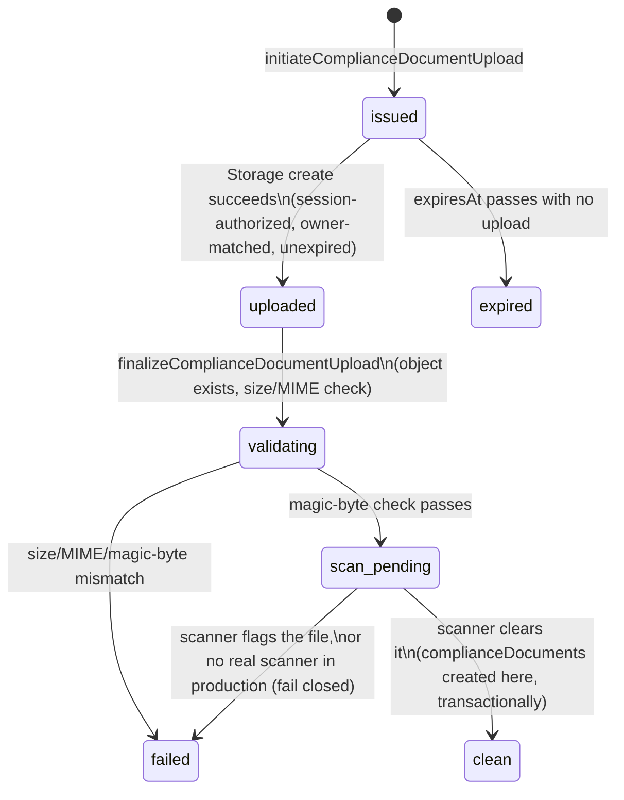
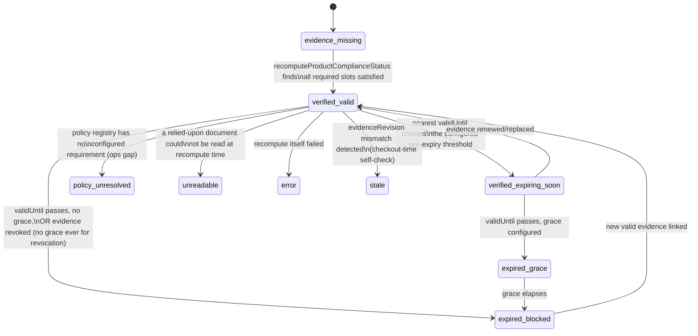

<!-- PLANNING DOCUMENT ONLY. No application code, Rules, indexes, Functions, or
     Flutter code were written to produce this plan. Nothing described here has
     been implemented or deployed. Revision 2 corrected 10 consistency defects
     found on review (see §0). Revision 3 (2026-08-25) replaces Slice 4's
     architecture with the corrected, adversarially-reviewed design (§0.1):
     server-mediated Marketplace eligibility, exact read/lookup ceilings, a
     fresh-per-request policy pointer, corrected approval enforcement, and
     sub-slices 4.1-4.9. Revision 4 (2026-08-25) completes Slice 4.1's own
     contract (§0.2): policy-version creation, empty-registry bootstrap,
     version-ID generation, an AND-of-OR requirement-group model, a single
     authoritative full-document validator reused at every trust boundary,
     and retraction of the version-content caching permission Revision 3 had
     granted, which was inconsistent with the bypass-write threat model
     Revision 4 itself establishes. Revision 5 (2026-08-25) adds Slice 4.2's
     missing dormant-compatibility contract (§0.3): a live-write audit found
     that today's Add Product create AND edit path never sends
     productInputRevision and performs a full-document overwrite with no
     merge, so a strict-presence Rule would break the current seller flow
     immediately, not just at some future edge case. Revision 5 defines the
     exact two-phase (Slice 4.2 dormant / Slice 4.9 strict) transitional
     contract this requires, without weakening the final invariant. Revision
     6 (2026-08-25) freezes Slice 4.3's complete matching/index/link
     contract (§0.4): a contract-resolution audit found the productEvidenceLinks
     schema disagreed with the already-shipped complianceConstants.js
     constant, the complianceDocumentScopes composite indexes the frozen
     matching algorithm requires were never declared, and the §13.1/§16
     sub-slice dependency columns disagreed with each other. Revision 6
     resolves all three, plus corrects §9's factually-incorrect claim of an
     explicit Rules-closure for compliancePolicyRegistryPointer and
     businessComplianceEpochs. Revision 7 (2026-08-25) freezes the
     product-level sellerRelationship architecture a second contract-
     resolution audit found missing (§0.5): §4/§5.5's "product's declared
     relationship" language assumed an input nothing produced —
     sellerRelationship existed only on complianceDocuments (seller-
     declared, document-level, immutable) with no product, business, or
     scope field ever resolving which relationship governs a given
     product's policy. Revision 7 adds a seller-declared product field,
     denormalizes relationship onto complianceDocumentScopes at scope-
     creation time, relationship-filters all seven Slice 4.3 candidate
     queries before their limit(3), adds source-document relationship/
     tenant/expiry verification at the already-budgeted matched-scope
     resolution step, integrates sellerRelationship into the
     productInputRevision matching-field set and the Slice 4.2 dormant
     transitional matrix, and freezes an explicit dormant-to-strict
     rollout sequence that never guesses or backfills an existing
     product's relationship. Slice 1-4.2 records remain historical and
     unchanged throughout; the Revision 6 productEvidenceLinks/index/
     dependency corrections are extended, not reopened. Revision 8
     (2026-08-25) resolves a genuine textual contradiction a final
     independent review found in §9 (§0.6): a table headed
     "sellerRelationship's own dormant create/update contract" stated an
     update-only adoption rule (existing absent -> baseline 0, so incoming
     productInputRevision must be 1) that, if its own heading were taken
     literally as covering create, directly contradicted the separate,
     unconditional productInputRevision create table (absent or exactly 0
     only, 1 always rejected). Revision 8 resolves this in favor of the
     create table's unconditional reading -- the reading the already-
     uncommitted firestore.rules/marketplaceProductRules.test.js Slice 4.2
     correction already implements and tests -- by splitting §9 into an
     explicitly separate create contract (§9.B, governing both fields
     independently, no delta ever computed) and an explicitly retitled,
     existing-document-only update contract (§9.C). No code or test change
     is required; this is documentation-only. Revision 9 (2026-08-25)
     resolves four defects a Slice 4.3 adversarial review found in the
     (uncommitted) matching engine (§0.7): MATCHED_SCOPE_CAP's global
     approvedAt/documentId truncation could starve a required evidence
     slot of its only candidate; truncation had no admin-visible audit
     trail despite the plan requiring one; a product's sellerRelationship
     could change while productInputRevision stayed absent under the
     already-committed dormant Rules, leaving an old decision falsely
     fresh; and decisionHash canonicalization was never frozen by the
     plan at all. Revision 9 replaces the global-cap language with a
     coverage-first/extras algorithm (§10), denormalizes documentType/
     validUntil onto complianceDocumentScopes (§4, a third prerequisite
     Slice 3 corrective sub-pass, §13.1), adds sellerRelationshipSnapshot
     to productComplianceDecisions (§4/§10.1), freezes the truncation
     complianceReviewEvents contract using only already-reserved,
     already-shipped enum values (§10), and freezes the decisionHash
     canonicalization contract (§4). The ≤8-operation/≤42-read bound is
     unchanged. Documentation-only; none of Slice 4.3's eight uncommitted
     files are touched by this revision — they are corrected in a
     separate, subsequent implementation task once this update lands.
     Revision 10 (2026-08-26) resolves two defects an independent
     adversarial audit found in the (uncommitted) Slice 4.4 implementation
     (§0.8): `evaluateLiveProductEligibility`/`resolveActivePolicy` are
     called entirely outside `reviewProductModeration`'s own approval
     transaction, so a product can be approved against an eligibility
     result already stale by commit time (reproduced directly against
     five independent freshness inputs); and the plan never resolved
     whether an already-approved idempotent replay must re-verify live
     eligibility, nor whether its response could be misread as a live-
     eligibility claim rather than stored moderation state. Revision 10
     freezes an additive, transaction-aware read contract for both shared
     readers, a per-attempt clock rule, the exact approval transaction
     sequence, and the exact already-approved replay response and
     semantics — documentation-only; none of Slice 4.4's three uncommitted
     files are touched by this revision. Revision 11 (2026-08-26) resolves
     two blockers an independent, read-only Slice 4.5 preflight found before
     any Slice 4.5 code was written (§0.9): the plan required cursor-based
     pagination for `getMarketplaceProductList`/`getMarketplaceProductDetail`
     without ever naming the field candidates are ordered/cursored on, and
     required "App Check"/"rate limits" without any mechanism, threshold, or
     enforcement decision — while the live codebase leaves App Check
     disabled everywhere and has no rate-limiting precedent compatible with
     an unauthenticated caller. Revision 11 freezes an exact document-path
     ordering and opaque-cursor contract, an exact bounded-scan/response
     contract, and explicitly defers App Check enforcement and rate
     limiting to separate, later-authorized activation prerequisites —
     documentation-only; Slice 4.5 remains unimplemented and its feature
     flag remains unactivatable until those prerequisites land. Revision 12
     (2026-08-26) resolves two further blockers a subsequent Slice 4.5
     implementation attempt correctly hard-stopped on before writing any
     code (§0.10): the plan described the public response only by a
     negative exclusion list ("the plan's existing product projection,
     unchanged") with no positive, enumerated field allowlist, and
     required an "indistinguishable" detail absence outcome without
     ever freezing what that one outcome actually is. Revision 12 freezes
     an exact positive public-product projection (one shared shape for
     both list items and the detail item, sourced from the live
     `lib/models/product.dart` schema and its actual customer-facing
     consumers), an exact detail request/absence/internal-error contract,
     and exact list per-candidate/whole-query error semantics —
     documentation-only; `marketplaceListing.js` still does not exist and
     is not created by this revision. -->

# Petsupo Marketplace P1-A — Compliance & Review Foundation: Implementation Plan (Revision 13)

**Date:** 2026-08-21 (Revision 2). **Revision 3:** 2026-08-25 — Slice 4 architecture corrected; see §0.1. **Revision 4:** 2026-08-25 — Slice 4.1 contract completed; see §0.2. **Revision 5:** 2026-08-25 — Slice 4.2 dormant-compatibility contract added; see §0.3. **Revision 6:** 2026-08-25 — Slice 4.3 matching/index/link contract frozen; see §0.4. **Revision 7:** 2026-08-25 — product-level sellerRelationship architecture frozen; see §0.5. **Revision 8:** 2026-08-25 — create/update contract heading contradiction resolved, documentation-only; see §0.6. **Revision 9:** 2026-08-25 — Slice 4.3 cap-selection/truncation-event/relationship-freshness/decisionHash contract resolution, documentation-only; see §0.7. **Revision 10:** 2026-08-26 — Slice 4.4 transactional-eligibility TOCTOU/replay-ambiguity contract resolution, documentation-only; see §0.8. **Revision 11:** 2026-08-26 — Slice 4.5 deterministic ordering/cursor contract frozen, App Check/rate-limit enforcement deferred to a separate activation prerequisite, documentation-only; see §0.9. **Revision 12:** 2026-08-26 — Slice 4.5 exact public-product projection and detail/list error contract frozen, documentation-only; see §0.10. **Revision 13:** 2026-08-27 — `requiredDocumentTypeGroups` Firestore-nested-array incompatibility resolved (wrapped-object schema), documentation-only; see §0.11.
**Baseline:** branch `integration/mac-windows-2026-07-22`, HEAD `f2048cf25681d714ba562037604116ec42a80101` ("Fix server-owned product field protection (P0.1)"), parent `9238a528fcd267b6d24b3a589e94c93939d1cf3e` (P0). Working tree clean, upstream in sync, no deployment performed.
**Source architecture:** `docs/audits/marketplace_p1_bulk_compliance_inventory_architecture_2026-08-21.md` (Revision 3, with one field-level cross-reference addendum pointing back to this plan — see that document's status box).
**Status:** PLAN ONLY. Nothing in this document has been implemented, staged, committed, deployed, or pushed as a result of this plan.

---

## 0. Change log — what this revision corrects and why

| # | Defect in the prior plan | Fix |
|---|---|---|
| 1 | `complianceDocuments.storagePath` was marked required, but "set only by finalize" — an unresolved required-field-before-existence contradiction | New `complianceUploadSessions` collection owns the entire pre-existence upload/validate/scan lifecycle; `complianceDocuments` is only ever *created* once a session reaches `clean`, so `storagePath` is genuinely always present the instant the document exists |
| 2 | `complianceDocuments` carried `normalizedBrandId`/`supplierId`/`categoryId`/`familyId` as single-value fields, silently representing only one of a document's possibly-several scopes | Removed from `complianceDocuments` entirely; scope identity lives only in `complianceDocumentScopes` |
| 3 | No slice explicitly forbade deploying a Storage upload-create rule before the server lifecycle that tracks it existed | Slice boundaries corrected so the Storage create rule and the upload-session function are one deployed unit; no intermediate deployed state permits untracked owner uploads |
| 4 | The plan asserted "Slice 3 depends on Slice 2" in one table and "Slices 1 and 3 can begin immediately" in the verdict — directly contradictory | Slice numbering and the dependency graph rebuilt consistently (§17) |
| 5 | Approval/checkout eligibility was phrased as a negative check (`!= evidence_missing`), which fails open for any *new*, unenumerated status | Replaced with a positive allowlist (`in ['verified_valid','verified_expiring_soon']`) and every other status explicitly enumerated as fail-closed |
| 6 | Checkout's compliance check implicitly scanned `productEvidenceLinks`, an unbounded set | New bounded `productComplianceDecisions/{productId}` record, capped at 10 active evidence references, is what checkout actually reads |
| 7 | `validUntil: null` was treated as globally "never expires" | Now policy-dependent per `documentType`, via an extended `compliancePolicyRegistry`; unresolved policy fails closed (defaults to requiring `validUntil`) |
| 8 | Malware-scanning/legal-mapping "open decisions" were framed as blocking all related work, when they only block specific transitions | Reclassified: foundation code (scanner interface, fake/test scanner, quarantine workflow, policy engine, placeholder policy) is buildable now; only production activation of real scanning/policy is blocked |
| 9 | `normalizedBrandId` via "lowercase, trim, strip punctuation" could collapse distinct brands | Versioned normalizer (Unicode normalization, locale-independent case folding, explicit `normalizerVersion`) for *candidate* matching only; an approved brand scope requires a separate, admin-verified `verifiedBrandId` before it's used to link evidence |
| 10 | Signed-URL expiry was given as "60–120s" with a vaguer revocation claim | Corrected to "maximum 5 minutes, recommended," with an explicit, unambiguous statement that revocation cannot invalidate an already-issued URL — only bounds future issuance |

### 0.1 Revision 3 change log — Slice 4 architecture corrected (2026-08-25)

Slice 4 was never implemented (§16, §19-20 confirm only Slices 1-3 have shipped code). A pre-implementation audit, an architecture-decision memo, and two adversarial reviews found the original Slice 4 design (single "Slice 4" row, §4/§9/§10/§11 as drafted in Revision 2) contained load-bearing defects that would have shipped a fail-open Marketplace. This revision replaces that design; it does not touch any Slice 1-3 record, note, or deployment gate.

| # | Defect in the Revision 2 Slice 4 design | Fix |
|---|---|---|
| 11 | Direct client Firestore reads + Rules cross-document `get()` calls cannot give a zero-stale public-eligibility guarantee ("Rules are not filters" for list queries; per-call billing/limits) | Public Marketplace list/detail/reservation/add-to-cart/checkout move to a server-mediated eligibility architecture (new §10.1) with a shared, authoritative live evaluator |
| 12 | The "≤8 reads/product" bound was never achievable as literal billed document reads (queries bill ≥1 even empty; 7-8 lookup types each cost their own query+results; matched-scope resolution adds more) | Corrected to two frozen numbers: ≤8 bounded lookup *operations*, ≤42 billed document reads (worst case) — exact derivation in §10 |
| 13 | The `verifiedBrandId`/`normalizedBrandId` design had no stated cross-tenant constraint, allowing a seller to potentially claim another business's brand evidence by typing matching text | Every lookup (not only the business-type lookup) requires `businessId == product.businessId`; the normalizer algorithm is frozen exactly (§10) |
| 14 | No mechanism was specified to stop a raw admin-client Firestore write (or a forged "callable marker") from setting `moderationStatus: 'approved'` directly, since Admin SDK writes bypass Rules by definition and any Rules-checked marker is equally forgeable by the same client | Rules categorically deny every client-SDK transition into `approved` (create and update); only the `reviewProductModeration` Admin-SDK callable may perform it; it re-validates via the same live evaluator, fails closed on stale/missing input, and writes its audit event transactionally (§9, §11) |
| 15 | `productInputRevision`/`evidenceRevision` were not specified precisely enough to implement: no field-ownership category existed for "seller-writable but Rules-constrained," and the product create/edit path is a client-side Firestore transaction, which cannot write a fully server-owned field | `productInputRevision` is a new, explicit 6th product field (seller-writable, Rules-monotonic +0/+1 invariant); `evidenceRevision` stays server-owned and plan-compliant (`int`); staleness is two independent equality checks, never string concatenation or ordering (§4, §10.1) |
| 16 | `productEvidenceLinks` was implicitly treated as authoritative/live-maintained; it has no writer in the codebase as of this revision | Reclassified explicitly as a performance/reconciliation reverse index only — stale or missing links may only degrade performance, never admit an ineligible product (§4, §10.1) |
| 17 | The policy-registry "singleton active version" invariant was asserted as structurally guaranteed with no actual check | Retained pointer-based design; added a bounded anomaly check inside the activation transaction itself (§4, §10.1) |
| 18 | An initial correction proposed caching the active-policy pointer for up to 30 seconds as a performance optimization; this reintroduces a fail-open window, since the per-product freshness check is only as fresh as the pointer it's compared against | Corrected: the policy pointer is read fresh, once per request/transaction, on every path (listing, detail, add-to-cart, reservation, checkout, approval, recompute) — no TTL, no warm-instance caching. *(The remainder of this row's original fix — "the immutable version document's content... may be cached" — is superseded by Revision 4 correction 27, §0.2; the version document is now also read fresh at every authoritative resolution. This row is preserved as the historical record of what Revision 3 corrected; do not read the caching clause as current.)* |
| 19 | No deployment sequencing accounted for the fact that an exported Cloud Function is reachable the instant it is deployed, regardless of whether current UI calls it | Deployment order corrected to require every new callable to be either unexported, behind an explicit disabled feature flag, or deployed only at its activation step — never described as "safe because nothing calls it yet" (§17) |
| 20 | No mechanism ensured public listings reflect a policy activation immediately | Added an ops-triggered bulk recompute pass immediately following any policy activation, alongside the existing bounded sweep, to minimize the listings-thin-out window that the corrected fail-closed design otherwise produces (§10.1, §17) |

### 0.2 Revision 4 change log — Slice 4.1 contract completed (2026-08-25)

Slice 4.1's own uncommitted implementation (`compliancePolicyRegistryOperations.js` + tests, `functions/src/marketplace/compliance/complianceConstants.js`'s additive `RETIRED` status and pointer constants) surfaced, through a read-only contract audit, that Revision 3 committed Slice 4.1 to "registry CRUD" without ever specifying the "C." This revision completes that contract. It does not touch any Slice 1-3 record, note, or deployment gate, and does not touch the four Slice 4.1 code/test files directly — those are corrected separately, under their own authorization, against this now-complete contract.

| # | Defect in the Revision 3 Slice 4.1 contract | Fix |
|---|---|---|
| 21 | "Registry CRUD" named no actual creation operation, request shape, or writer for `compliancePolicyRegistry` version documents | Named exactly: `createCompliancePolicyVersion` (§4), create-only semantics, full input contract |
| 22 | No operation existed to bootstrap the registry from empty — `activatePolicyVersion` structurally requires a pre-existing pointer and cannot create one, by design | Named exactly: `bootstrapCompliancePolicyRegistry` (§4), a distinct transaction from ordinary activation, never weakening the ordinary anomaly check |
| 23 | Version-ID generation was unspecified | Server-generated via `crypto.randomUUID()`, matching `addComplianceScope`'s existing `scopeId` precedent; retries are explicitly **not** idempotent, matching that same precedent's own documented limitation |
| 24 | `sellerRelationship.<rel>.requiredDocumentTypes` (a flat array) can only express AND across its members — it cannot express "invoice AND (manufacturer OR wholesaler/supplier)," a requirement the plan's own `requiredEvidenceSlots` field already assumed was representable | Replaced with `requiredDocumentTypeGroups: DocumentType[][]` — outer array is AND, inner array is OR, outer length 1..5 to match the already-frozen `requiredEvidenceSlots` cap exactly, one group per slot |
| 25 | An empty `requiredDocumentTypes`/absent evidence gate was previously described as a legal "no gate" configuration | A present relationship must always have ≥1 non-empty requirement group; an empty top-level `sellerRelationship` is legal only for terminal `inactive` placeholders, never for `draft`/`active` |
| 26 | Deep content validation was only ever run at creation time, and creation can be bypassed by Admin SDK scripts, migrations, or future ops tooling | One authoritative `validateCompliancePolicyVersionDocument` re-runs on every trust boundary — creation, bootstrap, ordinary activation (both current and target), and every single `resolveActivePolicy` call — never relying on a past validation result |
| 27 | Revision 3 stated immutable version-document *content* may be cached across requests, reasoned solely from "the document can never change once written" — inconsistent with defect 26's own bypass-write threat model, since a cached copy taken before a bypass write would not reflect it | Retracted; the version document, like the pointer, is read fresh at every authoritative eligibility/approval/activation resolution; only within-one-request/transaction deduplication is permitted (§4, §10.1) |
| 28 | `effectiveFrom`'s enforcement semantics, comparison representation, and test-clock mechanism were unspecified | Frozen: future-dated drafts permitted at creation; bootstrap/activation/resolution all require `effectiveFrom.toMillis() <= nowMs` (equality permitted); no scheduled activation exists; `now` is injectable for deterministic tests (§4) |
| 29 | `inactive`'s and `retired`'s lifecycles were named but not fully closed against every other transition | Frozen exactly: `inactive` is created-only, terminal, never pointer-addressable, never becomes `draft`/`active`/`retired`; `retired` is only ever produced by ordinary activation retiring a version that was genuinely `active` (§4) |

### 0.3 Revision 5 change log — Slice 4.2 dormant-compatibility contract added (2026-08-25)

Before writing Slice 4.2's `firestore.rules` change, a read-only preflight audit traced every live product write path and found that §9/§16's "tolerant of the field's absence on legacy products" language, while directionally correct, named no exact mechanism — and that the actual live-write shape makes the gap more severe than a bare absence check would suggest. This revision defines the exact transitional contract. It does not touch `firestore.rules`, any test file, or any Flutter file — those are implemented separately, under their own authorization, against this now-complete contract. It does not touch any Slice 1-4.1 record, note, or deployment gate.

| # | Defect in the Revision 4 Slice 4.2 contract | Fix |
|---|---|---|
| 30 | No committed text stated the exact live shape of the current Add Product write — that it is a full-document `tx.set(ref, payload)` with no merge, via `Product.toJson()`, which never includes `productInputRevision` — so a naive strict-presence Rule would break not only creation but every subsequent edit to an already-backfilled product, since the next old-client write silently overwrites the whole document, including any Admin-SDK-added revision, with a payload that omits the key entirely | Documented verbatim in §9 (below), with exact file/line evidence; the transitional contract is designed around this fact, not around a bare "field may be missing" assumption |
| 31 | Slice 4.2 was described only as "live but inert," with no boundary between what it does and does not enforce — risking either an unenforceable no-op or an accidental strict rule that breaks production | Split into two named phases: **Phase A (Slice 4.2, dormant compatibility)** — absence tolerated only under an exact transitional matrix, monotonic adoption enforced once the field appears, deletion of an existing value always rejected; **Phase B (Slice 4.9, strict steady state)** — presence, exact typing, and +0/+1 semantics unconditionally required, absence rejected (§9) |
| 32 | No exact create/update matrix existed for the absent-field transitional window, risking an implementer inventing one silently | Frozen exactly: create allows absent or exact `0`, rejects everything else; update is defined by a 5-case matrix (existing/incoming absent-or-present) — most importantly, *existing present + incoming absent is always rejected*, closing the "old client silently deletes an adopted revision" gap (§9) |
| 33 | The deployment sequence did not state that server-owned compliance-field writes and any revision backfill must wait for the Flutter write path to stop performing destructive full-document overwrites | Explicit ordering added (§17): Flutter migration (writing the field, preserving server-owned fields) must land and be verified in staging *before* any backfill or recompute write — migrating data into a write path that immediately strips it back out is worse than not migrating at all |

### 0.4 Revision 6 change log — Slice 4.3 matching/index/link contract frozen (2026-08-25)

A read-only contract-resolution audit, performed before writing any Slice 4.3 code, traced the exact query shapes §10's frozen matching algorithm requires against the actual `complianceDocumentScopes` schema and the actual already-shipped `complianceConstants.js`, and found three defects that would have forced an implementer to invent unauthorized structure. This revision resolves all three, documentation-only. It does not touch `firestore.rules`, any test file, any index file, `complianceConstants.js`, or any Flutter file — those are implemented separately, under their own authorization, against this now-complete contract. It does not touch any Slice 1–4.2 record, note, or deployment gate.

| # | Defect found in the pre-Revision-6 Slice 4.3 contract | Fix |
|---|---|---|
| 34 | §4's `productEvidenceLinks` schema (`scopeType`, `matchReasonCode`) contradicted the already-committed `PRODUCT_EVIDENCE_LINK_ALLOWED_FIELDS` constant (`matchedVia`, `linkedBy`), shipped four days earlier at Slice 1 and never reconciled against the plan text written later, at Revision 3 correction 16 | §4 below is corrected to the single field `matchedVia` (aliased to the existing `COMPLIANCE_SCOPE_TYPE` enum), which is provably non-redundant with the plan's two proposed fields under the current 1:1 lookup-type↔scope-type mapping; `scopeType` and `matchReasonCode` are retired from this collection's schema; `linkedBy` is removed as having no defined provenance semantics under this collection's single-system-writer design and zero existing writer/reader/test dependency (verified: `git grep` for `productEvidenceLinks` across `functions/src/` returns only the schema comment itself; `complianceConstants.test.js` has zero assertions on this constant) |
| 35 | §10 froze an exact deterministic tie-break (`status=='approved' THEN approvedAt ASC THEN documentId ASC`) for the seven bounded `complianceDocumentScopes` lookups, but no composite index existed anywhere for this collection, and §14 never analyzed what index the algorithm needs — a Firestore query combining equality filters with an `orderBy()` on fields outside that equality set fails outright at runtime without one, so the ≤42-read bound was unachievable as stated, not merely undocumented | §10/§14 below freeze the exact seven-query mapping and the exact minimum two-index composite-index set, cross-checked against official Firestore index-behavior documentation |
| 36 | §13.1/§16 disagreed on Slice 4.3's own dependency column (`4.1` only vs. `Slice 4.1, 4.2`), and neither table authorized `complianceConstants.js` or `firestore.indexes.json` as files Slice 4.3 would need to modify, despite the algorithm structurally requiring changes to both | §13.1 below is corrected to `Slice 4.1, 4.2` (matching §16, which was already correct) and gains two new file rows for the eventual implementation |
| 37 | §9's Firestore posture table claimed `compliancePolicyRegistryPointer` and `businessComplianceEpochs` are each closed via an explicit `allow read, write: if false` Rules block; independently verified false — no match block for either collection name exists anywhere in `firestore.rules`, so both rely purely on Firestore's implicit deny-by-default | §9 below is corrected to state the actual, implicit-deny posture; this does not change either collection's real security properties (Admin-SDK-only access either way) and does not block Slice 4.3, which never performs a client-Rules-mediated read of either collection |

### 0.5 Revision 7 change log — product-level sellerRelationship architecture frozen (2026-08-25)

A second read-only contract-resolution audit, prompted by a Slice 4.3 implementation hard-stop, traced every live statement involving `sellerRelationship` and found that §4/§5.5's "product's declared relationship" language was never mechanically closed: `sellerRelationship` existed only as a seller-declared, document-level field on `complianceDocuments` (set once at `submitComplianceDocument`, immutable thereafter) — no product, business, or `complianceDocumentScopes` field ever resolved which relationship governs a given product's policy selection, and nothing prevented one business from legitimately holding evidence under several different relationships at once. This revision closes that gap, documentation-only. It does not touch `firestore.rules`, any test file, any index file, `complianceConstants.js`, `complianceDocumentOperations.js`, or any Flutter file — those are separately-authorized corrective implementation work (§13.1/§16 below), sequenced explicitly (§17) to land *before* Slice 4.3 resumes. It does not reopen or weaken any Revision 1–6 record.

| # | Defect found in the pre-Revision-7 Slice 4.3 contract | Fix |
|---|---|---|
| 38 | No field anywhere (product, business, or scope) resolved which of the 6 `SELLER_RELATIONSHIP` values governs a product's policy selection, despite §4/§5.5 assuming one exists ("this product's declared relationship") | §11 below adds `sellerRelationship` as a seventh, seller-declared product field: exactly one value per product, missing/invalid always `policy_unresolved`, never inferred from evidence, never inherited from the business, never defaulted |
| 39 | §4/§5.5's repeated "relationship/category" phrasing implied `compliancePolicyRegistry.sellerRelationship` might be keyed by category as well as relationship, when the registry's own nested schema (§4) has only ever been keyed by relationship | §4/§5.5 below are corrected to state explicitly: `sellerRelationship` selects exactly one policy branch; `category` is a separate, ordinary evidence-matching input (the `category` row of §10's seven-query table), never a second registry key |
| 40 | `complianceDocumentScopes` carried no relationship information, so no candidate query could distinguish "evidence for relationship X" from "evidence for relationship Y" on the same business, and the only alternative (resolving each candidate's source document post-query) risks a `limit(3)` false negative — three same-type scopes belonging to the wrong relationship could silently hide a valid fourth | §4 below denormalizes `sellerRelationship` onto `complianceDocumentScopes`, copied server-side from the immutable source `complianceDocuments.sellerRelationship` at scope-creation time, never client-suppliable, immutable for the scope's lifetime |
| 41 | All seven Slice 4.3 candidate queries (Revision 6, §10) filtered only by `businessId`/`scopeType`/`status`/`scopeValue` — none could relationship-filter, so a business's evidence for an unrelated relationship could occupy the bounded `LOOKUP_LIMIT=3` window | §10 below adds `sellerRelationship == product.sellerRelationship` as a common filter on all seven queries, applied *before* `limit(3)`, never as a post-query discard |
| 42 | The already-budgeted "matched-scope document resolution" step (§10, `MATCHED_SCOPE_CAP=10`) was never explicitly connected to reading each candidate's source `complianceDocuments` record, despite that record being the only possible source of `expiresAt`/`validUntil` (`complianceDocumentScopes` has no such field) | §10 below states explicitly that this already-budgeted step reads each selected scope's source `complianceDocuments/{documentId}`, and — at zero additional read cost — verifies tenant match, relationship triple-equality (product/scope/source-document), and expiry at the exact frozen boundary; any mismatch fails closed |
| 43 | `productInputRevision`'s matching-field set (`category`/`brand`/`barcode`/`sku`, Revision 5/§9) did not include `sellerRelationship`, so a seller could change a product's declared relationship without the monotonic-adoption/anti-regression protections Slice 4.2 already gives the other four matching fields | §9/§11 below add `sellerRelationship` as a fifth matching field, with the Slice 4.2 transitional A–E matrix extended explicitly for it |
| 44 | §14's two Revision 6 composite indexes did not include `sellerRelationship`, and could not, since the field did not exist on `complianceDocumentScopes` yet | §14 below replaces both Revision 6 indexes with Revision 7 forms, each gaining `sellerRelationship` as an additional equality field ahead of `scopeType` |
| 45 | Denormalizing `sellerRelationship` onto `complianceDocumentScopes` requires modifying `addComplianceScope` (Slice 3, already committed) and extending Slice 4.2's Rules/matching-field set (already committed) — neither is Slice 4.3's own file, and folding either correction invisibly into a future Slice 4.3 implementation pass would mean modifying already-committed, already-reviewed slices without their own dedicated review | §13.1/§16 below name two new, explicit, separately-reviewed-and-committed corrective sub-passes (a Slice 3 scope-schema/writer correction and a Slice 4.2 Rules correction) that must land *before* Slice 4.3 resumes — never bundled into it |
| 46 | Nothing stated what happens to a product that predates this field once Slice 4.9's strict Rules eventually require it, or who may supply the missing value for such a product | §17 below freezes an explicit rollout sequence: existing products lacking `sellerRelationship` remain `policy_unresolved` indefinitely; no default (e.g. `reseller`), no evidence-based inference, and no unverified admin backfill is ever permitted — only a seller/admin-supplied, authorized declaration through the normal product-edit flow (or a future, separately-authorized backfill operation, not proposed here) resolves it |

---

### 0.6 Revision 8 change log — create/update contract heading contradiction resolved (2026-08-25)

A final independent review of the (uncommitted) Slice 4.2 Revision 7 correction found a genuine textual contradiction in §9, not merely an inference gap. Two passages disagreed on the exact same hybrid case — a product `create` that simultaneously sets a valid `sellerRelationship` while `productInputRevision` is absent or `0`:

- The plain "Transitional create contract (Phase A)" table for `productInputRevision` states, unconditionally: absent allowed, exactly `0` allowed, `1` or any other nonzero rejected — with no column or condition referencing `sellerRelationship` at all.
- A second table, headed **"`sellerRelationship`'s own dormant create/update contract"** — a heading that explicitly claims to cover both operations — stated in its row B: "existing absent → baseline `0`, so incoming `productInputRevision` must be `1`." Taken at face value for `create` (where "existing" is, by definition, always absent), this row directly requires `productInputRevision == 1` on exactly the case the first table unconditionally rejects.
- §11's own summary sentence ("any write that changes `sellerRelationship` must increment `productInputRevision` by exactly `+1`") compounded the ambiguity by not distinguishing `create` from `update`.

| # | Contradiction | Resolution |
|---|---|---|
| 47 | §9's `sellerRelationship` table was headed "create/update contract" and its row B, read literally for `create`, contradicted the separate, unconditional `productInputRevision` create table for the hybrid case (relationship adopted, revision absent/0, on create) | §9 is restructured below into an explicitly separate **create contract (§9.B)**, governing both fields together but independently of each other with no delta ever computed, and an explicitly retitled **existing-document update contract (§9.C)**, which alone carries the delta/adoption rules. The ambiguous "create/update" heading is retired |
| 48 | §11's "any write that changes `sellerRelationship` must increment `productInputRevision` by exactly `+1`" did not distinguish `create` from `update`, reading as though it could govern create too | §11 below is corrected to state explicitly that this rule governs *existing-product updates only* (§9.C), cross-referencing the new heading |

**The resolution, stated once, precisely:** `productInputRevision` and `sellerRelationship` are both persisted **product state**, not request parameters computed by diffing against a synthetic prior value. Document *creation* initializes that state from nothing — it is never modeled as an update transitioning from an implicit "existing absent" document, and no delta is ever computed on create: Rules validate only the `incoming` value directly, never diffing it against an `existing` one that does not exist. Every delta-based rule (the `productInputRevision` +0/+1 invariant, "baseline `0` for a previously-absent field," "adoption requires `+1`") therefore applies **only when `resource.data` already exists** — i.e., only on `update`, never on `create`.

This revision resolves the contradiction in favor of the create table's unconditional reading — the reading the already-uncommitted `firestore.rules`/`functions/test/marketplaceProductRules.test.js` Slice 4.2 correction files already implement and test, and which requires **no code or test change** to match:

- On create, `sellerRelationship` and `productInputRevision` are validated **independently** of each other (§9.B below states this exhaustively, including an explicit four-combination table). Neither field's create-time legality depends on the other's presence or value. Adopting a relationship on create never requires `productInputRevision` to be present or equal to `1` — `productInputRevision`'s create legality remains exactly what the unconditional create table always said: absent, or exactly `0`.
- `sellerRelationship`'s adoption-requires-`+1` rule (the former row B) is, and was only ever intended as, an **update-only** rule — it governs the transition of an *existing* document's *existing* value, which by construction cannot apply to a document that does not yet exist. The table carrying this rule is retitled "existing-product update contract" (§9.C) to state this unambiguously.
- `isValidTransitionalProductInputRevisionCreate` (`firestore.rules`) is untouched by the Slice 4.2 Revision 7 correction and remains unconditional, exactly matching this resolution. The corresponding tests (`4.2r7-create-3a/3b/3c` × all six relationship values, `functions/test/marketplaceProductRules.test.js`) already assert `productInputRevision: 1` is *rejected* on create even when a valid relationship is supplied, and that `productInputRevision` absent or `0` is *allowed* on create regardless of `sellerRelationship`'s presence. **No code or test change is required by this revision.**
- Slice 4.9's strict steady-state end state (§9.D below, reconfirmed) is unchanged in substance: both fields required and exactly typed on create (`sellerRelationship` a valid enum value, `productInputRevision` exactly `0`), no dormant absence permitted once strict Rules deploy, deletion of either field on update always rejected, matching-field changes (including a `sellerRelationship` change) requiring exactly `+1`.

Revision 1–7 records remain historical and unchanged; this revision restructures §9's presentation (splitting create and update into explicitly separate, correctly-headed contracts) without reopening or weakening any prior substantive rule.

---

### 0.7 Revision 9 change log — Slice 4.3 cap-selection/truncation-event/relationship-freshness/decisionHash contract resolution (2026-08-25)

An adversarial, independent review of the (still-uncommitted) Slice 4.3 implementation — matching engine, recompute, evaluator, brand normalizer — found four confirmed defects, none of which were caught by the implementation's own 66-test suite because the tests exercised the same flawed design they were meant to check. Each is resolved below, documentation-only; none of Slice 4.3's eight uncommitted files are edited by this revision.

| # | Confirmed defect | Resolution |
|---|---|---|
| 49 | `MATCHED_SCOPE_CAP=10` selected candidates for source-document verification via a single **global** `(approvedAt ASC, documentId ASC)` sort across every scope type, applied **before** any candidate's `documentType` was known — reproduced directly: 10 candidates satisfying required group A, approved earlier, silently discarded the 11th candidate, the *sole* evidence for required group B, even though both groups had genuine, valid, unexpired evidence available within the cap | §4 denormalizes `documentType`/`validUntil` onto `complianceDocumentScopes` (immutable, server-copied, mirroring the Revision 7 `sellerRelationship` precedent exactly), and §10 replaces the global-cap language with an exact, deterministic **coverage-first/extras** algorithm: every required slot gets an independent, ordered attempt at the read budget before any slot's *redundant* evidence can consume it |
| 50 | §4's own text requires cap-exceeding truncation to be "recorded... as a `complianceReviewEvents` entry for admin visibility — it does not silently drop the excess" (already-frozen, Revision 3-era text); the Slice 4.3 implementation silently drops, no event ever written | §10 freezes the exact truncation condition, event schema, and transaction placement — reusing the `complianceReviewEvents` schema's own `targetType: 'product'` and `action: 'recomputed'` enum values, both reserved-but-unused since Slice 1, so **no new constant or schema field is required** |
| 51 | Under the already-committed Revision 8 dormant Rules, a product may legally transition `sellerRelationship: X → Y` while `productInputRevision` remains absent on both sides (`firestore.rules`' own row A, "an explicitly acknowledged, temporary dormant gap... no server compliance output may treat revision freshness as meaningful while any product can still be in this state") — the evaluator's sole freshness signal, `productInputRevisionSnapshot` equality, cannot detect this, since both sides normalize to `0` regardless of the relationship change | §4 adds `sellerRelationshipSnapshot` to `productComplianceDecisions`; §10.1 requires the evaluator to compare it against the live product's `sellerRelationship` on every call, independently of the revision-equality check, at zero extra read cost (the product document is already read by both writer and evaluator) |
| 52 | §4 states `decisionHash` is "a digest of the canonical serialization of the fields above" but never specifies the serialization itself — the implementation invented one, and it recursively sorts object keys only at the top level, a latent stability gap the plan never authorized either way | §4 freezes a complete canonicalization contract: exact included/excluded fields, recursive key-sorting at every nesting level, preserved (never re-sorted) array order, `.toMillis()` Timestamp encoding, explicit `undefined` prohibition, and a requirement for at least one independently hand-computed known-vector test |

**Scope of this revision, stated precisely:**

- **§4** — `complianceDocumentScopes` gains `documentType`/`validUntil` (immutable, server-denormalized); `productComplianceDecisions` gains `sellerRelationshipSnapshot`; `decisionHash`'s canonicalization contract is fully frozen.
- **§10** — the matched-scope selection algorithm is rewritten in full (coverage-first/extras, replacing the under-specified global-cap description); the **source-read identity** (`documentId`, ≤10 unique reads) and **evidence-reference identity** (`(documentId, scopeId)`, ≤10 unique refs) are frozen as two distinct, never-conflated caps; the truncation-event contract is frozen.
- **§10.1** — the live evaluator's freshness check gains the `sellerRelationshipSnapshot` comparison, independent of and in addition to the existing `productInputRevisionSnapshot` check.
- **§13.1/§16** — a **third** prerequisite Slice 3 corrective sub-pass is named (`complianceConstants.js`, `complianceDocumentOperations.js`, and their tests — the same two files already twice reopened for the `sellerRelationship`-onto-scopes and Rules corrections), required to land, reviewed and committed separately, before the Slice 4.3 corrective pass resumes — mirroring §13.1's own already-established "two prerequisite corrective sub-passes" pattern exactly, now three.
- **§15** — new required test coverage for every algorithm branch, the truncation event, the relationship-staleness regression, and decisionHash's recursive contract.
- **Unchanged:** the ≤8-operation/≤42-read bound (§10) — denormalizing already-fetched fields adds no reads, and the coverage-first algorithm spends the existing ≤10-source-read cap more intelligently rather than needing a larger one; confirmed by exact recalculation, §10. The maximum transaction write count grows by exactly one (the truncation event, written only when truncation occurs), from ≤21 to ≤22 — nowhere near Firestore's per-transaction write ceiling.
- **Not in scope:** no code or test file is edited; the eight Slice 4.3 files remain exactly as the adversarial review left them, uncommitted, until a separate implementation task applies this revision's corrections within their own already-authorized scope, after the third prerequisite Slice 3 sub-pass lands and is committed.

Revision 1–8 records remain historical and unchanged.

---

### 0.8 Revision 10 change log — Slice 4.4 transactional-eligibility TOCTOU/replay-ambiguity contract resolution (2026-08-26)

An independent, adversarial audit of the (still-uncommitted) Slice 4.4 implementation — `reviewProductModeration`, `productModeration.js` — found two confirmed defects, neither caught by the implementation's own 47-test suite because every test exercised a single consistent snapshot, never one that changes mid-call. Both are resolved below, documentation-only; none of Slice 4.4's three uncommitted files are edited by this revision. **A second, independent read-only audit, performed before this revision was ever committed, then found two further gaps in this correction's own first-drafted text — not new defects in the implementation, but refinements to correction 53's own contract: the preloaded product object's transactional provenance was not structurally verified (the evaluator could skip its own tenant check merely because a caller claimed to have already performed it), and the read-bound accounting presented a single "5 reads" figure without distinguishing it from the operation's full request cost (the pre-existing `requireAdmin` authorization read was never named).** Both are corrected directly within §10.1 below, under the same correction 53 (no new correction number is assigned, since both are refinements of that correction's own text, not newly discovered implementation defects).

| # | Confirmed defect | Resolution |
|---|---|---|
| 53 | §8's own text already required `reviewProductModeration` to call `evaluateLiveProductEligibility` "inside its own transaction before approving," but the implementation calls it, and the `resolveActivePolicy` it depends on, entirely **before** `db.runTransaction` opens — every read either function performs (`products/{productId}`, `compliancePolicyRegistryPointer/current`, `compliancePolicyRegistry/{activeVersionId}`, `businessComplianceEpochs/{businessId}`, `productComplianceDecisions/{productId}`) is a plain `ref.get()`, never `tx.get()`, so none of it participates in the approval transaction's own read set or retry semantics. Reproduced directly, against the real, unmodified function: an independent fixture that mutates one freshness input (policy-pointer repointing; epoch bump; the product's own `sellerRelationship`/`productInputRevision` changing; the decision record being deleted outright; the clock crossing `validUntil`) at the exact instant between the completed eligibility check and the transaction's own first read confirmed the approval **still commits** in all five cases — only a genuinely concurrent *moderation* transition (a second caller already flipping `moderationStatus`) is caught, because that one field alone is re-read fresh inside the transaction | §8/§10.1/§11 freeze an explicit **transactional approval invariant**: every eligibility/freshness read that authorizes a `pending_review → approved` transition must belong to the same transaction read set as the `moderationStatus` update and the audit-event create, via an additive, transaction-aware `tx` parameter on both `evaluateLiveProductEligibility` and `resolveActivePolicy`, and a provenance-verified `productSnapshot` parameter on `evaluateLiveProductEligibility` (§8, §10.1) — existing non-transactional callers (listing, detail, cart/reservation, checkout) are entirely unaffected. The approval transaction sequence is restructured with no non-transactional product pre-read of any kind (§10.1) — idempotency/error routing move entirely inside the transaction's own reads. §13.1/§16 name the exact corrective file scope, extending into these two already-committed Slice 4.1/4.3 shared readers as corrective dependencies of Slice 4.4's own completion, not new Slice 4.5 work |
| 54 | Neither this plan nor the Slice 4.4 implementation ever resolved whether an already-`approved` idempotent replay must re-verify live eligibility, nor whether its response's `status` field could be misread as a live-eligibility claim rather than a report of stored moderation state — the implementation's own test suite explicitly proved a replay succeeds even when the live decision would now independently fail every freshness check the evaluator enforces, with no plan text confirming or forbidding this | §10.1/§11 freeze the exact reading: `moderationStatus == 'approved'` is stored moderation state, never a live-eligibility claim; an already-approved invocation is a pure idempotent replay of that stored state, performs no new transition, calls no evaluator, writes nothing, creates no event, and its response is defined to mean stored moderation state only, explicitly never current marketplace eligibility — which remains, unconditionally, the independent responsibility of `evaluateLiveProductEligibility`'s own five live callers on every single invocation, regardless of `moderationStatus` |

**Scope of this revision, stated precisely:**

- **§8** — the `reviewProductModeration` and `evaluateLiveProductEligibility` operation-table rows are corrected to state the transactional requirement and the additive `tx` parameter explicitly, replacing the ambiguous-in-practice (if not in original wording) "inside its own transaction" phrasing with the exact mechanism that satisfies it.
- **§10.1** — gains the exact transaction-aware read contract for both shared readers, the per-attempt clock rule, and the exact already-approved replay semantics (never a live-eligibility claim).
- **§11** — the "Approval enforcement" paragraph and the enforcement-surfaces table row are corrected to match §8/§10.1 exactly, including the explicit statement that a previously-approved product whose compliance later becomes stale remains moderation-approved historically while correctly excluded from live marketplace eligibility by every other surface.
- **§13.1/§16** — a **Slice 4.4 correction (Revision 10)** sub-pass is named, extending into `complianceEligibilityEvaluator.js` and `compliancePolicyRegistryOperations.js` (both already-committed Slice 4.1/4.3 shared readers) as corrective dependencies of Slice 4.4's own completion — required to land, be reviewed, and be committed before `reviewProductModeration`'s feature flag may ever be enabled, mirroring the exact "named corrective sub-pass, landed separately" pattern §13.1 already established three times for Slice 3/4.2.
- **§15** — a 36-item Revision 10 test matrix is added: the original 20 items (every one of the five reproduced freshness races, the per-attempt clock rule, transaction-mode `tx.get()` usage by both shared readers, unchanged non-transactional behavior, retry/concurrency semantics, and the already-approved replay contract), plus 16 items added by this second-audit correction proving the `productSnapshot` provenance/tenant-validation contract and the exact read counts by outcome.
- **§17** — the deployment sequence is corrected so the transactional shared-reader correction lands, and is independently reviewed and committed, strictly before Slice 4.4's feature flag may ever be enabled in any environment — never merely "before real activation," matching the same discipline §17 already applies to every other Slice 4 rollout step.
- **Read bound** — §10's own ≤8-operation/≤42-read ceiling was never frozen for `reviewProductModeration` in the first place (it governs `recomputeProductComplianceStatus` only); this revision freezes, for the first time, the exact read composition for `reviewProductModeration` as three distinct figures, never conflated: one `requireAdmin` authorization read outside any transaction; five transactional reads per attempt for a real `pending_review → approved` transition; and exactly two total reads (the admin read plus a single transactional product read) for both an idempotent replay and an invalid-state rejection — see §10.1's own new accounting section (A-F).
- **Not in scope:** no code or test file is edited; the three Slice 4.4 files, and `complianceEligibilityEvaluator.js`/`compliancePolicyRegistryOperations.js`, remain exactly as the adversarial audit left them, uncommitted, until a separate implementation task applies this revision's corrections within the exact scope §13.1/§16 now name.

Revision 1–9 records remain historical and unchanged.

---

### 0.9 Revision 11 change log — Slice 4.5 ordering/cursor contract frozen; App Check/rate-limit enforcement deferred (2026-08-26)

An independent, read-only Slice 4.5 preflight — performed before any Slice 4.5 code, test, or index file was written — found the committed plan text load-bearing-ambiguous on two points, and hard-stopped rather than silently inventing either. Both are resolved below, documentation-only; `functions/src/marketplace/publicCatalog/marketplaceListing.js` does not exist yet and is not created by this revision.

| # | Confirmed blocker | Resolution |
|---|---|---|
| 55 | §10.1's "Candidate selection and bounding" paragraph requires "Cursor-based pagination only (`startAfter`, never offset)" but never names the field candidates are ordered or cursored on. Live-code check: the current Flutter marketplace browse (`lib/ui/petshop/all_products_page.dart:115-131`) is not a paginated query at all — it is an unbounded `collectionGroup('products').where('isActive', isEqualTo: true).where('moderationStatus', isEqualTo: 'approved').snapshots()` realtime stream, with no server-side `orderBy`, sorted/filtered client-side; there is no existing convention to infer an ordering field from | §10.1 gains a new, fully exact "Slice 4.5 public-catalog ordering and cursor contract" subsection (below): the candidate query orders strictly by ascending document path (`FieldPath.documentId()`), the request cursor is a frozen, exactly-validated opaque token carrying only the last-examined document's full nested path, and every bound (page size, per-fetch limit, total examined cap, continuation-cursor semantics) is stated as an exact number, never a range or an implicit default |
| 56 | §8/§10.1 state "App Check required" and "rate limits" as part of the endpoints' contract, and §16's own Slice 4.5 test row requires a "rate-limit rejection" test, but no mechanism, threshold, caller-identity model, or enforcement decision is defined anywhere in the plan. Live-code check: every existing `onCall` in `functions/index.js` sets `enforceAppCheck: false` (four sites, one annotated "make true later") — App Check has never been actually enforced anywhere in this codebase; the one existing rate-limit precedent (`functions/src/feedback/submitUserFeedback.js`, a per-authenticated-`uid`-per-day Firestore counter) is structurally incompatible with `getMarketplaceProductList`/`Detail`, which the plan itself requires to permit unauthenticated invocation (no `uid` to key a limit by) | §10.1 gains two new subsections, "Slice 4.5 dormant App Check posture" and "Slice 4.5 deferred rate-limit posture" (below): Slice 4.5's own implementation ships with `enforceAppCheck: false` (matching the codebase's existing, unbroken convention) and no rate-limiter of any kind, is gated entirely by its own disabled-by-default feature flag, and both App Check enforcement and a real rate-limit contract are named as separate, later-authorized activation prerequisites (§17) that must land and be independently reviewed before the flag may ever be enabled — never claimed as already implemented by Slice 4.5 itself |

**Scope of this revision, stated precisely:**

- **§8** — the `getMarketplaceProductList`/`getMarketplaceProductDetail` operation-table row is corrected to reference the exact ordering/cursor contract and the dormant App Check/deferred rate-limit posture, replacing the previously unqualified "App Check, rate limits" phrasing.
- **§10.1** — gains three new subsections in full: the exact ordering/cursor/bounding/response contract (correction 55); the exact dormant App Check posture (correction 56); the exact deferred rate-limit posture (correction 56).
- **§11** — the "Public listing/detail eligibility" row is corrected to state explicitly that the underlying candidate query's own `isActive`/`moderationStatus` equality filters, not a separate evaluator check, are what enforce the pre-existing (already-committed, already-live) moderation/active-product visibility gate, with `evaluateLiveProductEligibility` applied per surviving candidate on top of it.
- **§13.1/§16** — the exact Slice 4.5 file scope is named precisely (new source, new test, modified `functions/index.js`, dependency-only `complianceEligibilityEvaluator.js`, no index-file change — see the new §14 conclusion), and §16's Slice 4.5 row's required-test list is corrected to remove the previously-implied "live rate-limit rejection" implementation test in favor of dormant-posture/no-rate-limiter-present tests, per correction 56.
- **§14** — gains an explicit conclusion, reasoned from the actual current `firestore.indexes.json` content and this plan's own already-established implicit-`__name__`-tie-break convention (§14, Revision 6/7): no new composite index is required for Slice 4.5's candidate query.
- **§15** — the Slice 4.5 test matrix is replaced with an exact, fully-enumerated 50-item list spanning ordering/cursor behavior, visibility/security behavior, and dormancy/App-Check/rate-limit posture.
- **§17** — gains an explicit, separately-numbered activation-prerequisite sequence that must complete, in order, before Slice 4.5's feature flag may ever be enabled — inserted immediately around the existing "Deploy 4.5" step, mirroring the exact "named prerequisite gate" pattern §17 already established for Slice 4.4's own Revision 10 correction.
- **§20** — gains a Revision 11 confirmation paragraph stating precisely what a Slice 4.5 "GO" does and does not mean, mirroring the same precise-scoping pattern every prior revision's own §20 addition already established.
- **Not in scope:** no code, test, Rules, or index file is created or edited; `marketplaceListing.js` and `marketplaceListing.test.js` do not exist after this revision; no Slice 4.6+ work is named or started; no Flutter/UI file is touched.

Revision 1–10 records remain historical and unchanged.

---

### 0.10 Revision 12 change log — Slice 4.5 public-product projection and detail/list error contract frozen (2026-08-26)

A subsequent, independent Slice 4.5 implementation attempt — working strictly from the committed Revision 11 contract — found two further load-bearing gaps and correctly hard-stopped before writing any code, rather than inventing a public schema or an error contract. Both are resolved below, documentation-only; `functions/src/marketplace/publicCatalog/marketplaceListing.js` still does not exist and is not created by this revision.

| # | Confirmed blocker | Resolution |
|---|---|---|
| 57 | §10.1's response-envelope text described the list `items` array only as *"the plan's existing product projection, unchanged"* and named only a **negative exclusion list** (`evidenceRevision`, `productInputRevision`, `sellerRelationshipSnapshot`, `policyVersion`, `activeEvidenceRefs`; extended by §15 item 34's own exclusion list). No section of this plan ever named a positive, exhaustive, typed field allowlist for the public product response — "the plan's existing product projection" was a forward reference to something this document never actually defined; the base Product schema lives outside this compliance-focused plan (`lib/models/product.dart`, `firestore.rules`' own `productAllowedFields()`), and nothing in the plan stated whether the public projection was "every base field," "every field except compliance-internal ones," or a curated subset | §10.1 gains a new "Slice 4.5 public product projection contract" subsection (below): one shared, positive, exhaustively-enumerated field allowlist — sourced from `lib/models/product.dart`, `firestore.rules`' `productAllowedFields()`, and every actual customer-facing consumer of `Product` (`lib/ui/petshop/all_products_page.dart`, `lib/ui/product/product_detail_page.dart`, `lib/subscription/models/cart_item.dart`, `lib/ui/checkout/checkout_order_summary.dart`) — used identically by both `getMarketplaceProductList`'s `items[]` and `getMarketplaceProductDetail`'s `item`, with an exact type/nullability/malformed-data rule for every field |
| 58 | §15 test items 37/38 both referenced *"the plan-frozen not-found/absence outcome"* as if already defined, but no section of the plan specified the actual outcome — not the error code, not the response shape, not the message — for a nonexistent, cross-tenant, inactive, unapproved, or live-ineligible detail request, all of which the plan required to be indistinguishable from one another without ever stating what they must be indistinguishably equal *to* | §10.1 gains a new "Slice 4.5 detail request/absence/error contract" subsection (below), freezing the exact `HttpsError` code and message for every one of: request-validation failure, feature-disabled, all fourteen publicly-indistinguishable absence cases (collapsed to one exact outcome), and unexpected/infrastructure failure — reusing the repository's own existing `HttpsError("failed-precondition", "This feature is not yet enabled.")` feature-disabled convention verbatim (`functions/src/marketplace/compliance/productModeration.js`) rather than inventing a second one, and the same file's own existing `HttpsError("not-found", "Product not found")` precedent for the absence case |

**Directly-related list error semantics, resolved in the same pass and frozen alongside corrections 57/58 (not a separately-numbered correction, since it is required to make 57/58 implementable without guessing, per this revision's own scope):** §10.1 also gains a "Slice 4.5 list error and per-candidate filtering contract" subsection, freezing: a hidden/malformed/ineligible list candidate is silently omitted (no per-item error, no reason code, no placeholder item) while still counting as examined for bounds/cursor purposes; an unexpected per-candidate evaluator exception fails that one candidate closed (omitted, still examined, remaining candidates continue, no request-wide failure); and a whole-query/infrastructure failure throws a distinct, exact `HttpsError("internal", "Unable to load products")` with no partial result. List's own pre-existing pageSize/cursor `invalid-argument` rejections (Revision 11, §10.1) are additionally given the same exact, generic, non-echoing message text detail's request-validation error uses (`"Invalid request"`), closing the one remaining message-text gap needed to implement and test both endpoints' request validation identically.

**Scope of this revision, stated precisely:**

- **§10.1** — gains three new subsections in full: the exact positive public-product projection contract (correction 57); the exact detail request/absence/error contract (correction 58); the exact list error/per-candidate-filtering contract (directly-related closure, above). The existing response-envelope text is corrected to reference the new projection contract by name instead of "the plan's existing product projection, unchanged," and gains the detail envelope `{ "item": {...} }`.
- **§8** — the `getMarketplaceProductList`/`getMarketplaceProductDetail` operation-table row is corrected to reference corrections 57/58 alongside the existing Revision 11 references.
- **§11** — the "Public listing/detail eligibility" row gains one clause confirming the public projection itself carries no moderation/compliance-internal field, consistent with, not a change to, the two-gate architecture already frozen there.
- **§13.1** — gains one sentence confirming the projection/error contract lives entirely inside the already-named `marketplaceListing.js`/`functions/index.js` scope; no new file, no expanded scope.
- **§15** — gains a new, separately-numbered 40-item Revision 12 test subsection (items 51–90: projection completeness, detail errors, list errors), appended after the existing Revision 11 50-item matrix without renumbering or duplicating it.
- **§16** — the Slice 4.5 row's required-test reference is extended to name the new Revision 12 test items alongside the existing Revision 11 50.
- **§20** — gains a Revision 12 confirmation paragraph stating precisely what this revision's own "ready for implementation" now additionally covers, and what it still does not mean.
- **Not in scope:** no code, test, Rules, or index file is created or edited; `marketplaceListing.js` and `marketplaceListing.test.js` do not exist after this revision; Revision 11's ordering/cursor/pageSize/bounds/dormant-App-Check/rate-limit contract is unchanged; no Slice 4.6+ work is named or started; no Flutter/UI file is touched.

**Corrective note (still within Revision 12, not a Revision 13): an independent, adversarial commit-readiness audit of this still-uncommitted revision found three defects and this same revision's own text is corrected in place, below, to resolve them — not a new revision, since Revision 12 had not yet been committed when the audit ran.** (1) The `barcode`/`sku` exclusion rationale overstated its own evidence — it claimed "zero customer-facing consumer evidence" for both, but `barcode` has exactly one customer-facing consumer, `SellerOffersPage` (`lib/ui/petshop/seller_offers_page.dart`), which is currently unreachable dead code (no live navigation call site exists anywhere in `lib/`); the exclusion decision itself is unchanged, only the stated evidence is corrected, and the plan no longer claims `barcode` is "seller-only." (2) `currency` was placed in the unconditional Hide-product tier, contradicting `lib/models/product.dart`'s own unconditional `"TRY"` default for a genuinely absent/`null` value (`Product.fromJson`, `Product.empty`) — `currency` now has its own distinct, narrower conditional-default rule (item 2b, §10.1): absent/`null` → `"TRY"`, exactly `"TRY"`/`"USD"`/`"EUR"` → unchanged, anything else (including case variants and unsupported codes) → still hides the product, never silently relabeled `"TRY"`. (3) No included public string or URL had a frozen maximum length, leaving `getMarketplaceProductList`'s response size structurally unbounded beyond item/array counts — §10.1 gains an exact per-field length-bound table and exact overlength behavior for every tier. §15 gains a further, separately-numbered 50-item Revision 12 correction test subsection (items 91–140) covering all three fixes; items 51–90 are otherwise unchanged except where currency's tier/count wording required correction (items 66/67).

**Second corrective note (still within Revision 12, not a Revision 13): the same payload-bound calculation this section just described was itself found to contain two further defects and is corrected in place, below.** (a) The original calculation's "3 bytes per UTF-16 code unit" worst-case JSON-serialization estimate was wrong — JSON string escaping can encode a single code unit as the six-ASCII-character `\uXXXX` sequence, so the correct conservative multiplier is **6 bytes per UTF-16 code unit**, not 3 (and not 4). (b) Recalculated at 6 bytes/unit with the media cap still at 20, the result (≈15.6 MiB) is unacceptably large for a public, eventually-unauthenticated-callable response; recalculated at a reduced media cap of 5, the result (≈4.96 MiB) technically stays under a newly-adopted, stricter **5 MiB internal design budget** but by less than 1% — not a material margin. §10.1's media projection is therefore corrected to cap public media at exactly **3** entries per product (never 20, never 5) — arrived at only after showing, not silently choosing, that neither 20 nor 5 clears the 5 MiB budget with adequate margin; recalculated at cap 3, the result is ≈3.53 MiB, ≈29% below the 5 MiB budget. The 5 MiB figure is this plan's own stricter internal safety budget, not a claim about Cloud Run/Firebase Functions' actual platform response limit, which this section no longer cites or relies on. §15's payload-bound and media-cap test items (68, 139, 140) are corrected for the new cap, and a further 18-item test subsection (items 141–158) is added covering the corrected media-cap scanning behavior and the corrected JSON-serialization arithmetic. `pageSize` (≤20), the per-fetch/examined-candidate bounds (≤60/≤120), `description` (≤5,000), URL length (≤2,048), and `allowedCarrierCodes` (≤50) are all unchanged by this second correction — only the media cap and the serialization-multiplier arithmetic moved.

**Third corrective note (still within Revision 12, not a Revision 13): the shared cap-3-for-both-endpoints decision the second corrective note just described was itself found to break live functional parity, and is corrected in place, below.** An independent, adversarial commit-readiness audit read the live `add_product_page.dart` (no media-count cap anywhere), `product_detail_page.dart` (`_imageSlider`, a `PageView.builder` rendering *every* source `media` entry, no cap), and `all_products_page.dart` (`_CompactProductCard._openGallery`, which opens a gallery of *every* source `media` entry when a list card is tapped, not just its thumbnail) — and found that §16's own, already-frozen Slice 4.8 acceptance criterion, "functional parity vs. direct-query baseline," cannot be satisfied by a single cap of 3 for any product with more than 3 images, since the live baseline is unbounded on both the detail page and the list-triggered gallery. The single shared `PublicProduct` projection is therefore split into two named shapes — `PublicProductListItem` (`media` ≤1, a thumbnail/preview only) and `PublicProductDetail` (`media` ≤20, the authoritative gallery) — per this plan's own already-stated Phase 2 rule 6 for a proven-necessary superset relationship. A new source-product invariant (§10.1) caps a public-catalog-eligible product's *stored* `media` array at 20 entries, hiding (never truncating) any product that exceeds it, so detail's ≤20 cap is never silently incomplete for a conforming product. §16's Slice 4.8 row is extended to require write-side enforcement of this same 20-entry maximum (`add_product_page.dart`, with a localized rejection message) and a narrow read-side exception permitting the list-preview/detail-gallery-fetch pattern to ship ahead of Slice 4.8's general migration; §17 gains a pre-activation media readiness gate and an explicit prohibition on enabling the feature flag while the live write path remains unbounded (renumbered into the monotonic 21a-21p sequence by the subsequent authoritative-enforcement correction below, §0.10). Recalculated separately per endpoint at the same conservative 6-bytes/unit multiplier: list (`pageSize=20`, media ≤1) ≈2.11 MiB, ≈58% below the 5 MiB budget; detail (media ≤20, one item) ≈800.2 KiB, ≈84% below budget — both materially safer than the prior shared-cap-3 result (≈3.53 MiB, ≈29% margin), since list no longer carries any multi-entry media cost and detail was never actually payload-constrained in the first place. §15's media-cap test items (68, 139, 140, 143, 144, 146, 149-158) are corrected for the endpoint-specific caps, and a further 36-item test subsection (items 159-194) is added covering list-preview behavior, detail-gallery behavior, the shared source-media invariant, the Flutter/readiness plan requirements, and the endpoint-specific payload recalculation. The 29 response keys, every non-`media` field's rule, `pageSize`, the fetch/examined-candidate bounds, the error taxonomy, the envelopes, and Revision 11's dormant App Check/rate-limit/file-scope contract are all unchanged by this third correction — only `media`'s cardinality became endpoint-specific, and the deployment order/readiness requirements around it were added.

**Fourth corrective note (still within Revision 12, not a Revision 13): the third correction's own write-side-UI-plus-one-time-scan pattern was itself found insufficient, and is corrected in place, below.** An independent, adversarial commit-readiness audit read `firestore.rules` directly and found `media` listed in `productAllowedFields()` with **no accompanying `.size()`/type constraint anywhere in the file** — meaning the ≤20 invariant the third correction relied on had no authoritative, ongoing enforcement: an already-installed client that has not yet updated to the new UI cap, or any Admin SDK/Functions writer (which bypasses Rules by construction), could still write a 21st `media` entry at any time, silently invalidating the one-time readiness scan the moment such a write landed. This closes two related gaps. **First**, §10.1 gains an "Authoritative media-cap enforcement prerequisite": a separately-reviewed, separately-committed Rules change adding `request.resource.data.media is list && request.resource.data.media.size() <= 20` to the existing `isSafeNewProductSubmission()`/`isSafeProductResubmission()` predicates (both read directly from `firestore.rules`, confirmed as the sole gate behind product create/update), with full test coverage added to the already-existing `functions/test/marketplaceProductRules.test.js`; Admin SDK writers are separately, explicitly named as outside Rules' reach and must be independently audited, never assumed constrained by this Rules change. **Second**, §10.1 gains a "Complete readiness-traversal contract" — a `collectionGroup("products")` traversal ordered by ascending document path, paginated in fixed 500-document pages via `startAfter(DocumentReference)`, checkpointed with only a path/count-shaped operational record (no product content), continuing to true exhaustion, with an explicit statement that a sample, a fixed-page-count run, or an interrupted scan never proves zero violations — replacing the prior "bounded scan" wording, which never froze full-traversal/checkpoint semantics. §17's activation sequence is renumbered from the prior alphabetically-labeled 21a-21j (which an independent audit separately found operationally confusing, since a reader could execute alphabetically and place 21a before 21g) into one monotonic 21a-21p sequence reflecting actual execution order: pre-Rules inventory (21a) → Flutter write cap ships (21b) → Rules prerequisite implemented/committed (21c) → Rules deployed and confirmed active (21d) → Admin/Functions writer audit (21e) → post-Rules complete readiness traversal (21f) → remediation (21g) → fresh final traversal after remediation (21h) → dormant Flutter callable-read capability ships (21i) → App Check (21j/21k) → rate limiting (21l) → monitoring (21m) → staging flag enablement (21n) → production-specific fresh traversal (21o) → production flag enablement (21p). Explicit NO-GO prohibitions are added naming every one of these as an independent, mandatory prerequisite — UI-only enforcement is never, itself, sufficient to authorize activation. §15 gains a further, separately-numbered 42-item test subsection (items 195-236) covering the Rules prerequisite, the complete-traversal contract, old-client/Admin-SDK coverage, and the renumbered deployment sequence's own static consistency. The 29 response keys, the endpoint-specific media cardinality (list ≤1/detail ≤20) and its payload arithmetic, the source-media invariant's hide-not-truncate behavior, every non-`media` field's rule, the error taxonomy, the envelopes, and Revision 11's own frozen contract are all unchanged by this fourth correction — only the *enforcement mechanism* behind the already-frozen ≤20 invariant, and the deployment sequence's own numbering, were corrected.

**Fifth corrective note (still within Revision 12, not a Revision 13): the fourth correction's own four-key checkpoint was itself found insufficient to durably preserve the traversal's own result, and is corrected in place, below.** An independent, adversarial commit-readiness audit found the checkpoint's single `violationCount` integer cannot reconstruct, after a restart, either the exact per-category classification totals or the exact list of violating document paths — both of which the traversal's own "Authorized output" already promised, but neither of which the checkpoint alone could carry forward, since nothing in the prior text named a durable companion store for them. §10.1's "Complete readiness-traversal contract" is corrected to: name all five classification categories exactly, clarifying that four of them (missing/`null`/non-list/21+) are violations and only the fifth (a 0-20 list) is conforming — the prior text had this backwards, calling the first four "non-violation"; freeze a durable run-result state (an immutable `runId`, run status, all five classification totals, the deduplicated violating-path set, failure metadata, lifecycle timestamps) as a companion to, never a replacement for, the unchanged four-key portable checkpoint; freeze a deterministic per-page identity and twelve idempotency/atomicity/consistency invariants governing exactly when a checkpoint may advance relative to its page's own result, what a crash before or after a page commit does, and what "zero violations" is actually allowed to mean (never a bare `violationCount: 0` observed in isolation); and freeze `runId` scoping rules so a restart, a post-remediation verification, and a distinct environment's traversal can never be conflated with, or silently authorize activation on behalf of, one another. The prior "zero writes of any kind" claim is corrected to distinguish the traversal's continued zero-write posture toward scanned product/Storage data from the necessary operational writes its own durable state requires, landing only in a separately-authorized, access-controlled, retention-policed private store — never product-facing, never public. §17 steps 21f/21h/21o are corrected to reference the full zero-result proof and explicit `runId` scoping rather than a bare `violationCount == 0` shorthand. §15 gains a further, separately-numbered 34-item test subsection (items 237-270) covering the durable run-result state, per-page idempotency/atomicity, completion/zero-result derivation, `runId` scoping, and the corrected operational-write posture. The 29 response keys, the endpoint-specific media cardinality and its payload arithmetic, the Rules invariant itself, the monotonic 21a-21p deployment numbering, the error taxonomy, the envelopes, and Revision 11's own frozen contract are all unchanged by this fifth correction — only the readiness traversal's own internal result-durability contract was corrected; its physical storage mechanism remains, as before, deferred to the separately-authorized readiness-tooling task.

**Sixth corrective note (still within Revision 12, not a Revision 13): two further defects in the fifth correction's own durable-state contract are closed here.** An independent, adversarial commit-readiness audit found: (1) the run-level violating-path set was described as a field of "one durable logical record per traversal run," implicitly requiring the entire set to fit in one physical record/array/in-memory collection — unsafe for a run with many violations, and inconsistent with the contract's own already-chunked, page-bounded page-result design. (2) The run `status` (`running`/`completed`/`failed`) and the `completed` boolean were two independent fields with no frozen relationship, leaving combinations like `status: "failed"`/`completed: true` legal and undefined. Both are corrected: the run-result state is now explicitly split into (A) small, fixed-shape run metadata/scalar aggregates, safely co-located in one record, and (B) the violating-path set, reframed as a **logical aggregate** — the union of the run's already page-bounded page results, streamable/paginable in deterministic path order, never required to fit in one record, one array, or one in-memory collection, with the eventual implementation required to separately prove a worst-case single page result fits its chosen store's actual size limit. `status`/`completed` now have an exact, frozen equivalence (`completed == true` iff `status == "completed"`; `running`/`failed` both imply `completed == false`; no other combination is valid), exact allowed transitions, and an explicit fail-closed rule for any inconsistent combination — it can never produce a final report, prove zero violations, or authorize remediation/activation. §15 gains a further, separately-numbered 30-item test subsection (items 271-300) covering the logical path-aggregate's scalability/streaming/reconstruction behavior and the full `status`/`completed` truth table and transition set. The classification categories, the four-key portable checkpoint, the deterministic page identity, the twelve page-commit invariants, the Rules invariant, the monotonic 21a-21p deployment numbering, the 29-key projection, and every other part of this plan's frozen contract are unchanged by this sixth correction — only the run-result state's own internal shape (logical-aggregate framing for violating paths; the `status`/`completed` equivalence) was corrected.

Revision 1–11 records remain historical and unchanged.

---

### 0.11 Revision 13 change log — `requiredDocumentTypeGroups` Firestore-nested-array incompatibility resolved (documentation-only, 2026-08-27)

**The defect.** §4's own frozen schema (Revision 4, correction 21/26) types `sellerRelationship.<rel>.requiredDocumentTypeGroups` as `DocumentType[][]` — a literal, native array-of-arrays (e.g. `[["purchase_invoice"], ["manufacturer_evidence", "supplier_agreement"]]`) — and every writer, validator, matching-engine reader, and test fixture that has ever touched this field (`compliancePolicyRegistryOperations.js`'s `validateRequiredDocumentTypeGroups`, `complianceMatching.js`'s `isStructurallyValidBranch`/`evaluateRequiredSlots`, and all four fixture files that construct a policy branch) agrees on that exact shape. An independent, read-only Slice 4.6 freshness-integration audit, attempting for the first time to pass this exact shape through the **real** Admin Firestore SDK against a **real** local emulator (every existing test for this field uses only an in-memory `Map`-backed fake with no serialization boundary — `compliancePolicyRegistryOperations.test.js`'s own top-of-file doc comment states plainly it is "deliberately NOT emulator-backed"), found the write rejected outright: `3 INVALID_ARGUMENT: Nested arrays are not allowed`. Reproduced independently, fresh, for this revision, directly against a scratch script and a freshly-started local Firestore emulator (not part of this repository, discarded after use): a literal `requiredDocumentTypeGroups: [["invoice","certificate"],["license"]]` write fails with the identical error; a wrapped-object candidate shape, `requiredDocumentTypeGroups: [{documentTypes:["invoice","certificate"]},{documentTypes:["license"]}]`, writes successfully and round-trips its exact content; a deeper structural probe (an array nested inside a map nested inside the outer array, and several deliberately-malformed variants — an empty inner `documentTypes` array, an empty outer array, a map nested inside `documentTypes`) confirms Firestore itself imposes no *other* restriction on this shape beyond the single "no two array levels directly nested" rule — every one of those malformed variants writes successfully at the **Firestore** layer, meaning enforcing "empty groups," "non-string members," or "a map inside `documentTypes`" is, and always was, this plan's own **application-level validator's** job, never something the storage layer itself was ever going to catch. Because `compliancePolicyRegistryOperations.js`'s own registry-authoring operations (`createCompliancePolicyVersion`, `bootstrapCompliancePolicyRegistry`, `activatePolicyVersion`) have zero runtime surface today (§13.1/§16 — "unexported, no runtime surface," never wired into `functions/index.js`), and both `PRODUCT_MODERATION_REVIEW_ENABLED` and `MARKETPLACE_LISTING_ENABLED` remain disabled-by-default flags, this defect has never been reachable through any live admin operation and no real policy version has ever been written to Firestore under either shape — but it is a hard, complete blocker the moment anyone attempts to build the (not-yet-authorized) admin policy-authoring surface or run Slice 4.9's own real-policy bootstrap/activation step (§17), since **no activation-eligible policy version — one with at least one relationship key carrying at least one non-empty requirement group — can ever be persisted under the Revision 4 shape.** (An empty `sellerRelationship: {}` avoids the nested-array problem but is independently rejected by `requireActivationEligible`'s own "at least one relationship configured" rule, so there is no way to reach `active` status under the old shape at all, not merely a size or format edge case.)

**The correction.** §4's `requiredDocumentTypeGroups` field is corrected, in place, from `DocumentType[][]` to `RequiredDocumentTypeGroup[]`, where `RequiredDocumentTypeGroup` is the closed-shape object `{ "documentTypes": DocumentType[] }` — a single-key wrapper around exactly the same inner array the old schema already used, chosen because it is the smallest possible change that clears Firestore's one actual restriction (no two array levels directly nested) while changing nothing else: the outer array remains a plain, ordinary Firestore array (never itself nested inside anything), and every existing bound, order, dedup, and enum rule for the outer/inner structure is preserved byte-for-byte, renamed onto the new access path (`group.documentTypes` in place of `group`). **Semantics are completely unchanged: outer array = AND across required slots, `documentTypes` inside one group = OR alternatives for that one slot** — this correction fixes only how the AND-of-OR requirement is *encoded* for Firestore storage, never what it *means*, and never which relationships require which groups (§19's own Turkish-legal-content question remains the sole externally-unresolved item, untouched by this revision). §4 gains the exact corrected schema, an exact validation rule list (closed two-key-free single-key object per group, `documentTypes` array bounds/enum/dedup/order rules unchanged from the prior `DocumentType[][]` inner-array rules verbatim), and an explicit statement that the corrected implementation must accept **only** the wrapped shape — the native nested-array shape is never dual-accepted, silently migrated, or auto-converted; a caller supplying the old shape is rejected the same way any other malformed group is, via the existing validator error taxonomy, no new caller-visible vocabulary invented where an existing reason constant already fits.

**Writer/matching/evaluator compatibility, independently confirmed.** `compliancePolicyRegistryOperations.js`'s validator changes only its own group-shape check (`Array.isArray(group)` → `isPlainObject(group) && hasExactKeys(group,['documentTypes']) && Array.isArray(group.documentTypes)`, with every existing length/enum/dedup/order rule re-applied to `group.documentTypes` unchanged) — no other field, no other operation, no version-lifecycle transition, and no activation-eligibility rule changes. `complianceMatching.js`'s `evaluateRequiredSlots` changes only its own group-iteration access path (`[...group]` → `[...group.documentTypes]`) — this is the sole inner-group consumer in this file. `isStructurallyValidBranch` requires **no code change at all**: confirmed by direct source read, it checks only that `branch.requiredDocumentTypeGroups` is an array within the existing 1..5 outer-length bound (`Array.isArray(branch.requiredDocumentTypeGroups) && branch.requiredDocumentTypeGroups.length >= 1 && ... <= 5`) — it never iterates or accesses any individual group's own inner content, so the inner-shape correction has nothing in it to touch; an earlier draft of this revision incorrectly attributed a group-access-path change to this function too, which this text corrects. The coverage-first/extras algorithm (§10, Revision 9 correction 49), the outer-group-order iteration ("Pass 1 — coverage... in the policy's own declared `requiredDocumentTypeGroups` array order"), the per-slot OR-list satisfaction rule, `acceptedScopeTypes`/`manualAdminOverridePermitted` handling, and the unavailable-scope-type/`policy_unresolved` fallback are every one of them **unchanged**, since none of that logic ever inspected the group's own internal representation beyond `evaluateRequiredSlots`'s own single access point. `complianceEligibilityEvaluator.js` is **entirely unaffected** — it never reads `requiredDocumentTypeGroups` at all, only the already-derived, already-flat `productComplianceDecisions.requiredEvidenceSlots` (§4, an array of `{acceptedDocumentTypes: [...]}` objects `evaluateRequiredSlots` already produces as its own **output**, independently of whether its own input `group` was a raw array or a wrapped object) — so **`decisionHash`'s frozen ten-field canonicalization input set (§4, Revision 9 correction 52) is unchanged**, since `requiredDocumentTypeGroups` was never one of the ten hashed fields to begin with; only the derived `requiredEvidenceSlots` value is hashed, and that derived value's own shape (`{acceptedDocumentTypes: [...]}`) does not change under this correction. `reviewProductModeration` (Slice 4.4) and `getMarketplaceProductList`/`getMarketplaceProductDetail` (Slice 4.5) each consume only `evaluateLiveProductEligibility`'s output, which never touches this field either — both are unaffected by construction, not merely by inspection.

**Read/operation-bound conclusion, independently re-derived: unchanged.** The exact ≤8-operation/≤42-read table (§10) is a function of query counts and document counts — the number of policy-pointer/version point reads (2), the seven lookup queries, the sku_set member point-reads, the source-document verification reads, and the prior-decision read — none of which depends on the in-memory shape of one already-fetched document's own `requiredDocumentTypeGroups` field. Iterating `group.documentTypes` instead of `group` costs the same zero additional reads iterating `group` did. **No bound in §10's table changes; no new collection, subcollection, transaction, or composite index is introduced by this correction** — confirmed explicitly, not silently assumed, since a changed bound would have required a hard-stop rather than a documentation edit.

**Compatibility/migration posture, stated precisely — not overclaimed.** Because `compliancePolicyRegistryOperations.js`'s own creation/bootstrap/activation operations have zero runtime surface today (confirmed directly against `functions/index.js`: none of `createCompliancePolicyVersion`, `bootstrapCompliancePolicyRegistry`, `activatePolicyVersion` is wired to any `onCall`/`onRequest` export), and because real Firestore has always rejected the native nested-array shape outright, **no stored policy document under the old `DocumentType[][]` shape is expected to exist** — not because this revision has cloud access to confirm it (it does not, and makes no such claim), but because the only write paths capable of producing one have never been deployed as callable, and the shape itself was never writable through the real SDK to begin with. This is a structural argument from the committed code's own deployment posture, not a claim about live production data. **Nevertheless, a read-only inventory of `compliancePolicyRegistryPointer`, `compliancePolicyRegistry`, and any bootstrap/seed documents — checking specifically for legacy nested-array-like data, wrapped-group objects, or any other malformed alternative — is mandatory before the corrected implementation is deployed**, exactly as an ordinary defense-in-depth step, never skipped merely because the defect is believed structurally unreachable. If that inventory finds any incompatible stored policy, remediation is a separate, later-authorized task — this revision authorizes no automatic migration, deletion, activation, or mutation of any stored document, and implements no code itself. Feature flags and real policy activation remain **NO-GO** until, in addition to every activation prerequisite already frozen by Revisions 3–12 (§17): the corrected wrapped-shape implementation lands, is independently reviewed, and is committed; a real-emulator serialization regression test (§15, below) passes against the actual production validator/writer; the inventory above completes with no unresolved anomaly; and every one of §17's own already-frozen prerequisites (Rules media-cap, Admin-writer audit, readiness traversal, App Check, rate limiting, monitoring) remains independently satisfied. This revision performs none of those steps — it freezes the target contract only.

**Exact future corrective file scope, confirmed fresh against the actual current source (not copied from any prior list):**

- **Production correction:** `functions/src/marketplace/compliance/compliancePolicyRegistryOperations.js` (the group-shape branch of `validateRelationshipEntry`'s call to its own group-validation helper); `functions/src/marketplace/compliance/complianceMatching.js` — **`evaluateRequiredSlots` only**; `isStructurallyValidBranch`, in the same file, requires no change (it checks only the outer array's shape/length and never accesses any group's inner content — see the corrected attribution above).
- **Test-fixture correction:** `functions/test/compliancePolicyRegistryOperations.test.js`, `functions/test/complianceMatching.test.js`, `functions/test/productModeration.test.js` — every existing fixture in these three files that constructs a `requiredDocumentTypeGroups` value updates its own literal from `[[...]]` to `[{documentTypes:[...]}]`; no fixture's *content* (which document types, how many groups) changes, only its wire-shape.
- **Emulator serialization regression (new for this correction, §15 below):** extends `functions/test/compliancePolicyRegistryOperations.test.js` with the one test class this file has never had — a real, `FIRESTORE_EMULATOR_HOST`-gated test proving the wrapped shape actually serializes through the real Admin SDK, since every existing test in that file uses only the in-memory fake this defect's own root cause traces back to. No new test file is authorized or needed; this file already owns registry-shape coverage.
- **`functions/test/complianceDocumentOperations.test.js`** — **test-fixture correction, narrower than the three-file group above.** Confirmed by direct inspection (not assumed, and correcting an earlier drafted claim to the contrary): this file's H38/H39 freshness-integration fixture (`freshnessFixtureDocs`) currently constructs `requiredDocumentTypeGroups: [["purchase_invoice"]]` — the old, pre-Revision-13 bare-array shape, not the wrapped shape. Because `evaluateLiveProductEligibility` calls `resolveActivePolicy` (`compliancePolicyRegistryOperations.js`), which runs the full authoritative validator against the fake db's own policy document as part of its own fail-closed design, this fixture's positive case depends on that document passing validation — so once the corrected validator lands, this one literal must update to `[{documentTypes:["purchase_invoice"]}]`, exactly the same wire-shape-only change the three-file group above makes, with no change to its content. This is the only change this correction makes to this file: H38/H39's own actual subject — whether `evaluateLiveProductEligibility` correctly treats a live epoch bump as authoritative — is unaffected, since that function never reads `requiredDocumentTypeGroups` itself (confirmed above); no other fixture, no epoch-bump test, and no other part of this file's ~1100 lines is touched; no new test class is added here (unlike `compliancePolicyRegistryOperations.test.js` above).
- **Verified-only, no change:** `complianceConstants.js` (no `requiredDocumentTypeGroups`-shape constant exists there to correct), `complianceEligibilityEvaluator.js` (confirmed above never to read this field), `complianceProductRecompute.js` (`computeDecisionHash` confirmed above unaffected), `functions/index.js`, `firestore.rules`, `firestore.indexes.json` (none references this field; no Rules or index change is introduced or required).

**§15 test matrix.** A new, separately-numbered 40-item Revision 13 test subsection (items 301–340) is added, covering: the direct-nested-array/wrapped-shape emulator reproduction itself; the complete corrected validation rule set (missing/extra/wrong-type keys, non-array/empty/malformed `documentTypes`, duplicate/order/bounds preservation); a real-emulator activation-eligible policy write-through-read-back-through-validator-through-matching round trip; outer-AND/inner-OR semantics against the wrapped shape; unchanged required/satisfied-slot counts and coverage-first behavior; unchanged read/operation bounds; unchanged `decisionHash` field set; and the inventory/no-automatic-migration/dormant-flag/no-activation posture above. Existing Revision 3–12 test items (1–300) are not renumbered, not relabeled, and not duplicated.

**Not in scope, stated explicitly, matching this plan's own established documentation-only-revision convention:** no production or test source file, Rules file, index file, or Flutter file is created or edited by this revision; `compliancePolicyRegistryOperations.js` and `complianceMatching.js` are not modified; no policy version, draft or otherwise, is created, bootstrapped, or activated; no inventory is actually run; no feature flag is enabled; no Slice 4.7+ work is named or started. Only this Markdown file at `docs/plans/` is touched by Revision 13.

Revision 1–12 records remain historical and unchanged; every prior revision's own `DocumentType[][]`-shaped example or schema reference is retained verbatim as the historical record of what Revision 4 originally froze and Revision 13 has now superseded — none is silently rewritten.

---

## 1. Executive plan verdict

With all 10 corrections applied, the plan is internally consistent: every field has exactly one document of record, every slice's dependencies match its stated order, every compliance-eligibility check is a positive, fully-enumerated allowlist, and no unresolved product-owner/legal decision blocks anything beyond the specific production-activation step it actually gates. **Ready to commit as documentation.** Implementation itself remains gated on the same two named decisions as before (malware-scanning provider, Turkish legal evidence mapping) — but, per correction 8, only for the specific transitions those decisions govern, not for starting implementation work at all.

---

## 2. Confirmed baseline

Unchanged from the prior revision of this plan — branch `integration/mac-windows-2026-07-22`, HEAD `f2048cf25681d714ba562037604116ec42a80101`, P0 and P0.1 both present, working tree clean, upstream in sync, no deployment performed by any planning task to date.

---

## 3. Inclusion/exclusion matrix

Unchanged in substance from the prior revision — all 10 P1-A capabilities remain in scope, all P1-B/C/D items remain excluded (CSV/XLSX import, `channelConnections`/`externalListings`/`externalDemandHolds`/`externalPendingHold`, authority-transition execution, inventory event sync, reconciliation dashboard, M3/M5 flag changes, any deployment). `productReviewJobs` remains excluded from P1-A for the same reason as before (no real workload without P1-B's import volume); P1-A's admin review foundation is still served by scope-level approval with automatic recompute, not a job queue. Two items are **added** to the in-scope list, both required by this revision's corrections: `complianceUploadSessions` (correction 1) and `productComplianceDecisions` (correction 6) — both are P1-A-scoped mechanisms, not P1-B/C/D capability.

---

## 4. Exact P1-A data schemas

### `businessInventoryPolicies/{businessId}`

Unchanged from the prior revision of this plan (onboarding-default record only; see that revision's full field table — reproduced here for completeness).

| Field | Type | Required | Writer | Mutable | Validation | Privacy |
|---|---|---|---|---|---|---|
| `businessId` | string (= doc ID) | yes | Onboarding callable | Immutable | = doc ID | Internal |
| `stockAuthorityType` | enum | yes | Onboarding callable (P1-A: `manual`/`petsupo` only reachable) | Immutable in P1-A | Enum | Internal |
| `authorityConnectionId` | string, nullable | no | P1-C only | Always `null` in P1-A | Must be null unless mode requires it (unreachable in P1-A) | Internal |
| `status` | enum | yes | Onboarding callable | Always `active` in P1-A | Enum | Internal |
| `defaultSafetyStock` | int ≥ 0 | yes | Onboarding + seller edit | Mutable (own business) | ≥ 0 | Internal |
| `version`, `updatedBy`, `updatedAt`, `effectiveAt` | int / uid / timestamp / timestamp | yes | Server only | Server-set | — | Internal |

### `complianceUploadSessions/{sessionId}` — NEW (correction 1)

The complete pre-document lifecycle. `sessionId` is server-generated at `initiateComplianceDocumentUpload` time; `documentId` is reserved (pre-generated) at the same moment but does **not** yet correspond to any `complianceDocuments` record.

| Field | Type | Required | Writer | Mutable | Validation | Index | Privacy | Retention |
|---|---|---|---|---|---|---|---|---|
| `businessId` | string | yes | Server, at creation | Immutable | `isBusinessOwner()` | `[businessId, status]` | Internal | See §13 |
| `documentId` | string | yes | Server, reserved at creation | Immutable | Not yet a real document | — | Internal | See §13 |
| `objectPath` | string | yes | Server | Immutable | = `compliance_docs/{businessId}/{documentId}/{objectId}` | — | Sensitive (not the file itself, but its path) | See §13 |
| `documentType`, `sellerRelationship` | enum, enum | yes | Server, from the caller's initiate request | Immutable | Enum membership; combination checked against `compliancePolicyRegistry` | — | Internal | See §13 |
| `allowedMimeTypes` | array of string | yes | Server, from §9's constant list | Immutable | Fixed set: `application/pdf`, `image/jpeg`, `image/png` | — | Internal | See §13 |
| `maxSizeBytes` | int | yes | Server, from configured default (§9) | Immutable | — | — | Internal | See §13 |
| `status` | enum: `issued\|uploaded\|validating\|scan_pending\|clean\|failed\|expired` | yes | Server, state machine §6.0 | Server-only | Must follow the defined transitions | `[status, expiresAt]` (orphan-cleanup query) | Internal | See §13 |
| `issuedBy` / `issuedAt` | uid / timestamp | yes | Server | Immutable | = caller uid, `request.time` | — | Internal | See §13 |
| `expiresAt` | timestamp | yes | Server, `issuedAt` + short window (proposed default 15 minutes, §20) | Immutable | — | See above | Internal | See §13 |
| `finalizedAt` | timestamp, nullable | no | Server, on `uploaded → validating` | Set once | — | — | Internal | See §13 |
| `contentHash` | string (sha256), nullable | no | Server, computed at finalize | Set once | 64-char hex | — | Internal | See §13 |
| `sizeBytes` | int, nullable | no | Server, read from live object metadata at finalize | Set once | ≤ `maxSizeBytes` | — | Internal | See §13 |
| `scanResultRef` | string, nullable | no | Server, scanner-result handler | Set once | — | — | Internal | See §13 |

### `complianceDocuments/{documentId}` — corrected (corrections 1, 2)

Created **only** by the scanner-result handler transitioning a session to `clean` — never before. `storagePath` is therefore always present the instant the document exists; no nullable-required-field state is ever observed. **`normalizedBrandId`/`supplierId`/`categoryId`/`familyId` are removed** — scope identity lives only in `complianceDocumentScopes` (correction 2).

| Field | Type | Required | Writer | Mutable | Validation | Index | Privacy |
|---|---|---|---|---|---|---|---|
| `businessId` | string | yes | Server, mirrored from the session | Immutable | `isBusinessOwner()` | `[businessId, status]` | Internal |
| `sessionId` | string | yes | Server | Immutable | Traceability back to the upload lifecycle | — | Internal |
| `documentType`, `sellerRelationship` | enum, enum | yes | Server, mirrored from the session | Immutable | — | `[businessId, documentType, status]` | Internal |
| `storagePath` | string | yes (always present at creation) | Server, mirrored from the session | Immutable | Matches `compliance_docs/{businessId}/{documentId}/*` | — | **Sensitive** |
| `originalFilename`, `contentHash`, `sizeBytes` | string, string, int | yes | Server, mirrored from the session | Immutable | — | — | Sensitive / Internal / Internal |
| `version`, `supersedesDocumentId`, `supersededByDocumentId` | int / nullable string / nullable string | yes / no / no | Server | Immutable / set once / set once | — | — | Internal |
| `issuedAt`, `validFrom`, `validUntil` | timestamp, nullable each | Conditionally required — see §7 | Seller-declared at submission | Immutable | Policy-dependent (§7); no global "null = never expires" default | `[status, validUntil]` | Internal |
| `status` | enum: `clean\|pending_review\|approved\|rejected\|revoked\|expired\|superseded` | yes | Server, state machine §6.1 | Server-only | — | `[businessId, status]` | Internal |
| `uploadedBy`, `uploadedAt`, `reviewedBy`, `reviewedAt`, `rejectionReason`, `infoRequestNote`, `revokedBy`/`revokedAt`/`revocationReason` | as before | as before | Server | as before | as before | — | Internal |

### `complianceDocumentScopes/{scopeId}` — corrected (correction 9); `sellerRelationship` denormalized (Revision 7 correction 40); `documentType`/`validUntil` denormalized (Revision 9 correction 49)

Gains `verifiedBrandId` for `scopeType: 'brand'` scopes. Gains `sellerRelationship`, denormalized from the source document (Revision 7). Gains `documentType`/`validUntil`, denormalized from the source document (Revision 9), via a third prerequisite Slice 3 corrective sub-pass (§13.1).

| Field | Type | Required | Writer | Mutable | Notes |
|---|---|---|---|---|---|
| `documentId`, `businessId`, `scopeType`, `scopeValue`, `memberCount`, `status`, `createdAt/By`, `reviewedBy/At` | as before | as before | as before | as before | Unchanged from the prior plan revision |
| `verifiedBrandId` | string, nullable | Required before a `brand`-type scope is match-eligible | **Admin only**, set during `reviewComplianceScope` | Set once, then immutable | The scope's `scopeValue`/derived `normalizedBrandId` is a *candidate* signal only; `verifiedBrandId` is the admin's explicit confirmation that this scope really corresponds to a specific brand identity, and is what evidence-linking actually matches against for brand scopes (§10) |
| `sellerRelationship` (**NEW, Revision 7 correction 40**) | string, exactly one `SELLER_RELATIONSHIP` value | yes | **Server, `addComplianceScope`, copied from the source `complianceDocuments.sellerRelationship` at scope-creation time** — never a client-suppliable request field on `addComplianceScope`'s own request shape | Immutable for the lifetime of the scope; `reviewComplianceScope`'s approve/reject decision never touches it | The source document remains the sole authoritative origin of this value — the scope's copy exists only so the seven Slice 4.3 candidate queries (§10) can relationship-filter without resolving each candidate's source document first. A scope whose `sellerRelationship` does not match its own source document's current value (a data-integrity anomaly — it cannot arise from any correct write path, since the field is copied once and both copies are immutable thereafter) fails closed at the matched-scope source-document verification step (§10), never silently trusted |
| `documentType` (**NEW, Revision 9 correction 49**) | string, exactly one `COMPLIANCE_DOCUMENT_TYPE` value | yes | **Server, `addComplianceScope`, copied from the source `complianceDocuments.documentType` at scope-creation time** — never a client-suppliable request field | Immutable for the lifetime of the scope | `complianceDocuments.documentType` is already immutable (`COMPLIANCE_DOCUMENT_IMMUTABLE_FIELDS`), so this copy can never drift out of sync under any legal write path. Exists **solely** so the Slice 4.3 matching engine's cap-selection algorithm (§10) can determine, before spending one of its ≤10 source-document reads, whether a candidate scope's source document even has a chance of satisfying an outstanding required evidence slot. **Never authoritative on its own** — a candidate selected using this field is still fully re-verified against its live source document (§10) before being trusted; the source document remains the sole authority |
| `validUntil` (**NEW, Revision 9 correction 49**) | Firestore Timestamp, nullable | no (nullable, mirroring the source field) | **Server, `addComplianceScope`, copied from the source `complianceDocuments.validUntil` at scope-creation time** — never a client-suppliable request field | Immutable for the lifetime of the scope | Also already immutable on the source (`COMPLIANCE_DOCUMENT_IMMUTABLE_FIELDS`). Used by the matching engine's cap-selection algorithm (§10) to pre-filter already-expired candidates **before** spending a source-document read on them — never to determine final eligibility. The authoritative `validUntil > now` check (§10) always re-reads the live source document; this copy is a read-budget optimization only |

**Fields deliberately not denormalized.** `status` remains exclusively on the source `complianceDocuments` record — it is **mutable** (a document can be revoked, superseded, or expire after a scope referencing it already exists), so denormalizing it would create exactly the kind of stale-copy risk `documentType`/`validUntil`/`sellerRelationship` are safe from precisely because their source fields are immutable. The source-document read at the matched-scope verification step (§10) remains the sole authority for `status`, and therefore remains mandatory for every candidate actually selected — denormalization narrows *which* candidates are worth spending that mandatory read on, it never replaces the read.

**No migration/backfill.** As with the Revision 7 `sellerRelationship` denormalization, no writer of `complianceDocumentScopes` has ever executed in production — `addComplianceScope` (Slice 3) is committed but not deployed, and this repository's own audit trail confirms no real scope data exists anywhere. If that premise is later found to be false, a separate, explicit migration audit is required before this correction may be implemented as written — none is proposed or authorized by this revision.

### `complianceDocumentScopes/{scopeId}/members/{memberId}` and `complianceReviewEvents/{eventId}`

Unchanged from the prior plan revision — deterministic full-SHA-256 member IDs with post-lookup `identifierValue` verification; `complianceReviewEvents` remains append-only with `targetType` covering `document|scope|scope_member_batch|product`.

### `productEvidenceLinks/{linkId}` — reclassified (Revision 3 correction 16); final schema frozen (Revision 6 correction 34)

**Not the authoritative gate for any read path.** It is a performance/reconciliation reverse index only — it drives the async cache-repair trigger, the scheduled sweep's prioritization, and admin/ops tooling ("what products does revoking this document affect"). No live-eligibility check (§10.1) ever queries this collection; a stale or missing link may only degrade performance, never admit an ineligible product. As of this revision it has no writer anywhere in the codebase — it is schema-defined only; Slice 4.3/4.7 (§16) give it its first writer. Written **only** by `recomputeProductComplianceStatus` (single system writer, §9), capped at 10 links per product, server-only.

**Revision 6 correction 34 — the field-name contradiction is resolved.** Revision 3 correction 16's original table (below, superseded) named fields `scopeType`/`matchReasonCode`; the already-shipped (2026-08-21, four days before that text was written) `PRODUCT_EVIDENCE_LINK_ALLOWED_FIELDS` constant instead used `matchedVia`/`linkedBy`, and the two were never reconciled. Resolution, by semantics not preference:
- `matchedVia` is kept: `COMPLIANCE_EVIDENCE_LINK_MATCH_TYPE = COMPLIANCE_SCOPE_TYPE` already aliases its value domain to the correct 7-value enum, and since §10's seven lookup types map 1:1 onto `complianceDocumentScopes.scopeType`'s own values by construction, a link's `scopeType` and `matchReasonCode` would always hold identical values under this architecture — the two proposed fields are provably redundant with each other. `matchedVia` is the single, non-redundant field that already correctly identifies which of the seven matching paths produced the link.
- `scopeType` and `matchReasonCode` are removed from this collection's schema (both retired in favor of the single `matchedVia` field above).
- `linkedBy` is removed: this collection has exactly one system writer (`recomputeProductComplianceStatus`) by design, so a "written by" field would be a compile-time constant with no diagnostic value, and no field in this schema table ever defined distinct provenance semantics for it.
- No migration or backfill is required for any of the three removals: `productEvidenceLinks` has no writer anywhere in the codebase today (verified independently, `functions/src/` grep), so no document — real or test-fixture — has ever been written under either the old or the new field names.

**Final frozen schema:**

| Field | Type | Required | Writer | Notes |
|---|---|---|---|---|
| `linkId` (doc ID) | string | yes | Server, `deriveEvidenceLinkId({productId, documentId, scopeId})` | See exact ID formula below |
| `businessId` | string, non-empty | yes | Server, `recomputeProductComplianceStatus` only | Denormalized onto every link — every link is business-scoped by construction, since it is only ever written from within one product's own recompute |
| `productId` | string, non-empty | yes | Server | — |
| `documentId` | string, non-empty | yes | Server | — |
| `scopeId` | string, non-empty | yes | Server | — |
| `matchedVia` | string, exactly one of `COMPLIANCE_SCOPE_TYPE`'s 7 values: `business`, `supplier`, `brand`, `category`, `product_family`, `sku_set`, `product` | yes | Server | Which of the seven matching paths (§10) produced this link |
| `linkedAt` | server `Timestamp` | yes | Server | — |

**Exact deterministic `linkId` formula (Revision 6 correction 34).** Random or auto-generated IDs are forbidden. `deriveEvidenceLinkId({productId, documentId, scopeId})` is computed exactly as:
1. If `productId`, `documentId`, or `scopeId` contains the literal delimiter character (`\n`, U+000A), reject — do not derive an ID. (Firestore document IDs are not structurally guaranteed delimiter-free — only forward slashes, `.`/`..`, and the `__*__` pattern are disallowed by Firestore itself — so this check cannot be skipped as unreachable.)
2. Build the canonical UTF-8 byte string, matching this codebase's established domain-separated composite-key convention (`deriveScopeMemberId`/`deriveInfoRequestEventId`, `complianceDocumentOperations.js`): the literal domain tag `compliance_evidence_link`, followed by `\n`, followed by `productId`, `\n`, `documentId`, `\n`, `scopeId`, in that exact field order — i.e. `` `compliance_evidence_link\n${productId}\n${documentId}\n${scopeId}` ``.
3. Compute the SHA-256 digest of that UTF-8 byte string.
4. Encode the digest as lowercase hexadecimal (Node's `crypto.createHash("sha256").update(...).digest("hex")` already produces this format; no additional case-folding step is needed).
5. The resulting 64-character lowercase hex string is `linkId`.

This is a pure function of `{productId, documentId, scopeId}` — a transaction retry recomputing the same matched-candidate set (deterministic per §10's own tie-break) always re-derives the identical `linkId` set, which is what makes cleanup-and-recreate idempotent across retries (§10, prior-link cleanup).

**Writer and cleanup:** each recompute performs a full delete-then-recreate of that product's own link set, bounded at the same cap as `activeEvidenceRefs` (10) — never an unbounded accumulation. Prior links are discovered for deletion **without querying this collection**: the prior `productComplianceDecisions/{productId}`'s `activeEvidenceRefs` array (already one of the operation's own bounded reads) supplies each prior link's `documentId`/`scopeId` pair directly, from which the prior `linkId` is re-derived via the same formula above and deleted by known ID — see §10's transaction-ordering note. Product deletion removes its link set in the same operation. A never-recomputed product has no link entry (harmless: it is also absent from `productComplianceDecisions`, so the live evaluator already excludes it). Removed/revoked evidence leaves a stale link until that product's own next recompute — harmless, since the live evaluator's freshness check (epoch/revision equality) already excludes the product regardless of link staleness. Policy-version changes are **not** this table's concern at all — they are global, not scoped to any one document/scope, and are caught purely by the `policyVersion` equality check in the live evaluator.

> **Superseded by Revision 6 correction 34 — historical only, do not implement:** the original Revision 3 correction 16 schema named fields `productId`, `businessId`, `documentId`, `scopeId`, `scopeType` (string ×5) and a separate `matchReasonCode` (string, "Which of the 7 lookup types (§10) produced this link") in place of the single `matchedVia` field above. This wording is retained here only as a historical record of what Revision 3 originally proposed before the Revision 6 reconciliation against the already-shipped constant; it is not live and must not be implemented.

### `compliancePolicyRegistryPointer/current` — NEW (Revision 3 correction 17; caching permission retracted in Revision 4 correction 27)

Singleton document. The **sole** authoritative source of "what policy version is active" for every reader (recompute, the live eligibility evaluator, the approval callable). No reader ever queries `compliancePolicyRegistry` by `status`.

| Field | Type | Required | Writer | Mutable | Notes |
|---|---|---|---|---|---|
| `activeVersionId` | string (references `compliancePolicyRegistry/{registryVersion}`) | yes | Admin/ops, only via `bootstrapCompliancePolicyRegistry` (first write) or `activatePolicyVersion` (every subsequent write) below | Set only by bootstrap or activation | Read fresh, once per request/transaction, by every path that determines eligibility — listing, detail, add-to-cart, reservation, checkout, approval, and recompute. **Never cached across requests, by TTL or by warm Cloud Functions instance state** (Revision 3 correction 18) — a cached pointer makes the per-product freshness check compare against the wrong target, admitting products whose evidence was computed under a retired policy |

**Revision 4 correction 27 — the referenced version document is read fresh too, not cached.** Revision 3 permitted caching the *immutable* `compliancePolicyRegistry/{activeVersionId}` document's content, reasoned solely from "the document can never change once written." That reasoning does not hold once Admin SDK scripts, migrations, or future ops tooling are included in the threat model (as they must be, per Revision 4 correction 26 below) — a cached copy taken before such a write would not reflect it, and "revalidating" stale cached bytes proves nothing about current stored state. Corrected rule: the exact referenced version document is read fresh at every authoritative eligibility/approval/activation resolution, exactly like the pointer. Deduplication is permitted only *within* one request/transaction (e.g. reading it once inside `activatePolicyVersion`'s own transaction and reusing that read for multiple checks in the same call is not "caching" in the forbidden sense). Any future caching requires a separately-proven immutable storage/IAM/write-boundary design — a genuinely stronger guarantee than documentation convention — and is out of scope for Slice 4.1.

**Two distinct writers, two distinct transactions — never conflated:**

- **`bootstrapCompliancePolicyRegistry({ db, targetVersionId, now })`** (Revision 4 correction 22) — the *only* operation permitted to create this pointer document, and only when it does not yet exist. Inside one transaction: reads the pointer and requires it **not** to exist (else `policy_bootstrap_pointer_already_exists`, zero writes); reads the exact target version by a pre-validated `targetVersionId` (invalid shape rejected before any Firestore path is constructed) and requires it to exist, pass `validateCompliancePolicyVersionDocument` (§4 below) with `{allowedStatuses: [draft], requireActivationEligible: true, nowMs}`, and be exactly `status: 'draft'` — `inactive` is never treated as draft-equivalent; runs the same bounded `where(status=='active').limit(2)` anomaly query as ordinary activation and requires **zero** results (any active version existing despite a missing pointer is an anomaly, not a state to repair silently — zero writes). Only if every check passes: exactly two atomic writes — `tx.update(targetRef, {status: 'active'})` and `tx.create(pointerRef, {activeVersionId: targetVersionId})` (`create`, never `set`/`merge`/`update` — this is what makes "exactly one concurrent bootstrap attempt may succeed" a Firestore-enforced guarantee: a second, concurrent transaction's `tx.create` on the same now-existing pointer fails at commit time, triggering Firestore's own automatic retry, which then correctly observes the pointer already exists and fails closed on retry). Bootstrap never auto-creates the target version, never repairs an anomalous registry, and is structurally usable at most once per registry lifetime — once a pointer exists, `bootstrapCompliancePolicyRegistry`'s own first precondition makes it permanently inapplicable.
- **`activatePolicyVersion({ db, targetVersionId, now })`** — unchanged in shape from Revision 3, **strengthened in Revision 4 correction 26**: reads the current pointer, the target version doc, and the bounded anomaly query exactly as before, but now runs `validateCompliancePolicyVersionDocument` on **both** the stored current-active version (`{allowedStatuses: [active], requireActivationEligible: true, nowMs}`) and the stored target (`{allowedStatuses: [draft], requireActivationEligible: true, nowMs}`) before any write — a malformed current-active version now **aborts the entire activation with zero writes**, rather than being retired and silently replaced. If every check passes: three atomic writes — the old active version's `status → retired`, the new version's `status → active`, and the pointer's `activeVersionId`. `activatePolicyVersion` is subsequent-activation-only; it never handles an empty registry (it fails closed on a missing pointer, exactly as before) and never repairs anomalies.

A missing pointer, or a pointer naming a version document that does not exist, is malformed, or fails `validateCompliancePolicyVersionDocument`, is treated by every reader as "no active policy" and fails closed — no product can be found eligible.

### `compliancePolicyRegistry/{registryVersion}` — now fully schematized (was under-specified before; extended per correction 7; `status` invariant corrected in Revision 3; creation/bootstrap/validation contract completed in Revision 4)

Exactly six top-level fields, always, for every version document — no more, no fewer:

| Field | Type | Required | Writer | Mutable | Notes |
|---|---|---|---|---|---|
| `sellerRelationship` | map, keyed by a subset of the 6 relationship enum values | yes | Server, `createCompliancePolicyVersion` only — never a raw client write | Immutable per version — a change is a new `registryVersion`, never an in-place edit; drafts are never editable in place | A **partial** map is legal — an absent relationship key means `policy_unresolved` (§5.5) for that relationship, not an error. See the nested schema below |
| `status` | enum: `draft\|active\|inactive\|retired` | yes | `createCompliancePolicyVersion` sets the **initial** value (`draft` or `inactive` only — never `active`/`retired` at creation); `bootstrapCompliancePolicyRegistry` and `activatePolicyVersion` are the only operations that ever change it thereafter | Server-only; the only field that ever changes post-creation | **Metadata only, not an independent source of truth** (Revision 3 correction 17) — readers never query by this field, only the pointer determines what's active. (Revision 4 correction: the prior "written only by the activation transaction" wording described *transition* ownership, not *creation* ownership — clarified here explicitly, since taken literally it could not describe how a version gets its first status value at all.) |
| `effectiveFrom` | Firestore Timestamp | yes | `createCompliancePolicyVersion`, caller-supplied | Immutable | Future-dated values are permitted at creation (no scheduled activation exists in Slice 4.1 — see the version-lifecycle subsection below); bootstrap/activation/every `resolveActivePolicy` call require `effectiveFrom.toMillis() <= nowMs`, equality permitted |
| `createdBy` | string (uid), non-empty, ≤128 chars | yes | `createCompliancePolicyVersion`, from trusted server/admin context — never raw request input | Immutable | — |
| `createdAt` | Firestore Timestamp | yes | `createCompliancePolicyVersion`, server time — never caller-suppliable | Immutable | Rejected as invalid if found later than the resolving instant (`createdAt.toMillis() <= nowMs` wherever `nowMs` is available) — a future `createdAt` is only reachable via clock skew or a corrupted/bypass write |
| `changeNote` | string, non-empty, ≤2000 chars | yes | `createCompliancePolicyVersion`, caller-supplied | Immutable | — |

**No delete operation exists in Slice 4.1.** No generic update operation exists either — the only two writers that ever touch an existing version document are `bootstrapCompliancePolicyRegistry` and `activatePolicyVersion`, and both touch only `status`. Any correction to policy *content* is a brand-new version document at a brand-new `versionId`, never an edit.

#### Exact nested `sellerRelationship` schema (Revision 4)

For each **present** relationship key (∈ `SELLER_RELATIONSHIP`, 6 values — a partial map is legal, see above), exactly six nested fields, closed schema:

| Field | Type | Notes |
|---|---|---|
| `acceptedDocumentTypes` | array of `COMPLIANCE_DOCUMENT_TYPE` (8 values), unique | A pure allowlist — which document types are even meaningfully associated with this relationship. Bounded at ≤8 by construction (unique + closed enum), no separate size cap needed |
| `requiredDocumentTypeGroups` | `RequiredDocumentTypeGroup[]`, where `RequiredDocumentTypeGroup` is the closed-shape object `{ "documentTypes": DocumentType[] }` — **corrected, Revision 13 §0.11: the original Revision 4 shape, a literal native array-of-arrays `DocumentType[][]`, cannot be written to real Firestore ("Nested arrays are not allowed," confirmed by direct emulator reproduction, §0.11) — this wrapped-object encoding is the smallest change that clears that one restriction while changing nothing else; replaces the flat `requiredDocumentTypes: DocumentType[]` field the same way Revision 4 always described** | **Outer array = AND, `documentTypes` inside one group = OR — semantics byte-for-byte unchanged from Revision 4.** Outer length **1..5** for any activation-eligible configuration (§ below) — tied exactly to the already-frozen `productComplianceDecisions.requiredEvidenceSlots` cap of 5 (§4 below), since one policy requirement group maps to exactly one decision slot. Each `RequiredDocumentTypeGroup` is a plain object with **exactly one key, `documentTypes`, no others** — an extra key, a missing key, `null`, a bare array (the old shape), or any other non-object value is rejected. `documentTypes` non-empty, members unique and ∈ `COMPLIANCE_DOCUMENT_TYPE` (bounded ≤8 by the same construction), source order preserved, no sorting/coercion of the array itself. Duplicate groups are rejected *after canonicalization* (sorting each group's own `documentTypes` members before comparing group-to-group, so the same alternatives listed in a different order are still caught as a duplicate — canonicalization is used only to detect a duplicate *group*, never to reorder or rewrite any group's own stored `documentTypes`). Every member, across all groups, must also be ∈ `acceptedDocumentTypes`. Example — `invoice AND (manufacturer authorization OR supplier/wholesaler authorization)` is exactly two groups: `[{"documentTypes":["purchase_invoice"]},{"documentTypes":["manufacturer_evidence","supplier_agreement"]}]`. **Only this wrapped shape is ever accepted — the corrected implementation never dual-accepts, silently migrates, or auto-converts a caller-supplied native-array-of-arrays payload; it is rejected the same way any other malformed group is (§0.11).** The *exact* Turkish-legal-mapping content (which relationship legally requires which groups) remains the sole externally-unresolved question (§19) — this schema only fixes what the *mechanism* can represent (and, as of Revision 13, what Firestore can actually store), not what any real policy's groups should contain |
| `perDocumentTypePolicy` | map, keyed by `documentType` ∈ `acceptedDocumentTypes` (partial coverage legal) | Each present entry exactly `{validUntilRequired: bool, issueDateRequired: bool}`. An accepted type absent from this map is not malformed — it inherits §7's own fail-closed default (`validUntilRequired`/`issueDateRequired` treated as `true` when unconfigured), applied by the future Slice 4.3 matching engine at read time, not enforced as mandatory population at creation |
| `maximumValidityPeriod` | `null`, or `Number.isSafeInteger(value) && value > 0` (milliseconds) | Bounded by `Number.MAX_SAFE_INTEGER`, named `COMPLIANCE_POLICY_MAXIMUM_VALIDITY_PERIOD_MS_CEILING` — a structural/overflow-defense ceiling only; no tighter business-meaningful ceiling exists anywhere in this repository's conventions to derive one from, so none is invented. This single condition already rejects floats, `NaN`, `Infinity`, zero, and negative values |
| `acceptedScopeTypes` | array of `COMPLIANCE_SCOPE_TYPE` (7 values), unique | **Non-empty required** for any relationship with non-empty `requiredDocumentTypeGroups` — traced directly against the source architecture document's §10 evidence-matching table: all 7 lookup types are scope-type-keyed, so a relationship requiring evidence with zero accepted scope types could never have that evidence linked by any product, ever. Not fail-open, but almost certainly an operator mistake, caught at creation/bootstrap/activation time rather than accepted silently |
| `manualAdminOverridePermitted` | boolean | Governs a **separately-defined, audited document-review workflow** only — see the non-bypass invariant immediately below. A pure structural boolean as far as Slice 4.1's validator is concerned; it carries no evidence-satisfaction meaning |

**Zero-evidence policy, stated once, precisely:** a missing relationship key always resolves to `policy_unresolved` (ineligible) — unchanged, unambiguous. A **present** relationship key with zero requirement groups is invalid and non-activatable — it can never mean "no gate," "auto-pass," or unrestricted eligibility. Any `draft` or `active` version must have at least one relationship key configured with a valid, non-empty requirement (checked via the `requireActivationEligible` validator option below) — an empty top-level `sellerRelationship: {}` is legal **only** for a terminal `inactive` placeholder. An `inactive` document with present relationship entries must still pass the full nested structural validation above — only the "must be non-empty overall" requirement is status-gated; malformed content is never acceptable regardless of status.

**Manual-override non-bypass invariant (Revision 4).** Read precisely, §4's own definition — *"whether an admin may approve a document that fails an automated policy check, with a recorded justification"* — governs a document-review action (approving one submitted evidence document despite an automated flag), not product-eligibility. `manualAdminOverridePermitted` therefore must never, under any future consumer: replace missing mandatory evidence; satisfy a `requiredEvidenceSlot` by itself; bypass a malware/infected scan verdict; bypass revoked or expired evidence; bypass business ownership/tenant matching; bypass document-type or scope matching; or directly make a product eligible. No code currently consumes this field (Slice 3 still uses its interim hardcoded fallback; the future Slice 4.3 matching engine that would consume it does not exist yet) — this is a constraint on that future consumer, not a claim about existing behavior, and no contradiction with this reading exists anywhere in the currently committed plan text.

#### `createCompliancePolicyVersion` — the creation operation (Revision 4 correction 21)

Internal only, never exported from `functions/index.js`.

| Input | Source | Notes |
|---|---|---|
| `sellerRelationship` | caller | validated per the nested schema above |
| `effectiveFrom` | caller | Firestore Timestamp; future-dated permitted |
| `changeNote` | caller | non-empty, ≤2000 chars |
| `initialStatus` | caller, **allowlisted to exactly `draft` or `inactive`** | never `active`/`retired` at creation — enforced by a context-specific check layered on top of the shared status-enum check, since the shared enum alone would also accept `active`/`retired` |
| `createdBy` | trusted server/admin context | never raw request input |
| `createdAt` | the operation itself | server time; never caller-suppliable |
| `versionId` | the operation itself | `crypto.randomUUID()` — see the version-ID subsection below; never caller-suppliable |

The complete candidate document is validated by `validateCompliancePolicyVersionDocument` (below) — `{allowedStatuses: [initialStatus], requireActivationEligible: initialStatus === 'draft'}`, no `nowMs` (future-dated drafts remain legal at creation) — **before** the write. The write is `tx.create()` (or an equivalent create-only call) — never `set`/`update` — so an existing version document is provably never overwritten.

**Version-ID generation (Revision 4 correction 23):** server-generated via `crypto.randomUUID()`, matching the existing `addComplianceScope`/`scopeId` precedent in `complianceDocumentOperations.js` exactly — the closest functional analog in this codebase (a value the caller needs returned and later re-references, exactly like `versionId` is for a subsequent `bootstrapCompliancePolicyRegistry`/`activatePolicyVersion` call). **Retries are explicitly not idempotent** — a retried `createCompliancePolicyVersion` call with identical content produces a second, distinct draft at a new random ID, the same accepted limitation `addComplianceScope` already documents about itself. A resulting duplicate draft may be **abandoned or ignored**; it remains **permanently stored** in `compliancePolicyRegistry` unless a separately designed, separately authorized future cleanup operation is built — none is proposed by this plan.

#### `validateCompliancePolicyVersionDocument(version, options)` — the one authoritative validator (Revision 4 correction 26)

Pure, side-effect-free — no Firestore access, no throwing, no framework dependency — reused identically by all four operations below, never four divergent checks:

```
validateCompliancePolicyVersionDocument(version, options = {}) -> { valid: true } | { valid: false, reason: string }

options:
  allowedStatuses?: string[]           // e.g. ['draft'] for a bootstrap/activation target, ['active'] for the current/resolved version
  requireActivationEligible?: boolean  // folds in "sellerRelationship must have >=1 configured relationship"
  nowMs?: number                       // when present, also enforces effectiveFrom/createdAt <= nowMs; when absent, that check is skipped (creation-time validation of a future-dated draft)
```

It validates, in order, first failure wins: the exact six top-level fields (no missing, no unknown); `status` ∈ the enum and, if given, ∈ `allowedStatuses`; `effectiveFrom`/`createdAt` are Timestamp-like with a valid `toMillis()`; `createdBy`/`changeNote` bounds; the complete nested `sellerRelationship` schema above, unconditionally, on whatever is present, regardless of status; the "at least one relationship configured" rule, only when `requireActivationEligible`; and, only when `nowMs` is supplied, the `effectiveFrom`/`createdAt` boundary. **No operation may rely on an earlier validation result** — every one of the four call sites below re-runs this function against a document read fresh in that same call, never a cached verdict from a prior call.

| Operation | Document(s) validated | Options |
|---|---|---|
| `createCompliancePolicyVersion` | the candidate document, before create | `{allowedStatuses: [initialStatus], requireActivationEligible: initialStatus === 'draft'}` |
| `bootstrapCompliancePolicyRegistry` | the stored target, inside the transaction | `{allowedStatuses: ['draft'], requireActivationEligible: true, nowMs}` |
| `activatePolicyVersion` | **both** the stored current-active version and the stored target, inside the transaction | current: `{allowedStatuses: ['active'], requireActivationEligible: true, nowMs}`; target: `{allowedStatuses: ['draft'], requireActivationEligible: true, nowMs}` |
| `resolveActivePolicy` | the stored active version named by the pointer, on every call | `{allowedStatuses: ['active'], requireActivationEligible: true, nowMs}` |

#### Version status lifecycle — frozen (Revision 4)

| From | To | Operation |
|---|---|---|
| *(nonexistent)* | `draft` | `createCompliancePolicyVersion` |
| *(nonexistent)* | `inactive` | `createCompliancePolicyVersion` |
| `draft` | `active` (+ pointer created) | `bootstrapCompliancePolicyRegistry` — first activation only |
| `draft` | `active`, and the prior `active` → `retired` | `activatePolicyVersion` — every subsequent activation |
| `inactive` | *(nothing)* | **no transition exists** — terminal, never pointer-addressable, never activatable, editable, or retired (it was never active); if equivalent content is later needed for real activation, a genuinely new `draft` is created at a new `versionId` |
| `retired` | *(nothing)* | terminal |
| any | *(content change)* | **none — immutable forever; a new `versionId` is required instead** |

"Registry CRUD" (§13.1, §16, as originally written) undersold and mis-scoped this lifecycle — replaced everywhere below with **create, resolve, bootstrap, and subsequent activation**: Delete is intentionally absent (matching this plan's append-only conventions elsewhere), and Update is intentionally narrowed to exactly the two `status`-only transitions above, never a generic field-level update.

### `businessComplianceEpochs/{businessId}` — NEW (Revision 3)

Singleton-per-business document tracking how many times this business's evidence set has meaningfully changed.

| Field | Type | Required | Writer | Mutable | Notes |
|---|---|---|---|---|---|
| `epoch` | int | yes | Server, `tx.set(ref, {epoch: FieldValue.increment(1)}, {merge:true})` — never `tx.update()`, which throws on a nonexistent document; `increment()` on a missing field starts from 0 | Monotonically increasing | Bumped only by five specific, non-idempotent Slice 3 transitions (§8) — never on an idempotent replay or a transition that was never valid evidence in the first place. Bounded `< Number.MAX_SAFE_INTEGER`. A single document per business is a known, accepted, low-risk write-contention point given the human-paced admin review workload this serves; the mitigation (sharded counters) is named but not built, pending an operational contention metric ever showing sustained retries |

### `productComplianceDecisions/{productId}` — NEW (correction 6); freshness model corrected in Revision 3

The bounded, live-eligibility-facing output of `recomputeProductComplianceStatus`. Doc ID = `productId`, so exactly one decision record exists per product (same one-doc-per-entity pattern as `businessInventoryPolicies`). This record is no longer consulted only at checkout — the same live evaluator (§10.1) reads it for listing, detail, add-to-cart, reservation, checkout, and product-approval.

| Field | Type | Required | Writer | Notes |
|---|---|---|---|---|
| `businessId` | string | yes | Server | For ownership-scoped reads |
| `policyVersion` | string | yes | Server | The `compliancePolicyRegistry` version this decision was computed against; every live-evaluator call re-verifies this still equals the *current* pointer's `activeVersionId`, read fresh — never cached (§10.1) |
| `evidenceRevision` | int | yes | Server | Must equal the product document's own `evidenceRevision`, which itself equals `businessComplianceEpochs/{businessId}.epoch` at the time of last successful recompute — a mismatch means the decision is stale relative to the business's evidence set |
| `productInputRevisionSnapshot` | int | yes (**NEW, Revision 3**) | Server | The product's own `productInputRevision` (§11) at compute time — a mismatch against the product's *current* value means the product's own matching-relevant fields (category, brand, barcode, sku, **sellerRelationship — Revision 7 correction 43**) changed since this decision was computed. Staleness is always an **equality** comparison against live values — never lexicographic string comparison, a compound/concatenated representation, or an ordering comparison; Firestore's own transactional optimistic-concurrency retry, not manual revision ordering, is what prevents an older recompute from clobbering a newer one |
| `sellerRelationshipSnapshot` (**NEW, Revision 9 correction 51**) | string, exactly one `SELLER_RELATIONSHIP` value | yes on every newly-written decision | Server | The exact `product.sellerRelationship` value used for policy selection (§10 "Policy selection") at compute time. **Required independently of `productInputRevisionSnapshot`** — closes a genuine dormant-window hole: under the already-committed Revision 8 Rules, a product may legally transition `sellerRelationship: X → Y` while `productInputRevision` remains absent on both sides (`firestore.rules` row A, an explicitly acknowledged dormant gap), which `productInputRevisionSnapshot` equality alone cannot detect (both sides normalize to `0` regardless of the relationship change). The live evaluator (§10.1) compares this field against the *current* live `product.sellerRelationship` on every call, independently of the revision check; missing, malformed, or mismatched fails closed. No extra read — the product document is already read by both the writer and the evaluator. A decision written before this field existed is treated as malformed by the evaluator's structural check and is ineligible until its product's next recompute — no backfill is performed or proposed |
| `requiredEvidenceSlots` | array, max 5 entries | yes | Server | Each entry a small structured requirement (e.g. "one of: purchase_invoice, supplier_agreement, authorization_letter"), derived from the single policy branch `compliancePolicyRegistry.sellerRelationship[product.sellerRelationship]` selects (**Revision 7 correction 39 — `sellerRelationship` selects the policy branch; `category` is a separate evidence-matching input, never a second registry key, §11/§10**). If `product.sellerRelationship` is missing, malformed, or names a key absent from the active policy, the decision resolves the entire set as `policy_unresolved` (§11); if a resolved slot's `acceptedScopeTypes` names only dimensions the product schema cannot currently populate (e.g. only `supplier`/`product_family`, before those identifiers exist on `products`), that individual slot resolves as `policy_unresolved` (an ops gap), never as `evidence_missing` (which would misleadingly imply the seller can remediate it by submitting a document) |
| `satisfiedEvidenceSlots` | array, same shape, subset of required | yes | Server | Which required slots currently have valid, linked evidence |
| `activeEvidenceRefs` | array of `{documentId, scopeId, expiresAt}`, **capped at 10 entries** | yes | Server | The explicit bound requested — the live evaluator re-verifies each of these (never more than 10), not an unbounded scan of `productEvidenceLinks`. This cap is shared, by rule, with `productEvidenceLinks`'s own per-product cap (§4 above) — the two are never sized independently |
| `computedAt` | timestamp | yes | Server | — |
| `validUntil` | timestamp, nullable | no | Server | The **effective** `validUntil` — the earliest `validUntil` among `activeEvidenceRefs`. Valid only when `validUntil > now`, strictly greater; a value equal to the current instant is already treated as expired. Missing or malformed values fail closed (never treated as "no expiry constraint") |
| `effectiveStatus` | enum (§11's full positive-first enum) | yes | Server | Denormalized copy of the product's own `complianceEffectiveStatus`, kept alongside the supporting detail for the live evaluator's own re-verification. Used as a fast pre-filter only — the live evaluator's equality checks above are what's authoritative, never this cached field alone |
| `decisionHash` | string (sha256) | yes | Server | Digest of the canonical serialization of the fields below; the live evaluator recomputes and compares as a final consistency signal — see the exact canonicalization contract immediately below (Revision 9 correction 52) |

**Selection among more candidates than the source-read/evidence-reference caps allow** is governed by the exact coverage-first/extras algorithm frozen in §10 (Revision 9 correction 49) — replacing the previously under-specified "selects the 10 with the soonest `validUntil`... fully deterministic order" language, which described only the *outcome* of a cap, not a selection procedure resilient to redundant evidence crowding out a different required slot. §10 also freezes the exact truncation-event contract (Revision 9 correction 50). Both caps (source-read, evidence-reference) remain proposed defaults (§20), not hard architectural ceilings.

#### `decisionHash` canonicalization contract — frozen (Revision 9 correction 52)

The prior plan text ("digest of the canonical serialization of the fields above") specified no actual serialization — the Slice 4.3 implementation invented one, and it recursively sorted object keys only at the top level, a latent stability gap the plan never authorized either way. Frozen exactly, replacing that gap:

**Included fields, exactly these ten, no others:** `businessId`, `policyVersion`, `evidenceRevision`, `productInputRevisionSnapshot`, `sellerRelationshipSnapshot`, `requiredEvidenceSlots`, `satisfiedEvidenceSlots`, `activeEvidenceRefs`, `validUntil`, `effectiveStatus`.

**Excluded:** `computedAt` (a write-time side value, not decision content); `decisionHash` itself (self-referential).

**Canonicalization procedure, applied recursively:**
1. Every included top-level field must exist and be validated non-`undefined` before hashing — `undefined` is forbidden anywhere in the canonicalized structure, including nested. A genuinely absent optional value (e.g. `validUntil` with no evidence) is `null`, never a dropped key.
2. `null` → JSON `null`.
3. Boolean → JSON boolean.
4. Number → the field's own already-validated finite safe integer/number, JSON-encoded natively — no special-casing.
5. String → the exact JSON string, UTF-8, with no additional Unicode normalization — every string field in this schema is an ID or a closed enum value, never free text, so normalization ambiguity does not arise.
6. Firestore Timestamp → integer milliseconds via `.toMillis()`.
7. Array → **preserve the array's existing, already-deterministic order exactly as produced by matching/slot construction** — canonicalization never re-sorts an array; only its members are recursively canonicalized. Re-sorting would destroy meaningful, already-deterministic ordering information (`requiredEvidenceSlots`' policy-declared group order; `activeEvidenceRefs`'/`satisfiedEvidenceSlots`' selection-algorithm output order).
8. Plain object (map) → recursively canonicalize every value, then sort keys **lexicographically at every nesting level**, not only the top level.
9. `undefined`, function, symbol, `DocumentReference`, or any other non-plain, unsupported value type anywhere in the structure → reject; canonicalization must fail rather than silently coerce or drop. (No `DocumentReference`-typed field exists anywhere in this schema, so this case is not expected to arise from a structurally valid decision — it exists only to fail closed on a data-integrity anomaly.)
10. Serialize the fully canonicalized structure with no inserted whitespace.
11. Hash the UTF-8 bytes of that serialization with SHA-256.
12. Output lowercase hexadecimal.

**Role:** `decisionHash` is a **secondary consistency/corruption signal only** — it never substitutes for the live evaluator's independent policy-version, epoch, `productInputRevisionSnapshot`, `sellerRelationshipSnapshot`, or expiry equality checks (§10.1), every one of which is independently authoritative. A hash mismatch fails the evaluation closed; a missing or malformed hash fails closed via the same structural-validity check every other required decision field already uses — neither is treated as a distinct, more severe failure class. **Test requirement:** at least one canonicalization test must use an independently, by-hand-computed known vector — never only a comparison against the same production canonicalization helper computing both sides of the assertion (§15).

---

## 5. State machines

### 5.0 Upload session (NEW, correction 1)



Every transition, actor/operation/preconditions/writes/audit/notification/idempotency/forbidden, exactly as the prior plan revision's table format — restated for the two states that changed meaning:

| Transition | Actor | Operation | Preconditions | Writes | Idempotency | Forbidden |
|---|---|---|---|---|---|---|
| `issued → uploaded` | Seller (via Storage SDK) | Storage `create` (Rules-gated, no Cloud Function) | Session `status=='issued'`, unexpired, `objectPath` matches exactly, owner matches | Storage object only — no Firestore write here | Storage denies `update`/overwrite at this path unconditionally, so a second attempt is structurally impossible, not merely detected | Uploading to any path other than the session's exact `objectPath` |
| `scan_pending → clean` | System (scanner callback) | Scan-result handler | Scanner reports clean; session still `scan_pending` | `complianceUploadSessions.status`, **and, in the same transaction, creates `complianceDocuments/{documentId}`** via `transaction.create()` (fails if the doc somehow already exists — the idempotency backstop for correction 1's "multiple documents from one session" requirement) | Keyed by `sessionId:scanresult` | Creating `complianceDocuments` from a session not in `scan_pending`; creating it a second time for the same session |

### 5.1 Compliance document

Unchanged in shape from the prior plan revision, with the enum trimmed to `clean|pending_review|approved|rejected|revoked|expired|superseded` (no `uploaded`/`validating`/`scan_pending` — those are now purely session-level states, per correction 1). `submitComplianceDocument`'s preconditions gain the policy check from correction 7: if `compliancePolicyRegistry` (active version) requires `validUntil` for this `documentType` and it is absent, submission is rejected outright, not merely flagged for review.

> **Slice 3 implementation note (added during the Slice 3 correction pass, 2026-08-24).** An adversarial review of the merged-but-uncommitted Slice 3 code found a genuine tension between this paragraph (which states the policy check as an unqualified precondition of `submitComplianceDocument`, a Slice 3 file per §13) and §16's dependency graph (which gives Slice 3 "Depends on: Slice 2" only, with `compliancePolicyRegistry.js` — the artifact this check reads — assigned exclusively to Slice 4, which itself depends ON Slice 3). The plan never states that this precondition activates only once Slice 4 ships. Resolved, without touching Slice 3's own dependency graph or file boundary: **until Slice 4 supplies the real per-`documentType` registry lookup, `submitComplianceDocument` enforces §7's own already-documented safe default — `validUntilRequired: true` — universally, hardcoded, for every `documentType`**, rather than querying a registry that does not exist yet. This is the plan's own stated conservative fallback (§7: *"the mechanism fails toward requiring more evidence, not less, when unconfigured"*), applied directly instead of left unenforced. Slice 4 replaces this hardcoded universal rule with the real per-type lookup when `compliancePolicyRegistry.js` lands; it does not need to touch anything else in Slice 3's file. **Policy-driven `acceptedScopeTypes` matching (§4, the sibling field in the same `compliancePolicyRegistry` object) remains exclusively Slice 4's responsibility — no fallback for it is implemented, and none should be invented — which is precisely why Slice 3's callables are not independently deployment-complete: see the deployment-gate note below.**
>
> **Deployment gate.** Slice 3's callables (`submitComplianceDocument` and the other eight in `complianceDocumentOperations.js`) must NOT be independently deployed/activated in production ahead of Slice 4 unless the conservative universal `validUntil` requirement above remains enforced exactly as implemented. Deploying Slice 3 with that fallback removed or weakened before Slice 4's real registry is live reopens the exact fail-open gap this note exists to close: a document could reach `approved` permanently missing `validUntil`, since `issuedAt`/`validFrom`/`validUntil` are set once and immutable thereafter (§4), with no in-slice remediation path.

### 5.2–5.4 (scope, member, evidence link)

Unchanged, with 5.2's admin review step for `scopeType: 'brand'` now also requiring `verifiedBrandId` to be set before the scope transitions to `approved` (correction 9) — a brand scope cannot be approved without it.

> **Slice 3 implementation note (second correction pass, 2026-08-24) — pending members beneath a rejected parent scope.** This plan does not state what happens to a `pending_review` member when its parent scope is rejected; adversarial review of the Slice 3 implementation found that a single, decision-blind parent-status gate left such members permanently stranded (no legal transition at all — `approve` correctly stayed blocked, but so did `reject`). Rather than inventing cascade behavior this document does not specify, an explicit product decision resolves the gap narrowly: **`reviewComplianceScopeMembers`'s `approve` decision continues to require the parent scope be `pending_review` or `approved` — unchanged, a rejected parent can never produce an `active` member, without exception. Its `reject` decision additionally permits a `rejected` parent** — rejecting never grants trust, so a still-pending member may always be explicitly rejected rather than left stranded. No new state, transition, or automatic cascade is introduced: `pending_review → rejected` is already each member's own existing legal transition (§4); this decision only widens *when* it may be invoked, for `reject` only. Scope rejection itself (`reviewComplianceScope`) still never cascades to members automatically.

### 5.5 Product compliance — corrected enum (correction 5)



Full status table, requirement 5's explicit ask:

| Status | Meaning | Public visibility | Add to cart (new) | Reservation | Payment confirmation |
|---|---|---|---|---|---|
| `verified_valid` | All required evidence present, approved, unexpired | ✓ | ✓ | ✓ | ✓ |
| `verified_expiring_soon` | Same, within the pre-expiry notice window (still currently valid) | ✓ | ✓ | ✓ | ✓ |
| `expired_grace` | Past `validUntil`, within a configured, separately-approved UI grace window | ✓ (if grace configured) | ✓ | ✗ | ✗ |
| `expired_blocked` | Past `validUntil` with no grace, or grace elapsed | ✗ | ✗ | ✗ | ✗ |
| `revoked` | Evidence explicitly revoked — no grace, ever | ✗ | ✗ | ✗ | ✗ |
| `rejected` | Document/scope reviewed and rejected | ✗ | ✗ | ✗ | ✗ |
| `policy_unresolved` | No configured policy for this product's declared `sellerRelationship` (missing, malformed, or absent from the active policy, §11), or a resolved slot names dimensions the product schema cannot populate (Revision 7 correction 39) — an ops gap, not the seller's fault | ✗ | ✗ | ✗ | ✗ |
| `unreadable` | A relied-upon document could not be read (transient error, permission issue, dangling link) | ✗ | ✗ | ✗ | ✗ |
| `evidence_missing` | No evidence links exist at all | ✗ | ✗ | ✗ | ✗ |
| `calculating` | Transiently observed mid-recompute by a live check (rare — recompute is transactional, so a product's own committed field never actually rests here) | ✗ | ✗ | ✗ | ✗ |
| `stale` | Checkout-time self-check found `evidenceRevision` mismatch | ✗ | ✗ | ✗ | ✗ |
| `error` | The recompute function itself failed (operational alert, not a normal state) | ✗ | ✗ | ✗ | ✗ |
| `unknown` | Defensive catch-all for uninitialized/corrupted state — should never occur for a P1-A-era product | ✗ | ✗ | ✗ | ✗ |

**The positive allowlist used everywhere an eligibility check is needed:** `complianceEffectiveStatus in ['verified_valid', 'verified_expiring_soon']` — for product approval eligibility, for the public-read Rule's third condition (retained as defense-in-depth only, not the primary correctness mechanism — §9, §10.1), and as the live evaluator's fast pre-filter on every surface, always followed by the equality-based live re-verification (§10.1, §11). Every status not in this list fails closed, by construction of the allowlist rather than by remembering to exclude each one.

### 5.6–5.8

Unchanged from the prior plan revision.

---

## 6. Trust boundaries

Unchanged from the prior plan revision, with one addition: **the scanner-result handler and the orphan-cleanup scheduler are System-only, exactly like `recomputeProductComplianceStatus`** — never directly invocable by a seller or admin request, since both mutate `complianceUploadSessions`/Storage objects in ways that must remain a single, trusted code path.

---

## 7. Seller relationship and evidence policy — extended (correction 7)

The registry design from the prior plan revision (a versioned, seller-uneditable mapping) is unchanged in *mechanism*. What's corrected: `validUntil` handling is no longer a blanket "null = never expires" default anywhere in the system — it is **policy-dependent per `documentType`**, read from `compliancePolicyRegistry.sellerRelationship.<rel>.perDocumentTypePolicy.<type>.validUntilRequired`. `submitComplianceDocument` enforces this at submission time (§5.1): a document of a type the active policy marks `validUntilRequired: true` cannot be submitted for review without a `validUntil` value.

**Fail-closed default for unresolved policy content:** until the real Turkish-legal-informed values are set, the placeholder registry (§4, `status: inactive`) is *not* usable in production at all (correction 8) — but the *test/emulator* placeholder used to exercise this mechanism during implementation defaults every `perDocumentTypePolicy` entry to `validUntilRequired: true`, the conservative, safer default, rather than `false`. This document does not assert what the real Turkish legal requirement is — only that the mechanism fails toward requiring more evidence, not less, when unconfigured.

> **Slice 3 implementation note (2026-08-24):** this section's own stated conservative default (`validUntilRequired: true`) is what Slice 3 implements directly, hardcoded and universal, in the window before Slice 4's real registry exists — see the fuller note and deployment gate at §5.1.

---

## 8. Server operations — corrected for the upload-session split (correction 1)

| Operation | Change from prior revision |
|---|---|
| `initiateComplianceDocumentUpload` | Now creates a `complianceUploadSessions` document (not `complianceDocuments`). Reserves `documentId` and `objectPath`, returns them to the client for the direct Storage upload |
| *(Storage upload itself)* | Not a Cloud Function — a direct client→Storage write, gated entirely by the Storage Rule described in §9 |
| `finalizeComplianceDocumentUpload` | Validates the now-uploaded object (existence, size, declared MIME, magic bytes), computes `contentHash`, advances the session `uploaded → validating → scan_pending`. Still creates nothing in `complianceDocuments` |
| **`handleComplianceScanResult`** (new, replaces the implicit "scanner clears it" step) | System-only, invoked by the scanner integration (or, in test/emulator environments only, a fake scanner). On `clean`: creates `complianceDocuments` transactionally, using `transaction.create()` keyed by the reserved `documentId` (idempotency backstop). On a flagged result: session `→ failed`, no document ever created |
| **`complianceUploadOrphanCleanup`** (new, scheduled) | Deletes sessions past `expiresAt` that never reached `uploaded`, and sessions/objects stuck before `clean` past a bounded retention window (proposed 7 days) — deletes the orphaned Storage object first, then the session document, in that order, so a crash mid-cleanup never leaves a session pointing at a deleted-but-still-referenced object |
| `submitComplianceDocument` | Unchanged shape; gains the policy-driven `validUntil` requirement check (§7) |
| `addComplianceScope`, `addComplianceScopeMembers`, `reviewComplianceScopeMembers` | Unchanged |
| `reviewComplianceScope` | Gains: for `scopeType:'brand'`, requires the admin to supply `verifiedBrandId` as part of an `approve` decision; `approve` is rejected without it (correction 9) |
| `requestComplianceInformation`, `revokeComplianceDocument`, `supersedeComplianceDocument` | Unchanged |
| `issueComplianceDocumentAccess` | Expiry corrected to a maximum of 5 minutes (was 60–120s as a range; now stated as an explicit ceiling, §10 of this section's cross-reference to the Storage plan) |
| `recomputeProductComplianceStatus` | Now additionally writes `productComplianceDecisions/{productId}` (bounded to 10 `activeEvidenceRefs`) and the product's `productEvidenceLinks` set (same 10-entry cap, delete-then-recreate) in the same transaction as the product's own denormalized fields — not a separate, later step. Reads the active-policy pointer **fresh**, every invocation — never cached (Revision 3 correction 18). Bounded at exactly 8 lookup operations / 42 billed document reads worst case (§10) |
| `evaluateLiveProductEligibility` (**new, Revision 3, internal shared module — not independently exported; transaction-aware, Revision 10 correction 53**) | The single authoritative freshness/eligibility check, called by every path that admits or excludes a product: `getMarketplaceProductList`, `getMarketplaceProductDetail`, add-to-cart, reservation, checkout, and `reviewProductModeration`. Reads the active-policy pointer fresh; compares `evidenceRevision`/`productInputRevisionSnapshot`/`policyVersion`/`sellerRelationshipSnapshot` by equality against live values; excludes on any mismatch (fail closed — a false exclusion of an actually-still-eligible product is the safe direction, never a false inclusion). **Revision 10 correction 53:** gains an additive, optional `tx` parameter (§10.1) — when supplied, every read this function and the `resolveActivePolicy` call inside it perform uses `tx.get(ref)` instead of a plain `ref.get()`, so the read genuinely participates in the caller's own transaction read set and retry semantics; when omitted, behavior is byte-for-byte unchanged from every existing non-transactional caller (listing, detail, cart/reservation, checkout). Also gains an additive, optional `productSnapshot` parameter, valid only alongside `tx` — a provenance/tenant-validated `DocumentSnapshot` the caller already read via its own `tx.get()`, letting the caller avoid a duplicate product read; the function always validates its existence/ref-path/tenant identity/`sellerRelationship` unconditionally, never merely trusting the caller (§10.1) |
| `getMarketplaceProductList`, `getMarketplaceProductDetail` (**new, Revision 3; exact ordering/cursor contract frozen, exact dormant App Check/deferred rate-limit posture frozen, Revision 11 corrections 55/56; exact public projection and detail/list error contract frozen, Revision 12 corrections 57/58/59**) | Server-mediated, bounded, cursor-paginated public Marketplace eligibility endpoints — see §10.1 for the full contract: exact document-path ordering, exact opaque-cursor encoding/validation, exact page-size/over-fetch/examined-candidate bounds, and exact response envelope (Revision 11 correction 55); exported behind a disabled-by-default feature flag, `enforceAppCheck: false` while dormant, no rate-limiter of any kind — App Check enforcement and a real rate-limit contract are separate, later-authorized activation prerequisites (§17), never claimed as already implemented here (Revision 11 correction 56); exact positive public-product projection shared by both endpoints, exact detail request/absence/internal-error `HttpsError` contract, and exact list per-candidate/whole-query error semantics (Revision 12 corrections 57/58/59). Replace direct client Firestore product-list/detail queries for the public Marketplace surface once deployed, activated, and Flutter clients migrate (§16 Slice 4.8, §17) — none of which happens in Slice 4.5 itself. Call `evaluateLiveProductEligibility` exactly as before — no `tx` argument; these paths are read-only, per-candidate checks outside any transaction, and Revision 10 does not change that |
| `reviewProductModeration` (**new, Revision 3; transactional-invariant corrected, Revision 10 correction 53; replay contract frozen, Revision 10 correction 54**) | The sole path by which `moderationStatus` may become `'approved'` — every client-SDK write attempting that transition is denied by Rules (§9). **Exact contract (§10.1 "Approval transaction sequence"):** for the only state-changing transition, `pending_review → approved`, `evaluateLiveProductEligibility` (and, transitively, `resolveActivePolicy`) is called **with the same `tx`** the approval's own `moderationStatus` update and audit-event create use, and with a fresh `now` created inside that same transaction attempt — never a value read or computed before `db.runTransaction` opens. Fails closed on missing/stale/malformed input; writes its audit event in the same transaction as the approval. An already-`approved` invocation is a pure idempotent replay (Revision 10 correction 54): it calls no evaluator, performs no transactional write, creates no event, and its response reports stored `moderationStatus` only — never a live-eligibility claim |
| `complianceDocumentExpiryScheduler` | Unchanged. **New in Revision 3:** any policy activation (via the `compliancePolicyRegistryPointer` activation transaction, §4) additionally triggers an ops-initiated bulk recompute pass immediately, rather than relying solely on this scheduler's ordinary bounded sweep — since every decision computed under the retired policy version now correctly (and immediately) fails the live evaluator's freshness check, this minimizes the resulting listings-thin-out window (§17) |

**Epoch-bump integration with Slice 3 (Revision 3):** exactly five of Slice 3's already-committed, non-idempotent transitions bump `businessComplianceEpochs/{businessId}.epoch` — `reviewComplianceDocument` (approve), `revokeComplianceDocument`, `supersedeComplianceDocument` (the superseded document's own write), `reviewComplianceScope` (approve), and `reviewComplianceScopeMembers` (approve). No other Slice 3 operation bumps it — submission, rejections, and information requests were never valid evidence in the first place, so removing/rejecting them changes nothing a product could have already relied on. No bump ever fires on an operation's idempotent-replay branch. This is additive to Slice 3's already-committed file (`complianceDocumentOperations.js`) and does not alter any of its existing state machines, transitions, or the two correction-pass decisions already recorded in §5.1/§5.2-5.4.

No generic unrestricted compliance-update endpoint exists in this list, unchanged from the prior revision.

---

## 9. Rules and Storage plan — corrected deployment boundary (correction 3)

### Firestore posture

Unchanged in shape from the prior revision, extended to the two new collections, plus three collections added in Revision 3:

| Collection | Seller read | Seller write | Admin | Public |
|---|---|---|---|---|
| `complianceUploadSessions` | Own only | None (all via server operations) | All | None |
| `productComplianceDecisions` | Own products' decisions | None (system-only writer) | All | None |
| `compliancePolicyRegistry` | **None** (server-internal read only, via an admin-facing operation — sellers must not see which evidence gaps exist to exploit them) | None | Admin-only display via a dedicated read path, write via a dedicated operation, never a raw Firestore write | None |
| `compliancePolicyRegistryPointer` (**new, Revision 3; Rules-posture wording corrected Revision 6 correction 37**) | None | None | None via raw Rules write — only via the activation transaction (Admin SDK) | None. **Corrected (Revision 6):** no explicit `match` block for this collection exists in `firestore.rules` today — it is closed purely by Firestore's implicit deny-by-default, not an explicit `allow read, write: if false` rule as earlier revisions of this table claimed. The real security property is unchanged either way (every reader — recompute, live evaluator, approval callable — resolves it via Admin SDK, never a client Rules-mediated read), and this is sufficient for Slice 4.3, which never performs a client-Rules-mediated read of this collection. Adding an explicit block is not part of Slice 4.3 unless separately authorized |
| `businessComplianceEpochs` (**new, Revision 3; Rules-posture wording corrected Revision 6 correction 37**) | None | None | None via raw Rules write | None. **Corrected (Revision 6):** same as above — no explicit `match` block exists; closed only by implicit deny-by-default. Sufficient for Slice 4.3's Admin-SDK-only access; only Slice 3's existing server operations (Admin SDK) increment it |
| `productEvidenceLinks` (**role reclassified, Rules posture unchanged, Revision 3**) | Own (business-scoped) — unchanged from Slice 1's already-implemented Rules posture (see the Slice 1 note below); Revision 3 only corrects what this collection is *for* (§4, §10.1), not who may read it | None (system-only writer) | All | None |

### `products` Rules — corrected for Slice 4 (Revision 3)

Two corrections to the existing, deployed `products` Rules (`firestore.rules`, live since P0.1), layered onto the current schema, not replacing it:

1. **Approval-transition lock.** Every client-SDK write (seller or admin-role user alike — Rules govern all client SDK access regardless of caller role) that would transition `moderationStatus` into `'approved'`, including `create`, is denied. Only `reviewProductModeration` (§8), which writes via Admin SDK and therefore bypasses Rules evaluation entirely by definition, may perform that transition. This closes a gap the original P0.1 Rules left open: `allow update: if isAdmin() || isSafeProductResubmission()` gave an admin-role client unconditional write access, which a forgeable "marker field" Rules condition cannot meaningfully restrict, since Admin SDK writes never pass through Rules at all and any client sitting behind the same `isAdmin()` branch could set a marker itself. A project-IAM-level GCP Console write is a separate trust boundary this cannot close and is not claimed to.
2. **`productInputRevision` invariant (new 6th product field, Revision 3 correction 15).** Seller-writable, but Rules-constrained, in its final (Slice 4.9) steady state: `create` must initialize it to exactly `0`; any write changing `category`, `brand`, `barcode`, `sku`, or `sellerRelationship` (**Revision 7 correction 43 — fifth matching field, seventh product field overall**) must increment it by exactly `1` (regardless of how many of those five fields changed simultaneously); a write changing none of them must leave it unchanged; any other delta, a decrement, a missing value, a non-`int` type (a JS float like `1.0` is a Firestore double and must be rejected, not silently accepted), or a value at/above `Number.MAX_SAFE_INTEGER` is denied. This is a genuinely new field-ownership category — distinct from both the fully seller-editable fields and the fully server-owned `serverOwnedProductFields()` list (§11). **The exact transitional contract for the Slice 4.2 dormant window — during which today's live client does not yet send this field — is defined in full immediately below (Revision 5 correction 30-32; extended to `sellerRelationship`, Revision 7 correction 43); this bullet describes the Slice 4.9 end state, not what Slice 4.2 itself enforces.**

The public-read Rule's compliance-status condition (§11's existing third condition) is retained as **defense-in-depth only** once the server-mediated eligibility endpoints (§10.1) ship — it is not the primary correctness mechanism for the public Marketplace surface, since same-document Rules predicates cannot detect cross-document staleness (a revoked/rejected/superseded evidence change elsewhere). It remains valuable during the rollout window before Flutter clients migrate (§17) and as a backstop against any future direct-read code path.

#### Slice 4.2 dormant-compatibility contract (Revision 5, correction 30-33)

**The live-write fact this contract is built around.** A read-only audit of the current product write path found:

- The only client write path for Marketplace products is `lib/ui/business/petshop/add_product_page.dart`, both for create and for edit (including the same-ID-edit case) — there is no separate code path for the two.
- It serializes the entire outgoing document through `Product.toJson()` (`lib/models/product.dart`), which unconditionally emits `category`, `brand`, `barcode`, and `sku` as keys (the latter three nullable-valued, but always present as keys) — and does **not** include a `productInputRevision` key anywhere.
- The write itself is `tx.set(targetRef, productPayload)` (and, for the same-ID-edit case, `tx.set(originalRef, productPayload)`) — a **full-document `set()` with no merge** — never `update()`, never `set(merge: true)`.
- Consequence, stated precisely because it is easy to underestimate: this is not merely "create doesn't send the field yet." Because every write — create *and* every subsequent edit — replaces the entire document with exactly `toJson()`'s key set, an Admin-SDK backfill that adds `productInputRevision` to an existing product would be **silently undone by the very next ordinary seller edit** through this same, unmigrated client — the resulting document is `toJson()`'s output, verbatim, which has no such key. A transitional contract that only guards *creation* would not close this; it must also govern what an *update* is permitted to do to an already-present value.
- Authoritative collection: `businesses/{businessId}/products/{productId}` (a subcollection, matched by `firestore.rules`' `match /{path=**}/products/{productId}` block). `business_products` (underscore form) is **not** a live collection anywhere in this codebase — its only occurrence is inside a commented-out, never-called Dart function and is not a dual-write path. `global_products` is a real but unrelated collection (barcode/pricing-suggestion lookups, written only via the `saveGlobalProduct` Cloud Function callable, never directly by the client) — out of scope for Slice 4.2 and for `productInputRevision` entirely.

**Two enforcement phases, not one.** Slice 4.2 does **not** provide complete revision enforcement — it provides *monotonic adoption* (a revision, once present, can only move forward by the correct rule) and *regression prevention* (an existing revision can never be silently deleted or reset). Full, unconditional presence-and-typing enforcement is a **Slice 4.9** property, not a Slice 4.2 one.

- **Phase A — Slice 4.2, dormant compatibility.** `productInputRevision` may be absent, under the exact transitional matrix below, and only for the reasons that matrix states. Where present, it is always fully validated (integer, bounded, correct delta).
- **Phase B — Slice 4.9, strict steady state.** `create` requires exactly `0`; every `update` requires the field to already exist as an integer; +0/+1 semantics apply unconditionally; absence is rejected outright, on both create and update. This is the invariant bullet 2 (above) describes.

**Revision 8 correction — the create/update distinction.** `productInputRevision` and `sellerRelationship` are both persisted **product state**, not request parameters computed by diffing against a synthetic prior value. Document *creation* initializes that state from nothing — it is never modeled as an update transitioning from an implicit "existing absent" document, and no delta is ever computed on create: there is only an `incoming` value to validate directly, never an `existing` one to diff against. Every delta-based rule below (the `productInputRevision` +0/+1 invariant, "baseline `0` for a previously-absent field," "adoption requires `+1`") applies **only when `resource.data` already exists** — i.e., only on `update`. The two contracts below (§9.B, §9.C) are therefore stated separately, and neither heading claims to cover both operations.

**§9.B — Dormant create contract (Phase A, Revision 8 correction).** Governs `sellerRelationship` and `productInputRevision` together, on `create` only. The two fields are validated **independently of each other** — neither field's create-time legality depends on the other's presence or value:

| `sellerRelationship` | `productInputRevision` | Dormant create result |
|---|---|---|
| absent | absent | **allowed** (temporarily, dormant compatibility) |
| absent | `0` (exact int) | **allowed** |
| valid enum value | absent | **allowed** (temporarily, dormant compatibility) |
| valid enum value | `0` (exact int) | **allowed** |

Governing rules, exhaustively:

1. `sellerRelationship` absent: temporarily allowed (dormant compatibility).
2. `sellerRelationship` present: must be exactly one of the six `SELLER_RELATIONSHIP` enum values (`brand_owner`, `manufacturer`, `authorized_distributor`, `authorized_dealer`, `importer`, `reseller`) — any other present value (`null`, empty string, unknown string, number, float, boolean, list, map, timestamp, reference) is always rejected, regardless of `productInputRevision`'s state.
3. `productInputRevision` absent: temporarily allowed (dormant compatibility) — **independently of whether `sellerRelationship` is absent or a valid enum value.** Adopting a relationship on create never requires `productInputRevision` to be present.
4. `productInputRevision` present: must be the exact integer `0` — independently of `sellerRelationship`'s state.
5. `productInputRevision` equal to `1`, any other nonzero value, negative, float/double (including `0.0`), string, `null`, map, list, or unsafe integer (`>= Number.MAX_SAFE_INTEGER`): **always rejected on create**, unconditionally — including when `sellerRelationship` is simultaneously being set to a valid value for the first time. There is no create-time "adoption" concept for `productInputRevision`: adoption (baseline `0` → `1`) is an **update-only** transition (§9.C row B below), because it requires an *existing* document to adopt relative to. No create operation is ever modeled as "old relationship absent → new relationship valid, therefore old revision baseline `0` → incoming revision `1`" — that framing presupposes an existing document, which create, by definition, does not have.
6. No default, inference, or backfilled value for either field is ever written by Rules on create.
7. Server-owned compliance-field prohibition (below) is unchanged and applies identically regardless of either field's state.

Once Slice 4.9's strict Rules deploy, rows 1 and 3 (temporary absence, for `sellerRelationship` and `productInputRevision` respectively) move from allowed to rejected — no other row changes (§9.D below).

**§9.C — Existing-product update contract (Phase A).** Governs `productInputRevision` and `sellerRelationship` together, on `update` only — i.e., only when `resource.data` (the existing document) is defined. `oldRevision` is defined only when the existing document's `productInputRevision` field is present and passes the same integer/bound check as the create contract; "existing absent" means the field is missing, not present-and-invalid (a present-but-invalid existing value is a pre-existing data anomaly outside this matrix's scope, and is not specified here — it does not arise from any client write path this contract governs, since every prior write that set it was already validated). The identical convention applies to `sellerRelationship`'s own existing value below.

*`productInputRevision`'s own update matrix, cases A–E (unchanged in substance from Revision 5/7 — restated here under its corrected, update-only heading):*

| # | Existing | Incoming | Rule | Result |
|---|---|---|---|---|
| A | absent | absent | — | **Allowed.** Matching-field revision tracking cannot be enforced for this write; this is an explicitly acknowledged, temporary dormant gap. No server compliance output may treat revision freshness as meaningful while any product can still be in this state. |
| B | absent | present (int) | Legacy baseline treated as `0` | **Allowed only if:** no matching field changed → incoming `== 0`; any matching field changed → incoming `== 1`. This is the monotonic-adoption transition — the first time a client (post-Slice-4.8) or an Admin-SDK write introduces the field on a previously-absent document. |
| C | present (int) | present (int) | Full invariant | **Allowed only if:** any matching field changed → incoming `== existing + 1` exactly; no matching field changed → incoming `== existing` exactly. Multiple matching fields changing in one write still requires exactly `+1`, never more. |
| D | present (int) | absent | — | **Always rejected**, unconditionally, regardless of which fields changed. This is the specific rule that prevents an old, unmigrated full-document client write from deleting a revision after it has been adopted or backfilled — the single most important row in this matrix. |
| E | (any) | present, wrong type/shape | — | **Always rejected.** Whenever the field is present in the incoming write, it must be an exact Firestore Rules `int`: reject double (including whole-number doubles like `1.0`), string, `null`, map, list, negative values, any decrement, any jump greater than `+1`, any "free" bump with no matching-field change, and any value `>= Number.MAX_SAFE_INTEGER`. |

**Matching-field comparison — exactly five fields, no more (Revision 7 correction 43 adds `sellerRelationship`):** `category`, `brand`, `barcode`, `sku`, `sellerRelationship`. `category` is required and non-nullable in the current schema (`data.category is string` is already enforced elsewhere in this Rules block); `brand`, `barcode`, and `sku` are nullable — `Product.toJson()` always emits all four keys (never an absent key) for any document this app writes, but the Rules-level comparison must still be written to tolerate a genuinely missing key without throwing (for any document not created by this exact client version, current or future), using this codebase's established `keys().hasAll(...)`/map-access-with-default patterns — never a bare `data.brand` access that would throw on a missing key. `sellerRelationship` is a genuinely *new* dormant field, not merely nullable — it is **absent from every current payload today**, exactly like `productInputRevision` itself was at Slice 4.2's own introduction, and needs the identical two-part transitional treatment: its own absence/presence tolerance (below), and its status as a fifth matching field whose value change (including its own adoption from absent to present) requires `productInputRevision`'s `+1` under the same rule already governing `category`/`brand`/`barcode`/`sku`. No additional matching fields are in scope for Slice 4.2/Revision 7.

*`sellerRelationship`'s own existing-product update contract (Revision 8 correction — retitled from the ambiguous "create/update contract" heading; this table governs `update` only, exactly like `productInputRevision`'s own A–E matrix immediately above, applied to this field itself):*

| # | Existing `sellerRelationship` | Incoming `sellerRelationship` | Result | Effect on required `productInputRevision` delta |
|---|---|---|---|---|
| A | absent | absent | **Allowed** — temporary dormant compatibility, matching `productInputRevision`'s own row A exactly | Not itself a matching-field change; whether `+0`/`+1` is required is governed entirely by whether `category`/`brand`/`barcode`/`sku` changed, as before |
| B | absent | valid enum value | **Allowed** — this is relationship *adoption*, following the same monotonic-adoption semantics as `productInputRevision`'s own row B. This row applies only on `update`, against a real existing document — never on `create` (§9.B above governs `create`'s own, independent legality for this same absent→valid transition, with no revision-delta requirement at all) | Counts as a matching-field change: `productInputRevision` must be exactly `+1` relative to whatever the write's baseline is (existing absent → baseline `0`, so incoming `productInputRevision` must be `1`, exactly as `productInputRevision`'s own row B already requires for *any* matching-field adoption) |
| C | valid enum value | valid enum value, unchanged | **Allowed** | Not itself a matching-field change (the value didn't change) — `+0` required unless another matching field also changed this same write |
| C′ | valid enum value | valid enum value, different | **Allowed** | Counts as a matching-field change: `productInputRevision` must be exactly `+1` — the ordinary rule multiple simultaneously-changed matching fields already share (never `+1` per field) |
| D | valid enum value | absent | **Always rejected**, unconditionally — the same anti-regression rule as `productInputRevision`'s own row D: an adopted relationship can never be silently deleted by an old, unmigrated full-document client write |
| E | (any) | present, not one of the 6 `SELLER_RELATIONSHIP` values | **Always rejected** — malformed values are never accepted, dormant or strict |

This table governs only the *field's own* presence/absence and value-change legality, and only when an existing document is being updated; it does not replace or duplicate `productInputRevision`'s own A–E matrix above — the two apply simultaneously, one governing the numeric field itself, the other governing this fifth matching input's contribution to that numeric field's required delta. Once Slice 4.9's strict Rules deploy, row A (absence) moves to rejected for `sellerRelationship` exactly as it does for `productInputRevision` itself — no other row changes.

**§9.D — Strict Slice 4.9 end state (reconfirmed, unweakened, Revision 8).** Once Slice 4.9's strict Rules deploy:

- **Create:** `sellerRelationship` is required and must be exactly one of the six enum values; `productInputRevision` is required and must be exactly the integer `0`. Absence of either field is rejected outright — this is what "rows 1/3 move from allowed to rejected" (§9.B above) and "row A moves to rejected" (§9.C above) both mean, stated together.
- **Update:** both fields are required to already exist as valid values; a write that would delete either (row D of either A–E matrix above) remains rejected, unconditionally, exactly as in the dormant window; any matching-field change (including a `sellerRelationship` change) requires `productInputRevision` to increment by exactly `+1`; an unrelated-only change requires exactly `+0`; a malformed value for either field, on either side, is always rejected.
- No dormant absence, for either field, survives strict activation — the transitional Phase A tolerance (§9.B/§9.C above) exists only for the dormant window and is fully retired at this point, unchanged in scope from Revision 5/7.

This restates, without weakening, the invariant already stated in "Phase B — Slice 4.9, strict steady state" above, now made explicit for both fields together following Revision 7/8's extension of the matching-field set.

**Server-owned compliance fields — dormant rules.** The exact, committed set (§11, unchanged by this revision): `complianceEffectiveStatus`, `complianceValidUntil`, `evidenceRevision`, `complianceUpdatedAt`, `complianceReasonCode` — five fields, fully server-owned, distinct from `productInputRevision`.

- **Dormant create:** the client must not supply any of these five fields at all — no client-created "valid" default, no forged initial value. Admin SDK may add them later, since Admin SDK writes bypass Rules entirely by definition; that is a separate trust boundary, not something this Rule needs to (or can) restrict.
- **Dormant update:** the client cannot add a server-owned field that isn't already present, cannot change the value of one that is, and — **if one already exists on the document, the client cannot delete it** — every existing server-owned field must be preserved byte-for-byte by any client write.
- **Rollout consequence, stated explicitly:** because the current Flutter write path performs a full-document `set()` and does not (yet) preserve fields it doesn't itself know about, server-side recompute/migration code must **not** begin writing any of these five fields to a product until the Flutter write path has been updated (Slice 4.8) to preserve them across an ordinary edit. Once a server-owned field exists on a document, an old, unmigrated client attempting its usual full-document `set()` must **fail** the write (via the "cannot delete an existing server-owned field" rule above), not silently strip the field back out. Fail-closed rejection of the whole write is the intended, correct outcome here — not silent data loss.

This entire subsection governs only the dormant window. It introduces no new authoritative use of any server-owned compliance field, no public read-gate, no approval-transition lock, and no dependency on `productComplianceDecisions` — those remain exactly as specified elsewhere in this plan, unchanged by Slice 4.2 (§10.1, §11's enforcement-surfaces table, §16's Slice 4.9 row).

> **Slice 1 implementation note (added during Slice 1, 2026-08-21).** Writing the actual Rules text forced two clarifications this table left implicit:
> 1. **`complianceUploadSessions`, `complianceDocuments`, and `complianceReviewEvents` defer owner (seller) read to a later slice**, even though this table's "Own only" language could be read as authorizing it now. Each of these three mixes fields safe for the owning business to see with fields that are not (`storagePath`/`contentHash`/`scanResultRef` on sessions and documents; free-text admin `notes` on review events) — and because Firestore reads are document-level, not field-level, a blanket owner-read rule would expose all of them together. Slice 1 keeps these three admin-only via Rules; a seller-safe, server-mediated projection (omitting the sensitive fields) is left for the slice that builds the UI actually consuming it, so that projection is designed against a real need rather than guessed now.
> 2. **`compliancePolicyRegistry` is fully closed via Rules, admin included** — "Admin-only display via a dedicated read path" is implemented as no Rules-level read at all (`allow read, write: if false`), mirroring this codebase's existing `promotion_reconciliation_cases` precedent for sensitive, admin/server-only operational data. Admin's real access remains a future Admin-SDK-backed operation, not a raw client Firestore read, consistent with "never a raw Firestore write" applied symmetrically to reads.
>
> `businessInventoryPolicies`, `complianceDocumentScopes` (+ its `members` subcollection), and `productEvidenceLinks` carry no such mixed-sensitivity fields and remain owner-readable exactly as originally planned.

### Storage posture — the corrected deployment-boundary rule (correction 3)

**The Storage `create` rule for `compliance_docs/{businessId}/{documentId}/{objectId}` and the `initiateComplianceDocumentUpload`/session-validation server code are treated as one deployed security boundary — one is never deployed without the other already live.** Concretely:

```
allow create: if isSignedIn()
  && isBusinessOwner(businessId)
  && exists(/databases/$(database)/documents/complianceUploadSessions/$(???))
  // the session lookup must resolve the session by documentId (embedded in the
  // path) and verify: session.businessId == businessId, session.objectPath ==
  // this exact path, session.status == 'issued', session.expiresAt > request.time
  && <all of the above>;
allow update, delete: if false;   // create-only, forever — closes the overwrite/
                                    // race window at the Rules level itself,
                                    // independent of whether any Cloud Function
                                    // has run yet
allow read: if isBusinessOwner(businessId) || isAdmin();
```

This single rule, together with `finalizeComplianceDocumentUpload`'s independent server-side re-validation, is what prevents every item correction 1 named:
- **Arbitrary uploads without a session:** the `exists()`/field-match check is unconditional.
- **Overwriting:** `allow update, delete: if false` — Storage's own create-vs-update distinction means a second write to an already-populated path is an `update`, always denied, regardless of session state.
- **Path substitution:** the rule checks the session's own recorded `objectPath` against the actual path being written, not merely "some valid session exists somewhere."
- **Replaying an expired session:** `expiresAt > request.time`, checked in the Rule itself (not only server-side).
- **Finalizing another business's object:** re-checked independently in `finalizeComplianceDocumentUpload`.
- **Multiple documents from one session:** the Storage-level overwrite denial plus `complianceDocuments`'s `transaction.create()` idempotency backstop (§8).
- **Orphan files:** `complianceUploadOrphanCleanup` (§8), which must exist and be scheduled *before* this Storage rule is ever deployed to real sellers (see the slice order, §17) — a deployed upload path with no cleanup mechanism is exactly the "no intermediate deployed slice may permit owner uploads the server lifecycle cannot track" failure this correction exists to prevent.

Everything else in this section (magic-byte validation, quarantine state, malware-scanning blocker) is unchanged from the prior plan revision.

---

## 10. Evidence matching — corrected read/lookup bound and brand verification (correction 9; read bound and cross-tenant scoping corrected in Revision 3)

**The "≤8 reads/product" bound from the prior plan revision is corrected.** It is not achievable as a literal billed-document-read count — Firestore bills a query at least 1 read even on zero results, and 7-8 independent lookup types each cost their own query plus returned documents, before matched scopes are even resolved to their underlying documents. Two frozen, exact numbers replace it:

- **≤8 bounded lookup operations** — one query per scope type (business, supplier, brand, category, product_family, product, sku_set-candidates) plus the sku_set member-resolution step, matching the source architecture document's original intent, now correctly labeled as *operations*, not *reads*.
- **≤42 billed document reads per recompute (worst case)**, derived exactly: product (1) + policy pointer (1) + policy version (1) + business epoch (1) + 6 scope-type lookups at `LOOKUP_LIMIT=3` each (≤18) + sku_set candidate query at `LOOKUP_LIMIT=3` (≤3) + up to 2 member point-reads per sku_set candidate (≤6) + matched-scope document resolution capped at `MATCHED_SCOPE_CAP=10` (≤10) + prior decision record (1) = **42**. Every one of the 8 lookup queries carries an explicit `.limit(3)` — without it, a business accumulating many approved scopes for the same (scopeType, scopeValue) pair could make a single lookup cost unboundedly many reads, regardless of `activeEvidenceRefs`'s own downstream cap. Where more than `LOOKUP_LIMIT` candidates exist, selection is deterministic: `status=='approved' THEN approvedAt ASC THEN documentId ASC` — oldest verified evidence wins ties.
- The sku_set lookup (type 7) requires its **own** bounded, businessId-scoped candidate query (`scopeType=='sku_set' ∧ businessId==product.businessId ∧ status=='approved'`, `limit(3)`) before any member point-read is possible — a bare barcode/sku point read cannot resolve "is this a member of *any* sku_set scope" without first knowing a candidate `scopeId`, since member document IDs are a deterministic hash of `(scopeId, identifierType, identifierValue)`. This corrects the source architecture document's original "up to 2 point reads" framing for this lookup type.
- The acceptance-gate test asserts three distinct counters — point reads, query operations, and returned documents — against these frozen ceilings, not a single undifferentiated "read count" (§15).

**Cross-tenant scoping (Revision 3 correction 13).** Every one of the 7 lookup types — not only the business-type lookup — requires `businessId == product.businessId`, since `complianceDocumentScopes.businessId` already exists as a real field on every scope regardless of type. Without this, a seller could obtain another business's brand/category/product-family evidence merely by declaring matching product text, since normalized-string candidate matching alone carries no ownership signal. This must be implemented explicitly in `complianceMatching.js`, not left to the lookup table's compact per-type notation.

**Normalization, versioned and frozen exactly (correction 9; algorithm frozen in Revision 3):**

```
normalizeBrand(raw, version = 1):
  s = raw.normalize('NFKC')
  s = s.toLocaleLowerCase('en-US')        // fixed locale, never the runtime default —
                                            // Turkish 'tr-TR' casing (dotted/dotless I)
                                            // is locale-sensitive and would make the
                                            // function's output depend on where it runs
  s = collapse all non-letter/non-number runs to a single space (never delete —
      merging two distinct brand words is the dangerous direction; a stray
      space is harmless)
  s = trim, collapse internal whitespace
  s = truncate to 200 characters
  return s
```

`normalizedBrandId = normalizerVersion + ':' + normalizeBrand(rawBrand, normalizerVersion)`. `normalizerVersion` travels with the scope (`complianceDocumentScopes.normalizerVersion`) and the decision (`productComplianceDecisions`); a future algorithm change is a new version number, matched only against scopes recorded under that same version — never a silent reinterpretation of existing data, and never a cross-version comparison. Migrating an existing scope to a newer version requires an explicit admin re-verification, not an automatic reinterpretation. The original, un-normalized `brand` value is always retained (unchanged).

**`normalizedBrandId` is a candidate-matching signal only.** It narrows *which* brand-type scopes might apply to a product, within the caller's own business (the cross-tenant constraint above). It is explicitly **not** what determines whether evidence actually links: a brand-type `complianceDocumentScopes` document only becomes match-eligible once an admin, during `reviewComplianceScope`, has independently confirmed the scope's real-world brand identity and stamped `verifiedBrandId` using this same frozen normalizer (§4) — the evidence-linking step in `recomputeProductComplianceStatus` compares the product's confirmed brand identity against `verifiedBrandId`, never against a bare normalized-string match alone. **No automatic merging occurs solely because two normalized strings happen to be equal** — a collision only ever produces a *candidate* for a human to confirm or reject, never an automatic link.

**Category/supplier/product_family dimensions.** The 9 category strings are provably stable canonical identifiers, not display labels — they are enforced as a closed allowlist by the live, deployed P0.1 Rules on every product write, so any value ever stored is already one of the 9. `supplierId`/`familyId` do not exist on any product as of this revision; whether Turkish legal policy requires supplier- or family-level evidence for particular categories remains the sole open, externally-unresolved question in this plan (§19) — the *mechanism* does not wait on that answer: a required evidence slot whose `acceptedScopeTypes` names only dimensions the product schema cannot populate resolves to `policy_unresolved` (§4), never silently to `evidence_missing`.

### Policy selection (Revision 7 correction 39)

Frozen precisely, resolving the earlier "product's declared relationship" ambiguity:

1. `product.sellerRelationship` (§11) selects **exactly one** key into `compliancePolicyRegistry.sellerRelationship[key]` (§4) — the currently-resolved active policy version's own map, read via `resolveActivePolicy` (Slice 4.1, unmodified). No AND/OR/strongest-policy combination across relationships is ever performed for one product.
2. Resolution outcomes, exhaustive:
   - `product.sellerRelationship` **missing** → the entire `requiredEvidenceSlots` set resolves `policy_unresolved` (§5.5, §4).
   - `product.sellerRelationship` **malformed** (present but not one of the 6 `SELLER_RELATIONSHIP` values — a stored-data anomaly, since Rules-level validation should have prevented this at write time, §9) → `policy_unresolved`, the same stored-data-anomaly fail-closed convention already used elsewhere in this plan (e.g. §10.1's malformed-decision handling) — never treated as a different, more alarming failure mode than an ordinary unconfigured policy.
   - Valid `sellerRelationship`, but the key is **absent from the active policy's `sellerRelationship` map** → `policy_unresolved` (this is the existing, unchanged "a missing relationship key always resolves to `policy_unresolved`" rule, §4, now correctly anchored to the product's own resolved key rather than an unspecified one).
   - Valid `sellerRelationship`, key **present but the branch is malformed or empty** (structurally impossible for an `active` version, since `resolveActivePolicy` already runs the full authoritative validator with `requireActivationEligible: true` before returning — but defended against anyway, since defense-in-depth against an impossible-by-construction state is cheaper than trusting the impossibility) → fail closed as an invalid-policy anomaly, never silently treated as zero requirements.
   - Valid `sellerRelationship`, key present, branch valid → `requiredEvidenceSlots` is derived **only** from that one branch's `requiredDocumentTypeGroups`.
3. **`category` is not a second policy-map key.** It never appears anywhere in `compliancePolicyRegistry.sellerRelationship`'s nested schema (§4) and never will under this architecture — it is an ordinary evidence-matching input, exactly like `brand`/`barcode`/`sku`, consumed only by the `category`-type lookup (row 4, below) and by whichever `acceptedScopeTypes` a resolved relationship's requirement groups happen to name. Earlier "relationship/category" phrasing in §4/§5.5 described this loosely; those sections are corrected above to state the distinction explicitly. This does not touch or resolve the still-open Turkish-legal-content question (§19) of which document-type groups a real policy's relationship+category combination should require — that remains deferred; only the *structural* selection mechanism is frozen here.

### Exact seven-query mapping (Revision 6 correction 35; relationship-filtered, Revision 7 correction 41)

Every one of the seven lookups queries `complianceDocumentScopes` (a top-level collection). Every query is pure equality (`==`) plus the shared deterministic tie-break suffix `orderBy(approvedAt ASC).orderBy(documentId ASC).limit(LOOKUP_LIMIT)`, `LOOKUP_LIMIT = 3` — no query in this table uses `array-contains`, `in`, or a range operator. `complianceDocumentScopes`'s own schema (§4) stores every scope type's matched value under one shared field, `scopeValue`, except `brand`'s authoritative gate, which is the separate admin-set `verifiedBrandId` field (§4) — `scopeValue` there is a candidate-narrowing signal only, never authoritative (see the existing "candidate-matching signal only" paragraph above, unchanged).

**Every query additionally filters `sellerRelationship == product.sellerRelationship` (Revision 7 correction 41), applied by Firestore itself as part of the indexed query — never as a post-query, in-memory discard after `limit(3)` has already run.** The former alternative — query first, limit to three, then discard candidates whose resolved relationship doesn't match — is explicitly rejected: since the seven queries were previously relationship-blind, a business with several approved same-type scopes could have its bounded 3-candidate window filled entirely by evidence for the *wrong* relationship, silently hiding a valid fourth candidate for the *right* one — a false negative, not merely a performance concern. Filtering in the query itself (now possible because `complianceDocumentScopes.sellerRelationship` is denormalized, §4) closes this by construction: only correctly-relationship-scoped candidates are ever considered, and the deterministic tie-break still selects the correct top-3 *among only those*.

| # | Lookup | `scopeType` filter | `businessId` filter | `sellerRelationship` filter | `status` filter | Matched product-side value | Scope-doc field compared | Scalar/array | Operator | orderBy | limit | Max docs returned | Member point-reads | Cross-tenant protection | Tie-break |
|---|---|---|---|---|---|---|---|---|---|---|---|---|---|---|---|
| 1 | business | `=='business'` | `==product.businessId` | `==product.sellerRelationship` | `=='approved'` | `product.businessId` | `scopeValue` | scalar | `==` | `approvedAt ASC, documentId ASC` | 3 | 3 | none | required | `status THEN approvedAt ASC THEN documentId ASC` |
| 2 | supplier | `=='supplier'` | `==product.businessId` | `==product.sellerRelationship` | `=='approved'` | `product.supplierId` — **structurally unavailable on any product today**; see below | `scopeValue` | scalar | `==` | same | 3 | 3 | none | required | same |
| 3 | brand | `=='brand'` | `==product.businessId` | `==product.sellerRelationship` | `=='approved'` | candidate narrowing: `normalizedBrandId(product.brand)`; authoritative gate: the scope's confirmed brand identity | candidate: `scopeValue`; authoritative: `verifiedBrandId` | scalar | `==` | same | 3 | 3 | none | required | same |
| 4 | category | `=='category'` | `==product.businessId` | `==product.sellerRelationship` | `=='approved'` | `product.category` (one of the 9 closed-allowlist strings) | `scopeValue` | scalar | `==` | same | 3 | 3 | none | required | same |
| 5 | product_family | `=='product_family'` | `==product.businessId` | `==product.sellerRelationship` | `=='approved'` | `product.familyId` — **structurally unavailable on any product today**; see below | `scopeValue` | scalar | `==` | same | 3 | 3 | none | required | same |
| 6 | product | `=='product'` | `==product.businessId` | `==product.sellerRelationship` | `=='approved'` | `productId` (the product's own document ID) | `scopeValue` | scalar | `==` | same | 3 | 3 | none | required | same |
| 7 | sku_set candidates | `=='sku_set'` | `==product.businessId` | `==product.sellerRelationship` | `=='approved'` | N/A — this query carries no `scopeValue` equality filter at all (exactly 4 filters: `scopeType`, `businessId`, `sellerRelationship`, `status`) | N/A | N/A | `==` | same | 3 | 3 | ≤2 per candidate (row 8) | required | same |
| 8 | sku_set member resolution | N/A — not a `complianceDocumentScopes` query | implicit (nested under an already tenant- and relationship-checked `scopeId` from row 7) | inherited from row 7 | N/A | `product.barcode` / `product.sku` | member doc ID = deterministic hash of `(scopeId, identifierType, identifierValue)` (§4, `complianceDocumentScopes/{scopeId}/members`) | N/A | **point read by known ID, not a query** | none | none | ≤2 per row-7 candidate (≤6 total across ≤3 candidates) | inherited from row 7's tenant check | N/A — a point read has no ties |

**Brand candidate narrowing and `verifiedBrandId` are never conflated.** Row 3's `scopeValue` equality filter only narrows *which* brand-type scope documents are worth resolving further, within the caller's own business **and declared relationship**; it never by itself admits a match. A brand-type scope only becomes match-eligible once its `verifiedBrandId` (§4, admin-set during `reviewComplianceScope`) equals the product's confirmed brand identity — this is the unchanged rule stated earlier in this section ("candidate-matching signal only").

**Null/missing product-input handling.** A lookup whose matched product-side value is structurally unavailable (rows 2 and 5 today — `supplierId`/`familyId` do not exist on any product) must **not** issue an equality query with a missing or `undefined` value; the corresponding required policy slot instead resolves directly to `policy_unresolved` (§4, §19), exactly as already specified — never silently to `evidence_missing`, and never treated as eligible. This is not a new rule; it is the existing §19/§4 `policy_unresolved` behavior, restated here to close the query-shape gap explicitly. A lookup whose `product.sellerRelationship` itself is missing/malformed must not run at all — see "Policy selection" above, which already resolves the whole decision to `policy_unresolved` before any of the seven queries are issued, so this is not a separate per-query failure mode. Evidence that goes unmatched for an *optional* (not policy-required) dimension never broadens eligibility — it is simply absent from `activeEvidenceRefs`.

### Matched-scope selection — candidate identities and the coverage-first/extras algorithm (Revision 9 correction 49)

**Two distinct identities, never conflated.** Prior text spoke loosely of "up to `MATCHED_SCOPE_CAP=10` scopes" as a single concept; Revision 9 freezes two separate identities, each with its own cap:

- **Source-read identity — `documentId`.** At most 10 *unique* `complianceDocuments` are ever read in one recompute. If several candidate scopes (possibly of different `scopeType`) share the same `documentId`, that source document is read **once**; its verification result is cached and reused for every scope candidate that references it, for the remainder of the recompute attempt.
- **Evidence-reference identity — `(documentId, scopeId)`.** `activeEvidenceRefs` and `productEvidenceLinks` dedupe on this pair, not on `documentId` alone — one source document legitimately approved under two different scopes contributes two distinct evidence references, each independently derived and linked (§4's `deriveEvidenceLinkId` formula already takes `scopeId` as an input for exactly this reason). At most 10 *unique* `(documentId, scopeId)` pairs are ever selected. Source-read deduplication never silently discards a distinct `scopeId` — reusing a cached source-verification result for a second scope referencing the same document is not the same as dropping that scope.

**Candidate grouping.** Before selection begins, raw candidates from the seven queries are grouped by `documentId`. Each group retains every unique scope member it produced, in deterministic order, and each member retains: `scopeId`, `scopeType`/`matchedVia`, the scope's own denormalized `documentType` and `validUntil` (§4, Revision 9 correction 49), `approvedAt`, and any other field the matching queries already return.

**Pre-filter, using only denormalized, immutable scope fields — no read spent:**
- `documentType` belongs to at least one required slot's OR-list;
- `matchedVia`/`scopeType` belongs to the resolved policy branch's `acceptedScopeTypes`;
- `validUntil` strictly `>` now.

**Stable ordering.** Within every slot's own eligible-candidate list, and in the global "extras" list, candidates sort by the tuple `(approvedAt ASC, documentId ASC, scopeId ASC)` — the existing `(approvedAt ASC, documentId ASC)` tie-break, extended with `scopeId` to resolve the case where one `documentId` contributes multiple scope members.

**Pass 1 — coverage.** For each required slot, in the policy's own declared `requiredDocumentTypeGroups` array order:
1. Skip if already satisfied by a source verified earlier in this pass.
2. Iterate this slot's eligible, pre-filtered `(documentId, scopeId)` candidates in stable order.
3. If this candidate's `documentId` was already read in this pass, reuse the cached verification result — no read consumed.
4. Otherwise, if the source-read cap (10 unique `documentId`s) has not been reached, read and fully verify the source document (below); increment the unique-source-read count by one for this `documentId`.
5. Otherwise — source-read cap exhausted — stop trying new source documents for this slot.
6. If verification succeeds and this scope can satisfy the slot: select the `(documentId, scopeId)` evidence reference, if the evidence-reference cap (10 unique pairs) has not been reached; mark this slot satisfied; **also** mark every other not-yet-satisfied slot satisfied whose OR-list contains this same verified source's `documentType` and whose `acceptedScopeTypes` accepts this scope's type — at zero additional read cost, since the source is already verified.
7. If verification fails, try the next candidate for this slot (deterministic fallback) while budget remains.

**Pass 2 — extras**, only after Pass 1 has attempted every required slot:
1. Iterate all remaining, not-yet-read, pre-filtered `(documentId, scopeId)` candidates in global stable order.
2. Stop when the source-read cap is exhausted for any unread `documentId`, or the evidence-reference cap reaches 10 — whichever comes first.
3. Reuse the cached result for an already-read `documentId`; otherwise read only while source-read capacity remains.
4. Add a verified reference only if it satisfies at least one required slot; never add a duplicate `(documentId, scopeId)` pair.

**Result composition.** `satisfiedEvidenceSlots` derives *only* from slots a verified, selected reference actually satisfies — never from raw candidate presence alone. A slot left unsatisfied after both passes fails closed as an ordinary unsatisfied requirement (`evidence_missing`, §11), reported honestly, never silently. **Because Pass 1 processes every required slot independently, before Pass 2 ever spends budget on redundant evidence for an already-satisfied slot, redundant evidence for one slot can never consume the read budget a different, still-unsatisfied slot needed** — this is the exact property the prior global-first-10 selection lacked, and the exact property a reproduced adversarial fixture (10 early candidates satisfying one required slot, an 11th, later candidate the sole evidence for a second required slot) confirmed was missing.

**Raw candidate count exceeding 10 is not, by itself, truncation.** If every distinct `(documentId, scopeId)` candidate can be fully accounted for through source-read reuse (step 3 above) and remaining evidence-reference capacity, no truncation has occurred, even though more than 10 raw candidates existed before deduplication. Truncation (defined precisely below) is a property of the *unique*, post-dedup candidate count against the caps — never of the raw, pre-dedup count.

### Source-document verification and the reconciled ≤8-operation / ≤42-read calculation (Revision 6 correction 35; extended Revision 7 correction 42, Revision 9 correction 49)

"8 matching operations" means the seven candidate queries (rows 1–7 above) plus **one** combined sku_set member-resolution operation (row 8) — not an eighth query. The four initial point reads (product, pointer, version, epoch), the source-document resolution step, and the prior-decision read are billed-read accounting, not additional "matching operations."

**The already-budgeted "matched-scope document resolution" step is source-document verification, not a bare read (Revision 7 correction 42).** For each of up to 10 *unique* `documentId`s selected by the coverage-first/extras algorithm above (Revision 9 correction 49), the recompute reads that source `complianceDocuments/{documentId}` — the only possible origin of `expiresAt`/`validUntil`, since `complianceDocumentScopes`' own denormalized `validUntil` copy (§4) is a read-budget pre-filter only, never authoritative. At this same, already-budgeted read, the recompute additionally verifies, at zero extra read cost:
- the source document **exists** (a dangling `documentId` — e.g. following a hard-deleted record, if one is ever introduced by future tooling — fails the slot closed, never silently skipped);
- the source document's `businessId` equals `product.businessId` (tenant re-confirmation, defense-in-depth against a data-integrity anomaly on the scope's own denormalized `businessId`);
- the source document's `status` is the status this evidence type requires to count (e.g. `approved`, matching the scope's own already-checked `status`) — a second, independent check against the authoritative record, not a re-trust of the scope's copy;
- the source document's `sellerRelationship` equals **both** `product.sellerRelationship` **and** the scope's own denormalized `sellerRelationship` (the full triple-equality check: product ↔ scope ↔ source document) — any disagreement is a data-integrity anomaly (§4's scope schema already states this "cannot arise from any correct write path"), and fails that slot closed rather than trusting either copy;
- the source document's `documentType` equals every grouped scope's own denormalized `documentType` copy, and its `validUntil` equals every grouped scope's own denormalized `validUntil` copy (Revision 9 correction 49) — if a `documentId` group contains scope candidates whose copied `documentType`/`validUntil` disagree with each other or with the freshly-read source, **every scope candidate in that group is treated as malformed**: none may satisfy a slot, and none is silently repaired;
- `validUntil > now`, strictly, at the exact frozen boundary already established for `productComplianceDecisions.validUntil` (§4: "Valid only when `validUntil > now`, strictly greater; a value equal to the current instant is already treated as expired").

Any mismatch at this step means that candidate cannot satisfy an evidence slot — it is simply excluded from `satisfiedEvidenceSlots`/`activeEvidenceRefs`, exactly like an ordinary non-match, never a separate error class the caller must handle differently.

| Operation | Type | Max docs returned | Max billed reads | Running total |
|---|---|---|---|---|
| `products/{productId}` | point read | 1 | 1 | 1 |
| Policy pointer | point read | 1 | 1 | 2 |
| Policy version | point read | 1 | 1 | 3 |
| `businessComplianceEpochs/{businessId}` | point read | 1 | 1 | 4 |
| Lookups 1–7 (7 × `.limit(3)` query, relationship-filtered) | query | 3 each | 3 each | 25 |
| Lookup 8 (sku_set member resolution) | point reads | ≤6 | ≤6 | 31 |
| Source-document verification (≤10 *unique* `documentId`s, Revision 9 correction 49) — relationship/tenant/expiry/status/documentType/validUntil check | point reads | 10 | 10 | 41 |
| Prior decision record | point read | 1 | 1 | **42** |

Every one of the seven queries carries an explicit `.limit(LOOKUP_LIMIT)` (`=3`) — **no query may fetch beyond this limit and truncate candidates in memory afterward**; the deterministic tie-break (`status THEN approvedAt ASC THEN documentId ASC`) must be expressed as the query's own `orderBy`, so Firestore itself returns only the correct top-3 server-side, among only relationship-matched candidates. This is why the two composite indexes below (§14) are a hard runtime prerequisite for this bound to be achievable at all, not merely an optimization — without them, the required `orderBy` combined with the equality filters above (now including `sellerRelationship`) fails outright at query time. **The bound remains exactly 42, unchanged by Revision 9** — denormalizing already-fetched scope fields (`documentType`/`validUntil`) adds no reads, since they arrive on documents the seven queries already fetch; the coverage-first/extras algorithm spends the same ≤10-unique-source-read cap more intelligently, it does not enlarge it.

### Truncation event contract (Revision 9 correction 50)

**Exact truncation condition.** Truncation has occurred, for the purpose of this event, if and only if the number of distinct, pre-filter-eligible `(documentId, scopeId)` candidates strictly exceeds the evidence-reference cap of 10 **after** documentId-level read deduplication — i.e., some pre-filter-eligible candidate was omitted from consideration *solely* because the unique-source-read cap or the unique-evidence-reference cap was exhausted. A raw (pre-dedup) candidate count exceeding 10 is not sufficient by itself if every distinct candidate could still be fully accounted for (see "Raw candidate count exceeding 10 is not, by itself, truncation" above). A candidate discarded only because it duplicated an already-read `documentId`, or only because its source verification failed, is not truncation on its own.

This condition can hold **whether or not** every required slot ends up satisfied — redundant evidence for already-satisfied slots can itself exceed the cap even when the decision's `effectiveStatus` is `verified_valid`; the event reports the truncation fact, not the satisfaction outcome.

**Event fields, using the existing, already-shipped `complianceReviewEvents` schema (§4) exactly — no new constant or field required:**

| Field | Value |
|---|---|
| `targetType` | `'product'` — already a reserved, previously-unused `COMPLIANCE_REVIEW_EVENT_TARGET_TYPE` value |
| `targetId` | the `productId` |
| `businessId` | `product.businessId` |
| `action` | `'recomputed'` — already a reserved, previously-unused `COMPLIANCE_REVIEW_EVENT_ACTION` value |
| `actorUid` | the literal string `'system'` |
| `actorRole` | `'system'` — already a reserved, previously-unused `COMPLIANCE_REVIEW_EVENT_ACTOR_ROLE` value |
| `occurredAt` | the same injected/server transaction timestamp convention already used for every other write in this transaction |
| `notes` | a deterministic, **counts-only** string, exact format below |

**Exact `notes` format**, fixed key order, decimal non-negative integers only, no document IDs, no scope IDs, no evidence content, no tokens, no free text beyond the fixed keys:

```
candidateRefs=<n>; candidateDocuments=<n>; sourceReads=<n>; activeRefs=<n>; omittedBySourceReadCap=<n>; omittedByActiveRefCap=<n>
```

where `candidateRefs` is the total distinct `(documentId, scopeId)` pairs considered, `candidateDocuments` is the total distinct `documentId`s considered, `sourceReads` is the actual unique source reads performed (≤10), `activeRefs` is the final `activeEvidenceRefs` length (≤10), and `omittedBySourceReadCap`/`omittedByActiveRefCap` count candidates excluded by each cap specifically.

**Behavior, frozen exactly:**
- The event ref uses the collection's existing, unbroken auto-generated `.doc()` convention — never a deterministic ID here.
- Written via `tx.create()`, in the same recompute transaction as the decision/link writes, after all reads complete — one write among the transaction's existing writes.
- Exactly one event per **committed** recompute transaction in which truncation occurred; a transaction retry that re-runs the callback does not persist an event from an abandoned attempt, mirroring every other writer in this collection.
- Repeated, separate recomputes may legitimately create separate historical truncation events — this is not a duplicate/idempotency defect; each recompute is a fresh computation, not a request replay.
- If the event write fails, the whole recompute transaction fails — it has no independent commit path.
- The event is never included in `decisionHash` (§4) — it is not decision content.
- Adds exactly one write, zero reads, to the transaction; never counted against the ≤42-read bound.

### Prior-link cleanup and transaction ordering (Revision 6 correction 34/35; extended Revision 9 correction 50)

`recomputeProductComplianceStatus` performs its complete bounded read set, then writes `productComplianceDecisions/{productId}`, up to 10 `productEvidenceLinks` documents (delete-then-recreate), and — only if truncation occurred (above) — one `complianceReviewEvents` document, in one transaction, in this exact order:
1. All reads first: the bounded lookups/point-reads above, **including** the prior `productComplianceDecisions/{productId}` (already counted as "prior decision record" above) — its `activeEvidenceRefs` array supplies each prior link's `documentId`/`scopeId` pair.
2. Re-derive each prior link's `linkId` via `deriveEvidenceLinkId({productId, documentId, scopeId})` (§4) from the pairs read in step 1 — **`productEvidenceLinks` is never queried to discover prior links; no unbounded or `where('productId','==',...)`-style cleanup query is permitted, and none is needed**, since the deterministic ID formula makes every prior link's ID directly computable from data already read.
3. `tx.delete()` up to 10 old link documents by the IDs derived in step 2 — a delete by already-known document ID is a write, not a read, and requires no prior `tx.get()` on that document; this does not violate Firestore's reads-before-writes transaction rule.
4. `tx.set()` the new `productComplianceDecisions` document.
5. `tx.create()`/`tx.set()` up to 10 new `productEvidenceLinks` documents, IDs computed by the same deterministic formula.
6. If truncation occurred (Revision 9 correction 50): `tx.create()` exactly one `complianceReviewEvents` document, as specified above.

**Retry determinism:** `deriveEvidenceLinkId` is a pure function of `{productId, documentId, scopeId}`, and the matching algorithm's own tie-break — including the coverage-first/extras algorithm's own stable ordering (Revision 9 correction 49) — is fully deterministic — a transaction retry re-running the same bounded reads against unchanged underlying data selects the identical candidate set and re-derives the identical link IDs, closing the idempotency loop without any random or auto-generated ID anywhere in this path. `linkedAt` and any other time-dependent value follow this plan's already-established injected/server-time convention (§4, `resolveActivePolicy`'s `now` parameter) and never affect which candidates are selected or which link IDs are derived across a retry. A missing prior link (already deleted, or never created) may be deleted idempotently — `tx.delete()` on a nonexistent document is not an error.

**Write bound, revised (Revision 9 correction 50):** up to 10 link deletes + 1 decision set + up to 10 new links + 0 or 1 truncation event = **at most 22 writes**, up from the prior 21 — a single-write increase, well within Firestore's per-transaction write ceiling.

---

## 10.1 Live eligibility evaluation and Marketplace read architecture (Revision 3)

Corrects the Revision 2 assumption that a same-document Rules predicate on `products` could be the primary, zero-stale correctness mechanism for public Marketplace access. It cannot: Firestore Rules are not filters for list/collection queries, and a same-document cached status field cannot reflect a compliance-relevant change made to a *different* document (a revoked license, a rejected scope, a policy activation) without either an unbounded per-change fan-out or an unacceptable staleness window. Given the explicit product/legal requirement that a product with missing, revoked, rejected, superseded, expired, incompatible, or otherwise stale evidence must never remain publicly listable, reservable, addable-to-cart, or purchasable during an eventual-consistency window, the public Marketplace read path is corrected to a **server-mediated eligibility architecture**.

**Endpoints** (§8): `getMarketplaceProductList`, `getMarketplaceProductDetail` — `onCall`, unauthenticated invocation permitted, App Check required **once activated for production traffic** (dormant while Slice 4.5's feature flag is disabled — `enforceAppCheck: false` until §17's separate activation prerequisites land, never claimed as already-enforced by Slice 4.5 itself; Revision 11 correction 56, below). Add-to-cart, reservation, and checkout are not separate public endpoints; each calls the same shared, internal `evaluateLiveProductEligibility` module (§8) that the two endpoints use per candidate — one implementation, five callers (list, detail, cart/reservation, checkout, and `reviewProductModeration`'s own approval check).

**Freshness model.** For each candidate product, eligibility requires **equality**, not caching, between the candidate's stored decision (`productComplianceDecisions`) and freshly-read live state: `evidenceRevision` against the business's current `businessComplianceEpochs.epoch`; `productInputRevisionSnapshot` against the product's current `productInputRevision`; **`sellerRelationshipSnapshot` against the product's current `sellerRelationship` (Revision 9 correction 51, below)**; `policyVersion` against the current pointer's `activeVersionId`; and the effective `validUntil` against the current instant, strictly greater, never `>=`. Any mismatch excludes the candidate — a false exclusion (a still-eligible product briefly hidden until its own next recompute) is the safe, accepted failure direction; false inclusion is impossible by construction, since inclusion requires all five checks to pass against values read fresh in that same request or transaction. This is what satisfies "must not remain publicly listable... during an eventual-consistency window" without requiring synchronous fan-out to every affected product on every evidence change.

**`sellerRelationshipSnapshot` equality — a check independent of, not subsumed by, `productInputRevisionSnapshot` (Revision 9 correction 51).** Under the already-committed dormant Rules (§9.C, row A), a product may legally transition `sellerRelationship: X → Y` while `productInputRevision` remains absent on both the old and new document — an explicitly acknowledged, temporary dormant gap the Rules' own text states plainly: *"no server compliance output may treat revision freshness as meaningful while any product can still be in this state."* A decision computed under relationship `X`, compared only via `productInputRevisionSnapshot` equality (both sides normalizing to the dormant baseline), would incorrectly appear fresh after the product's relationship changed to `Y`. `sellerRelationshipSnapshot` equality closes this at zero extra read cost — the product document is already read for the `productInputRevisionSnapshot` check. A missing `sellerRelationshipSnapshot` (a decision written before this field existed, or any other malformed-decision anomaly) fails closed via the same structural-validity check already covering every other required decision field — it is not a distinct, more lenient failure mode. **This does not forbid eligibility while `productInputRevision` itself remains absent** — dormant-window products may still become eligible exactly as before; the new check only additionally requires that the relationship the decision was computed under still match the live product's relationship, independently of whatever `productInputRevision` happens to show. Strict Slice 4.9 does not change this evaluator logic at all — it only guarantees, upstream, that the "absent" branch this check exists to catch becomes unreachable for newly-written/edited products.

**The active-policy pointer, and the exact version document it names, are both read fresh, once per request/transaction, on every one of these five paths — neither is ever cached across requests, by TTL, warm Cloud Functions instance state, or module-level state (Revision 4 correction 27).** This is a corrected requirement, not an optimization detail: an earlier draft of this design proposed caching the pointer for up to 30 seconds, which would have made the equality check above compare against a stale target — a product whose evidence was revoked or superseded, or a business operating under a just-retired policy version, could remain wrongly included for the length of that cache window. A second, related mistake in an earlier draft of *this* section proposed that the version document's content, being immutable once written, could safely be cached across requests — that reasoning does not survive including Admin SDK scripts, migrations, and future ops tooling in the threat model (Revision 4 correction 26): a cached copy taken before such a write would not reflect it, and revalidating stale cached bytes proves nothing about current stored state. Both the pointer and the version document are therefore read fresh at every authoritative resolution; deduplication is permitted only *within* one request/transaction, never across them. Future caching of either would require a separately-proven immutable storage/IAM/write-boundary design, not documentation convention alone, and is out of scope here.

**Candidate selection and bounding.** Candidate pages come from an ordinary bounded, indexed Firestore query (server-side, Admin SDK) — the same underlying equality filters as today's direct client query (`isActive == true`, `moderationStatus == 'approved'`), relocated into the Cloud Function and given, for the first time, an explicit deterministic order and a real bounded-pagination contract, both frozen exactly below (Revision 11 correction 55). Hard page-size ceiling: 20 (a client-requested value above 20 is rejected `invalid-argument`, never clamped or silently reduced — exact validation rules below). Cursor-based pagination only (`startAfter`, never offset). To avoid returning a sparse or empty page purely because some fetched candidates failed the freshness check, each underlying query page over-fetches at `pageSize × 3` (≤60) candidates, filters, and may issue at most one bounded continuation fetch, capping total candidates examined per client-visible page request at `pageSize × 6` (≤120) — a short page is an acceptable result; unbounded server-side scanning to force-fill exactly N results is not. Response projection excludes all internal compliance bookkeeping (`evidenceRevision`, `productInputRevision`, `sellerRelationshipSnapshot`, `policyVersion`, `activeEvidenceRefs`) — never shipped to the client. No CDN/long-TTL response caching, on any of the five paths.

### Slice 4.5 public-catalog ordering and cursor contract (Revision 11 correction 55)

**The gap this corrects.** The paragraph above already required "cursor-based pagination only" but never named the field candidates are ordered or cursored on — `startAfter` is meaningless without a defined `orderBy`. The live Flutter marketplace browse it replaces (`lib/ui/petshop/all_products_page.dart`) is not paginated at all: an unbounded `collectionGroup('products').where('isActive', isEqualTo: true).where('moderationStatus', isEqualTo: 'approved').snapshots()` stream with no server-side order, sorted client-side. This section freezes the exact, previously-missing contract; nothing below weakens the `≤60`/`≤120` bounds already frozen above.

**Candidate query, exact:**

```
db.collectionGroup("products")
  .where("isActive", "==", true)
  .where("moderationStatus", "==", "approved")
  .orderBy(FieldPath.documentId(), "asc")
  .startAfter(cursorDocumentReference)   // only when a cursor is supplied
  .limit(pageSize * 3)
```

Ordering is exactly ascending Firestore document name/path order (`FieldPath.documentId()` / `__name__`, ascending), and nothing else. Explicitly, never: `createdAt`, `updatedAt`, `name`, `category`, `price`, any client-side sort state, an offset, an unstated implicit order, or the last *eligible* product as the continuation position. Document-path order is chosen because every document has one by construction (no nullable-field dependency), it stays deterministic across businesses in a collection-group query, and it deliberately avoids inventing a user-facing relevance/date ordering inside the compliance slice — later UI sorting/search/relevance is a separate product/search concern (out of scope for Slice 4.5 and every slice this plan governs) and must never silently change this compliance-pagination contract's own ordering.

**Exact candidate identity.** For a collection-group result, the canonical candidate identity — and the exact value ordered/cursored on — is the full nested document path, `businesses/{businessId}/products/{productId}`. Product IDs are not assumed globally unique; only the full path is treated as a unique, orderable identity anywhere in this contract.

**Cursor token, exact.** The request cursor is either absent/`null` (first page) or an opaque, base64url-encoded UTF-8 JSON object whose exact logical payload is:

```json
{ "v": 1, "lastPath": "businesses/{businessId}/products/{productId}" }
```

Validation, exact, all fail-closed with a generic `invalid-argument` error that never echoes the supplied cursor or any decoded path back to the caller:

- the decoded value must be a plain object;
- it must have exactly these keys, no others: `v`, `lastPath`;
- `v` must be the integer `1` (no other value, no other type);
- `lastPath` must be a non-empty string;
- `lastPath` must match exactly four path segments, `businesses/{non-empty businessId}/products/{non-empty productId}` — no leading or trailing slash, no empty segment, no extra segment, no control character in either ID segment;
- the base64url encoding must decode cleanly (malformed base64url is rejected);
- the decoded bytes must parse as valid UTF-8 and then as valid JSON (either failure is rejected);
- **the maximum accepted encoded (base64url string) cursor length is exactly 256 characters** — this one exact value is used consistently everywhere this contract, its implementation, and its tests refer to a cursor-length bound; anything longer is rejected before attempting to decode it.

**Cursor reconstruction.** On a valid cursor: reconstruct the exact `DocumentReference` via `db.doc(lastPath)` and pass that reference to `startAfter()`. The cursor is never used to read the referenced document merely to paginate — Firestore's own `startAfter(DocumentReference)` overload requires no read of the document itself, only its path. The referenced document need not currently exist (a product deleted since the cursor was issued is a legal, unremarkable cursor position). The cursor is positional only, never an authorization token — it does not grant, or need to grant, access to anything; every product ultimately returned must still independently pass the full visibility gate (`isActive`/`moderationStatus`, below) and live-eligibility check (§10.1's own freshness model, above) regardless of what cursor produced it as a candidate.

**Cursor integrity posture, stated explicitly.** The cursor is opaque (an ordinary client is not expected to construct or parse one by hand) but not secret, and no HMAC/signature is required for Slice 4.5: cursor manipulation cannot authorize access, because a cursor only ever selects a query start position, never a document to trust or a claim to honor. A malformed cursor fails closed (`invalid-argument`, above). A well-formed but semantically "wrong" cursor (naming a real path, a deleted path, or a path the caller invented) may change which bounded page of *candidates* is examined, but can never cause an ineligible or invisible product to be exposed — visibility and live eligibility are re-verified independently of the cursor on every single candidate, on every single request.

**Page-size contract, exact.** Request field `pageSize` is optional. If absent, the effective page size is `20` (the maximum — an omitted `pageSize` behaves exactly as if the caller had requested the largest allowed page). If present, it must satisfy every one of the following, checked with `Number.isInteger(pageSize)` and plain comparison — never `Number(...)`, `parseInt(...)`, `parseFloat(...)`, or any other coercion:

- `Number.isInteger(pageSize)` must be `true` (this alone excludes floats, `NaN`, `Infinity`, and `-Infinity` — none of these satisfy `Number.isInteger`);
- `pageSize >= 1`;
- `pageSize <= 20`.

Any supplied value failing any of these is rejected `invalid-argument`, with **no clamping, no coercion, and no normalization of any kind** — this explicitly includes: `0`; any negative integer; any float (including a whole-valued float such as `20.0`, which is not `Number.isInteger`-distinguishable from `20` in raw value but is rejected all the same by construction, since a JSON-transported `pageSize` is compared as the number it decodes to, and any non-integer representation fails `Number.isInteger`); a string (including a numeric-looking string such as `"20"`); an explicitly-supplied `null`; a boolean; an array; a map/object; `NaN`; `Infinity`; `-Infinity`. A value above `20` is rejected exactly the same way as any other invalid value — **it is never clamped to `20`, and no prior wording in this section describing a "ceiling" implies anything other than outright rejection of an out-of-range value.** The effective `pageSize` for a given request is therefore always exactly one of: the omitted-field default `20`, or the caller-supplied integer in the closed range `[1, 20]` — no third possibility exists.

**Underlying-page bound, exact.** Each underlying Firestore fetch uses `limit(pageSize × 3)` — never more than `20 × 3 = 60` documents in a single fetch, matching the pre-existing `≤60` bound above exactly; no new number is introduced.

**Total examined-candidate cap, exact.** Per callable invocation: at most `pageSize × 6` candidates are examined, never more than `20 × 6 = 120`; at most **two** underlying candidate-query fetches ever occur (`60 + 60 = 120`, so exactly the pre-existing `≤120` bound above, reached by never more than two `≤60`-bounded fetches — a third fetch is never issued, by construction, not merely by convention); evaluation stops immediately, before any further fetch, once `pageSize` eligible results have been collected.

**Candidate evaluation order.** Candidates are evaluated strictly in query order (ascending document path) — never reordered before or during evaluation. No candidate is evaluated after `pageSize` eligible results have already been collected for the current invocation. Every candidate counted toward the examined-candidate cap is evaluated at most once — never re-evaluated, never double-counted.

**Continuation cursor (`nextCursor`), exact rules:**

- `nextCursor` is derived from the **last examined** candidate's own document path — never from the last *eligible* (returned) result's path; these can legitimately differ whenever any candidate in the examined range was filtered out.
- If no candidate was examined at all (the underlying query returned zero results on the first fetch), `nextCursor` is `null`.
- If the underlying query is definitively exhausted (the most recent fetch returned fewer than its own `limit(pageSize × 3)`, proving no further documents exist past it), `nextCursor` is `null`, regardless of how many eligible results were found.
- If evaluation stops because `pageSize` eligible products were collected *before* exhaustion is established, the response carries a cursor for the last examined candidate — continuation remains possible.
- If the `pageSize × 6` examination cap is reached before query exhaustion is established, the response likewise carries a cursor for the last examined candidate.
- If candidates were examined but every one of them was filtered out (ineligible/inactive/unapproved/stale) and query exhaustion was not established, the response is a **valid, required** result: an empty `items` array together with a non-`null` `nextCursor` — clients must be able to continue paging through an entirely-filtered page exactly as through a partially-filtered one.
- A candidate already examined on a prior page is never re-examined on a subsequent page — advancing the cursor past the last examined candidate on every response makes this true by construction.

**Response envelope, exact — no other top-level field:**

```json
{ "items": [ /* the exact public product projection, Revision 12 correction 57, below */ ], "nextCursor": "<string>" | null }
```

No `totalCount`, no `hasMore`, no internal reason code, no decision data, no evidence data — `items`/`nextCursor` only. Every element of `items` is exactly one instance of the positive public-product projection frozen by Revision 12 correction 57 (below) — never a raw or partially-redacted Firestore document. The prior, negative-only exclusion list this paragraph previously named (`evidenceRevision`, `productInputRevision`, `sellerRelationshipSnapshot`, `policyVersion`, `activeEvidenceRefs`) is superseded by that positive allowlist, which excludes all five of those fields and more, by construction (never listing them), not by subtraction.

**Detail identity, exact.** `getMarketplaceProductDetail`'s request identity is the pair `(businessId, productId)`, both required, closed-shape, no other field. The operation reads exactly one document, `businesses/{businessId}/products/{productId}` — it never searches globally by `productId` alone, consistent with the "product IDs are not assumed globally unique" statement above. On success, the response envelope is exactly:

```json
{ "item": { /* the same exact public product projection used by items[] above, Revision 12 correction 57 */ } }
```

— no other top-level field, never a bare product map, never `{ "item": null }` (absence is instead an `HttpsError`, Revision 12 correction 58, below).

### Slice 4.5 dormant App Check posture (Revision 11 correction 56)

**The gap this corrects.** §8/this section previously stated "App Check required" for these two endpoints as if it were part of what Slice 4.5 itself implements. It is not, and this correction states so explicitly: every existing `onCall` export in `functions/index.js` sets `enforceAppCheck: false` today (four sites, one annotated "make true later" in the source) — there is no precedent anywhere in this codebase of App Check actually being enforced, and Slice 4.5 does not become the first exception by documentation fiat.

Frozen, exact:

- Slice 4.5 exports both callables behind a disabled-by-default feature flag (unchanged from the original Revision 3 posture, mirroring `PRODUCT_MODERATION_REVIEW_ENABLED`'s own established convention, §16/§17).
- While dormant, the callable wrappers use the repository's current compatibility posture: `enforceAppCheck: false`, exactly like every other existing `onCall` export in `functions/index.js` — Slice 4.5 introduces no new posture and claims no App Check enforcement.
- No Slice 4.5 source, test, or plan text may claim App Check enforcement is active for these endpoints — doing so would misrepresent the actual deployed behavior.
- The disabled feature flag is checked as the first executable line of each operation — before auth, request validation, cursor parsing, any evaluator call, and any Firestore read — mirroring `reviewProductModeration`'s own already-committed §17 step 6 convention exactly.
- Because the flag is disabled by default and Slice 4.5 activates no App Check enforcement, no production request can reach any catalog behavior while the flag is disabled — a disabled flag is a complete, sufficient gate on its own.
- No Flutter consumer is migrated by Slice 4.5 (that remains Slice 4.8, entirely separate and not started); existing direct-Firestore client behavior is completely unaffected during Slice 4.5's dormancy.

**Explicit security warning, to be preserved verbatim in every later reference to this posture: the feature flag must not be enabled while `enforceAppCheck` remains `false`.** Enabling the flag before App Check enforcement is actually switched on would expose a real, unauthenticated, App-Check-free public read surface — the exact production-activation prerequisite this correction and §17's own new activation sequence (below) exist to prevent.

### Slice 4.5 deferred rate-limit posture (Revision 11 correction 56)

**The gap this corrects.** §8/§16 previously required "rate limits"/a "rate-limit rejection" test as part of Slice 4.5's own contract with no mechanism, threshold, caller-identity model, or enforcement decision ever defined. The one existing rate-limit precedent in this codebase, `functions/src/feedback/submitUserFeedback.js`'s per-authenticated-`uid`-per-day Firestore counter, is structurally incompatible here: `getMarketplaceProductList`/`Detail` are required (above, and unchanged by this correction) to permit unauthenticated invocation, and an anonymous caller has no stable `uid` to key such a counter by.

Frozen, exact:

- Slice 4.5 does not implement a Firestore counter, an IP-hash counter, a session counter, an in-memory limiter, a Cloud Armor policy, an API Gateway quota, or any other rate-limiting mechanism — none is selected, none is guessed, in this revision.
- No rate-limit threshold or window of any kind is invented or frozen by Slice 4.5.
- No write of any kind is added to these two otherwise-read-only catalog endpoints for rate-limiting purposes — they remain zero-write, matching every other Marketplace read surface.
- Because the endpoints remain behind a disabled feature flag, the absence of a live rate limiter does not expose production traffic to unbounded request volume — dormancy is the only rate-limiting mechanism Slice 4.5 itself provides, and it is sufficient for a flag that is never enabled.
- Rate-limit enforcement is a separate, later-authorized activation prerequisite (§17), never part of the dormant Slice 4.5 code commit.
- That later, separately-authorized task must choose, and this revision does not: the enforcement layer (e.g., Firestore-counter-based, App-Check-token-based, edge/gateway-based); the caller-identity key an anonymous request is limited by; the exact threshold and window; the exact retry-after/error response schema; the privacy/retention behavior of whatever identity/counter data it stores; and its own emulator/unit/integration test strategy. Revision 11 deliberately selects none of IP-based limiting, App-Check-token-based limiting, or global (no-per-caller-key) limiting — each carries its own privacy, false-positive, or fairness trade-off that belongs in that separate task's own authorized scope, not silently pre-decided here.
- Until that contract is committed and implemented, the feature flag must remain disabled — identical in force to the App Check warning above.

Both postures above are why §16's own Slice 4.5 required-test list (§15) no longer requires a *live* rate-limit-rejection test: it is replaced by dormant-wrapper-posture tests, no-rate-limiter-present static/behavioral tests, and activation-readiness documentation, until the separately-authorized rate-limit contract itself exists to test against.

### Slice 4.5 public product projection contract (Revision 12 correction 57)

**The gap this corrects.** §10.1's response envelope previously described `items[]` only as "the plan's existing product projection, unchanged" and named only a negative exclusion list. No section of this plan ever named a positive, exhaustive, typed field allowlist. This section freezes one.

**Source of truth.** The projection is derived from the actual live schema and its actual live consumers, read directly, not guessed: the full field set is `lib/models/product.dart`'s `Product` class and `firestore.rules`' own `productAllowedFields()` (the authoritative closed set of every field any client write may ever contain); which fields are safe and necessary to expose is derived from every actual customer-facing consumer of `Product` — `lib/ui/petshop/all_products_page.dart` (browse list, cards, filters, cart-add), `lib/ui/product/product_detail_page.dart` (detail view), `lib/subscription/models/cart_item.dart` (cart/checkout payload), and `lib/ui/checkout/checkout_order_summary.dart` (checkout shipping summary). Fields consumed only by seller/business-facing code (`lib/ui/petshop/petshop_dashboard_page.dart`, `lib/ui/petshop/widgets/product_card_dashboard.dart`, `lib/ui/petshop/widgets/product_card_shared.dart` — which, despite its name, is used only by the seller dashboard — `lib/ui/business/petshop/add_product_page.dart`, `lib/services/shipping_engine.dart`, `lib/services/shipping_estimator.dart`) are excluded as not needed by the public catalog, per Phase 2 rule 1 (positive allowlist of what the public surface actually needs, not everything the model happens to carry).

**One shared projection, both endpoints.** Live-consumer evidence found no field the detail page renders that the list/card surfaces (across `all_products_page.dart` and its cards) do not already need somewhere in the same customer-facing surface set (list cards, gallery, cart, checkout). There is therefore exactly one positive projection, used identically for every element of `getMarketplaceProductList`'s `items[]` and for `getMarketplaceProductDetail`'s `item` — not two allowlists, and not a superset relationship (Phase 2 rule 5/6, default case).

**Key-naming principle.** Every included field's response key is exactly the same key `Product.toJson()`/the stored Firestore field already uses. This is a deliberate, evidence-grounded choice, not a coincidence: Slice 4.8 (the separate, not-started Flutter migration) will decode this callable's response with the same `Product.fromJson()` the app already uses for direct Firestore reads today, unchanged — reusing the existing key names is what makes that decode work without inventing a translation layer this plan does not authorize.

**Three data-integrity tiers, applied uniformly — no field-by-field bespoke rule beyond the table below:**

1. **Hide-product tier.** If any of these fields is missing from the stored document, or present with the wrong type/an invalid value, the entire product is excluded (list: the candidate is omitted, Revision 12 correction 59/list contract, below, applies; detail: the not-found contract, Revision 12 correction 58, below, applies) — never included with a null/default value: `businessId`, `productId`, `name`, `category`, `price`, `stock`, and `media`'s own array-*type* (an absent or non-array `media` value hides the product; individual malformed entries inside a present array do not — see below). **`currency` is deliberately not in this list — see item 2b below.**
2. **Default-value tier (unconditional simple defaults).** These four fields, if missing or the wrong type, fall back to the exact same default `lib/models/product.dart`'s own `Product` constructor already uses for a document lacking them — never hides the product, since the live Dart model itself already treats their absence as ordinary, not malformed, and the default applies to *every* invalid input uniformly, with no further validation of what was actually stored: `description` → `""`, `allowFreeShipping` → `false`, `allowedCarrierCodes` → `[]`, `deliveryType` → `"cargo"`.
2b. **`currency`'s own conditional default (a distinct, narrower rule — not identical to item 2's unconditional defaults, and not the Hide-product tier).** `lib/models/product.dart`'s `Product.fromJson`/`Product.empty` both default a genuinely *absent* `currency` to `"TRY"` unconditionally — but the live write path (`add_product_page.dart`) also constrains every value it ever writes to exactly one of `"TRY"`, `"USD"`, `"EUR"`, so a *present-but-invalid* stored value (e.g. a stray `"GBP"`, a lowercase `"try"`, an empty string) reflects data corruption, not an ordinary absence this app's own convention already tolerates — silently relabeling it `"TRY"` would misprice the product rather than merely defaulting a cosmetic display field. `currency`'s exact rule, frozen:
   - key absent → output `"TRY"`;
   - key present and explicitly `null` → output `"TRY"`;
   - key present and a string exactly equal to `"TRY"`, `"USD"`, or `"EUR"` → return it unchanged, verbatim, no trimming, no case normalization;
   - key present as anything else (non-string; empty string; whitespace-only string; a lowercase/mixed-case variant such as `"try"`/`"Try"`; any unsupported currency code such as `"GBP"`; an overlength string, §"Public string/URL length bounds" below) → **hide the product** (list: omitted; detail: not-found) — never silently coerced or relabeled to `"TRY"`.
   No trim-to-valid, no uppercase normalization, no coercion of any kind is ever applied to a present value; an unsupported present value never falls back to `"TRY"`. The response's `currency` key is therefore always present and always a non-null, non-empty, valid string — never itself `null` — which is why `currency` is listed separately from both the Hide-product tier (an absent/null key does *not* hide the product) and the ordinary Default-value tier (a present-but-invalid value *does* hide the product, unlike the four fields in item 2, which fall back to their default for *any* invalid input without further distinguishing malformed-input reasons).
3. **Null tier.** Every other included field, if missing or the wrong type, is emitted as an explicit `null` (the response key is always present; the value is `null` — never an omitted key, and never JavaScript `undefined`): `brand`, `salePrice`, `kdvRate`, `taxIncluded`, `shippingMode`, `shippingPayer`, `shippingFee`, `freeShippingThreshold`, `originCity`, `maxDeliveryDays`, `weightKg`, `lengthCm`, `widthCm`, `heightCm`, `fixedDesi`, `businessName`, `businessLogo`.

**No Timestamp field is included.** `createdAt`/`updatedAt` are excluded entirely (below) — the projection therefore contains zero Timestamp-typed fields, so no Timestamp serialization format needs to be chosen for Slice 4.5's response; this is a resolved N/A, not an open item.

**Exact positive field table:**

| Response key | Type | Source | Tier / nullability | Validation | List | Detail |
|---|---|---|---|---|---|---|
| `businessId` | string | the validated collection-group document path segment (never the stored `businessId` field value directly — a path/stored-field mismatch is already excluded upstream by the existing evaluator's `PRODUCT_BUSINESS_ID_MISMATCH` check, before projection ever runs) | Hide-product | non-empty after trim | ✓ | ✓ |
| `productId` | string | the validated path segment / `doc.id` | Hide-product | non-empty after trim | ✓ | ✓ |
| `name` | string | stored `name` | Hide-product | non-empty after trim | ✓ | ✓ |
| `description` | string | stored `description` | Default (`""`) | must be a string if present; no trimming | ✓ | ✓ |
| `category` | string | stored `category` | Hide-product | non-empty after trim | ✓ | ✓ |
| `brand` | string \| null | stored `brand` | Null | non-empty after trim, else `null` | ✓ | ✓ |
| `media` | array | stored `media` | Hide-product (source array type/length only) | see "Media projection" and "Endpoint-specific media cardinality" below — **cardinality differs by endpoint: list returns 0..1 entries, detail returns 0..20 entries; every other rule (entry shape, per-entry validation, source-array-type/length hide-product rule) is identical between the two** | ✓ (0..1) | ✓ (0..20) |
| `price` | number | stored `price` | Hide-product | `Number.isFinite`, `>= 0` | ✓ | ✓ |
| `salePrice` | number \| null | stored `salePrice` | Null | `Number.isFinite`, `>= 0`, else `null` | ✓ | ✓ |
| `currency` | string | stored `currency` | Conditional default (item 2b, own rule) | absent/`null` → `"TRY"`; exactly `"TRY"`/`"USD"`/`"EUR"` → unchanged; anything else (including case variants, unsupported codes, non-string, empty, overlength) → hide product | ✓ | ✓ |
| `kdvRate` | number \| null | stored `kdvRate` | Null | `Number.isFinite`, `>= 0`, else `null` | ✓ | ✓ |
| `taxIncluded` | boolean \| null | stored `taxIncluded` | Null | strict `boolean`, else `null` | ✓ | ✓ |
| `stock` | integer | stored `stock` | Hide-product | `Number.isInteger`, `>= 0` | ✓ | ✓ |
| `shippingMode` | string \| null | stored `shippingMode` | Null | non-empty after trim, else `null` | ✓ | ✓ |
| `shippingPayer` | string \| null | stored `shippingPayer` | Null | non-empty after trim, else `null` | ✓ | ✓ |
| `shippingFee` | number \| null | stored `shippingFee` | Null | `Number.isFinite`, `>= 0`, else `null` | ✓ | ✓ |
| `freeShippingThreshold` | number \| null | stored `freeShippingThreshold` | Null | `Number.isFinite`, `>= 0`, else `null` | ✓ | ✓ |
| `allowFreeShipping` | boolean | stored `allowFreeShipping` | Default (`false`) | strict `boolean` if present | ✓ | ✓ |
| `allowedCarrierCodes` | array of string | stored `allowedCarrierCodes` | Default (`[]`) | non-array/absent → `[]`; each non-string entry dropped individually; capped at the first 50 valid entries in stored order | ✓ | ✓ |
| `originCity` | string \| null | stored `originCity` | Null | non-empty after trim, else `null` | ✓ | ✓ |
| `maxDeliveryDays` | integer \| null | stored `maxDeliveryDays` | Null | `Number.isInteger`, `>= 0`, else `null` | ✓ | ✓ |
| `deliveryType` | string | stored `deliveryType` | Default (`"cargo"`) | non-empty after trim if present, else default | ✓ | ✓ |
| `weightKg` | number \| null | stored `weightKg` | Null | `Number.isFinite`, `>= 0`, else `null` | ✓ | ✓ |
| `lengthCm` | number \| null | stored `lengthCm` | Null | `Number.isFinite`, `>= 0`, else `null` | ✓ | ✓ |
| `widthCm` | number \| null | stored `widthCm` | Null | `Number.isFinite`, `>= 0`, else `null` | ✓ | ✓ |
| `heightCm` | number \| null | stored `heightCm` | Null | `Number.isFinite`, `>= 0`, else `null` | ✓ | ✓ |
| `fixedDesi` | number \| null | stored `fixedDesi` | Null | `Number.isFinite`, `>= 0`, else `null` | ✓ | ✓ |
| `businessName` | string \| null | stored `businessName` | Null | non-empty after trim, else `null` | ✓ | ✓ |
| `businessLogo` | string \| null | stored `businessLogo` | Null | non-empty after trim, else `null` | ✓ | ✓ |

No other key is ever present in the projected object. Unknown/future Firestore fields are excluded automatically, by construction of this being a positive allowlist, never a `{...productData}` copy with keys deleted afterward, and never "every `Product.fromJson`-accepted field except the ones listed as excluded."

**Two named response shapes, not one byte-identical projection (corrected — supersedes the prior "one shared projection" framing for `media` specifically).** An independent adversarial audit of the prior, shared cap-3-for-both-endpoints correction found it silently broke live functional parity: the live write path (`add_product_page.dart`) has no media-count cap today, the live detail page (`product_detail_page.dart`'s `_imageSlider`, a `PageView.builder` over the *entire* `product.media` array) renders every media entry with no cap, and the live list screen's own tap-to-gallery action (`all_products_page.dart`'s `_CompactProductCard._openGallery`) also opens a gallery of *every* media entry, not just the card thumbnail — while §16's own Slice 4.8 acceptance criterion requires "functional parity vs. direct-query baseline." A single shared cap of 3 cannot satisfy that criterion for any product with more than 3 images. Per this contract's own Phase 2 rule 6 ("If detail is a strict superset, freeze two explicit positive allowlists and their relationship — do not leave it implicit"), the public projection is therefore corrected to two named shapes:

- **`PublicProductListItem`** — the shape returned by every element of `getMarketplaceProductList`'s `items[]`.
- **`PublicProductDetail`** — the shape returned by `getMarketplaceProductDetail`'s `item`.

**`PublicProductDetail` differs from `PublicProductListItem` only in `media` cardinality.** All 29 response keys are identical between the two shapes; every non-`media` field's type, source, tier (hide-product/default/null/conditional-default), and validation rule is identical between the two, unchanged from the single field table above. No third field list exists, and no detail-only metadata beyond the larger `media` array is introduced — the two shapes are not independently maintained schemas, only one schema with one endpoint-parameterized array length.

**Media entry shape and per-entry validation, exact (recursive, per Phase 2 rule 14) — identical for both shapes.** Each stored `media` entry is independently validated and either projected or silently dropped (a dropped entry never hides the product): an entry is projected only when its stored `type` is exactly `"image"` or `"video"` and ≤64 characters, its stored `originalUrl` is a non-empty string ≤2,048 characters, its stored `playbackUrl`/`thumbnailUrl` are each either absent/`null` or a non-empty string ≤2,048 characters, and its stored `status` is exactly `"ready"` — mirroring the live Dart model's default `status: 'ready'` and the live gallery consumers' own URL-usability filtering, but performed authoritatively server-side. Every projected entry has exactly these four keys: `type`, `originalUrl`, `playbackUrl` (`string | null`), `thumbnailUrl` (`string | null`) — `status` itself is never included in the output. An invalid/overlength URL becomes `null` for that one key; if, after validation, an entry has no usable URL in any of its three URL keys, the entire entry is dropped; an invalid/overlength `type` drops the entire entry — all unchanged from the prior correction.

**Source-product media invariant, exact (new — prevents the endpoint from ever silently losing gallery entries).** A public-catalog-eligible product document's *stored* `media` array — counted before any ready/invalid-entry filtering, i.e. the raw array length as stored — must contain **at most 20 entries**. This is a property of the source document, not of the projection output. `media.length > 20` (source, pre-filter) is a **malformed/non-public product state**, handled identically to any other hide-product-tier violation:

- **List:** a candidate whose source `media` array exceeds 20 entries is omitted from `items` (Revision 12 correction 59's existing per-candidate omission contract, above) — it still counts as examined, and may still become the `nextCursor` boundary. No reason is exposed.
- **Detail:** a request for a product whose source `media` array exceeds 20 entries throws the existing `HttpsError("not-found", "Product not found")` (Revision 12 correction 58's existing absence contract, above) — indistinguishable from every other hidden-product case already frozen there.

The source array is never silently truncated to "the first 20" and the remainder ignored — a product violating this invariant is hidden in full, never partially served. A `media` value that is absent or not an array at all continues to follow the already-frozen required-`media`/hide-product rule (above), unchanged; this invariant is an *additional* check on a present array's length, not a replacement for the existing type check.

**Authoritative media-cap enforcement prerequisite (closes the "UI-only is not authoritative" gap an independent commit-readiness audit confirmed).** The Slice 4.5 endpoints' own ≤20 source-media invariant, above, is a *read-side* hide-product rule — it protects the public catalog from ever serving a non-conforming product, but it is not, by itself, what keeps non-conforming products from being created in the first place. Read directly (not guessed): `firestore.rules`' `productAllowedFields()` lists `media` as an allowed key with no accompanying `.size()`/type constraint anywhere in the file — the current Rules impose **no maximum length on a client-written `media` array**, and Slice 4.8's own planned write-side UI cap (`add_product_page.dart`, above) is enforced only by whichever app build a given seller's device is currently running. An already-installed, not-yet-updated client — or any Admin SDK/Functions writer, which bypasses Rules entirely by construction — can still write a 21st `media` entry after the UI cap ships, silently invalidating any readiness scan's "zero violations" result the moment such a write lands. UI-only enforcement is therefore explicitly **not** treated as authoritative by this contract. Three outcomes exist for closing this gap; this correction selects the first:

- **(A) — selected:** a separately-reviewed, separately-committed Rules change adding an authoritative `media`-cardinality constraint to the existing product write predicates.
- (B) some other named, server-side enforcement mechanism — not selected, since (A) is a direct, minimal extension of an already-existing, already-tested Rules predicate (below), not a new mechanism.
- (C) leaving the feature permanently disabled until every old client is retired — not selected, since (A) makes activation possible without waiting on client retirement.

**Exact Rules invariant, frozen (Phase 2).** The existing product write predicates, `firestore.rules`' `isSafeNewProductSubmission()` (create, line ~1319) and `isSafeProductResubmission()` (update, line ~1336) — both already the sole gate behind `allow create: if isAdmin() || isSafeNewProductSubmission();` / `allow update: if isAdmin() || isSafeProductResubmission();` — gain one additional, AND-ed condition each, equivalent to: `request.resource.data.media is list && request.resource.data.media.size() <= 20`. Exact behavior:

- **Create:** `media` absent → rejected. `media` explicitly `null` → rejected (fails the `is list` check). `media` present but not a Firestore list → rejected. `media` a list of length 0 through 20 → allowed, if every other existing create rule already passes. `media` a list of length 21 or more → rejected.
- **Update:** the *resulting* `request.resource.data.media` (post-write) absent → rejected. Resulting `media` `null` or non-list → rejected. Resulting `media` a list of length 0 through 20 → allowed, if every other existing update rule already passes. Resulting `media` a list of length 21 or more → rejected. An update that deletes the `media` key entirely is rejected (falls under "resulting media absent"). An old, already-deployed client's full-document `set()` that happens to contain a `media` array of length ≤20 remains fully compatible and unaffected. An old client attempting to write/preserve a 21st entry fails closed at the Rules layer itself, regardless of app version.
- **No per-entry media schema validation** (URL shape, `type` enum, `status` value) is introduced by this prerequisite — Rules already do not validate `media`'s internal entry shape today, and this correction does not change that; it is scoped exclusively to required-list-shape and maximum-cardinality, nothing else. No compliance field ownership, `productInputRevision`/`sellerRelationship` behavior, moderation Rules, public-read behavior, or any other product field's existing Rules treatment is touched.

**Admin SDK, stated explicitly.** Admin SDK/Functions writes bypass Firestore Rules entirely, by Firestore's own construction — this Rules correction constrains only client-SDK writes. Any Admin/Functions code path capable of writing a product's `media` field must therefore separately follow the same ≤20 invariant as a matter of code discipline, not Rules enforcement; no plan text may claim Rules constrain Admin SDK writes. The post-Rules readiness traversal (below) is what actually detects an Admin-SDK-created anomaly — Rules protect against future client writes, the traversal protects against everything else, past or present.

**Exact future file scope for this prerequisite, named explicitly and separately from Slice 4.5's own dormant scope (§13.1):** Modified — `firestore.rules` (the two AND-ed conditions above); `functions/test/marketplaceProductRules.test.js` (**already exists** — the established home for every other product-write Rules test in this plan, confirmed by direct read to currently contain zero media-cardinality tests). No other file is touched by this prerequisite unless a separately-reviewed defect proves one necessary. This Rules correction is emphatically **not** part of the dormant Slice 4.5 implementation commit (`marketplaceListing.js`) — it is implemented, emulator-tested, independently reviewed, and committed **separately**, deployed before the post-Rules readiness traversal (below) ever runs, and confirmed active before any Slice 4.5 feature-flag activation.

**Complete readiness-traversal contract, exact (closes the "bounded scan proves zero" under-specification an independent commit-readiness audit confirmed; referenced by §17 steps 21a/21f/21h/21o).** This is a documentation-level contract for a traversal tool that Slice 4.5 does not itself implement (its exact file scope is a separately-authorized readiness-tooling task, §13.1/below) — frozen now so that task has an exact specification to implement against, not a free hand.

- **Dataset:** `db.collectionGroup("products")` — every product across every business, the same collection-group scope Slice 4.5's own candidate query already operates on.
- **Ordering:** `orderBy(FieldPath.documentId(), "asc")` — the same deterministic, document-path ordering convention already frozen for Slice 4.5's own pagination (§10.1, Revision 11), reused here rather than inventing a second ordering convention.
- **Pagination:** a fixed bounded page size of exactly 500 documents per query; the first page issues no cursor; every subsequent page uses `startAfter(lastDocumentReference)`, where `lastDocumentReference` is reconstructed from the last page's own last document's full path — never `offset()`. A page returning fewer than 500 documents proves exhaustion; a full 500-document page does **not** prove exhaustion and always requires at least one more query. Every product document is examined exactly once across a completed run.
- **Per-document classification, exact — five categories, four of them violations (corrected — an independent commit-readiness audit found the prior text mislabeled the first four as "non-violation"):** for each examined document, classify as exactly one of — `media` missing (**violation**); `media` explicitly `null` (**violation**); `media` present but not a list (**violation**); `media` a list of raw length 0-20 (**conforming — the only non-violation category**); `media` a list of raw length 21+ (**violation**). All four violation categories are exactly what the future Rules invariant (above) rejects on a client write, and exactly what §10.1's own existing hide-product tier already excludes from the public catalog — this traversal counts them, it does not redefine them. **A document path enters the violating-path set (below) if and only if it falls into one of these four categories; the conforming 0-20 category is counted in aggregate but never added to that set.**

- **Portable checkpoint, exact — unchanged in shape, now explicitly only one part of the durable state (corrected):** after each successfully processed page, a portable checkpoint is emitted containing exactly `{ "v": 1, "lastPath": "businesses/{businessId}/products/{productId}", "examinedCount": integer, "violationCount": integer }` — no product/media content, no customer text, no URLs, no media objects, no compliance content, and no document data of any kind beyond the single full path already required for cursor reconstruction. **This four-key shape is retained exactly as before and is not expanded** — it remains the minimal, resumable position marker. It is, however, **only a position marker, never by itself the traversal's complete result** — see the durable run-result state, below, which is what actually carries the classification totals and violating-path set across a restart.

- **Durable run-result state, exact (closes the "checkpoint alone cannot preserve category totals or violating paths across a restart" gap an independent commit-readiness audit confirmed; further corrected below to remove an implicit single-record assumption).** The readiness-tooling task's exact physical storage — a Firestore collection, another datastore, a file, or any other mechanism — remains deferred to that separately-authorized task; nothing here chooses it, and nothing here may be read as requiring Firestore specifically. The run state is a **logical** run state with two distinct parts, deliberately separated so the second part can scale independently of any one record's size limit:

  **(A) Run metadata / scalar aggregate state** — small, fixed-shape, safe to keep together in one record if the eventual store allows it, containing:
  - an immutable `runId`, assigned once at run start and never reused across a restart of the same logical run, a fresh remediation-verification run, or a different environment;
  - the traversal contract version (`v: 1`, matching the checkpoint's own version field);
  - a run `status`, exactly one of `running` | `completed` | `failed` — its exact relationship to the `completed` boolean is frozen below, not left implicit;
  - the `completed` boolean;
  - the current portable four-key checkpoint (above);
  - the aggregate `examinedCount`;
  - the aggregate `violationCount`;
  - exact aggregate counts for **all five** classification categories above, tracked independently — not merely folded into `violationCount`;
  - failure/interruption metadata (operational diagnostics only — e.g., which page failed and why — never product/media content);
  - creation/update timestamps or equivalent operational lifecycle metadata, if the eventual implementation needs them.

  **(B) Violating-path aggregate — a logical aggregate, never a required single-record/single-array field (corrected).** The run-level "exact, deduplicated set of violating document paths" is **not** itself a field that must fit inside the scalar run-metadata record above, and is never assumed to fit in one physical document, one JSON array, or one in-memory collection. It is instead the **logical union of every already-committed, inherently page-bounded page result's own violating paths** (each page result, per the deterministic page-identity contract below, already contains only that one page's paths — at most one page's worth of documents, per the existing 500-document page-size bound). Frozen rules for this logical aggregate:
  1. Each page result contains only that page's own violating paths — never the whole run's.
  2. A single page result is therefore naturally bounded by one page's output (≤500 documents' worth of paths); the eventual implementation must still separately validate that a worst-case page result fits within its chosen store's actual per-record size limit (rule 14, below) — this contract bounds the *logical* page size, not any particular store's physical capacity.
  3. The complete run-level violating-path set may span any number of durable page-result records/chunks/manifests — there is no upper bound on how many.
  4. **No single-record-fit assumption is permitted anywhere in this contract or its eventual implementation.**
  5. **No all-in-memory assumption is permitted** — no consumer (final report, remediation, zero-result verification) is required to load the complete path set into memory at once.
  6. Consumers — most importantly remediation (§17 step 21g) — must be able to stream or paginate the complete path set in deterministic document-path order, across as many page-result records as the run actually produced.
  7. Deduplication is exact-full-document-path deduplication, scoped to one `runId` — a path is never counted twice within a run even if (hypothetically) revisited.
  8. Replaying an already-committed page identity (idempotency, above) never duplicates that page's paths in the logical aggregate.
  9. A path is never discarded, dropped, or omitted from the logical aggregate merely because the complete set is too large for one record or one response — chunking is a representation detail, never a completeness compromise.
  10. The exact, complete logical set remains reconstructable, in full, after a restart — from the union of every committed page result, prefix and suffix alike (Restart reconstruction, invariant 7, below).
  11. The logical aggregate's cardinality must still equal the run's `violationCount` (Phase 4 invariant 9, below) — chunking changes *where* the paths are stored, never the counting rule.
  12. Chunking/streaming the violating-path set must never weaken, bypass, or be used to circumvent the atomic-equivalent page-result/checkpoint-advancement semantics already frozen below — a page's violating paths are committed as part of that same page's atomic-equivalent commit, never as a separate, later, non-atomic append.
  13. The physical store, schema, collection, file layout, or chunk format for this logical aggregate remains entirely deferred to the separately-authorized readiness-tooling task — no such format is chosen or invented here.
  14. **That later task must prove, as part of its own review, that its chosen bounded representation can safely persist a worst-case single page result (≤500 paths, each up to the identity-string length bounds already frozen in this plan) within the selected store's actual record/document/message-size limits** — this contract requires that proof to exist before production use, without pre-selecting which store makes it trivially true.

  `violationCount` in the run metadata (A) is, by construction, always equal to the sum of the four violation-category counts in that same metadata and to the cardinality of the logical violating-path aggregate (B) (Phase 4 invariant 9, below) — the checkpoint's own count (part of A) is a derived convenience for quick position/progress checks, never a substitute for the full run-result state (A + the complete logical aggregate B) when producing a final report or authorizing remediation/activation.

  **`status`/`completed` consistency invariant, exact (corrected — the prior text left this undefined).** Both fields are retained (removing either would require re-deriving the other everywhere it is already referenced, so the minimal correction keeps both and freezes their equivalence, rather than deleting one): `completed == true` **if and only if** `status == "completed"`; `status == "running"` implies `completed == false`; `status == "failed"` implies `completed == false`; no value of `status` other than these exact three is valid. **Any other combination — `status: "running"`/`completed: true`; `status: "failed"`/`completed: true`; `status: "completed"`/`completed: false`; or an unrecognized `status` value — is itself an inconsistent-state condition, and an inconsistent-state run must fail closed: it can never produce a final authoritative report, can never prove zero violations, can never be treated as authorizing remediation as complete, and can never authorize staging or production activation (§17).** Exact allowed transitions: a new run begins as `status == "running"`, `completed == false`; an interruption that remains resumable stays `status == "running"`, `completed == false`, with interruption metadata recorded (A, above); an unrecoverable failure transitions to `status == "failed"`, `completed == false`, and is terminal for that `runId`; only once every exhaustion, continuity, page-commit, and aggregate-consistency invariant (below) has passed does the run transition, atomically-equivalently with its own final commit, to `status == "completed"`, `completed == true`. **`completed == true` is terminal and immutable for that `runId`** — a completed run, or a failed run, is never silently reopened, resumed, or mutated; a restart of an interrupted (`running`) run is the only case that continues an existing `runId`. Remediation (§17 step 21g) and its own post-remediation verification (§17 step 21h) each act on, or produce, a `completed` run's evidence without ever reopening or mutating a prior run's own recorded result — each such verification is instead a structurally new run under its own new `runId` (`runId` scope, exact, below).

- **Deterministic page identity and idempotent per-page commit, exact (closes the "restart could duplicate or lose page results" gap).** Each processed page has a deterministic logical identity `(runId, pageStartExclusivePath, pageEndInclusivePath)` — this is a *logical* identity, not a mandated physical database key; the first page's start boundary is represented explicitly (e.g., a sentinel meaning "before the first document in ascending path order"), never left ambiguous with an empty string or `null` that could collide with a real path. For every successfully fetched and classified page, the tool must durably commit one logical **page result** containing: the page's own identity/boundaries; the page's own examined count; the page's own counts for all five categories; the exact violating paths found on that page; and the resulting four-key checkpoint. Frozen invariants:
  1. **Idempotency.** Replaying the same page identity can never increment any aggregate count twice or duplicate any path in the violating-path set — a repeated commit of an already-committed page identity is a safe no-op.
  2. **Checkpoint-after-result ordering.** A checkpoint must never advance unless that same page's classification counts and violating paths are durably recorded as part of the *same* logical page commit — never as two independent steps where the checkpoint could advance first.
  3. **Result-after-checkpoint symmetry.** A page's classification counts/violating paths must never be treated as part of the aggregate result unless that page's checkpoint advancement is part of the same successful logical commit — the two halves are never split.
  4. **Crash before commit.** A crash before a page's logical commit completes leaves both the checkpoint and the aggregate run-result state exactly as they were before that page was attempted; the page is safely reprocessed on restart, with no partial effect.
  5. **Crash after commit.** A crash after a page's logical commit completes resumes strictly after that page; its counts and paths remain available in the run-result state and are never duplicated by a subsequent reprocessing attempt (idempotency, invariant 1, covers exactly this case if a retry is nonetheless attempted).
  6. **Atomic-equivalent commit.** The implementation must provide atomic-equivalent semantics for "page result + checkpoint advancement" as one unit — a single database transaction if the eventual physical store supports one, or, if it cannot, a demonstrably equivalent idempotent page-manifest/commit protocol (e.g., a page result write followed by a checkpoint write, both keyed so a partial failure between them is detectably resumable and never double-counted). **This correction does not mandate a specific physical mechanism (e.g., a Firestore transaction) before the storage layer is chosen** — it mandates the equivalence property the chosen mechanism must satisfy.
  7. **Restart reconstruction.** A restart loads the durable run state and every committed page result needed to reconstruct — or independently verify — the complete accumulated result before continuing; it never proceeds from the checkpoint alone while silently discarding the richer per-page detail already committed.
  8. **No silent reset.** Resuming a run never resets per-category totals, the violating-path set, `examinedCount`, or `violationCount` — each is derived from the accumulated committed page results, never reinitialized.
  9. **Aggregate consistency, violations.** The run's total `violationCount` must equal the sum of its four violation-category counts, and must equal the cardinality of its deduplicated violating-path set — all three must agree at every point a result is reported.
  10. **Aggregate consistency, examined.** The run's total `examinedCount` must equal the sum of all five classification-category counts.
  11. **Exactly-once classification.** A given document path is classified exactly once across a completed run — never twice, never zero times for a document actually within the traversal's scope.
  12. **Fail-closed on anomalous commits.** An overlapping, repeated, stale, or out-of-order page commit must either fail closed (rejected, run marked `failed` or the anomalous commit discarded) or resolve as a safe idempotent no-op (invariant 1) — it must never be allowed to corrupt any aggregate total or the violating-path set.

- **Completion and final-report derivation, exact (closes the "restart could report only the resumed suffix" gap).** The final authorized report for a run is derived only from that run's complete durable state — never merely from whatever was processed in memory after a restart. `completed == true` may be set only when **all** of the following hold: the traversal reached true exhaustion under the already-frozen short-page rule (above); every page the traversal processed has a successfully committed logical page result (no page attempted and never committed); there is no unresolved/in-flight page; the committed pages' boundaries form one continuous, non-overlapping sequence from the very first document through the exhaustion boundary, with no gap and no overlap; the aggregate consistency equations (invariants 9-10, above) hold; no page's fetch, classification, or commit failed; and the final checkpoint's `lastPath` matches the final committed page's own end boundary. A run with any interruption, failed page, failed commit, unresolved checkpoint, boundary gap, boundary overlap, or aggregate-consistency mismatch is never an activation-authorizing result — it is, at best, a `failed` or still-`running` run, reported as such, never silently reported as `completed`.

- **Zero-result proof, exact (corrected — a checkpoint's `violationCount: 0` is never, by itself, sufficient).** A run may be reported as proving zero violations only when: `completed == true` under the exact `status`/`completed` consistency invariant above (never a contradictory-state run); every page commit is present and the page-boundary sequence is continuous; every one of the five classification totals is available and internally consistent; all four violation-category counts are exactly zero; the run-level `violationCount` is exactly zero; the logical violating-path aggregate is empty across **every** committed page result/manifest, verified by walking or aggregating that logical union — never merely inspecting run metadata (A) in isolation — with no requirement to materialize the (in this case empty) set in memory all at once to do so; no page failed or remains incomplete; and the final checkpoint is fully resolved (matches the last committed page, per the completion definition above). **A bare checkpoint document containing only `violationCount: 0`, observed in isolation, is never sufficient evidence of zero violations** — it could reflect a run that crashed after its first page, an out-of-order commit, or any other state the completion definition above is designed to rule out; only the full run-result state — run metadata (A) plus a verified-empty logical violating-path aggregate (B) — satisfying every condition above, authorizes an activation gate (§17) that depends on a zero-violation result.

- **`runId` scope, exact.** A restart of an interrupted run reuses that same run's `runId` (so its already-committed page results remain attributable and reusable, per the invariants above). A **fresh** run — whether triggered because remediation (§17 step 21g) has occurred, or because a different environment (staging vs. production) is being verified — always uses a **new** `runId` and never mutates, extends, or reuses a prior run's committed result as evidence for the new run's own completion or zero-result proof. Remediation (§17 step 21g) consumes the complete, deduplicated violating-path set from one specific `completed` run; the fresh, post-remediation verification run (§17 step 21h) is a structurally distinct run, with its own new `runId`, whose own independent `completed`/zero-violation proof is what actually authorizes the next step — never the prior run's result, however recent. Staging and production runs (§17 steps 21f/21h vs. 21o) are always distinct runs with distinct `runId`s; a run `completed` in one environment never authorizes activation in the other, and a stale `completed` run from before an intervening remediation or relevant deployment change never authorizes a later activation gate regardless of environment.

- **Authorized output, exact (corrected — "the exact list" means complete logical enumeration, never one physical array).** Aggregate `examinedCount`; aggregate count per classification category (five totals, not folded into one); the exact, deduplicated, **logically complete** set of violating document paths — meaning every path is genuinely present and enumerable across the run's committed page results, in deterministic document-path order, whether the final report exposes them as one small inline array (small runs) or as bounded pagination/streaming over multiple page-result manifests (large runs) — never a physical requirement that all of them serialize into one response object or one in-memory array; the final `completed` boolean; the final portable checkpoint; the final `status`. Report consumers, most importantly remediation (§17 step 21g), consume this logically complete set via the same bounded pagination/streaming, never a silently-truncated inline array. **Never logged or persisted, under any circumstance, anywhere in the run-result state or its page-level commits:** product names, seller/business data, media URLs or any other media content, `barcode`/`sku`, `description` text, or any compliance/evidence field — the operational state carries paths, counts, and lifecycle metadata only.

- **Writes, exact (corrected — "zero writes of any kind" was imprecise).** Zero writes of any kind to any product document, product collection, media reference, or Cloud Storage object — the traversal remains fully read-only with respect to the data it scans, exactly as before. **This is distinct from, and does not prohibit, the operational writes the durable run-result/page-commit state above requires** — those writes land only in the separately-authorized, private readiness-tooling operational store (below), never in any product-facing or public-facing location, and are never conflated with the "zero product/Storage writes" guarantee, which concerns only the *scanned data*, not the tool's own bookkeeping. This operational persistence is likewise distinct from, and never conflated with, the separately-authorized remediation step (§17 step 21g) that may follow a run.

- **Operational store posture, exact.** Whichever physical mechanism the separately-authorized readiness-tooling task eventually selects for the durable run-result/page-commit state above must support: durable restart (survives a process crash or redeploy); the idempotent page-identity/atomic-equivalent-commit semantics above; bounded access restricted to authorized operators only — never public or client-reachable; a retention/deletion policy defined before any production use, not left open-ended; and, as already stated, no product/media content of any kind. Access/retention controls for this store are themselves an activation prerequisite (§17), not an afterthought to be defined post-launch.
- **Snapshot honesty, stated explicitly:** Firestore provides no single, global, transactional snapshot across a paginated, potentially-long-running traversal of an arbitrarily large collection-group — this contract does not claim otherwise. The activation-safety argument does not rest on the traversal being an instantaneous snapshot; it rests on the *ordering* of §17's steps: the authoritative Rules cap (21c/21d) is deployed and confirmed active *before* the traversal begins, so no new client-created violation can appear during or after the traversal; Admin/Functions writers are separately audited (21e) for the same reason; and the traversal itself is what verifies *historical* anomalies that predate the Rules cap. A traversal run before the Rules cap is active proves nothing durable, since a write landing the moment after the traversal completes could immediately violate the invariant again — which is exactly why §17 sequences the Rules cap strictly before the traversal, not the other way around.

**`PublicProductListItem.media` cap, exact — at most 1 entry.** Only *valid, ready, publicly-projectable* entries (per the per-entry validation above) count toward this cap. Stored entries are scanned strictly in source order; an invalid entry is dropped and does **not** consume the cap — scanning continues until either the first valid entry is collected, or the source array (already known to be ≤20 entries, by the invariant above) is exhausted, whichever comes first. Collection stops immediately once that first valid entry is found — a second valid entry, even if present, is never examined for inclusion and never returned. If no valid entry exists, `media` is `[]`. **`PublicProductListItem.media` is a thumbnail/preview projection only — it is never the authoritative complete gallery for a product**, exactly mirroring what the live list card already does today (`product.media.first.originalUrl`); the live list-card *tap-through* gallery, which today reads every media entry, is a distinct, detail-fetching interaction, not something this list-item shape itself needs to carry (see the Slice 4.8 requirements below).

**`PublicProductDetail.media` cap, exact — at most 20 entries.** Every valid, ready, publicly-projectable entry (per the per-entry validation above) is returned, in source order, up to the source-product maximum of 20 entries the invariant above already guarantees — i.e., in practice, every valid entry the product has is returned; the "cap" of 20 is reached only when every one of the (at most 20) source entries happens to be valid. If no valid entry exists, `media` is `[]`. **`PublicProductDetail.media` is the authoritative public gallery payload for Slice 4.5/4.8** — the one and only source Flutter's product-detail gallery view is required to render from, once migrated (below).

**Public string/URL length bounds, exact (closes the "no maximum length" gap an independent commit-readiness audit confirmed).** Every included string (and every string element of an included array) has an exact, frozen maximum length, measured consistently as JavaScript's native UTF-16 code-unit `.length` — never byte length, never Unicode code-point length, and never mixed within this contract — checked after confirming the value is a JavaScript `string` and before it is returned. No key exists in the projected object outside this table:

| Response key | Maximum length | Additional constraint |
|---|---|---|
| `businessId` | 256 | path-derived, not free text |
| `productId` | 256 | path-derived, not free text |
| `name` | 200 | — |
| `category` | 200 | — |
| `description` | 5,000 | — |
| `brand` | 200 | — |
| `originCity` | 200 | — |
| `businessName` | 200 | — |
| `currency` | 3 (inherent — see the exact enum rule, item 2b above) | exactly one of `"TRY"`/`"USD"`/`"EUR"` |
| `shippingMode` | 64 | plus whatever domain/enum validation this field already carries |
| `shippingPayer` | 64 | plus whatever domain/enum validation this field already carries |
| `deliveryType` | 64 | plus whatever domain/enum validation this field already carries |
| `businessLogo` | 2,048 | URL string |
| each `allowedCarrierCodes` entry | 64 | plus the field's existing string/domain validation |
| `media[].type` | 64 | plus the existing `"image"`/`"video"` allowed-value check |
| `media[].originalUrl` | 2,048 | URL string |
| `media[].playbackUrl` | 2,048 | URL string, nullable |
| `media[].thumbnailUrl` | 2,048 | URL string, nullable |

**Overlength/invalid behavior, exact, by the field's own existing tier — no fourth behavior is introduced:**

- **Hide-product-tier fields (`businessId`, `productId`, `name`, `category`):** wrong type, disallowed empty/whitespace-only, *or overlength* → hides the whole product (list: omitted; detail: `Product not found`) — identical treatment to any other malformed value already frozen for this tier.
- **`description` (default-tier):** absent/`null` retains the already-frozen default `""`; a present string of length ≤5,000 is returned unchanged (no trimming beyond whatever this contract already specifies — none); a present non-string value, *or* a present string longer than 5,000, follows the field's own existing default-tier fallback and is returned as `""` — exactly like any other malformed value in this tier already is. It is never truncated to fit the cap.
- **Null-tier fields (`brand`, `originCity`, `businessName`, `businessLogo`, `shippingMode`, `shippingPayer`, and every other null-tier string):** absent/`null` → `null`; wrong type, empty-after-trim where disallowed, unsupported/invalid, *or overlength* → `null` — identical treatment to any other malformed value already frozen for this tier. Never truncated, never coerced.
- **`currency`:** governed only by the exact rule already frozen in item 2b above — an overlength value is simply one more way to be "anything else," and hides the product exactly as every other invalid `currency` value already does.
- **`deliveryType` (default-tier):** absent/`null` → `"cargo"`; a present, supported, ≤64-length value → returned unchanged; a present invalid/unsupported/overlength value → the field's own existing default-tier fallback, `"cargo"` — exactly like any other malformed `deliveryType` value already is. Never truncated, never coerced.
- **`allowedCarrierCodes` (default-tier container, per-entry filtering):** absent/non-array container → `[]` (unchanged from the existing rule). Within a present array, each entry is retained only if it is a string, non-empty, and ≤64 characters — an invalid or overlength entry is dropped individually, exactly like any other invalid entry already is, never truncated or coerced. Entries are deduplicated deterministically by first occurrence (a repeated value's second and later occurrences are dropped) and source order is otherwise preserved among the remaining entries; the result is capped at the first 50 valid, deduplicated entries — the existing 50-entry cap is unchanged by this correction; deduplication is an added precision on top of it, not a contradiction of it.
- **`media` (hide-product-tier array type; per-entry filtering, extended by this correction):** the array-type/absence rule is unchanged from above. Within a present array, an entry's `type` must be exactly `"image"` or `"video"` and ≤64 characters, or the entry is dropped entirely (unchanged from above, now with the explicit length check folded in); each of `originalUrl`/`playbackUrl`/`thumbnailUrl` that is present must be a non-empty string ≤2,048 characters — a present-but-invalid or overlength URL is treated as absent for that one key (emitted as `null` for the nullable `playbackUrl`/`thumbnailUrl` keys; for `originalUrl`, which every consumer's own image-usability check already treats as the primary display URL, an invalid/overlength value is treated the same as an absent one). **If, after this validation, an entry has no usable URL in any of its three URL keys, the entire entry is dropped** — a media entry projecting to no displayable URL at all is not meaningfully different from a malformed entry and is discarded the same way, never returned as a dead placeholder. Source order is preserved among returned entries; the media cap is endpoint-specific — list ≤1, detail ≤20 (corrected; see "Two named response shapes" above and the endpoint-specific payload recalculation below). No URL is ever truncated to fit its cap.

**Aggregate payload-bound reasoning (Phase 6; recalculated a third time — see the third corrective note below for what changed and why).** With every bound above applied, both `getMarketplaceProductList` and `getMarketplaceProductDetail` are now structurally bounded — not merely bounded by Firestore's own 1MiB-per-document ceiling, which says nothing about an aggregated response — by the fixed combination of: `pageSize ≤ 20` (list only); exactly 29 projected keys per item, no unknown field ever forwarded; `description ≤ 5,000` characters; `media ≤ 1` entry per `PublicProductListItem`, `media ≤ 20` entries per `PublicProductDetail` (corrected, above — endpoint-specific, no longer a single shared cap), each media entry with at most 4 keys and 3 URL strings each `≤ 2,048` characters; `allowedCarrierCodes ≤ 50` entries, each `≤ 64` characters; every other included string individually bounded (200 characters for short display strings, 64 for short enum-like strings, 2,048 for the one remaining URL field `businessLogo`, 256 for the two path-derived identity strings, 256 encoded characters for `nextCursor`, list only); an internal design budget of **5 MiB** for the complete `getMarketplaceProductList` response — a stricter, self-imposed safety margin, not a claim about Cloud Run/Firebase Functions' own actual platform maximum, which this section does not rely on. The same 5 MiB budget is applied to `getMarketplaceProductDetail` as well, even though a single-item response was never at risk of approaching it.

**Correct JSON worst-case serialization rule (unchanged from the prior correction).** Public string limits (above) are measured using JavaScript's native `.length` — UTF-16 code units. For conservative JSON-serialization *byte* accounting, this plan budgets **up to 6 output bytes per input UTF-16 code unit**, not 3 and not 4: JSON string escaping can encode a single code unit as the six-ASCII-character sequence `\uXXXX`, and a correct worst-case bound must not assume ordinary UTF-8 text, that no character requires escaping, or that surrogate pairs are always well-formed. **This is a safety ceiling, not a claim that valid strings actually serialize at 6 bytes/unit.**

**Conservative worst-case calculation, shown, not asserted, computed separately for each endpoint's own media cap.**

*Fixed per-item content, identical for both endpoints (independent of media cap), at the 6-bytes/unit worst case:*
- Capped strings other than `media`/`allowedCarrierCodes`: `businessId`(256) + `productId`(256) + `name`(200) + `category`(200) + `description`(5,000) + `brand`(200) + `originCity`(200) + `businessName`(200) + `currency`(3) + `shippingMode`(64) + `shippingPayer`(64) + `deliveryType`(64) + `businessLogo`(2,048) = 8,755 code units × 6 bytes ≈ **52,530 bytes**.
- `allowedCarrierCodes`: 50 entries × 64 code units × 6 bytes ≈ **19,200 bytes**.
- Numeric/boolean fields (14 fields, nullable fields *not* counted as zero): a generous flat **500 bytes**.
- JSON key/container overhead for all 29 top-level keys plus `allowedCarrierCodes`' own array/entry punctuation: a generous flat **1,000 bytes**.
- **Fixed per-item cost, excluding `media`: 52,530 + 19,200 + 500 + 1,000 = 73,230 bytes.**
- Each media entry (content + ≈60 bytes/entry structural overhead): `type`(64) + `originalUrl`(2,048) + `playbackUrl`(2,048) + `thumbnailUrl`(2,048) = 6,208 code units × 6 bytes = 37,248 bytes content + 60 bytes structural ≈ **37,308 bytes/entry**.

*`PublicProductListItem`, media cap 1:*
- Media content: 1 × 37,308 = **37,308 bytes**. Per-item total = 73,230 + 37,308 = **110,538 bytes ≈ 108.0 KiB.**
- **Worst-case `getMarketplaceProductList` response at `pageSize = 20`: 110,538 × 20 = 2,210,760 bytes, + envelope overhead (`items`/`nextCursor` structural ≈ 500 bytes, `nextCursor` at 256 encoded characters × 6 bytes ≈ 1,536 bytes) ≈ 2,212,796 bytes ≈ 2.11 MiB.**
- **Comparison to the 5 MiB (5,242,880-byte) budget: 5,242,880 − 2,212,796 ≈ 3,030,084 bytes of headroom, ≈ 58% below budget — substantially more material than the prior shared-cap-3 calculation's ≈29% margin, since list no longer carries any multi-entry media cost at all.**

*`PublicProductDetail`, media cap 20:*
- Media content: 20 × 37,308 = **746,160 bytes**. Per-item total = 73,230 + 746,160 = **819,390 bytes ≈ 800.2 KiB.**
- **Worst-case `getMarketplaceProductDetail` response (a single item, `{"item":{...}}` wrapper only, no `items[]`, no `nextCursor`): 819,390 + ≈15 bytes wrapper ≈ 819,405 bytes ≈ 800.2 KiB ≈ 0.78 MiB.**
- **Comparison to the 5 MiB budget: 5,242,880 − 819,405 ≈ 4,423,475 bytes of headroom, ≈ 84% below budget — far below both the list bound above and the budget, exactly as expected for a single-item response even at the full 20-entry gallery cap.**

These are conservative *upper bounds*, derived from generously-rounded overhead allowances layered on top of an already-worst-case 6-bytes/unit serialization assumption — not exact byte counts, and not claimed as such. Both endpoint-specific bounds are materially below the 5 MiB budget, so no further cap reduction is required by this arithmetic — the caps are set by the source-media invariant and live functional-parity need (above), not driven any further by payload size. `pageSize` (≤20), the candidate-query fetch cap (≤60), the examined-candidate cap (≤120), the URL length cap (2,048), the `description` cap (5,000), and the `allowedCarrierCodes` cap (50) are all unchanged. This remains a documentation-level structural bound, not a runtime-enforced one — implementation must include maximum-bound fixture tests (§15, below) for both endpoints separately, since this arithmetic, while conservative, has not been executed.

**Fields deliberately excluded, and why (Phase 3):**

- **Mandatory compliance/moderation exclusions (already required by Revision 11/the original Slice 4.5 task scope):** `evidenceRevision`, `productInputRevision`, `productInputRevisionSnapshot`, `sellerRelationship`, `sellerRelationshipSnapshot`, `policyVersion`, `requiredEvidenceSlots`, `satisfiedEvidenceSlots`, `activeEvidenceRefs`, `decisionHash`, `complianceReasonCode`, `complianceUpdatedAt`, `complianceValidUntil`, `complianceEffectiveStatus` (no "safe public status" is defined anywhere in this plan, so it is excluded entirely, not partially exposed), `moderationStatus`, `isActive` — both of these last two are already-enforced gates (§10.1's own candidate query and the evaluator), never additionally exposed as display data, closing §11's "no internal moderation metadata" requirement explicitly. `productId`/`businessId` document identifiers are exposed (required for navigation/detail/cart, Phase 2 rule 8); no other compliance document/scope/evidence/review-event ID, reviewer UID, admin note, or policy content exists on the product document at all, so none is projected.
- **`wholesalePrice`** — excluded. The live model's own source comment marks it seller-only ("🏪 فقط برای فروشنده‌ها" — "only for sellers"); no customer-facing consumer reads it.
- **`suggestedPrice`, `suggestedMinPrice`, `suggestedMaxPrice`, `pricePosition`, `marginPercent`, `markupPercent`, `hasSmartPricing`, `finalRecommendedPrice`, `pricingStrategy`** — excluded. Seller-facing pricing-intelligence/analytics fields; zero customer-facing consumer evidence found anywhere in `all_products_page.dart`, `product_detail_page.dart`, `cart_item.dart`, or `checkout_order_summary.dart`.
- **`minStock`** — excluded. A seller-only low-stock reorder threshold (`Product.isLowStock`'s own input), never displayed to a customer.
- **`barcode`** — excluded. `barcode` has exactly one customer-facing code consumer, `lib/ui/petshop/seller_offers_page.dart`'s `SellerOffersPage` (a same-product "which sellers offer this" comparison view, which reads `product.barcode` to build its own query, falling back to `name` when absent) — never seller-only in the strict sense, and this correction does not claim that. `SellerOffersPage` is currently unreachable dead code: an exhaustive repository-wide search found no navigation route, `MaterialPageRoute` construction, or any other call site anywhere in `lib/`. `barcode` is excluded from the Slice 4.5 public projection because its only customer-facing consumer is unreachable and Flutter migration is out of scope for this slice (§16 Slice 4.8) — not because customer-facing evidence is literally zero. **If `SellerOffersPage` is ever wired up and activated in a future slice, `barcode`'s projection/privacy/search semantics must be separately re-reviewed before that feature is allowed to consume the callable catalog** — this correction does not pre-authorize that.
- **`sku`** — excluded. `sku` has zero customer-facing references anywhere in `lib/`; every live reference (`lib/ui/business/petshop/add_product_page.dart`, `lib/ui/petshop/widgets/product_card_dashboard.dart`, `lib/ui/petshop/widgets/product_card_shared.dart`, `lib/services/product_service.dart`) is seller/add-edit/dashboard operational tooling only.
- **`supplierId`, `familyId`** — excluded, decided explicitly. Per §10's own existing text, neither exists on any product as of this revision; there is nothing to project.
- **Seller-dashboard-only operational fields — `allowPickup`, `allowSameDay`, `isFragile`, `isPerishable`, `isOversize`, `allowReturns`, `returnWindowDays`, `returnShippingPayer`, `hasContractedReturnCarrier`, `returnCarrierCode`, `preparationDays`, `isShippable`, `excludedCities`, `shippingProfile`, `shippingSnapshot`** — excluded. Every live reference to each of these resolves only to seller/business-dashboard code (`petshop_dashboard_page.dart`, `product_card_dashboard.dart`, `product_card_shared.dart`, `add_product_page.dart`, `shipping_engine.dart`, `shipping_estimator.dart`) or, for `shippingProfile`/`shippingSnapshot`, to no runtime consumer found at all — never the customer-facing list/detail/cart/checkout surfaces this projection serves.
- **`createdAt`, `updatedAt`** — excluded. `createdAt` is read only for the Flutter list's own client-side "newest" sort convenience — a UI/relevance concern Revision 11 already named explicitly out of scope for Slice 4.5's own ordering contract ("later UI sorting/search/relevance is a separate product/search concern... must never silently change this compliance-pagination contract's own ordering," §10.1). Including either Timestamp here would re-open exactly the question Revision 11 deliberately deferred; neither is required by cart or checkout.
- **Any other field not listed above** — excluded automatically; this is a positive allowlist, not an exclusion list, so no enumeration of "everything else" is required or meaningful.

### Slice 4.5 detail request/absence/error contract (Revision 12 correction 58)

**The gap this corrects.** §15 test items 37/38 referenced "the plan-frozen not-found/absence outcome" without the plan ever defining it. This section freezes the complete, exact error contract for `getMarketplaceProductDetail`.

**1. Feature disabled.** Checked first, before any other step (unchanged from Revision 11's own dormancy posture, §10.1 above): throws exactly `HttpsError("failed-precondition", "This feature is not yet enabled.")` — the repository's own existing feature-flag convention, quoted verbatim from `functions/src/marketplace/compliance/productModeration.js`'s `reviewProductModeration`. This is not a new, second flag-disabled convention; Slice 4.5 reuses this exact one.

**2. Request validation.** After the flag check, before any Firestore read: the request must be the exact closed shape `{ businessId, productId }`, both non-empty strings, no other key. Any violation — missing `businessId`; empty `businessId`; missing `productId`; empty `productId`; either present with the wrong type; any unrecognized key; a `businessId`/`productId` that is a non-string or otherwise malformed identifier — throws exactly `HttpsError("invalid-argument", "Invalid request")`. The supplied request content (IDs, key names, values) is never echoed in the error.

**3. Publicly indistinguishable absence.** After validation, the operation reads exactly `businesses/{businessId}/products/{productId}` and calls `evaluateLiveProductEligibility` fresh with a request-consistent `now` (§10.1's freshness model, above; no `tx` argument, unchanged from Revision 10's own scope note, §8). Every one of the following — and no other case — produces the exact same outcome, with no distinction exposed among them:

- the product document does not exist;
- the document's own path/data `businessId` does not match the requested `businessId`;
- `isActive` is not exactly `true`;
- `moderationStatus` is not exactly the string `"approved"`;
- the stored public-projection data is malformed in a way that hits the projection's own hide-product tier (above);
- `evaluateLiveProductEligibility` returns `eligible: false`, for any reason at all — stale decision, expired `validUntil`, policy-version mismatch, epoch mismatch, `productInputRevisionSnapshot` mismatch, `sellerRelationshipSnapshot` mismatch, decision-hash/structural-validity failure, or any other reason the evaluator's existing `REASON` enum names;
- any cross-tenant or otherwise mismatched stored identity condition the evaluator or the projection's own hide-product tier catches.

Exact outcome, frozen: `HttpsError("not-found", "Product not found")` — reusing this exact code/message verbatim from `productModeration.js`'s own existing `PRODUCT_NOT_FOUND` precedent, not inventing a second "not found" convention. No details payload, no internal `reasonCode`, no product/business ID echo, and no boolean/`{item:null}` success-shaped response — absence is always a thrown error, never a successful empty result.

**4. Unexpected/infrastructure failure.** An evaluator or Firestore failure that is not one of the normal `eligible:false`/stored-data-absence conditions above (e.g., a genuine Firestore unavailability, an unexpected thrown exception not part of the evaluator's ordinary `ineligible(...)` return contract) must never be mislabeled as product absence. Exact outcome, frozen: `HttpsError("internal", "Unable to load product")` — code and message only; no cause, stack trace, ID, policy content, or evaluator reason is ever included. An already-well-formed `HttpsError` this operation itself threw for one of cases 1–3 above is passed through unchanged; only a genuinely unexpected failure is remapped to this generic form.

**5. Success.** Exactly `{ "item": {...} }` using the projection frozen above (Revision 12 correction 57).

### Slice 4.5 list error and per-candidate filtering contract (Revision 12 correction 59)

**The gap this corrects.** Freezing correction 57's projection surfaced a directly-related question the plan had not yet resolved for `getMarketplaceProductList`: what happens, per candidate and for the request as a whole, when a candidate's data is hidden, malformed, ineligible, or when evaluation itself throws unexpectedly. This section freezes it, alongside correction 58, since the list algorithm (§10.1, Revision 11) cannot be implemented without it.

**1. Feature disabled.** Same exact convention as detail, checked first: `HttpsError("failed-precondition", "This feature is not yet enabled.")`.

**2. Request validation.** `pageSize`/cursor validation failures (Revision 11, §10.1, above) throw `HttpsError("invalid-argument", "Invalid request")` — the same exact generic, non-echoing message text detail's own request-validation error uses (item 2, above), closing the one message-text gap Revision 11 left open (it froze the code but not an exact message string).

**3. Per-candidate hidden outcome.** A candidate that is excluded for any reason — a query-filtered anomaly, a path/business-identity mismatch, the projection's own hide-product tier, or `evaluateLiveProductEligibility` returning `eligible: false` for any reason — is silently omitted from `items`: no per-item error object, no reason code, no placeholder item of any kind. The candidate still counts toward the examined-candidate cap and still determines `nextCursor` exactly as Revision 11's own last-examined rule already requires (§10.1, above) — omission never exempts a candidate from being "examined."

**4. Unexpected per-candidate evaluator exception.** Preferred, frozen contract: if evaluating one specific candidate throws unexpectedly (not an ordinary `ineligible(...)` return), that one candidate is omitted, fail-closed, exactly as any other hidden candidate (item 3, above) — it still counts as examined, and the remaining candidates in the current bounded fetch continue to be evaluated normally. No internal reason is exposed in the response. The exception itself may be logged only through the repository's existing safe server-side logging convention, with no sensitive payload (no cursor, no policy content, no evidence data). A single candidate's unexpected failure never fails the whole request.

**5. Whole-query/infrastructure failure.** A failure of the collection-group query itself, cursor-based fetch execution, or any other endpoint-wide (not per-candidate) infrastructure failure throws exactly `HttpsError("internal", "Unable to load products")` (plural, distinct from detail's singular "Unable to load product," item 4 of correction 58 above) — no partial `items`/`nextCursor` result is ever returned in this case, no cursor or internal cause is exposed, and this is never conflated with a per-candidate omission (item 3/4, above), which always still returns a normal, possibly-empty, successful envelope.

**6. Success.** Exactly `{ "items": [...], "nextCursor": "<string>" | null }` using the projection frozen above for each element — unchanged from Revision 11 (§10.1, above) other than the projection itself now being exactly defined.

**Approval enforcement.** `reviewProductModeration` is the only path by which `moderationStatus` may become `'approved'` (§9); for that one state-changing transition, it calls the same `evaluateLiveProductEligibility` **inside its own approval transaction** (Revision 10 correction 53, below — not merely before opening it), never trusts cached product fields alone, fails closed on missing/stale/malformed policy/decision/evidence input, and writes its audit event in the same transaction as the approval. `approved → approved` edits that leave the compliance-field subset untouched remain permitted for admin clients. An already-`approved` invocation of `reviewProductModeration` performs no new transition at all and is governed by the separate idempotent-replay contract (Revision 10 correction 54, below).

### Transactional approval invariant (Revision 10 correction 53)

**The defect this corrects.** An independent adversarial audit of the (uncommitted) Slice 4.4 implementation found that `evaluateLiveProductEligibility`, and the `resolveActivePolicy` call inside it, were invoked entirely *before* `reviewProductModeration` opened its own `db.runTransaction` — every read either function performs (`products/{productId}`, `compliancePolicyRegistryPointer/current`, `compliancePolicyRegistry/{activeVersionId}`, `businessComplianceEpochs/{businessId}`, `productComplianceDecisions/{productId}`) was a plain `ref.get()`, never part of the approval transaction's own read set. Reproduced directly against the real, unmodified function: a fixture that mutates any one of these five documents at the exact instant between the completed eligibility check and the transaction's own first read still lets the approval commit — the transaction re-reads only `moderationStatus`/`businessId` on the product, nothing else. This is frozen as never acceptable: **for the only state-changing transition, `pending_review → approved`, every eligibility/freshness read that authorizes the approval must belong to the same Firestore transaction read set as the `moderationStatus` update and the `complianceReviewEvents` create.** No one of the five documents above may instead be satisfied by a prior non-transactional read, a module/warm-instance cache, a request-level value read before the transaction, cached product compliance output, `productEvidenceLinks`, `complianceDocumentScopes`, or any caller-supplied value. All five transactional reads occur before the transaction's first `update`/`create`/`delete`/`set`, exactly as every other transaction in this plan already requires.

**Why merely calling the existing functions from inside the transaction callback does not, by itself, satisfy this.** `evaluateLiveProductEligibility`/`resolveActivePolicy` read via plain `ref.get()` internally; a plain read issued from inside a `db.runTransaction` callback is not thereby added to that transaction's tracked read set — Firestore's own optimistic-concurrency retry mechanism only re-runs the callback (and thus re-observes fresh data) when a document the transaction itself read via `tx.get()` changes before commit. Textually nesting the call inside the callback without changing what `.get()` it issues would leave the exact same race in place. Closing it requires the read calls themselves to use `tx.get(ref)`.

**Transaction-aware shared-reader contract — corrected to close a preloaded-object provenance gap a second, independent audit found in this correction's own first-drafted text.** `evaluateLiveProductEligibility` and `resolveActivePolicy` each gain one additive, optional parameter, `tx` (the codebase's own established parameter name for a Firestore `Transaction` object throughout `complianceMatching.js`/`complianceProductRecompute.js` — not `transaction`, to match every existing internal call site exactly, not to introduce a second naming convention); `evaluateLiveProductEligibility` additionally gains an additive, optional `productSnapshot` parameter — never a bare `product` data object:

```
resolveActivePolicy({ db, now = new Date(), tx })
evaluateLiveProductEligibility({ db, businessId, productId, now = new Date(), tx, productSnapshot })
```

- When `tx` is **omitted** (every existing caller — `getMarketplaceProductList`, `getMarketplaceProductDetail`, add-to-cart, reservation, checkout, and `resolveActivePolicy`'s own other already-committed callers), behavior is byte-for-byte unchanged: every read is a plain `ref.get()`, exactly as today, and `productSnapshot` must be absent — supplying it without `tx` is a caller-contract violation (below), not a supported combination.
- When `tx` is **supplied**, every one of the five documents above is read via `tx.get(ref)` instead — the pointer and version reads inside `resolveActivePolicy` (called transitively by `evaluateLiveProductEligibility` when it itself receives `tx`), and the decision/epoch reads, plus the product read when `productSnapshot` is not supplied (below), inside `evaluateLiveProductEligibility` itself. No nested `db.runTransaction` is ever opened by either function — `tx` is always the caller's own, already-open transaction, passed down, never a second one started internally. No fallback to `ref.get()` for any of the five documents is permitted once `tx` is supplied — if the caller's own control flow can reach a read with `tx` present, that read is transactional, unconditionally.
- **`productSnapshot` — exact contract.** Optional, internal-only, valid only when `tx` is also supplied. It must be the exact `DocumentSnapshot` the caller obtained from `tx.get(productRef(db, businessId, productId))` during the *current* transaction callback invocation — never a plain `{ ...doc.data() }` object, never a snapshot read outside the same `tx`, never a value cached across attempts or requests. When supplied and it passes every check below, the evaluator reuses it and performs no second `tx.get()` on the product path. When omitted (every existing caller), the evaluator reads the product itself via `tx.get()` (transaction mode) or `ref.get()` (non-transactional mode), exactly as today.
- **Provenance/tenant validation the evaluator itself always performs on `productSnapshot`, unconditionally, whether or not it is supplied** — this is the exact fix for the gap the second audit found (the earlier draft let the caller's own prior check alone stand in for this, with no structural verification): the function throws synchronously (a caller-contract violation, mirroring the existing `businessId`/`productId` type-guard convention at the top of this function — never resolved as an ordinary `{ eligible: false }` business outcome) if any of the following holds:
  - `productSnapshot` is supplied while `tx` is absent;
  - `productSnapshot` is present but is not a `DocumentSnapshot`-shaped value (no `.exists`, no `.ref`, no `.data()` method);
  - `productSnapshot.exists` is not exactly `true`;
  - `productSnapshot.ref` is missing;
  - `productSnapshot.ref.path` is not exactly equal to `businesses/${businessId}/products/${productId}` — checked against the same `businessId`/`productId` the call itself already requires as parameters, never inferred from the snapshot;
  - `productSnapshot.data()` is missing or fails the same structural-validity checks the function already applies to a freshly-read product;
  - `productSnapshot.data().businessId !== businessId` — **this tenant-identity check always runs, whether the product was freshly read or supplied as `productSnapshot`; it is never skipped** (corrected from the earlier draft, which incorrectly waived it when the caller supplied the value) — it is a zero-cost, no-I/O comparison, and there is no principled reason to treat it differently from the `isValidSellerRelationship` check below, which the earlier draft already (correctly) kept unconditional;
  - `isValidSellerRelationship(productSnapshot.data().sellerRelationship)` is false.

  A plain product data object is never accepted as a substitute for `productSnapshot` under any circumstance — the parameter name itself (`productSnapshot`, not `product`) and the `.exists`/`.ref`/`.data()` shape check together make this structurally unambiguous, not merely a naming convention.
- **What this validation can and cannot prove, stated honestly.** The ref-path/tenant/existence/sellerRelationship checks above are genuine, structural, runtime-verifiable facts about the snapshot the caller passed in. What they cannot do is cryptographically prove that this specific snapshot object was produced by *this specific* transaction attempt's own `tx.get()` call, as opposed to some other transaction or a forged object satisfying the same shape — Firestore's client SDK exposes no public transaction-identity token on a `DocumentSnapshot` that would make such a proof possible. That guarantee instead comes from where this parameter is used, not from what it structurally proves: `productSnapshot` is passed at exactly one call site in the entire codebase — `reviewProductModeration`'s own approval transaction callback, immediately after its own `tx.get()` (§10.1 "Approval transaction sequence," below) — never from externally-reachable code, and never derivable from callable request data (next bullet). The corrective test matrix (§15) asserts this call-site discipline directly (the same `tx` and the same snapshot object flow through, never a reconstructed or independently-fetched one). This is why `tx`/`productSnapshot` remain module-internal, server-owned parameters rather than a general-purpose caching mechanism, and why this contract is stated as structural-plus-call-site-discipline, never as an unconditional cryptographic guarantee it cannot actually make.
- `tx` and `productSnapshot` are **internal/server-owned only** — never a field any callable's own request-shape allowlist may accept, never caller-suppliable through `data`, exactly like `db`/`auth` themselves in every existing operation in this codebase. `reviewProductModeration`'s own closed request-field allowlist (§9/§10.1, unchanged: `businessId`/`productId` only) already makes this structurally impossible for any callable invocation, not merely a documented convention.
- The evaluator remains read-only in both modes — it never writes, in neither the transactional nor the non-transactional call shape. It never queries `productEvidenceLinks` or `complianceDocumentScopes`, and never invokes `recomputeProductComplianceStatus`, in either mode — Revision 9's already-frozen invariants are unchanged by this correction. No duplicate/local re-implementation of pointer resolution or `decisionHash` verification is introduced anywhere else — `reviewProductModeration` calls `resolveActivePolicy`/`evaluateLiveProductEligibility`/`computeDecisionHash` exactly as `recomputeProductComplianceStatus` and the existing evaluator already do; it never reimplements any part of this logic itself.

**Per-attempt clock rule.** `now` for an approval attempt is created **inside** the transaction callback, on every invocation of that callback — a Firestore transaction retry re-runs the entire callback body, and each such re-run constructs its own fresh `now`, never reusing a value captured before `db.runTransaction` was called. The same per-attempt `now` is then used consistently for every strict expiry comparison `evaluateLiveProductEligibility` performs during that one attempt. A `now` captured before `runTransaction` opened may never be used to authorize the approval, on the first attempt or any retry — this is what makes "the transaction observed a fresh, self-consistent snapshot" a true statement rather than one that happens to hold only when no retry occurs. Tests may inject a clock factory internally (a function the test-only caller supplies to control what `new Date()` resolves to per attempt); the callable's own `data` payload may never carry a caller-supplied `now`, exactly as already established for `recomputeProductComplianceStatus`'s own `now` parameter (§4).

**Approval transaction sequence, exact — corrected to remove the non-transactional pre-read a second, independent audit found could never itself be authoritative, and which added an accounting ambiguity of its own:**
1. The feature flag is checked, before any auth/Firestore/evaluator work — unchanged, Revision 3/§17.
2. Authentication/admin authorization occurs (`requireAdmin` — exactly one Firestore read, `users/{adminUid}`, §10.1 "Read-bound accounting," below).
3. Closed request validation occurs (`businessId`/`productId`, no unrecognized field — `tx`/`productSnapshot` are not, and can never be, accepted fields).
4. `db.runTransaction` opens directly — **no non-transactional product pre-read of any kind precedes it.** The earlier draft's "optional, non-authoritative pre-read" for idempotency/error fast-routing is removed entirely: it added a read this section's own accounting must then account for, while contributing nothing a transactional read doesn't already provide correctly. Idempotency and error routing are handled by the transaction's own reads (steps 7-10, below) — never by a read outside the transaction.
5. The per-attempt `now` is created, inside the callback.
6. The exact product ref is constructed: `productRef(db, businessId, productId)`.
7. `productSnapshot = await tx.get(productRef)`.
8. Validated against that one snapshot: existence (`productSnapshot.exists`); that its `ref.path` is exactly `businesses/${businessId}/products/${productId}`; tenant identity (`productSnapshot.data().businessId === businessId`); and `moderationStatus`.
9. If `moderationStatus` is exactly `approved`: the callback returns the frozen idempotent stored-moderation response directly (§10.1 "Already-approved idempotent replay," below) — no evaluator call, no `tx.update`/`tx.create`, no new write, no new event. This is the only path an already-approved product ever takes; there is no separate pre-transaction fast path anymore.
10. Else, if `moderationStatus` is not exactly `pending_review` (absent/`null`/malformed/any other value): the attempt fails closed (`failed-precondition`) — no evaluator call, no write.
11. Else (`moderationStatus === 'pending_review'`): the shared, transaction-aware evaluator is called with this same `db`, this same `tx`, `businessId`, `productId`, this same per-attempt `now`, and this step's own already-validated `productSnapshot` from step 7 passed as the `productSnapshot` parameter above — **not** a second, independent `tx.get()` on the same document path; one read of the product per attempt, not two.
12. An exact `{ eligible: true }` result is required — anything else (including a malformed/unrecognized shape) fails the attempt closed.
13. Only after every read above: `tx.update()` changes `moderationStatus` to `approved` and nothing else; `tx.create()` writes exactly one `complianceReviewEvents` document.
14. The transaction commits, and `reviewProductModeration` returns the committed moderation result.

**Explicitly prohibited: any non-transactional product read used for idempotency routing, error routing, or approval authorization, at any point in this operation.** Every one of those three concerns is resolved exclusively by the transaction's own reads (steps 7-10) — this closes the exact ambiguity the earlier draft's step 4 introduced, and removes the read it would otherwise have added to any complete accounting of this operation's cost (§10.1 "Read-bound accounting," below).

**Retry and concurrency semantics.** Firestore may retry the callback on contention; every retry re-runs every transactional read above, in full, including the evaluator's own — there is no partial-retry path that reuses an earlier attempt's eligibility result. A pointer/version/epoch/product/decision change observed on a retry either changes what the evaluator concludes (causing that attempt to fail closed) or is immaterial to the outcome — never a change silently carried forward from an earlier, abandoned attempt. The final, committed attempt is therefore always the one whose own reads the commit reflects — "the transaction observed a fresh, self-consistent snapshot" describes the committed attempt specifically, not merely some earlier one. `complianceReviewEvents`' own established auto-ID convention (§4, `tx.create(db.collection('complianceReviewEvents').doc())`, called fresh inside the callback on every attempt) already guarantees an abandoned attempt's own event, if any was staged, is never observed — only the committed attempt's writes are ever applied, mirroring `recomputeProductComplianceStatus`'s own truncation-event retry guarantee (Revision 9 correction 50) exactly. An event-create failure aborts the whole transaction, including the `moderationStatus` update — Firestore transactions have no partial-commit path. Two genuinely concurrent approval attempts against the same product yield exactly one real transition and one committed event; whichever attempt's transaction commits second observes `moderationStatus` already `approved` on its own `tx.get()` and resolves through the idempotent-replay contract below, not as a race error. No approval may ever commit based on an eligibility result computed by an earlier, non-committing attempt.

**Read-bound accounting for `reviewProductModeration` (Revision 10 correction 53) — frozen here for the first time; no prior revision froze one. Corrected, following a second independent audit, to separate the transactional read set from the operation's full request cost, rather than presenting one number ("5") as if it were the whole callable's total** — §10's own ≤8-operation/≤42-read ceiling governs `recomputeProductComplianceStatus` only and is unaffected by this correction. Six distinct components, never conflated into one number:

**A. Feature flag (step 1).** Zero Firestore document reads — a plain boolean check.

**B. Authorization, before the transaction (step 2).** `requireAdmin` performs exactly one Firestore document read: `users/{adminUid}`. This occurs once per callable invocation, outside the transaction entirely — it is never repeated by a Firestore transaction retry, and it is not itself a Firestore-transaction read (authentication/token verification is not a document read at all; only the admin-role lookup is).

**C. Transaction reads, per attempt (steps 7-11).** For the `pending_review → approved` transition, each transaction callback attempt performs exactly five logical document reads:

| Read | Count | Note |
|---|---|---|
| Product (`tx.get()`, step 7) | 1 | Reused as `productSnapshot` by the evaluator at step 11 — never re-read |
| Policy pointer (`tx.get()`, inside `resolveActivePolicy`) | 1 | |
| Policy version (`tx.get()`, inside `resolveActivePolicy`) | 1 | |
| Business epoch (`tx.get()`) | 1 | |
| Decision (`tx.get()`) | 1 | |
| **Total, per attempt reaching step 11** | **5** | Identical to `evaluateLiveProductEligibility`'s own existing non-transactional read count — passing `productSnapshot` in eliminates what would otherwise be a second, redundant product read |

Not every attempt reaches step 11: an already-`approved` product (step 9) or an invalid non-`pending_review` status (step 10) resolves after the single product read at step 7 alone, without ever calling the evaluator or performing the pointer/version/epoch/decision reads — see D below.

**D. Total first-attempt request cost, by outcome (no retry):**

| Outcome | Admin read (B) | Transaction reads | Total | Evaluator called? |
|---|---|---|---|---|
| Real transition (`pending_review → approved`) | 1 | 5 (product + pointer + version + epoch + decision) | **6** | Yes |
| Already-approved idempotent replay | 1 | 1 (product only) | **2** | No |
| Invalid/non-idempotent `moderationStatus` | 1 | 1 (product only) | **2** | No |

**E. Retry accounting.** A Firestore transaction retry re-runs the callback body, and thus repeats whichever of the reads above that attempt's own control flow reaches (5 for a retried pending-transition attempt; 1 for a retried attempt that lands on the replay or invalid-state branch) — but it never repeats step 2's admin-authorization read, since that occurs once, before the transaction opens, for the callable invocation as a whole. This plan does not, and cannot honestly, freeze a single absolute total across an unbounded SDK-internal retry count — only the fixed per-attempt figures in C/D above, repeated once per attempt. This is a logical-architecture read count, describing how many `tx.get()`/`ref.get()` calls the code issues; it is not a claim about Firestore's own backend billing behavior (e.g. whether a provider might deduplicate repeated reads of an unchanged document within one transaction) — no such deduplication is assumed or relied upon anywhere in this plan, since no authoritative Firestore SDK documentation guarantees it, and none of the bounds in this plan (here or in §10) depend on it being true.

**F. Writes are not reads.** The `tx.update()`/`tx.create()` pair in step 13 are writes, billed and counted separately (§4/§10's existing write-accounting convention) — nothing in this section's read figures includes them.

A retried attempt repeats its own applicable read set in full (C/E above) — each attempt is independently bounded, not cumulative across attempts, exactly like every other transactional operation in this plan is bounded per-attempt, not per-call. **No non-transactional product pre-read exists anywhere in this operation** (§10.1 "Approval transaction sequence," above) — the earlier draft's optional pre-read is removed, and every read this operation ever performs is accounted for in B or C above; there is no third, unaccounted-for read path.

### Already-approved idempotent replay (Revision 10 correction 54)

**The defect this corrects.** Neither this plan nor the Slice 4.4 implementation previously resolved whether a replay against an already-`approved` product must re-verify live eligibility, nor whether the operation's response could be misread as a live-eligibility claim. This is now frozen exactly:

- `moderationStatus == 'approved'` is a stored moderation-workflow state, never a statement of current marketplace eligibility — those are two different questions, answered by two different mechanisms (`reviewProductModeration`'s own transactional write, versus `evaluateLiveProductEligibility`'s own independent, always-live re-check on every one of its five callers).
- An invocation of `reviewProductModeration` against a product already `moderationStatus == 'approved'` is a pure idempotent replay of that stored state — not a new approval transition. It is detected and returned directly from within the approval transaction's own callback, at step 9 of the exact sequence above (there is no separate, earlier non-transactional fast path — that was removed, §10.1 "Approval transaction sequence"): the callback still opens a real transaction and performs the single `tx.get()` product read (step 7), but then returns immediately, performing no new transactional write, calling no evaluator (there is no new transition to authorize), and creating no audit event. Its total read cost is therefore exactly 2 (the one admin-authorization read plus this one transactional product read, §10.1 "Read-bound accounting," row D) — never the full 6-read cost of a real transition.
- Its response is defined to represent stored moderation state only. Exact response schema, both for a real transition and for a replay:

  ```
  { productId, moderationStatus: "approved", idempotent }
  ```

  `moderationStatus` (not a bare `status` field) makes the meaning of this response field explicit at the schema level — it is always, unambiguously, the product's own stored `moderationStatus` value, never a computed live-eligibility result. `idempotent: true` marks a replay; `idempotent: false` marks a real, newly-committed transition. No field in this response may ever be interpreted as current marketplace eligibility unless it is computed live, for that response, at response time — which this response never does, by design; a caller that needs live eligibility calls `evaluateLiveProductEligibility` (or one of its five existing entry points) directly, exactly as it already must today.
- **A previously-approved product whose compliance later becomes stale remains moderation-approved historically, and is correctly excluded from live marketplace eligibility by every one of `evaluateLiveProductEligibility`'s five independent callers** — listing, detail, cart/reservation, and checkout all continue to fail this product closed on their own next call, exactly as the freshness model above already requires, regardless of what `moderationStatus` says. Replaying `reviewProductModeration` against such a product does not reactivate or revalidate it in any way — it is a no-op against the stored moderation field, full stop.
- A future, explicit moderation-revocation or re-review workflow (an operation that could move a product *out* of `approved`) is out of scope for Slice 4.4, unless already frozen elsewhere in this plan — it is not, and none is proposed here.

### Invalid/non-idempotent `moderationStatus` values (Revision 10 correction 54)

Exact handling, for every value `reviewProductModeration`'s own transactional read (step 7 above) can observe: absent/`undefined` and `null` are both treated as "not `pending_review`" and fail the attempt closed at step 10 (`failed-precondition`) — a product reaching this operation is expected, by construction of the existing product-creation contract (§9), to always carry a valid string value; a missing/null value is a stored-data anomaly, not a legal starting state. `pending_review` is the only value from which the transition proceeds, at step 11 onward. `approved` resolves via step 9's idempotent-replay branch, above — before step 10 is ever reached. No `rejected` (or any other) value is ever written anywhere in this plan or the current live Product model — this correction does not invent one; any other string, or any non-string type, is treated identically to the absent/null case: not `pending_review`, not `approved`, fails closed with a generic message that names the offending value's *presence*, never any sensitive content (an arbitrary `moderationStatus` string is not sensitive content by this plan's own convention — the existing `reviewComplianceScope` precedent already echoes an analogous stored-status value in its own equivalent error message, and this correction does not diverge from that established convention).

### Error/result contract (Revision 10 corrections 53/54)

The disabled-feature-flag error, the authentication/authorization errors, and the generic fail-closed error for any missing/stale/malformed eligibility input all follow the exact conventions already established elsewhere in this plan and this codebase (`HttpsError` with `unauthenticated`/`permission-denied`/`invalid-argument`/`not-found`/`failed-precondition` as appropriate) — Revision 10 changes none of these codes, only *when* the underlying check runs (inside the transaction, not before it). The evaluator's own internal reason codes (e.g. `eligibility_policy_version_mismatch`) may continue to appear in the thrown error's message, exactly as the existing implementation already does — these are short, closed-enum diagnostic codes, never raw decision content, evidence identifiers, or policy content, and this correction does not change that. Whether to additionally log a reason code server-side (Cloud Logging) is left to ordinary operational discretion, not frozen here — it is not part of the response contract either way.

**`productEvidenceLinks` is not part of this evaluation path** — it is a performance/reconciliation reverse index only (§4); stale or missing entries there degrade cache-repair prioritization, never correctness.

**Migration/rollout ordering** (exact sequence in §17): direct public Firestore reads of `products` for the Marketplace browse/detail surface are denied only after these endpoints ship and Flutter clients (§16 Slice 4.8) have migrated to them — never before. Owner/admin direct reads are unaffected throughout.

---

## 11. Product compliance and Marketplace/checkout enforcement — corrected (corrections 5, 6; enforcement architecture corrected in Revision 3, see §10.1)

### Product fields

Set extended to **seven** fields (Revision 3 adds one, Revision 7 adds another): `complianceEffectiveStatus`, `complianceValidUntil`, `evidenceRevision`, `complianceUpdatedAt`, `complianceReasonCode`, `productInputRevision`, and **`sellerRelationship`** (new, Revision 7 correction 38). The first five keep the P0.1-pattern fully-server-owned ownership (closed schema, create-time omit/null-or-fixed-value, update-time diff-based unchanged-value check) as the prior revision. `productInputRevision` is a genuinely different, third ownership category — seller-writable, but Rules-constrained to a provable +0/+1-only invariant (§9) — because the product create/edit path is a client-side Firestore transaction, which cannot legally write a fully server-owned field; this is stated explicitly as a schema expansion, not folded silently into the existing five. `complianceEffectiveStatus` uses the full enum from §5.5.

**`sellerRelationship` (new, Revision 7 correction 38).** Seller/client-declared matching input, exactly one value at a time, closed to the six `SELLER_RELATIONSHIP` enum values (`brand_owner`, `manufacturer`, `authorized_distributor`, `authorized_dealer`, `importer`, `reseller`) — same ownership category as `brand`/`barcode`/`sku`: seller-writable, structurally validated, and (once adopted) one of `productInputRevision`'s matching fields (§9). It selects **exactly one** key into `compliancePolicyRegistry.sellerRelationship` (§4, §10) — never a second, category-derived key, and never multiple relationships combined by any AND/OR/strongest-policy rule for one product.

- **Editable only through the normal product create/edit flow** — no separate "declare your relationship" endpoint exists or is proposed.
- **Absent temporarily, during the dormant compatibility window (§9's Slice 4.2 Phase A)** — matching this plan's existing `productInputRevision` precedent exactly: today's live Add Product write path does not send this field either, and the same full-document-overwrite risk applies.
- **Missing or invalid always resolves to `policy_unresolved`** (§5.5, §4's `productComplianceDecisions.requiredEvidenceSlots`) — never a silent default, never `evidence_missing` (which would misleadingly imply the seller can remediate by submitting a document when the real gap is an unset/invalid declaration).
- **Never defaults to `reseller` or any other value**, under any circumstance — not at product creation, not at recompute, not at any future migration/backfill step (§17).
- **Never inferred from matched evidence** — evidence is matched *against* the product's own declared value (§10), never used to guess or override it. Inferring it from evidence would let a seller obtain an easier applicable policy merely by choosing which document type to submit — precisely the circularity this design avoids.
- **Never silently inherited from the business** — one business may legitimately hold different, independently-verified relationships across different products or brands (confirmed by repository audit: nothing today prevents a business from submitting `complianceDocuments` under several different `sellerRelationship` values), so no business-level default or fallback exists.
- **A product cannot select multiple relationships at once** — the field holds exactly one enum value, never an array, never a set.
- **Changing it is a matching-input change on an existing product**: any *update* that changes `sellerRelationship` on an existing document must increment `productInputRevision` by exactly `+1`, under the same rule already governing `category`/`brand`/`barcode`/`sku` (§9.C's existing-product update contract, Revision 8 correction; Phase B's strict steady state, unchanged in shape). This is an update-only rule — it has no delta to compute on `create`, where `sellerRelationship` and `productInputRevision` are instead validated independently of each other (§9.B's dormant create contract, Revision 8 correction).

### Enforcement surfaces, corrected

| Surface | Corrected behavior |
|---|---|
| **Public listing/detail eligibility (Revision 3 — architecture corrected, see §10.1; exact ordering/cursor/dormancy contract frozen, Revision 11 corrections 55/56; exact projection/error contract frozen, Revision 12 corrections 57/58/59)** | No longer a direct-client-Firestore-read-plus-Rules-predicate design. Two independent gates, both required, neither alone sufficient: (1) the candidate query's own `isActive == true`/`moderationStatus == 'approved'` equality filters (§10.1's exact query, Revision 11) — this is the pre-existing, already-committed, already-live moderation/active-product visibility gate (`firestore.rules`' own current products `allow read` predicate; the current Flutter browse's own query filters), relocated server-side and given an explicit deterministic order and bounded cursor contract for the first time, not newly invented here; (2) `getMarketplaceProductList`/`getMarketplaceProductDetail` (§8, §10.1) then live-evaluate each surviving candidate via `evaluateLiveProductEligibility` — equality of `evidenceRevision`/`productInputRevisionSnapshot`/`policyVersion`/`sellerRelationshipSnapshot` against fresh live state, plus strict `validUntil > now` — before including it. An approved-but-compliance-stale product is excluded by gate (2); a compliance-valid-but-unapproved product is excluded by gate (1) — neither gate is sufficient by itself. The Rules-level positive allowlist (`complianceEffectiveStatus in ['verified_valid','verified_expiring_soon']`) is retained only as defense-in-depth for the rollout window and any future direct-read path, not as the primary mechanism. Neither gate's own internal state (`moderationStatus`, `isActive`, `complianceEffectiveStatus`, or any other compliance-internal field) is ever included in what a surviving candidate returns to the client — the positive public projection (§10.1, Revision 12 correction 57) carries none of it |
| Approval eligibility | `reviewProductModeration` (§8) — the only path by which `moderationStatus` may reach `'approved'` (Rules deny every client-SDK transition into it, §9) — for the `pending_review → approved` transition, calls the same `evaluateLiveProductEligibility` used by listing/detail **with its own approval transaction's `tx`** (Revision 10 correction 53, §10.1), replacing a bare `complianceEffectiveStatus` field check with a genuinely transactional re-verification, not merely a temporally-prior one. Still corrected from the original `!= 'evidence_missing'` fail-open check (unchanged from Revision 2's correction 5). An already-`approved` invocation performs no new transition, calls no evaluator, and reports stored `moderationStatus` only (Revision 10 correction 54, §10.1) — never a live-eligibility claim |
| **Add-to-cart / reservation / checkout — now share one live evaluator, not three separate re-implementations** | Each calls `evaluateLiveProductEligibility` (§8, §10.1) directly by `productId`: (1) equality of `evidenceRevision` against the business's current `businessComplianceEpochs.epoch`; (2) equality of `productInputRevisionSnapshot` against the product's current `productInputRevision`; (3) equality of `policyVersion` against the current pointer's `activeVersionId`, read fresh — never cached (§10.1); (4) re-reads each of the (at most 10) `activeEvidenceRefs` directly from live `complianceDocuments`/scopes to confirm still `approved`/`clean`/unexpired; (5) recomputes `decisionHash` from the freshly-read state and compares as a final consistency signal; (6) fails closed if `activeEvidenceRefs.length` exceeds the configured bound (a data-integrity anomaly, never silently truncated here — truncation only ever happens at recompute time, with an audit event, §4). Reservation is explicitly included in this live-verified tier, not a cached-tolerant tier, since it holds inventory |
| Cart contents display, expiry-between-cart-and-checkout, expiry-after-payment, already-paid orders, existing reservations, scheduler propagation delay, server-outage fail-closed behavior | Unchanged from the prior plan revision in principle — all resolved by the same live-evaluation-is-authoritative principle, now implemented as one shared module instead of separate per-surface logic |

**No new checkout, reservation, add-to-cart, or public listing may succeed for a product whose required evidence is expired, revoked, rejected, superseded, missing, unreadable, incompatible with the active policy, or otherwise stale relative to live state — unchanged as the governing principle, now enforced by one shared, equality-based live evaluator across every surface rather than a same-document cached field or an unbounded scan.**

---

## 12. Admin UI plan, notifications/expiry plan, retention plan

Unchanged from the prior plan revision in substance. Two field-name updates propagate through: `evidenceRevision` (not `complianceEvidenceRevision`, reconciled per the architecture-doc cross-reference note) and the expanded `complianceEffectiveStatus` enum (§5.5) wherever the admin UI or notification digests display status. Retention for `complianceUploadSessions` is added to the table: **7 days for sessions that never reach `clean`** (matches the orphan-cleanup window, §8); sessions that do reach `clean` are retained alongside their resulting `complianceDocuments` record's own retention posture (they become part of that document's provenance trail, not deleted independently).

---

## 13. Exact file plan — corrected for new files (correction 1, 6)

Additions to the prior plan revision's file list (same directory conventions, same dependency-ordering principle):

| # | File | Purpose | Depends on |
|---|---|---|---|
| New | `functions/src/marketplace/compliance/complianceUploadSessions.js` | `initiateComplianceDocumentUpload`, `finalizeComplianceDocumentUpload`, `complianceUploadOrphanCleanup` | `complianceConstants.js` |
| New | `functions/src/marketplace/compliance/complianceScannerInterface.js` | Scanner interface + `handleComplianceScanResult`; a fake/stub scanner implementation used **only** by tests and the emulator, never wired into any production code path | `complianceUploadSessions.js` |
| Modified | `functions/src/marketplace/compliance/complianceDocumentOperations.js` | `submitComplianceDocument` (now created only after the session's `clean` transition; gains the §7 policy check), review/revoke/supersede operations unchanged | `complianceScannerInterface.js` |
| Superseded | `functions/src/marketplace/compliance/complianceMatching.js` (**file plan superseded by §13.1, Revision 3** — split into `complianceMatching.js`, `complianceProductRecompute.js`, and `complianceEligibilityEvaluator.js`) | See §13.1 | See §13.1 |
| New | `functions/src/marketplace/compliance/compliancePolicyRegistry.js` (was listed before but under-specified; **file plan superseded by §13.1, Revision 3** — split across sub-slices 4.1/4.3) | Full registry schema (§4), including the placeholder/`inactive` version used in tests | `complianceConstants.js` |
| New | `functions/test/complianceUploadSessions.test.js`, `complianceScannerInterface.test.js`, `productComplianceDecisions.test.js` | Test coverage for the new mechanisms | Corresponding modules |

The remainder of the prior plan revision's 22-file list is unchanged; this is an additive correction, not a restructure. Slice 1-3 rows above are historical and implemented (Slice 3 committed as `f95275859ccf869e573e38527eb747737d58b200`, not deployed) — §13.1 below is the current, exact Slice 4 file plan and supersedes any Slice-4-related row above where the two differ.

### 13.1 Exact Slice 4 file plan — sub-slices 4.1-4.9 (Revision 3; Slice 4.1 row completed in Revision 4; Slice 4.3 rows completed in Revision 6; two prerequisite corrective sub-passes added, Revision 7; a third added, Revision 9)

**Revision 7 correction 45, extended Revision 9 correction 49 — three new, separately-reviewed corrective sub-passes must land, in order, before Slice 4.3 resumes.** None is folded into Slice 4.2 or Slice 4.3's own rows below — each is its own commit, its own review, its own verification, exactly like every other slice in this table:

| Sub-slice | # | File | Purpose | Depends on |
|---|---|---|---|---|
| **Slice 3 correction (Revision 7)** | Modified | `functions/src/marketplace/compliance/complianceConstants.js` | Add `sellerRelationship` to `COMPLIANCE_SCOPE_ALLOWED_FIELDS` (§4) | Slice 3 (already committed) |
| **Slice 3 correction (Revision 7)** | Modified | `functions/src/marketplace/compliance/complianceDocumentOperations.js` | `addComplianceScope` copies `sellerRelationship` from the source `complianceDocuments` record onto the new scope, server-side, at creation time (§4) — never a client-suppliable request field; no other Slice 3 behavior changes | `complianceConstants.js` (this row) |
| **Slice 3 correction (Revision 7)** | Modified | `functions/test/complianceConstants.test.js` | Assert the corrected `COMPLIANCE_SCOPE_ALLOWED_FIELDS` | `complianceConstants.js` (this row) |
| **Slice 3 correction (Revision 7)** | Modified | `functions/test/complianceDocumentOperations.test.js` | Assert every new scope's `sellerRelationship` equals its source document's, immutable thereafter, never client-suppliable | `complianceDocumentOperations.js` (this row) |
| **Slice 4.2 correction (Revision 7)** | Modified | `firestore.rules` | Add `sellerRelationship` to the dormant product schema (§11), its own A–E-shaped absence/presence contract, and its inclusion in the `productInputRevision` matching-field set (§9, Revision 7 correction 43) — preserves all existing Slice 4.2 dormant-compatibility behavior unchanged | Slice 4.2 (already committed) |
| **Slice 4.2 correction (Revision 7)** | Modified | `functions/test/marketplaceProductRules.test.js` | Extend the transitional matrix tests for `sellerRelationship`'s own dormant contract and its matching-field interaction with `productInputRevision` | `firestore.rules` (this row) |
| **Slice 3 correction (Revision 9)** | Modified | `functions/src/marketplace/compliance/complianceConstants.js` | Add `documentType`, `validUntil` to `COMPLIANCE_SCOPE_ALLOWED_FIELDS` (§4, Revision 9 correction 49) | Slice 3 correction (Revision 7) above |
| **Slice 3 correction (Revision 9)** | Modified | `functions/src/marketplace/compliance/complianceDocumentOperations.js` | `addComplianceScope` copies `documentType`/`validUntil` from the already-read source `complianceDocuments` record onto the new scope — never client-suppliable/overridable, missing/malformed source values fail closed before any write, immutable through every subsequent scope transition and member-lifecycle write | `complianceConstants.js` (this row) |
| **Slice 3 correction (Revision 9)** | Modified | `functions/test/complianceConstants.test.js` | Assert the corrected `COMPLIANCE_SCOPE_ALLOWED_FIELDS` | `complianceConstants.js` (this row) |
| **Slice 3 correction (Revision 9)** | Modified | `functions/test/complianceDocumentOperations.test.js` | Assert copy-through, rejection of caller-supplied values, determinism, and immutability of `documentType`/`validUntil` on every new scope | `complianceDocumentOperations.js` (this row) |

**Sequencing, stated once, precisely.** The Slice 4.3 corrective pass (matching algorithm, recompute event/snapshot/hash, evaluator snapshot/hash checks, `complianceConstants.js`'s decision-schema row, and their tests) is applied entirely within the eight paths the Slice 4.3 implementation and its adversarial review already touched — no ninth path, no `firestore.indexes.json` change (query shape is unchanged). Those eight paths remain exactly as the adversarial review left them, uncommitted and untouched by this revision, until the third prerequisite Slice 3 sub-pass above lands as its own separate, reviewed, committed change first.

| Sub-slice | # | File | Purpose | Depends on |
|---|---|---|---|---|
| 4.1 | New | `functions/src/marketplace/compliance/compliancePolicyRegistryOperations.js` | **Create, resolve, bootstrap, and subsequent activation** (Revision 4 — not "registry CRUD," which named no creation operation): `createCompliancePolicyVersion`, `resolveActivePolicy`, `bootstrapCompliancePolicyRegistry`, `activatePolicyVersion`, and the shared `validateCompliancePolicyVersionDocument` (§4) | `complianceConstants.js` (status/pointer constants, additive per Revision 4) |
| 4.2 | Modified | `firestore.rules` | 6 product fields (§11) + `productInputRevision` **Phase A dormant-compatibility contract** (transitional absent-or-versioned matrix, §9 Revision 5) — **not** Phase B strict presence (deployed later, at 4.9), and **not** the read-gate/approval-lock (also deployed later, at 4.9). **`sellerRelationship` is not part of this original row — it is the separate Slice 4.2 correction row above (Revision 7)** | none |
| 4.3 | New | `functions/src/marketplace/compliance/complianceMatching.js` | The 8-operation/42-read bounded lookup, exact seven-query mapping — **relationship-filtered, Revision 7 correction 41** (§10), the coverage-first/extras selection algorithm (§10, Revision 9 correction 49), `productEvidenceLinks` writer using the frozen `deriveEvidenceLinkId` formula (§4) | **Slice 4.1, 4.2, and all three corrective sub-passes above** — the seven queries, the matching-field set, and the coverage-first selection algorithm's pre-filter metadata each depend on their output |
| 4.3 | New | `functions/src/marketplace/compliance/complianceProductRecompute.js` | `recomputeProductComplianceStatus`, including the prior-link cleanup/transaction-ordering contract (§10, Revision 6) | `complianceMatching.js` |
| 4.3 | New | `functions/src/marketplace/compliance/complianceEligibilityEvaluator.js` | Shared `evaluateLiveProductEligibility` (§10.1), used by 4.4/4.5/reservation/checkout | `complianceProductRecompute.js` |
| 4.3 | New | `functions/src/marketplace/compliance/complianceBrandNormalizer.js` | Frozen `normalizeBrand()` (§10) | none |
| 4.3 | **Modified (new row, Revision 6; extended Revision 9)** | `functions/src/marketplace/compliance/complianceConstants.js` | Add `LOOKUP_LIMIT = 3`, `MATCHED_SCOPE_CAP = 10`; correct `PRODUCT_EVIDENCE_LINK_ALLOWED_FIELDS` to the Revision 6 §4 schema (`matchedVia` in place of `scopeType`/`matchReasonCode`; `linkedBy` removed); add `sellerRelationshipSnapshot` to `PRODUCT_COMPLIANCE_DECISION_ALLOWED_FIELDS` (Revision 9 correction 51) | `complianceMatching.js` (constants consumed by it) |
| 4.3 | **Modified (new row, Revision 6)** | `firestore.indexes.json` | Add exactly the two composite indexes frozen in §14 below. **Unchanged by Revision 9** — `documentType`/`validUntil` are read as plain fields on documents the seven queries already fetch, never filtered or ordered on, so no query shape changes and no index changes | `complianceMatching.js` (indexes the queries it issues) |
| 4.4 | New | `functions/src/marketplace/compliance/productModeration.js` | `reviewProductModeration` (§8, §9) | `complianceEligibilityEvaluator.js` |
| 4.5 | New | `functions/src/marketplace/publicCatalog/marketplaceListing.js` | `getMarketplaceProductList`, `getMarketplaceProductDetail` — exact ordering/cursor/bounding/response contract, exact dormant App Check posture, exact deferred rate-limit posture (§10.1, Revision 11 corrections 55/56) | `complianceEligibilityEvaluator.js` |
| 4.5 | Modified | `functions/index.js` | Thin `exports.getMarketplaceProductList`/`exports.getMarketplaceProductDetail = onCall(...)` wiring, `enforceAppCheck: false`, disabled-by-default feature flag resolved and passed in — same thin-wrapper convention already established for `exports.reviewProductModeration` | `marketplaceListing.js` |
| 4.6 | Modified | `functions/src/marketplace/compliance/complianceDocumentOperations.js` (Slice 3, committed) | Add the 5 exact epoch-bump call sites (§8) | 4.1 |
| 4.7 | Modified | `complianceProductRecompute.js` (same file as 4.3) | `productEvidenceLinks` maintenance (write/cleanup, §4) | 4.3 |
| 4.7 | New | `functions/src/marketplace/compliance/complianceProductRecomputeSweep.js` | Bounded scheduled sweep + async repair trigger, mirroring `complianceUploadOrphanCleanup`'s pattern; also invoked as the post-activation ops-triggered bulk pass (§17) | `complianceProductRecompute.js` |
| 4.8 | — | Marketplace browse/detail Flutter data-source class(es) | **Not located/verified in this revision** — named as the Slice 7-adjacent target, not guessed | `marketplaceListing.js` |
| 4.9 | Modified | `firestore.rules` | Read-gate defense-in-depth predicate + approval-transition lock (§9), deployed only after 4.8 ships | 4.2, 4.4, 4.8 |
| 4.1-4.9 | New/Modified | `functions/test/compliancePolicyRegistryOperations.test.js` (creation-contract, requirement-group, zero-evidence, version-ID, timestamp/clock, bootstrap success/failure/concurrency, subsequent-activation, and resolver test matrices — §15), `complianceMatching.test.js` (**new, Revision 6 scope confirmed:** covers matching, recompute, evaluator, normalizer, transaction, bound, freshness, and link-cleanup behavior in one file — §10/§15; no additional test file is authorized beyond this and `complianceConstants.test.js` below), `functions/test/complianceConstants.test.js` (**modified, new row, Revision 6:** extend for the corrected `PRODUCT_EVIDENCE_LINK_ALLOWED_FIELDS`/new constants above), `productModeration.test.js`, `marketplaceListing.test.js`, `complianceProductRecomputeSweep.test.js` | Test coverage for each new/modified module above | Corresponding modules |

**Slice 4.5's exact file scope, named explicitly (Revision 11 corrections 55/56; unchanged by Revision 12 corrections 57/58/59): New — `marketplaceListing.js`, `functions/test/marketplaceListing.test.js` (already named in the shared 4.1-4.9 test row above). Modified — `functions/index.js` (thin wiring only, above). Dependency used but not modified — `complianceEligibilityEvaluator.js`; no defect requiring its modification was found by the Slice 4.5 preflight, so it is not touched. `firestore.indexes.json` — not included: §14's own new conclusion (below) establishes that the existing `[isActive ASC, moderationStatus ASC]` composite index, combined with Firestore's already-established implicit-`__name__`-tie-break behavior (the same convention this plan's own §14 already relies on for Slice 4.3), already serves the exact candidate query frozen above — no index-file edit is expected for Slice 4.5. No Flutter file (Slice 4.8's own, separate, not-started scope). No `firestore.rules` file is touched by **Slice 4.5's own dormant commit** — the pre-existing `moderationStatus`/`isActive` read predicate already in production Rules is unaffected and unmodified by that commit. **A separate, later-authorized, separately-committed Rules prerequisite does modify `firestore.rules`/`functions/test/marketplaceProductRules.test.js` (§10.1's "Authoritative media-cap enforcement prerequisite") — named explicitly as its own distinct scope, gating activation (§17 steps 21c/21d), never folded into Slice 4.5's own dormant implementation commit.** No rate-limit storage/helper file and no App Check configuration file (both are the separate, later-authorized activation prerequisites named in §10.1/§17, never part of this dormant scope). The readiness-traversal tool itself (§10.1's "Complete readiness-traversal contract," including its durable run-result/page-commit state and operational store) is a further separately-authorized, not-yet-scoped task — no implementation file, physical datastore, or storage mechanism for it is named or invented here; only the exact required semantics (durable restart, idempotent page identity, atomic-equivalent page-result/checkpoint commits, five-category aggregate tracking, the deduplicated violating-path set as a logical, bounded/streamable aggregate across page-result chunks rather than one required record or array, the exact `status`/`completed` consistency invariant, bounded access, and a defined retention/deletion policy) are frozen for that later task to implement against. The Revision 12 public-projection/error contract (§10.1 corrections 57/58/59) is implemented entirely as internal helper functions inside `marketplaceListing.js` itself — no new file is introduced to hold it.**

**Slice 4.4 correction (Revision 10 corrections 53/54) — the exact corrective file scope, named explicitly, distinguishing three categories: (1) Slice 4.4's own original implementation path, (2) corrective dependencies reaching back into already-committed Slice 4.1/4.3 shared readers, and (3) the test files providing both direct and integration-level proof. None of this is Slice 4.5 work — it is what completes Slice 4.4 itself; §16's own Slice 4.4 row and gate are corrected accordingly.**

| Sub-slice | # | File | Purpose | Depends on |
|---|---|---|---|---|
| Slice 4.4 correction (Revision 10) — category (2) | Modified | `functions/src/marketplace/compliance/complianceEligibilityEvaluator.js` | Add the additive, optional `tx`/`productSnapshot` parameters to `evaluateLiveProductEligibility` (§10.1 correction 53) — every read uses `tx.get(ref)` when `tx` is supplied, with no fallback to a plain `ref.get()`; `productSnapshot`, when supplied, is validated for existence/ref-path/tenant/sellerRelationship unconditionally before being reused, never accepted as a bare data object; behavior is byte-for-byte unchanged for every existing non-transactional caller (listing, detail, cart/reservation, checkout) | Slice 4.3 (already committed) |
| Slice 4.4 correction (Revision 10) — category (2) | Modified | `functions/src/marketplace/compliance/compliancePolicyRegistryOperations.js` | Add the additive, optional `tx` parameter to `resolveActivePolicy` (§10.1 correction 53) — pointer/version reads use `tx.get(ref)` when `tx` is supplied, with no fallback; behavior unchanged for every existing non-transactional caller (`recomputeProductComplianceStatus`, the non-transactional evaluator path, and every other existing caller of this function) | Slice 4.1 (already committed) |
| Slice 4.4 correction (Revision 10) — category (1) | Modified | `functions/src/marketplace/compliance/productModeration.js` | `reviewProductModeration` restructured to the exact approval transaction sequence (§10.1, no non-transactional pre-read of any kind): the live evaluator call moves inside the approval transaction, using that transaction's own `tx`, a per-attempt `now` created inside the callback, and the transaction's own already-validated `productSnapshot` (no second product read); the already-approved idempotent-replay path is detected and returned directly from within the transaction callback (step 9) and is corrected to call no evaluator and to return the frozen `{productId, moderationStatus, idempotent}` response (§10.1 correction 54) | The two rows above |
| Slice 4.4 correction (Revision 10) — category (1), verified only | Unmodified | `functions/index.js` | The existing thin `exports.reviewProductModeration = onCall(...)` wrapper requires **no code change** — its call shape (`db`, `auth`, `data`, `featureEnabled`) is unaffected by `tx`/`now` becoming internal to `productModeration.js`'s own transaction body. Re-verified against the corrected internal signature, not edited, by this correction | `productModeration.js` (this correction) |
| Slice 4.4 correction (Revision 10) — category (3), direct proof | Modified | `functions/test/productModeration.test.js` | The Revision 10 test matrix (§15, 36 items): all five reproduced freshness races (policy pointer, epoch, product revision/relationship, decision deletion, clock-crosses-`validUntil`), per-attempt clock, retry/concurrency, the corrected already-approved replay contract, the `productSnapshot` provenance/tenant-validation rejection cases, and the exact read-count-by-outcome assertions — proven against the real, restructured `reviewProductModeration`, via an instrumented `db.runTransaction`, not a reimplementation | `productModeration.js` (this correction) |
| Slice 4.4 correction (Revision 10) — category (3), integration proof | Modified | `functions/test/complianceMatching.test.js` | Extends this file's own existing evaluator test section (already the sole authorized home for `evaluateLiveProductEligibility` test coverage, per this table's own Slice 4.3 row) to prove the new `tx`/`productSnapshot` parameters directly: transaction-mode reads use `tx.get(ref)` with no fallback; every `productSnapshot` provenance/tenant-mismatch rejection case (§15); non-transactional callers are entirely unaffected — no new test file is introduced; this module already owns that coverage | `complianceEligibilityEvaluator.js` (this correction) |
| Slice 4.4 correction (Revision 10) — category (3), integration proof | Modified | `functions/test/compliancePolicyRegistryOperations.test.js` | Extends this file's own existing `resolveActivePolicy` test matrix (already the sole authorized home for this function's test coverage) to prove the new `tx` parameter directly, the same way — no new test file is introduced; this module already owns that coverage | `compliancePolicyRegistryOperations.js` (this correction) |
| Slice 4.1 correction (Revision 13, §0.11) | Modified | `functions/src/marketplace/compliance/compliancePolicyRegistryOperations.js` | Corrects `requiredDocumentTypeGroups`'s own group-shape validation from `Array.isArray(group)` to the closed-shape `{documentTypes: DocumentType[]}` object check (§4) — every other validation rule (outer 1..5 bound, inner non-empty/unique/enum bound, cross-reference against `acceptedDocumentTypes`, canonicalized-duplicate rejection) is re-applied to `group.documentTypes` unchanged | Slice 4.1 (already committed) |
| Slice 4.3 correction (Revision 13, §0.11) | Modified | `functions/src/marketplace/compliance/complianceMatching.js` | Corrects `evaluateRequiredSlots`'s own group-iteration access path from `group` to `group.documentTypes` — the sole inner-group consumer in this file. `isStructurallyValidBranch` requires no change (it only checks the outer array's shape/length, confirmed by direct source read; it never accesses inner group content). The coverage-first/extras algorithm (§10, Revision 9 correction 49), outer-group-order iteration, per-slot OR-list satisfaction, `acceptedScopeTypes`/`manualAdminOverridePermitted` handling, and the `policy_unresolved` fallback are all unchanged | Slice 4.1 correction above (this same revision) |
| Slice 4.1 correction (Revision 13, §0.11) — test-fixture correction | Modified | `functions/test/compliancePolicyRegistryOperations.test.js` | Every existing fixture constructing a `requiredDocumentTypeGroups` value updates its own literal from `[[...]]` to `[{documentTypes:[...]}]` — content unchanged, wire-shape only. **Gains the new real-emulator serialization regression class named below** — the one test class this file has never had, since every existing test in it uses only the in-memory fake this defect's own root cause traces back to (§0.11) | `compliancePolicyRegistryOperations.js` (this correction) |
| Slice 4.3 correction (Revision 13, §0.11) — test-fixture correction | Modified | `functions/test/complianceMatching.test.js` | Every existing fixture constructing a `requiredDocumentTypeGroups` value updates its own literal the same way — content unchanged, wire-shape only | `complianceMatching.js` (this correction) |
| Slice 4.4 correction (Revision 13, §0.11) — test-fixture correction | Modified | `functions/test/productModeration.test.js` | Every existing fixture constructing a `requiredDocumentTypeGroups` value updates its own literal the same way — content unchanged, wire-shape only | `compliancePolicyRegistryOperations.js`/`complianceMatching.js` fixtures this file's own policy setup mirrors |
| Slice 4.1 correction (Revision 13, §0.11) — test-fixture correction, narrower scope | Modified | `functions/test/complianceDocumentOperations.test.js` | Its H38/H39 freshness-integration fixture (`freshnessFixtureDocs`) currently constructs `requiredDocumentTypeGroups: [["purchase_invoice"]]` — the old, pre-Revision-13 bare-array shape, confirmed by direct inspection, correcting an earlier drafted claim that this file already used the wrapped shape. Updates that one literal to `[{documentTypes:["purchase_invoice"]}]` — wire-shape only, same as the three test-fixture rows above — because `resolveActivePolicy`'s own full validator pass (called by `evaluateLiveProductEligibility`) must still accept this fake db's policy document once the corrected validator lands. No other fixture, no epoch-bump test, and no other part of this file changes; H38/H39's own real subject (live epoch-bump freshness) is unaffected, since `evaluateLiveProductEligibility` never reads `requiredDocumentTypeGroups` itself | `compliancePolicyRegistryOperations.js` correction above (this same revision) |
| Verified-only, no change (Revision 13, §0.11) | Read-only | `complianceConstants.js`, `complianceEligibilityEvaluator.js`, `complianceProductRecompute.js`, `functions/index.js`, `firestore.rules`, `firestore.indexes.json` | None references `requiredDocumentTypeGroups`'s internal shape — confirmed by direct source read, not assumed; no change of any kind | — |

---

## 14. Indexes — corrected additions (correction 1, 6); Slice 4.3 composite indexes frozen (Revision 6 correction 35), revised for relationship-filtering (Revision 7 correction 44)

Additions to the prior plan revision's 10-index list:

| # | Collection | Fields | Query it serves | Verification status |
|---|---|---|---|---|
| 11 | `complianceUploadSessions` | `[status, expiresAt]` | Orphan-cleanup scheduler's query for stuck/expired sessions | **Required** — inequality (`expiresAt`) combined with equality (`status`) always needs a composite |
| 12 | `complianceUploadSessions` | `[businessId, status]` | Seller's own in-progress upload list | Verification pending (may be auto-indexed) |
| 13 | `productComplianceDecisions` | `[businessId, effectiveStatus]` | Admin's "which of this business's products are non-compliant" view | Verification pending — not required for checkout itself (which is a point read by `productId`), only for this admin convenience view; may be deferred if that view isn't built in P1-A's admin UI slice |
| 14 | `complianceDocumentScopes` | `[businessId, sellerRelationship, scopeType, scopeValue, status, approvedAt]` (**Revision 7 correction 44 — adds `sellerRelationship`, superseding the Revision 6 form**) | Lookup types 1–6 (business/supplier/brand/category/product_family/product, §10) — one shared index, since all six queries filter the same five equality fields and sort by the same `approvedAt` | **Required** — equality filters combined with an `orderBy` on a field outside that equality set always needs a composite (Firestore's own rule: "if you need to sort by a different field, you must create a manual index," firebase.google.com/docs/firestore/query-data/index-overview). `documentId` is the tie-break's final ascending field; `__name__` needs no explicit entry — Firestore defaults it to match the direction of the last explicit field (`approvedAt: ASCENDING`), consistent with this file's existing convention of never declaring `__name__`. No `array-contains` mode is needed anywhere in this index — every filter above is pure equality or sort |
| 15 | `complianceDocumentScopes` | `[businessId, sellerRelationship, scopeType, status, approvedAt]` (**Revision 7 correction 44 — adds `sellerRelationship`, superseding the Revision 6 form**) | Lookup type 7 (sku_set candidates, §10) only — cannot reuse index #14, since this query has no `scopeValue` equality filter at all | **Required**, same rule as #14. `documentId` tie-break/`__name__` handling identical to #14 |

No duplicate/conflict with any existing index, verified by name — none targets these two new collections. **Revision 3 note:** `getMarketplaceProductList`/`getMarketplaceProductDetail` (§10.1) reuse the same composite indexes the direct client query already required — the query shape moves server-side, it does not change; no new index is needed for the server-mediated endpoints themselves. `compliancePolicyRegistryPointer` and `businessComplianceEpochs` are both single-document point reads (§4) and need no index. **Revision 13 note (§0.11):** correcting `requiredDocumentTypeGroups`'s own internal encoding changes nothing about how `compliancePolicyRegistry` is read (still one point read per resolution, by `versionId`, never queried or filtered on this field) — no new index is introduced or required by that correction.

**Revision 6 correction 35, extended by Revision 7 correction 44 — indexes #14/#15 are a hard runtime prerequisite, not an optimization.** Without them, every one of §10's seven lookup queries fails outright at query time (Firestore rejects an unindexable equality+orderBy combination, it does not silently degrade to an in-memory sort or a full scan) — the ≤42-read bound in §10 is achievable only once both indexes exist. **The Revision 6 forms of these two indexes (without `sellerRelationship`) are superseded and must not be implemented** — §10's seven queries now filter on `sellerRelationship` too, so only the Revision 7 forms below can serve them. Exact JSON, matching this file's existing format conventions (`collectionGroup`/`queryScope: "COLLECTION"` — `complianceDocumentScopes` is a top-level collection, not nested — /`fields[{fieldPath, order}]`, no `arrayConfig` needed, no explicit `__name__`, document ID ascending as the automatic final tie-break):

```json
{
  "collectionGroup": "complianceDocumentScopes",
  "queryScope": "COLLECTION",
  "fields": [
    { "fieldPath": "businessId", "order": "ASCENDING" },
    { "fieldPath": "sellerRelationship", "order": "ASCENDING" },
    { "fieldPath": "scopeType", "order": "ASCENDING" },
    { "fieldPath": "scopeValue", "order": "ASCENDING" },
    { "fieldPath": "status", "order": "ASCENDING" },
    { "fieldPath": "approvedAt", "order": "ASCENDING" }
  ]
}
```

```json
{
  "collectionGroup": "complianceDocumentScopes",
  "queryScope": "COLLECTION",
  "fields": [
    { "fieldPath": "businessId", "order": "ASCENDING" },
    { "fieldPath": "sellerRelationship", "order": "ASCENDING" },
    { "fieldPath": "scopeType", "order": "ASCENDING" },
    { "fieldPath": "status", "order": "ASCENDING" },
    { "fieldPath": "approvedAt", "order": "ASCENDING" }
  ]
}
```

Index creation/deployment itself remains outside this documentation task and outside Slice 4.3's own "unexported internal modules" posture (§16, §17) — declaring these in `firestore.indexes.json` (§13.1) is part of the later, separately-authorized implementation; `firebase deploy`/index-build is a deployment-phase action, not part of writing or testing Slice 4.3's code. Neither index is created or deployed by this Revision 7 documentation correction.

### Slice 4.5 index conclusion (Revision 11 correction 55)

**No new composite index is required for Slice 4.5's candidate query.** This is established from the actual current, committed `firestore.indexes.json` content, read directly (not guessed) as part of the Slice 4.5 preflight, plus this plan's own already-established §14 convention (Revision 6/7, immediately above: "`__name__` needs no explicit entry — Firestore defaults it to match the direction of the last explicit field").

The repository's `firestore.indexes.json` already declares a `products` (`queryScope: "COLLECTION_GROUP"`) composite index on exactly:

```json
{
  "collectionGroup": "products",
  "queryScope": "COLLECTION_GROUP",
  "fields": [
    { "fieldPath": "isActive", "order": "ASCENDING" },
    { "fieldPath": "moderationStatus", "order": "ASCENDING" }
  ]
}
```

— the exact two equality fields Slice 4.5's candidate query filters on (§10.1), already deployed today for the current live, unbounded Flutter browse query, which filters on precisely these same two fields. Firestore automatically appends an implicit `__name__` field to every composite index, ordered to match the direction of the last explicit field — here, `moderationStatus: ASCENDING`, so the implicit trailing tie-break is `__name__ ASCENDING`. Slice 4.5's frozen query (§10.1) adds exactly one clause beyond today's live query: `orderBy(FieldPath.documentId(), "asc")` — which is precisely what this index's own implicit trailing field already provides. No additional explicit field, and no new index declaration, is needed to serve `where("isActive","==",true).where("moderationStatus","==","approved").orderBy(FieldPath.documentId(),"asc")`.

This conclusion applies only to the exact query frozen in §10.1. It does not apply to, and does not clear, any future query shape (e.g., a category or seller-scoped filter) that Slice 4.5 does not itself introduce and this revision does not authorize.

---

## 15. Test plan

Unchanged in structure from the prior plan revision, with corrections-specific additions: upload-session Rules tests (owner/session/path/expiry matrix from §9); orphan-cleanup tests (session past `expiresAt` is cleaned up, a session mid-scan is not prematurely cleaned); scanner-interface tests (fake scanner in test/emulator only, explicit test proving production code path never resolves to the fake scanner); `productComplianceDecisions` bound tests (11+ candidate evidence links truncated to 10 with an audit event, never silently dropped without one); positive-allowlist tests (every non-`verified_valid`/`verified_expiring_soon` status individually proven to fail closed for approval and checkout, not just the previously-tested `evidence_missing` case); `verifiedBrandId` tests (a brand scope cannot reach `approved` without it; two normalized-identical-but-distinct brands do not silently share evidence).

**Revision 3 additions (Slice 4, §13.1):** the 3-category bounded-read counter test (point reads / query operations / returned documents, asserted against the exact ≤8-operation/≤42-read ceilings, §10); cross-tenant brand test (a business cannot match another business's brand/category/product_family/product/sku_set scope via matching text alone); pointer-freshness test (a policy activation mid-test is reflected on the *very next* call to `evaluateLiveProductEligibility`, with no cache exception, §10.1); `productInputRevision` Rules matrix (create-must-be-0, matching-field-change-requires-+1, non-matching-change-requires-+0, jump/decrement/missing/wrong-type/overflow all denied, §9); forged-approval-marker rejection test (a raw admin-client write attempting `moderationStatus: 'approved'` is denied regardless of any accompanying field, §9); sparse-page/over-fetch ceiling test (≤120 candidates examined per list request, §10.1 — superseded by the exact 50-item Revision 11 Slice 4.5 matrix below, not duplicated); activation anomaly-check test (a stray second `status:'active'` version document aborts activation, §4); post-activation bulk-recompute test (§17). **The `productInputRevision` Rules matrix named here is the Slice 4.9 (Phase B, strict) matrix; the Slice 4.2 (Phase A, dormant) matrix is the separate, additional one immediately below — the two are not interchangeable and both must exist as distinct test coverage once both slices are implemented.**

**Revision 5 additions (Slice 4.2, §9's dormant-compatibility contract) — the exact transitional matrix, distinct from the Slice 4.9 strict matrix above:**

*Create:* absent allowed; exact int `0` allowed; nonzero allowed value rejected; negative rejected; float/double including `0.0` rejected; string/`null`/map/list rejected; unsafe integer rejected; forged server-owned compliance field (any of the five, §11) rejected on create.

*Update — transitional matrix cases A–E:* absent→absent, unrelated fields only, allowed and explicitly asserted/labeled as the transitional/untracked case (row A); absent→absent with a matching-field change also allowed under row A, with an explicit test proving revision tracking is *not* enforced for this specific case (the row's own stated limitation, not a silent gap); absent→`0`, unrelated field change, allowed (row B); absent→`1`, matching field changed, allowed (row B); absent→`1`, unrelated field only, rejected (row B's own-field-change requirement); absent→`0`, matching field changed, rejected (row B); present→absent, rejected unconditionally regardless of which fields changed (row D — the regression-prevention case); present→same value, unrelated edit, allowed (row C); present→`+1`, matching field changed, allowed (row C); present, free bump/decrement/jump, rejected (row C/E); multiple matching fields changed in one write still requires exactly `+1`, never more (row C); nullable `brand`/`barcode`/`sku` transitioning to/from `null` are covered as ordinary field-value changes for the matching-field comparison (§9); server-owned compliance field add/change/delete on update rejected, and an *existing* server-owned field must be preserved byte-for-byte by an otherwise-unrelated edit (§9's dormant-update rule); public reads unchanged from pre-Slice-4.2 behavior; approval/`moderationStatus` transition behavior unchanged from pre-Slice-4.2 behavior (both proven by dormant-posture regression tests, not merely assumed).

**Revision 6 additions (Slice 4.3, §10's frozen matching/index/link contract) — required in `complianceMatching.test.js` (§13.1):**

- Exact seven-query-shape tests, one per lookup type (business/supplier/brand/category/product_family/product/sku_set-candidates), each asserting its own equality filters, `orderBy`, and `limit(3)` against a seeded `complianceDocumentScopes` fixture — not collapsed into one generic case.
- Cross-tenant isolation, tested for **every** one of the seven lookup types individually (not only brand, §10's Revision 3 cross-tenant test): a business cannot match another business's scope of any type via matching text alone.
- Deterministic `limit`/tie-break tests: with more than `LOOKUP_LIMIT` candidates, the correct 3 are returned in `status THEN approvedAt ASC THEN documentId ASC` order, proven against a fixture with more than 3 approved candidates for at least one lookup type.
- The exact reconciled ≤8-operation/≤42-read bound test (§10's table above), asserting the 3 distinct counters (point reads / query operations / returned documents) against the frozen ceilings — the pre-existing Revision 3 bounded-read counter test description above is superseded by this exact table, not duplicated.
- Both `firestore.indexes.json` composite-index declarations (§14, indexes #14/#15) exist and match the exact field order/direction frozen there — a structural/static check, not a runtime emulator assertion (index creation itself is a deployment-phase action, §14).
- Fresh-pointer evaluation on consecutive calls (unchanged Revision 3 requirement, restated for Slice 4.3's own module boundary): a policy activation mid-test is reflected on the very next `evaluateLiveProductEligibility` call, no caching exception.
- `evidenceRevision`/`policyVersion`/`productInputRevision`/`validUntil`(expiry)/`activeEvidenceRefs` freshness-equality validation (§10.1), each proven to fail closed independently on mismatch.
- An explicit test proving `productEvidenceLinks` is never read anywhere in `evaluateLiveProductEligibility`'s code path (§10.1) — a static/structural assertion, mirroring this codebase's established "production code path never resolves to X" convention (e.g. the fake-scanner-never-in-production test, Slice 2).
- Deterministic `linkId` tests: the exact `deriveEvidenceLinkId` formula (§4) reproduces the same ID across repeated calls with the same `{productId, documentId, scopeId}`; the delimiter-rejection rule fires when a component contains `\n`.
- Prior-link delete/recreate tests proving no query against `productEvidenceLinks` is ever issued for cleanup (§10) — links are deleted purely by IDs re-derived from the prior decision's `activeEvidenceRefs`.
- Cap-10 behavior: 11+ candidate evidence links truncated to 10 with an audit event (already named above as a `productComplianceDecisions` bound test — the same test doubles as `productEvidenceLinks`' own cap-10 proof, per §4's "same cap as `activeEvidenceRefs`" rule).
- Transaction reads-before-writes: an explicit test (or structural assertion) proving every read in `recomputeProductComplianceStatus` occurs before its first write.
- Retry determinism: re-running the same matching computation against unchanged data yields identical selected candidates and identical derived link IDs.
- A static assertion that none of Slice 4.3's four modules are exported from `functions/index.js` (mirroring Slice 4.1's own established "genuinely unexported" test pattern).
- A static assertion that no activation, migration, backfill, Rules-gate, or Slice 4.4+ behavior (`reviewProductModeration`, `getMarketplaceProductList`/`Detail`, checkout/reservation, the read-gate/approval-lock) is invoked anywhere in Slice 4.3's own code.

**Revision 7 additions (product-level `sellerRelationship`, §11/§10/§9/§14) — required across `complianceMatching.test.js`, `complianceDocumentOperations.test.js`, and `marketplaceProductRules.test.js` as appropriate to each layer:**

- One business with products under different `sellerRelationship` values, proving matching for one product never leaks or is affected by the other's evidence.
- Exactly one `sellerRelationship` per product — the field never holds an array/set, and no combination (AND/OR/strongest-policy) across relationships is ever computed for one product.
- Missing `product.sellerRelationship` → `policy_unresolved`, never `evidence_missing`, never eligible (§10 "Policy selection").
- Invalid/malformed `product.sellerRelationship` (present but not a `SELLER_RELATIONSHIP` value) → fails closed the same stored-data-anomaly way as `policy_unresolved`, never accepted, never eligible.
- Valid `sellerRelationship` naming a key absent from the active policy's `sellerRelationship` map → `policy_unresolved`.
- No inference of `sellerRelationship` from matched evidence anywhere — an explicit static/structural assertion that recompute never assigns or overrides the product's own declared value.
- Evidence whose source document declares a *different* relationship than the product's own cannot satisfy any evidence slot, even if every other dimension (tenant, scope type, scope value, status, expiry) matches.
- Relationship filtering occurs as part of each query itself (`sellerRelationship == product.sellerRelationship`, before `limit(3)`) — proven directly against the query shape, not inferred from results alone.
- The specific false-negative regression test: three scopes of the correct `scopeType`/`businessId`/`status` but the *wrong* relationship, plus a fourth, valid, correctly-relationship-scoped scope — the fourth must still be found (proving relationship-filtering happens before, not after, the bounded `limit(3)`).
- `addComplianceScope` (Slice 3 correction) copies the source document's `sellerRelationship` onto every new scope exactly, and the client cannot supply or override it via any request field.
- The full product/scope/source-document `sellerRelationship` triple-equality check (§10 "Source-document verification") — a deliberately-induced mismatch at any one of the three points fails that candidate closed, never silently trusted.
- A `sellerRelationship` change on a product (old present, new present, different) increments `productInputRevision` by exactly `+1`, under the same rule as the other four matching fields; unrelated-only changes require `+0`; multiple matching fields (including `sellerRelationship`) changed together still require exactly `+1`, never per-field.
- `sellerRelationship` deletion after adoption (old present, new absent) is always rejected — the same anti-regression rule as `productInputRevision`'s own row D, proven with the real full-document `set()` shape `add_product_page.dart` performs today.
- A malformed present `sellerRelationship` value (not one of the 6 enum values) is always rejected, dormant or strict.
- Old, unmigrated full-document clients (no `sellerRelationship`, no `productInputRevision` in the payload) remain fully compatible during the dormant window — the existing Slice 4.2 regression tests extended, not replaced.
- No default or backfill value for `sellerRelationship` is ever accepted — an explicit test proving a write attempting to set it to a fixed/guessed value on a legacy product with no prior declaration is treated as an ordinary, first-time seller declaration (going through the same B-row adoption path), never as a system-supplied default.
- The read bound remains exactly 42 with the revised, relationship-filtered queries — the reconciled §10 table, re-verified.
- Both Revision 7 composite indexes (§14, `sellerRelationship`-inclusive) exist and match exactly; the superseded Revision 6 forms (without `sellerRelationship`) are absent.
- No new export, activation, or deployment behavior is introduced by any of this — the same static assertions already required above, unchanged in scope.

**Revision 8 additions (create/update contract split, §9.B/§9.C/§9.D) — required in `marketplaceProductRules.test.js`, explicitly separated by operation to match the corrected §9 headings:**

*Dormant create (§9.B):*

- Absent `sellerRelationship` + absent `productInputRevision` succeeds on create.
- Absent `sellerRelationship` + `productInputRevision` exactly `0` succeeds on create.
- Valid `sellerRelationship` + absent `productInputRevision` succeeds on create.
- Valid `sellerRelationship` + `productInputRevision` exactly `0` succeeds on create.
- Valid `sellerRelationship` + `productInputRevision` exactly `1` is rejected on create — proving §9.B's independence from §9.C's update-only adoption rule.
- Invalid/malformed `sellerRelationship` is rejected on create regardless of `productInputRevision`'s state.

*Existing-product update (§9.C):*

- Relationship adoption (existing absent → incoming valid) with both `productInputRevision` sides absent remains temporarily allowed (row A's own acknowledged dormant gap).
- Relationship adoption with existing `productInputRevision` absent and incoming `productInputRevision` exactly `1` succeeds (row B, baseline `0`).
- Relationship adoption with existing `productInputRevision` absent and incoming `productInputRevision` exactly `0` is rejected (row B requires the baseline-`0`-to-`1` transition when a matching field changes).
- Relationship adoption with existing `productInputRevision` exactly `0` and incoming `productInputRevision` exactly `1` succeeds (row C, `existing + 1`).
- Deletion of an existing, valid `sellerRelationship` (existing valid → incoming absent) is rejected, regardless of `productInputRevision`.
- Multiple simultaneous matching-field changes (including `sellerRelationship`) in one update require exactly one `+1` increment, never one per field.

*Strict Slice 4.9 (§9.D, reconfirmed, unweakened):*

- Both `sellerRelationship` and `productInputRevision` are required on create once strict Rules deploy.
- The initial `productInputRevision` on a strict create is exactly `0`.

These are documentation-only test-plan additions; the already-uncommitted `marketplaceProductRules.test.js` correction already implements and passes every dormant-create and existing-product-update case listed above (as `4.2r7-create-*` and `4.2r7-matrix-*`, respectively). No rollout ordering (§17) or implementation scope is changed by this addition.

**Revision 9 additions (Slice 4.3 cap-selection/truncation-event/relationship-freshness/decisionHash contract resolution, §4/§10/§10.1) — required in `complianceMatching.test.js` and `complianceConstants.test.js`:**

*Coverage-first/extras algorithm (§10, Revision 9 correction 49):*

- The exact crowd-out fixture: 10 candidates satisfying required slot A (earlier `approvedAt`), one candidate the sole evidence for required slot B (later `approvedAt`) — both slots must end up satisfied.
- Slot fairness: every required slot receives an independent Pass-1 attempt before Pass 2 spends any budget on redundant evidence for an already-satisfied slot.
- Overlapping OR groups: one verified source document whose `documentType` appears in two different required slots' OR-lists satisfies both, at one read.
- Duplicate document across scope types: the same `documentId` reached via two different `scopeId`s is read once and reused; both `(documentId, scopeId)` pairs may still each contribute a distinct evidence reference.
- Fallback: the first candidate for a slot is source-invalid, the second is valid — the second must be selected, deterministically.
- Source-read cap (≤10 unique `documentId`s) and evidence-reference cap (≤10 unique `(documentId, scopeId)` pairs) tested independently — a scenario where the same 8 documents contribute 12 distinct scope references must exhaust the evidence-reference cap without ever exhausting the source-read cap, and vice versa.
- A `documentId` group whose grouped scope candidates carry conflicting denormalized `documentType`/`validUntil` copies (relative to each other or to the freshly-read source) is treated as malformed for every member of that group — never repaired, never partially trusted.

*Truncation event (§10, Revision 9 correction 50):*

- Presence: truncation as exactly defined (unique post-dedup candidates exceed a cap) emits exactly one event.
- Absence: a raw candidate count exceeding 10 that is fully accounted for via source-read reuse and remaining reference capacity emits no event.
- Absence: duplicate-candidate discards alone, or source-invalid candidates alone, never trigger an event on their own.
- Exact `notes` format and field values, including the fixed key order and counts-only content — no document ID, scope ID, or evidence content ever appears.
- Retry: an aborted/retried transaction attempt's event never persists; only the committed attempt's event exists. Two genuinely separate recomputes that each truncate legitimately produce two separate historical events.
- The event never affects `decisionHash` and is never read by `evaluateLiveProductEligibility`.

*`sellerRelationshipSnapshot` (§4/§10.1, Revision 9 correction 51):*

- Stale-decision regression: a product's `sellerRelationship` changes while `productInputRevision` remains absent on both sides (the exact dormant-Rules scenario, §9.C row A) — the evaluator must exclude the product on the very next call, via the `sellerRelationshipSnapshot` mismatch, even though `productInputRevisionSnapshot` equality alone would have passed.
- A decision written before this field existed is treated as malformed and ineligible until its product's own next recompute.
- Eligibility may still hold while live `productInputRevision` is absent, provided `sellerRelationshipSnapshot` is present, valid, and equals the live relationship — dormant products are not blanket-excluded.

*`decisionHash` canonicalization (§4, Revision 9 correction 52):*

- Recursive key-sorting: two decisions with identical content but differently-ordered nested object keys must hash identically.
- Array order is preserved, never re-sorted: reordering `activeEvidenceRefs`/`requiredEvidenceSlots` must change the hash.
- At least one independently, by-hand-computed known vector — asserted without calling the production canonicalization helper on the expected side.
- Timestamp encoding: a real Firestore `Timestamp`-shaped value and a plain millisecond integer representing the same instant must canonicalize identically.
- `undefined` anywhere in the structure is rejected, never silently dropped or coerced to `null`.
- An unsupported value type (e.g. a `DocumentReference`) is rejected.
- Hash mismatch and missing/malformed hash both fail eligibility closed, via the same structural-validity path — neither is a distinct, more severe class.

*Bounds (§10, unchanged by Revision 9 — re-verified, not merely re-asserted):*

- The exact ≤42-read / ≤8-operation / ≤22-write ceilings hold for a worst-case recompute exercising the coverage-first/extras algorithm, including a truncation event.
- Neither the truncation event nor `decisionHash` computation adds a read or affects the ≤42-read bound; the event adds exactly one write only when it fires.

**Revision 10 additions (Slice 4.4 transactional-eligibility TOCTOU/replay-ambiguity contract resolution, §8/§10.1) — 36 items total (the original 20 below, plus 21-36 added by a second, independent audit correcting the preloaded-product-provenance and read-bound-accounting gaps in this correction's own first draft) — required in `productModeration.test.js`, `complianceMatching.test.js`, and `compliancePolicyRegistryOperations.test.js`. Every test below exercises the real, production `reviewProductModeration`/`evaluateLiveProductEligibility`/`resolveActivePolicy` — via an instrumented `db.runTransaction` that mutates state at a controlled point, never a reimplementation of any of their internal logic:**

1. Policy pointer repointed to a new version between the fixture's initial setup and the committing attempt's own reads — no stale approval commits; the attempt fails closed. (No non-transactional pre-read remains for this to race against — the mutation is applied before the transaction's own reads run, per the corrected sequence, §10.1.)
2. `businessComplianceEpochs` bumped between attempts — no stale approval commits.
3. The product's own `productInputRevision` changes between attempts — no stale approval commits.
4. The product's own `sellerRelationship` changes between attempts (the dormant-window shape, `productInputRevision` absent on both sides) — no stale approval commits.
5. `productComplianceDecisions` is deleted or replaced between attempts — no stale approval commits.
6. The clock crosses the decision's effective `validUntil` between attempts — no stale approval commits; strict `>`, never `>=`, re-verified per attempt.
7. A simulated transaction retry constructs a genuinely fresh per-attempt `now` — asserted directly (a clock-factory test double proves a second invocation of the callback observes a different, later `now` than the first).
8. Every read `evaluateLiveProductEligibility` performs (product, decision, epoch) uses `tx.get(ref)` when a `tx` is supplied — asserted via a fake `tx` that records which of its own methods versus a plain `.get()` were invoked.
9. Every read `resolveActivePolicy` performs (pointer, version) uses `tx.get(ref)` when a `tx` is supplied — same instrumentation.
10. No fallback direct `ref.get()` occurs for any of the five authoritative documents once `tx` is supplied — asserted as the negative of items 8/9 together.
11. Existing non-transactional `evaluateLiveProductEligibility` behavior (every test already in `complianceMatching.test.js`'s own evaluator section) remains green, unmodified, with `tx`/`productSnapshot` both omitted.
12. Existing non-transactional `resolveActivePolicy` behavior (every test already in `compliancePolicyRegistryOperations.test.js`) remains green, unmodified, with `tx` omitted.
13. Two genuinely concurrent approval attempts against the same product: exactly one produces a real, committed transition and exactly one `complianceReviewEvents` document; the other observes `moderationStatus` already `approved` on its own fresh `tx.get()` and resolves as an idempotent replay, never a race error and never a second event.
14. Audit-event create failure aborts the whole transaction — the `moderationStatus` update is never observed, exactly like the equivalent `recomputeProductComplianceStatus` truncation-event test (Revision 9).
15. Already-approved stale replay: a product already `moderationStatus == 'approved'` whose live decision would now independently fail every freshness check the evaluator enforces — the replay still succeeds, calls no evaluator, performs no write, creates no event, and its response is `{productId, moderationStatus: 'approved', idempotent: true}` — never a field presented or interpretable as current live eligibility.
16. `pending_review → approved` always evaluates live eligibility inside the exact same transaction that commits the approval — asserted by proving a mutation applied strictly between the transaction opening and its first read is observed (fails the attempt), while a mutation applied strictly after the committing attempt's own reads have already completed is not retroactively observed (an already-committed approval is not undone).
17. The exact `validUntil` equality boundary (`== now` fails, `> now` by even one millisecond succeeds) is re-verified in transaction mode, not only in the pre-existing non-transactional evaluator tests.
18. A malformed/unrecognized evaluator result shape (anything other than exactly `{ eligible: true }`) fails the attempt closed.
19. The disabled feature flag remains the first executable check — re-verified unchanged after the restructuring, no regression.
20. No new callable, HTTP handler, scheduler, or trigger export is introduced anywhere by this correction — `functions/index.js` still exports exactly one gated `reviewProductModeration`, byte-for-byte unchanged from before this correction (§13.1 — this file is verified, not edited).
21. Supplying `productSnapshot` while `tx` is absent causes `evaluateLiveProductEligibility` to throw synchronously — never resolve to `{ eligible: false }`.
22. A plain `product` data object (no `.exists`/`.ref`/`.data()` shape) passed as `productSnapshot` is rejected — proves the evaluator never accepts a bare data object as a substitute, closing the exact gap the second audit found.
23. A `productSnapshot`-shaped value with a missing/undefined `ref` is rejected.
24. A `productSnapshot` whose `ref.path` does not exactly equal `businesses/${businessId}/products/${productId}` (e.g. a different `productId`, or a document from an unrelated collection) is rejected — proves ref-path provenance is actually checked, not merely assumed from caller discipline.
25. A `productSnapshot` whose `exists` is not exactly `true` is rejected.
26. A `productSnapshot` whose `ref.path` matches but whose `data().businessId !== businessId` is rejected — proves the tenant-identity check runs unconditionally even when a snapshot is supplied, closing the exact skip the second audit found in the first-drafted contract.
27. A `productSnapshot` with missing/malformed `data()` (fails the same structural checks a freshly-read product must pass) is rejected.
28. A `productSnapshot` with an otherwise-valid ref/path/tenant but an invalid `sellerRelationship` is rejected — proves this check is never bypassed merely because a snapshot was supplied.
29. In transaction mode, a valid `productSnapshot` that passes every check above is reused — asserted via read-count instrumentation showing exactly zero additional `tx.get()` calls for the product path beyond the caller's own single read.
30. In transaction mode, an omitted `productSnapshot` causes `evaluateLiveProductEligibility` to perform exactly one `tx.get()` for the product itself — the omitted-parameter path still functions correctly under `tx`.
31. Callable request data can never inject `tx` or `productSnapshot` — `reviewProductModeration`'s own closed request-field allowlist (`businessId`/`productId` only) rejects any request payload containing either key, exactly like any other unrecognized field.
32. A real `pending_review → approved` transition with no retry performs exactly 6 total Firestore document reads (1 `requireAdmin` + 5 transactional) — asserted via read-count instrumentation across the whole callable invocation, not just the transaction.
33. An already-approved idempotent replay with no retry performs exactly 2 total Firestore document reads (1 `requireAdmin` + 1 transactional product read) and never invokes the evaluator — asserted via the same instrumentation plus a spy proving zero evaluator calls.
34. An invalid/non-idempotent `moderationStatus` (absent/null/malformed/other-string) rejection with no retry performs exactly 2 total Firestore document reads (1 `requireAdmin` + 1 transactional product read), before failing closed.
35. A simulated retry repeats the 5 transactional reads for a pending-transition attempt but does not repeat the `requireAdmin` read — asserted by counting `requireAdmin` invocations separately from transactional read counts across a forced multi-attempt callback.
36. No non-transactional product read of any kind occurs anywhere in `reviewProductModeration` before `db.runTransaction` opens — asserted by instrumenting the product ref's plain `.get()` (not `tx.get()`) and proving it is never called during any invocation, closing the exact ambiguity the removed pre-read previously left open.

**Revision 11 — exact Slice 4.5 test matrix (`marketplaceListing.js`, §10.1 corrections 55/56) — 50 items, required in `functions/test/marketplaceListing.test.js` once Slice 4.5 is implemented. This replaces the prior, unqualified "Page-size clamp; sparse-page ceiling; live-freshness exclusion; response-projection allowlist; rate-limit rejection" summary (§16's own original Slice 4.5 row) with an exact, fully-enumerated list — item 48 explicitly retires the previously-implied live rate-limit-rejection test in favor of dormant-posture proof, per correction 56:**

*Ordering/cursor (items 1-28):*
1. Default `pageSize` (omitted field) behaves as `pageSize = 20`.
2. Minimum `pageSize = 1` is accepted.
3. Maximum `pageSize = 20` is accepted; a supplied value above `20` is rejected `invalid-argument` — never clamped, never silently reduced to `20`.
4. `pageSize` of `0`, a negative integer, a float (including a whole-valued float such as `20.0`), a string (including a numeric-looking string such as `"20"`), an explicitly-supplied `null`, a boolean, an array, a map/object, `NaN`, `Infinity`, and `-Infinity` are each independently proven, in their own dedicated case, to be rejected `invalid-argument` with no clamping and no coercion via `Number(...)`/`parseInt(...)`/`parseFloat(...)`.
5. The underlying query's equality filters are exactly `isActive == true` and `moderationStatus == 'approved'`, asserted against the real query object/fake, not merely against the returned results.
6. The underlying query's ordering is exactly `orderBy(FieldPath.documentId(), 'asc')` — asserted directly, not inferred from output order alone.
7. A request with no cursor issues no `startAfter()` call at all (first page).
8. A request with a valid cursor reconstructs the exact `DocumentReference` via `db.doc(lastPath)` and passes it to `startAfter()` — asserted against the actual reconstructed ref's path.
9. A cursor whose base64url encoding is malformed is rejected `invalid-argument`.
10. A cursor that decodes to invalid UTF-8, or to syntactically invalid JSON, is rejected `invalid-argument`.
11. A cursor with `v` other than the integer `1` (wrong value, wrong type, or absent) is rejected `invalid-argument`.
12. A cursor with any key other than exactly `v`/`lastPath` (extra key, missing key, misspelled key) is rejected `invalid-argument`.
13. A cursor whose `lastPath` does not match exactly `businesses/{non-empty}/products/{non-empty}` (wrong segment count, empty segment, leading/trailing slash, wrong collection names, control characters) is rejected `invalid-argument`.
14. A cursor whose encoded (base64url string) length exceeds exactly 256 characters is rejected `invalid-argument` before any decode attempt.
15. Every cursor-rejection error's message never contains the supplied cursor string or any decoded path fragment.
16. A collection-group result set containing two different businesses' products sharing the identical `productId` string is handled correctly by full-path identity — proving product IDs are never treated as globally unique.
17. `nextCursor` in the response is derived from the last **examined** candidate's path, demonstrated to differ from the last **eligible** (returned) result's path when the tail of the examined range was filtered out.
18. A page where every examined candidate was filtered out, and query exhaustion was not established, returns `{ items: [], nextCursor: <non-null> }` — asserted as a required, not merely tolerated, outcome.
19. A page where the underlying fetch returns fewer than `pageSize × 3` documents (proving exhaustion) returns `nextCursor: null`, regardless of how many eligible items were found.
20. Two consecutive page requests, second using the first's `nextCursor`, never return an overlapping candidate.
21. No `offset()` call occurs anywhere in the implementation — asserted via static source inspection.
22. At most two underlying candidate-query fetches occur in a single invocation, regardless of how many candidates are filtered out.
23. Each underlying fetch's `limit()` argument is exactly `pageSize × 3`.
24. The total number of candidates examined across an invocation never exceeds `pageSize × 6`.
25. With `pageSize = 20`, the absolute per-fetch bound (60) and per-invocation bound (120) are both independently asserted as exact numbers, not merely as a ratio.
26. Once `pageSize` eligible results have been collected, no further candidate is evaluated and no further fetch is issued, even if more candidates remain in the already-fetched page.
27. Every candidate counted toward the examined-candidate cap is proven to have been evaluated exactly once (an instrumented evaluator-call counter never exceeds the examined-candidate count).
28. With a seeded mix of eligible and ineligible candidates in known document-path order, the returned `items` array's order exactly matches the ascending-path evaluation order — never reordered.

*Visibility/security (items 29-42):*
29. A candidate with `isActive == false` is excluded by the query itself — never reaches `evaluateLiveProductEligibility` at all (asserted via an evaluator-call spy).
30. A candidate with `moderationStatus` other than `'approved'` is excluded by the query itself — never reaches the evaluator either.
31. A candidate that passes the query's own filters is still required to pass `evaluateLiveProductEligibility` before being returned — an eligible-by-query-alone candidate whose decision is stale/missing/malformed is excluded.
32. A product with `moderationStatus == 'approved'` and `isActive == true` but a live-ineligible decision (any of the existing freshness mismatches) is excluded — approval alone is proven insufficient.
33. A product with a fully live-eligible decision but `moderationStatus != 'approved'` (or `isActive == false`) never appears in results — compliance validity alone is proven insufficient.
34. The returned item shape never includes `evidenceRevision`, `productInputRevision`, `sellerRelationshipSnapshot`, `policyVersion`, `activeEvidenceRefs`, any document/scope ID, any evidence reference, `decisionHash`, any internal reason code, or any reviewer/admin metadata field.
35. `getMarketplaceProductDetail` rejects a request missing `businessId` or `productId`, or supplying either as an empty string, `invalid-argument`.
36. `getMarketplaceProductDetail` reads exactly `businesses/{businessId}/products/{productId}` — asserted against the actual constructed ref path, never a collection-group query.
37. A detail request naming a real `productId` under the wrong `businessId` returns the plan-frozen not-found/absence outcome — it never returns another tenant's product.
38. A detail request for an existing, correctly-tenant-scoped, but live-ineligible or unapproved/inactive product returns the same not-found/absence outcome as a genuinely nonexistent product — never a distinct "exists but ineligible" signal that would leak existence.
39. Neither endpoint issues a single `set`/`update`/`create`/`delete` call under any tested scenario, including error paths — zero writes, asserted via a write-call spy across the whole test file.
40. `recomputeProductComplianceStatus` is never imported or called by `marketplaceListing.js` — asserted via static source inspection, mirroring the existing convention already used for `productModeration.js`/`complianceEligibilityEvaluator.js`.
41. `productEvidenceLinks` is never read or queried by `marketplaceListing.js` — asserted via static source inspection and via a read-call-log check across every test.
42. `complianceDocumentScopes` is never queried by `marketplaceListing.js` — asserted the same way.

*Dormancy/App Check/rate-limit posture (items 43-50):*
43. The feature flag defaults to disabled when unset, mirroring `PRODUCT_MODERATION_REVIEW_ENABLED`'s own established default.
44. A disabled flag rejects the request `failed-precondition` before any auth check, request validation, cursor parsing, evaluator call, or Firestore read of any kind — asserted via a read/evaluator-call spy showing zero calls.
45. `functions/index.js`'s wrapper for both callables sets `enforceAppCheck: false`, matching every other existing `onCall` export in the file — asserted via static source inspection of the exact wrapper options object.
46. No test assertion, test description, or source comment anywhere in `marketplaceListing.js`/`marketplaceListing.test.js` states or implies that App Check is currently enforced.
47. Static source inspection of `marketplaceListing.js` finds no Firestore-counter, IP-hash, session-counter, in-memory-limiter, Cloud Armor, or API Gateway rate-limiting code of any kind, and no reference to a rate-limit collection/document path.
48. No test in `marketplaceListing.test.js` asserts a live rate-limit rejection (e.g., "the Nth request in a window is denied") — this correction explicitly retires that previously-implied requirement; its replacement is items 43-47 and 49-50 above/below.
49. Static source inspection confirms no Flutter/Dart file is referenced, imported, or modified by anything in the Slice 4.5 file scope (§13.1).
50. A static or documentation-level check (a plan cross-reference test, or an equivalent source comment) confirms the feature flag's own gating comment explicitly states that activation additionally requires the separate, later-authorized App Check and rate-limit prerequisites (§17) — not merely that the flag itself is off.

**Revision 12 — exact Slice 4.5 projection/error test matrix (`marketplaceListing.js`, §10.1 corrections 57/58/59) — 40 items, numbered 51-90, appended to the Revision 11 50-item matrix above without renumbering or duplicating it, required in `functions/test/marketplaceListing.test.js` once Slice 4.5 is implemented:**

*Projection completeness (items 51-69):*
51. `getMarketplaceProductList`'s returned items each have exactly the 29 response keys frozen in §10.1 correction 57's field table — no more, no fewer — asserted against a fully-populated fixture document.
52. `getMarketplaceProductDetail`'s returned `item` has exactly the same 29 response keys.
53. List and detail apply the identical projection function to the identical stored document and produce byte-for-byte identical output — asserted directly, not merely by separately re-checking each key list.
54. A stored document field not named anywhere in the frozen table (a synthetic/future/unknown field) never appears in either endpoint's output.
55. Each of `evidenceRevision`, `productInputRevision`, `productInputRevisionSnapshot`, `sellerRelationship`, `sellerRelationshipSnapshot`, `policyVersion`, `requiredEvidenceSlots`, `satisfiedEvidenceSlots`, `activeEvidenceRefs`, `decisionHash`, `complianceReasonCode`, `complianceUpdatedAt`, `complianceValidUntil`, `complianceEffectiveStatus` is individually proven absent from a fixture whose stored document carries every one of them.
56. `moderationStatus` is proven absent from the output even when present and `"approved"` on the stored document.
57. `sellerRelationship` is proven absent from the output even when present and valid on the stored document (redundant with, and independently asserted alongside, item 55).
58. `barcode`/`sku` are proven absent from the output when present on the stored document, matching the frozen exclusion decision.
59. A fixture carrying `supplierId`/`familyId` (hypothetically present) proves neither appears in the output.
60. `wholesalePrice`, `suggestedPrice`, `suggestedMinPrice`, `suggestedMaxPrice`, `pricePosition`, `marginPercent`, `markupPercent`, `hasSmartPricing`, `finalRecommendedPrice`, `pricingStrategy`, `minStock`, `allowPickup`, `allowSameDay`, `isFragile`, `isPerishable`, `isOversize`, `allowReturns`, `returnWindowDays`, `returnShippingPayer`, `hasContractedReturnCarrier`, `returnCarrierCode`, `preparationDays`, `isShippable`, `excludedCities`, `shippingProfile`, `shippingSnapshot` are each individually proven absent from the output when present on the stored document.
61. A `media` array entry missing a required sub-key, or with a non-`"ready"` `status`, is dropped from the projected array rather than passed through raw or causing a decode error — proven against a fixture mixing valid and invalid entries.
62. No key in either endpoint's successful response is ever JavaScript `undefined` — every declared key has an explicit value (a real value or `null`).
63. Neither endpoint's response contains an SDK `Timestamp` object or a `DocumentReference` object anywhere — `businessId`/`productId` are plain strings; `createdAt`/`updatedAt` are absent entirely.
64. The response is proven to contain zero Timestamp-typed fields, closing the "exact timestamp serialization" requirement as a resolved not-applicable case rather than an untested gap.
65. Each numeric field (`price`, `salePrice`, `kdvRate`, `shippingFee`, `freeShippingThreshold`, `weightKg`, `lengthCm`, `widthCm`, `heightCm`, `fixedDesi`, `stock`, `maxDeliveryDays`) is independently proven, in its own case, to apply its frozen tier rule (hide-product or null) when the stored value is `NaN`, `Infinity`, or `-Infinity`.
66. Each of the six hide-product-tier fields (`businessId`, `productId`, `name`, `category`, `price`, `stock`) and `media`'s own array-type check is independently proven, in its own dedicated case, to hide the whole product (list: omitted; detail: not-found) when missing or the wrong type — never emitted with a default or `null`. (`currency`'s own overlength/invalid/unsupported-value hide-product cases are covered separately in the Revision 12 correction subsection's currency items, below — `currency` is not one of these six unconditional fields.)
67. Each of the seventeen null-tier fields is independently proven, in its own dedicated case, to be emitted as `null` (product not hidden) when missing or the wrong type; each of the four unconditional default-tier fields (`description`, `allowFreeShipping`, `allowedCarrierCodes`, `deliveryType`) is independently proven to fall back to its exact frozen default (product not hidden) when missing or the wrong type. `currency`'s own conditional default (item 2b) is distinct from both and is independently tested — see the Revision 12 correction subsection's currency items, below.
68. A fixture with 6 valid `media` entries returns exactly the first entry for `PublicProductListItem` and all 6 for `PublicProductDetail` (corrected — the media cap is endpoint-specific, list ≤1 / detail ≤20, not a single shared cap; see items 159-194 below for the full corrected media-parity test set); a fixture mixing valid and invalid entries returns only the valid ones, capped the same way per endpoint.
69. Both `businessId` and `productId` are present and correct in every returned item/detail object, including a cross-business fixture with duplicate `productId` values, proving identity is never collapsed to `productId` alone.

*Detail errors (items 70-80):*
70. An invalid detail request (missing/empty/wrong-type `businessId`/`productId`, or an unrecognized key) throws exactly `HttpsError("invalid-argument", "Invalid request")`.
71. A detail request for a nonexistent product throws exactly `HttpsError("not-found", "Product not found")`.
72. A detail request for an inactive (`isActive !== true`) product throws the identical `not-found`/"Product not found" error.
73. A detail request for an unapproved (`moderationStatus !== "approved"`) product throws the identical error.
74. A detail request whose stored/path `businessId` mismatches throws the identical error, never another tenant's product.
75. A detail request for a product whose stored data hits the projection's own hide-product tier throws the identical error.
76. A detail request is proven, across every individual reason in the evaluator's `REASON` enum for `eligible: false`, to throw the identical error in every case — no reason produces a different code, message, or shape.
77. Across every case in items 71-76, the thrown error's message/details never contains the requested `businessId`, `productId`, or any internal reason code — asserted by inspecting the actual thrown error object, not merely the top-level message string.
78. An unexpected evaluator/Firestore failure (not an ordinary `eligible:false`/absence condition) throws exactly `HttpsError("internal", "Unable to load product")`, distinct from the `not-found` cases above.
79. A disabled feature flag on `getMarketplaceProductDetail` throws exactly `HttpsError("failed-precondition", "This feature is not yet enabled.")`, checked before any other step, matching the existing `reviewProductModeration` convention verbatim.
80. A successful detail request returns exactly `{ "item": {...} }` with no other top-level key, using the frozen projection.

*List errors (items 81-90):*
81. A candidate excluded for any reason (query anomaly, hide-product tier, `eligible:false`) is silently omitted from `items` — no per-item error object, reason code, or placeholder appears anywhere in the response.
82. An omitted candidate is proven, via an instrumented examined-candidate counter, to still count toward the examined-candidate cap.
83. An omitted candidate that is the last one evaluated in an invocation is proven to still set `nextCursor` to its own path, never silently skipped when computing the continuation cursor.
84. A candidate whose stored data hits the projection's own hide-product tier is proven omitted from `items` exactly like any other ineligible candidate, with no distinct signal.
85. A candidate whose evaluation throws an unexpected exception is proven omitted (fail-closed), still counted as examined, with the remaining candidates in the same bounded fetch still evaluated normally — proven by a fixture where one mid-sequence candidate's evaluator call is instrumented to throw.
86. A collection-group query execution failure (not a per-candidate condition) throws exactly `HttpsError("internal", "Unable to load products")`.
87. After a query-wide failure, no partial `items`/`nextCursor` value is ever returned — the call throws before constructing any response object.
88. Across a successful response containing a mix of eligible and omitted candidates, no per-item error/reason placeholder of any kind appears in `items`.
89. A successful list response is proven to be exactly `{ "items": [...], "nextCursor": "<string>" | null }` with no other top-level key, using the frozen projection for each element.
90. Across every thrown error in items 70-79/86 of this matrix, the error message text is proven, by an exhaustive forbidden-substring check, never to contain policy content, evaluator reason codes, stack traces, cursor values, or business/product identifiers.

**Revision 12 correction test matrix (`marketplaceListing.js`, corrective note above) — 50 items, numbered 91-140, appended after Revision 12's own item 90 without renumbering or duplicating any item 1-90:**

*Barcode/SKU evidence (items 91-94):*
91. `barcode` is proven excluded from both endpoints' output despite a fixture whose stored document carries it, even though `SellerOffersPage` exists as a customer-facing consumer — the exclusion holds regardless of that consumer's existence.
92. `sku` is proven excluded from both endpoints' output, with a source-inspection assertion that zero customer-facing files reference `product.sku`.
93. A static source-inspection test asserts `SellerOffersPage`/`seller_offers_page.dart` has no navigation route, `MaterialPageRoute` construction, or other call site anywhere in `lib/` at the time of this slice — proving the "currently unreachable" claim, not merely asserting it in prose.
94. A source/documentation cross-reference test asserts no test description or source comment anywhere in `marketplaceListing.js`/`marketplaceListing.test.js` states or implies `barcode` is "seller-only."

*Currency (items 95-109):*
95. An absent `currency` key returns exactly `"TRY"`.
96. A stored `currency` of explicit `null` returns exactly `"TRY"`.
97. A stored `currency` of exactly `"TRY"` is returned unchanged.
98. A stored `currency` of exactly `"USD"` is returned unchanged.
99. A stored `currency` of exactly `"EUR"` is returned unchanged.
100. A stored `currency` of a lowercase or mixed-case variant (`"try"`, `"Try"`, `"usd"`) hides the product — never accepted, never normalized.
101. A stored `currency` of an unsupported code (e.g. `"GBP"`) hides the product.
102. A stored `currency` of a non-string type (number, boolean, array, object) hides the product.
103. A stored `currency` of an empty string or a whitespace-only string hides the product.
104. A stored `currency` exceeding the frozen 3-character maximum hides the product.
105. No test or implementation path applies `.trim()`, case normalization, or any coercion function to a present `currency` value before the exact-match check.
106. A present, unsupported `currency` value is proven, in a dedicated case, never to silently become `"TRY"` — the case is asserted to hide the product, not to fall back.
107. `currency` is proven present in the exact 29-key projection in every success case (never an omitted key), including the absent/`null`-defaulted-to-`"TRY"` case.
108. A fixture combining an otherwise-fully-valid product with only `currency` invalid proves the *entire* product is hidden (list: omitted; detail: not-found) — not merely that `currency` itself is altered.
109. List and detail apply the identical `currency` rule to the identical stored document and produce byte-for-byte identical treatment (matching item 53's shared-projector proof, specifically for this field).

*String/URL length bounds (items 110-125):*
110. `businessId` at exactly 256 characters is accepted; at 257 characters hides the product.
111. `productId` at exactly 256 characters is accepted; at 257 characters hides the product.
112. `name` at exactly 200 characters is accepted; at 201 characters hides the product.
113. `category` at exactly 200 characters is accepted; at 201 characters hides the product.
114. `description` at exactly 5,000 characters is returned unchanged; at 5,001 characters returns `""` (the field's own default-tier fallback), never truncated to 5,000.
115. `brand` at exactly 200 characters is returned unchanged; at 201 characters returns `null`.
116. `originCity` at exactly 200 characters is returned unchanged; at 201 characters returns `null`.
117. `businessName` at exactly 200 characters is returned unchanged; at 201 characters returns `null`.
118. `businessLogo` at exactly 2,048 characters is returned unchanged; at 2,049 characters returns `null`.
119. `shippingMode` at exactly 64 characters is returned unchanged; at 65 characters returns `null`.
120. `shippingPayer` at exactly 64 characters is returned unchanged; at 65 characters returns `null`.
121. `deliveryType` at exactly 64 characters is returned unchanged; at 65 characters returns `"cargo"` (the field's own default-tier fallback), never truncated.
122. An `allowedCarrierCodes` entry at exactly 64 characters is retained; an entry at 65 characters is dropped individually, the rest of the array unaffected.
123. `media[].type` at exactly 64 characters (and a valid `"image"`/`"video"` value) is retained; at 65 characters the entire entry is dropped.
124. Each of `media[].originalUrl`/`playbackUrl`/`thumbnailUrl` at exactly 2,048 characters is retained; at 2,049 characters that one key is treated as invalid per its own frozen rule (§10.1).
125. A length-boundary test using non-ASCII, multi-byte, and surrogate-pair (astral-plane) characters proves the length check uses JavaScript's native UTF-16 `.length` semantics — a string whose UTF-16 `.length` is exactly at a cap is accepted regardless of its UTF-8 byte size or Unicode code-point count, and one code unit over is rejected the same way.

*Overlength/invalid behavior by tier (items 126-140):*
126. Each hide-product-tier field's overlength case (items 110/111/112/113 above) is independently proven, in list, to omit the candidate exactly like any other hide-product-tier violation — no distinct signal.
127. Each hide-product-tier field's overlength case is independently proven, in detail, to return the identical `HttpsError("not-found", "Product not found")` — no distinct signal from any other absence case.
128. `description`'s overlength case is proven to return exactly `""`, matching its own existing default-tier fallback, in both list and detail.
129. Each null-tier field's overlength case (`brand`, `originCity`, `businessName`, `businessLogo`, `shippingMode`, `shippingPayer`) is proven to return exactly `null`, product not hidden, in both list and detail.
130. A dedicated assertion across every capped field proves no implementation path ever truncates a string to fit its cap — the returned value is always either the original unmodified value, the field's own frozen default/null, or the whole product is hidden; never a shortened substring.
131. Invalid or overlength `allowedCarrierCodes` entries are proven dropped individually without affecting the validity of the remaining entries.
132. `allowedCarrierCodes`' remaining valid entries are proven to preserve stored source order.
133. A fixture with a duplicate `allowedCarrierCodes` entry proves only the first occurrence is retained, later duplicates dropped.
134. A fixture with 60 valid, unique `allowedCarrierCodes` entries proves exactly the first 50 (by stored order) are returned.
135. A `media` entry with an invalid/overlength `originalUrl` but a valid `playbackUrl`/`thumbnailUrl` is proven to project with `originalUrl: null` and the other keys populated, not dropped outright.
136. A `media` entry whose `originalUrl`, `playbackUrl`, and `thumbnailUrl` are all invalid/overlength/absent after validation is proven dropped entirely, not returned with all three keys `null`.
137. A `media` entry with an invalid or overlength `type` is proven dropped entirely, regardless of its URL fields' validity.
138. `media`'s remaining valid entries are proven to preserve stored source order, matching the existing (Revision 11) ordering test.
139. A fixture with 6 valid `media` entries (post length/type/status filtering) is proven to return exactly 1 for `PublicProductListItem` and exactly 6 for `PublicProductDetail` — the corrected, endpoint-specific caps (see items 159-194 below), unaffected by this correction's added per-string bounds.
140. A single `PublicProductListItem` fixture at every field's exact maximum length/count simultaneously (`description` at 5,000, 1 `media` entry with 3 URLs at 2,048 characters, 50 `allowedCarrierCodes` entries at 64 characters, every other capped string at its own maximum) is proven to (a) be returned successfully without error, and (b) serialize to a size consistent with — and not exceeding — the ≈108.0 KiB single-item / ≈2.11 MiB `pageSize = 20` conservative list ceiling documented in §10.1's corrected, endpoint-specific payload-bound calculation. (The equivalent maximum-bound `PublicProductDetail` fixture, at its own ≤20 media cap, is covered separately in items 159-194 below.)

**Revision 12 payload-bound correction test matrix (`marketplaceListing.js`, second corrective note above) — 18 items, numbered 141-158, appended after item 140 without renumbering or duplicating any item 1-140. Corrected in place a second time (media-parity correction, third corrective note below) to reflect the endpoint-specific media cardinality — list ≤1, detail ≤20 — superseding the single shared cap of 3 these items originally tested:**

141. A `media` source array with zero valid entries returns exactly `[]`, for both `PublicProductListItem` and `PublicProductDetail`.
142. A `media` source array with exactly one valid entry returns exactly that one entry, for both shapes.
143. A `media` source array with exactly 20 valid entries returns exactly 1 (the first, in stored order) for `PublicProductListItem`, and exactly all 20, in stored order, for `PublicProductDetail`.
144. A `media` source array with exactly 6 valid entries returns exactly 1 for `PublicProductListItem` and exactly 6 for `PublicProductDetail`.
145. A source-invariant-conforming array at the maximum source length (exactly 20 valid entries) is independently re-confirmed, beyond item 143, to return exactly 1 for list and exactly 20 for detail — never more, for either shape.
146. Invalid entries positioned *before* the first valid entry in stored order are proven not to consume `PublicProductListItem`'s 1-entry cap — the entry returned is the first *valid* one, not the first *position*; the same is proven for `PublicProductDetail`'s 20-entry cap with invalid entries preceding the run of valid ones.
147. Invalid entries positioned *between* valid entries are proven not to consume either endpoint's cap, and not to break the contiguous return of the surrounding valid entries in `PublicProductDetail`.
148. The source order of the entries actually returned is proven preserved for `PublicProductDetail`, independent of how many invalid entries were interspersed or dropped; `PublicProductListItem` trivially preserves order for its single entry.
149. A fixture with more valid entries than `PublicProductListItem`'s cap is proven, via an instrumented per-entry evaluation counter, never to examine a second valid entry for inclusion once the first has been collected — no second media entry is ever returned or even considered for the list shape. (The equivalent "never examine a 21st" proof for detail is item 145 above.)
150. Each of `media[].originalUrl`/`playbackUrl`/`thumbnailUrl` at exactly 2,048 characters is retained; at 2,049 characters that key becomes `null` — re-asserted for both `PublicProductListItem`'s single entry and `PublicProductDetail`'s entries.
151. `media[].type` at exactly 64 characters with a valid `"image"`/`"video"` value is retained; at 65 characters the entire entry is dropped and does not count toward either endpoint's cap.
152. A `media` entry whose `originalUrl`, `playbackUrl`, and `thumbnailUrl` are all invalid/overlength/absent after validation is dropped entirely and does not consume either endpoint's cap, matching item 136's rule.
153. A single `PublicProductListItem` fixture at the exact maximum bound (`description` at 5,000; 1 `media` entry with all 3 URLs at 2,048 characters and `type` at 64; 50 `allowedCarrierCodes` entries at 64 characters; every other capped string at its own maximum) is proven to serialize, and the test asserts its actual serialized byte size is consistent with the ≈108.0 KiB single-item conservative list ceiling documented in §10.1. (The equivalent `PublicProductDetail` maximum-bound fixture, at 20 media entries, is item 168 below.)
154. A 20-item `getMarketplaceProductList` response, each item built at the same maximum bound as item 153 (1 media entry each), is proven to serialize to a size consistent with — and not exceeding — the ≈2.11 MiB conservative list ceiling documented in §10.1, itself proven below the 5 MiB internal design budget.
155. A dedicated unit test of the plan's own conservative byte-estimation reasoning independently re-derives the 6-bytes-per-UTF-16-code-unit worst case using a string containing `\uXXXX`-escapable control characters and an unpaired surrogate code unit, confirming 6 bytes/unit is not exceeded even in this adversarial case, and that neither 3 nor 4 bytes/unit would have been a safe bound for it.
156. The corrected worst-case list-response byte estimate (item 154) is asserted, in a dedicated test/documentation-cross-reference check, to remain strictly below the 5 MiB (5,242,880-byte) internal design budget frozen in §10.1 — not merely below some platform limit.
157. A `nextCursor` value at its own maximum encoded length (256 characters) is included in the fixture used for item 154's maximum-bound list-response size assertion — the cursor's own worst-case contribution is not omitted from the aggregate calculation.
158. `pageSize` is proven, via a dedicated case, to remain independently governed by its own existing Revision 11 cap of 20 regardless of either endpoint's media cap (1 for list, 20 for detail) — a request is never rejected or altered because of the media-cap change, and `pageSize` is never conflated with either media cap anywhere in source, tests, or documentation.

**Revision 12 media-parity correction test matrix (`marketplaceListing.js`, `add_product_page.dart`, third corrective note below) — 36 items, numbered 159-194, appended after item 158 without renumbering or duplicating any item 1-158:**

*List media, `PublicProductListItem.media` ≤1 (items 159-166):*
159. A product with zero valid media returns `media: []` for its list item.
160. A product with exactly one valid media entry returns that one entry as the list item's `media`.
161. Invalid entries positioned before the first valid entry are skipped without being returned or consuming the cap.
162. A product with a second valid media entry present in its source array is proven, via an instrumented evaluation counter, never to have that second entry examined for inclusion, and never to have it returned — the list item's `media` array length is exactly 0 or 1, never 2.
163. Collection stops immediately once the first valid entry is found — confirmed via the same instrumentation as item 162, independent of how many further valid entries exist in the source array.
164. `getMarketplaceProductList`'s response `items[]` is proven, across a fixture mixing products with 0, 1, and many source media entries, to never contain a `media` array longer than 1 for any item.
165. A static/documentation-level test asserts `lib/ui/petshop/all_products_page.dart`'s migrated list-card code (once Slice 4.8's read side ships) renders `PublicProductListItem.media` strictly as a single preview image, never iterating it as if it were a complete gallery — a source/plan cross-reference check, not a live Flutter test run from this Functions-side suite.
166. A static/documentation-level test asserts no Flutter source file introduced by Slice 4.8's read side treats a list item's `media` array as authoritative for the product's full gallery.

*Detail media, `PublicProductDetail.media` ≤20 (items 167-174):*
167. A product with zero valid media returns `media: []` for its detail response.
168. A single maximum-bound `PublicProductDetail` fixture (`description` at 5,000; 20 `media` entries each with all 3 URLs at 2,048 characters and `type` at 64; 50 `allowedCarrierCodes` entries at 64 characters; every other capped string at its own maximum) is proven to serialize to a size consistent with — and not exceeding — the ≈800.2 KiB conservative detail ceiling documented in §10.1.
169. A product with exactly 20 valid source media entries (the source-invariant maximum) returns all 20 in its detail response, in stored order.
170. A product whose 20-entry source array mixes valid and invalid entries is proven to apply the same per-entry validation rules (type/URL/status) as any other fixture — invalid entries among the 20 are dropped individually, never padding the response back up to 20 with placeholders.
171. A source array with exactly 21 entries (one over the source-invariant maximum) is proven, for detail, to never be truncated to "the first 20" — the whole product is hidden instead (see items 181-183 below).
172. Source order of the returned entries is proven preserved across the full 20-entry range, not merely for a small fixture.
173. Invalid entries anywhere in the 20-entry source array are proven to never produce a placeholder or `null`-shaped entry in the returned array — they are omitted entirely, shrinking the returned array's length rather than preserving a fixed slot.
174. `getMarketplaceProductDetail`'s response `item.media` is proven, across a fixture with a 20-entry source array, to never exceed length 20.

*Shared source-media invariant (items 175-181):*
175. A candidate product whose source `media` array (raw, pre-filter length) is exactly 21 entries is proven omitted from `getMarketplaceProductList`'s `items[]` — the hide-product-tier rule for `media`, extended to the source-length invariant.
176. The same over-length candidate (item 175) is proven to still count toward the examined-candidate cap (Revision 11's existing bounds, unaffected by this correction).
177. The same over-length candidate, when it is the last one examined in an invocation, is proven to still correctly set `nextCursor` to its own path — the invariant violation does not exempt it from the existing last-examined cursor rule.
178. A `getMarketplaceProductDetail` request for a product whose source `media` array is exactly 21 entries throws exactly `HttpsError("not-found", "Product not found")` — identical to every other hidden-product case, no distinct signal.
179. No implementation path is proven, via static source inspection, to ever truncate a source `media` array to its first 20 entries and proceed — the only two outcomes for a 21+-entry source array are "hide the whole product" (list) or "throw not-found" (detail), never a partial/truncated success.
180. A static source-inspection test asserts `marketplaceListing.js` contains no code path that deletes, mutates, or writes to a product's `media` field, a `productEvidenceLinks`-style reference, or any Cloud Storage object — the source-media invariant is read-only/hide-only, never a corrective write.
181. A static source-inspection test asserts no implementation path triggers a Cloud Storage delete call as a side effect of a product being hidden by the source-media invariant — hiding a product from the catalog never touches its underlying media files.

*Flutter/readiness plan requirements, static/documentation-level (items 182-189, since Slice 4.8/the readiness gate are not implemented by Slice 4.5 itself):*
182. A plan cross-reference test/source comment confirms `add_product_page.dart`'s Add Product path (once Slice 4.8's write side ships) rejects/prevents attaching a 21st `media` entry.
183. A plan cross-reference test/source comment confirms `add_product_page.dart`'s Edit Product path (once Slice 4.8's write side ships) enforces the same 20-entry maximum.
184. A plan cross-reference test/source comment confirms the write-side rejection surfaces a clear, localized validation message to the seller, not a silent no-op or a raw error.
185. A plan cross-reference test/source comment confirms Slice 4.8's migrated list-card code fetches `getMarketplaceProductDetail` before rendering a product's full media gallery from a list-triggered gallery interaction — never treating the list item's own single preview `media` entry as that gallery.
186. A plan cross-reference test/source comment confirms Slice 4.8's migrated detail page renders `PublicProductDetail.media` (not any other source) as its image gallery.
187. A plan/documentation check confirms the pre-activation media readiness gate (§17 step 21i) is named as a required, separately-authorized step, not implemented by Slice 4.5, and is documented as needing re-verification immediately before each activation rather than relying on a stale prior result.
188. A plan/documentation check confirms Slice 4.5's feature flag activation sequence (§17) names the readiness gate and anomaly-resolution steps (21i/21j) as hard prerequisites, alongside 21a-21d, before flag enablement (21e).
189. A plan/documentation check confirms the explicit prohibition — the flag must not be enabled while the live Flutter write path can still create a 21st media entry (§17) — is present and worded to block activation, not merely to note a risk.

*Payload (items 190-194):*
190. The maximum-bound 20-item list response (item 154, 1 media entry per item) is reconfirmed below the 5 MiB budget using the endpoint-specific arithmetic in §10.1 (≈2.11 MiB, ≈58% headroom).
191. The maximum-bound single detail response (item 168, 20 media entries) is reconfirmed below the 5 MiB budget using the endpoint-specific arithmetic in §10.1 (≈800.2 KiB, ≈84% headroom).
192. The 6-bytes/UTF-16-unit multiplier (item 155) is reconfirmed applied identically to both endpoints' calculations — no endpoint uses a different, weaker multiplier merely because its media cap is larger or smaller.
193. `pageSize` (≤20, list only) is proven, via a dedicated case, never conflated with either media cap (1 for list, 20 for detail) anywhere in source, tests, or documentation — extending item 158 explicitly to the now-two-valued media cardinality.
194. The 29 response keys are reconfirmed identical between `PublicProductListItem` and `PublicProductDetail` — a diff-style test asserts the two shapes' key sets are equal, and that `media` cardinality is the *only* documented difference between them.

**Revision 12 authoritative-media-cap correction test matrix (`firestore.rules`, `functions/test/marketplaceProductRules.test.js`, the separately-authorized readiness-traversal tool, fourth corrective note above) — 42 items, numbered 195-236, appended after item 194 without renumbering or duplicating any item 1-194:**

*Rules prerequisite (items 195-207, `functions/test/marketplaceProductRules.test.js`):*
195. Create with `media` a list of length 0 is allowed (subject to every other existing create rule); create with `media` a list of length 20 is allowed.
196. Create with `media` a list of length 21 is rejected.
197. Create with `media` missing, explicitly `null`, or present but not a list is rejected in each of the three cases independently.
198. Update whose resulting `media` is a list of length 0 is allowed; update whose resulting `media` is a list of length 20 is allowed (subject to every other existing update rule).
199. Update whose resulting `media` is a list of length 21 is rejected.
200. Update that deletes the `media` key entirely (resulting `media` absent) is rejected.
201. A simulated old client's full-document `set()` containing a `media` list of length ≤20 is allowed, unaffected by the new constraint.
202. A simulated old client's full-document `set()` containing a `media` list of length 21 is rejected.
203. An otherwise-safe, unrelated edit that leaves an already-conforming `media` list (length ≤20) untouched continues to pass, unaffected by this correction.
204. An existing document whose stored `media` already exceeds 20 entries cannot be client-edited (any update attempt is rejected) until it is separately remediated — proven directly against a fixture seeded with a 21+-entry document.
205. Every existing authorization/cross-tenant test in this file continues to pass unmodified — a regression check, not a new case.
206. Every existing public-read test in this file continues to pass unmodified.
207. Every existing compliance/server-owned-field-protection test in this file continues to pass unmodified — this correction touches only `media` cardinality, nothing else.

*Readiness traversal (items 208-231, the separately-authorized tool, specified against §10.1's contract):*
208. The traversal's dataset is proven to be exactly `db.collectionGroup("products")`.
209. The traversal's ordering is proven to be exactly `orderBy(FieldPath.documentId(), "asc")`.
210. The traversal's page limit is proven to be exactly 500 documents per query.
211. The first page is proven to issue no `startAfter` cursor.
212. Every subsequent page is proven to use `startAfter(DocumentReference)`, reconstructed from the prior page's last document path.
213. A full 500-document page is proven, by itself, not to set `completed = true` — at least one further query is always issued after a full page.
214. A page shorter than 500 documents is proven to set `completed = true`.
215. Across a multi-page fixture, every document is proven examined exactly once, with no duplicate and no gap.
216. A fixture spanning at least 3 pages is proven to traverse correctly end to end.
217. A deliberately interrupted run (stopped mid-traversal) is proven to leave `completed = false` and never reported as satisfying any activation gate.
218. A resumed run, restarted from a stored checkpoint, is proven to reconstruct `db.doc(lastPath)` and continue with `startAfter(ref)`, never re-examining already-completed pages.
219. The checkpoint object is proven to contain exactly the keys `v`, `lastPath`, `examinedCount`, `violationCount` — no more, no fewer.
220. The checkpoint is proven to contain no product name, seller data, media URL, `barcode`/`sku`, `description`, or compliance/evidence content of any kind — only the path and the two counts.
221. Per-document classification is proven exact across five independent fixtures: `media` missing; `media` explicitly `null`; `media` present but non-list; `media` a list of length 0-20; `media` a list of length 21+.
222. Aggregate examined/violation counts are proven to match the exact fixture composition used in a test run.
223. Only violating document paths are proven to appear in the authorized output — never their content.
224. The traversal is proven, via a write-call spy scoped to product documents/collections and Cloud Storage, to issue zero writes/deletes to any scanned product or Storage object across a complete run — corrected to distinguish this from the separate, permitted operational-store writes covered in items 237+ below.
225. A fixture engineered to look like zero violations via a sampled or first-N-pages-only run is proven insufficient — the test explicitly asserts a non-exhaustive run can produce a misleadingly clean `violationCount` and must never be reported as a valid zero-proof.
226. A run with `violationCount > 0` is proven, via a documentation/plan cross-reference check, to block every activation gate that depends on it (§17 21f/21h/21o).
227. A run with an unresolved checkpoint (`completed = false`) is proven to block every activation gate that depends on it.
228. A fresh, complete, post-remediation traversal (§17 step 21h) is proven distinct from, and never satisfied by, the pre-remediation traversal (21f) it follows.
229. A production-specific traversal (§17 step 21o) is proven distinct from, and never satisfied by, a staging-environment traversal's result.
230. A plan/documentation cross-reference check confirms the traversal tool's own implementation file is named as a separately-authorized, not-yet-scoped task — no such file is invented or assumed to already exist by Slice 4.5.
231. A plan/documentation cross-reference check confirms Rules deployment (§17 21c/21d) is named as strictly preceding the first readiness traversal (21f) — a traversal run before the Rules cap is active is documented as proving nothing durable.

*Deployment/static consistency (items 232-236):*
232. A plan/documentation cross-reference check confirms §17's activation substeps are numbered 21a through 21p in one monotonic sequence, with no alphabetically-out-of-order label (e.g., no `21a` that must execute after `21g`) remaining anywhere in the live text.
233. A plan/documentation cross-reference check confirms no stale reference to the prior 21a-21j lettering remains in §13.1, §15, §16, §17, or §20 — every cross-reference uses the corrected 21a-21p labels.
234. A plan/documentation cross-reference check confirms step 22 names only the remaining, non-media Slice 4.8 work (`productInputRevision`/`sellerRelationship` write side, general data-source migration) and does not duplicate or restate 21b's (media write cap) or 21i's (dormant media read capability) own scope.
235. A plan/documentation cross-reference check confirms no live text describes UI-only (client-side) media-cap enforcement as authoritative — every such description is paired with, and subordinate to, the Rules prerequisite (21c/21d).
236. A plan/documentation cross-reference check confirms the Rollback paragraph (§17) states the authoritative Rules cap is not removed by a feature-flag rollback — flipping the flag off does not revert the Rules change.

**Revision 12 durable-traversal-state correction test matrix (readiness-tooling task, fifth corrective note above) — 34 items, numbered 237-270, appended after item 236 without renumbering or duplicating any item 1-236:**

237. The portable checkpoint is proven to remain exactly the four keys `v`/`lastPath`/`examinedCount`/`violationCount` — unexpanded, matching item 219, re-asserted here as the baseline this section builds on.
238. The durable run-result state is proven to carry all five classification totals independently (missing/`null`/non-list/0-20/21+) — not folded into the checkpoint's single `violationCount`.
239. A fixture simulating a restart after page 3 of a 6-page run is proven to still report every violating path found on pages 1-3 in the final output, not only paths found on pages 4-6.
240. The same restart fixture is proven to still report the correct pre-restart per-category totals (all five) in the final aggregate, not merely a combined count.
241. A simulated crash injected *before* a page's logical commit completes is proven to leave both the checkpoint and the run-result state exactly as before that page was attempted; re-running the page is proven to produce the correct result with no partial effect.
242. A simulated crash injected *after* a page's logical commit completes is proven to resume strictly after that page, with that page's counts/paths intact and never duplicated by any subsequent reprocessing.
243. Replaying an already-committed page identity is proven to be a safe no-op — no aggregate count increments twice, no violating path is duplicated in the set.
244. A page commit presented under a wrong or stale `runId` (not the run currently being resumed) is proven rejected, never silently merged into the active run's state.
245. A fixture with a boundary gap between two committed pages (page N's end boundary does not exactly meet page N+1's start boundary) is proven to block `completed = true`.
246. A fixture with an overlapping boundary between two committed pages is proven to block `completed = true`.
247. A fixture presenting an out-of-order page commit (a later page's identity committed before an earlier page's) is proven to either fail closed or resolve as a safe idempotent no-op — never to corrupt any aggregate total.
248. A fixture is proven to be unable to persist a page's classification counts/violating paths without that same commit including the resulting checkpoint advancement — the two are proven inseparable, matching invariant 2.
249. A fixture is proven to be unable to advance the checkpoint without that same commit including the page's own classification counts/violating paths — matching invariant 3.
250. A fixture with `examinedCount` deliberately not equal to the sum of the five classification-category counts is proven to fail the aggregate-consistency check and never report `completed = true`.
251. A fixture with `violationCount` deliberately not equal to the sum of the four violation-category counts is proven to fail the aggregate-consistency check.
252. A fixture with `violationCount` deliberately not equal to the cardinality of the deduplicated violating-path set is proven to fail the aggregate-consistency check.
253. Each of the four violation categories (missing, `null`, non-list, 21+) is independently proven, in its own dedicated case, to add its document's path to the violating-path set.
254. The conforming 0-20 category is proven, in a dedicated case, never to add its document's path to the violating-path set, even though it is counted in `examinedCount`.
255. An interrupted run (stopped mid-traversal, no further commits) is proven never to report `completed = true`, regardless of how many pages it had already committed.
256. A run with any single unresolved/in-flight page is proven never to report `completed = true`, even if every other page committed successfully.
257. A fixture with exactly 500, 1,000, and 1,500 conforming documents (each an exact multiple of the 500-page size) is proven to require one additional, explicitly empty final fetch before `completed = true` is set — re-asserted here in combination with the durable-state contract, distinct from item 214's simpler page-boundary proof.
258. Fixtures at 499, 500, 501, and 1,000 total documents are proven to produce the correct page count and the correct final `completed`/`examinedCount` values, in combination with the durable run-result state, not only the checkpoint.
259. A completed run reporting zero violations is proven to require the full aggregate state (all conditions in §10.1's "Zero-result proof, exact" paragraph) — a fixture satisfying only `completed = true` and `violationCount = 0` without the other required conditions (e.g., a page still marked failed) is proven insufficient.
260. A bare checkpoint object containing only `violationCount: 0`, presented in isolation without its corresponding durable run-result state, is proven explicitly insufficient to authorize any activation gate.
261. A final report generated after a restart is proven to include both the pre-restart prefix and the post-restart suffix of committed pages — never only the suffix processed in the current process's memory.
262. A remediation-input fixture is proven to read the complete deduplicated violating-path set from one specific `completed` run's durable state, not from any partial or in-progress state.
263. A post-remediation verification run is proven to use a `runId` distinct from the run it follows, and its own completion is proven never to be satisfied by reusing the prior run's committed pages.
264. Staging and production runs are proven, via distinct fixtures, to always carry distinct `runId`s, and a staging run's `completed`/zero-result state is proven never accepted as satisfying a production activation gate, or vice versa.
265. Operational-store persistence (run-result/page-commit writes) is proven, via a write-call spy scoped to product/Storage paths, never to touch any product document or Cloud Storage object — only the separately-authorized operational store.
266. A fixture asserts no product name, seller data, media URL, `barcode`/`sku`, `description`, or compliance/evidence content ever appears in any page-result or run-result record — path, counts, and lifecycle metadata only.
267. A plan/documentation cross-reference check confirms the readiness tool's physical storage mechanism remains named as a separately-authorized, not-yet-scoped task — this correction defines required semantics only, never a chosen datastore.
268. A plan/documentation cross-reference check confirms that an implementation lacking the atomic-equivalent page-result/checkpoint-commit property (invariant 6) fails contract review — i.e., the requirement is stated as testable/reviewable, not merely aspirational.
269. A plan/documentation cross-reference check confirms bounded access (authorized operators only, no public/client reachability) and a defined retention/deletion policy for the operational store are named as activation prerequisites (§17), not deferred to after launch.
270. A plan/documentation cross-reference check confirms no §17 activation step (21f, 21h, 21n, 21o, 21p) can proceed on an incomplete or internally inconsistent run — each such step is proven to cross-reference the full completion/zero-result definition in §10.1, not a shorthand `violationCount == 0` check alone.

**Revision 12 logical-aggregate/status-consistency correction test matrix (readiness-tooling task, sixth corrective note above) — 30 items, numbered 271-300, appended after item 270 without renumbering or duplicating any item 1-270:**

*Logical violating-path aggregate (items 271-284):*
271. A plan/documentation cross-reference check confirms run-level violating paths are specified as a logical aggregate over page-bounded page results — never a mandatory single-record field of the run-metadata record.
272. Each page result is proven, via a dedicated fixture, to remain physically/logically bounded to that one page's own violating paths (at most one page's worth of documents), never the whole run's.
273. A synthetic run engineered to produce more violating paths than could plausibly fit in one record (many page results, each with violations) is proven to still reach `completed = true` when every page is committed and continuous — the record-count of the violating-path set never blocks completion.
274. The complete violating-path set is proven consumable via bounded pagination/streaming over the run's page-result manifests, in deterministic document-path order.
275. No consumer under test (final report generation, remediation input, zero-result verification) is proven to require loading the complete violating-path set into memory at once.
276. Replaying an already-committed page identity is proven, in combination with the logical-aggregate framing, still never to duplicate that page's paths in the reconstructed aggregate.
277. Path deduplication is proven scoped to exact full document path within one `runId`, independent of how many page-result chunks the aggregate spans.
278. The logical aggregate's cardinality, computed across multiple page-result chunks, is proven to equal the run's `violationCount`.
279. A restart fixture spanning multiple page-result manifests is proven to reconstruct both the pre-restart prefix's and post-restart suffix's violating paths correctly across chunks, not merely within one manifest.
280. A remediation-input fixture is proven to consume the full path stream/page-manifest sequence, never a truncated inline array that stops short of the complete set.
281. A zero-result fixture is proven to verify that every committed page-result manifest — not merely the run-metadata record — contains zero violating paths, walking or aggregating the full logical union.
282. A plan/documentation cross-reference check confirms the physical storage/schema/chunk format for this logical aggregate remains deferred to the separately-authorized readiness-tooling task — no format is invented or assumed here.
283. A plan/documentation cross-reference check confirms the later readiness-tooling task is required to prove a worst-case single page result (≤500 paths at the plan's own frozen identity-string length bounds) fits its actual chosen store's per-record limit before production use.
284. A fixture is proven to demonstrate that chunking/streaming the violating-path set never separates a page's path commit from that same page's checkpoint advancement — the atomic-equivalent commit invariants (§10.1) apply to the chunked representation exactly as they did before this correction.

*`status`/`completed` consistency (items 285-300):*
285. A newly-started run is proven to have exactly `status == "running"` and `completed == false`.
286. A resumable interruption is proven to leave the run at exactly `status == "running"` and `completed == false`, with interruption metadata recorded.
287. An unrecoverable failure is proven to transition the run to exactly `status == "failed"` and `completed == false`.
288. A run that passes every exhaustion/continuity/page-commit/aggregate-consistency condition is proven to transition to exactly `status == "completed"` and `completed == true`.
289. A fixture asserting `status == "running"` with `completed == true` is proven rejected as an inconsistent-state combination.
290. A fixture asserting `status == "failed"` with `completed == true` is proven rejected as an inconsistent-state combination.
291. A fixture asserting `status == "completed"` with `completed == false` is proven rejected as an inconsistent-state combination.
292. A fixture asserting an unrecognized `status` value (anything other than `running`/`completed`/`failed`) is proven rejected.
293. An inconsistent-state fixture (any of items 289-292) is proven unable to produce a final authoritative report.
294. An inconsistent-state fixture is proven unable to satisfy the zero-result proof, regardless of its `violationCount`.
295. An inconsistent-state fixture is proven unable to authorize remediation as complete (§17 step 21g).
296. An inconsistent-state fixture is proven unable to authorize staging or production activation (§17 steps 21n/21o/21p).
297. A `completed` run is proven immutable — a fixture attempting to further modify a `completed` run's recorded state is proven rejected or structurally impossible.
298. A `completed` run is proven never silently reopened after remediation — the post-remediation verification run (§17 step 21h) is proven to be a structurally distinct run under a new `runId`, never a mutation of the prior `completed` run.
299. A `failed` run is proven never silently reopened or resumed under its own `runId` — a fixture attempting to resume a `failed` run's `runId` is proven rejected.
300. A final-report fixture is proven to expose the violating-path set via bounded pagination/streaming (per items 271-284) without weakening the exactness, deduplication, or completeness guarantees already proven for the non-chunked case.

### Revision 13 additions (§0.11) — `requiredDocumentTypeGroups` Firestore-compatible schema correction, items 301-340

**Not part of Slice 4.6's own scope; owned by the corrected `compliancePolicyRegistryOperations.js`/`complianceMatching.js` implementation task named in §13.1 above. No test in this subsection is implemented by this documentation-only revision.**

*Firestore reproduction and wrapped-shape serialization (items 301-303):*
301. Against a real Firestore emulator, a document field literally shaped `requiredDocumentTypeGroups: [["a"],["b"]]` (native array-of-arrays) is proven to be rejected by the Admin SDK/Firestore with a nested-array error — the exact defect this revision corrects, proven still true of the shape it replaces, not merely asserted from memory.
302. Against the same real emulator, a document field shaped `requiredDocumentTypeGroups: [{documentTypes:["a"]},{documentTypes:["b"]}]` (the corrected wrapped shape) is proven to serialize successfully.
303. The written wrapped-shape document is proven to read back with byte-identical content — same outer length, same `documentTypes` arrays, same order, no silent transformation introduced by the write/read round trip itself.

*Complete corrected validation rule set (items 304-317):*
304. A valid `RequiredDocumentTypeGroup` object's own key set is proven to be exactly `["documentTypes"]`, no more, no fewer.
305. A group object missing the `documentTypes` key entirely is proven rejected.
306. A group object carrying `documentTypes` plus any additional key is proven rejected.
307. A group value of `null` is proven rejected (fails the "must be a plain object" check).
308. A group value that is itself a bare array (the old, pre-Revision-13 shape) is proven rejected, not silently accepted as a legacy-compatible input.
309. A group value that is any other non-plain-object (a string, a number, a boolean) is proven rejected.
310. A `documentTypes` value that is not an array is proven rejected.
311. An empty `documentTypes` array (`[]`) is proven rejected — a group must still be non-empty, unchanged from the pre-Revision-13 inner-array rule.
312. A `documentTypes` entry naming a value outside the closed `COMPLIANCE_DOCUMENT_TYPE` enum is proven rejected.
313. A `documentTypes` entry that is not a string (a number, `null`, an object) is proven rejected.
314. A `documentTypes` array containing a nested array as one of its own entries — e.g. `{documentTypes: [["nested"]]}` — is proven rejected by the **application validator**, fail-closed, before any write is attempted. This is **not** a case Firestore itself tolerates: an array directly containing another array is exactly the "no two array levels directly nested" restriction §0.11 already establishes, and a nested array *inside* `documentTypes`'s own entries reproduces that same direct array-in-array nesting one level deeper — confirmed by direct reproduction against a real emulator, which independently rejects this exact shape (`3 INVALID_ARGUMENT: ...invalid nested entity`). (This is a distinct case from the wrapper object itself: an *outer* array of *map* entries, each holding one *inner* array — `documentTypes` — is the one arrangement Firestore accepts, because no two array levels are ever direct siblings; a nested array placed inside one of those inner arrays' own entries reintroduces the direct nesting Firestore rejects, at that entry's own level.) The application-level validator rejection is still required regardless of Firestore's own independent rejection — it is what produces this module's own deterministic, machine-readable `REASON` value instead of a raw driver exception; it is what protects every non-Firestore caller of the shared validator (e.g. a fake-`db`-backed test); and it is what rejects the malformed input *before* a write is even attempted, consistent with every other structural rule this validator already enforces the same way. The test proves the validator's own rejection directly (not by relying on Firestore's independent rejection as a substitute), and separately notes that a real write of this same shape independently fails at the Firestore layer too, as defense-in-depth confirmation, never as the sole proof.
315. A `documentTypes` array containing a map/object as one of its own entries — e.g. `{documentTypes: [{notAString: true}]}` — is proven rejected by the **application validator**, fail-closed, before any write is attempted, because every `documentTypes` entry must be an exact `COMPLIANCE_DOCUMENT_TYPE` string and a map fails that check. This is **not the same case as item 314**: a map nested inside an array is not two array levels directly nested, so Firestore structurally permits this shape at the storage layer (confirmed by direct reproduction — the write succeeds) and provides no rejection of it at all; the application validator is therefore the sole, load-bearing enforcement layer for this malformed shape, not defense-in-depth alongside an independent Firestore rejection. The test must prove the validator's own rejection directly and must not rely on, or assert, any Firestore-level rejection for this case.
316. Within one group, a duplicate `documentTypes` member is proven rejected, unchanged from the pre-Revision-13 inner-array dedup rule, now applied to `group.documentTypes`.
317. A `documentTypes` entry naming a value not present in the branch's own `acceptedDocumentTypes` allowlist is proven rejected, unchanged from the pre-Revision-13 cross-reference rule.

*Order/bounds preservation (items 318-321):*
318. `documentTypes`' own member order is proven preserved exactly as supplied — the validator/writer is proven never to sort, dedupe-and-reorder, or otherwise rewrite a valid group's own stored array.
319. The outer array's own group order is proven preserved exactly as supplied.
320. The existing outer-array bound (1..5 groups for any activation-eligible configuration) is proven unchanged and still enforced against the wrapped shape's own outer array.
321. The existing canonicalized-duplicate-group rejection (§4) is proven unchanged and still enforced by sorting each group's own `documentTypes` members before comparing group-to-group, never by comparing raw object identity or key order.

*Real-emulator round trip through the full stack (items 322-325):*
322. An activation-eligible real policy version — at least one relationship key, at least one non-empty `RequiredDocumentTypeGroup` — is proven to write successfully through `createCompliancePolicyVersion` against a real Firestore emulator, where the pre-Revision-13 shape is independently proven (item 301) to fail at this exact step.
323. The production validator (`validateCompliancePolicyVersionDocument`) is proven to accept the wrapped shape read back from that real write, with `requireActivationEligible: true`.
324. `bootstrapCompliancePolicyRegistry`/`activatePolicyVersion` are proven to successfully activate a version carrying the wrapped shape against the real emulator.
325. The writer (`createCompliancePolicyVersion`) is proven never to convert a caller-supplied wrapped-shape input back into a native array-of-arrays at any point before or during the write — the stored, read-back document is proven to retain the wrapped shape exactly.

*Matching-engine AND-of-OR semantics against the corrected shape (items 326-331), against a real-emulator-backed active policy where feasible, never a fake-only proof for this specific class:*
326. `complianceMatching.js`'s own reader is proven to consume the wrapped shape correctly — `group.documentTypes`, not `group`, is the value actually iterated.
327. Outer-array AND semantics is proven unchanged: a product satisfying every required group's own OR-list is proven eligible; a product failing to satisfy any single required group is proven ineligible overall, regardless of how many other groups it does satisfy.
328. Inner `documentTypes` OR semantics is proven unchanged: a candidate matching any one member of a group's `documentTypes` is proven sufficient to satisfy that group.
329. A policy with multiple required groups is proven to require independent satisfaction of each — this file's own existing coverage-first/extras fixtures (§10, Revision 9 correction 49) are proven to still pass unmodified in substance, only their own `requiredDocumentTypeGroups` fixture literals updated to the wrapped shape (§13.1).
330. `requiredEvidenceSlots`/`satisfiedEvidenceSlots` counts on the resulting `productComplianceDecisions` record are proven unchanged in shape and derivation — still one slot per outer group, still `{acceptedDocumentTypes: [...]}` per slot, independent of whether the source `group` was wrapped or (historically) a bare array.
331. The coverage-first/extras selection algorithm's own behavior (§10) — independent per-slot budget, redundant evidence for one slot never crowding out a different slot — is proven unchanged against the wrapped-shape policy.

*Downstream consumer compatibility (items 332-334):*
332. `evaluateLiveProductEligibility` is proven to correctly evaluate a decision computed against a real-emulator-stored, wrapped-shape active policy — proving the live evaluator, which never reads `requiredDocumentTypeGroups` directly, is genuinely unaffected by this correction, not merely unaffected by inspection.
333. `reviewProductModeration`'s own approval-eligibility check is proven to correctly consume a decision computed against a wrapped-shape active policy.
334. `getMarketplaceProductList`/`getMarketplaceProductDetail`'s own live-eligibility filtering is proven to correctly consume the same decision/policy pairing — no code path anywhere in the public-catalog surface is proven to require its own separate correction.

*Bound/schema-neutrality proofs (items 335-338):*
335. The exact billed-read count for one recompute against a wrapped-shape policy is proven identical to the pre-Revision-13 count at every one of the eight already-named operations (§10) — no new read is introduced by the shape correction.
336. No new composite index is proven required — the existing single-document-point-read query shape for `compliancePolicyRegistry`/`compliancePolicyRegistryPointer` is proven unchanged.
337. No `firestore.rules` predicate is proven to reference or require updating for this field — confirmed by direct source scan, not assumed.
338. `decisionHash`'s frozen ten-field canonicalization input set (§4, Revision 9 correction 52) is proven unchanged — a decision computed against a wrapped-shape policy is proven to hash identically to one computed, hypothetically, against an equivalent bare-array policy's own already-derived `requiredEvidenceSlots` value, since that derived value's own shape never depended on the source encoding.

*Activation/migration posture (items 339-340):*
339. An inventory fixture proves the mandatory pre-deployment read-only check (§0.11) correctly detects a deliberately-planted malformed/legacy-shaped stored document, and correctly reports zero anomalies when none exists — proving the inventory step itself is meaningful, not a no-op.
340. A fixture proves that neither this correction's own deployment nor a clean inventory result, by itself, flips `PRODUCT_MODERATION_REVIEW_ENABLED` or `MARKETPLACE_LISTING_ENABLED` — both remain disabled-by-default until every other already-frozen §17 activation prerequisite independently passes; this correction supplies a necessary precondition for real policy activation, never a sufficient one, and authorizes no activation by itself.

---

## 16. Implementation slices — corrected dependency graph (correction 4; Slice 4 replaced with sub-slices 4.1-4.9 in Revision 3)

```
Slice 1 ──> Slice 2 ─┬─> Slice 3 ──> Slice 4.1 ──> Slice 4.2 ──> Slice 4.3 ─┬─> Slice 4.4 ──┐
                     │                                                     ├─> Slice 4.5 ──┼─> Slice 4.9 ──> Slice 5
                     └─> (Storage create rule deploys together             ├─> Slice 4.6    │
                          with Slice 2's session function — one            └─> Slice 4.7    │
                          boundary, never split)                    Slice 4.5 ──> Slice 4.8 ┘

Slice 6 (independent — Dart model classes need only the schema
          definitions already fixed in §4 of this document; no
          import, build, or test dependency on Slice 1's Rules,
          indexes, or JS constants file)
          ──> Slice 7 ──> Slice 8
```

The diagram is illustrative; the "Depends on" column below is authoritative.

| Slice | Contents | Depends on | Leaves buildable? | GO/NO-GO gate |
|---|---|---|---|---|
| **1** | Pure schemas/models/constants (`complianceConstants.js`); Firestore Rules for all new collections, **deny-by-default / server-only** (no seller Storage upload path exists yet); indexes; test scaffolding | P0.1 (`f2048cf`) | Yes | All Rules tests pass; no collection permits any client write yet except the narrow onboarding op |
| **2** | `complianceUploadSessions` + `complianceScannerInterface` (fake scanner for tests only) + `finalizeComplianceDocumentUpload` + `complianceUploadOrphanCleanup` + `issueComplianceDocumentAccess` (with its own audit-log write) + **the Storage create rule, deployed as one unit with this slice's functions, never before** | Slice 1 | Yes | Full session state machine (§5.0) tested; orphan cleanup proven; **no document can reach `clean` in this slice's own test suite except via the explicitly-fake, test-only scanner** — production scanner wiring is a separate, later activation, not part of this slice's code |
| **3** | `complianceDocumentOperations.js` (document/scope/member lifecycle: submit, review, request-info, revoke, supersede) — **implemented and committed** (`f95275859ccf869e573e38527eb747737d58b200`, not deployed) | Slice 2 (a real, `clean` document must exist to submit/review) | Yes | Document/scope/member state machines (§5.1–5.3) fully tested against sessions produced by Slice 2's fake scanner |
| **4.1** | Policy registry foundation: `compliancePolicyRegistryOperations.js` — **create, resolve, bootstrap, and subsequent activation** (Revision 4; not "registry CRUD"): `createCompliancePolicyVersion`, `resolveActivePolicy`, `bootstrapCompliancePolicyRegistry`, `activatePolicyVersion`, the shared `validateCompliancePolicyVersionDocument` (§4), plus the additive `RETIRED` status and pointer constants in `complianceConstants.js` | Slice 3 | Yes — unexported, no runtime surface | Creation-contract, requirement-group, zero-evidence, version-ID, timestamp/clock, bootstrap success/failure/concurrency, subsequent-activation, and resolver tests all pass; fail-closed missing-pointer test passes; malformed-current-version-aborts-activation test passes. **Revision 13 note (§0.11):** the schema these tests exercise (`requiredDocumentTypeGroups: DocumentType[][]`) is confirmed incompatible with real Firestore storage — see the corrective row immediately below, not yet implemented |
| **Slice 4.1 correction (Revision 13, documentation-only as of 2026-08-27; implementation not yet authorized)** | An independent audit found `requiredDocumentTypeGroups: DocumentType[][]` (Slice 4.1's own frozen schema) cannot be written to real Firestore — confirmed by direct reproduction against a real local emulator (§0.11): native nested arrays are unconditionally rejected (`3 INVALID_ARGUMENT: Nested arrays are not allowed`). Corrected schema, frozen here, not yet implemented: `RequiredDocumentTypeGroup[]` where each entry is `{documentTypes: DocumentType[]}` — identical AND-of-OR semantics, Firestore-storable (§4/§0.11) | Slice 4.1 (original implementation) | Currently dormant regardless of this defect — Slice 4.1's own operations have zero runtime surface (this table's own Slice 4.1 row); the defect has never been reachable through any live/deployed path | The Revision 13 test matrix (§15 items 301-340): direct nested-array Firestore rejection reproduced; wrapped-shape write/read-back proven; the full validation-rule set proven; a real-emulator activation-eligible policy write/activate round trip proven; matching/evaluator/moderation/public-catalog compatibility proven; read/operation bound proven unchanged; no index/Rules/`decisionHash` change proven — **none of this is implemented by Revision 13 itself, which is documentation-only; this row records the corrected contract a future implementation must satisfy, not completed work** |
| **4.2** | Dormant schema/Rules: 6 product fields + `productInputRevision` **Phase A** transitional matrix (absent-or-`0` on create; the 5-case A–E update matrix, §9) — not Phase B strict presence, not the read-gate/approval-lock | Slice 4.1 | Yes — live but inert; compatible with the exact current live-write shape (full-document `set()`, no `productInputRevision` in payload, §9) | Rules-emulator transitional matrix (create absent/0/reject, update cases A–E, §9/§15) passes; existing live create/edit flow unaffected, proven against the actual current payload shape, not merely "should be fine" |
| **Slice 3 correction (Revision 7 correction 40/45)** | `complianceDocumentScopes` gains `sellerRelationship`, copied server-side by `addComplianceScope` from the source document, immutable, never client-suppliable (§4, §13.1) | Slice 3 (already committed) | Yes — additive schema/writer correction, no new operation | Every new scope's `sellerRelationship` equals its source document's exactly; client cannot supply or override it; Slice 3's existing 96-test suite stays green |
| **Slice 4.2 correction (Revision 7 correction 43/45)** | `sellerRelationship` added to the dormant product schema, its own A–E-shaped absence/presence contract, and the `productInputRevision` matching-field set (§9, §13.1) | Slice 4.2 (already committed) | Yes — live but inert, same posture as the original Slice 4.2 row | Rules-emulator transitional matrix extended for `sellerRelationship`, both its own contract and its matching-field interaction; existing Slice 4.2 test suite stays green |
| **Slice 3 correction (Revision 9 correction 49)** | `complianceDocumentScopes` gains `documentType`/`validUntil`, copied server-side by `addComplianceScope` from the source document, immutable, never client-suppliable (§4, §13.1) | Slice 3 correction (Revision 7 correction 40/45) above | Yes — additive schema/writer correction, no new operation | Every new scope's `documentType`/`validUntil` equal its source document's exactly; client cannot supply or override them; missing/malformed source values fail closed before any write; Slice 3's existing test suite stays green |
| **4.3** | Matching/evaluator engine: `complianceMatching.js`, `complianceProductRecompute.js`, `complianceEligibilityEvaluator.js`, `complianceBrandNormalizer.js`, plus additive constants (`complianceConstants.js`) and the two required composite indexes (`firestore.indexes.json`, §14) — **contract completed in Revision 6, relationship-filtered in Revision 7, cap-selection/truncation-event/relationship-freshness/decisionHash contract resolved in Revision 9**: exact seven-query mapping (now including `sellerRelationship`), exact `productEvidenceLinks` schema (`matchedVia`, §4), exact deterministic link-ID/cleanup design, exact source-document verification (§10), the coverage-first/extras selection algorithm (§10, Revision 9 correction 49), the truncation-event contract (§10, Revision 9 correction 50), `sellerRelationshipSnapshot` (§4/§10.1, Revision 9 correction 51), the frozen `decisionHash` canonicalization contract (§4, Revision 9 correction 52), and the exact index pair, all frozen | Slice 4.1, 4.2, **and all three corrective sub-passes above** (the Slice 3 correction Revision 7, the Slice 4.2 correction Revision 7, and the Slice 3 correction Revision 9) — the seven queries, the matching-field set, and the coverage-first algorithm's pre-filter metadata each depend on their output | Yes — unexported internal modules | Full Revision 6 test list (§15), extended by Revision 7's product-level `sellerRelationship` test list and Revision 9's cap-selection/truncation-event/relationship-freshness/decisionHash test list (§15): exact seven-query-shape tests (relationship-filtered); cross-tenant **and cross-relationship** isolation per lookup type; deterministic limit/tie-break tests, including the false-negative regression (three wrong-relationship candidates cannot hide a valid fourth) **and the coverage-first crowd-out regression (redundant evidence for one slot cannot hide the sole evidence for another)**; ≤8-operation/≤42-read/≤22-write bound test; both Revision 7 composite-index declarations verified; fresh-pointer evaluation on consecutive calls; epoch/policyVersion/productInputRevision/**sellerRelationshipSnapshot**/expiry/activeEvidenceRefs freshness validation; `productEvidenceLinks` never read by the evaluator; deterministic link-ID tests; prior-link delete/recreate without a discovery query; cap-10 behavior (source-read and evidence-reference caps tested independently); truncation-event presence/absence/format; transaction reads-before-writes; retry determinism; product/scope/source-document relationship triple-equality (extended to `documentType`/`validUntil` consistency); no default/backfill relationship; recursive `decisionHash` canonicalization with an independent known vector; no `functions/index.js` export; no activation/migration/backfill/Rules-gate/Slice-4.4+ behavior |
| **4.4** | Product approval callable: `productModeration.js` (`reviewProductModeration`) — **transactional-eligibility contract corrected, Revision 10 corrections 53/54; see the dedicated correction row immediately below** | Slice 4.3, **and the Slice 4.4 correction (Revision 10) row below** | Yes — exported, disabled feature flag; **the flag may not be enabled in any environment until the Revision 10 correction row below has landed, been independently reviewed, and been committed (§17)** | Forged-marker rejection test; transition-predicate matrix; live-gated approval test — **now specifically meaning the evaluator runs inside the same committing transaction, not merely before it (§10.1)**; transactional audit test |
| **Slice 4.4 correction (Revision 10 corrections 53/54)** | An independent adversarial audit found `evaluateLiveProductEligibility`/`resolveActivePolicy` were called entirely outside `reviewProductModeration`'s own approval transaction — reproduced directly: a policy-pointer repoint, an epoch bump, a product `sellerRelationship`/`productInputRevision` change, a decision deletion, or the clock crossing `validUntil`, each applied between the (already-completed) eligibility check and the transaction's own commit, still let the approval commit. Corrected by an additive, optional `tx`/`productSnapshot` parameter on both shared readers (§10.1), a restructured approval transaction sequence with a per-attempt `now` and no non-transactional pre-read (§10.1), and an explicit already-approved idempotent-replay contract that never presents stored `moderationStatus` as live eligibility (§10.1). **A second, independent audit of this correction's own first-drafted text** found the preloaded-product contract left provenance ambiguous and the read-bound accounting incomplete — both closed directly in §10.1 (`productSnapshot` provenance/tenant validation always runs; read bound split into admin-read/transaction-read/total-by-outcome, §10.1) | Slice 4.4 (original implementation) | Yes — corrective; touches two already-committed Slice 4.1/4.3 shared readers as named corrective dependencies of Slice 4.4's own completion, not Slice 4.5 work (§13.1) | The full Revision 10 test matrix (§15): all five reproduced freshness races; per-attempt clock; `tx.get()` used with no fallback in transaction mode; every `productSnapshot` provenance/tenant/shape rejection case; exact read-count assertions by outcome; existing non-transactional evaluator/policy-resolver behavior unchanged; concurrent-approval/retry semantics; already-approved stale-replay contract; strict `validUntil` boundary; malformed-evaluator-result fail-closed; feature flag still first; no new export; no non-transactional product pre-read |
| **4.5** | Server-mediated Marketplace eligibility API: `marketplaceListing.js` — exact ordering/cursor/bounding/response contract, exact dormant App Check posture, exact deferred rate-limit posture (§10.1, Revision 11 corrections 55/56); exact positive public-product projection and detail/list error contract, including the corrected `barcode` evidence, exact `currency` conditional-default rule, exact public string/URL length bounds, endpoint-specific media cardinality, and the authoritative Rules/readiness-traversal activation prerequisites (§10.1, Revision 12 corrections 57/58/59) | Slice 4.3 | Yes — exported, disabled feature flag; `enforceAppCheck: false` while dormant; **the flag may not be enabled in any environment until every activation prerequisite named in §17's monotonic 21a-21p activation sequence has landed and been independently reviewed — including the authoritative Rules media-cap prerequisite (21c/21d) and a fresh, complete, zero-violation readiness traversal (21h/21o), neither of which is satisfied by client-side UI enforcement alone** | The full Revision 11 test matrix (§15, 50 items) plus the full Revision 12 test matrix (§15, items 51-300): exact page-size/cursor/ordering/bounding behavior; visibility gate (`isActive`/`moderationStatus`) enforced before the evaluator ever runs; live-freshness exclusion; exact positive projection completeness (§15 items 51-69); exact detail request/absence/internal-error `HttpsError` contract (§15 items 70-80); exact list per-candidate/whole-query error semantics (§15 items 81-90); corrected barcode/sku evidence, exact currency conditional-default behavior, and exact string/URL length bounds with maximum-fixture payload proof (§15 items 91-140); 6-bytes/UTF-16-unit payload-bound arithmetic corrected against the 5 MiB internal design budget (§15 items 141-158); endpoint-specific media cardinality — `PublicProductListItem.media` ≤1, `PublicProductDetail.media` ≤20 — the ≤20 source-media invariant, and the Slice 4.8 write/read-side media requirements (§15 items 159-194); the authoritative Rules media-cap prerequisite and complete readiness-traversal contract, including old-client/Admin-SDK coverage and the monotonic 21a-21p deployment sequence (§15 items 195-236); the readiness traversal's durable run-result state, per-page idempotency/atomicity, corrected zero-result proof, and `runId` scoping (§15 items 237-270); **the logical, bounded/streamable violating-path aggregate and the exact `status`/`completed` consistency invariant (§15 items 271-300)**; zero writes/recompute/`productEvidenceLinks`/`complianceDocumentScopes` access; dormant-flag/`enforceAppCheck: false`/no-rate-limiter-present posture proof — **no live rate-limit-rejection test, per correction 56** |
| **4.6** | Slice 3 epoch/policy integration: 5 exact epoch-bump call sites added to the already-committed `complianceDocumentOperations.js` | Slice 4.1 | Yes — inert until 4.3 is also live | Exact-five-transitions bump test; no-bump-on-idempotent/non-matchable test; Slice 3's existing 96-test suite stays green |
| **4.7** | Reverse-index/sweep optimization: `productEvidenceLinks` writer (in `complianceProductRecompute.js`) + `complianceProductRecomputeSweep.js` | Slice 4.3 | Yes — pure performance layer | Link create/cleanup; business-scoping; cap-alignment with `activeEvidenceRefs`; sweep boundedness |
| **4.8** | Flutter migration — **two parts, scope clarified in Revision 5 (§9, §17); write side extended Revision 7 correction 46; both read and write side further extended by the Revision 12 media-parity correction (§10.1):** (a) **read side** — Marketplace browse/detail data-source classes switch to `marketplaceListing.js`; list cards consume `PublicProductListItem.media` (≤1 entry) as a preview only, never as the complete gallery; the product-gallery/detail view fetches `getMarketplaceProductDetail` and renders its `PublicProductDetail.media` (≤20 entries) as the authoritative gallery — no Flutter surface may assume the list item's single preview media is complete; (b) **write side** — Add Product create/edit path (`add_product_page.dart`, `Product.toJson()`) gains `productInputRevision` (absent parsed as `0`, computed +0/+1 on every write) **and `sellerRelationship`** (a required seller-facing selection in the create/edit UI — never a silent default), preserves any existing server-owned compliance field across an ordinary edit, closing the exact full-document-overwrite gap Slice 4.2's Phase A contract documents, **and enforces a maximum of 20 `media` entries per product** — the UI must prevent selecting/attaching a 21st entry and show a clear localized validation message; existing media may still be removed/reordered within the 20-entry cap. This write-side cap is what the Revision 12 source-media invariant (§10.1) depends on to keep the public catalog's media-parity guarantee true going forward, not merely true at one point in time | Slice 4.5 (read side); Slice 4.2 (write side) | Slice-7-adjacent, **not started**; files not yet located/verified beyond the write-side files already identified in §9 (`lib/models/product.dart`, `lib/ui/business/petshop/add_product_page.dart`) | Read side: functional parity vs. direct-query baseline in staging, **explicitly redefined (Revision 12 media-parity correction): parity holds for every product conforming to the ≤20 source-media invariant (§10.1); there is no parity claim, silent or otherwise, for a product that violates it — such a product is hidden by the catalog itself, by design, until remediated (§17's readiness gate)**; list-card media is verified to render only the preview `media` entry; the gallery/detail view is verified to fetch and render `getMarketplaceProductDetail`'s full `media` array, never the list item's own. Write side: create sends `productInputRevision: 0` **and requires an explicit `sellerRelationship` selection**; edit preserves/increments `productInputRevision` correctly on any matching-field change including `sellerRelationship`; edit to a product carrying server-owned fields leaves them byte-for-byte unchanged; **a 21st media-entry attempt is rejected client-side with a localized message, verified in staging** (§17 steps 13-14, 21b) — **and, as of the authoritative-enforcement correction, this UI-side rejection is explicitly not treated as the invariant's authority: the same 21st-entry attempt is independently proven rejected server-side by the Rules prerequisite (§17 step 21c/21d), which remains the enforcement of record regardless of client version** |
| **4.9** | Final Rules lock-down + production activation: read-gate + approval-transition-lock **and `productInputRevision`/`sellerRelationship` Phase B strict-presence upgrade** (§9 Revision 5; extended Revision 7 correction 43) deployed to `firestore.rules`; real policy version activated | Slice 4.2, 4.4, 4.8 (**both** parts), and the Turkish legal content decision (§19) | Yes (mechanism); **activation itself blocked** on legal content | Full Rules-emulator suite: direct public reads denied, owner/admin reads unaffected, approval matrix confirmed, **and** strict `productInputRevision`/`sellerRelationship` presence enforced with zero regression (every existing product already backfilled for `productInputRevision` per §17 steps 15-16; **`sellerRelationship` is never backfilled — §17 requires zero eligible products lack it before this gate, achieved only through authorized seller/admin declaration, never a default**) |
| **5** | `complianceDocumentExpiryScheduler.js` (Rules-level defense-in-depth expiry remains; live evaluator, §10.1, is now primary) | Slice 4.9 | Yes | Fail-closed proven under simulated read failure, stale-revision mismatch, and policy-version mismatch |
| **6** | Dart models (`compliance_document.dart`, `product.dart` additions, including `productInputRevision` and, **Revision 7 correction 46, `sellerRelationship`**) | None — reads only the schema definitions in §4 of this document; no code, Rules, index, or constants-file dependency on Slice 1 or any other slice | Yes | Model round-trip tests pass |
| **7** | Seller-facing upload/scope UI | Slices 2, 3, 6 | Yes | Manual smoke test against emulator, using the fake scanner |
| **8** | Admin review UI, `ModerationTargetType` extension | Slice 7 | Yes | Admin completes one full document → scope → product-recompute → decision cycle end to end against the emulator |

**This replaces the prior revision's contradictory claim that "Slices 1 and 3 can begin immediately" while also stating Slice 3 depends on Slice 2** — the corrected graph makes explicit that exactly two slices have no prior-slice dependency, for two different reasons: **Slice 1** because it is the first slice; **Slice 6** because Dart model classes have no code, build, or test dependency on any other slice's artifacts — they depend only on the schema definitions §4 of this document already fixes. Every other slice (2, 3, 4.1 through 4.9, 5, 7, 8) is linearly gated as shown.

---

## 17. Deployment order for a later authorized phase (not authorized now)

Corrected to reflect §9's boundary rule: Slice 1's Rules/indexes deploy alone first (deny-by-default, no functional risk since nothing can write to the new collections yet). **Slice 2's Storage create rule and its session-management functions deploy together, in the same release, never split across two deployments** — this is the one deployment-order rule the Revision 2 correction pass added. Slice 3 (already committed, not deployed) deploys next. The expiry scheduler's Cloud Scheduler trigger remains a separate activation step from deploying its code. Flutter/UI ships last. **The real malware-scanning provider and the real, `active`-status compliance policy are each a separate, explicit activation step, gated on the two named open decisions (§20) — deploying Slice 2's code does not itself activate real scanning, and deploying Slice 4's code does not itself activate a real policy version.**

**Slice 4's exact sequence is corrected in Revision 3, and Slice 4.1's own steps (the empty-registry bootstrap) are completed in Revision 4.** A Revision-2-era assumption that "deploying a Cloud Function causes zero behavior change because nothing currently calls it" is retracted: an exported `onCall` function is invocable by name the instant it is deployed, regardless of current UI wiring. Every Slice 4 function below is deployed in exactly one of three postures — unexported, behind an explicit disabled feature flag, or deployed only at its activation step — never "safe because unreachable in practice".

**Revision 7 correction 46 — the product-level `sellerRelationship` rollout is a distinct, explicitly-sequenced dormant-to-strict path layered onto the sequence below, never guessed or backfilled:**

1. Deploy 4.1 (registry: `createCompliancePolicyVersion`, `resolveActivePolicy`, `bootstrapCompliancePolicyRegistry`, `activatePolicyVersion`, the shared validator) — **unexported**.
2. Deploy 4.2 (dormant product fields + `productInputRevision` **Phase A transitional-compatibility** Rules, §9 Revision 5) — live but inert; verified compatible with the exact current live-write shape (full-document `set()`, `productInputRevision` absent from every current payload) before this deploy, not merely "tolerant" in the abstract.
3. **Implement, review, and commit the Slice 3 correction (Revision 7 correction 45): `addComplianceScope` copies `sellerRelationship` onto every new scope from its source document; `complianceDocumentScopes`'s schema/constant gains the field.** A separate commit from Slice 3's own original, already-committed work — never amended into it.
4. **Implement, review, and commit the Slice 4.2 correction (Revision 7 correction 45): `sellerRelationship` added to the dormant product schema, with its own absence/presence contract and its inclusion in the `productInputRevision` matching-field set (§9).** A separate commit from Slice 4.2's own original, already-committed work — never amended into it.
4b. **Implement, review, and commit the second Slice 3 correction (Revision 9 correction 49): `addComplianceScope` copies `documentType`/`validUntil` onto every new scope from its source document; `complianceDocumentScopes`'s schema/constant gains both fields.** A separate commit from Slice 3's own original work and from step 3's own correction — never amended into either. Steps 3, 4, and 4b are hard prerequisites for step 5 — Slice 4.3's seven queries, matching-field set, and coverage-first selection algorithm's pre-filter metadata all depend on their output (§13.1 correction 45/49).
5. Deploy 4.3 (matching/evaluator engine, relationship-filtered per Revision 7 correction 41, cap-selection/truncation-event/relationship-freshness/decisionHash contract resolved per Revision 9 corrections 49-52) — **unexported internal modules**, genuinely uncallable. Kept unexported/non-authoritative exactly like every prior Slice 4.3 posture — nothing in this rollout changes that.
5b. **Implement, review, and commit the Slice 4.4 correction (Revision 10 corrections 53/54): `evaluateLiveProductEligibility`/`resolveActivePolicy` gain the additive transaction-aware `tx`/`productSnapshot` contract (§10.1), and `reviewProductModeration` is restructured so the shared evaluator is called inside its own approval transaction, with a per-attempt `now` and no non-transactional pre-read, per the exact 14-step sequence frozen in §10.1.** A separate commit from Slice 4.4's own original implementation (§0.8) — never amended into it. **This step is a hard prerequisite for step 6 below: `reviewProductModeration` may not be deployed, exported, or have its feature flag ever enabled until this correction has landed, been independently reviewed, and been committed (§13.1/§16)** — mirroring how steps 3/4/4b gate step 5 above.
6. Deploy 4.4 (`reviewProductModeration`) — exported, **behind a disabled feature flag** checked as the function's first line. **Requires step 5b to have already landed** — the exported code deployed here is the Revision-10-corrected implementation, never the pre-correction one, even though the flag keeps it uncallable in practice either way.
6c. **Implement, review, test (real Firestore emulator, not the in-memory fakes the pre-existing suites use), and commit the Slice 4.1 correction (Revision 13, §0.11/§16): `requiredDocumentTypeGroups` moves from `DocumentType[][]` to `RequiredDocumentTypeGroup[]` (`{documentTypes: DocumentType[]}`), across the writer (`compliancePolicyRegistryOperations.js`), the matching/evaluator reader (`complianceMatching.js`), and every existing fixture that constructs this field (`compliancePolicyRegistryOperations.test.js`, `complianceMatching.test.js`, `productModeration.test.js`) — a separate commit from Slice 4.1's own original, already-committed implementation, never amended into it.** Then run the mandatory pre-deployment read-only inventory (§0.11's compatibility/migration posture paragraph) against the target environment's existing `compliancePolicyRegistry` collection, confirming zero stored documents carry the old, Firestore-incompatible shape before step 7 is attempted — **this step is a hard prerequisite for step 7 below: no real `createCompliancePolicyVersion`/`bootstrapCompliancePolicyRegistry` write may be attempted until this correction has landed, been independently reviewed, been committed, and its inventory has run clean, mirroring exactly how step 5b gates step 6 above.** This step authorizes no policy activation by itself.
7. Stage, optional: create a placeholder/test version via `createCompliancePolicyVersion({initialStatus: 'inactive'})` — never pointer-addressable, never a bootstrap/activation target, exercises the mechanism only. **Requires step 6c to have already landed** — the schema this step writes is the Revision-13-corrected wrapped shape, never the pre-correction native-nested-array shape, which step 0.11/301 independently proves Firestore itself rejects outright.
8. Stage: create the first real policy version as `draft` via `createCompliancePolicyVersion({initialStatus: 'draft'})`.
9. Stage: dry-validate the stored draft (re-run `validateCompliancePolicyVersionDocument` with `{allowedStatuses: ['draft'], requireActivationEligible: true}` against what was actually written, as a sanity pass — no new mechanism needed).
10. Stage: run `bootstrapCompliancePolicyRegistry` **once** against that draft — this, not `activatePolicyVersion`, is what performs the very first activation from an empty registry; `activatePolicyVersion` cannot (it requires a pre-existing pointer, by design, and must never be weakened to pretend otherwise).
11. Stage: verify the pointer/one-active invariant (`resolveActivePolicy` now succeeds; exactly one `active` document; `activeVersionId` matches).
12. Trigger 4.7's post-activation bulk recompute pass — see step 26 below, which applies here too: bootstrap, not just ordinary activation, needs it.
13. Dry-run 4.7's migration sweep in staging (compute-only, no writes) — measure coverage.
14. Human review checkpoint on dry-run coverage.
15. **Implement and ship Slice 4.8's write-side Flutter change to staging clients** (Revision 5 correction 33, extended Revision 7 correction 46 — this is a scope clarification of Slice 4.8, which previously named only the read-side browse/detail endpoint migration, §16): add `productInputRevision` **and `sellerRelationship`** to the `Product` model; parse an absent stored `productInputRevision` as `0`; send/preserve `productInputRevision` on every full-document write; **require an explicit `sellerRelationship` selection in the create/edit UI — never a default, never pre-selected to any particular value**; compute the transaction-safe +0/+1 `productInputRevision` value against the previously-read document, exactly per §9's Phase A→Phase B transition rules, now including a `sellerRelationship` change as a matching-field change; and preserve any existing server-owned compliance field across an ordinary edit — either by having the write path read-and-reinclude those fields, or by changing the write strategy so a full-document overwrite can no longer silently drop fields it doesn't itself know about. **This step, and its staging verification (step 16), must complete before step 17 below — not after.**
16. Verify the upgraded write-side client in staging: an ordinary create sends `productInputRevision: 0` and requires a `sellerRelationship` selection before submission succeeds; an ordinary edit preserves and correctly increments `productInputRevision`, including on a `sellerRelationship` change; an edit to a product already carrying server-owned compliance fields (seeded via Admin SDK for this test) leaves them byte-for-byte unchanged.
17. **Only now** run the `productInputRevision` backfill for real in staging (Admin SDK, bypasses Rules): set `productInputRevision: 0` on every existing staging product still missing it. **`sellerRelationship` is explicitly excluded from this or any backfill step — see the standalone prohibition below.** Running the `productInputRevision` backfill before step 15/16 would backfill a value the very next un-upgraded client's ordinary edit could either strip (if Phase A's row D didn't exist) or, correctly, be rejected by (§9's row D) — rejecting a seller's ordinary edit is exactly the outcome this ordering avoids by not backfilling until the writer that would otherwise collide with it has already shipped.
18. Verify: no product in staging still has an absent `productInputRevision`.
19. Run 4.7's migration sweep for real in staging (writes enabled: initial `productComplianceDecisions` for every existing staging product) — still zero customer-visible impact, since no Rules changed yet beyond Phase A. Every product still lacking `sellerRelationship` correctly resolves `policy_unresolved` here — an expected, not an erroneous, outcome at this stage.
20. Verify: re-measure coverage, spot-check a sample.
21. Deploy 4.5 (`getMarketplaceProductList`/`Detail`) to staging — exported, **behind its own disabled flag**, `enforceAppCheck: false`, exact ordering/cursor/bounding contract as frozen in §10.1 (Revision 11 corrections 55/56), exact endpoint-specific `PublicProductListItem`/`PublicProductDetail` projection as frozen in §10.1 (Revision 12 corrections 57/58/59 and the media-parity correction). This step alone does **not** make the flag enableable — steps 21a-21p below are hard prerequisites, in the exact monotonic execution order given, named explicitly and never implicit, mirroring exactly how step 5b gates step 6 for Slice 4.4. **This sequence supersedes the prior, alphabetically-labeled 21a-21j ordering, which an independent commit-readiness audit found operationally confusing (a reader could execute alphabetically — 21a before 21g — and land in the wrong order); every step below is numbered in the actual order it must execute, with each step's own text additionally naming the specific step(s) it depends on.**

21a. **Run the pre-Rules, read-only compatibility inventory:** using the complete-traversal contract below, scan every existing product document and count, without mutating anything: `media` missing; `media` explicitly `null`; `media` present but not a list; `media` a list of length 0-20; `media` a list of length 21+. This is a compatibility/impact inventory only — it is not the authoritative pre-activation proof (that is step 21h, after Rules are live) and does not by itself gate anything; it exists so step 21c's Rules review and step 21g's remediation both start from real data, not a guess.
21b. **Implement and ship Slice 4.8's write-side maximum-20-media enforcement** to staging: the Add Product and Edit Product UI (`add_product_page.dart`) prevents selecting/attaching a 21st `media` entry per product, with a clear localized validation message; the updated client always writes `media` as a list (never omits it, never sends `null`); existing media may still be removed/reordered within the 20-entry cap; no media is silently lost by this change. This step covers **only** the media write cap — it is additive to, and independent of, step 15's `productInputRevision`/`sellerRelationship` write-side change (may ship in the same deploy, tested separately, §15) and is **not** to be duplicated or re-described by step 22 below.
21c. **Implement, review, test (Firestore emulator), and commit — as a separate commit from Slice 4.5's own dormant implementation — the authoritative Rules prerequisite** (§10.1 "Authoritative media-cap enforcement prerequisite"): `isSafeNewProductSubmission()`/`isSafeProductResubmission()` (`firestore.rules`) each gain the AND-ed condition `request.resource.data.media is list && request.resource.data.media.size() <= 20`, exactly as frozen in §10.1, with full test coverage in `functions/test/marketplaceProductRules.test.js` (§15). This step may proceed once 21a's inventory informs the review — it does not require 21b to have shipped first, though in practice they are expected to ship close together.
21d. **Deploy the Rules prerequisite (21c) and confirm it is active** in the target environment — a distinct, verifiable deployment step, not assumed true merely because 21c was committed. **No step from 21e onward may proceed until this is confirmed.**
21e. **Audit every Admin SDK/Functions code path capable of writing a product's `media` field** and confirm each independently follows the same ≤20 invariant (§10.1's "Admin SDK, stated explicitly" paragraph) — Rules (21d) constrain client writes only; this audit is what stands in for Rules enforcement on the Admin/Functions side. **If any such writer remains unverified, activation is NO-GO regardless of every other step's status.**
21f. **Run the post-Rules, complete readiness traversal** (§10.1/below), as its own `runId` — only now, after 21d confirms the Rules cap is active and 21e confirms Admin/Functions writers are accounted for — and produce the full zero-result proof §10.1's "Zero-result proof, exact" paragraph defines: `completed == true`, every page committed and continuous, all five classification totals available and consistent, all four violation-category counts and the deduplicated violating-path set both empty. **A bare checkpoint reading `violationCount: 0` in isolation, a partial run, a sampled run, or an interrupted run does not satisfy this step** — see the complete-traversal contract below for the full definition this step's proof must meet.
21g. **Remediate every anomaly 21f finds through separately-authorized seller/admin remediation only**, consuming 21f's complete logical violating-path aggregate via bounded pagination/streaming over its committed page results (§10.1) — never a truncated inline array that might silently omit paths beyond what one response happened to include; never silent truncation to the first 20; never automatic deletion of a Firestore `media` reference or its underlying Storage object as a side effect of remediation; every removed reference requires its own explicit, separately-made retention/deletion decision. A product with an unresolved anomaly remains hidden from the catalog (§10.1's existing hide-product contract) until remediated — the intended, fail-closed outcome, not an error state. **Any remediation write invalidates the prior traversal's result.**
21h. **Run a fresh, complete final readiness traversal after the last remediation (21g), under a new `runId`** — never resume from, extend, or otherwise reuse 21f's `runId` or its committed page results, which predate that remediation; a structurally fresh run is required for this final activation proof specifically, even though 21f's own traversal may resume from its own checkpoint for ordinary (non-final) runs within itself. The same full zero-result proof (§10.1) is required. **This is the run whose result actually authorizes activation (21n/21o) — 21f's own result never does, once any remediation has occurred after it.**
21i. **Ship the dormant Flutter callable-read capability** — list-card code fetches and renders `PublicProductListItem.media` as a preview only; the gallery/detail interaction fetches `getMarketplaceProductDetail` and renders `PublicProductDetail.media` (≤20 entries) as the complete gallery, never treating the list item's own preview as complete. This capability ships **dormant** — client-side, it defaults to the existing direct-Firestore-read behavior until the feature flag (21n/21p) is actually on; the switch itself is safe to ship ahead of activation precisely because it is inert until then. This step covers **only** this read capability — general Slice 4.8 read-side migration work is step 22 below, not duplicated here.
21j. **Configure and validate App Check for every supported client platform/environment** (staging first) — a separate, reviewed configuration change, not part of Slice 4.5's own dormant code commit.
21k. **In a separate, reviewed code/deployment change, switch `getMarketplaceProductList`'s and `getMarketplaceProductDetail`'s callable wrappers in `functions/index.js` from `enforceAppCheck: false` to `enforceAppCheck: true`** — never bundled into the same commit as step 21's dormant implementation, and never performed before 21j has been verified end-to-end against every client platform that will call these endpoints.
21l. **Define, commit, implement, and validate the production rate-limit contract** named as deferred in §10.1 (enforcement layer, caller-identity key, threshold/window, retry-after/error schema, privacy/retention behavior, its own test strategy) — a separate, later-authorized task, not part of Slice 4.5's own scope (§13.1).
21m. **Verify monitoring/alerting and rollback posture** for both endpoints (error-rate/latency dashboards, an on-call path, and confirmation that the feature flag itself remains the fastest rollback lever, matching the "Rollback" paragraph below) before any real traffic is permitted to reach them.
21n. **Only after every one of 21a-21m has independently passed may Slice 4.5's feature flag be enabled in staging**, and only then may staging acceptance tests run against the now-live endpoints — **never merely because the dormant Slice 4.5 code and its own test matrix (§15) have passed; passing dormant tests proves the code is internally correct, not that it is safe to expose publicly.**
21o. **Immediately before production activation specifically, re-run the final complete readiness traversal (21h's own method) one more time against production, under its own new `runId`, distinct from every staging `runId`** — a staging-environment zero-result does not carry over to production, which has its own, separate product population; production activation requires its own fresh, complete, zero-violation traversal (§10.1's full proof definition), run as close to activation as practicable.
21p. **Enable the feature flag in production and coordinate the production client read switch (21i's dormant capability, now made live)** — only after 21o's production-specific traversal passes, mirroring staging's own discipline in 21n.
22. Complete the **remaining** Slice 4.8 read/write-side work not already covered by 21b (media write cap) or 21i (dormant media read capability) — the `productInputRevision`/`sellerRelationship` write-side change (steps 15/16, unchanged) and the general switch of all remaining Flutter data-source classes to `marketplaceListing.js` for non-media fields, **only after step 21n's (staging) or 21p's (production) flag enablement, matching whichever environment**; verify functional parity **as redefined in §16's Slice 4.8 row — parity for every product conforming to the ≤20 source-media invariant, no claim for a product that does not**.
23. **Verify zero currently-eligible products lack `sellerRelationship`** (Revision 7 correction 46) — a readiness gate, not a backfill: every product that was publicly eligible before this point must, by now, carry a seller/admin-supplied `sellerRelationship` declaration through the normal product-edit flow (step 15's UI), or it will correctly — and, from this gate's perspective, expectedly — drop out of eligibility once step 24 enforces strict presence. This step exists so that drop is a verified, anticipated outcome of seller inaction, never a surprise mass de-listing discovered only after the strict Rules are already live.
24. Deploy 4.9's Rules lock-down — **both** the read-gate/approval-transition-lock **and** `productInputRevision`'s/`sellerRelationship`'s Phase B strict-presence upgrade (§9) — to staging, only now: every existing product already carries `productInputRevision` (step 17/18) and an accurate, migrated decision (step 19/20), and step 23's readiness gate has been checked, so strict presence enforcement introduces no *unverified* regression (a product still correctly lacking `sellerRelationship` at this point remains `policy_unresolved`/ineligible — by design, not by accident).
25. Repeat steps 7–24 against production, same order, only after staging fully verifies. Steps 1–6 may deploy to *production* safely even before real legal content is ready — nothing in them is reachable or active yet. Step 7 onward (real bootstrap/activation) is blocked on the Turkish legal content decision (§19/§20).
26. Flip 4.4's flag on in production only *after* **both** production's Rules lock-down (step 24-equivalent) **and** step 5b's Revision 10 transactional correction (landed, reviewed, and committed well before this point, per step 6) have completed — approval enforcement must never activate before the read-gate itself is live, **and must never activate running the pre-Revision-10 TOCTOU-vulnerable code path, regardless of how far staging/production deployment has otherwise progressed.**
27. **Immediately following any policy activation — bootstrap or ordinary (steps 10/19/25, and any future re-activation) — trigger 4.7's bulk recompute pass proactively (Revision 3 correction 20)** — rather than relying solely on the ordinary bounded scheduled sweep — to minimize the listings-thin-out window the corrected fail-closed design otherwise produces (every decision computed under a retired policy version correctly, and immediately, fails the live evaluator's freshness check once the pointer is read fresh, §10.1).

**Explicitly prohibited: any `productInputRevision` backfill or `productComplianceDecisions` migration write before step 15/16's Flutter write-side preservation change has shipped and been verified.** Migrating data into a write path that will immediately strip it back out on the next ordinary seller edit is worse than not migrating at all — it converts a known, documented dormant gap (§9, row A) into an intermittent, hard-to-reproduce one.

**Explicitly prohibited (Revision 13, §0.11/§16): attempting step 7 or any later real `createCompliancePolicyVersion`/`bootstrapCompliancePolicyRegistry`/`activatePolicyVersion` write before step 6c's schema correction has landed, been independently reviewed, been committed, and had its own real-emulator regression coverage (§15 items 301-340) pass; writing, in any environment, a `requiredDocumentTypeGroups` value shaped as a native array-of-arrays, which §0.11 independently confirms Firestore itself unconditionally rejects; treating step 6c's own commit, by itself, as authorization to run step 7 without also having run its clean-inventory check; and reading Revision 13's documentation-only status (§0.11) as itself performing, authorizing, or scheduling the schema correction, the inventory, or any policy activation — Revision 13 records the corrected contract a future implementation must satisfy; it implements none of it.**

**Explicitly prohibited, unconditionally, at any point in this sequence or afterward (Revision 7 correction 46): guessing `reseller` or any other value as a default `sellerRelationship`; inferring `sellerRelationship` from a product's matched evidence; an Admin SDK backfill that assigns `sellerRelationship` without an authoritative seller/admin declaration; deploying the relationship-filtered Slice 4.3 queries before the Slice 3/Slice 4.2 corrective sub-passes (steps 3/4) have landed; and enabling Slice 4.9's strict gate (step 24/25) while any product that would otherwise remain eligible is silently left defaulted rather than correctly falling to `policy_unresolved`.** Existing products that predate this field, and never receive an authorized declaration, remain `policy_unresolved` indefinitely — this is the correct, permanent outcome for an undeclared product, not a temporary rollout state requiring eventual correction by this plan.

**No compliance output becomes authoritative anywhere in this sequence before step 24/25's Rules lock-down, and even then only for the specific enforcement each of Slices 4.3–4.9 individually governs** — Slice 4.2's own Phase A contract never makes any compliance field authoritative on its own; it only prevents regression and enables monotonic adoption (§9).

**Explicitly prohibited (Revision 11 correction 56; renumbered per the Revision 12 authoritative-media-cap correction, §10.1/§16/§17): enabling Slice 4.5's public-catalog feature flag merely because the dormant Slice 4.5 code and its own test matrix (§15) have passed — steps 21j-21m (App Check configuration and validation, the separate `enforceAppCheck: true` switch, the committed and implemented production rate-limit contract, and verified monitoring/rollback posture) are each independent, mandatory activation prerequisites, never satisfied by Slice 4.5's own commit passing tests in isolation.**

**Explicitly prohibited (Revision 12 media-parity/authoritative-enforcement correction, §10.1/§16/§17):**

- **No activation before the authoritative Rules cap (21c/21d) is committed, reviewed, and confirmed deployed.** UI-only enforcement (21b) is never, by itself, treated as authoritative — an already-installed client or an Admin/Functions writer can bypass a client-side-only check entirely.
- **No activation based on UI-only enforcement of any kind**, for the same reason.
- **No activation after a partial, sampled, or interrupted readiness traversal** — only a traversal with `completed == true` and no unresolved checkpoint counts.
- **No activation with `violationCount > 0`**, and no activation while any checkpoint remains unresolved.
- **No activation while any Admin/Functions writer capable of writing `media` remains unaudited (21e).**
- **No activation while the callable wrappers still have `enforceAppCheck: false` (21k not yet complete), before the rate-limit contract (21l) is live, or before monitoring/rollback (21m) is verified.**
- **No activation before the dormant Flutter callable-read consumers (21i) are available to actually consume the endpoints once the flag flips.**
- **No automatic truncation of an over-cap `media` array, no automatic deletion of a Firestore `media` reference, and no automatic deletion of a Storage object**, at any point in remediation (21g) or otherwise.
- **A stale zero-result readiness traversal may never be reused** — any remediation write, or the mere passage of time before the write-side Rules cap (21d) was confirmed active, invalidates a prior traversal's result; only 21h's (staging) or 21o's (production) fresh, post-remediation, environment-specific traversal authorizes activation.

Every one of the above is an independent, mandatory activation prerequisite, alongside 21a-21m in their exact stated order — never satisfied by the dormant Slice 4.5 code or its own test matrix passing in isolation.

**Subsequent policy changes never use bootstrap again.** Once the pointer exists, every future change is: create a new `draft` (step 6, repeated), dry-validate it (step 7, repeated), then call **`activatePolicyVersion`** (not bootstrap) — bootstrap's own precondition (the pointer must not exist) makes it structurally impossible to invoke a second time by construction, not merely by convention.

**Rollback:** Rules revert (fast, git-tracked) is the primary lever for any Slice 4.9 issue. 4.4's and 4.5's feature flags give an even faster, sub-second, independent rollback for each, without requiring a Rules deploy — for 4.5 specifically, this remains true only once steps 21j-21n (staging) / 21p (production) have actually run; before that, the flag is simply always off, which is not itself a "rollback" so much as the default, never-yet-activated state (Revision 11 correction 56). **Flipping Slice 4.5's feature flag back off is not, by itself, a rollback of the authoritative Rules cap (21c/21d, Revision 12 correction) — that Rules change is the correct, permanent posture for client writes regardless of the catalog feature's own on/off state, and remains in place through a feature-flag rollback unless separately, independently reviewed and reverted.**

None of this is authorized by this document.

---

## 18. Rollback strategy

Unchanged in substance from the prior plan revision — every slice is an independent, revertible commit; P1-A introduces only new collections and additive product fields, so a pre-real-data rollback is a pure code/rules revert. The upload-session split (correction 1) makes this *safer*, not riskier: because `complianceDocuments` is never created until a session reaches `clean`, an aborted or rolled-back Slice 2 deployment leaves at most orphaned `complianceUploadSessions` records and Storage objects (cleaned up by the same orphan-cleanup mechanism that handles the ordinary case) — never a half-formed `complianceDocuments` record with a dangling or missing `storagePath`. **Slice 4's rollback levers are detailed in §17** (Rules revert plus the two independent feature flags) — added in Revision 3, not a change to this section's underlying principle.

---

## 19. Open decision table — corrected blocker classification (correction 8)

| Decision | What it does NOT block | What it DOES block | Blocks planning? | Blocks implementation? | Blocks deployment? |
|---|---|---|---|---|---|
| Malware-scanning provider | Writing `complianceScannerInterface.js`, the fake/test scanner, the entire quarantine state machine, Slices 1–8's code | A real document ever reaching `clean` **in production** — the fake scanner is structurally confined to test/emulator use and cannot be the production code path (§9) | No | **Only for production activation of Slice 2's live scanning path** — the slice's code, including its full test suite, can be written and merged now | Yes |
| Turkish legal evidence mapping (exact content) — **the sole remaining externally-unresolved question is the exact relationship/category → required-evidence/document-type mapping under Turkish legal policy, including whether it requires supplier- or product-family-level evidence for particular categories (Revision 3; scope confirmed unchanged by Revision 4)** | Writing `compliancePolicyRegistryOperations.js`'s engine (§13.1, Slice 4.1: `createCompliancePolicyVersion`, `resolveActivePolicy`, `bootstrapCompliancePolicyRegistry`, `activatePolicyVersion`, the shared validator), its `inactive` placeholder version, every operation that reads "the active version" via the pointer (§4), the full matching/evaluator engine (Slice 4.3) | A real `active` registry version — the activation transaction's bounded anomaly check (§4) enforces that only one version is ever active, and no placeholder can occupy that status | No | **Only for the specific real-policy content**, not the registry mechanism itself, which can be built and tested against the placeholder now. **Revision 4 confirms the mechanism can represent this content once approved**: `requiredDocumentTypeGroups` (§4) expresses AND-of-OR requirements exactly (e.g. `invoice AND (manufacturer OR wholesaler/supplier authorization)`) — what remains unresolved is which groups belong to which relationship/category, not whether the schema can hold them. A required evidence slot the product schema cannot populate (no `supplierId`/`familyId` field exists yet) resolves to `policy_unresolved`, not silently to `evidence_missing` — the mechanism does not need this question answered to fail closed correctly | Yes — additionally gates Slice 4.9's real bootstrap/activation step (§17) specifically, not Slices 4.1-4.8's code |
| Upload session expiry window (proposed 15 min) | Any implementation work | — | No | No — has a stated default | No |
| Orphan-cleanup retention window (proposed 7 days) | Any implementation work | — | No | No | No |
| Signed-URL max expiry (now fixed: 5 minutes, per correction 10) | — | — | No | No — resolved by this correction | No |
| `activeEvidenceRefs` cap (proposed 10) | Any implementation work | — | No | No — has a stated default, tunable later | No |
| PDF preview method | — | Only the specific admin-UI polish in Slice 8 | No | No — a "download to view" fallback covers Slice 8's gate | No |
| Retention periods (rejected/revoked/expired evidence exact windows) | — | — | No | No — defaults stated | Before real data accumulates |
| Grace-period exact day count (the *rule* — zero grace for checkout — is fixed) | — | — | No | No | No |
| Normalized identifier algorithm exact punctuation policy | — | Only fine-tuning of candidate-match precision, never correctness (since `verifiedBrandId` is the actual gate, correction 9) | No | No | No |
| Rate/size limits for upload operations | — | — | No | No — conservative placeholder ships first | No |

**Corrected framing, stated once:** every "open decision" in this table has a name, a default, and an explicit answer to "what does it actually block" — none of them is phrased as blocking the plan's completeness, and only two (malware scanning, legal mapping) block anything beyond a documented placeholder/default, and even those two block only the specific production-activation step named, not the code that surrounds it.

---

## 20. Final GO/NO-GO for beginning P1-A implementation

**GO**, with the same two named production-activation gates as before, now precisely scoped: Slices 1, 2 (including its full fake-scanner-backed test suite), 3 (already committed, not deployed), 4.1 through 4.9, 5, 6, 7, and 8 can all be **written, tested, and merged** without either the malware-scanning provider or the real Turkish legal policy content being resolved — those two decisions gate only the specific moment a real document reaches `clean` in production and the specific moment a non-placeholder policy version becomes `active` (Slice 4.9's activation step specifically, §17), both of which are deployment-phase concerns, not implementation-phase ones.

**Revision 3 additionally confirms, for Slice 4 specifically:** the corrected architecture leaves no engineering/mechanical open question before implementation begins — the read/lookup ceiling is frozen at exactly 8 operations / 42 reads (§10), the policy pointer is read fresh on every eligibility-determining path with no caching exception (§10.1), `productEvidenceLinks` is confirmed non-authoritative by construction (§4), and the exact deployment sequence (§17) resolves the circular-dependency risk between Rules lock-down and data migration.

**Revision 4 additionally confirms, for Slice 4.1 specifically:** the registry contract is complete — `createCompliancePolicyVersion` names the previously-missing creation operation and its exact input/immutability/create-only contract; `bootstrapCompliancePolicyRegistry` names the previously-missing empty-registry transition, distinct from and never weakening ordinary `activatePolicyVersion`; version-ID generation is decided (`crypto.randomUUID()`, non-idempotent retries stated honestly); `requiredDocumentTypeGroups` closes the AND-of-OR expressiveness gap the flat `requiredDocumentTypes` field could not represent, bounded 1..5 to match the already-frozen `requiredEvidenceSlots` cap exactly; zero-evidence configurations are mechanically forbidden wherever they could cause fail-open eligibility; one authoritative `validateCompliancePolicyVersionDocument` is reused at every trust boundary — creation, bootstrap, both sides of ordinary activation, and every resolution — so no operation relies on an earlier validation result; the version-content caching permission Revision 3 granted is retracted as inconsistent with that same bypass-write threat model; `effectiveFrom`/`createdAt` semantics, comparison representation, and boundary are frozen; and `manualAdminOverridePermitted` is confirmed, by the plan's own existing definition, incapable of bypassing missing mandatory evidence. The only item left open is the single named product/legal question in §19 — which relationship/category requires which evidence groups, not whether the mechanism can represent them.

**Revision 5 additionally confirms, for Slice 4.2 specifically, and states precisely what its own GO does and does not mean:**

**Slice 4.2 GO means:** the current live seller create/edit flow remains fully compatible, verified against the actual current write shape (`Product.toJson()`, full-document `set()`, no `productInputRevision` in any current payload) rather than assumed compatible in the abstract; `productInputRevision` adoption is monotonic — once present on a document, it can only move forward by the correct +0/+1 rule; once present, it can never disappear again through any client write (§9, row D); a seller cannot forge any of the five server-owned compliance fields at create or update time; and no authoritative Marketplace-eligibility behavior of any kind is enabled by this slice.

**Slice 4.2 GO must not be read to claim:** that every product already has a `productInputRevision` (most do not, until the Slice 4.8/4.9 sequence in §17 completes); that every matching-field edit is already being tracked (row A of §9's matrix is an explicit, acknowledged exception, not a claim of completeness); that migration is complete (it has not started — §17 forbids it from starting before Slice 4.8's write-side change ships); or that the strict, unconditional steady state is active (that is Slice 4.9's gate, not this one's).

**Revision 6 additionally confirms, for Slice 4.3 specifically:** the matching/index/link contract is now complete and internally consistent — the seven-query mapping is frozen exactly, with no "unspecified product field" remaining for any of the seven lookup types that the plan itself doesn't already explicitly leave open (rows 2/5's `supplierId`/`familyId` gap resolves to the pre-existing `policy_unresolved` behavior, §4/§19, not a new gap); brand candidate-narrowing (`scopeValue`) and the authoritative `verifiedBrandId` gate are kept distinct, never conflated; the ≤8-operation/≤42-read arithmetic is independently re-derived and matches exactly; the two composite indexes the algorithm structurally requires are specified exactly (§14, indexes #14/#15) and confirmed as a hard runtime prerequisite, not an optimization; prior-link cleanup is fully specified as a query-free, deterministic-ID re-derivation from `productComplianceDecisions.activeEvidenceRefs`, never a `productEvidenceLinks` discovery query; the `productEvidenceLinks` field-name contradiction between §4 and the already-shipped `complianceConstants.js` is resolved in favor of the non-redundant `matchedVia` field, with no migration/backfill required since no writer or data has ever existed under either naming scheme; and the §13.1/§16 dependency disagreement is reconciled to `Slice 4.1, 4.2` in both places. Slice 4.3's own posture is unchanged by this revision: still unexported internal modules, still no authoritative Marketplace-eligibility behavior enabled, still gated on nothing beyond Slices 4.1 and 4.2 (both already committed).

**Revision 7 additionally confirms, for the product-level `sellerRelationship` architecture specifically:** the mechanical gap Revision 6's own Slice 4.3 completion missed — no field ever resolved which relationship governs a product's policy selection — is closed: `sellerRelationship` is a seller-declared, seventh product field (§11), selecting exactly one `compliancePolicyRegistry.sellerRelationship` branch (§10 "Policy selection"), never a category-derived second key, never inferred from evidence, never inherited from the business, never defaulted; `complianceDocumentScopes` gains a denormalized, server-copied, immutable `sellerRelationship` so all seven Slice 4.3 queries can filter on it *before* `limit(3)` (§10, closing the false-negative risk the un-filtered design carried); source-document verification at the already-budgeted `MATCHED_SCOPE_CAP=10` step proves the full product/scope/source-document relationship triple-equality at zero additional read cost, so the ≤42 bound is unchanged; `sellerRelationship` joins `productInputRevision`'s matching-field set with its own A–E-shaped dormant contract (§9); the two Revision 6 composite indexes are superseded by Revision 7 forms that include it (§14); and an explicit rollout sequence (§17) guarantees no existing product's missing relationship is ever guessed, defaulted, or silently backfilled — it remains `policy_unresolved` until an authorized seller/admin declaration resolves it, permanently, not as a temporary migration gap. Two new, separately-reviewed corrective sub-passes (a Slice 3 scope-schema/writer correction and a Slice 4.2 Rules correction, §13.1/§16) are named as hard prerequisites for Slice 4.3's own implementation to resume — neither is folded into Slice 4.3 invisibly.

**Revision 9 additionally confirms, for the Slice 4.3 cap-selection/truncation-event/relationship-freshness/decisionHash contract resolution specifically:** an adversarial review of the (still-uncommitted) Slice 4.3 implementation found four genuine defects — none caught by its own 66-test suite, since those tests exercised the same flawed design they were meant to check — and all four are closed here, mechanically, without weakening any prior bound: `MATCHED_SCOPE_CAP`'s selection is no longer a single global chronological sort blind to which required slot a candidate could satisfy, but an exact coverage-first/extras algorithm (§10) that guarantees every required slot an independent, ordered attempt at the read budget before any slot's redundant evidence can consume it — reproduced directly against a concrete adversarial fixture and confirmed resolved; the previously-silent truncation now has a fully specified `complianceReviewEvents` audit trail (§10), built entirely from already-shipped, previously-unused enum values, requiring no new constant; `productComplianceDecisions` gains `sellerRelationshipSnapshot` (§4/§10.1), closing a real staleness hole the already-committed dormant Rules' own row A permits (a relationship change with `productInputRevision` absent on both sides), at zero extra read cost; and `decisionHash`'s canonicalization, previously unspecified by the plan and invented ad hoc by the implementation, is now fully frozen (§4), including the recursive key-sorting the existing implementation was found to be missing. The ≤8-operation/≤42-read bound is unchanged — denormalizing already-fetched, already-immutable scope fields adds no reads; the algorithm spends the existing cap more intelligently, it does not enlarge it. The maximum transaction write count grows by exactly one, only when truncation occurs. A third, separately-reviewed corrective sub-pass (a second Slice 3 scope-schema/writer correction, §13.1/§16) is named as a hard prerequisite for the Slice 4.3 corrective pass to resume — not folded into it invisibly, mirroring the exact pattern Revision 7 already established for two such sub-passes.

**Revision 10 additionally confirms, for the Slice 4.4 transactional-eligibility TOCTOU/replay-ambiguity contract resolution specifically:** an independent, adversarial, read-only audit of the (still-uncommitted) Slice 4.4 implementation found a confirmed, executable defect — `evaluateLiveProductEligibility` was called entirely outside `reviewProductModeration`'s own approval transaction, reproduced directly against five independent freshness inputs (policy-pointer repointing, epoch bump, the product's own relationship/revision changing, decision deletion, and the clock crossing `validUntil`), any of which allowed an approval to commit against an eligibility result already stale by commit time — plus a related, unresolved ambiguity over whether an already-approved idempotent replay must re-verify live eligibility. Both are closed here, mechanically, without weakening any prior bound: an additive, optional `tx`/`productSnapshot` parameter (§10.1) makes `evaluateLiveProductEligibility`/`resolveActivePolicy` transaction-aware while leaving every existing non-transactional caller's behavior byte-for-byte unchanged; the approval transaction's exact 14-step sequence (§10.1) now reads all five authoritative documents — product, policy pointer, policy version, epoch, decision — through the same transaction object the approval's own write belongs to, with a fresh per-attempt `now`; and the already-approved replay path is frozen as a pure stored-state read that neither calls the evaluator nor can be misread as a live-eligibility claim (§10.1). **A second, independent audit, performed before this revision was committed, found the first-drafted correction still left two things unresolved: the preloaded product object's transactional provenance was not structurally verified, and the read-bound accounting silently presented "5" as if it were the operation's entire cost.** Both are corrected directly in §10.1: `productSnapshot` (never a bare `product` object) is validated for existence, exact ref-path, tenant identity, and `sellerRelationship` unconditionally — the tenant check is never skipped merely because the caller claims to have already performed it — and is honestly documented as structurally-verified-plus-call-site-restricted, not cryptographically proven; the non-transactional pre-read is removed entirely, replaced by an idempotent-replay branch inside the transaction callback itself; and the read bound is now stated as three distinct figures, never conflated — one admin-authorization read outside the transaction, five transactional reads for a real transition, and exactly two total reads (admin + a single product read) for both an idempotent replay and an invalid-state rejection. The corrective file scope (§13.1/§16) is named exactly: two corrective dependency edits to already-committed Slice 4.1/4.3 shared readers, the original Slice 4.4 source file's restructuring, and test-file extensions to the two files that already own the affected modules' coverage — no ninth test file is introduced. §17's deployment order is corrected so this correction is a named, separately-reviewed hard prerequisite for Slice 4.4's own deployment step, exactly mirroring the corrective-sub-pass pattern Revisions 7 and 9 already established for Slice 4.3.

**Revision 11 additionally confirms, for the Slice 4.5 deterministic-ordering/App-Check/rate-limit contract resolution specifically:** an independent, read-only Slice 4.5 preflight, performed before any Slice 4.5 code, test, or index file existed, found the plan load-bearing-ambiguous on two points and correctly hard-stopped rather than inventing either: no field was ever named for the required cursor-based pagination to order or cursor on, and "App Check required"/"rate limits" were stated with no mechanism, threshold, or enforcement decision, while the live codebase leaves App Check disabled everywhere (`enforceAppCheck: false` on every existing `onCall`) and has no rate-limiting precedent compatible with an unauthenticated caller. Both are closed here, mechanically: candidates are ordered and cursored on ascending document path (`FieldPath.documentId()`), with an exactly-validated, length-bounded (256-character) opaque cursor token, exact page-size (default/min/max 20/1/20) and bounding numbers (≤60 per fetch, ≤120 total, ≤2 fetches), and an exact `{items, nextCursor}` response envelope (§10.1); and App Check enforcement and a real rate-limit contract are named, explicitly, as separate, later-authorized activation prerequisites (§17 steps 21a-21d) that must land and be independently reviewed before Slice 4.5's feature flag may ever be enabled — Slice 4.5's own dormant commit ships with `enforceAppCheck: false` and no rate-limiter of any kind, and never claims otherwise. **"Slice 4.5 GO" means only that this dormant, bounded, deterministic, live-eligibility-aware catalog mechanism is ready for separate implementation and review — it must not be read to mean public catalog traffic is enabled, App Check is enforced, rate limiting exists, Flutter has migrated, Rules have changed, indexes have been deployed, production products are exposed, or the feature flag may be enabled. Production activation remains NO-GO until every separately-frozen App Check, rate-limit, monitoring, wrapper, and rollout gate (§17) passes.** §14 additionally establishes, from the actual current `firestore.indexes.json` content, that no new composite index is required for Slice 4.5's own candidate query. The exact file scope (§13.1/§16) is named precisely: one new source file, one new test file, a thin `functions/index.js` wiring addition, and `complianceEligibilityEvaluator.js` used but not modified — no Flutter file, no Rules file, no rate-limit storage file, and no App Check configuration file are part of this scope.

**Revision 12 additionally confirms, for the Slice 4.5 public-product projection and detail/list error contract resolution specifically:** a subsequent, independent Slice 4.5 implementation attempt, working strictly from the committed Revision 11 contract, found the plan load-bearing-ambiguous on two further points and correctly hard-stopped rather than inventing either: no section of the plan ever named a positive, exhaustive, typed field allowlist for the public product response (only a negative exclusion list existed), and §15's own test items 37/38 referenced "the plan-frozen not-found/absence outcome" without the plan ever having defined what that outcome actually is. Both are closed here, mechanically and evidence-grounded, not invented from nothing: the public projection is one shared, 29-key positive allowlist for both `getMarketplaceProductList`'s `items[]` and `getMarketplaceProductDetail`'s `item`, derived directly from `lib/models/product.dart`, `firestore.rules`' own `productAllowedFields()`, and every actual customer-facing consumer of `Product` (§10.1 correction 57); every one of fourteen distinct hidden-detail conditions collapses to one exact, reused `HttpsError("not-found", "Product not found")` outcome, request-validation failures throw one exact `HttpsError("invalid-argument", "Invalid request")`, unexpected failures throw one exact `HttpsError("internal", "Unable to load product")`, and the feature-disabled case reuses the repository's existing `HttpsError("failed-precondition", "This feature is not yet enabled.")` convention verbatim rather than inventing a second one (§10.1 correction 58); and list candidates are silently omitted per-candidate on any hidden/ineligible/unexpected-exception outcome, still counted as examined, with only a genuine whole-query/infrastructure failure throwing a distinct `HttpsError("internal", "Unable to load products")` and never a partial result (§10.1 correction 59). **"Slice 4.5 GO" continues to mean only what Revision 11 already stated it means — dormant, bounded, deterministic, live-eligibility-aware, ready for separate implementation and review — and now additionally means the public response shape and error contract are exact and implementable without guessing. It still must not be read to mean public catalog traffic is enabled, App Check is enforced, rate limiting exists, Flutter has migrated, Rules have changed, indexes have been deployed, production products are exposed, or the feature flag may be enabled.** The exact file scope (§13.1/§16) is unchanged by this revision: the projection/error contract lives entirely inside the already-named `marketplaceListing.js`; no new file, no Rules/index/Flutter file, is introduced or required. **A subsequent, independent adversarial commit-readiness audit of this still-uncommitted revision found, and this same revision's text now corrects in place (§0.10's corrective note; §10.1): an overstated `barcode` exclusion claim (one customer-facing but currently-unreachable consumer exists, `SellerOffersPage` — the exclusion decision itself is unchanged); `currency`'s tier corrected from unconditional Hide-product to its own conditional default matching `lib/models/product.dart`'s actual absent/`null` behavior while still hiding the product on any present-but-invalid value, never silently relabeling it `"TRY"`; and an exact public string/URL length-bound table closing what was previously an unbounded-response-size gap. **A second, independent adversarial pass then found the payload-bound calculation supporting that third correction was itself wrong — a 3-bytes/UTF-16-unit JSON-serialization worst case, when JSON's own `\uXXXX` escaping can require up to 6 bytes/unit — and, once corrected to 6 bytes/unit, found the plan's original 20-entry public media cap produced an unacceptably large worst-case response (≈15.6 MiB) and even an intermediate 5-entry cap left less than 1% of headroom under a newly-adopted, stricter 5 MiB internal design budget. The public media cap was provisionally frozen at exactly 3 (§10.1) — chosen only after showing, not silently choosing, that this cleared the 5 MiB budget with a material margin.** **A third, independent adversarial pass then found that shared cap-3-for-both-endpoints decision itself broke live functional parity: the live write path (`add_product_page.dart`) has no media-count cap, the live detail page's `_imageSlider` renders every source media entry with no cap, and the live list screen's own tap-to-gallery action opens every media entry, not just the card thumbnail — while §16's own Slice 4.8 acceptance criterion requires "functional parity vs. direct-query baseline," which cap 3 cannot satisfy for any product with more than 3 images. The projection is therefore split into two named shapes — `PublicProductListItem` (`media` ≤1, a preview only) and `PublicProductDetail` (`media` ≤20, the authoritative gallery) — governed by a new ≤20 source-media invariant that hides (never truncates) any product exceeding it, with Slice 4.8 write-side max-20 enforcement, a narrow read-side list-preview/detail-gallery-fetch exception, and a pre-activation readiness gate all added as named prerequisites (§16, §17) before the feature flag may be enabled. Recalculated separately per endpoint: list ≈2.11 MiB (≈58% below the 5 MiB budget), detail ≈800.2 KiB (≈84% below budget) — both materially safer than the rejected shared-cap-3 result.** **A fourth, independent adversarial pass then found the third correction's own write-side-UI-plus-one-time-scan pattern was not itself authoritative: `firestore.rules` was read directly and confirmed to impose no `.size()`/type constraint on `media` at all, so an already-installed old client, or any Admin SDK/Functions writer (which bypasses Rules by construction), could still create a 21st-entry violation at any time, invalidating a one-time readiness scan the moment it happened. This is closed by a separately-reviewed, separately-committed Rules prerequisite adding `media is list && media.size() <= 20` to the existing `isSafeNewProductSubmission()`/`isSafeProductResubmission()` predicates, an explicit Admin-SDK audit requirement (Rules do not constrain Admin SDK), and a fully-specified complete-traversal contract (collection-group scope, document-path-ordered pagination, content-free checkpointing, explicit true-exhaustion requirement, explicit rejection of sampled/partial/interrupted runs as proof). §17's activation sequence is renumbered from the confusing, alphabetically-labeled 21a-21j into one monotonic 21a-21p sequence in actual execution order, with the Rules cap (21c/21d) and Admin-SDK audit (21e) strictly preceding the readiness traversal (21f), and a fresh, post-remediation traversal (21h/21o) — never a stale prior result — required immediately before each of staging and production activation.** **A fifth, independent adversarial pass then found the fourth correction's own four-key checkpoint could not durably preserve the traversal's actual result across a restart: it carried only one combined `violationCount`, never the five-way classification breakdown or the exact violating-path list the "Authorized output" itself already promised. This is closed by a durable run-result state (an immutable `runId`, run status, all five classification totals, the deduplicated violating-path set, failure metadata) kept alongside the unchanged four-key checkpoint; a deterministic per-page identity with twelve frozen idempotency/atomicity/consistency invariants governing exactly when a checkpoint may advance and what a crash before or after a page commit does; a corrected zero-result proof that a bare `violationCount: 0` checkpoint can never satisfy alone; and explicit `runId` scoping so a restart, a post-remediation verification run, and a distinct environment's run can never stand in for one another. The classification categories are also corrected — four of the five (missing/`null`/non-list/21+) are violations, only the fifth (a conforming 0-20 list) is not; the prior text had this backwards. The "zero writes of any kind" claim is corrected to distinguish the traversal's continued zero-write posture toward scanned product/Storage data from the operational writes its own durable state requires, confined to a separately-authorized, access-controlled private store.** **A sixth, independent adversarial pass then found two remaining defects in that same durable-state contract: the run-level violating-path set was described as belonging to "one durable logical record," implicitly requiring an unbounded set to fit in one record/array/in-memory collection; and the run `status` field and the `completed` boolean had no frozen relationship, leaving contradictory combinations legal and undefined. Both are closed: the violating-path set is now an explicit logical aggregate — the union of the run's already page-bounded page results, streamable/paginable, never required to fit in one record, with the eventual implementation required to separately prove a worst-case single page fits its chosen store's actual size limit; and `status`/`completed` now have an exact frozen equivalence, exact allowed transitions, and an explicit rule that any inconsistent combination fails closed, unable to produce a final report, prove zero violations, or authorize remediation/activation.** None of these eight corrections change the 29-key projection's field list (media cardinality is the only documented difference between the two named shapes), either error taxonomy, the list filtering contract, `pageSize`/fetch/examined-candidate bounds, the Rules invariant itself, or any other part of Revision 11's own frozen contract.**

**Revision 13 additionally confirms, for the Slice 4.1 `requiredDocumentTypeGroups` schema correction specifically, and states precisely what its own "documentation correction complete" does and does not mean:** an independent audit, conducted while authoring Slice 4.6's own evaluator-freshness tests, found a confirmed, executable defect in Slice 4.1's already-committed, already-frozen schema (§4): `requiredDocumentTypeGroups: DocumentType[][]`, a native array-of-arrays, cannot be written to real Firestore — reproduced directly against a real local Firestore emulator, not merely inferred from documentation, and confirmed with `3 INVALID_ARGUMENT: Nested arrays are not allowed`, a wire-protocol/storage-layer restriction with no configuration escape. Every existing test suite that constructs this field (`compliancePolicyRegistryOperations.test.js`, `complianceMatching.test.js`, `productModeration.test.js`) uses only an in-memory `Map`-backed fake with no serialization boundary, so the defect was never caught by any prior revision's own test matrix. The defect is closed here, documentation-only: `RequiredDocumentTypeGroup[]`, where each entry is the single-key wrapper object `{documentTypes: DocumentType[]}`, is frozen as the corrected schema (§0.11/§4) — identical AND-of-OR semantics (outer array still AND, `documentTypes` still OR), the same bound/enum/dedup/order rules carried forward onto `group.documentTypes`, and independently reconfirmed to serialize and round-trip exactly against a real emulator (§0.11). The correction is independently proven, by direct source/field-list inspection rather than assumption, to leave `decisionHash`'s frozen ten-field canonicalization (§4, Revision 9 correction 52) unaffected — `requiredDocumentTypeGroups` itself is never one of the ten hashed fields, only the already-shape-stable derived `requiredEvidenceSlots` is — to leave `evaluateLiveProductEligibility` unaffected, since that function never reads `requiredDocumentTypeGroups` directly, and to leave the ≤8-operation/≤42-read bound (§10) unaffected, since that bound is a function of query/document counts, never of one already-fetched document's own internal JS shape.

**Revision 13 "documentation correction complete" means:** the corrected, Firestore-compatible schema is fully specified — its exact shape, its exact validation rules, its writer/matching-reader contract, its compatibility with every downstream consumer, its read/operation-bound neutrality, and its exact future corrective file scope (§13.1) — and a mandatory real-emulator regression test matrix for that future implementation is fully specified (§15 items 301-340); §16 records a new, explicit Slice 4.1 corrective row for this defect and its planned resolution; and §17 gains a new, named hard-prerequisite step (6c) and a matching explicit prohibition, positioned before the first real policy write (step 7), so no real `createCompliancePolicyVersion`/`bootstrapCompliancePolicyRegistry` call can be attempted against the still-uncorrected schema going forward.

**Revision 13 "documentation correction complete" must not be read to mean:** that `compliancePolicyRegistryOperations.js`, `complianceMatching.js`, or any of their test fixtures have been edited — they have not; that the corrected schema has been written to, or verified against, any real environment's data — it has not, beyond the throwaway, outside-the-repository scratch reproduction this revision's own investigation used and then discarded; that any inventory of existing stored policy documents has been run against any real project — none has, and this revision explicitly does not claim, with or without such an inventory, that zero non-conforming documents exist; that any policy version has been created, activated, or migrated; that Slice 4.7 or any later slice has begun; or that the dormant `PRODUCT_MODERATION_REVIEW_ENABLED`/`MARKETPLACE_LISTING_ENABLED` flags have moved in any way. The defect this revision documents remains fully dormant and unfixed in the actual source tree — it is unreachable today only because `compliancePolicyRegistryOperations.js`'s registry-authoring operations have zero runtime surface (§16) and both feature flags remain disabled by default, never because the schema itself has been corrected.

No application code, Rules, indexes, Functions, or Flutter files have been modified to produce this revision — only this Markdown file at `docs/plans/` was touched, and nothing has been staged, committed, pushed, or deployed.
