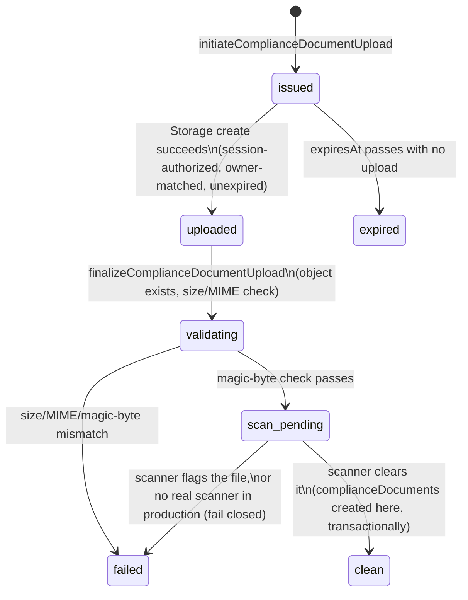
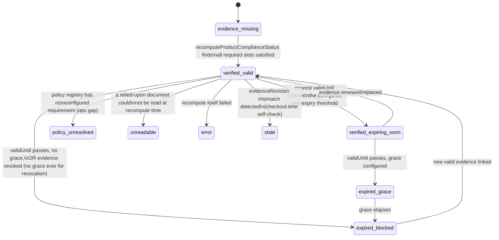

<!-- PLANNING DOCUMENT ONLY. No application code, Rules, indexes, Functions, or
     Flutter code were written to produce this plan. Nothing described here has
     been implemented or deployed. Revision 2 corrected 10 consistency defects
     found on review (see §0). Revision 3 (2026-08-25) replaces Slice 4's
     architecture with the corrected, adversarially-reviewed design (§0.1):
     server-mediated Marketplace eligibility, exact read/lookup ceilings, a
     fresh-per-request policy pointer, corrected approval enforcement, and
     sub-slices 4.1-4.9. Revision 4 (2026-08-25) completes Slice 4.1's own
     contract (§0.2): policy-version creation, empty-registry bootstrap,
     version-ID generation, an AND-of-OR requirement-group model, a single
     authoritative full-document validator reused at every trust boundary,
     and retraction of the version-content caching permission Revision 3 had
     granted, which was inconsistent with the bypass-write threat model
     Revision 4 itself establishes. Slice 1-3 records remain historical and
     unchanged throughout. -->

# Petsupo Marketplace P1-A — Compliance & Review Foundation: Implementation Plan (Revision 4)

**Date:** 2026-08-21 (Revision 2). **Revision 3:** 2026-08-25 — Slice 4 architecture corrected; see §0.1. **Revision 4:** 2026-08-25 — Slice 4.1 contract completed; see §0.2.
**Baseline:** branch `integration/mac-windows-2026-07-22`, HEAD `f2048cf25681d714ba562037604116ec42a80101` ("Fix server-owned product field protection (P0.1)"), parent `9238a528fcd267b6d24b3a589e94c93939d1cf3e` (P0). Working tree clean, upstream in sync, no deployment performed.
**Source architecture:** `docs/audits/marketplace_p1_bulk_compliance_inventory_architecture_2026-08-21.md` (Revision 3, with one field-level cross-reference addendum pointing back to this plan — see that document's status box).
**Status:** PLAN ONLY. Nothing in this document has been implemented, staged, committed, deployed, or pushed as a result of this plan.

---

## 0. Change log — what this revision corrects and why

| # | Defect in the prior plan | Fix |
|---|---|---|
| 1 | `complianceDocuments.storagePath` was marked required, but "set only by finalize" — an unresolved required-field-before-existence contradiction | New `complianceUploadSessions` collection owns the entire pre-existence upload/validate/scan lifecycle; `complianceDocuments` is only ever *created* once a session reaches `clean`, so `storagePath` is genuinely always present the instant the document exists |
| 2 | `complianceDocuments` carried `normalizedBrandId`/`supplierId`/`categoryId`/`familyId` as single-value fields, silently representing only one of a document's possibly-several scopes | Removed from `complianceDocuments` entirely; scope identity lives only in `complianceDocumentScopes` |
| 3 | No slice explicitly forbade deploying a Storage upload-create rule before the server lifecycle that tracks it existed | Slice boundaries corrected so the Storage create rule and the upload-session function are one deployed unit; no intermediate deployed state permits untracked owner uploads |
| 4 | The plan asserted "Slice 3 depends on Slice 2" in one table and "Slices 1 and 3 can begin immediately" in the verdict — directly contradictory | Slice numbering and the dependency graph rebuilt consistently (§17) |
| 5 | Approval/checkout eligibility was phrased as a negative check (`!= evidence_missing`), which fails open for any *new*, unenumerated status | Replaced with a positive allowlist (`in ['verified_valid','verified_expiring_soon']`) and every other status explicitly enumerated as fail-closed |
| 6 | Checkout's compliance check implicitly scanned `productEvidenceLinks`, an unbounded set | New bounded `productComplianceDecisions/{productId}` record, capped at 10 active evidence references, is what checkout actually reads |
| 7 | `validUntil: null` was treated as globally "never expires" | Now policy-dependent per `documentType`, via an extended `compliancePolicyRegistry`; unresolved policy fails closed (defaults to requiring `validUntil`) |
| 8 | Malware-scanning/legal-mapping "open decisions" were framed as blocking all related work, when they only block specific transitions | Reclassified: foundation code (scanner interface, fake/test scanner, quarantine workflow, policy engine, placeholder policy) is buildable now; only production activation of real scanning/policy is blocked |
| 9 | `normalizedBrandId` via "lowercase, trim, strip punctuation" could collapse distinct brands | Versioned normalizer (Unicode normalization, locale-independent case folding, explicit `normalizerVersion`) for *candidate* matching only; an approved brand scope requires a separate, admin-verified `verifiedBrandId` before it's used to link evidence |
| 10 | Signed-URL expiry was given as "60–120s" with a vaguer revocation claim | Corrected to "maximum 5 minutes, recommended," with an explicit, unambiguous statement that revocation cannot invalidate an already-issued URL — only bounds future issuance |

### 0.1 Revision 3 change log — Slice 4 architecture corrected (2026-08-25)

Slice 4 was never implemented (§16, §19-20 confirm only Slices 1-3 have shipped code). A pre-implementation audit, an architecture-decision memo, and two adversarial reviews found the original Slice 4 design (single "Slice 4" row, §4/§9/§10/§11 as drafted in Revision 2) contained load-bearing defects that would have shipped a fail-open Marketplace. This revision replaces that design; it does not touch any Slice 1-3 record, note, or deployment gate.

| # | Defect in the Revision 2 Slice 4 design | Fix |
|---|---|---|
| 11 | Direct client Firestore reads + Rules cross-document `get()` calls cannot give a zero-stale public-eligibility guarantee ("Rules are not filters" for list queries; per-call billing/limits) | Public Marketplace list/detail/reservation/add-to-cart/checkout move to a server-mediated eligibility architecture (new §10.1) with a shared, authoritative live evaluator |
| 12 | The "≤8 reads/product" bound was never achievable as literal billed document reads (queries bill ≥1 even empty; 7-8 lookup types each cost their own query+results; matched-scope resolution adds more) | Corrected to two frozen numbers: ≤8 bounded lookup *operations*, ≤42 billed document reads (worst case) — exact derivation in §10 |
| 13 | The `verifiedBrandId`/`normalizedBrandId` design had no stated cross-tenant constraint, allowing a seller to potentially claim another business's brand evidence by typing matching text | Every lookup (not only the business-type lookup) requires `businessId == product.businessId`; the normalizer algorithm is frozen exactly (§10) |
| 14 | No mechanism was specified to stop a raw admin-client Firestore write (or a forged "callable marker") from setting `moderationStatus: 'approved'` directly, since Admin SDK writes bypass Rules by definition and any Rules-checked marker is equally forgeable by the same client | Rules categorically deny every client-SDK transition into `approved` (create and update); only the `reviewProductModeration` Admin-SDK callable may perform it; it re-validates via the same live evaluator, fails closed on stale/missing input, and writes its audit event transactionally (§9, §11) |
| 15 | `productInputRevision`/`evidenceRevision` were not specified precisely enough to implement: no field-ownership category existed for "seller-writable but Rules-constrained," and the product create/edit path is a client-side Firestore transaction, which cannot write a fully server-owned field | `productInputRevision` is a new, explicit 6th product field (seller-writable, Rules-monotonic +0/+1 invariant); `evidenceRevision` stays server-owned and plan-compliant (`int`); staleness is two independent equality checks, never string concatenation or ordering (§4, §10.1) |
| 16 | `productEvidenceLinks` was implicitly treated as authoritative/live-maintained; it has no writer in the codebase as of this revision | Reclassified explicitly as a performance/reconciliation reverse index only — stale or missing links may only degrade performance, never admit an ineligible product (§4, §10.1) |
| 17 | The policy-registry "singleton active version" invariant was asserted as structurally guaranteed with no actual check | Retained pointer-based design; added a bounded anomaly check inside the activation transaction itself (§4, §10.1) |
| 18 | An initial correction proposed caching the active-policy pointer for up to 30 seconds as a performance optimization; this reintroduces a fail-open window, since the per-product freshness check is only as fresh as the pointer it's compared against | Corrected: the policy pointer is read fresh, once per request/transaction, on every path (listing, detail, add-to-cart, reservation, checkout, approval, recompute) — no TTL, no warm-instance caching. *(The remainder of this row's original fix — "the immutable version document's content... may be cached" — is superseded by Revision 4 correction 27, §0.2; the version document is now also read fresh at every authoritative resolution. This row is preserved as the historical record of what Revision 3 corrected; do not read the caching clause as current.)* |
| 19 | No deployment sequencing accounted for the fact that an exported Cloud Function is reachable the instant it is deployed, regardless of whether current UI calls it | Deployment order corrected to require every new callable to be either unexported, behind an explicit disabled feature flag, or deployed only at its activation step — never described as "safe because nothing calls it yet" (§17) |
| 20 | No mechanism ensured public listings reflect a policy activation immediately | Added an ops-triggered bulk recompute pass immediately following any policy activation, alongside the existing bounded sweep, to minimize the listings-thin-out window that the corrected fail-closed design otherwise produces (§10.1, §17) |

### 0.2 Revision 4 change log — Slice 4.1 contract completed (2026-08-25)

Slice 4.1's own uncommitted implementation (`compliancePolicyRegistryOperations.js` + tests, `functions/src/marketplace/compliance/complianceConstants.js`'s additive `RETIRED` status and pointer constants) surfaced, through a read-only contract audit, that Revision 3 committed Slice 4.1 to "registry CRUD" without ever specifying the "C." This revision completes that contract. It does not touch any Slice 1-3 record, note, or deployment gate, and does not touch the four Slice 4.1 code/test files directly — those are corrected separately, under their own authorization, against this now-complete contract.

| # | Defect in the Revision 3 Slice 4.1 contract | Fix |
|---|---|---|
| 21 | "Registry CRUD" named no actual creation operation, request shape, or writer for `compliancePolicyRegistry` version documents | Named exactly: `createCompliancePolicyVersion` (§4), create-only semantics, full input contract |
| 22 | No operation existed to bootstrap the registry from empty — `activatePolicyVersion` structurally requires a pre-existing pointer and cannot create one, by design | Named exactly: `bootstrapCompliancePolicyRegistry` (§4), a distinct transaction from ordinary activation, never weakening the ordinary anomaly check |
| 23 | Version-ID generation was unspecified | Server-generated via `crypto.randomUUID()`, matching `addComplianceScope`'s existing `scopeId` precedent; retries are explicitly **not** idempotent, matching that same precedent's own documented limitation |
| 24 | `sellerRelationship.<rel>.requiredDocumentTypes` (a flat array) can only express AND across its members — it cannot express "invoice AND (manufacturer OR wholesaler/supplier)," a requirement the plan's own `requiredEvidenceSlots` field already assumed was representable | Replaced with `requiredDocumentTypeGroups: DocumentType[][]` — outer array is AND, inner array is OR, outer length 1..5 to match the already-frozen `requiredEvidenceSlots` cap exactly, one group per slot |
| 25 | An empty `requiredDocumentTypes`/absent evidence gate was previously described as a legal "no gate" configuration | A present relationship must always have ≥1 non-empty requirement group; an empty top-level `sellerRelationship` is legal only for terminal `inactive` placeholders, never for `draft`/`active` |
| 26 | Deep content validation was only ever run at creation time, and creation can be bypassed by Admin SDK scripts, migrations, or future ops tooling | One authoritative `validateCompliancePolicyVersionDocument` re-runs on every trust boundary — creation, bootstrap, ordinary activation (both current and target), and every single `resolveActivePolicy` call — never relying on a past validation result |
| 27 | Revision 3 stated immutable version-document *content* may be cached across requests, reasoned solely from "the document can never change once written" — inconsistent with defect 26's own bypass-write threat model, since a cached copy taken before a bypass write would not reflect it | Retracted; the version document, like the pointer, is read fresh at every authoritative eligibility/approval/activation resolution; only within-one-request/transaction deduplication is permitted (§4, §10.1) |
| 28 | `effectiveFrom`'s enforcement semantics, comparison representation, and test-clock mechanism were unspecified | Frozen: future-dated drafts permitted at creation; bootstrap/activation/resolution all require `effectiveFrom.toMillis() <= nowMs` (equality permitted); no scheduled activation exists; `now` is injectable for deterministic tests (§4) |
| 29 | `inactive`'s and `retired`'s lifecycles were named but not fully closed against every other transition | Frozen exactly: `inactive` is created-only, terminal, never pointer-addressable, never becomes `draft`/`active`/`retired`; `retired` is only ever produced by ordinary activation retiring a version that was genuinely `active` (§4) |

---

## 1. Executive plan verdict

With all 10 corrections applied, the plan is internally consistent: every field has exactly one document of record, every slice's dependencies match its stated order, every compliance-eligibility check is a positive, fully-enumerated allowlist, and no unresolved product-owner/legal decision blocks anything beyond the specific production-activation step it actually gates. **Ready to commit as documentation.** Implementation itself remains gated on the same two named decisions as before (malware-scanning provider, Turkish legal evidence mapping) — but, per correction 8, only for the specific transitions those decisions govern, not for starting implementation work at all.

---

## 2. Confirmed baseline

Unchanged from the prior revision of this plan — branch `integration/mac-windows-2026-07-22`, HEAD `f2048cf25681d714ba562037604116ec42a80101`, P0 and P0.1 both present, working tree clean, upstream in sync, no deployment performed by any planning task to date.

---

## 3. Inclusion/exclusion matrix

Unchanged in substance from the prior revision — all 10 P1-A capabilities remain in scope, all P1-B/C/D items remain excluded (CSV/XLSX import, `channelConnections`/`externalListings`/`externalDemandHolds`/`externalPendingHold`, authority-transition execution, inventory event sync, reconciliation dashboard, M3/M5 flag changes, any deployment). `productReviewJobs` remains excluded from P1-A for the same reason as before (no real workload without P1-B's import volume); P1-A's admin review foundation is still served by scope-level approval with automatic recompute, not a job queue. Two items are **added** to the in-scope list, both required by this revision's corrections: `complianceUploadSessions` (correction 1) and `productComplianceDecisions` (correction 6) — both are P1-A-scoped mechanisms, not P1-B/C/D capability.

---

## 4. Exact P1-A data schemas

### `businessInventoryPolicies/{businessId}`

Unchanged from the prior revision of this plan (onboarding-default record only; see that revision's full field table — reproduced here for completeness).

| Field | Type | Required | Writer | Mutable | Validation | Privacy |
|---|---|---|---|---|---|---|
| `businessId` | string (= doc ID) | yes | Onboarding callable | Immutable | = doc ID | Internal |
| `stockAuthorityType` | enum | yes | Onboarding callable (P1-A: `manual`/`petsupo` only reachable) | Immutable in P1-A | Enum | Internal |
| `authorityConnectionId` | string, nullable | no | P1-C only | Always `null` in P1-A | Must be null unless mode requires it (unreachable in P1-A) | Internal |
| `status` | enum | yes | Onboarding callable | Always `active` in P1-A | Enum | Internal |
| `defaultSafetyStock` | int ≥ 0 | yes | Onboarding + seller edit | Mutable (own business) | ≥ 0 | Internal |
| `version`, `updatedBy`, `updatedAt`, `effectiveAt` | int / uid / timestamp / timestamp | yes | Server only | Server-set | — | Internal |

### `complianceUploadSessions/{sessionId}` — NEW (correction 1)

The complete pre-document lifecycle. `sessionId` is server-generated at `initiateComplianceDocumentUpload` time; `documentId` is reserved (pre-generated) at the same moment but does **not** yet correspond to any `complianceDocuments` record.

| Field | Type | Required | Writer | Mutable | Validation | Index | Privacy | Retention |
|---|---|---|---|---|---|---|---|---|
| `businessId` | string | yes | Server, at creation | Immutable | `isBusinessOwner()` | `[businessId, status]` | Internal | See §13 |
| `documentId` | string | yes | Server, reserved at creation | Immutable | Not yet a real document | — | Internal | See §13 |
| `objectPath` | string | yes | Server | Immutable | = `compliance_docs/{businessId}/{documentId}/{objectId}` | — | Sensitive (not the file itself, but its path) | See §13 |
| `documentType`, `sellerRelationship` | enum, enum | yes | Server, from the caller's initiate request | Immutable | Enum membership; combination checked against `compliancePolicyRegistry` | — | Internal | See §13 |
| `allowedMimeTypes` | array of string | yes | Server, from §9's constant list | Immutable | Fixed set: `application/pdf`, `image/jpeg`, `image/png` | — | Internal | See §13 |
| `maxSizeBytes` | int | yes | Server, from configured default (§9) | Immutable | — | — | Internal | See §13 |
| `status` | enum: `issued\|uploaded\|validating\|scan_pending\|clean\|failed\|expired` | yes | Server, state machine §6.0 | Server-only | Must follow the defined transitions | `[status, expiresAt]` (orphan-cleanup query) | Internal | See §13 |
| `issuedBy` / `issuedAt` | uid / timestamp | yes | Server | Immutable | = caller uid, `request.time` | — | Internal | See §13 |
| `expiresAt` | timestamp | yes | Server, `issuedAt` + short window (proposed default 15 minutes, §20) | Immutable | — | See above | Internal | See §13 |
| `finalizedAt` | timestamp, nullable | no | Server, on `uploaded → validating` | Set once | — | — | Internal | See §13 |
| `contentHash` | string (sha256), nullable | no | Server, computed at finalize | Set once | 64-char hex | — | Internal | See §13 |
| `sizeBytes` | int, nullable | no | Server, read from live object metadata at finalize | Set once | ≤ `maxSizeBytes` | — | Internal | See §13 |
| `scanResultRef` | string, nullable | no | Server, scanner-result handler | Set once | — | — | Internal | See §13 |

### `complianceDocuments/{documentId}` — corrected (corrections 1, 2)

Created **only** by the scanner-result handler transitioning a session to `clean` — never before. `storagePath` is therefore always present the instant the document exists; no nullable-required-field state is ever observed. **`normalizedBrandId`/`supplierId`/`categoryId`/`familyId` are removed** — scope identity lives only in `complianceDocumentScopes` (correction 2).

| Field | Type | Required | Writer | Mutable | Validation | Index | Privacy |
|---|---|---|---|---|---|---|---|
| `businessId` | string | yes | Server, mirrored from the session | Immutable | `isBusinessOwner()` | `[businessId, status]` | Internal |
| `sessionId` | string | yes | Server | Immutable | Traceability back to the upload lifecycle | — | Internal |
| `documentType`, `sellerRelationship` | enum, enum | yes | Server, mirrored from the session | Immutable | — | `[businessId, documentType, status]` | Internal |
| `storagePath` | string | yes (always present at creation) | Server, mirrored from the session | Immutable | Matches `compliance_docs/{businessId}/{documentId}/*` | — | **Sensitive** |
| `originalFilename`, `contentHash`, `sizeBytes` | string, string, int | yes | Server, mirrored from the session | Immutable | — | — | Sensitive / Internal / Internal |
| `version`, `supersedesDocumentId`, `supersededByDocumentId` | int / nullable string / nullable string | yes / no / no | Server | Immutable / set once / set once | — | — | Internal |
| `issuedAt`, `validFrom`, `validUntil` | timestamp, nullable each | Conditionally required — see §7 | Seller-declared at submission | Immutable | Policy-dependent (§7); no global "null = never expires" default | `[status, validUntil]` | Internal |
| `status` | enum: `clean\|pending_review\|approved\|rejected\|revoked\|expired\|superseded` | yes | Server, state machine §6.1 | Server-only | — | `[businessId, status]` | Internal |
| `uploadedBy`, `uploadedAt`, `reviewedBy`, `reviewedAt`, `rejectionReason`, `infoRequestNote`, `revokedBy`/`revokedAt`/`revocationReason` | as before | as before | Server | as before | as before | — | Internal |

### `complianceDocumentScopes/{scopeId}` — corrected (correction 9)

Gains `verifiedBrandId` for `scopeType: 'brand'` scopes.

| Field | Type | Required | Writer | Mutable | Notes |
|---|---|---|---|---|---|
| `documentId`, `businessId`, `scopeType`, `scopeValue`, `memberCount`, `status`, `createdAt/By`, `reviewedBy/At` | as before | as before | as before | as before | Unchanged from the prior plan revision |
| `verifiedBrandId` | string, nullable | Required before a `brand`-type scope is match-eligible | **Admin only**, set during `reviewComplianceScope` | Set once, then immutable | The scope's `scopeValue`/derived `normalizedBrandId` is a *candidate* signal only; `verifiedBrandId` is the admin's explicit confirmation that this scope really corresponds to a specific brand identity, and is what evidence-linking actually matches against for brand scopes (§10) |

### `complianceDocumentScopes/{scopeId}/members/{memberId}` and `complianceReviewEvents/{eventId}`

Unchanged from the prior plan revision — deterministic full-SHA-256 member IDs with post-lookup `identifierValue` verification; `complianceReviewEvents` remains append-only with `targetType` covering `document|scope|scope_member_batch|product`.

### `productEvidenceLinks/{linkId}` — reclassified (Revision 3 correction 16)

**Not the authoritative gate for any read path.** It is a performance/reconciliation reverse index only — it drives the async cache-repair trigger, the scheduled sweep's prioritization, and admin/ops tooling ("what products does revoking this document affect"). No live-eligibility check (§10.1) ever queries this collection; a stale or missing link may only degrade performance, never admit an ineligible product. As of this revision it has no writer anywhere in the codebase — it is schema-defined only; Slice 4.3/4.7 (§16) give it its first writer.

| Field | Type | Required | Writer | Notes |
|---|---|---|---|---|
| `linkId` (doc ID) | string | yes | Server, `deriveEvidenceLinkId({documentId, scopeId, productId})` — deterministic sha256, domain-separated, matching this codebase's established deterministic-ID convention | — |
| `productId`, `businessId`, `documentId`, `scopeId`, `scopeType` | string ×5 | yes | Server, `recomputeProductComplianceStatus` only | `businessId` is denormalized onto every link — every link is business-scoped by construction, since it is only ever written from within one product's own recompute |
| `linkedAt` | timestamp | yes | Server | — |
| `matchReasonCode` | string | yes | Server | Which of the 7 lookup types (§10) produced this link |

**Writer and cleanup:** each recompute performs a full delete-then-recreate of that product's own link set, bounded at the same cap as `activeEvidenceRefs` (10) — never an unbounded accumulation. Product deletion removes its link set in the same operation. A never-recomputed product has no link entry (harmless: it is also absent from `productComplianceDecisions`, so the live evaluator already excludes it). Removed/revoked evidence leaves a stale link until that product's own next recompute — harmless, since the live evaluator's freshness check (epoch/revision equality) already excludes the product regardless of link staleness. Policy-version changes are **not** this table's concern at all — they are global, not scoped to any one document/scope, and are caught purely by the `policyVersion` equality check in the live evaluator.

### `compliancePolicyRegistryPointer/current` — NEW (Revision 3 correction 17; caching permission retracted in Revision 4 correction 27)

Singleton document. The **sole** authoritative source of "what policy version is active" for every reader (recompute, the live eligibility evaluator, the approval callable). No reader ever queries `compliancePolicyRegistry` by `status`.

| Field | Type | Required | Writer | Mutable | Notes |
|---|---|---|---|---|---|
| `activeVersionId` | string (references `compliancePolicyRegistry/{registryVersion}`) | yes | Admin/ops, only via `bootstrapCompliancePolicyRegistry` (first write) or `activatePolicyVersion` (every subsequent write) below | Set only by bootstrap or activation | Read fresh, once per request/transaction, by every path that determines eligibility — listing, detail, add-to-cart, reservation, checkout, approval, and recompute. **Never cached across requests, by TTL or by warm Cloud Functions instance state** (Revision 3 correction 18) — a cached pointer makes the per-product freshness check compare against the wrong target, admitting products whose evidence was computed under a retired policy |

**Revision 4 correction 27 — the referenced version document is read fresh too, not cached.** Revision 3 permitted caching the *immutable* `compliancePolicyRegistry/{activeVersionId}` document's content, reasoned solely from "the document can never change once written." That reasoning does not hold once Admin SDK scripts, migrations, or future ops tooling are included in the threat model (as they must be, per Revision 4 correction 26 below) — a cached copy taken before such a write would not reflect it, and "revalidating" stale cached bytes proves nothing about current stored state. Corrected rule: the exact referenced version document is read fresh at every authoritative eligibility/approval/activation resolution, exactly like the pointer. Deduplication is permitted only *within* one request/transaction (e.g. reading it once inside `activatePolicyVersion`'s own transaction and reusing that read for multiple checks in the same call is not "caching" in the forbidden sense). Any future caching requires a separately-proven immutable storage/IAM/write-boundary design — a genuinely stronger guarantee than documentation convention — and is out of scope for Slice 4.1.

**Two distinct writers, two distinct transactions — never conflated:**

- **`bootstrapCompliancePolicyRegistry({ db, targetVersionId, now })`** (Revision 4 correction 22) — the *only* operation permitted to create this pointer document, and only when it does not yet exist. Inside one transaction: reads the pointer and requires it **not** to exist (else `policy_bootstrap_pointer_already_exists`, zero writes); reads the exact target version by a pre-validated `targetVersionId` (invalid shape rejected before any Firestore path is constructed) and requires it to exist, pass `validateCompliancePolicyVersionDocument` (§4 below) with `{allowedStatuses: [draft], requireActivationEligible: true, nowMs}`, and be exactly `status: 'draft'` — `inactive` is never treated as draft-equivalent; runs the same bounded `where(status=='active').limit(2)` anomaly query as ordinary activation and requires **zero** results (any active version existing despite a missing pointer is an anomaly, not a state to repair silently — zero writes). Only if every check passes: exactly two atomic writes — `tx.update(targetRef, {status: 'active'})` and `tx.create(pointerRef, {activeVersionId: targetVersionId})` (`create`, never `set`/`merge`/`update` — this is what makes "exactly one concurrent bootstrap attempt may succeed" a Firestore-enforced guarantee: a second, concurrent transaction's `tx.create` on the same now-existing pointer fails at commit time, triggering Firestore's own automatic retry, which then correctly observes the pointer already exists and fails closed on retry). Bootstrap never auto-creates the target version, never repairs an anomalous registry, and is structurally usable at most once per registry lifetime — once a pointer exists, `bootstrapCompliancePolicyRegistry`'s own first precondition makes it permanently inapplicable.
- **`activatePolicyVersion({ db, targetVersionId, now })`** — unchanged in shape from Revision 3, **strengthened in Revision 4 correction 26**: reads the current pointer, the target version doc, and the bounded anomaly query exactly as before, but now runs `validateCompliancePolicyVersionDocument` on **both** the stored current-active version (`{allowedStatuses: [active], requireActivationEligible: true, nowMs}`) and the stored target (`{allowedStatuses: [draft], requireActivationEligible: true, nowMs}`) before any write — a malformed current-active version now **aborts the entire activation with zero writes**, rather than being retired and silently replaced. If every check passes: three atomic writes — the old active version's `status → retired`, the new version's `status → active`, and the pointer's `activeVersionId`. `activatePolicyVersion` is subsequent-activation-only; it never handles an empty registry (it fails closed on a missing pointer, exactly as before) and never repairs anomalies.

A missing pointer, or a pointer naming a version document that does not exist, is malformed, or fails `validateCompliancePolicyVersionDocument`, is treated by every reader as "no active policy" and fails closed — no product can be found eligible.

### `compliancePolicyRegistry/{registryVersion}` — now fully schematized (was under-specified before; extended per correction 7; `status` invariant corrected in Revision 3; creation/bootstrap/validation contract completed in Revision 4)

Exactly six top-level fields, always, for every version document — no more, no fewer:

| Field | Type | Required | Writer | Mutable | Notes |
|---|---|---|---|---|---|
| `sellerRelationship` | map, keyed by a subset of the 6 relationship enum values | yes | Server, `createCompliancePolicyVersion` only — never a raw client write | Immutable per version — a change is a new `registryVersion`, never an in-place edit; drafts are never editable in place | A **partial** map is legal — an absent relationship key means `policy_unresolved` (§5.5) for that relationship, not an error. See the nested schema below |
| `status` | enum: `draft\|active\|inactive\|retired` | yes | `createCompliancePolicyVersion` sets the **initial** value (`draft` or `inactive` only — never `active`/`retired` at creation); `bootstrapCompliancePolicyRegistry` and `activatePolicyVersion` are the only operations that ever change it thereafter | Server-only; the only field that ever changes post-creation | **Metadata only, not an independent source of truth** (Revision 3 correction 17) — readers never query by this field, only the pointer determines what's active. (Revision 4 correction: the prior "written only by the activation transaction" wording described *transition* ownership, not *creation* ownership — clarified here explicitly, since taken literally it could not describe how a version gets its first status value at all.) |
| `effectiveFrom` | Firestore Timestamp | yes | `createCompliancePolicyVersion`, caller-supplied | Immutable | Future-dated values are permitted at creation (no scheduled activation exists in Slice 4.1 — see the version-lifecycle subsection below); bootstrap/activation/every `resolveActivePolicy` call require `effectiveFrom.toMillis() <= nowMs`, equality permitted |
| `createdBy` | string (uid), non-empty, ≤128 chars | yes | `createCompliancePolicyVersion`, from trusted server/admin context — never raw request input | Immutable | — |
| `createdAt` | Firestore Timestamp | yes | `createCompliancePolicyVersion`, server time — never caller-suppliable | Immutable | Rejected as invalid if found later than the resolving instant (`createdAt.toMillis() <= nowMs` wherever `nowMs` is available) — a future `createdAt` is only reachable via clock skew or a corrupted/bypass write |
| `changeNote` | string, non-empty, ≤2000 chars | yes | `createCompliancePolicyVersion`, caller-supplied | Immutable | — |

**No delete operation exists in Slice 4.1.** No generic update operation exists either — the only two writers that ever touch an existing version document are `bootstrapCompliancePolicyRegistry` and `activatePolicyVersion`, and both touch only `status`. Any correction to policy *content* is a brand-new version document at a brand-new `versionId`, never an edit.

#### Exact nested `sellerRelationship` schema (Revision 4)

For each **present** relationship key (∈ `SELLER_RELATIONSHIP`, 6 values — a partial map is legal, see above), exactly six nested fields, closed schema:

| Field | Type | Notes |
|---|---|---|
| `acceptedDocumentTypes` | array of `COMPLIANCE_DOCUMENT_TYPE` (8 values), unique | A pure allowlist — which document types are even meaningfully associated with this relationship. Bounded at ≤8 by construction (unique + closed enum), no separate size cap needed |
| `requiredDocumentTypeGroups` | `DocumentType[][]` — **replaces the flat `requiredDocumentTypes: DocumentType[]` field** | **Outer array = AND, inner array = OR.** Outer length **1..5** for any activation-eligible configuration (§ below) — tied exactly to the already-frozen `productComplianceDecisions.requiredEvidenceSlots` cap of 5 (§4 below), since one policy requirement group maps to exactly one decision slot. Each inner group non-empty, members unique and ∈ `COMPLIANCE_DOCUMENT_TYPE` (bounded ≤8 by the same construction). Duplicate groups are rejected *after canonicalization* (sorting each group's members before comparing, so the same alternatives listed in a different order are still caught as a duplicate). Every member, across all groups, must also be ∈ `acceptedDocumentTypes`. Example — `invoice AND (manufacturer authorization OR supplier/wholesaler authorization)` is exactly two groups: `[[purchase_invoice], [manufacturer_evidence, supplier_agreement]]`. The *exact* Turkish-legal-mapping content (which relationship legally requires which groups) remains the sole externally-unresolved question (§19) — this schema only fixes what the *mechanism* can represent, not what any real policy's groups should contain |
| `perDocumentTypePolicy` | map, keyed by `documentType` ∈ `acceptedDocumentTypes` (partial coverage legal) | Each present entry exactly `{validUntilRequired: bool, issueDateRequired: bool}`. An accepted type absent from this map is not malformed — it inherits §7's own fail-closed default (`validUntilRequired`/`issueDateRequired` treated as `true` when unconfigured), applied by the future Slice 4.3 matching engine at read time, not enforced as mandatory population at creation |
| `maximumValidityPeriod` | `null`, or `Number.isSafeInteger(value) && value > 0` (milliseconds) | Bounded by `Number.MAX_SAFE_INTEGER`, named `COMPLIANCE_POLICY_MAXIMUM_VALIDITY_PERIOD_MS_CEILING` — a structural/overflow-defense ceiling only; no tighter business-meaningful ceiling exists anywhere in this repository's conventions to derive one from, so none is invented. This single condition already rejects floats, `NaN`, `Infinity`, zero, and negative values |
| `acceptedScopeTypes` | array of `COMPLIANCE_SCOPE_TYPE` (7 values), unique | **Non-empty required** for any relationship with non-empty `requiredDocumentTypeGroups` — traced directly against the source architecture document's §10 evidence-matching table: all 7 lookup types are scope-type-keyed, so a relationship requiring evidence with zero accepted scope types could never have that evidence linked by any product, ever. Not fail-open, but almost certainly an operator mistake, caught at creation/bootstrap/activation time rather than accepted silently |
| `manualAdminOverridePermitted` | boolean | Governs a **separately-defined, audited document-review workflow** only — see the non-bypass invariant immediately below. A pure structural boolean as far as Slice 4.1's validator is concerned; it carries no evidence-satisfaction meaning |

**Zero-evidence policy, stated once, precisely:** a missing relationship key always resolves to `policy_unresolved` (ineligible) — unchanged, unambiguous. A **present** relationship key with zero requirement groups is invalid and non-activatable — it can never mean "no gate," "auto-pass," or unrestricted eligibility. Any `draft` or `active` version must have at least one relationship key configured with a valid, non-empty requirement (checked via the `requireActivationEligible` validator option below) — an empty top-level `sellerRelationship: {}` is legal **only** for a terminal `inactive` placeholder. An `inactive` document with present relationship entries must still pass the full nested structural validation above — only the "must be non-empty overall" requirement is status-gated; malformed content is never acceptable regardless of status.

**Manual-override non-bypass invariant (Revision 4).** Read precisely, §4's own definition — *"whether an admin may approve a document that fails an automated policy check, with a recorded justification"* — governs a document-review action (approving one submitted evidence document despite an automated flag), not product-eligibility. `manualAdminOverridePermitted` therefore must never, under any future consumer: replace missing mandatory evidence; satisfy a `requiredEvidenceSlot` by itself; bypass a malware/infected scan verdict; bypass revoked or expired evidence; bypass business ownership/tenant matching; bypass document-type or scope matching; or directly make a product eligible. No code currently consumes this field (Slice 3 still uses its interim hardcoded fallback; the future Slice 4.3 matching engine that would consume it does not exist yet) — this is a constraint on that future consumer, not a claim about existing behavior, and no contradiction with this reading exists anywhere in the currently committed plan text.

#### `createCompliancePolicyVersion` — the creation operation (Revision 4 correction 21)

Internal only, never exported from `functions/index.js`.

| Input | Source | Notes |
|---|---|---|
| `sellerRelationship` | caller | validated per the nested schema above |
| `effectiveFrom` | caller | Firestore Timestamp; future-dated permitted |
| `changeNote` | caller | non-empty, ≤2000 chars |
| `initialStatus` | caller, **allowlisted to exactly `draft` or `inactive`** | never `active`/`retired` at creation — enforced by a context-specific check layered on top of the shared status-enum check, since the shared enum alone would also accept `active`/`retired` |
| `createdBy` | trusted server/admin context | never raw request input |
| `createdAt` | the operation itself | server time; never caller-suppliable |
| `versionId` | the operation itself | `crypto.randomUUID()` — see the version-ID subsection below; never caller-suppliable |

The complete candidate document is validated by `validateCompliancePolicyVersionDocument` (below) — `{allowedStatuses: [initialStatus], requireActivationEligible: initialStatus === 'draft'}`, no `nowMs` (future-dated drafts remain legal at creation) — **before** the write. The write is `tx.create()` (or an equivalent create-only call) — never `set`/`update` — so an existing version document is provably never overwritten.

**Version-ID generation (Revision 4 correction 23):** server-generated via `crypto.randomUUID()`, matching the existing `addComplianceScope`/`scopeId` precedent in `complianceDocumentOperations.js` exactly — the closest functional analog in this codebase (a value the caller needs returned and later re-references, exactly like `versionId` is for a subsequent `bootstrapCompliancePolicyRegistry`/`activatePolicyVersion` call). **Retries are explicitly not idempotent** — a retried `createCompliancePolicyVersion` call with identical content produces a second, distinct draft at a new random ID, the same accepted limitation `addComplianceScope` already documents about itself. A resulting duplicate draft may be **abandoned or ignored**; it remains **permanently stored** in `compliancePolicyRegistry` unless a separately designed, separately authorized future cleanup operation is built — none is proposed by this plan.

#### `validateCompliancePolicyVersionDocument(version, options)` — the one authoritative validator (Revision 4 correction 26)

Pure, side-effect-free — no Firestore access, no throwing, no framework dependency — reused identically by all four operations below, never four divergent checks:

```
validateCompliancePolicyVersionDocument(version, options = {}) -> { valid: true } | { valid: false, reason: string }

options:
  allowedStatuses?: string[]           // e.g. ['draft'] for a bootstrap/activation target, ['active'] for the current/resolved version
  requireActivationEligible?: boolean  // folds in "sellerRelationship must have >=1 configured relationship"
  nowMs?: number                       // when present, also enforces effectiveFrom/createdAt <= nowMs; when absent, that check is skipped (creation-time validation of a future-dated draft)
```

It validates, in order, first failure wins: the exact six top-level fields (no missing, no unknown); `status` ∈ the enum and, if given, ∈ `allowedStatuses`; `effectiveFrom`/`createdAt` are Timestamp-like with a valid `toMillis()`; `createdBy`/`changeNote` bounds; the complete nested `sellerRelationship` schema above, unconditionally, on whatever is present, regardless of status; the "at least one relationship configured" rule, only when `requireActivationEligible`; and, only when `nowMs` is supplied, the `effectiveFrom`/`createdAt` boundary. **No operation may rely on an earlier validation result** — every one of the four call sites below re-runs this function against a document read fresh in that same call, never a cached verdict from a prior call.

| Operation | Document(s) validated | Options |
|---|---|---|
| `createCompliancePolicyVersion` | the candidate document, before create | `{allowedStatuses: [initialStatus], requireActivationEligible: initialStatus === 'draft'}` |
| `bootstrapCompliancePolicyRegistry` | the stored target, inside the transaction | `{allowedStatuses: ['draft'], requireActivationEligible: true, nowMs}` |
| `activatePolicyVersion` | **both** the stored current-active version and the stored target, inside the transaction | current: `{allowedStatuses: ['active'], requireActivationEligible: true, nowMs}`; target: `{allowedStatuses: ['draft'], requireActivationEligible: true, nowMs}` |
| `resolveActivePolicy` | the stored active version named by the pointer, on every call | `{allowedStatuses: ['active'], requireActivationEligible: true, nowMs}` |

#### Version status lifecycle — frozen (Revision 4)

| From | To | Operation |
|---|---|---|
| *(nonexistent)* | `draft` | `createCompliancePolicyVersion` |
| *(nonexistent)* | `inactive` | `createCompliancePolicyVersion` |
| `draft` | `active` (+ pointer created) | `bootstrapCompliancePolicyRegistry` — first activation only |
| `draft` | `active`, and the prior `active` → `retired` | `activatePolicyVersion` — every subsequent activation |
| `inactive` | *(nothing)* | **no transition exists** — terminal, never pointer-addressable, never activatable, editable, or retired (it was never active); if equivalent content is later needed for real activation, a genuinely new `draft` is created at a new `versionId` |
| `retired` | *(nothing)* | terminal |
| any | *(content change)* | **none — immutable forever; a new `versionId` is required instead** |

"Registry CRUD" (§13.1, §16, as originally written) undersold and mis-scoped this lifecycle — replaced everywhere below with **create, resolve, bootstrap, and subsequent activation**: Delete is intentionally absent (matching this plan's append-only conventions elsewhere), and Update is intentionally narrowed to exactly the two `status`-only transitions above, never a generic field-level update.

### `businessComplianceEpochs/{businessId}` — NEW (Revision 3)

Singleton-per-business document tracking how many times this business's evidence set has meaningfully changed.

| Field | Type | Required | Writer | Mutable | Notes |
|---|---|---|---|---|---|
| `epoch` | int | yes | Server, `tx.set(ref, {epoch: FieldValue.increment(1)}, {merge:true})` — never `tx.update()`, which throws on a nonexistent document; `increment()` on a missing field starts from 0 | Monotonically increasing | Bumped only by five specific, non-idempotent Slice 3 transitions (§8) — never on an idempotent replay or a transition that was never valid evidence in the first place. Bounded `< Number.MAX_SAFE_INTEGER`. A single document per business is a known, accepted, low-risk write-contention point given the human-paced admin review workload this serves; the mitigation (sharded counters) is named but not built, pending an operational contention metric ever showing sustained retries |

### `productComplianceDecisions/{productId}` — NEW (correction 6); freshness model corrected in Revision 3

The bounded, live-eligibility-facing output of `recomputeProductComplianceStatus`. Doc ID = `productId`, so exactly one decision record exists per product (same one-doc-per-entity pattern as `businessInventoryPolicies`). This record is no longer consulted only at checkout — the same live evaluator (§10.1) reads it for listing, detail, add-to-cart, reservation, checkout, and product-approval.

| Field | Type | Required | Writer | Notes |
|---|---|---|---|---|
| `businessId` | string | yes | Server | For ownership-scoped reads |
| `policyVersion` | string | yes | Server | The `compliancePolicyRegistry` version this decision was computed against; every live-evaluator call re-verifies this still equals the *current* pointer's `activeVersionId`, read fresh — never cached (§10.1) |
| `evidenceRevision` | int | yes | Server | Must equal the product document's own `evidenceRevision`, which itself equals `businessComplianceEpochs/{businessId}.epoch` at the time of last successful recompute — a mismatch means the decision is stale relative to the business's evidence set |
| `productInputRevisionSnapshot` | int | yes (**NEW, Revision 3**) | Server | The product's own `productInputRevision` (§11) at compute time — a mismatch against the product's *current* value means the product's own matching-relevant fields (category, brand, barcode, sku) changed since this decision was computed. Staleness is always an **equality** comparison against live values — never lexicographic string comparison, a compound/concatenated representation, or an ordering comparison; Firestore's own transactional optimistic-concurrency retry, not manual revision ordering, is what prevents an older recompute from clobbering a newer one |
| `requiredEvidenceSlots` | array, max 5 entries | yes | Server | Each entry a small structured requirement (e.g. "one of: purchase_invoice, supplier_agreement, authorization_letter"), derived from the policy for this product's declared relationship/category. If a required slot's `acceptedScopeTypes` names only dimensions the product schema cannot currently populate (e.g. only `supplier`/`product_family`, before those identifiers exist on `products`), the decision resolves that slot as `policy_unresolved` (an ops gap), never as `evidence_missing` (which would misleadingly imply the seller can remediate it by submitting a document) |
| `satisfiedEvidenceSlots` | array, same shape, subset of required | yes | Server | Which required slots currently have valid, linked evidence |
| `activeEvidenceRefs` | array of `{documentId, scopeId, expiresAt}`, **capped at 10 entries** | yes | Server | The explicit bound requested — the live evaluator re-verifies each of these (never more than 10), not an unbounded scan of `productEvidenceLinks`. This cap is shared, by rule, with `productEvidenceLinks`'s own per-product cap (§4 above) — the two are never sized independently |
| `computedAt` | timestamp | yes | Server | — |
| `validUntil` | timestamp, nullable | no | Server | The **effective** `validUntil` — the earliest `validUntil` among `activeEvidenceRefs`. Valid only when `validUntil > now`, strictly greater; a value equal to the current instant is already treated as expired. Missing or malformed values fail closed (never treated as "no expiry constraint") |
| `effectiveStatus` | enum (§11's full positive-first enum) | yes | Server | Denormalized copy of the product's own `complianceEffectiveStatus`, kept alongside the supporting detail for the live evaluator's own re-verification. Used as a fast pre-filter only — the live evaluator's equality checks above are what's authoritative, never this cached field alone |
| `decisionHash` | string (sha256) | yes | Server | Digest of the canonical serialization of the fields above; the live evaluator recomputes and compares as a final consistency signal |

**If more than 10 evidence links would otherwise apply to one product**, `recomputeProductComplianceStatus` selects the 10 with the soonest `validUntil` (the ones most operationally relevant to monitor), using a fully deterministic order (`status=='approved' THEN approvedAt ASC THEN documentId ASC` — oldest verified evidence wins ties) and records the truncation itself as a `complianceReviewEvents` entry for admin visibility — it does not silently drop the excess or fail the recompute. This bound is a proposed default (§20), not a hard architectural ceiling.

---

## 5. State machines

### 5.0 Upload session (NEW, correction 1)



Every transition, actor/operation/preconditions/writes/audit/notification/idempotency/forbidden, exactly as the prior plan revision's table format — restated for the two states that changed meaning:

| Transition | Actor | Operation | Preconditions | Writes | Idempotency | Forbidden |
|---|---|---|---|---|---|---|
| `issued → uploaded` | Seller (via Storage SDK) | Storage `create` (Rules-gated, no Cloud Function) | Session `status=='issued'`, unexpired, `objectPath` matches exactly, owner matches | Storage object only — no Firestore write here | Storage denies `update`/overwrite at this path unconditionally, so a second attempt is structurally impossible, not merely detected | Uploading to any path other than the session's exact `objectPath` |
| `scan_pending → clean` | System (scanner callback) | Scan-result handler | Scanner reports clean; session still `scan_pending` | `complianceUploadSessions.status`, **and, in the same transaction, creates `complianceDocuments/{documentId}`** via `transaction.create()` (fails if the doc somehow already exists — the idempotency backstop for correction 1's "multiple documents from one session" requirement) | Keyed by `sessionId:scanresult` | Creating `complianceDocuments` from a session not in `scan_pending`; creating it a second time for the same session |

### 5.1 Compliance document

Unchanged in shape from the prior plan revision, with the enum trimmed to `clean|pending_review|approved|rejected|revoked|expired|superseded` (no `uploaded`/`validating`/`scan_pending` — those are now purely session-level states, per correction 1). `submitComplianceDocument`'s preconditions gain the policy check from correction 7: if `compliancePolicyRegistry` (active version) requires `validUntil` for this `documentType` and it is absent, submission is rejected outright, not merely flagged for review.

> **Slice 3 implementation note (added during the Slice 3 correction pass, 2026-08-24).** An adversarial review of the merged-but-uncommitted Slice 3 code found a genuine tension between this paragraph (which states the policy check as an unqualified precondition of `submitComplianceDocument`, a Slice 3 file per §13) and §16's dependency graph (which gives Slice 3 "Depends on: Slice 2" only, with `compliancePolicyRegistry.js` — the artifact this check reads — assigned exclusively to Slice 4, which itself depends ON Slice 3). The plan never states that this precondition activates only once Slice 4 ships. Resolved, without touching Slice 3's own dependency graph or file boundary: **until Slice 4 supplies the real per-`documentType` registry lookup, `submitComplianceDocument` enforces §7's own already-documented safe default — `validUntilRequired: true` — universally, hardcoded, for every `documentType`**, rather than querying a registry that does not exist yet. This is the plan's own stated conservative fallback (§7: *"the mechanism fails toward requiring more evidence, not less, when unconfigured"*), applied directly instead of left unenforced. Slice 4 replaces this hardcoded universal rule with the real per-type lookup when `compliancePolicyRegistry.js` lands; it does not need to touch anything else in Slice 3's file. **Policy-driven `acceptedScopeTypes` matching (§4, the sibling field in the same `compliancePolicyRegistry` object) remains exclusively Slice 4's responsibility — no fallback for it is implemented, and none should be invented — which is precisely why Slice 3's callables are not independently deployment-complete: see the deployment-gate note below.**
>
> **Deployment gate.** Slice 3's callables (`submitComplianceDocument` and the other eight in `complianceDocumentOperations.js`) must NOT be independently deployed/activated in production ahead of Slice 4 unless the conservative universal `validUntil` requirement above remains enforced exactly as implemented. Deploying Slice 3 with that fallback removed or weakened before Slice 4's real registry is live reopens the exact fail-open gap this note exists to close: a document could reach `approved` permanently missing `validUntil`, since `issuedAt`/`validFrom`/`validUntil` are set once and immutable thereafter (§4), with no in-slice remediation path.

### 5.2–5.4 (scope, member, evidence link)

Unchanged, with 5.2's admin review step for `scopeType: 'brand'` now also requiring `verifiedBrandId` to be set before the scope transitions to `approved` (correction 9) — a brand scope cannot be approved without it.

> **Slice 3 implementation note (second correction pass, 2026-08-24) — pending members beneath a rejected parent scope.** This plan does not state what happens to a `pending_review` member when its parent scope is rejected; adversarial review of the Slice 3 implementation found that a single, decision-blind parent-status gate left such members permanently stranded (no legal transition at all — `approve` correctly stayed blocked, but so did `reject`). Rather than inventing cascade behavior this document does not specify, an explicit product decision resolves the gap narrowly: **`reviewComplianceScopeMembers`'s `approve` decision continues to require the parent scope be `pending_review` or `approved` — unchanged, a rejected parent can never produce an `active` member, without exception. Its `reject` decision additionally permits a `rejected` parent** — rejecting never grants trust, so a still-pending member may always be explicitly rejected rather than left stranded. No new state, transition, or automatic cascade is introduced: `pending_review → rejected` is already each member's own existing legal transition (§4); this decision only widens *when* it may be invoked, for `reject` only. Scope rejection itself (`reviewComplianceScope`) still never cascades to members automatically.

### 5.5 Product compliance — corrected enum (correction 5)



Full status table, requirement 5's explicit ask:

| Status | Meaning | Public visibility | Add to cart (new) | Reservation | Payment confirmation |
|---|---|---|---|---|---|
| `verified_valid` | All required evidence present, approved, unexpired | ✓ | ✓ | ✓ | ✓ |
| `verified_expiring_soon` | Same, within the pre-expiry notice window (still currently valid) | ✓ | ✓ | ✓ | ✓ |
| `expired_grace` | Past `validUntil`, within a configured, separately-approved UI grace window | ✓ (if grace configured) | ✓ | ✗ | ✗ |
| `expired_blocked` | Past `validUntil` with no grace, or grace elapsed | ✗ | ✗ | ✗ | ✗ |
| `revoked` | Evidence explicitly revoked — no grace, ever | ✗ | ✗ | ✗ | ✗ |
| `rejected` | Document/scope reviewed and rejected | ✗ | ✗ | ✗ | ✗ |
| `policy_unresolved` | No configured policy for this product's relationship/category — an ops gap, not the seller's fault | ✗ | ✗ | ✗ | ✗ |
| `unreadable` | A relied-upon document could not be read (transient error, permission issue, dangling link) | ✗ | ✗ | ✗ | ✗ |
| `evidence_missing` | No evidence links exist at all | ✗ | ✗ | ✗ | ✗ |
| `calculating` | Transiently observed mid-recompute by a live check (rare — recompute is transactional, so a product's own committed field never actually rests here) | ✗ | ✗ | ✗ | ✗ |
| `stale` | Checkout-time self-check found `evidenceRevision` mismatch | ✗ | ✗ | ✗ | ✗ |
| `error` | The recompute function itself failed (operational alert, not a normal state) | ✗ | ✗ | ✗ | ✗ |
| `unknown` | Defensive catch-all for uninitialized/corrupted state — should never occur for a P1-A-era product | ✗ | ✗ | ✗ | ✗ |

**The positive allowlist used everywhere an eligibility check is needed:** `complianceEffectiveStatus in ['verified_valid', 'verified_expiring_soon']` — for product approval eligibility, for the public-read Rule's third condition (retained as defense-in-depth only, not the primary correctness mechanism — §9, §10.1), and as the live evaluator's fast pre-filter on every surface, always followed by the equality-based live re-verification (§10.1, §11). Every status not in this list fails closed, by construction of the allowlist rather than by remembering to exclude each one.

### 5.6–5.8

Unchanged from the prior plan revision.

---

## 6. Trust boundaries

Unchanged from the prior plan revision, with one addition: **the scanner-result handler and the orphan-cleanup scheduler are System-only, exactly like `recomputeProductComplianceStatus`** — never directly invocable by a seller or admin request, since both mutate `complianceUploadSessions`/Storage objects in ways that must remain a single, trusted code path.

---

## 7. Seller relationship and evidence policy — extended (correction 7)

The registry design from the prior plan revision (a versioned, seller-uneditable mapping) is unchanged in *mechanism*. What's corrected: `validUntil` handling is no longer a blanket "null = never expires" default anywhere in the system — it is **policy-dependent per `documentType`**, read from `compliancePolicyRegistry.sellerRelationship.<rel>.perDocumentTypePolicy.<type>.validUntilRequired`. `submitComplianceDocument` enforces this at submission time (§5.1): a document of a type the active policy marks `validUntilRequired: true` cannot be submitted for review without a `validUntil` value.

**Fail-closed default for unresolved policy content:** until the real Turkish-legal-informed values are set, the placeholder registry (§4, `status: inactive`) is *not* usable in production at all (correction 8) — but the *test/emulator* placeholder used to exercise this mechanism during implementation defaults every `perDocumentTypePolicy` entry to `validUntilRequired: true`, the conservative, safer default, rather than `false`. This document does not assert what the real Turkish legal requirement is — only that the mechanism fails toward requiring more evidence, not less, when unconfigured.

> **Slice 3 implementation note (2026-08-24):** this section's own stated conservative default (`validUntilRequired: true`) is what Slice 3 implements directly, hardcoded and universal, in the window before Slice 4's real registry exists — see the fuller note and deployment gate at §5.1.

---

## 8. Server operations — corrected for the upload-session split (correction 1)

| Operation | Change from prior revision |
|---|---|
| `initiateComplianceDocumentUpload` | Now creates a `complianceUploadSessions` document (not `complianceDocuments`). Reserves `documentId` and `objectPath`, returns them to the client for the direct Storage upload |
| *(Storage upload itself)* | Not a Cloud Function — a direct client→Storage write, gated entirely by the Storage Rule described in §9 |
| `finalizeComplianceDocumentUpload` | Validates the now-uploaded object (existence, size, declared MIME, magic bytes), computes `contentHash`, advances the session `uploaded → validating → scan_pending`. Still creates nothing in `complianceDocuments` |
| **`handleComplianceScanResult`** (new, replaces the implicit "scanner clears it" step) | System-only, invoked by the scanner integration (or, in test/emulator environments only, a fake scanner). On `clean`: creates `complianceDocuments` transactionally, using `transaction.create()` keyed by the reserved `documentId` (idempotency backstop). On a flagged result: session `→ failed`, no document ever created |
| **`complianceUploadOrphanCleanup`** (new, scheduled) | Deletes sessions past `expiresAt` that never reached `uploaded`, and sessions/objects stuck before `clean` past a bounded retention window (proposed 7 days) — deletes the orphaned Storage object first, then the session document, in that order, so a crash mid-cleanup never leaves a session pointing at a deleted-but-still-referenced object |
| `submitComplianceDocument` | Unchanged shape; gains the policy-driven `validUntil` requirement check (§7) |
| `addComplianceScope`, `addComplianceScopeMembers`, `reviewComplianceScopeMembers` | Unchanged |
| `reviewComplianceScope` | Gains: for `scopeType:'brand'`, requires the admin to supply `verifiedBrandId` as part of an `approve` decision; `approve` is rejected without it (correction 9) |
| `requestComplianceInformation`, `revokeComplianceDocument`, `supersedeComplianceDocument` | Unchanged |
| `issueComplianceDocumentAccess` | Expiry corrected to a maximum of 5 minutes (was 60–120s as a range; now stated as an explicit ceiling, §10 of this section's cross-reference to the Storage plan) |
| `recomputeProductComplianceStatus` | Now additionally writes `productComplianceDecisions/{productId}` (bounded to 10 `activeEvidenceRefs`) and the product's `productEvidenceLinks` set (same 10-entry cap, delete-then-recreate) in the same transaction as the product's own denormalized fields — not a separate, later step. Reads the active-policy pointer **fresh**, every invocation — never cached (Revision 3 correction 18). Bounded at exactly 8 lookup operations / 42 billed document reads worst case (§10) |
| `evaluateLiveProductEligibility` (**new, Revision 3, internal shared module — not independently exported**) | The single authoritative freshness/eligibility check, called by every path that admits or excludes a product: `getMarketplaceProductList`, `getMarketplaceProductDetail`, add-to-cart, reservation, checkout, and `reviewProductModeration`. Reads the active-policy pointer fresh; compares `evidenceRevision`/`productInputRevisionSnapshot`/`policyVersion` by equality against live values; excludes on any mismatch (fail closed — a false exclusion of an actually-still-eligible product is the safe direction, never a false inclusion) |
| `getMarketplaceProductList`, `getMarketplaceProductDetail` (**new, Revision 3**) | Server-mediated, paginated public Marketplace eligibility endpoints — see §10.1 for the full contract (page size/cursor, over-fetch/sparse-page bound, App Check, rate limits, response projection). Replace direct client Firestore product-list/detail queries for the public Marketplace surface once deployed and Flutter clients migrate (§16 Slice 4.8, §17) |
| `reviewProductModeration` (**new, Revision 3**) | The sole path by which `moderationStatus` may become `'approved'` — every client-SDK write attempting that transition is denied by Rules (§9). Calls `evaluateLiveProductEligibility` inside its own transaction before approving; fails closed on missing/stale/malformed input; writes its audit event in the same transaction as the approval |
| `complianceDocumentExpiryScheduler` | Unchanged. **New in Revision 3:** any policy activation (via the `compliancePolicyRegistryPointer` activation transaction, §4) additionally triggers an ops-initiated bulk recompute pass immediately, rather than relying solely on this scheduler's ordinary bounded sweep — since every decision computed under the retired policy version now correctly (and immediately) fails the live evaluator's freshness check, this minimizes the resulting listings-thin-out window (§17) |

**Epoch-bump integration with Slice 3 (Revision 3):** exactly five of Slice 3's already-committed, non-idempotent transitions bump `businessComplianceEpochs/{businessId}.epoch` — `reviewComplianceDocument` (approve), `revokeComplianceDocument`, `supersedeComplianceDocument` (the superseded document's own write), `reviewComplianceScope` (approve), and `reviewComplianceScopeMembers` (approve). No other Slice 3 operation bumps it — submission, rejections, and information requests were never valid evidence in the first place, so removing/rejecting them changes nothing a product could have already relied on. No bump ever fires on an operation's idempotent-replay branch. This is additive to Slice 3's already-committed file (`complianceDocumentOperations.js`) and does not alter any of its existing state machines, transitions, or the two correction-pass decisions already recorded in §5.1/§5.2-5.4.

No generic unrestricted compliance-update endpoint exists in this list, unchanged from the prior revision.

---

## 9. Rules and Storage plan — corrected deployment boundary (correction 3)

### Firestore posture

Unchanged in shape from the prior revision, extended to the two new collections, plus three collections added in Revision 3:

| Collection | Seller read | Seller write | Admin | Public |
|---|---|---|---|---|
| `complianceUploadSessions` | Own only | None (all via server operations) | All | None |
| `productComplianceDecisions` | Own products' decisions | None (system-only writer) | All | None |
| `compliancePolicyRegistry` | **None** (server-internal read only, via an admin-facing operation — sellers must not see which evidence gaps exist to exploit them) | None | Admin-only display via a dedicated read path, write via a dedicated operation, never a raw Firestore write | None |
| `compliancePolicyRegistryPointer` (**new, Revision 3**) | None | None | None via raw Rules write — only via the activation transaction (Admin SDK) | None. `allow read, write: if false`, matching `compliancePolicyRegistry`'s existing closed posture — every reader (recompute, live evaluator, approval callable) resolves it via Admin SDK, never a client Rules-mediated read |
| `businessComplianceEpochs` (**new, Revision 3**) | None | None | None via raw Rules write | None. Closed via Rules, same posture as above — only Slice 3's existing server operations (Admin SDK) increment it |
| `productEvidenceLinks` (**role reclassified, Rules posture unchanged, Revision 3**) | Own (business-scoped) — unchanged from Slice 1's already-implemented Rules posture (see the Slice 1 note below); Revision 3 only corrects what this collection is *for* (§4, §10.1), not who may read it | None (system-only writer) | All | None |

### `products` Rules — corrected for Slice 4 (Revision 3)

Two corrections to the existing, deployed `products` Rules (`firestore.rules`, live since P0.1), layered onto the current schema, not replacing it:

1. **Approval-transition lock.** Every client-SDK write (seller or admin-role user alike — Rules govern all client SDK access regardless of caller role) that would transition `moderationStatus` into `'approved'`, including `create`, is denied. Only `reviewProductModeration` (§8), which writes via Admin SDK and therefore bypasses Rules evaluation entirely by definition, may perform that transition. This closes a gap the original P0.1 Rules left open: `allow update: if isAdmin() || isSafeProductResubmission()` gave an admin-role client unconditional write access, which a forgeable "marker field" Rules condition cannot meaningfully restrict, since Admin SDK writes never pass through Rules at all and any client sitting behind the same `isAdmin()` branch could set a marker itself. A project-IAM-level GCP Console write is a separate trust boundary this cannot close and is not claimed to.
2. **`productInputRevision` invariant (new 6th product field, Revision 3 correction 15).** Seller-writable, but Rules-constrained: `create` must initialize it to exactly `0`; any write changing `category`, `brand`, `barcode`, or `sku` must increment it by exactly `1` (regardless of how many of those four fields changed simultaneously); a write changing none of them must leave it unchanged; any other delta, a decrement, a missing value, a non-`int` type (a JS float like `1.0` is a Firestore double and must be rejected, not silently accepted), or a value at/above `Number.MAX_SAFE_INTEGER` is denied. This is a genuinely new field-ownership category — distinct from both the fully seller-editable fields and the fully server-owned `serverOwnedProductFields()` list (§11) — and legacy products predating this field are migrated to `productInputRevision: 0` via Admin SDK as part of Slice 4.4/4.9's migration pass (§16, §17), which bypasses this create-time constraint (it only governs future client-initiated creates).

The public-read Rule's compliance-status condition (§11's existing third condition) is retained as **defense-in-depth only** once the server-mediated eligibility endpoints (§10.1) ship — it is not the primary correctness mechanism for the public Marketplace surface, since same-document Rules predicates cannot detect cross-document staleness (a revoked/rejected/superseded evidence change elsewhere). It remains valuable during the rollout window before Flutter clients migrate (§17) and as a backstop against any future direct-read code path.

> **Slice 1 implementation note (added during Slice 1, 2026-08-21).** Writing the actual Rules text forced two clarifications this table left implicit:
> 1. **`complianceUploadSessions`, `complianceDocuments`, and `complianceReviewEvents` defer owner (seller) read to a later slice**, even though this table's "Own only" language could be read as authorizing it now. Each of these three mixes fields safe for the owning business to see with fields that are not (`storagePath`/`contentHash`/`scanResultRef` on sessions and documents; free-text admin `notes` on review events) — and because Firestore reads are document-level, not field-level, a blanket owner-read rule would expose all of them together. Slice 1 keeps these three admin-only via Rules; a seller-safe, server-mediated projection (omitting the sensitive fields) is left for the slice that builds the UI actually consuming it, so that projection is designed against a real need rather than guessed now.
> 2. **`compliancePolicyRegistry` is fully closed via Rules, admin included** — "Admin-only display via a dedicated read path" is implemented as no Rules-level read at all (`allow read, write: if false`), mirroring this codebase's existing `promotion_reconciliation_cases` precedent for sensitive, admin/server-only operational data. Admin's real access remains a future Admin-SDK-backed operation, not a raw client Firestore read, consistent with "never a raw Firestore write" applied symmetrically to reads.
>
> `businessInventoryPolicies`, `complianceDocumentScopes` (+ its `members` subcollection), and `productEvidenceLinks` carry no such mixed-sensitivity fields and remain owner-readable exactly as originally planned.

### Storage posture — the corrected deployment-boundary rule (correction 3)

**The Storage `create` rule for `compliance_docs/{businessId}/{documentId}/{objectId}` and the `initiateComplianceDocumentUpload`/session-validation server code are treated as one deployed security boundary — one is never deployed without the other already live.** Concretely:

```
allow create: if isSignedIn()
  && isBusinessOwner(businessId)
  && exists(/databases/$(database)/documents/complianceUploadSessions/$(???))
  // the session lookup must resolve the session by documentId (embedded in the
  // path) and verify: session.businessId == businessId, session.objectPath ==
  // this exact path, session.status == 'issued', session.expiresAt > request.time
  && <all of the above>;
allow update, delete: if false;   // create-only, forever — closes the overwrite/
                                    // race window at the Rules level itself,
                                    // independent of whether any Cloud Function
                                    // has run yet
allow read: if isBusinessOwner(businessId) || isAdmin();
```

This single rule, together with `finalizeComplianceDocumentUpload`'s independent server-side re-validation, is what prevents every item correction 1 named:
- **Arbitrary uploads without a session:** the `exists()`/field-match check is unconditional.
- **Overwriting:** `allow update, delete: if false` — Storage's own create-vs-update distinction means a second write to an already-populated path is an `update`, always denied, regardless of session state.
- **Path substitution:** the rule checks the session's own recorded `objectPath` against the actual path being written, not merely "some valid session exists somewhere."
- **Replaying an expired session:** `expiresAt > request.time`, checked in the Rule itself (not only server-side).
- **Finalizing another business's object:** re-checked independently in `finalizeComplianceDocumentUpload`.
- **Multiple documents from one session:** the Storage-level overwrite denial plus `complianceDocuments`'s `transaction.create()` idempotency backstop (§8).
- **Orphan files:** `complianceUploadOrphanCleanup` (§8), which must exist and be scheduled *before* this Storage rule is ever deployed to real sellers (see the slice order, §17) — a deployed upload path with no cleanup mechanism is exactly the "no intermediate deployed slice may permit owner uploads the server lifecycle cannot track" failure this correction exists to prevent.

Everything else in this section (magic-byte validation, quarantine state, malware-scanning blocker) is unchanged from the prior plan revision.

---

## 10. Evidence matching — corrected read/lookup bound and brand verification (correction 9; read bound and cross-tenant scoping corrected in Revision 3)

**The "≤8 reads/product" bound from the prior plan revision is corrected.** It is not achievable as a literal billed-document-read count — Firestore bills a query at least 1 read even on zero results, and 7-8 independent lookup types each cost their own query plus returned documents, before matched scopes are even resolved to their underlying documents. Two frozen, exact numbers replace it:

- **≤8 bounded lookup operations** — one query per scope type (business, supplier, brand, category, product_family, product, sku_set-candidates) plus the sku_set member-resolution step, matching the source architecture document's original intent, now correctly labeled as *operations*, not *reads*.
- **≤42 billed document reads per recompute (worst case)**, derived exactly: product (1) + policy pointer (1) + policy version (1) + business epoch (1) + 6 scope-type lookups at `LOOKUP_LIMIT=3` each (≤18) + sku_set candidate query at `LOOKUP_LIMIT=3` (≤3) + up to 2 member point-reads per sku_set candidate (≤6) + matched-scope document resolution capped at `MATCHED_SCOPE_CAP=10` (≤10) + prior decision record (1) = **42**. Every one of the 8 lookup queries carries an explicit `.limit(3)` — without it, a business accumulating many approved scopes for the same (scopeType, scopeValue) pair could make a single lookup cost unboundedly many reads, regardless of `activeEvidenceRefs`'s own downstream cap. Where more than `LOOKUP_LIMIT` candidates exist, selection is deterministic: `status=='approved' THEN approvedAt ASC THEN documentId ASC` — oldest verified evidence wins ties.
- The sku_set lookup (type 7) requires its **own** bounded, businessId-scoped candidate query (`scopeType=='sku_set' ∧ businessId==product.businessId ∧ status=='approved'`, `limit(3)`) before any member point-read is possible — a bare barcode/sku point read cannot resolve "is this a member of *any* sku_set scope" without first knowing a candidate `scopeId`, since member document IDs are a deterministic hash of `(scopeId, identifierType, identifierValue)`. This corrects the source architecture document's original "up to 2 point reads" framing for this lookup type.
- The acceptance-gate test asserts three distinct counters — point reads, query operations, and returned documents — against these frozen ceilings, not a single undifferentiated "read count" (§15).

**Cross-tenant scoping (Revision 3 correction 13).** Every one of the 7 lookup types — not only the business-type lookup — requires `businessId == product.businessId`, since `complianceDocumentScopes.businessId` already exists as a real field on every scope regardless of type. Without this, a seller could obtain another business's brand/category/product-family evidence merely by declaring matching product text, since normalized-string candidate matching alone carries no ownership signal. This must be implemented explicitly in `complianceMatching.js`, not left to the lookup table's compact per-type notation.

**Normalization, versioned and frozen exactly (correction 9; algorithm frozen in Revision 3):**

```
normalizeBrand(raw, version = 1):
  s = raw.normalize('NFKC')
  s = s.toLocaleLowerCase('en-US')        // fixed locale, never the runtime default —
                                            // Turkish 'tr-TR' casing (dotted/dotless I)
                                            // is locale-sensitive and would make the
                                            // function's output depend on where it runs
  s = collapse all non-letter/non-number runs to a single space (never delete —
      merging two distinct brand words is the dangerous direction; a stray
      space is harmless)
  s = trim, collapse internal whitespace
  s = truncate to 200 characters
  return s
```

`normalizedBrandId = normalizerVersion + ':' + normalizeBrand(rawBrand, normalizerVersion)`. `normalizerVersion` travels with the scope (`complianceDocumentScopes.normalizerVersion`) and the decision (`productComplianceDecisions`); a future algorithm change is a new version number, matched only against scopes recorded under that same version — never a silent reinterpretation of existing data, and never a cross-version comparison. Migrating an existing scope to a newer version requires an explicit admin re-verification, not an automatic reinterpretation. The original, un-normalized `brand` value is always retained (unchanged).

**`normalizedBrandId` is a candidate-matching signal only.** It narrows *which* brand-type scopes might apply to a product, within the caller's own business (the cross-tenant constraint above). It is explicitly **not** what determines whether evidence actually links: a brand-type `complianceDocumentScopes` document only becomes match-eligible once an admin, during `reviewComplianceScope`, has independently confirmed the scope's real-world brand identity and stamped `verifiedBrandId` using this same frozen normalizer (§4) — the evidence-linking step in `recomputeProductComplianceStatus` compares the product's confirmed brand identity against `verifiedBrandId`, never against a bare normalized-string match alone. **No automatic merging occurs solely because two normalized strings happen to be equal** — a collision only ever produces a *candidate* for a human to confirm or reject, never an automatic link.

**Category/supplier/product_family dimensions.** The 9 category strings are provably stable canonical identifiers, not display labels — they are enforced as a closed allowlist by the live, deployed P0.1 Rules on every product write, so any value ever stored is already one of the 9. `supplierId`/`familyId` do not exist on any product as of this revision; whether Turkish legal policy requires supplier- or family-level evidence for particular categories remains the sole open, externally-unresolved question in this plan (§19) — the *mechanism* does not wait on that answer: a required evidence slot whose `acceptedScopeTypes` names only dimensions the product schema cannot populate resolves to `policy_unresolved` (§4), never silently to `evidence_missing`.

---

## 10.1 Live eligibility evaluation and Marketplace read architecture (Revision 3)

Corrects the Revision 2 assumption that a same-document Rules predicate on `products` could be the primary, zero-stale correctness mechanism for public Marketplace access. It cannot: Firestore Rules are not filters for list/collection queries, and a same-document cached status field cannot reflect a compliance-relevant change made to a *different* document (a revoked license, a rejected scope, a policy activation) without either an unbounded per-change fan-out or an unacceptable staleness window. Given the explicit product/legal requirement that a product with missing, revoked, rejected, superseded, expired, incompatible, or otherwise stale evidence must never remain publicly listable, reservable, addable-to-cart, or purchasable during an eventual-consistency window, the public Marketplace read path is corrected to a **server-mediated eligibility architecture**.

**Endpoints** (§8): `getMarketplaceProductList`, `getMarketplaceProductDetail` — `onCall`, unauthenticated invocation permitted, App Check required. Add-to-cart, reservation, and checkout are not separate public endpoints; each calls the same shared, internal `evaluateLiveProductEligibility` module (§8) that the two endpoints use per candidate — one implementation, five callers (list, detail, cart/reservation, checkout, and `reviewProductModeration`'s own approval check).

**Freshness model.** For each candidate product, eligibility requires **equality**, not caching, between the candidate's stored decision (`productComplianceDecisions`) and freshly-read live state: `evidenceRevision` against the business's current `businessComplianceEpochs.epoch`; `productInputRevisionSnapshot` against the product's current `productInputRevision`; `policyVersion` against the current pointer's `activeVersionId`; and the effective `validUntil` against the current instant, strictly greater, never `>=`. Any mismatch excludes the candidate — a false exclusion (a still-eligible product briefly hidden until its own next recompute) is the safe, accepted failure direction; false inclusion is impossible by construction, since inclusion requires all four checks to pass against values read fresh in that same request or transaction. This is what satisfies "must not remain publicly listable... during an eventual-consistency window" without requiring synchronous fan-out to every affected product on every evidence change.

**The active-policy pointer, and the exact version document it names, are both read fresh, once per request/transaction, on every one of these five paths — neither is ever cached across requests, by TTL, warm Cloud Functions instance state, or module-level state (Revision 4 correction 27).** This is a corrected requirement, not an optimization detail: an earlier draft of this design proposed caching the pointer for up to 30 seconds, which would have made the equality check above compare against a stale target — a product whose evidence was revoked or superseded, or a business operating under a just-retired policy version, could remain wrongly included for the length of that cache window. A second, related mistake in an earlier draft of *this* section proposed that the version document's content, being immutable once written, could safely be cached across requests — that reasoning does not survive including Admin SDK scripts, migrations, and future ops tooling in the threat model (Revision 4 correction 26): a cached copy taken before such a write would not reflect it, and revalidating stale cached bytes proves nothing about current stored state. Both the pointer and the version document are therefore read fresh at every authoritative resolution; deduplication is permitted only *within* one request/transaction, never across them. Future caching of either would require a separately-proven immutable storage/IAM/write-boundary design, not documentation convention alone, and is out of scope here.

**Candidate selection and bounding.** Candidate pages come from an ordinary bounded, indexed Firestore query (server-side, Admin SDK) — the same shape as today's direct client query, relocated into the Cloud Function. Hard page-size ceiling: 20 (client-requested larger values clamped). Cursor-based pagination only (`startAfter`, never offset). To avoid returning a sparse or empty page purely because some fetched candidates failed the freshness check, each underlying query page over-fetches at `pageSize × 3` (≤60) candidates, filters, and may issue at most one bounded continuation fetch, capping total candidates examined per client-visible page request at `pageSize × 6` (≤120) — a short page is an acceptable result; unbounded server-side scanning to force-fill exactly N results is not. Response projection excludes all internal compliance bookkeeping (`evidenceRevision`, `productInputRevision`, `policyVersion`, `activeEvidenceRefs`) — never shipped to the client. No CDN/long-TTL response caching, on any of the five paths.

**Approval enforcement.** `reviewProductModeration` is the only path by which `moderationStatus` may become `'approved'` (§9); it calls the same `evaluateLiveProductEligibility` before writing, never trusts cached product fields alone, fails closed on missing/stale/malformed policy/decision/evidence input, and writes its audit event in the same transaction as the approval. `approved → approved` edits that leave the compliance-field subset untouched remain permitted for admin clients.

**`productEvidenceLinks` is not part of this evaluation path** — it is a performance/reconciliation reverse index only (§4); stale or missing entries there degrade cache-repair prioritization, never correctness.

**Migration/rollout ordering** (exact sequence in §17): direct public Firestore reads of `products` for the Marketplace browse/detail surface are denied only after these endpoints ship and Flutter clients (§16 Slice 4.8) have migrated to them — never before. Owner/admin direct reads are unaffected throughout.

---

## 11. Product compliance and Marketplace/checkout enforcement — corrected (corrections 5, 6; enforcement architecture corrected in Revision 3, see §10.1)

### Product fields

Set extended to **six** fields (Revision 3 adds one): `complianceEffectiveStatus`, `complianceValidUntil`, `evidenceRevision`, `complianceUpdatedAt`, `complianceReasonCode`, and **`productInputRevision`** (new). The first five keep the P0.1-pattern fully-server-owned ownership (closed schema, create-time omit/null-or-fixed-value, update-time diff-based unchanged-value check) as the prior revision. `productInputRevision` is a genuinely different, third ownership category — seller-writable, but Rules-constrained to a provable +0/+1-only invariant (§9) — because the product create/edit path is a client-side Firestore transaction, which cannot legally write a fully server-owned field; this is stated explicitly as a schema expansion, not folded silently into the existing five. `complianceEffectiveStatus` uses the full enum from §5.5.

### Enforcement surfaces, corrected

| Surface | Corrected behavior |
|---|---|
| **Public listing/detail eligibility (Revision 3 — architecture corrected, see §10.1)** | No longer a direct-client-Firestore-read-plus-Rules-predicate design. `getMarketplaceProductList`/`getMarketplaceProductDetail` (§8, §10.1) live-evaluate each candidate via `evaluateLiveProductEligibility` — equality of `evidenceRevision`/`productInputRevisionSnapshot`/`policyVersion` against fresh live state, plus strict `validUntil > now` — before including it. The Rules-level positive allowlist (`complianceEffectiveStatus in ['verified_valid','verified_expiring_soon']`) is retained only as defense-in-depth for the rollout window and any future direct-read path, not as the primary mechanism |
| Approval eligibility | `reviewProductModeration` (§8) — the only path by which `moderationStatus` may reach `'approved'` (Rules deny every client-SDK transition into it, §9) — calls the same `evaluateLiveProductEligibility` used by listing/detail before approving, replacing a bare `complianceEffectiveStatus` field check with a live, transactional re-verification. Still corrected from the original `!= 'evidence_missing'` fail-open check (unchanged from Revision 2's correction 5) |
| **Add-to-cart / reservation / checkout — now share one live evaluator, not three separate re-implementations** | Each calls `evaluateLiveProductEligibility` (§8, §10.1) directly by `productId`: (1) equality of `evidenceRevision` against the business's current `businessComplianceEpochs.epoch`; (2) equality of `productInputRevisionSnapshot` against the product's current `productInputRevision`; (3) equality of `policyVersion` against the current pointer's `activeVersionId`, read fresh — never cached (§10.1); (4) re-reads each of the (at most 10) `activeEvidenceRefs` directly from live `complianceDocuments`/scopes to confirm still `approved`/`clean`/unexpired; (5) recomputes `decisionHash` from the freshly-read state and compares as a final consistency signal; (6) fails closed if `activeEvidenceRefs.length` exceeds the configured bound (a data-integrity anomaly, never silently truncated here — truncation only ever happens at recompute time, with an audit event, §4). Reservation is explicitly included in this live-verified tier, not a cached-tolerant tier, since it holds inventory |
| Cart contents display, expiry-between-cart-and-checkout, expiry-after-payment, already-paid orders, existing reservations, scheduler propagation delay, server-outage fail-closed behavior | Unchanged from the prior plan revision in principle — all resolved by the same live-evaluation-is-authoritative principle, now implemented as one shared module instead of separate per-surface logic |

**No new checkout, reservation, add-to-cart, or public listing may succeed for a product whose required evidence is expired, revoked, rejected, superseded, missing, unreadable, incompatible with the active policy, or otherwise stale relative to live state — unchanged as the governing principle, now enforced by one shared, equality-based live evaluator across every surface rather than a same-document cached field or an unbounded scan.**

---

## 12. Admin UI plan, notifications/expiry plan, retention plan

Unchanged from the prior plan revision in substance. Two field-name updates propagate through: `evidenceRevision` (not `complianceEvidenceRevision`, reconciled per the architecture-doc cross-reference note) and the expanded `complianceEffectiveStatus` enum (§5.5) wherever the admin UI or notification digests display status. Retention for `complianceUploadSessions` is added to the table: **7 days for sessions that never reach `clean`** (matches the orphan-cleanup window, §8); sessions that do reach `clean` are retained alongside their resulting `complianceDocuments` record's own retention posture (they become part of that document's provenance trail, not deleted independently).

---

## 13. Exact file plan — corrected for new files (correction 1, 6)

Additions to the prior plan revision's file list (same directory conventions, same dependency-ordering principle):

| # | File | Purpose | Depends on |
|---|---|---|---|
| New | `functions/src/marketplace/compliance/complianceUploadSessions.js` | `initiateComplianceDocumentUpload`, `finalizeComplianceDocumentUpload`, `complianceUploadOrphanCleanup` | `complianceConstants.js` |
| New | `functions/src/marketplace/compliance/complianceScannerInterface.js` | Scanner interface + `handleComplianceScanResult`; a fake/stub scanner implementation used **only** by tests and the emulator, never wired into any production code path | `complianceUploadSessions.js` |
| Modified | `functions/src/marketplace/compliance/complianceDocumentOperations.js` | `submitComplianceDocument` (now created only after the session's `clean` transition; gains the §7 policy check), review/revoke/supersede operations unchanged | `complianceScannerInterface.js` |
| Superseded | `functions/src/marketplace/compliance/complianceMatching.js` (**file plan superseded by §13.1, Revision 3** — split into `complianceMatching.js`, `complianceProductRecompute.js`, and `complianceEligibilityEvaluator.js`) | See §13.1 | See §13.1 |
| New | `functions/src/marketplace/compliance/compliancePolicyRegistry.js` (was listed before but under-specified; **file plan superseded by §13.1, Revision 3** — split across sub-slices 4.1/4.3) | Full registry schema (§4), including the placeholder/`inactive` version used in tests | `complianceConstants.js` |
| New | `functions/test/complianceUploadSessions.test.js`, `complianceScannerInterface.test.js`, `productComplianceDecisions.test.js` | Test coverage for the new mechanisms | Corresponding modules |

The remainder of the prior plan revision's 22-file list is unchanged; this is an additive correction, not a restructure. Slice 1-3 rows above are historical and implemented (Slice 3 committed as `f95275859ccf869e573e38527eb747737d58b200`, not deployed) — §13.1 below is the current, exact Slice 4 file plan and supersedes any Slice-4-related row above where the two differ.

### 13.1 Exact Slice 4 file plan — sub-slices 4.1-4.9 (Revision 3; Slice 4.1 row completed in Revision 4)

| Sub-slice | # | File | Purpose | Depends on |
|---|---|---|---|---|
| 4.1 | New | `functions/src/marketplace/compliance/compliancePolicyRegistryOperations.js` | **Create, resolve, bootstrap, and subsequent activation** (Revision 4 — not "registry CRUD," which named no creation operation): `createCompliancePolicyVersion`, `resolveActivePolicy`, `bootstrapCompliancePolicyRegistry`, `activatePolicyVersion`, and the shared `validateCompliancePolicyVersionDocument` (§4) | `complianceConstants.js` (status/pointer constants, additive per Revision 4) |
| 4.2 | Modified | `firestore.rules` | 6 product fields (§11) + `productInputRevision` monotonic invariant only — **not** the read-gate/approval-lock (deployed later, at 4.9) | none |
| 4.3 | New | `functions/src/marketplace/compliance/complianceMatching.js` | The 8-operation/42-read bounded lookup (§10), `productEvidenceLinks` writer | 4.1 |
| 4.3 | New | `functions/src/marketplace/compliance/complianceProductRecompute.js` | `recomputeProductComplianceStatus` | `complianceMatching.js` |
| 4.3 | New | `functions/src/marketplace/compliance/complianceEligibilityEvaluator.js` | Shared `evaluateLiveProductEligibility` (§10.1), used by 4.4/4.5/reservation/checkout | `complianceProductRecompute.js` |
| 4.3 | New | `functions/src/marketplace/compliance/complianceBrandNormalizer.js` | Frozen `normalizeBrand()` (§10) | none |
| 4.4 | New | `functions/src/marketplace/compliance/productModeration.js` | `reviewProductModeration` (§8, §9) | `complianceEligibilityEvaluator.js` |
| 4.5 | New | `functions/src/marketplace/publicCatalog/marketplaceListing.js` | `getMarketplaceProductList`, `getMarketplaceProductDetail` (§10.1) | `complianceEligibilityEvaluator.js` |
| 4.6 | Modified | `functions/src/marketplace/compliance/complianceDocumentOperations.js` (Slice 3, committed) | Add the 5 exact epoch-bump call sites (§8) | 4.1 |
| 4.7 | Modified | `complianceProductRecompute.js` (same file as 4.3) | `productEvidenceLinks` maintenance (write/cleanup, §4) | 4.3 |
| 4.7 | New | `functions/src/marketplace/compliance/complianceProductRecomputeSweep.js` | Bounded scheduled sweep + async repair trigger, mirroring `complianceUploadOrphanCleanup`'s pattern; also invoked as the post-activation ops-triggered bulk pass (§17) | `complianceProductRecompute.js` |
| 4.8 | — | Marketplace browse/detail Flutter data-source class(es) | **Not located/verified in this revision** — named as the Slice 7-adjacent target, not guessed | `marketplaceListing.js` |
| 4.9 | Modified | `firestore.rules` | Read-gate defense-in-depth predicate + approval-transition lock (§9), deployed only after 4.8 ships | 4.2, 4.4, 4.8 |
| 4.1-4.9 | New | `functions/test/compliancePolicyRegistryOperations.test.js` (creation-contract, requirement-group, zero-evidence, version-ID, timestamp/clock, bootstrap success/failure/concurrency, subsequent-activation, and resolver test matrices — §15), `complianceMatching.test.js` (includes the 3-category read-count test, §10/§15), `productModeration.test.js`, `marketplaceListing.test.js`, `complianceProductRecomputeSweep.test.js` | Test coverage for each new module above | Corresponding modules |

---

## 14. Indexes — corrected additions (correction 1, 6)

Additions to the prior plan revision's 10-index list:

| # | Collection | Fields | Query it serves | Verification status |
|---|---|---|---|---|
| 11 | `complianceUploadSessions` | `[status, expiresAt]` | Orphan-cleanup scheduler's query for stuck/expired sessions | **Required** — inequality (`expiresAt`) combined with equality (`status`) always needs a composite |
| 12 | `complianceUploadSessions` | `[businessId, status]` | Seller's own in-progress upload list | Verification pending (may be auto-indexed) |
| 13 | `productComplianceDecisions` | `[businessId, effectiveStatus]` | Admin's "which of this business's products are non-compliant" view | Verification pending — not required for checkout itself (which is a point read by `productId`), only for this admin convenience view; may be deferred if that view isn't built in P1-A's admin UI slice |

No duplicate/conflict with any existing index, verified by name — none targets these two new collections. **Revision 3 note:** `getMarketplaceProductList`/`getMarketplaceProductDetail` (§10.1) reuse the same composite indexes the direct client query already required — the query shape moves server-side, it does not change; no new index is needed for the server-mediated endpoints themselves. `compliancePolicyRegistryPointer` and `businessComplianceEpochs` are both single-document point reads (§4) and need no index.

---

## 15. Test plan

Unchanged in structure from the prior plan revision, with corrections-specific additions: upload-session Rules tests (owner/session/path/expiry matrix from §9); orphan-cleanup tests (session past `expiresAt` is cleaned up, a session mid-scan is not prematurely cleaned); scanner-interface tests (fake scanner in test/emulator only, explicit test proving production code path never resolves to the fake scanner); `productComplianceDecisions` bound tests (11+ candidate evidence links truncated to 10 with an audit event, never silently dropped without one); positive-allowlist tests (every non-`verified_valid`/`verified_expiring_soon` status individually proven to fail closed for approval and checkout, not just the previously-tested `evidence_missing` case); `verifiedBrandId` tests (a brand scope cannot reach `approved` without it; two normalized-identical-but-distinct brands do not silently share evidence).

**Revision 3 additions (Slice 4, §13.1):** the 3-category bounded-read counter test (point reads / query operations / returned documents, asserted against the exact ≤8-operation/≤42-read ceilings, §10); cross-tenant brand test (a business cannot match another business's brand/category/product_family/product/sku_set scope via matching text alone); pointer-freshness test (a policy activation mid-test is reflected on the *very next* call to `evaluateLiveProductEligibility`, with no cache exception, §10.1); `productInputRevision` Rules matrix (create-must-be-0, matching-field-change-requires-+1, non-matching-change-requires-+0, jump/decrement/missing/wrong-type/overflow all denied, §9); forged-approval-marker rejection test (a raw admin-client write attempting `moderationStatus: 'approved'` is denied regardless of any accompanying field, §9); sparse-page/over-fetch ceiling test (≤120 candidates examined per list request, §10.1); activation anomaly-check test (a stray second `status:'active'` version document aborts activation, §4); post-activation bulk-recompute test (§17).

---

## 16. Implementation slices — corrected dependency graph (correction 4; Slice 4 replaced with sub-slices 4.1-4.9 in Revision 3)

```
Slice 1 ──> Slice 2 ─┬─> Slice 3 ──> Slice 4.1 ──> Slice 4.2 ──> Slice 4.3 ─┬─> Slice 4.4 ──┐
                     │                                                     ├─> Slice 4.5 ──┼─> Slice 4.9 ──> Slice 5
                     └─> (Storage create rule deploys together             ├─> Slice 4.6    │
                          with Slice 2's session function — one            └─> Slice 4.7    │
                          boundary, never split)                    Slice 4.5 ──> Slice 4.8 ┘

Slice 6 (independent — Dart model classes need only the schema
          definitions already fixed in §4 of this document; no
          import, build, or test dependency on Slice 1's Rules,
          indexes, or JS constants file)
          ──> Slice 7 ──> Slice 8
```

The diagram is illustrative; the "Depends on" column below is authoritative.

| Slice | Contents | Depends on | Leaves buildable? | GO/NO-GO gate |
|---|---|---|---|---|
| **1** | Pure schemas/models/constants (`complianceConstants.js`); Firestore Rules for all new collections, **deny-by-default / server-only** (no seller Storage upload path exists yet); indexes; test scaffolding | P0.1 (`f2048cf`) | Yes | All Rules tests pass; no collection permits any client write yet except the narrow onboarding op |
| **2** | `complianceUploadSessions` + `complianceScannerInterface` (fake scanner for tests only) + `finalizeComplianceDocumentUpload` + `complianceUploadOrphanCleanup` + `issueComplianceDocumentAccess` (with its own audit-log write) + **the Storage create rule, deployed as one unit with this slice's functions, never before** | Slice 1 | Yes | Full session state machine (§5.0) tested; orphan cleanup proven; **no document can reach `clean` in this slice's own test suite except via the explicitly-fake, test-only scanner** — production scanner wiring is a separate, later activation, not part of this slice's code |
| **3** | `complianceDocumentOperations.js` (document/scope/member lifecycle: submit, review, request-info, revoke, supersede) — **implemented and committed** (`f95275859ccf869e573e38527eb747737d58b200`, not deployed) | Slice 2 (a real, `clean` document must exist to submit/review) | Yes | Document/scope/member state machines (§5.1–5.3) fully tested against sessions produced by Slice 2's fake scanner |
| **4.1** | Policy registry foundation: `compliancePolicyRegistryOperations.js` — **create, resolve, bootstrap, and subsequent activation** (Revision 4; not "registry CRUD"): `createCompliancePolicyVersion`, `resolveActivePolicy`, `bootstrapCompliancePolicyRegistry`, `activatePolicyVersion`, the shared `validateCompliancePolicyVersionDocument` (§4), plus the additive `RETIRED` status and pointer constants in `complianceConstants.js` | Slice 3 | Yes — unexported, no runtime surface | Creation-contract, requirement-group, zero-evidence, version-ID, timestamp/clock, bootstrap success/failure/concurrency, subsequent-activation, and resolver tests all pass; fail-closed missing-pointer test passes; malformed-current-version-aborts-activation test passes |
| **4.2** | Dormant schema/Rules: 6 product fields + `productInputRevision` monotonic invariant only (not the read-gate/approval-lock) | Slice 4.1 | Yes — live but inert (tolerant of the field's absence on legacy products) | Rules-emulator invariant matrix (+0/+1/reject cases, §9) passes; existing live create/edit flow unaffected |
| **4.3** | Matching/evaluator engine: `complianceMatching.js`, `complianceProductRecompute.js`, `complianceEligibilityEvaluator.js`, `complianceBrandNormalizer.js` | Slice 4.1, 4.2 | Yes — unexported internal modules | 3-category read-count test confirms ≤8 operations/≤42 reads (§10); cross-tenant brand test; epoch/revision equality-freshness test; expiry boundary test |
| **4.4** | Product approval callable: `productModeration.js` (`reviewProductModeration`) | Slice 4.3 | Yes — exported, disabled feature flag | Forged-marker rejection test; transition-predicate matrix; live-gated approval test; transactional audit test |
| **4.5** | Server-mediated Marketplace eligibility API: `marketplaceListing.js` | Slice 4.3 | Yes — exported, disabled feature flag | Page-size clamp; sparse-page ceiling (≤120 candidates); live-freshness exclusion; response-projection allowlist; rate-limit rejection |
| **4.6** | Slice 3 epoch/policy integration: 5 exact epoch-bump call sites added to the already-committed `complianceDocumentOperations.js` | Slice 4.1 | Yes — inert until 4.3 is also live | Exact-five-transitions bump test; no-bump-on-idempotent/non-matchable test; Slice 3's existing 96-test suite stays green |
| **4.7** | Reverse-index/sweep optimization: `productEvidenceLinks` writer (in `complianceProductRecompute.js`) + `complianceProductRecomputeSweep.js` | Slice 4.3 | Yes — pure performance layer | Link create/cleanup; business-scoping; cap-alignment with `activeEvidenceRefs`; sweep boundedness |
| **4.8** | Flutter migration — Marketplace browse/detail data-source classes switch to `marketplaceListing.js` | Slice 4.5 | Slice-7-adjacent, **not started**; files not yet located/verified | Functional parity vs. direct-query baseline in staging |
| **4.9** | Final Rules lock-down + production activation: read-gate + approval-transition-lock deployed to `firestore.rules`; real policy version activated | Slice 4.2, 4.4, 4.8, and the Turkish legal content decision (§19) | Yes (mechanism); **activation itself blocked** on legal content | Full Rules-emulator suite: direct public reads denied, owner/admin reads unaffected, approval matrix confirmed |
| **5** | `complianceDocumentExpiryScheduler.js` (Rules-level defense-in-depth expiry remains; live evaluator, §10.1, is now primary) | Slice 4.9 | Yes | Fail-closed proven under simulated read failure, stale-revision mismatch, and policy-version mismatch |
| **6** | Dart models (`compliance_document.dart`, `product.dart` additions, including `productInputRevision`) | None — reads only the schema definitions in §4 of this document; no code, Rules, index, or constants-file dependency on Slice 1 or any other slice | Yes | Model round-trip tests pass |
| **7** | Seller-facing upload/scope UI | Slices 2, 3, 6 | Yes | Manual smoke test against emulator, using the fake scanner |
| **8** | Admin review UI, `ModerationTargetType` extension | Slice 7 | Yes | Admin completes one full document → scope → product-recompute → decision cycle end to end against the emulator |

**This replaces the prior revision's contradictory claim that "Slices 1 and 3 can begin immediately" while also stating Slice 3 depends on Slice 2** — the corrected graph makes explicit that exactly two slices have no prior-slice dependency, for two different reasons: **Slice 1** because it is the first slice; **Slice 6** because Dart model classes have no code, build, or test dependency on any other slice's artifacts — they depend only on the schema definitions §4 of this document already fixes. Every other slice (2, 3, 4.1 through 4.9, 5, 7, 8) is linearly gated as shown.

---

## 17. Deployment order for a later authorized phase (not authorized now)

Corrected to reflect §9's boundary rule: Slice 1's Rules/indexes deploy alone first (deny-by-default, no functional risk since nothing can write to the new collections yet). **Slice 2's Storage create rule and its session-management functions deploy together, in the same release, never split across two deployments** — this is the one deployment-order rule the Revision 2 correction pass added. Slice 3 (already committed, not deployed) deploys next. The expiry scheduler's Cloud Scheduler trigger remains a separate activation step from deploying its code. Flutter/UI ships last. **The real malware-scanning provider and the real, `active`-status compliance policy are each a separate, explicit activation step, gated on the two named open decisions (§20) — deploying Slice 2's code does not itself activate real scanning, and deploying Slice 4's code does not itself activate a real policy version.**

**Slice 4's exact sequence is corrected in Revision 3, and Slice 4.1's own steps (the empty-registry bootstrap) are completed in Revision 4.** A Revision-2-era assumption that "deploying a Cloud Function causes zero behavior change because nothing currently calls it" is retracted: an exported `onCall` function is invocable by name the instant it is deployed, regardless of current UI wiring. Every Slice 4 function below is deployed in exactly one of three postures — unexported, behind an explicit disabled feature flag, or deployed only at its activation step — never "safe because unreachable in practice":

1. Deploy 4.1 (registry: `createCompliancePolicyVersion`, `resolveActivePolicy`, `bootstrapCompliancePolicyRegistry`, `activatePolicyVersion`, the shared validator) — **unexported**.
2. Deploy 4.2 (dormant product fields + `productInputRevision` invariant Rules) — live but inert; verified tolerant of the field's absence on legacy products before this deploy.
3. Deploy 4.3 (matching/evaluator engine) — **unexported internal modules**, genuinely uncallable.
4. Deploy 4.4 (`reviewProductModeration`) — exported, **behind a disabled feature flag** checked as the function's first line.
5. Stage, optional: create a placeholder/test version via `createCompliancePolicyVersion({initialStatus: 'inactive'})` — never pointer-addressable, never a bootstrap/activation target, exercises the mechanism only.
6. Stage: create the first real policy version as `draft` via `createCompliancePolicyVersion({initialStatus: 'draft'})`.
7. Stage: dry-validate the stored draft (re-run `validateCompliancePolicyVersionDocument` with `{allowedStatuses: ['draft'], requireActivationEligible: true}` against what was actually written, as a sanity pass — no new mechanism needed).
8. Stage: run `bootstrapCompliancePolicyRegistry` **once** against that draft — this, not `activatePolicyVersion`, is what performs the very first activation from an empty registry; `activatePolicyVersion` cannot (it requires a pre-existing pointer, by design, and must never be weakened to pretend otherwise).
9. Stage: verify the pointer/one-active invariant (`resolveActivePolicy` now succeeds; exactly one `active` document; `activeVersionId` matches).
10. Trigger 4.7's post-activation bulk recompute pass — see step 20 below, which applies here too: bootstrap, not just ordinary activation, needs it.
11. Dry-run 4.7's migration sweep in staging (compute-only, no writes) — measure coverage.
12. Human review checkpoint on dry-run coverage.
13. Run the migration for real in staging (writes enabled: `productInputRevision: 0` + initial decision for every existing staging product) — still zero customer-visible impact, since no Rules changed yet.
14. Verify: re-measure coverage, spot-check a sample.
15. Deploy 4.5 (`getMarketplaceProductList`/`Detail`) to staging — exported, **behind its own disabled flag**.
16. Switch Flutter clients (staging build, 4.8) to the new endpoints; verify functional parity.
17. Deploy 4.9's Rules lock-down (read-gate + approval-transition-lock) to staging — only now, with every existing product already carrying an accurate, migrated decision.
18. Repeat steps 5–17 against production, same order, only after staging fully verifies. Steps 1–4 may deploy to *production* safely even before real legal content is ready — nothing in them is reachable or active yet. Step 5 onward (real bootstrap/activation) is blocked on the Turkish legal content decision (§19/§20).
19. Flip 4.4's flag on in production only *after* production's Rules lock-down (step 17-equivalent) has completed — approval enforcement must never activate before the read-gate itself is live.
20. **Immediately following any policy activation — bootstrap or ordinary (steps 8/13/18, and any future re-activation) — trigger 4.7's bulk recompute pass proactively (Revision 3 correction 20)** — rather than relying solely on the ordinary bounded scheduled sweep — to minimize the listings-thin-out window the corrected fail-closed design otherwise produces (every decision computed under a retired policy version correctly, and immediately, fails the live evaluator's freshness check once the pointer is read fresh, §10.1).

**Subsequent policy changes never use bootstrap again.** Once the pointer exists, every future change is: create a new `draft` (step 6, repeated), dry-validate it (step 7, repeated), then call **`activatePolicyVersion`** (not bootstrap) — bootstrap's own precondition (the pointer must not exist) makes it structurally impossible to invoke a second time by construction, not merely by convention.

**Rollback:** Rules revert (fast, git-tracked) is the primary lever for any Slice 4.9 issue. 4.4's and 4.5's feature flags give an even faster, sub-second, independent rollback for each, without requiring a Rules deploy.

None of this is authorized by this document.

---

## 18. Rollback strategy

Unchanged in substance from the prior plan revision — every slice is an independent, revertible commit; P1-A introduces only new collections and additive product fields, so a pre-real-data rollback is a pure code/rules revert. The upload-session split (correction 1) makes this *safer*, not riskier: because `complianceDocuments` is never created until a session reaches `clean`, an aborted or rolled-back Slice 2 deployment leaves at most orphaned `complianceUploadSessions` records and Storage objects (cleaned up by the same orphan-cleanup mechanism that handles the ordinary case) — never a half-formed `complianceDocuments` record with a dangling or missing `storagePath`. **Slice 4's rollback levers are detailed in §17** (Rules revert plus the two independent feature flags) — added in Revision 3, not a change to this section's underlying principle.

---

## 19. Open decision table — corrected blocker classification (correction 8)

| Decision | What it does NOT block | What it DOES block | Blocks planning? | Blocks implementation? | Blocks deployment? |
|---|---|---|---|---|---|
| Malware-scanning provider | Writing `complianceScannerInterface.js`, the fake/test scanner, the entire quarantine state machine, Slices 1–8's code | A real document ever reaching `clean` **in production** — the fake scanner is structurally confined to test/emulator use and cannot be the production code path (§9) | No | **Only for production activation of Slice 2's live scanning path** — the slice's code, including its full test suite, can be written and merged now | Yes |
| Turkish legal evidence mapping (exact content) — **the sole remaining externally-unresolved question is the exact relationship/category → required-evidence/document-type mapping under Turkish legal policy, including whether it requires supplier- or product-family-level evidence for particular categories (Revision 3; scope confirmed unchanged by Revision 4)** | Writing `compliancePolicyRegistryOperations.js`'s engine (§13.1, Slice 4.1: `createCompliancePolicyVersion`, `resolveActivePolicy`, `bootstrapCompliancePolicyRegistry`, `activatePolicyVersion`, the shared validator), its `inactive` placeholder version, every operation that reads "the active version" via the pointer (§4), the full matching/evaluator engine (Slice 4.3) | A real `active` registry version — the activation transaction's bounded anomaly check (§4) enforces that only one version is ever active, and no placeholder can occupy that status | No | **Only for the specific real-policy content**, not the registry mechanism itself, which can be built and tested against the placeholder now. **Revision 4 confirms the mechanism can represent this content once approved**: `requiredDocumentTypeGroups` (§4) expresses AND-of-OR requirements exactly (e.g. `invoice AND (manufacturer OR wholesaler/supplier authorization)`) — what remains unresolved is which groups belong to which relationship/category, not whether the schema can hold them. A required evidence slot the product schema cannot populate (no `supplierId`/`familyId` field exists yet) resolves to `policy_unresolved`, not silently to `evidence_missing` — the mechanism does not need this question answered to fail closed correctly | Yes — additionally gates Slice 4.9's real bootstrap/activation step (§17) specifically, not Slices 4.1-4.8's code |
| Upload session expiry window (proposed 15 min) | Any implementation work | — | No | No — has a stated default | No |
| Orphan-cleanup retention window (proposed 7 days) | Any implementation work | — | No | No | No |
| Signed-URL max expiry (now fixed: 5 minutes, per correction 10) | — | — | No | No — resolved by this correction | No |
| `activeEvidenceRefs` cap (proposed 10) | Any implementation work | — | No | No — has a stated default, tunable later | No |
| PDF preview method | — | Only the specific admin-UI polish in Slice 8 | No | No — a "download to view" fallback covers Slice 8's gate | No |
| Retention periods (rejected/revoked/expired evidence exact windows) | — | — | No | No — defaults stated | Before real data accumulates |
| Grace-period exact day count (the *rule* — zero grace for checkout — is fixed) | — | — | No | No | No |
| Normalized identifier algorithm exact punctuation policy | — | Only fine-tuning of candidate-match precision, never correctness (since `verifiedBrandId` is the actual gate, correction 9) | No | No | No |
| Rate/size limits for upload operations | — | — | No | No — conservative placeholder ships first | No |

**Corrected framing, stated once:** every "open decision" in this table has a name, a default, and an explicit answer to "what does it actually block" — none of them is phrased as blocking the plan's completeness, and only two (malware scanning, legal mapping) block anything beyond a documented placeholder/default, and even those two block only the specific production-activation step named, not the code that surrounds it.

---

## 20. Final GO/NO-GO for beginning P1-A implementation

**GO**, with the same two named production-activation gates as before, now precisely scoped: Slices 1, 2 (including its full fake-scanner-backed test suite), 3 (already committed, not deployed), 4.1 through 4.9, 5, 6, 7, and 8 can all be **written, tested, and merged** without either the malware-scanning provider or the real Turkish legal policy content being resolved — those two decisions gate only the specific moment a real document reaches `clean` in production and the specific moment a non-placeholder policy version becomes `active` (Slice 4.9's activation step specifically, §17), both of which are deployment-phase concerns, not implementation-phase ones.

**Revision 3 additionally confirms, for Slice 4 specifically:** the corrected architecture leaves no engineering/mechanical open question before implementation begins — the read/lookup ceiling is frozen at exactly 8 operations / 42 reads (§10), the policy pointer is read fresh on every eligibility-determining path with no caching exception (§10.1), `productEvidenceLinks` is confirmed non-authoritative by construction (§4), and the exact deployment sequence (§17) resolves the circular-dependency risk between Rules lock-down and data migration.

**Revision 4 additionally confirms, for Slice 4.1 specifically:** the registry contract is complete — `createCompliancePolicyVersion` names the previously-missing creation operation and its exact input/immutability/create-only contract; `bootstrapCompliancePolicyRegistry` names the previously-missing empty-registry transition, distinct from and never weakening ordinary `activatePolicyVersion`; version-ID generation is decided (`crypto.randomUUID()`, non-idempotent retries stated honestly); `requiredDocumentTypeGroups` closes the AND-of-OR expressiveness gap the flat `requiredDocumentTypes` field could not represent, bounded 1..5 to match the already-frozen `requiredEvidenceSlots` cap exactly; zero-evidence configurations are mechanically forbidden wherever they could cause fail-open eligibility; one authoritative `validateCompliancePolicyVersionDocument` is reused at every trust boundary — creation, bootstrap, both sides of ordinary activation, and every resolution — so no operation relies on an earlier validation result; the version-content caching permission Revision 3 granted is retracted as inconsistent with that same bypass-write threat model; `effectiveFrom`/`createdAt` semantics, comparison representation, and boundary are frozen; and `manualAdminOverridePermitted` is confirmed, by the plan's own existing definition, incapable of bypassing missing mandatory evidence. The only item left open is the single named product/legal question in §19 — which relationship/category requires which evidence groups, not whether the mechanism can represent them.

No application code, Rules, indexes, Functions, or Flutter files have been modified to produce this revision — only this Markdown file at `docs/plans/` was touched, and nothing has been staged, committed, pushed, or deployed.
