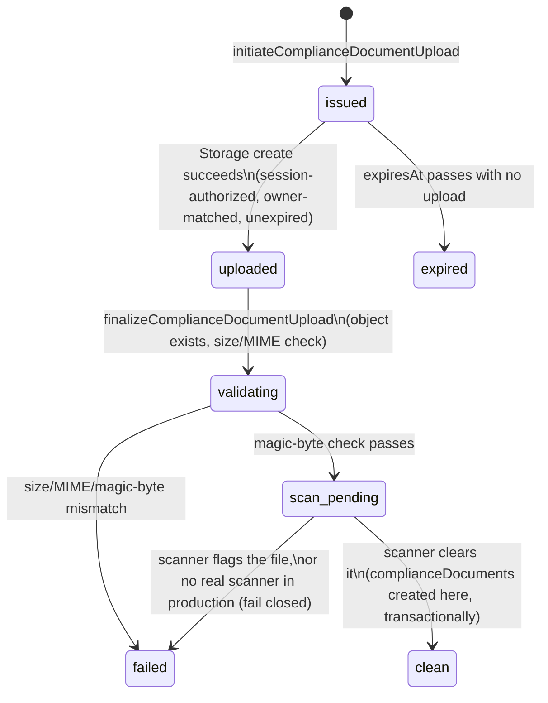
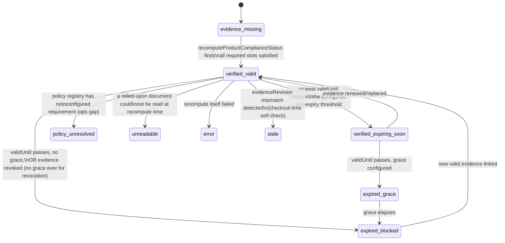

<!-- PLANNING DOCUMENT ONLY. No application code, Rules, indexes, Functions, or
     Flutter code were written to produce this plan. Nothing described here has
     been implemented or deployed. Revision 2 corrected 10 consistency defects
     found on review (see §0). Revision 3 (2026-08-25) replaces Slice 4's
     architecture with the corrected, adversarially-reviewed design (§0.1):
     server-mediated Marketplace eligibility, exact read/lookup ceilings, a
     fresh-per-request policy pointer, corrected approval enforcement, and
     sub-slices 4.1-4.9. Revision 4 (2026-08-25) completes Slice 4.1's own
     contract (§0.2): policy-version creation, empty-registry bootstrap,
     version-ID generation, an AND-of-OR requirement-group model, a single
     authoritative full-document validator reused at every trust boundary,
     and retraction of the version-content caching permission Revision 3 had
     granted, which was inconsistent with the bypass-write threat model
     Revision 4 itself establishes. Revision 5 (2026-08-25) adds Slice 4.2's
     missing dormant-compatibility contract (§0.3): a live-write audit found
     that today's Add Product create AND edit path never sends
     productInputRevision and performs a full-document overwrite with no
     merge, so a strict-presence Rule would break the current seller flow
     immediately, not just at some future edge case. Revision 5 defines the
     exact two-phase (Slice 4.2 dormant / Slice 4.9 strict) transitional
     contract this requires, without weakening the final invariant. Revision
     6 (2026-08-25) freezes Slice 4.3's complete matching/index/link
     contract (§0.4): a contract-resolution audit found the productEvidenceLinks
     schema disagreed with the already-shipped complianceConstants.js
     constant, the complianceDocumentScopes composite indexes the frozen
     matching algorithm requires were never declared, and the §13.1/§16
     sub-slice dependency columns disagreed with each other. Revision 6
     resolves all three, plus corrects §9's factually-incorrect claim of an
     explicit Rules-closure for compliancePolicyRegistryPointer and
     businessComplianceEpochs. Revision 7 (2026-08-25) freezes the
     product-level sellerRelationship architecture a second contract-
     resolution audit found missing (§0.5): §4/§5.5's "product's declared
     relationship" language assumed an input nothing produced —
     sellerRelationship existed only on complianceDocuments (seller-
     declared, document-level, immutable) with no product, business, or
     scope field ever resolving which relationship governs a given
     product's policy. Revision 7 adds a seller-declared product field,
     denormalizes relationship onto complianceDocumentScopes at scope-
     creation time, relationship-filters all seven Slice 4.3 candidate
     queries before their limit(3), adds source-document relationship/
     tenant/expiry verification at the already-budgeted matched-scope
     resolution step, integrates sellerRelationship into the
     productInputRevision matching-field set and the Slice 4.2 dormant
     transitional matrix, and freezes an explicit dormant-to-strict
     rollout sequence that never guesses or backfills an existing
     product's relationship. Slice 1-4.2 records remain historical and
     unchanged throughout; the Revision 6 productEvidenceLinks/index/
     dependency corrections are extended, not reopened. Revision 8
     (2026-08-25) resolves a genuine textual contradiction a final
     independent review found in §9 (§0.6): a table headed
     "sellerRelationship's own dormant create/update contract" stated an
     update-only adoption rule (existing absent -> baseline 0, so incoming
     productInputRevision must be 1) that, if its own heading were taken
     literally as covering create, directly contradicted the separate,
     unconditional productInputRevision create table (absent or exactly 0
     only, 1 always rejected). Revision 8 resolves this in favor of the
     create table's unconditional reading -- the reading the already-
     uncommitted firestore.rules/marketplaceProductRules.test.js Slice 4.2
     correction already implements and tests -- by splitting §9 into an
     explicitly separate create contract (§9.B, governing both fields
     independently, no delta ever computed) and an explicitly retitled,
     existing-document-only update contract (§9.C). No code or test change
     is required; this is documentation-only. Revision 9 (2026-08-25)
     resolves four defects a Slice 4.3 adversarial review found in the
     (uncommitted) matching engine (§0.7): MATCHED_SCOPE_CAP's global
     approvedAt/documentId truncation could starve a required evidence
     slot of its only candidate; truncation had no admin-visible audit
     trail despite the plan requiring one; a product's sellerRelationship
     could change while productInputRevision stayed absent under the
     already-committed dormant Rules, leaving an old decision falsely
     fresh; and decisionHash canonicalization was never frozen by the
     plan at all. Revision 9 replaces the global-cap language with a
     coverage-first/extras algorithm (§10), denormalizes documentType/
     validUntil onto complianceDocumentScopes (§4, a third prerequisite
     Slice 3 corrective sub-pass, §13.1), adds sellerRelationshipSnapshot
     to productComplianceDecisions (§4/§10.1), freezes the truncation
     complianceReviewEvents contract using only already-reserved,
     already-shipped enum values (§10), and freezes the decisionHash
     canonicalization contract (§4). The ≤8-operation/≤42-read bound is
     unchanged. Documentation-only; none of Slice 4.3's eight uncommitted
     files are touched by this revision — they are corrected in a
     separate, subsequent implementation task once this update lands. -->

# Petsupo Marketplace P1-A — Compliance & Review Foundation: Implementation Plan (Revision 9)

**Date:** 2026-08-21 (Revision 2). **Revision 3:** 2026-08-25 — Slice 4 architecture corrected; see §0.1. **Revision 4:** 2026-08-25 — Slice 4.1 contract completed; see §0.2. **Revision 5:** 2026-08-25 — Slice 4.2 dormant-compatibility contract added; see §0.3. **Revision 6:** 2026-08-25 — Slice 4.3 matching/index/link contract frozen; see §0.4. **Revision 7:** 2026-08-25 — product-level sellerRelationship architecture frozen; see §0.5. **Revision 8:** 2026-08-25 — create/update contract heading contradiction resolved, documentation-only; see §0.6. **Revision 9:** 2026-08-25 — Slice 4.3 cap-selection/truncation-event/relationship-freshness/decisionHash contract resolution, documentation-only; see §0.7.
**Baseline:** branch `integration/mac-windows-2026-07-22`, HEAD `f2048cf25681d714ba562037604116ec42a80101` ("Fix server-owned product field protection (P0.1)"), parent `9238a528fcd267b6d24b3a589e94c93939d1cf3e` (P0). Working tree clean, upstream in sync, no deployment performed.
**Source architecture:** `docs/audits/marketplace_p1_bulk_compliance_inventory_architecture_2026-08-21.md` (Revision 3, with one field-level cross-reference addendum pointing back to this plan — see that document's status box).
**Status:** PLAN ONLY. Nothing in this document has been implemented, staged, committed, deployed, or pushed as a result of this plan.

---

## 0. Change log — what this revision corrects and why

| # | Defect in the prior plan | Fix |
|---|---|---|
| 1 | `complianceDocuments.storagePath` was marked required, but "set only by finalize" — an unresolved required-field-before-existence contradiction | New `complianceUploadSessions` collection owns the entire pre-existence upload/validate/scan lifecycle; `complianceDocuments` is only ever *created* once a session reaches `clean`, so `storagePath` is genuinely always present the instant the document exists |
| 2 | `complianceDocuments` carried `normalizedBrandId`/`supplierId`/`categoryId`/`familyId` as single-value fields, silently representing only one of a document's possibly-several scopes | Removed from `complianceDocuments` entirely; scope identity lives only in `complianceDocumentScopes` |
| 3 | No slice explicitly forbade deploying a Storage upload-create rule before the server lifecycle that tracks it existed | Slice boundaries corrected so the Storage create rule and the upload-session function are one deployed unit; no intermediate deployed state permits untracked owner uploads |
| 4 | The plan asserted "Slice 3 depends on Slice 2" in one table and "Slices 1 and 3 can begin immediately" in the verdict — directly contradictory | Slice numbering and the dependency graph rebuilt consistently (§17) |
| 5 | Approval/checkout eligibility was phrased as a negative check (`!= evidence_missing`), which fails open for any *new*, unenumerated status | Replaced with a positive allowlist (`in ['verified_valid','verified_expiring_soon']`) and every other status explicitly enumerated as fail-closed |
| 6 | Checkout's compliance check implicitly scanned `productEvidenceLinks`, an unbounded set | New bounded `productComplianceDecisions/{productId}` record, capped at 10 active evidence references, is what checkout actually reads |
| 7 | `validUntil: null` was treated as globally "never expires" | Now policy-dependent per `documentType`, via an extended `compliancePolicyRegistry`; unresolved policy fails closed (defaults to requiring `validUntil`) |
| 8 | Malware-scanning/legal-mapping "open decisions" were framed as blocking all related work, when they only block specific transitions | Reclassified: foundation code (scanner interface, fake/test scanner, quarantine workflow, policy engine, placeholder policy) is buildable now; only production activation of real scanning/policy is blocked |
| 9 | `normalizedBrandId` via "lowercase, trim, strip punctuation" could collapse distinct brands | Versioned normalizer (Unicode normalization, locale-independent case folding, explicit `normalizerVersion`) for *candidate* matching only; an approved brand scope requires a separate, admin-verified `verifiedBrandId` before it's used to link evidence |
| 10 | Signed-URL expiry was given as "60–120s" with a vaguer revocation claim | Corrected to "maximum 5 minutes, recommended," with an explicit, unambiguous statement that revocation cannot invalidate an already-issued URL — only bounds future issuance |

### 0.1 Revision 3 change log — Slice 4 architecture corrected (2026-08-25)

Slice 4 was never implemented (§16, §19-20 confirm only Slices 1-3 have shipped code). A pre-implementation audit, an architecture-decision memo, and two adversarial reviews found the original Slice 4 design (single "Slice 4" row, §4/§9/§10/§11 as drafted in Revision 2) contained load-bearing defects that would have shipped a fail-open Marketplace. This revision replaces that design; it does not touch any Slice 1-3 record, note, or deployment gate.

| # | Defect in the Revision 2 Slice 4 design | Fix |
|---|---|---|
| 11 | Direct client Firestore reads + Rules cross-document `get()` calls cannot give a zero-stale public-eligibility guarantee ("Rules are not filters" for list queries; per-call billing/limits) | Public Marketplace list/detail/reservation/add-to-cart/checkout move to a server-mediated eligibility architecture (new §10.1) with a shared, authoritative live evaluator |
| 12 | The "≤8 reads/product" bound was never achievable as literal billed document reads (queries bill ≥1 even empty; 7-8 lookup types each cost their own query+results; matched-scope resolution adds more) | Corrected to two frozen numbers: ≤8 bounded lookup *operations*, ≤42 billed document reads (worst case) — exact derivation in §10 |
| 13 | The `verifiedBrandId`/`normalizedBrandId` design had no stated cross-tenant constraint, allowing a seller to potentially claim another business's brand evidence by typing matching text | Every lookup (not only the business-type lookup) requires `businessId == product.businessId`; the normalizer algorithm is frozen exactly (§10) |
| 14 | No mechanism was specified to stop a raw admin-client Firestore write (or a forged "callable marker") from setting `moderationStatus: 'approved'` directly, since Admin SDK writes bypass Rules by definition and any Rules-checked marker is equally forgeable by the same client | Rules categorically deny every client-SDK transition into `approved` (create and update); only the `reviewProductModeration` Admin-SDK callable may perform it; it re-validates via the same live evaluator, fails closed on stale/missing input, and writes its audit event transactionally (§9, §11) |
| 15 | `productInputRevision`/`evidenceRevision` were not specified precisely enough to implement: no field-ownership category existed for "seller-writable but Rules-constrained," and the product create/edit path is a client-side Firestore transaction, which cannot write a fully server-owned field | `productInputRevision` is a new, explicit 6th product field (seller-writable, Rules-monotonic +0/+1 invariant); `evidenceRevision` stays server-owned and plan-compliant (`int`); staleness is two independent equality checks, never string concatenation or ordering (§4, §10.1) |
| 16 | `productEvidenceLinks` was implicitly treated as authoritative/live-maintained; it has no writer in the codebase as of this revision | Reclassified explicitly as a performance/reconciliation reverse index only — stale or missing links may only degrade performance, never admit an ineligible product (§4, §10.1) |
| 17 | The policy-registry "singleton active version" invariant was asserted as structurally guaranteed with no actual check | Retained pointer-based design; added a bounded anomaly check inside the activation transaction itself (§4, §10.1) |
| 18 | An initial correction proposed caching the active-policy pointer for up to 30 seconds as a performance optimization; this reintroduces a fail-open window, since the per-product freshness check is only as fresh as the pointer it's compared against | Corrected: the policy pointer is read fresh, once per request/transaction, on every path (listing, detail, add-to-cart, reservation, checkout, approval, recompute) — no TTL, no warm-instance caching. *(The remainder of this row's original fix — "the immutable version document's content... may be cached" — is superseded by Revision 4 correction 27, §0.2; the version document is now also read fresh at every authoritative resolution. This row is preserved as the historical record of what Revision 3 corrected; do not read the caching clause as current.)* |
| 19 | No deployment sequencing accounted for the fact that an exported Cloud Function is reachable the instant it is deployed, regardless of whether current UI calls it | Deployment order corrected to require every new callable to be either unexported, behind an explicit disabled feature flag, or deployed only at its activation step — never described as "safe because nothing calls it yet" (§17) |
| 20 | No mechanism ensured public listings reflect a policy activation immediately | Added an ops-triggered bulk recompute pass immediately following any policy activation, alongside the existing bounded sweep, to minimize the listings-thin-out window that the corrected fail-closed design otherwise produces (§10.1, §17) |

### 0.2 Revision 4 change log — Slice 4.1 contract completed (2026-08-25)

Slice 4.1's own uncommitted implementation (`compliancePolicyRegistryOperations.js` + tests, `functions/src/marketplace/compliance/complianceConstants.js`'s additive `RETIRED` status and pointer constants) surfaced, through a read-only contract audit, that Revision 3 committed Slice 4.1 to "registry CRUD" without ever specifying the "C." This revision completes that contract. It does not touch any Slice 1-3 record, note, or deployment gate, and does not touch the four Slice 4.1 code/test files directly — those are corrected separately, under their own authorization, against this now-complete contract.

| # | Defect in the Revision 3 Slice 4.1 contract | Fix |
|---|---|---|
| 21 | "Registry CRUD" named no actual creation operation, request shape, or writer for `compliancePolicyRegistry` version documents | Named exactly: `createCompliancePolicyVersion` (§4), create-only semantics, full input contract |
| 22 | No operation existed to bootstrap the registry from empty — `activatePolicyVersion` structurally requires a pre-existing pointer and cannot create one, by design | Named exactly: `bootstrapCompliancePolicyRegistry` (§4), a distinct transaction from ordinary activation, never weakening the ordinary anomaly check |
| 23 | Version-ID generation was unspecified | Server-generated via `crypto.randomUUID()`, matching `addComplianceScope`'s existing `scopeId` precedent; retries are explicitly **not** idempotent, matching that same precedent's own documented limitation |
| 24 | `sellerRelationship.<rel>.requiredDocumentTypes` (a flat array) can only express AND across its members — it cannot express "invoice AND (manufacturer OR wholesaler/supplier)," a requirement the plan's own `requiredEvidenceSlots` field already assumed was representable | Replaced with `requiredDocumentTypeGroups: DocumentType[][]` — outer array is AND, inner array is OR, outer length 1..5 to match the already-frozen `requiredEvidenceSlots` cap exactly, one group per slot |
| 25 | An empty `requiredDocumentTypes`/absent evidence gate was previously described as a legal "no gate" configuration | A present relationship must always have ≥1 non-empty requirement group; an empty top-level `sellerRelationship` is legal only for terminal `inactive` placeholders, never for `draft`/`active` |
| 26 | Deep content validation was only ever run at creation time, and creation can be bypassed by Admin SDK scripts, migrations, or future ops tooling | One authoritative `validateCompliancePolicyVersionDocument` re-runs on every trust boundary — creation, bootstrap, ordinary activation (both current and target), and every single `resolveActivePolicy` call — never relying on a past validation result |
| 27 | Revision 3 stated immutable version-document *content* may be cached across requests, reasoned solely from "the document can never change once written" — inconsistent with defect 26's own bypass-write threat model, since a cached copy taken before a bypass write would not reflect it | Retracted; the version document, like the pointer, is read fresh at every authoritative eligibility/approval/activation resolution; only within-one-request/transaction deduplication is permitted (§4, §10.1) |
| 28 | `effectiveFrom`'s enforcement semantics, comparison representation, and test-clock mechanism were unspecified | Frozen: future-dated drafts permitted at creation; bootstrap/activation/resolution all require `effectiveFrom.toMillis() <= nowMs` (equality permitted); no scheduled activation exists; `now` is injectable for deterministic tests (§4) |
| 29 | `inactive`'s and `retired`'s lifecycles were named but not fully closed against every other transition | Frozen exactly: `inactive` is created-only, terminal, never pointer-addressable, never becomes `draft`/`active`/`retired`; `retired` is only ever produced by ordinary activation retiring a version that was genuinely `active` (§4) |

### 0.3 Revision 5 change log — Slice 4.2 dormant-compatibility contract added (2026-08-25)

Before writing Slice 4.2's `firestore.rules` change, a read-only preflight audit traced every live product write path and found that §9/§16's "tolerant of the field's absence on legacy products" language, while directionally correct, named no exact mechanism — and that the actual live-write shape makes the gap more severe than a bare absence check would suggest. This revision defines the exact transitional contract. It does not touch `firestore.rules`, any test file, or any Flutter file — those are implemented separately, under their own authorization, against this now-complete contract. It does not touch any Slice 1-4.1 record, note, or deployment gate.

| # | Defect in the Revision 4 Slice 4.2 contract | Fix |
|---|---|---|
| 30 | No committed text stated the exact live shape of the current Add Product write — that it is a full-document `tx.set(ref, payload)` with no merge, via `Product.toJson()`, which never includes `productInputRevision` — so a naive strict-presence Rule would break not only creation but every subsequent edit to an already-backfilled product, since the next old-client write silently overwrites the whole document, including any Admin-SDK-added revision, with a payload that omits the key entirely | Documented verbatim in §9 (below), with exact file/line evidence; the transitional contract is designed around this fact, not around a bare "field may be missing" assumption |
| 31 | Slice 4.2 was described only as "live but inert," with no boundary between what it does and does not enforce — risking either an unenforceable no-op or an accidental strict rule that breaks production | Split into two named phases: **Phase A (Slice 4.2, dormant compatibility)** — absence tolerated only under an exact transitional matrix, monotonic adoption enforced once the field appears, deletion of an existing value always rejected; **Phase B (Slice 4.9, strict steady state)** — presence, exact typing, and +0/+1 semantics unconditionally required, absence rejected (§9) |
| 32 | No exact create/update matrix existed for the absent-field transitional window, risking an implementer inventing one silently | Frozen exactly: create allows absent or exact `0`, rejects everything else; update is defined by a 5-case matrix (existing/incoming absent-or-present) — most importantly, *existing present + incoming absent is always rejected*, closing the "old client silently deletes an adopted revision" gap (§9) |
| 33 | The deployment sequence did not state that server-owned compliance-field writes and any revision backfill must wait for the Flutter write path to stop performing destructive full-document overwrites | Explicit ordering added (§17): Flutter migration (writing the field, preserving server-owned fields) must land and be verified in staging *before* any backfill or recompute write — migrating data into a write path that immediately strips it back out is worse than not migrating at all |

### 0.4 Revision 6 change log — Slice 4.3 matching/index/link contract frozen (2026-08-25)

A read-only contract-resolution audit, performed before writing any Slice 4.3 code, traced the exact query shapes §10's frozen matching algorithm requires against the actual `complianceDocumentScopes` schema and the actual already-shipped `complianceConstants.js`, and found three defects that would have forced an implementer to invent unauthorized structure. This revision resolves all three, documentation-only. It does not touch `firestore.rules`, any test file, any index file, `complianceConstants.js`, or any Flutter file — those are implemented separately, under their own authorization, against this now-complete contract. It does not touch any Slice 1–4.2 record, note, or deployment gate.

| # | Defect found in the pre-Revision-6 Slice 4.3 contract | Fix |
|---|---|---|
| 34 | §4's `productEvidenceLinks` schema (`scopeType`, `matchReasonCode`) contradicted the already-committed `PRODUCT_EVIDENCE_LINK_ALLOWED_FIELDS` constant (`matchedVia`, `linkedBy`), shipped four days earlier at Slice 1 and never reconciled against the plan text written later, at Revision 3 correction 16 | §4 below is corrected to the single field `matchedVia` (aliased to the existing `COMPLIANCE_SCOPE_TYPE` enum), which is provably non-redundant with the plan's two proposed fields under the current 1:1 lookup-type↔scope-type mapping; `scopeType` and `matchReasonCode` are retired from this collection's schema; `linkedBy` is removed as having no defined provenance semantics under this collection's single-system-writer design and zero existing writer/reader/test dependency (verified: `git grep` for `productEvidenceLinks` across `functions/src/` returns only the schema comment itself; `complianceConstants.test.js` has zero assertions on this constant) |
| 35 | §10 froze an exact deterministic tie-break (`status=='approved' THEN approvedAt ASC THEN documentId ASC`) for the seven bounded `complianceDocumentScopes` lookups, but no composite index existed anywhere for this collection, and §14 never analyzed what index the algorithm needs — a Firestore query combining equality filters with an `orderBy()` on fields outside that equality set fails outright at runtime without one, so the ≤42-read bound was unachievable as stated, not merely undocumented | §10/§14 below freeze the exact seven-query mapping and the exact minimum two-index composite-index set, cross-checked against official Firestore index-behavior documentation |
| 36 | §13.1/§16 disagreed on Slice 4.3's own dependency column (`4.1` only vs. `Slice 4.1, 4.2`), and neither table authorized `complianceConstants.js` or `firestore.indexes.json` as files Slice 4.3 would need to modify, despite the algorithm structurally requiring changes to both | §13.1 below is corrected to `Slice 4.1, 4.2` (matching §16, which was already correct) and gains two new file rows for the eventual implementation |
| 37 | §9's Firestore posture table claimed `compliancePolicyRegistryPointer` and `businessComplianceEpochs` are each closed via an explicit `allow read, write: if false` Rules block; independently verified false — no match block for either collection name exists anywhere in `firestore.rules`, so both rely purely on Firestore's implicit deny-by-default | §9 below is corrected to state the actual, implicit-deny posture; this does not change either collection's real security properties (Admin-SDK-only access either way) and does not block Slice 4.3, which never performs a client-Rules-mediated read of either collection |

### 0.5 Revision 7 change log — product-level sellerRelationship architecture frozen (2026-08-25)

A second read-only contract-resolution audit, prompted by a Slice 4.3 implementation hard-stop, traced every live statement involving `sellerRelationship` and found that §4/§5.5's "product's declared relationship" language was never mechanically closed: `sellerRelationship` existed only as a seller-declared, document-level field on `complianceDocuments` (set once at `submitComplianceDocument`, immutable thereafter) — no product, business, or `complianceDocumentScopes` field ever resolved which relationship governs a given product's policy selection, and nothing prevented one business from legitimately holding evidence under several different relationships at once. This revision closes that gap, documentation-only. It does not touch `firestore.rules`, any test file, any index file, `complianceConstants.js`, `complianceDocumentOperations.js`, or any Flutter file — those are separately-authorized corrective implementation work (§13.1/§16 below), sequenced explicitly (§17) to land *before* Slice 4.3 resumes. It does not reopen or weaken any Revision 1–6 record.

| # | Defect found in the pre-Revision-7 Slice 4.3 contract | Fix |
|---|---|---|
| 38 | No field anywhere (product, business, or scope) resolved which of the 6 `SELLER_RELATIONSHIP` values governs a product's policy selection, despite §4/§5.5 assuming one exists ("this product's declared relationship") | §11 below adds `sellerRelationship` as a seventh, seller-declared product field: exactly one value per product, missing/invalid always `policy_unresolved`, never inferred from evidence, never inherited from the business, never defaulted |
| 39 | §4/§5.5's repeated "relationship/category" phrasing implied `compliancePolicyRegistry.sellerRelationship` might be keyed by category as well as relationship, when the registry's own nested schema (§4) has only ever been keyed by relationship | §4/§5.5 below are corrected to state explicitly: `sellerRelationship` selects exactly one policy branch; `category` is a separate, ordinary evidence-matching input (the `category` row of §10's seven-query table), never a second registry key |
| 40 | `complianceDocumentScopes` carried no relationship information, so no candidate query could distinguish "evidence for relationship X" from "evidence for relationship Y" on the same business, and the only alternative (resolving each candidate's source document post-query) risks a `limit(3)` false negative — three same-type scopes belonging to the wrong relationship could silently hide a valid fourth | §4 below denormalizes `sellerRelationship` onto `complianceDocumentScopes`, copied server-side from the immutable source `complianceDocuments.sellerRelationship` at scope-creation time, never client-suppliable, immutable for the scope's lifetime |
| 41 | All seven Slice 4.3 candidate queries (Revision 6, §10) filtered only by `businessId`/`scopeType`/`status`/`scopeValue` — none could relationship-filter, so a business's evidence for an unrelated relationship could occupy the bounded `LOOKUP_LIMIT=3` window | §10 below adds `sellerRelationship == product.sellerRelationship` as a common filter on all seven queries, applied *before* `limit(3)`, never as a post-query discard |
| 42 | The already-budgeted "matched-scope document resolution" step (§10, `MATCHED_SCOPE_CAP=10`) was never explicitly connected to reading each candidate's source `complianceDocuments` record, despite that record being the only possible source of `expiresAt`/`validUntil` (`complianceDocumentScopes` has no such field) | §10 below states explicitly that this already-budgeted step reads each selected scope's source `complianceDocuments/{documentId}`, and — at zero additional read cost — verifies tenant match, relationship triple-equality (product/scope/source-document), and expiry at the exact frozen boundary; any mismatch fails closed |
| 43 | `productInputRevision`'s matching-field set (`category`/`brand`/`barcode`/`sku`, Revision 5/§9) did not include `sellerRelationship`, so a seller could change a product's declared relationship without the monotonic-adoption/anti-regression protections Slice 4.2 already gives the other four matching fields | §9/§11 below add `sellerRelationship` as a fifth matching field, with the Slice 4.2 transitional A–E matrix extended explicitly for it |
| 44 | §14's two Revision 6 composite indexes did not include `sellerRelationship`, and could not, since the field did not exist on `complianceDocumentScopes` yet | §14 below replaces both Revision 6 indexes with Revision 7 forms, each gaining `sellerRelationship` as an additional equality field ahead of `scopeType` |
| 45 | Denormalizing `sellerRelationship` onto `complianceDocumentScopes` requires modifying `addComplianceScope` (Slice 3, already committed) and extending Slice 4.2's Rules/matching-field set (already committed) — neither is Slice 4.3's own file, and folding either correction invisibly into a future Slice 4.3 implementation pass would mean modifying already-committed, already-reviewed slices without their own dedicated review | §13.1/§16 below name two new, explicit, separately-reviewed-and-committed corrective sub-passes (a Slice 3 scope-schema/writer correction and a Slice 4.2 Rules correction) that must land *before* Slice 4.3 resumes — never bundled into it |
| 46 | Nothing stated what happens to a product that predates this field once Slice 4.9's strict Rules eventually require it, or who may supply the missing value for such a product | §17 below freezes an explicit rollout sequence: existing products lacking `sellerRelationship` remain `policy_unresolved` indefinitely; no default (e.g. `reseller`), no evidence-based inference, and no unverified admin backfill is ever permitted — only a seller/admin-supplied, authorized declaration through the normal product-edit flow (or a future, separately-authorized backfill operation, not proposed here) resolves it |

---

### 0.6 Revision 8 change log — create/update contract heading contradiction resolved (2026-08-25)

A final independent review of the (uncommitted) Slice 4.2 Revision 7 correction found a genuine textual contradiction in §9, not merely an inference gap. Two passages disagreed on the exact same hybrid case — a product `create` that simultaneously sets a valid `sellerRelationship` while `productInputRevision` is absent or `0`:

- The plain "Transitional create contract (Phase A)" table for `productInputRevision` states, unconditionally: absent allowed, exactly `0` allowed, `1` or any other nonzero rejected — with no column or condition referencing `sellerRelationship` at all.
- A second table, headed **"`sellerRelationship`'s own dormant create/update contract"** — a heading that explicitly claims to cover both operations — stated in its row B: "existing absent → baseline `0`, so incoming `productInputRevision` must be `1`." Taken at face value for `create` (where "existing" is, by definition, always absent), this row directly requires `productInputRevision == 1` on exactly the case the first table unconditionally rejects.
- §11's own summary sentence ("any write that changes `sellerRelationship` must increment `productInputRevision` by exactly `+1`") compounded the ambiguity by not distinguishing `create` from `update`.

| # | Contradiction | Resolution |
|---|---|---|
| 47 | §9's `sellerRelationship` table was headed "create/update contract" and its row B, read literally for `create`, contradicted the separate, unconditional `productInputRevision` create table for the hybrid case (relationship adopted, revision absent/0, on create) | §9 is restructured below into an explicitly separate **create contract (§9.B)**, governing both fields together but independently of each other with no delta ever computed, and an explicitly retitled **existing-document update contract (§9.C)**, which alone carries the delta/adoption rules. The ambiguous "create/update" heading is retired |
| 48 | §11's "any write that changes `sellerRelationship` must increment `productInputRevision` by exactly `+1`" did not distinguish `create` from `update`, reading as though it could govern create too | §11 below is corrected to state explicitly that this rule governs *existing-product updates only* (§9.C), cross-referencing the new heading |

**The resolution, stated once, precisely:** `productInputRevision` and `sellerRelationship` are both persisted **product state**, not request parameters computed by diffing against a synthetic prior value. Document *creation* initializes that state from nothing — it is never modeled as an update transitioning from an implicit "existing absent" document, and no delta is ever computed on create: Rules validate only the `incoming` value directly, never diffing it against an `existing` one that does not exist. Every delta-based rule (the `productInputRevision` +0/+1 invariant, "baseline `0` for a previously-absent field," "adoption requires `+1`") therefore applies **only when `resource.data` already exists** — i.e., only on `update`, never on `create`.

This revision resolves the contradiction in favor of the create table's unconditional reading — the reading the already-uncommitted `firestore.rules`/`functions/test/marketplaceProductRules.test.js` Slice 4.2 correction files already implement and test, and which requires **no code or test change** to match:

- On create, `sellerRelationship` and `productInputRevision` are validated **independently** of each other (§9.B below states this exhaustively, including an explicit four-combination table). Neither field's create-time legality depends on the other's presence or value. Adopting a relationship on create never requires `productInputRevision` to be present or equal to `1` — `productInputRevision`'s create legality remains exactly what the unconditional create table always said: absent, or exactly `0`.
- `sellerRelationship`'s adoption-requires-`+1` rule (the former row B) is, and was only ever intended as, an **update-only** rule — it governs the transition of an *existing* document's *existing* value, which by construction cannot apply to a document that does not yet exist. The table carrying this rule is retitled "existing-product update contract" (§9.C) to state this unambiguously.
- `isValidTransitionalProductInputRevisionCreate` (`firestore.rules`) is untouched by the Slice 4.2 Revision 7 correction and remains unconditional, exactly matching this resolution. The corresponding tests (`4.2r7-create-3a/3b/3c` × all six relationship values, `functions/test/marketplaceProductRules.test.js`) already assert `productInputRevision: 1` is *rejected* on create even when a valid relationship is supplied, and that `productInputRevision` absent or `0` is *allowed* on create regardless of `sellerRelationship`'s presence. **No code or test change is required by this revision.**
- Slice 4.9's strict steady-state end state (§9.D below, reconfirmed) is unchanged in substance: both fields required and exactly typed on create (`sellerRelationship` a valid enum value, `productInputRevision` exactly `0`), no dormant absence permitted once strict Rules deploy, deletion of either field on update always rejected, matching-field changes (including a `sellerRelationship` change) requiring exactly `+1`.

Revision 1–7 records remain historical and unchanged; this revision restructures §9's presentation (splitting create and update into explicitly separate, correctly-headed contracts) without reopening or weakening any prior substantive rule.

---

### 0.7 Revision 9 change log — Slice 4.3 cap-selection/truncation-event/relationship-freshness/decisionHash contract resolution (2026-08-25)

An adversarial, independent review of the (still-uncommitted) Slice 4.3 implementation — matching engine, recompute, evaluator, brand normalizer — found four confirmed defects, none of which were caught by the implementation's own 66-test suite because the tests exercised the same flawed design they were meant to check. Each is resolved below, documentation-only; none of Slice 4.3's eight uncommitted files are edited by this revision.

| # | Confirmed defect | Resolution |
|---|---|---|
| 49 | `MATCHED_SCOPE_CAP=10` selected candidates for source-document verification via a single **global** `(approvedAt ASC, documentId ASC)` sort across every scope type, applied **before** any candidate's `documentType` was known — reproduced directly: 10 candidates satisfying required group A, approved earlier, silently discarded the 11th candidate, the *sole* evidence for required group B, even though both groups had genuine, valid, unexpired evidence available within the cap | §4 denormalizes `documentType`/`validUntil` onto `complianceDocumentScopes` (immutable, server-copied, mirroring the Revision 7 `sellerRelationship` precedent exactly), and §10 replaces the global-cap language with an exact, deterministic **coverage-first/extras** algorithm: every required slot gets an independent, ordered attempt at the read budget before any slot's *redundant* evidence can consume it |
| 50 | §4's own text requires cap-exceeding truncation to be "recorded... as a `complianceReviewEvents` entry for admin visibility — it does not silently drop the excess" (already-frozen, Revision 3-era text); the Slice 4.3 implementation silently drops, no event ever written | §10 freezes the exact truncation condition, event schema, and transaction placement — reusing the `complianceReviewEvents` schema's own `targetType: 'product'` and `action: 'recomputed'` enum values, both reserved-but-unused since Slice 1, so **no new constant or schema field is required** |
| 51 | Under the already-committed Revision 8 dormant Rules, a product may legally transition `sellerRelationship: X → Y` while `productInputRevision` remains absent on both sides (`firestore.rules`' own row A, "an explicitly acknowledged, temporary dormant gap... no server compliance output may treat revision freshness as meaningful while any product can still be in this state") — the evaluator's sole freshness signal, `productInputRevisionSnapshot` equality, cannot detect this, since both sides normalize to `0` regardless of the relationship change | §4 adds `sellerRelationshipSnapshot` to `productComplianceDecisions`; §10.1 requires the evaluator to compare it against the live product's `sellerRelationship` on every call, independently of the revision-equality check, at zero extra read cost (the product document is already read by both writer and evaluator) |
| 52 | §4 states `decisionHash` is "a digest of the canonical serialization of the fields above" but never specifies the serialization itself — the implementation invented one, and it recursively sorts object keys only at the top level, a latent stability gap the plan never authorized either way | §4 freezes a complete canonicalization contract: exact included/excluded fields, recursive key-sorting at every nesting level, preserved (never re-sorted) array order, `.toMillis()` Timestamp encoding, explicit `undefined` prohibition, and a requirement for at least one independently hand-computed known-vector test |

**Scope of this revision, stated precisely:**

- **§4** — `complianceDocumentScopes` gains `documentType`/`validUntil` (immutable, server-denormalized); `productComplianceDecisions` gains `sellerRelationshipSnapshot`; `decisionHash`'s canonicalization contract is fully frozen.
- **§10** — the matched-scope selection algorithm is rewritten in full (coverage-first/extras, replacing the under-specified global-cap description); the **source-read identity** (`documentId`, ≤10 unique reads) and **evidence-reference identity** (`(documentId, scopeId)`, ≤10 unique refs) are frozen as two distinct, never-conflated caps; the truncation-event contract is frozen.
- **§10.1** — the live evaluator's freshness check gains the `sellerRelationshipSnapshot` comparison, independent of and in addition to the existing `productInputRevisionSnapshot` check.
- **§13.1/§16** — a **third** prerequisite Slice 3 corrective sub-pass is named (`complianceConstants.js`, `complianceDocumentOperations.js`, and their tests — the same two files already twice reopened for the `sellerRelationship`-onto-scopes and Rules corrections), required to land, reviewed and committed separately, before the Slice 4.3 corrective pass resumes — mirroring §13.1's own already-established "two prerequisite corrective sub-passes" pattern exactly, now three.
- **§15** — new required test coverage for every algorithm branch, the truncation event, the relationship-staleness regression, and decisionHash's recursive contract.
- **Unchanged:** the ≤8-operation/≤42-read bound (§10) — denormalizing already-fetched fields adds no reads, and the coverage-first algorithm spends the existing ≤10-source-read cap more intelligently rather than needing a larger one; confirmed by exact recalculation, §10. The maximum transaction write count grows by exactly one (the truncation event, written only when truncation occurs), from ≤21 to ≤22 — nowhere near Firestore's per-transaction write ceiling.
- **Not in scope:** no code or test file is edited; the eight Slice 4.3 files remain exactly as the adversarial review left them, uncommitted, until a separate implementation task applies this revision's corrections within their own already-authorized scope, after the third prerequisite Slice 3 sub-pass lands and is committed.

Revision 1–8 records remain historical and unchanged.

---

## 1. Executive plan verdict

With all 10 corrections applied, the plan is internally consistent: every field has exactly one document of record, every slice's dependencies match its stated order, every compliance-eligibility check is a positive, fully-enumerated allowlist, and no unresolved product-owner/legal decision blocks anything beyond the specific production-activation step it actually gates. **Ready to commit as documentation.** Implementation itself remains gated on the same two named decisions as before (malware-scanning provider, Turkish legal evidence mapping) — but, per correction 8, only for the specific transitions those decisions govern, not for starting implementation work at all.

---

## 2. Confirmed baseline

Unchanged from the prior revision of this plan — branch `integration/mac-windows-2026-07-22`, HEAD `f2048cf25681d714ba562037604116ec42a80101`, P0 and P0.1 both present, working tree clean, upstream in sync, no deployment performed by any planning task to date.

---

## 3. Inclusion/exclusion matrix

Unchanged in substance from the prior revision — all 10 P1-A capabilities remain in scope, all P1-B/C/D items remain excluded (CSV/XLSX import, `channelConnections`/`externalListings`/`externalDemandHolds`/`externalPendingHold`, authority-transition execution, inventory event sync, reconciliation dashboard, M3/M5 flag changes, any deployment). `productReviewJobs` remains excluded from P1-A for the same reason as before (no real workload without P1-B's import volume); P1-A's admin review foundation is still served by scope-level approval with automatic recompute, not a job queue. Two items are **added** to the in-scope list, both required by this revision's corrections: `complianceUploadSessions` (correction 1) and `productComplianceDecisions` (correction 6) — both are P1-A-scoped mechanisms, not P1-B/C/D capability.

---

## 4. Exact P1-A data schemas

### `businessInventoryPolicies/{businessId}`

Unchanged from the prior revision of this plan (onboarding-default record only; see that revision's full field table — reproduced here for completeness).

| Field | Type | Required | Writer | Mutable | Validation | Privacy |
|---|---|---|---|---|---|---|
| `businessId` | string (= doc ID) | yes | Onboarding callable | Immutable | = doc ID | Internal |
| `stockAuthorityType` | enum | yes | Onboarding callable (P1-A: `manual`/`petsupo` only reachable) | Immutable in P1-A | Enum | Internal |
| `authorityConnectionId` | string, nullable | no | P1-C only | Always `null` in P1-A | Must be null unless mode requires it (unreachable in P1-A) | Internal |
| `status` | enum | yes | Onboarding callable | Always `active` in P1-A | Enum | Internal |
| `defaultSafetyStock` | int ≥ 0 | yes | Onboarding + seller edit | Mutable (own business) | ≥ 0 | Internal |
| `version`, `updatedBy`, `updatedAt`, `effectiveAt` | int / uid / timestamp / timestamp | yes | Server only | Server-set | — | Internal |

### `complianceUploadSessions/{sessionId}` — NEW (correction 1)

The complete pre-document lifecycle. `sessionId` is server-generated at `initiateComplianceDocumentUpload` time; `documentId` is reserved (pre-generated) at the same moment but does **not** yet correspond to any `complianceDocuments` record.

| Field | Type | Required | Writer | Mutable | Validation | Index | Privacy | Retention |
|---|---|---|---|---|---|---|---|---|
| `businessId` | string | yes | Server, at creation | Immutable | `isBusinessOwner()` | `[businessId, status]` | Internal | See §13 |
| `documentId` | string | yes | Server, reserved at creation | Immutable | Not yet a real document | — | Internal | See §13 |
| `objectPath` | string | yes | Server | Immutable | = `compliance_docs/{businessId}/{documentId}/{objectId}` | — | Sensitive (not the file itself, but its path) | See §13 |
| `documentType`, `sellerRelationship` | enum, enum | yes | Server, from the caller's initiate request | Immutable | Enum membership; combination checked against `compliancePolicyRegistry` | — | Internal | See §13 |
| `allowedMimeTypes` | array of string | yes | Server, from §9's constant list | Immutable | Fixed set: `application/pdf`, `image/jpeg`, `image/png` | — | Internal | See §13 |
| `maxSizeBytes` | int | yes | Server, from configured default (§9) | Immutable | — | — | Internal | See §13 |
| `status` | enum: `issued\|uploaded\|validating\|scan_pending\|clean\|failed\|expired` | yes | Server, state machine §6.0 | Server-only | Must follow the defined transitions | `[status, expiresAt]` (orphan-cleanup query) | Internal | See §13 |
| `issuedBy` / `issuedAt` | uid / timestamp | yes | Server | Immutable | = caller uid, `request.time` | — | Internal | See §13 |
| `expiresAt` | timestamp | yes | Server, `issuedAt` + short window (proposed default 15 minutes, §20) | Immutable | — | See above | Internal | See §13 |
| `finalizedAt` | timestamp, nullable | no | Server, on `uploaded → validating` | Set once | — | — | Internal | See §13 |
| `contentHash` | string (sha256), nullable | no | Server, computed at finalize | Set once | 64-char hex | — | Internal | See §13 |
| `sizeBytes` | int, nullable | no | Server, read from live object metadata at finalize | Set once | ≤ `maxSizeBytes` | — | Internal | See §13 |
| `scanResultRef` | string, nullable | no | Server, scanner-result handler | Set once | — | — | Internal | See §13 |

### `complianceDocuments/{documentId}` — corrected (corrections 1, 2)

Created **only** by the scanner-result handler transitioning a session to `clean` — never before. `storagePath` is therefore always present the instant the document exists; no nullable-required-field state is ever observed. **`normalizedBrandId`/`supplierId`/`categoryId`/`familyId` are removed** — scope identity lives only in `complianceDocumentScopes` (correction 2).

| Field | Type | Required | Writer | Mutable | Validation | Index | Privacy |
|---|---|---|---|---|---|---|---|
| `businessId` | string | yes | Server, mirrored from the session | Immutable | `isBusinessOwner()` | `[businessId, status]` | Internal |
| `sessionId` | string | yes | Server | Immutable | Traceability back to the upload lifecycle | — | Internal |
| `documentType`, `sellerRelationship` | enum, enum | yes | Server, mirrored from the session | Immutable | — | `[businessId, documentType, status]` | Internal |
| `storagePath` | string | yes (always present at creation) | Server, mirrored from the session | Immutable | Matches `compliance_docs/{businessId}/{documentId}/*` | — | **Sensitive** |
| `originalFilename`, `contentHash`, `sizeBytes` | string, string, int | yes | Server, mirrored from the session | Immutable | — | — | Sensitive / Internal / Internal |
| `version`, `supersedesDocumentId`, `supersededByDocumentId` | int / nullable string / nullable string | yes / no / no | Server | Immutable / set once / set once | — | — | Internal |
| `issuedAt`, `validFrom`, `validUntil` | timestamp, nullable each | Conditionally required — see §7 | Seller-declared at submission | Immutable | Policy-dependent (§7); no global "null = never expires" default | `[status, validUntil]` | Internal |
| `status` | enum: `clean\|pending_review\|approved\|rejected\|revoked\|expired\|superseded` | yes | Server, state machine §6.1 | Server-only | — | `[businessId, status]` | Internal |
| `uploadedBy`, `uploadedAt`, `reviewedBy`, `reviewedAt`, `rejectionReason`, `infoRequestNote`, `revokedBy`/`revokedAt`/`revocationReason` | as before | as before | Server | as before | as before | — | Internal |

### `complianceDocumentScopes/{scopeId}` — corrected (correction 9); `sellerRelationship` denormalized (Revision 7 correction 40); `documentType`/`validUntil` denormalized (Revision 9 correction 49)

Gains `verifiedBrandId` for `scopeType: 'brand'` scopes. Gains `sellerRelationship`, denormalized from the source document (Revision 7). Gains `documentType`/`validUntil`, denormalized from the source document (Revision 9), via a third prerequisite Slice 3 corrective sub-pass (§13.1).

| Field | Type | Required | Writer | Mutable | Notes |
|---|---|---|---|---|---|
| `documentId`, `businessId`, `scopeType`, `scopeValue`, `memberCount`, `status`, `createdAt/By`, `reviewedBy/At` | as before | as before | as before | as before | Unchanged from the prior plan revision |
| `verifiedBrandId` | string, nullable | Required before a `brand`-type scope is match-eligible | **Admin only**, set during `reviewComplianceScope` | Set once, then immutable | The scope's `scopeValue`/derived `normalizedBrandId` is a *candidate* signal only; `verifiedBrandId` is the admin's explicit confirmation that this scope really corresponds to a specific brand identity, and is what evidence-linking actually matches against for brand scopes (§10) |
| `sellerRelationship` (**NEW, Revision 7 correction 40**) | string, exactly one `SELLER_RELATIONSHIP` value | yes | **Server, `addComplianceScope`, copied from the source `complianceDocuments.sellerRelationship` at scope-creation time** — never a client-suppliable request field on `addComplianceScope`'s own request shape | Immutable for the lifetime of the scope; `reviewComplianceScope`'s approve/reject decision never touches it | The source document remains the sole authoritative origin of this value — the scope's copy exists only so the seven Slice 4.3 candidate queries (§10) can relationship-filter without resolving each candidate's source document first. A scope whose `sellerRelationship` does not match its own source document's current value (a data-integrity anomaly — it cannot arise from any correct write path, since the field is copied once and both copies are immutable thereafter) fails closed at the matched-scope source-document verification step (§10), never silently trusted |
| `documentType` (**NEW, Revision 9 correction 49**) | string, exactly one `COMPLIANCE_DOCUMENT_TYPE` value | yes | **Server, `addComplianceScope`, copied from the source `complianceDocuments.documentType` at scope-creation time** — never a client-suppliable request field | Immutable for the lifetime of the scope | `complianceDocuments.documentType` is already immutable (`COMPLIANCE_DOCUMENT_IMMUTABLE_FIELDS`), so this copy can never drift out of sync under any legal write path. Exists **solely** so the Slice 4.3 matching engine's cap-selection algorithm (§10) can determine, before spending one of its ≤10 source-document reads, whether a candidate scope's source document even has a chance of satisfying an outstanding required evidence slot. **Never authoritative on its own** — a candidate selected using this field is still fully re-verified against its live source document (§10) before being trusted; the source document remains the sole authority |
| `validUntil` (**NEW, Revision 9 correction 49**) | Firestore Timestamp, nullable | no (nullable, mirroring the source field) | **Server, `addComplianceScope`, copied from the source `complianceDocuments.validUntil` at scope-creation time** — never a client-suppliable request field | Immutable for the lifetime of the scope | Also already immutable on the source (`COMPLIANCE_DOCUMENT_IMMUTABLE_FIELDS`). Used by the matching engine's cap-selection algorithm (§10) to pre-filter already-expired candidates **before** spending a source-document read on them — never to determine final eligibility. The authoritative `validUntil > now` check (§10) always re-reads the live source document; this copy is a read-budget optimization only |

**Fields deliberately not denormalized.** `status` remains exclusively on the source `complianceDocuments` record — it is **mutable** (a document can be revoked, superseded, or expire after a scope referencing it already exists), so denormalizing it would create exactly the kind of stale-copy risk `documentType`/`validUntil`/`sellerRelationship` are safe from precisely because their source fields are immutable. The source-document read at the matched-scope verification step (§10) remains the sole authority for `status`, and therefore remains mandatory for every candidate actually selected — denormalization narrows *which* candidates are worth spending that mandatory read on, it never replaces the read.

**No migration/backfill.** As with the Revision 7 `sellerRelationship` denormalization, no writer of `complianceDocumentScopes` has ever executed in production — `addComplianceScope` (Slice 3) is committed but not deployed, and this repository's own audit trail confirms no real scope data exists anywhere. If that premise is later found to be false, a separate, explicit migration audit is required before this correction may be implemented as written — none is proposed or authorized by this revision.

### `complianceDocumentScopes/{scopeId}/members/{memberId}` and `complianceReviewEvents/{eventId}`

Unchanged from the prior plan revision — deterministic full-SHA-256 member IDs with post-lookup `identifierValue` verification; `complianceReviewEvents` remains append-only with `targetType` covering `document|scope|scope_member_batch|product`.

### `productEvidenceLinks/{linkId}` — reclassified (Revision 3 correction 16); final schema frozen (Revision 6 correction 34)

**Not the authoritative gate for any read path.** It is a performance/reconciliation reverse index only — it drives the async cache-repair trigger, the scheduled sweep's prioritization, and admin/ops tooling ("what products does revoking this document affect"). No live-eligibility check (§10.1) ever queries this collection; a stale or missing link may only degrade performance, never admit an ineligible product. As of this revision it has no writer anywhere in the codebase — it is schema-defined only; Slice 4.3/4.7 (§16) give it its first writer. Written **only** by `recomputeProductComplianceStatus` (single system writer, §9), capped at 10 links per product, server-only.

**Revision 6 correction 34 — the field-name contradiction is resolved.** Revision 3 correction 16's original table (below, superseded) named fields `scopeType`/`matchReasonCode`; the already-shipped (2026-08-21, four days before that text was written) `PRODUCT_EVIDENCE_LINK_ALLOWED_FIELDS` constant instead used `matchedVia`/`linkedBy`, and the two were never reconciled. Resolution, by semantics not preference:
- `matchedVia` is kept: `COMPLIANCE_EVIDENCE_LINK_MATCH_TYPE = COMPLIANCE_SCOPE_TYPE` already aliases its value domain to the correct 7-value enum, and since §10's seven lookup types map 1:1 onto `complianceDocumentScopes.scopeType`'s own values by construction, a link's `scopeType` and `matchReasonCode` would always hold identical values under this architecture — the two proposed fields are provably redundant with each other. `matchedVia` is the single, non-redundant field that already correctly identifies which of the seven matching paths produced the link.
- `scopeType` and `matchReasonCode` are removed from this collection's schema (both retired in favor of the single `matchedVia` field above).
- `linkedBy` is removed: this collection has exactly one system writer (`recomputeProductComplianceStatus`) by design, so a "written by" field would be a compile-time constant with no diagnostic value, and no field in this schema table ever defined distinct provenance semantics for it.
- No migration or backfill is required for any of the three removals: `productEvidenceLinks` has no writer anywhere in the codebase today (verified independently, `functions/src/` grep), so no document — real or test-fixture — has ever been written under either the old or the new field names.

**Final frozen schema:**

| Field | Type | Required | Writer | Notes |
|---|---|---|---|---|
| `linkId` (doc ID) | string | yes | Server, `deriveEvidenceLinkId({productId, documentId, scopeId})` | See exact ID formula below |
| `businessId` | string, non-empty | yes | Server, `recomputeProductComplianceStatus` only | Denormalized onto every link — every link is business-scoped by construction, since it is only ever written from within one product's own recompute |
| `productId` | string, non-empty | yes | Server | — |
| `documentId` | string, non-empty | yes | Server | — |
| `scopeId` | string, non-empty | yes | Server | — |
| `matchedVia` | string, exactly one of `COMPLIANCE_SCOPE_TYPE`'s 7 values: `business`, `supplier`, `brand`, `category`, `product_family`, `sku_set`, `product` | yes | Server | Which of the seven matching paths (§10) produced this link |
| `linkedAt` | server `Timestamp` | yes | Server | — |

**Exact deterministic `linkId` formula (Revision 6 correction 34).** Random or auto-generated IDs are forbidden. `deriveEvidenceLinkId({productId, documentId, scopeId})` is computed exactly as:
1. If `productId`, `documentId`, or `scopeId` contains the literal delimiter character (`\n`, U+000A), reject — do not derive an ID. (Firestore document IDs are not structurally guaranteed delimiter-free — only forward slashes, `.`/`..`, and the `__*__` pattern are disallowed by Firestore itself — so this check cannot be skipped as unreachable.)
2. Build the canonical UTF-8 byte string, matching this codebase's established domain-separated composite-key convention (`deriveScopeMemberId`/`deriveInfoRequestEventId`, `complianceDocumentOperations.js`): the literal domain tag `compliance_evidence_link`, followed by `\n`, followed by `productId`, `\n`, `documentId`, `\n`, `scopeId`, in that exact field order — i.e. `` `compliance_evidence_link\n${productId}\n${documentId}\n${scopeId}` ``.
3. Compute the SHA-256 digest of that UTF-8 byte string.
4. Encode the digest as lowercase hexadecimal (Node's `crypto.createHash("sha256").update(...).digest("hex")` already produces this format; no additional case-folding step is needed).
5. The resulting 64-character lowercase hex string is `linkId`.

This is a pure function of `{productId, documentId, scopeId}` — a transaction retry recomputing the same matched-candidate set (deterministic per §10's own tie-break) always re-derives the identical `linkId` set, which is what makes cleanup-and-recreate idempotent across retries (§10, prior-link cleanup).

**Writer and cleanup:** each recompute performs a full delete-then-recreate of that product's own link set, bounded at the same cap as `activeEvidenceRefs` (10) — never an unbounded accumulation. Prior links are discovered for deletion **without querying this collection**: the prior `productComplianceDecisions/{productId}`'s `activeEvidenceRefs` array (already one of the operation's own bounded reads) supplies each prior link's `documentId`/`scopeId` pair directly, from which the prior `linkId` is re-derived via the same formula above and deleted by known ID — see §10's transaction-ordering note. Product deletion removes its link set in the same operation. A never-recomputed product has no link entry (harmless: it is also absent from `productComplianceDecisions`, so the live evaluator already excludes it). Removed/revoked evidence leaves a stale link until that product's own next recompute — harmless, since the live evaluator's freshness check (epoch/revision equality) already excludes the product regardless of link staleness. Policy-version changes are **not** this table's concern at all — they are global, not scoped to any one document/scope, and are caught purely by the `policyVersion` equality check in the live evaluator.

> **Superseded by Revision 6 correction 34 — historical only, do not implement:** the original Revision 3 correction 16 schema named fields `productId`, `businessId`, `documentId`, `scopeId`, `scopeType` (string ×5) and a separate `matchReasonCode` (string, "Which of the 7 lookup types (§10) produced this link") in place of the single `matchedVia` field above. This wording is retained here only as a historical record of what Revision 3 originally proposed before the Revision 6 reconciliation against the already-shipped constant; it is not live and must not be implemented.

### `compliancePolicyRegistryPointer/current` — NEW (Revision 3 correction 17; caching permission retracted in Revision 4 correction 27)

Singleton document. The **sole** authoritative source of "what policy version is active" for every reader (recompute, the live eligibility evaluator, the approval callable). No reader ever queries `compliancePolicyRegistry` by `status`.

| Field | Type | Required | Writer | Mutable | Notes |
|---|---|---|---|---|---|
| `activeVersionId` | string (references `compliancePolicyRegistry/{registryVersion}`) | yes | Admin/ops, only via `bootstrapCompliancePolicyRegistry` (first write) or `activatePolicyVersion` (every subsequent write) below | Set only by bootstrap or activation | Read fresh, once per request/transaction, by every path that determines eligibility — listing, detail, add-to-cart, reservation, checkout, approval, and recompute. **Never cached across requests, by TTL or by warm Cloud Functions instance state** (Revision 3 correction 18) — a cached pointer makes the per-product freshness check compare against the wrong target, admitting products whose evidence was computed under a retired policy |

**Revision 4 correction 27 — the referenced version document is read fresh too, not cached.** Revision 3 permitted caching the *immutable* `compliancePolicyRegistry/{activeVersionId}` document's content, reasoned solely from "the document can never change once written." That reasoning does not hold once Admin SDK scripts, migrations, or future ops tooling are included in the threat model (as they must be, per Revision 4 correction 26 below) — a cached copy taken before such a write would not reflect it, and "revalidating" stale cached bytes proves nothing about current stored state. Corrected rule: the exact referenced version document is read fresh at every authoritative eligibility/approval/activation resolution, exactly like the pointer. Deduplication is permitted only *within* one request/transaction (e.g. reading it once inside `activatePolicyVersion`'s own transaction and reusing that read for multiple checks in the same call is not "caching" in the forbidden sense). Any future caching requires a separately-proven immutable storage/IAM/write-boundary design — a genuinely stronger guarantee than documentation convention — and is out of scope for Slice 4.1.

**Two distinct writers, two distinct transactions — never conflated:**

- **`bootstrapCompliancePolicyRegistry({ db, targetVersionId, now })`** (Revision 4 correction 22) — the *only* operation permitted to create this pointer document, and only when it does not yet exist. Inside one transaction: reads the pointer and requires it **not** to exist (else `policy_bootstrap_pointer_already_exists`, zero writes); reads the exact target version by a pre-validated `targetVersionId` (invalid shape rejected before any Firestore path is constructed) and requires it to exist, pass `validateCompliancePolicyVersionDocument` (§4 below) with `{allowedStatuses: [draft], requireActivationEligible: true, nowMs}`, and be exactly `status: 'draft'` — `inactive` is never treated as draft-equivalent; runs the same bounded `where(status=='active').limit(2)` anomaly query as ordinary activation and requires **zero** results (any active version existing despite a missing pointer is an anomaly, not a state to repair silently — zero writes). Only if every check passes: exactly two atomic writes — `tx.update(targetRef, {status: 'active'})` and `tx.create(pointerRef, {activeVersionId: targetVersionId})` (`create`, never `set`/`merge`/`update` — this is what makes "exactly one concurrent bootstrap attempt may succeed" a Firestore-enforced guarantee: a second, concurrent transaction's `tx.create` on the same now-existing pointer fails at commit time, triggering Firestore's own automatic retry, which then correctly observes the pointer already exists and fails closed on retry). Bootstrap never auto-creates the target version, never repairs an anomalous registry, and is structurally usable at most once per registry lifetime — once a pointer exists, `bootstrapCompliancePolicyRegistry`'s own first precondition makes it permanently inapplicable.
- **`activatePolicyVersion({ db, targetVersionId, now })`** — unchanged in shape from Revision 3, **strengthened in Revision 4 correction 26**: reads the current pointer, the target version doc, and the bounded anomaly query exactly as before, but now runs `validateCompliancePolicyVersionDocument` on **both** the stored current-active version (`{allowedStatuses: [active], requireActivationEligible: true, nowMs}`) and the stored target (`{allowedStatuses: [draft], requireActivationEligible: true, nowMs}`) before any write — a malformed current-active version now **aborts the entire activation with zero writes**, rather than being retired and silently replaced. If every check passes: three atomic writes — the old active version's `status → retired`, the new version's `status → active`, and the pointer's `activeVersionId`. `activatePolicyVersion` is subsequent-activation-only; it never handles an empty registry (it fails closed on a missing pointer, exactly as before) and never repairs anomalies.

A missing pointer, or a pointer naming a version document that does not exist, is malformed, or fails `validateCompliancePolicyVersionDocument`, is treated by every reader as "no active policy" and fails closed — no product can be found eligible.

### `compliancePolicyRegistry/{registryVersion}` — now fully schematized (was under-specified before; extended per correction 7; `status` invariant corrected in Revision 3; creation/bootstrap/validation contract completed in Revision 4)

Exactly six top-level fields, always, for every version document — no more, no fewer:

| Field | Type | Required | Writer | Mutable | Notes |
|---|---|---|---|---|---|
| `sellerRelationship` | map, keyed by a subset of the 6 relationship enum values | yes | Server, `createCompliancePolicyVersion` only — never a raw client write | Immutable per version — a change is a new `registryVersion`, never an in-place edit; drafts are never editable in place | A **partial** map is legal — an absent relationship key means `policy_unresolved` (§5.5) for that relationship, not an error. See the nested schema below |
| `status` | enum: `draft\|active\|inactive\|retired` | yes | `createCompliancePolicyVersion` sets the **initial** value (`draft` or `inactive` only — never `active`/`retired` at creation); `bootstrapCompliancePolicyRegistry` and `activatePolicyVersion` are the only operations that ever change it thereafter | Server-only; the only field that ever changes post-creation | **Metadata only, not an independent source of truth** (Revision 3 correction 17) — readers never query by this field, only the pointer determines what's active. (Revision 4 correction: the prior "written only by the activation transaction" wording described *transition* ownership, not *creation* ownership — clarified here explicitly, since taken literally it could not describe how a version gets its first status value at all.) |
| `effectiveFrom` | Firestore Timestamp | yes | `createCompliancePolicyVersion`, caller-supplied | Immutable | Future-dated values are permitted at creation (no scheduled activation exists in Slice 4.1 — see the version-lifecycle subsection below); bootstrap/activation/every `resolveActivePolicy` call require `effectiveFrom.toMillis() <= nowMs`, equality permitted |
| `createdBy` | string (uid), non-empty, ≤128 chars | yes | `createCompliancePolicyVersion`, from trusted server/admin context — never raw request input | Immutable | — |
| `createdAt` | Firestore Timestamp | yes | `createCompliancePolicyVersion`, server time — never caller-suppliable | Immutable | Rejected as invalid if found later than the resolving instant (`createdAt.toMillis() <= nowMs` wherever `nowMs` is available) — a future `createdAt` is only reachable via clock skew or a corrupted/bypass write |
| `changeNote` | string, non-empty, ≤2000 chars | yes | `createCompliancePolicyVersion`, caller-supplied | Immutable | — |

**No delete operation exists in Slice 4.1.** No generic update operation exists either — the only two writers that ever touch an existing version document are `bootstrapCompliancePolicyRegistry` and `activatePolicyVersion`, and both touch only `status`. Any correction to policy *content* is a brand-new version document at a brand-new `versionId`, never an edit.

#### Exact nested `sellerRelationship` schema (Revision 4)

For each **present** relationship key (∈ `SELLER_RELATIONSHIP`, 6 values — a partial map is legal, see above), exactly six nested fields, closed schema:

| Field | Type | Notes |
|---|---|---|
| `acceptedDocumentTypes` | array of `COMPLIANCE_DOCUMENT_TYPE` (8 values), unique | A pure allowlist — which document types are even meaningfully associated with this relationship. Bounded at ≤8 by construction (unique + closed enum), no separate size cap needed |
| `requiredDocumentTypeGroups` | `DocumentType[][]` — **replaces the flat `requiredDocumentTypes: DocumentType[]` field** | **Outer array = AND, inner array = OR.** Outer length **1..5** for any activation-eligible configuration (§ below) — tied exactly to the already-frozen `productComplianceDecisions.requiredEvidenceSlots` cap of 5 (§4 below), since one policy requirement group maps to exactly one decision slot. Each inner group non-empty, members unique and ∈ `COMPLIANCE_DOCUMENT_TYPE` (bounded ≤8 by the same construction). Duplicate groups are rejected *after canonicalization* (sorting each group's members before comparing, so the same alternatives listed in a different order are still caught as a duplicate). Every member, across all groups, must also be ∈ `acceptedDocumentTypes`. Example — `invoice AND (manufacturer authorization OR supplier/wholesaler authorization)` is exactly two groups: `[[purchase_invoice], [manufacturer_evidence, supplier_agreement]]`. The *exact* Turkish-legal-mapping content (which relationship legally requires which groups) remains the sole externally-unresolved question (§19) — this schema only fixes what the *mechanism* can represent, not what any real policy's groups should contain |
| `perDocumentTypePolicy` | map, keyed by `documentType` ∈ `acceptedDocumentTypes` (partial coverage legal) | Each present entry exactly `{validUntilRequired: bool, issueDateRequired: bool}`. An accepted type absent from this map is not malformed — it inherits §7's own fail-closed default (`validUntilRequired`/`issueDateRequired` treated as `true` when unconfigured), applied by the future Slice 4.3 matching engine at read time, not enforced as mandatory population at creation |
| `maximumValidityPeriod` | `null`, or `Number.isSafeInteger(value) && value > 0` (milliseconds) | Bounded by `Number.MAX_SAFE_INTEGER`, named `COMPLIANCE_POLICY_MAXIMUM_VALIDITY_PERIOD_MS_CEILING` — a structural/overflow-defense ceiling only; no tighter business-meaningful ceiling exists anywhere in this repository's conventions to derive one from, so none is invented. This single condition already rejects floats, `NaN`, `Infinity`, zero, and negative values |
| `acceptedScopeTypes` | array of `COMPLIANCE_SCOPE_TYPE` (7 values), unique | **Non-empty required** for any relationship with non-empty `requiredDocumentTypeGroups` — traced directly against the source architecture document's §10 evidence-matching table: all 7 lookup types are scope-type-keyed, so a relationship requiring evidence with zero accepted scope types could never have that evidence linked by any product, ever. Not fail-open, but almost certainly an operator mistake, caught at creation/bootstrap/activation time rather than accepted silently |
| `manualAdminOverridePermitted` | boolean | Governs a **separately-defined, audited document-review workflow** only — see the non-bypass invariant immediately below. A pure structural boolean as far as Slice 4.1's validator is concerned; it carries no evidence-satisfaction meaning |

**Zero-evidence policy, stated once, precisely:** a missing relationship key always resolves to `policy_unresolved` (ineligible) — unchanged, unambiguous. A **present** relationship key with zero requirement groups is invalid and non-activatable — it can never mean "no gate," "auto-pass," or unrestricted eligibility. Any `draft` or `active` version must have at least one relationship key configured with a valid, non-empty requirement (checked via the `requireActivationEligible` validator option below) — an empty top-level `sellerRelationship: {}` is legal **only** for a terminal `inactive` placeholder. An `inactive` document with present relationship entries must still pass the full nested structural validation above — only the "must be non-empty overall" requirement is status-gated; malformed content is never acceptable regardless of status.

**Manual-override non-bypass invariant (Revision 4).** Read precisely, §4's own definition — *"whether an admin may approve a document that fails an automated policy check, with a recorded justification"* — governs a document-review action (approving one submitted evidence document despite an automated flag), not product-eligibility. `manualAdminOverridePermitted` therefore must never, under any future consumer: replace missing mandatory evidence; satisfy a `requiredEvidenceSlot` by itself; bypass a malware/infected scan verdict; bypass revoked or expired evidence; bypass business ownership/tenant matching; bypass document-type or scope matching; or directly make a product eligible. No code currently consumes this field (Slice 3 still uses its interim hardcoded fallback; the future Slice 4.3 matching engine that would consume it does not exist yet) — this is a constraint on that future consumer, not a claim about existing behavior, and no contradiction with this reading exists anywhere in the currently committed plan text.

#### `createCompliancePolicyVersion` — the creation operation (Revision 4 correction 21)

Internal only, never exported from `functions/index.js`.

| Input | Source | Notes |
|---|---|---|
| `sellerRelationship` | caller | validated per the nested schema above |
| `effectiveFrom` | caller | Firestore Timestamp; future-dated permitted |
| `changeNote` | caller | non-empty, ≤2000 chars |
| `initialStatus` | caller, **allowlisted to exactly `draft` or `inactive`** | never `active`/`retired` at creation — enforced by a context-specific check layered on top of the shared status-enum check, since the shared enum alone would also accept `active`/`retired` |
| `createdBy` | trusted server/admin context | never raw request input |
| `createdAt` | the operation itself | server time; never caller-suppliable |
| `versionId` | the operation itself | `crypto.randomUUID()` — see the version-ID subsection below; never caller-suppliable |

The complete candidate document is validated by `validateCompliancePolicyVersionDocument` (below) — `{allowedStatuses: [initialStatus], requireActivationEligible: initialStatus === 'draft'}`, no `nowMs` (future-dated drafts remain legal at creation) — **before** the write. The write is `tx.create()` (or an equivalent create-only call) — never `set`/`update` — so an existing version document is provably never overwritten.

**Version-ID generation (Revision 4 correction 23):** server-generated via `crypto.randomUUID()`, matching the existing `addComplianceScope`/`scopeId` precedent in `complianceDocumentOperations.js` exactly — the closest functional analog in this codebase (a value the caller needs returned and later re-references, exactly like `versionId` is for a subsequent `bootstrapCompliancePolicyRegistry`/`activatePolicyVersion` call). **Retries are explicitly not idempotent** — a retried `createCompliancePolicyVersion` call with identical content produces a second, distinct draft at a new random ID, the same accepted limitation `addComplianceScope` already documents about itself. A resulting duplicate draft may be **abandoned or ignored**; it remains **permanently stored** in `compliancePolicyRegistry` unless a separately designed, separately authorized future cleanup operation is built — none is proposed by this plan.

#### `validateCompliancePolicyVersionDocument(version, options)` — the one authoritative validator (Revision 4 correction 26)

Pure, side-effect-free — no Firestore access, no throwing, no framework dependency — reused identically by all four operations below, never four divergent checks:

```
validateCompliancePolicyVersionDocument(version, options = {}) -> { valid: true } | { valid: false, reason: string }

options:
  allowedStatuses?: string[]           // e.g. ['draft'] for a bootstrap/activation target, ['active'] for the current/resolved version
  requireActivationEligible?: boolean  // folds in "sellerRelationship must have >=1 configured relationship"
  nowMs?: number                       // when present, also enforces effectiveFrom/createdAt <= nowMs; when absent, that check is skipped (creation-time validation of a future-dated draft)
```

It validates, in order, first failure wins: the exact six top-level fields (no missing, no unknown); `status` ∈ the enum and, if given, ∈ `allowedStatuses`; `effectiveFrom`/`createdAt` are Timestamp-like with a valid `toMillis()`; `createdBy`/`changeNote` bounds; the complete nested `sellerRelationship` schema above, unconditionally, on whatever is present, regardless of status; the "at least one relationship configured" rule, only when `requireActivationEligible`; and, only when `nowMs` is supplied, the `effectiveFrom`/`createdAt` boundary. **No operation may rely on an earlier validation result** — every one of the four call sites below re-runs this function against a document read fresh in that same call, never a cached verdict from a prior call.

| Operation | Document(s) validated | Options |
|---|---|---|
| `createCompliancePolicyVersion` | the candidate document, before create | `{allowedStatuses: [initialStatus], requireActivationEligible: initialStatus === 'draft'}` |
| `bootstrapCompliancePolicyRegistry` | the stored target, inside the transaction | `{allowedStatuses: ['draft'], requireActivationEligible: true, nowMs}` |
| `activatePolicyVersion` | **both** the stored current-active version and the stored target, inside the transaction | current: `{allowedStatuses: ['active'], requireActivationEligible: true, nowMs}`; target: `{allowedStatuses: ['draft'], requireActivationEligible: true, nowMs}` |
| `resolveActivePolicy` | the stored active version named by the pointer, on every call | `{allowedStatuses: ['active'], requireActivationEligible: true, nowMs}` |

#### Version status lifecycle — frozen (Revision 4)

| From | To | Operation |
|---|---|---|
| *(nonexistent)* | `draft` | `createCompliancePolicyVersion` |
| *(nonexistent)* | `inactive` | `createCompliancePolicyVersion` |
| `draft` | `active` (+ pointer created) | `bootstrapCompliancePolicyRegistry` — first activation only |
| `draft` | `active`, and the prior `active` → `retired` | `activatePolicyVersion` — every subsequent activation |
| `inactive` | *(nothing)* | **no transition exists** — terminal, never pointer-addressable, never activatable, editable, or retired (it was never active); if equivalent content is later needed for real activation, a genuinely new `draft` is created at a new `versionId` |
| `retired` | *(nothing)* | terminal |
| any | *(content change)* | **none — immutable forever; a new `versionId` is required instead** |

"Registry CRUD" (§13.1, §16, as originally written) undersold and mis-scoped this lifecycle — replaced everywhere below with **create, resolve, bootstrap, and subsequent activation**: Delete is intentionally absent (matching this plan's append-only conventions elsewhere), and Update is intentionally narrowed to exactly the two `status`-only transitions above, never a generic field-level update.

### `businessComplianceEpochs/{businessId}` — NEW (Revision 3)

Singleton-per-business document tracking how many times this business's evidence set has meaningfully changed.

| Field | Type | Required | Writer | Mutable | Notes |
|---|---|---|---|---|---|
| `epoch` | int | yes | Server, `tx.set(ref, {epoch: FieldValue.increment(1)}, {merge:true})` — never `tx.update()`, which throws on a nonexistent document; `increment()` on a missing field starts from 0 | Monotonically increasing | Bumped only by five specific, non-idempotent Slice 3 transitions (§8) — never on an idempotent replay or a transition that was never valid evidence in the first place. Bounded `< Number.MAX_SAFE_INTEGER`. A single document per business is a known, accepted, low-risk write-contention point given the human-paced admin review workload this serves; the mitigation (sharded counters) is named but not built, pending an operational contention metric ever showing sustained retries |

### `productComplianceDecisions/{productId}` — NEW (correction 6); freshness model corrected in Revision 3

The bounded, live-eligibility-facing output of `recomputeProductComplianceStatus`. Doc ID = `productId`, so exactly one decision record exists per product (same one-doc-per-entity pattern as `businessInventoryPolicies`). This record is no longer consulted only at checkout — the same live evaluator (§10.1) reads it for listing, detail, add-to-cart, reservation, checkout, and product-approval.

| Field | Type | Required | Writer | Notes |
|---|---|---|---|---|
| `businessId` | string | yes | Server | For ownership-scoped reads |
| `policyVersion` | string | yes | Server | The `compliancePolicyRegistry` version this decision was computed against; every live-evaluator call re-verifies this still equals the *current* pointer's `activeVersionId`, read fresh — never cached (§10.1) |
| `evidenceRevision` | int | yes | Server | Must equal the product document's own `evidenceRevision`, which itself equals `businessComplianceEpochs/{businessId}.epoch` at the time of last successful recompute — a mismatch means the decision is stale relative to the business's evidence set |
| `productInputRevisionSnapshot` | int | yes (**NEW, Revision 3**) | Server | The product's own `productInputRevision` (§11) at compute time — a mismatch against the product's *current* value means the product's own matching-relevant fields (category, brand, barcode, sku, **sellerRelationship — Revision 7 correction 43**) changed since this decision was computed. Staleness is always an **equality** comparison against live values — never lexicographic string comparison, a compound/concatenated representation, or an ordering comparison; Firestore's own transactional optimistic-concurrency retry, not manual revision ordering, is what prevents an older recompute from clobbering a newer one |
| `sellerRelationshipSnapshot` (**NEW, Revision 9 correction 51**) | string, exactly one `SELLER_RELATIONSHIP` value | yes on every newly-written decision | Server | The exact `product.sellerRelationship` value used for policy selection (§10 "Policy selection") at compute time. **Required independently of `productInputRevisionSnapshot`** — closes a genuine dormant-window hole: under the already-committed Revision 8 Rules, a product may legally transition `sellerRelationship: X → Y` while `productInputRevision` remains absent on both sides (`firestore.rules` row A, an explicitly acknowledged dormant gap), which `productInputRevisionSnapshot` equality alone cannot detect (both sides normalize to `0` regardless of the relationship change). The live evaluator (§10.1) compares this field against the *current* live `product.sellerRelationship` on every call, independently of the revision check; missing, malformed, or mismatched fails closed. No extra read — the product document is already read by both the writer and the evaluator. A decision written before this field existed is treated as malformed by the evaluator's structural check and is ineligible until its product's next recompute — no backfill is performed or proposed |
| `requiredEvidenceSlots` | array, max 5 entries | yes | Server | Each entry a small structured requirement (e.g. "one of: purchase_invoice, supplier_agreement, authorization_letter"), derived from the single policy branch `compliancePolicyRegistry.sellerRelationship[product.sellerRelationship]` selects (**Revision 7 correction 39 — `sellerRelationship` selects the policy branch; `category` is a separate evidence-matching input, never a second registry key, §11/§10**). If `product.sellerRelationship` is missing, malformed, or names a key absent from the active policy, the decision resolves the entire set as `policy_unresolved` (§11); if a resolved slot's `acceptedScopeTypes` names only dimensions the product schema cannot currently populate (e.g. only `supplier`/`product_family`, before those identifiers exist on `products`), that individual slot resolves as `policy_unresolved` (an ops gap), never as `evidence_missing` (which would misleadingly imply the seller can remediate it by submitting a document) |
| `satisfiedEvidenceSlots` | array, same shape, subset of required | yes | Server | Which required slots currently have valid, linked evidence |
| `activeEvidenceRefs` | array of `{documentId, scopeId, expiresAt}`, **capped at 10 entries** | yes | Server | The explicit bound requested — the live evaluator re-verifies each of these (never more than 10), not an unbounded scan of `productEvidenceLinks`. This cap is shared, by rule, with `productEvidenceLinks`'s own per-product cap (§4 above) — the two are never sized independently |
| `computedAt` | timestamp | yes | Server | — |
| `validUntil` | timestamp, nullable | no | Server | The **effective** `validUntil` — the earliest `validUntil` among `activeEvidenceRefs`. Valid only when `validUntil > now`, strictly greater; a value equal to the current instant is already treated as expired. Missing or malformed values fail closed (never treated as "no expiry constraint") |
| `effectiveStatus` | enum (§11's full positive-first enum) | yes | Server | Denormalized copy of the product's own `complianceEffectiveStatus`, kept alongside the supporting detail for the live evaluator's own re-verification. Used as a fast pre-filter only — the live evaluator's equality checks above are what's authoritative, never this cached field alone |
| `decisionHash` | string (sha256) | yes | Server | Digest of the canonical serialization of the fields below; the live evaluator recomputes and compares as a final consistency signal — see the exact canonicalization contract immediately below (Revision 9 correction 52) |

**Selection among more candidates than the source-read/evidence-reference caps allow** is governed by the exact coverage-first/extras algorithm frozen in §10 (Revision 9 correction 49) — replacing the previously under-specified "selects the 10 with the soonest `validUntil`... fully deterministic order" language, which described only the *outcome* of a cap, not a selection procedure resilient to redundant evidence crowding out a different required slot. §10 also freezes the exact truncation-event contract (Revision 9 correction 50). Both caps (source-read, evidence-reference) remain proposed defaults (§20), not hard architectural ceilings.

#### `decisionHash` canonicalization contract — frozen (Revision 9 correction 52)

The prior plan text ("digest of the canonical serialization of the fields above") specified no actual serialization — the Slice 4.3 implementation invented one, and it recursively sorted object keys only at the top level, a latent stability gap the plan never authorized either way. Frozen exactly, replacing that gap:

**Included fields, exactly these ten, no others:** `businessId`, `policyVersion`, `evidenceRevision`, `productInputRevisionSnapshot`, `sellerRelationshipSnapshot`, `requiredEvidenceSlots`, `satisfiedEvidenceSlots`, `activeEvidenceRefs`, `validUntil`, `effectiveStatus`.

**Excluded:** `computedAt` (a write-time side value, not decision content); `decisionHash` itself (self-referential).

**Canonicalization procedure, applied recursively:**
1. Every included top-level field must exist and be validated non-`undefined` before hashing — `undefined` is forbidden anywhere in the canonicalized structure, including nested. A genuinely absent optional value (e.g. `validUntil` with no evidence) is `null`, never a dropped key.
2. `null` → JSON `null`.
3. Boolean → JSON boolean.
4. Number → the field's own already-validated finite safe integer/number, JSON-encoded natively — no special-casing.
5. String → the exact JSON string, UTF-8, with no additional Unicode normalization — every string field in this schema is an ID or a closed enum value, never free text, so normalization ambiguity does not arise.
6. Firestore Timestamp → integer milliseconds via `.toMillis()`.
7. Array → **preserve the array's existing, already-deterministic order exactly as produced by matching/slot construction** — canonicalization never re-sorts an array; only its members are recursively canonicalized. Re-sorting would destroy meaningful, already-deterministic ordering information (`requiredEvidenceSlots`' policy-declared group order; `activeEvidenceRefs`'/`satisfiedEvidenceSlots`' selection-algorithm output order).
8. Plain object (map) → recursively canonicalize every value, then sort keys **lexicographically at every nesting level**, not only the top level.
9. `undefined`, function, symbol, `DocumentReference`, or any other non-plain, unsupported value type anywhere in the structure → reject; canonicalization must fail rather than silently coerce or drop. (No `DocumentReference`-typed field exists anywhere in this schema, so this case is not expected to arise from a structurally valid decision — it exists only to fail closed on a data-integrity anomaly.)
10. Serialize the fully canonicalized structure with no inserted whitespace.
11. Hash the UTF-8 bytes of that serialization with SHA-256.
12. Output lowercase hexadecimal.

**Role:** `decisionHash` is a **secondary consistency/corruption signal only** — it never substitutes for the live evaluator's independent policy-version, epoch, `productInputRevisionSnapshot`, `sellerRelationshipSnapshot`, or expiry equality checks (§10.1), every one of which is independently authoritative. A hash mismatch fails the evaluation closed; a missing or malformed hash fails closed via the same structural-validity check every other required decision field already uses — neither is treated as a distinct, more severe failure class. **Test requirement:** at least one canonicalization test must use an independently, by-hand-computed known vector — never only a comparison against the same production canonicalization helper computing both sides of the assertion (§15).

---

## 5. State machines

### 5.0 Upload session (NEW, correction 1)



Every transition, actor/operation/preconditions/writes/audit/notification/idempotency/forbidden, exactly as the prior plan revision's table format — restated for the two states that changed meaning:

| Transition | Actor | Operation | Preconditions | Writes | Idempotency | Forbidden |
|---|---|---|---|---|---|---|
| `issued → uploaded` | Seller (via Storage SDK) | Storage `create` (Rules-gated, no Cloud Function) | Session `status=='issued'`, unexpired, `objectPath` matches exactly, owner matches | Storage object only — no Firestore write here | Storage denies `update`/overwrite at this path unconditionally, so a second attempt is structurally impossible, not merely detected | Uploading to any path other than the session's exact `objectPath` |
| `scan_pending → clean` | System (scanner callback) | Scan-result handler | Scanner reports clean; session still `scan_pending` | `complianceUploadSessions.status`, **and, in the same transaction, creates `complianceDocuments/{documentId}`** via `transaction.create()` (fails if the doc somehow already exists — the idempotency backstop for correction 1's "multiple documents from one session" requirement) | Keyed by `sessionId:scanresult` | Creating `complianceDocuments` from a session not in `scan_pending`; creating it a second time for the same session |

### 5.1 Compliance document

Unchanged in shape from the prior plan revision, with the enum trimmed to `clean|pending_review|approved|rejected|revoked|expired|superseded` (no `uploaded`/`validating`/`scan_pending` — those are now purely session-level states, per correction 1). `submitComplianceDocument`'s preconditions gain the policy check from correction 7: if `compliancePolicyRegistry` (active version) requires `validUntil` for this `documentType` and it is absent, submission is rejected outright, not merely flagged for review.

> **Slice 3 implementation note (added during the Slice 3 correction pass, 2026-08-24).** An adversarial review of the merged-but-uncommitted Slice 3 code found a genuine tension between this paragraph (which states the policy check as an unqualified precondition of `submitComplianceDocument`, a Slice 3 file per §13) and §16's dependency graph (which gives Slice 3 "Depends on: Slice 2" only, with `compliancePolicyRegistry.js` — the artifact this check reads — assigned exclusively to Slice 4, which itself depends ON Slice 3). The plan never states that this precondition activates only once Slice 4 ships. Resolved, without touching Slice 3's own dependency graph or file boundary: **until Slice 4 supplies the real per-`documentType` registry lookup, `submitComplianceDocument` enforces §7's own already-documented safe default — `validUntilRequired: true` — universally, hardcoded, for every `documentType`**, rather than querying a registry that does not exist yet. This is the plan's own stated conservative fallback (§7: *"the mechanism fails toward requiring more evidence, not less, when unconfigured"*), applied directly instead of left unenforced. Slice 4 replaces this hardcoded universal rule with the real per-type lookup when `compliancePolicyRegistry.js` lands; it does not need to touch anything else in Slice 3's file. **Policy-driven `acceptedScopeTypes` matching (§4, the sibling field in the same `compliancePolicyRegistry` object) remains exclusively Slice 4's responsibility — no fallback for it is implemented, and none should be invented — which is precisely why Slice 3's callables are not independently deployment-complete: see the deployment-gate note below.**
>
> **Deployment gate.** Slice 3's callables (`submitComplianceDocument` and the other eight in `complianceDocumentOperations.js`) must NOT be independently deployed/activated in production ahead of Slice 4 unless the conservative universal `validUntil` requirement above remains enforced exactly as implemented. Deploying Slice 3 with that fallback removed or weakened before Slice 4's real registry is live reopens the exact fail-open gap this note exists to close: a document could reach `approved` permanently missing `validUntil`, since `issuedAt`/`validFrom`/`validUntil` are set once and immutable thereafter (§4), with no in-slice remediation path.

### 5.2–5.4 (scope, member, evidence link)

Unchanged, with 5.2's admin review step for `scopeType: 'brand'` now also requiring `verifiedBrandId` to be set before the scope transitions to `approved` (correction 9) — a brand scope cannot be approved without it.

> **Slice 3 implementation note (second correction pass, 2026-08-24) — pending members beneath a rejected parent scope.** This plan does not state what happens to a `pending_review` member when its parent scope is rejected; adversarial review of the Slice 3 implementation found that a single, decision-blind parent-status gate left such members permanently stranded (no legal transition at all — `approve` correctly stayed blocked, but so did `reject`). Rather than inventing cascade behavior this document does not specify, an explicit product decision resolves the gap narrowly: **`reviewComplianceScopeMembers`'s `approve` decision continues to require the parent scope be `pending_review` or `approved` — unchanged, a rejected parent can never produce an `active` member, without exception. Its `reject` decision additionally permits a `rejected` parent** — rejecting never grants trust, so a still-pending member may always be explicitly rejected rather than left stranded. No new state, transition, or automatic cascade is introduced: `pending_review → rejected` is already each member's own existing legal transition (§4); this decision only widens *when* it may be invoked, for `reject` only. Scope rejection itself (`reviewComplianceScope`) still never cascades to members automatically.

### 5.5 Product compliance — corrected enum (correction 5)



Full status table, requirement 5's explicit ask:

| Status | Meaning | Public visibility | Add to cart (new) | Reservation | Payment confirmation |
|---|---|---|---|---|---|
| `verified_valid` | All required evidence present, approved, unexpired | ✓ | ✓ | ✓ | ✓ |
| `verified_expiring_soon` | Same, within the pre-expiry notice window (still currently valid) | ✓ | ✓ | ✓ | ✓ |
| `expired_grace` | Past `validUntil`, within a configured, separately-approved UI grace window | ✓ (if grace configured) | ✓ | ✗ | ✗ |
| `expired_blocked` | Past `validUntil` with no grace, or grace elapsed | ✗ | ✗ | ✗ | ✗ |
| `revoked` | Evidence explicitly revoked — no grace, ever | ✗ | ✗ | ✗ | ✗ |
| `rejected` | Document/scope reviewed and rejected | ✗ | ✗ | ✗ | ✗ |
| `policy_unresolved` | No configured policy for this product's declared `sellerRelationship` (missing, malformed, or absent from the active policy, §11), or a resolved slot names dimensions the product schema cannot populate (Revision 7 correction 39) — an ops gap, not the seller's fault | ✗ | ✗ | ✗ | ✗ |
| `unreadable` | A relied-upon document could not be read (transient error, permission issue, dangling link) | ✗ | ✗ | ✗ | ✗ |
| `evidence_missing` | No evidence links exist at all | ✗ | ✗ | ✗ | ✗ |
| `calculating` | Transiently observed mid-recompute by a live check (rare — recompute is transactional, so a product's own committed field never actually rests here) | ✗ | ✗ | ✗ | ✗ |
| `stale` | Checkout-time self-check found `evidenceRevision` mismatch | ✗ | ✗ | ✗ | ✗ |
| `error` | The recompute function itself failed (operational alert, not a normal state) | ✗ | ✗ | ✗ | ✗ |
| `unknown` | Defensive catch-all for uninitialized/corrupted state — should never occur for a P1-A-era product | ✗ | ✗ | ✗ | ✗ |

**The positive allowlist used everywhere an eligibility check is needed:** `complianceEffectiveStatus in ['verified_valid', 'verified_expiring_soon']` — for product approval eligibility, for the public-read Rule's third condition (retained as defense-in-depth only, not the primary correctness mechanism — §9, §10.1), and as the live evaluator's fast pre-filter on every surface, always followed by the equality-based live re-verification (§10.1, §11). Every status not in this list fails closed, by construction of the allowlist rather than by remembering to exclude each one.

### 5.6–5.8

Unchanged from the prior plan revision.

---

## 6. Trust boundaries

Unchanged from the prior plan revision, with one addition: **the scanner-result handler and the orphan-cleanup scheduler are System-only, exactly like `recomputeProductComplianceStatus`** — never directly invocable by a seller or admin request, since both mutate `complianceUploadSessions`/Storage objects in ways that must remain a single, trusted code path.

---

## 7. Seller relationship and evidence policy — extended (correction 7)

The registry design from the prior plan revision (a versioned, seller-uneditable mapping) is unchanged in *mechanism*. What's corrected: `validUntil` handling is no longer a blanket "null = never expires" default anywhere in the system — it is **policy-dependent per `documentType`**, read from `compliancePolicyRegistry.sellerRelationship.<rel>.perDocumentTypePolicy.<type>.validUntilRequired`. `submitComplianceDocument` enforces this at submission time (§5.1): a document of a type the active policy marks `validUntilRequired: true` cannot be submitted for review without a `validUntil` value.

**Fail-closed default for unresolved policy content:** until the real Turkish-legal-informed values are set, the placeholder registry (§4, `status: inactive`) is *not* usable in production at all (correction 8) — but the *test/emulator* placeholder used to exercise this mechanism during implementation defaults every `perDocumentTypePolicy` entry to `validUntilRequired: true`, the conservative, safer default, rather than `false`. This document does not assert what the real Turkish legal requirement is — only that the mechanism fails toward requiring more evidence, not less, when unconfigured.

> **Slice 3 implementation note (2026-08-24):** this section's own stated conservative default (`validUntilRequired: true`) is what Slice 3 implements directly, hardcoded and universal, in the window before Slice 4's real registry exists — see the fuller note and deployment gate at §5.1.

---

## 8. Server operations — corrected for the upload-session split (correction 1)

| Operation | Change from prior revision |
|---|---|
| `initiateComplianceDocumentUpload` | Now creates a `complianceUploadSessions` document (not `complianceDocuments`). Reserves `documentId` and `objectPath`, returns them to the client for the direct Storage upload |
| *(Storage upload itself)* | Not a Cloud Function — a direct client→Storage write, gated entirely by the Storage Rule described in §9 |
| `finalizeComplianceDocumentUpload` | Validates the now-uploaded object (existence, size, declared MIME, magic bytes), computes `contentHash`, advances the session `uploaded → validating → scan_pending`. Still creates nothing in `complianceDocuments` |
| **`handleComplianceScanResult`** (new, replaces the implicit "scanner clears it" step) | System-only, invoked by the scanner integration (or, in test/emulator environments only, a fake scanner). On `clean`: creates `complianceDocuments` transactionally, using `transaction.create()` keyed by the reserved `documentId` (idempotency backstop). On a flagged result: session `→ failed`, no document ever created |
| **`complianceUploadOrphanCleanup`** (new, scheduled) | Deletes sessions past `expiresAt` that never reached `uploaded`, and sessions/objects stuck before `clean` past a bounded retention window (proposed 7 days) — deletes the orphaned Storage object first, then the session document, in that order, so a crash mid-cleanup never leaves a session pointing at a deleted-but-still-referenced object |
| `submitComplianceDocument` | Unchanged shape; gains the policy-driven `validUntil` requirement check (§7) |
| `addComplianceScope`, `addComplianceScopeMembers`, `reviewComplianceScopeMembers` | Unchanged |
| `reviewComplianceScope` | Gains: for `scopeType:'brand'`, requires the admin to supply `verifiedBrandId` as part of an `approve` decision; `approve` is rejected without it (correction 9) |
| `requestComplianceInformation`, `revokeComplianceDocument`, `supersedeComplianceDocument` | Unchanged |
| `issueComplianceDocumentAccess` | Expiry corrected to a maximum of 5 minutes (was 60–120s as a range; now stated as an explicit ceiling, §10 of this section's cross-reference to the Storage plan) |
| `recomputeProductComplianceStatus` | Now additionally writes `productComplianceDecisions/{productId}` (bounded to 10 `activeEvidenceRefs`) and the product's `productEvidenceLinks` set (same 10-entry cap, delete-then-recreate) in the same transaction as the product's own denormalized fields — not a separate, later step. Reads the active-policy pointer **fresh**, every invocation — never cached (Revision 3 correction 18). Bounded at exactly 8 lookup operations / 42 billed document reads worst case (§10) |
| `evaluateLiveProductEligibility` (**new, Revision 3, internal shared module — not independently exported**) | The single authoritative freshness/eligibility check, called by every path that admits or excludes a product: `getMarketplaceProductList`, `getMarketplaceProductDetail`, add-to-cart, reservation, checkout, and `reviewProductModeration`. Reads the active-policy pointer fresh; compares `evidenceRevision`/`productInputRevisionSnapshot`/`policyVersion` by equality against live values; excludes on any mismatch (fail closed — a false exclusion of an actually-still-eligible product is the safe direction, never a false inclusion) |
| `getMarketplaceProductList`, `getMarketplaceProductDetail` (**new, Revision 3**) | Server-mediated, paginated public Marketplace eligibility endpoints — see §10.1 for the full contract (page size/cursor, over-fetch/sparse-page bound, App Check, rate limits, response projection). Replace direct client Firestore product-list/detail queries for the public Marketplace surface once deployed and Flutter clients migrate (§16 Slice 4.8, §17) |
| `reviewProductModeration` (**new, Revision 3**) | The sole path by which `moderationStatus` may become `'approved'` — every client-SDK write attempting that transition is denied by Rules (§9). Calls `evaluateLiveProductEligibility` inside its own transaction before approving; fails closed on missing/stale/malformed input; writes its audit event in the same transaction as the approval |
| `complianceDocumentExpiryScheduler` | Unchanged. **New in Revision 3:** any policy activation (via the `compliancePolicyRegistryPointer` activation transaction, §4) additionally triggers an ops-initiated bulk recompute pass immediately, rather than relying solely on this scheduler's ordinary bounded sweep — since every decision computed under the retired policy version now correctly (and immediately) fails the live evaluator's freshness check, this minimizes the resulting listings-thin-out window (§17) |

**Epoch-bump integration with Slice 3 (Revision 3):** exactly five of Slice 3's already-committed, non-idempotent transitions bump `businessComplianceEpochs/{businessId}.epoch` — `reviewComplianceDocument` (approve), `revokeComplianceDocument`, `supersedeComplianceDocument` (the superseded document's own write), `reviewComplianceScope` (approve), and `reviewComplianceScopeMembers` (approve). No other Slice 3 operation bumps it — submission, rejections, and information requests were never valid evidence in the first place, so removing/rejecting them changes nothing a product could have already relied on. No bump ever fires on an operation's idempotent-replay branch. This is additive to Slice 3's already-committed file (`complianceDocumentOperations.js`) and does not alter any of its existing state machines, transitions, or the two correction-pass decisions already recorded in §5.1/§5.2-5.4.

No generic unrestricted compliance-update endpoint exists in this list, unchanged from the prior revision.

---

## 9. Rules and Storage plan — corrected deployment boundary (correction 3)

### Firestore posture

Unchanged in shape from the prior revision, extended to the two new collections, plus three collections added in Revision 3:

| Collection | Seller read | Seller write | Admin | Public |
|---|---|---|---|---|
| `complianceUploadSessions` | Own only | None (all via server operations) | All | None |
| `productComplianceDecisions` | Own products' decisions | None (system-only writer) | All | None |
| `compliancePolicyRegistry` | **None** (server-internal read only, via an admin-facing operation — sellers must not see which evidence gaps exist to exploit them) | None | Admin-only display via a dedicated read path, write via a dedicated operation, never a raw Firestore write | None |
| `compliancePolicyRegistryPointer` (**new, Revision 3; Rules-posture wording corrected Revision 6 correction 37**) | None | None | None via raw Rules write — only via the activation transaction (Admin SDK) | None. **Corrected (Revision 6):** no explicit `match` block for this collection exists in `firestore.rules` today — it is closed purely by Firestore's implicit deny-by-default, not an explicit `allow read, write: if false` rule as earlier revisions of this table claimed. The real security property is unchanged either way (every reader — recompute, live evaluator, approval callable — resolves it via Admin SDK, never a client Rules-mediated read), and this is sufficient for Slice 4.3, which never performs a client-Rules-mediated read of this collection. Adding an explicit block is not part of Slice 4.3 unless separately authorized |
| `businessComplianceEpochs` (**new, Revision 3; Rules-posture wording corrected Revision 6 correction 37**) | None | None | None via raw Rules write | None. **Corrected (Revision 6):** same as above — no explicit `match` block exists; closed only by implicit deny-by-default. Sufficient for Slice 4.3's Admin-SDK-only access; only Slice 3's existing server operations (Admin SDK) increment it |
| `productEvidenceLinks` (**role reclassified, Rules posture unchanged, Revision 3**) | Own (business-scoped) — unchanged from Slice 1's already-implemented Rules posture (see the Slice 1 note below); Revision 3 only corrects what this collection is *for* (§4, §10.1), not who may read it | None (system-only writer) | All | None |

### `products` Rules — corrected for Slice 4 (Revision 3)

Two corrections to the existing, deployed `products` Rules (`firestore.rules`, live since P0.1), layered onto the current schema, not replacing it:

1. **Approval-transition lock.** Every client-SDK write (seller or admin-role user alike — Rules govern all client SDK access regardless of caller role) that would transition `moderationStatus` into `'approved'`, including `create`, is denied. Only `reviewProductModeration` (§8), which writes via Admin SDK and therefore bypasses Rules evaluation entirely by definition, may perform that transition. This closes a gap the original P0.1 Rules left open: `allow update: if isAdmin() || isSafeProductResubmission()` gave an admin-role client unconditional write access, which a forgeable "marker field" Rules condition cannot meaningfully restrict, since Admin SDK writes never pass through Rules at all and any client sitting behind the same `isAdmin()` branch could set a marker itself. A project-IAM-level GCP Console write is a separate trust boundary this cannot close and is not claimed to.
2. **`productInputRevision` invariant (new 6th product field, Revision 3 correction 15).** Seller-writable, but Rules-constrained, in its final (Slice 4.9) steady state: `create` must initialize it to exactly `0`; any write changing `category`, `brand`, `barcode`, `sku`, or `sellerRelationship` (**Revision 7 correction 43 — fifth matching field, seventh product field overall**) must increment it by exactly `1` (regardless of how many of those five fields changed simultaneously); a write changing none of them must leave it unchanged; any other delta, a decrement, a missing value, a non-`int` type (a JS float like `1.0` is a Firestore double and must be rejected, not silently accepted), or a value at/above `Number.MAX_SAFE_INTEGER` is denied. This is a genuinely new field-ownership category — distinct from both the fully seller-editable fields and the fully server-owned `serverOwnedProductFields()` list (§11). **The exact transitional contract for the Slice 4.2 dormant window — during which today's live client does not yet send this field — is defined in full immediately below (Revision 5 correction 30-32; extended to `sellerRelationship`, Revision 7 correction 43); this bullet describes the Slice 4.9 end state, not what Slice 4.2 itself enforces.**

The public-read Rule's compliance-status condition (§11's existing third condition) is retained as **defense-in-depth only** once the server-mediated eligibility endpoints (§10.1) ship — it is not the primary correctness mechanism for the public Marketplace surface, since same-document Rules predicates cannot detect cross-document staleness (a revoked/rejected/superseded evidence change elsewhere). It remains valuable during the rollout window before Flutter clients migrate (§17) and as a backstop against any future direct-read code path.

#### Slice 4.2 dormant-compatibility contract (Revision 5, correction 30-33)

**The live-write fact this contract is built around.** A read-only audit of the current product write path found:

- The only client write path for Marketplace products is `lib/ui/business/petshop/add_product_page.dart`, both for create and for edit (including the same-ID-edit case) — there is no separate code path for the two.
- It serializes the entire outgoing document through `Product.toJson()` (`lib/models/product.dart`), which unconditionally emits `category`, `brand`, `barcode`, and `sku` as keys (the latter three nullable-valued, but always present as keys) — and does **not** include a `productInputRevision` key anywhere.
- The write itself is `tx.set(targetRef, productPayload)` (and, for the same-ID-edit case, `tx.set(originalRef, productPayload)`) — a **full-document `set()` with no merge** — never `update()`, never `set(merge: true)`.
- Consequence, stated precisely because it is easy to underestimate: this is not merely "create doesn't send the field yet." Because every write — create *and* every subsequent edit — replaces the entire document with exactly `toJson()`'s key set, an Admin-SDK backfill that adds `productInputRevision` to an existing product would be **silently undone by the very next ordinary seller edit** through this same, unmigrated client — the resulting document is `toJson()`'s output, verbatim, which has no such key. A transitional contract that only guards *creation* would not close this; it must also govern what an *update* is permitted to do to an already-present value.
- Authoritative collection: `businesses/{businessId}/products/{productId}` (a subcollection, matched by `firestore.rules`' `match /{path=**}/products/{productId}` block). `business_products` (underscore form) is **not** a live collection anywhere in this codebase — its only occurrence is inside a commented-out, never-called Dart function and is not a dual-write path. `global_products` is a real but unrelated collection (barcode/pricing-suggestion lookups, written only via the `saveGlobalProduct` Cloud Function callable, never directly by the client) — out of scope for Slice 4.2 and for `productInputRevision` entirely.

**Two enforcement phases, not one.** Slice 4.2 does **not** provide complete revision enforcement — it provides *monotonic adoption* (a revision, once present, can only move forward by the correct rule) and *regression prevention* (an existing revision can never be silently deleted or reset). Full, unconditional presence-and-typing enforcement is a **Slice 4.9** property, not a Slice 4.2 one.

- **Phase A — Slice 4.2, dormant compatibility.** `productInputRevision` may be absent, under the exact transitional matrix below, and only for the reasons that matrix states. Where present, it is always fully validated (integer, bounded, correct delta).
- **Phase B — Slice 4.9, strict steady state.** `create` requires exactly `0`; every `update` requires the field to already exist as an integer; +0/+1 semantics apply unconditionally; absence is rejected outright, on both create and update. This is the invariant bullet 2 (above) describes.

**Revision 8 correction — the create/update distinction.** `productInputRevision` and `sellerRelationship` are both persisted **product state**, not request parameters computed by diffing against a synthetic prior value. Document *creation* initializes that state from nothing — it is never modeled as an update transitioning from an implicit "existing absent" document, and no delta is ever computed on create: there is only an `incoming` value to validate directly, never an `existing` one to diff against. Every delta-based rule below (the `productInputRevision` +0/+1 invariant, "baseline `0` for a previously-absent field," "adoption requires `+1`") applies **only when `resource.data` already exists** — i.e., only on `update`. The two contracts below (§9.B, §9.C) are therefore stated separately, and neither heading claims to cover both operations.

**§9.B — Dormant create contract (Phase A, Revision 8 correction).** Governs `sellerRelationship` and `productInputRevision` together, on `create` only. The two fields are validated **independently of each other** — neither field's create-time legality depends on the other's presence or value:

| `sellerRelationship` | `productInputRevision` | Dormant create result |
|---|---|---|
| absent | absent | **allowed** (temporarily, dormant compatibility) |
| absent | `0` (exact int) | **allowed** |
| valid enum value | absent | **allowed** (temporarily, dormant compatibility) |
| valid enum value | `0` (exact int) | **allowed** |

Governing rules, exhaustively:

1. `sellerRelationship` absent: temporarily allowed (dormant compatibility).
2. `sellerRelationship` present: must be exactly one of the six `SELLER_RELATIONSHIP` enum values (`brand_owner`, `manufacturer`, `authorized_distributor`, `authorized_dealer`, `importer`, `reseller`) — any other present value (`null`, empty string, unknown string, number, float, boolean, list, map, timestamp, reference) is always rejected, regardless of `productInputRevision`'s state.
3. `productInputRevision` absent: temporarily allowed (dormant compatibility) — **independently of whether `sellerRelationship` is absent or a valid enum value.** Adopting a relationship on create never requires `productInputRevision` to be present.
4. `productInputRevision` present: must be the exact integer `0` — independently of `sellerRelationship`'s state.
5. `productInputRevision` equal to `1`, any other nonzero value, negative, float/double (including `0.0`), string, `null`, map, list, or unsafe integer (`>= Number.MAX_SAFE_INTEGER`): **always rejected on create**, unconditionally — including when `sellerRelationship` is simultaneously being set to a valid value for the first time. There is no create-time "adoption" concept for `productInputRevision`: adoption (baseline `0` → `1`) is an **update-only** transition (§9.C row B below), because it requires an *existing* document to adopt relative to. No create operation is ever modeled as "old relationship absent → new relationship valid, therefore old revision baseline `0` → incoming revision `1`" — that framing presupposes an existing document, which create, by definition, does not have.
6. No default, inference, or backfilled value for either field is ever written by Rules on create.
7. Server-owned compliance-field prohibition (below) is unchanged and applies identically regardless of either field's state.

Once Slice 4.9's strict Rules deploy, rows 1 and 3 (temporary absence, for `sellerRelationship` and `productInputRevision` respectively) move from allowed to rejected — no other row changes (§9.D below).

**§9.C — Existing-product update contract (Phase A).** Governs `productInputRevision` and `sellerRelationship` together, on `update` only — i.e., only when `resource.data` (the existing document) is defined. `oldRevision` is defined only when the existing document's `productInputRevision` field is present and passes the same integer/bound check as the create contract; "existing absent" means the field is missing, not present-and-invalid (a present-but-invalid existing value is a pre-existing data anomaly outside this matrix's scope, and is not specified here — it does not arise from any client write path this contract governs, since every prior write that set it was already validated). The identical convention applies to `sellerRelationship`'s own existing value below.

*`productInputRevision`'s own update matrix, cases A–E (unchanged in substance from Revision 5/7 — restated here under its corrected, update-only heading):*

| # | Existing | Incoming | Rule | Result |
|---|---|---|---|---|
| A | absent | absent | — | **Allowed.** Matching-field revision tracking cannot be enforced for this write; this is an explicitly acknowledged, temporary dormant gap. No server compliance output may treat revision freshness as meaningful while any product can still be in this state. |
| B | absent | present (int) | Legacy baseline treated as `0` | **Allowed only if:** no matching field changed → incoming `== 0`; any matching field changed → incoming `== 1`. This is the monotonic-adoption transition — the first time a client (post-Slice-4.8) or an Admin-SDK write introduces the field on a previously-absent document. |
| C | present (int) | present (int) | Full invariant | **Allowed only if:** any matching field changed → incoming `== existing + 1` exactly; no matching field changed → incoming `== existing` exactly. Multiple matching fields changing in one write still requires exactly `+1`, never more. |
| D | present (int) | absent | — | **Always rejected**, unconditionally, regardless of which fields changed. This is the specific rule that prevents an old, unmigrated full-document client write from deleting a revision after it has been adopted or backfilled — the single most important row in this matrix. |
| E | (any) | present, wrong type/shape | — | **Always rejected.** Whenever the field is present in the incoming write, it must be an exact Firestore Rules `int`: reject double (including whole-number doubles like `1.0`), string, `null`, map, list, negative values, any decrement, any jump greater than `+1`, any "free" bump with no matching-field change, and any value `>= Number.MAX_SAFE_INTEGER`. |

**Matching-field comparison — exactly five fields, no more (Revision 7 correction 43 adds `sellerRelationship`):** `category`, `brand`, `barcode`, `sku`, `sellerRelationship`. `category` is required and non-nullable in the current schema (`data.category is string` is already enforced elsewhere in this Rules block); `brand`, `barcode`, and `sku` are nullable — `Product.toJson()` always emits all four keys (never an absent key) for any document this app writes, but the Rules-level comparison must still be written to tolerate a genuinely missing key without throwing (for any document not created by this exact client version, current or future), using this codebase's established `keys().hasAll(...)`/map-access-with-default patterns — never a bare `data.brand` access that would throw on a missing key. `sellerRelationship` is a genuinely *new* dormant field, not merely nullable — it is **absent from every current payload today**, exactly like `productInputRevision` itself was at Slice 4.2's own introduction, and needs the identical two-part transitional treatment: its own absence/presence tolerance (below), and its status as a fifth matching field whose value change (including its own adoption from absent to present) requires `productInputRevision`'s `+1` under the same rule already governing `category`/`brand`/`barcode`/`sku`. No additional matching fields are in scope for Slice 4.2/Revision 7.

*`sellerRelationship`'s own existing-product update contract (Revision 8 correction — retitled from the ambiguous "create/update contract" heading; this table governs `update` only, exactly like `productInputRevision`'s own A–E matrix immediately above, applied to this field itself):*

| # | Existing `sellerRelationship` | Incoming `sellerRelationship` | Result | Effect on required `productInputRevision` delta |
|---|---|---|---|---|
| A | absent | absent | **Allowed** — temporary dormant compatibility, matching `productInputRevision`'s own row A exactly | Not itself a matching-field change; whether `+0`/`+1` is required is governed entirely by whether `category`/`brand`/`barcode`/`sku` changed, as before |
| B | absent | valid enum value | **Allowed** — this is relationship *adoption*, following the same monotonic-adoption semantics as `productInputRevision`'s own row B. This row applies only on `update`, against a real existing document — never on `create` (§9.B above governs `create`'s own, independent legality for this same absent→valid transition, with no revision-delta requirement at all) | Counts as a matching-field change: `productInputRevision` must be exactly `+1` relative to whatever the write's baseline is (existing absent → baseline `0`, so incoming `productInputRevision` must be `1`, exactly as `productInputRevision`'s own row B already requires for *any* matching-field adoption) |
| C | valid enum value | valid enum value, unchanged | **Allowed** | Not itself a matching-field change (the value didn't change) — `+0` required unless another matching field also changed this same write |
| C′ | valid enum value | valid enum value, different | **Allowed** | Counts as a matching-field change: `productInputRevision` must be exactly `+1` — the ordinary rule multiple simultaneously-changed matching fields already share (never `+1` per field) |
| D | valid enum value | absent | **Always rejected**, unconditionally — the same anti-regression rule as `productInputRevision`'s own row D: an adopted relationship can never be silently deleted by an old, unmigrated full-document client write |
| E | (any) | present, not one of the 6 `SELLER_RELATIONSHIP` values | **Always rejected** — malformed values are never accepted, dormant or strict |

This table governs only the *field's own* presence/absence and value-change legality, and only when an existing document is being updated; it does not replace or duplicate `productInputRevision`'s own A–E matrix above — the two apply simultaneously, one governing the numeric field itself, the other governing this fifth matching input's contribution to that numeric field's required delta. Once Slice 4.9's strict Rules deploy, row A (absence) moves to rejected for `sellerRelationship` exactly as it does for `productInputRevision` itself — no other row changes.

**§9.D — Strict Slice 4.9 end state (reconfirmed, unweakened, Revision 8).** Once Slice 4.9's strict Rules deploy:

- **Create:** `sellerRelationship` is required and must be exactly one of the six enum values; `productInputRevision` is required and must be exactly the integer `0`. Absence of either field is rejected outright — this is what "rows 1/3 move from allowed to rejected" (§9.B above) and "row A moves to rejected" (§9.C above) both mean, stated together.
- **Update:** both fields are required to already exist as valid values; a write that would delete either (row D of either A–E matrix above) remains rejected, unconditionally, exactly as in the dormant window; any matching-field change (including a `sellerRelationship` change) requires `productInputRevision` to increment by exactly `+1`; an unrelated-only change requires exactly `+0`; a malformed value for either field, on either side, is always rejected.
- No dormant absence, for either field, survives strict activation — the transitional Phase A tolerance (§9.B/§9.C above) exists only for the dormant window and is fully retired at this point, unchanged in scope from Revision 5/7.

This restates, without weakening, the invariant already stated in "Phase B — Slice 4.9, strict steady state" above, now made explicit for both fields together following Revision 7/8's extension of the matching-field set.

**Server-owned compliance fields — dormant rules.** The exact, committed set (§11, unchanged by this revision): `complianceEffectiveStatus`, `complianceValidUntil`, `evidenceRevision`, `complianceUpdatedAt`, `complianceReasonCode` — five fields, fully server-owned, distinct from `productInputRevision`.

- **Dormant create:** the client must not supply any of these five fields at all — no client-created "valid" default, no forged initial value. Admin SDK may add them later, since Admin SDK writes bypass Rules entirely by definition; that is a separate trust boundary, not something this Rule needs to (or can) restrict.
- **Dormant update:** the client cannot add a server-owned field that isn't already present, cannot change the value of one that is, and — **if one already exists on the document, the client cannot delete it** — every existing server-owned field must be preserved byte-for-byte by any client write.
- **Rollout consequence, stated explicitly:** because the current Flutter write path performs a full-document `set()` and does not (yet) preserve fields it doesn't itself know about, server-side recompute/migration code must **not** begin writing any of these five fields to a product until the Flutter write path has been updated (Slice 4.8) to preserve them across an ordinary edit. Once a server-owned field exists on a document, an old, unmigrated client attempting its usual full-document `set()` must **fail** the write (via the "cannot delete an existing server-owned field" rule above), not silently strip the field back out. Fail-closed rejection of the whole write is the intended, correct outcome here — not silent data loss.

This entire subsection governs only the dormant window. It introduces no new authoritative use of any server-owned compliance field, no public read-gate, no approval-transition lock, and no dependency on `productComplianceDecisions` — those remain exactly as specified elsewhere in this plan, unchanged by Slice 4.2 (§10.1, §11's enforcement-surfaces table, §16's Slice 4.9 row).

> **Slice 1 implementation note (added during Slice 1, 2026-08-21).** Writing the actual Rules text forced two clarifications this table left implicit:
> 1. **`complianceUploadSessions`, `complianceDocuments`, and `complianceReviewEvents` defer owner (seller) read to a later slice**, even though this table's "Own only" language could be read as authorizing it now. Each of these three mixes fields safe for the owning business to see with fields that are not (`storagePath`/`contentHash`/`scanResultRef` on sessions and documents; free-text admin `notes` on review events) — and because Firestore reads are document-level, not field-level, a blanket owner-read rule would expose all of them together. Slice 1 keeps these three admin-only via Rules; a seller-safe, server-mediated projection (omitting the sensitive fields) is left for the slice that builds the UI actually consuming it, so that projection is designed against a real need rather than guessed now.
> 2. **`compliancePolicyRegistry` is fully closed via Rules, admin included** — "Admin-only display via a dedicated read path" is implemented as no Rules-level read at all (`allow read, write: if false`), mirroring this codebase's existing `promotion_reconciliation_cases` precedent for sensitive, admin/server-only operational data. Admin's real access remains a future Admin-SDK-backed operation, not a raw client Firestore read, consistent with "never a raw Firestore write" applied symmetrically to reads.
>
> `businessInventoryPolicies`, `complianceDocumentScopes` (+ its `members` subcollection), and `productEvidenceLinks` carry no such mixed-sensitivity fields and remain owner-readable exactly as originally planned.

### Storage posture — the corrected deployment-boundary rule (correction 3)

**The Storage `create` rule for `compliance_docs/{businessId}/{documentId}/{objectId}` and the `initiateComplianceDocumentUpload`/session-validation server code are treated as one deployed security boundary — one is never deployed without the other already live.** Concretely:

```
allow create: if isSignedIn()
  && isBusinessOwner(businessId)
  && exists(/databases/$(database)/documents/complianceUploadSessions/$(???))
  // the session lookup must resolve the session by documentId (embedded in the
  // path) and verify: session.businessId == businessId, session.objectPath ==
  // this exact path, session.status == 'issued', session.expiresAt > request.time
  && <all of the above>;
allow update, delete: if false;   // create-only, forever — closes the overwrite/
                                    // race window at the Rules level itself,
                                    // independent of whether any Cloud Function
                                    // has run yet
allow read: if isBusinessOwner(businessId) || isAdmin();
```

This single rule, together with `finalizeComplianceDocumentUpload`'s independent server-side re-validation, is what prevents every item correction 1 named:
- **Arbitrary uploads without a session:** the `exists()`/field-match check is unconditional.
- **Overwriting:** `allow update, delete: if false` — Storage's own create-vs-update distinction means a second write to an already-populated path is an `update`, always denied, regardless of session state.
- **Path substitution:** the rule checks the session's own recorded `objectPath` against the actual path being written, not merely "some valid session exists somewhere."
- **Replaying an expired session:** `expiresAt > request.time`, checked in the Rule itself (not only server-side).
- **Finalizing another business's object:** re-checked independently in `finalizeComplianceDocumentUpload`.
- **Multiple documents from one session:** the Storage-level overwrite denial plus `complianceDocuments`'s `transaction.create()` idempotency backstop (§8).
- **Orphan files:** `complianceUploadOrphanCleanup` (§8), which must exist and be scheduled *before* this Storage rule is ever deployed to real sellers (see the slice order, §17) — a deployed upload path with no cleanup mechanism is exactly the "no intermediate deployed slice may permit owner uploads the server lifecycle cannot track" failure this correction exists to prevent.

Everything else in this section (magic-byte validation, quarantine state, malware-scanning blocker) is unchanged from the prior plan revision.

---

## 10. Evidence matching — corrected read/lookup bound and brand verification (correction 9; read bound and cross-tenant scoping corrected in Revision 3)

**The "≤8 reads/product" bound from the prior plan revision is corrected.** It is not achievable as a literal billed-document-read count — Firestore bills a query at least 1 read even on zero results, and 7-8 independent lookup types each cost their own query plus returned documents, before matched scopes are even resolved to their underlying documents. Two frozen, exact numbers replace it:

- **≤8 bounded lookup operations** — one query per scope type (business, supplier, brand, category, product_family, product, sku_set-candidates) plus the sku_set member-resolution step, matching the source architecture document's original intent, now correctly labeled as *operations*, not *reads*.
- **≤42 billed document reads per recompute (worst case)**, derived exactly: product (1) + policy pointer (1) + policy version (1) + business epoch (1) + 6 scope-type lookups at `LOOKUP_LIMIT=3` each (≤18) + sku_set candidate query at `LOOKUP_LIMIT=3` (≤3) + up to 2 member point-reads per sku_set candidate (≤6) + matched-scope document resolution capped at `MATCHED_SCOPE_CAP=10` (≤10) + prior decision record (1) = **42**. Every one of the 8 lookup queries carries an explicit `.limit(3)` — without it, a business accumulating many approved scopes for the same (scopeType, scopeValue) pair could make a single lookup cost unboundedly many reads, regardless of `activeEvidenceRefs`'s own downstream cap. Where more than `LOOKUP_LIMIT` candidates exist, selection is deterministic: `status=='approved' THEN approvedAt ASC THEN documentId ASC` — oldest verified evidence wins ties.
- The sku_set lookup (type 7) requires its **own** bounded, businessId-scoped candidate query (`scopeType=='sku_set' ∧ businessId==product.businessId ∧ status=='approved'`, `limit(3)`) before any member point-read is possible — a bare barcode/sku point read cannot resolve "is this a member of *any* sku_set scope" without first knowing a candidate `scopeId`, since member document IDs are a deterministic hash of `(scopeId, identifierType, identifierValue)`. This corrects the source architecture document's original "up to 2 point reads" framing for this lookup type.
- The acceptance-gate test asserts three distinct counters — point reads, query operations, and returned documents — against these frozen ceilings, not a single undifferentiated "read count" (§15).

**Cross-tenant scoping (Revision 3 correction 13).** Every one of the 7 lookup types — not only the business-type lookup — requires `businessId == product.businessId`, since `complianceDocumentScopes.businessId` already exists as a real field on every scope regardless of type. Without this, a seller could obtain another business's brand/category/product-family evidence merely by declaring matching product text, since normalized-string candidate matching alone carries no ownership signal. This must be implemented explicitly in `complianceMatching.js`, not left to the lookup table's compact per-type notation.

**Normalization, versioned and frozen exactly (correction 9; algorithm frozen in Revision 3):**

```
normalizeBrand(raw, version = 1):
  s = raw.normalize('NFKC')
  s = s.toLocaleLowerCase('en-US')        // fixed locale, never the runtime default —
                                            // Turkish 'tr-TR' casing (dotted/dotless I)
                                            // is locale-sensitive and would make the
                                            // function's output depend on where it runs
  s = collapse all non-letter/non-number runs to a single space (never delete —
      merging two distinct brand words is the dangerous direction; a stray
      space is harmless)
  s = trim, collapse internal whitespace
  s = truncate to 200 characters
  return s
```

`normalizedBrandId = normalizerVersion + ':' + normalizeBrand(rawBrand, normalizerVersion)`. `normalizerVersion` travels with the scope (`complianceDocumentScopes.normalizerVersion`) and the decision (`productComplianceDecisions`); a future algorithm change is a new version number, matched only against scopes recorded under that same version — never a silent reinterpretation of existing data, and never a cross-version comparison. Migrating an existing scope to a newer version requires an explicit admin re-verification, not an automatic reinterpretation. The original, un-normalized `brand` value is always retained (unchanged).

**`normalizedBrandId` is a candidate-matching signal only.** It narrows *which* brand-type scopes might apply to a product, within the caller's own business (the cross-tenant constraint above). It is explicitly **not** what determines whether evidence actually links: a brand-type `complianceDocumentScopes` document only becomes match-eligible once an admin, during `reviewComplianceScope`, has independently confirmed the scope's real-world brand identity and stamped `verifiedBrandId` using this same frozen normalizer (§4) — the evidence-linking step in `recomputeProductComplianceStatus` compares the product's confirmed brand identity against `verifiedBrandId`, never against a bare normalized-string match alone. **No automatic merging occurs solely because two normalized strings happen to be equal** — a collision only ever produces a *candidate* for a human to confirm or reject, never an automatic link.

**Category/supplier/product_family dimensions.** The 9 category strings are provably stable canonical identifiers, not display labels — they are enforced as a closed allowlist by the live, deployed P0.1 Rules on every product write, so any value ever stored is already one of the 9. `supplierId`/`familyId` do not exist on any product as of this revision; whether Turkish legal policy requires supplier- or family-level evidence for particular categories remains the sole open, externally-unresolved question in this plan (§19) — the *mechanism* does not wait on that answer: a required evidence slot whose `acceptedScopeTypes` names only dimensions the product schema cannot populate resolves to `policy_unresolved` (§4), never silently to `evidence_missing`.

### Policy selection (Revision 7 correction 39)

Frozen precisely, resolving the earlier "product's declared relationship" ambiguity:

1. `product.sellerRelationship` (§11) selects **exactly one** key into `compliancePolicyRegistry.sellerRelationship[key]` (§4) — the currently-resolved active policy version's own map, read via `resolveActivePolicy` (Slice 4.1, unmodified). No AND/OR/strongest-policy combination across relationships is ever performed for one product.
2. Resolution outcomes, exhaustive:
   - `product.sellerRelationship` **missing** → the entire `requiredEvidenceSlots` set resolves `policy_unresolved` (§5.5, §4).
   - `product.sellerRelationship` **malformed** (present but not one of the 6 `SELLER_RELATIONSHIP` values — a stored-data anomaly, since Rules-level validation should have prevented this at write time, §9) → `policy_unresolved`, the same stored-data-anomaly fail-closed convention already used elsewhere in this plan (e.g. §10.1's malformed-decision handling) — never treated as a different, more alarming failure mode than an ordinary unconfigured policy.
   - Valid `sellerRelationship`, but the key is **absent from the active policy's `sellerRelationship` map** → `policy_unresolved` (this is the existing, unchanged "a missing relationship key always resolves to `policy_unresolved`" rule, §4, now correctly anchored to the product's own resolved key rather than an unspecified one).
   - Valid `sellerRelationship`, key **present but the branch is malformed or empty** (structurally impossible for an `active` version, since `resolveActivePolicy` already runs the full authoritative validator with `requireActivationEligible: true` before returning — but defended against anyway, since defense-in-depth against an impossible-by-construction state is cheaper than trusting the impossibility) → fail closed as an invalid-policy anomaly, never silently treated as zero requirements.
   - Valid `sellerRelationship`, key present, branch valid → `requiredEvidenceSlots` is derived **only** from that one branch's `requiredDocumentTypeGroups`.
3. **`category` is not a second policy-map key.** It never appears anywhere in `compliancePolicyRegistry.sellerRelationship`'s nested schema (§4) and never will under this architecture — it is an ordinary evidence-matching input, exactly like `brand`/`barcode`/`sku`, consumed only by the `category`-type lookup (row 4, below) and by whichever `acceptedScopeTypes` a resolved relationship's requirement groups happen to name. Earlier "relationship/category" phrasing in §4/§5.5 described this loosely; those sections are corrected above to state the distinction explicitly. This does not touch or resolve the still-open Turkish-legal-content question (§19) of which document-type groups a real policy's relationship+category combination should require — that remains deferred; only the *structural* selection mechanism is frozen here.

### Exact seven-query mapping (Revision 6 correction 35; relationship-filtered, Revision 7 correction 41)

Every one of the seven lookups queries `complianceDocumentScopes` (a top-level collection). Every query is pure equality (`==`) plus the shared deterministic tie-break suffix `orderBy(approvedAt ASC).orderBy(documentId ASC).limit(LOOKUP_LIMIT)`, `LOOKUP_LIMIT = 3` — no query in this table uses `array-contains`, `in`, or a range operator. `complianceDocumentScopes`'s own schema (§4) stores every scope type's matched value under one shared field, `scopeValue`, except `brand`'s authoritative gate, which is the separate admin-set `verifiedBrandId` field (§4) — `scopeValue` there is a candidate-narrowing signal only, never authoritative (see the existing "candidate-matching signal only" paragraph above, unchanged).

**Every query additionally filters `sellerRelationship == product.sellerRelationship` (Revision 7 correction 41), applied by Firestore itself as part of the indexed query — never as a post-query, in-memory discard after `limit(3)` has already run.** The former alternative — query first, limit to three, then discard candidates whose resolved relationship doesn't match — is explicitly rejected: since the seven queries were previously relationship-blind, a business with several approved same-type scopes could have its bounded 3-candidate window filled entirely by evidence for the *wrong* relationship, silently hiding a valid fourth candidate for the *right* one — a false negative, not merely a performance concern. Filtering in the query itself (now possible because `complianceDocumentScopes.sellerRelationship` is denormalized, §4) closes this by construction: only correctly-relationship-scoped candidates are ever considered, and the deterministic tie-break still selects the correct top-3 *among only those*.

| # | Lookup | `scopeType` filter | `businessId` filter | `sellerRelationship` filter | `status` filter | Matched product-side value | Scope-doc field compared | Scalar/array | Operator | orderBy | limit | Max docs returned | Member point-reads | Cross-tenant protection | Tie-break |
|---|---|---|---|---|---|---|---|---|---|---|---|---|---|---|---|
| 1 | business | `=='business'` | `==product.businessId` | `==product.sellerRelationship` | `=='approved'` | `product.businessId` | `scopeValue` | scalar | `==` | `approvedAt ASC, documentId ASC` | 3 | 3 | none | required | `status THEN approvedAt ASC THEN documentId ASC` |
| 2 | supplier | `=='supplier'` | `==product.businessId` | `==product.sellerRelationship` | `=='approved'` | `product.supplierId` — **structurally unavailable on any product today**; see below | `scopeValue` | scalar | `==` | same | 3 | 3 | none | required | same |
| 3 | brand | `=='brand'` | `==product.businessId` | `==product.sellerRelationship` | `=='approved'` | candidate narrowing: `normalizedBrandId(product.brand)`; authoritative gate: the scope's confirmed brand identity | candidate: `scopeValue`; authoritative: `verifiedBrandId` | scalar | `==` | same | 3 | 3 | none | required | same |
| 4 | category | `=='category'` | `==product.businessId` | `==product.sellerRelationship` | `=='approved'` | `product.category` (one of the 9 closed-allowlist strings) | `scopeValue` | scalar | `==` | same | 3 | 3 | none | required | same |
| 5 | product_family | `=='product_family'` | `==product.businessId` | `==product.sellerRelationship` | `=='approved'` | `product.familyId` — **structurally unavailable on any product today**; see below | `scopeValue` | scalar | `==` | same | 3 | 3 | none | required | same |
| 6 | product | `=='product'` | `==product.businessId` | `==product.sellerRelationship` | `=='approved'` | `productId` (the product's own document ID) | `scopeValue` | scalar | `==` | same | 3 | 3 | none | required | same |
| 7 | sku_set candidates | `=='sku_set'` | `==product.businessId` | `==product.sellerRelationship` | `=='approved'` | N/A — this query carries no `scopeValue` equality filter at all (exactly 4 filters: `scopeType`, `businessId`, `sellerRelationship`, `status`) | N/A | N/A | `==` | same | 3 | 3 | ≤2 per candidate (row 8) | required | same |
| 8 | sku_set member resolution | N/A — not a `complianceDocumentScopes` query | implicit (nested under an already tenant- and relationship-checked `scopeId` from row 7) | inherited from row 7 | N/A | `product.barcode` / `product.sku` | member doc ID = deterministic hash of `(scopeId, identifierType, identifierValue)` (§4, `complianceDocumentScopes/{scopeId}/members`) | N/A | **point read by known ID, not a query** | none | none | ≤2 per row-7 candidate (≤6 total across ≤3 candidates) | inherited from row 7's tenant check | N/A — a point read has no ties |

**Brand candidate narrowing and `verifiedBrandId` are never conflated.** Row 3's `scopeValue` equality filter only narrows *which* brand-type scope documents are worth resolving further, within the caller's own business **and declared relationship**; it never by itself admits a match. A brand-type scope only becomes match-eligible once its `verifiedBrandId` (§4, admin-set during `reviewComplianceScope`) equals the product's confirmed brand identity — this is the unchanged rule stated earlier in this section ("candidate-matching signal only").

**Null/missing product-input handling.** A lookup whose matched product-side value is structurally unavailable (rows 2 and 5 today — `supplierId`/`familyId` do not exist on any product) must **not** issue an equality query with a missing or `undefined` value; the corresponding required policy slot instead resolves directly to `policy_unresolved` (§4, §19), exactly as already specified — never silently to `evidence_missing`, and never treated as eligible. This is not a new rule; it is the existing §19/§4 `policy_unresolved` behavior, restated here to close the query-shape gap explicitly. A lookup whose `product.sellerRelationship` itself is missing/malformed must not run at all — see "Policy selection" above, which already resolves the whole decision to `policy_unresolved` before any of the seven queries are issued, so this is not a separate per-query failure mode. Evidence that goes unmatched for an *optional* (not policy-required) dimension never broadens eligibility — it is simply absent from `activeEvidenceRefs`.

### Matched-scope selection — candidate identities and the coverage-first/extras algorithm (Revision 9 correction 49)

**Two distinct identities, never conflated.** Prior text spoke loosely of "up to `MATCHED_SCOPE_CAP=10` scopes" as a single concept; Revision 9 freezes two separate identities, each with its own cap:

- **Source-read identity — `documentId`.** At most 10 *unique* `complianceDocuments` are ever read in one recompute. If several candidate scopes (possibly of different `scopeType`) share the same `documentId`, that source document is read **once**; its verification result is cached and reused for every scope candidate that references it, for the remainder of the recompute attempt.
- **Evidence-reference identity — `(documentId, scopeId)`.** `activeEvidenceRefs` and `productEvidenceLinks` dedupe on this pair, not on `documentId` alone — one source document legitimately approved under two different scopes contributes two distinct evidence references, each independently derived and linked (§4's `deriveEvidenceLinkId` formula already takes `scopeId` as an input for exactly this reason). At most 10 *unique* `(documentId, scopeId)` pairs are ever selected. Source-read deduplication never silently discards a distinct `scopeId` — reusing a cached source-verification result for a second scope referencing the same document is not the same as dropping that scope.

**Candidate grouping.** Before selection begins, raw candidates from the seven queries are grouped by `documentId`. Each group retains every unique scope member it produced, in deterministic order, and each member retains: `scopeId`, `scopeType`/`matchedVia`, the scope's own denormalized `documentType` and `validUntil` (§4, Revision 9 correction 49), `approvedAt`, and any other field the matching queries already return.

**Pre-filter, using only denormalized, immutable scope fields — no read spent:**
- `documentType` belongs to at least one required slot's OR-list;
- `matchedVia`/`scopeType` belongs to the resolved policy branch's `acceptedScopeTypes`;
- `validUntil` strictly `>` now.

**Stable ordering.** Within every slot's own eligible-candidate list, and in the global "extras" list, candidates sort by the tuple `(approvedAt ASC, documentId ASC, scopeId ASC)` — the existing `(approvedAt ASC, documentId ASC)` tie-break, extended with `scopeId` to resolve the case where one `documentId` contributes multiple scope members.

**Pass 1 — coverage.** For each required slot, in the policy's own declared `requiredDocumentTypeGroups` array order:
1. Skip if already satisfied by a source verified earlier in this pass.
2. Iterate this slot's eligible, pre-filtered `(documentId, scopeId)` candidates in stable order.
3. If this candidate's `documentId` was already read in this pass, reuse the cached verification result — no read consumed.
4. Otherwise, if the source-read cap (10 unique `documentId`s) has not been reached, read and fully verify the source document (below); increment the unique-source-read count by one for this `documentId`.
5. Otherwise — source-read cap exhausted — stop trying new source documents for this slot.
6. If verification succeeds and this scope can satisfy the slot: select the `(documentId, scopeId)` evidence reference, if the evidence-reference cap (10 unique pairs) has not been reached; mark this slot satisfied; **also** mark every other not-yet-satisfied slot satisfied whose OR-list contains this same verified source's `documentType` and whose `acceptedScopeTypes` accepts this scope's type — at zero additional read cost, since the source is already verified.
7. If verification fails, try the next candidate for this slot (deterministic fallback) while budget remains.

**Pass 2 — extras**, only after Pass 1 has attempted every required slot:
1. Iterate all remaining, not-yet-read, pre-filtered `(documentId, scopeId)` candidates in global stable order.
2. Stop when the source-read cap is exhausted for any unread `documentId`, or the evidence-reference cap reaches 10 — whichever comes first.
3. Reuse the cached result for an already-read `documentId`; otherwise read only while source-read capacity remains.
4. Add a verified reference only if it satisfies at least one required slot; never add a duplicate `(documentId, scopeId)` pair.

**Result composition.** `satisfiedEvidenceSlots` derives *only* from slots a verified, selected reference actually satisfies — never from raw candidate presence alone. A slot left unsatisfied after both passes fails closed as an ordinary unsatisfied requirement (`evidence_missing`, §11), reported honestly, never silently. **Because Pass 1 processes every required slot independently, before Pass 2 ever spends budget on redundant evidence for an already-satisfied slot, redundant evidence for one slot can never consume the read budget a different, still-unsatisfied slot needed** — this is the exact property the prior global-first-10 selection lacked, and the exact property a reproduced adversarial fixture (10 early candidates satisfying one required slot, an 11th, later candidate the sole evidence for a second required slot) confirmed was missing.

**Raw candidate count exceeding 10 is not, by itself, truncation.** If every distinct `(documentId, scopeId)` candidate can be fully accounted for through source-read reuse (step 3 above) and remaining evidence-reference capacity, no truncation has occurred, even though more than 10 raw candidates existed before deduplication. Truncation (defined precisely below) is a property of the *unique*, post-dedup candidate count against the caps — never of the raw, pre-dedup count.

### Source-document verification and the reconciled ≤8-operation / ≤42-read calculation (Revision 6 correction 35; extended Revision 7 correction 42, Revision 9 correction 49)

"8 matching operations" means the seven candidate queries (rows 1–7 above) plus **one** combined sku_set member-resolution operation (row 8) — not an eighth query. The four initial point reads (product, pointer, version, epoch), the source-document resolution step, and the prior-decision read are billed-read accounting, not additional "matching operations."

**The already-budgeted "matched-scope document resolution" step is source-document verification, not a bare read (Revision 7 correction 42).** For each of up to 10 *unique* `documentId`s selected by the coverage-first/extras algorithm above (Revision 9 correction 49), the recompute reads that source `complianceDocuments/{documentId}` — the only possible origin of `expiresAt`/`validUntil`, since `complianceDocumentScopes`' own denormalized `validUntil` copy (§4) is a read-budget pre-filter only, never authoritative. At this same, already-budgeted read, the recompute additionally verifies, at zero extra read cost:
- the source document **exists** (a dangling `documentId` — e.g. following a hard-deleted record, if one is ever introduced by future tooling — fails the slot closed, never silently skipped);
- the source document's `businessId` equals `product.businessId` (tenant re-confirmation, defense-in-depth against a data-integrity anomaly on the scope's own denormalized `businessId`);
- the source document's `status` is the status this evidence type requires to count (e.g. `approved`, matching the scope's own already-checked `status`) — a second, independent check against the authoritative record, not a re-trust of the scope's copy;
- the source document's `sellerRelationship` equals **both** `product.sellerRelationship` **and** the scope's own denormalized `sellerRelationship` (the full triple-equality check: product ↔ scope ↔ source document) — any disagreement is a data-integrity anomaly (§4's scope schema already states this "cannot arise from any correct write path"), and fails that slot closed rather than trusting either copy;
- the source document's `documentType` equals every grouped scope's own denormalized `documentType` copy, and its `validUntil` equals every grouped scope's own denormalized `validUntil` copy (Revision 9 correction 49) — if a `documentId` group contains scope candidates whose copied `documentType`/`validUntil` disagree with each other or with the freshly-read source, **every scope candidate in that group is treated as malformed**: none may satisfy a slot, and none is silently repaired;
- `validUntil > now`, strictly, at the exact frozen boundary already established for `productComplianceDecisions.validUntil` (§4: "Valid only when `validUntil > now`, strictly greater; a value equal to the current instant is already treated as expired").

Any mismatch at this step means that candidate cannot satisfy an evidence slot — it is simply excluded from `satisfiedEvidenceSlots`/`activeEvidenceRefs`, exactly like an ordinary non-match, never a separate error class the caller must handle differently.

| Operation | Type | Max docs returned | Max billed reads | Running total |
|---|---|---|---|---|
| `products/{productId}` | point read | 1 | 1 | 1 |
| Policy pointer | point read | 1 | 1 | 2 |
| Policy version | point read | 1 | 1 | 3 |
| `businessComplianceEpochs/{businessId}` | point read | 1 | 1 | 4 |
| Lookups 1–7 (7 × `.limit(3)` query, relationship-filtered) | query | 3 each | 3 each | 25 |
| Lookup 8 (sku_set member resolution) | point reads | ≤6 | ≤6 | 31 |
| Source-document verification (≤10 *unique* `documentId`s, Revision 9 correction 49) — relationship/tenant/expiry/status/documentType/validUntil check | point reads | 10 | 10 | 41 |
| Prior decision record | point read | 1 | 1 | **42** |

Every one of the seven queries carries an explicit `.limit(LOOKUP_LIMIT)` (`=3`) — **no query may fetch beyond this limit and truncate candidates in memory afterward**; the deterministic tie-break (`status THEN approvedAt ASC THEN documentId ASC`) must be expressed as the query's own `orderBy`, so Firestore itself returns only the correct top-3 server-side, among only relationship-matched candidates. This is why the two composite indexes below (§14) are a hard runtime prerequisite for this bound to be achievable at all, not merely an optimization — without them, the required `orderBy` combined with the equality filters above (now including `sellerRelationship`) fails outright at query time. **The bound remains exactly 42, unchanged by Revision 9** — denormalizing already-fetched scope fields (`documentType`/`validUntil`) adds no reads, since they arrive on documents the seven queries already fetch; the coverage-first/extras algorithm spends the same ≤10-unique-source-read cap more intelligently, it does not enlarge it.

### Truncation event contract (Revision 9 correction 50)

**Exact truncation condition.** Truncation has occurred, for the purpose of this event, if and only if the number of distinct, pre-filter-eligible `(documentId, scopeId)` candidates strictly exceeds the evidence-reference cap of 10 **after** documentId-level read deduplication — i.e., some pre-filter-eligible candidate was omitted from consideration *solely* because the unique-source-read cap or the unique-evidence-reference cap was exhausted. A raw (pre-dedup) candidate count exceeding 10 is not sufficient by itself if every distinct candidate could still be fully accounted for (see "Raw candidate count exceeding 10 is not, by itself, truncation" above). A candidate discarded only because it duplicated an already-read `documentId`, or only because its source verification failed, is not truncation on its own.

This condition can hold **whether or not** every required slot ends up satisfied — redundant evidence for already-satisfied slots can itself exceed the cap even when the decision's `effectiveStatus` is `verified_valid`; the event reports the truncation fact, not the satisfaction outcome.

**Event fields, using the existing, already-shipped `complianceReviewEvents` schema (§4) exactly — no new constant or field required:**

| Field | Value |
|---|---|
| `targetType` | `'product'` — already a reserved, previously-unused `COMPLIANCE_REVIEW_EVENT_TARGET_TYPE` value |
| `targetId` | the `productId` |
| `businessId` | `product.businessId` |
| `action` | `'recomputed'` — already a reserved, previously-unused `COMPLIANCE_REVIEW_EVENT_ACTION` value |
| `actorUid` | the literal string `'system'` |
| `actorRole` | `'system'` — already a reserved, previously-unused `COMPLIANCE_REVIEW_EVENT_ACTOR_ROLE` value |
| `occurredAt` | the same injected/server transaction timestamp convention already used for every other write in this transaction |
| `notes` | a deterministic, **counts-only** string, exact format below |

**Exact `notes` format**, fixed key order, decimal non-negative integers only, no document IDs, no scope IDs, no evidence content, no tokens, no free text beyond the fixed keys:

```
candidateRefs=<n>; candidateDocuments=<n>; sourceReads=<n>; activeRefs=<n>; omittedBySourceReadCap=<n>; omittedByActiveRefCap=<n>
```

where `candidateRefs` is the total distinct `(documentId, scopeId)` pairs considered, `candidateDocuments` is the total distinct `documentId`s considered, `sourceReads` is the actual unique source reads performed (≤10), `activeRefs` is the final `activeEvidenceRefs` length (≤10), and `omittedBySourceReadCap`/`omittedByActiveRefCap` count candidates excluded by each cap specifically.

**Behavior, frozen exactly:**
- The event ref uses the collection's existing, unbroken auto-generated `.doc()` convention — never a deterministic ID here.
- Written via `tx.create()`, in the same recompute transaction as the decision/link writes, after all reads complete — one write among the transaction's existing writes.
- Exactly one event per **committed** recompute transaction in which truncation occurred; a transaction retry that re-runs the callback does not persist an event from an abandoned attempt, mirroring every other writer in this collection.
- Repeated, separate recomputes may legitimately create separate historical truncation events — this is not a duplicate/idempotency defect; each recompute is a fresh computation, not a request replay.
- If the event write fails, the whole recompute transaction fails — it has no independent commit path.
- The event is never included in `decisionHash` (§4) — it is not decision content.
- Adds exactly one write, zero reads, to the transaction; never counted against the ≤42-read bound.

### Prior-link cleanup and transaction ordering (Revision 6 correction 34/35; extended Revision 9 correction 50)

`recomputeProductComplianceStatus` performs its complete bounded read set, then writes `productComplianceDecisions/{productId}`, up to 10 `productEvidenceLinks` documents (delete-then-recreate), and — only if truncation occurred (above) — one `complianceReviewEvents` document, in one transaction, in this exact order:
1. All reads first: the bounded lookups/point-reads above, **including** the prior `productComplianceDecisions/{productId}` (already counted as "prior decision record" above) — its `activeEvidenceRefs` array supplies each prior link's `documentId`/`scopeId` pair.
2. Re-derive each prior link's `linkId` via `deriveEvidenceLinkId({productId, documentId, scopeId})` (§4) from the pairs read in step 1 — **`productEvidenceLinks` is never queried to discover prior links; no unbounded or `where('productId','==',...)`-style cleanup query is permitted, and none is needed**, since the deterministic ID formula makes every prior link's ID directly computable from data already read.
3. `tx.delete()` up to 10 old link documents by the IDs derived in step 2 — a delete by already-known document ID is a write, not a read, and requires no prior `tx.get()` on that document; this does not violate Firestore's reads-before-writes transaction rule.
4. `tx.set()` the new `productComplianceDecisions` document.
5. `tx.create()`/`tx.set()` up to 10 new `productEvidenceLinks` documents, IDs computed by the same deterministic formula.
6. If truncation occurred (Revision 9 correction 50): `tx.create()` exactly one `complianceReviewEvents` document, as specified above.

**Retry determinism:** `deriveEvidenceLinkId` is a pure function of `{productId, documentId, scopeId}`, and the matching algorithm's own tie-break — including the coverage-first/extras algorithm's own stable ordering (Revision 9 correction 49) — is fully deterministic — a transaction retry re-running the same bounded reads against unchanged underlying data selects the identical candidate set and re-derives the identical link IDs, closing the idempotency loop without any random or auto-generated ID anywhere in this path. `linkedAt` and any other time-dependent value follow this plan's already-established injected/server-time convention (§4, `resolveActivePolicy`'s `now` parameter) and never affect which candidates are selected or which link IDs are derived across a retry. A missing prior link (already deleted, or never created) may be deleted idempotently — `tx.delete()` on a nonexistent document is not an error.

**Write bound, revised (Revision 9 correction 50):** up to 10 link deletes + 1 decision set + up to 10 new links + 0 or 1 truncation event = **at most 22 writes**, up from the prior 21 — a single-write increase, well within Firestore's per-transaction write ceiling.

---

## 10.1 Live eligibility evaluation and Marketplace read architecture (Revision 3)

Corrects the Revision 2 assumption that a same-document Rules predicate on `products` could be the primary, zero-stale correctness mechanism for public Marketplace access. It cannot: Firestore Rules are not filters for list/collection queries, and a same-document cached status field cannot reflect a compliance-relevant change made to a *different* document (a revoked license, a rejected scope, a policy activation) without either an unbounded per-change fan-out or an unacceptable staleness window. Given the explicit product/legal requirement that a product with missing, revoked, rejected, superseded, expired, incompatible, or otherwise stale evidence must never remain publicly listable, reservable, addable-to-cart, or purchasable during an eventual-consistency window, the public Marketplace read path is corrected to a **server-mediated eligibility architecture**.

**Endpoints** (§8): `getMarketplaceProductList`, `getMarketplaceProductDetail` — `onCall`, unauthenticated invocation permitted, App Check required. Add-to-cart, reservation, and checkout are not separate public endpoints; each calls the same shared, internal `evaluateLiveProductEligibility` module (§8) that the two endpoints use per candidate — one implementation, five callers (list, detail, cart/reservation, checkout, and `reviewProductModeration`'s own approval check).

**Freshness model.** For each candidate product, eligibility requires **equality**, not caching, between the candidate's stored decision (`productComplianceDecisions`) and freshly-read live state: `evidenceRevision` against the business's current `businessComplianceEpochs.epoch`; `productInputRevisionSnapshot` against the product's current `productInputRevision`; **`sellerRelationshipSnapshot` against the product's current `sellerRelationship` (Revision 9 correction 51, below)**; `policyVersion` against the current pointer's `activeVersionId`; and the effective `validUntil` against the current instant, strictly greater, never `>=`. Any mismatch excludes the candidate — a false exclusion (a still-eligible product briefly hidden until its own next recompute) is the safe, accepted failure direction; false inclusion is impossible by construction, since inclusion requires all five checks to pass against values read fresh in that same request or transaction. This is what satisfies "must not remain publicly listable... during an eventual-consistency window" without requiring synchronous fan-out to every affected product on every evidence change.

**`sellerRelationshipSnapshot` equality — a check independent of, not subsumed by, `productInputRevisionSnapshot` (Revision 9 correction 51).** Under the already-committed dormant Rules (§9.C, row A), a product may legally transition `sellerRelationship: X → Y` while `productInputRevision` remains absent on both the old and new document — an explicitly acknowledged, temporary dormant gap the Rules' own text states plainly: *"no server compliance output may treat revision freshness as meaningful while any product can still be in this state."* A decision computed under relationship `X`, compared only via `productInputRevisionSnapshot` equality (both sides normalizing to the dormant baseline), would incorrectly appear fresh after the product's relationship changed to `Y`. `sellerRelationshipSnapshot` equality closes this at zero extra read cost — the product document is already read for the `productInputRevisionSnapshot` check. A missing `sellerRelationshipSnapshot` (a decision written before this field existed, or any other malformed-decision anomaly) fails closed via the same structural-validity check already covering every other required decision field — it is not a distinct, more lenient failure mode. **This does not forbid eligibility while `productInputRevision` itself remains absent** — dormant-window products may still become eligible exactly as before; the new check only additionally requires that the relationship the decision was computed under still match the live product's relationship, independently of whatever `productInputRevision` happens to show. Strict Slice 4.9 does not change this evaluator logic at all — it only guarantees, upstream, that the "absent" branch this check exists to catch becomes unreachable for newly-written/edited products.

**The active-policy pointer, and the exact version document it names, are both read fresh, once per request/transaction, on every one of these five paths — neither is ever cached across requests, by TTL, warm Cloud Functions instance state, or module-level state (Revision 4 correction 27).** This is a corrected requirement, not an optimization detail: an earlier draft of this design proposed caching the pointer for up to 30 seconds, which would have made the equality check above compare against a stale target — a product whose evidence was revoked or superseded, or a business operating under a just-retired policy version, could remain wrongly included for the length of that cache window. A second, related mistake in an earlier draft of *this* section proposed that the version document's content, being immutable once written, could safely be cached across requests — that reasoning does not survive including Admin SDK scripts, migrations, and future ops tooling in the threat model (Revision 4 correction 26): a cached copy taken before such a write would not reflect it, and revalidating stale cached bytes proves nothing about current stored state. Both the pointer and the version document are therefore read fresh at every authoritative resolution; deduplication is permitted only *within* one request/transaction, never across them. Future caching of either would require a separately-proven immutable storage/IAM/write-boundary design, not documentation convention alone, and is out of scope here.

**Candidate selection and bounding.** Candidate pages come from an ordinary bounded, indexed Firestore query (server-side, Admin SDK) — the same shape as today's direct client query, relocated into the Cloud Function. Hard page-size ceiling: 20 (client-requested larger values clamped). Cursor-based pagination only (`startAfter`, never offset). To avoid returning a sparse or empty page purely because some fetched candidates failed the freshness check, each underlying query page over-fetches at `pageSize × 3` (≤60) candidates, filters, and may issue at most one bounded continuation fetch, capping total candidates examined per client-visible page request at `pageSize × 6` (≤120) — a short page is an acceptable result; unbounded server-side scanning to force-fill exactly N results is not. Response projection excludes all internal compliance bookkeeping (`evidenceRevision`, `productInputRevision`, `sellerRelationshipSnapshot`, `policyVersion`, `activeEvidenceRefs`) — never shipped to the client. No CDN/long-TTL response caching, on any of the five paths.

**Approval enforcement.** `reviewProductModeration` is the only path by which `moderationStatus` may become `'approved'` (§9); it calls the same `evaluateLiveProductEligibility` before writing, never trusts cached product fields alone, fails closed on missing/stale/malformed policy/decision/evidence input, and writes its audit event in the same transaction as the approval. `approved → approved` edits that leave the compliance-field subset untouched remain permitted for admin clients.

**`productEvidenceLinks` is not part of this evaluation path** — it is a performance/reconciliation reverse index only (§4); stale or missing entries there degrade cache-repair prioritization, never correctness.

**Migration/rollout ordering** (exact sequence in §17): direct public Firestore reads of `products` for the Marketplace browse/detail surface are denied only after these endpoints ship and Flutter clients (§16 Slice 4.8) have migrated to them — never before. Owner/admin direct reads are unaffected throughout.

---

## 11. Product compliance and Marketplace/checkout enforcement — corrected (corrections 5, 6; enforcement architecture corrected in Revision 3, see §10.1)

### Product fields

Set extended to **seven** fields (Revision 3 adds one, Revision 7 adds another): `complianceEffectiveStatus`, `complianceValidUntil`, `evidenceRevision`, `complianceUpdatedAt`, `complianceReasonCode`, `productInputRevision`, and **`sellerRelationship`** (new, Revision 7 correction 38). The first five keep the P0.1-pattern fully-server-owned ownership (closed schema, create-time omit/null-or-fixed-value, update-time diff-based unchanged-value check) as the prior revision. `productInputRevision` is a genuinely different, third ownership category — seller-writable, but Rules-constrained to a provable +0/+1-only invariant (§9) — because the product create/edit path is a client-side Firestore transaction, which cannot legally write a fully server-owned field; this is stated explicitly as a schema expansion, not folded silently into the existing five. `complianceEffectiveStatus` uses the full enum from §5.5.

**`sellerRelationship` (new, Revision 7 correction 38).** Seller/client-declared matching input, exactly one value at a time, closed to the six `SELLER_RELATIONSHIP` enum values (`brand_owner`, `manufacturer`, `authorized_distributor`, `authorized_dealer`, `importer`, `reseller`) — same ownership category as `brand`/`barcode`/`sku`: seller-writable, structurally validated, and (once adopted) one of `productInputRevision`'s matching fields (§9). It selects **exactly one** key into `compliancePolicyRegistry.sellerRelationship` (§4, §10) — never a second, category-derived key, and never multiple relationships combined by any AND/OR/strongest-policy rule for one product.

- **Editable only through the normal product create/edit flow** — no separate "declare your relationship" endpoint exists or is proposed.
- **Absent temporarily, during the dormant compatibility window (§9's Slice 4.2 Phase A)** — matching this plan's existing `productInputRevision` precedent exactly: today's live Add Product write path does not send this field either, and the same full-document-overwrite risk applies.
- **Missing or invalid always resolves to `policy_unresolved`** (§5.5, §4's `productComplianceDecisions.requiredEvidenceSlots`) — never a silent default, never `evidence_missing` (which would misleadingly imply the seller can remediate by submitting a document when the real gap is an unset/invalid declaration).
- **Never defaults to `reseller` or any other value**, under any circumstance — not at product creation, not at recompute, not at any future migration/backfill step (§17).
- **Never inferred from matched evidence** — evidence is matched *against* the product's own declared value (§10), never used to guess or override it. Inferring it from evidence would let a seller obtain an easier applicable policy merely by choosing which document type to submit — precisely the circularity this design avoids.
- **Never silently inherited from the business** — one business may legitimately hold different, independently-verified relationships across different products or brands (confirmed by repository audit: nothing today prevents a business from submitting `complianceDocuments` under several different `sellerRelationship` values), so no business-level default or fallback exists.
- **A product cannot select multiple relationships at once** — the field holds exactly one enum value, never an array, never a set.
- **Changing it is a matching-input change on an existing product**: any *update* that changes `sellerRelationship` on an existing document must increment `productInputRevision` by exactly `+1`, under the same rule already governing `category`/`brand`/`barcode`/`sku` (§9.C's existing-product update contract, Revision 8 correction; Phase B's strict steady state, unchanged in shape). This is an update-only rule — it has no delta to compute on `create`, where `sellerRelationship` and `productInputRevision` are instead validated independently of each other (§9.B's dormant create contract, Revision 8 correction).

### Enforcement surfaces, corrected

| Surface | Corrected behavior |
|---|---|
| **Public listing/detail eligibility (Revision 3 — architecture corrected, see §10.1)** | No longer a direct-client-Firestore-read-plus-Rules-predicate design. `getMarketplaceProductList`/`getMarketplaceProductDetail` (§8, §10.1) live-evaluate each candidate via `evaluateLiveProductEligibility` — equality of `evidenceRevision`/`productInputRevisionSnapshot`/`policyVersion` against fresh live state, plus strict `validUntil > now` — before including it. The Rules-level positive allowlist (`complianceEffectiveStatus in ['verified_valid','verified_expiring_soon']`) is retained only as defense-in-depth for the rollout window and any future direct-read path, not as the primary mechanism |
| Approval eligibility | `reviewProductModeration` (§8) — the only path by which `moderationStatus` may reach `'approved'` (Rules deny every client-SDK transition into it, §9) — calls the same `evaluateLiveProductEligibility` used by listing/detail before approving, replacing a bare `complianceEffectiveStatus` field check with a live, transactional re-verification. Still corrected from the original `!= 'evidence_missing'` fail-open check (unchanged from Revision 2's correction 5) |
| **Add-to-cart / reservation / checkout — now share one live evaluator, not three separate re-implementations** | Each calls `evaluateLiveProductEligibility` (§8, §10.1) directly by `productId`: (1) equality of `evidenceRevision` against the business's current `businessComplianceEpochs.epoch`; (2) equality of `productInputRevisionSnapshot` against the product's current `productInputRevision`; (3) equality of `policyVersion` against the current pointer's `activeVersionId`, read fresh — never cached (§10.1); (4) re-reads each of the (at most 10) `activeEvidenceRefs` directly from live `complianceDocuments`/scopes to confirm still `approved`/`clean`/unexpired; (5) recomputes `decisionHash` from the freshly-read state and compares as a final consistency signal; (6) fails closed if `activeEvidenceRefs.length` exceeds the configured bound (a data-integrity anomaly, never silently truncated here — truncation only ever happens at recompute time, with an audit event, §4). Reservation is explicitly included in this live-verified tier, not a cached-tolerant tier, since it holds inventory |
| Cart contents display, expiry-between-cart-and-checkout, expiry-after-payment, already-paid orders, existing reservations, scheduler propagation delay, server-outage fail-closed behavior | Unchanged from the prior plan revision in principle — all resolved by the same live-evaluation-is-authoritative principle, now implemented as one shared module instead of separate per-surface logic |

**No new checkout, reservation, add-to-cart, or public listing may succeed for a product whose required evidence is expired, revoked, rejected, superseded, missing, unreadable, incompatible with the active policy, or otherwise stale relative to live state — unchanged as the governing principle, now enforced by one shared, equality-based live evaluator across every surface rather than a same-document cached field or an unbounded scan.**

---

## 12. Admin UI plan, notifications/expiry plan, retention plan

Unchanged from the prior plan revision in substance. Two field-name updates propagate through: `evidenceRevision` (not `complianceEvidenceRevision`, reconciled per the architecture-doc cross-reference note) and the expanded `complianceEffectiveStatus` enum (§5.5) wherever the admin UI or notification digests display status. Retention for `complianceUploadSessions` is added to the table: **7 days for sessions that never reach `clean`** (matches the orphan-cleanup window, §8); sessions that do reach `clean` are retained alongside their resulting `complianceDocuments` record's own retention posture (they become part of that document's provenance trail, not deleted independently).

---

## 13. Exact file plan — corrected for new files (correction 1, 6)

Additions to the prior plan revision's file list (same directory conventions, same dependency-ordering principle):

| # | File | Purpose | Depends on |
|---|---|---|---|
| New | `functions/src/marketplace/compliance/complianceUploadSessions.js` | `initiateComplianceDocumentUpload`, `finalizeComplianceDocumentUpload`, `complianceUploadOrphanCleanup` | `complianceConstants.js` |
| New | `functions/src/marketplace/compliance/complianceScannerInterface.js` | Scanner interface + `handleComplianceScanResult`; a fake/stub scanner implementation used **only** by tests and the emulator, never wired into any production code path | `complianceUploadSessions.js` |
| Modified | `functions/src/marketplace/compliance/complianceDocumentOperations.js` | `submitComplianceDocument` (now created only after the session's `clean` transition; gains the §7 policy check), review/revoke/supersede operations unchanged | `complianceScannerInterface.js` |
| Superseded | `functions/src/marketplace/compliance/complianceMatching.js` (**file plan superseded by §13.1, Revision 3** — split into `complianceMatching.js`, `complianceProductRecompute.js`, and `complianceEligibilityEvaluator.js`) | See §13.1 | See §13.1 |
| New | `functions/src/marketplace/compliance/compliancePolicyRegistry.js` (was listed before but under-specified; **file plan superseded by §13.1, Revision 3** — split across sub-slices 4.1/4.3) | Full registry schema (§4), including the placeholder/`inactive` version used in tests | `complianceConstants.js` |
| New | `functions/test/complianceUploadSessions.test.js`, `complianceScannerInterface.test.js`, `productComplianceDecisions.test.js` | Test coverage for the new mechanisms | Corresponding modules |

The remainder of the prior plan revision's 22-file list is unchanged; this is an additive correction, not a restructure. Slice 1-3 rows above are historical and implemented (Slice 3 committed as `f95275859ccf869e573e38527eb747737d58b200`, not deployed) — §13.1 below is the current, exact Slice 4 file plan and supersedes any Slice-4-related row above where the two differ.

### 13.1 Exact Slice 4 file plan — sub-slices 4.1-4.9 (Revision 3; Slice 4.1 row completed in Revision 4; Slice 4.3 rows completed in Revision 6; two prerequisite corrective sub-passes added, Revision 7; a third added, Revision 9)

**Revision 7 correction 45, extended Revision 9 correction 49 — three new, separately-reviewed corrective sub-passes must land, in order, before Slice 4.3 resumes.** None is folded into Slice 4.2 or Slice 4.3's own rows below — each is its own commit, its own review, its own verification, exactly like every other slice in this table:

| Sub-slice | # | File | Purpose | Depends on |
|---|---|---|---|---|
| **Slice 3 correction (Revision 7)** | Modified | `functions/src/marketplace/compliance/complianceConstants.js` | Add `sellerRelationship` to `COMPLIANCE_SCOPE_ALLOWED_FIELDS` (§4) | Slice 3 (already committed) |
| **Slice 3 correction (Revision 7)** | Modified | `functions/src/marketplace/compliance/complianceDocumentOperations.js` | `addComplianceScope` copies `sellerRelationship` from the source `complianceDocuments` record onto the new scope, server-side, at creation time (§4) — never a client-suppliable request field; no other Slice 3 behavior changes | `complianceConstants.js` (this row) |
| **Slice 3 correction (Revision 7)** | Modified | `functions/test/complianceConstants.test.js` | Assert the corrected `COMPLIANCE_SCOPE_ALLOWED_FIELDS` | `complianceConstants.js` (this row) |
| **Slice 3 correction (Revision 7)** | Modified | `functions/test/complianceDocumentOperations.test.js` | Assert every new scope's `sellerRelationship` equals its source document's, immutable thereafter, never client-suppliable | `complianceDocumentOperations.js` (this row) |
| **Slice 4.2 correction (Revision 7)** | Modified | `firestore.rules` | Add `sellerRelationship` to the dormant product schema (§11), its own A–E-shaped absence/presence contract, and its inclusion in the `productInputRevision` matching-field set (§9, Revision 7 correction 43) — preserves all existing Slice 4.2 dormant-compatibility behavior unchanged | Slice 4.2 (already committed) |
| **Slice 4.2 correction (Revision 7)** | Modified | `functions/test/marketplaceProductRules.test.js` | Extend the transitional matrix tests for `sellerRelationship`'s own dormant contract and its matching-field interaction with `productInputRevision` | `firestore.rules` (this row) |
| **Slice 3 correction (Revision 9)** | Modified | `functions/src/marketplace/compliance/complianceConstants.js` | Add `documentType`, `validUntil` to `COMPLIANCE_SCOPE_ALLOWED_FIELDS` (§4, Revision 9 correction 49) | Slice 3 correction (Revision 7) above |
| **Slice 3 correction (Revision 9)** | Modified | `functions/src/marketplace/compliance/complianceDocumentOperations.js` | `addComplianceScope` copies `documentType`/`validUntil` from the already-read source `complianceDocuments` record onto the new scope — never client-suppliable/overridable, missing/malformed source values fail closed before any write, immutable through every subsequent scope transition and member-lifecycle write | `complianceConstants.js` (this row) |
| **Slice 3 correction (Revision 9)** | Modified | `functions/test/complianceConstants.test.js` | Assert the corrected `COMPLIANCE_SCOPE_ALLOWED_FIELDS` | `complianceConstants.js` (this row) |
| **Slice 3 correction (Revision 9)** | Modified | `functions/test/complianceDocumentOperations.test.js` | Assert copy-through, rejection of caller-supplied values, determinism, and immutability of `documentType`/`validUntil` on every new scope | `complianceDocumentOperations.js` (this row) |

**Sequencing, stated once, precisely.** The Slice 4.3 corrective pass (matching algorithm, recompute event/snapshot/hash, evaluator snapshot/hash checks, `complianceConstants.js`'s decision-schema row, and their tests) is applied entirely within the eight paths the Slice 4.3 implementation and its adversarial review already touched — no ninth path, no `firestore.indexes.json` change (query shape is unchanged). Those eight paths remain exactly as the adversarial review left them, uncommitted and untouched by this revision, until the third prerequisite Slice 3 sub-pass above lands as its own separate, reviewed, committed change first.

| Sub-slice | # | File | Purpose | Depends on |
|---|---|---|---|---|
| 4.1 | New | `functions/src/marketplace/compliance/compliancePolicyRegistryOperations.js` | **Create, resolve, bootstrap, and subsequent activation** (Revision 4 — not "registry CRUD," which named no creation operation): `createCompliancePolicyVersion`, `resolveActivePolicy`, `bootstrapCompliancePolicyRegistry`, `activatePolicyVersion`, and the shared `validateCompliancePolicyVersionDocument` (§4) | `complianceConstants.js` (status/pointer constants, additive per Revision 4) |
| 4.2 | Modified | `firestore.rules` | 6 product fields (§11) + `productInputRevision` **Phase A dormant-compatibility contract** (transitional absent-or-versioned matrix, §9 Revision 5) — **not** Phase B strict presence (deployed later, at 4.9), and **not** the read-gate/approval-lock (also deployed later, at 4.9). **`sellerRelationship` is not part of this original row — it is the separate Slice 4.2 correction row above (Revision 7)** | none |
| 4.3 | New | `functions/src/marketplace/compliance/complianceMatching.js` | The 8-operation/42-read bounded lookup, exact seven-query mapping — **relationship-filtered, Revision 7 correction 41** (§10), the coverage-first/extras selection algorithm (§10, Revision 9 correction 49), `productEvidenceLinks` writer using the frozen `deriveEvidenceLinkId` formula (§4) | **Slice 4.1, 4.2, and all three corrective sub-passes above** — the seven queries, the matching-field set, and the coverage-first selection algorithm's pre-filter metadata each depend on their output |
| 4.3 | New | `functions/src/marketplace/compliance/complianceProductRecompute.js` | `recomputeProductComplianceStatus`, including the prior-link cleanup/transaction-ordering contract (§10, Revision 6) | `complianceMatching.js` |
| 4.3 | New | `functions/src/marketplace/compliance/complianceEligibilityEvaluator.js` | Shared `evaluateLiveProductEligibility` (§10.1), used by 4.4/4.5/reservation/checkout | `complianceProductRecompute.js` |
| 4.3 | New | `functions/src/marketplace/compliance/complianceBrandNormalizer.js` | Frozen `normalizeBrand()` (§10) | none |
| 4.3 | **Modified (new row, Revision 6; extended Revision 9)** | `functions/src/marketplace/compliance/complianceConstants.js` | Add `LOOKUP_LIMIT = 3`, `MATCHED_SCOPE_CAP = 10`; correct `PRODUCT_EVIDENCE_LINK_ALLOWED_FIELDS` to the Revision 6 §4 schema (`matchedVia` in place of `scopeType`/`matchReasonCode`; `linkedBy` removed); add `sellerRelationshipSnapshot` to `PRODUCT_COMPLIANCE_DECISION_ALLOWED_FIELDS` (Revision 9 correction 51) | `complianceMatching.js` (constants consumed by it) |
| 4.3 | **Modified (new row, Revision 6)** | `firestore.indexes.json` | Add exactly the two composite indexes frozen in §14 below. **Unchanged by Revision 9** — `documentType`/`validUntil` are read as plain fields on documents the seven queries already fetch, never filtered or ordered on, so no query shape changes and no index changes | `complianceMatching.js` (indexes the queries it issues) |
| 4.4 | New | `functions/src/marketplace/compliance/productModeration.js` | `reviewProductModeration` (§8, §9) | `complianceEligibilityEvaluator.js` |
| 4.5 | New | `functions/src/marketplace/publicCatalog/marketplaceListing.js` | `getMarketplaceProductList`, `getMarketplaceProductDetail` (§10.1) | `complianceEligibilityEvaluator.js` |
| 4.6 | Modified | `functions/src/marketplace/compliance/complianceDocumentOperations.js` (Slice 3, committed) | Add the 5 exact epoch-bump call sites (§8) | 4.1 |
| 4.7 | Modified | `complianceProductRecompute.js` (same file as 4.3) | `productEvidenceLinks` maintenance (write/cleanup, §4) | 4.3 |
| 4.7 | New | `functions/src/marketplace/compliance/complianceProductRecomputeSweep.js` | Bounded scheduled sweep + async repair trigger, mirroring `complianceUploadOrphanCleanup`'s pattern; also invoked as the post-activation ops-triggered bulk pass (§17) | `complianceProductRecompute.js` |
| 4.8 | — | Marketplace browse/detail Flutter data-source class(es) | **Not located/verified in this revision** — named as the Slice 7-adjacent target, not guessed | `marketplaceListing.js` |
| 4.9 | Modified | `firestore.rules` | Read-gate defense-in-depth predicate + approval-transition lock (§9), deployed only after 4.8 ships | 4.2, 4.4, 4.8 |
| 4.1-4.9 | New/Modified | `functions/test/compliancePolicyRegistryOperations.test.js` (creation-contract, requirement-group, zero-evidence, version-ID, timestamp/clock, bootstrap success/failure/concurrency, subsequent-activation, and resolver test matrices — §15), `complianceMatching.test.js` (**new, Revision 6 scope confirmed:** covers matching, recompute, evaluator, normalizer, transaction, bound, freshness, and link-cleanup behavior in one file — §10/§15; no additional test file is authorized beyond this and `complianceConstants.test.js` below), `functions/test/complianceConstants.test.js` (**modified, new row, Revision 6:** extend for the corrected `PRODUCT_EVIDENCE_LINK_ALLOWED_FIELDS`/new constants above), `productModeration.test.js`, `marketplaceListing.test.js`, `complianceProductRecomputeSweep.test.js` | Test coverage for each new/modified module above | Corresponding modules |

---

## 14. Indexes — corrected additions (correction 1, 6); Slice 4.3 composite indexes frozen (Revision 6 correction 35), revised for relationship-filtering (Revision 7 correction 44)

Additions to the prior plan revision's 10-index list:

| # | Collection | Fields | Query it serves | Verification status |
|---|---|---|---|---|
| 11 | `complianceUploadSessions` | `[status, expiresAt]` | Orphan-cleanup scheduler's query for stuck/expired sessions | **Required** — inequality (`expiresAt`) combined with equality (`status`) always needs a composite |
| 12 | `complianceUploadSessions` | `[businessId, status]` | Seller's own in-progress upload list | Verification pending (may be auto-indexed) |
| 13 | `productComplianceDecisions` | `[businessId, effectiveStatus]` | Admin's "which of this business's products are non-compliant" view | Verification pending — not required for checkout itself (which is a point read by `productId`), only for this admin convenience view; may be deferred if that view isn't built in P1-A's admin UI slice |
| 14 | `complianceDocumentScopes` | `[businessId, sellerRelationship, scopeType, scopeValue, status, approvedAt]` (**Revision 7 correction 44 — adds `sellerRelationship`, superseding the Revision 6 form**) | Lookup types 1–6 (business/supplier/brand/category/product_family/product, §10) — one shared index, since all six queries filter the same five equality fields and sort by the same `approvedAt` | **Required** — equality filters combined with an `orderBy` on a field outside that equality set always needs a composite (Firestore's own rule: "if you need to sort by a different field, you must create a manual index," firebase.google.com/docs/firestore/query-data/index-overview). `documentId` is the tie-break's final ascending field; `__name__` needs no explicit entry — Firestore defaults it to match the direction of the last explicit field (`approvedAt: ASCENDING`), consistent with this file's existing convention of never declaring `__name__`. No `array-contains` mode is needed anywhere in this index — every filter above is pure equality or sort |
| 15 | `complianceDocumentScopes` | `[businessId, sellerRelationship, scopeType, status, approvedAt]` (**Revision 7 correction 44 — adds `sellerRelationship`, superseding the Revision 6 form**) | Lookup type 7 (sku_set candidates, §10) only — cannot reuse index #14, since this query has no `scopeValue` equality filter at all | **Required**, same rule as #14. `documentId` tie-break/`__name__` handling identical to #14 |

No duplicate/conflict with any existing index, verified by name — none targets these two new collections. **Revision 3 note:** `getMarketplaceProductList`/`getMarketplaceProductDetail` (§10.1) reuse the same composite indexes the direct client query already required — the query shape moves server-side, it does not change; no new index is needed for the server-mediated endpoints themselves. `compliancePolicyRegistryPointer` and `businessComplianceEpochs` are both single-document point reads (§4) and need no index.

**Revision 6 correction 35, extended by Revision 7 correction 44 — indexes #14/#15 are a hard runtime prerequisite, not an optimization.** Without them, every one of §10's seven lookup queries fails outright at query time (Firestore rejects an unindexable equality+orderBy combination, it does not silently degrade to an in-memory sort or a full scan) — the ≤42-read bound in §10 is achievable only once both indexes exist. **The Revision 6 forms of these two indexes (without `sellerRelationship`) are superseded and must not be implemented** — §10's seven queries now filter on `sellerRelationship` too, so only the Revision 7 forms below can serve them. Exact JSON, matching this file's existing format conventions (`collectionGroup`/`queryScope: "COLLECTION"` — `complianceDocumentScopes` is a top-level collection, not nested — /`fields[{fieldPath, order}]`, no `arrayConfig` needed, no explicit `__name__`, document ID ascending as the automatic final tie-break):

```json
{
  "collectionGroup": "complianceDocumentScopes",
  "queryScope": "COLLECTION",
  "fields": [
    { "fieldPath": "businessId", "order": "ASCENDING" },
    { "fieldPath": "sellerRelationship", "order": "ASCENDING" },
    { "fieldPath": "scopeType", "order": "ASCENDING" },
    { "fieldPath": "scopeValue", "order": "ASCENDING" },
    { "fieldPath": "status", "order": "ASCENDING" },
    { "fieldPath": "approvedAt", "order": "ASCENDING" }
  ]
}
```

```json
{
  "collectionGroup": "complianceDocumentScopes",
  "queryScope": "COLLECTION",
  "fields": [
    { "fieldPath": "businessId", "order": "ASCENDING" },
    { "fieldPath": "sellerRelationship", "order": "ASCENDING" },
    { "fieldPath": "scopeType", "order": "ASCENDING" },
    { "fieldPath": "status", "order": "ASCENDING" },
    { "fieldPath": "approvedAt", "order": "ASCENDING" }
  ]
}
```

Index creation/deployment itself remains outside this documentation task and outside Slice 4.3's own "unexported internal modules" posture (§16, §17) — declaring these in `firestore.indexes.json` (§13.1) is part of the later, separately-authorized implementation; `firebase deploy`/index-build is a deployment-phase action, not part of writing or testing Slice 4.3's code. Neither index is created or deployed by this Revision 7 documentation correction.

---

## 15. Test plan

Unchanged in structure from the prior plan revision, with corrections-specific additions: upload-session Rules tests (owner/session/path/expiry matrix from §9); orphan-cleanup tests (session past `expiresAt` is cleaned up, a session mid-scan is not prematurely cleaned); scanner-interface tests (fake scanner in test/emulator only, explicit test proving production code path never resolves to the fake scanner); `productComplianceDecisions` bound tests (11+ candidate evidence links truncated to 10 with an audit event, never silently dropped without one); positive-allowlist tests (every non-`verified_valid`/`verified_expiring_soon` status individually proven to fail closed for approval and checkout, not just the previously-tested `evidence_missing` case); `verifiedBrandId` tests (a brand scope cannot reach `approved` without it; two normalized-identical-but-distinct brands do not silently share evidence).

**Revision 3 additions (Slice 4, §13.1):** the 3-category bounded-read counter test (point reads / query operations / returned documents, asserted against the exact ≤8-operation/≤42-read ceilings, §10); cross-tenant brand test (a business cannot match another business's brand/category/product_family/product/sku_set scope via matching text alone); pointer-freshness test (a policy activation mid-test is reflected on the *very next* call to `evaluateLiveProductEligibility`, with no cache exception, §10.1); `productInputRevision` Rules matrix (create-must-be-0, matching-field-change-requires-+1, non-matching-change-requires-+0, jump/decrement/missing/wrong-type/overflow all denied, §9); forged-approval-marker rejection test (a raw admin-client write attempting `moderationStatus: 'approved'` is denied regardless of any accompanying field, §9); sparse-page/over-fetch ceiling test (≤120 candidates examined per list request, §10.1); activation anomaly-check test (a stray second `status:'active'` version document aborts activation, §4); post-activation bulk-recompute test (§17). **The `productInputRevision` Rules matrix named here is the Slice 4.9 (Phase B, strict) matrix; the Slice 4.2 (Phase A, dormant) matrix is the separate, additional one immediately below — the two are not interchangeable and both must exist as distinct test coverage once both slices are implemented.**

**Revision 5 additions (Slice 4.2, §9's dormant-compatibility contract) — the exact transitional matrix, distinct from the Slice 4.9 strict matrix above:**

*Create:* absent allowed; exact int `0` allowed; nonzero allowed value rejected; negative rejected; float/double including `0.0` rejected; string/`null`/map/list rejected; unsafe integer rejected; forged server-owned compliance field (any of the five, §11) rejected on create.

*Update — transitional matrix cases A–E:* absent→absent, unrelated fields only, allowed and explicitly asserted/labeled as the transitional/untracked case (row A); absent→absent with a matching-field change also allowed under row A, with an explicit test proving revision tracking is *not* enforced for this specific case (the row's own stated limitation, not a silent gap); absent→`0`, unrelated field change, allowed (row B); absent→`1`, matching field changed, allowed (row B); absent→`1`, unrelated field only, rejected (row B's own-field-change requirement); absent→`0`, matching field changed, rejected (row B); present→absent, rejected unconditionally regardless of which fields changed (row D — the regression-prevention case); present→same value, unrelated edit, allowed (row C); present→`+1`, matching field changed, allowed (row C); present, free bump/decrement/jump, rejected (row C/E); multiple matching fields changed in one write still requires exactly `+1`, never more (row C); nullable `brand`/`barcode`/`sku` transitioning to/from `null` are covered as ordinary field-value changes for the matching-field comparison (§9); server-owned compliance field add/change/delete on update rejected, and an *existing* server-owned field must be preserved byte-for-byte by an otherwise-unrelated edit (§9's dormant-update rule); public reads unchanged from pre-Slice-4.2 behavior; approval/`moderationStatus` transition behavior unchanged from pre-Slice-4.2 behavior (both proven by dormant-posture regression tests, not merely assumed).

**Revision 6 additions (Slice 4.3, §10's frozen matching/index/link contract) — required in `complianceMatching.test.js` (§13.1):**

- Exact seven-query-shape tests, one per lookup type (business/supplier/brand/category/product_family/product/sku_set-candidates), each asserting its own equality filters, `orderBy`, and `limit(3)` against a seeded `complianceDocumentScopes` fixture — not collapsed into one generic case.
- Cross-tenant isolation, tested for **every** one of the seven lookup types individually (not only brand, §10's Revision 3 cross-tenant test): a business cannot match another business's scope of any type via matching text alone.
- Deterministic `limit`/tie-break tests: with more than `LOOKUP_LIMIT` candidates, the correct 3 are returned in `status THEN approvedAt ASC THEN documentId ASC` order, proven against a fixture with more than 3 approved candidates for at least one lookup type.
- The exact reconciled ≤8-operation/≤42-read bound test (§10's table above), asserting the 3 distinct counters (point reads / query operations / returned documents) against the frozen ceilings — the pre-existing Revision 3 bounded-read counter test description above is superseded by this exact table, not duplicated.
- Both `firestore.indexes.json` composite-index declarations (§14, indexes #14/#15) exist and match the exact field order/direction frozen there — a structural/static check, not a runtime emulator assertion (index creation itself is a deployment-phase action, §14).
- Fresh-pointer evaluation on consecutive calls (unchanged Revision 3 requirement, restated for Slice 4.3's own module boundary): a policy activation mid-test is reflected on the very next `evaluateLiveProductEligibility` call, no caching exception.
- `evidenceRevision`/`policyVersion`/`productInputRevision`/`validUntil`(expiry)/`activeEvidenceRefs` freshness-equality validation (§10.1), each proven to fail closed independently on mismatch.
- An explicit test proving `productEvidenceLinks` is never read anywhere in `evaluateLiveProductEligibility`'s code path (§10.1) — a static/structural assertion, mirroring this codebase's established "production code path never resolves to X" convention (e.g. the fake-scanner-never-in-production test, Slice 2).
- Deterministic `linkId` tests: the exact `deriveEvidenceLinkId` formula (§4) reproduces the same ID across repeated calls with the same `{productId, documentId, scopeId}`; the delimiter-rejection rule fires when a component contains `\n`.
- Prior-link delete/recreate tests proving no query against `productEvidenceLinks` is ever issued for cleanup (§10) — links are deleted purely by IDs re-derived from the prior decision's `activeEvidenceRefs`.
- Cap-10 behavior: 11+ candidate evidence links truncated to 10 with an audit event (already named above as a `productComplianceDecisions` bound test — the same test doubles as `productEvidenceLinks`' own cap-10 proof, per §4's "same cap as `activeEvidenceRefs`" rule).
- Transaction reads-before-writes: an explicit test (or structural assertion) proving every read in `recomputeProductComplianceStatus` occurs before its first write.
- Retry determinism: re-running the same matching computation against unchanged data yields identical selected candidates and identical derived link IDs.
- A static assertion that none of Slice 4.3's four modules are exported from `functions/index.js` (mirroring Slice 4.1's own established "genuinely unexported" test pattern).
- A static assertion that no activation, migration, backfill, Rules-gate, or Slice 4.4+ behavior (`reviewProductModeration`, `getMarketplaceProductList`/`Detail`, checkout/reservation, the read-gate/approval-lock) is invoked anywhere in Slice 4.3's own code.

**Revision 7 additions (product-level `sellerRelationship`, §11/§10/§9/§14) — required across `complianceMatching.test.js`, `complianceDocumentOperations.test.js`, and `marketplaceProductRules.test.js` as appropriate to each layer:**

- One business with products under different `sellerRelationship` values, proving matching for one product never leaks or is affected by the other's evidence.
- Exactly one `sellerRelationship` per product — the field never holds an array/set, and no combination (AND/OR/strongest-policy) across relationships is ever computed for one product.
- Missing `product.sellerRelationship` → `policy_unresolved`, never `evidence_missing`, never eligible (§10 "Policy selection").
- Invalid/malformed `product.sellerRelationship` (present but not a `SELLER_RELATIONSHIP` value) → fails closed the same stored-data-anomaly way as `policy_unresolved`, never accepted, never eligible.
- Valid `sellerRelationship` naming a key absent from the active policy's `sellerRelationship` map → `policy_unresolved`.
- No inference of `sellerRelationship` from matched evidence anywhere — an explicit static/structural assertion that recompute never assigns or overrides the product's own declared value.
- Evidence whose source document declares a *different* relationship than the product's own cannot satisfy any evidence slot, even if every other dimension (tenant, scope type, scope value, status, expiry) matches.
- Relationship filtering occurs as part of each query itself (`sellerRelationship == product.sellerRelationship`, before `limit(3)`) — proven directly against the query shape, not inferred from results alone.
- The specific false-negative regression test: three scopes of the correct `scopeType`/`businessId`/`status` but the *wrong* relationship, plus a fourth, valid, correctly-relationship-scoped scope — the fourth must still be found (proving relationship-filtering happens before, not after, the bounded `limit(3)`).
- `addComplianceScope` (Slice 3 correction) copies the source document's `sellerRelationship` onto every new scope exactly, and the client cannot supply or override it via any request field.
- The full product/scope/source-document `sellerRelationship` triple-equality check (§10 "Source-document verification") — a deliberately-induced mismatch at any one of the three points fails that candidate closed, never silently trusted.
- A `sellerRelationship` change on a product (old present, new present, different) increments `productInputRevision` by exactly `+1`, under the same rule as the other four matching fields; unrelated-only changes require `+0`; multiple matching fields (including `sellerRelationship`) changed together still require exactly `+1`, never per-field.
- `sellerRelationship` deletion after adoption (old present, new absent) is always rejected — the same anti-regression rule as `productInputRevision`'s own row D, proven with the real full-document `set()` shape `add_product_page.dart` performs today.
- A malformed present `sellerRelationship` value (not one of the 6 enum values) is always rejected, dormant or strict.
- Old, unmigrated full-document clients (no `sellerRelationship`, no `productInputRevision` in the payload) remain fully compatible during the dormant window — the existing Slice 4.2 regression tests extended, not replaced.
- No default or backfill value for `sellerRelationship` is ever accepted — an explicit test proving a write attempting to set it to a fixed/guessed value on a legacy product with no prior declaration is treated as an ordinary, first-time seller declaration (going through the same B-row adoption path), never as a system-supplied default.
- The read bound remains exactly 42 with the revised, relationship-filtered queries — the reconciled §10 table, re-verified.
- Both Revision 7 composite indexes (§14, `sellerRelationship`-inclusive) exist and match exactly; the superseded Revision 6 forms (without `sellerRelationship`) are absent.
- No new export, activation, or deployment behavior is introduced by any of this — the same static assertions already required above, unchanged in scope.

**Revision 8 additions (create/update contract split, §9.B/§9.C/§9.D) — required in `marketplaceProductRules.test.js`, explicitly separated by operation to match the corrected §9 headings:**

*Dormant create (§9.B):*

- Absent `sellerRelationship` + absent `productInputRevision` succeeds on create.
- Absent `sellerRelationship` + `productInputRevision` exactly `0` succeeds on create.
- Valid `sellerRelationship` + absent `productInputRevision` succeeds on create.
- Valid `sellerRelationship` + `productInputRevision` exactly `0` succeeds on create.
- Valid `sellerRelationship` + `productInputRevision` exactly `1` is rejected on create — proving §9.B's independence from §9.C's update-only adoption rule.
- Invalid/malformed `sellerRelationship` is rejected on create regardless of `productInputRevision`'s state.

*Existing-product update (§9.C):*

- Relationship adoption (existing absent → incoming valid) with both `productInputRevision` sides absent remains temporarily allowed (row A's own acknowledged dormant gap).
- Relationship adoption with existing `productInputRevision` absent and incoming `productInputRevision` exactly `1` succeeds (row B, baseline `0`).
- Relationship adoption with existing `productInputRevision` absent and incoming `productInputRevision` exactly `0` is rejected (row B requires the baseline-`0`-to-`1` transition when a matching field changes).
- Relationship adoption with existing `productInputRevision` exactly `0` and incoming `productInputRevision` exactly `1` succeeds (row C, `existing + 1`).
- Deletion of an existing, valid `sellerRelationship` (existing valid → incoming absent) is rejected, regardless of `productInputRevision`.
- Multiple simultaneous matching-field changes (including `sellerRelationship`) in one update require exactly one `+1` increment, never one per field.

*Strict Slice 4.9 (§9.D, reconfirmed, unweakened):*

- Both `sellerRelationship` and `productInputRevision` are required on create once strict Rules deploy.
- The initial `productInputRevision` on a strict create is exactly `0`.

These are documentation-only test-plan additions; the already-uncommitted `marketplaceProductRules.test.js` correction already implements and passes every dormant-create and existing-product-update case listed above (as `4.2r7-create-*` and `4.2r7-matrix-*`, respectively). No rollout ordering (§17) or implementation scope is changed by this addition.

**Revision 9 additions (Slice 4.3 cap-selection/truncation-event/relationship-freshness/decisionHash contract resolution, §4/§10/§10.1) — required in `complianceMatching.test.js` and `complianceConstants.test.js`:**

*Coverage-first/extras algorithm (§10, Revision 9 correction 49):*

- The exact crowd-out fixture: 10 candidates satisfying required slot A (earlier `approvedAt`), one candidate the sole evidence for required slot B (later `approvedAt`) — both slots must end up satisfied.
- Slot fairness: every required slot receives an independent Pass-1 attempt before Pass 2 spends any budget on redundant evidence for an already-satisfied slot.
- Overlapping OR groups: one verified source document whose `documentType` appears in two different required slots' OR-lists satisfies both, at one read.
- Duplicate document across scope types: the same `documentId` reached via two different `scopeId`s is read once and reused; both `(documentId, scopeId)` pairs may still each contribute a distinct evidence reference.
- Fallback: the first candidate for a slot is source-invalid, the second is valid — the second must be selected, deterministically.
- Source-read cap (≤10 unique `documentId`s) and evidence-reference cap (≤10 unique `(documentId, scopeId)` pairs) tested independently — a scenario where the same 8 documents contribute 12 distinct scope references must exhaust the evidence-reference cap without ever exhausting the source-read cap, and vice versa.
- A `documentId` group whose grouped scope candidates carry conflicting denormalized `documentType`/`validUntil` copies (relative to each other or to the freshly-read source) is treated as malformed for every member of that group — never repaired, never partially trusted.

*Truncation event (§10, Revision 9 correction 50):*

- Presence: truncation as exactly defined (unique post-dedup candidates exceed a cap) emits exactly one event.
- Absence: a raw candidate count exceeding 10 that is fully accounted for via source-read reuse and remaining reference capacity emits no event.
- Absence: duplicate-candidate discards alone, or source-invalid candidates alone, never trigger an event on their own.
- Exact `notes` format and field values, including the fixed key order and counts-only content — no document ID, scope ID, or evidence content ever appears.
- Retry: an aborted/retried transaction attempt's event never persists; only the committed attempt's event exists. Two genuinely separate recomputes that each truncate legitimately produce two separate historical events.
- The event never affects `decisionHash` and is never read by `evaluateLiveProductEligibility`.

*`sellerRelationshipSnapshot` (§4/§10.1, Revision 9 correction 51):*

- Stale-decision regression: a product's `sellerRelationship` changes while `productInputRevision` remains absent on both sides (the exact dormant-Rules scenario, §9.C row A) — the evaluator must exclude the product on the very next call, via the `sellerRelationshipSnapshot` mismatch, even though `productInputRevisionSnapshot` equality alone would have passed.
- A decision written before this field existed is treated as malformed and ineligible until its product's own next recompute.
- Eligibility may still hold while live `productInputRevision` is absent, provided `sellerRelationshipSnapshot` is present, valid, and equals the live relationship — dormant products are not blanket-excluded.

*`decisionHash` canonicalization (§4, Revision 9 correction 52):*

- Recursive key-sorting: two decisions with identical content but differently-ordered nested object keys must hash identically.
- Array order is preserved, never re-sorted: reordering `activeEvidenceRefs`/`requiredEvidenceSlots` must change the hash.
- At least one independently, by-hand-computed known vector — asserted without calling the production canonicalization helper on the expected side.
- Timestamp encoding: a real Firestore `Timestamp`-shaped value and a plain millisecond integer representing the same instant must canonicalize identically.
- `undefined` anywhere in the structure is rejected, never silently dropped or coerced to `null`.
- An unsupported value type (e.g. a `DocumentReference`) is rejected.
- Hash mismatch and missing/malformed hash both fail eligibility closed, via the same structural-validity path — neither is a distinct, more severe class.

*Bounds (§10, unchanged by Revision 9 — re-verified, not merely re-asserted):*

- The exact ≤42-read / ≤8-operation / ≤22-write ceilings hold for a worst-case recompute exercising the coverage-first/extras algorithm, including a truncation event.
- Neither the truncation event nor `decisionHash` computation adds a read or affects the ≤42-read bound; the event adds exactly one write only when it fires.

---

## 16. Implementation slices — corrected dependency graph (correction 4; Slice 4 replaced with sub-slices 4.1-4.9 in Revision 3)

```
Slice 1 ──> Slice 2 ─┬─> Slice 3 ──> Slice 4.1 ──> Slice 4.2 ──> Slice 4.3 ─┬─> Slice 4.4 ──┐
                     │                                                     ├─> Slice 4.5 ──┼─> Slice 4.9 ──> Slice 5
                     └─> (Storage create rule deploys together             ├─> Slice 4.6    │
                          with Slice 2's session function — one            └─> Slice 4.7    │
                          boundary, never split)                    Slice 4.5 ──> Slice 4.8 ┘

Slice 6 (independent — Dart model classes need only the schema
          definitions already fixed in §4 of this document; no
          import, build, or test dependency on Slice 1's Rules,
          indexes, or JS constants file)
          ──> Slice 7 ──> Slice 8
```

The diagram is illustrative; the "Depends on" column below is authoritative.

| Slice | Contents | Depends on | Leaves buildable? | GO/NO-GO gate |
|---|---|---|---|---|
| **1** | Pure schemas/models/constants (`complianceConstants.js`); Firestore Rules for all new collections, **deny-by-default / server-only** (no seller Storage upload path exists yet); indexes; test scaffolding | P0.1 (`f2048cf`) | Yes | All Rules tests pass; no collection permits any client write yet except the narrow onboarding op |
| **2** | `complianceUploadSessions` + `complianceScannerInterface` (fake scanner for tests only) + `finalizeComplianceDocumentUpload` + `complianceUploadOrphanCleanup` + `issueComplianceDocumentAccess` (with its own audit-log write) + **the Storage create rule, deployed as one unit with this slice's functions, never before** | Slice 1 | Yes | Full session state machine (§5.0) tested; orphan cleanup proven; **no document can reach `clean` in this slice's own test suite except via the explicitly-fake, test-only scanner** — production scanner wiring is a separate, later activation, not part of this slice's code |
| **3** | `complianceDocumentOperations.js` (document/scope/member lifecycle: submit, review, request-info, revoke, supersede) — **implemented and committed** (`f95275859ccf869e573e38527eb747737d58b200`, not deployed) | Slice 2 (a real, `clean` document must exist to submit/review) | Yes | Document/scope/member state machines (§5.1–5.3) fully tested against sessions produced by Slice 2's fake scanner |
| **4.1** | Policy registry foundation: `compliancePolicyRegistryOperations.js` — **create, resolve, bootstrap, and subsequent activation** (Revision 4; not "registry CRUD"): `createCompliancePolicyVersion`, `resolveActivePolicy`, `bootstrapCompliancePolicyRegistry`, `activatePolicyVersion`, the shared `validateCompliancePolicyVersionDocument` (§4), plus the additive `RETIRED` status and pointer constants in `complianceConstants.js` | Slice 3 | Yes — unexported, no runtime surface | Creation-contract, requirement-group, zero-evidence, version-ID, timestamp/clock, bootstrap success/failure/concurrency, subsequent-activation, and resolver tests all pass; fail-closed missing-pointer test passes; malformed-current-version-aborts-activation test passes |
| **4.2** | Dormant schema/Rules: 6 product fields + `productInputRevision` **Phase A** transitional matrix (absent-or-`0` on create; the 5-case A–E update matrix, §9) — not Phase B strict presence, not the read-gate/approval-lock | Slice 4.1 | Yes — live but inert; compatible with the exact current live-write shape (full-document `set()`, no `productInputRevision` in payload, §9) | Rules-emulator transitional matrix (create absent/0/reject, update cases A–E, §9/§15) passes; existing live create/edit flow unaffected, proven against the actual current payload shape, not merely "should be fine" |
| **Slice 3 correction (Revision 7 correction 40/45)** | `complianceDocumentScopes` gains `sellerRelationship`, copied server-side by `addComplianceScope` from the source document, immutable, never client-suppliable (§4, §13.1) | Slice 3 (already committed) | Yes — additive schema/writer correction, no new operation | Every new scope's `sellerRelationship` equals its source document's exactly; client cannot supply or override it; Slice 3's existing 96-test suite stays green |
| **Slice 4.2 correction (Revision 7 correction 43/45)** | `sellerRelationship` added to the dormant product schema, its own A–E-shaped absence/presence contract, and the `productInputRevision` matching-field set (§9, §13.1) | Slice 4.2 (already committed) | Yes — live but inert, same posture as the original Slice 4.2 row | Rules-emulator transitional matrix extended for `sellerRelationship`, both its own contract and its matching-field interaction; existing Slice 4.2 test suite stays green |
| **Slice 3 correction (Revision 9 correction 49)** | `complianceDocumentScopes` gains `documentType`/`validUntil`, copied server-side by `addComplianceScope` from the source document, immutable, never client-suppliable (§4, §13.1) | Slice 3 correction (Revision 7 correction 40/45) above | Yes — additive schema/writer correction, no new operation | Every new scope's `documentType`/`validUntil` equal its source document's exactly; client cannot supply or override them; missing/malformed source values fail closed before any write; Slice 3's existing test suite stays green |
| **4.3** | Matching/evaluator engine: `complianceMatching.js`, `complianceProductRecompute.js`, `complianceEligibilityEvaluator.js`, `complianceBrandNormalizer.js`, plus additive constants (`complianceConstants.js`) and the two required composite indexes (`firestore.indexes.json`, §14) — **contract completed in Revision 6, relationship-filtered in Revision 7, cap-selection/truncation-event/relationship-freshness/decisionHash contract resolved in Revision 9**: exact seven-query mapping (now including `sellerRelationship`), exact `productEvidenceLinks` schema (`matchedVia`, §4), exact deterministic link-ID/cleanup design, exact source-document verification (§10), the coverage-first/extras selection algorithm (§10, Revision 9 correction 49), the truncation-event contract (§10, Revision 9 correction 50), `sellerRelationshipSnapshot` (§4/§10.1, Revision 9 correction 51), the frozen `decisionHash` canonicalization contract (§4, Revision 9 correction 52), and the exact index pair, all frozen | Slice 4.1, 4.2, **and all three corrective sub-passes above** (the Slice 3 correction Revision 7, the Slice 4.2 correction Revision 7, and the Slice 3 correction Revision 9) — the seven queries, the matching-field set, and the coverage-first algorithm's pre-filter metadata each depend on their output | Yes — unexported internal modules | Full Revision 6 test list (§15), extended by Revision 7's product-level `sellerRelationship` test list and Revision 9's cap-selection/truncation-event/relationship-freshness/decisionHash test list (§15): exact seven-query-shape tests (relationship-filtered); cross-tenant **and cross-relationship** isolation per lookup type; deterministic limit/tie-break tests, including the false-negative regression (three wrong-relationship candidates cannot hide a valid fourth) **and the coverage-first crowd-out regression (redundant evidence for one slot cannot hide the sole evidence for another)**; ≤8-operation/≤42-read/≤22-write bound test; both Revision 7 composite-index declarations verified; fresh-pointer evaluation on consecutive calls; epoch/policyVersion/productInputRevision/**sellerRelationshipSnapshot**/expiry/activeEvidenceRefs freshness validation; `productEvidenceLinks` never read by the evaluator; deterministic link-ID tests; prior-link delete/recreate without a discovery query; cap-10 behavior (source-read and evidence-reference caps tested independently); truncation-event presence/absence/format; transaction reads-before-writes; retry determinism; product/scope/source-document relationship triple-equality (extended to `documentType`/`validUntil` consistency); no default/backfill relationship; recursive `decisionHash` canonicalization with an independent known vector; no `functions/index.js` export; no activation/migration/backfill/Rules-gate/Slice-4.4+ behavior |
| **4.4** | Product approval callable: `productModeration.js` (`reviewProductModeration`) | Slice 4.3 | Yes — exported, disabled feature flag | Forged-marker rejection test; transition-predicate matrix; live-gated approval test; transactional audit test |
| **4.5** | Server-mediated Marketplace eligibility API: `marketplaceListing.js` | Slice 4.3 | Yes — exported, disabled feature flag | Page-size clamp; sparse-page ceiling (≤120 candidates); live-freshness exclusion; response-projection allowlist; rate-limit rejection |
| **4.6** | Slice 3 epoch/policy integration: 5 exact epoch-bump call sites added to the already-committed `complianceDocumentOperations.js` | Slice 4.1 | Yes — inert until 4.3 is also live | Exact-five-transitions bump test; no-bump-on-idempotent/non-matchable test; Slice 3's existing 96-test suite stays green |
| **4.7** | Reverse-index/sweep optimization: `productEvidenceLinks` writer (in `complianceProductRecompute.js`) + `complianceProductRecomputeSweep.js` | Slice 4.3 | Yes — pure performance layer | Link create/cleanup; business-scoping; cap-alignment with `activeEvidenceRefs`; sweep boundedness |
| **4.8** | Flutter migration — **two parts, scope clarified in Revision 5 (§9, §17); write side extended Revision 7 correction 46:** (a) read side — Marketplace browse/detail data-source classes switch to `marketplaceListing.js`; (b) **write side** — Add Product create/edit path (`add_product_page.dart`, `Product.toJson()`) gains `productInputRevision` (absent parsed as `0`, computed +0/+1 on every write) **and `sellerRelationship`** (a required seller-facing selection in the create/edit UI — never a silent default), and preserves any existing server-owned compliance field across an ordinary edit, closing the exact full-document-overwrite gap Slice 4.2's Phase A contract documents | Slice 4.5 (read side); Slice 4.2 (write side) | Slice-7-adjacent, **not started**; files not yet located/verified beyond the write-side files already identified in §9 (`lib/models/product.dart`, `lib/ui/business/petshop/add_product_page.dart`) | Read side: functional parity vs. direct-query baseline in staging. Write side: create sends `productInputRevision: 0` **and requires an explicit `sellerRelationship` selection**; edit preserves/increments `productInputRevision` correctly on any matching-field change including `sellerRelationship`; edit to a product carrying server-owned fields leaves them byte-for-byte unchanged (§17 steps 13-14) |
| **4.9** | Final Rules lock-down + production activation: read-gate + approval-transition-lock **and `productInputRevision`/`sellerRelationship` Phase B strict-presence upgrade** (§9 Revision 5; extended Revision 7 correction 43) deployed to `firestore.rules`; real policy version activated | Slice 4.2, 4.4, 4.8 (**both** parts), and the Turkish legal content decision (§19) | Yes (mechanism); **activation itself blocked** on legal content | Full Rules-emulator suite: direct public reads denied, owner/admin reads unaffected, approval matrix confirmed, **and** strict `productInputRevision`/`sellerRelationship` presence enforced with zero regression (every existing product already backfilled for `productInputRevision` per §17 steps 15-16; **`sellerRelationship` is never backfilled — §17 requires zero eligible products lack it before this gate, achieved only through authorized seller/admin declaration, never a default**) |
| **5** | `complianceDocumentExpiryScheduler.js` (Rules-level defense-in-depth expiry remains; live evaluator, §10.1, is now primary) | Slice 4.9 | Yes | Fail-closed proven under simulated read failure, stale-revision mismatch, and policy-version mismatch |
| **6** | Dart models (`compliance_document.dart`, `product.dart` additions, including `productInputRevision` and, **Revision 7 correction 46, `sellerRelationship`**) | None — reads only the schema definitions in §4 of this document; no code, Rules, index, or constants-file dependency on Slice 1 or any other slice | Yes | Model round-trip tests pass |
| **7** | Seller-facing upload/scope UI | Slices 2, 3, 6 | Yes | Manual smoke test against emulator, using the fake scanner |
| **8** | Admin review UI, `ModerationTargetType` extension | Slice 7 | Yes | Admin completes one full document → scope → product-recompute → decision cycle end to end against the emulator |

**This replaces the prior revision's contradictory claim that "Slices 1 and 3 can begin immediately" while also stating Slice 3 depends on Slice 2** — the corrected graph makes explicit that exactly two slices have no prior-slice dependency, for two different reasons: **Slice 1** because it is the first slice; **Slice 6** because Dart model classes have no code, build, or test dependency on any other slice's artifacts — they depend only on the schema definitions §4 of this document already fixes. Every other slice (2, 3, 4.1 through 4.9, 5, 7, 8) is linearly gated as shown.

---

## 17. Deployment order for a later authorized phase (not authorized now)

Corrected to reflect §9's boundary rule: Slice 1's Rules/indexes deploy alone first (deny-by-default, no functional risk since nothing can write to the new collections yet). **Slice 2's Storage create rule and its session-management functions deploy together, in the same release, never split across two deployments** — this is the one deployment-order rule the Revision 2 correction pass added. Slice 3 (already committed, not deployed) deploys next. The expiry scheduler's Cloud Scheduler trigger remains a separate activation step from deploying its code. Flutter/UI ships last. **The real malware-scanning provider and the real, `active`-status compliance policy are each a separate, explicit activation step, gated on the two named open decisions (§20) — deploying Slice 2's code does not itself activate real scanning, and deploying Slice 4's code does not itself activate a real policy version.**

**Slice 4's exact sequence is corrected in Revision 3, and Slice 4.1's own steps (the empty-registry bootstrap) are completed in Revision 4.** A Revision-2-era assumption that "deploying a Cloud Function causes zero behavior change because nothing currently calls it" is retracted: an exported `onCall` function is invocable by name the instant it is deployed, regardless of current UI wiring. Every Slice 4 function below is deployed in exactly one of three postures — unexported, behind an explicit disabled feature flag, or deployed only at its activation step — never "safe because unreachable in practice".

**Revision 7 correction 46 — the product-level `sellerRelationship` rollout is a distinct, explicitly-sequenced dormant-to-strict path layered onto the sequence below, never guessed or backfilled:**

1. Deploy 4.1 (registry: `createCompliancePolicyVersion`, `resolveActivePolicy`, `bootstrapCompliancePolicyRegistry`, `activatePolicyVersion`, the shared validator) — **unexported**.
2. Deploy 4.2 (dormant product fields + `productInputRevision` **Phase A transitional-compatibility** Rules, §9 Revision 5) — live but inert; verified compatible with the exact current live-write shape (full-document `set()`, `productInputRevision` absent from every current payload) before this deploy, not merely "tolerant" in the abstract.
3. **Implement, review, and commit the Slice 3 correction (Revision 7 correction 45): `addComplianceScope` copies `sellerRelationship` onto every new scope from its source document; `complianceDocumentScopes`'s schema/constant gains the field.** A separate commit from Slice 3's own original, already-committed work — never amended into it.
4. **Implement, review, and commit the Slice 4.2 correction (Revision 7 correction 45): `sellerRelationship` added to the dormant product schema, with its own absence/presence contract and its inclusion in the `productInputRevision` matching-field set (§9).** A separate commit from Slice 4.2's own original, already-committed work — never amended into it.
4b. **Implement, review, and commit the second Slice 3 correction (Revision 9 correction 49): `addComplianceScope` copies `documentType`/`validUntil` onto every new scope from its source document; `complianceDocumentScopes`'s schema/constant gains both fields.** A separate commit from Slice 3's own original work and from step 3's own correction — never amended into either. Steps 3, 4, and 4b are hard prerequisites for step 5 — Slice 4.3's seven queries, matching-field set, and coverage-first selection algorithm's pre-filter metadata all depend on their output (§13.1 correction 45/49).
5. Deploy 4.3 (matching/evaluator engine, relationship-filtered per Revision 7 correction 41, cap-selection/truncation-event/relationship-freshness/decisionHash contract resolved per Revision 9 corrections 49-52) — **unexported internal modules**, genuinely uncallable. Kept unexported/non-authoritative exactly like every prior Slice 4.3 posture — nothing in this rollout changes that.
6. Deploy 4.4 (`reviewProductModeration`) — exported, **behind a disabled feature flag** checked as the function's first line.
7. Stage, optional: create a placeholder/test version via `createCompliancePolicyVersion({initialStatus: 'inactive'})` — never pointer-addressable, never a bootstrap/activation target, exercises the mechanism only.
8. Stage: create the first real policy version as `draft` via `createCompliancePolicyVersion({initialStatus: 'draft'})`.
9. Stage: dry-validate the stored draft (re-run `validateCompliancePolicyVersionDocument` with `{allowedStatuses: ['draft'], requireActivationEligible: true}` against what was actually written, as a sanity pass — no new mechanism needed).
10. Stage: run `bootstrapCompliancePolicyRegistry` **once** against that draft — this, not `activatePolicyVersion`, is what performs the very first activation from an empty registry; `activatePolicyVersion` cannot (it requires a pre-existing pointer, by design, and must never be weakened to pretend otherwise).
11. Stage: verify the pointer/one-active invariant (`resolveActivePolicy` now succeeds; exactly one `active` document; `activeVersionId` matches).
12. Trigger 4.7's post-activation bulk recompute pass — see step 26 below, which applies here too: bootstrap, not just ordinary activation, needs it.
13. Dry-run 4.7's migration sweep in staging (compute-only, no writes) — measure coverage.
14. Human review checkpoint on dry-run coverage.
15. **Implement and ship Slice 4.8's write-side Flutter change to staging clients** (Revision 5 correction 33, extended Revision 7 correction 46 — this is a scope clarification of Slice 4.8, which previously named only the read-side browse/detail endpoint migration, §16): add `productInputRevision` **and `sellerRelationship`** to the `Product` model; parse an absent stored `productInputRevision` as `0`; send/preserve `productInputRevision` on every full-document write; **require an explicit `sellerRelationship` selection in the create/edit UI — never a default, never pre-selected to any particular value**; compute the transaction-safe +0/+1 `productInputRevision` value against the previously-read document, exactly per §9's Phase A→Phase B transition rules, now including a `sellerRelationship` change as a matching-field change; and preserve any existing server-owned compliance field across an ordinary edit — either by having the write path read-and-reinclude those fields, or by changing the write strategy so a full-document overwrite can no longer silently drop fields it doesn't itself know about. **This step, and its staging verification (step 16), must complete before step 17 below — not after.**
16. Verify the upgraded write-side client in staging: an ordinary create sends `productInputRevision: 0` and requires a `sellerRelationship` selection before submission succeeds; an ordinary edit preserves and correctly increments `productInputRevision`, including on a `sellerRelationship` change; an edit to a product already carrying server-owned compliance fields (seeded via Admin SDK for this test) leaves them byte-for-byte unchanged.
17. **Only now** run the `productInputRevision` backfill for real in staging (Admin SDK, bypasses Rules): set `productInputRevision: 0` on every existing staging product still missing it. **`sellerRelationship` is explicitly excluded from this or any backfill step — see the standalone prohibition below.** Running the `productInputRevision` backfill before step 15/16 would backfill a value the very next un-upgraded client's ordinary edit could either strip (if Phase A's row D didn't exist) or, correctly, be rejected by (§9's row D) — rejecting a seller's ordinary edit is exactly the outcome this ordering avoids by not backfilling until the writer that would otherwise collide with it has already shipped.
18. Verify: no product in staging still has an absent `productInputRevision`.
19. Run 4.7's migration sweep for real in staging (writes enabled: initial `productComplianceDecisions` for every existing staging product) — still zero customer-visible impact, since no Rules changed yet beyond Phase A. Every product still lacking `sellerRelationship` correctly resolves `policy_unresolved` here — an expected, not an erroneous, outcome at this stage.
20. Verify: re-measure coverage, spot-check a sample.
21. Deploy 4.5 (`getMarketplaceProductList`/`Detail`) to staging — exported, **behind its own disabled flag**.
22. Switch Flutter clients (staging build, 4.8's read-side change) to the new endpoints; verify functional parity.
23. **Verify zero currently-eligible products lack `sellerRelationship`** (Revision 7 correction 46) — a readiness gate, not a backfill: every product that was publicly eligible before this point must, by now, carry a seller/admin-supplied `sellerRelationship` declaration through the normal product-edit flow (step 15's UI), or it will correctly — and, from this gate's perspective, expectedly — drop out of eligibility once step 24 enforces strict presence. This step exists so that drop is a verified, anticipated outcome of seller inaction, never a surprise mass de-listing discovered only after the strict Rules are already live.
24. Deploy 4.9's Rules lock-down — **both** the read-gate/approval-transition-lock **and** `productInputRevision`'s/`sellerRelationship`'s Phase B strict-presence upgrade (§9) — to staging, only now: every existing product already carries `productInputRevision` (step 17/18) and an accurate, migrated decision (step 19/20), and step 23's readiness gate has been checked, so strict presence enforcement introduces no *unverified* regression (a product still correctly lacking `sellerRelationship` at this point remains `policy_unresolved`/ineligible — by design, not by accident).
25. Repeat steps 7–24 against production, same order, only after staging fully verifies. Steps 1–6 may deploy to *production* safely even before real legal content is ready — nothing in them is reachable or active yet. Step 7 onward (real bootstrap/activation) is blocked on the Turkish legal content decision (§19/§20).
26. Flip 4.4's flag on in production only *after* production's Rules lock-down (step 24-equivalent) has completed — approval enforcement must never activate before the read-gate itself is live.
27. **Immediately following any policy activation — bootstrap or ordinary (steps 10/19/25, and any future re-activation) — trigger 4.7's bulk recompute pass proactively (Revision 3 correction 20)** — rather than relying solely on the ordinary bounded scheduled sweep — to minimize the listings-thin-out window the corrected fail-closed design otherwise produces (every decision computed under a retired policy version correctly, and immediately, fails the live evaluator's freshness check once the pointer is read fresh, §10.1).

**Explicitly prohibited: any `productInputRevision` backfill or `productComplianceDecisions` migration write before step 15/16's Flutter write-side preservation change has shipped and been verified.** Migrating data into a write path that will immediately strip it back out on the next ordinary seller edit is worse than not migrating at all — it converts a known, documented dormant gap (§9, row A) into an intermittent, hard-to-reproduce one.

**Explicitly prohibited, unconditionally, at any point in this sequence or afterward (Revision 7 correction 46): guessing `reseller` or any other value as a default `sellerRelationship`; inferring `sellerRelationship` from a product's matched evidence; an Admin SDK backfill that assigns `sellerRelationship` without an authoritative seller/admin declaration; deploying the relationship-filtered Slice 4.3 queries before the Slice 3/Slice 4.2 corrective sub-passes (steps 3/4) have landed; and enabling Slice 4.9's strict gate (step 24/25) while any product that would otherwise remain eligible is silently left defaulted rather than correctly falling to `policy_unresolved`.** Existing products that predate this field, and never receive an authorized declaration, remain `policy_unresolved` indefinitely — this is the correct, permanent outcome for an undeclared product, not a temporary rollout state requiring eventual correction by this plan.

**No compliance output becomes authoritative anywhere in this sequence before step 24/25's Rules lock-down, and even then only for the specific enforcement each of Slices 4.3–4.9 individually governs** — Slice 4.2's own Phase A contract never makes any compliance field authoritative on its own; it only prevents regression and enables monotonic adoption (§9).

**Subsequent policy changes never use bootstrap again.** Once the pointer exists, every future change is: create a new `draft` (step 6, repeated), dry-validate it (step 7, repeated), then call **`activatePolicyVersion`** (not bootstrap) — bootstrap's own precondition (the pointer must not exist) makes it structurally impossible to invoke a second time by construction, not merely by convention.

**Rollback:** Rules revert (fast, git-tracked) is the primary lever for any Slice 4.9 issue. 4.4's and 4.5's feature flags give an even faster, sub-second, independent rollback for each, without requiring a Rules deploy.

None of this is authorized by this document.

---

## 18. Rollback strategy

Unchanged in substance from the prior plan revision — every slice is an independent, revertible commit; P1-A introduces only new collections and additive product fields, so a pre-real-data rollback is a pure code/rules revert. The upload-session split (correction 1) makes this *safer*, not riskier: because `complianceDocuments` is never created until a session reaches `clean`, an aborted or rolled-back Slice 2 deployment leaves at most orphaned `complianceUploadSessions` records and Storage objects (cleaned up by the same orphan-cleanup mechanism that handles the ordinary case) — never a half-formed `complianceDocuments` record with a dangling or missing `storagePath`. **Slice 4's rollback levers are detailed in §17** (Rules revert plus the two independent feature flags) — added in Revision 3, not a change to this section's underlying principle.

---

## 19. Open decision table — corrected blocker classification (correction 8)

| Decision | What it does NOT block | What it DOES block | Blocks planning? | Blocks implementation? | Blocks deployment? |
|---|---|---|---|---|---|
| Malware-scanning provider | Writing `complianceScannerInterface.js`, the fake/test scanner, the entire quarantine state machine, Slices 1–8's code | A real document ever reaching `clean` **in production** — the fake scanner is structurally confined to test/emulator use and cannot be the production code path (§9) | No | **Only for production activation of Slice 2's live scanning path** — the slice's code, including its full test suite, can be written and merged now | Yes |
| Turkish legal evidence mapping (exact content) — **the sole remaining externally-unresolved question is the exact relationship/category → required-evidence/document-type mapping under Turkish legal policy, including whether it requires supplier- or product-family-level evidence for particular categories (Revision 3; scope confirmed unchanged by Revision 4)** | Writing `compliancePolicyRegistryOperations.js`'s engine (§13.1, Slice 4.1: `createCompliancePolicyVersion`, `resolveActivePolicy`, `bootstrapCompliancePolicyRegistry`, `activatePolicyVersion`, the shared validator), its `inactive` placeholder version, every operation that reads "the active version" via the pointer (§4), the full matching/evaluator engine (Slice 4.3) | A real `active` registry version — the activation transaction's bounded anomaly check (§4) enforces that only one version is ever active, and no placeholder can occupy that status | No | **Only for the specific real-policy content**, not the registry mechanism itself, which can be built and tested against the placeholder now. **Revision 4 confirms the mechanism can represent this content once approved**: `requiredDocumentTypeGroups` (§4) expresses AND-of-OR requirements exactly (e.g. `invoice AND (manufacturer OR wholesaler/supplier authorization)`) — what remains unresolved is which groups belong to which relationship/category, not whether the schema can hold them. A required evidence slot the product schema cannot populate (no `supplierId`/`familyId` field exists yet) resolves to `policy_unresolved`, not silently to `evidence_missing` — the mechanism does not need this question answered to fail closed correctly | Yes — additionally gates Slice 4.9's real bootstrap/activation step (§17) specifically, not Slices 4.1-4.8's code |
| Upload session expiry window (proposed 15 min) | Any implementation work | — | No | No — has a stated default | No |
| Orphan-cleanup retention window (proposed 7 days) | Any implementation work | — | No | No | No |
| Signed-URL max expiry (now fixed: 5 minutes, per correction 10) | — | — | No | No — resolved by this correction | No |
| `activeEvidenceRefs` cap (proposed 10) | Any implementation work | — | No | No — has a stated default, tunable later | No |
| PDF preview method | — | Only the specific admin-UI polish in Slice 8 | No | No — a "download to view" fallback covers Slice 8's gate | No |
| Retention periods (rejected/revoked/expired evidence exact windows) | — | — | No | No — defaults stated | Before real data accumulates |
| Grace-period exact day count (the *rule* — zero grace for checkout — is fixed) | — | — | No | No | No |
| Normalized identifier algorithm exact punctuation policy | — | Only fine-tuning of candidate-match precision, never correctness (since `verifiedBrandId` is the actual gate, correction 9) | No | No | No |
| Rate/size limits for upload operations | — | — | No | No — conservative placeholder ships first | No |

**Corrected framing, stated once:** every "open decision" in this table has a name, a default, and an explicit answer to "what does it actually block" — none of them is phrased as blocking the plan's completeness, and only two (malware scanning, legal mapping) block anything beyond a documented placeholder/default, and even those two block only the specific production-activation step named, not the code that surrounds it.

---

## 20. Final GO/NO-GO for beginning P1-A implementation

**GO**, with the same two named production-activation gates as before, now precisely scoped: Slices 1, 2 (including its full fake-scanner-backed test suite), 3 (already committed, not deployed), 4.1 through 4.9, 5, 6, 7, and 8 can all be **written, tested, and merged** without either the malware-scanning provider or the real Turkish legal policy content being resolved — those two decisions gate only the specific moment a real document reaches `clean` in production and the specific moment a non-placeholder policy version becomes `active` (Slice 4.9's activation step specifically, §17), both of which are deployment-phase concerns, not implementation-phase ones.

**Revision 3 additionally confirms, for Slice 4 specifically:** the corrected architecture leaves no engineering/mechanical open question before implementation begins — the read/lookup ceiling is frozen at exactly 8 operations / 42 reads (§10), the policy pointer is read fresh on every eligibility-determining path with no caching exception (§10.1), `productEvidenceLinks` is confirmed non-authoritative by construction (§4), and the exact deployment sequence (§17) resolves the circular-dependency risk between Rules lock-down and data migration.

**Revision 4 additionally confirms, for Slice 4.1 specifically:** the registry contract is complete — `createCompliancePolicyVersion` names the previously-missing creation operation and its exact input/immutability/create-only contract; `bootstrapCompliancePolicyRegistry` names the previously-missing empty-registry transition, distinct from and never weakening ordinary `activatePolicyVersion`; version-ID generation is decided (`crypto.randomUUID()`, non-idempotent retries stated honestly); `requiredDocumentTypeGroups` closes the AND-of-OR expressiveness gap the flat `requiredDocumentTypes` field could not represent, bounded 1..5 to match the already-frozen `requiredEvidenceSlots` cap exactly; zero-evidence configurations are mechanically forbidden wherever they could cause fail-open eligibility; one authoritative `validateCompliancePolicyVersionDocument` is reused at every trust boundary — creation, bootstrap, both sides of ordinary activation, and every resolution — so no operation relies on an earlier validation result; the version-content caching permission Revision 3 granted is retracted as inconsistent with that same bypass-write threat model; `effectiveFrom`/`createdAt` semantics, comparison representation, and boundary are frozen; and `manualAdminOverridePermitted` is confirmed, by the plan's own existing definition, incapable of bypassing missing mandatory evidence. The only item left open is the single named product/legal question in §19 — which relationship/category requires which evidence groups, not whether the mechanism can represent them.

**Revision 5 additionally confirms, for Slice 4.2 specifically, and states precisely what its own GO does and does not mean:**

**Slice 4.2 GO means:** the current live seller create/edit flow remains fully compatible, verified against the actual current write shape (`Product.toJson()`, full-document `set()`, no `productInputRevision` in any current payload) rather than assumed compatible in the abstract; `productInputRevision` adoption is monotonic — once present on a document, it can only move forward by the correct +0/+1 rule; once present, it can never disappear again through any client write (§9, row D); a seller cannot forge any of the five server-owned compliance fields at create or update time; and no authoritative Marketplace-eligibility behavior of any kind is enabled by this slice.

**Slice 4.2 GO must not be read to claim:** that every product already has a `productInputRevision` (most do not, until the Slice 4.8/4.9 sequence in §17 completes); that every matching-field edit is already being tracked (row A of §9's matrix is an explicit, acknowledged exception, not a claim of completeness); that migration is complete (it has not started — §17 forbids it from starting before Slice 4.8's write-side change ships); or that the strict, unconditional steady state is active (that is Slice 4.9's gate, not this one's).

**Revision 6 additionally confirms, for Slice 4.3 specifically:** the matching/index/link contract is now complete and internally consistent — the seven-query mapping is frozen exactly, with no "unspecified product field" remaining for any of the seven lookup types that the plan itself doesn't already explicitly leave open (rows 2/5's `supplierId`/`familyId` gap resolves to the pre-existing `policy_unresolved` behavior, §4/§19, not a new gap); brand candidate-narrowing (`scopeValue`) and the authoritative `verifiedBrandId` gate are kept distinct, never conflated; the ≤8-operation/≤42-read arithmetic is independently re-derived and matches exactly; the two composite indexes the algorithm structurally requires are specified exactly (§14, indexes #14/#15) and confirmed as a hard runtime prerequisite, not an optimization; prior-link cleanup is fully specified as a query-free, deterministic-ID re-derivation from `productComplianceDecisions.activeEvidenceRefs`, never a `productEvidenceLinks` discovery query; the `productEvidenceLinks` field-name contradiction between §4 and the already-shipped `complianceConstants.js` is resolved in favor of the non-redundant `matchedVia` field, with no migration/backfill required since no writer or data has ever existed under either naming scheme; and the §13.1/§16 dependency disagreement is reconciled to `Slice 4.1, 4.2` in both places. Slice 4.3's own posture is unchanged by this revision: still unexported internal modules, still no authoritative Marketplace-eligibility behavior enabled, still gated on nothing beyond Slices 4.1 and 4.2 (both already committed).

**Revision 7 additionally confirms, for the product-level `sellerRelationship` architecture specifically:** the mechanical gap Revision 6's own Slice 4.3 completion missed — no field ever resolved which relationship governs a product's policy selection — is closed: `sellerRelationship` is a seller-declared, seventh product field (§11), selecting exactly one `compliancePolicyRegistry.sellerRelationship` branch (§10 "Policy selection"), never a category-derived second key, never inferred from evidence, never inherited from the business, never defaulted; `complianceDocumentScopes` gains a denormalized, server-copied, immutable `sellerRelationship` so all seven Slice 4.3 queries can filter on it *before* `limit(3)` (§10, closing the false-negative risk the un-filtered design carried); source-document verification at the already-budgeted `MATCHED_SCOPE_CAP=10` step proves the full product/scope/source-document relationship triple-equality at zero additional read cost, so the ≤42 bound is unchanged; `sellerRelationship` joins `productInputRevision`'s matching-field set with its own A–E-shaped dormant contract (§9); the two Revision 6 composite indexes are superseded by Revision 7 forms that include it (§14); and an explicit rollout sequence (§17) guarantees no existing product's missing relationship is ever guessed, defaulted, or silently backfilled — it remains `policy_unresolved` until an authorized seller/admin declaration resolves it, permanently, not as a temporary migration gap. Two new, separately-reviewed corrective sub-passes (a Slice 3 scope-schema/writer correction and a Slice 4.2 Rules correction, §13.1/§16) are named as hard prerequisites for Slice 4.3's own implementation to resume — neither is folded into Slice 4.3 invisibly.

**Revision 9 additionally confirms, for the Slice 4.3 cap-selection/truncation-event/relationship-freshness/decisionHash contract resolution specifically:** an adversarial review of the (still-uncommitted) Slice 4.3 implementation found four genuine defects — none caught by its own 66-test suite, since those tests exercised the same flawed design they were meant to check — and all four are closed here, mechanically, without weakening any prior bound: `MATCHED_SCOPE_CAP`'s selection is no longer a single global chronological sort blind to which required slot a candidate could satisfy, but an exact coverage-first/extras algorithm (§10) that guarantees every required slot an independent, ordered attempt at the read budget before any slot's redundant evidence can consume it — reproduced directly against a concrete adversarial fixture and confirmed resolved; the previously-silent truncation now has a fully specified `complianceReviewEvents` audit trail (§10), built entirely from already-shipped, previously-unused enum values, requiring no new constant; `productComplianceDecisions` gains `sellerRelationshipSnapshot` (§4/§10.1), closing a real staleness hole the already-committed dormant Rules' own row A permits (a relationship change with `productInputRevision` absent on both sides), at zero extra read cost; and `decisionHash`'s canonicalization, previously unspecified by the plan and invented ad hoc by the implementation, is now fully frozen (§4), including the recursive key-sorting the existing implementation was found to be missing. The ≤8-operation/≤42-read bound is unchanged — denormalizing already-fetched, already-immutable scope fields adds no reads; the algorithm spends the existing cap more intelligently, it does not enlarge it. The maximum transaction write count grows by exactly one, only when truncation occurs. A third, separately-reviewed corrective sub-pass (a second Slice 3 scope-schema/writer correction, §13.1/§16) is named as a hard prerequisite for the Slice 4.3 corrective pass to resume — not folded into it invisibly, mirroring the exact pattern Revision 7 already established for two such sub-passes.

No application code, Rules, indexes, Functions, or Flutter files have been modified to produce this revision — only this Markdown file at `docs/plans/` was touched, and nothing has been staged, committed, pushed, or deployed.
