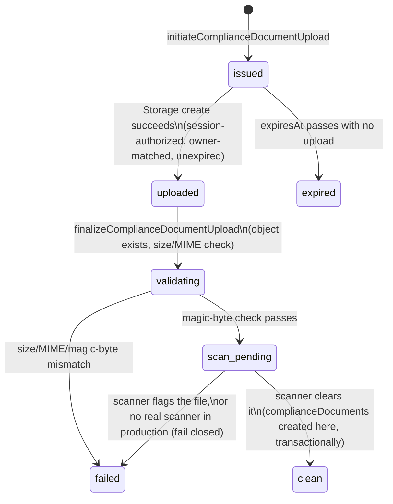
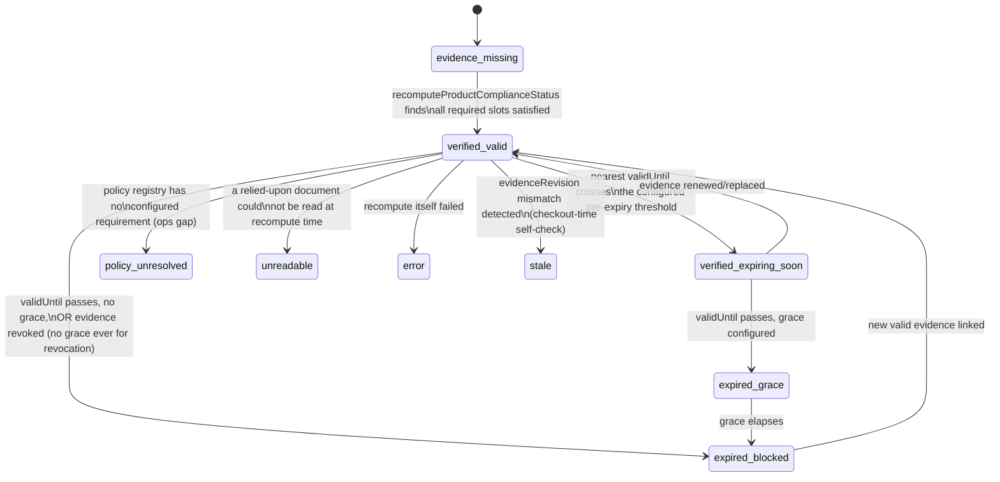

<!-- PLANNING DOCUMENT ONLY. No application code, Rules, indexes, Functions, or
     Flutter code were written to produce this plan. Nothing described here has
     been implemented or deployed. Revision 2 of this plan — corrects 10
     consistency defects found on review; see the change log in §0. -->

# Petsupo Marketplace P1-A — Compliance & Review Foundation: Implementation Plan (Revision 2)

**Date:** 2026-08-21
**Baseline:** branch `integration/mac-windows-2026-07-22`, HEAD `f2048cf25681d714ba562037604116ec42a80101` ("Fix server-owned product field protection (P0.1)"), parent `9238a528fcd267b6d24b3a589e94c93939d1cf3e` (P0). Working tree clean, upstream in sync, no deployment performed.
**Source architecture:** `docs/audits/marketplace_p1_bulk_compliance_inventory_architecture_2026-08-21.md` (Revision 3, with one field-level cross-reference addendum pointing back to this plan — see that document's status box).
**Status:** PLAN ONLY. Nothing in this document has been implemented, staged, committed, deployed, or pushed.

---

## 0. Change log — what this revision corrects and why

| # | Defect in the prior plan | Fix |
|---|---|---|
| 1 | `complianceDocuments.storagePath` was marked required, but "set only by finalize" — an unresolved required-field-before-existence contradiction | New `complianceUploadSessions` collection owns the entire pre-existence upload/validate/scan lifecycle; `complianceDocuments` is only ever *created* once a session reaches `clean`, so `storagePath` is genuinely always present the instant the document exists |
| 2 | `complianceDocuments` carried `normalizedBrandId`/`supplierId`/`categoryId`/`familyId` as single-value fields, silently representing only one of a document's possibly-several scopes | Removed from `complianceDocuments` entirely; scope identity lives only in `complianceDocumentScopes` |
| 3 | No slice explicitly forbade deploying a Storage upload-create rule before the server lifecycle that tracks it existed | Slice boundaries corrected so the Storage create rule and the upload-session function are one deployed unit; no intermediate deployed state permits untracked owner uploads |
| 4 | The plan asserted "Slice 3 depends on Slice 2" in one table and "Slices 1 and 3 can begin immediately" in the verdict — directly contradictory | Slice numbering and the dependency graph rebuilt consistently (§17) |
| 5 | Approval/checkout eligibility was phrased as a negative check (`!= evidence_missing`), which fails open for any *new*, unenumerated status | Replaced with a positive allowlist (`in ['verified_valid','verified_expiring_soon']`) and every other status explicitly enumerated as fail-closed |
| 6 | Checkout's compliance check implicitly scanned `productEvidenceLinks`, an unbounded set | New bounded `productComplianceDecisions/{productId}` record, capped at 10 active evidence references, is what checkout actually reads |
| 7 | `validUntil: null` was treated as globally "never expires" | Now policy-dependent per `documentType`, via an extended `compliancePolicyRegistry`; unresolved policy fails closed (defaults to requiring `validUntil`) |
| 8 | Malware-scanning/legal-mapping "open decisions" were framed as blocking all related work, when they only block specific transitions | Reclassified: foundation code (scanner interface, fake/test scanner, quarantine workflow, policy engine, placeholder policy) is buildable now; only production activation of real scanning/policy is blocked |
| 9 | `normalizedBrandId` via "lowercase, trim, strip punctuation" could collapse distinct brands | Versioned normalizer (Unicode normalization, locale-independent case folding, explicit `normalizerVersion`) for *candidate* matching only; an approved brand scope requires a separate, admin-verified `verifiedBrandId` before it's used to link evidence |
| 10 | Signed-URL expiry was given as "60–120s" with a vaguer revocation claim | Corrected to "maximum 5 minutes, recommended," with an explicit, unambiguous statement that revocation cannot invalidate an already-issued URL — only bounds future issuance |

---

## 1. Executive plan verdict

With all 10 corrections applied, the plan is internally consistent: every field has exactly one document of record, every slice's dependencies match its stated order, every compliance-eligibility check is a positive, fully-enumerated allowlist, and no unresolved product-owner/legal decision blocks anything beyond the specific production-activation step it actually gates. **Ready to commit as documentation.** Implementation itself remains gated on the same two named decisions as before (malware-scanning provider, Turkish legal evidence mapping) — but, per correction 8, only for the specific transitions those decisions govern, not for starting implementation work at all.

---

## 2. Confirmed baseline

Unchanged from the prior revision of this plan — branch `integration/mac-windows-2026-07-22`, HEAD `f2048cf25681d714ba562037604116ec42a80101`, P0 and P0.1 both present, working tree clean, upstream in sync, no deployment performed by any planning task to date.

---

## 3. Inclusion/exclusion matrix

Unchanged in substance from the prior revision — all 10 P1-A capabilities remain in scope, all P1-B/C/D items remain excluded (CSV/XLSX import, `channelConnections`/`externalListings`/`externalDemandHolds`/`externalPendingHold`, authority-transition execution, inventory event sync, reconciliation dashboard, M3/M5 flag changes, any deployment). `productReviewJobs` remains excluded from P1-A for the same reason as before (no real workload without P1-B's import volume); P1-A's admin review foundation is still served by scope-level approval with automatic recompute, not a job queue. Two items are **added** to the in-scope list, both required by this revision's corrections: `complianceUploadSessions` (correction 1) and `productComplianceDecisions` (correction 6) — both are P1-A-scoped mechanisms, not P1-B/C/D capability.

---

## 4. Exact P1-A data schemas

### `businessInventoryPolicies/{businessId}`

Unchanged from the prior revision of this plan (onboarding-default record only; see that revision's full field table — reproduced here for completeness).

| Field | Type | Required | Writer | Mutable | Validation | Privacy |
|---|---|---|---|---|---|---|
| `businessId` | string (= doc ID) | yes | Onboarding callable | Immutable | = doc ID | Internal |
| `stockAuthorityType` | enum | yes | Onboarding callable (P1-A: `manual`/`petsupo` only reachable) | Immutable in P1-A | Enum | Internal |
| `authorityConnectionId` | string, nullable | no | P1-C only | Always `null` in P1-A | Must be null unless mode requires it (unreachable in P1-A) | Internal |
| `status` | enum | yes | Onboarding callable | Always `active` in P1-A | Enum | Internal |
| `defaultSafetyStock` | int ≥ 0 | yes | Onboarding + seller edit | Mutable (own business) | ≥ 0 | Internal |
| `version`, `updatedBy`, `updatedAt`, `effectiveAt` | int / uid / timestamp / timestamp | yes | Server only | Server-set | — | Internal |

### `complianceUploadSessions/{sessionId}` — NEW (correction 1)

The complete pre-document lifecycle. `sessionId` is server-generated at `initiateComplianceDocumentUpload` time; `documentId` is reserved (pre-generated) at the same moment but does **not** yet correspond to any `complianceDocuments` record.

| Field | Type | Required | Writer | Mutable | Validation | Index | Privacy | Retention |
|---|---|---|---|---|---|---|---|---|
| `businessId` | string | yes | Server, at creation | Immutable | `isBusinessOwner()` | `[businessId, status]` | Internal | See §13 |
| `documentId` | string | yes | Server, reserved at creation | Immutable | Not yet a real document | — | Internal | See §13 |
| `objectPath` | string | yes | Server | Immutable | = `compliance_docs/{businessId}/{documentId}/{objectId}` | — | Sensitive (not the file itself, but its path) | See §13 |
| `documentType`, `sellerRelationship` | enum, enum | yes | Server, from the caller's initiate request | Immutable | Enum membership; combination checked against `compliancePolicyRegistry` | — | Internal | See §13 |
| `allowedMimeTypes` | array of string | yes | Server, from §9's constant list | Immutable | Fixed set: `application/pdf`, `image/jpeg`, `image/png` | — | Internal | See §13 |
| `maxSizeBytes` | int | yes | Server, from configured default (§9) | Immutable | — | — | Internal | See §13 |
| `status` | enum: `issued\|uploaded\|validating\|scan_pending\|clean\|failed\|expired` | yes | Server, state machine §6.0 | Server-only | Must follow the defined transitions | `[status, expiresAt]` (orphan-cleanup query) | Internal | See §13 |
| `issuedBy` / `issuedAt` | uid / timestamp | yes | Server | Immutable | = caller uid, `request.time` | — | Internal | See §13 |
| `expiresAt` | timestamp | yes | Server, `issuedAt` + short window (proposed default 15 minutes, §20) | Immutable | — | See above | Internal | See §13 |
| `finalizedAt` | timestamp, nullable | no | Server, on `uploaded → validating` | Set once | — | — | Internal | See §13 |
| `contentHash` | string (sha256), nullable | no | Server, computed at finalize | Set once | 64-char hex | — | Internal | See §13 |
| `sizeBytes` | int, nullable | no | Server, read from live object metadata at finalize | Set once | ≤ `maxSizeBytes` | — | Internal | See §13 |
| `scanResultRef` | string, nullable | no | Server, scanner-result handler | Set once | — | — | Internal | See §13 |

### `complianceDocuments/{documentId}` — corrected (corrections 1, 2)

Created **only** by the scanner-result handler transitioning a session to `clean` — never before. `storagePath` is therefore always present the instant the document exists; no nullable-required-field state is ever observed. **`normalizedBrandId`/`supplierId`/`categoryId`/`familyId` are removed** — scope identity lives only in `complianceDocumentScopes` (correction 2).

| Field | Type | Required | Writer | Mutable | Validation | Index | Privacy |
|---|---|---|---|---|---|---|---|
| `businessId` | string | yes | Server, mirrored from the session | Immutable | `isBusinessOwner()` | `[businessId, status]` | Internal |
| `sessionId` | string | yes | Server | Immutable | Traceability back to the upload lifecycle | — | Internal |
| `documentType`, `sellerRelationship` | enum, enum | yes | Server, mirrored from the session | Immutable | — | `[businessId, documentType, status]` | Internal |
| `storagePath` | string | yes (always present at creation) | Server, mirrored from the session | Immutable | Matches `compliance_docs/{businessId}/{documentId}/*` | — | **Sensitive** |
| `originalFilename`, `contentHash`, `sizeBytes` | string, string, int | yes | Server, mirrored from the session | Immutable | — | — | Sensitive / Internal / Internal |
| `version`, `supersedesDocumentId`, `supersededByDocumentId` | int / nullable string / nullable string | yes / no / no | Server | Immutable / set once / set once | — | — | Internal |
| `issuedAt`, `validFrom`, `validUntil` | timestamp, nullable each | Conditionally required — see §7 | Seller-declared at submission | Immutable | Policy-dependent (§7); no global "null = never expires" default | `[status, validUntil]` | Internal |
| `status` | enum: `clean\|pending_review\|approved\|rejected\|revoked\|expired\|superseded` | yes | Server, state machine §6.1 | Server-only | — | `[businessId, status]` | Internal |
| `uploadedBy`, `uploadedAt`, `reviewedBy`, `reviewedAt`, `rejectionReason`, `infoRequestNote`, `revokedBy`/`revokedAt`/`revocationReason` | as before | as before | Server | as before | as before | — | Internal |

### `complianceDocumentScopes/{scopeId}` — corrected (correction 9)

Gains `verifiedBrandId` for `scopeType: 'brand'` scopes.

| Field | Type | Required | Writer | Mutable | Notes |
|---|---|---|---|---|---|
| `documentId`, `businessId`, `scopeType`, `scopeValue`, `memberCount`, `status`, `createdAt/By`, `reviewedBy/At` | as before | as before | as before | as before | Unchanged from the prior plan revision |
| `verifiedBrandId` | string, nullable | Required before a `brand`-type scope is match-eligible | **Admin only**, set during `reviewComplianceScope` | Set once, then immutable | The scope's `scopeValue`/derived `normalizedBrandId` is a *candidate* signal only; `verifiedBrandId` is the admin's explicit confirmation that this scope really corresponds to a specific brand identity, and is what evidence-linking actually matches against for brand scopes (§10) |

### `complianceDocumentScopes/{scopeId}/members/{memberId}` and `productEvidenceLinks/{linkId}` and `complianceReviewEvents/{eventId}`

Unchanged from the prior plan revision — deterministic full-SHA-256 member IDs with post-lookup `identifierValue` verification; `productEvidenceLinks` remains the full historical/candidate join table (its role is now explicitly *not* what checkout reads — see `productComplianceDecisions` below); `complianceReviewEvents` remains append-only with `targetType` covering `document|scope|scope_member_batch|product`.

### `compliancePolicyRegistry/{registryVersion}` — now fully schematized (was under-specified before; extended per correction 7)

| Field | Type | Required | Writer | Mutable | Notes |
|---|---|---|---|---|---|
| `sellerRelationship` | map, keyed by the 6 relationship enum values | yes | Admin/ops only, via a dedicated operation, never a raw client write | Immutable per version — a change is a new `registryVersion`, never an in-place edit | — |
| `sellerRelationship.<rel>.acceptedDocumentTypes` / `.requiredDocumentTypes` | array of enum | yes | Same | Same | As before |
| `sellerRelationship.<rel>.perDocumentTypePolicy.<type>.validUntilRequired` | bool | yes | Same | Same | **New (correction 7).** If `true`, a document of this type submitted without `validUntil` is rejected at `submitComplianceDocument`, not merely flagged later |
| `.maximumValidityPeriod` | duration, nullable | no | Same | Same | If set, `validUntil - issuedAt` (or `validFrom`) exceeding this is rejected at submission |
| `.acceptedScopeTypes` | array of enum | yes | Same | Same | Restricts which `scopeType`s a document of this type may be attached to |
| `.issueDateRequired` | bool | yes | Same | Same | Mirrors `validUntilRequired`'s enforcement shape |
| `.manualAdminOverridePermitted` | bool | yes | Same | Same | Whether an admin may approve a document that fails an automated policy check, with a recorded justification |
| `status` | enum: `draft\|active\|inactive` | yes | Admin/ops | Server-only | **Only one version may ever be `active`** (the "current" pointer production code reads); every other version is `draft` or `inactive`. A placeholder/test version used during implementation is created with `status: inactive` and is structurally incapable of being the version production code resolves to (correction 8) |
| `effectiveFrom`, `createdBy`, `createdAt`, `changeNote` | timestamp, uid, timestamp, string | yes | Admin/ops | Immutable | — |

### `productComplianceDecisions/{productId}` — NEW (correction 6)

The bounded, checkout-facing output of `recomputeProductComplianceStatus`. Doc ID = `productId`, so exactly one decision record exists per product (same one-doc-per-entity pattern as `businessInventoryPolicies`).

| Field | Type | Required | Writer | Notes |
|---|---|---|---|---|
| `businessId` | string | yes | Server | For ownership-scoped reads |
| `policyVersion` | string | yes | Server | The `compliancePolicyRegistry` version this decision was computed against; checkout re-verifies this still matches the *current* active version |
| `evidenceRevision` | int | yes | Server | Must match the product document's own `evidenceRevision` — a mismatch means the decision is stale relative to the product |
| `requiredEvidenceSlots` | array, max 5 entries | yes | Server | Each entry a small structured requirement (e.g. "one of: purchase_invoice, supplier_agreement, authorization_letter"), derived from the policy for this product's declared relationship/category |
| `satisfiedEvidenceSlots` | array, same shape, subset of required | yes | Server | Which required slots currently have valid, linked evidence |
| `activeEvidenceRefs` | array of `{documentId, scopeId, expiresAt}`, **capped at 10 entries** | yes | Server | The explicit bound requested — checkout re-verifies each of these (never more than 10), not an unbounded scan of `productEvidenceLinks` |
| `computedAt` | timestamp | yes | Server | — |
| `validUntil` | timestamp, nullable | no | Server | Earliest `validUntil` among `activeEvidenceRefs` |
| `effectiveStatus` | enum (§11's full positive-first enum) | yes | Server | Denormalized copy of the product's own `complianceEffectiveStatus`, kept alongside the supporting detail for checkout's own re-verification |
| `decisionHash` | string (sha256) | yes | Server | Digest of the canonical serialization of the fields above; checkout recomputes and compares as a final consistency signal |

**If more than 10 evidence links would otherwise apply to one product**, `recomputeProductComplianceStatus` selects the 10 with the soonest `validUntil` (the ones most operationally relevant to monitor) and records the truncation itself as a `complianceReviewEvents` entry for admin visibility — it does not silently drop the excess or fail the recompute. This bound is a proposed default (§20), not a hard architectural ceiling.

---

## 5. State machines

### 5.0 Upload session (NEW, correction 1)



Every transition, actor/operation/preconditions/writes/audit/notification/idempotency/forbidden, exactly as the prior plan revision's table format — restated for the two states that changed meaning:

| Transition | Actor | Operation | Preconditions | Writes | Idempotency | Forbidden |
|---|---|---|---|---|---|---|
| `issued → uploaded` | Seller (via Storage SDK) | Storage `create` (Rules-gated, no Cloud Function) | Session `status=='issued'`, unexpired, `objectPath` matches exactly, owner matches | Storage object only — no Firestore write here | Storage denies `update`/overwrite at this path unconditionally, so a second attempt is structurally impossible, not merely detected | Uploading to any path other than the session's exact `objectPath` |
| `scan_pending → clean` | System (scanner callback) | Scan-result handler | Scanner reports clean; session still `scan_pending` | `complianceUploadSessions.status`, **and, in the same transaction, creates `complianceDocuments/{documentId}`** via `transaction.create()` (fails if the doc somehow already exists — the idempotency backstop for correction 1's "multiple documents from one session" requirement) | Keyed by `sessionId:scanresult` | Creating `complianceDocuments` from a session not in `scan_pending`; creating it a second time for the same session |

### 5.1 Compliance document

Unchanged in shape from the prior plan revision, with the enum trimmed to `clean|pending_review|approved|rejected|revoked|expired|superseded` (no `uploaded`/`validating`/`scan_pending` — those are now purely session-level states, per correction 1). `submitComplianceDocument`'s preconditions gain the policy check from correction 7: if `compliancePolicyRegistry` (active version) requires `validUntil` for this `documentType` and it is absent, submission is rejected outright, not merely flagged for review.

> **Slice 3 implementation note (added during the Slice 3 correction pass, 2026-08-24).** An adversarial review of the merged-but-uncommitted Slice 3 code found a genuine tension between this paragraph (which states the policy check as an unqualified precondition of `submitComplianceDocument`, a Slice 3 file per §13) and §16's dependency graph (which gives Slice 3 "Depends on: Slice 2" only, with `compliancePolicyRegistry.js` — the artifact this check reads — assigned exclusively to Slice 4, which itself depends ON Slice 3). The plan never states that this precondition activates only once Slice 4 ships. Resolved, without touching Slice 3's own dependency graph or file boundary: **until Slice 4 supplies the real per-`documentType` registry lookup, `submitComplianceDocument` enforces §7's own already-documented safe default — `validUntilRequired: true` — universally, hardcoded, for every `documentType`**, rather than querying a registry that does not exist yet. This is the plan's own stated conservative fallback (§7: *"the mechanism fails toward requiring more evidence, not less, when unconfigured"*), applied directly instead of left unenforced. Slice 4 replaces this hardcoded universal rule with the real per-type lookup when `compliancePolicyRegistry.js` lands; it does not need to touch anything else in Slice 3's file. **Policy-driven `acceptedScopeTypes` matching (§4, the sibling field in the same `compliancePolicyRegistry` object) remains exclusively Slice 4's responsibility — no fallback for it is implemented, and none should be invented — which is precisely why Slice 3's callables are not independently deployment-complete: see the deployment-gate note below.**
>
> **Deployment gate.** Slice 3's callables (`submitComplianceDocument` and the other eight in `complianceDocumentOperations.js`) must NOT be independently deployed/activated in production ahead of Slice 4 unless the conservative universal `validUntil` requirement above remains enforced exactly as implemented. Deploying Slice 3 with that fallback removed or weakened before Slice 4's real registry is live reopens the exact fail-open gap this note exists to close: a document could reach `approved` permanently missing `validUntil`, since `issuedAt`/`validFrom`/`validUntil` are set once and immutable thereafter (§4), with no in-slice remediation path.

### 5.2–5.4 (scope, member, evidence link)

Unchanged, with 5.2's admin review step for `scopeType: 'brand'` now also requiring `verifiedBrandId` to be set before the scope transitions to `approved` (correction 9) — a brand scope cannot be approved without it.

> **Slice 3 implementation note (second correction pass, 2026-08-24) — pending members beneath a rejected parent scope.** This plan does not state what happens to a `pending_review` member when its parent scope is rejected; adversarial review of the Slice 3 implementation found that a single, decision-blind parent-status gate left such members permanently stranded (no legal transition at all — `approve` correctly stayed blocked, but so did `reject`). Rather than inventing cascade behavior this document does not specify, an explicit product decision resolves the gap narrowly: **`reviewComplianceScopeMembers`'s `approve` decision continues to require the parent scope be `pending_review` or `approved` — unchanged, a rejected parent can never produce an `active` member, without exception. Its `reject` decision additionally permits a `rejected` parent** — rejecting never grants trust, so a still-pending member may always be explicitly rejected rather than left stranded. No new state, transition, or automatic cascade is introduced: `pending_review → rejected` is already each member's own existing legal transition (§4); this decision only widens *when* it may be invoked, for `reject` only. Scope rejection itself (`reviewComplianceScope`) still never cascades to members automatically.

### 5.5 Product compliance — corrected enum (correction 5)



Full status table, requirement 5's explicit ask:

| Status | Meaning | Public visibility | Add to cart (new) | Reservation | Payment confirmation |
|---|---|---|---|---|---|
| `verified_valid` | All required evidence present, approved, unexpired | ✓ | ✓ | ✓ | ✓ |
| `verified_expiring_soon` | Same, within the pre-expiry notice window (still currently valid) | ✓ | ✓ | ✓ | ✓ |
| `expired_grace` | Past `validUntil`, within a configured, separately-approved UI grace window | ✓ (if grace configured) | ✓ | ✗ | ✗ |
| `expired_blocked` | Past `validUntil` with no grace, or grace elapsed | ✗ | ✗ | ✗ | ✗ |
| `revoked` | Evidence explicitly revoked — no grace, ever | ✗ | ✗ | ✗ | ✗ |
| `rejected` | Document/scope reviewed and rejected | ✗ | ✗ | ✗ | ✗ |
| `policy_unresolved` | No configured policy for this product's relationship/category — an ops gap, not the seller's fault | ✗ | ✗ | ✗ | ✗ |
| `unreadable` | A relied-upon document could not be read (transient error, permission issue, dangling link) | ✗ | ✗ | ✗ | ✗ |
| `evidence_missing` | No evidence links exist at all | ✗ | ✗ | ✗ | ✗ |
| `calculating` | Transiently observed mid-recompute by a live check (rare — recompute is transactional, so a product's own committed field never actually rests here) | ✗ | ✗ | ✗ | ✗ |
| `stale` | Checkout-time self-check found `evidenceRevision` mismatch | ✗ | ✗ | ✗ | ✗ |
| `error` | The recompute function itself failed (operational alert, not a normal state) | ✗ | ✗ | ✗ | ✗ |
| `unknown` | Defensive catch-all for uninitialized/corrupted state — should never occur for a P1-A-era product | ✗ | ✗ | ✗ | ✗ |

**The positive allowlist used everywhere an eligibility check is needed:** `complianceEffectiveStatus in ['verified_valid', 'verified_expiring_soon']` — for product approval eligibility, for the public-read Rule's third condition, and for checkout's fast-path check (always followed by the bounded real-time re-verification, §11). Every status not in this list fails closed, by construction of the allowlist rather than by remembering to exclude each one.

### 5.6–5.8

Unchanged from the prior plan revision.

---

## 6. Trust boundaries

Unchanged from the prior plan revision, with one addition: **the scanner-result handler and the orphan-cleanup scheduler are System-only, exactly like `recomputeProductComplianceStatus`** — never directly invocable by a seller or admin request, since both mutate `complianceUploadSessions`/Storage objects in ways that must remain a single, trusted code path.

---

## 7. Seller relationship and evidence policy — extended (correction 7)

The registry design from the prior plan revision (a versioned, seller-uneditable mapping) is unchanged in *mechanism*. What's corrected: `validUntil` handling is no longer a blanket "null = never expires" default anywhere in the system — it is **policy-dependent per `documentType`**, read from `compliancePolicyRegistry.sellerRelationship.<rel>.perDocumentTypePolicy.<type>.validUntilRequired`. `submitComplianceDocument` enforces this at submission time (§5.1): a document of a type the active policy marks `validUntilRequired: true` cannot be submitted for review without a `validUntil` value.

**Fail-closed default for unresolved policy content:** until the real Turkish-legal-informed values are set, the placeholder registry (§4, `status: inactive`) is *not* usable in production at all (correction 8) — but the *test/emulator* placeholder used to exercise this mechanism during implementation defaults every `perDocumentTypePolicy` entry to `validUntilRequired: true`, the conservative, safer default, rather than `false`. This document does not assert what the real Turkish legal requirement is — only that the mechanism fails toward requiring more evidence, not less, when unconfigured.

> **Slice 3 implementation note (2026-08-24):** this section's own stated conservative default (`validUntilRequired: true`) is what Slice 3 implements directly, hardcoded and universal, in the window before Slice 4's real registry exists — see the fuller note and deployment gate at §5.1.

---

## 8. Server operations — corrected for the upload-session split (correction 1)

| Operation | Change from prior revision |
|---|---|
| `initiateComplianceDocumentUpload` | Now creates a `complianceUploadSessions` document (not `complianceDocuments`). Reserves `documentId` and `objectPath`, returns them to the client for the direct Storage upload |
| *(Storage upload itself)* | Not a Cloud Function — a direct client→Storage write, gated entirely by the Storage Rule described in §9 |
| `finalizeComplianceDocumentUpload` | Validates the now-uploaded object (existence, size, declared MIME, magic bytes), computes `contentHash`, advances the session `uploaded → validating → scan_pending`. Still creates nothing in `complianceDocuments` |
| **`handleComplianceScanResult`** (new, replaces the implicit "scanner clears it" step) | System-only, invoked by the scanner integration (or, in test/emulator environments only, a fake scanner). On `clean`: creates `complianceDocuments` transactionally, using `transaction.create()` keyed by the reserved `documentId` (idempotency backstop). On a flagged result: session `→ failed`, no document ever created |
| **`complianceUploadOrphanCleanup`** (new, scheduled) | Deletes sessions past `expiresAt` that never reached `uploaded`, and sessions/objects stuck before `clean` past a bounded retention window (proposed 7 days) — deletes the orphaned Storage object first, then the session document, in that order, so a crash mid-cleanup never leaves a session pointing at a deleted-but-still-referenced object |
| `submitComplianceDocument` | Unchanged shape; gains the policy-driven `validUntil` requirement check (§7) |
| `addComplianceScope`, `addComplianceScopeMembers`, `reviewComplianceScopeMembers` | Unchanged |
| `reviewComplianceScope` | Gains: for `scopeType:'brand'`, requires the admin to supply `verifiedBrandId` as part of an `approve` decision; `approve` is rejected without it (correction 9) |
| `requestComplianceInformation`, `revokeComplianceDocument`, `supersedeComplianceDocument` | Unchanged |
| `issueComplianceDocumentAccess` | Expiry corrected to a maximum of 5 minutes (was 60–120s as a range; now stated as an explicit ceiling, §10 of this section's cross-reference to the Storage plan) |
| `recomputeProductComplianceStatus` | Now additionally writes `productComplianceDecisions/{productId}` (bounded to 10 `activeEvidenceRefs`) in the same transaction as the product's own denormalized fields — not a separate, later step |
| `complianceDocumentExpiryScheduler` | Unchanged |

No generic unrestricted compliance-update endpoint exists in this list, unchanged from the prior revision.

---

## 9. Rules and Storage plan — corrected deployment boundary (correction 3)

### Firestore posture

Unchanged in shape from the prior revision, extended to the two new collections:

| Collection | Seller read | Seller write | Admin | Public |
|---|---|---|---|---|
| `complianceUploadSessions` | Own only | None (all via server operations) | All | None |
| `productComplianceDecisions` | Own products' decisions | None (system-only writer) | All | None |
| `compliancePolicyRegistry` | **None** (server-internal read only, via an admin-facing operation — sellers must not see which evidence gaps exist to exploit them) | None | Admin-only display via a dedicated read path, write via a dedicated operation, never a raw Firestore write | None |

> **Slice 1 implementation note (added during Slice 1, 2026-08-21).** Writing the actual Rules text forced two clarifications this table left implicit:
> 1. **`complianceUploadSessions`, `complianceDocuments`, and `complianceReviewEvents` defer owner (seller) read to a later slice**, even though this table's "Own only" language could be read as authorizing it now. Each of these three mixes fields safe for the owning business to see with fields that are not (`storagePath`/`contentHash`/`scanResultRef` on sessions and documents; free-text admin `notes` on review events) — and because Firestore reads are document-level, not field-level, a blanket owner-read rule would expose all of them together. Slice 1 keeps these three admin-only via Rules; a seller-safe, server-mediated projection (omitting the sensitive fields) is left for the slice that builds the UI actually consuming it, so that projection is designed against a real need rather than guessed now.
> 2. **`compliancePolicyRegistry` is fully closed via Rules, admin included** — "Admin-only display via a dedicated read path" is implemented as no Rules-level read at all (`allow read, write: if false`), mirroring this codebase's existing `promotion_reconciliation_cases` precedent for sensitive, admin/server-only operational data. Admin's real access remains a future Admin-SDK-backed operation, not a raw client Firestore read, consistent with "never a raw Firestore write" applied symmetrically to reads.
>
> `businessInventoryPolicies`, `complianceDocumentScopes` (+ its `members` subcollection), and `productEvidenceLinks` carry no such mixed-sensitivity fields and remain owner-readable exactly as originally planned.

### Storage posture — the corrected deployment-boundary rule (correction 3)

**The Storage `create` rule for `compliance_docs/{businessId}/{documentId}/{objectId}` and the `initiateComplianceDocumentUpload`/session-validation server code are treated as one deployed security boundary — one is never deployed without the other already live.** Concretely:

```
allow create: if isSignedIn()
  && isBusinessOwner(businessId)
  && exists(/databases/$(database)/documents/complianceUploadSessions/$(???))
  // the session lookup must resolve the session by documentId (embedded in the
  // path) and verify: session.businessId == businessId, session.objectPath ==
  // this exact path, session.status == 'issued', session.expiresAt > request.time
  && <all of the above>;
allow update, delete: if false;   // create-only, forever — closes the overwrite/
                                    // race window at the Rules level itself,
                                    // independent of whether any Cloud Function
                                    // has run yet
allow read: if isBusinessOwner(businessId) || isAdmin();
```

This single rule, together with `finalizeComplianceDocumentUpload`'s independent server-side re-validation, is what prevents every item correction 1 named:
- **Arbitrary uploads without a session:** the `exists()`/field-match check is unconditional.
- **Overwriting:** `allow update, delete: if false` — Storage's own create-vs-update distinction means a second write to an already-populated path is an `update`, always denied, regardless of session state.
- **Path substitution:** the rule checks the session's own recorded `objectPath` against the actual path being written, not merely "some valid session exists somewhere."
- **Replaying an expired session:** `expiresAt > request.time`, checked in the Rule itself (not only server-side).
- **Finalizing another business's object:** re-checked independently in `finalizeComplianceDocumentUpload`.
- **Multiple documents from one session:** the Storage-level overwrite denial plus `complianceDocuments`'s `transaction.create()` idempotency backstop (§8).
- **Orphan files:** `complianceUploadOrphanCleanup` (§8), which must exist and be scheduled *before* this Storage rule is ever deployed to real sellers (see the slice order, §17) — a deployed upload path with no cleanup mechanism is exactly the "no intermediate deployed slice may permit owner uploads the server lifecycle cannot track" failure this correction exists to prevent.

Everything else in this section (magic-byte validation, quarantine state, malware-scanning blocker) is unchanged from the prior plan revision.

---

## 10. Evidence matching — corrected for brand verification (correction 9)

The bounded, ≤8-reads-per-product lookup table from the prior plan revision is unchanged in shape. What's corrected is the **brand** lookup specifically:

**Normalization, versioned (correction 9):** `normalizedBrandId = normalizerVersion + ':' + normalize(rawBrand)`, where `normalize()` performs Unicode NFKC normalization, locale-independent case folding (not a naive `.toLowerCase()`), whitespace collapsing/trimming, and a *documented, explicit* punctuation-stripping policy (not "strip all punctuation" blindly — some brand names use punctuation as part of their identity). `normalizerVersion` travels with the value; a future change to the normalization algorithm is a new version, never a silent reinterpretation of existing data. The original, un-normalized `brand` value is always retained (already true — unchanged).

**`normalizedBrandId` is a candidate-matching signal only.** It narrows *which* brand-type scopes might apply to a product. It is explicitly **not** what determines whether evidence actually links: a brand-type `complianceDocumentScopes` document only becomes match-eligible once an admin, during `reviewComplianceScope`, has independently confirmed the scope's real-world brand identity and stamped `verifiedBrandId` (§4) — the evidence-linking step in `recomputeProductComplianceStatus` compares the product's confirmed brand identity against `verifiedBrandId`, never against a bare normalized-string match alone. **No automatic merging occurs solely because two normalized strings happen to be equal** — a collision only ever produces a *candidate* for a human to confirm or reject, never an automatic link.

---

## 11. Product compliance and checkout enforcement — corrected (corrections 5, 6)

### Product fields

Unchanged set (`complianceEffectiveStatus`, `complianceValidUntil`, `evidenceRevision`, `complianceUpdatedAt`, `complianceReasonCode`), same P0.1-pattern ownership (closed schema, create-time omit/null-or-fixed-value, update-time diff-based unchanged-value check) as the prior revision. `complianceEffectiveStatus` now uses the full enum from §5.5.

### Enforcement surfaces, corrected

| Surface | Corrected behavior |
|---|---|
| Public listing eligibility | Read rule's third condition: `complianceEffectiveStatus in ['verified_valid','verified_expiring_soon']` (positive allowlist, was previously drafted as a negative check for the *approval* surface specifically — now consistently positive everywhere) |
| Approval eligibility | Admin approval requires `complianceEffectiveStatus in ['verified_valid','verified_expiring_soon']` — **corrected from the prior `!= 'evidence_missing'` check**, which would have fail-*opened* for any new status value added later (`policy_unresolved`, `unreadable`, etc. would all have incorrectly passed a bare `!=` check) |
| **Checkout-time revalidation — now reads the bounded decision, not an unbounded scan** | The checkout Cloud Function reads `productComplianceDecisions/{productId}` (one document, O(1)), then: (1) verifies `evidenceRevision` matches the live product's own value — a mismatch means the decision predates a compliance-relevant change, fail closed; (2) verifies `policyVersion` matches the *current* active `compliancePolicyRegistry` version — a mismatch means policy has moved on since this decision was computed, fail closed; (3) re-reads each of the (at most 10) `activeEvidenceRefs` directly from live `complianceDocuments`/scopes to confirm still `approved`/`clean`/unexpired — this bounded set of real-time reads is the actual load-bearing check, not the denormalized field; (4) recomputes `decisionHash` from the freshly-read state and compares against the stored value as a final consistency signal; (5) fails closed if `activeEvidenceRefs.length` exceeds the configured bound (a data-integrity anomaly, never silently truncated at checkout time — truncation only ever happens at recompute time, with an audit event, per §4) |
| Cart, expiry-between-cart-and-checkout, expiry-after-payment, already-paid orders, existing reservations, scheduler propagation delay, server-outage fail-closed behavior | Unchanged from the prior plan revision — all resolved by the same checkout-time-is-authoritative principle, now made concrete against a bounded record instead of an implied unbounded one |

**No new checkout may succeed when required evidence is expired, revoked, missing, unreadable, or cannot be verified — unchanged as the governing principle, now enforced against an explicitly bounded, explicitly re-verified record rather than an open-ended scan.**

---

## 12. Admin UI plan, notifications/expiry plan, retention plan

Unchanged from the prior plan revision in substance. Two field-name updates propagate through: `evidenceRevision` (not `complianceEvidenceRevision`, reconciled per the architecture-doc cross-reference note) and the expanded `complianceEffectiveStatus` enum (§5.5) wherever the admin UI or notification digests display status. Retention for `complianceUploadSessions` is added to the table: **7 days for sessions that never reach `clean`** (matches the orphan-cleanup window, §8); sessions that do reach `clean` are retained alongside their resulting `complianceDocuments` record's own retention posture (they become part of that document's provenance trail, not deleted independently).

---

## 13. Exact file plan — corrected for new files (correction 1, 6)

Additions to the prior plan revision's file list (same directory conventions, same dependency-ordering principle):

| # | File | Purpose | Depends on |
|---|---|---|---|
| New | `functions/src/marketplace/compliance/complianceUploadSessions.js` | `initiateComplianceDocumentUpload`, `finalizeComplianceDocumentUpload`, `complianceUploadOrphanCleanup` | `complianceConstants.js` |
| New | `functions/src/marketplace/compliance/complianceScannerInterface.js` | Scanner interface + `handleComplianceScanResult`; a fake/stub scanner implementation used **only** by tests and the emulator, never wired into any production code path | `complianceUploadSessions.js` |
| Modified | `functions/src/marketplace/compliance/complianceDocumentOperations.js` | `submitComplianceDocument` (now created only after the session's `clean` transition; gains the §7 policy check), review/revoke/supersede operations unchanged | `complianceScannerInterface.js` |
| Modified | `functions/src/marketplace/compliance/complianceMatching.js` | `recomputeProductComplianceStatus` now also computes and writes `productComplianceDecisions` (bounded, capped at 10 refs); brand matching now two-step (candidate normalization + `verifiedBrandId` confirmation) | `complianceDocumentOperations.js`, `complianceScopeOperations.js` |
| New | `functions/src/marketplace/compliance/compliancePolicyRegistry.js` (was listed before but under-specified) | Full registry schema (§4), including the placeholder/`inactive` version used in tests | `complianceConstants.js` |
| New | `functions/test/complianceUploadSessions.test.js`, `complianceScannerInterface.test.js`, `productComplianceDecisions.test.js` | Test coverage for the new mechanisms | Corresponding modules |

The remainder of the prior plan revision's 22-file list is unchanged; this is an additive correction, not a restructure.

---

## 14. Indexes — corrected additions (correction 1, 6)

Additions to the prior plan revision's 10-index list:

| # | Collection | Fields | Query it serves | Verification status |
|---|---|---|---|---|
| 11 | `complianceUploadSessions` | `[status, expiresAt]` | Orphan-cleanup scheduler's query for stuck/expired sessions | **Required** — inequality (`expiresAt`) combined with equality (`status`) always needs a composite |
| 12 | `complianceUploadSessions` | `[businessId, status]` | Seller's own in-progress upload list | Verification pending (may be auto-indexed) |
| 13 | `productComplianceDecisions` | `[businessId, effectiveStatus]` | Admin's "which of this business's products are non-compliant" view | Verification pending — not required for checkout itself (which is a point read by `productId`), only for this admin convenience view; may be deferred if that view isn't built in P1-A's admin UI slice |

No duplicate/conflict with any existing index, verified by name — none targets these two new collections.

---

## 15. Test plan

Unchanged in structure from the prior plan revision, with corrections-specific additions: upload-session Rules tests (owner/session/path/expiry matrix from §9); orphan-cleanup tests (session past `expiresAt` is cleaned up, a session mid-scan is not prematurely cleaned); scanner-interface tests (fake scanner in test/emulator only, explicit test proving production code path never resolves to the fake scanner); `productComplianceDecisions` bound tests (11+ candidate evidence links truncated to 10 with an audit event, never silently dropped without one); positive-allowlist tests (every non-`verified_valid`/`verified_expiring_soon` status individually proven to fail closed for approval and checkout, not just the previously-tested `evidence_missing` case); `verifiedBrandId` tests (a brand scope cannot reach `approved` without it; two normalized-identical-but-distinct brands do not silently share evidence).

---

## 16. Implementation slices — corrected dependency graph (correction 4)

```
Slice 1 ──> Slice 2 ─┬─> Slice 3 ──> Slice 4 ──> Slice 5
                     │
                     └─> (Storage create rule deploys together
                          with Slice 2's session function — one
                          boundary, never split)

Slice 6 (independent — Dart model classes need only the schema
          definitions already fixed in §4 of this document; no
          import, build, or test dependency on Slice 1's Rules,
          indexes, or JS constants file)
          ──> Slice 7 ──> Slice 8
```

| Slice | Contents | Depends on | Leaves buildable? | GO/NO-GO gate |
|---|---|---|---|---|
| **1** | Pure schemas/models/constants (`complianceConstants.js`); Firestore Rules for all new collections, **deny-by-default / server-only** (no seller Storage upload path exists yet); indexes; test scaffolding | P0.1 (`f2048cf`) | Yes | All Rules tests pass; no collection permits any client write yet except the narrow onboarding op |
| **2** | `complianceUploadSessions` + `complianceScannerInterface` (fake scanner for tests only) + `finalizeComplianceDocumentUpload` + `complianceUploadOrphanCleanup` + `issueComplianceDocumentAccess` (with its own audit-log write) + **the Storage create rule, deployed as one unit with this slice's functions, never before** | Slice 1 | Yes | Full session state machine (§5.0) tested; orphan cleanup proven; **no document can reach `clean` in this slice's own test suite except via the explicitly-fake, test-only scanner** — production scanner wiring is a separate, later activation, not part of this slice's code |
| **3** | `complianceDocumentOperations.js` (document/scope/member lifecycle: submit, review, request-info, revoke, supersede) | Slice 2 (a real, `clean` document must exist to submit/review) | Yes | Document/scope/member state machines (§5.1–5.3) fully tested against sessions produced by Slice 2's fake scanner |
| **4** | `compliancePolicyRegistry.js` (full schema, placeholder `inactive` version) + `complianceMatching.js` (bounded lookup, `recomputeProductComplianceStatus`, `productComplianceDecisions`) + the 5 new product fields + their Rules | Slice 3 | Yes | Field-injection tests (mirroring the 44 P0.1 tests) pass; bounded-lookup read-count test confirms ≤8 reads/product; decision-record cap test confirms ≤10 refs with audit-on-truncation |
| **5** | `complianceDocumentExpiryScheduler.js` + checkout-time revalidation against `productComplianceDecisions` | Slice 4 | Yes | Checkout fail-closed proven under simulated read failure, stale-revision mismatch, and policy-version mismatch |
| **6** | Dart models (`compliance_document.dart`, `product.dart` additions) | None — reads only the schema definitions in §4 of this document; no code, Rules, index, or constants-file dependency on Slice 1 or any other slice | Yes | Model round-trip tests pass |
| **7** | Seller-facing upload/scope UI | Slices 2, 3, 6 | Yes | Manual smoke test against emulator, using the fake scanner |
| **8** | Admin review UI, `ModerationTargetType` extension | Slice 7 | Yes | Admin completes one full document → scope → product-recompute → decision cycle end to end against the emulator |

**This replaces the prior revision's contradictory claim that "Slices 1 and 3 can begin immediately" while also stating Slice 3 depends on Slice 2** — the corrected graph makes explicit that exactly two slices have no prior-slice dependency, for two different reasons: **Slice 1** because it is the first slice; **Slice 6** because Dart model classes have no code, build, or test dependency on any other slice's artifacts — they depend only on the schema definitions §4 of this document already fixes. Every other slice (2 through 5, and 7, 8) is linearly gated as shown.

---

## 17. Deployment order for a later authorized phase (not authorized now)

Corrected to reflect §9's boundary rule: Slice 1's Rules/indexes deploy alone first (deny-by-default, no functional risk since nothing can write to the new collections yet). **Slice 2's Storage create rule and its session-management functions deploy together, in the same release, never split across two deployments** — this is the one deployment-order rule this correction pass adds that didn't exist before. Slices 3–5's functions deploy narrowly, each after the prior slice has baked. The expiry scheduler's Cloud Scheduler trigger remains a separate activation step from deploying its code. Flutter/UI ships last. **The real malware-scanning provider and the real, `active`-status compliance policy are each a separate, explicit activation step, gated on the two named open decisions (§20) — deploying Slice 2's code does not itself activate real scanning, and deploying Slice 4's code does not itself activate a real policy version.** None of this is authorized by this document.

---

## 18. Rollback strategy

Unchanged in substance from the prior plan revision — every slice is an independent, revertible commit; P1-A introduces only new collections and additive product fields, so a pre-real-data rollback is a pure code/rules revert. The upload-session split (correction 1) makes this *safer*, not riskier: because `complianceDocuments` is never created until a session reaches `clean`, an aborted or rolled-back Slice 2 deployment leaves at most orphaned `complianceUploadSessions` records and Storage objects (cleaned up by the same orphan-cleanup mechanism that handles the ordinary case) — never a half-formed `complianceDocuments` record with a dangling or missing `storagePath`.

---

## 19. Open decision table — corrected blocker classification (correction 8)

| Decision | What it does NOT block | What it DOES block | Blocks planning? | Blocks implementation? | Blocks deployment? |
|---|---|---|---|---|---|
| Malware-scanning provider | Writing `complianceScannerInterface.js`, the fake/test scanner, the entire quarantine state machine, Slices 1–8's code | A real document ever reaching `clean` **in production** — the fake scanner is structurally confined to test/emulator use and cannot be the production code path (§9) | No | **Only for production activation of Slice 2's live scanning path** — the slice's code, including its full test suite, can be written and merged now | Yes |
| Turkish legal evidence mapping (exact content) | Writing `compliancePolicyRegistry.js`'s engine, its `inactive` placeholder version, every operation that reads "the active version" | A real `active` registry version — the mechanism enforces that only one version is ever `active`, and no placeholder can occupy that status | No | **Only for the specific real-policy content**, not the registry mechanism itself, which can be built and tested against the placeholder now | Yes |
| Upload session expiry window (proposed 15 min) | Any implementation work | — | No | No — has a stated default | No |
| Orphan-cleanup retention window (proposed 7 days) | Any implementation work | — | No | No | No |
| Signed-URL max expiry (now fixed: 5 minutes, per correction 10) | — | — | No | No — resolved by this correction | No |
| `activeEvidenceRefs` cap (proposed 10) | Any implementation work | — | No | No — has a stated default, tunable later | No |
| PDF preview method | — | Only the specific admin-UI polish in Slice 8 | No | No — a "download to view" fallback covers Slice 8's gate | No |
| Retention periods (rejected/revoked/expired evidence exact windows) | — | — | No | No — defaults stated | Before real data accumulates |
| Grace-period exact day count (the *rule* — zero grace for checkout — is fixed) | — | — | No | No | No |
| Normalized identifier algorithm exact punctuation policy | — | Only fine-tuning of candidate-match precision, never correctness (since `verifiedBrandId` is the actual gate, correction 9) | No | No | No |
| Rate/size limits for upload operations | — | — | No | No — conservative placeholder ships first | No |

**Corrected framing, stated once:** every "open decision" in this table has a name, a default, and an explicit answer to "what does it actually block" — none of them is phrased as blocking the plan's completeness, and only two (malware scanning, legal mapping) block anything beyond a documented placeholder/default, and even those two block only the specific production-activation step named, not the code that surrounds it.

---

## 20. Final GO/NO-GO for beginning P1-A implementation

**GO**, with the same two named production-activation gates as before, now precisely scoped: Slices 1, 2 (including its full fake-scanner-backed test suite), 3, 4, 5, 6, 7, and 8 can all be **written, tested, and merged** without either the malware-scanning provider or the real Turkish legal policy content being resolved — those two decisions gate only the specific moment a real document reaches `clean` in production and the specific moment a non-placeholder policy version becomes `active`, both of which are deployment-phase concerns (§17), not implementation-phase ones. No code, Rules, indexes, Functions, or Flutter files have been modified to produce this correction pass — only the two Markdown files at `docs/audits/` and `docs/plans/` were touched, and nothing has been staged, committed, pushed, or deployed.
